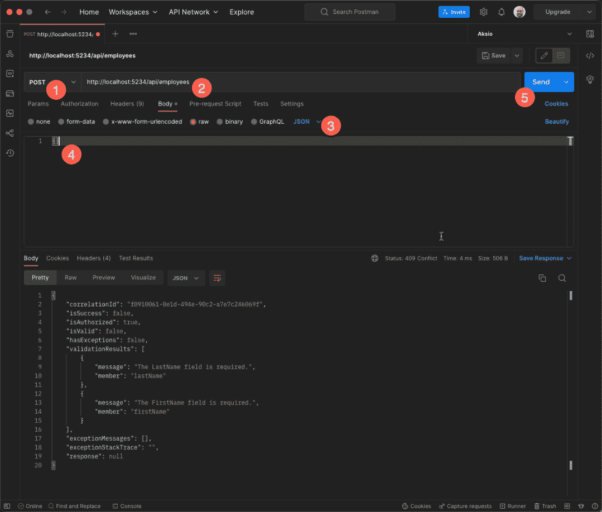
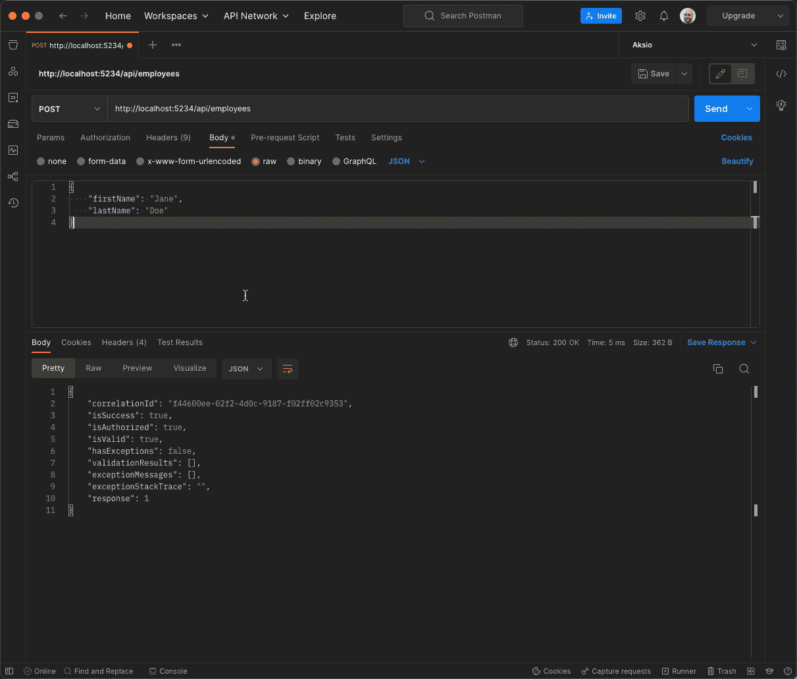
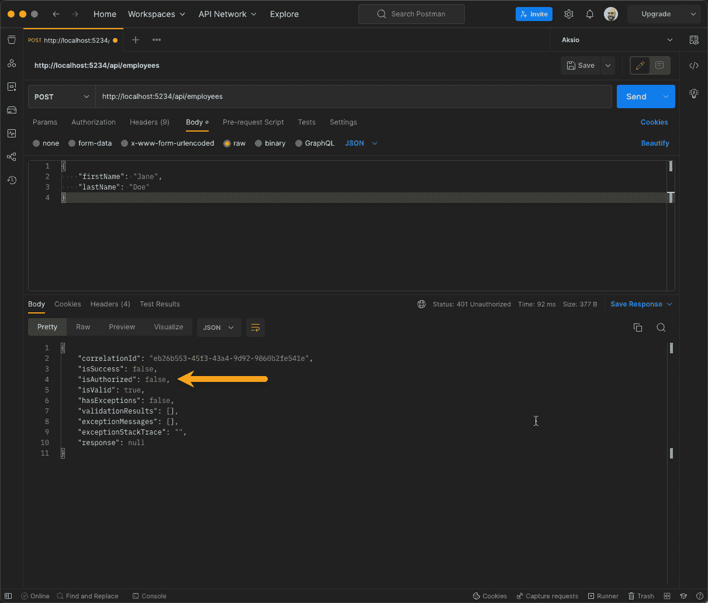
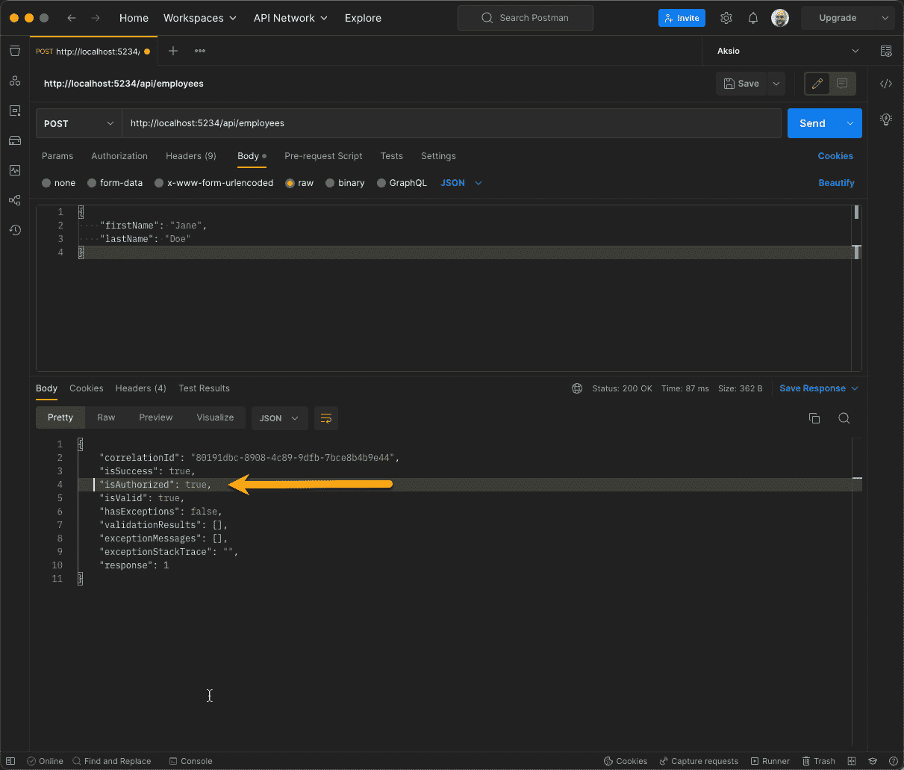

# 13

# 应用跨领域关注点

随着软件项目的演变，它们会获得一定的结构，如果团队有纪律，那么这种结构将保持一定的一致性。当团队人数增加时，您甚至可能会记录下这种结构。除了结构之外，您还可能有执行某些任务的方法，以及创建不同类型功能时需要执行的具体操作指南。为了全局所有权，您也可能将这些内容记录下来。

这就是跨领域关注点可以提供帮助的地方。在本章中，我们将探讨如何通过移除日常任务、提高一致性和降低风险来提高您作为开发者的生产力。我们还将探讨跨领域关注点如何提高您软件的可维护性。

本章我们将涵盖以下主题：

+   跨领域关注点是什么？

+   利用 ASP.NET 管道

+   基于元数据或结构的授权

# 技术要求

本章的特定源代码可以在 GitHub 上找到 ([`github.com/PacktPublishing/Metaprogramming-in-C-Sharp/tree/main/Chapter13`](https://github.com/PacktPublishing/Metaprogramming-in-C-Sharp/tree/main/Chapter13))，并且它建立在 GitHub 上可找到的**基础**代码之上 ([`github.com/PacktPublishing/Metaprogramming-in-C-Sharp/tree/main/Fundamentals`](https://github.com/PacktPublishing/Metaprogramming-in-C-Sharp/tree/main/Fundamentals))。

您需要使用 Postman ([`www.postman.com`](https://www.postman.com)) 来测试本章中创建的 API。

# 跨领域关注点是什么？

如章节引言所暗示的，您可能会发现自己处于一个项目中，其中有一些指南，无论是有形的还是无形的，都提供了如何做事的食谱。例如，为了编写执行应用程序中操作的**表示状态转移**（**REST**）API，您可能有一个定义好的清单，旨在帮助您记住要做什么：

+   检查授权

+   检查输入是否有效

+   检查操作是否符合业务规则

+   为操作添加日志

+   通过调用领域逻辑来执行操作

+   将结果从领域转换为 REST 消费可接受的格式

+   记得将调用领域的代码包裹在**try {} catch {}**中，并返回正确的错误信息

对于这些步骤中的每一个，都存在开发者可能会忘记的风险。这可能会带来风险，导致安全问题、数据一致性或其他问题。

个人而言，我非常热衷于自动化任何重复性工作。计算机在执行重复性任务方面非常出色，那么为什么不让人类专注于创造业务价值呢？

横切关注点基本上是那些一旦应用就持续存在的事情。一些横切关注点可以完全自动，一旦应用就不需要开发者进行额外干预，而其他则更具有可配置性和基于上下文。

记录可能是最典型的横切关注点的例子。例如，如果你知道在你的 ASP.NET 应用程序中，每次调用 Web API 控制器时应该添加什么到日志语句中，你可以通过添加一个操作过滤器非常容易地做到这一点。

我倾向于关注如何提高团队的生产力。考虑到这一点，你可以进行相当多的自动化操作。为了更好地理解这一点，我们可以用一个来自 ASP.NET Web APIs 的例子来说明。假设你正在构建一个包含前端的应用程序，并且需要为前端提供一个 API。通常情况下，你的领域逻辑不应该在 API 层，因为那只是一个传输机制。这里的一个机会是自动从领域层根据约定生成 API 层。这个约定可以从命名空间中推导出来，然后自动创建正确的路由。这将消除一个完整的层。

应用横切关注点的一个可能的优点是，你最终在实现中写的代码更少，在通常添加自动化的地方。从维护的角度来看，这也是一件好事。它使得维护变得更加容易。例如，如果你想改变系统的行为，而不是在多个地方进行更改，你只需在一个地方进行更改。

我最喜欢的横切关注点之一是确保 Web API 有一个一致的结果，并且不仅仅依赖于 HTTP 状态码，而是始终一致地向消费者提供有关调用的所有必要信息。

# 利用 ASP.NET 管道

REST API 基于 HTTP 标准。这个标准是一个协议标准，并不一定能够很好地反映当你执行操作时实际发生的情况。

实现这一点的其中一种方法是为所有 Web API 控制器操作创建一个通用的结果对象。但这样就会成为那些可能会被遗忘的食谱之一，并使解决方案处于不一致的状态。

拥有一个通用结果对象的想法无疑是可取的，但我们应该努力实现所有 Web API 调用自动返回它。然而，执行操作和获取数据之间有一个区别。基本上，在 HTTP 中，这就是不同动词的作用，HTTP GET 代表获取数据，而诸如 POST、PUT 或 DELETE 这样的动词代表你想要执行的操作。

这些类型的操作通常是你作为一个数据驱动应用程序中的数据库操作所执行的操作。你通常会使用相同的模型进行所有操作，你基本上只是在修改数据。

我支持由 Greg Young 提出的**命令查询责任分离**（**CQRS**）原则，该原则是 Bertrand Meyers 的**命令查询分离**（**CQS**）原则的进一步形式化（[`www.martinfowler.com/bliki/CQRS.html`](https://www.martinfowler.com/bliki/CQRS.html)），[`www.martinfowler.com/bliki/CommandQuerySeparation.html`](https://www.martinfowler.com/bliki/CommandQuerySeparation.html)）。

CQRS 原则挑战了将所有事物都视为**创建、读取、更新和删除**（**CRUD**）数据的一般方法。它侧重于显式地建模系统中的状态变化，并用**命令**表示改变意图，而检索数据则表示为**查询**。由于 CQRS 是 CQS 的演变，它还意味着命令代表状态的变化，不返回值，而查询返回值但不改变任何状态。

我们不会深入探讨 CQRS 或 CQS，但我们想利用命令的概念，并以此限制本章示例中我们想要支持的范围。这里的示例与 CQRS 无关，但作为它的支持者，我认为我会把它融入到对话中，希望它能激发一些好奇心……哈哈。

## 构建一致的返回对象

让我们构建一个简单的系统，该系统将员工注册作为一个 REST API。目标是提供所有执行命令的一致返回对象。在这个上下文中，我们将命令定义为对任何 Web API 控制器的 HTTP POST 调用。

首先创建一个名为**Chapter13**的文件夹。在命令行中切换到这个文件夹，并创建一个新的基于 Web 的项目：

```cs
dotnet new web
```

让我们利用在*技术要求*部分提到的 GitHub 仓库中的**基础知识**项目。你应该通过在终端执行以下操作为这一章添加对该项目的引用：

```cs
dotnet add reference ../Fundamentals/Fundamentals.csproj
```

我们将利用 ASP.NET Core 提供的**操作过滤器**这一构建块。在*第三章*，*通过现有现实世界示例去神秘化*中，我们提到了这个构建块，用于改变与验证相关的默认行为——这是一个跨切面关注点的良好示例。

在 ASP.NET Core 中，作为开发者的你，对 Web API 控制器的行为有 100%的灵活性。这意味着你决定向客户端返回什么，你也决定你是否真的关心验证结果。正如我们在*第三章*，*通过现有现实世界示例去神秘化*中所做的那样，我们将更加有见地，不让控制器的行为决定是否有效，而是以跨切面的方式处理这个问题。此外，我们还想以一种优雅的方式将其封装起来，以便消费者能够一致地获取结果。

在 **Chapter13** 中创建一个名为 **Commands** 的子文件夹。这是你创建必要基础设施的地方。

让我们从添加一个一致的验证结果表示开始。ASP.NET Core 有 **ModelError** 的概念；如果你愿意，可以直接使用它。但 **ModelError** 既可以表示 **Exception** 也可以表示验证错误。这些是不同的关注点，我个人希望将它们分开并使其更清晰。处于无效状态与处于异常的非恢复状态是不同的。

在 **Commands** 文件夹中添加一个名为 **ValidationResult.cs** 的文件。你可以使其看起来如下：

```cs
namespace Chapter13.Commands;
public record ValidationResult(string Message, string Member);
```

代码引入了一个名为 **ValidationResult** 的类型，该类型包含错误和错误对应的成员。由于成员在结果中明确，消费者可以将错误映射回它发送的对象。作为一个用户界面，这非常有用，因为你可以轻松地为无效的用户输入字段显示错误。

由于 ASP.NET Core 有其 **ModelError**，而你现在引入了一个仅表示验证结果的类型，你可能需要一个可以转换为你类型的工具。在 **Commands** 文件夹中添加一个名为 **ModelErrorExtensions.cs** 的文件，并使其看起来如下：

```cs
using Fundamentals;
using Microsoft.AspNetCore.Mvc.ModelBinding;
namespace Chapter13.Commands;
public static class ModelErrorExtensions
{
    public static ValidationResult ToValidationResult(this
      ModelError error, string member)
    {
        member = string.Join('.',
          member.Split('.').Select(_ => _.ToCamelCase()));
        return new ValidationResult(error.ErrorMessage,
          member);
    }
}
```

代码引入了一个针对 **ModelError** 类型的扩展方法，它接受一个特定的成员作为字符串以关联错误。默认情况下，ASP.NET Core 中的所有 JSON 序列化都将采用驼峰命名法；因此，代码将成员转换为驼峰命名法。它甚至支持通过点表示的导航路径来支持深层嵌套的成员，该路径在每个嵌套层级中用点表示。**ToCamelCase()** 方法调用来自之前引用的 **Fundamentals** 项目中的 **StringExtensions**。

## CommandResult

在有了验证表示之后，你现在可以创建所有操作或命令的通用结果类型。我们称之为 **CommandResult**。它将以结构化的方式封装 API 调用的所有不同方面。为此，在 **Commands** 文件夹中添加一个名为 **CommandResult.cs** 的文件，并使其看起来如下：

```cs
namespace Chapter13.Commands;
public class CommandResult
{
    public Guid CorrelationId { get; init; }
    public bool IsSuccess => IsAuthorized && IsValid &&
      !HasExceptions;
    public bool IsAuthorized { get; init; } = true;
    public bool IsValid => !ValidationResults.Any();
    public bool HasExceptions => ExceptionMessages.Any();
    public IEnumerable<ValidationResult> ValidationResults
      {get; init;} = Enumerable.Empty<ValidationResult>();
    public IEnumerable<string> ExceptionMessages { get;
      init; } = Enumerable.Empty<string>();
    public string ExceptionStackTrace { get; init; } =
      string.Empty;
    public object? Response { get; init; }
}
```

代码中引入了一个名为 **CommandResult** 的类型，该类型包含与验证结果相关的具体信息以及是否发生了可能出现的异常。此外，它还包含一些属性，允许你轻松地判断结果是否代表成功。如果结果不是成功，你可以深入了解它是否与授权、有效性或异常有关。它还引入了 **CorrelationId** 属性，该属性用于标识已执行的调用，并可用于在日志或跟踪系统中回溯，以了解是否发生了异常以及原因。

在正式的 **CommandResult** 就位后，你需要一些可以生成这种结果的东西。这正是 ASP.NET Core 动作过滤器机制发挥作用的地方。

将名为**CommandActionFilter.cs**的文件添加到**Commands**文件夹中，并使其看起来如下：

```cs
using Microsoft.AspNetCore.Mvc;
using Microsoft.AspNetCore.Mvc.Filters;
namespace Chapter13.Commands;
public class CommandActionFilter : IAsyncActionFilter
{
    public async Task OnActionExecutionAsync(
      ActionExecutingContext context,
      ActionExecutionDelegate next)
    {
        if (context.HttpContext.Request.Method ==
          HttpMethod.Post.Method)
        {
        }
        else
        {
            await next();
        }
    }
}
```

代码通过实现**IAsyncActionFilter**接口提供了一个裸骨动作过滤器。动作过滤器只对 HTTP POST 方法感兴趣，如前所述，其余实现将在该子句中完成。如果不是 HTTP POST 方法，它将使用**next()**方法将请求转发到下一个中间件。

让我们开始填补空白。在 HTTP POST 方法子句的作用域内，添加以下代码：

```cs
var exceptionMessages = new List<string>();
var exceptionStackTrace = string.Empty;
ActionExecutedContext? result = null;
object? response = null;
if (context.ModelState.IsValid)
{
    result = await next();
    if (result.Exception is not null)
    {
        var exception = result.Exception;
        exceptionStackTrace = exception.StackTrace;
        do
        {
            exceptionMessages.Add(exception.Message);
            exception = exception.InnerException;
        }
        while (exception is not null);
        result.Exception = null!;
    }
    if (result.Result is ObjectResult objectResult)
    {
        response = objectResult.Value;
    }
}
```

代码处理**ModelState**是否有效，这意味着所有验证器都已成功运行，因此没有报告任何无效内容。这可能意味着以下两种情况之一：

+   有异常

+   一切正常，操作已执行

在**IsValid**子句中，代码调用**next()**，这会调用 ASP.NET Core 管道的其余部分，最终调用 Web API 控制器操作。**result**对象是**ActionExecutedContext**类型，它包含有关对操作调用的信息。在其上，你可以找到**Exception**和**Result**。如果有异常，代码会递归地通过每个异常的**InnerException**来展开所有消息，然后重置**result**对象上的**Exception**属性为**null**，以避免 ASP.NET Core 默认输出异常。如果没有异常，代码会尝试捕获操作的实际结果，如果它是来自操作的**ObjectResult**。

重要提示

尽管我们说命令应该只执行状态更改而不返回结果，但有时你需要向客户端返回某些内容。这可能很重要，例如创建的对象的键，然后可以直接由消费者利用。

接下来你需要做的是创建一个**CommandResult**实例并填充验证结果和异常。在之前的代码之后添加以下代码：

```cs
var commandResult = new CommandResult
{
    CorrelationId = Guid.NewGuid(),
    ValidationResults = context.ModelState.SelectMany(_ =>
      _.Value!.Errors.Select(e => e.ToValidationResult(
      _.Key))),
    ExceptionMessages = exceptionMessages.ToArray(),
    ExceptionStackTrace = exceptionStackTrace ??
      string.Empty,
    Response = response
};
```

代码创建了一个**CommandResult**类型的实例，并设置了其上的属性。**CorrelationId**生成一个新的**Guid**，**ValidationResults**使用你之前放入的扩展方法从**ModelState**派生，**ExceptionMessages**来自你放入的展开异常的代码。然后，如果有任何或如果没有，它将**ExceptionStackTrace**放入其中，或者只是**string.Empty**。最后，如果有的话，它将控制器操作的响应直接转发。

尽管你现在已经将结果封装在更易于阅读和一致的消费者中，但设置正确的 HTTP 状态码仍然是良好的实践。在**CommandResult**实例化之后添加以下代码：

```cs
if (!commandResult.IsAuthorized)
{
    context.HttpContext.Response.StatusCode = 401;
}
else if (!commandResult.IsValid)
{
    context.HttpContext.Response.StatusCode = 409;
}
else if (commandResult.HasExceptions)
{
    context.HttpContext.Response.StatusCode = 500;
}
```

代码表示，当我们未授权时，是 HTTP **401**状态码，如果无效，则是**409**状态码，如果有异常，则是**500**。

为了使 **CommandResult** 成为实际输出的结果，如果你被有效授权，你需要在 **ActionExecutedContext** 上显式设置 **Result** 属性，或者直接在 **ActionExecutingContext** 上设置，这是作为动作过滤器方法第一个参数传递的。在之前的代码块之后添加以下代码：

```cs
var actualResult = new ObjectResult(commandResult);
if (result is not null)
{
    result.Result = actualResult;
}
else
{
    context.Result = actualResult;
}
```

代码创建了一个新的 **ObjectResult**，内容为 **CommandResult**，并将其设置在 **ActionExecutedContext** 对象或 **ActionExecutingContext** 上。这将保证无论你是否调用了控制器动作，你都能得到相同结构的结果。

让我们创建一个具体的示例，将使用这个新改进的管道。在 **Chapter13** 项目的根目录下添加一个名为 **Employee.cs** 的文件，并使其看起来如下：

```cs
using System.ComponentModel.DataAnnotations;
namespace Chapter13;
public record Employee(
    [Required]
    string FirstName,
    [Required]
    string LastName);
```

代码引入了一个表示员工的 **record** 类型，它只有两个属性：**FirstName** 和 **LastName**。它指示这些属性都是必需的，通过利用 **[Required]** 属性来实现。

为了使 API 工作，你需要一个控制器。在 **Chapter13** 项目的根目录下添加一个名为 **EmployeesController** 的文件，并使其看起来如下：

```cs
using Microsoft.AspNetCore.Mvc;
namespace Chapter13;
[Route("/api/employees")]
public class EmployeesController : Controller
{
    [HttpPost]
    public int Register([FromBody] Employee employee)
    {
        // Todo: Implement logic for actually
        // registering...
        return 1;
    }
}
```

代码引入了一个用于注册员工的控制器动作。在 **employee** 参数前面的 **[FromBody]** 属性表示 **employee** 的内容位于 HTTP 请求体中。动作返回一个整数，并硬编码为返回 **1**。请注意，这更多的是一个示例，说明你可以在需要时返回你的键。不返回任何内容并使方法返回 **void** 是完全可以接受的。在类前面的 **[Route]** 属性，API 的路由将是 **/api/employees**。

打开 **Program.cs** 文件并使其看起来如下：

```cs
using Chapter13.Commands;
var builder = WebApplication.CreateBuilder(args);
builder.Services.AddControllers(mvcOptions => mvcOptions.Filters.
  Add<CommandActionFilter>());
var app = builder.Build();
app.MapControllers();
app.Run();
```

代码按照约定添加所有控制器并映射这些控制器的路由。当添加控制器时，代码将 **CommandActionFilter** 作为过滤器添加到管道中。

这应该足够你尝试一下了。使用以下命令运行项目：

```cs
dotnet run
```

你应该看到以下类似的输出：

```cs
Building...
info: Microsoft.Hosting.Lifetime[14]
      Now listening on: https://localhost:7126
info: Microsoft.Hosting.Lifetime[14]
      Now listening on: http://localhost:5234
info: Microsoft.Hosting.Lifetime[0]
      Application started. Press Ctrl+C to shut down.
info: Microsoft.Hosting.Lifetime[0]
      Hosting environment: Development
info: Microsoft.Hosting.Lifetime[0]
      Content root path: /Users/einari/Projects/Metaprogramming-in-C/
          Chapter13/
```

你现在可以使用 Postman 测试 API：



图 13.1 – 使用 Postman 发布

将动词设置为 **POST**，然后使用运行输出的 URL 并将 **/api/employees** 添加到 URL。然后在 **Body** 选项卡中选择 **JSON**，添加一个空的 JSON 文档，然后点击 **Send**。

响应应该类似于以下内容：

```cs
{
    "correlationId": "f0910061-0e1d-494e-90c2-a7e7c246069f",
    "isSuccess": false,
    "isAuthorized": true,
    "isValid": false,
    "hasExceptions": false,
    "validationResults": [
        {
            "message": "The LastName field is required.",
            "member": "lastName"
        },
        {
            "message": "The FirstName field is required.",
            "member": "firstName"
        }
    ],
    "exceptionMessages": [],
    "exceptionStackTrace": "",
    "response": null
}
```

使用 **POST** 请求有效对象：

```cs
{
    "firstName": "Jane",
    "lastName": "Doe"
}
```

在 Postman 中，你应该得到一个成功的结果：



图 13.2 – Postman 中的成功发布

你应该看到一个类似的响应：

```cs
{
    "correlationId": "f44600ee-02f2-4d0c-9187-f02ff02c9353",
    "isSuccess": true,
    "isAuthorized": true,
    "isValid": true,
    "hasExceptions": false,
    "validationResults": [],
    "exceptionMessages": [],
    "exceptionStackTrace": "",
    "response": 1
}
```

现在，你为所有的 **POST** 动作有一个清晰、一致的结果对象。ASP.NET Core 非常可扩展和灵活，大部分部分都可以扩展以执行跨切面关注点；授权是一个很好的例子。

# 基于元数据或结构的授权

默认情况下，设置 ASP.NET Core 中控制器授权的方法使用**[Authorize]**属性或注册控制器或端点时的流畅接口。对于某些场景，这可以非常明确，在具有大量控制器端点的大型应用程序中，你可能希望考虑以跨切面方式对它们进行安全保护。

如果你的应用程序的部分只是打算由具有特定角色的用户使用，那么根据命名空间应用安全策略可能是一个很好的选择。通过结构，我们得到跟随类型的隐式元数据，我们可以利用这一点来为我们做出决策。

要完成这个任务，我们需要做一些准备工作。首先，我们需要一个用于验证用户的机制。对于这个示例，我们将使用硬编码的用户来避免设置与身份提供者进行适当身份验证的复杂性。

你需要在**Chapter13**的根目录下添加一个名为**HardCodedAuthenticationOptions.cs**的文件，然后添加以下内容：

```cs
using Microsoft.AspNetCore.Authentication;
namespace Chapter13;
public class HardCodedAuthenticationOptions :
  AuthenticationSchemeOptions
{
}
```

代码引入了一个选项类型，该类型将由自定义硬编码的身份提供者使用。由于提供者将完全硬编码，因此它没有任何选项。

接下来，在**Chapter13**的根目录下添加一个名为**HardCodedAuthenticationHandler.cs**的文件，并使其看起来如下所示：

```cs
using System.Security.Claims;
using System.Text.Encodings.Web;
using Microsoft.AspNetCore.Authentication;
using Microsoft.Extensions.Options;
namespace Chapter13;
public class HardCodedAuthenticationHandler : AuthenticationHandler<HardCodedAuthenticationOptions>
{
    public const string SchemeName =
      "HardCodedAuthenticationHandler";
    public HardCodedAuthenticationHandler(
        IOptionsMonitor<HardCodedAuthenticationOptions>
          options,
        ILoggerFactory logger,
        UrlEncoder encoder,
        ISystemClock clock) : base(options, logger,
          encoder, clock)
    {
    }
    protected override Task<AuthenticateResult>
      HandleAuthenticateAsync() => Task.FromResult(
        AuthenticateResult.Success(
            new AuthenticationTicket(
                new ClaimsPrincipal(
                    new ClaimsIdentity(
                        new[]
                        {
                            new Claim(ClaimTypes.Name,
                              "Bob"),
                            new Claim(ClaimTypes.Role,
                              "User")
                        },
                        SchemeName)), SchemeName)));
}
```

代码实现了**AuthenticationHandler<>**，并在构造函数中接收基类需要的依赖项，并将这些依赖项传递下去。**HandleAuthenticateAsync()**方法将始终返回一个成功的身份验证，并带有硬编码的具有身份的 principal。目前，该身份的角色是**User**。

你需要一个针对此示例的特定授权策略。它应该说明你必须是在以特定字符串开头的命名空间中的**Admin**。在 ASP.NET 中，这是通过实现一个要求来完成的，该要求基本上是策略的配置对象，然后是一个能够处理该要求的处理程序。

在**Chapter13**的根目录下添加一个名为**AdminForNamespace.cs**的文件，并使其看起来如下所示：

```cs
using Microsoft.AspNetCore.Authorization;
namespace Chapter13;
public class AdminForNamespace : IAuthorizationRequirement
{
    public AdminForNamespace(string @namespace)
    {
        Namespace = @namespace;
    }
    public string Namespace { get; }
}
```

代码以命名空间字符串的形式保存配置，该字符串将在检查策略的代码中使用。**IAuthorizationRequirement**是一个空的标记接口，不需要实现任何内容。

接下来，你需要处理程序。在**Chapter13**的根目录下添加一个名为**AdminForNamespaceHandler.cs**的文件，并使其看起来如下所示：

```cs
using Microsoft.AspNetCore.Authorization;
using Microsoft.AspNetCore.Mvc.Controllers;
namespace Chapter13;
public class AdminForNamespaceHandler : AuthorizationHandler<AdminForNamespace>
{
    protected override Task HandleRequirementAsync(
      AuthorizationHandlerContext context,
      AdminForNamespace requirement)
    {
        if (context.Resource is HttpContext httpContext)
        {
            var endpoint = httpContext.GetEndpoint();
            if (endpoint is not null)
            {
                var controllerActionDescriptor =
                  endpoint!.Metadata.GetMetadata<Controller
                  ActionDescriptor>();
                if (controllerActionDescriptor?
                        .MethodInfo
                        .DeclaringType?
                        .Namespace?
                        .StartsWith(requirement.Namespace,
                          StringComparison.InvariantCulture
                          ) == true &&
                    !httpContext.User.IsInRole("Admin"))
                {
                    context.Fail();
                }
                else
                {
                    context.Succeed(requirement);
                }
            }
        }
        return Task.CompletedTask;
    }
}
```

这覆盖了基类中的抽象方法 **HandleRequirementAsync()**。在 **context** 参数中，有一个名为 **Resource** 的属性。对于 Web API 控制器操作，这通常是 **HttpContext** 类型。因此，代码检查它是否是 **HttpContext**，然后在那个子句中实现策略。在 **HttpContext** 中，你可以获取端点信息。在端点中，与之关联的元数据，并且为了我们的目的，我们正在寻找特定的控制器信息。**ControllerActionDescriptor** 元数据包含应该在控制器上调用实际方法。在此，代码获取 **DeclaringType** 并使用其命名空间来查看命名空间要求是否匹配。如果类型具有以要求开始的命名空间，并且用户没有 **Admin** 角色，它将失败 **context**，这意味着用户未授权。你可以提供失败的原因和更多详细信息，但在这个示例中，我们只是保持简洁。

小贴士

如果用户是 **Admin**，则操作将成功。如果命名空间不以要求开始，它也会成功。

在策略处理程序就绪后，你需要将其连接起来，以便它实际上会被调用。ASP.NET Core 的默认方法是在授权设置期间添加策略。然而，这种方法会剥夺跨切面机会，因为你将需要明确指定应该应用策略的控制器。相反，你将实现 **IAuthorizationPolicyProvider** 并在此设置策略。

在 **Chapter13** 的根目录下添加一个名为 **CrossCuttingPoliciesProvider.cs** 的文件。它应该看起来如下所示：

```cs
using Microsoft.AspNetCore.Authorization;
namespace Chapter13;
public class CrossCuttingPoliciesProvider : IAuthorizationPolicyProvider
{
    readonly AuthorizationPolicy _policy;
    public CrossCuttingPoliciesProvider()
    {
        _policy = new AuthorizationPolicyBuilder()
                .AddRequirements(new
                AdminForNamespace("Chapter13")
            ).Build();
    }
    public Task<AuthorizationPolicy>
      GetDefaultPolicyAsync() => Task.FromResult(_policy);
    public Task<AuthorizationPolicy?>
      GetFallbackPolicyAsync() =>
      Task.FromResult<AuthorizationPolicy?>(_policy);
    public Task<AuthorizationPolicy?> GetPolicyAsync(string
      policyName) =>
      Task.FromResult<AuthorizationPolicy?>(_policy);
}
```

代码设置了包含 **AdminForNamespace** 策略的 **AuthorizationPolicy**。**IAuthorizationPolicyProvider** 要求你实现获取不同场景策略的方法；所有这些方法都返回相同的策略。

重要提示

对于 **GetDefaultPolicyAsync()**、**GetFallbackPolicyAsync()** 和 **GetPolicyAsync()** 返回相同的策略可能不是期望的行为。这是为了简化示例而进行的。

接下来，你将把授权重新连接到你之前创建的 **CommandActionFilter**，为此，我们必须传达返回的授权结果。不幸的是，这个信息在 ASP.NET Core 管道后续阶段中不容易访问。

在 **Chapter13** 的根目录下添加一个名为 **HttpContextExtensions.cs** 的文件，并使其看起来如下所示：

```cs
using Microsoft.AspNetCore.Authorization.Policy;
namespace Chapter13;
public static class HttpContextExtensions
{
    const string AuthorizeResultKey = "_AuthorizeResult";
    public static PolicyAuthorizationResult?
      GetAuthorizationResult(this HttpContext context) =>
      (context.Items[AuthorizeResultKey] as
      PolicyAuthorizationResult)!;
    public static void SetAuthorizationResult(this
      HttpContext context, PolicyAuthorizationResult
      result) => context.Items[AuthorizeResultKey] =
      result;
}
```

代码使用 **HttpContext** 上的 **Items** 字典，并为处理 **PolicyAuthorizationResult** 提供了设置方法和获取方法。**Items** 是一个键/值存储，可以作为当前 Web 请求的一部分存储任何内容。这非常适合当你想要将某些内容提供给其他阶段时。

ASP.NET Core 提供了特定的中间件来处理授权的结果。添加一个名为 **CrossCuttingAuthorizationMiddlewareResultHandler.cs** 的文件，并使其看起来如下：

```cs
using Microsoft.AspNetCore.Authorization;
using Microsoft.AspNetCore.Authorization.Policy;
namespace Chapter13;
public class CrossCuttingAuthorizationMiddlewareResultHandler :
  IAuthorizationMiddlewareResultHandler
{
    readonly AuthorizationMiddlewareResultHandler
      _defaultHandler = new();
    public async Task HandleAsync(RequestDelegate next,
      HttpContext context, AuthorizationPolicy policy,
      PolicyAuthorizationResult authorizeResult)
    {
        context.SetAuthorizationResult(authorizeResult);
        await _defaultHandler.HandleAsync(next, context,
          policy, PolicyAuthorizationResult.Success());
    }
}
```

代码实现了 **IAuthorizationMiddlewareResultHandler** 接口，该接口包含一个 **HandleAsync()** 方法。此方法在所有策略都已处理但在操作过滤器之前被调用。**HandleAsync()** 的实现将 **authorizationResult** 放置在 **HttpContext** 中，以便后续阶段可以使用。然后，它使用接口的默认实现 **AuthorizationMiddlewareResultHandler** 来调用管道的其余部分，但现在模拟成功。它模拟成功的原因是为了欺骗处理程序执行操作过滤器。我们希望 **CommandActionFilter** 添加对授权的支持并始终如一地返回 **CommandResult** 结构。

打开 **Chapter13** 项目根目录下的 **CommandActionFilter.cs** 文件，并将方法的顶部修改如下：

```cs
if (context.HttpContext.Request.Method == HttpMethod.Post.Method)
    // Adding call to get authorization result and setting
    // authorized variable
    var authorizationResult =
      context.HttpContext.GetAuthorizationResult();
    var isAuthorized = authorizationResult?.Succeeded ??
      true;
    var exceptionMessages = new List<string>();
    var exceptionStackTrace = string.Empty;
    ActionExecutedContext? result = null;
    object? response = null;
    // Using authorized variable, we don't want to call the
    // controller if we are
    if (context.ModelState.IsValid && isAuthorized)
```

您正在进行的更改正在利用授权结果。如果授权结果未成功，您不希望调用管道的其余部分，但您希望将其捕获在命令结果中。

在同一文件和方法中，更改创建 **CommandResult** 的方式以包括 **IsAuthorized** 属性：

```cs
var commandResult = new CommandResult
{
    CorrelationId = Guid.NewGuid(),
    // Adding isAuthorized
    IsAuthorized = isAuthorized,
    ValidationResults = context.ModelState.SelectMany(_ =>
      _.Value!.Errors.Select(e =>
      e.ToValidationResult(_.Key))),
    ExceptionMessages = exceptionMessages.ToArray(),
    ExceptionStackTrace = exceptionStackTrace ??
      string.Empty,
    Response = response
};
```

代码现在包含 **CommandResult**，其中包含 **IsAuthorized**。由于操作过滤器的其余部分也考虑了这一点，因此您也应该得到正确的 HTTP 状态码。

打开 **Chapter13** 项目根目录下的 **Program.cs** 文件，并修改如下：

```cs
using Chapter13;
using Chapter13.Commands;
using Microsoft.AspNetCore.Authorization;
var builder = WebApplication.CreateBuilder(args);
builder.Services.AddControllers(mvcOptions => mvcOptions.Filters.
  Add<CommandActionFilter>());
// Adding authorization and the handlers
builder.Services.AddAuthorization(options => options.
  AddPolicy("Chapter13Admins", policy => policy.Requirements.Add(new AdminForNamespace("Chapter13"))));
builder.Services.AddSingleton<IAuthorizationHandler,
  AdminForNamespaceHandler>();
builder.Services.AddSingleton<IAuthorizationMiddlewareResultHandler,
  CrossCuttingAuthorizationMiddlewareResultHandler>();
builder.Services.AddSingleton<IAuthorizationPolicyProvider,
  CrossCuttingPoliciesProvider>();
// Adding authentication with our hardcoded handler
builder.Services
    .AddAuthentication(options => options.DefaultScheme =
      HardCodedAuthenticationHandler.SchemeName)
    .AddScheme<HardCodedAuthenticationOptions,
      HardCodedAuthenticationHandler>(
      HardCodedAuthenticationHandler.SchemeName, _ => {});
var app = builder.Build();
app.MapControllers();
// Use authentication and authorization
app.UseAuthentication();
app.UseAuthorization();
app.Run();
```

这些更改引入了身份验证和授权，并将**服务**钩子连接到您创建的不同处理程序和提供者。对于身份验证，它将硬编码的处理程序设置为默认的身份验证模式，并配置方案以使用您创建的处理程序类型。

使用 Postman 运行应用程序并执行与之前相同的操作应该得到以下结果：



图 13.3 – Postman 中的未授权结果

输出应将 **isAuthorized** 设置为 **false**：

```cs
{
    "correlationId": "eb26b553-45f3-43a4-9d92-9860b2fe541e",
    "isSuccess": false,
    "isAuthorized": false,
    "isValid": true,
    "hasExceptions": false,
    "validationResults": [],
    "exceptionMessages": [],
    "exceptionStackTrace": "",
    "response": null
}
```

让我们尝试将用户的角色更改为 **Admin**。打开 **Chapter13** 根目录下的 **HardCodedAuthenticationHandler.cs** 文件，将角色从 **User** 更改为 **Admin**。为此，找到以下内容的行：

```cs
new Claim(ClaimTypes.Role, "User")
```

然后，使其看起来如下：

```cs
new Claim(ClaimTypes.Role, "Admin")
```

现在运行应用程序并再次执行相同的操作应该会得到一个授权的结果：



图 13.4 – Postman 中的授权结果

JSON 输出应如下所示：

```cs
{
    "correlationId": "80191dbc-8908-4c89-9dfb-7bce8b4b9e44",
    "isSuccess": true,
    "isAuthorized": true,
    "isValid": true,
    "hasExceptions": false,
    "validationResults": [],
    "exceptionMessages": [],
    "exceptionStackTrace": "",
    "response": 1
}
```

这应该给您一个想法，了解可能发生的情况。使用 ASP.NET Core，您可以深入替换默认行为并按需定制，这在您想要应用一些横切关注点时非常棒。

# 摘要

脚本是明确、线性地指定它们所做事情的代码片段，对于新开发者来说是一个非常好的工具。开发者可以真正看到正在发生的事情，对代码进行推理，并找到错误。随着开发者、团队和项目的成熟，这些脚本开始感觉像是不必要的琐事，或者至少变得非常重复。这不仅可能影响生产力，而且这些重复性任务很容易出错。出错可能会对系统造成多重风险：

+   安全风险

+   持续无效数据的风险

+   允许不允许的操作的风险

+   由于缺乏日志记录而失去操作洞察力的风险

在开发者可以快速推理的命令式过程代码和需要一致的系统之间进行权衡，这是你应该考虑的。在较小的项目中，可能不值得在应用横切方面“不同”的认知负担，而在较大的系统中，这可能是至关重要的。这可能与团队的大小有关——团队越大，你想要自动化和标准化的东西就越多。

应用横切关注点可以非常强大，但如果开发者不了解它，无法理解为什么某些事情会发生，它可能会感觉像是一个黑盒。我的建议是确保所有开发者都了解如何处理横切关注点，并确保能够跟踪代码路径。与其记录脚本，我的建议是记录它们是如何自动化的，以及开发者如何调试问题，例如。

在下一章中，我们将深入探讨如何通过利用面向方面编程来进一步深入。
