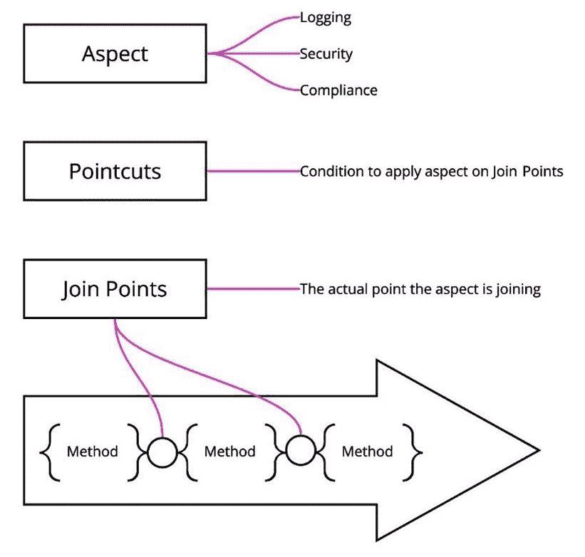
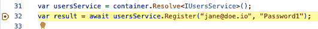
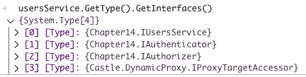

# 14

# 面向方面编程

在整本书中，你应该已经注意到了一个主题：自动化。这意味着编写使你的代码更简单、更易于维护并消除重复工作的代码。在*第十三章*中，*应用横切关注点*，我们讨论了可以创建用于特定关注点的代码，并且可以自动应用。在本章中，我们将把这个概念提升到下一个层次，并深入探讨为此目的而设计的正式化；**面向方面** **编程**（**AOP**）。

在本章中，我们将涵盖以下主题：

+   AOP 是什么？

+   记录

+   混合

+   授权

到本章结束时，你应该对 AOP 及其如何在 C#中用于创建更模块化、可维护和可扩展的应用程序有一个扎实的理解。

# 技术要求

该章节的特定源代码可以在 GitHub 上找到（[`github.com/PacktPublishing/Metaprogramming-in-C-Sharp/tree/main/Chapter14`](https://github.com/PacktPublishing/Metaprogramming-in-C-Sharp/tree/main/Chapter14)），并且它建立在 GitHub 上找到的**基础**代码之上（[`github.com/PacktPublishing/Metaprogramming-in-C-Sharp/tree/main/Fundamentals`](https://github.com/PacktPublishing/Metaprogramming-in-C-Sharp/tree/main/Fundamentals)）。

# AOP 是什么？

在传统编程中，开发者编写代码以实现应用程序所需的行为。这些代码被组织成函数、类和模块，以实现特定的功能。然而，许多应用程序需要跨越代码库多个部分的功能，例如记录、错误处理和安全。这些功能，通常被称为横切关注点，当它们散布在代码库中时，可能会难以管理和维护。

AOP 是一种编程范式，旨在通过将横切关注点从其余代码中分离出来来解决此问题。在 AOP 中，开发者定义方面，它们封装了横切关注点的行为，并使用连接点和切入点将它们应用于代码库的特定部分。

AOP 非常适合与其他编程范式结合使用，例如**面向对象编程**（**OOP**）和**函数式编程**（**FP**），以创建更模块化、可维护和可扩展的应用程序。近年来，AOP 越来越受欢迎，并且有多个 AOP 框架可用于各种编程语言和平台。

在本章中，我们将探讨如何使用 AOP 在 C#中解决横切关注点并提高代码的可维护性和可重用性。我们将介绍 AOP 的关键概念，如方面、切入点、连接点，并展示如何将它们应用于特定用例，例如安全和日志记录。我们将使用名为 Castle Windsor 的框架（[`www.castleproject.org/projects/windsor/`](https://www.castleproject.org/projects/windsor/））来完成这项工作，并展示如何将其用于实现 C#应用程序中的 AOP。

## 方面

在面向切面编程（AOP）中，方面是一个可以选择性应用于程序不同部分的行为模块单元。方面本质上是一组指令，描述了如何以特定方式修改程序的行为。

方面用于解决横切关注点，这些关注点跨越程序的多部分，不能封装在单个模块或类中。横切关注点的例子包括日志记录、安全、缓存和错误处理。

可以将方面视为可重用、模块化的代码片段，可以应用于程序的多部分。方面可以设计为可组合的，以便不同的方面可以组合起来实现更复杂的行为。

方面通常实现为定义要添加到程序中的行为的类或模块。在如 Castle Windsor 这样的 AOP 框架中，方面通常实现为拦截器，这些类拦截对方法或属性的调用并修改其行为。

## 切入点

切入点是 AOP 中用于指定方面应应用的位置的机制。切入点是一组连接点，是代码中方面可以应用的具体位置。

连接点是在程序执行过程中可以应用方面的点。连接点的例子包括方法调用、方法执行、字段访问和异常处理程序。

要定义一个切入点，你需要指定切入点包含的连接点。这可以通过各种标准完成，例如方法名、方法签名、类名或注解。

## 连接点

在 AOP 中，连接点是程序执行过程中可以应用方面的特定点。连接点代表程序中的特定事件或方法调用，可以被方面拦截。例如，一个连接点可以是方法调用、字段访问或抛出的异常。

连接点是通过切入点定义的，这些切入点指定了应用方面时应选择的连接点标准。切入点可以使用各种标准定义，例如方法签名、类名或注解。例如，一个切入点可以选择所有具有特定属性的方法或特定命名空间中的所有方法。

一旦定义了切入点，就可以将其用于将方面应用于选定的连接点。方面可以通过添加、修改或删除功能来修改它们所拦截的连接点的行为。例如，方面可以向方法调用添加日志或缓存功能，或者在允许处理之前验证用户输入。

连接点是 AOP 中的一个基本概念，因为它们允许方面有选择性地应用于代码库的特定部分，而不是必须修改整个代码库来实现横切关注点。连接点还使横切关注点的模块化成为可能，使它们更容易管理和维护。

C#中常见的连接点示例包括以下内容：

+   **方法调用**：这些是拦截方法调用的连接点，无论是方法被调用之前（使用前置通知）还是之后（使用后置通知）

+   **字段访问**：这些是拦截对字段读取或写入访问的连接点，无论是字段被访问之前（使用前置通知）还是之后（使用后置通知）

+   **异常处理**：拦截抛出异常的连接点，允许方面处理异常或修改其行为

以下图表总结了**方面**、**切入点**和**连接点**：



图 14.1 – AOP 术语可视化

在术语准备就绪后，我们现在应该准备好首次深入探索 AOP，并在一些典型示例中使用它。

# 日志

日志经常被引用为 AOP 如何用于提高软件模块化和可维护性的典型示例。日志是一个常见的横切关注点，意味着它影响软件系统的多个部分，并且不能轻易地封装在单个模块或类中。

AOP 提供了一种封装日志行为并在整个系统中一致应用的方法，而无需单独修改每个模块或类。这允许开发者专注于模块的核心功能，同时仍然提供一种一致且连贯的方式来记录系统行为。

在本节中，我们将探讨日志在软件系统中的作用以及如何使用 AOP 以模块化和可维护的方式实现日志行为。我们将分析不同日志方法的优缺点，以及 AOP 如何帮助解决与复杂软件系统中的日志相关的挑战。

## 创建日志示例

让我们从为这一章创建一个新项目开始。创建一个名为**Chapter14**的文件夹，在命令行中切换到这个文件夹，并创建一个新的控制台项目：

```cs
dotnet new console
```

对于本章，正如之前所讨论的，我们将使用一个名为 Castle Windsor 的框架。它是从 **The Castle Project** 中涌现出的许多框架之一，你可以在[这里](http://www.castleproject.org/)了解更多相关信息。Castle Windsor 是一个 **控制反转** (**IoC**) 容器，它提供了执行 AOP 的广泛功能。

要使所有 AOP 魔法成为可能，Castle Windsor 是建立在名为 Castle Core 的项目之上的，它提供了一种方便的方式来创建动态运行时代理对象，就像我们在 *第六章* 中所做的那样，*动态代理生成*。这可能是从必须自己完成所有事情的自然步骤。

所有这些都是开源的，你在这里将使用的具体框架是 **Windsor** 部分，可以在 GitHub 上找到([`github.com/castleproject/Windsor`](https://github.com/castleproject/Windsor))。

将包添加到项目的依赖项中：

```cs
dotnet add package Castle.Windsor
```

要开始使用 Windsor 容器，你可以简单地替换 **Program.cs** 中的内容如下：

```cs
using System.Reflection;
using Castle.Windsor;
using Castle.Windsor.Installer;
var container = new WindsorContainer();
container.Install(FromAssembly.InThisApplication(Assembly.
  GetEntryAssembly()));
```

代码创建了一个 **WindsorContainer** 的实例，并指示它安装运行应用程序中任何实现 **IWindsorInstaller** 的实例。安装器是一种配置容器的方式。它们在 **.Install()** 调用中被发现，并且你可以为特定的用例有多个安装器。

我们想要创建一个 **DefaultInstaller**，它将为容器设置默认行为。添加一个名为 **DefaultInstaller.cs** 的文件，并使其看起来如下：

```cs
using System.Reflection;
using Castle.MicroKernel.Registration;
using Castle.MicroKernel.SubSystems.Configuration;
using Castle.Windsor;
namespace Chapter14;
public class DefaultInstaller : IWindsorInstaller
{
    public void Install(IWindsorContainer container,
      IConfigurationStore store)
    {
        container.Register(Classes
          .FromAssemblyInThisApplication(Assembly
          .GetEntryAssembly())
            .Pick()
            .WithService.DefaultInterfaces()
            .LifestyleTransient());
    }
}
```

代码实现了 **IWindsorInstaller** 接口并实现了 **Install()** 方法。在它内部，代码指示 **容器** 通过将其与表示为 **DefaultInterfaces** 的服务相关联来注册应用程序中的所有类。这意味着它将建立一种约定，就像我们在 *第十章* 中所做的那样，即 *约定优于配置*，即任何具有以 **I** 为前缀的匹配接口的类将被绑定在一起（**IFoo** -> **Foo**）。最后，它告诉它应该使用瞬态的生命周期。Castle Windsor 默认的生命周期是单例，这可能是危险的，并可能产生不期望的副作用，因此我的建议是保持瞬态作为默认值，并在需要时进行覆盖。

安装器只是一个帮助你结构化代码并帮助你保持关注单一责任的工具。实际上，你可以在实例化后直接与容器一起工作，就像我们稍后将要看到的那样。有些事情应该立即做，而有些事情则应该分开。

**Console.WriteLine()** 对于日志记录来说不是最优的，所以让我们使用 Microsoft 日志记录器代替。

## 添加 Microsoft 日志记录器

通过使用 **Console.WriteLine()** 将信息写入控制台，你不会得到任何结构化的日志。日志消息只是文本，格式是你放入的内容。你通常还希望本地开发与生产环境有不同的输出。使用结构化日志方法可以捕获日志语句中使用的任何值，然后可以将这些值转发到集中的日志数据库中，对它们进行索引并使其可搜索。市面上有许多这样的工具，我推荐查看 Seq ([`datalust.co/seq`](https://datalust.co/seq))，它提供了一个免费用于本地开发的工具。

对于这个示例，我们将使用来自微软的库来进行结构化日志记录。这是微软在构建所有内容时使用的相同库。它提供了扩展点，并且也可以与其他流行的日志库一起使用，例如 Serilog ([`serilog.net`](https://serilog.net))。

首先添加对核心日志包的引用，以及到 **Console** 输出的引用：

```cs
dotnet add package Microsoft.Extensions.Logging
dotnet add package Microsoft.Extensions.Logging.Console
```

然后在 **Program.cs** 文件中，在末尾添加以下代码：

```cs
var loggerFactory = LoggerFactory.Create(builder => builder.
  AddConsole());
container.Register(Component.For<ILoggerFactory>().
  Instance(loggerFactory));
```

该代码创建 **LoggerFactory** 并将其配置为输出到控制台。然后它继续将 **ILoggerFactory** 接口与您刚刚配置的具体实例注册到 Windsor IoC 容器中。任何依赖于 **ILoggerFactory** 的构造函数现在将获得此实例。**ILoggerFactory** 提供了一种创建具体 **ILogger** 实例的方法，这就是用于日志记录的内容。

在 ASP.NET Core 中，**ILoggerFactory** 在某些情况下被内部用于创建日志实例。而在其他情况下，构造函数依赖于 **ILogger**，甚至更具体地，依赖于泛型 **ILogger<>** 版本。**ILogger** 的泛型版本允许你获取一个作用域特定的日志记录器，这是针对你的特定类型的。在日志输出中，你会看到日志消息的来源，这是重要的元数据。

让我们配置 IoC 容器以支持这两种场景。在 **Program.cs** 文件中，在末尾添加以下代码：

```cs
var createLoggerMethod = typeof(LoggerFactoryExtensions)
    .GetMethods(BindingFlags.Public | BindingFlags.Static)
    .First(_ => _.Name == nameof(
      LoggerFactory.CreateLogger) && _.IsGenericMethod);
container.Register(Component.For<ILogger>().
  UsingFactoryMethod((kernel, context) =>
{
    var loggerFactory = kernel.Resolve<ILoggerFactory>();
    return loggerFactory.CreateLogger(
      context.Handler.ComponentModel.Implementation);
}).LifestyleTransient());
container.Register(Component.For(typeof(ILogger<>)).
  UsingFactoryMethod((kernel, context) =>
{
    var loggerFactory = kernel.Resolve<ILoggerFactory>();
    var logger = createLoggerMethod
      .MakeGenericMethod(context.RequestedType
      .GenericTypeArguments[0]).Invoke(null, new[] {
      loggerFactory });
    return logger;
}));
```

代码首先使用反射从 **LoggerFactoryExtensions** 获取 **CreateLogger<>()** 扩展方法。这是因为 **ILoggerFactory** 只有一种非类型化的创建日志的方式，而泛型的是一种扩展方法。接下来，代码使用一个会在需要时动态创建实例的工厂方法将未类型化的非泛型 **ILogger** 注册到容器中。然后，它利用容器获取 **ILoggerFactory** 并通过给定的 **Ilogger** 注入的类型创建一个日志记录器。由于 Windsor 的默认行为是将一切设置为单例，我们明确配置 **Ilogger** 为瞬时的。这样，我们就可以为使用它的类型获取不同的日志记录器实例。否则，你将共享同一个日志记录器跨所有类型。最后，代码使用一个工厂方法配置泛型 **ILogger<>**，该方法使用 **LoggerFactoryExtensions** 中的 **CreateLogger<>()** 扩展方法，通过为请求的类型及其泛型类型参数创建一个泛型方法来完成。

在基本日志基础设施到位后，我们现在可以应用横切日志了。

# 拦截器

在 Castle Windsor 中，存在拦截器的概念。它们代表了如何实现实际方面并执行横切操作。

让我们创建一个用于处理所有方法调用日志的拦截器。在 **Chapter14** 的根目录下添加一个名为 **LoggingInterceptor.cs** 的文件，并使其看起来如下：

```cs
using Castle.DynamicProxy;
namespace Chapter14;
public class LoggingInterceptor : IInterceptor
{
    public void Intercept(IInvocation invocation)
    {
        // Do something before
        invocation.Proceed();
        // Do something after
    }
}
```

代码设置了 Castle Windsor 的 **IInterceptor** 实现方案。在 **Intercept()** 方法中，代码在调用对象上调用 **Proceed()** 方法，这将执行它所拦截的实际调用。在这个调用之前和之后，我们可以执行我们的横切操作。

在 .NET 6 中，Microsoft 引入了一种将日志消息封装到其自己的代码文件中的日志方法，这有助于你通过封装日志消息来变得更加结构化。这有助于日志消息的维护，并使得在需要为不同场景输出相同日志消息时更加容易。

创建一个名为 **LoggingInterceptorLogMessages.cs** 的新文件，并将以下代码添加到其中：

```cs
using Microsoft.Extensions.Logging;
namespace Chapter14;
internal static partial class LoggingInterceptorLogMessages
{
    [LoggerMessage(1, LogLevel.Information, "Before
      invoking {Method}", EventName = "BeforeInvocation")]
    internal static partial void BeforeInvocation(this
      ILogger logger, string method);
    [LoggerMessage(2, LogLevel.Error, "Error invoking
      {Method}", EventName = "InvocationError")]
    internal static partial void InvocationError(this
      ILogger logger, string method, Exception exception);
    [LoggerMessage(3, LogLevel.Information, "Before
      invoking {Method}", EventName = "AfterInvocation")]
    internal static partial void AfterInvocation(this
      ILogger logger, string method);
}
```

代码设置了一个静态的局部类，其中包含每个日志语句的扩展方法，并利用 **[LoggerMessage]** 来配置日志消息，其严重性，文件内的唯一标识符或全局唯一标识符，以及可选的事件名称。由于所有方法都是局部的且没有实现，C# 编译器将生成必要的代码来完成这项工作。

重要注意事项

我认为将记录器消息像这样内部化是一种良好的实践，对于类和方法都是如此。这样，您可以将其隔离在模块中，并且不会冒将其变成一个将在您的编辑器中全局显示为 IntelliSense 的扩展方法的危险。通常，您还应该使用泛型的**ILogger<>**作为扩展方法的类型来扩展，因为扩展方法使其针对具体类型。但是，由于我们这里的日志消息是跨切的，我们不知道它们将在哪里使用。

在放置了我们想要记录的日志消息后，我们可以修改**LoggingInterceptor**以执行日志记录。打开**LoggingInterceptor**文件，并将其更改为以下内容：

```cs
using Castle.DynamicProxy;
using Microsoft.Extensions.Logging;
namespace Chapter14;
public class LoggingInterceptor : IInterceptor
{
    readonly ILoggerFactory _loggerFactory;
    public LoggingInterceptor(ILoggerFactory loggerFactory)
    {
        _loggerFactory = loggerFactory;
    }
    public void Intercept(IInvocation invocation)
    {
        var logger = _loggerFactory.CreateLogger(
          invocation.TargetType)!;
        logger.BeforeInvocation(invocation.Method.Name);
        invocation.Proceed();
        logger.AfterInvocation(invocation.Method.Name);
    }
}
```

代码被修改为在构造函数中接受**ILoggerFactory**作为依赖项。在**Intercept()**方法中，您现在使用日志工厂为目标类型创建一个记录器。然后它使用结构化日志调用**BeforeInvocation()**和**AfterInvocation()**，并传递被调用的方法名称。

重要提示

仅通过日志中按名称看到被调用的方法可能不足以提供足够的信息。**IInvocation**类型包含有关传递的参数的详细信息，您也可以将它们记录下来。唯一需要注意的是，要删除敏感值，例如与**通用数据保护条例**（**GDPR**）相关的信息或安全信息。幸运的是，如果您遵循*第四章*中*使用反射推理类型*的建议，并使用**ConceptAs<>**封装类型，您可以轻松地识别需要删除的类型并自动执行删除。

在设置拦截器后，下一步是将它连接到 Castle Windsor。打开**DefaultInstaller.cs**文件，并将其更改为以下内容：

```cs
using System.Reflection;
using Castle.MicroKernel.Registration;
using Castle.MicroKernel.SubSystems.Configuration;
using Castle.Windsor;
namespace Chapter14;
public class DefaultInstaller : IWindsorInstaller
{
    public void Install(IWindsorContainer container,
      IConfigurationStore store)
    {
        // Added
        container.Register(Component.For<
          LoggingInterceptor>());
        container.Register(Classes
          .FromAssemblyInThisApplication(Assembly
          .GetEntryAssembly())
            .Pick()
            .WithService.DefaultInterfaces()
            // Added
            .Configure(_ =>
              _.Interceptors<LoggingInterceptor>())
            .LifestyleTransient());
    }
}
```

对安装程序所做的唯一更改是注册了**LoggingInterceptor**。Castle Windsor 不知道如何自动解析具体类型，因此我们手动注册它。第二个新增内容是为默认约定配置注册，包括**LoggingInterceptor**。

现在您已经设置了所有基础设施，您需要一些东西来测试它。让我们创建一个用于注册用户的用户服务，不是关注实现它，只是用来测试拦截器的东西。

## 尝试拦截器

在**Chapter14**的根目录下创建一个名为**IUsersService.cs**的文件，并使其看起来如下：

```cs
namespace Chapter14;
public interface IUsersService
{
    Task<Guid> Register(string userName, string password);
}
```

接口包含一个用于注册用户的单一方法。

对于接口，您需要一个实现。添加一个名为**UsersService.cs**的文件，并将其以下代码添加到其中：

```cs
using Microsoft.Extensions.Logging;
namespace Chapter14;
public class UsersService : IUsersService
{
    readonly ILogger<UsersService> _logger;
    public UsersService(ILogger<UsersService> logger)
    {
        _logger = logger;
    }
    public Task<Guid> Register(string userName,
      string password)
    {
        _logger.LogInformation("Inside register method");
        var id = Guid.NewGuid();
        return Task.FromResult(id);
    }
}
```

代码表示**IUsersService**的实现。它将**ILogger<UsersService>**作为依赖项，这样我们就可以在其中记录日志。对于**Register()**方法，它只记录它，创建一个新的**Guid**，并将其作为结果返回。

在放置好示例之后，你现在需要获取其实例并验证拦截器是否工作。打开**Program.cs**文件，并在文件末尾添加以下内容：

```cs
var usersService = container.Resolve<IUsersService>();
var result = await usersService.Register("jane@doe.io", "Password1");
Console.ReadLine();
```

代码请求 Castle Windsor 容器提供**IUsersService**的实例，然后调用**Register()**方法。我们添加**Console.ReadLine()**是因为使用了异步；如果没有这样做，它将退出而不会打印任何日志消息。

你现在可以使用**dotnet run**或你编辑器中的首选方法运行此代码，你应该看到以下输出：

```cs
info: Chapter14.UsersService[1]
      Before invoking Register
info: Chapter14.UsersService[0]
      Inside register method
info: Chapter14.UsersService[3]
      Before invoking Register
```

调用代码没有拦截器的概念；它一旦配置好就会自动编织到运行代码中。

然而，**LoggingInterceptor**中**Intercept()**方法的实现有些天真。它应该支持错误，并且还需要正确地支持异步方法调用。打开**LoggingInterceptor.cs**文件，并按如下方式更改**Intercept()**方法：

```cs
public void Intercept(IInvocation invocation)
{
    var logger = _loggerFactory
      .CreateLogger(invocation.TargetType)!;
    logger.BeforeInvocation(invocation.Method.Name);
    try
    {
        invocation.Proceed();
        if (invocation.ReturnValue is Task task)
        {
            task.ContinueWith(t =>
            {
                if (t.IsFaulted)
                {
                    logger.InvocationError(
                      invocation.Method.Name,
                      t.Exception!);
                }
                else
                {
                    logger.AfterInvocation(
                      invocation.Method.Name);
                }
            });
        }
        else
        {
            logger.AfterInvocation(invocation.Method.Name);
        }
    }
    catch (Exception ex)
    {
        logger.InvocationError(invocation.Method.Name, ex);
        throw;
    }
}
```

代码将**Proceed()**调用包裹在**try {} catch {}**中，以便能够记录错误，但会重新抛出异常，因为日志不应该吞没异常；它应该冒泡到原始调用者。对于处理异步调用，如果**invocation**实例是**Task**，它会查看**ReturnValue**。如果是任务，它将继续，并在完成时得到通知。任务可能处于错误状态，这将是如果调用导致异常的情况。

# 混入

在 C++中，多重继承提供了一种强大的方式来组合来自多个基类的行为。然而，这可能导致复杂性和菱形问题。混入提供了一种更简单的多重继承替代方案，避免了这些问题，并且特别适用于在代码中实现横切关注点。

然而，在.NET 公共语言运行时（**CLR**）中，不支持多重继承，因为它使用单继承模型。这意味着没有内置机制来组合来自多个类的行为。混入可以用来实现这一点，提供了一种在不修改其继承层次结构的情况下向类添加功能的方法。在本节中，我们将探讨混入是什么，它们是如何工作的，以及为什么你可能在 C#应用程序中使用它们来克服.NET CLR 单继承模型的限制。

城堡核心的关键特性之一是其对动态代理的支持，这允许你在运行时拦截方法调用并添加行为。

城堡 Windsor 对混入的支持建立在动态代理的此支持之上，以提供一种将来自多个来源的行为组合到单个对象中的方法。混入允许你定义一组行为作为独立的组件，这些组件可以与另一个对象的行为结合，以创建具有组合行为的新的对象。

在 Castle Windsor 中，混入（mixins）是通过动态代理和拦截的组合来实现的。当你注册带有混入的组件时，Castle Windsor 创建一个动态代理对象，该对象拦截对组件的方法调用，并将它们委托给混入。混入可以通过添加新功能或修改现有方法的行为来修改组件的行为。

在 Castle Windsor 中注册带有混入（mixins）的组件时，通常定义一个或多个表示混入的接口，并将它们作为单独的组件注册到容器中。然后，将您想要添加混入的组件注册到容器中，并指定混入作为依赖项。当组件从容器中解析出来时，Castle Windsor 创建一个动态代理对象，该对象实现了组件接口和混入接口，并将方法调用委托给适当的对象。

## 混合起来

你之前创建的 **UserService** 可能是混入的候选者。在一个系统中，通常需要一种方式来验证用户身份，以及一种方式来询问他们是否有权执行某个操作。显然，.NET 提供了构建块和出色的支持，用于认证和授权，但假设你想要在你的抽象之上构建一个特定于.NET 提供的抽象，以便能够通过用户名和密码验证用户，然后能够询问用户是否有权执行某个操作。

在 **Chapter14** 代码的文件夹中，添加一个名为 **IAuthenticator.cs** 的文件，并将以下内容放入其中：

```cs
namespace Chapter14;
public interface IAuthenticator
{
    bool Authenticate(string username, string password);
}
```

**IAuthenticator** 接口定义了一个使用用户名和密码进行认证的方法。如果它能够成功认证用户，则通常返回 **true**，否则返回 **false**。

**IAuthenticator** 的实现可以放在一个名为 **Authenticator.cs** 的文件中，其内容如下：

```cs
namespace Chapter14;
public class Authenticator : IAuthenticator
{
    public bool Authenticate(string username, string password)
    {
        return true;
    }
}
```

代码实现了 **IAuthenticator** 接口，出于演示目的，它仅返回 **true**。由于我们不会构建任何特定内容，只是展示混入（mixins）的强大功能，所以目前这样是可以的。

对于授权部分，你需要另一个接口。添加一个名为 **IAuthorizer.cs** 的文件，并使其看起来如下：

```cs
namespace Chapter14;
public interface IAuthorizer
{
    bool IsAuthorized(string username, string action);
}
```

通过提供用户名和操作来检查授权。如果用户被授权执行该操作，则该方法将返回 **true**，否则返回 **false**。

对于授权者，你还需要一个实现，因此创建一个名为 **Authorizer.cs** 的文件，并将以下内容放入其中：

```cs
namespace Chapter14;
public class Authorizer : IAuthorizer
{
    public bool IsAuthorized(string username, string action)
    {
        return true;
    }
}
```

与 **Authenticator** 实现一样，出于演示目的，它将仅返回 **true**。这就是你检查用户是否有权执行特定操作的地方。

**IAuthenticator** 和 **IAuthorizer**，以及它们各自的实现，是独立的，并且它们也与 **IUsersService** 独立。这很好，因为它们代表了与用户交互的不同方面。它们承担系统的特定责任，保持它们独立是逻辑上合理的，这有助于代码库的维护。

然而，在运行时能够一次性访问所有这些功能可能是有需求的。这就是混入（mixins）发挥作用的地方，它们可以使它看起来像是一个单一实现。

要实现这一点，你需要正确配置 Castle Windsor。打开 **DefaultInstaller.cs** 文件，并在 **Install()** 方法的顶部添加以下内容：

```cs
container.Register(
    Component.For<IAuthenticator>()
        .ImplementedBy<Authenticator>()
        .LifestyleTransient());
container.Register(
    Component.For<IAuthorizer>()
        .ImplementedBy<Authorizer>()
        .LifestyleTransient());
```

这段代码为 **IAuthenticator** 和 **IAuthorizer** 服务添加了显式的容器注册。添加这些显式注册的原因是我们必须为 **IUsersService** 添加一个显式注册，并且这必须发生在 **DefaultInstaller** 中已经设置的自动注册之前。如果你在自动注册之后注册 **IUsersService**，你会得到一个异常，表明有重复注册。

对于混入，你需要另一个显式注册。在 **IAuthenticator** 和 **IAuthorize** 注册之后，在自动注册之前添加以下代码：

```cs
container.Register(
    Component.For<IUsersService>()
        .ImplementedBy<UsersService>()
        .Proxy.AdditionalInterfaces(typeof(IAuthorizer),
          typeof(IAuthenticator))
        .Proxy.MixIns(_ => _
            .Component<Authorizer>()
            .Component<Authenticator>())
        .Interceptors<LoggingInterceptor>()
        .LifestyleTransient());
```

**IUsersService** 的注册与之前所做的略有不同。首先，它指示 Castle Windsor **IUsersService** 由 **UsersService** 实现，然后它指示它实现一些额外的接口：**IAuthorizer** 和 **IAuthenticator**。然后，这些额外的接口被指示通过 **.Mixins()** 调用实现，该调用告诉它们由各自的 **Authorizer** 和 **Authenticator** 组件实现。由于这是一个显式注册，自动注册将不会启动，你之前连接的 **LoggingInterceptor** 也不会启动。为了使其启动，你需要为拦截器添加一个显式的 **.Interceptors<>()** 调用。最后，你设置生命周期为瞬时的。

如果你使用调试器运行此代码，你可以调查 **UserService** 发生了什么。在 **Program.cs** 文件中，你可以在调用 **container.Resolve<IUserService>()** 后立即设置一个断点。运行调试器到这个点：



图 14.2 – 调试断点

在你的编辑器/集成开发环境（**IDE**）的 **Debug** 控制台（即时窗口）中，你应该能够编写以下内容：

```cs
usersService.GetType().GetInterfaces()
```

此输出的内容可能如下所示：



图 14.3 – 实现的接口

为了证明调用是传递给混入的，你可以在 **Program.cs** 文件中在 **Console.ReadLine();** 之前添加以下内容：

```cs
var authenticated = (usersService as IAuthenticator)!.
  Authenticate("jane@doe.io", "Password1");
var authorized = (usersService as IAuthorizer)!.IsAuthorized("jane@
  doe.io", "Some Action");
Console.WriteLine($"Authenticated: {authenticated}");
Console.WriteLine($"Authorized: {authorized}");
```

代码假设 **UserService** 也实现了 **IAuthenticator** 和 **IAuthorizer** 接口，并使用类型转换来获取它们，并分别调用 **Authenticate()** 和 **IsAuthorized()** 方法。然后它打印出这些方法的输出结果。

如果你现在运行应用程序，你应该会看到以下类似的输出：

```cs
info: Chapter14.UsersService[1]
      Before invoking Register
info: Chapter14.UsersService[0]
      Inside register method
info: Chapter14.Authenticator[1]
      Before invoking Authenticate
info: Chapter14.UsersService[3]
      Before invoking Register
info: Chapter14.Authenticator[3]
      Before invoking Authenticate
info: Chapter14.Authorizer[1]
      Before invoking IsAuthorized
info: Chapter14.Authorizer[3]
      Before invoking IsAuthorized
Authenticated: True
Authorized: True
```

这种方法的缺点是，在 **IUsersService** 的契约中并不明确它还将实现 **IAuthenticator** 和 **IAuthorizer** 接口。然而，这可以通过不同的技术来克服。

一种方法是有这样一个没有实现但表示组合的接口，例如以下内容：

```cs
public interface IUsersServiceComposition : IUsersService, IAuthenticator, IAuthorizer
{
}
```

**IUsersServiceComposition** 接口仅用于组合；它不应该有任何直接成员，因为目标是结合 **IUsersService**、**IAuthenticator** 和 **IAuthorizer** 的实现。然后我们可以利用 Castle **DynamicProxy** 库中的底层 **ProxyGenerator** 来创建一个代理，以表示不同组件中的实现。

在 **DefaultInstaller.cs** 文件中，你现在可以为新的 **IUsersServiceComposition** 接口创建一种新的注册类型。在方法末尾，你可以添加以下代码：

```cs
container.Register(
    Component.For<IUsersServiceComposition>()
        .UsingFactoryMethod((kernel, context) =>
        {
            var proxyGenerator = new ProxyGenerator();
            var proxyGenerationOptions = new ProxyGenerationOptions();
            proxyGenerationOptions.AddMixinInstance(container.
            Resolve<IAuthorizer>());
            proxyGenerationOptions.AddMixinInstance(container.
            Resolve<IAuthenticator>());
            var logger = container.Resolve<ILogger<UsersService>>();
            proxyGenerationOptions.AddMixinInstance(new
            UsersService(logger));
            var usersServiceComposition = (proxyGenerator.
            CreateClassProxyWithTarget(
                typeof(object),
                new[] { typeof(IUsersServiceComposition) },
                new object(),
                proxyGenerationOptions) as IUsersServiceComposition)!;
            return usersServiceComposition;
        }));a
```

代码设置了一个使用方法创建实例的注册。使用 **UsingFactoryMethod()** 指令，你为 Castle Windsor 提供了一个当它需要解析实例时将被调用的方法。工厂方法使用 Castle **DynamicProxy** 中的 **ProxyGenerator** 并通过容器提供这些接口的实例来添加 **IAuthorizer** 和 **IAuthenticator** 接口的不同混合。对于 **IUsersService**，在这个示例中我们必须自己创建其实例，提供使用容器获取实例的记录器。这样做的原因是，你已经有了一个为 **IUsersService** 的注册，它为 **IAuthorizer** 和 **IAuthenticator** 接口添加了混合，这将在创建代理时抛出异常。

一旦所有混合配置完成，代码创建了一个基于 **object** 类型的目标类代理，并告诉它应该实现 **IUsersServiceComposition** 接口。

通过所有这些，你现在得到了一个实现了所有接口的实例，并将它们的实现委托给混合实例。相当巧妙。

使用 **IUserServiceComposition** 现在对于消费者来说更加直观和清晰，因为你不需要知道它可能实现的其他接口。打开 **Program.cs** 文件，在 **Console.ReadLine()** 之前添加以下代码：

```cs
var composition = container.Resolve<IUsersServiceComposition>();
authenticated = composition.Authenticate("jane@doe.io", "Password1");
authorized = composition.IsAuthorized("jane@doe.io", "Some Action");
Console.WriteLine($"Authenticated: {authenticated}");
Console.WriteLine($"Authorized: {authorized}");
```

运行程序现在应该给出以下类似的结果：

```cs
info: Chapter14.UsersService[1]
      Before invoking Register
info: Chapter14.UsersService[0]
      Inside register method
info: Chapter14.Authenticator[1]
      Before invoking Authenticate
info: Chapter14.UsersService[3]
      Before invoking Register
info: Chapter14.Authenticator[3]
      Before invoking Authenticate
info: Chapter14.Authorizer[1]
      Before invoking IsAuthorized
info: Chapter14.Authorizer[3]
      Before invoking IsAuthorized
Authenticated: True
Authorized: True
Authenticated: True
Authorized: True
```

混合模式提供了一种通过结合其他对象的行为来向对象添加行为的有效方式。使用混合模式的一些好处包括以下内容：

+   **组合**：混入允许你从简单、可重用的组件中组合复杂的行为。这使得随着时间的推移维护和修改代码变得更加容易。

+   **关注点分离**：混入通过将对象分解成更小、更专注的功能部分，使你能够分离关注点。这使得理解代码和推理代码变得更加容易。

+   **可重用性**：混入允许你在多个对象之间重用行为，这减少了代码重复，并使得随着时间的推移维护和修改代码变得更加容易。

+   **灵活性**：混入通过允许你根据需要选择性地应用行为，提供了一种修改对象行为的方式。这为你提供了对代码行为的更大控制，并使得针对特定用例进行定制变得更加容易。

+   **可测试性**：混入允许你单独测试功能的一部分，这使得编写测试和确保代码的正确性更加容易。

混入通常与切点等技术结合使用，这些技术允许你在代码的特定点应用行为。切点提供了一种选择性地将混入应用于代码特定部分的方法，这为你提供了更大的灵活性和对代码行为的控制。

总结来说，混入（mixins）是一种强大的工具，可以以灵活、可维护和可重用的方式向对象添加行为。当与切点和其他 AOP 技术结合使用时，它们提供了一种强大的方式来自定义代码的行为，并实现更高的模块化、灵活性和可测试性。

# 授权

授权对于许多软件系统来说是一个关键问题，因为确保用户和应用只能访问他们被授权使用的资源和功能非常重要。AOP 可以作为一种强大的工具来实现授权行为，因为它允许开发者封装授权逻辑并在整个系统中一致地应用它。

实现 AOP 授权的一种方法是在 C#代码中使用连接点（join points）过滤到特定的命名空间。连接点是代码中可以应用方面的点，例如方法调用、字段访问或对象创建。通过使用连接点过滤到特定的命名空间，开发者可以将授权逻辑仅应用于系统的相关部分，从而降低错误或不一致的风险。

在面向切面编程（AOP）中，切点是指源代码中应用方面（aspect）的具体位置。换句话说，它是一种定义应该执行方面的集合（即程序执行流程中的特定点）的方法。

切点通常使用多种不同的标准定义，例如方法名称、方法签名、类名称、包名称、注解等。用于定义切点的标准通常使用一种称为“切点表达式”或“切点语言”的语法来表示。

使用的切点语言可能因所使用的 AOP 框架而异。例如，在 C# 中，借助 PostSharp 等库的帮助，你可以通过属性注解和方法签名的组合来定义切点。

一旦定义了切点，就可以将其用于在指定的连接点将一个或多个方面“编织”到代码中。这意味着方面的行为被插入到指定的连接点，而无需对原始源代码进行任何修改。

总体而言，切点提供了一种强大的方式，可以将跨切面关注点，如日志记录、缓存或安全，应用于程序执行流程的特定部分。

## 使用切点

使用拦截器时，你可能不希望它们应用于所有内容。这尤其是对于授权而言。你可能有一些不需要授权的应用程序部分，例如基础设施，以及可能对所有用户开放的具体部分。使用 Castle Windsor，我们可以通过利用拦截器的选择器来创建切点。这是一种根据类型和方法信息动态提供实际拦截器的方法。

让我们创建一个用于向列表添加待办事项的服务，该列表由 **ITodoService** 接口表示。在 **Chapter14** 项目的根目录下创建一个名为 **Todo** 的文件夹，添加一个名为 **ITodoService.cs** 的文件，并将以下内容添加到其中：

```cs
namespace Chapter14.Todo;
public interface ITodoService
{
    void Add(string item);
}
```

接口仅公开一个简单的 **Add()** 方法用于以字符串形式添加一个项目。其实现应该添加到 **Todo** 文件夹内名为 **TodoService.cs** 的文件中，并看起来如下：

```cs
namespace Chapter14.Todo;
public class TodoService : ITodoService
{
    public void Add(string item)
    {
        Console.WriteLine($"Adding '{item}' to the todo list");
    }
}
```

由于我们不是专注于构建在数据存储中创建 **todo** 项的东西，我们只是在实现中打印添加的内容。这只是为了证明你可以如何利用拦截器和选择器来过滤调用。

下一步你需要的是一个检查用户是否授权的拦截器。

将名为 **AuthorizationInterceptor.cs** 的文件添加到 **Chapter14** 项目的根目录，并将以下代码添加到该文件中：

```cs
using Castle.DynamicProxy;
namespace Chapter14;
public class AuthorizationInterceptor : IInterceptor
{
    readonly IUsersServiceComposition _usersService;
    public AuthorizationInterceptor(IUsersServiceComposition
      usersService)
    {
        _usersService = usersService;
    }
    public void Intercept(IInvocation invocation)
    {
        if (_usersService.IsAuthorized("jane@doe.io", invocation.
          Method.Name))
        {
            invocation.Proceed();
        }
    }
}
```

代码实现了 Castle **DynamicProxy** **IInterceptor** 接口，构造函数依赖于为混合部分创建的 **IUsersServiceComposition** 服务。**Intercept()** 方法利用组合用户服务来检查用户是否授权。如果用户被授权，它允许调用继续进行。

重要提示：

用户被硬编码为 **jane@doe.io**，在生产系统中显然需要获取当前登录的用户。此外，如果未授权，实现不会做任何事情。一种方法可能是抛出 **UnauthorizedException()** 并让异常向上冒泡。

对于实际将过滤出何时应用哪些拦截器的实际切入点，你必须实现 Castle **DynamicProxy** 中找到的 **IInterceptorSelector** 接口。在项目的根目录中添加一个名为 **InterceptorSelector.cs** 的文件，并将其中的以下代码添加到该文件中：

```cs
using System.Reflection;
using Castle.DynamicProxy;
namespace Chapter14;
public class InterceptorSelector : IinterceptorSelector
{
    public Iinterceptor[] SelectInterceptors(Type type, MethodInfo
      method, Iinterceptor[] interceptors)
    {
        if (type.Namespace?.StartsWith("Chapter14.Todo",          StringComparison.InvariantCulture) ?? false)
        {
            return interceptors;
        }
        return interceptors.Where(_ => _.GetType() !=
        typeof(AuthorizationInterceptor)).ToArray();
    }
}
```

**SelectInterceptors()** 方法会调用目标类型和被调用的方法，并给出配置的拦截器。在这个阶段，你可以决定哪些拦截器应该应用于方法调用。代码通过查看类型的命名空间来做出这个决定，任何以 **Chapter14.Todo** 开头的都应该有所有拦截器，而其他任何东西则除了 **AuthorizationInterceptor** 之外的所有拦截器。

在拦截器和选择器就位后，你必须在 Castle Windsor 容器中注册它们，并将它们连接起来以用于现有注册。打开 **DefaultInstaller.cs** 文件并在 **Install()** 方法的顶部添加以下内容：

```cs
container.Register(Component.For<InterceptorSelector>());
container.Register(Component.For<AuthorizationInterceptor>());
```

代码将 **InterceptorSelector** 和 **AuthorizationInterceptor** 都注册到容器中，使它们能够注入需要它们的服务。在 **Install()** 方法中，你已经添加了 **LoggingInterceptor** 的两个地方；在这两个地方，我们想要添加新的 **AuthorizationInterceptor**，并添加一个语句告诉 Castle Windsor 使用新的 **InterceptorSelector** 来选择正确的拦截器。

以下行添加了拦截器和选择器：

```cs
.Interceptors<AuthorizationInterceptor>()
.SelectInterceptorsWith(s => s.Service<InterceptorSelector>())
```

作为参考，配置 **IUsersService** 的代码块需要这两行：

```cs
container.Register(
    Component.For<IUsersService>()
        .ImplementedBy<UsersService>()
        .Proxy.AdditionalInterfaces(typeof(IAuthorizer),        typeof(IAuthenticator))
        .Proxy.MixIns(_ => _
            .Component<Authorizer>()
            .Component<Authenticator>())
        .Interceptors<LoggingInterceptor>()
        // Add the interceptor and the selector
        .Interceptors<AuthorizationInterceptor>()
        .SelectInterceptorsWith(s => s.Service<InterceptorSelector>())
        .LifestyleTransient());
```

需要两行的第二个块通常按照惯例是自动连接：

```cs
container.Register(Classes.FromAssemblyInThisApplication(Assembly.
  GetEntryAssembly())
    .Pick()
    .WithService.DefaultInterfaces()
    .Configure(_ => _
        .Interceptors<LoggingInterceptor>()
        .Interceptors<AuthorizationInterceptor>()
        // Add the interceptor and the selector
        .Interceptors<AuthorizationInterceptor>()
        .SelectInterceptorsWith(s =>
          s.Service<InterceptorSelector>()))
    .LifestyleTransient());
```

现在一切都已注册，是时候尝试一下了。打开 **Program.cs** 文件并在 **Console.ReadLine()** 之前添加以下内容：

```cs
var todo = container.Resolve<ITodoService>();
todo.Add("Buy milk");
```

现在运行你的应用程序，你应该会看到以下输出：

```cs
info: Chapter14.UsersService[1]
      Before invoking Register
info: Chapter14.UsersService[0]
      Inside register method
info: Chapter14.UsersService[3]
      Before invoking Register
info: Chapter14.Authenticator[1]
      Before invoking Authenticate
info: Chapter14.Authenticator[3]
      Before invoking Authenticate
info: Chapter14.Authorizer[1]
      Before invoking IsAuthorized
info: Chapter14.Authorizer[3]
      Before invoking IsAuthorized
Authenticated: True
Authorized: True
Authenticated: True
Authorized: True
info: Chapter14.Todo.TodoService[1]
      Before invoking Add
Adding 'Buy milk' to the todo list
info: Chapter14.Todo.TodoService[3]
      Before invoking Add
```

如预期的那样，你应该可以购买牛奶。让我们修改授权器以不允许这样做。打开 **Authorizer.cs** 文件并将返回值改为 **false**：

```cs
namespace Chapter14;
public class Authorizer : IAuthorizer
{
    public bool IsAuthorized(string username, string action)
    {
        return false;
    }
}
```

再次运行程序应该会产生不同的结果，**Adding 'Buy milk' to the todo list** 输出将被移除。你仍然会看到日志记录器发生的方法调用，但实际的调用被过滤掉了：

```cs
info: Chapter14.UsersService[1]
      Before invoking Register
info: Chapter14.UsersService[0]
      Inside register method
Authenticated: True
info: Chapter14.UsersService[3]
      Before invoking Register
Authorized: False
info: Chapter14.Authenticator[1]
      Before invoking Authenticate
info: Chapter14.Authenticator[3]
      Before invoking Authenticate
info: Chapter14.Authorizer[1]
      Before invoking IsAuthorized
info: Chapter14.Authorizer[3]
      Before invoking IsAuthorized
Authenticated: True
Authorized: False
info: Chapter14.Todo.TodoService[1]
      Before invoking Add
info: Chapter14.Todo.TodoService[3]
      Before invoking Add
```

Windsor Castle 提供了一个基于 Castle **DynamicProxy** 的灵活且强大的切入点机制，允许你根据类型和方法上找到的元数据选择连接点。例如，你可以根据以下标准创建切入点：

+   方法的名称

+   方法的返回类型

+   方法的参数

+   类型或方法上存在属性

+   该方法的可访问性（例如，公共、私有等）

通过结合多个标准，您可以创建复杂的切入点，以匹配非常具体的连接点集合。例如，您可以创建一个匹配所有具有特定属性的公共方法或所有具有特定名称的非公共方法的切入点。

切入点是一种强大的机制，用于过滤调用并将方面仅应用于代码的特定部分。通过使用切入点，您可以避免将方面应用于每个单独的方法调用的开销，相反，仅在有需要的地方选择性地应用方面。这可以导致代码更快、更高效，并且关注点分离得更好。

总体而言，切入点是面向方面编程（AOP）的一个关键特性，Windsor Castle 提供了一个丰富且灵活的切入点机制，可用于创建复杂且强大的基于方面的解决方案。

# 摘要

虽然我们一直使用 Castle Windsor，但还有其他工具、框架或库也可以使用，例如 PostSharp ([`www.postsharp.net`](https://www.postsharp.net))、Autofac ([`autofac.org`](https://autofac.org))，或者只需使用底层的 Castle Core **DynamicProxy**来实现相同的功能，而无需购买完整的框架。您也可以使用反射发射自行实现这一点。

总体而言，AOP 和 Castle Windsor 提供了一种强大的机制，用于在您的代码中分离关注点，并使它们更加模块化和可重用。通过选择性地将方面应用于代码的特定部分，您可以实现高度灵活性和对应用程序行为的控制。

在*第十三章*，*应用横切关注点*中，我们讨论了在代码库中降低风险的重要性，这可能是最关键的使用场景。由于安全性是我们软件中最脆弱的方面，因此在处理这个问题时，采取零信任的心态并采取所有必要的步骤来预防安全漏洞是至关重要的。

进入下一章，我们将深入探讨 C#编译器（也称为 Roslyn）的力量。使用 Roslyn，您将获得一组全新的元数据来玩耍，以及元编程的新功能。

# 第四部分：使用 Roslyn 进行编译器魔法

在这部分，您将了解 C#编译器的功能以及它通过.NET 编译器 SDK 提供的不同扩展点。它深入探讨了编译器如何成为一个生态系统，以及您如何在编译时而不是仅在运行时进行元编程。这部分以对本书涵盖内容的概述、何时使用什么的思考以及一些结束语结束。

本部分包含以下章节：

+   *第十五章*，*Roslyn 编译器扩展*

+   *第十六章*，*生成代码*

+   *第十七章*，*静态代码分析*

+   *第十八章*，*注意事项和结语*
