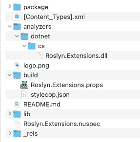

# 15

# Roslyn 编译器扩展

Roslyn 编译器扩展提供了一种强大的方式来修改和扩展 C#编译器的行为。使用 Roslyn 编译器，开发者可以编写在编译时分析和修改 C#代码的代码，为代码生成、代码转换和优化开辟了新的可能性。

在本章中，我们将探讨 Roslyn 编译器扩展项目的技术设置。本章本身并不专注于元编程，而是关注为接下来的两章提供的技术设置。我们将深入研究打包 Roslyn 编译器扩展以供重用的过程。我们将探讨不同的打包选项，例如 NuGet 包，并讨论使您的扩展易于其他开发者使用的最佳实践。

本章我们将涵盖以下主题：

+   如何设置项目和其组成部分

+   如何打包您的扩展以供重用

到本章结束时，您将牢固地理解如何设置 Roslyn 编译器扩展项目并将其打包以供重用。您将具备构建强大且灵活的扩展所需的知识和工具，这些扩展可以显著增强 C#编译器的功能。

# 技术要求

该章节的特定源代码可以在 GitHub 上找到，([`github.com/PacktPublishing/Metaprogramming-in-C-Sharp/tree/main/Chapter15`](https://github.com/PacktPublishing/Metaprogramming-in-C-Sharp/tree/main/Chapter15))，并且它建立在 GitHub 上可找到的**基础**代码之上 ([`github.com/PacktPublishing/Metaprogramming-in-C-Sharp/tree/main/Fundamentals`](https://github.com/PacktPublishing/Metaprogramming-in-C-Sharp/tree/main/Fundamentals))。

# 如何设置项目和其组成部分

由 Roslyn 框架([`learn.microsoft.com/en-us/dotnet/csharp/roslyn-sdk/`](https://learn.microsoft.com/en-us/dotnet/csharp/roslyn-sdk/))驱动的 C#编译器提供了一个机制来加载和使用自定义扩展，这些扩展以分析器和代码修复提供者的形式存在。这些扩展可以打包成 NuGet 包或作为项目引用包含在内，并且它们被加载到编译过程中以分析或修改正在编译的源代码。

当 C#编译器遇到包含对 Roslyn 扩展引用的项目时，它使用.NET 的**AssemblyLoadContext**将扩展的程序集加载到编译过程中。这允许扩展的代码在编译过程中执行，并参与源代码的分析和转换。

Roslyn 扩展作为分析器或源生成器加载到编译器中。分析器负责检查源代码并报告诊断信息，这些诊断信息是关于代码中潜在问题的警告、错误或建议。代码修复提供者提供建议或自动修复以解决报告的问题，并用于你的代码编辑器。另一方面，源生成器根据特定的规则或模板在编译期间生成额外的源代码。

C#编译器扫描加载的程序集，寻找实现由 Roslyn 框架定义的不同扩展点的接口的类型。然后它创建这些类型的实例并调用它们的方法来执行源代码的分析和转换。

Roslyn 扩展在编译时动态加载，允许在不修改编译器本身的情况下灵活地添加或删除扩展，这是开放/封闭原则应用的绝佳例子。这种动态加载还使得扩展可以在不同的项目和解决方案之间重用，因为它们可以作为 NuGet 包打包和分发，或者作为项目引用共享。

## 他们能做什么？

Roslyn 编译器扩展为 C#中的元编程提供了一个强大且灵活的平台。使用 Roslyn，你可以完全访问正在编译的代码的语法树和语义模型，这让你对代码的结构、语法和语义有了深入的了解。这允许你执行复杂的代码分析，根据模式或约定生成代码，并对代码应用转换以实现各种目标。

这里有一些 Roslyn 编译器扩展如何成为元编程强大工具的方式：

+   **代码生成**：Roslyn 编译器扩展允许你在编译过程中生成代码。这可以用于自动生成重复的代码模式，例如数据访问层、序列化代码或重复任务的样板代码。你还可以根据约定、配置或元数据生成代码，这使得创建可重用和可定制的代码生成工具变得容易。

+   **代码分析**：Roslyn 编译器扩展允许你在编译过程中执行自定义代码分析。这可以帮助你捕捉潜在问题，强制执行编码标准，并提供自动化的代码审查反馈。例如，你可以使用 Roslyn 扩展在开发早期阶段识别并标记代码异味、安全漏洞或其他代码质量问题，帮助你保持项目中的代码质量处于高水平。

+   **领域特定语言**（**DSL**）：Roslyn 编译器扩展可用于创建针对特定问题域提供专用语法和语义的 DSL。这允许您定义自己的 DSL 并在项目中使用它来提高可表达性和可维护性。使用 Roslyn 扩展，您可以创建自定义语法，创建自定义语义规则，并强制执行领域特定约定，使处理复杂领域特定概念变得更加容易。

+   **工具和生产力**：Roslyn 编译器扩展可用于为 Visual Studio 或 VSCode 等开发环境创建自定义工具和生产力功能。例如，您可以创建代码重构工具、代码补全提供者或诊断和快速修复，以简化开发工作流程并捕捉常见错误。使用 Roslyn 扩展，您可以创建符合团队特定需求和开发实践的定制工具，从而提高生产力和代码质量。

+   **实验和创新**：Roslyn 编译器扩展为编程语言和编译器领域的实验和创新提供了一个平台。您可以使用 Roslyn 扩展来原型设计新的语言功能，尝试不同的编程范式，或实现新颖的编程技术。这允许您推动 C# 的可能性边界，并在软件开发领域探索新想法。

Roslyn 编译器扩展是任何对元编程和推动 C# 可能性边界感兴趣的 C# 开发者的工具箱中的宝贵工具。

## 设置

在 Visual Studio 和其他 IDE 中，您有项目模板，可以轻松创建一个 Roslyn 编译器扩展。扩展实际上只是一个具有正确包引用的类库，具体取决于您创建的扩展类型。

由于我们不针对特定的 IDE，我们将从头开始使用 .NET CLI 并手动配置不同的文件。

我们首先需要的是一个项目文件夹。由于我们将重用扩展项目来编写后续章节，让我们创建一个名为 **Roslyn.Extensions** 的文件夹。

在 **Roslyn.Extensions** 文件夹中，运行以下命令：

```cs
dotnet new classlib
```

您现在应该得到两个名为 **Roslyn.Extensions.csproj** 和 **Class1.cs** 的文件。删除 **Class1.cs** 文件，因为您将不需要它。

在您的编辑器中打开 **Roslyn.Extensions.csproj** 文件。它应该看起来像以下这样：

```cs
<Project Sdk="Microsoft.NET.Sdk">
  <PropertyGroup>
    <TargetFramework>net7.0</TargetFramework>
    <ImplicitUsings>enable</ImplicitUsings>
    <Nullable>enable</Nullable>
  </PropertyGroup>
</Project>
```

您需要稍作修改才能使其与编译器一起工作：

```cs
<Project Sdk="Microsoft.NET.Sdk">
  <PropertyGroup>
    <TargetFramework>netstandard2.0</TargetFramework>
    <LangVersion>11.0</LangVersion>
    <ImplicitUsings>enable</ImplicitUsings>
    <Nullable>enable</Nullable>
    <EnforceExtendedAnalyzerRules>true</EnforceExtendedAnalyzerRules>
  </PropertyGroup>
</Project>
```

**TargetFramework** 的更改对于其正常工作是必要的。否则，C# 编译器将无法加载它。然而，你可能仍然希望使用最新的 C# 版本来编写你的扩展，因此你需要将 **LangVersion** 设置为反映你想要的 C# 版本。如果你希望保留 **ImplicitUsings** 和 **Nullable**，则可以这样做。包含分析器或源生成器的项目还需要将 **EnforceExtendedAnalyzerRules** 设置为 **true**。

对于开发分析器或源代码生成器，我们可能需要添加几个 NuGet 包引用。如前所述，本章的目标是为随后的章节设置一个通用的包，因此我们将包括我们想要的那些，以及一些额外的内容。

在 **Roslyn.Extensions.csproj** 文件的 **<Project>** 标签内，在初始 **<PropertyGroup>** 之后添加以下 **<ItemGroup>** 块：

```cs
<ItemGroup>
    <PackageReference
      Include="Microsoft.CodeAnalysis.CSharp"
      Version="4.5.0" PrivateAssets="all" />
    <PackageReference
      Include="Microsoft.CodeAnalysis.Analyzers"
      Version="3.3.4" PrivateAssets="all" />
    <PackageReference
      Include="Microsoft.CodeAnalysis.CSharp.CodeStyle"
      Version="4.5.0" PrivateAssets="all"/>
    <PackageReference
      Include="Microsoft.CodeAnalysis.NetAnalyzers"
      Version="7.0.1" PrivateAssets="all"/>
    <PackageReference Include="StyleCop.Analyzers"
      Version="1.1.118" PrivateAssets="all"/>
</ItemGroup>
```

前三个包用于分析器和源代码生成器的开发。而接下来的两个包是分析器，我们希望确保我们的代码遵循标准。

重要提示

在包中使用的 **PrivateAssets** 属性用于它们所添加的项目中的依赖项，并且引用此属性的人将无法直接继承这些依赖项。这对于我们将此项目打包为 NuGet 包时非常重要。

如果你希望所有包引用都仅限于这个包，你可以通过添加以下 **ItemGroup** 代码来执行一个巧妙的小 MSBuild 技巧：

```cs
<ItemGroup>
    <PackageReference Update="@(PackageReference)"
      PrivateAssets="All" />
</ItemGroup>
```

通过这样做，你不需要为所有引用设置 **PrivateAssets="All"** 属性。

根据你的 .NET 安装版本，引用包的版本号可能会有所不同。你可以在此处了解更多关于哪个版本适合你的信息：[`github.com/dotnet/roslyn/blob/main/docs/wiki/NuGet-packages.md`](https://github.com/dotnet/roslyn/blob/main/docs/wiki/NuGet-packages.md)。

## 添加通用规则

.NET 编译器和处理所有构建工作的底层 MSBuild 引擎的一个优点是，你可以有一个包含你想要的所有规则的项目。然后，引用它的每个项目都将继承这些规则。

EditorConfig ([`editorconfig.org`](https://editorconfig.org)) 是这些可以在项目间重复使用的项目之一。大多数 IDE 和代码编辑器都尊重 EditorConfig 的配置，这很好，因为你可以有一个团队使用各种编辑器，并且他们都会遵循相同的设置。

在存储库的根目录下，你可以放置一个名为 **.editorconfig** 的文件，该文件包含适用于项目内每个文件的通用规则设置。规则可以是格式化、制表符与空格、缩进级别，以及由编译器（如 C# 编译器）拾取的特定规则。

这对于确保代码库的一致性、避免潜在问题以及提高源代码的可维护性非常有用。在.NET 中，我们可以更进一步，通过将其打包到项目中，并确保所有引用该项目的项目都将获得这些规则。这种做法的好处是，您可以在仓库之外重用这些规则，我们将在本章稍后讨论这一点。

让我们在**Roslyn.Extensions**文件夹中创建一个名为**.globalconfig**的文件。向其中添加以下代码：

```cs
is_global = true
end_of_line = lf
indent_style = space
indent_size = 4
charset = utf-8
```

此配置将**is_global**设置为**true**，以指示它应该是一个全局设置文件。然后继续说明行尾格式、缩进样式和大小，以及使用的字符集。

然后，您可以继续指定针对.NET 的特定规则。有许多设置和规则可以进行配置，我建议您在这里了解更多信息：[`learn.microsoft.com/en-us/dotnet/fundamentals/code-analysis/code`](https://learn.microsoft.com/en-us/dotnet/fundamentals/code-analysis/code-style-rule-options)。

重要提示

在本书的 GitHub 仓库中，您将找到一个更完整的**.globalconfig**文件，其中指定了许多.NET 和 C#特定的规则。请注意，这些规则反映了我个人喜欢代码的方式。

由于您添加了对**StyleCop**的依赖，我们还可以为其配置全局选项。在**Roslyn.Extensions**文件夹中添加一个名为**stylecop.json**的文件，并向其中添加以下代码：

```cs
{
    "$schema": "https://raw.githubusercontent.com/DotNetAnalyzers/
     StyleCopAnalyzers/master/StyleCop.Analyzers/StyleCop.Analyzers/
     Settings/stylecop.schema.json",
    "settings": {
        "indentation": {
            "useTabs": false,
            "indentationSize": 4,
            "tabSize": 4
        },
        "orderingRules": {
            "systemUsingDirectivesFirst": true,
            "usingDirectivesPlacement": "outsideNamespace",
            "blankLinesBetweenUsingGroups": "omit"
        }
    }
}
```

如您所见，它重复了缩进样式，这是推荐的。然后继续具体说明您希望代码呈现的规则。在这种情况下，它指定了**using**指令应该按照以**System**为前缀的顺序排序。接着，它说明**using**指令应该放在命名空间块之外，并且使用指令组之间不应有空行。这些选项以及更多可以在以下链接中找到：[`github.com/DotNetAnalyzers/StyleCopAnalyzers/blob/master/documenta`](https://github.com/DotNetAnalyzers/StyleCopAnalyzers/blob/master/documentation/Configuration.md)。

# 常规项目设置

如果您有一组希望用于所有项目的配置属性，您可以创建一个通用的**.props**文件，该文件将自动被拾取并使用。您只需要一个与项目同名的文件，并带有**.props**扩展名。在我们的例子中，项目名称是**Roslyn.Extensions**，因此所需的文件应命名为**Roslyn.Extensions.props**。

props 文件基本上就是一个 MSBuild 项目文件，就像**.csproj**文件一样。MSBuild 有一个约定，即自动从像这样的公共扩展项目导入此文件到扩展包的消费者。

在一个通用的项目设置文件中，你不仅可以添加属性，还可以包含文件、添加包引用，或者做任何你可以在常规 **.csproj** 文件中做的事情。当你想要应用和强制执行通用设置时，这非常强大。

将一个名为 **Roslyn.Extensions.props** 的文件添加到 **Roslyn.Extensions** 项目中，并将以下代码放入其中：

```cs
<Project>
    <PropertyGroup>
        <!-- Compiler settings -->
        <Nullable>enable</Nullable>
        <TreatWarningsAsErrors>True</TreatWarningsAsErrors>
        <MSBuildTreatWarningsAsErrors>true
          </MSBuildTreatWarningsAsErrors>
        <!-- Code Analysis -->
        <CodeAnalysisTreatWarningsAsErrors>True
          </CodeAnalysisTreatWarningsAsErrors>
        <RunAnalyzersDuringBuild>True
          </RunAnalyzersDuringBuild>
        <RunAnalyzersDuringLiveAnalysis>True
          </RunAnalyzersDuringLiveAnalysis>
        <RunAnalyzers>True</RunAnalyzers>
        <AnalysisMode>AllEnabledByDefault</AnalysisMode>
        <!-- Code Style -->
        <StyleCopTreatErrorsAsWarnings>false
          </StyleCopTreatErrorsAsWarnings>
        <EnforceCodeStyleInBuild>true
          </EnforceCodeStyleInBuild>
    </PropertyGroup>
</Project>
```

添加的属性首先配置了一些标准的 C# 编译器设置。它启用了 **Nullable**，然后告诉编译器要严格，并将任何警告视为错误。然后，它告诉 MSBuild 引擎做同样的事情。

由于我们包括了代码分析，下一节配置它强制编译器在构建期间运行分析器并启用所有分析器。

最后，它设置了样式检查分析器，以特别不将错误视为警告，并在构建期间强制执行。

你最后需要确保的是，**.globalconfig** 文件和 **stylecop.json** 文件被任何引用此项目的项目使用。这是通过在 **Roslyn.Extensions.props** 文件中在 **PropertyGroup** 之后添加 **ItemGroup** 来实现的，看起来是这样的：

```cs
<ItemGroup>
    <GlobalAnalyzerConfigFiles
      Include="$(MSBuildThisFileDirectory).globalconfig"/>
    <AdditionalFiles
      Include="$(MSBuildThisFileDirectory)stylecop.json"
      Link="stylecop.json" />
</ItemGroup>
```

这让编译器知道关于配置静态代码分析和代码样式的两个文件。它使用一个名为 **MSBuildThisFileDirectory** 的变量，这是一个众所周知的 MSBuild 变量，它被设置为正在处理的文件的文件夹。省略此变量将使它相对于当前目录查找此文件，这对于每个引用此通用项目的项目来说都是不同的。

到目前为止，你所做的一切只是将通用的事情封装在一个通用项目中，这个项目可以在仓库中被引用，并自动配置所有引用它的项目。有时，你希望超越单个仓库的边界，将通用项目发布为一个包，然后其他项目可以重用它并获得相同的益处。

# 如何打包你的扩展以供重用

Roslyn 编译器扩展的一个关键优势是它们在不同项目和解决方案中的重用潜力。一旦你开发了一个 Roslyn 扩展，你可以打包它以供重用，并与其他开发者或团队共享，从而提供许多好处和优势：

+   **代码一致性**：重用 Roslyn 扩展可以帮助在不同项目和解决方案中强制执行一致的编码实践。你可以创建封装编码标准、约定或最佳实践的 Roslyn 扩展，并在你的组织中共享它们。这确保了所有项目都遵守相同的编码指南，减少了不一致性并提高了代码质量。

+   **生产力**：重用 Roslyn 扩展可以通过自动化重复性任务和提供生产力功能来提高开发者生产力。例如，你可以创建生成样板代码、自动化代码重构或提供自定义代码补全提供者的 Roslyn 扩展。通过重用此类扩展，你可以节省时间和精力，并提高整体开发生产力。

+   **可维护性**：重用 Roslyn 扩展可以通过封装复杂的逻辑或代码生成模式来提高代码的可维护性。你可以创建封装 DSL、自定义语法或语义规则的 Roslyn 扩展，并在项目之间共享它们。这使得维护和更新代码库变得更加容易，因为更改可以在中央位置进行，并通过共享扩展传播到所有使用该扩展的项目。

+   **可扩展性**：重用 Roslyn 扩展可以通过提供钩子或扩展点来使你的代码库更具可扩展性，供其他开发者使用。你可以创建提供扩展点的 Roslyn 扩展，例如自定义代码生成模板或代码分析规则，这些可以由其他开发者根据需要扩展或定制。这促进了协作，并使其他团队或开发者能够扩展你的代码库的功能。

+   **创新**：重用 Roslyn 扩展可以通过与社区分享新想法、技术或方法来促进创新。如果你开发了一个新颖或创新的 Roslyn 扩展，将其与社区分享可以鼓励他人在此基础上进行构建，从而带来新的发现、解决方案或技术。这有助于 Roslyn 生态系统的增长和进步，使整个社区受益。

通过共享和重用 Roslyn 扩展，你可以提高代码质量，增强生产力，并促进协作，为更强大和充满活力的 Roslyn 生态系统做出贡献。

Roslyn 扩展可以是元编程的强大工具，元编程涉及编写生成或操作其他代码的代码。通过创建和打包 Roslyn 扩展，你可以利用元编程技术来自动化重复性任务，强制执行编码标准，或在不同的项目和解决方案中应用合规规则，例如 **通用数据保护条例**（**GDPR**）。

例如，考虑一个场景，你有多个项目需要遵守 GDPR，确保遵循一致的数据处理实践。而不是手动检查和更新每个项目的代码库，你可以创建一个封装合规规则的 Roslyn 扩展，并将它们分布到各个项目中。这样，你可以确保在所有项目中统一应用相同的合规规则，节省时间和精力，并降低人为错误的风险。

此外，Roslyn 扩展还可以提供强大的元编程能力，根据特定要求生成代码或重构现有代码。例如，你可以创建一个 Roslyn 扩展，用于生成常见模式或模板的代码片段，例如实现设计模式、处理常见场景或生成样板代码。通过在项目之间打包和共享此扩展，你可以确保生成的代码符合你组织的编码标准或遵循特定模式，从而促进一致性和可维护性。

## 常见包属性

所有 NuGet 包都可以有额外的元数据。当发布到 NuGet 包仓库[例如官方的](https://nuget.org) [`nuget.org`](https://nuget.org)时，这些元数据非常有用。这些元数据通常会在包的信息页面上显示。你添加的元数据包含有关作者、版权声明、项目位置等信息。

让我们添加所有元数据的属性。打开**Roslyn.Extensions.csproj**文件，并在**<****Project>**标签内的第一个**<PropertyGroup>**实例之后添加以下代码：

```cs
<PropertyGroup>
  <Copyright>Packt Publishing</Copyright>
  <Authors>all contributors</Authors>
  <RepositoryUrl>https://github.com/PacktPublishing/Metaprogramming-
     in-C-Sharp</RepositoryUrl>
  <RepositoryType>git</RepositoryType>
  <PublishRepositoryUrl>true</PublishRepositoryUrl>
  <PackageLicenseExpression>MIT</PackageLicenseExpression>
  <PackageProjectUrl>https://github.com/PacktPublishing/
     Metaprogramming-in-C-Sharp</PackageProjectUrl>
  <PackageIcon>logo.png</PackageIcon>
  <PackageReadmeFile>README.md</PackageReadmeFile>
</PropertyGroup>
```

显然，你可以将这些属性设置为适合你项目的内容。它还包括**logo.png**和一个**README.md**文件。如果你没有这些，可以简单地将其删除。然而，当发布到包仓库时，拥有一个**README.md**文件是推荐的。将有关如何使用包及其用途的信息放入此文件将对包的用户非常有帮助。

元数据仅指向**logo.png**文件和**README.md**文件，但它们必须明确添加才能成为包的一部分。在**PropertyGroup**元数据之后添加以下**ItemGroup**文本：

```cs
<ItemGroup>
    <None Include="$(MSBuildThisFileDirectory)logo.png"
      Pack="true" Visible="false" PackagePath="" />
    <Content Include="$(MSBuildThisFileDirectory)README.md"
      PackagePath="/" />
</ItemGroup>
```

重要提示

注意**PackagePath**属性的使用。这指示 NuGet 打包器将文件放入哪个目标路径。对于**README.md**文件，它将被放置在包的根目录下。

对于你之前添加到项目中的常见代码属性、代码分析和代码风格规则，它们也需要明确添加到包中才能生效。为这些文件添加另一个**ItemGroup**块：

```cs
<ItemGroup>
    <Content Include=".globalconfig" PackagePath="build\" />
    <Content Include="stylecop.json" PackagePath="build\" />
    <Content Include="Roslyn.Extensions.props"
      PackagePath="build\" />
</ItemGroup>
```

当**Roslyn.Extensions.props**文件作为包引用使用时，它需要位于包内的**build**文件夹中。由于我们使用带有**MSBuildThisFileDirectory** MSBuild 变量的路径前缀引用了常见文件，这意味着常见文件也必须在包内的**build**路径中。

## 分析器

最后一部分是分析器本身。为了使其工作，它需要位于 NuGet 包的特定部分，在名为**analyzers/dotnet/cs**的目录中。

在**Roslyn.Extensions.csproj**文件中添加另一个**ItemGroup**块：

```cs
<ItemGroup>
    <None Include="$(OutputPath)\$(AssemblyName).dll"
            Pack="true"
            PackagePath="analyzers/dotnet/cs"
            Visible="false" />
</ItemGroup>
```

**ItemGroup**根据**OutputPath**添加项目的 DLL 文件，这将根据您是构建调试版本还是发布版本而有所不同。通常，对于发布版本，它将是**bin/Release/netstandard2.0**，然后**AssemblyName**变量反映了输出程序集的名称，在我们的例子中，将是**Roslyn.Extensions**。

在**Roslyn.Extensions**项目的根目录下从终端运行**dotnet pack -c release**现在应该会创建一个包含所有组件的包。

包将被输出到**bin/release**文件夹，并命名为**Roslyn.Extensions.1.0.0.nupkg**。

我们可以检查包的内容，以确认我们希望包含的所有内容都已包含，并且位于正确的位置。NuGet 包不过是一个压缩的 ZIP 文件。这意味着我们可以使用您喜欢的 ZIP 实用程序打开它，并查看内容是否符合预期。

内容应类似于以下内容：



图 15.1 – 检查包内容

此包现在已准备好发布到集中式包管理器，如 NuGet。您可以在微软的官方文档中了解更多关于如何打包 NuGet 包的信息（[`learn.microsoft.com/en-us/nuget/nuget-org/publish-a-package`](https://learn.microsoft.com/en-us/nuget/nuget-org/publish-a-package)）。

大致就是这样。您现在已为 Roslyn 扩展配置了一切，并且还添加了您希望每个引用您刚刚创建的包的项目都拥有的公共属性。

# 摘要

在本章中，我们探讨了 Roslyn 编译器扩展项目的技术设置，涵盖了 Roslyn 编译器扩展的关键组成部分。我们讨论了 Roslyn 编译器扩展可以修改 C#代码的各种方式。

我们还深入探讨了打包 Roslyn 编译器扩展以供重用的过程，探讨了可用的不同打包选项，并讨论了使您的扩展易于其他开发者使用的最佳实践。

在下一章中，我们将专注于使用 Roslyn 编译器扩展生成代码。我们将探讨基于现有代码生成新代码的技术，并讨论确保生成的代码质量高且符合既定约定和标准的最佳实践。通过本章和下一章获得的知识，您将能够构建功能强大且灵活的 Roslyn 编译器扩展，这些扩展可以显著增强 C#编译器的功能。
