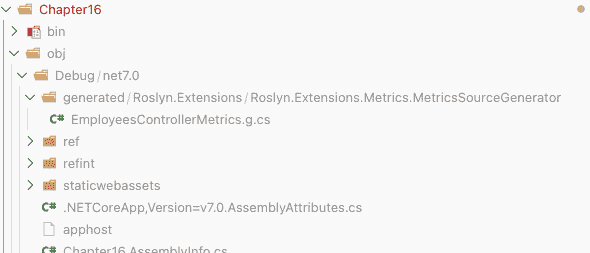
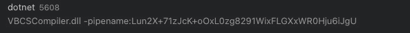

# 生成代码

到目前为止，本书中我们已经探讨了元编程在.NET 运行时是多么强大。在运行时做所有事情的好处是能够适应运行时发生的事情。在运行时做这件事的缺点是它会影响性能。这正是 C# Roslyn 编译器真正发光的地方。我们过去有能力使用像 PostSharp ([`www.postsharp.net/`](https://www.postsharp.net/)) 或**中间语言**（**IL**）编织这样的商业产品来生成代码，使用 Fody ([`github.com/Fody/Fody`](https://github.com/Fody/Fody))等项目。但有了 Roslyn，代码生成真正实现了民主化，并且变得对任何人来说都很容易做到。

个人而言，我多年来一直使用所有这些技术，最终，通过 Roslyn，我可以在不牺牲性能的情况下实现我喜欢的许多元编程。而且我可以以一种比以前更一致的方式做到这一点。

C# Roslyn 编译器通过允许开发者通过一组 API 参与其编译管道来实现这一点。有了这些 API，我们可以调查现有的代码，对其进行分析，然后生成新的代码，这些代码将被编译并集成到最终的二进制文件中。

在本章中，我们将探讨如何利用 Roslyn 编译器扩展来生成代码，深入探讨在编译时生成代码的细节。我们将学习如何检查语法树并生成额外的代码，甚至看看如何使用 Roslyn 通过元数据从代码中生成文本报告。

我们将涵盖以下主题：

+   为 Roslyn 编译器生成额外的代码

+   （滥用）编译器来生成不仅仅是 C#代码

+   提高开发者体验

到本章结束时，你将深刻理解如何使用 Roslyn 在编译时生成代码，并且你将拥有一套技术和最佳实践的工具包，用于在 C#中实现利用 Roslyn 编译器平台能力的元编程技术。因此，让我们深入探讨吧！

# 技术要求

本章特定的源代码可以在 GitHub 上找到（[`github.com/PacktPublishing/Metaprogramming-in-C-Sharp/tree/main/Chapter16`](https://github.com/PacktPublishing/Metaprogramming-in-C-Sharp/tree/main/Chapter16)），并且基于**基础**代码，该代码同样可在 GitHub 上找到（[`github.com/PacktPublishing/Metaprogramming-in-C-Sharp/tree/main/Fundamentals`](https://github.com/PacktPublishing/Metaprogramming-in-C-Sharp/tree/main/Fundamentals)）。

# 为 Roslyn 编译器生成额外的代码

Roslyn 编译器平台最强大的功能之一是能够在编译时生成额外的代码。这意味着我们可以在编译过程中创建新的 C#代码，并将其与其他代码一起编译。

我们将探讨如何利用 Roslyn 生成编译器的额外代码。这非常有用，可以帮助提高你和你的团队的生产力，通过消除重复性任务的需求。由于你在编译器内部工作，你将不得不使用编译器理解的语言以及它表示代码的方式——**抽象语法树**（**ASTs**）。

## ASTs

**AST** 是一种用于表示源代码结构的数据结构。你可以将其与我们在第七章“推理表达式”中看到的 .NET 表达式 API 中的内容进行比较。它是一个由表示语言中找到的代码元素（如类、方法、字段和属性）的节点组成的层次结构。编译器从 AST 生成的结果是其最终阶段的二进制 IL 代码。虽然表达式在运行时执行此操作并且可以在运行时进行修改，但 AST 在进入编译器管道的最终阶段时是静态的。然而，在最终阶段之前，AST 可以被推理并修改。

AST 是通过解析源代码、解释所有关键字和变量，并将其分解为节点来构建的，这些节点随后以树状结构组合在一起。AST 被用作编译器或代码分析工具中代码的中间表示形式。一旦源代码被转换为 AST，分析和处理代码就变得容易得多。例如，一个工具可能使用 AST 来识别潜在的错误或以某种方式转换代码。

Roslyn 的一个关键优势是其可扩展性。因为 Roslyn 是开源的，并提供了一套丰富的 API 用于处理抽象语法树（AST），开发者可以轻松创建自己的代码分析工具，利用编译器的 AST。例如，开发者可能创建一个分析代码安全漏洞的工具，或者一个自动为代码库生成文档的工具。

为了让开发者更容易扩展 Roslyn，平台提供了一系列扩展点，例如以下内容：

+   **语法树**：开发者可以创建自己的语法树来表示代码，并使用 Roslyn API

+   **语法重写器**：开发者可以创建语法重写器，以各种方式转换 AST，例如重命名变量或提取方法

+   **诊断**：开发者可以创建自己的诊断，以识别代码中的问题，例如潜在的错误或样式违规

+   **代码修复提供者**：开发者可以创建代码修复提供者，自动修复诊断中识别出的任何问题

通过这些扩展点，Roslyn 使得开发者能够轻松创建扩展，这些扩展可以改善所编写的代码质量，或者通过自动生成管道代码来提高生产力。

编译器理论和 AST 的工作原理是一个很大的主题，这超出了本书的范围。相反，让我们动手实践，看看可以做什么。

## 应用程序指标

在生产中运行系统的一个重要方面是可观察性。通过可观察性，我指的是观察应用程序重要方面的能力。日志是这些方面之一，其中你使用日志消息对你的代码进行仪表化，这些日志消息会被写入并被日志搜索索引器捕获。日志可能非常冗长，因此它不适合简单的测量值，如计数器、仪表或直方图。

随着.NET 6 的发布，微软引入了一个名为**System.Diagnostics.Metrics**的命名空间。当您想要观察随时间变化的值时，这个新命名空间中的类是完美的。除此之外，还有一些支持**OpenTelemetry**（[`opentelemetry.io`](https://opentelemetry.io)）的包，这使得您能够捕获像 Prometheus、Azure AppInsight 等流行收集器中的不同值。对于我们的示例，我们只将使用控制台查看器。

微软构建了对指标的支持，使用起来非常方便，尽管它缺乏微软为日志构建的优雅和结构化方法。为了看到问题，我们将首先从开箱即用的体验开始使用指标，然后对其进行改进。让我们开始吧！

1.  让我们先为这一章创建一个新的项目。你应该在本书中使用的**Fundamentals**项目旁边创建这个新项目，以及在第十五章中建立的**Roslyn.Extensions**项目*Chapter 15*，*Roslyn* *编译器扩展*。

创建一个名为**Chapter16**的文件夹，在命令行中切换到这个文件夹，并创建一个新的 Web 项目：

```cs
dotnet new web
```

1.  你应该了解 Web 项目的基础知识。让我们将其修改为可以使用控制器。将**Program.cs**文件修改如下所示：

    ```cs
    var builder = WebApplication.CreateBuilder(args);
    builder.Services.AddControllers();
    var app = builder.Build();
    app.UseRouting();
    app.MapControllers();
    app.Run();
    ```

此代码将控制器添加到**builder.Services**中，然后在运行应用程序之前映射应用程序中的所有控制器。

1.  由于目标是捕获指标，你需要一个被称为**仪表**的东西，用于跟踪你想要的值。如果你想为系统中的不同区域创建多个**仪表**类，那也是可以的，但通常每个应用程序只有一个。添加一个名为**Metrics.cs**的文件，并使其看起来如下所示：

    ```cs
    using System.Diagnostics.Metrics;
    namespace Chapter16;
    public static class Metrics
    {
        public static readonly Meter Meter =
            new("Chapter16");
    }
    ```

此代码引入了**System.Diagnostics.Metrics**命名空间，并公开了一个名为**Chapter16**的全局**仪表**。然后，任何应用程序中的代码都可以使用它。

1.  现在，你想要添加一些在仪表中创建值的东西。添加一个名为**EmployeesController.cs**的文件，并使其看起来如下所示：

    ```cs
    using Microsoft.AspNetCore.Mvc;
    namespace Chapter16;
    [Route("/api/employees")]
    public class EmployeesController : Controller
    {
        [HttpGet]
        public IActionResult Register()
        {
            return Ok();
        }
    }
    ```

此代码引入了一个位于**/api/employees**路由的单个操作的 Web API 控制器。该操作仅返回**Ok()** – HTTP 200 状态。

重要提示

对于本章，我们不是关注我们正在构建的功能，而是关注我们试图解决的技術问题。因此，我们也让它接受 HTTP **GET** 请求。通常，它会是 HTTP **POST** 请求，并包含有关要注册的员工的详细信息负载。

1.  让我们使用一个计数器来测量已注册员工的数量来对代码进行度量。为此，你需要在 **EmployeeController.cs** 文件的顶部添加几个 **using** 语句：

    ```cs
    using System.Diagnostics;
    using System.Diagnostics.Metrics;
    ```

1.  现在，你可以在 **EmployeesController** 类中添加一个计数器。在类的顶部添加以下内容：

    ```cs
    static Counter<int> _registeredEmployees =
      Metrics.Meter.CreateCounter<int>("Registered
        Employees", "# of registered employees");
    ```

此代码引入了一个使用全局计量器创建的计数器。它是静态创建的，这样我们就不需要在同一个应用程序中创建多个相同的计数器实例。

1.  要使用计数器，将 **Register()** 方法修改成以下样子：

    ```cs
    [HttpGet]
    public IActionResult Register()
    {
        var now = DateTimeOffset.UtcNow;
        var tags = new TagList(new ReadOnlySpan
           <KeyValuePair<string, object?>>(new
              KeyValuePair<string, object?>[]
        {
            new("Year", now.Year),
            new("Month", now.Month),
            new("Day", now.Day),
        }));
        _registeredEmployees.Add(1, tags);
        return Ok();
    }
    ```

代码通过在 **_registeredEmployees** 计数器上调用 **Add()** 方法来使用该计数器。它还传递了标签，这些标签是在调用 **Add()** 之前设置的。标签是一种将添加的值分组的方式。从顶级来看，计数器将聚合所有标记的值，而你可以在自己的标签上单独监控每个值。这对于分解你想要监控的指标非常有帮助。**Register()** 方法通过年份、月份和日期来分解值。

重要提示

标签值是 **对象**。你也可以传递一个 **DateOnly** 实例，但这说明了多个标签的使用。

1.  在放置了第一个计数器之后，是时候看看这实际上是什么样子了。为此，你需要安装一个名为 **dotnet-counters** 的工具。这可以通过在终端中运行以下命令来完成：

    ```cs
    dotnet tool install --global dotnet-counters
    ```

1.  然后，你可以通过运行以下命令来启动你的应用程序：

    ```cs
    dotnet run
    ```

你应该会看到以下类似的内容：

```cs
Building...
info: Microsoft.Hosting.Lifetime[14]
      Now listening on: http://localhost:5000
info: Microsoft.Hosting.Lifetime[0]
      Application started. Press Ctrl+C to shut down.
info: Microsoft.Hosting.Lifetime[0]
      Hosting environment: Development
info: Microsoft.Hosting.Lifetime[0]
Content root path: /Users/einari/Projects/Metaprogramming-in-C/Chapter16
```

1.  在另一个终端中，你可以通过运行以下命令来启动指标监控器：

    ```cs
    dotnet counters monitor --name Chapter16 --counters
    Chapter16
    ```

你应该会看到以下类似的内容：

```cs
Press p to pause, r to resume, q to quit.
    Status: Running
```

由于还没有对 API 端点发起任何请求，所以值目前不会显示。保持监控器运行，并在浏览器中导航到端点（例如，**http://localhost:5000/api/employees**）；你应该会看到以下类似的内容：

```cs
Press p to pause, r to resume, q to quit.
    Status: Running
[Chapter16]
    RegisteredEmployees (# of registered employees / 1
      sec)
Day=1,Month=5,Year=2023   0
```

值将每秒采样一次。如果你多次点击浏览器，你应该会看到行尾的 **0** 增加，然后回落到 **0**。这是预期的，因为它只显示当前的测量值，而不是随时间聚合的值。

尽管在 .NET 中的指标 API 简单易用，但它很容易变得非常冗长，尤其是当你想要关联标签时。

## 提高开发者体验

在你的业务代码中，每个方法上都有度量指标的设置代码看起来很奇怪。这也非常冗长且繁琐。想象一下，在一个已经发展并需要收集大量度量的应用中；这会变得有些混乱。你可以显然通过封装度量指标来清理这个问题，要么在需要度量的类中使用方法，要么将它们提取到它们自己的类中。

然而，我相当喜欢微软对日志的处理方法，正如我们在**第十四章**中看到的，*面向方面编程*。对于日志处理，它依赖于一个在编译时运行的代码生成器，并将代码放入最终的二进制文件中。

让我们模仿这个方法，并创建一个改进的开发者体验：

1.  在**Fundamentals**项目中，创建一个名为**Metrics**的文件夹。在这个文件夹中，添加一个名为**CounterAttribute.cs**的文件，并使其看起来如下：

    ```cs
    namespace Fundamentals.Metrics;
    [AttributeUsage(AttributeTargets.Method)]
    public sealed class CounterAttribute<T> : Attribute
    {
        public CounterAttribute(string name, string
            description)
        {
            Name = name;
            Description = description;
        }
        public string Name { get; }
        public string Description { get; }
    }
    ```

这段代码引入了一个表示计数器的属性。计数器可以有一个与之关联的名称和描述。这是一个通用属性，允许你指定用于计数器的类型。

1.  在**Fundamentals**项目的**Metrics**文件夹中，添加一个名为**GlobalMetrics.cs**的文件，并使其看起来如下：

    ```cs
    using System.Diagnostics.Metrics;
    namespace Fundamentals.Metrics;
    public static class GlobalMetrics
    {
        public static Meter Meter = new("Global");
    }
    ```

1.  这引入了一个全局可访问的**Meter**实例，这将使你将要构建的代码生成器更容易预测，因为它需要访问这个实例。然而，它默认使用名为**Global**的计量器，我们希望覆盖它。打开**Chapter16**中的**Program.cs**文件，并在**using**语句之后添加以下内容：

    ```cs
    GlobalMetrics.Meter = new Meter("Chapter16");
    ```

本章的目标是提供一个更简单的方式来执行度量。这将通过创建一个提供方法签名但不提供实现的局部类来实现。源代码生成器将创建局部类的实现并为每个方法提供实现。

1.  让我们为**EmployeesController**添加度量文件。添加一个名为**EmployeesControllerMetrics.cs**的文件，并在其中添加以下内容：

    ```cs
    using System.Diagnostics.Metrics;
    using Fundamentals.Metrics;
    namespace Chapter16;
    public static partial class EmployeesControllerMetrics
    {
        [Counter<int>("RegisteredEmployees", "# of
            registered employees")]
        public static partial void
            RegisteredEmployees(DateOnly date);
    }
    ```

代码设置了一个静态的局部类，这对于确定要为哪些类生成源代码是一个重要的标准。所有计数器都表示为具有给定名称和**[Counter]**属性（包含详细信息）的方法。方法上的每个参数都将用作标签。

现在，你已经为源代码生成器能够工作准备了所需的基本内容。

### 设置代码模板

代码生成器将生成实现局部类的代码。为此，你将使用一个表示要生成的源代码的模板文件。作为一个模板语言，你将使用一个叫做**Handlebars**的东西([`handlebarsjs.com`](https://handlebarsjs.com))。这有一个.NET 实现。

打开 **Roslyn.Extensions.csproj** 文件，该文件位于 **Roslyn.Extensions** 文件夹中，并在包含其他包引用的 **ItemGroup** 中添加以下包引用：

```cs
<PackageReference Include="handlebars.net" Version="2.1.4"
  GeneratePathProperty="true" PrivateAssets="all" />
```

**PrivateAssets="all"** 属性指示它仅为此项目提供引用，并且只能与扩展本身一起使用，这意味着来自 **Handlebars** 的任何程序集都不会包含在引用此项目的任何项目中。此外，您必须设置 **GeneratePathProperty="true"**。这将创建一个特定于包的变量，并允许我们指定要使用的 **Handlebars** 的特定程序集；否则，编译器将显示 **FileNotFoundError**。

要指定正确的程序集，请将以下内容添加到 **Roslyn.Extensions.csproj** 文件中，该文件位于 **Roslyn.Extensions** 文件夹的末尾，在 **Project** 标签内：

```cs
<PropertyGroup>
    <GetTargetPathDependsOn>$(GetTargetPathDependsOn);
       GetDependencyTargetPaths</GetTargetPathDependsOn>
</PropertyGroup>
<Target Name="GetDependencyTargetPaths">
    <ItemGroup>
        <TargetPathWithTargetPlatformMoniker
        Include="$(PKGHandlebars_Net)\lib\netstandard2.0\
        Handlebars.dll" IncludeRuntimeDependency="false" />
    </ItemGroup>
</Target>
```

在正确安装了 **Handlebars** 之后，您就可以创建生成代码所需的模板了。在创建模板之前，您需要设置所有将传递给模板的数据类型。

在 **Roslyn.Extensions** 文件夹中，创建一个名为 **Metrics** 的文件夹。添加一个名为 **MetricsTemplateData.cs** 的文件，并将其内容添加如下：

```cs
namespace Roslyn.Extensions.Metrics;
public class MetricsTemplateData
{
    public string Namespace { get; set; } = string.Empty;
    public string ClassName { get; set; } = string.Empty;
    public IEnumerable<CounterTemplateData> Counters { get;
       set; } = Enumerable.Empty<CounterTemplateData>();
}
```

**MetricsTemplateData** 将是传递给模板的根对象。它包含生成代码的命名空间，然后是生成类的类名。然后继续包含它将生成的所有计数器的集合。

对于计数器定义，添加一个名为 **CounterTemplateData.cs** 的文件，并将其内容添加如下：

```cs
namespace Roslyn.Extensions.Metrics;
public class CounterTemplateData
{
    public string Type { get; set; } = string.Empty;
    public string MethodName { get; set; } = string.Empty;
    public string Name { get; set; } = string.Empty;
    public string Description { get; set; } = string.Empty;
    public IEnumerable<CounterTagTemplateData> Tags { get;
      set; } = Enumerable.Empty<CounterTagTemplateData>();
}
```

**CounterTemplateData** 类型包含有关计数器类型、表示它的方法名称、计数器名称以及与计数器一起使用的描述的信息。最后，它包含在调用时与计数器关联的所有标签。

对于标签定义，添加一个名为 **CounterTagTemplateData.cs** 的文件，并使其看起来如下：

```cs
namespace Roslyn.Extensions.Metrics;
public class CounterTagTemplateData
{
    public string Type { get; set; } = string.Empty;
    public string Name { get; set; } = string.Empty;
}
```

标签包含一个类型，这将在被调用方法的签名中反映出来，然后是名称。

当模板的参数对象定义完成后，是时候添加模板了。

在 **Roslyn.Extensions** 文件夹中，创建一个名为 **Templates** 的文件夹，并在 **Templates** 文件夹中添加一个名为 **Metrics.hbs** 的文件，并使其看起来如下：

```cs
using System.Diagnostics;
using System.Diagnostics.Metrics;
using Fundamentals.Metrics;
namespace {{Namespace}};
#nullable enable
public static partial class {{ClassName}}
{
    {{#Counters}}
    static readonly Counter<{{Type}}> {{MethodName}}Metric
      = GlobalMetrics.Meter.CreateCounter<{{Type}}>
         ("{{Name}}", "{{Description}}");
    {{/Counters}}
    {{#Counters}}
    public static partial void {{MethodName}}({{#Tags}}
      {{Type}} {{Name}}{{#unless @last}}, {{/unless}}
          {{/Tags}})
    {
        var tags = new TagList(new ReadOnlySpan
          <KeyValuePair<string, object?>>(new KeyValuePair
             <string, object?>[]
        {
            {{#Tags}}
            new("{{Name}}", {{name}}){{#unless @last}},
              {{/unless}}
            {{/Tags}}
        }));
        {{MethodName}}Metric.Add(1, tags);
    }
    {{/Counters}}
}
```

在模板中，存在数据上下文。顶级项将是**MetricsTemplateData**实例。这是插入**{{Namespace}}**和**{{ClassName}}**值的地方。使用**{{}}**与文本表示可替换的值，而文本本身是当前上下文中存在的属性。当引号内的值以**#**符号开头时，它使用一个函数来解析它。Handlebars 有一些自动魔法，可以识别可枚举的，如**Counters**。Handlebars 将遍历这些，并且在其作用域内的任何内容都将为每个实例输出。模板通过这些技术在整个过程中替换传递给它的对象中找到的所有值。

**EmployeesControllerMetrics**的最终结果将呈现如下：

```cs
using System.Diagnostics;
using System.Diagnostics.Metrics;
using Fundamentals.Metrics;
namespace Chapter16;
#nullable enable
public static partial class EmployeesControllerMetrics
{
    static readonly Counter<int> RegisteredEmployeesMetric
      = GlobalMetrics.Meter.CreateCounter<int>
      ("RegisteredEmployees", "# of registered employees");
    public static partial void RegisteredEmployees(DateOnly
      date)
    {
        var tags = new TagList(new ReadOnlySpan
        <KeyValuePair<string, object?>>(new KeyValuePair
        <string, object?>[]
        {
            new("date", date)
        }));
        RegisteredEmployeesMetric.Add(1, tags);
    }
}
```

在模板就绪的情况下，我们需要一种在代码生成器中程序化访问它的方法。为了实现这一点，你希望在编译时将任何模板文件嵌入到程序集中。

打开**Roslyn.Extensions.csproj**，在**Project**标签内添加一个类似以下的**ItemGroup**：

```cs
<ItemGroup>
    <EmbeddedResource Include="$(MSBuildThisFileDirectory)
      /Templates/**/*.hbs" />
</ItemGroup>
```

**EmbeddedResource**标签指示编译器将**Templates**文件夹内的所有**hbs**文件包含在内，并将它们作为程序集的嵌入式资源。

嵌入式资源是程序集的一部分，被称为资源。它们可以直接在它们所属的程序集上访问。

让我们创建一个辅助类来获取访问模板和未来将添加的模板。在**Roslyn.Extensions**项目的**Templates**文件夹中添加一个名为**TemplateTypes.cs**的文件。使其看起来如下：

```cs
using HandlebarsDotNet;
namespace Roslyn.Extensions.Templates;
public static class TemplateTypes
{
    public static readonly HandlebarsTemplate<object,
      object> Metrics = Handlebars.Compile
        (GetTemplate("Metrics"));
    static string GetTemplate(string name)
    {
        var rootType = typeof(TemplateTypes);
        var stream = rootType.Assembly.GetManifest
        ResourceStream($"{rootType.Namespace}.{name}.hbs");
        if (stream != default)
        {
            using var reader = new StreamReader(stream);
            return reader.ReadToEnd();
        }
        return string.Empty;
    }
}
```

代码在**TemplateTypes**类中引入了一个名为**GetTemplate()**的私有方法。它利用程序集实例上的**GetManifestResourceStream()**。按照惯例，编译器将文件夹及其任何子文件夹的命名空间。访问资源将类似于访问其中的类型。由于模板位于**Templates**文件夹中，它将与**TemplateTypes**类的同一文件夹和同一命名空间相同。因此，这被用作模板名称前缀的前缀。然后代码使用**StreamReader**读取资源流到末尾，给你一个包含模板的字符串。

**TemplateTypes**类顶部有一个属性表示**Metrics**模板。

现在我们已经有了访问它的模板和代码，你可以继续创建代码生成器。

### 构建源代码生成器

为了使代码生成器只为符合标准的类生成代码，你需要一个在每个源代码编译节点上被调用的语法接收器。

在**Roslyn.Extensions**项目的**Metrics**文件夹内添加一个名为**MetricsSyntaxReceiver.cs**的文件。向其中添加以下代码：

```cs
using Microsoft.CodeAnalysis;
using Microsoft.CodeAnalysis.CSharp;
using Microsoft.CodeAnalysis.CSharp.Syntax;
namespace Roslyn.Extensions.Metrics;
public class MetricsSyntaxReceiver : ISyntaxReceiver
{
    readonly List<ClassDeclarationSyntax> _candidates =
      new();
    internal IEnumerable<ClassDeclarationSyntax> Candidates
      => _candidates;
    public void OnVisitSyntaxNode(SyntaxNode syntaxNode)
    {
        if (syntaxNode is not ClassDeclarationSyntax
          classSyntax) return;
        if (classSyntax.Modifiers.Any(modifier =>
          modifier.IsKind(SyntaxKind.PartialKeyword)) &&
            classSyntax.Modifiers.Any(modifier =>
              modifier.IsKind(SyntaxKind.StaticKeyword)))
        {
            if (classSyntax.Members.Any(member =>
             member.IsKind(SyntaxKind.MethodDeclaration) &&
                member.Modifiers.Any(modifier =>
                  modifier.IsKind
                    (SyntaxKind.PartialKeyword)) &&
                member.Modifiers.Any(modifier => modifier
                  .IsKind(SyntaxKind.StaticKeyword))))
            {
                _candidates.Add(classSyntax);
            }
        }
    }
}
```

代码实现了**ISyntaxReceiver**接口，并带有**OnVisitSyntaxNode()**方法，该方法将在编译器的每个 AST 节点上被调用。**MetricsSyntaxReceiver**的目的在于缩小对代码生成感兴趣的类的范围。首先，它通过要求它必须是**类**来过滤，然后看起来这个类是部分静态的。最后的过滤是查找类的任何成员，寻找静态部分方法。如果所有标准都满足，它将把该类添加到候选列表中。

在接收器过滤完成后，现在是设置生成器本身的时候了。在**MetricsSyntaxReceiver.cs**文件旁边，添加一个名为**MetricsSourceGenerator.cs**的文件。将以下代码添加到其中：

```cs
using Microsoft.CodeAnalysis;
using Microsoft.CodeAnalysis.CSharp.Syntax;
using Roslyn.Extensions.Templates;
namespace Roslyn.Extensions.Metrics;
[Generator]
public class MetricsSourceGenerator : ISourceGenerator
{
    public void Execute(GeneratorExecutionContext context)
    {
    }
    public void Initialize(GeneratorInitializationContext
      context)
    {
        context.RegisterForSyntaxNotifications(() => new
          MetricsSyntaxReceiver());
    }
}
```

代码创建了一个名为**MetricsSourceGenerator**的类，该类实现了**ISourceGenerator**接口，并带有其**Execute()**和**Initialize()**方法。为了生成器能够工作，您还必须添加**[Generator]**属性。在**Initialize()**方法中，代码注册了您放入的语法接收器。

在**Execute()**方法中，所有魔法都将发生。让我们首先将以下内容添加到**Execute()**方法的主体中：

```cs
if (context.SyntaxReceiver is not MetricsSyntaxReceiver
  receiver) return;
var counterAttribute = context.Compilation
    .GetTypeByMetadataName("Fundamentals
      .Metrics.CounterAttribute`1");
foreach (var candidate in receiver.Candidates)
{
    var templateData = new MetricsTemplateData
    {
        Namespace = (candidate.Parent as
          BaseNamespaceDeclarationSyntax)!.Name.ToString(),
        ClassName = candidate.Identifier.ValueText
    };
    var semanticModel = context.Compilation
      .GetSemanticModel(candidate.SyntaxTree);
    foreach (var member in candidate.Members)
    {
        if (member is not MethodDeclarationSyntax method)
          continue;
        var methodSymbol = semanticModel
          .GetDeclaredSymbol(method);
        if (methodSymbol is not null)
        {
            var attributes = methodSymbol.GetAttributes();
            var attribute = attributes.FirstOrDefault(_ =>
            SymbolEqualityComparer.Default.Equals
             (_.AttributeClass?.OriginalDefinition,
             counterAttribute));
            if (attribute is not null)
            {
                // Generate
            }
        }
    }
    if (templateData.Counters.Count > 0)
    {
        var source = TemplateTypes.Metrics(templateData);
        context.AddSource($"{candidate.Identifier
          .ValueText}.g.cs", source);
    }
}
```

代码期望**SyntaxReceiver**是**MetricsSyntaxReceiver**；如果不是，它就返回。然后，它继续获取**CounterAttribute**类型定义的实例。注意名称有点奇怪；**CounterAttribute'1**。这是因为该类型是泛型类型，在.NET 内部，类型将根据泛型参数的数量后缀一个数字。

对于**MetricsSyntaxReceiver**找到的所有候选者，代码将循环遍历并为类设置一个**MetricsTemplateData**实例。然后，它根据类的语法树获取所谓的语义模型。Roslyn 中的语义模型提供了对代码意义的更深入理解，这超出了其语法。它可以用于诸如名称绑定、类型检查、错误检查和自动化重构等任务。

类有成员，代码遍历所有成员并过滤掉那些不是方法的成员。从语义模型中，它获取方法的声明符号，这使得我们可以很好地访问其上的属性。然后，它查找**CounterAttribute**。

在最后，它从模板生成源代码，但仅当有要生成的计数器时才会这样做。它通过使用**GeneratorExecutionContext**提供的**AddSource()**方法来提供源代码。生成的文件约定是包含类型名称，然后后缀为**.g.cs**。

为了启动生成器，它需要计数器。将以下代码添加到**Execute()**方法中，替换**// Generate**注释：

```cs
var tags = method.ParameterList.Parameters.Select(parameter
  => new CounterTagTemplateData
{
    Name = parameter.Identifier.ValueText,
    Type = parameter.Type!.ToString()
});
var type = attribute.AttributeClass!.TypeArguments[0]
     .ToString();
var name = attribute.ConstructorArguments[0].Value!
    .ToString();
var description = attribute.ConstructorArguments[1].Value!
    .ToString();
templateData.Counters.Add(
        new CounterTemplateData
        {
            Name = name,
            Description = description,
            Type = type,
            MethodName = method.Identifier.ValueText,
            Tags = tags
        });
```

代码从属性和方法信息中收集信息，以提供模板所需的数据。

这基本上就是生成器要做的所有事情。由于我们依赖于在*第十五章*中完成的设置，*Roslyn 编译器扩展*，我们现在需要做的就是开始使用它。

### 测试源生成器

要编译并使**Chapter16**代码工作，请按照以下步骤操作：

1.  首先，您需要为**基础**项目添加一个引用：

    ```cs
    dotnet add reference ../Fundamentals/Fundamentals.csproj
    ```

1.  然后，您需要**Roslyn.Extensions**项目的引用。这需要稍微不同一些，因为您希望它自动使用生成器。在**Chapter16.csproj**文件中，在**基础**项目的引用旁边添加一个**ProjectReference**，如下所示：

    ```cs
    <ProjectReference Include="..\Roslyn.Extensions\
      Roslyn.Extensions.csproj" OutputItemType="Analyzer"
        ReferenceOutputAssembly="false" />
    ```

这指示引用使用分析器，并且不在**第十六章**的输出中包含其任何程序集。

1.  要开始使用新的指标方式，您需要更改**EmployeeController**类。在**Chapter16**文件夹中打开**EmployeeController.cs**文件，并将**Register()**方法更改为以下内容：

    ```cs
    [HttpGet]
    public IActionResult Register()
    {
        EmployeesControllerMetrics.RegisteredEmployees
          (DateOnly.FromDateTime(DateTime.UtcNow));
        return Ok();
    }
    ```

代码现在使用新的部分类，而不是自己处理计数器和标签。

1.  在**第十六章**项目上执行构建：

    ```cs
    dotnet build
    ```

在**obj**文件夹中，您现在可以看到源生成器的结果：



图 16.1 – 文件系统中的生成文件

1.  打开**EmployeesControllerMetrics.g.cs**并确认您有预期的结果：

    ```cs
    using System.Diagnostics;
    using System.Diagnostics.Metrics;
    using Fundamentals.Metrics;
    namespace Chapter16;
    #nullable enable
    public static partial class EmployeesControllerMetrics
    {
        static readonly Counter<int> RegisteredEmployees
      Metric = GlobalMetrics.Meter.CreateCounter
        <int>("RegisteredEmployees", "# of registered
           employees");
        public static partial void RegisteredEmployees
          (DateOnly date)
        {
            var tags = new TagList(new ReadOnlySpan
              <KeyValuePair<string, object?>>(new
                KeyValuePair<string, object?>[]
            {
                new("date", date)
            }));
            RegisteredEmployeesMetric.Add(1, tags);
        }
    }
    ```

1.  运行您的项目，然后通过运行以下命令启动监控：

    ```cs
    dotnet counters monitor -n Chapter16 --counters
    Chapter16
    ```

1.  然后通过浏览器导航到端点（例如，**http://localhost:5000/api/employees**）来触发 API。您应该看到以下类似输出：

    ```cs
    Press p to pause, r to resume, q to quit.
    Status: Running
    [Chapter16]
        RegisteredEmployees (# of registered employees / 1
          sec)
            date=5/1/2023              0
    ```

这种技术可以非常强大。可以支持更多类型的指标并扩展，为您提供一个更直观和简单的方式来处理指标值。

添加要编译的源代码非常强大，您不仅限于添加部分类；实际上，您可以添加任何您想要的，这可以非常有用。但话虽如此，您不仅限于为编译器输出源文件。您还可以生成其他工件。

# （滥用）编译器来生成不仅仅是 C#代码

由于您基本上可以在代码生成器中做任何事情，您可以去生成其他任何东西。我们在日常工作中用它来做的一件事是从我们的 C#代码生成 TypeScript 文件。这非常有用，我们节省了大量时间，并在 TypeScript 中获得了与 C# REST API 一致的一致性。

让我们去做一些不会最终出现在 C#文件中的事情。基于 GitHub 仓库中的**基础**项目和您在本书中迄今为止所构建的内容，您应该有一个名为**Fundamentals.Compliance.GDPR**的命名空间和一个名为**PersonalIdentifiableInformation**的属性，该属性在*第五章*中介绍，*利用属性*。

这个属性非常适合标记收集**个人身份信息**（**PII**）的类型以及收集 PII 的原因。在*第五章*中，*利用属性*，我们在运行时用它来创建运行时报告。我们本可以做的另一件事是在编译时创建这个报告。

在**Chapter16**文件夹中添加一个名为**Employee**的文件，并使其看起来如下所示：

```cs
using Fundamentals.Compliance.GDPR;
namespace Chapter16;
public record Employee(
    [PersonalIdentifiableInformation("Needed for
      registration")]
    string FirstName,
    [PersonalIdentifiableInformation("Needed for
      registration")]
    string LastName,
    [PersonalIdentifiableInformation("Needed for uniquely
      identifying an employee")]
    string SocialSecurityNumber);
```

**Employee**类型具有用**[PersonalIdentifiableInformation]**属性注解的属性，声明了收集信息的具体原因。这是我们希望在 GDPR 报告中输出的内容，说明哪些类型具有包含 PII 的成员。

## 构建生成器

为了让我们的生成器知道在哪里输出结果文件，它需要一个可配置的属性。在编译器上下文中运行时的当前目录是编译器所在的位置，通常是一个您没有写入权限的地方。此外，在随机位置写入文件也不是很有用。

生成器可以在**.csproj**文件中具有属性。为了让它们对生成器可见，您需要告诉编译器该属性应该是可见的。为此，打开位于**Roslyn.Extensions**文件夹中的**Roslyn.Extensions.props**文件，并在**Project**标签内添加一个看起来如下所示的**ItemGroup**：

```cs
<ItemGroup>
    <CompilerVisibleProperty Include="GDPRReport"/>
</ItemGroup>
```

然后，在**Chapter16**文件夹中的**Chapter16.csproj**文件中，您需要添加对**props**文件的引用。在**Project**标签内文件的顶部添加以下内容：

```cs
<Import Project="$(MSBuildThisFileDirectory)../
  Roslyn.Extensions/Roslyn.Extensions.props"/>
```

然后，在**PropertyGroup**内添加以下内容：

```cs
<GDPRReport>$(MSBuildThisFileDirectory)GDPRReport.txt</GDPR
  Report>
```

这将**GDPRReport**变量配置为指向**Chapter16.csproj**文件的文件夹，然后向路径中添加**GDPRReport.txt**。

正如您在度量源生成器中所做的那样，您需要一个语法接收器来过滤候选者。

在**Roslyn.Extensions**项目中创建一个名为**GDPR**的文件夹，并添加一个名为**GDPRSyntaxReceiver.cs**的文件。使文件看起来如下所示：

```cs
using Microsoft.CodeAnalysis;
using Microsoft.CodeAnalysis.CSharp.Syntax;
namespace Roslyn.Extensions.GDPR;
public class GDPRSyntaxReceiver : ISyntaxReceiver
{
    readonly List<TypeDeclarationSyntax> _candidates =
      new();
    internal IEnumerable<TypeDeclarationSyntax> Candidates
       => _candidates;
    public void OnVisitSyntaxNode(SyntaxNode syntaxNode)
    {
        if (syntaxNode is not TypeDeclarationSyntax
          typeSyntax) return;
        _candidates.Add(typeSyntax);
    }
}
```

这个语法接收器的过滤器很简单。它对类型语法节点感兴趣。这包括类和记录。

现在您需要源生成器。在**GDPRSyntaxReceiver.cs**文件旁边添加一个名为**GDPRSourceGenerator.cs**的文件，并将其中的以下内容添加到其中：

```cs
using Microsoft.CodeAnalysis;
using Microsoft.CodeAnalysis.CSharp.Syntax;
namespace Roslyn.Extensions.GDPR;
[Generator]
public class GDPRSourceGenerator : ISourceGenerator
{
    public void Execute(GeneratorExecutionContext context)
    {
        if (context.SyntaxReceiver is not
          GDPRSyntaxReceiver receiver) return;
        context.AnalyzerConfigOptions.GlobalOptions
          .TryGetValue("build_property.GDPRReport", out var
            filename);
        var writer = File.CreateText(filename);
        writer.AutoFlush = true;
        var piiAttribute = context.Compilation
        .GetTypeByMetadataName("Fundamentals.Compliance
        .GDPR.PersonalIdentifiableInformationAttribute");
    }
    public void Initialize(GeneratorInitializationContext
      context)
    {
        context.RegisterForSyntaxNotifications(() => new
          GDPRSyntaxReceiver());
    }
}
```

代码为源生成器设置了基本设置，并为**Execute()**方法设置了初始值。它只有在**SyntaxReceiver**是**GDPRSyntaxReceiver**时才会执行任务。接下来，它从配置中获取**GDPRReport**变量。所有值都以**build_property**为前缀，对于来自构建的值。然后它继续创建报告文件，在获取用于后续过滤的**PersonalIdentifiableInformationAttribute**类型之前。

继续使用以下代码**Execute()**方法：

```cs
foreach (var candidate in receiver.Candidates)
{
    var semanticModel = context.Compilation
      .GetSemanticModel(candidate.SyntaxTree);
    var symbols = new List<ISymbol>();
    if (candidate is RecordDeclarationSyntax record)
    {
        foreach (var parameter in record.ParameterList!
          .Parameters)
        {
            var parameterSymbol = semanticModel
              .GetDeclaredSymbol(parameter);
            if (parameterSymbol is not null)
            {
                symbols.Add(parameterSymbol);
            }
        }
    }
    foreach (var member in candidate.Members)
    {
        if (member is not PropertyDeclarationSyntax
          property) continue;
        var propertySymbol = semanticModel
          .GetDeclaredSymbol(property);
        if (propertySymbol is not null)
        {
            symbols.Add(propertySymbol);
        }
    }
}
```

代码从语法接收者查看候选者。如果候选者是一个记录，它将枚举其参数并将它们作为感兴趣的符号添加。然后它继续遍历候选者的成员，并将它们作为感兴趣的符号添加。

现在您已经收集了所有感兴趣的符号，是时候过滤出仅带有**PersonalIdentifiableInformation**属性的符号了。

在候选者的**foreach**循环中，在末尾添加以下内容：

```cs
var memberNamesAndReasons = new List<(string MemberName, string Reason)>();
foreach (var symbol in symbols)
{
    var attributes = symbol.GetAttributes();
    var attribute = attributes.FirstOrDefault(_ =>
      SymbolEqualityComparer.Default.Equals(
        _.AttributeClass?.OriginalDefinition,
          piiAttribute));
    if (attribute is not null)
    {
        memberNamesAndReasons.Add((symbol.Name,
          attribute.ConstructorArguments[0].Value!
           .ToString()));
    }
}
if (memberNamesAndReasons.Count > 0)
{
    var @namespace = (candidate.Parent as
      BaseNamespaceDeclarationSyntax)!.Name.ToString();
    writer.WriteLine($"Type: {@namespace}
      .{candidate.Identifier.ValueText}");
    writer.WriteLine("Members:");
    foreach (var (memberName, reason) in
      memberNamesAndReasons)
    {
        var reasonText = string.IsNullOrEmpty(reason) ? "No
          reason provided" : reason;
        writer.WriteLine($"  {memberName}: {reasonText}");
    }
    writer.WriteLine(string.Empty);
}
```

代码通过查看任何属性来迭代符号。如果符号具有**[个人可识别信息]**属性，它将被添加到**memberNamesAndReason**列表中。

如果**memberNamesAndReason**列表中有成员，它将输出类型和成员及其原因。

现在，您可以在**第十六章**文件夹中构建您的应用程序：

```cs
dotnet build
```

您现在应该在项目文件夹中看到一个名为**GDPRReport.txt**的文件。打开它，确认您看到以下内容：

```cs
Type: Chapter16.Employee
Members:
  FirstName: Needed for registration
  LastName: Needed for registration
  SocialSecurityNumber: Needed for uniquely identifying an
    employee
```

在您的代码中拥有这种透明度，并能够将其展示给官方审计员是很好的。这表明您对合规性有控制权，这最终将有助于您长期发展。您还可以通过将其添加到源代码存储库来对文件进行版本控制，然后在发布构建期间，您可以提交对它的任何更改。

与扩展编译器本身相比，这是与您在正常应用程序开发中预期的运行时环境略有不同。您可能已经开始了如何调试的询问，并且可能已经经历过代码即使应该工作却不起作用的情况。

# 提高开发者体验

与 Roslyn 编译器一起工作可能很困难。毕竟，它是在编译器上下文中运行的。减轻痛苦的一种方法是通过单元测试，并实际上从测试中测试所有代码，我们将在*第十七章*中更详细地探讨，*静态代码分析*。

## 调试

然而，有时您只需要通过调试器用肉眼查看事物。我用于此的技术是将以下代码添加到我的 Roslyn 扩展代码中：

```cs
while (!System.Diagnostics.Debugger.IsAttached)
Thread.Sleep(10);
```

然后，我可以在想要中断的地方设置断点，然后附加调试器。您希望将其附加到编译器上，它通常显示如下：



图 16.2 – 附加到缓存的编译器过程

另一件可能令人痛苦的事情是，如果您在扩展中做更改，这些更改没有反映出来。这可能有几个原因。一个是它没有在项目中使用扩展的增量构建期间看到任何更改。您可以通过以下方式清理构建输出：

```cs
dotnet clean
```

否则，您可以运行构建，告诉它不要执行增量构建，如下所示：

```cs
dotnet build --no-incremental
```

另一种可能发生的情况是编译器在内存中保留了一个构建服务器，它缓存了一些内容并优化了开发者的体验。有时，你需要关闭它。你可以通过以下方式做到这一点：

```cs
dotnet build-server shutdown
```

## 优化

可以应用于源生成器的一种优化形式是使用增量源生成器方法。它结合了语法接收器和生成器，在构建服务器运行时持续运行，在编辑器中输入时提供代码生成（对于支持它的编辑器）。

与编译器一起工作可能会有些繁琐，但当你让一切正常运行时，这绝对是值得的。

# 摘要

在本章中，我们探讨了如何利用 Roslyn 编译器扩展在编译时生成代码。我们研究了为编译器生成额外代码的基础。我们还探讨了如何利用 Roslyn 源生成器生成除 C# 之外的文件，这是一种强大的技术，可以提高生产力，同时也提供真正的商业价值。

现在，你应该已经了解了 C# 代码生成器是什么以及如何实现一个。而且，希望你也已经有了一些关于如何使用它的想法。

正如我在本章中提到的，我们利用编译器的可扩展性和生成代码的能力来实际生成 TypeScript 代码。这已经证明对我们的开发者来说是一个巨大的生产力提升。已经有一些代码生成器可以将 OpenAPI 定义转换为 JavaScript 或 TypeScript，但它们随后就局限于这个标准所支持的功能。如果你希望它以某种形状存在，或者支持特定的前端框架，那么这可能就不够了。我们有了这些需求，然后决定构建一个支持我们需求的扩展。

在下一章中，我们将更进一步，探讨如何使用 Roslyn 编译器扩展进行静态代码分析。正如你可能已经注意到的，我倾向于关注代码质量。接下来，我们将探讨如何构建自定义代码分析器和代码修复，我们将看到这些工具如何被用来自动检测和纠正编码问题。
