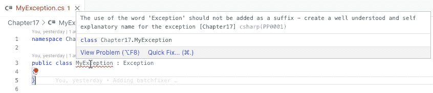
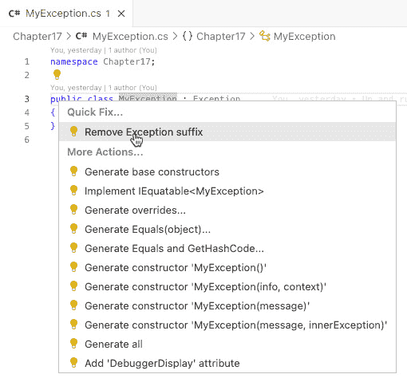

# 静态代码分析

在当今的软件开发世界中，我认为编写干净且易于维护的代码比以往任何时候都更重要。软件的日益复杂化、劳动力留存率的降低以及竞争的加剧应促使我们标准化编写软件的方式，让下一个开发者进入代码库时能够站在成功的起点。当开发者心中有所意识时，尽早捕捉错误非常重要。实现这一目标的一种方式是通过使用静态代码分析，它允许开发者在代码执行之前就识别出潜在的问题和错误。在 C#中，通过 Roslyn 编译器扩展，开发者能够创建自定义分析器和代码修复，这有助于自动化这一过程。

在本章中，我们将探讨静态代码分析的基础以及如何使用 Roslyn 编译器扩展编写自己的分析器和代码修复。我们将从编写分析器的基础到创建自动化测试，确保代码按预期工作的一切内容。

不论你是寻求提高代码质量的资深开发者，还是静态代码分析领域的初学者，本章都将为你提供开始使用 Roslyn 编译器扩展并提升代码分析水平的工具和知识。

+   什么是静态代码分析？

+   如何编写分析器

+   如何为分析器编写代码修复

+   如何编写自动化测试

在本章结束时，你应该对如何使用 Roslyn 编译器扩展在 C#中实现静态代码分析有一个扎实的理解。你应该能够编写自己的自定义分析器和代码修复，并了解如何创建自动化测试以确保其实现的正确性。此外，你应该对静态代码分析的好处以及它如何提高代码的整体质量和可维护性有一个良好的理解。有了这些知识，你将能够将静态代码分析技术应用到自己的开发项目中，从而实现更高效和有效的软件开发。

# 技术要求

本章的特定源代码可以在 GitHub 上找到（[`github.com/PacktPublishing/Metaprogramming-in-C-Sharp/tree/main/Chapter17`](https://github.com/PacktPublishing/Metaprogramming-in-C-Sharp/tree/main/Chapter17)），并且它建立在 GitHub 上找到的**基础**代码之上（[`github.com/PacktPublishing/Metaprogramming-in-C-Sharp/tree/main/Fundamentals`](https://github.com/PacktPublishing/Metaprogramming-in-C-Sharp/tree/main/Fundamentals)）。它还利用了 GitHub 仓库中找到的**Roslyn.Extensions**代码（[`github.com/PacktPublishing/Metaprogramming-in-C-Sharp/tree/main/Roslyn.Extensions`](https://github.com/PacktPublishing/Metaprogramming-in-C-Sharp/tree/main/Roslyn.Extensions)）。

# 什么是静态代码分析？

**静态代码分析**是一种在代码执行之前检测问题的强大技术。虽然它可能看起来是一种相对较新的发展，但事实是静态代码分析已经存在了几十年，并且已经在 C/C++等语言中通过 linters 等工具得到应用。

Linters 本质上是一种静态代码分析工具，它分析源代码以标记可疑的结构或样式不一致。它们已经存在了几十年，并且在 C/C++等语言中得到了广泛的应用，以提高代码质量和可维护性。

近年来，随着 JavaScript 和 TypeScript 等语言的出现，静态代码分析变得更加流行。例如，ESLint 这样的工具已经开发出来，为 JavaScript 和 TypeScript 开发者提供类似的好处，通过分析代码以查找潜在问题并提供最佳实践的反馈。

微软的.NET 编译器**软件开发工具包**（**SDK**）采取了一种全面的方法来扩展编译器。它不仅关注扩展其功能，而且 SDK 还使代码能够识别代码编辑器或**集成开发环境**（**IDE**）中的潜在问题。此功能由流行的编辑器支持，包括**Visual Studio Code**（**VSCode**）、Rider 和 Visual Studio。当你处理文件时，编辑器会在后台运行分析器，用波浪线突出显示潜在问题。这些分析器可以标记不正确或可以改进的代码，提供实时反馈，帮助你更有效地捕捉和纠正错误。

除了分析器之外，微软还引入了代码修复功能，这是一个允许分析器供应商提供可以自动修复标记的代码问题的功能。这些代码修复在编辑器中以灯泡的形式表示，你可以点击它们来执行代码修复。有了这个功能，你可以快速轻松地应用修复并提高代码的整体质量。

在接下来的章节中，我们将概述在 C#编译器上下文中静态代码分析和代码修复，以及它们是如何工作的。虽然我们不会深入探讨这个主题，但我们会提供你开始所需的信息。重要的是要注意，C#编译器 API 非常广泛，提供了巨大的可能性，这个介绍将作为探索这些功能的起点。

让我们深入探讨如何编写分析器。

# 如何编写分析器

微软已经使编写在编译过程中自动运行的作为一部分的分析器变得非常简单。它遵循与我们在*第十六章*，“生成代码”中看到的源生成器相同的原理。一旦你设置了项目，就像我们在*第十五章*，“Roslyn 编译器扩展”中所做的那样，那就只是插入一个代表分析器的类。

在本章中，所有代码都假设你已经有了我们在*第十五章*中建立的**Roslyn.Extensions**项目，*Roslyn* *编译器扩展*。

我们将要制作的分析器是一个高度有争议的，它会影响异常类型的命名。我们倾向于做的一件事是在我们的类型后缀上加上它们在技术上代表的内容；例如，异常通常后缀为**Exception**。查看.NET 基类库中找到的异常，你会看到像**NotImplementedException**、**ArgumentException**或**ArgumentNullException**这样的东西。这是我个人不喜欢的东西，我认为这不是需要传达的重要信息，我们应该将精力投入到为它们所做的事情正确命名类型。

以**ArgumentException**为例。其名称并不能传达其用途。只需将其更名为**InvalidArgument**，就能传达出存在违规——*参数* *无效*。

你可能不会同意你代码库中这种类型的规则。但让我们先暂时放下这一点，只把它作为一个例子。

## 完善分析器

让我们从为分析器创建一个家开始。在**Roslyn.Extensions**项目中，添加一个名为**CodeAnalysis**的文件夹。我喜欢为每种分析器类型创建文件夹，因为我们可能需要为分析器提供代码修复，并且我们可能希望创建的不仅仅是分析器类。按照这个原则，在**CodeAnalysis**文件夹内添加一个名为**ExceptionShouldNotBeSuffixed**的文件夹；这将作为分析器的名称。

在**ExceptionShouldNotBeSuffixed**中，你现在可以添加一个名为**Analyzer.cs**的文件。将以下内容放入该文件中：

```cs
using System.Collections.Immutable;
using Microsoft.CodeAnalysis;
using Microsoft.CodeAnalysis.CSharp;
using Microsoft.CodeAnalysis.CSharp.Syntax;
using Microsoft.CodeAnalysis.Diagnostics;
namespace Roslyn.Extensions.CodeAnalysis
  .ExceptionShouldNotBeSuffixed;
[DiagnosticAnalyzer(LanguageNames.CSharp)]
public class Analyzer : DiagnosticAnalyzer
{
}
```

代码通过从**.NET Compiler SDK**中的**DiagnosticAnalyzer**类型继承来设置分析器的基础。除此之外，它还通过**[DiagnosticAnalyzer]**属性装饰了类，指示支持的语言是 C#。所有的**using**语句都是为了后续代码。

重要提示

分析器可以通过指定它支持的其他语言来支持多种语言。然而，这可能会影响分析器的复杂性，因为**抽象语法树**（**AST**）的表示方式存在差异。

为了使分析器正常工作并连接起来，它需要正确配置并注册任何应该被调用的操作。

将以下方法添加到**Analyzer**类中：

```cs
public override void Initialize(AnalysisContext context)
{
    context.EnableConcurrentExecution();
    context.ConfigureGeneratedCodeAnalysis
      (GeneratedCodeAnalysisFlags.None);
    context.RegisterSyntaxNodeAction(
        HandleClassDeclaration,
        ImmutableArray.Create(
            SyntaxKind.ClassDeclaration));
}
```

代码在传递的 **AnalysisContext** 上调用 **EnableConcurrentExecution()**，这通知编译器您的分析器可以以异步方式与其他分析器并发执行。如果您的分析器不支持并发执行，您可以简单地省略此调用。如果您的分析器支持并发执行，它可以帮助加快您的构建速度，使您的开发过程更加高效。接下来，它配置是否应在生成的代码上运行您的分析器。您现在构建的分析器不应关心生成的代码；因此，它被配置为忽略它。

最后，代码注册了一个要在语法节点上运行的操作。**语法节点** 是 AST 的基本单元，正如我们在 *第十六章*，*生成代码* 中所看到的，对应于特定的语法结构，例如方法调用、循环语句或类声明。语法节点作为内存中的对象表示，并以树状结构链接在一起，反映了源代码的结构。

在我们的案例中，我们只对类声明感兴趣；因此，它使用 **SyntaxKind.ClassDeclaration** 注册了一个 **HandleClassDeclaration** 回调。

当分析器遇到问题时，它需要向编译器产生一个响应，告诉存在一个问题，并且应该报告给开发者。问题表示被形式化为称为 **DiagnosticDescriptor** 的东西。您需要为每个特定的破坏性规则创建特定的这些。

将以下内容添加到 **Analyzer** 类的顶部：

```cs
public const string DiagnosticId = "PP0001";
public static readonly DiagnosticDescriptor BrokenRule =
  new(
        id: DiagnosticId,
        title: "ExceptionShouldNotBeSuffixed",
        messageFormat: "The use of the word 'Exception'
        should not be added as a suffix - create a well
        understood and self explanatory name for the
        exception",
        category: "Naming",
        defaultSeverity: DiagnosticSeverity.Error,
        isEnabledByDefault: true,
        description: null,
        helpLinkUri: string.Empty,
        customTags: Array.Empty<string>());
public override ImmutableArray<DiagnosticDescriptor>
  SupportedDiagnostics => ImmutableArray.Create
    (BrokenRule);
```

代码建立了一个自定义的 **DiagnosticDescriptor**，它包含对唯一诊断标识符（**PP0001**）、标题和显示给开发者的消息的引用。它还将破坏性规则放入一个类别（**命名**）。由于类别是一个字符串，这可以是任何东西，但有一些其他分析器使用的知名类别，例如 **命名**、**设计**、**正确性**、**性能**和**文档**。这些类别被工具用于让开发者将代码库中的警告或错误分组。在描述符中，您还放入破坏性规则的严重程度级别。级别如下表所示：

| **Level** | **Description** |
| --- | --- |
| Hidden | 不会通过常规方式呈现 |
| Info | 不表示问题的信息 |
| Warning | 可疑但允许；开发者只需知道即可 |
| Error | 不允许；构建将被破坏 |

重要提示

如果使用您分析器的开发者决定在 **.csproj** 文件中使用 **TreatWarningsAsErrors** 选项，警告将被视为错误并中断构建。包含在此扩展项目中的 **Roslyn.Extension.props** 文件已将该选项启用。

**DiagnosticDescriptor**的最后几个属性是进一步细节，以帮助开发者理解你想要传达的编译器错误或警告。例如，你可以包含一个链接到网页，详细描述分析器或你已实现的特定规则。

## 处理语法节点

为了使分析器工作，你需要实现**Initialize**方法期间提供的**HandleClassDeclaration**回调。将以下私有方法添加到**Analyzer**类中：

```cs
    void HandleClassDeclaration(SyntaxNodeAnalysisContext
      context)
    {
        var classDeclaration = context.Node as
          ClassDeclarationSyntax;
        if (classDeclaration?.BaseList == null ||
          classDeclaration?.BaseList?.Types == null)
            return;
        var classSymbol = context.SemanticModel
          .GetDeclaredSymbol(classDeclaration);
        if (classSymbol?.BaseType is null) return;
        var exceptionType = context.Compilation
          .GetTypeByMetadataName("System.Exception");
        if (SymbolEqualityComparer.Default.Equals
          (classSymbol?.BaseType, exceptionType) &&
            classDeclaration.Identifier.Text
              .EndsWith("Exception", StringComparison
               .InvariantCulture))
        {
            var diagnostic = Diagnostic.Create(BrokenRule,
              classDeclaration.Identifier.GetLocation());
            context.ReportDiagnostic(diagnostic);
        }
    }
```

代码首先查看正在分析的语法节点。语法节点通常是方法声明、类定义或变量声明等。语法节点用于表示代码的结构，但不传达关于代码意义或语义的信息。

代码假设语法节点是**ClassDeclarationSyntax**节点，因为这是在**Initialize()**方法中配置为过滤器的。然后它查看**BaseList**属性，看类声明是否继承自其他类型。如果没有，分析器对节点不感兴趣，因为它只想分析继承自**Exception**的类型。

为了让分析器理解传递的节点语义意义，它必须使用**SemanticModel**来实现。从声明的符号，它确保有一个基类型；如果没有，它就返回。

接下来，代码请求**System.Exception**类型的表示，然后用于检查**BaseType**是否实际上是一个异常。如果是异常，它将检查类标识符，看它是否以**Exception**文本结尾。如果是，它将报告一个包含错误位置类声明标识符的断言规则的实例。

这基本上就是创建一个简单分析器的全部内容。

## 发布跟踪

假设你构建了**Roslyn.Extensions**项目，你会得到一个类似于以下警告：

```cs
MSBuild version 17.5.1+f6fdcf537 for .NET
  Determining projects to restore...
  All projects are up-to-date for restore.
/Users/einari/Projects/Metaprogramming-in-C/
Roslyn.Extensions/CodeAnalysis/ExceptionShouldNotBeSuffixed
/Analyzer.cs(15,10): warning RS2008: Enable analyzer
release tracking for the analyzer project containing rule
'PP0001' [/Users/einari/Projects/Metaprogramming-in-C/
Roslyn.Extensions/Roslyn.Extensions.csproj]
  Roslyn.Extensions -> /Users/einari/Projects/
Metaprogramming-in-C/Roslyn.Extensions/bin/
Debug/netstandard2.0/Roslyn.Extensions.dll
Build succeeded.
/Users/einari/Projects/Metaprogramming-in-C/
Roslyn.Extensions/CodeAnalysis/ExceptionShouldNotBeSuffixed
/Analyzer.cs(15,10): warning RS2008: Enable analyzer
release tracking for the analyzer project containing rule
'PP0001' [/Users/einari/Projects/Metaprogramming-in-
C/Roslyn.Extensions/Roslyn.Extensions.csproj]
    1 Warning(s)
    0 Error(s)
Time Elapsed 00:00:00.52
```

**RS2008**警告告诉你，我们可以向项目中添加信息，使跟踪打包分析器和它提供的规则更容易。如果你认为这不重要，你可以忽略这个警告并继续。

为了满足警告，我们需要提供两个文件。一个是包含已发货规则的文件，另一个是包含未发货规则的文件。对于初始发布，未发货规则文件通常为空，而你可能会在即将发布的规则的发布中添加未发货规则。当规则发货时，你通常将这些规则从未发货移动到已发货。

你可以在 GitHub 上阅读更多关于这些文件目的的详细信息（[`github.com/dotnet/roslyn-analyzers/blob/main/src/Microsoft.CodeAnalysis.Analyzers/ReleaseTrackingAnalyzers.Help.md`](https://github.com/dotnet/roslyn-analyzers/blob/main/src/Microsoft.CodeAnalysis.Analyzers/ReleaseTrackingAnalyzers.Help.md)）。

让我们在 **Roslyn.Extensions** 项目的根目录下添加一个名为 **AnalyzerReleases.Shipped.md** 的文件，并将其以下内容添加到其中：

```cs
## Release 1.0
### New Rules
Rule ID | Category | Severity | Notes
--------|----------|----------|--------------------
PP0001  |  Naming  |  Error   |
```

内容表明这是一个 **1.0** 版本的发布版本，并提供了一个规则表。在你的情况下，你只有一个规则。**注释**列可以包含分析器的名称，如果你愿意，还可以包含一个指向违反规则描述的链接。

在放置了发布文件后，你需要一个未发布的文件。添加一个名为 **AnalyzerReleases.Unshipped.md** 的文件。在此阶段，此文件可以是空的，所以只需保持原样。

当将你的 Roslyn 扩展打包成 NuGet 包时，你希望包含这些文件。打开 **Roslyn.Extensions.csproj** 文件，并在文件的底部，在 **Project** 标签内添加以下内容：

```cs
<ItemGroup>
    <AdditionalFiles Include="AnalyzerReleases.Shipped.md" />
    <AdditionalFiles Include="
      AnalyzerReleases.Unshipped.md" />
</ItemGroup>
```

就这样！你的分析器现在已经准备好投入实际应用并使用了。

## 尝试使用分析器

为了测试分析器并确认其按预期工作，你需要一个包含违反规则代码的项目放入分析器中：

1.  创建一个新文件夹，位于 **Roslyn.Extensions** 文件夹旁边，名为 **Chapter17**。在终端中，在 **Chapter17** 文件夹内创建一个新的项目：

    ```cs
    dotnet new console
    ```

1.  然后你需要一个对 **Roslyn.Extensions** 项目的引用。项目引用不能是标准的项目引用；它需要稍微有所不同。在 **Chapter17.csproj** 文件的 **Project** 标签内添加以下内容：

    ```cs
    <ItemGroup>
        <ProjectReference Include="..\Roslyn.Extensions\
          Roslyn.Extensions.csproj" OutputItemType=
            "Analyzer" ReferenceOutputAssembly="false" />
    </ItemGroup>
    ```

通过告诉它 **OutputItemType** 是 **Analyzer**，它将自动将 **Roslyn.Extensions** 项目的程序集输出连接到编译器。将 **ReferenceOutputAssembly** 设置为 **false** 告诉它，项目的编译输出将不会引用 **Roslyn.Extensions** 项目的输出程序集。

1.  由于你的 **Roslyn.Extensions** 项目在此阶段应该包含在 *第十六章* 中构建的 **通用数据保护条例** （**GDPR**）解决方案，并且它需要一个配置属性存在，你需要在 **Chapter17.csproj** 文件的 **PropertyGroup** 标签内添加以下内容：

    ```cs
    <GDPRReport>$(MSBuildThisFileDirectory)GDPRReport.txt
      </GDPRReport>
    ```

1.  然后，在 **Chapter17** 文件夹中的 **Chapter17.csproj** 文件中，你需要添加对 **Roslyn.Extensions** 项目中 props 文件的引用。在文件的顶部，在 **Project** 标签内添加以下内容：

    ```cs
    <Import Project="$(MSBuildThisFileDirectory)
      ../Roslyn.Extensions/Roslyn.Extensions.props"/>
    ```

1.  在 **Chapter17** 文件夹中，添加一个名为 **MyException.cs** 的文件，并将其内容添加到其中：

    ```cs
    namespace Chapter17;
    public class MyException : Exception
    {
    }
    ```

1.  打开你的终端并执行构建，你应该看到如下所示的内容：

    ```cs
    MSBuild version 17.5.1+f6fdcf537 for .NET
      Determining projects to restore...
      All projects are up-to-date for restore.
      Roslyn.Extensions -> /Users/einari/Projects/
    Metaprogramming-in-C/Roslyn.Extensions/bin/Debug/
    netstandard2.0/Roslyn.Extensions.dll
    /Users/einari/Projects/Metaprogramming-in-C/
    Chapter17/MyException.cs(3,14): error PP0001: The use
    of the word 'Exception' should not be added as a
    suffix - create a well understood and self explanatory
    name for the exception [/Users/einari/Projects/
    Metaprogramming-in-C/Chapter17/Chapter17.csproj]
    Build FAILED.
    /Users/einari/Projects/Metaprogramming-in-C/
    Chapter17/MyException.cs(3,14): error PP0001: The use
    of the word 'Exception' should not be added as a
    suffix - create a well understood and self explanatory
    name for the exception [/Users/einari/Projects/
    Metaprogramming-in-C/Chapter17/Chapter17.csproj]
        0 Warning(s)
        1 Error(s)
    Time Elapsed 00:00:01.81
    ```

输出清楚地表明你有一个 **PP0001** 错误，文本描述了实际的问题。

这很酷，但更酷的是，在你的编辑器中，你应该通过在 **MyException** 类名下得到一个波浪线来清楚地指示你有一个错误。在 **Visual Studio Code** （**VS Code**）中，这看起来如下所示：



图 17.1 – VS Code 分析错误

重要提示

如果你发现你的编辑器没有显示分析器错误，你可能需要重新启动它，或者如果它有一个语言服务器，只需重新启动那个。对于 VS Code，你可以简单地打开命令面板（*F1*）并输入**OmniSharp**，然后选择**OmniSharp:** **重启 OmniSharp**。

在设置好分析器之后，现在是时候考虑如何让开发者更高效，以便他们可以轻松修复错误了。

# 如何为分析器编写代码修复

如前所述，.NET 编译器 SDK 不仅支持编写分析器来分析你的代码，你还可以提供快速修复任何发生的错误的代码。这些通常被大多数编辑器和 IDE 所理解，并且当适用时将自动加载并显示。

你将重用**Roslyn.Extensions**项目来修复代码。代码修复需要调用特定的 API，并且需要另一个包引用。在**Roslyn.Extensions**文件夹内运行以下命令来添加对**Microsoft.CodeAnalysis.CSharp.Workspaces**的引用：

```cs
dotnet add package Microsoft.CodeAnalysis.CSharp.Workspaces
```

在设置好包引用之后，现在是时候实现代码修复了：

1.  首先，在**Roslyn.Extensions**项目文件夹中的**CodeAnalysis/ExceptionShouldNotBeSuffixed**文件夹内添加一个名为**CodeFix.cs**的文件。将其内容添加如下：

    ```cs
    using System.Collections.Immutable;
    using System.Composition;
    using Microsoft.CodeAnalysis;
    using Microsoft.CodeAnalysis.CodeActions;
    using Microsoft.CodeAnalysis.CodeFixes;
    using Microsoft.CodeAnalysis.CSharp;
    using Microsoft.CodeAnalysis.CSharp.Syntax;
    namespace Roslyn.Extensions.CodeAnalysis
      .ExceptionShouldNotBeSuffixed;
    [ExportCodeFixProvider(LanguageNames.CSharp, Name =
      nameof(CodeFix))]
    [Shared]
    public class CodeFix : CodeFixProvider
    {
    }
    ```

代码通过从**CodeFixProvider**继承并添加**[ExportCodeFixProvider]**属性来设置代码修复。它指定了它支持的语言和代码修复的名称。与分析器一样，你可以通过在属性中指定来支持多种语言。如果你想，你可以通过设置**ExportCodeFixProvider**的**DocumentKinds**或**DocumentExtensions**属性来缩小你想要支持的文档类型和文件扩展名。我们将其保留为默认值，因为我们相信编辑器会正确地调用我们。

1.  为了调用代码修复，它需要指定它可以修复的损坏规则。这是通过提供一个规则诊断标识符数组来实现的。在**CodeFix**类中添加以下内容：

    ```cs
    public override ImmutableArray<string>
      FixableDiagnosticIds => ImmutableArray.Create
        (Analyzer.DiagnosticId);
    ```

1.  在设置好损坏规则关联之后，接下来你需要的是一个注册代码修复以及当代码修复被调用时将被调用的方法的函数。将以下方法添加到**CodeFix**类中：

    ```cs
    public override Task RegisterCodeFixesAsync
      (CodeFixContext context)
    {
        var diagnostic = context.Diagnostics[0];
        context.RegisterCodeFix(
            CodeAction.Create(
                title: "Remove Exception suffix",
                createChangedDocument: c =>
                  RemoveSuffix(context.Document,
                    diagnostic, c)),
            diagnostic);
        return Task.CompletedTask;
    }
    ```

代码假设只有一个可能出错的**Diagnostic**。这是因为分析器中只有一个。如果你有多个，你需要找到正确的诊断并匹配适当的代码修复。然而，为了可维护性，我建议每个代码修复对应一个文件，链接到一个损坏的规则。

1.  接下来，代码为诊断注册了一个代码修复；它是通过创建一个包含显示代码修复标题的**CodeAction**以及当开发者调用代码修复时将被调用的回调函数来实现的。

所有代码修复提供者都可以修复单个问题，但它们也可以通过提供**FixAllProvider**来修复多个问题。如果你需要特殊处理，可以选择自己实现它，或者使用默认的**BatchFixer**。添加以下方法以提供**FixAllProvider**。这是完全可选的；默认情况下，它不提供任何：

```cs
    public override FixAllProvider?
      GetFixAllProvider() => WellKnownFixAllProviders
        .BatchFixer;
```

1.  你最后需要的是执行代码修复的代码。你真正能做的唯一修复是提供移除后缀的代码。将以下代码添加到**CodeFix**类中：

    ```cs
    async Task<Document> RemoveSuffix(Document document,
      Diagnostic diagnostic, CancellationToken c)
    {
        var root = await document.GetSyntaxRootAsync(c);
        if (!(root!.FindNode(diagnostic.Location
          .SourceSpan) is ClassDeclarationSyntax node))
            return document;
        var newName = node.Identifier.Text.Replace
          ("Exception", string.Empty);
        var newRoot = root.ReplaceNode(node,
          node.WithIdentifier(SyntaxFactory.Identifier
            (newName)));
        return document.WithSyntaxRoot(newRoot);
    }
    ```

代码遍历文档并找到**ClassDeclarationSyntax**节点。如果找不到它，代码修复不会做任何事情。然后它将节点中的**Exception**文本替换为**string.Empty**，然后替换节点。然后它返回一个包含修改后节点的修改后的文档版本。

重要提示

由于这个代码修复非常简单，它并没有充分利用代码修复可用的 API。代码修复的一个重要方面是要注意格式，并确保结果格式正确。这是通过在修改节点时添加**.WithAdditionalAnnotations(Formatter.Annotation)**来完成的。

这就是实现简单代码修复所需的所有内容。你现在需要做的就是编译它，并打开一个违反规则的文件。在你的情况下，就是**Chapter17**文件夹中的**MyException.cs**文件。

编辑器在这方面略有不同，但在 VS Code 中，代码修复功能会显示为一个灯泡图标，点击灯泡图标会显示**移除异常后缀**代码修复：



图 17.2 – VS Code 代码修复

```cs
Important note
```

如果你发现你的编辑器无法显示代码修复，你可能需要重新启动它，或者如果它有一个语言服务器，只需重新启动那个。对于 VS Code，你可以简单地调出命令面板（*F1*）并输入**OmniSharp**，然后选择**OmniSharp:** **重启 OmniSharp**。

使用编译器和编辑器测试你的分析器和代码修复并不能提供最佳的反馈循环，并且就像你写的任何代码一样，捕捉回归错误可能会很困难。

# 如何编写自动化测试

为你所有的代码编写自动化测试可以让你在更改代码时更有信心，并知道你是否破坏了任何东西。这适用于所有代码，包括分析器和代码修复。对于任何扩展编译器或为编辑器或 IDE 提供新功能的代码，测试其实现是否工作也更困难。有时候，让事情工作起来可能会很令人沮丧，并且通过构建这些可能会阻碍你的生产力。

幸运的是，Microsoft 提供了一种简单的方法来测试你的分析器和代码修复：

1.  在**Roslyn.Extensions**文件夹旁边，创建一个名为**Roslyn.Extensions.Tests**的文件夹。在终端中，导航到**Roslyn.Extensions.Tests**文件夹，并运行以下命令：

    ```cs
    dotnet new xunit
    ```

命令将设置一个使用 xUnit ([`xunit.net`](https://xunit.net)) 测试库的测试项目。

重要提示

你也可以使用其他测试框架，例如 MSTest 或 NUnit。

我们将不会涵盖单元测试或 xUnit 的特定内容。你可以在其网站上了解更多关于 xUnit 的信息。

1.  下一步你需要的是对**Roslyn.Extensions**项目的项目引用。在**Roslyn.Extensions.Tests**文件夹内运行以下命令：

    ```cs
    dotnet add reference ../Roslyn.Extensions
    ```

这将为**Roslyn.Extensions**项目添加一个项目引用，你可能注意到你这样做的方式与**Chapter17**项目不同。原因是，在测试的上下文中，你需要**Roslyn.Extensions**程序集被测试程序集引用，并且在测试的运行时存在。

## 分析器测试

在测试项目和扩展项目本身引用就绪后，我们可以开始填充我们想要的测试。你首先想要编写测试的是分析器。分析器测试的目的是验证当代码包含一个后缀的异常时，分析器会给出错误，而当异常类型没有后缀时不会给出错误。

在**Roslyn.Extensions.Tests**文件夹内添加一个名为**ExceptionShouldNotBeSuffixed**的文件夹。然后添加一个名为**AnalyzerTests**的文件。将以下内容放入其中：

```cs
namespace Roslyn.Extensions.CodeAnalysis
  .ExceptionShouldNotBeSuffixed;
using Xunit;
using Verify = Microsoft.CodeAnalysis.CSharp.Testing
  .XUnit.AnalyzerVerifier<Analyzer>;
public class AnalyzerTests
{
}
```

这设置了编写测试所需的基本内容。你可能想知道为什么命名空间声明在**using**语句之前。我们这样做是为了避免在**Verify**中使用别名时必须使用完全限定名。**Verify**别名创建了一个别名用于**AnalyzerVerifier<>**泛型类型，并将其分析器作为泛型参数。别名化只是为了方便，使你的测试更容易阅读和编写。

另外，还有一个稍微不同的事情是单词**Tests**，这是**Roslyn.Extensions.Tests**项目名称后缀，这通常是你在命名空间中也会反映出来的东西。我个人更喜欢不这样做，因为测试项目不是你部署的东西，如果你从命名空间中省略它，通常会使事情更简单。但这完全是个人的偏好。

你首先想要测试的是分析器是否正在分析正确的代码。将以下方法添加到**AnalyzerTests**类中：

```cs
[Fact]
public async Task WithoutSuffix()
{
    const string content = @"
            using System;
            namespace MyNamespace;
            public class SomethingWentWrong : Exception
            {
            }
        ";
    await Verify.VerifyAnalyzerAsync(content);
}
```

测试设置了一个有效的 C#程序，并调用该程序的**VerifyAnalyzerAsync()**方法。

然后你需要一个测试来测试规则的违规情况。将以下方法添加到**AnalyzerTests**类中：

```cs
[Fact]
public async Task WithSuffix()
{
    const string content = @"
            using System;
            namespace MyNamespace;
            public class MyException : Exception
            {
            }
        ";
    var expected = Verify.Diagnostic().WithLocation(5,
      30).WithArguments("MyException");
    await Verify.VerifyAnalyzerAsync(content, expected);
}
```

测试设置了一个无效的 C#程序，并设置了一个期望在第**5**行和第**30**列失败。由于你以这种方式输入文件内容，第一行将是空的，列数也是你在编辑器中看到的列数，应该是**30**，方法缩进后。你可以通过将文件作为嵌入资源嵌入来改进这一点，这样你就可以单独维护它们，并有一个更可预测的设置。然后，使用内容和期望调用**VerifyAnalyzerAsync()**方法。

到目前为止，这是我们想要对这个分析器执行的测试。但我们也有一个针对分析器的代码修复。

# 代码修复测试

与分析器类似，你可以为代码修复创建特定的测试。它使用与分析器不同的验证器：**CodeFixVerifier**。让我们开始吧：

1.  在**Roslyn.Extensions.Test**项目文件夹中的**ExceptionShouldNotBeSuffixed**文件夹内添加一个名为**CodeFixTests**的文件。然后添加一个名为**CodeFixTests.cs**的文件，并将以下内容添加到其中：

    ```cs
    namespace Roslyn.Extensions.CodeAnalysis
      .ExceptionShouldNotBeSuffixed;
    using Xunit;
    using Verify = Microsoft.CodeAnalysis.Csharp
      .Testing.XUnit.CodeFixVerifier<Analyzer, CodeFix>;
    public class CodeFixTests
    {
    }
    ```

正如你在分析器测试中所做的那样，你使用了验证器。对于代码修复，它是一种不同类型的验证器：**CodeFixVerifier**。

**CodeFixVerifier**验证器需要两个泛型参数，第一个代表分析器，第二个代表正在测试的代码修复。

1.  将以下测试方法添加到**CodeFixTests**类中：

    ```cs
    [Fact]
    public async Task WithoutSuffix()
    {
        const string content = @"
                using System;
                namespace MyNamespace;
                public class SomethingWentWrong :
                  Exception
                {
                }
            ";
        await Verify.VerifyCodeFixAsync(content, content);
    }
    ```

代码验证了当 C#程序是一个有效的程序且不违反规则时，代码修复不会执行任何操作。

1.  接下来，你需要一个测试来验证代码修复实际上执行了预期的操作。将以下方法添加到**CodeFixTests**类中：

    ```cs
    [Fact]
    public async Task WithSuffix()
    {
        const string content = @"
                using System;
                namespace MyNamespace;
                public class MyException : Exception
                {
                }
            ";
        var expected = Verify.Diagnostic().WithLocation(5,
          30).WithArguments("MyException");
        await Verify.VerifyCodeFixAsync(content, expected,
           content.Replace("MyException", "My"));
    }
    ```

与违反规则场景的分析器测试类似，它设置了一个期望，即在特定位置应该有一个编译器错误。然后，它还验证代码修复实际上通过删除后缀来替换了**MyException**文本。

1.  在**Roslyn.Extensions.Tests**文件夹中运行以下命令，即可运行针对分析器和代码修复的测试：

    ```cs
    dotnet test
    ```

你应该会看到以下类似的内容：

```cs
Microsoft (R) Test Execution Command Line Tool Version
17.5.0 (arm64)
Copyright (c) Microsoft Corporation.  All rights
reserved.
Starting test execution, please wait...
A total of 1 test files matched the specified pattern.
Passed!  - Failed:     0, Passed:     4, Skipped:
0, Total:     4, Duration: 522 ms - Roslyn.Extensions
.Tests.dll (net7.0)
```

如果你使用的是支持 xUnit 测试的编辑器，那么它们可能已经在你的编辑器的测试资源管理器中可见，并且你可以从那里运行它们。

对于**Microsoft.CodeAnalysis.Testing**项目的全面概述，我建议您前往 GitHub（[`github.com/dotnet/roslyn-sdk/blob/main/src/Microsoft.CodeAnalysis.Testing/README.md`](https://github.com/dotnet/roslyn-sdk/blob/main/src/Microsoft.CodeAnalysis.Testing/README.md)）。

# 摘要

在本章中，我们介绍了在 C#中使用 Roslyn 编译器扩展进行静态代码分析的方法。我们首先解释了什么是静态代码分析，以及它与动态分析的区别，以及它的优点和局限性。然后，我们介绍了如何使用 Roslyn 编写自定义分析器，使用诊断来报告问题，并实现代码修复来自动纠正问题。

我们还讨论了测试和维护代码分析工具的最佳实践，以及如何构建针对您团队和领域的特定规则。快速捕捉错误对于最小化开发时间和成本至关重要，静态代码分析是实现这一目标的强大工具。通过在代码执行之前检测到问题，您可以避免代价高昂的错误，并提高整体代码质量和可维护性。

现在，您应该对如何使用 Roslyn 在 C#中进行静态代码分析有了牢固的理解，以及这种方法的好处和挑战。您还应该了解如何编写有效的分析器和代码修复，以及如何为特定团队和领域构建自定义规则。

静态代码分析是一种强大的技术，可以快速捕捉错误并提高整体代码质量和可维护性。通过构建针对您团队和领域的特定规则，您可以确保您的代码不仅无错误，而且符合您团队的标准和惯例。这可以节省在调试和测试上花费的时间和资源，让您能够更快地交付高质量的软件。

本章总结了本书的实践方面，下一章和最后一章将涵盖一些一般性的注意事项，以及对本书中讨论的所有内容的最后几句话。
