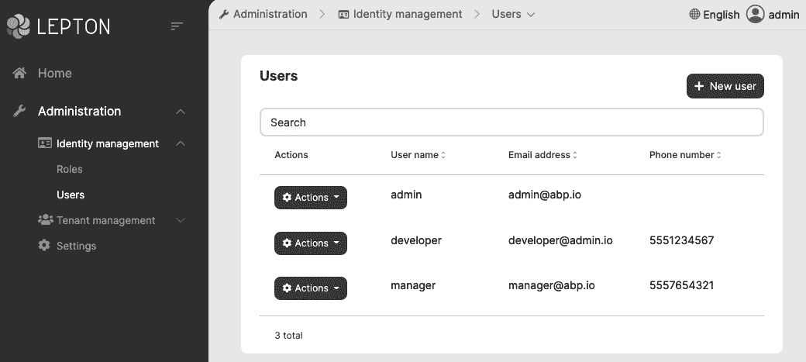
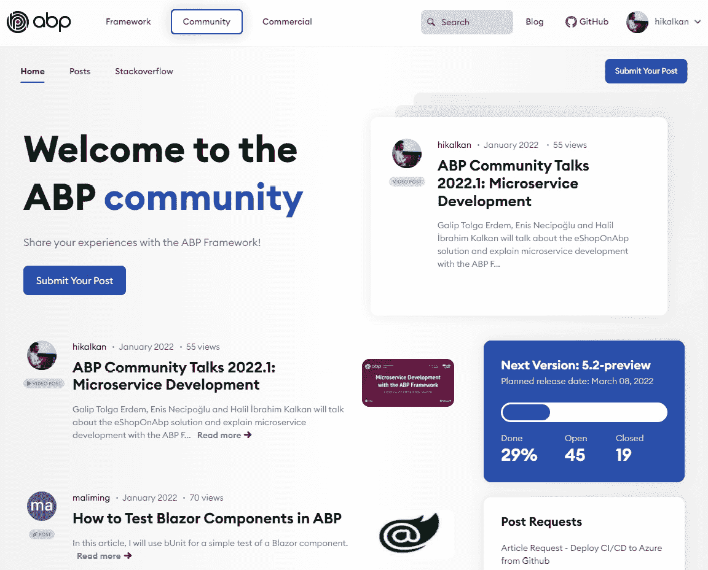

# 第一章：*第一章*：现代软件开发与 ABP 框架

构建软件系统一直都很复杂。特别是在这些现代时期，即使创建一个基本的企业解决方案也会遇到许多挑战。你常常发现自己正在实现标准非业务需求，而不是实现你试图构建的系统中的真正有价值的业务代码，而是深入到基础设施问题中。

ABP 框架通过提供强大的软件架构、自动化重复的细节并提供构建现代 Web 解决方案所需的基础设施，帮助你专注于为利益相关者增加价值的代码。它提供了一个端到端的、一致的开发体验，并提高了你的生产力。ABP 通过预先应用所有现代软件开发最佳实践，让你和你的团队能够迅速跟上。

这本书是使用现代软件开发方法和最佳实践通过 ABP 框架开发 Web 应用程序和系统的终极指南。

这第一章介绍了构建良好架构的企业解决方案的挑战，并解释了 ABP 框架如何解决这些挑战。我还会解释这本书的目的和结构。

在本章中，我们将涵盖以下主题：

+   开发企业级 Web 解决方案的挑战

+   理解 ABP 框架提供的内容

# 开发企业级 Web 解决方案的挑战

在深入研究 ABP 框架之前，我想先介绍开发现代企业级 Web 解决方案的挑战，以便理解为什么我们需要像 ABP 框架这样的应用程序框架。让我们从大局开始：架构。

## 设置架构

在你开始编写代码之前，你需要为你的解决方案创建一个基础。这是构建软件系统中最具挑战性的阶段之一。你有许多选择，需要做出一些基本的决定。在这个阶段你做出的任何决定都可能影响你的应用程序在其整个生命周期中的表现。

有一些常见的、众所周知的系统级架构模式，例如**单体架构**、**模块化架构**和**微服务架构**。应用这些架构之一决定了你如何开发、部署和扩展你的解决方案，并且应该基于你的需求来决定。

除了这些系统级模式之外，软件开发模型如**命令查询责任分离**（**CQRS**）、**领域驱动设计**（**DDD**）、**分层架构**和**整洁架构**决定了你的代码库是如何形成的。

一旦你决定了你的架构，你应该创建一个基本解决方案结构，以便使用该架构开始开发。在这个阶段，你还需要决定你将使用哪种语言、框架、工具和库。

所有这些决策都需要丰富的经验，因此最好由经验丰富的软件架构师和开发者来完成。然而，并非所有团队成员都有相同经验和知识水平。你需要对他们进行培训并确定正确的编码标准。

在设置好架构和准备基本解决方案之后，你的团队可以开始开发过程。下一节将讨论每个软件解决方案都会重复的常见方面以及如何在开发中避免重复。

## 不要重复自己！

**不要重复自己**（**DRY**）是软件开发的一个关键原则。计算机通过自动化现实世界的重复性任务来使人们的生活更轻松。那么，为什么我们在构建软件解决方案时还要重复自己呢？

认证是每个软件解决方案都非常常见的问题——单点登录、Active Directory 集成、基于令牌的认证、社交登录、双因素认证、忘记/重置密码、电子邮件激活等等。这些要求你熟悉吗？你不是一个人！几乎所有的软件项目都有或多或少的类似认证要求。与其从头开始构建所有这些，不如使用现有的解决方案，如库或云服务，这样更好。这些预先构建的解决方案是成熟且经过实战检验的，这对于安全性来说很重要。

一些非功能性需求，如异常处理、验证、授权、缓存、审计日志和数据库事务管理，是代码重复的另一个来源。这些问题被称为横切关注点，应该在每个网络请求中处理。在一个架构良好的软件解决方案中，这些问题应该通过代码库中的约定在中央位置自动处理，或者你应该有服务来使它们更容易实现。

当你集成第三方系统，如 RabbitMQ 和 Redis 时，你通常希望在这些与系统交互的代码周围创建抽象和包装。这样，你的业务逻辑就可以与这些基础设施组件隔离。此外，你也不需要在解决方案的每个地方重复相同的连接、重试、异常处理和日志记录逻辑。

拥有一个预先构建的基础设施来自动化这些重复性工作可以节省你的开发时间，这样你就可以专注于你的业务逻辑。下一节将讨论另一个占据每个业务应用时间的主题——用户界面。

## 构建 UI 基础

应用程序的一个基本方面是其**用户界面**（**UI**）。一个界面过时且难以使用的应用程序，即使在其内部具有出色的业务价值，也不会一开始就吸引人。

虽然每个应用程序的 UI 功能和需求各不相同，但一些基本结构是共同的。大多数应用程序需要基本元素，如警报、按钮、卡片、表单元素、标签页和数据表。您可以使用 HTML/CSS 框架，如 Bootstrap、Bulma 和 Ant Design，而不是为每个应用程序创建一个设计系统。

几乎每个 Web 应用程序都有一个响应式布局，包括主菜单、工具栏、页眉和页脚，具有自定义颜色和品牌。您需要确定所有这些，并为您的应用程序页面和组件实现一个基本的 UI 工具包。这样，UI 开发者可以创建一个一致的 UI，而无需处理常见的结构。

到目前为止，我已经介绍了一些常见的基础设施要求，这些要求大多独立于任何业务应用程序。下一节将讨论大多数企业系统的常见业务需求。

## 实现常见业务需求

虽然每个应用程序和系统都是独特的，它们的独特性是其价值的来源，但每个企业系统都有一些基本的支持性要求。

基于权限的授权系统是这些基本要求之一。它用于控制应用程序的用户和客户端的权限。如果您想自己实现，您应该创建一个端到端解决方案，包括数据库表、授权逻辑、权限缓存、API 和 UI 页面，以便将这些权限分配给您的用户并在需要时进行检查。然而，这样的系统相当通用，可以作为一个共享的身份管理功能（一个可重用的模块）来开发，并由多个应用程序使用。

就像身份管理一样，许多系统需要诸如审计日志报告、租户和订阅管理（对于 SaaS 应用程序）、语言管理、文件上传和共享、多语言管理和时区管理等功能。除了预构建的应用程序功能（模块）之外，还可能有低级要求，例如实现软删除模式以及在您的应用程序中存储**二进制大对象**（**BLOB**）数据。

所有这些常见要求都可以从头开始构建，这可能是某些企业系统的唯一解决方案。然而，如果这些功能不是您应用程序提供的主要价值，您可以考虑使用可用的预构建模块和库，并根据您的需求进行定制。

在下一节中，您将了解 ABP 框架如何帮助我们实现本节讨论的常见基础设施和基本要求。

# 了解 ABP 框架提供的功能

ABP 框架提供了一个有观点的架构，以帮助您在.NET 和 ASP.NET Core 平台上构建企业级软件解决方案，并在此基础上采用最佳实践。它提供了基本的基础设施、生产就绪的模块、主题、工具、指南和文档，以正确实施该架构，并在可能的情况下自动化细节和重复性工作。

在接下来的几个子部分中，我将解释 ABP 是如何做到这些的，从架构开始。

## ABP 架构

我提到 ABP 提供了一个有观点的架构。换句话说，它是一个有观点的框架。因此，我首先应该解释什么是无观点的框架，以及什么是有观点的框架。

如我在*设置架构*部分所述，为软件解决方案打下基础需要做出许多决定；您应该决定使用哪种系统架构、开发模型、技术、模式、工具和库。

无观点的框架，如 ASP.NET Core，对这些决定说得不多，主要留给您自己决定。例如，您可以通过将 UI 层与数据访问层分离来创建分层解决方案，或者您可以直接从您的 UI 页面/视图中访问数据库来创建单层解决方案。只要它与 ASP.NET Core 兼容，您就可以使用任何库，并且您可以使用任何架构模式。无观点性使得 ASP.NET Core 灵活且适用于不同的场景。然而，它将责任分配给您，让您做出所有这些决定，建立正确的架构，并准备基础设施以实施该架构。

我并不是说 ASP.NET Core 没有任何观点。它假设您正在基于 HTTP 规范构建 Web 应用程序或 API。它明确定义了您的 UI 和 API 层应该如何开发。它还提供了一些低级基础设施组件，例如依赖注入、缓存和日志（实际上，这些组件在任何.NET 应用程序中都是可用的，并不特定于 ASP.NET Core，但它们主要是与 ASP.NET Core 一起开发的）。然而，它并没有太多关于您的业务代码如何构建以及您将使用哪种架构模式的内容。

ABP 框架，另一方面，是一个有偏见的框架。它认为某些软件开发的方法本质上更好，因此引导开发者沿着这些路径前进。它对你的解决方案中使用的架构、模式、工具和库有自己的看法。尽管 ABP 框架足够灵活，可以使用不同的工具和库，并改变你的架构决策，但当你遵循它的看法时，你会获得最佳的价值。但不用担心；它提供了良好的、行业认可的解决方案，以帮助您使用最佳实践构建可维护的软件解决方案。它所做的决策将节省您的时间，提高您的生产力，并使您专注于业务代码而不是基础设施问题。

在接下来的几节中，我将介绍 ABP 所依赖的四个基本架构。

### 领域驱动设计

ABP 的主要目标是提供一个模型，以使用干净的代码原则构建可维护的解决方案。ABP 提供了一个基于 DDD 模式和实践的分层架构。它提供了一个分层启动模板（见“启动模板”部分），必要的基础设施以及如何正确应用该架构的指导。

由于 ABP 是一个软件框架，它专注于 DDD 的技术实现。本书的第三部分，“实现领域驱动设计”，解释了使用 ABP 框架构建基于 DDD 的解决方案的最佳实践。

### 模块化

在软件开发中，模块化是一种将系统分解为隔离部分（称为模块）的技术。最终目标是减少复杂性，提高可重用性，并使不同的团队能够并行工作在不同的功能集上，而不会相互影响。

模块化有两个主要挑战，ABP 框架简化了这些挑战：

+   第一个挑战是隔离模块。ASP.NET Core 有一些功能（如 Razor 组件库）来支持模块化应用程序。然而，它非常有限，因为它是一个无偏见的框架，并且只有对 UI 和 API 部分的看法。另一方面，ABP 框架提供了一致的模式和基础设施，以使用其数据库、领域、应用和 UI 层构建完全隔离、可重用的应用程序模块。

+   模块化的第二个挑战是处理这些隔离的模块如何在运行时进行通信并成为一个单一、统一的应用程序。ABP 为模块化系统的常见需求提供了具体的模型，例如在模块之间共享数据库，通过事件或 API 调用进行模块间的通信，以及在应用程序中安装模块。

ABP 提供了许多预构建的开源应用程序模块，可以在任何应用程序中使用。一些例子包括身份模块，它提供用户、角色和权限管理，以及账户模块，它为你的应用程序提供登录和注册页面。重用和定制这些模块可以节省你的时间。此外，ABP 还提供了一个模块启动模板，帮助你构建可重用的应用程序模块。一个例子可以在*第十五章*中找到，*与模块化一起工作*。

模块化对于管理大型单体系统的复杂性来说非常好。然而，ABP 还可以帮助你创建微服务解决方案。

### 微服务

微服务和分布式架构是构建可扩展软件系统的公认方法。它允许不同的团队在不同的服务上工作，并独立地版本控制、部署和扩展他们的服务。

然而，构建微服务系统在开发、部署、微服务间通信、数据一致性、监控等方面存在一些重要的挑战。

微服务架构不是单个软件框架可以解决的问题。微服务系统是一个将许多不同的学科、方法、技术和工具结合在一起来解决独特问题的解决方案。每个微服务系统都有其特定的需求和限制。每个团队都有其专业水平、知识和技能。

ABP 框架从一开始就被设计成与微服务兼容。它提供了一个分布式事件总线，用于支持事务的微服务之间的异步通信（如*第十章*中“*发布领域事件*”部分所述，*领域驱动设计 – 领域层*）。它还提供了 C# 客户端代理，以便轻松消费远程服务的 REST API（如*第十四章*中“*消费 HTTP API*”部分所述，*构建 HTTP API 和实时服务*）。

所有的预构建 ABP 应用程序模块都设计得可以转换为微服务。ABP 还提供了一个详细的指南([`docs.abp.io/en/abp/latest/Best-Practices/Index`](https://docs.abp.io/en/abp/latest/Best-Practices/Index))，解释了如何创建这样的微服务兼容模块。这样，你可以从一个模块化的单体开始，然后稍后将其转换为微服务解决方案。

核心 ABP 团队已经准备了一个使用 ABP 框架构建的开源微服务参考解决方案。它展示了如何使用 API 网关、微服务间通信、分布式事件、分布式缓存、多个数据库提供者和多个具有单点登录的 UI 应用程序来创建解决方案。它还包括在容器上运行解决方案的 Kubernetes 和 Helm 配置。请参阅[`github.com/abpframework/eShopOnAbp`](https://github.com/abpframework/eShopOnAbp)以了解该解决方案的所有详细信息。

下一节介绍了 ABP 框架提供的最后一个基本架构——多租户架构。

### SaaS/multi-tenancy

**软件即服务**（**SaaS**）是构建和销售软件产品的流行方法。多租户是构建 SaaS 系统的广泛使用的架构模式。以下是多租户系统的典型特征：

+   在租户之间共享硬件和软件资源。

+   每个租户都有用户、角色和权限。

+   在租户之间隔离数据库、缓存和其他资源。

+   可以按租户启用/禁用应用程序功能。

+   可以按租户自定义应用程序配置。

ABP 框架涵盖了所有这些要求以及更多。它帮助您在大多数代码库不了解多租户的情况下构建多租户系统。

*第十六章*，*实现多租户*，解释了使用 ABP 框架的多租户和多租户应用程序开发。

到目前为止，我已经介绍了 ABP 提供的作为预构建解决方案的基本架构模式。然而，ABP 还提供了启动模板，以帮助您轻松地开始一个新的解决方案。

## 启动模板

当您使用 ASP.NET Core 的标准启动模板创建新解决方案时，您将获得一个单项目解决方案，具有最小依赖项和无层结构，但这并不那么适合生产环境。您通常需要花费相当多的时间来设置解决方案结构以正确实现软件架构，以及安装和配置基本工具和库。

ABP 框架提供了一个结构良好、分层、预先配置和现成的启动解决方案模板。以下截图显示了使用 ABP 框架直接运行创建的启动模板时的初始 UI：

图 1.1 – ABP 应用程序启动模板

让我们更详细地谈谈这个启动模板：

+   解决方案是分层的。它清晰明了，告诉您如何组织代码库。

+   一些预构建的模块已经安装，例如**账户**和**身份**模块。您已经有了*登录*、*注册*、*用户和角色管理*以及一些其他标准功能已经实现。

+   **单元测试**和**集成测试**项目已预先配置并准备好编写您的第一个测试代码。

+   它包含一些实用应用程序来管理您的数据库迁移以及消费和测试您的 HTTP API。

ABP 的应用程序启动模板提供了多个**UI 框架**和**数据库提供者**选项。你可以选择**Angular**、**Blazor**或**MVC**（**Razor Pages**）作为 UI 框架，并使用**Entity Framework Core**（与任何数据库管理系统）或**MongoDB**作为数据库提供者。你将在*第二章*“使用 ABP 框架入门”中学习如何创建一个新的解决方案并运行它。

在下一节中，我将介绍一些 ABP 的基础设施组件。

## ABP 的基础设施

ABP 基于你已知的熟悉工具和库。虽然它是一个全栈应用程序框架，但它不引入新的**对象关系映射器**（**ORM**），而是使用 Entity Framework Core。同样，它使用 Serilog、AutoMapper、IdentityServer 和 Bootstrap，而不是自己创建类似的功能。它提供了一个集成这些工具、填补空白并实现常见业务应用程序需求的解决方案。

ABP 通过约定自动化异常处理、验证、授权、缓存、审计日志和数据库事务管理，简化了这些操作，并允许你在需要时进行精细控制。因此，你不需要为这些横切和常见问题重复自己。

ABP 与 IdentityServer 良好集成，用于基于 cookie 和令牌的认证以及单点登录。它还提供了一个基于权限的详细授权系统，帮助你控制应用程序的用户和客户的权限。

除了基础知识之外，后台作业、BLOB 存储、文本模板、审计日志和本地化组件为常见的业务需求提供了内置解决方案。

在 UI 方面，ABP 提供了一个完整的 UI 主题系统，帮助你开发无主题和模块化的应用程序，并轻松地为应用程序安装主题。它还在 UI 方面提供了大量的功能和辅助工具，以消除重复代码并提高生产力。

下一节将讨论社区，这对于开源项目来说非常重要。

## 社区

当你在公司设置解决方案架构时，除了正在工作的开发者外，没有人知道你的结构。然而，ABP 有一个庞大且活跃的社区。他们使用相同的架构和基础设施，应用类似的最佳实践，并以类似的方式开发他们的应用程序。当你遇到基础设施问题或想要获得实现业务问题的想法或建议时，这具有很大的优势。由于 ABP 开发者应用相同的或类似的模式，因此理解另一个解决方案中的代码也更容易。

ABP 框架自 2016 年以来一直存在并不断发展。截至 2021 年底，它拥有 7,000+星标，220+贡献者，22,000+提交，GitHub 上有 5,700 个已关闭的问题，并在 NuGet 上有超过 4,000,000 次下载，拥有超过 110+个主要和次要版本。我的意思是，它是一个成熟、被接受和受信任的开源项目。

核心 ABP 团队和社区贡献者不断撰写文章，准备视频教程，并在 ABP 社区网站上分享：[`community.abp.io`](https://community.abp.io)。以下截图来自 ABP 社区网站：

图 1.2 – ABP 社区网站

查看 ABP 社区网站，了解其他人如何使用 ABP 框架，并密切关注 ABP 框架的发展。

# 摘要

在本章中，我们介绍了构建业务解决方案的问题，并解释了 ABP 如何为这些常见问题提供解决方案。ABP 还通过提供预构建的架构解决方案和实现该架构所需的基础设施来提高开发者的生产力。

到这本书的结尾，你将熟悉 ABP 框架，并将学习到许多关于企业级软件开发的最佳实践和技术。

在下一章中，你将学习如何使用 ABP 的**命令行界面**（**CLI**）工具创建一个新的解决方案，并在你的开发环境中运行它。
