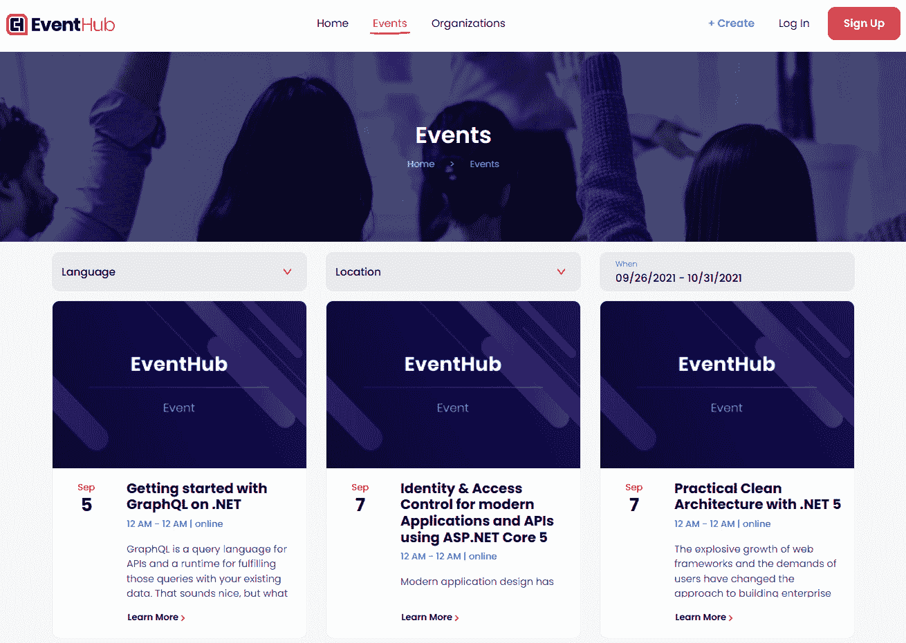
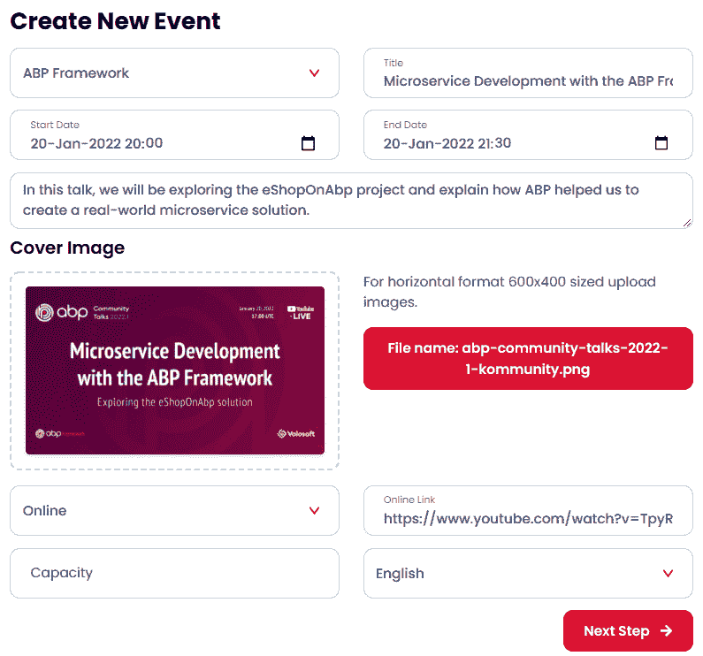
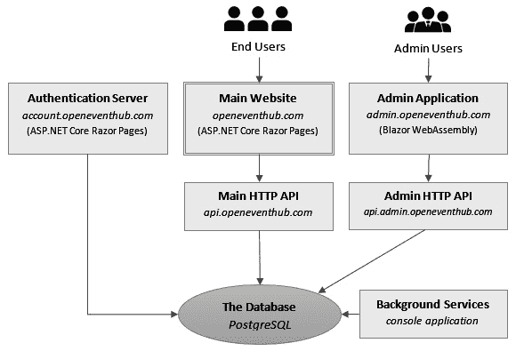
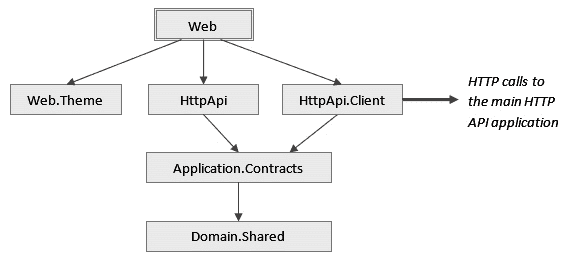
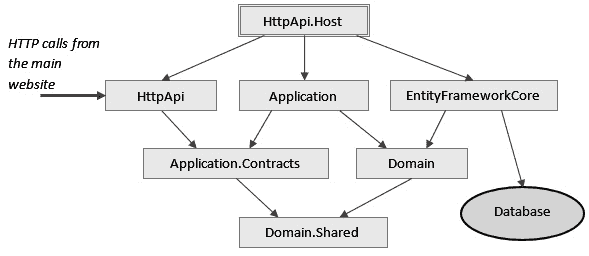
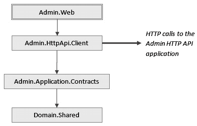
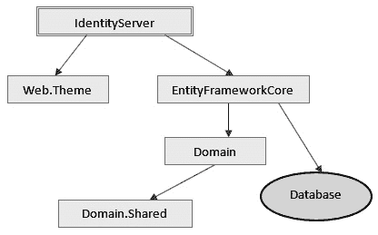
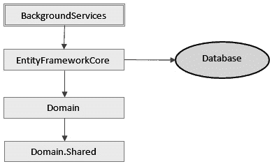
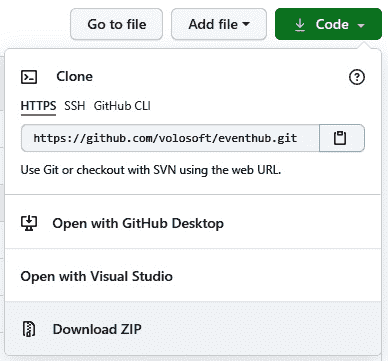
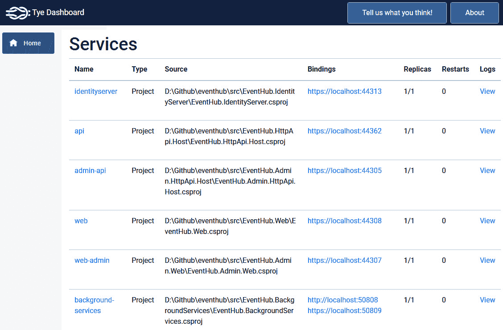

# *第四章*：理解参考解决方案

在上一章中，我们构建了一个简单的全栈 Web 应用程序，用于管理具有分类的产品。我们看到了使用 ABP 框架开发应用程序的典型流程。你现在可以创建自己的应用程序，并具备基本功能。在下一章中，你将更好地理解 ABP 功能并创建更高级的应用程序。

在书中用具有现实复杂性的例子来说明并不容易。经过反思，我们准备了一个完整的、现实世界的参考应用程序，该应用程序是用 ABP 框架构建的：*EventHub*。它是开源的，可以在 GitHub 上免费获取。

EventHub 解决方案被视为一个可用的实时系统，位于[openeventhub.com.](http://openeventhub.com.)上。你可以尝试它来探索它。我们已经建立了**持续集成/持续开发**（**CI/CD**）管道，我们在开发它并获得社区贡献的同时更新网站。请随意查看其源代码，提交错误报告或功能请求，甚至发送你的 pull 请求来贡献！正如其名所示，这是一个开放平台。

本书是唯一解释 EventHub 解决方案的文档来源，因为我们主要为此书的读者准备了它。我将在本书的下一章中提及该解决方案，特别是在*第三部分*，*实现领域驱动设计*。

在本章中，我们将以下节中调查 EventHub 解决方案：

+   介绍应用程序

+   理解架构

+   运行解决方案

# 技术要求

你可以从 GitHub 上克隆或下载 EventHub 项目的源代码，在[`github.com/volosoft/eventhub`](https://github.com/volosoft/eventhub)。

如果你想在本地开发环境中运行该解决方案，你需要有一个**集成开发环境**（**IDE**）/编辑器（如 Visual Studio）来构建和运行 ASP.NET Core 解决方案。你还需要在计算机上安装**Docker**。你可以通过遵循[`docs.docker.com/get-docker`](https://docs.docker.com/get-docker)上的文档来下载并安装**Docker Desktop**用于开发环境。

# 介绍应用程序

EventHub 是一个用于创建组织以组织活动的平台。你创建活动，无论是线上还是线下，然后人们注册它们。以下截图来自[openeventhub.com](http://openeventhub.com)网站的**首页**：



图 4.1 – EventHub 首页

你可以在**首页**上的即将到来的**事件**部分进行探索。点击一个活动以获取详细信息并注册该活动。活动开始前或活动时间更改时，你会收到电子邮件通知。

这里是来自**创建新事件**页面的另一个截图：



图 4.2 – 创建新事件页面

你可以在这一页上选择你拥有的一个组织，设置 **标题**、时间、描述，选择 **封面图片**，并确定你组织的其他事件细节。

如果你想了解更多信息，请注册 [openeventhub.com](http://openeventhub.com) 并探索该平台。在这本书中，我想讨论技术细节，而不是应用程序的功能。让我们从整体图景开始，了解解决方案的架构。

# 理解架构

这里是解决方案内部应用程序的整体图：



图 4.3 – EventHub 解决方案的应用

在 *图 4.3* 中显示了六个应用程序和一个数据库，关于它们更详细的信息如下：

+   `IdentityServer` 库。这是一个 **单点登录** （**SSO**） 服务器，这意味着如果你登录到其中一个应用程序，你将登录到所有应用程序（反之亦然，即如果你从其中一个应用程序注销，你将从所有应用程序注销）。这是一个 **ASP.NET Core Razor Pages** 应用程序，它直接连接到 **数据库**。

+   **主网站**：这是用户创建新事件和注册事件的平台的基本网站 ([www.openeventhub.com](http://www.openeventhub.com))。它是一个使用 **ASP.NET Core Razor Pages** 的应用程序，作为后端使用 **主 HTTP API**。

+   **管理应用程序**：此应用程序允许 **管理员用户** 管理组织、事件和系统。它使用 **管理 HTTP API** 进行所有操作，这是一个在浏览器中运行的 **Blazor WebAssembly** 应用程序。

+   **主 HTTP API**：暴露 **超文本传输协议** （**HTTP**） 应用程序编程接口 （**API**） 以供主网站消费。

+   **管理 HTTP API**：暴露 HTTP API 以供管理应用程序消费。

+   **后台服务**：一个运行系统后台工作者和后台作业的控制台应用程序。

+   **数据库**：这是一个关系型 **PostgreSQL** 数据库，存储系统中所有的数据。

由于它是一个分布式系统，它使用 **Redis** 作为分布式缓存服务器。

首先理解认证流程是一个好主意，然后才能理解系统。

## 认证流程

如前所述，**认证服务器**是一个用于认证用户和客户端的单点登录 (SSO) 服务器。**主网站** 和 **管理应用程序** 使用 **OpenID Connect** （**OIDC**） 协议在用户想要或需要登录应用程序时将用户重定向到 **认证服务器**。以下图表显示了登录过程：


图 4.4 – 认证流程

在 *图 4.4* 中，逻辑流程按以下顺序发生：

+   当用户想要访问需要身份验证 **(1)** 的页面或用户明确点击登录链接时，**主网站**将用户 **(2)** 重定向到**认证服务器**。

+   **认证服务器**有一个登录页面，用户可以输入用户名和密码或注册为新用户。一旦登录过程完成，用户将带着授权码 **(3)** 和 **(4)** 被重定向回**主网站**。

+   **主网站**随后使用获取的授权码向服务器发起一个标记请求 **(5)**。

+   **认证服务器**返回一个**标识符**（ID）令牌（包含一些用户信息，如用户名、ID、电子邮件等）和一个访问令牌 **(6)**。

+   **主网站**将访问令牌存储在 cookie 中，以便在后续请求中获取。在后续请求中，它从 cookie 中获取访问令牌并将其添加到 HTTP 请求头，在执行对**主 HTTP API**应用 **(7)** 的 HTTP 请求时。

+   **主 HTTP API**应用验证访问令牌 **(8)** 并授权请求。

正如之前提到的，**主网站**使用 cookie 来存储访问令牌。另一方面，**管理员（Blazor WebAssembly）应用**将访问令牌存储在浏览器的本地存储中，并在每次向服务器发送请求时将其添加到 HTTP 请求头。

所有这些过程都是由 ABP 的`Account`和`IdentityServer`模块以及应用中的某些配置完成的。我不会在这里展示详细的配置，以保持本章专注于整体解决方案结构和架构（更多细节请查看源代码）。

在下一节中，我们将探讨 EventHub .NET 解决方案及其内部的项目。

## 探索解决方案

EventHub .NET 解决方案由几个项目组成，按应用类型分组，如下截图所示：

![Figure 4.5 – EventHub .NET solution in Visual Studio]

![img/Figure_4.05_B17287.jpg]

Figure 4.5 – EventHub .NET solution in Visual Studio

该解决方案包含一个单一领域层、两个应用层以及相应的 HTTP API 和**用户界面（UI）**层。两个应用使用单一领域层，但它们具有不同的应用逻辑，因此它们是分开的。我们将在*第九章*的*处理多个应用*部分中回到这个话题（多个应用层），即*理解领域驱动设计*。

让我们从核心部分，即`common`文件夹开始解释项目。该文件夹包含常见的库和服务，如下所述：

+   `EventHub.Domain`项目是包含实体、领域服务和其它领域对象的领域层。`EventHub.Domain.Shared`项目包含常量和一些其他类，这些类在解决方案的所有层和应用中共享。

+   `EventHub.EntityFrameworkCore` 项目包含定义 `DbContext`、映射、数据库迁移、存储库实现以及其他与 EF Core 相关的代码。

+   `EventHub.DbMigrator` 项目是一个控制台应用程序，您可以通过它应用挂起的数据库迁移并初始化数据（例如管理员用户/角色及其权限）。它适合在开发和生产环境中使用。

+   `EventHub.BackgroundServices` 项目是另一个控制台应用程序，它在系统上运行后台工作者和作业，并且应该始终运行。

`www` 文件夹包含 **主网站**（[www.openeventhub.com](http://www.openeventhub.com)）应用程序的组件，如下所示：

+   `EventHub.Application` 项目是包含应用程序服务实现的应用层，而 `EventHub.Application.Contracts` 项目包括与应用程序服务接口和与 UI 层共享的 **数据传输对象**（**DTOs**）。

+   `EventHub.HttpApi` 项目包含由 UI（Web）层消费的 API 控制器。该项目中的控制器是围绕应用程序服务的简单包装。

+   `EventHub.HttpApi.Host` 项目托管 HTTP API 层。这样，托管逻辑就与包含 API 控制器的项目（这使得可以将 `EventHub.HttpApi` 项目作为库重用）分离了。

+   `EventHub.HttpApi.Client` 项目是一个库，可以由 .NET 应用程序引用以轻松消费 API 控制器。UI（Web）层使用该项目调用 HTTP API。此项目使用 ABP 的动态 C# 代理功能，将在 *第十四章*，*构建 HTTP API 和实时服务* 中介绍。这样，我们就不需要处理 HTTP 客户端和底层细节，从 UI 层调用 HTTP API。

+   `EventHub.Web` 项目是应用程序的 UI 层。这是一个典型的 Razor Pages 应用程序，在服务器上渲染 **超文本标记语言**（**HTML**）。它没有数据库连接，但使用 **主 HTTP API** 应用程序进行所有操作。

+   `EventHub.Web.Theme` 项目是应用程序的定制主题。ABP 有一个主题系统，您可以使用它来构建自己的主题并在任何应用程序中重用它们。`EventHub.Web` 项目使用这个主题。主题系统将在 *第四部分*，*用户界面和 API 开发* 中介绍。

`admin` 文件夹包含由维护系统的用户使用的管理员应用程序，并在此处进行更详细的解释：

+   `EventHub.Admin.Application` 项目是管理员侧的应用层，包含应用程序服务的实现，而 `EventHub.Admin.Application.Contracts` 项目包括与应用程序服务接口和与 UI 层共享的 DTOs。

+   `EventHub.Admin.HttpApi` 项目包含由 UI（Web）层消费的 API 控制器。

+   `EventHub.Admin.HttpApi.Host` 项目托管 HTTP API 层。这样，托管逻辑就与包含 API 控制器的项目分离了。

+   `EventHub.Admin.HttpApi.Client` 项目是一个库，.NET 应用程序可以通过它轻松地引用并消费 API 控制器。UI（Web）层使用该项目来调用 HTTP API。此项目使用了 ABP 的动态 C# 代理功能，该功能将在 *第十四章* 中介绍，即 *构建 HTTP API 和实时服务*。通过这种方式，我们不需要处理 HTTP 客户端和底层细节，就可以从 UI 层调用 HTTP API。

+   `EventHub.Admin.Web` 项目是应用程序的 UI 层。这是一个 **Blazor WebAssembly** 应用程序，它在浏览器中运行并执行对服务器的 HTTP API 调用。

最后，`account` 文件夹包含 `EventHub.IdentityServer`，它被其他应用程序用于用户认证。

我已经简要地解释了解决方案中的所有项目。了解项目之间的关系和依赖也很重要。

## 项目依赖关系

将解决方案拆分为多个项目，使得在运行时可以拥有多个应用程序，同时在必要时在应用程序之间共享代码库。

在接下来的几节中，我将展示每个应用程序的依赖关系图，以便您了解代码库是如何组织的。我们首先从 **主网站**，这个基本的应用程序开始。

### 主网站

记住 `Web`：



图 4.6 – 主网站项目依赖关系

`Web` 项目依赖于 `Web.Theme`，该组件实现了 EventHub 应用程序的 UI 主题。`Web.Theme` 是一个独立的项目，因为它是从 **认证服务器** 应用程序中复用的。这是一个在多个应用程序之间复用 UI 主题的例子。

`Web`项目也依赖于`HttpApi`项目。这样，HTTP API 控制器就可以在 Web 应用程序中使用，我们可以从客户端（JavaScript）代码中调用这些 API。然而，当你调用此应用程序的 HTTP API 控制器时，请求会被重定向到`HttpApi.Client`包。请注意，`HttpApi`和`HttpApi.Client`项目都引用了`Application.Contacts`项目。`HttpApi`项目中的 API 控制器使用应用程序服务接口，而`HttpApi.Client`包实现这些接口（使用 ABP 的动态 C#代理系统，将在*第十四章*，*构建 HTTP API 和实时服务*)以执行对**主 HTTP API**应用程序的远程 HTTP 调用。因此，此应用程序成为客户端（JavaScript）和 HTTP API 服务器之间直接 API 调用的代理。应用程序服务接口的实际实现运行在**主 HTTP API**应用程序中，将在下一节中解释。

### 主 HTTP API

`HttpApi.Host`项目和其直接及间接依赖：




图 4.7 – 主 HTTP API 项目依赖关系

通过引用（添加对`HttpApi`项目的依赖）`HttpApi`项目（其中包含 API 控制器），我们可以响应 HTTP API 调用。API 控制器使用在`Application.Contracts`项目中定义的应用程序服务接口。这些接口由`Application`项目实现。这就是为什么我们需要从`HttpApi.Host`项目引用`Application`项目的原因。`Application`项目使用`Domain`项目来执行应用程序的业务逻辑。

`HttpApi.Host`项目还引用了`EntityFrameworkCore`项目，因为我们需要在运行时有一个数据层。`EntityFrameworkCore`项目将实体映射到数据库中的表，并实现了在`Domain`项目中定义的存储库。

注意到`Application.Contracts`项目（以及间接的`Domain.Shared`项目）被客户端应用程序和**主网站**共享，因此它们可以依赖于相同的应用程序服务接口进行通信。

我们现在已经探讨了**主网站**应用程序组件。下一节将从管理端继续。

### 管理应用程序

管理应用程序是一个在浏览器上运行的 Blazor WebAssembly 应用程序，可以通过以下**统一资源定位符**（**URL**）访问：[admin.openeventhub.com](http://admin.openeventhub.com)。它被维护系统的用户使用。此应用程序有一套不同的 API、UI 页面、授权规则、缓存需求等。因此，我们为该应用程序创建了一个不同的应用程序和 HTTP API 层。尽管如此，它共享相同的领域层，因此它使用相同的领域逻辑和相同的数据库。

让我们从以下前端（Blazor WebAssembly）应用程序的图开始：



图 4.8 – 管理网站项目依赖关系

与之前的图相比，此图较为简单。`Admin.Web` 项目（Blazor WebAssembly 应用程序）引用了 `Admin.HttpApi.Client` 项目，因为它需要调用远程 HTTP API。ABP 的动态 C#客户端代理系统（在第*第十四章*，*构建 HTTP API 和实时服务*中介绍）使得在 Blazor WebAssembly 应用程序中使用应用服务接口来轻松消费服务器上的 Admin HTTP API 成为可能。`Admin.HttpApi.Client` 项目依赖于 `Admin.Application.Contracts` 项目（该项目内部依赖于 `Domain.Shared` 项目），以便能够使用在该项目中定义的应用服务接口。

### 管理 HTTP API

`Admin.HttpApi.Host` 项目及其直接和间接依赖：


图 4.9 – 管理 HTTP API 项目依赖关系

与 `EntityFrameworkCore` 层的图非常相似，以共享相同的核心领域规则和相同的 **数据库**。我将在*第九章*，*理解领域驱动设计*的*处理多个应用程序*部分中回到这个话题。

所有应用程序都使用 **认证服务器** 应用作为 SSO 服务器，下一节将讨论。

### 认证服务器

`IdentityServer` 项目及其依赖关系如以下图所示：



图 4.10 – 认证服务器项目依赖关系

`IdentityServer` 项目引用了 `Web.Theme` 项目，这是与 `EntityFrameworkCore` 项目共享的 UI 主题，以便能够使用 `EntityFrameworkCore` 项目，我们也有对 `Domain` 和 `Domain.Shared` 项目的间接引用。

下一节将展示解决方案中最终应用的依赖关系。

### 后台服务

`BackgroundServices` 项目具有以下图所示的依赖关系：



图 4.11 – BackgroundServices 项目依赖关系

`BackgroundServices` 项目使用 `EntityFrameworkCore` 项目，以便能够与 **数据库** 一起工作。它还可以使用 **领域** 对象（实体、领域服务）来执行后台任务。

我们已经探讨了解决方案中的所有项目。现在，我们准备在本地开发环境中运行它们。

# 运行解决方案

如果您想在本地环境中运行解决方案，请遵循下一节中的步骤。

## 克隆 GitHub 仓库

首先，您需要在本地计算机上克隆 GitHub 仓库。仓库位于[`github.com/volosoft/eventhub`](https://github.com/volosoft/eventhub)，可以使用以下命令克隆（需要安装 Git 工具）：

```cs
git clone https://github.com/volosoft/eventhub.git
```

或者，导航到[`github.com/volosoft/eventhub`](https://github.com/volosoft/eventhub)，点击**Code**按钮，然后点击**Download ZIP**，如图所示：



图 4.12 – 从 GitHub 下载 EventHub 仓库

您应该将 ZIP 文件提取到一个空文件夹中。

## 运行基础设施

EventHub 解决方案需要在`etc/docker`文件夹中包含`docker-compose`文件。如果您在计算机上安装了 Docker，您可以在该文件夹中执行`up.ps1`文件来运行这些服务器。如果您无法在计算机上使用 PowerShell，您可以直接在文本编辑器中打开它，复制内容，然后在`etc/docker`目录中的命令行终端中执行它。在第一次运行时，可能需要几分钟来下载 Docker 镜像。如果您不想使用 Docker，您需要在计算机上安装**Redis**和**PostgreSQL**服务器。

## 打开解决方案

克隆或下载的仓库在根目录中包含一个`EventHub.sln`文件。如果您想开发或调试解决方案，请在 Visual Studio 或另一个.NET 兼容的 IDE 中打开它。

## 创建数据库

解决方案中有一个名为`EventHub.DbMigrator`的控制台应用程序，如图 4.5 所示。运行此应用程序（对于 Visual Studio，右键单击它并选择**设置为启动项目**，然后按*Ctrl* + *F5*）。它将创建一个数据库并初始化一些初始数据。

## 运行应用程序

我们现在已准备好启动实际的应用程序。您可以按以下顺序运行项目（对于 Visual Studio，右键单击每个项目，选择**设置为启动项目**，然后按*Ctrl* + *F5*）：

+   `EventHub.IdentityServer`

+   `EventHub.HttpApi.Host`

+   `EventHub.Web`

+   `EventHub.Admin.HttpApi.Host`

+   `EventHub.Admin.Web`

+   `EventHub.BackgroundServices`

要登录到应用程序之一，请使用`admin`作为用户名，`1q2w3E*`作为密码。当然，您可以在 UI 中创建更多用户。

注意，当运行多个应用程序时，Visual Studio 可能会出现一些问题。有时，之前运行的应用程序可能会停止。在这种情况下，请重新运行已停止的应用程序。然而，Microsoft 的`Tye`项目使得运行多个应用程序变得更加容易。

## 使用 Tye 项目

如果您不需要开发或调试解决方案，只想运行它，可以使用 Microsoft 的`Tye`项目来运行它，而无需打开 IDE。`Tye`是一个.NET 全局工具，用于通过简单的配置文件轻松运行此类分布式应用程序。EventHub 解决方案已配置为使用`Tye`运行。您需要做的只是安装`Tye`并运行它。

在使用 `Tye` 之前，您仍然需要运行基础设施（请参阅 *运行基础设施* 部分），然后使用 `EventHub.DbMigrator` 应用程序创建数据库。如果您之前没有这样做，请在 `src/EventHub.DbMigrator` 目录中打开命令行终端并运行以下命令：

```cs
dotnet run
```

数据库准备就绪后，您可以在命令行终端中使用以下命令安装 `Tye`：

```cs
dotnet tool install -g Microsoft.Tye
```

在撰写本书时，`Tye` 项目仍在预览阶段。您可能需要指定最新的预览版本（您可以在 NuGet 上找到它，在 [`www.nuget.org/packages/Microsoft.Tye`](https://www.nuget.org/packages/Microsoft.Tye)）。例如，请参阅以下代码片段：

```cs
dotnet tool install -g Microsoft.Tye --version "0.10.0-alpha.21420.1"
```

查看以下链接了解如何安装 `Tye`：[`github.com/dotnet/tye/blob/main/docs/getting_started.md`](https://github.com/dotnet/tye/blob/main/docs/getting_started.md)。

`Tye` 需要在您的计算机上安装 Docker。如果您还没有安装，也需要这样做。安装完成后，您可以使用以下命令启动应用程序（如果 IDE 已经打开，建议先关闭它）：

```cs
tye run
```

第一次运行可能需要一些时间。一旦完成，您就可以打开浏览器并导航到 `http://127.0.0.1:8000` 来打开 **Tye 仪表板**，您可以在以下屏幕截图中看到：



图 4.13 – Tye 仪表板

`web` 是系统的 **主网站**。

当您有一个需要一起运行多个应用程序的解决方案时，Tye 是一个方便的工具。您还可以为项目配置 `dotnet watch`，以便在更改项目时自动重新加载（或使用 .NET 6.0 热加载）。有关更多信息，请参阅 Microsoft 的文档：[`github.com/dotnet/tye/tree/main/docs`](https://github.com/dotnet/tye/tree/main/docs)。

# 摘要

EventHub 是基于 ABP 框架构建的完整、真实世界质量的应用程序。它不仅是一个示例，也是一个在 [openeventhub.com](http://openeventhub.com) 上发布的实时项目，并在 [`github.com/volosoft/eventhub`](https://github.com/volosoft/eventhub) 上积极开发。请随时发送错误报告、功能请求和拉取请求。

在本章中，我的目的不是详细解释代码库。我解释了解决方案的整体架构和结构，以便您了解如何探索代码库并运行解决方案。下一章将参考该解决方案，同时介绍一些 ABP 功能和概念。

EventHub 是一个使用多个应用程序构建的系统的良好示例。它也是一个理解 ABP 分层模型目的以及如何在不同的应用程序中重用这些层的清晰示例。

你现在可能无法完全理解 EventHub 解决方案的所有细节，因为我们还没有解释模块系统、数据库集成、动态 C# 客户端代理以及所有其他 ABP 功能。下一部分中的章节将探讨 ABP 框架和 ASP.NET Core 框架的基本构建块，以便你开始理解所有细节。

在下一章中，我们将探讨 ASP.NET Core 和 ABP 框架的基本构建块，以了解应用程序是如何配置和初始化的。
