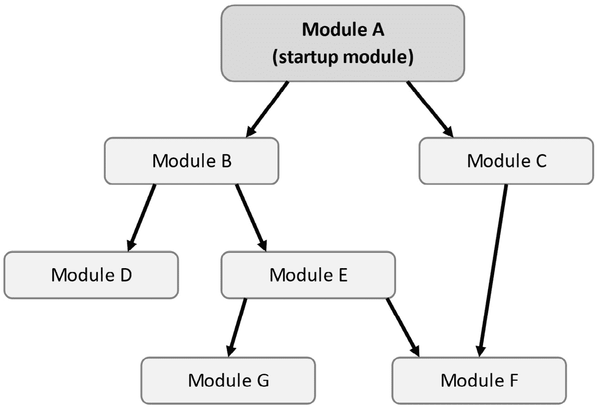

# 第五章：*第五章*: 探索 ASP.NET Core 和 ABP 基础设施

ASP.NET Core 和 ABP 框架都为现代应用程序开发提供了许多构建块和功能。本章将探索最基本的构建块，以便你了解应用程序是如何配置和初始化的。

我们将从 ASP.NET Core 的 `Startup` 类开始，了解为什么我们需要模块化系统以及 ABP 如何提供一种模块化方式来配置和初始化应用程序。然后我们将探索 ASP.NET Core 的依赖注入系统以及 ABP 使用预定义规则自动注册依赖注入的方式。我们将继续探讨配置和选项模式，以了解 ASP.NET Core 配置 ASP.NET Core 和其他库选项的方式。

在本章中，我们将涵盖所有以下主题：

+   理解模块化

+   使用依赖注入系统

+   配置应用程序

+   实现选项模式

+   记录日志

# 技术要求

如果你想要跟踪和尝试示例，你需要安装一个 IDE/编辑器（如 Visual Studio）来构建 ASP.NET Core 项目。

你可以从以下 GitHub 仓库下载代码示例：[`github.com/PacktPublishing/Mastering-ABP-Framework`](https://github.com/PacktPublishing/Mastering-ABP-Framework)。

# 理解模块化

**模块化**是将大型软件的功能分解成更小部分的设计技术，并允许每个部分通过标准化的接口按需与其他部分进行通信。模块化有以下主要优点：

+   当每个模块都设计为与其他模块隔离，并且模块间通信定义良好且有限时，它降低了复杂性。

+   当你设计模块以实现松散耦合时，它提供了灵活性。你可以在未来重构或甚至替换一个模块。

+   当你设计模块以实现与应用程序无关时，它允许跨应用程序重用模块。

大多数企业级软件系统都是模块化的。然而，实现模块化并不容易，纯 ASP.NET Core 并没有提供太多帮助。ABP 框架的主要目标之一是提供基础设施和工具来开发真正的模块化系统。我们将在 *第十五章* *与模块化一起工作* 中介绍模块化应用程序开发，但本节介绍了 ABP 模块的基本知识。

## `Startup` 类

在定义模块类之前，最好记住 ASP.NET Core 中的 `Startup` 类，以了解模块类的需求。以下代码块展示了简单 ASP.NET Core 应用程序中的 `Startup` 类：

```cs
public class Startup
{
    public void ConfigureServices(IServiceCollection                 services)
    {
        services.AddMvc();
        services.AddTransient<MyService>();
    }
    public void Configure(
        IApplicationBuilder app, IWebHostEnvironment env)
    {
        app.UseRouting();
        if (env.IsDevelopment())
        {
            app.UseDeveloperExceptionPage();
        }
        app.UseEndpoints(endpoints =>
        {
            endpoints.MapControllers();
        });
    }
}
```

`ConfigureServices` 方法用于配置其他服务并将新服务注册到依赖注入系统中。另一方面，`Configure` 方法用于配置 **ASP.NET Core 请求管道**，该管道通过中间件组件处理 HTTP 请求。

一旦你有了`Startup`类，通常在配置主机构建器时将其注册到`Program.cs`文件中，以便在应用程序启动时工作：

```cs
public class Program
{
    public static void Main(string[] args)
    {
        CreateHostBuilder(args).Build().Run();
    }
    public static IHostBuilder CreateHostBuilder(string[]           args) =>
        Host.CreateDefaultBuilder(args)
            .ConfigureWebHostDefaults(webBuilder =>
            {
                webBuilder.UseStartup<Startup>();
            });
}
```

这些代码部分已经包含在 ASP.NET Core 的启动模板中，所以你通常不需要手动编写它们。

`Startup`类的问题在于它是唯一的。这意味着你只有一个配置和初始化所有应用程序服务的点。然而，在模块化应用程序中，你期望每个模块配置和初始化与该特定模块相关的服务。此外，一个模块使用或依赖于其他模块是典型的，因此模块应该按正确的顺序配置和初始化。这就是 ABP 的模块定义类发挥作用的地方。

## 定义模块类

ABP 模块是一组（如类或接口）一起开发和发布的类型。它是一个由`AbpModule`派生的模块类组成的组件（在 Visual Studio 中是一个*项目*）。模块类负责配置和初始化该模块，并在必要时配置任何依赖模块。

这里是一个简单的短信发送模块的模块定义类：

```cs
using Microsoft.Extensions.DependencyInjection;
using Volo.Abp.Modularity;
namespace SmsSending
{
    public class SmsSendingModule : AbpModule 
    {
        public override void ConfigureServices(
            ServiceConfigurationContext context)
        {
            context.Services.AddTransient<SmsService>();
        }
    }
}
```

每个模块都可以覆盖`ConfigureServices`方法，以便将其服务注册到依赖注入系统中并配置其他模块。在这个例子中，该模块将`SmsService`注册到具有瞬态生命周期的依赖注入系统中。我编写这个例子是为了展示与上一节中`Startup`类中相同的注册代码。然而，大多数时候，你不需要手动注册你的服务，这得益于本章中*使用依赖注入系统*部分解释的 ABP 框架的约定注册系统。

`AbpModule`类定义了在服务注册阶段完成后、应用程序准备运行时执行的`OnApplicationInitialization`方法。使用此方法，你可以在应用程序启动时执行任何需要的操作。例如，你可以初始化一个服务：

```cs
public class SmsSendingModule : AbpModule 
{
    //...
    public override void OnApplicationInitialization(
        ApplicationInitializationContext context)
    {
        var service = context.ServiceProvider
            .GetRequiredService<SmsService>();
        service.Initialize();
    }
}
```

在这个代码块中，我们使用`context.ServiceProvider`从依赖注入系统中请求一个服务并初始化该服务。我们可以在此时请求服务，因为依赖注入系统已经准备好了。

你也可以将`OnApplicationInitialization`方法视为`Startup`类的`Configure`方法。因此，你可以在这里构建 ASP.NET Core 请求管道。然而，通常你会在启动模块中配置请求管道，如下一节所述。

## 模块依赖和启动模块

一个业务应用程序通常由多个模块组成，ABP 框架允许你声明模块之间的依赖关系。应用程序应该始终有一个**启动模块**。启动模块可以依赖于某些模块，而这些模块可以依赖于其他模块，依此类推。

以下图显示了简单的模块依赖关系图：



图 5.1 – 示例模块依赖关系图

ABP 尊重模块依赖关系，并根据依赖关系图初始化模块。如果模块 A 依赖于模块 B，则模块 B 总是在模块 A 之前初始化。这允许模块 A 使用、设置、更改或覆盖由模块 B 定义的配置和服务。

对于*图 5.1*中的示例图，模块初始化的顺序将是：G、F、E、D、B、C、A。你不必知道确切的初始化顺序；只需知道如果你的模块依赖于模块*X*，则模块*X*将在你的模块之前初始化。

使用模块的`[DependsOn]`属性声明模块依赖关系：

```cs
[DependsOn(typeof(ModuleB), typeof(ModuleC))]
public class ModuleA : AbpModule
{    
}
```

在前面的代码块中，`ModuleA`通过声明`[DependsOn]`属性依赖于`ModuleB`和`ModuleC`。

对于 ASP.NET Core 应用程序，启动模块（本例中的`ModuleA`）负责设置 ASP.NET Core 请求管道：

```cs
[DependsOn(typeof(ModuleB), typeof(ModuleC))]
public class ModuleA : AbpModule
{
    //...
    public override void OnApplicationInitialization(
        ApplicationInitializationContext context)
    {
        var app = context.GetApplicationBuilder();
        var env = context.GetEnvironment();

        app.UseRouting();
        if (env.IsDevelopment())
        {
            app.UseDeveloperExceptionPage();
        }
        app.UseEndpoints(endpoints =>
        {
            endpoints.MapControllers();
        });
    }
}
```

通过此代码块，我们构建了与之前在*启动类*部分中构建的相同的 ASP.NET Core 请求管道。`context.GetApplicationBuilder()`和`context.GetEnvironment()`只是从依赖注入系统中获取标准`IApplicationBuilder`和`IWebHostEnvironment`服务的快捷方式。

然后，我们可以在 ASP.NET Core 的`Startup`类中使用此模块来集成 ABP 框架与 ASP.NET Core：

```cs
public class Startup
{
    public void ConfigureServices(IServiceCollection                 services)
    {
        services.AddApplication<ModuleA>();
    }
    public void Configure(IApplicationBuilder app)
    {
        app.InitializeApplication();
    }
}
```

`services.AddApplication()`方法由 ABP 框架定义，用于配置模块。它基本上按照模块依赖关系的顺序执行所有模块的`ConfigureServices`方法。`app.InitializeApplication()`方法也是由 ABP 框架定义的；同样，它按照模块依赖关系的顺序执行所有模块的`OnApplicationInitialization`方法。

`ConfigureServices`和`OnApplicationInitialization`方法是模块类中最常用的方法；下文将解释更多方法。

## 模块生命周期方法

`AbpModule`类定义了一些有用的方法，你可以覆盖这些方法以在应用程序启动和关闭时执行代码。我们在前文看到了`ConfigureServices`和`OnApplicationInitialization`；以下是所有生命周期方法的列表：

+   `PreConfigureServices`：此方法在`ConfigureServices`方法之前被调用。它允许你编写在依赖模块的`ConfigureServices`之前执行的代码。

+   `ConfigureServices`：这是配置模块和注册服务的主要方法，如前文所述。

+   `PostConfigureServices`：此方法在所有模块（包括依赖于你的模块的模块）的`ConfigureServices`方法之后被调用，因此你可以执行最终配置。

+   `OnPreApplicationInitialization`：此方法在 `OnApplicationInitialization` 方法之前被调用。在这个阶段，您可以从依赖注入中解析服务。

+   `OnApplicationInitialization`：此方法允许您的模块配置 ASP.NET Core 请求管道并初始化您的服务，如前所述。

+   `OnPostApplicationInitialization`：此方法在初始化阶段被调用。

+   `OnApplicationShutdown`：如果需要，您可以实现您模块的关闭逻辑。

`Pre…` 和 `Post…` 方法（如 `PreConfigureServices` 和 `PostConfigureServices`）与原始方法具有相同的目的。它们很少使用，并提供了一种在所有其他模块之前或之后执行某些配置/初始化代码的方式。

异步生命周期方法

本节中解释的生命周期方法是同步的。在撰写本书时，ABP 框架团队正在努力在 ABP 框架 5.1 版本中引入异步生命周期方法。您可以查看 [`github.com/abpframework/abp/pull/10928`](https://github.com/abpframework/abp/pull/10928) 获取详细信息。

如前所述，模块类主要包含与该模块相关的服务的注册和配置代码。在下一节中，我们将看到如何使用 ABP 框架注册服务。

# 使用依赖注入系统

依赖注入是一种获取类依赖项的技术。它将创建类和使用类分离。

假设我们有一个名为 `UserRegistrationService` 的类，该类使用 `SmsService` 发送验证短信，如下面的代码块所示：

```cs
public class UserRegistrationService
{
    private readonly SmsService _smsService;
    public UserRegistrationService(SmsService smsService)
    {
        _smsService = smsService;
    }
    public async Task RegisterAsync(
        string username,
        string password,
        string phoneNumber)
    {
        //...save user in the database
        await _smsService.SendAsync(
            phoneNumber,
            "Your verification code: 1234"
        );
    }
}
```

在这里，`SmsService` 是通过 `SmsService` 获取的，在这个例子中，它被用于 `RegisterAsync` 方法，在将用户保存到数据库后发送验证码。

ASP.NET Core 本地提供依赖注入基础设施，ABP 利用这个基础设施而不是使用第三方依赖注入框架。一旦将所有服务注册到依赖注入系统中，任何服务都可以构造函数注入依赖服务，而无需处理它们的创建（及其依赖项）。

在设计服务时，您应该考虑的最重要的事情是服务的生命周期。

## 服务生命周期

ASP.NET Core 在服务注册上提供了不同的生命周期选项，因此我们应该为每个服务选择一个生命周期。在 ASP.NET Core 中有三个生命周期：

+   **瞬时的**：瞬时的服务每次注入时都会创建。每次请求/注入服务时，都会创建一个新的实例。

+   **作用域的**：作用域服务是按作用域创建的。这通常被认为是请求生命周期，因为在 ASP.NET Core 中，每个 HTTP 请求都会创建一个新的作用域。在相同的作用域中，您共享相同的实例，而在不同的作用域中，您将获得不同的实例。

+   **单例**：单例服务在应用程序中只有一个实例。所有请求和客户端都使用相同的实例。对象是在第一次请求时创建的。然后，在后续请求中重复使用相同的对象实例。

以下模块注册了两个服务，一个为瞬态，另一个为单例：

```cs
public class MyModule : AbpModule
{
    public override void ConfigureServices(
        ServiceConfigurationContext context)
    {
        context.Services.AddTransient<ISmsService,                       SmsService>();
        context.Services.AddSingleton<OtherService>();
    }
}
```

`context.Services` 是 `IServiceCollection` 类型，可以使用所有 ASP.NET Core 扩展方法手动注册和配置你的服务。

在第一个示例中，`AddTransient<ISmsService, SmsService>()`，我已经将 `SmsService` 类注册为 `ISmsService` 接口。这样，每次我注入 `ISmsService` 时，依赖注入系统都会为我创建一个 `SmsService` 对象。对于第二个示例，`AddSingleton<OtherService>()`，我已经将 `OtherService` 注册为单例，并使用类引用。要使用此服务，我应该注入 `OtherService` 类引用。

作用域依赖和 ASP.NET Core 的依赖注入文档

如前所述，默认情况下，ASP.NET Core 应用程序会为每个 HTTP 请求创建作用域服务。对于非 ASP.NET Core 应用程序，你可能需要自己管理作用域。请参阅 ASP.NET Core 的文档以了解依赖注入系统的所有详细信息：[`docs.microsoft.com/en-us/aspnet/core/fundamentals/dependency-injection`](https://docs.microsoft.com/en-us/aspnet/core/fundamentals/dependency-injection)。

当你使用 ABP 框架时，由于 ABP 框架的常规和声明性服务注册系统，你不必过多考虑服务注册。

## 传统的服务注册

在 ASP.NET Core 中，你应该明确地将所有服务注册到 `IServiceCollection` 中，如前所述。然而，这些注册中的大多数都是重复的代码，并且可以自动化。

ABP 会自动为以下类型注册依赖注入服务：

+   MVC 控制器

+   Razor 页面模型

+   视图组件

+   Razor 组件

+   SignalR 中心

+   应用程序服务

+   领域服务

+   仓储

所有这些服务都注册为瞬态生命周期。因此，你不需要关心这些类型的服务注册。如果你有其他类类型，你可以使用下一节中解释的依赖接口或 `Dependency` 属性。 

## 依赖接口

你可以实现 `ITransientDependency`、`IScopedDependency` 或 `ISingletonDependency` 接口来注册你的服务以进行依赖注入。例如，在这个代码块中，我们已经将服务注册为单例，因此在应用程序的生命周期中只创建了一个共享实例： 

```cs
public class UserPermissionCache : ISingletonDependency
{ }
```

依赖接口易于使用，并且是大多数情况下的推荐方式，但与 `Dependency` 属性相比，它们有限。

## 依赖属性

`Dependency` 属性提供了以下属性来对依赖注册进行精细控制：

+   `Lifetime` (`enum`): 服务的生命周期：`Singleton`、`Transient`或`Scoped`

+   `TryRegister` (`bool`): 只有在服务尚未注册时才注册服务

+   `ReplaceServices` (`bool`): 如果服务已经注册，则替换之前的注册

这里是使用`Dependency`属性进行服务注册的一个示例：

```cs
using Microsoft.Extensions.DependencyInjection;
using Volo.Abp.DependencyInjection;
namespace UserManagement
{
    [Dependency(ServiceLifetime.Transient, TryRegister =         true)]
    public class UserPermissionCache
    { }
}
```

在这里，我使用了具有`Transient`生命周期的`[Dependency]`属性，并且还使用了`TryRegister`选项将类注册到依赖注入系统中。

依赖属性与依赖接口

`Dependency`属性可以与上一节中引入的依赖接口一起使用。如果它定义了`Lifetime`属性，则`Dependency`属性比依赖接口具有更高的优先级。

将类注册到依赖注入系统中使其在应用程序中可用。然而，一个类可能被不同类型的类或接口引用注入，这取决于该类公开的服务类型。

## 暴露服务

当一个类没有实现接口时，它只能通过类引用进行注入。上一节中的`UserPermissionCache`类是通过直接注入类类型来使用的。然而，为服务实现接口是很常见的。

假设我们有一个用于抽象短信发送的接口：

```cs
public interface ISmsService
{
    Task SendAsync(string phoneNumber, string message);
}
```

这是一个相当简单的接口，它只有一个发送短信的方法。假设你想通过 Azure 实现`ISmsService`接口：

```cs
public class AzureSmsService : ISmsService, ITransientDependency
{
    public async Task SendAsync(string phoneNumber, string message)
    {
        //TODO: ...
    }
}
```

`AzureSmsService`类实现了`ISmsService`和`ITransientDependency`接口。`ITransientDependency`接口仅用于注册此服务以进行依赖注入，如前节所述。

你通常想通过注入`ISmsService`接口来使用`AzureSmsService`类。ABP 足够智能，能够理解你的目的，并自动将`AzureSmsService`类注册为`ISmsService`接口。你可以通过注入`ISmsService`接口或`AzureSmsService`类引用来使用`AzureSmsService`类。通过`ISmsService`接口注入`AzureSmsService`类是可能的，因为它遵循命名约定：`ISmsService`接口是`AzureSmsService`类的*默认接口*，因为它以`SmsService`后缀结尾。

假设我们有一个实现多个接口的类，如下面的代码块所示：

```cs
public class PdfExporter: IExporter, IPdfExporter, ICanExport, ITransientDependency
{ }
```

可以通过注入`IPdfExporter`和`IExporter`接口或直接使用`PdfExporter`类引用来使用`PdfExporter`服务。但是，你不能使用`ICanExport`接口来注入它，因为`PdfExporter`的名字不以`CanExport`结尾。

如果需要更改默认行为，可以使用`ExposeServices`属性，如下面的代码块所示：

```cs
[ExposeServices(typeof(IPdfExporter))]
public class PdfExporter: IExporter, IPdfExporter, ICanExport, ITransientDependency
{ }
```

现在，你只能通过注入`IPdfExporter`接口来使用`PdfExporter`类。

问题：我应该为每个服务定义接口吗？

你可能会问的一个潜在问题是，你是否应该为你的服务定义接口并使用接口进行注入。ABP 不强迫你在这里做任何事情，并且通用的接口最佳实践是适用的：如果你想松散耦合你的服务、有多个服务实现、在单元测试中轻松模拟，或者物理上分离接口和实现（例如，我们在 `Application.Contracts` 项目中定义应用程序服务接口并在 `Application` 项目中实现它们，或者我们在领域层中定义仓储接口但在基础设施层中实现它们），等等。

我们已经看到了如何注册和消费服务。一些服务或库有选项，在使用它们之前你可能需要配置它们。接下来的两个部分解释了配置这些服务库提供的选项的标准基础设施和模式。

# 配置应用程序

ASP.NET Core 的 **配置** 系统为应用程序提供了读取基于键值配置的便捷方式。它是一个可扩展的系统，可以从各种资源中读取键值对，例如 JSON 设置文件、环境变量、命令行参数和 Azure Key Vault。

ABP 框架与 ASP.NET Core 的配置系统比较

ABP 框架没有为 ASP.NET Core 的配置系统添加特定功能。然而，理解它是正确使用 ASP.NET Core 和 ABP 框架的关键。本书将涵盖基础知识。请参阅 ASP.NET Core 的文档以获取完整参考：[`docs.microsoft.com/en-us/aspnet/core/fundamentals/configuration`](https://docs.microsoft.com/en-us/aspnet/core/fundamentals/configuration)。

## 设置配置值

设置配置值的最简单方法是默认使用 `appsettings.json` 文件。假设我们正在构建一个使用 Azure 发送短信的服务，我们需要以下配置值：

+   `Sender`：显示给目标用户的发送者号码

+   `ConnectionString`：你的 Azure 资源连接字符串

我们可以在 `appsettings.json` 文件的配置部分中定义这些设置：

```cs
{
  ...
  "AzureSmsService": {
    "Sender": "+901112223344",
    "ConnectionString": "..."
  }
}
```

配置部分名称（此处为 `AzureSmsService`）和键名称是完全任意的。只要你在代码中使用相同的键，你可以设置任何名称。

一旦你在设置文件中设置了值，你就可以轻松地从你的应用程序代码中读取它们。

## 读取配置值

你可以在需要读取配置值时注入并使用 `IConfiguration` 服务。例如，我们可以在 `AzureSmsService` 类中获取 Azure 配置以发送短信：

```cs
using System.Threading.Tasks;
using Microsoft.Extensions.Configuration;
using Volo.Abp.DependencyInjection;
namespace SmsSending
{
    public class AzureSmsService : ISmsService,                     ITransientDependency
    {
        private readonly IConfiguration _configuration;
        public AzureSmsService(IConfiguration configuration)
        {
            _configuration = configuration;
        }

        public async Task SendAsync(
            string phoneNumber, string message)
        {
            string sender = _configuration["AzureSmsService:Sender"];
            string ConnectionString = _configuration["AzureSmsService:ConnectionString"];
            //TODO: Use Azure to send the SMS message
        }
    }
}
```

此类从 `IConfiguration` 服务获取配置值，并使用 `:` 符号来访问嵌套部分中的值。在这个例子中，`AzureSmsService:Sender` 用于获取 `AzureSmsService` 部分内的 `Sender` 值。

`IConfiguration`服务也可以在你的模块的`ConfigureServices`中使用：

```cs
public override void ConfigureServices(
    ServiceConfigurationContext context)
{
    IConfiguration configuration =                                   context.Services.GetConfiguration();
    string sender =                                                 configuration["AzureSmsService:Sender"];
}
```

这样，你可以在依赖注入注册阶段完成之前访问配置的值。

配置系统是配置和获取应用程序键值样式设置的一个完美方式。然而，如果你正在构建一个可重用的库，选项模式可能是定义库中类型安全选项的更好方式。

# 实现选项模式

使用**选项模式**，我们使用一个普通的类（有时称为**POCO** – **Plain Old C# Object**）来定义一组相关的选项。让我们从如何使用选项模式定义、配置和使用配置开始。

## 定义选项类

选项类是一个简单的普通 C#类。我们可以为 Azure SMS 服务定义一个选项类，如下面的代码块所示：

```cs
public class AzureSmsServiceOptions
{
    public string Sender { get; set; }
    public string ConnectionString { get; set; }
}
```

在选项类中添加`Options`后缀是一种约定。一旦你定义了这样的类，任何使用此服务的模块都可以轻松地配置选项。

## 配置选项

如在*ABP 模块*部分所述，你可以在你的模块的`ConfigureServices`方法中配置依赖模块的服务。我们使用`IServiceCollection.Configure`扩展方法为任何选项类设置值。你可以像以下代码块所示配置`AzureSmsServiceOptions`：

```cs
[DependsOn(typeof(SmsSendingModule))]
public class MyStartupModule : AbpModule
{
    public override void ConfigureServices(
        ServiceConfigurationContext context)
    {
        context.Services
            .Configure<AzureSmsServiceOptions>(options =>
        {
            options.Sender = "+901112223344";
            options.ConnectionString = "...";
        });
    }
}
```

`context.Services.Configure`方法是一个泛型方法，它将选项类作为泛型参数。它还接受一个委托（一个操作）来设置选项值。在这个例子中，我们通过在指定的 lambda 表达式中设置`Sender`和`ConnectionString`属性来配置了`AzureSmsServiceOptions`。

`AbpModule`基类提供了一个`Configure`方法，作为`context.Services.Configure`方法的快捷方式，因此你可以将代码重写如下：

```cs
public override void ConfigureServices(
    ServiceConfigurationContext context)
{
    Configure<AzureSmsServiceOptions>(options =>
    {
        options.Sender = "+901112223344";
        options.ConnectionString = "...";
    });
}
```

我们刚刚将`context.Services.Configure<…>`调用替换为`Configure<…>`快捷方法。

配置选项很简单。现在，我们可以看到如何使用配置的值。

多次配置操作

你可以在应用程序中多次配置相同的选项。相同的实例被发送到所有委托，这样你就可以更改之前配置的值。如果有多个模块配置了相同的值，则最后一个配置的值生效。请记住，模块是按照依赖顺序初始化的。

## 使用配置的选项值

ASP.NET Core 提供了一个`IOptions<T>`接口，用于注入选项类以读取配置的值。我们可以重写`AzureSmsService`类，使用`AzureSmsServiceOptions`而不是`IConfiguration`服务，如下面的代码块所示：

```cs
public class AzureSmsService : ISmsService, ITransientDependency
{
    private readonly AzureSmsServiceOptions _options;
    public AzureSmsService(IOptions<AzureSmsServiceOptions>         options)
    {
        _options = options.Value;
    }

    public async Task SendAsync(string phoneNumber, string message)
    {
        string sender = _options.Sender;
        string ConnectionString = _options.ConnectionString;
        //TODO...
    }
}
```

注意，我们正在注入 `IOptions<AzureSmsServiceOptions>` 并使用其 `Value` 属性来获取 `AzureSmsServiceOptions` 实例。`IOptions<T>` 接口由 `Microsoft.Extensions.Options` 包定义，是注入选项类的标准方式。它内部执行所有 `Configure` 方法，并为您提供一个配置好的选项类实例。如果您错误地直接注入 `AzureSmsServiceOptions` 类，则会得到一个依赖注入异常。因此，始终以 `IOptions<AzureSmsServiceOptions>` 的形式注入。

我们已经简单地定义、配置并使用了选项。如果我们想使用配置系统来设置使用选项模式定义的选项怎么办？

## 通过配置设置选项

选项模式允许我们以任何方式设置选项值。这意味着我们可以使用 `IConfiguration` 服务来读取应用程序配置并设置选项值。以下代码块通过从配置服务获取值来设置 `AzureSmsServiceOptions`：

```cs
[DependsOn(typeof(SmsSendingModule))]
public class MyStartupModule : AbpModule
{
    public override void ConfigureServices(
        ServiceConfigurationContext context)
    {
        var configuration =                                            context.Services.GetConfiguration();        
        Configure<AzureSmsServiceOptions>(options =>
        {
            options.Sender =                                                 configuration["AzureSmsService:Sender"];
            options.ConnectionString = configuration["AzureSmsService:ConnectionString"];
        });
    }
}
```

我们通过 `context.Services.GetConfiguration()` 获取 `IConfiguration` 接口，然后使用配置值来设置选项值。

然而，由于这种用法相当常见，有一个快捷方式。我们可以将代码重写如下所示：

```cs
public override void ConfigureServices(
    ServiceConfigurationContext context)
{
    var configuration = context.Services.GetConfiguration();    
    Configure<AzureSmsServiceOptions>(
        configuration.GetSection("AzureSmsService"));
}
```

使用这种方式，`Configure` 方法获取一个配置部分而不是一个委托操作。它自动通过命名约定将配置键与选项类的属性匹配。如果配置中没有定义 `AzureSmsService` 部分，此代码不会影响选项。

选项模式为应用程序开发者提供了更多的灵活性；他们可以从 `IConfiguration` 或他们喜欢的任何其他来源设置这些选项。

小贴士：默认通过配置设置选项

如果您正在构建一个可重用的模块，尽可能从配置中设置选项是一个好习惯。也就是说，您可以将前面的代码写入您的模块中。这样，应用程序开发者可以直接从 `appsettings.json` 文件中配置他们的模块。

## ASP.NET Core 和 ABP 选项

ASP.NET Core 和 ABP 框架在它们的配置选项中大量使用选项模式。

以下示例展示了在 ABP 框架中配置一个选项：

```cs
Configure<AbpAuditingOptions>(options =>
{
    options.IgnoredTypes.Add(typeof(ProductDto));
});
```

`AbpAuditingOptions` 是由 ABP 框架的审计日志系统定义的。我们正在添加一个类型 `ProductDto`，在审计日志中将其忽略。

以下示例展示了在 ASP.NET Core 中配置一个选项：

```cs
Configure<MvcOptions>(options =>
{
    options.RespectBrowserAcceptHeader = true;
});
```

`MvcOptions` 是由 ASP.NET Core 定义的，用于自定义 ASP.NET Core MVC 框架的行为。

选项类中的复杂类型

注意，`AbpAuditingOptions.IgnoredTypes` 是一个 `Type` 列表，它不是一个可以在 `appsettings.json` 文件中定义的简单原始类型。这是选项模式的一个好处之一：您可以定义具有复杂类型或甚至操作回调的属性。

配置系统和选项模式提供了一种方便的方式来配置和自定义正在使用的服务的行为。您可以配置 ASP.NET Core 和 ABP 框架，并为您自己的服务定义配置选项。

下一个部分将解释日志记录，这是您将在应用程序代码中频繁使用的另一个基本系统。

# 日志记录

**日志记录**是每个应用程序中常用的一个方面。ASP.NET Core 提供了一个简单而高效的日志系统。它可以与流行的日志库（如 NLog、Log4Net 和 Serilog）集成。

Serilog 是一个广泛使用的库，提供了许多日志目标的选项，包括控制台、文本文件和 Elasticsearch。ABP 启动模板预装并配置了 Serilog 库。它将日志写入应用程序的 `Logs` 文件夹中的日志文件。因此，您可以直接在您的服务中使用日志系统。如果需要，您可以配置 Serilog 将日志写入不同的目标。请参阅 Serilog 的文档以配置 Serilog 选项。Serilog 不是 ABP 框架的核心依赖项。所有配置都包含在启动模板中。因此，如果您愿意，可以轻松地使用另一个提供者进行更改。

`ILogger<T>` 接口用于在 ASP.NET Core 中写入日志，其中 `T` 通常代表您的服务类型。

这里是一个写入日志的示例服务：

```cs
public class AzureSmsService : ISmsService,                     ITransientDependency
{
    private readonly ILogger<AzureSmsService> _logger;
    public AzureSmsService(ILogger<AzureSmsService> logger)
    {
        _logger = logger;
    }
    public async Task SendAsync(string phoneNumber, string           message)
    {
        _logger.LogInformation(
            $"Sending SMS to {phoneNumber}: {message}");
        //TODO...
    }
}
```

`AzureSmsService` 类在其构造函数中注入了 `ILogger<AzureSmsService>` 服务，并使用 `LogInformation` 方法将信息级别的日志文本写入日志系统。

`ILogger` 接口提供了更多方法来以不同的严重级别写入日志，例如 LogError 和 LogDebug。请参阅 ASP.NET Core 的文档以获取日志系统的所有详细信息：[`docs.microsoft.com/en-us/aspnet/core/fundamentals/logging`](https://docs.microsoft.com/en-us/aspnet/core/fundamentals/logging)。

# 摘要

本章已涵盖 ASP.NET Core 和 ABP 框架的核心构建块。

当您在应用程序启动时配置 ASP.NET Core 和 ABP 框架服务，并在需要时实现您自己的配置选项时，您已经了解了如何使用 `Startup` 类、配置系统和选项模式。

ABP 提供了一个模块化系统，它将 ASP.NET Core 的初始化和配置系统进一步发展，以创建多个模块，每个模块初始化其服务并配置其依赖项。这样，您可以按更好的方式组织代码库或将应用程序拆分为可以在不同应用程序中重用的模块。

依赖注入系统是 ASP.NET Core 应用程序最基本的基础设施。一个服务通过依赖注入系统消费其他服务。我已经介绍了依赖注入系统的基本方面，并解释了 ABP 如何简化服务注册。

下一章重点介绍数据访问基础设施，这是企业应用的一个基本方面。我们将了解 ABP 框架如何标准化定义实体和使用存储库来抽象和执行数据库操作，同时自动化数据库连接和事务管理。
