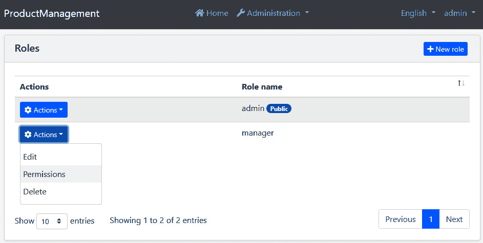
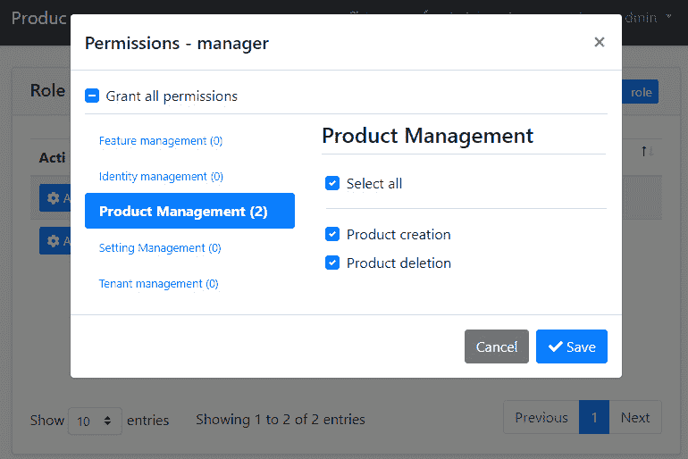
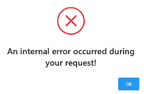

# *第七章*：探索横切关注点

横切关注点，如授权、验证、异常处理和日志记录，是任何严肃系统的基本组成部分。它们对于使您的系统安全并良好运行至关重要。

实现横切关注点的一个问题是，您应该在应用程序的每个地方实现这些关注点，这会导致代码库重复。此外，缺少一个授权或验证检查可能会导致整个系统崩溃。

ABP 框架的主要目标之一是帮助您应用**不要重复自己**（**DRY**）原则！ASP.NET Core 已经为一些横切关注点提供了一个良好的基础设施，但 ABP 将其进一步自动化或使它们对您来说更容易实现。

本章探讨了 ABP 以下横切关注点的架构：

+   与授权和权限系统一起工作

+   验证用户输入

+   异常处理

# 技术要求

如果您想跟随示例进行尝试，您需要安装一个**集成开发环境**（**IDE**）/编辑器（例如，Visual Studio）来构建 ASP.NET Core 项目。

您可以从以下 GitHub 仓库下载代码示例：[`github.com/PacktPublishing/Mastering-ABP-Framework`](https://github.com/PacktPublishing/Mastering-ABP-Framework)。

本章还引用了*EventHub*项目的一些代码示例。该项目在*第四章*，“理解参考解决方案”中介绍，您可以从以下 GitHub 仓库访问其源代码：[`github.com/volosoft/eventhub`](https://github.com/volosoft/eventhub)。

# 与授权和权限系统一起工作

**身份验证**和**授权**是软件安全中的两个主要概念。身份验证是识别当前用户的过程。另一方面，授权用于允许或禁止用户在应用程序中执行特定操作。

ASP.NET Core 的授权系统提供了一种高级且灵活的方式来授权当前用户。ABP 框架的授权基础设施与 ASP.NET Core 的授权系统 100%兼容，并通过引入权限系统对其进行扩展。ABP 允许权限轻松地授予角色和用户。它还允许在客户端检查相同的权限。

我将通过指出 ABP 框架添加的部分，将授权系统解释为 ASP.NET Core 和 ABP 基础设施的混合。让我们从最简单的授权检查开始。

## 简单授权

在最简单的情况下，您可能只想允许已登录到应用程序的用户执行某些操作。没有参数的`[Authorize]`属性仅检查当前用户是否已通过身份验证（登录）。

请参阅以下**模型-视图-控制器**（**MVC**）示例：

```cs
public class ProductController : Controller
{
    public async Task<List<ProductDto>> GetListAsync()
    {
    }
    [Authorize]
    public async Task CreateAsync(ProductCreationDto input)
    {
    }    
    [Authorize]
    public async Task DeleteAsync(Guid id)
    {
    }
}
```

在此示例中，`CreateAsync` 和 `DeleteAsync` 操作仅对经过身份验证的用户可用。假设一个匿名用户（未登录到应用程序的用户，因此我们无法识别他们）试图执行这些操作。在这种情况下，ASP.NET Core 会向客户端返回一个授权错误响应。然而，`GetListAsync` 方法对所有用户都可用，即使是匿名用户。

`[Authorize]` 属性可以在控制器类级别使用，以授权该控制器内的所有操作。在这种情况下，我们可以使用 `[AllowAnonymous]` 属性来允许特定操作对匿名用户。因此，我们可以重写相同的示例，如下面的代码块所示：

```cs
[Authorize]
public class ProductController : Controller
{
    [AllowAnonymous]
    public async Task<List<ProductDto>> GetListAsync()
    {
    }
    public async Task CreateAsync(ProductCreationDto input)
    {
    }

    public async Task DeleteAsync(Guid id)
    {
    }
}
```

在这里，我在类上使用了 `[Authorize]` 属性，并将 `[AllowAnonymous]` 添加到 `GetListAsync` 方法中。这使得也可以为尚未登录到应用程序的用户消费该特定操作。

虽然 `[Authorize]` 属性（无参数）有一些用例，但您通常希望在您的应用程序中定义特定的权限（或策略），以便所有经过身份验证的用户都不具有相同的权限。

## 使用权限系统

ABP 框架为 ASP.NET Core 最重要的授权扩展是权限系统。权限是一个简单的策略，它为特定的用户或角色授予或禁止。然后它与您的应用程序的特定功能相关联，并在用户尝试使用该功能时进行检查。如果当前用户拥有相关的权限授予，则用户可以使用应用程序功能。否则，用户不能使用该功能。

ABP 为您提供了在应用程序中定义、授予和检查权限的所有功能。

### 定义权限

在使用之前，我们应该定义权限。要定义权限，创建一个继承自 `PermissionDefinitionProvider` 类的类。当您创建一个新的 ABP 解决方案时，一个空的权限定义提供者类会包含在解决方案的 `Application.Contracts` 项目中。请参阅以下示例：

```cs
public class ProductManagementPermissionDefinitionProvider
    : PermissionDefinitionProvider
{
    public override void Define(
        IPermissionDefinitionContext context)
    {
        var myGroup = context.AddGroup(
            "ProductManagement");
        myGroup.AddPermission(
            "ProductManagement.ProductCreation");
        myGroup.AddPermission(
            "ProductManagement.ProductDeletion");
    }
}
```

ABP 框架在应用程序启动时调用 `Define` 方法。在此示例中，我创建了一个名为 `ProductManagement` 的权限组，并在其中定义了两个权限。组用于在 `string` 值上分组权限（建议使用 `const` 字段而不是使用魔法字符串）。

这是一个最小配置。您还可以指定用于组的本地化字符串显示名称，以及用于在用户界面中以用户友好的方式显示权限名称。以下代码块使用本地化系统在定义组和权限时指定显示名称：

```cs
public class ProductManagementPermissionDefinitionProvider
    : PermissionDefinitionProvider
{
    public override void Define(
        IPermissionDefinitionContext context)
    {
        var myGroup = context.AddGroup(
            «ProductManagement»,
            L("ProductManagement"));
        myGroup.AddPermission(
            "ProductManagement.ProductCreation",
            L("ProductCreation"));
        myGroup.AddPermission(
            "ProductManagement.ProductDeletion",
            L("ProductDeletion"));
    }

    private static LocalizableString L(string name)
    {
        return LocalizableString
            .Create<ProductManagementResource>(name);
    }
}
```

我定义了一个 `L` 方法来简化本地化。本地化系统将在*第八章*中介绍，*使用 ABP 的功能和服务*。

多租户应用程序中的权限定义

对于多租户应用程序，您可以为`AddPermission`方法的`multiTenancySide`参数指定，以定义仅主机或仅租户的权限。我们将在*第十六章* *实现多租户*中回到这个话题。

一旦定义了权限，在下次应用程序启动后，它就会在权限管理对话框中可用。

### 管理权限

默认情况下，可以为用户或角色授予权限。例如，假设您已创建一个管理员角色并希望为该角色授予产品权限。当您运行应用程序时，如果之前没有创建该角色，请导航到`manager`角色；要这样做，请单击**操作**按钮并选择**权限**操作，如图*图 7.1*所示：



图 7.1 – 在角色管理页面上选择权限操作

单击**权限**操作将打开一个模态对话框以管理所选角色的权限，如图所示：



图 7.2 – 权限管理模态框

在*图 7.2*中，您可以看到左侧的权限组，而该组中的权限在右侧可用。权限组和我们所定义的权限可以在该对话框中无需额外努力即可使用。

所有具有管理员角色的用户都继承该角色的权限。用户可以有多个角色，并且继承所有分配角色的所有权限的并集。您还可以在用户管理页面上直接授予用户权限，以获得更多灵活性。

我们已经定义了权限并将它们分配给了角色。下一步是检查当前用户是否有请求的权限。

### 检查权限

您可以使用声明方式，使用`[Authorize]`属性，或使用`IAuthorizationService`以编程方式检查权限。

我们可以将`ProductController`类（在*简单授权*部分介绍）重写为在特定操作上请求产品创建和删除权限，如下所示：

```cs
public class ProductController : Controller
{
    public async Task<List<ProductDto>> GetListAsync()
    {
    }
    [Authorize("ProductManagement.ProductCreation")]
    public async Task CreateAsync(ProductCreationDto input)
    {
    }    
    [Authorize("ProductManagement.ProductDeletion")]
    public async Task DeleteAsync(Guid id)
    {
    }
}
```

使用此用法，`[Authorize]`属性接受一个字符串参数作为策略名称。ABP 将权限定义为自动策略，因此您可以在需要指定策略名称的地方使用权限名称。

声明式授权简单易用，在可能的情况下推荐使用。然而，当您想要条件性地检查权限或执行未经授权的情况的逻辑时，它是有局限性的。对于此类情况，您可以注入并使用`IAuthorizationService`，如下面的示例所示：

```cs
public class ProductController : Controller
{
    private readonly IAuthorizationService 
        _authorizationService;
    public ProductController(
        IAuthorizationService authorizationService)
    {
        _authorizationService = authorizationService;
    }

    public async Task CreateAsync(ProductCreationDto input)
    {
        if (await _authorizationService.IsGrantedAsync(  
            "ProductManagement.ProductCreation"))
        {
            // TODO: Create the product
        }
        else
        {
            // TODO: Handle unauthorized case
        }
    }
}
```

`IsGrantedAsync` 方法检查给定的权限，如果当前用户（或用户的角色）已被授予当前权限，则返回 `true`。这在您有针对未经授权情况的自定义逻辑时很有用。然而，如果您只想简单地检查权限并在未经授权的情况下抛出异常，则 `CheckAsync` 方法更为实用：

```cs
public async Task CreateAsync(ProductCreationDto input)
{
    await _authorizationService
        .CheckAsync("ProductManagement.ProductCreation");
    //TODO: Create the product
}
```

如果用户没有权限执行该操作，`CheckAsync` 方法将抛出 `AbpAuthorizationException` 异常，由 ABP 框架处理以返回适当的 `IsGrantedAsync` 和 `CheckAsync` 方法。这些是 ABP 框架定义的有用扩展方法。

小贴士：从 AbpController 继承

建议从 `AbpController` 类而不是标准 `Controller` 类派生您的控制器类。这扩展了标准 `Controller` 类并定义了一些有用的基本属性。例如，它有 `AuthorizationService` 属性（`IAuthorizationService` 类型），您可以直接使用它而不是手动注入 `IAuthorizationService` 接口。

在服务器上检查权限是一种常见方法。但是，您可能还需要在客户端检查权限。

### 在客户端使用权限

ABP 提供了一个标准 HTTP API，URL 为 `/api/abp/application-configuration`，它返回包含本地化文本、设置、权限等 JSON 数据。然后，客户端应用程序可以消费该 API 来检查权限或执行客户端的本地化。

不同的客户端类型可能提供不同的服务来检查权限。例如，在一个 MVC/Razor Pages 应用程序中，您可以使用 `abp.auth` JavaScript API 来检查权限，如下所示：

```cs
abp.auth.isGranted('ProductManagement.ProductCreation');
```

这是一个全局函数，如果当前用户具有给定的权限，则返回 `true`。否则，返回 `false`。

在一个 Blazor 应用程序中，您可以重用相同的 `[Authorize]` 属性和 `IAuthorizationService`。

我们将在 *第四部分*，*用户界面和 API 开发* 中回到客户端权限检查。

### 子权限

在一个复杂的应用程序中，您可能需要创建一些依赖于其父权限的子权限。只有当父权限已被授予时，子权限才有意义。参见 *图 7.3*：


图 7.3 – 父子权限

在 *图 7.3* 中，**角色管理**权限有一些子权限，例如**创建**、**编辑**和**删除**。**角色管理**权限用于允许用户进入**角色管理**页面。如果用户无法进入该页面，那么授予角色创建权限就没有意义，因为实际上无法在不进入该页面的情况下创建新角色。

在权限定义类中，`AddPermission` 方法返回创建的权限，这样您就可以将其赋给一个变量，并使用 `AddChild` 方法创建子权限，如下面的代码块所示：

```cs
public override void Define(IpermissionDefinitionContext
                            context)
{
    var myGroup = context.AddGroup(
        "ProductManagement",
        L("ProductManagement"));
    var parent = myGroup.AddPermission(
        "MyParentPermission");
    parent.AddChild("MyChildPermission");
}
```

在这个例子中，我们创建了一个名为 `MyParentPermission` 的权限，然后创建了一个名为 `MyChildPermission` 的权限作为子权限。

子权限也可以有子权限。您可以将 `parent.AddChild` 方法的返回值赋给一个变量，并调用其 `AddChild` 方法。

定义和使用权限是一种简单而强大的方式，可以通过简单的开/关式策略来授权应用程序。然而，ASP.NET Core 允许创建完整的自定义逻辑来定义策略。

## 基于策略的授权

ASP.NET Core 的**基于策略的授权**系统允许您授权应用程序中的某些操作，就像使用权限一样，但这次是通过代码表达的自定义逻辑。实际上，权限是 ABP 框架提供的一个简化和自动化的策略。

假设您想使用自定义代码授权一个**产品创建**操作。首先，您需要定义一个您稍后将要检查的要求（我们可以在解决方案的应用层中定义这些类，而无需遵循严格的规则）。以下代码片段展示了代码的示例：

```cs
public class ProductCreationRequirement : 
    IAuthorizationRequirement
{ }
```

`ProductCreationRequirement` 是一个空类，它仅实现了 `IAuthorizationRequirement` 标记接口。然后，您应该为该要求定义一个授权处理器，如下所示：

```cs
public class ProductCreationRequirementHandler 
    : AuthorizationHandler<ProductCreationRequirement>
{
    protected override Task HandleRequirementAsync(
        AuthorizationHandlerContext context,
        ProductCreationRequirement requirement)
    {
        if (context.User.HasClaim(c => c.Type == 
            "productManager"))
        {
            context.Succeed(requirement);
        }

        return Task.CompletedTask;
    }
}
```

处理器类必须从 `AuthorizationHandler<T>` 派生，其中 `T` 是您的要求类类型。在这个例子中，我简单地检查当前用户是否有 `productManager` 断言，这是我自定义的断言（断言是存储在身份验证票据中的简单命名值）。您可以构建自己的自定义逻辑。您要做的只是调用 `context.Succeed`，如果您想允许当前用户拥有该要求。

一旦定义了要求和处理器，您需要将它们注册到您的模块类的 `ConfigureServices` 方法中，如下所示：

```cs
public override void ConfigureServices(
    ServiceConfigurationContext context)
{
    Configure<AuthorizationOptions>(options =>
    {
        options.AddPolicy(
            "ProductManagement.ProductCreation",
            policy => policy.Requirements.Add(
                new ProductCreationRequirement()
            )
        );
    });
    context.Services.AddSingleton<IAuthorizationHandler, 
        ProductCreationRequirementHandler>();
}
```

我使用了 `AuthorizationOptions` 来定义一个名为 `ProductManagement.ProductCreation` 的策略，并带有 `ProductCreationRequirement` 要求。然后，我将 `ProductCreationRequirementHandler` 注册为一个单例服务。

现在，假设我在控制器或操作上使用 `[Authorize("ProductManagement.ProductCreation")]` 属性，或者使用 `IAuthorizationService` 来检查策略。在这种情况下，我的自定义授权处理器逻辑将允许我完全控制策略检查逻辑。

权限与自定义策略的比较

一旦您实现了自定义策略，您就不能使用权限管理对话框来授予用户和角色的权限，因为它不是一个简单的开启/关闭权限，您可以启用/禁用。然而，客户端策略检查仍然有效，因为 ABP 与 ASP.NET Core 的策略系统很好地集成。

如您所见，如果您只需要开启/关闭风格的策略，ABP 的权限系统就简单得多，功能也更强大；而自定义策略允许您使用自定义逻辑动态检查策略。

基于资源的授权

ASP.NET Core 的授权系统比这里所涵盖的功能更多。基于资源的授权是一个允许您根据对象（如实体）来控制策略的功能。例如，您可以控制删除特定产品的访问权限，而不是为所有产品设置一个通用的删除权限。ABP 与 ASP.NET Core 授权系统 100% 兼容，因此我建议您查看 ASP.NET Core 的文档以了解更多关于授权的信息：[`docs.microsoft.com/en-us/aspnet/core/security/authorization`](https://docs.microsoft.com/en-us/aspnet/core/security/authorization)。

到目前为止，我们已经看到了 `[Authorize]` 属性在 MVC 控制器上的用法。然而，这个属性和 `IAuthorizationService` 并不仅限于控制器。

## 控制器之外的授权

ASP.NET Core 允许您在 Razor Pages、Razor 组件和 Web 层的一些其他点上使用 `[Authorize]` 属性和 `IAuthorizationService`。您可以参考 ASP.NET Core 的文档来了解这些标准用法：[`docs.microsoft.com/en-us/aspnet/core/security/authorization`](https://docs.microsoft.com/en-us/aspnet/core/security/authorization)。

ABP 框架更进一步，允许在应用程序服务类和方法上使用 `[Authorize]` 属性，而无需依赖于网络层，即使在非网络应用程序中也是如此。因此，这种用法是完全有效的，如下所示：

```cs
public class ProductAppService
    : ApplicationService, IProductAppService
{
    [Authorize("ProductManagement.ProductCreation")]
    public Task CreateAsync(ProductCreationDto input)
    {
        // TODO
    }
}
```

`CreateAsync` 方法只能在当前用户具有 `ProductManagement.ProductCreation` 权限/策略的情况下执行。实际上，`[Authorize]` 可以在任何注册了 **依赖注入**（**DI**）的类中使用。然而，由于授权被认为是一个应用层方面，建议在应用层而不是领域层使用授权。

动态代理/拦截器

ABP 使用拦截器通过动态代理来实现方法调用上的授权检查。如果您通过类引用（而不是接口引用）注入服务，动态代理系统会使用动态继承技术。在这种情况下，您的方法必须使用 `virtual` 关键字定义，以便动态代理系统可以覆盖它并执行授权检查。

授权系统确保只有授权用户才能使用你的服务。这是你需要用来保护应用程序的系统之一，另一个是输入验证。

# 验证用户输入

验证确保你的数据安全和一致性，并帮助你的应用程序正常运行。验证是一个广泛的话题，有一些常见的验证级别，如下所述：

+   **客户端验证**用于在将数据发送到服务器之前预先验证用户输入。这对于**用户体验**（**UX**）非常重要，你应该在可能的情况下始终实现它。然而，它不能保证安全性——即使是经验不足的黑客也可以绕过它。例如，检查必填的文本框字段是否为空是一种客户端验证。我们将在*第四部分*，*用户界面和 API 开发*中介绍客户端验证。

+   **服务器端验证**由服务器执行，以防止不完整、格式错误或恶意请求。它为你的应用程序提供了一定程度的安全性，通常在第一次接触客户端发送的数据时执行。例如，在服务器端检查必填的输入字段是否为空是此类验证的一个例子。

+   **业务验证**也在服务器端执行；它实现了你的业务规则并保持你的业务数据一致性。它在你业务代码的每个级别上执行。例如，在转账前检查用户的余额是一种业务验证。我们将在*第十章*，*领域驱动设计（DDD）- 领域层*中介绍业务验证。

    关于 ASP.NET Core 验证系统

    ASP.NET Core 提供了许多输入验证选项。本书通过关注 ABP 框架添加的功能来介绍基础知识。有关所有验证可能性的详细信息，请参阅 ASP.NET Core 的文档：[`docs.microsoft.com/en-us/aspnet/core/mvc/models/validation`](https://docs.microsoft.com/en-us/aspnet/core/mvc/models/validation)。

本节重点介绍服务器端验证，展示如何以不同的方式执行输入验证。它还探讨了控制验证过程和处理验证异常的方法。

让我们从最简单的方式进行验证的方法开始——使用数据标注属性。

## 使用数据标注属性

使用数据标注属性是执行用户输入正式验证的最简单方法。请参阅以下应用服务方法：

```cs
public class ProductAppService
    : ApplicationService, IProductAppService
{
    public Task CreateAsync(ProductCreationDto input)
    {
        // TODO
    }
}
```

`ProductAppService` 是一个应用服务，在 ABP 框架中，应用服务的输入会自动进行验证，就像在 ASP.NET Core MVC 框架中的控制器一样。`ProductAppService` 服务接受一个输入参数，如下面的代码块所示：

```cs
public class ProductCreationDto
{
    [Required]
    [StringLength(100)]
    public string Name { get; set; }

    [Range(0, 999.99)]
    public decimal Price { get; set; }

    [Url]
    public string PictureUrl { get; set; }
    public bool IsDraft { get; set; }
}
```

`ProductCreationDto` 有三个属性被验证属性装饰。ASP.NET Core 有许多内置的验证属性，包括以下内容：

+   `[Required]`：验证属性不为空

+   `[StringLength]`：验证字符串属性的最大（和可选的最小）长度

+   `[Range]`：验证属性值是否在指定的范围内

+   `[Url]`：验证属性值具有正确的 URL 格式

+   `[RegularExpression]`：允许指定一个自定义**正则表达式**（**regex**）来验证属性值

+   `[EmailAddress]`：验证属性具有正确格式的电子邮件地址值

ASP.NET Core 还允许你通过从`ValidationAttribute`类继承并重写`IsValid`方法来定义自定义验证属性。

数据注释属性非常易于使用，建议用于对**数据传输对象**（**DTOs**）和模型进行正式验证。然而，当需要执行自定义代码逻辑来验证输入时，它们是有限的。

## 使用 IValidatableObject 接口进行自定义验证

模型或 DTO 对象可以实现`IValidatableObject`接口，使用自定义代码块进行验证。请参阅以下示例：

```cs
public class ProductCreationDto : IValidatableObject
{
    ...
    [Url]
    public string PictureUrl { get; set; }    
    public bool IsDraft { get; set; }    
    public IEnumerable<ValidationResult> Validate(
        ValidationContext context)
    {
        if (IsDraft == false &&
            string.IsNullOrEmpty(PictureUrl))
        {
            yield return new ValidationResult(
                "Picture must be provided to publish a
                 product",
                new []{ nameof(PictureUrl) }
            );
        }
    }
}
```

在此示例中，`ProductCreationDto`有一个自定义规则：如果`IsDraft`为`false`，则必须提供个人资料图片。因此，我们检查条件并在这种情况下添加一个验证错误。

如果你需要从 DI 系统中解析服务，你可以使用`context.GetRequiredService`方法。例如，如果我们想本地化错误消息，我们可以重写`Validate`方法，如下面的代码块所示：

```cs
public IEnumerable<ValidationResult> Validate(
    ValidationContext context)
{
    if (IsDraft == false &&
        string.IsNullOrEmpty(PictureUrl))
    {
        var localizer = context.GetRequiredService
            <IStringLocalizer<ProductManagementResource>
            >();

        yield return new ValidationResult(
            localizer["PictureIsMissingErrorMessage"],
            new []{ nameof(PictureUrl) }
        );
    }
}
```

在这里，我们从 DI 中解析一个`IStringLocalizer<ProductManagementResource>`实例，并使用它向客户端返回本地化错误消息。我们将在*第八章*中介绍本地化系统，*使用 ABP 的功能和服务*。

正式验证与业务验证

作为最佳实践，仅在 DTO/模型类中实现正式验证（例如，如果 DTO 属性未填写或未按预期格式化），并仅使用 DTO/模型类上已存在的数据。在你的应用程序或领域层服务中实现你的业务验证逻辑。例如，如果你想检查给定的产品名称是否已在数据库中存在，不要尝试在`Validate`方法中实现此逻辑。

使用验证属性或自定义验证逻辑，ABP 框架处理验证结果，并在执行你的方法之前抛出异常。

## 理解验证异常

如果用户输入无效，ABP 框架会自动抛出`AbpValidationException`类型的异常。异常在以下情况下抛出：

+   输入对象是`null`，所以你不需要检查它是否为`null`。

+   输入对象在任何方面都是无效的，因此你不需要在你的 API 控制器中检查`Model.IsValid`。

在这些情况下，ABP 不会调用你的服务方法（或控制器操作）。如果你的方法正在执行，你可以确信输入不是 null 且有效。

如果你想在服务内部执行额外的验证并抛出与验证相关的异常，你也可以抛出`AbpValidationException`，如下面的代码片段所示：

```cs
public async Task CreateAsync(ProductCreationDto input)
{
    if (await HasExistingProductAsync(input.Name))
    {
        throw new AbpValidationException(
            new List<ValidationResult>
            {
                new ValidationResult(
                    "Product name is already in use!",
                    new[] {nameof(input.Name)}
                )
            }
        );
    }
}
```

在这里，我们假设`HasExistingProductAsync`方法在存在具有给定名称的产品时返回`true`。在这种情况下，我们通过指定验证错误抛出`AbpValidationException`。`ValidationResult`代表一个验证错误；其第一个构造函数参数是验证错误消息，第二个参数（可选）是导致验证错误的 DTO 属性名称。

一旦你或 ABP 验证系统抛出`AbpValidationException`异常，ABP 异常处理系统会捕获并正确处理它，正如我们将在下一个章节中看到的。

ABP 验证系统大多数时候都按你的预期工作，但有时你可能需要绕过它并应用你自定义的逻辑。

## 禁用验证

使用`[DisableValidation]`属性，可以在方法或类级别绕过 ABP 验证系统，如下面的例子所示：

```cs
[DisableValidation]
public async Task CreateAsync(ProductCreationDto input)
{
}
```

在这个例子中，`CreateAsync`方法被装饰了`[DisableValidation]`属性，因此 ABP 不会对`input`对象执行任何自动验证。

如果你为类使用`[DisableValidation]`属性，则所有方法都将禁用验证。在这种情况下，你可以为方法使用`[EnableValidation]`属性，仅为此特定方法启用验证。

当你禁用方法的自动验证时，你仍然可以执行你自定义的验证逻辑并抛出`AbpValidationException`，正如前一个章节所解释的。

## 在其他类型中的验证

ASP.NET Core 为控制器操作和 Razor 页面处理程序执行验证。除了 ASP.NET Core 之外，ABP 默认情况下还会为应用程序服务方法执行验证。

除了默认行为之外，ABP 允许你在应用程序中的任何类型的类上启用自动验证功能。你需要做的就是实现`IValidationEnabled`标记接口，如下面的例子所示：

```cs
public class SomeServiceWithValidation
    : IValidationEnabled, ITransientDependency
{
    ...
}
```

然后，ABP 使用本章中解释的验证系统自动验证这个类的所有输入。

动态代理/拦截器

ABP 使用拦截器进行动态代理以在方法调用上完成验证。如果你通过类引用（而不是接口引用）注入服务，动态代理系统使用动态继承技术。在这种情况下，你的方法必须使用`virtual`关键字定义，以便动态代理系统可以覆盖它并执行验证。

到目前为止，我们已经解释了与 ASP.NET Core 验证基础设施直接兼容的 ABP 验证系统。下一节将介绍`FluentValidation`库集成，它允许你将验证逻辑与验证对象分离。

## 集成 FluentValidation 库

内置的验证系统对于大多数情况来说已经足够，并且使用它来定义正式的验证规则非常容易。我个人认为它没有问题，并且发现将数据验证逻辑嵌入 DTO/模型类中是实用的。然而，一些开发者认为，即使在只有正式验证的情况下，DTO/模型类中的验证逻辑也是一种不良实践。在这种情况下，ABP 提供了一个与流行的`FluentValidation`库集成的包，它将验证逻辑与 DTO/模型类解耦，并提供了比标准数据注释方法更强大的功能。

如果你想要使用`FluentValidation`库，首先需要将其安装到你的项目中。你可以使用**ABP 命令行界面（ABP CLI**）的`add-package`命令轻松地为项目安装它，如下所示：

```cs
abp add-package Volo.Abp.FluentValidation
```

一旦安装了包，你就可以创建你的验证器类并设置你的验证规则，如下面的代码块所示：

```cs
public class ProductCreationDtoValidator
    : AbstractValidator<ProductCreationDto>
{
    public ProductCreationDtoValidator()
    {
        RuleFor(x => x.Name).NotEmpty().MaximumLength(100);
        RuleFor(x => x.Price).ExclusiveBetween(0, 1000);
        //...
    }
}
```

请参考`FluentValidation`文档了解如何定义高级验证规则：[`fluentvalidation.net`](https://fluentvalidation.net)。

ABP 自动发现验证器类并将它们集成到验证过程中。这意味着你甚至可以将标准验证逻辑与`FluentValidation`验证器类混合使用。

授权和验证异常是定义良好的异常类型，ABP 会自动处理它们。下一节将探讨 ABP 异常处理系统，并解释如何处理不同类型的异常。

# 异常处理

应用程序最重要的质量指标之一是它如何响应错误和异常情况。一个好的应用程序应该处理错误，向客户端返回适当的响应，并优雅地通知用户问题。

在一个典型的 Web 应用程序中，我们应该关注每个客户端请求中的异常，这使得对于开发者来说，它变成了一项重复且繁琐的任务。

ABP 框架完全自动化了应用程序每个方面的错误处理。大多数时候，你不需要在应用程序代码中编写任何`try-catch`语句，因为它会执行以下操作：

+   处理所有异常，记录它们，并在 API 请求中向客户端返回标准格式的错误响应，或在服务器渲染的页面中显示标准错误页面

+   在隐藏内部基础设施错误的同时，允许你在需要时返回用户友好的、本地化的错误消息

+   理解标准异常，如验证和授权异常，并向客户端发送适当的 HTTP 状态码

+   在客户端处理所有错误并向最终用户显示有意义的消息

当 ABP 处理异常时，您可以抛出异常以返回用户友好的消息或业务特定的错误代码给客户端。

## 用户友好的异常

ABP 提供了一些预定义的异常类来定制错误处理行为。其中之一是`UserFriendlyException`类。

首先，为了理解`UserFriendlyException`类的需求，看看如果从服务器端 API 抛出一个任意异常会发生什么。以下方法抛出一个带有自定义消息的异常：

```cs
Public async Task ExampleAsync()
{
    throw new Exception("my error message...");
}
```

假设一个浏览器客户端通过 AJAX 请求调用该方法。它将向最终用户显示以下错误消息：



图 7.4 – 默认错误消息

如您在*图 7.4*中看到的那样，ABP 显示了一个关于内部问题的标准错误消息。实际的错误消息被写入日志系统。服务器对于此类通用错误向客户端返回 HTTP 500 状态码。

这是一种良好的行为，因为向最终用户显示原始异常消息是没有用的。甚至可能很危险，因为它可能包含一些关于您内部系统的敏感信息，例如数据库表名和字段。

然而，您可能希望在某些特定情况下向最终用户返回一个用户友好的、信息丰富的消息。对于此类情况，您可以抛出一个`UserFriendlyException`异常，如下面的代码块所示：

```cs
public async Task ExampleAsync()
{
    throw new UserFriendlyException(
        "This message is available to the user!");
}
```

目前，ABP 没有隐藏错误消息，正如我们在这里看到的那样：


图 7.5 – 自定义错误消息

`UserFriendlyException`类不是唯一的。任何继承自`UserFriendlyException`类或直接实现`IUserFriendlyException`接口的异常类都可以用来返回用户友好的异常消息。当您抛出一个用户友好的异常时，ABP 向客户端返回 HTTP 403（禁止）状态码。有关所有 HTTP 状态码映射，请参阅本章的*控制 HTTP 状态码*部分。

在多语言应用程序中，您可能希望返回本地化消息。在这种情况下，使用本地化系统，该系统将在*第八章*，*使用 ABP 的功能和服务*中介绍。

`UserFriendlyException`是一种特殊的业务异常，其中您直接向用户返回一条消息。

## 业务异常

在业务应用程序中，您将有一些业务规则，并且当根据这些规则在当前条件下请求的操作不适当执行时，您需要抛出异常。ABP 中的业务异常是 ABP 框架识别和处理的特殊类型的异常。

在最简单的情况下，您可以直接使用`BusinessException`类来抛出业务异常。请参见以下来自*EventHub*项目的示例：

```cs
public class EventRegistrationManager : DomainService
{
    public async Task RegisterAsync(
        Event @event,
        AppUser user)
    {
        if (Clock.Now > @event.EndTime)
        {
            throw new BusinessException(EventHubErrorCodes
                .CantRegisterOrUnregisterForAPastEvent);
        }
        ...
    }
}
```

`EventRegistrationManager` 是一个用于执行事件注册业务规则的领域服务。`RegisterAsync` 方法检查事件时间，并防止注册过去的事件，在这种情况下会抛出业务异常。

`BusinessException` 的构造函数接受一些参数，所有这些参数都是可选的。这些参数在此列出：

+   `code`：用作异常自定义错误代码的字符串值。客户端应用程序可以在处理异常时检查它，并轻松跟踪错误类型。您通常为不同的异常使用不同的错误代码。错误代码也可以用于本地化异常，正如我们将在 *本地化业务异常* 部分中看到的那样。

+   `message`：如果需要，一个字符串异常消息。

+   `details`：如果需要，一个详细的解释消息字符串。

+   `innerException`：如果有的话，一个内部异常。如果您已缓存一个异常并基于该异常抛出业务异常，可以在这里传递。

+   `logLevel`：此异常的日志级别。它是一个 `LogLevel` 类型的枚举，默认值为 `LogLevel.Warning`。

您通常只传递 `code`，这在日志中更容易找到。它也用于将错误消息本地化到客户端。

### 本地化业务异常

如果您使用 `UserFriendlyException`，您必须自己本地化消息，因为异常消息会直接显示给最终用户。如果您抛出 `BusinessException`，除非您明确本地化它，否则 ABP 不会将异常消息显示给最终用户。它使用错误代码命名空间来达到这个目的。

假设您已使用 `EventHub:CantRegisterOrUnregisterForAPastEvent` 作为错误代码。在这里，`EventHub`通过冒号的使用成为错误代码命名空间。我们必须将错误代码命名空间映射到本地化资源，以便 ABP 能够知道为这些错误消息使用哪个本地化资源。以下代码片段展示了这一过程：

```cs
Configure<AbpExceptionLocalizationOptions>(options =>
{
    options.MapCodeNamespace(
        "EventHub", typeof(EventHubResource));
});
```

在此代码片段中，我们将 `EventHub` 错误代码命名空间映射到 `EventHubResource` 本地化资源。现在，您可以在本地化文件中将错误代码定义为键，包括命名空间，如下所示：

```cs
{
  "culture": "en",
  "texts": {
    "EventHub:CantRegisterOrUnregisterForAPastEvent": 
        "You can not register to or unregister from an 
         event in the past, sorry!"
  }
}
```

在该配置之后，每当您使用该错误代码抛出 `BusinessException` 异常时，ABP 都会向用户显示本地化消息。

在某些情况下，您可能希望在错误消息中包含一些额外的数据。请参阅以下代码片段：

```cs
throw new BusinessException(
    EventHubErrorCodes.OrganizationNameAlreadyExists
).WithData("Name", name);
```

在这里，我们使用 `WithData` 扩展方法在错误消息中包含组织名称。然后，我们可以定义本地化字符串，如下面的代码片段所示：

```cs
"EventHub:OrganizationNameAlreadyExists": "The organization {Name} already exists. Please use another name."
```

在此示例中，`{Name}` 是组织名称的占位符。ABP 会自动将其替换为给定的名称。

我们将在 *第八章* 中介绍本地化系统，*使用 ABP 的功能和服务*。

我们已经看到了如何抛出`BusinessException`异常。如果您想创建专门的异常类怎么办？

### 自定义业务异常类

也可以创建自定义异常类，而不是直接抛出`BusinessException`异常。在这种情况下，您可以创建一个新的类，从`BusinessException`类继承，如下面的代码块所示：

```cs
public class OrganizationNameAlreadyExistsException
    : BusinessException
{
    public string Name { get; private set; }
    public OrganizationNameAlreadyExistsException(
        string name) : base(EventHubErrorCodes
        .OrganizationNameAlreadyExists)
    {
        Name = name;
        WithData("Name", name);
    }
}
```

在此示例中，`OrganizationNameAlreadyExistsException`是一个自定义业务异常类。它在构造函数中接受组织的名称。它设置`"Name"`数据，以便 ABP 可以在本地化过程中使用组织名称。抛出此异常非常直接，如下所示：

```cs
throw new OrganizationNameAlreadyExistsException(name);
```

这种用法比抛出带有自定义数据的`BusinessException`异常简单，开发者可能会忘记设置这些数据。它还减少了在代码库的多个地方抛出相同异常时的重复。

## 控制异常记录

如在*异常处理*部分开头所述，ABP 会自动记录所有异常。业务异常、授权和验证异常以`Warning`级别记录，而其他错误默认以`Error`级别记录。

您可以实现`IHasLogLevel`接口为异常类设置不同的日志级别。请参见以下示例：

```cs
public class MyException : Exception, IHasLogLevel
{
    public LogLevel LogLevel { get; set; } =
        LogLevel.Warning;
    //...
}
```

`MyException`类使用`Warning`级别实现了`IHasLogLevel`接口。如果您抛出`MyException`类型的异常，ABP 将写入警告日志。

还可以为异常写入额外的日志。您可以通过实现`IExceptionWithSelfLogging`接口来写入额外的日志，如下面的示例所示：

```cs
public class MyException
    : Exception, IExceptionWithSelfLogging
{
    public void Log(ILogger logger)
    {
        //...log additional info
    }
}
```

在此示例中，`MyException`类实现了`IExceptionWithSelfLogging`接口，该接口定义了一个`Log`方法。ABP 将记录器传递到这里，以便您在需要时写入额外的日志。

## 控制 HTTP 状态码

ABP 会尽力为已知异常类型返回适当的 HTTP 状态码，如下所示：

+   如果用户未登录，则对于`AbpAuthorizationException`返回`401`（未授权）

+   如果用户已登录，则对于`AbpAuthorizationException`返回`403`（禁止）

+   对于`AbpValidationException`返回`400`（错误请求）

+   对于`EntityNotFoundException`返回`404`（未找到）

+   对于业务和用户友好的异常返回`403`（禁止）

+   对于`NotImplementedException`返回`501`（未实现）

+   对于其他异常（假设为基础设施错误）返回`500`（内部服务器错误）

如果您想为自定义异常返回另一个 HTTP 状态码，可以将您的错误代码映射到 HTTP 状态码，如下面的配置所示：

```cs
services.Configure<AbpExceptionHttpStatusCodeOptions>(
    options =>
{
    options.Map(
        EventHubErrorCodes.OrganizationNameAlreadyExists,
        HttpStatusCode.Conflict);
});
```

建议在解决方案的 Web 或 HTTP API 层进行此配置。

# 摘要

在本章中，我们探讨了在每个严肃的商业应用程序中都应该实现的三项基本横切关注点。

授权是系统安全的关键关注点。你应该仔细控制应用程序每个操作中的授权规则。ABP 简化了 ASP.NET Core 授权基础设施的使用，并添加了一个灵活的权限系统，这对于企业应用程序来说是一个非常常见的模式。

另一方面，验证通过优雅地阻止格式错误或恶意请求来支持系统安全并提高用户体验。ABP 通过允许你在应用程序的任何服务中实现验证并将其集成到`FluentValidation`库以进行高级使用，增强了标准的 ASP.NET Core 验证。

最后，ABP 的异常处理系统工作无缝，并在服务器端和客户端自动处理异常。它还允许你将本地化错误消息与抛出异常的代码中的 HTTP 状态代码解耦并映射。

下一章将继续通过介绍一些有趣的 ABP 功能，如自动审计日志和数据过滤，来探索 ABP 框架服务。
