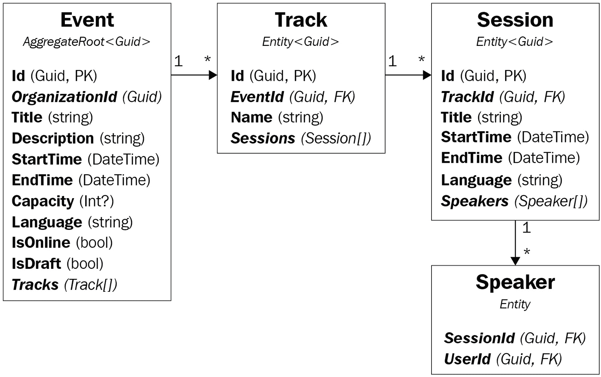

# *第十章*：DDD – 领域层

上一章是对**领域驱动设计**（**DDD**）的整体概述，其中您学习了 DDD 的基本层、构建块和原则。您还了解了 ABP 解决方案的结构及其与 DDD 的关系。

本章完全专注于领域层的实现细节，包含大量代码示例和最佳实践建议。以下是本章我们将涵盖的主题：

+   探索示例领域

+   设计聚合和实体

+   实现领域服务

+   实现仓储

+   构建规范

+   发布领域事件

# 技术要求

您可以从 GitHub 克隆或下载*EventHub*项目的源代码：[`github.com/volosoft/eventhub`](https://github.com/volosoft/eventhub)。

如果您想在本地开发环境中运行解决方案，您需要有一个 IDE/编辑器（例如 Visual Studio）来构建和运行 ASP.NET Core 解决方案。此外，如果您想创建 ABP 解决方案，您需要安装 ABP CLI，如*第二章*中所述，*ABP 框架入门*。

# 探索示例领域

本章和下一章中的示例将主要基于 EventHub 解决方案。因此，首先理解领域至关重要。*第四章*，*理解参考解决方案*已经解释了该解决方案。如果您想熟悉应用程序和解决方案结构，可以查看它。在这里，我们将探讨技术细节和领域对象。

以下列表介绍了并解释了领域的主要概念：

+   **事件**是表示在线或现场活动的根对象。事件具有标题、描述、开始时间、结束时间、注册容量（可选）和语言（可选）作为主要属性。

+   事件由**组织**创建（组织）。应用程序中的任何**用户**都可以创建组织并在该组织内组织活动。

+   事件可以有零个或多个**轨道**，每个轨道都有一个轨道名称（通常是一个简单的标签，如 1、2、3 或 A、B、C）。轨道是一系列会议。具有多个轨道的事件使得组织并行会议成为可能。

+   一个轨道包含一个或多个**会议**。会议是活动的一部分，参与者通常会在一定时间内聆听演讲者。

+   最后，一个会议可以有一个或多个**演讲者**。演讲者是会议中发言并做展示的人。通常，每个会议都会有一个演讲者。但有时可能会有多个演讲者，或者会议可能没有与演讲者相关联。*图 10.1*显示了事件与其轨道、会议和演讲者之间的关系。

+   应用程序中的任何用户都可以**注册**事件。注册用户在事件开始前或事件时间更改时会被通知。

你已经了解了 EventHub 应用程序中的基本对象。下一节将解释 DDD 的第一个构建块：聚合。

# 设计聚合和实体

设计你的实体和聚合边界非常重要，因为解决方案的其他组件将基于该设计。在本节中，我们首先了解什么是聚合。然后我们将看到一些聚合设计的关键原则。最后，我将介绍一些明确的规则和代码示例，以了解我们应该如何实现聚合。

## 什么是聚合根？

聚合是一组由聚合根对象绑定在一起的对象。聚合根对象负责实现与聚合相关的业务规则和约束，保持聚合对象的有效状态并保持数据完整性。聚合根和相关对象有方法来实现这一责任。

下图所示的事件聚合是一个聚合的好例子：



图 10.1 – 事件聚合

本章的示例将主要基于`事件`聚合，因为它代表了 EventHub 解决方案的基本概念。因此，我们应该理解其设计：

+   在这里，`事件`对象是聚合根，具有`GUID`主键。它包含一个`Track`对象集合（一个事件可以有零个或多个轨道）。

+   `Track`是一个具有`GUID`主键的实体，包含一个`Session`对象列表（一个轨道应该有一个或多个会话）。

+   `会话`也是一个具有`GUID`主键的实体，包含一个`Speaker`对象列表（一个会话可以有零个或多个演讲者）。

+   `演讲者`是一个具有复合主键的实体，由`SessionId`和`UserId`组成。

`事件`是一个相对复杂的聚合。应用程序中的大多数聚合将只包含一个实体，即聚合根实体。

聚合根也是一个在聚合中具有特殊角色的实体：它是聚合的根实体，负责子集合。我将使用术语**实体**来指代聚合根和子集合实体。因此，实体规则适用于这两种对象类型，除非我明确提到其中之一。

在接下来的章节中，我将介绍聚合的两个基本属性：单个单元和序列化对象。

### 单个单元

聚合作为一个单一单元检索（从数据库中）和存储（在数据库中），包括所有属性和子集合实体。例如，如果你想向一个`事件`添加一个新的`会话`，你应该执行以下操作：

1.  从数据库中读取包含所有`Track`、`Session`和`Speaker`对象的相关的`事件`对象。

1.  使用 `Event` 类的方法将新的 `Session` 对象添加到 `Event` 的 `Track` 中。

1.  将 `Event` 聚合体连同新更改一起保存到数据库中。

这可能对习惯于使用关系数据库和 ORM（如 EF Core）的开发者来说似乎效率不高。然而，这是必要的，因为这是通过实现业务规则来保持聚合对象的一致性和有效性的方式。

这里是一个实现该过程的简化示例应用程序服务方法：

```cs
public class EventAppService
    : EventHubAppService, IEventAppService
{
    //...
    public async Task AddSessionAsync(Guid eventId,
                                      AddSessionDto input)
    {
        var @event = 
            await _eventRepository.GetAsync(eventId);
        @event.AddSession(input.TrackId, input.Title,
            input.StartTime, input.EndTime);
        await _eventRepository.UpdateAsync(@event);
    }
}
```

对于这个例子，`event.AddSession` 方法内部会检查新会话的开始时间和结束时间是否与同一轨道上的另一个会话冲突。此外，会话的时间范围不应超出活动的时间范围。我们可能还有其他业务规则。我们可能希望限制活动中的会话数量或检查会话的演讲者是否在同一时间范围内有其他演讲。

记住，领域驱动设计（DDD）是用于状态变化的。如果你需要进行大量查询或准备报告，你可以尽可能优化你的数据库查询。然而，对于任何对聚合体的更改，我们需要在该聚合体上的所有对象上应用与该更改相关的业务规则。如果你担心性能，请参阅*保持聚合体小*部分。

在方法末尾，我们使用存储库的 `UpdateAsync` 方法更新了 `Event` 实体。如果你使用 EF Core，你不需要显式调用 `UpdateAsync` 方法，因为 EF Core 的更改跟踪系统会为你调用 `DbContext.SaveChangesAsync()` 方法。然而，例如，MongoDB .NET 驱动程序没有更改跟踪系统，如果你使用 MongoDB，你应该显式调用 `UpdateAsync` 方法到 `Event` 对象。

关于 `IRepository.GetAsync` 方法

存储库的 `GetAsync` 方法（在先前的示例代码块中使用）将 `Event` 对象作为一个聚合体（带有所有子集合）作为一个单元检索。对于 MongoDB，它默认工作，但你需要配置你的聚合体以启用 EF Core 的该行为。请参阅*第六章**，使用数据访问基础设施*中的*聚合模式*部分，以记住如何配置它。

作为单个单元检索和保存聚合体为我们提供了机会，可以对单个聚合体的对象进行多项更改，并使用单个数据库操作将它们全部保存。这样，该聚合体中的所有更改在本质上都是原子的，无需显式数据库事务。

工作单元系统

如果你需要更改多个聚合（相同或不同类型），你仍然需要一个数据库事务。在这种情况下，ABP 的单元工作系统（在*第六章*，*与数据访问基础设施一起工作*）会自动按照惯例处理数据库事务。

### 一个可序列化的对象

一个聚合应该可序列化和可传输，作为一个单独的单元，包括其所有属性和子集合。这意味着你可以将其转换为字节数组或 XML 或 JSON 值，然后从序列化值反序列化（重新构造）它。

EF Core 不会序列化你的实体，但文档数据库，如 MongoDB，可能会将你的聚合序列化为 BSON/JSON 值以存储在数据源中。

这个原则不是聚合的设计要求，但在确定聚合边界时是一个很好的指南。例如，你不能有引用其他聚合实体的属性。否则，引用的对象也将作为你聚合的一部分被序列化。

让我们看看一些更多的原则。下一节中引入的第一条规则是使聚合可序列化的关键实践。

## 通过 ID 引用其他聚合

第一条规则指出，一个聚合（包括聚合根和其他类）不应该有导航属性到其他聚合，但在必要时可以存储它们的 ID 值。

这个规则使聚合成为一个自包含、可序列化的单元。它还有助于通过隐藏聚合细节来防止聚合的业务逻辑泄露到另一个聚合中。

请参阅以下示例代码块：

```cs
public class Event : FullAuditedAggregateRoot<Guid>
{
    public Organization Organization { get; private set; }
    public string Title { get; private set; }
    ...
}
```

`Event`类有一个导航属性到`Organization`聚合，这违反了该规则。如果我们将`Event`对象序列化为 JSON 值，相关的`Organization`对象也会被序列化。

在适当的实现中，`Event`类可以有一个`OrganizationId`属性来关联`Organization`：

```cs
public class Event : FullAuditedAggregateRoot<Guid>
{
    public Guid OrganizationId { get; private set; }
    public string Title { get; private set; }
    ...
}
```

一旦我们有一个`Event`对象并且需要访问相关的组织详情，我们应该使用`OrganizationId`（或执行一个`JOIN`查询以在开始时一起加载它们）从数据库中查询`Organization`对象。

如果你使用的是文档数据库，如 MongoDB，这个规则对你来说将显得很自然。因为如果你向 `Organization` 聚合添加导航属性，那么相关的 `Organization` 对象将被序列化并保存在数据库中 `Event` 对象的集合中，这会重复组织数据并将其复制到所有事件中。然而，在使用关系数据库时，EF Core 等 ORM 允许你使用这样的导航属性并处理关系而不会出现任何问题。我仍然建议实施这个规则，因为它可以使你的聚合更简单，并减少加载相关数据的复杂性。如果你不想应用这个规则，可以参考 *第九章* 的 *数据库提供者独立性* 部分，*理解领域驱动设计*。

下一节表达了一个最佳实践：保持你的聚合小！

## 保持聚合小

一旦我们将一个聚合作为一个单一单元加载和保存，如果聚合太大，我们可能会遇到性能和内存使用问题。保持聚合简单和小巧是一个基本原则，这不仅关乎性能，还关乎降低复杂性。

使聚合变大的主要方面是子集合实体可能的数量。如果一个聚合根的子集合包含数百个项目，这是一个设计不良的迹象。在一个好的聚合设计中，子集合中的项目不应超过几十个，并且在边缘情况下应保持在 100-150 以下。

请参见以下代码块中的 `Event` 聚合：

```cs
public class Event : FullAuditedAggregateRoot<Guid>
{
  ...
  public ICollection<Track> Tracks { get; set; }
  public ICollection<EventRegistration> Registrations { 
      get; set; }
}
public class EventRegistration : Entity
{
    public Guid EventId { get; set; }
    public Guid UserId { get; set; }
}
```

在这个例子中，`Event` 聚合有两个子集合：`Tracks` 和 `Registrations`。

`Tracks` 子集合是事件中的并行轨道集合。它通常包含少量项目，因此在加载 `Event` 实体时加载轨道没有问题。

`Registrations` 子集合是事件的注册记录集合。成千上万的人可以为单个事件注册，如果我们每次加载事件时都加载所有注册的人，这将是一个重大的性能问题。而且，在操作 `Event` 对象时，大多数时候我们不需要所有注册用户。因此，最好不在 `Event` 聚合中包含注册人员的集合。在这个例子中，`EventRegistration` 类是一个子集合实体。为了更好的设计，我们应该将其作为一个独立的聚合根类。

在确定聚合边界时，有三个主要考虑因素：

+   相关并一起使用的对象

+   数据完整性、有效性和一致性

+   聚合的加载和保存性能（作为一个技术考虑因素）

在现实生活中，大多数聚合根不会有任何子集合。当你考虑向一个聚合添加子集合时，要考虑对象大小作为一个技术因素。

并发控制

大聚合对象的一个问题是它们增加了并发更新问题的概率，因为大对象更有可能被多个用户同时更改。ABP 框架提供了一个标准的并发控制模型。请参阅文档：[`docs.abp.io/en/abp/latest/Concurrency-Check`](https://docs.abp.io/en/abp/latest/Concurrency-Check)。

在下一节中，我们将讨论实体的单键和复合键。

## 确定实体的主键

实体通过其 ID（一个唯一标识符或预构建模块的实体的 `Guid` 类型。它还假设用户 ID 和租户 ID 类型是 `Guid`。我们已在 *第六章* 的 *“使用数据访问基础设施”* 部分中讨论了此主题）来确定。

ABP 还允许您为实体使用复合主键。复合主键由两个或多个属性（实体的属性）组成，这些属性组合成一个唯一值。

作为最佳实践，为聚合根使用单个主键（一个 `Guid` 值、一个递增整数值或您想要的任何值）。您可以为子集合实体使用单个或复合主键。

非关系型数据库中的复合键

子集合实体的复合主键通常用于关系型数据库，因为子集合在关系型数据库中有自己的表。然而，在文档数据库（如 MongoDB）中，您不需要为子集合实体定义主键，因为它们没有自己的数据库集合。相反，它们作为聚合根的一部分存储。

在 *EventHub* 项目中，`Event` 是具有 `Guid` 主键的聚合根。`Track`、`Session` 和 `Speaker` 作为 `Event` 聚合的一部分是子集合实体。`Track` 和 `Session` 实体具有 `Guid` 主键，但 `Speaker` 实体具有复合主键。

`Speaker` 实体类在以下代码块中显示：

```cs
public class Speaker : Entity
{
    public Guid SessionId { get; private set; }
    public Guid UserId { get; private set; }
    public Speaker(Guid sessionId, Guid userId)
    {
        SessionId = sessionId;
        UserId = userId;
    }
    public override object[] GetKeys()
    {
        return new object[] {SessionId, UserId};
    }
}
```

`SessionId` 和 `UserId` 构成了 `Speaker` 实体的唯一标识符。`Speaker` 类是从 `Entity` 类（没有泛型参数）派生的。当您从非泛型 `Entity` 类派生时，ABP 框架会强制您定义 `GetKeys` 方法以获取复合键的组件。如果您想使用复合键，请参考您数据库提供者的文档（如 EF Core）以了解如何配置它们。

从下一节开始，我们将探讨聚合和实体的实现细节。

## 实现实体构造函数

构造函数方法用于创建对象。当我们没有显式地将构造函数添加到类中时，编译器会创建一个默认的无参数构造函数。定义构造函数是确保对象正确创建的好方法。

实体的构造函数负责创建一个有效的实体。它应该获取作为构造函数参数的必需值，以强制我们在对象创建期间提供这些值，以便新创建的对象在创建后即可使用。它应该检查（验证）这些参数并设置实体的属性。它还应该初始化子集合，并在必要时执行其他初始化逻辑。

下面的代码块展示了来自*EventHub*项目的实体（一个聚合根实体）：

```cs
public class Country : BasicAggregateRoot<Guid>
{
    public string Name { get; private set; }
    private Country() { } // parameterless constructor
    public Country(Guid id, string name) 
        //primary constructor
        : base(id)
    {
        Name = Check.NotNullOrWhiteSpace(
               name, nameof(name),
               CountryConsts.MaxNameLength);
    }
}
```

`Country`是一个非常简单的实体，它只有一个属性：`Name`。`Name`属性是必需的，因此`Country`的主要构造函数（实际构造函数，旨在由应用程序开发者使用）通过定义一个`name`参数并检查它是否为空或超过最大长度约束，强制开发者设置一个有效的值到该属性。`Check`是 ABP 框架的一个静态类，具有各种用于验证方法参数并抛出`ArgumentException`错误的`ArgumentException`错误。

`Name`属性有一个私有设置器，因此创建对象后无法更改此值。我们可以假设在这个例子中，国家不会更改其名称。

`Country`类的主要构造函数接受另一个参数`Guid id`。我们不在构造函数中使用`Guid.NewGuid()`，因为我们想使用 ABP 框架的`IGuidGenerator`服务，该服务生成顺序 GUID 值（见*第六章*的*GUID PK*部分，*与数据访问基础设施一起工作*）。我们直接将`id`值传递给基类构造函数（在这个例子中是`BasicAggregateRoot<Guid>`），该构造函数内部设置实体的`Id`属性。

无参数构造函数的需求

`Country`类还定义了一个私有、无参数的构造函数。这个构造函数仅用于 ORM，以便它们可以在从数据库读取时构建对象。应用程序开发者不使用它。

让我们看看一个更复杂的例子，展示`Event`实体的主要构造函数：

```cs
internal Event(
    Guid id,
    Guid organizationId,
    string urlCode,
    string title,
    DateTime startTime,
    DateTime endTime,
    string description)
    : base(id)
{
    OrganizationId = organizationId;
    UrlCode = Check.NotNullOrWhiteSpace(urlCode, urlCode,
              EventConsts.UrlCodeLength,
              EventConsts.UrlCodeLength);

    SetTitle(title);
    SetDescription(description);
    SetTimeInternal(startTime, endTime);    
    Tracks = new Collection<Track>();
}
```

`Event`类的构造函数接受作为参数的最小必需属性，并检查并设置它们为属性。所有这些属性都有私有设置器（见源代码），并且通过构造函数或`Event`类的某些方法设置。构造函数使用这些方法来设置`Title`、`Description`、`StartTime`和`EndTime`属性。

让我们看看`SetTitle`方法的具体实现：

```cs
public Event SetTitle(string title)
{
    Title = Check.NotNullOrWhiteSpace(title, nameof(title),
            EventConsts.MaxTitleLength,
            EventConsts.MinTitleLength);
    Url = EventUrlHelper.ConvertTitleToUrlPart(Title) + "-" 
          + UrlCode;
    return this;
}
```

`SetTitle`方法通过检查约束将给定的`title`值分配给`Title`属性。然后它设置`Url`属性，这是一个基于`Title`属性的计算值，以及`UrlCode`属性。此方法为`public`，以便在需要更改`Event`实体的`Title`属性时使用。

`UrlCode`是一个八位随机唯一值，它被发送到构造函数，并且永远不会改变。让我们看看构造函数调用的另一个方法：

```cs
private Event SetTimeInternal(DateTime startTime, 
                              DateTime endTime)
{
    if (startTime > endTime)
    {
        throw new BusinessException(EventHubErrorCodes
            .EventEndTimeCantBeEarlierThanStartTime);
    }
    StartTime = startTime;
    EndTime = endTime;
    return this;
}
```

在这里，我们有一个业务规则：`StartTime`值不能晚于`EndTime`值。

`EventHub`构造函数是`internal`，以防止在领域层之外创建`Event`对象。应用程序层应始终使用`EventManager`领域服务来创建一个新的`Event`实体。在下一节中，我们将看到为什么我们这样设计。 

## 使用服务创建聚合

创建和初始化新实体的最佳方式是使用其公共构造函数，因为这是最简单的方式。然而，在某些情况下，创建一个对象需要一些更复杂的业务逻辑，这些逻辑在构造函数中无法实现。对于这种情况，我们可以在领域服务上使用工厂方法来创建对象。

`Event`类的主要构造函数是`internal`，因此上层不能直接创建一个新的`Event`对象。我们应该使用`EventManager`的`CreateAsync`方法来创建一个新的`Event`对象：

```cs
public class EventManager : DomainService
{
    ...
    public async Task<Event> CreateAsync(
        Organization organization,
        string title,
        DateTime startTime,
        DateTime endTime,
        string description)
    {
        return new Event(
            GuidGenerator.Create(),
            organization.Id,
            await _eventUrlCodeGenerator.GenerateAsync(),
            title,
            startTime,
            endTime,
            description
        );
    }
}
```

我们将在本章的“实现领域服务”部分稍后回到领域服务。通过这个简单的`CreateAsync`方法，我们创建了一个有效的`Event`对象，并返回了新对象。我们需要这样的工厂方法，因为我们使用了`eventUrlCodeGenerator`服务来为新事件生成 URL 代码。`eventUrlCodeGenerator`服务内部为新事件创建一个随机的、八位的代码，并检查该代码是否被另一个事件使用过（如果你想了解更多，请查看其源代码）。这就是为什么它是`async`：它执行数据库操作。

我们使用领域服务的工厂方法创建了一个新的`Event`对象，因为`Event`类的构造函数不能使用`eventUrlCodeGenerator`服务。因此，如果你在创建新实体时需要外部服务/对象，你可以创建工厂方法。

工厂服务与领域服务

另一种方法是创建一个专门用于工厂方法的类。这意味着我们可以创建一个`EventFactory`类，并将`CreateAsync`方法移入其中。我更喜欢使用领域服务方法来创建实体，以保持构建逻辑与其他与实体相关的领域逻辑紧密相连。

不要在`Factory`方法中将新实体保存到数据库中，并将其留给客户端代码（通常是一个应用程序服务方法）。`Factory`方法的责任是创建对象，不再有其他责任（把它想象成一个高级构造函数——实体构造函数不能将实体保存到数据库中，对吧？）。客户端代码可能需要在保存实体之前对实体执行额外的操作。我们将在下一章回到这个话题。

不要过度使用工厂方法，尽可能保持使用简单的公共构造函数。创建一个有效的实体很重要，但这只是实体生命周期的开始。在下一节中，我们将看到如何以受控的方式更改实体的状态。

## 实现业务逻辑和约束

实体负责始终保持自身有效。除了确保实体在首次创建时有效和一致性的构造函数之外，我们还可以在实体类上定义方法，以受控的方式更改其属性。

作为一条简单的规则，如果更改属性值的操作有先决条件，我们应该将其设置器 `private`，并提供一个方法来通过实现必要的业务逻辑和验证提供的值来更改其值。

看一下 `Event` 类的 `Description` 属性：

```cs
public class Event : FullAuditedAggregateRoot<Guid>
{
    ...
    public string Description { get; private set; }

    public Event SetDescription(string description)
    {
        Description = Check.NotNullOrWhiteSpace(
            description, nameof(description),
            EventConsts.MaxDescriptionLength,
            EventConsts.MinDescriptionLength);
        return this;
    }
}
```

`Description` 属性的设置器是 `private` 的。我们提供 `SetDescription` 方法作为更改其值的唯一方式。在这个方法中，我们验证 `description` 值：它应该是一个长度超过 `50` (`MinDescriptionLength`) 且小于 `2000` (`MaxDescriptionLength`) 的字符串。这些常量定义在 `*EventHub.Domain.Shared*` 项目中，因此我们可以在 DTO 中重用它们，正如我们将在下一章中看到的。

实体属性上的数据注释属性

你可能会问，我们是否可以在 `Description` 属性上使用 `[Required]` 或 `[StringLength]` 属性，而不是创建一个 `SetDescription` 方法并手动执行验证。这些属性需要另一个执行验证的系统。例如，EF Core 可以在将实体保存到数据库时根据这些数据注释属性验证属性。然而，这还不够，因为以这种方式，实体可能在我们尝试将其保存到数据库之前就是无效的。实体应该始终是有效的！

让我们来看一个更复杂的例子，再次来自 `Event` 类：

```cs
public Event AddSession(Guid trackId, Guid sessionId,
    string title, DateTime startTime, DateTime endTime,
    string description, string language)
{
    if (startTime < this.StartTime || this.EndTime < 
        endTime)
    {
        throw new BusinessException(EventHubErrorCodes
            .SessionTimeShouldBeInTheEventTime);
    }
    var track = GetTrack(trackId);
    track.AddSession(sessionId, title, startTime, endTime,
                     description, language);
    return this;
}
private Track GetTrack(Guid trackId)
{
    return Tracks.FirstOrDefault(t => t.Id == trackId) ??
        throw new EntityNotFoundException(typeof(Track),
                                          trackId);
}
```

`AddSession` 方法接受一个 `trackId` 参数，因为一个会话应该属于一个轨道。它还接受新会话的 `sessionId`（作为参数获取，以便客户端可以使用 `IGuidGenerator` 服务来创建值）。其余参数是新会话的必需属性。

`AddSession` 方法首先检查新会话是否在活动的时间范围内，然后找到正确的轨道（否则抛出异常），并将剩余的工作委托给 `track` 对象。让我们看看 `track.AddSession` 方法：

```cs
internal Track AddSession(Guid sessionId, string title,
    DateTime startTime, DateTime endTime,
    string description, string language)
{
    if (startTime > endTime)
    {
        throw new BusinessException(EventHubErrorCodes
            .EndTimeCantBeEarlierThanStartTime);
    }
    foreach (var session in Sessions)
    {
      if (startTime.IsBetween(session.StartTime,
          session.EndTime) ||
          endTime.IsBetween(session.StartTime, 
          session.EndTime))
      {
        throw new BusinessException(EventHubErrorCodes
            .SessionTimeConflictsWithAnExistingSession);
      }
    }    
    Sessions.Add(new Session(sessionId, Id, title, 
                 startTime, endTime, description));    
    return this;
}
```

首先，这个方法是 `internal` 的，以防止在领域层之外使用它。它总是由本节前面展示的 `Event.AddSession` 方法使用。

`Track.AddSession` 方法遍历所有当前会话，以检查是否有任何会话时间与新会话冲突。如果没有问题，它将会将会话添加到轨道中。

从设置器方法返回`this`（事件对象）是一种良好的实践，因为它允许我们链式调用设置器，例如，`eventObject.SetTime(…).SetDescription(…)`。

这两个示例方法都使用了事件对象上的属性，并且没有依赖于任何外部对象。如果我们需要使用外部服务或存储库来实现业务规则怎么办？

## 在实体方法中使用外部服务

有时，你想应用的业务规则需要使用外部服务。由于技术和设计限制，实体不能注入服务依赖。如果你需要在实体方法中使用服务，正确的方式是作为参数获取该服务。

假设我们有一个关于事件容量的业务规则：你不能将容量降低到当前注册用户数以下。`null`容量值表示没有注册限制。

以下是在`Event`类上的实现示例：

```cs
public async Task SetCapacityAsync(
    IRepository<EventRegistration, Guid>
        registrationRepository, int? capacity)
{
    if (capacity.HasValue)
    {
        var registeredUserCount = await 
            registrationRepository.CountAsync(x =>
                x.EventId == @event.Id);
        if (capacity.Value < registeredUserCount)
        {
            throw new BusinessException(
            EventHubErrorCodes
            .CapacityCanNotBeLowerThanRegisteredUserCount);
        }
    }
    this.Capacity = capacity;
}
```

`SetCapacityAsync`方法使用存储库对象执行数据库查询以获取当前注册用户数。如果计数高于新容量值，则抛出异常。由于它执行异步数据库调用，`SetCapacityAsync`方法是异步的。客户端（通常是一个应用程序服务方法）负责向此方法注入和传递存储库服务。

`SetCapacityAsync`方法保证了业务规则的实现，因为`Capacity`属性的设置器是`private`的，这是唯一更改它的方式。

你可以将外部服务作为参数传递给方法，如本例所示。然而，这种方法使得实体依赖于外部服务，使得其变得复杂且难以测试。它还违反了单一职责原则，并混合了不同聚合体的业务逻辑（`EventRegistration`是另一个聚合根）。

实现依赖于外部服务或作用于多个聚合体的业务逻辑有更好的方法：领域服务。

# 实现领域服务

领域服务是另一个类，我们在其中实现领域规则和约束。通常在需要与多个聚合体一起工作时，需要领域服务，并且业务逻辑不适合这些聚合体中的任何一个。当需要消费其他服务和存储库时，也使用领域服务，因为它们可以使用依赖注入系统。

让我们重新实现（在上一节中）的`SetCapacityAsync`方法作为领域服务方法：

```cs
public class EventManager : DomainService
{
    ...
    public async Task SetCapacityAsync(Event @event, 
                                       int? capacity)
    {
        if (capacity.HasValue)
        {
            var registeredUserCount = await
                _eventRegistrationRepository.CountAsync(
                    x => x.EventId == @event.Id);
            if (capacity.Value < registeredUserCount)
            {
                throw new BusinessException(
                EventHubErrorCodes.CapacityCanNotBeLower
                ThanRegisteredUserCount);
            }
        }
        @event.Capacity = capacity;
    }
}
```

在这种情况下，我们将`IRepository<EventRegistration, Guid>`注入到`EventManager`领域服务中（有关所有详细信息的源代码请参阅），并将`Event`对象作为参数获取。现在`Event.Capacity`属性的设置器是`internal`，这样它就只能在内层领域，即`EventManager`类中设置。

领域服务方法应该是细粒度的：它应该对聚合体进行小的（但有意义且一致的）更改。然后应用层将这些小的更改组合起来以执行不同的用例。

我们将在下一章探讨应用服务。然而，我认为在这里展示一个示例应用服务方法是有用的，该方法在一个请求中更新事件上的多个属性：

```cs
public async Task UpdateAsync(Guid id, 
                              UpdateEventDto input)
{
    var @event = await _eventRepository.GetAsync(id);
O
    @event.SetTitle(input.Title);
    @event.SetTime(input.StartTime, input.EndTime);
    await _eventManager.SetCapacityAsync(@event,
                                         input.Capacity);
    @event.Language = input.Language;
    await _eventRepository.UpdateAsync(@event);
}
```

`UpdateAsync`方法接受一个包含要更新属性的 DTO。它首先从数据库中检索`Event`对象作为一个单一单元，然后使用`Event`对象上的`SetTitle`和`SetTime`方法。这些方法内部验证提供的值，并适当地更改属性值。

`UpdateAsync`方法随后使用领域服务方法`eventManager.SetCapacity`来更改容量值。

我们直接设置`Language`属性，因为它有一个`public`的设置器，并且没有业务规则（它甚至接受`null`值）。如果没有业务规则或约束，不要创建设置器方法。同样，也不要仅仅为了改变实体属性而不涉及任何业务逻辑就创建领域服务方法。

`UpdateAsync`方法最终使用存储库来更新数据库中的`Event`实体。

领域服务接口

由于它们是领域的基本部分，不应该被抽象化，因此不需要为领域服务引入接口（如`IEventManager`）。然而，如果你想对领域服务进行单元测试，你可能仍然想创建接口。

根据一个普遍原则，领域服务方法不应该更新实体。在这个例子中，我们在调用`SetCapacityAsync`方法之后设置了`Language`属性。如果`SetCapacityAsync`更新了实体，我们最终会有两次数据库更新操作，这将是不高效的。

作为另一个良好的实践，接受实体对象作为参数（就像我们在`SetCapacityAsync`方法中所做的那样），而不是它的`id`值。如果你接受它的`id`值，你需要在领域服务内部从数据库中检索实体。这种方法使得应用代码在同一个请求（用例）中的不同地方多次加载相同的实体，这是低效的，并可能导致错误。将这项责任留给应用层。

领域服务方法的一种特定类型是创建聚合的工厂方法，这在*使用服务创建聚合*部分中解释。只有当聚合根的公共构造函数无法实现业务约束时，才声明工厂方法。这可能是在检查业务约束需要使用外部服务的情况下。

我们到目前为止已经在许多地方使用了存储库。下一节将解释存储库的实现细节。

# 实现存储库

为了记住定义，存储库是一个类似于集合的接口，用于访问存储在数据持久化系统中的领域对象。它隐藏了数据访问逻辑的复杂性，提供了一个简单的抽象。

实现存储库有一些主要规则：

+   存储库接口在领域层定义，因此领域和应用层可以使用它们。它们在基础设施（或数据库提供者集成）层实现。

+   存储库是为聚合根实体创建的，而不是为子集合实体创建的。这是因为子集合实体应该通过聚合根来访问。通常，你为每个聚合根有一个存储库。

+   存储库与领域对象协同工作，而不是与 DTO 协同工作。

+   在理想的设计中，存储库接口应该独立于数据库提供者。因此，不要获取或返回 EF Core 对象，例如`DbContext`或`DbSet`。

+   不要在存储库类中实现业务逻辑。

ABP 提供了一种开箱即用的存储库模式实现。我们在*第六章*“与数据访问基础设施协同工作”中探讨了如何使用通用存储库和实现自定义存储库。在这里，我将讨论一些最佳实践。

在前面列表中的最后一条规则“不要在存储库类中实现业务逻辑”是最重要的规则，因为其他规则都很容易理解。在存储库中实现业务逻辑通常是由于错误地考虑业务逻辑。

请看以下示例存储库接口：

```cs
public interface IEventRepository : IRepository<Event,
                                                Guid>
{
    Task UpdateSessionTimeAsync(
        Guid sessionId, DateTime startTime, DateTime
            endTime);
    Task<List<Event>> GetNearbyEventsAsync();
}
```

初看之下，似乎没有问题；这些方法只是执行一些数据库操作。然而，问题出在细节上。

第一个方法`UpdateSessionTimeAsync`更改事件中会话的时间。如果你还记得，我们有一个业务规则：会话的时间不能与同一轨道上的另一个会话重叠。它也不能超出事件时间范围。如果我们在这个存储库方法中实现这个规则，我们就会重复业务验证，因为这项验证已经在`Event`聚合体内部实现了。如果我们不实现这个验证，显然是一个错误。在真正的实现中，这个逻辑应该在聚合体内部完成。存储库应该只查询和更新聚合体作为一个单一单元。

第二个方法 `GetNearbyEventsAsync` 获取与当前用户在同一城市的活动列表。这个方法的问题在于 *当前用户* 是一个应用层概念，需要活跃的用户会话。仓储不应该与当前用户一起工作。如果我们想在没有当前用户的当前上下文中重用相同的 *附近* 逻辑在后台服务中怎么办？最好是将城市、日期范围和其他参数传递给方法，让它简单地获取事件。实体属性只是仓储的值。仓储不应该有任何领域知识，也不应该使用应用层功能。

仓储主要用于创建、更新、删除和查询实体。ABP 的通用仓储实现提供了大多数常见的操作。它还提供了一个 `IQueryable` 对象，您可以使用它来构建和执行使用 LINQ 的查询。然而，在应用层构建复杂的查询会将您的应用逻辑与理想中应在基础设施层的数据查询逻辑混合在一起。

请看以下示例方法，它使用 `IRepository<Event, Guid>` 获取给定用户演讲的事件列表：

```cs
public async Task<List<Event>> GetSpokenEventsAsync(Guid
                                                    userId)
{
    var queryable = 
        await _eventRepository.GetQueryableAsync();
    var query = queryable.Where(x => x.Tracks
        .Any(track => track.Sessions
          .Any(session => session.Speakers
            .Any(speaker => speaker.UserId == userId))));
    return await AsyncExecuter.ToListAsync(query);
}
```

在第一行，我们正在获取一个 `IQueryable<Event>` 对象。然后我们使用 `Where` 方法来过滤事件。最后，我们执行查询以获取事件列表。

将此类查询写入应用程序服务的问题是将查询逻辑泄露到应用层，使得当我们需要在其他地方重用查询逻辑时变得不可能。为了克服这个问题，我们通常创建一个自定义仓储方法来查询事件：

```cs
public interface IEventRepository : IRepository<Event,
                                                Guid>
{
    Task<List<Event>> GetSpokenEventsAsync(Guid userId);
}
```

现在，我们可以在需要获取用户曾经演讲的事件的任何地方使用这个自定义仓储方法。

创建自定义仓储方法是一个好方法。但随着应用的扩展，我们会有很多类似的方法。假设我们想在指定日期范围内获取事件列表，我们已经添加了一个新方法：

```cs
public interface IEventRepository : IRepository<Event,
                                                Guid>
{
    Task<List<Event>> GetSpokenEventsAsync(Guid userId);
    Task<List<Event>> GetEventsByDateRangeAsync(DateTime
        minDate, DateTime maxDate);
}
```

如果我们想按日期范围和演讲者过滤器查询事件呢？创建另一个方法，如下面的代码块所示：

```cs
Task<List<Event>> GetSpokenEventsByDateRangeAsync(Guid userId, DateTime minDate, DateTime maxDate)
```

实际上，ABP 提供了 `GetListAsync` 方法，它接受一个表达式。因此，我们可以移除所有这些方法，并使用带有任意谓词的 `GetListAsync` 方法。

以下示例使用 `GetListAsync` 方法获取用户在接下来 30 天内作为演讲者的事件列表：

```cs
public async Task<List<Event>> GetSpokenEventsAsync(Guid
                                                    userId)
{
    var startTime = Clock.Now;
    var endTime = Clock.Now.AddDays(30);
    return await _eventRepository.GetListAsync(x =>
        x.Tracks
        .Any(track => track.Sessions
            .Any(session => session.Speakers
                .Any(speaker => speaker.UserId == userId)))
        && x.StartTime > startTime && x.StartTime <= 
            endTime    
    );
}
```

然而，我们又回到了之前的问题：将查询复杂性与应用代码混合。此外，查询不是变得越来越难以理解吗？你知道，在现实生活中，我们有很多更复杂的查询。

完全消除复杂查询可能是不可能的，但下一节提供了一个有趣的解决方案：规范模式！

# 构建规范

规范是一个命名的、可重用、可组合和可测试的类，用于根据业务规则过滤域对象。在实践中，我们可以轻松地将过滤表达式封装为可重用的对象。

在本节中，我们将从最简单的无参数规范开始。然后我们将看到更复杂的参数化规范。最后，我们将学习如何组合多个规范以创建更复杂的规范。

## 无参数规范

让我们从一个非常简单的规范类开始：

```cs
public class OnlineEventSpecification :
    Specification<Event>
{
    public override Expression<Func<Event, bool>>
        ToExpression()
    {
        return x => x.IsOnline == true;
    }
}
```

`OnlineEventSpecification` 用于过滤线上事件，这意味着它选择一个事件，如果它是线上事件。它是从 ABP 框架提供的基类 `Specification<T>` 派生出来的，以轻松创建规范类。我们重写 `ToExpression` 方法来过滤事件对象。此方法应返回一个 lambda 表达式，如果给定的 `Event` 实体（在这里，是 `x` 对象）满足条件（我们可以简单地写 `return x => x.IsOnline`）。

现在，如果我们想获取线上事件的列表，我们只需使用带有规范对象的存储库的 `GetListAsync` 方法：

```cs
var events = _eventRepository
    .GetListAsync(new OnlineEventSpecification());
```

规范隐式转换为表达式（记住，`GetListAsync` 方法可以获取表达式）。如果您想显式转换它们，可以调用 `ToExpression` 方法：

```cs
var events = _eventRepository
    .GetListAsync(
        new OnlineEventSpecification().ToExpression());
```

因此，我们可以在可以使用表达式的任何地方使用规范。这样，我们可以将表达式封装为命名的、可重用的对象。

`Specification` 类提供了一个名为 `IsSatisfiedBy` 的方法，用于测试单个对象。如果您有一个 `Event` 对象，您可以轻松地检查它是否是线上活动：

```cs
Event evnt = GetEvent();
if (new OnlineEventSpecification().IsSatisfiedBy(evnt))
{
    // ...
}
```

在这个例子中，我们以某种方式获得了一个 `Event` 对象，我们想检查它是否是线上的。`IsSatisfiedBy` 接收一个 `Event` 对象，如果该对象满足条件，则返回 `true`。我接受这个例子看起来很荒谬，因为我们可以直接写 `if(evnt.IsOnline)`。这样的简单规范是不必要的。然而，在下一节中，我们将看到更复杂的例子，以使其更加清晰。

## 参数化规范

规范可以具有用于过滤表达式的参数。请参见以下示例：

```cs
public class SpeakerSpecification : Specification<Event>
{
    public Guid UserId { get; }
    public SpeakerSpecification(Guid userId)
    {
        UserId = userId;
    }

    public override Expression<Func<Event, bool>>
        ToExpression()
    {
        return x => x.Tracks
            .Any(t => t.Sessions
                .Any(s => s.Speakers
                    .Any(sp => sp.UserId == UserId)));
    }
}
```

我们创建了一个参数化规范类，用于检查给定的用户是否在活动中是演讲者。一旦我们有了这个规范类，我们就可以像以下代码块所示那样过滤事件：

```cs
public async Task<List<Event>> GetSpokenEventsAsync(Guid
                                                    userId)
{
    return await _eventRepository.GetListAsync(
        new SpeakerSpecification(userId));
}
```

在这里，我们只是通过提供一个新的 `SpeakerSpecification` 对象来重用了存储库的 `GetListAsync` 方法。从现在起，如果我们需要在应用程序的另一个地方稍后重用相同的表达式，我们可以重用这个规范类，而无需复制/粘贴表达式。如果我们稍后需要更改条件，所有这些地方都将使用更新的表达式。

如果我们需要检查用户是否在给定的 `Event` 中是演讲者，我们可以通过调用其 `IsSatisfiedBy` 方法来重用 `SpeakerSpecification` 类：

```cs
Event evnt = GetEvent();
if (new SpeakerSpecification(userId).IsSatisfiedBy(evnt))
{
    // ...
}
```

规范非常强大，可以创建命名和可重用的过滤器，但它们还有另一个功能：将规范组合起来创建一个组合规范对象。

## 组合规范

可以使用类似操作符的 `And`、`Or` 和 `AndNot` 方法组合多个规范，或者使用 `Not` 方法反转一个规范。

假设我想找到给定用户是演讲者且活动是线上的事件：

```cs
var events = _eventRepository.GetListAsync(
    new SpeakerSpecification(userId)
        .And(new OnlineEventSpecification())
        .ToExpression()
);
```

在这个例子中，我结合了 `SpeakerSpecification` 和 `OnlineEventSpecification` 对象来创建一个组合规范对象。在这种情况下，显式调用 `ToExpression` 类是必要的，因为 C# 不支持从接口（`And` 方法返回 `ISpecification<T>` 引用）隐式转换。

以下示例查找在接下来的 30 天内给定用户作为演讲者的现场（离线）活动：

```cs
var events = _eventRepository.GetListAsync(
    new SpeakerSpecification(userId)
        .And(new DateRangeSpecification(Clock.Now,
             Clock.Now.AddDays(30)))
        .AndNot(new OnlineEventSpecification())
        .ToExpression()
);
```

在这个例子中，我们使用 `AndNot` 方法反转了 `OnlineEventSpecification` 对象的过滤逻辑。我们还使用了一个尚未定义的 `DateRangeSpecification` 对象。自己实现它是一个很好的练习。

一个有趣的例子是将 `AndSpecification` 类扩展以创建一个组合两个规范的规范类：

```cs
public class OnlineSpeakerSpecification : 
    AndSpecification<Event>
{
    public OnlineSpeakerSpecification(Guid userId)
        : base(new SpeakerSpecification(userId),
               new OnlineEventSpecification())
    {
    }
}
```

在这个例子中，`OnlineSpeakerSpecification` 类结合了 `SpeakerSpecification` 类和 `OnlineEventSpecification` 类，并且可以在你想使用规范对象时使用。

何时使用规范

如果它们基于可以未来更改的领域规则过滤对象，规范特别有用，因此你不想在各个地方重复它们。你不需要为仅用于报告目的的表达式定义规范。

下一节将解释如何使用领域事件来发布通知。

# 发布领域事件

领域事件用于通知其他组件和服务关于领域对象的重要更改，以便它们可以采取行动。

ABP 框架提供了两种类型的事件总线来发布领域事件，每种类型都有不同的用途：

+   **本地事件总线**用于通知同一进程中的处理器。

+   **分布式事件总线**用于通知同一或不同进程中的处理器。

使用 ABP 框架发布和处理事件非常简单。下一节将展示如何使用本地事件总线，然后我们将探讨分布式事件总线。

## 使用本地事件总线

本地事件处理器在同一个工作单元（同一个本地数据库事务）中执行。如果你正在构建单体应用程序或想在同一个服务中处理事件，本地事件总线快速且安全，因为它在同一个进程中工作。

假设你想在事件的时间改变时发布一个本地事件，并且你有一个事件处理器，它会向注册用户发送关于更改的电子邮件。

请参阅 `Event` 类的 `SetTime` 方法的简化实现：

```cs
public void SetTime(DateTime startTime, DateTime endTime)
{
    if (startTime > endTime)
    {
        throw new BusinessException(EventHubErrorCodes     
            .EndTimeCantBeEarlierThanStartTime);
    }
    StartTime = startTime;
    EndTime = endTime;
    if (!IsDraft)
    {
        AddLocalEvent(new EventTimeChangedEventData(this));
    }
}
```

在这个例子中，我们正在添加一个本地事件，该事件将在更新实体时发布。ABP 框架覆盖了 EF Core 的 `SaveChangesAsync` 方法来发布事件（对于 MongoDB，这是在仓储的 `UpdateAsync` 方法中完成的）。

在这里，`EventTimeChangedEventData` 是一个简单的类，用于存储事件数据：

```cs
public class EventTimeChangedEventData
{
    public Event Event { get; }
    public EventTimeChangedEventData(Event @event)
    {
        Event = @event;
    }
}
```

可以通过创建一个实现 `ILocalEventHandler<TEventData>` 接口的类来处理发布的事件：

```cs
public class UserEmailingHandler :
    ILocalEventHandler<EventTimeChangedEventData>,
    ITransientDependency
{
    public async Task HandleEventAsync(
        EventTimeChangedEventData eventData)
    {
        var @event = eventData.Event;
        // TODO: Send email to the registered users!
    }
}
```

`UserEmailingHandler` 类可以注入任何服务（或仓储）以获取注册用户的列表，然后发送电子邮件通知他们时间变更。对于同一事件，你可能会有多个处理器。如果任何处理器抛出异常，由于事件处理器是在同一数据库事务中执行的，因此主要数据库事务将被回滚。

事件可以在实体中发布，如前例所示。它们也可以使用 `ILocalEventBus` 服务发布。

假设我们不想在 `Event` 类内部发布 `EventTimeChangedEventData` 事件，而想在可以利用依赖注入系统的任意类中发布它。请看以下示例应用服务：

```cs
public class EventAppService : EventHubAppService, 
    IEventAppService
{
    private readonly IRepository<Event, Guid> 
        _eventRepository;
    private readonly ILocalEventBus _localEventBus;
    public EventAppService(
        IRepository<Event, Guid> eventRepository,
        ILocalEventBus localEventBus)
    {
        _eventRepository = eventRepository;
        _localEventBus = localEventBus;
    }
    public async Task SetTimeAsync(
        Guid eventId, DateTime startTime, DateTime endTime)
    {
        var @event = 
            await _eventRepository.GetAsync(eventId);
        @event.SetTime(startTime, endTime);
        await _eventRepository.UpdateAsync(@event);
        await _localEventBus.PublishAsync(
            new EventTimeChangedEventData(@event));
    }
}
```

`EventAppService` 类注入了仓储和 `ILocalEventBus` 服务。在 `SetTimeAsync` 方法中，我们使用本地事件总线发布相同的事件。

`ILocalEventBus` 服务的 `PublishAsync` 方法立即执行事件处理器。如果有任何事件处理器抛出异常，你会直接得到异常，因为 `PublishAsync` 方法不处理异常。所以，如果你没有捕获异常，整个工作单元将被回滚。

在实体或领域服务中发布事件会更好。如果我们把 `EventTimeChangedEventData` 事件发布在 `Event` 类的 `SetTime` 方法中，那么在任何情况下都会保证发布该事件。然而，如果我们像在最后一个例子中那样在应用服务中发布它，我们可能会忘记在改变事件时间的另一个地方发布事件。即使我们没有忘记，我们也会产生难以维护且容易出错的重复代码。

本地事件特别适用于实现副作用，例如在对象状态改变时采取额外行动。它非常适合解耦和集成系统的不同方面。在本节中，我们已用它来在事件的时间改变时向注册用户发送通知电子邮件。然而，不应滥用它，将业务逻辑流程分布到事件处理器中，从而使整个过程难以追踪。

在下一节中，我们将看到第二种类型的事件总线。

## 使用分布式事件总线

在分布式事件总线中，事件通过消息代理服务（如 RabbitMQ 或 Kafka）发布。如果你正在构建微服务/分布式解决方案，分布式事件总线可以异步地通知其他服务中的处理程序。

使用分布式事件总线与本地事件总线非常相似，但理解它们之间的差异和限制是很重要的。

假设我们想在`Event`类的`SetTime`方法中事件时间变化时发布分布式事件：

```cs
public void SetTime(DateTime startTime, DateTime endTime)
{
    if (startTime > endTime)
    {
        throw new BusinessException(EventHubErrorCodes 
            .EndTimeCantBeEarlierThanStartTime);
    }
    StartTime = startTime;
    EndTime = endTime;
    if (!IsDraft)
    {
        AddDistributedEvent(new EventTimeChangedEto
        {
            EventId = Id, Title = Title,
            StartTime = StartTime, EndTime = EndTime
        });
    }
}
```

在这里，我们调用`AddDistributedEvent`方法来发布事件（当实体在数据库中更新时发布）。与本地事件的一个重要区别是，我们不是将实体（`this`）对象作为事件数据传递，而是将一些属性复制到一个新对象中。这个新对象将在进程之间传输。它将在当前进程中序列化，并在目标进程中反序列化（ABP 框架为你处理序列化和反序列化）。因此，创建一个只携带所需属性而不是完整对象的 DTO-like 对象更好。我们建议使用**Eto**（**事件传输对象**）后缀作为命名约定，但这不是必需的。

`AddDistributedEvent`（以及`AddLocalEvent`）方法仅在聚合根实体中可用，而不是在子集合实体中。然而，使用`IDistributedEventBus`服务在任意服务中发布分布式事件仍然是可能的：

```cs
await _distributedEventBus.PublishAsync(
    new EventTimeChangedEto
    {
        EventId = @event.Id,
        Title = @event.Title,
        StartTime = @event.StartTime,
        EndTime = @event.EndTime
    });
```

注入`IDistributedEventBus`服务并使用`PublishAsync`方法——这就足够了。

想要接收通知的应用程序/服务可以创建一个实现`IDistributedEventHandler<T>`接口的类，如下面的代码块所示：

```cs
public class UserEmailingHandler :
    IDistributedEventHandler<EventTimeChangedEto>,
    ITransientDependency
{
    public Task HandleEventAsync(EventTimeChangedEto 
                                 eventData)
    {
        var eventId = eventData.EventId;
        // TODO: Send email to the registered users! 
    }
}
```

事件处理程序可以使用`EventTimeChangedEto`类的所有属性。如果需要更多数据，可以将其添加到`ETO`类中。或者，在分布式场景中，你可以从数据库查询详细信息或对相应的服务执行 API 调用。

# 摘要

本章介绍了实现 DDD 的第一部分。我们探讨了领域层构建块，并了解了使用 ABP 框架的设计和实现实践。

聚合是 DDD 最基础的构建块，我们改变聚合状态的方式非常重要，需要小心处理。聚合应通过实现业务规则来保持其有效性和一致性。正确绘制聚合边界是至关重要的。

另一方面，领域服务对于实现涉及多个聚合或外部服务的领域逻辑非常有用。它们与领域对象一起工作，而不是与 DTOs 一起工作。

仓储模式抽象了数据访问逻辑，并为领域层和应用层中的其他服务提供了一个易于使用的接口。重要的是不要将业务逻辑泄露到仓储中。规范模式是一种封装数据过滤逻辑的方法。当你想要选择业务对象时，你可以重用和组合它们。

最后，我们探讨了如何使用 ABP 框架发布和订阅领域事件。领域事件用于以松耦合的方式响应领域对象的变更。

下一章将继续介绍构建块，这次是在应用层。它还将通过实际示例讨论领域层和应用层之间的差异。
