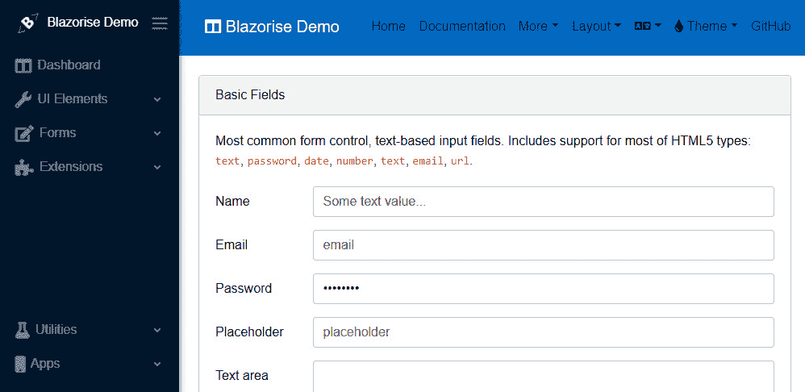
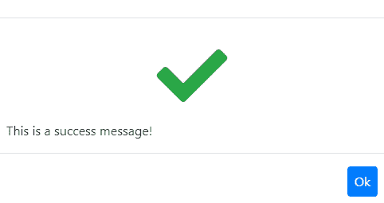
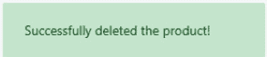
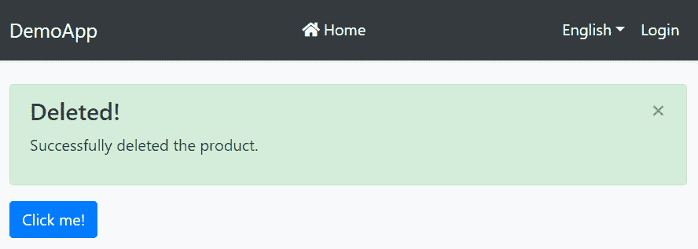

# *第十三章*：使用 Blazor WebAssembly UI

Blazor 是一个相对较新的使用 C#而不是 JavaScript 构建交互式网页应用的**单页应用程序（SPA**）框架。Blazor 是 ABP 框架提供的内置 UI 选项之一。

在本章中，我将简要讨论 Blazor 是什么以及使用这个新框架的主要优缺点。然后，我将继续解释如何使用 Blazor UI 选项创建新的 ABP 解决方案。到本章结束时，你将了解 ABP Blazor 集成的架构和设计，并了解你将在应用程序中使用的基本 ABP 服务。

本章包括以下主题：

+   什么是 Blazor？

+   开始使用 ABP Blazor UI

+   验证用户身份

+   理解主题系统

+   使用菜单

+   使用基本服务

+   使用 UI 服务

+   消费 HTTP API

+   使用全局脚本和样式

# 技术要求

如果你想跟随本章中的示例，你需要一个支持 ASP.NET Core 开发的 IDE/编辑器。在某些地方，我们将使用 ABP CLI，因此你需要安装 ABP CLI，具体请参考*第二章*，“ABP 框架入门”。

您可以从以下 GitHub 仓库下载示例应用程序：[`github.com/PacktPublishing/Mastering-ABP-Framework`](https://github.com/PacktPublishing/Mastering-ABP-Framework)。它包含本章中给出的一些示例。

# 什么是 Blazor？

如我在引言中指出的，Blazor 是一个用于构建交互式网页应用的 SPA 框架，就像其他 SPA 框架（如 Angular、React 和 Vue.js）一样。然而，它有一个重要的区别——我们可以使用 C#来构建应用而不是 JavaScript，这意味着我们可以在浏览器中运行.NET。Blazor 使用.NET 核心运行时在浏览器中执行.NET 代码（对于 Blazor WebAssembly）。

在浏览器中运行.NET 并不是一个新想法。微软之前已经通过 Silverlight 做到了这一点。要运行 Silverlight 应用程序，我们不得不在浏览器上安装一个插件。另一方面，Blazor 通过**WebAssembly**技术原生地在浏览器上运行，该技术定义如下[`webassembly.org`](https://webassembly.org)：

"WebAssembly（简称 Wasm）是一种基于栈的虚拟机的二进制指令格式。Wasm 被设计为编程语言的便携式编译目标，使得客户端和服务器应用程序能够在网络上部署。"

一种高级语言，如 C#，可以被编译成 WebAssembly 并在浏览器中本地运行。WebAssembly 被所有主流的网页浏览器支持，因此我们不需要安装任何自定义插件。如果你想知道 Blazor 是否是新的 Silverlight，我可以简单地说，不是的。

作为.NET 开发者，Blazor 为我们带来了难以置信的机会：

+   我们可以利用语言和运行时的全部功能，使用我们现有的 C#技能来开发应用程序。

+   我们可以使用现有的.NET 库，例如我们最喜欢的 NuGet 包。

+   我们可以在服务器和客户端之间共享代码（例如 DTO 类、应用程序服务合约、本地化和验证代码）。

+   我们可以使用熟悉的 Razor 语法来构建 UI 页面和组件。

除了使用 C#，Blazor 还提供了 JavaScript 互操作性，可以从 C#调用 JavaScript 代码，反之亦然。这意味着我们可以在需要时使用现有的 JavaScript 库并编写我们的 JavaScript 代码。

在服务器和客户端应用程序之间编写 C#和共享代码对于.NET 开发者来说是一个巨大的优势。ABP 也利用了这一点，尽可能地在 MVC/Razor Pages UI 和 Blazor UI 之间共享基础设施。您会发现许多服务与 MVC/Razor Pages UI 非常相似。

作为.NET 开发者和软件公司经理，我对 Blazor 印象深刻，并将将其用于未来的项目。然而，这并不意味着它没有缺点：

+   打包大小、初始加载时间和运行时性能比其 JavaScript 竞争对手，如 Angular 和 React，更差。然而，微软正在投资 Blazor 并努力提高其性能。例如，.NET 6.0 引入了**即时编译**（**AOT**）。

+   由于 Blazor 还处于早期阶段，UI 组件和生态系统尚未成熟。

+   调试目前还不是那么直接。

如果这些缺点对您的项目可以容忍，您今天就可以开始使用 Blazor。

有趣的是，Blazor 有两种运行时模型。到目前为止，我主要谈论的是**Blazor WebAssembly**。第二种模型称为**Blazor Server**。虽然组件开发模型是相同的，但托管逻辑和运行时模型完全不同。

使用 Blazor WebAssembly，.NET 代码在浏览器上的 Mono 运行时中运行，我们不必在服务器端运行.NET。一小段初始化 JavaScript 代码下载标准的.NET **动态链接库**（**DLL**）并在浏览器中运行。这种模式类似于，并且是 Angular 和 React 的直接竞争对手，因为它在浏览器中完全运行客户端逻辑。

另一方面，Blazor Server 在服务器上完全运行.NET 代码。它建立了客户端和服务器之间的实时 SignalR 连接。浏览器运行 JavaScript 并通过该 SignalR 连接与服务器通信。它向服务器发送事件，服务器执行必要的.NET 代码并将**文档对象模型**（**DOM**）更改发送到浏览器。最后，浏览器将 DOM 更改应用到 UI 上。

与 Blazor WebAssembly 相比，Blazor Server 模型具有更快的初始加载时间。然而，它需要与服务器通信以处理所有事件和 DOM 更改，因此我们需要服务器和客户端之间有一个良好且稳定的连接。

我在这本书中的目的不是提供 Blazor 的完整介绍、概述和使用案例，而是提供一个足够简短的介绍，以便理解它是什么。此外，本章将重点介绍 Blazor WebAssembly，但大多数主题都适用于 Blazor Server。

现在，我们可以开始 ABP 的 Blazor 集成。

# 开始使用 ABP Blazor UI

使用 ABP 的启动解决方案模板启动新项目有两种方式。您可以从[`abp.io/get-started`](https://abp.io/get-started)下载它，或者使用 ABP CLI 创建它。本书中我将使用 CLI 方法。如果您尚未安装它，请打开命令行终端并执行以下命令：

```cs
dotnet tool install -g Volo.Abp.Cli
```

现在，我们可以使用`abp new`命令创建一个新的解决方案：

```cs
abp new DemoApp -u blazor
```

`DemoApp`是本例中的解决方案名称。我已通过传递`-u blazor`参数来指定 Blazor WebAssembly。如果您想使用 Blazor Server，可以将参数指定为`-u blazor-server`。

我尚未指定数据库提供程序，因此默认使用 Entity Framework Core（如果想要使用 MongoDB，请指定`-d mongodb`参数）。在创建解决方案后，我们需要创建初始数据库迁移。作为第一步，我们应该在`src/DemoApp.DbMigrator`目录中执行以下命令：

```cs
dotnet run
```

此命令创建初始的代码优先迁移并将其应用于数据库。

该解决方案包含两个应用程序：

+   第一个是一个服务器（后端）应用程序，它托管 HTTP API 并提供身份验证 UI。

+   第二个应用程序是包含应用程序 UI 并与服务器通信的前端 Blazor WebAssembly 应用程序。

因此，我们首先运行此示例的`DemoApp.HttpApi.Host`服务器应用程序。然后，我们可以运行`DemoApp.Blazor` Blazor 应用程序来运行 UI。您可以使用`admin`作为用户名和`1q2w3E*`作为密码登录到应用程序。

我不会深入探讨应用程序的细节，因为我们已经在*第二章*中做了介绍，即*使用 ABP 框架入门*。下一节将解释用户是如何进行身份验证的。

# 用户身份验证

**OpenID Connect**（**OIDC**）是 Microsoft 建议用于身份验证 Blazor WebAssembly 应用程序的方法。ABP 遵循这一建议，并在启动解决方案中预先配置了它。

Blazor 应用程序不包含登录、注册或其他与身份验证相关的 UI 页面。它使用启用了**证明密钥用于代码交换**（**PKCE**）的**授权代码**流将用户重定向到服务器应用程序。服务器处理所有身份验证逻辑并将用户重定向回 Blazor 应用程序。

身份验证配置存储在 Blazor 应用程序的`wwwroot/appsettings.json`文件中。请参阅以下示例配置：

```cs
  "AuthServer": {
    "Authority": "https://localhost:44306",
    "ClientId": "DemoApp_Blazor",
    "ResponseType": "code"
  }
```

在这里，`Authority`是后端服务器应用程序的根 URL。`ClientId`是服务器所知的 Blazor 应用程序的名称。最后，`ResponseType`指定了授权代码流。

此配置在模块类中使用，例如本例中的`DemoAppBlazorModule`类，如下面的代码块所示：

```cs
private static void ConfigureAuthentication(
    WebAssemblyHostBuilder builder)
{
    builder.Services.AddOidcAuthentication(options =>
    {
        builder.Configuration.Bind(
            "AuthServer", options.ProviderOptions);
        options.UserOptions.RoleClaim = JwtClaimTypes.Role;
        options.ProviderOptions.DefaultScopes.Add(
            "DemoApp");
        options.ProviderOptions.DefaultScopes.Add("role");
        options.ProviderOptions.DefaultScopes.Add("email");
        options.ProviderOptions.DefaultScopes.Add("phone");
    });
}
```

`AuthServer`是匹配配置密钥的关键。如果您想自定义身份验证选项，这些就是您需要从这些点开始的地方。例如，您可以修改请求的作用域或更改 OIDC 配置。有关 Blazor WebAssembly 身份验证的更多信息，请参阅 Microsoft 的文档：[`docs.microsoft.com/en-us/aspnet/core/blazor/security/webassembly/`](https://docs.microsoft.com/en-us/aspnet/core/blazor/security/webassembly/)。

在下一节中，我将介绍 Blazor UI 的主题系统。

# 理解主题系统

ABP 为 Blazor UI 提供了一套主题系统，正如我们在介绍 MVC/Razor Pages UI 时所述*第十二章*，*使用 MVC/Razor Pages*。主题系统带来了灵活性，因此我们可以开发我们的应用程序和模块，而无需依赖于特定的 UI 主题/样式。

所有 ABP Blazor UI 主题都使用一组基础库。基本基础库是 Bootstrap，其组件旨在与 JavaScript 一起使用。幸运的是，一些组件库封装了 Bootstrap 组件，并提供了一个更简单的.NET API，这更适合在 Blazor 应用程序中使用。

这些组件库之一是**Blazorise**。实际上，它是一个抽象库，可以与多个提供者（如 Bootstrap、Bulma 和 Ant Design）一起工作。ABP 启动模板使用 Blazorise 库的 Bootstrap 提供者。

您可以在其网站上了解更多关于 Blazorise 的信息，并查看组件的实际应用：[`blazorise.com`](https://blazorise.com)。以下图是表单组件演示的截图：



图 13.1 – Blazorise 演示：表单组件

除了 Blazorise 库之外，ABP Blazor UI 还使用**Font Awesome**作为 CSS 字体图标库。因此，任何模块或应用程序都可以在其页面上使用这些库，而无需显式依赖。

UI 主题负责渲染布局，包括页眉、菜单、工具栏、页面警报和页脚。

在下一节中，我们将看到如何向主菜单添加新项目。

# 使用菜单

ABP Blazor UI 中的菜单管理与 ABP MVC/Razor Pages UI 中的菜单管理非常相似，这在*第十二章*中有所介绍，即*使用 MVC/Razor Pages*。

我们使用`AbpNavigationOptions`向菜单系统添加贡献者。ABP 执行所有贡献者以动态构建菜单。启动解决方案包括一个菜单贡献者，并按照以下示例添加到`AbpNavigationOptions`中：

```cs
Configure<AbpNavigationOptions>(options =>
{
    options.MenuContributors.Add(new
        DemoAppMenuContributor(
        context.Services.GetConfiguration()));
});
```

`DemoAppMenuContributor`是一个实现`IMenuContributor`接口的类。`IMenuContributor`接口定义了`ConfigureMenuAsync`方法，我们应该按照以下示例实现：

```cs
public class DemoAppMenuContributor : IMenuContributor
{
    public async Task ConfigureMenuAsync(
        MenuConfigurationContext context)
    {
        if (context.Menu.Name == StandardMenus.Main)
        {
            //TODO: Configure the main menu
        }
    }
}
```

在`StandardMenus`类（在`Volo.Abp.UI.Navigation`命名空间中）中定义了两个标准菜单名称作为常量：

+   `Main`：应用程序的主菜单。

+   `User`：用户上下文菜单。当您在页眉上点击您的用户名时，它会打开。

因此，前面的示例检查菜单名称，并且只向主菜单添加项目。以下代码块向主菜单添加一个新菜单项：

```cs
var l = context.GetLocalizer<DemoAppResource>();
context.Menu.AddItem(
    new ApplicationMenuItem(
        DemoAppMenus.Home,
        l["Menu:Home"],
        "/home",
        icon: "fas fa-home"
    )
);
```

您可以使用`context.ServiceProvider`对象从依赖注入中解析服务。`context.GetLocalizer`方法是一个用于解析`IStringLocalizer<T>`实例的快捷方式。同样，我们可以使用`context.IsGrantedAsync`快捷方法来检查当前用户的权限，如以下代码块所示：

```cs
if (await context.IsGrantedAsync("MyPermissionName"))
{
    context.Menu.AddItem(...);
}
```

菜单项可以嵌套。以下示例在`Crm`菜单项下添加了一个`Orders`菜单项：

```cs
context.Menu.AddItem(
    new ApplicationMenuItem(
        DemoAppMenus.Crm,
        l["Menu:Identity"]
    ).AddItem(new ApplicationMenuItem(
        DemoAppMenus.Orders,
        l["Menu:Orders"],
        url: "/crm/orders")
    )
);
```

我在第一个`ApplicationMenuItem`对象上调用`AddItem`以添加子项。您可以为`Orders`菜单项做同样的事情以构建更深的菜单。

我们在创建菜单项时使用了本地化和授权服务。在下一节中，我们将看到如何在 Blazor 应用程序的其他部分中使用这些服务。

# 使用基本服务

在本节中，我将向您展示如何在 Blazor 应用程序中使用一些基本服务。正如您将看到的，它们几乎与我们在早期章节中介绍的服务器端服务相同。让我们从授权服务开始。

## 授权用户

我们通常在 Blazor 应用程序中使用授权来隐藏/禁用一些页面、组件和功能。虽然服务器始终检查相同的授权规则以确保安全，但客户端授权检查提供了更好的用户体验。

`IAuthorizationService`用于以编程方式检查权限/策略，就像在服务器端一样。您可以根据以下示例注入和使用其方法：

```cs
public partial class Index
{
    protected override async Task OnInitializedAsync()
    {
        if (await AuthorizationService
                 .IsGrantedAsync("MyPermission"))
        {
            // TODO: ...
        }
    }
}
```

`AuthorizationService`有不同的工作方式。请参阅*第七章*中关于*与授权和权限系统一起工作*的部分，以了解更多关于授权系统的信息。

在前面的示例中，该组件是从`AbpComponentBase`类继承的。由于`AbpComponentBase`类为我们预先注入了它，我们可以直接使用`AuthorizationService`属性而无需手动注入。`AuthorizationService`属性类型是`IAuthorizationService`。

如果你没有从`AbpComponentBase`类继承，你可以使用`[Inject]`属性来注入它：

```cs
[Inject]
private IAuthorizationService AuthorizationService { get;
                                                     set; }
```

当你需要时，你可以在 Razor 组件的视图侧使用相同的`IAuthorizationService`。然而，有一些替代方法可以使你的应用程序代码更简洁。例如，你可以在组件上使用`[Authorize]`属性，使其仅对认证用户可用：

```cs
@page "/"
@attribute [Authorize]
<p>This page is visible only if you've logged in</p>.
```

`[Authorize]`属性与服务器端类似。你可以在以下示例中传递策略/权限名称来检查特定权限：

```cs
@page "/order-management"
@attribute [Authorize("CanManageOrders")]
<p>You can only see this if you have the necessary
    permission.</p>
```

如果用户具有特定的权限，通常会显示 UI 的一部分。以下示例使用`AuthorizeView`元素，如果当前用户有权限编辑订单，则显示消息：

```cs
<AuthorizeView Policy="CanEditOrders">
    <p>You can only see this if you can edit the 
        orders.</p>
</AuthorizeView>
```

这样，你可以有条件地渲染操作按钮或其他 UI 部分。

ABP 与 Blazor 的授权系统 100%兼容，因此你可以参考 Microsoft 的文档来查看更多示例和详细信息：[`docs.microsoft.com/en-us/aspnet/core/blazor/security`](https://docs.microsoft.com/en-us/aspnet/core/blazor/security)。

在下一节中，我们将学习如何使用本地化系统，这是另一个常见的 UI 服务。

## 本地化用户界面

Blazor 应用程序使用相同的 API 进行文本本地化。我们可以注入并使用`IStringLocalizer<T>`服务来获取当前语言的本地化文本。

以下 Razor 组件使用了`IStringLocalizer<T>`服务：

```cs
@using DemoApp.Localization
@using Microsoft.Extensions.Localization
@inject IStringLocalizer<DemoAppResource> L
<h3>@L["HelloWorld"]</h3>
```

我们使用标准的`@inject`指令，并在泛型`IStringLocalizer<T>`接口中指定本地化资源类型。相同的接口也可以注入并用于应用程序中的任何服务。请参阅*第八章*的*本地化用户界面*部分，*使用 ABP 的功能和服务*，了解如何与本地化系统一起工作。

接下来，我们将在下一节学习如何获取当前用户的信息。

## 访问当前用户

你有时可能需要在应用程序中知道当前用户的用户名、电子邮件地址和其他详细信息。我们使用`ICurrentUser`服务来访问当前用户，就像在服务器端一样。以下示例组件通过当前用户的名称渲染欢迎信息：

```cs
@using Volo.Abp.Users
@inject ICurrentUser CurrentUser
<h3>Welcome @CurrentUser.Name</h3>
```

除了`Name`、`Surname`、`UserName`和`Email`等标准属性外，你还可以使用`ICurrentUser.FindClaimValue(...)`方法来获取服务器颁发的自定义声明。

我已经介绍了所有应用程序通常使用的 ABP Blazor 基本服务。我使它们保持简短，因为 API 几乎与服务器端相同，而且我们已经在之前的章节中详细介绍了它们。在下一节中，我将继续介绍用于通知用户的 UI 服务。

# 使用 UI 服务

在每个应用程序中，向用户显示消息、通知和警报以通知或警告他们是很常见的。在接下来的部分中，我将介绍 ABP 为这些服务内置的 API。

## 显示消息框

消息框用于向用户显示阻塞消息或确认对话框。用户点击**确定**按钮来禁用消息，或者点击**是**或**取消**按钮来对配置对话框做出决定。

有五种类型的消息 – `信息`、`成功`、`警告`、`错误`和`确认`。以下示例显示了发送给用户的`成功`消息：

```cs
@page "/"
@inherits DemoAppComponentBase
<Button Color="Color.Primary"
        Clicked="ShowSuccess">Click me!</Button>
@code
{
    private async Task ShowSuccess()
    {
        await Message.Success("This is a success
                               message!");
    }
}
```

在此示例中，`Message`属性来自`AbpComponentBase`类（`DemoAppComponentBase`继承自它），其类型为`IUiMessageService`。或者，您可以为您的组件、页面或服务手动注入`IUiMessageService`。所有`IUiMessageService`方法都可以接受额外的`title`参数和`options`操作来自定义对话框。

以下图显示了前面示例的结果：



图 13.2 – 一个没有标题的简单成功消息

以下示例显示了发送给用户的确认对话框，如果用户点击**是**按钮，则采取行动：

```cs
@page "/"
@inherits DemoAppComponentBase
<Button Color="Color.Primary" 
        Clicked="ShowQuestion">Click me!</Button>
@code
{
    private async Task ShowQuestion()
    {
        var result = await Message.Confirm(
            "Are you sure to delete the product?");
        if (result == true)
        {
            //TODO: ...
        }
    }
}
```

`Confirm`方法返回一个`bool`值，因此您可以看到用户是否接受了对话框消息。以下图显示了此示例的结果：


图 13.3 – 确认对话框

下一个部分将解释如何向用户显示非阻塞的信息消息。

## 显示通知

消息框将用户的注意力集中在消息上。他们应该点击**确定**按钮返回到应用程序 UI。另一方面，通知是非阻塞的信息消息。它们显示在屏幕的右下角，并在几秒钟后自动消失。

有四种类型的通知 – `信息`、`成功`、`警告`和`错误`。以下示例显示了一个确认对话框，如果用户接受确认消息，则显示`成功`通知：

```cs
@page "/"
@inherits DemoAppComponentBase
<Button Color="Color.Primary" 
        Clicked="ShowQuestion">Click me!</Button>
@code
{
    private async Task ShowQuestion()
    {
        var confirmed = await Message.Confirm(
            "Are you sure to delete the product?");
        if (confirmed)
        {
            //TODO: Delete the product
            await Notify.Success("Successfully deleted the
                                  product!");
        }
    }
}
```

`Notify`属性来自`AbpComponentBase`基类。您可以将`IUiNotificationService`接口注入并用于任何地方来在 UI 上显示通知。所有通知方法都可以接受额外的`title`参数和`options`操作来自定义对话框。以下图显示了在前面代码块中使用的`Notify.Success`方法的结果：



图 13.4 – 一个示例通知消息

下一个部分介绍了警报，这是向用户显示消息的另一种方式。

## 显示警报

使用警报是一种粘性的方式来向用户显示非阻塞消息。用户可以选择忽略警报。

有四种类型的提示信息 – `Info`、`Success`、`Warning`和`Danger`。以下示例展示了发送给用户的`Success`提示信息：

```cs
@page "/"
@inherits DemoAppComponentBase
<Button Color="Color.Primary" 
        Clicked="DeleteProduct">Click me!</Button>
@code
{
    private async Task DeleteProduct()
    {
        //TODO: Delete the product
        Alerts.Success(
            text: "Successfully deleted the product.", 
            title: "Deleted!", 
            dismissible: true);
    }
}
```

在这个例子中，我使用了来自基类的`Alerts`属性。你总是可以注入`IAlertManager`服务并像`IAlertManager.Alerts.Success(…)`一样使用它。

所有的提示方法都接受`text`（必需）、`title`（可选）和`dismissible`（可选，默认为`true`）参数。如果一个提示信息是可关闭的，那么用户可以通过点击**X**按钮使其消失。以下图显示了前面例子中创建的提示信息：



图 13.5 – 成功提示消息

提示信息是通过主题在页面内容上方渲染的。除了标准的`Info`、`Success`、`Warning`和`Danger`方法外，你可以通过指定`AlertType`来使用所有 Bootstrap 样式，如`Primary`、`Secondary`或`Dark`。

你现在已经学会了三种向用户展示信息消息的方法。在下一节中，我们将探讨 Blazor 应用程序如何消费服务器的 HTTP API。

# 消费 HTTP API

你可以使用标准的`HttpClient`手动设置和执行对服务器的 HTTP 请求。然而，ABP 提供了 C#客户端代理，可以轻松调用 HTTP API 端点。你可以直接从 Blazor UI 消费你的应用服务，并让 ABP 框架为你处理 HTTP API 调用。

假设我们有一个应用服务接口，如下例所示：

```cs
public interface ITestAppService : IApplicationService
{
    Task<int> GetDataAsync();
}
```

应用服务接口定义在`Application.Contracts`项目中（对于我创建的示例解决方案，是`DemoApp.Application.Contracts`项目）。Blazor 应用程序引用了这个项目。这样，我们就可以在客户端使用`ITestAppService`接口。

应用服务在`Application`项目中实现（对于我创建的示例解决方案，是`DemoApp.Application`项目）。我们可以简单地实现`ITestAppService`接口，如下面的代码块所示：

```cs
public class TestAppService : ApplicationService,
    ITestAppService
{
    public async Task<int> GetDataAsync()
    {
        return 42;
    }
}
```

现在，我们可以直接将`ITestAppService`注入到任何页面/组件中，就像注入任何其他本地服务一样，并调用其方法，就像标准的函数调用一样：

```cs
public partial class Index
{
    [Inject]
    private ITestAppService TestAppService { get; set; }
    private int Value { get; set; }

    protected override async Task OnInitializedAsync()
    {
        Value = await TestAppService.GetDataAsync();
    }
}
```

在这个例子中，我在`TestAppService`属性上方使用了标准的`[Inject]`属性来告诉 Blazor 为我注入它。然后，我在`OnInitializedAsync`方法中重写了它来调用`GetDataAsync`方法。正如我们所知，`OnInitializedAsync`方法是在组件/页面最初渲染并准备好工作后立即被调用的。

简单到这种程度。当我们调用 `GetDataAsync` 方法时，ABP 实际上通过处理所有复杂性（包括身份验证、错误处理和 JSON 序列化）向服务器发出 HTTP API 调用。它从 Blazor 项目的 `wwwroot/appsettings.json` 文件中的 `RemoteServices` 配置中读取服务器的根 URL。以下是一个示例配置代码块：

```cs
"RemoteServices": {
  "Default": {
    "BaseUrl": "https://localhost:44306"
  }
}
```

在本节中，我使用了 ABP 的动态 C# 客户端代理方法来从 Blazor 应用程序中消费 HTTP API。我们将在*第十四章* *构建 HTTP API 和实时服务*中回到这个话题，同时介绍静态 C# 客户端代理。

下一节将探讨我们如何将脚本和样式文件添加到我们的 Blazor 应用程序中。

# 处理全局脚本和样式

导入 Blazor Server UI 的脚本和样式文件与 ABP 框架的 MVC/Razor Pages UI 相同。您可以参考*第十二章* *使用 MVC/Razor Pages*来了解如何使用它。本节基于 Blazor WebAssembly。

Blazor WebAssembly 是一个单页应用程序，默认情况下只有一个入口点。`index.html` 文件位于 `wwwroot` 文件夹中，如下所示：


图 13.6 – wwwroot 文件夹中的 index.html 文件

`index.html` 是一个纯 HTML 文件。服务器在未经任何处理的情况下将其发送到浏览器。请记住，一个简单的静态文件服务器可以提供 Blazor WebAssembly 应用程序。浏览器首先加载 `index.html` 文档，然后加载此文档导入的样式和脚本。

如果您打开 `index.html` 文档，您将看到 `ABP:Styles` 注释内的一部分，如下所示：

```cs
<!--ABP:Styles-->
<link href="global.css?_v=637649661149948696"
    rel="stylesheet"/>
<link href="main.css" rel="stylesheet"/>
<!--/ABP:Styles-->
```

这段代码（包括注释）是由 ABP CLI 在您在 Blazor 项目的根目录中执行以下命令时自动创建（并更新）的：

```cs
abp bundle
```

当您执行此命令时，它创建（或重新生成）全局样式包。这个包包含所有必要的样式，包括 .NET 运行时、Blazor 和其他使用的库，以压缩格式。每次您将新的与 Blazor 相关的 ABP NuGet 包/模块添加到您的应用程序中时，您都需要重新运行 `abp bundle` 命令，并包含必要的依赖项重新生成包。

ABP 的 `bundle` 命令做得很好。当安装一个模块时，您不需要知道它的全局脚本文件或额外依赖项。只需运行此命令，您就有了一个更新后的、生产就绪的全局包文件。每个模块都会将其自己的依赖项贡献到该包中，然后 ABP 通过尊重模块依赖顺序来生成包。要操作包，您应该定义一个实现 `IBundleContributor` 接口的类。启动解决方案模板中的 Blazor 项目已经包含了一个包贡献者，如下面的代码块所示：

```cs
public class DemoAppBundleContributor : IBundleContributor
{
    public void AddScripts(BundleContext context)
    {
    }
    public void AddStyles(BundleContext context)
    {
        context.Add("main.css", excludeFromBundle: true);
    }
}
```

`AddScripts` 和 `AddStyles` 方法用于向全局包添加 JavaScript 和 CSS 文件。您还可以使用 `context.BundleDefinitions` 集合删除或更改现有文件（由您的应用程序依赖的包添加），但这很少需要。在这里，`excludeFromBundle` 参数将 `main.css` 文件单独添加到全局包之外。您可以移除该参数以将其包含在 `global.css` 包文件中。

类似于样式包，`index.html` 文件包含一个 `ABP:Scripts` 部分，如下面的代码块所示：

```cs
<!--ABP:Scripts-->
<script src="img/global.js?_v=637680281013693676"></script>
<!--/ABP:Scripts-->
```

再次强调，这段代码部分是由 ABP CLI 使用 `abp bundle` 命令创建（并更新）的。如果您想包含文件，可以在您的包贡献者类的 `AddScripts` 方法中完成。文件的路径被认为是相对于 `wwwroot` 文件夹的相对路径。

# 摘要

本章简要介绍了 ABP 框架的 Blazor UI，以了解其架构以及您将在应用程序中频繁使用的服务。

认证是应用程序中最具挑战性的方面之一，ABP 提供了一个行业标准解决方案，您可以直接在您的应用程序中使用。

我们已经学习了获取当前用户身份信息的服务、检查用户的权限以及本地化用户界面的服务。我们还探索了向用户显示消息框、通知和警报的服务。

ABP 的动态 C# 客户端代理系统使得消费服务器端 HTTP API 变得非常容易。最后，您已经学习了如何使用全局打包系统来处理 Blazor 应用程序中的打包和压缩。

我故意在本章中没有涵盖两个主题。第一个是 Blazor 本身。在本书的单章中涵盖这个非常详细的主题是不够的。如果您是 Blazor 框架的新手，我建议您阅读微软的文档（[`docs.microsoft.com/en-us/aspnet/core/blazor`](https://docs.microsoft.com/en-us/aspnet/core/blazor)）或购买一本专门的书籍。您可以查看由 Packt Publishing 出版的由 Jimmy Engström 编写的《Web Development with Blazor》一书。

本章中我尚未涉及的第二主题是复杂的用户界面组件，例如数据表、模态框和标签页。这些组件非常特定于你使用的 UI 工具包。ABP 自带 Blazorise 库，你可以参考其文档来学习其组件：[`blazorise.com/docs`](https://blazorise.com/docs)。我还建议你通过 ABP 框架的 Blazor UI 教程来了解使用最常用组件（数据表和模态框）的基本开发模型：[`docs.abp.io/en/abp/latest/Getting-Started`](https://docs.abp.io/en/abp/latest/Getting-Started)。

在下一章中，我们将专注于构建 HTTP API 并在客户端应用程序中消费它们。我们还将探讨使用 SignalR 库来实现客户端和服务器之间的实时通信。
