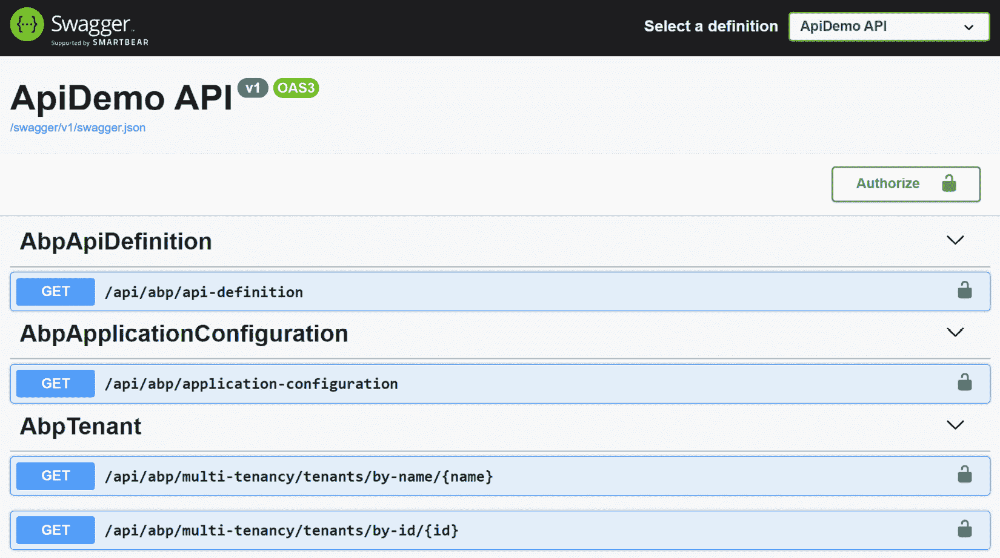
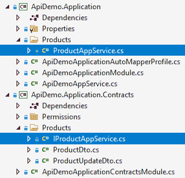

# *第十四章*: 构建 HTTP API 和实时服务

暴露 HTTP API 端点是允许客户端应用程序消费你的应用程序功能的一种相当常见的方式。构建 HTTP API 使你的应用程序对任何客户端都开放，因为几乎所有连接到网络的设备都已经实现了 HTTP 协议。

在本章中，你将了解为你的解决方案创建 HTTP API 的选项。你还将看到 ABP 如何通过使用 ABP 的动态和生成的客户端代理，使客户端应用程序轻松消费你的 HTTP API。最后，我们将解释如何在 ABP 应用程序中使用 Microsoft 的**SignalR**库来实现实时服务器-客户端通信。以下是本章涵盖的主题列表：

+   构建 HTTP API

+   消费 HTTP API

+   在 ABP 框架中使用 SignalR

# 技术要求

如果你想跟随本章中的示例，你需要有一个支持 ASP.NET Core 开发的 IDE/编辑器。在某些地方，我们将使用 ABP CLI，因此你需要安装 ABP CLI，如*第二章*中所述，*ABP 框架入门*。

你可以从以下 GitHub 仓库下载示例应用程序：[`github.com/PacktPublishing/Mastering-ABP-Framework`](https://github.com/PacktPublishing/Mastering-ABP-Framework)。它包含本章中给出的一些示例。

# 构建 HTTP API

在本节中，我们将从 ASP.NET Core 创建 HTTP API 的标准方法开始。然后我们将看到 ABP 如何自动将标准应用程序服务转换为 HTTP API 端点。但首先，让我们看看如何使用 ABP 框架创建仅 API 的解决方案。

## 创建 HTTP API 项目

当你使用 ABP 框架的启动解决方案模板创建一个新的应用程序或模块时，它已经包含了应用程序提供的所有功能的 HTTP API。然而，如果你想要的话，也可以创建一个没有应用程序 UI 的 HTTP API 端点。

当你使用 ABP 框架创建新的解决方案时，可以使用`-u none`参数，如下例所示：

```cs
abp new ApiDemo -u none
```

`ApiDemo`是我们这里的解决方案名称。这样，我们就有一个带有 HTTP API 端点但没有 UI 的解决方案。以下图显示了在 Visual Studio 中打开的解决方案：


图 14.1 – 由 ABP CLI 创建的 HTTP API 解决方案

我们应该首先运行`ApiDemo.DbMigrator`应用程序来创建数据库，这样 HTTP API 才能正常工作。为此，右键单击`ApiDemo.DbMigrator`项目，点击`ApiDemo.DbMigrator`项目并执行`dotnet run`命令。

现在，你可以运行`ApiDemo.HttpApi.Host`项目来启动 HTTP API 应用程序。默认情况下，HTTP API 应用程序显示 Swagger UI，如下图所示：



图 14.2 – Swagger UI

Swagger UI 是一个非常有用的工具，可以探索和测试我们的 HTTP API 端点。我们可以使用 `admin`，默认密码是 `1q2w3E*`），因此我们也可以测试需要授权的 API。

例如，我们可以使用 `/api/identity/roles` 端点来获取系统中定义的角色列表。此端点需要授权，因此首先使用 **Role** 组下的 `/api/identity/roles` 端点登录，点击展开它，点击 **Try it out** 按钮，然后点击 **Execute** 按钮来调用端点。当您调用它时，服务器返回如下示例所示的 JSON 值：

```cs
{
  "totalCount": 1,
  "items": [
    {
      "name": "admin",
      "isDefault": false,
      "isStatic": true,
      "isPublic": true,
      "concurrencyStamp": 
          "1f23ae3a-85d8-4656-b094-00e605e28e4e",
      "id": "92692d73-4acb-ca9f-4838-39ff4cdf25e4",
      "extraProperties": {}
    }
  ]
}
```

因此，我们已经学习了如何使用 ABP 框架创建和启动 HTTP API 解决方案。现在，让我们看看如何使用 ASP.NET Core 的标准控制器添加新的 API。

## 创建 ASP.NET Core 控制器

ASP.NET Core 的控制器提供了一个方便的基础设施来创建 HTTP API。以下示例公开了获取产品列表和更新产品的 HTTP 端点：

```cs
[ApiController]
[Route("products")]
public class ProductController : ControllerBase
{
    [HttpGet]
    public async Task<ProductDto> GetListAsync()
    {
        // TODO: implement
    }
    [HttpPut]
    [Route("{id}")]
    public async Task UpdateAsync(Guid id, ProductUpdateDto
                                  input)
    {
        // TODO: implement
    }
}
```

`ProductController` 类继承自 `ControllerBase` 类。建议将您的 API 控制器类从 `ControllerBase` 类继承，而不是从 `Controller` 类继承，因为 `Controller` 类包含一些对于 API 控制器不必要的视图相关功能。或者，您也可以从 `AbpControllerBase` 类继承您的 API 控制器类，它为您提供了作为预注入属性的某些常见 ABP 服务。

在控制器类顶部添加 `[ApiController]` 属性启用了 ASP.NET Core 的默认 API 特定行为（例如自动 HTTP 400 响应和属性路由要求），因此也建议这样做。

在此示例中，`[Route]` 属性定义了 API 的 URL，而 `HttpGet` 和 `HttpPut` 属性确定了与 API 端点关联的 HTTP 方法。

ABP 与 ASP.NET Core 的标准结构 100% 兼容，因此您可以参考 Microsoft 的文档来学习创建 API 控制器的所有细节：[`docs.microsoft.com/en-us/aspnet/core/web-api`](https://docs.microsoft.com/en-us/aspnet/core/web-api)。

当您在解决方案中实现分层时，您通常会发现自己正在创建控制器类，这些类封装了您的应用程序服务。例如，假设您有 `IProductAppService`，它已经实现了与产品相关的用例，并且您希望将其方法公开为 HTTP API 端点。以下示例定义了一个控制器，它将所有请求重定向到底层应用程序服务：

```cs
[ApiController]
[Route("products")]
public class ProductController : ControllerBase
{
    private readonly IProductAppService _productAppService;
    public ProductController(
        IProductAppService productAppService)
    {
        _productAppService = productAppService;
    }
    [HttpGet]
    public async Task<ProductDto> GetListAsync()
    {
        return await _productAppService.GetListAsync();
    }
    [HttpPut]
    [Route("{id}")]
    public async Task UpdateAsync(Guid id, 
                                  ProductUpdateDto input)
    {
        await _productAppService.UpdateAsync(id, input);
    }
}
```

如果我们没有使用 ABP 框架，我们需要编写这样的控制器来定义端点的路由、HTTP 方法和其他 HTTP 相关的细节。然而，ABP 框架可以自动将您的应用程序服务公开为 HTTP API 端点，如下一节所述。

## 理解自动 API 控制器

ABP 的 Auto API Controller 系统通过约定将你的应用程序服务转换为 API 控制器。要启用 Auto API 控制器，我们应该按照以下代码块所示配置`AbpAspNetCoreMvcOptions`：

```cs
Configure<AbpAspNetCoreMvcOptions>(options =>
{
    options.ConventionalControllers.Create(
        typeof(ApiDemoApplicationModule).Assembly);
});
```

该配置代码位于解决方案的 UI 或 HTTP API 层（`options.ConventionalControllers.Create`方法的`ApiDemoHttpApiHostModule`类中，它接受一个`Assembly`对象，在该`Assembly`中查找所有应用程序服务类，并使用预定义的约定将它们公开为控制器。当你从启动模板创建一个新的 ABP 解决方案时，你的解决方案中已经包含了该配置，因此你不需要自己进行配置。

假设我们已经定义了一个应用程序服务，如下例所示：

```cs
public class ProductAppService
    : ApiDemoAppService, IProductAppService
{
    public Task<ProductDto> GetListAsync()
    {
        // TODO: implement
    }
    public Task UpdateAsync(Guid id, 
                            ProductUpdateDto input)
    {
        // TODO: implement
    }
}
```

请记住，`ProductAppService`类定义在`ApiDemo.Application`项目中，而`IProductAppService`接口定义在`ApiDemo.Application.Contracts`项目中。我们可以不进行任何额外配置就运行应用程序，以在 Swagger UI 上查看新的 HTTP API 端点：

![图 14.3 – Swagger UI 上的 Auto API Controller

![img/Figure_14.03_B17287.jpg]

图 14.3 – Swagger UI 上的 Auto API Controller

ABP 框架配置了 ASP.NET Core，使`ProductAppService`成为控制器。ABP 框架通过相关 C#方法的名称自动确定 HTTP 方法。例如，以`Get`前缀开头的方法被认为是 HTTP GET 方法。路由也通过约定自动确定。你可以参考 ABP 文档来了解 HTTP 方法和路由确定的所有约定和自定义选项：[`docs.abp.io/en/abp/latest/API/Auto-API-Controllers`](https://docs.abp.io/en/abp/latest/API/Auto-API-Controllers)。

何时手动定义控制器

当你使用 ABP 框架时，通常不需要手动定义 API 控制器。然而，如果你想这样做，你仍然可以以标准方式编写控制器。编写手动控制器的一个优点是，你可以充分利用 HTTP 层的能力来定义和塑造你的 API。

ABP 框架将配置的程序集中的所有应用程序服务转换为 API 控制器。如果你想要为特定的应用程序服务禁用此功能，可以使用带有`false`参数的`[RemoteService]`属性，如下例所示：

```cs
[RemoteService(false)]
public class ProductAppService
     : ApiDemoAppService, IProductAppService
{ /* ... */ }
```

ABP 框架还启用了 ASP.NET Core 的应用程序服务 API 探索器功能。这样，你的 API 端点就变得可发现，并在 Swagger UI 上显示。如果你想公开 HTTP 端点但禁用 API 探索器，可以将`[RemoteService]`属性的`IsMetadataEnabled`参数设置为`false`，例如，`[RemoteService(IsMetadataEnabled = false)]`。

正如我们在本节所学，ABP 可以自动化将你的应用程序服务暴露给远程客户端，同时你仍然可以使用现有的技能在需要时创建标准的 ASP.NET Core 控制器。在下一节中，我们将探讨从客户端应用程序消费 HTTP API 的方法。

# 消费 HTTP API

从你的客户端应用程序消费 HTTP API 通常需要大量的常见和重复的逻辑来应用。你需要在每个发送到服务器的 HTTP 请求中处理授权、对象序列化、异常处理等。ABP 框架可以通过动态和生成的（静态）客户端代理完全自动化这个过程。

我们已经在 *第十二章* 的 *消费 HTTP API* 部分、*与 MVC/Razor Pages 一起工作* 以及在 *第十三章* 的 *消费 HTTP API* 部分中介绍了 ABP 客户端代理系统的实际用法，*与 Blazor WebAssembly UI 一起工作*。因此，这里不再重复，但会将所有内容汇总在一起，并填补缺失的要点。

让我们从动态客户端代理开始。

## 使用 ABP 的动态客户端代理

动态代理系统允许我们通过简单的配置来消费服务器端 HTTP API。*动态* 名称表明代理代码是在运行时动态生成的。

ABP 的动态客户端代理系统支持两种类型的客户端应用程序：.NET 和 JavaScript。

### 使用动态 .NET 客户端代理

ABP 的启动解决方案将应用程序层分为两个项目。以 `Application.Contracts` 结尾的项目包含接口，而 `Application` 包含这些接口的实现。以下图显示了示例解决方案中 `Application.Contracts` 和 `Application` 项目内的 `IProductAppService` 接口和 `ProductAppService` 类：




图 14.4 – 将应用程序层分离成两个项目

将契约与实现分离具有优势：我们可以从 .NET 客户端应用程序重用 `ApiDemo.Application.Contracts` 项目，而无需让客户端应用程序引用应用程序服务的实现。

一个 .NET 客户端应用程序可以引用 `ApiDemo.Application.Contracts` 项目，并配置 ABP 的动态 .NET 客户端代理系统，以便能够消费 HTTP API，就像消费本地服务一样。以下示例显示了这种配置，该配置在客户端应用程序中完成（该配置存在于 `ApiDemo.HttpApi.Client` 项目的 `ApiDemoHttpApiClientModule` 类中）：

```cs
public override void ConfigureServices(
    ServiceConfigurationContext context)
{
    context.Services.AddHttpClientProxies(
        typeof(ApiDemoApplicationContractsModule).Assembly
    );
}
```

`AddHttpClientProxies`方法接受一个`Assembly`，并为该`Assembly`中的所有应用程序服务接口创建动态代理。在这里，我们通过使用其中的模块类来传递`ApiDemo.Application.Contracts`项目的程序集。当你创建一个新的 ABP 解决方案时，你将在`HttpApi.Client`项目中看到这个配置。因此，任何引用了`HttpApi.Client`项目的.NET 客户端应用程序都可以直接消费你的 HTTP API，而无需任何配置。

使用如此简单的单一配置，我们就可以将任何应用程序服务接口注入到`ApiDemo.Application.Contracts`项目中，并像使用本地服务一样使用它。例如，在*第十三章*的*使用 Blazor WebAssembly UI*部分，可以看到在 Blazor WebAssembly 客户端应用程序中的使用示例。

一旦我们配置并使用了动态.NET 客户端代理，ABP 将执行所有繁重的逻辑，并为我们向服务器发起 HTTP 请求。当然，ABP 应该知道服务器的根 URL 来发起请求。我们可以在客户端应用程序的`appsettings.json`文件中定义它，如下面的示例所示（在`ApiDemo.HttpApi.Client.ConsoleTestApp`项目中有一个如何操作的示例）：

```cs
{
  "RemoteServices": {
    "Default": {
      "BaseUrl": "http://localhost:53929/"
    } 
  } 
}
```

如你从本例中可以理解的，我们实际上可以定义多个服务器端点。这样，客户端应用程序就可以从多个服务器消费 API。默认情况下使用的是`Default`配置。你可以在以下示例中添加第二个远程服务配置：

```cs
{
  "RemoteServices": {
    "Default": {
      "BaseUrl": "http://localhost:53929/"
    },
    "BookStore": {
      "BaseUrl": "http://localhost:48392/"
    } 
  } 
}
```

然后，你应该将`remoteServiceConfigurationName`参数指定给`AddHttpClientProxies`方法以映射配置：

```cs
context.Services.AddHttpClientProxies(
    typeof(BookStoreApplicationContractsModule).Assembly,
    remoteServiceConfigurationName: "BookStore"
);
```

你可以在动态客户端代理的失败时添加重试逻辑。请参阅文档以获取更多配置选项：[`docs.abp.io/en/abp/latest/API/Dynamic-CSharp-API-Clients`](https://docs.abp.io/en/abp/latest/API/Dynamic-CSharp-API-Clients)。

ABP 框架从服务器应用程序提供了一个特殊的 API 端点，该端点将 API 定义暴露给客户端。该端点包含应用程序服务合约与 HTTP API 端点之间的映射。该端点的 URL 在服务器上为`/api/abp/api-definition`。客户端应用程序首先读取该 API 定义端点，以了解如何向服务器发起 HTTP 调用。

正如你所看到的，ABP 使得从.NET 客户端消费 HTTP API 变得极其简单。在下一节中，我们将探讨在 JavaScript 客户端中消费 HTTP API。

### 使用动态 JavaScript 客户端代理

与.NET 动态客户端代理类似，ABP 动态创建代理以从 JavaScript 应用程序中消费您的 HTTP API 端点。ABP 框架提供了一个特殊的端点，该端点返回一个包含所有 HTTP API 端点代理函数的 JavaScript 文件。该端点的 URL 是`/Abp/ServiceProxyScript`。这个 URL 已经被当前主题添加到应用程序布局中，因此您可以直接消费 HTTP API。

以下代码块是服务代理脚本端点的一部分，其中包含我们之前在本章*理解自动 API 控制器*部分创建的`ProductAppService`类的代理函数：

```cs
apiDemo.products.product.getList = function(ajaxParams) {
  return abp.ajax($.extend(true, {
    url: abp.appPath + 'api/app/product',
    type: 'GET'
  }, ajaxParams));
};
apiDemo.products.product.update = 
    function(id, input, ajaxParams) {
  return abp.ajax($.extend(true, {
    url: abp.appPath + 'api/app/product/' + id + '',
    type: 'PUT',
    dataType: null,
    data: JSON.stringify(input)
  }, ajaxParams));
};
```

正如您在示例中看到的，ABP 框架为`ProductAppService`类的每个方法创建了两个 JavaScript 函数。例如，我们可以调用`getList`函数来获取产品列表，如下面的示例所示：

```cs
apiDemo.products.product.getList()
  .then(function(result){
    // TODO: Process the result...
  });
```

这就这么简单！授权、验证、异常处理、**CSRF**（**跨站请求伪造**）以及其他细节都由 ABP 框架处理。结果值将是服务器返回的产品列表（数组）。您可以在*第十二章*的*使用 MVC/Razor 页面*部分查看*使用动态客户端代理*部分，以获取更多示例和相关信息。

在下一节中，我们将探讨使用动态客户端代理的另一种方法。

## 使用 ABP 的静态（生成）客户端代理

动态代理系统完全自动化代理生成，以从客户端应用程序中消费 HTTP 端点。它根据动态获取的端点配置在运行时生成代码。

另一方面，ABP v5.0 附带的静态客户端代理系统不需要在运行时获取 API 定义，因为它在开发时生成客户端代理代码。静态代理系统的缺点是，每当服务器 API 发生变化时，您需要重新生成客户端代理代码。然而，由于代码生成是在开发时完成的，并且不需要运行时信息，因此静态代理比动态代理稍微快一些。

在某些场景下，例如当您的客户端消费位于 API 网关后面的多个微服务的 HTTP API 时，动态客户端代理系统无法直接工作，因为 API 网关无法从单个端点组合并返回所有微服务的 API 定义。在这种情况下，使用在开发时生成的静态客户端代理可以节省我们很多麻烦。

在任何情况下，如果您想使用静态客户端代理，您可以使用 ABP CLI 生成客户端代码。下一节将展示如何使用 ABP CLI 生成静态 C#客户端代理代码。

### 生成静态 C#客户端代理

为了创建静态代理，客户端应用程序/项目应该引用服务器定义的应用程序服务接口，因为客户端代理实现了相同的接口，并且像动态代理一样使用。因此，在实际操作中，客户端应用程序应该引用目标应用程序的`Application.Contracts`项目。

当我们使用 ABP CLI 生成代理类时，服务器应用程序应该正在运行，因为 ABP CLI 从服务器获取 API 定义。一旦服务器启动并运行，请在客户端应用程序/项目的根目录中使用`generate-proxy`命令，如下例所示：

```cs
abp generate-proxy -t csharp -u https://localhost:44367
```

`https://localhost:44367`是本例中服务器应用程序的 URL。`-t`参数指定客户端语言，本例中为`csharp`。

以下图显示了运行`generate-proxy`命令后新添加的项目文件：

![图 14.5 – 生成的客户端代理文件

![图 14.5 – 生成的客户端代理文件

图 14.5 – 生成的客户端代理文件

首先，ABP CLI 添加了`app-generate-proxy.json`文件，该文件包含从`https://localhost:44367/api/abp/api-definition`端点获取的 API 定义（本例中）。然后 ABP 框架使用此文件获取有关 API 端点的信息并执行适当的 HTTP 调用。

`ProductClientProxy.Generated.cs`文件包含代理类，该类实现了本例中的`IProductAppService`接口。这样，我们可以将`IProductAppService`接口注入到任何类中，并像本地服务一样使用它。ABP 为我们执行必要的 HTTP API 调用。

`ProductClientProxy.cs`是一个部分类，用于添加您的附加方法和自定义类。每当您执行`generate-proxy`命令时，`ProductClientProxy.Generated.cs`文件都会被重新生成，因此如果您编辑该类，您的更改将被覆盖。然而，`ProductClientProxy.cs`文件可以安全地编辑，因为 ABP 不会再修改它。它留给了您来自定义类。

在下一节中，我们将生成 JavaScript 代理以从浏览器应用程序消费 HTTP API。

### 生成静态 JavaScript 客户端代理

ABP CLI 可以为 JavaScript 客户端生成 HTTP API 客户端代理，就像.NET 客户端一样。我们可以将`-t`参数指定为`js`以生成 JavaScript 代码：

```cs
abp generate-proxy -t js -u https://localhost:44367
```

JavaScript 客户端代理系统基于 jQuery，与 ABP 的 MVC/Razor Pages UI 兼容。我们已经在*第十二章*的*使用静态客户端代理*部分中看到了 JavaScript 客户端代码生成的用法，*与 MVC/Razor Pages 一起工作*。请参考该章节以记住其用法。

### 生成静态 Angular 客户端代理

虽然本书没有涵盖，但 ABP 提供了一流的 Angular UI 集成选项。ABP CLI 的 `generate-proxy` 命令也原生支持 Angular UI。您可以将 `-t` 参数指定为 `ng` 以生成 Angular 的 TypeScript 代理代码：

```cs
abp generate-proxy -t ng -u https://localhost:44367
```

ABP CLI 在 Angular 端创建服务和 DTO 类，因此您可以直接注入代理并消费 HTTP API，而无需处理低级 HTTP 细节。请参阅 ABP 文档了解有关 Angular 客户端代理的更多信息：[`docs.abp.io/en/abp/latest/UI/Angular/Service-Proxies`](https://docs.abp.io/en/abp/latest/UI/Angular/Service-Proxies)。

### 为其他客户端类型生成代理

ABP 为其支持的客户端类型提供客户端代理生成。建议使用 ABP CLI 的代码生成功能来生成支持的客户端类型的代码。然而，您可能在客户端使用另一种类型的语言、框架或库，并可能希望生成客户端代理而不是手动编写它们。在这种情况下，您可以使用支持您平台的其他工具，因为 ABP 启动解决方案与 Swagger/OpenAPI 规范兼容。有许多工具可以读取 Swagger/OpenAPI 规范并为您生成客户端代理代码。例如，NSwag 工具可以为许多不同的语言生成客户端代理。

我们已经学习了如何使用 ABP 框架从我们的客户端应用程序中消费服务器端 HTTP API。在下一节中，我们将学习如何使用微软的 SignalR 库与服务器建立实时通信通道。

# 使用 ABP 框架与 SignalR 一起使用

构建 REST 风格的 HTTP API 便于从客户端应用程序消费服务器端功能。然而，它有一定的局限性——只有客户端应用程序可以调用服务器 API，而服务器通常不能在客户端启动操作。WebSocket 技术使得在浏览器和服务器之间建立双向通信通道成为可能，以便独立地相互发送消息。因此，使用 WebSocket，服务器可以通知浏览器，发送数据，并在应用程序上触发操作。

SignalR 是微软的一个库，它运行在 WebSocket 技术上，并通过抽象 WebSocket 细节简化了服务器和客户端之间的通信。您可以直接从服务器调用客户端上定义的方法，反之亦然。

ABP 框架对 SignalR 的贡献不大，因为使用它已经很方便了。然而，它提供了一个简单的集成包，可以自动化一些常见的任务。在接下来的两个部分中，我们将了解如何在解决方案中安装和配置 SignalR。让我们从 ABP 的服务器端 SignalR 集成包开始。

## 使用 ABP SignalR 集成包

`Volo.Abp.AspNetCore.SignalR` 是将 SignalR 库添加到您的服务器端 ABP 应用程序的 NuGet 包。您可以使用 ABP CLI 安装它。在您想要添加服务器端 SignalR 端点的项目的根目录中打开命令行终端，并执行以下命令：

```cs
abp add-package Volo.Abp.AspNetCore.SignalR
```

ABP CLI 会为您安装 NuGet 包并添加 ABP 模块依赖项。它还将 SignalR 添加到依赖注入并配置网关端点。因此，安装后不需要额外的配置。接下来的几节将解释如何创建 SignalR 网关以及当需要时如何进行额外配置。

### 创建网关

SignalR 网关用于创建一个高级管道来处理客户端-服务器通信。您应该定义至少一个网关来使用 SignalR。创建网关相当简单；只需定义一个从 `Hub` 基类派生的新的类：

```cs
public class MessagingHub : Hub
{
}
```

ABP 会自动将网关注册到依赖注入系统中并配置端点映射。此示例网关的 URL 将是 `/signalr-hubs/messaging`。网关 URL 以 `/signalr-hubs/` 开头，接着是去掉 `Hub` 后缀的网关类名转换为 *kebab-case*。您可以在网关类顶部使用 `[HubRoute]` 属性来指定不同的 URL，如下面的示例所示：

```cs
[HubRoute("/the-messaging-hub")]
public class MessagingHub : Hub
{
    //...
}
```

作为 `Hub` 类的替代方案，您可以从 `AbpHub` 类继承您的网关。`AbpHub` 类提供了一些常见服务（如 `ICurrentUser`、`ILogger` 和 `IAuthorizationService`）作为预注入的基本属性，因此您不需要手动注入它们。

### 配置网关

ABP 会自动映射您的网关并执行基本配置。如果您想自定义网关配置，您可以在模块类的 `ConfigureServices` 方法中完成，如下面的示例所示：

```cs
Configure<AbpSignalROptions>(options =>
{
    options.Hubs.AddOrUpdate(
        typeof(MessagingHub),
        config => //Additional configuration
        {
            config.RoutePattern = "/the-messaging-hub";
            config.ConfigureActions.Add(hubOptions =>
            {
                hubOptions.LongPolling.PollTimeout =
                    TimeSpan.FromSeconds(30);
            });
        }
    );
});
```

此示例配置了 `MessagingHub`，设置了自定义路由，并更改了 `LongPolling` 选项。

使用 ABP SignalR 集成包并不会增加太多价值，但它简化了在 ABP 应用程序的服务器端集成和配置 SignalR 库。在下一节中，我们将看到从客户端应用程序连接到 SignalR 网关的方法。

## 配置 SignalR 客户端

从客户端应用程序连接到 SignalR 网关取决于您的客户端类型。在本节中，我将解释如何将 SignalR 客户端库安装到具有 ASP.NET Core MVC UI 的 ABP 应用程序中。有关其他客户端类型（如 TypeScript 或 .NET 客户端）的说明，请参阅 Microsoft 的文档：[`docs.microsoft.com/en-us/aspnet/core/signalr`](https://docs.microsoft.com/en-us/aspnet/core/signalr)。

要在具有 ASP.NET Core MVC UI 的 ABP 应用程序中安装 SignalR，首先，使用以下命令将 `@abp/signalr` NPM 包添加到您的 Web 项目中：

```cs
npm install @abp/signalr
```

此命令将安装包并更新 Web 项目的 `package.json` 文件。然后，你应该运行 ABP CLI 的 `install-libs` 命令，将 SignalR 的 JavaScript 文件复制到你的项目 `wwwroot/libs` 文件夹下。

安装完成后，你可以通过导入 SignalR 的 JavaScript 文件在你的页面中使用 SignalR。你可以使用 ABP 的 `abp-script` 标签助手与预定义的 SignalR 包贡献者一起使用，如下例所示：

```cs
@using Volo.Abp.AspNetCore.Mvc.UI.Packages.SignalR
@section scripts {
    <abp-script type=
        "typeof(SignalRBrowserScriptContributor)" />
}
```

使用 `SignalRBrowserScriptContributor` 是建议的方法，因为它总是从正确的路径添加正确的版本的脚本文件，所以当你升级 SignalR 包时，你不需要更改它。

使用 ABP 框架与 SignalR 没有区别于在常规 ASP.NET Core 应用程序中使用它。所以，如果你是 SignalR 的新手，请参阅 Microsoft 的文档：[`docs.microsoft.com/en-us/aspnet/core/signalr`](https://docs.microsoft.com/en-us/aspnet/core/signalr)。你还可以在 ABP 的官方示例中找到一个完全工作的示例：[`docs.abp.io/en/abp/latest/Samples/Index`](https://docs.abp.io/en/abp/latest/Samples/Index)。

# 摘要

在本章中，你已经学习了使用 ABP 框架和 ASP.NET Core 的不同服务器-客户端通信方法。ABP 框架尽可能自动化这种通信。

我们首先使用标准的 ASP.NET Core 控制器创建了 REST 风格的 HTTP API，并学习了 ABP 如何使用应用程序服务自动创建这样的控制器。

然后，我们探讨了从不同客户端消费 HTTP API 的各种方法。当你使用 ABP 框架的动态或静态客户端代理时，从客户端应用程序调用服务器端 API 变得非常简单。虽然你可以始终走自己的路，但使用完全集成的客户端代理是消费你自己的 HTTP API 的最佳方式。

最后，我们看到了如何使用预构建的集成包在你的 ABP 应用程序中安装 SignalR。SignalR，结合 WebSocket 技术，使得在服务器和客户端之间建立双向通信通道成为可能，因此服务器也可以在需要时向客户端发送消息。

在下一章中，我们将学习 ABP 框架中最强大的结构之一：模块化应用程序开发。
