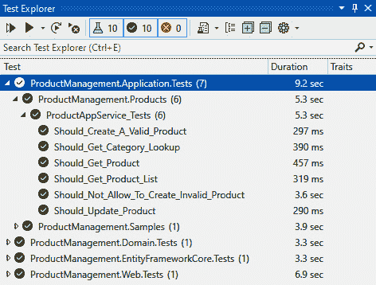
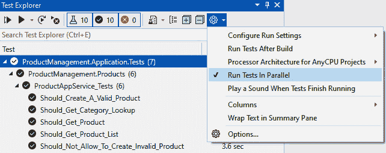

# *第十七章*：构建自动化测试

构建自动化测试是创建可维护的软件解决方案的必要`GetRegistrationOrNull`实践，并且是一种快速且可重复的验证软件的方法。ABP 框架和 ABP 启动解决方案模板都是考虑到可测试性而设计的。我们已经在*第三章*，“逐步应用开发”中看到了使用 ABP 框架编写简单集成测试的例子。

在本章中，你将了解 ABP 测试基础设施，并为基于 ABP 的解决方案构建单元和集成测试。你将学习测试的数据初始化、模拟数据库、测试不同类型的对象。你还将学习自动化测试的基础，如断言、模拟和替换服务，以及处理异常。

下面是本章涵盖的主要主题列表：

+   理解 ABP 测试基础设施

+   构建单元测试

+   构建集成测试

# 技术要求

如果你想遵循本章中的示例，你需要有一个支持 ASP.NET Core 开发的 IDE/编辑器。

本章中的示例大多基于我在*第四章*，“理解参考解决方案”中介绍的 EventHub 解决方案。请参考该章节以了解如何下载 EventHub 解决方案的源代码。

# 理解 ABP 测试基础设施

ABP 的启动解决方案模板包括预配置的测试项目，用于为你的解决方案构建单元和集成测试。虽然你可以在不理解完整结构的情况下编写测试，但我认为探索这一点是值得的，这样你可以了解它是如何工作的，并在需要时进行自定义。我们将从探索`test`项目开始。

## 探索测试项目

以下截图显示了创建新的 ABP 解决方案时创建的`test`项目：

![Figure 17.1 – ABP 启动解决方案中的测试项目]

![img/Figure_17.01_B17287.jpg]

图 17.1 – ABP 启动解决方案中的测试项目

上一张截图显示了名为`ProductManagement`的解决方案的`test`项目，如果你使用不同的 UI 或数据库提供者，`test`项目列表可能会有所不同，但基本逻辑是相同的。以下列表对项目进行了概括说明：

+   `ProductManagement.HttpApi.Client.ConsoleTestApp`：一个用于手动测试应用程序 HTTP API 端点的非常简单的控制台应用程序。因此，这并不是我们自动化测试基础设施的一部分，你可以在本章中忽略它。

+   `ProductManagement.TestBase`：一个由其他测试项目共享的项目。它引用了基础测试库，包括数据初始化和一些其他基础配置代码。通常不包含任何测试类。

+   `ProductManagement.EntityFrameworkCore.Tests`：您可以在该项目中构建 EF Core 集成代码的测试，例如您的自定义仓储。该项目还为您测试配置了一个 SQLite 内存数据库。

+   `ProductManagement.Domain.Tests`：使用此项目构建您的领域层的测试。

+   `ProductManagement.Application.Tests`：使用此项目构建您的应用层的测试。

+   `ProductManagement.Web.Tests`：使用此项目构建您的 MVC/Razor Pages UI 的测试。

该解决方案使用一些库作为测试基础设施，如下一节所述。

## 探索测试库

`ProductManagement.TestBase`项目引用了以下 NuGet 包：

+   `xunit`：xUnit 是.NET 中最受欢迎的测试框架之一。

+   `Shouldly`：一个用于以简单和可读的格式编写断言代码的库。

+   `NSubstitute`：一个用于单元测试中模拟对象的库。

+   `Volo.Abp.TestBase`：ABP 的包，用于轻松创建 ABP 集成测试类。

我们将在*构建单元测试*和*构建集成测试*部分中看到如何使用这些库的基本功能。在我们开始编写测试之前，让我们看看如何运行测试。

## 运行测试

在本节中，我将展示两种运行测试的方法。第一种方法是使用支持运行测试执行的开发环境。我将使用 Visual Studio 作为示例。您可以从主菜单的**测试** | **测试资源管理器**项打开**测试资源管理器**窗口：



图 17.2 – Visual Studio 中的测试资源管理器

在*第三章*中构建的`ProductManagement`应用程序，*逐步应用开发*，源代码可以在[`github.com/PacktPublishing/Mastering-ABP-Framework`](https://github.com/PacktPublishing/Mastering-ABP-Framework)找到。

Visual Studio 默认逐个运行测试，因此运行所有测试需要很长时间。您可以通过点击**文本探索器**中齿轮图标附近的向下箭头图标，选择**并行运行测试**选项（见*图 17.3*）来并行运行测试，这样运行所有测试的时间将显著减少：



图 17.3 – 在 Visual Studio 中并行运行测试

ABP 框架和启动解决方案模板已被设计为支持并行运行测试，这样测试不会相互影响。

运行测试的另一种方法是使用解决方案根目录中的 `dotnet test` 命令。它自动发现并运行所有测试，并在命令行终端中报告测试结果。如果所有测试都成功，则此命令以 `0`（成功）返回代码退出；如果任何测试失败，则它以 `1` 返回代码退出。此命令在构建 **持续集成**（**CI**）管道时特别有用，其中可以自动运行测试。

你已经学习了 ABP 启动解决方案的测试结构并运行了自动化测试。现在，我们可以开始构建我们的测试。

# 构建单元测试

在本节中，我们将看到不同类型的单元测试。我们将从测试一个静态类开始，然后为没有依赖关系的类编写测试。我们将继续测试具有依赖服务的类，并学习如何模拟这些依赖以对那个类进行单元测试。我们将通过示例学习编写自动化测试代码的基础。

让我们从最简单的情况开始——测试静态类。

## 测试静态类

没有状态和外部依赖的静态类是最容易测试的类。`EventUrlHelper` 是一个静态类（位于 EventHub 解决方案的 `EventHub.Domain` 项目中），用于将事件标题转换为合适的 URL 部分。以下测试类（位于 EventHub 解决方案的 `EventHub.Domain.Tests` 项目中）测试了 `EventUrlHelper` 类：

```cs
public class EventUrlHelper_Tests
{
    [Fact]
    public void Should_Convert_Title_To_Proper_Urls()
    {
        var url = EventUrlHelper.ConvertTitleToUrlPart(
                  "Introducing ABP Framework!");
        Assert.Equal("introducing-abp-framework", url);
    }
}
```

第一条规则是测试类应该是 `public` 的。否则，你无法在由 `xUnit` 库定义的 `[Fact]` 属性中看到它。任何带有 `[Fact]` 属性的公共方法都被视为测试用例，并由 `Should_Convert_Url_To_Kebab_Case` 自动发现，并且只测试与 `kebab-case` 相关的功能性。

本例中的测试代码非常简单。我们调用静态 `EventUrlHelper.ConvertTitleToUrlPart` 方法，并使用一个示例标题值，然后比较结果与我们期望的值。`Assert` 类由 `xUnit` 定义，具有许多方法来定义我们的期望。只有当给定的值相等时，测试用例才成功。否则，我们在 **Test Explorer** 中看到测试用例的红色图标，并显示一个错误消息，指出测试的问题。

你可以在 **Test Explorer** 中的特定测试上右键单击以运行它并查看结果，如下面的截图所示：

![图 17.4 – 在 Visual Studio 的 Test Explorer 中运行特定测试

![图 17.4 – 在 Visual Studio 的 Test Explorer 中运行特定测试

图 17.4 – 在 Visual Studio 的 Test Explorer 中运行特定测试

另一个常见的 `xUnit` 属性是 `[Theory]`，它为测试方法提供参数，并对每个参数集进行测试。假设我们想要使用不同的活动 URL 运行测试，我们可以重写测试方法，如下面的代码块所示：

```cs
public class EventUrlHelper_Tests
{
    [Theory]
    [InlineData("Introducing ABP Framework!",
                "introducing-abp-framework")]
    [InlineData("Blazor: UI Messages", 
                "blazor-ui-messages")]
    [InlineData("What's new in .NET 6", 
                "whats-new-in-net-6")]
    public void Should_Convert_Title_To_Proper_Urls(
        string title, string url)
    {
        var result = 
            EventUrlHelper.ConvertTitleToUrlPart(title);
        result.ShouldBe(url);
    }
}
```

`xUnit`为每个`[InlineData]`集合单独运行此测试方法，并将`title`和`url`参数作为给定数据传递。如果您再次查看**Test Explorer**，您将看到这三个测试案例在那里：

![Figure 17.5 – Using the [Theory] attribute for unit tests

![img/Figure_17.05_B17287.jpg]

图 17.5 – 使用[Theory]属性进行单元测试

我还在这个例子中使用了`Shouldly`库进行断言。`result.ShouldBe(url)`表达式比`Assert.Equal(url, result)`表达式更容易编写和阅读。`Shouldly`库与这样的扩展方法一起工作，我将在未来的示例中使用它。

测试无状态和外部依赖的静态类（类）很容易。我们还学习了一些`xUnit`和`Shouldly`功能。下一节将继续测试没有服务依赖的简单类。

## 测试无依赖关系的类

一些类，如实体，可能没有对其他服务的依赖。测试这些类相对容易，因为我们不需要准备依赖来使类正常工作。

以下测试方法测试`Event`类的构造函数：

```cs
public class Event_Tests
{
    [Fact]
    public void Should_Create_A_Valid_Event()
    {
        new Event(
            Guid.NewGuid(),
            Guid.NewGuid(),
            "1a8j3v0d",
            "Introduction to the ABP Framework",
            DateTime.Now,
            DateTime.Now.AddHours(2),
            "In this event, we will introduce the ABP 
             Framework..."
        );
    }
}
```

在这个例子中，我传递了一个有效的参数列表，这样它就不会抛出异常，测试成功。以下示例测试异常情况：

```cs
[Fact]
public void 
    Should_Not_Allow_End_Time_Earlier_Than_Start_Time()
{
    var exception = Assert.Throws<BusinessException>(() =>
    {
        new Event(
            Guid.NewGuid(),
            Guid.NewGuid(),
            "1a8j3v0d",
            "Introduction to the ABP Framework",
            DateTime.Now, // Start time
            DateTime.Now.AddDays(-2), // End time
            "In this event, we will introduce the ABP
             Framework..."
        );
    });
    exception.Code.ShouldBe(EventHubErrorCodes
        .EventEndTimeCantBeEarlierThanStartTime);
}
```

我故意将结束时间设置为比开始时间早 2 天。我期望构造函数通过使用`Assert.Throws<T>`方法抛出`BusinessException`异常。如果`Throws`方法内部的代码块抛出`BusinessException`类型的异常，则测试通过；否则，测试将失败。我还使用`ShouldBe`扩展方法检查错误代码。

让我们编写一个测试`Event`类另一个方法的函数。以下示例创建了一个有效的`Event`对象，然后更改其开始和结束时间，并最终检查时间是否已更改：

```cs
[Fact]
public void Should_Update_Event_Time()
{
    // ARRANGE
    var evnt = new Event(
        Guid.NewGuid(),
        Guid.NewGuid(),
        "1a8j3v0d",
        "Introduction to the ABP Framework",
        DateTime.Now,
        DateTime.Now.AddHours(2),
        "In this event, we will introduce the ABP
         Framework..."
    );
    var newStartTime = DateTime.Now.AddHours(1);
    var newEndTime = DateTime.Now.AddHours(2);
    //ACT
    evnt.SetTime(newStartTime, newEndTime);
    //ASSERT
    evnt.StartTime.ShouldBe(newStartTime);
    evnt.EndTime.ShouldBe(newEndTime);
    evnt.GetLocalEvents()
        .ShouldContain(x => x.EventData
                       is EventTimeChangingEventData);
}
```

此示例完全实现了常见的**Arrange-Act-Assert**（**AAA**）测试模式，详细说明如下：

+   *Arrange*部分准备我们需要工作的对象。

+   *Act*部分执行我们想要测试的实际代码。

+   *Assert*部分检查期望是否得到满足。

我建议使用这些注释行分隔测试方法的主体，以使您正在测试和断言的内容明确。在这个例子中，我们使用了`Event`类的`SetTime`方法来更改事件时间。`SetTime`方法还发布了一个本地事件，因此我在*Assert*部分也检查了它。

如您在示例中看到的，如果我们想要测试的类没有外部依赖，我们可以简单地创建一个实例并在其上执行方法。在下一节中，我们将看到如何处理外部依赖。

## 测试具有依赖关系的类

大多数服务都依赖于其他服务。我们使用**依赖注入**（**DI**）系统将这些依赖项注入到服务的构造函数中。单元测试的目的是测试一个类尽可能独立于其他类，因为单元测试通常只有一个失败的理由。我们应该在测试目标类时排除这些依赖项。这样，我们的测试会受到目标类变化的影响，但不会受到其他类变化的影响。

模拟是单元测试中用来用假实现替换目标类依赖项的技术，这样测试就不会受到目标类依赖项的影响。

我将以`EventRegistrationManager`类的`IsPastEvent`方法为例进行测试。`IsPastEvent`方法获取一个事件。

`EventRegistrationManager`是一个领域服务，并在其构造函数中接受三个外部服务，如下面的简化代码块所示：

```cs
public class EventRegistrationManager : IDomainService
{
    ...
    public EventRegistrationManager(
        IEventRegistrationRepository 
            eventRegistrationRepository,
        IGuidGenerator guidGenerator,
        IClock clock)
    {
        _eventRegistrationRepository = 
            eventRegistrationRepository;
        _guidGenerator = guidGenerator;
        _clock = clock;
    }
    public bool IsPastEvent(Event @event)
    {
        return _clock.Now > @event.EndTime;
    }
}
```

我们应该传递这三个外部服务的实例，以便能够创建一个`EventRegistrationManager`对象。下面的代码块显示了我是如何为该类的`IsPastEvent`方法编写测试方法的：

```cs
public class EventRegistrationManager_UnitTests
{
    [Fact]
    public void IsPastEvent()
    {
        var clock = Substitute.For<IClock>();
        clock.Now.Returns(DateTime.Now);
        var registrationManager = new 
            EventRegistrationManager(null, null, clock
        );
        var evnt = new Event(
            Guid.NewGuid(),
            Guid.NewGuid(),
            "1a8j3v0d",
            "Introduction to the ABP Framework",
            DateTime.Now.AddDays(-10), // Start time
            DateTime.Now.AddDays(-9), // End time
            "In this event, we will introduce the ABP
             Framework..."
        );
        registrationManager.IsPastEvent(evnt)
            .ShouldBeTrue();
    }
}
```

测试代码首先使用`NSubstitute`库的`Substitute.For<T>`实用方法创建了一个假的`IClock`对象。`clock.Now.Returns(DateTime.Now)`语句配置了假对象，使其在调用`clock.Now`属性时返回`DateTime.Now`。我们这样做是因为`IsPastEvent`方法将调用`clock.Now`属性。这意味着我们应该了解单元测试方法的内部实现细节，以便正确测试它。

由于我知道`IsPastEvent`方法不会使用`IEventRegistrationRepository`和`IGuidGenerator`服务，我可以在`EventRegistrationManager`类的构造函数中将它们传递为`null`。

最后，我使用一个示例事件调用了`EventRegistrationManager`类的`IsPastEvent`方法并检查了结果。

让我们看看一个更复杂的例子。这次，我们正在测试`EventRegistrationManager`类的`RegisterAsync`方法。代码如下所示：

```cs
[Fact]
public async Task 
    Valid_Registrations_Should_Be_Inserted_To_Db()
{
    var evnt = new Event(/* some valid arguments */);
    var user = new IdentityUser(/* some valid arguments 
                                */);
    var repository =
        Substitute.For<IEventRegistrationRepository>();
    repository
        .ExistsAsync(evnt.Id, user.Id)
        .Returns(Task.FromResult(false));
    var clock = Substitute.For<IClock>();
    clock.Now.Returns(DateTime.Now);
    var guidGenerator = SimpleGuidGenerator.Instance;
    var registrationManager = new EventRegistrationManager(
        repository, guidGenerator, clock
    );
    await registrationManager.RegisterAsync(evnt, user);
    await repository
        .Received()
        .InsertAsync(
            Arg.Is<EventRegistration>(
            er => er.EventId == evnt.Id && er.UserId == 
                user.Id)
    );
}
```

首先，我创建了一个`Event`对象和一个`IdentityUser`对象，因为`RegisterAsync`方法需要这些参数。然后，我模拟了`EventRegistrationManager`的依赖项。由于`RegisterAsync`方法使用了所有依赖项，我不得不模拟它们所有。看看我是如何配置假仓库在调用`ExistsAsync`方法时返回`false`的。`RegisterAsync`方法使用`ExistsAsync`方法来检查是否已经存在具有相同事件和用户的注册。

执行`RegisterAsync`方法后，我应该以某种方式检查注册是否完成。我可以使用`NSubstitute`的`Received`方法来检查仓库的`InsertAsync`方法是否被调用，并带有指定的事件和**用户标识符**（**UIDs**）的`EventRegistration`对象。

在本节中，我已经介绍了单元测试的基础知识。与集成测试相比，单元测试有两个主要优势，如下所述：

+   它们运行速度快，因为只有被测试的类真正工作。所有其他类都是模拟的，通常没有执行成本。

+   它们使问题调查变得更容易。如果一个类工作不正常，只有针对该类的测试会失败，因此你可以轻松地找到问题的根源。

然而，当你的类有依赖关系时，编写和维护单元测试是困难的。单元测试也无法充分说明你的类在与其他服务集成运行时是否能够正常工作。这引出了集成测试的概念。

# 构建集成测试

在本节中，我们将了解如何为集成到 ABP 框架和其他基础设施组件的服务构建自动化测试。我们将从理解 ABP 集成开始，了解集成测试中数据库的使用方式，以及如何创建初始测试数据。然后，我们将编写存储库、领域和应用程序服务的示例测试。让我们从 ABP 集成开始。

## 理解 ABP 集成

ABP 提供了`Volo.Abp.TestBase` NuGet 包，其中包含用于集成测试的`AbpIntegratedTest<TStartupModule>`基类。我们可以从该类继承以编写与 ABP 框架完全集成的测试。以下示例显示了此类测试的主要部分：

```cs
public class SampleTestClass
    : AbpIntegratedTest<MyTestModule>
{
    private IMyService _myService;
    public SampleTestClass()
    {
        _myService = GetRequiredService<IMyService>();
    }

    [Fact]
    public async Task TestMethod()
    {
        await _myService.DoItAsync();
    }
}
```

在这个例子中，我继承了`AbpIntegratedTest<MyTestModule>`类，其中`MyTestModule`是我的启动模块类。`MyTestModule`应该依赖于`AbpTestBaseModule`，如下面的示例所示：

```cs
[DependsOn(typeof(AbpTestBaseModule))]
public class MyTestModule : AbpModule
{
}
```

在`SampleTestClass`的构造函数中，我使用`GetRequiredService`方法解析了一个示例服务，并将其分配给一个类字段。由于所有基础设施都可用，我们可以从 DI 系统中解析服务，就像在运行时一样。我不需要关心服务的依赖关系。最后，我在测试方法中调用了示例服务的方法。

虽然编写集成测试如此简单，但启动模板中的测试项目还有一些额外的内容。检查`EventHubTestBaseModule`类（位于 EventHub 解决方案的`EventHub.TestBase`项目中）。你会看到它禁用了后台作业和授权，播种了一些测试数据，并进行了其他配置。

我们已经在测试类中学习了与 ABP 集成的基础知识。在下一节中，你将学习如何处理测试中的数据库。

## 模拟数据库

数据库是构建集成测试时最基本的部分之一。假设你在你的解决方案中使用 SQL Server。使用真实的 SQL Server 数据库有一些基本问题；由于它们将在同一个数据库上工作，因此测试会相互影响。数据库中的测试更改可能会破坏后续的测试。你可能无法并行运行测试。由于你的应用程序将作为外部进程与 SQL Server 通信，因此测试执行速度会较慢。无需提及 SQL Server 应该在测试环境中安装并可用。

EF Core 提供了一个内存数据库选项，但它非常有限。例如，它不支持事务，并且无法执行 SQL 命令。因此，我建议根本不要使用它。

ABP 启动模板已经配置为使用 SQLite 内存数据库进行 EF Core（它还使用`Mongo2Go`库为 MongoDB 提供内存数据库）。SQLite 是一个真正的关系型数据库管理系统，对于大多数应用程序来说将足够使用。

检查`EventHubEntityFrameworkCoreTestModule`类（位于 EventHub 解决方案的`EventHub.EntityFrameworkCore.Tests`项目中），以查看 SQLite 的设置。它为每个测试用例创建一个单独的内存 SQLite 数据库，在数据库中创建表，并初始化测试数据。这样，每个测试方法都以相同的初始状态开始，并且不会影响其他测试。我们将在下一节中看到测试数据的初始化。

## 初始化测试数据

在空数据库上编写测试并不那么实用。假设你想要查询数据库中的事件或者想要测试事件注册代码是否工作。你首先需要将一些实体插入到数据库中。为每个测试准备数据库可能会很繁琐。相反，我们可以在数据库中创建一些初始实体，这些实体对每个测试都是可用的。

ABP 启动解决方案模板使用 ABP 的数据初始化系统将一些初始数据填充到数据库中。查看 EventHub 解决方案的`EventHub.TestBase`项目中的`EventHubTestDataSeedContributor`类。它在数据库中创建了一些用户、组织和事件，因此我们可以直接编写假设初始数据存在的测试。

我们已经讨论了 ABP 的集成测试基础设施，包括数据库的模拟和初始化。现在，我们可以从存储库开始编写一些集成测试。

## 测试存储库

让我们以 EventHub 解决方案的`EventHub.Domain.Tests`项目中的`EventRegistrationRepository_Tests`类为例：

```cs
public class EventRegistrationRepository_Tests
    : EventHubDomainTestBase
{
    private readonly IEventRegistrationRepository 
        _repository;
    private readonly EventHubTestData _testData;
    public EventRegistrationRepository_Tests()
    {
        _repository = GetRequiredService<
                      IEventRegistrationRepository>();
        _testData = GetRequiredService<EventHubTestData>();
    }
    // TODO: Test methods come here...
}
```

此类继承自 `EventHubDomainTestBase` 类，该类间接继承自我们在 *Understanding the ABP integration* 部分中探讨的 `AbpIntegratedTest<T>` 类。因此，在构造函数中，我们可以从 DI 系统解析 `IEventRegistrationRepository` 和 `EventHubTestData` 服务。你可以自己调查 `EventHubTestData` 类（在 EventHub 解决方案的 `EventHub.TestBase` 项目中）。它基本上存储了最初种入数据库的实体的 `Id` 值，以便在测试中访问它们。

让我们看看 `EventRegistrationRepository_Tests` 类的第一个测试方法。如下所示：

```cs
[Fact]
public async Task
    Exists_Should_Return_False_If_Not_Registered()
{
    var exists = await _repository.ExistsAsync(
        _testData.AbpMicroservicesFutureEventId, 
        _testData.UserJohnId);
    exists.ShouldBeFalse();
}
```

此测试简单地执行 `ExistsAsync` 方法并检查结果为 `false`。它应该返回 `false`，因为我们知道用户 `John` 没有注册给定的活动。我们知道这一点是因为我们在数据库中编写了初始数据（见 *Seeding the test data* 部分）。让我们再写一个测试，如下所示：

```cs
[Fact]
public async Task Exists_Should_Return_True_If_Registered()
{
    await _repository.InsertAsync(
        new EventRegistration(
            Guid.NewGuid(),
            _testData.AbpMicroservicesFutureEventId,
            _testData.UserJohnId));

    var exists = await _repository.ExistsAsync(
        _testData.AbpMicroservicesFutureEventId, 
        _testData.UserJohnId);
    exists.ShouldBeTrue();
}
```

这次，我们在数据库中创建注册记录，因此我们期望相同的 `ExistsAsync` 调用返回 `true`。这样，我们可以为特定的测试准备数据库以获得预期的结果。

ABP 的存储库提供了 `GetQueryableAsync` 方法，因此我们可以在测试中直接使用 `queryable`）：

```cs
[Fact]
public async Task Test_Querying()
{
    var queryable = await _repository.GetQueryableAsync();
    var exists = await queryable.Where(
        x => x.EventId ==
             _testData.AbpMicroservicesFutureEventId &&
             x.UserId == _testData.UserJohnId
        ).FirstOrDefaultAsync();
    exists.ShouldBeNull();
}
```

此方法使用 `Where` 和 `FirstOrDefaultAsync` LINQ 扩展方法查询相同的注册。如果你尝试运行此测试，你会看到它抛出一个异常（类型为 `ObjectDisposedException`），因为 `GetQueryableAsync` 方法需要一个活动的 `WithUnitOfWorkAsync` 方法来在 UoW 中执行代码，因此我们可以像以下代码块中所示的那样修复测试代码：

```cs
[Fact]
public async Task Test_Querying_With_Uow()
{
    await WithUnitOfWorkAsync(async () =>
    {
        var queryable = 
            await _repository.GetQueryableAsync();
        var exists = await queryable.Where(
            x => x.EventId ==
                 _testData.AbpMicroservicesFutureEventId &&
                 x.UserId == _testData.UserJohnId
        ).FirstOrDefaultAsync();
        exists.ShouldBeNull();
    });
}
```

你可以看到 `WithUnitOfWorkAsync` 方法的源代码。它只是使用 `IUnitOfWorkManager` 创建 UoW 范围。

我们为存储库创建了一些测试方法。你可以以相同的方式测试任何服务（已注册到 DI 系统）。我将在下一节展示一些领域服务和应用服务的示例测试。

## 测试领域服务

测试领域服务与测试存储库类似，因为你也应该关心领域服务的 UoW。以下代码块显示了来自 `EventManager_Tests` 类（在 EventHub 解决方案的 `EventHub.Domain.Tests` 项目中）的示例测试用例：

```cs
[Fact]
public async Task Should_Update_The_Event_Capacity()
{
    const int newCapacity = 42;
    await WithUnitOfWorkAsync(async () =>
    {
        var @event = await _eventRepository.GetAsync(
            _testData.AbpMicroservicesFutureEventId);
        await _eventManager.SetCapacityAsync(
            @event,
            newCapacity
        );
    });

    var @event = await _eventRepository.GetAsync(
        _testData.AbpMicroservicesFutureEventId);
    @event.Capacity.ShouldBe(newCapacity);
}
```

测试的目的是使用 `EventManager` 领域服务增加活动的容量，并查看它是否工作。它使用 `WithUnitOfWorkAsync` 方法调用 `SetCapacityAsync` 方法，因为 `SetCapacityAsync` 方法内部执行 `CountAsync` LINQ 扩展方法，需要一个活动的 UoW。如果你不想在每种情况下都检查领域服务的内部，我建议在测试中使用领域服务或存储库时始终启动 UoW。在 UoW 之后，我重新从数据库查询了相同的活动以检查容量是否已更新。

你可以探索`EventManager_Tests`类和其他在`EventHub.Domain.Tests`项目中的测试类，以获取所有详细信息以及更复杂的测试用例。在下一节中，我将展示测试应用服务。

## 测试应用服务

在本节中，我们将检查一个针对`EventRegistrationAppService`类（在 EventHub 解决方案的`EventHub.Application`项目中定义）的测试。`EventRegistrationAppService_Tests`（在 EventHub 解决方案的`EventHub.Application.Tests`项目中定义）是包含该应用服务测试的测试类。你可以在解决方案中探索这个类。在这里，我将部分展示它以解释其工作原理。

让我们从当前用户注册事件的测试方法开始。你可以在这里看到它：

```cs
[Fact]
public async Task Should_Register_To_An_Event()
{
    Login(_testData.UserAdminId);
    await _eventRegistrationAppService.RegisterAsync(
        _testData.AbpMicroservicesFutureEventId
    );
    var registration = await GetRegistrationOrNull(
        _testData.AbpMicroservicesFutureEventId,
        _currentUser.GetId()
    );    
    registration.ShouldNotBeNull();
}
```

第一行将当前用户设置为管理员用户，这是必需的，因为`EventRegistrationAppService.RegisterAsync`方法适用于当前用户。让我们看看`Login`方法的实现，如下所示：

```cs
private void Login(Guid userId)
{
    _currentUser.Id.Returns(userId);
    _currentUser.IsAuthenticated.Returns(true);
}
```

它配置了`_currentUser`对象，当使用其`Id`属性时返回给定的`userId`值。正如你可能猜到的，`_currentUser`是类型为`ICurrentUser`的模拟（伪造）对象。模拟对象在`AfterAddApplication`方法中配置，如下面的代码片段所示：

```cs
protected override void AfterAddApplication(
    IServiceCollection services)
{
    _currentUser = Substitute.For<ICurrentUser>();
    services.AddSingleton(_currentUser);
}
```

此方法覆盖了`AbpIntegratedTest<T>`基类的`AfterAddApplication`方法。我们可以覆盖此方法，在初始化阶段完成之前对 DI 配置进行最后的调整。在这里，我使用`NSubstitute`库创建了一个模拟对象，并将其作为单例服务（记住，最后注册的类/对象用于服务）。这样，我可以更改其值，并且所有使用`ICurrentUser`的服务都会受到影响。

设置当前用户后，测试方法会像通常一样调用`EventRegistrationAppService.RegisterAsync`方法。最后，我检查了数据库以查看是否保存了注册记录。`GetRegistrationOrNull`方法的实现如下所示：

```cs
private async Task<EventRegistration>
    GetRegistrationOrNull(Guid eventId, Guid userId)
{
    return await WithUnitOfWorkAsync(async () =>
    {
        return await _eventRegistrationRepository
           .FirstOrDefaultAsync(
                x => x.EventId == eventId && x.UserId == 
                    userId
        );
    });
}
```

我在这里再次使用了`WithUnitOfWorkAsync`，因为`FirstOrDefaultAsync`方法需要一个活动的 UoW。

正如我们在示例中看到的，使用 ABP 框架编写集成测试既简单又直接。我们很少需要模拟服务并处理我们针对测试的目标服务的依赖关系。

集成测试的运行速度比单元测试慢，但它们允许你测试组件之间的集成，并且可以以你无法使用单元测试的方式测试数据库查询。我建议平衡且实际——为你的解决方案构建单元测试和集成测试。

# 摘要

准备测试是构建任何类型软件解决方案的基本实践。正如我们在本章中看到的，ABP 提供了基本的基础设施来帮助你为你的应用程序编写测试。

我们已经通过示例探索了使用 ABP 框架的单元和集成测试。我从 EventHub 解决方案中选择了示例。该解决方案还包含更复杂的测试，我建议您探索它们。

到现在为止，您应该已经开始编写自动化测试来覆盖您的服务器端代码。您已经看到了 ABP 启动解决方案的结构以及数据库是如何被模拟的。您已经学习了如何处理异常、UoWs、数据初始化、对象模拟和其他常见的测试模式。

这本书的最后一章。如果您已经读到这儿，并跟随了示例，您已经学到了使用 ABP 框架的基础知识、特性和最佳实践。您已经准备好构建基于 ABP 的解决方案来实现您的软件想法。

您可以在开发过程中参考这本书，并在需要更多详细信息和最新信息时查看 ABP 框架的文档：[`docs.abp.io`](https://docs.abp.io)。

最后，如果您有任何问题，请随意在 ABP 框架的 GitHub 仓库中创建问题：[`github.com/abpframework/abp`](https://github.com/abpframework/abp)。我将继续成为这个伟大项目的活跃贡献者，并尝试回答您的问题。

我是 Halil İbrahim Kalkan，ABP 框架精通一书的作者。我真心希望您喜欢阅读这本书，并发现它对提高您在 ABP 框架中的生产力和效率有所帮助。

如果您能在亚马逊上留下对《ABP 框架精通》的评价，分享您的想法，这将对我（以及其他潜在读者！）非常有帮助。

前往以下链接或扫描二维码留下您的评价：

[`packt.link/r/1801079242`](https://packt.link/r/1801079242)


您的评价将帮助我了解这本书中哪些地方做得好，以及未来版本中哪些地方可以改进，所以这真的非常感谢。

祝好运，


Halil İbrahim Kalkan
