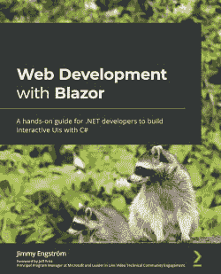
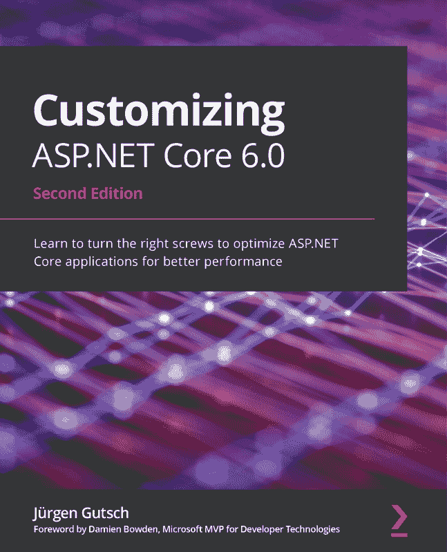

[Packt.com](http://Packt.com)

订阅我们的在线数字图书馆，全面访问超过 7,000 本书籍和视频，以及领先的行业工具，帮助你规划个人发展并推进职业生涯。有关更多信息，请访问我们的网站。

# 第十八章：为什么订阅？

+   通过来自超过 4,000 位行业专业人士的实用电子书和视频，节省学习时间，更多时间编码

+   通过为你量身定制的技能计划提高你的学习效果

+   每月免费获得一本电子书或视频

+   完全可搜索，便于快速访问关键信息

+   复制粘贴、打印和收藏内容

你知道 Packt 为每本书提供电子书版本，包括 PDF 和 ePub 文件吗？你可以在[packt.com](http://packt.com)升级到电子书版本，并且作为印刷书客户，你有权获得电子书副本的折扣。有关更多信息，请联系我们`customercare@packtpub.com`。

在[www.packt.com](http://www.packt.com)，你还可以阅读一系列免费的技术文章，注册各种免费通讯，并享受 Packt 书籍和电子书的独家折扣和优惠。

# 你可能还会喜欢的其他书籍

如果你喜欢这本书，你可能还会对 Packt 的其他书籍感兴趣：

](https://www.packtpub.com/product/web-development-with-blazor/9781800208728)

**使用 Blazor 进行 Web 开发**

Jimmy Engström

ISBN: 978-1-80020-872-8

了解可以与 Blazor 一起使用的不同技术，例如 Blazor Server 和 Blazor WebAssembly。

+   了解如何构建简单和高级的 Blazor 组件。

+   探索 Blazor Server 和 Blazor WebAssembly 项目之间的差异

+   了解 Entity Framework 的工作原理，并构建一个简单的 API。

+   熟悉组件，并了解如何创建基本和高级组件。

](https://www.packtpub.com/product/customizing-asp-net-core-6-0-second-edition/9781803233604)

**定制 ASP.NET Core 6.0**

Jürgen Gutsch

ISBN: 978-1-80323-360-4

+   探索 ASP.NET Core 6 中的各种应用程序配置和提供者。

+   启用并使用缓存来提高应用程序的性能。

+   了解.NET 中的依赖注入，并学习如何添加第三方 DI 容器。

+   探索中间件的概念，并为 ASP.NET Core 应用编写中间件。

+   在你的 API 驱动型项目中创建各种 API 输出格式。

# Packt 正在寻找像你这样的作者

如果你有兴趣成为 Packt 的作者，请访问[authors.packtpub.com](http://authors.packtpub.com)并今天申请。我们已与成千上万的开发者和技术专业人士合作，就像你一样，帮助他们将见解分享给全球技术社区。你可以提交一般申请，申请我们正在招募作者的特定热门话题，或者提交你自己的想法。

你可能还会喜欢的其他书籍

你可能还会喜欢的其他书籍
