# 第二章：C# 和 .NET 的核心概念

本章涵盖了 C# 和 .NET 的核心概念，从其初始版本和创建背后的主要动机开始，并涵盖了语言在 2.0 和 3.0 版本中出现的新特性。

我们将通过一些简短的小代码片段来展示所有主要概念，这些代码足够短，便于理解并易于复制。

在本章中，我们将涵盖以下主题：

+   C# 及其在微软开发生态系统中的作用

+   强类型语言和弱类型语言之间的区别

+   2.0 和 3.0 版本的演变

+   泛型

+   Lambda 表达式

+   LINQ

+   扩展方法

# C# 语言的不同之处

我有机会与 Hejlsberg 几次讨论 C# 语言及其创建时的初始目的和要求，以及哪些其他语言启发了他或对他的想法有所贡献。

第一次谈话是在 2001 年的 Tech-Ed 上（在西班牙巴塞罗那），我问他关于他自己的语言原则以及它与其他语言的不同之处。他首先说，创造这种语言不仅仅是他的功劳，还有一群人，特别是 *Scott Wiltamuth*、*Peter Golde*、*Peter Sollich* 和 *Eric Gunnerson*。

### 注意

关于该主题最早出版的书籍之一是，《程序员 C# 入门》，作者为 *Gunnerson's.E.*，APress，2000 年）。

关于原则，他提到了以下几点：

> “C# 与这些其他语言（尤其是 Java）之间的一个关键区别在于，我们在设计上试图与 C++ 保持更接近。C# 从 C++ 中直接借用了大多数运算符、关键字和语句。但除了这些更传统的语言问题之外，我们的一个关键设计目标是使 C# 语言面向组件，向语言本身添加你在编写组件时所需的所有概念。例如属性、方法、事件、属性和文档等都是一等语言结构。”

他还提到：

> “当你用 C# 编写代码时，你将所有内容都写在一个地方。不需要头文件、IDL 文件（接口定义语言）、GUID 和复杂的接口。”

这意味着，如果你处理的是一个自包含的单元（让我们记住清单的作用，它可能嵌入在程序集内），你就可以以这种方式编写自描述的代码。在这种模式下，你还可以以各种方式扩展现有技术，正如我们将在示例中看到的那样。

# 语言：强类型、弱类型、动态和静态

C# 语言是一种强类型语言：这意味着任何尝试将错误类型的参数作为参数传递，或将值赋给无法隐式转换的变量，都将生成编译错误。这避免了在其他语言中仅在运行时才会发生的许多错误。

此外，当我们提到动态时，我们指的是那些在运行时应用其规则的编程语言，而静态语言则在编译时应用其规则。JavaScript 或 PHP 就是前者的好例子，而 C/C++ 则是后者的例子。如果我们对这个情况做一个图形表示，可能会得到以下图示：

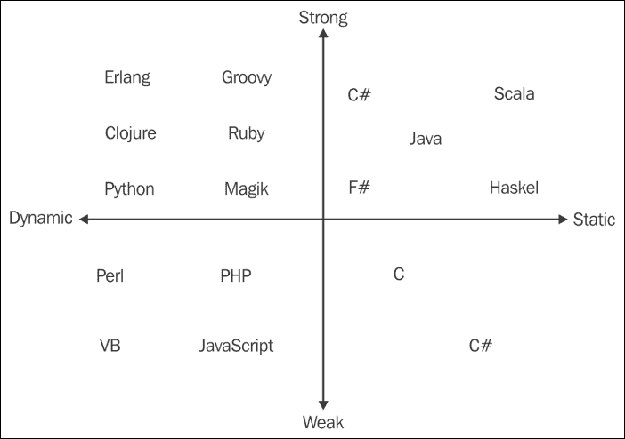

在图中，我们可以看到 C# 明显是强类型的，但它比 C++ 或 Scala 等语言要动态得多。当然，有几个标准可以用来对语言进行分类，以确定它们的类型（弱类型与强类型）以及它们的动态性（动态与静态）。

注意，这也在 IDE 中有影响。编辑器可以告诉我们每种情况下期望的类型，如果你使用动态声明，如 `var`，等式的右侧（如果有）将被评估，并且对于每个声明，我们将看到计算出的值：

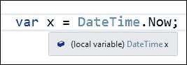

即使在 .NET 世界之外，Visual Studio 的 IDE 现在也能在使用 TypeScript 等语言时提供强类型和 Intellisense 体验，TypeScript 是 JavaScript 的超集，可以编译（转换为）纯 JavaScript，但可以使用与 C# 或任何其他 .NET 语言相同的编码体验来编写。

它可以作为独立的项目类型使用，如果你对此感兴趣，最新版本是 TypeScript 2.0，它最近刚刚发布（你可以在 [`blogs.msdn.microsoft.com/typescript/`](https://blogs.msdn.microsoft.com/typescript/) 查看其新功能的详细描述）。

如我们将在本章后面看到的那样，Intellisense 对于 LINQ 语法至关重要，在许多表达式中，它会返回一个新的（不存在的）类型，如果我们使用 var 声明，编译器会自动将其分配给正确的类型。

## 主要区别

因此，回到标题，是什么让 C# 与众不同？我将指出五个核心点：

+   一切都是对象（我们在 第一章中提到过，*CLR 内部*)。其他语言，如 Smalltalk、Lisp 等，在此之前就已经这样做，但由于不同的原因，性能损失相当严重。

+   如你所知，只需查看对象资源管理器，就能检查一个对象来自哪里。检查基本值，如 `int` 或 `String` 是一个好习惯，它们不过是 `System.Int32` 和 `System.String` 的别名，并且两者都来自对象，如下面的截图所示：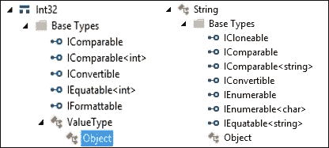

+   通过装箱和拆箱技术，任何值类型都可以转换为对象，而对象的值也可以转换为简单的值类型。

+   这些转换可以通过将类型转换为对象（反之亦然）以这种方式进行：

    ```cs
    // Boxing and Unboxing
    int y = 3; // this is declared in the stack
    // Boxing y in a Heap reference z
    // If we change z, y remains the same.
    object z = y;
    // Unboxing y into h (the value of
    // z is copied to the stack)
    int h = (int)z;
    ```

使用反射（允许您读取组件元数据的技巧），应用程序可以调用自身或其他应用程序，创建它们包含的类的新的实例。

+   作为简短的演示，这段简单的代码启动了另一个 WPF 应用程序的实例（一个非常简单的应用程序，只有一个按钮，但这并不重要）：

    ```cs
    static short counter = 1;
    private void btnLaunch_Click(object sender, RoutedEventArgs e)
    {
      // Establish a reference to this window
      Type windowType = this.GetType();
      // Creates an instance of the Window
      object objWindow = Activator.CreateInstance(windowType);
      // cast to a MainWindow type
      MainWindow aWindow = (MainWindow)objWindow;
      aWindow.Title = "Reflected Window No: " + (++counter).ToString();
      aWindow.Show();
    }
    ```

+   现在，每次我们点击按钮时，都会创建并启动一个新的窗口实例，这在标题窗口中指示其创建顺序：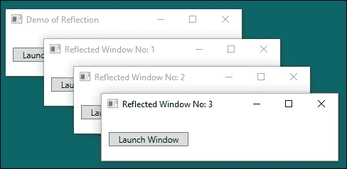

+   您可以通过一种名为平台调用的技术访问其他组件，这意味着您可以通过使用`DllImport`属性导入现有的 DLL 来调用操作系统的功能：

    +   例如，您可以使用`SetParent` API（它是`User32.dll`的一部分）将外部程序的窗口作为您自己的窗口的子窗口，或者您可以控制操作系统事件，例如在我们应用程序仍然活动时尝试关闭系统。

    +   实际上，一旦权限被授予，如果您的应用程序需要访问本地资源，它可以调用系统中的任何 DLL 中的任何函数。

    +   提供我们访问这些资源的模式看起来就像以下图中所示：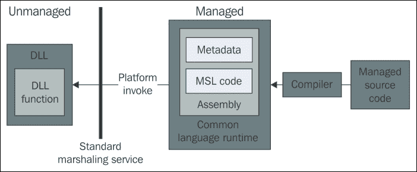

    +   如果您想尝试一些这些可能性，必须记住的资源是[`www.PInvoke.net`](http://www.PInvoke.net)，在那里您有大多数有用的系统 API，以及如何在 C#中使用它们的示例。

    +   这些互操作性能力扩展到与接受自动化（如 Microsoft Office 套件、AutoCAD 等）的应用程序的交互。

+   最后，不安全代码允许您使用指针编写内联 C 代码，执行不安全转换，甚至固定内存以避免意外垃圾回收。然而，不安全并不意味着它是未管理的。不安全代码与安全系统紧密相连。

    +   在许多情况下，这非常有用。可能是一个难以实现的算法，或者是一个执行非常 CPU 密集的方法，以至于性能惩罚变得无法接受。

虽然所有这些都很重要，但我对 C#（以及其他.NET 语言）中的每个事件处理器都会有两个且仅有两个参数的事实感到惊讶。所以我问过 Anders，他的回答是我所听过的最清晰、最合逻辑的回答之一。

# 代理的真实原因

事实上，除了我们提到的这些架构考虑之外，还有一个关键的设计原因：确保.NET 程序永远不会产生**BSOD**（蓝屏死机）。

因此，团队科学地解决了这个问题，并对原因进行了统计分析（分析中使用了超过 70,000 个这样的屏幕）。结果显示，大约 90%的问题原因都是由于驱动程序引起的，他们唯一能做的就是认真与制造商沟通，要求他们通过**硬件兼容性列表**（**HCL**）以及做其他一些事情。

### 注释

当前 Windows 的 HCL 页面可以在[`sysdev.microsoft.com/en-us/hardware/lpl/`](https://sysdev.microsoft.com/en-us/hardware/lpl/)找到。

因此，他们由于自己的软件还剩下 10%的问题，但最大的惊喜是，他们并没有找到五个或十个核心原因来解释这些故障，问题主要集中在仅仅两个原因上：

+   指向丢失的函数的指针，我在图中用**p* -> f(x**)表示

+   投影问题（尝试转换传递给函数的类型；失败可能导致不可预测的结果）

结果，用简单的高斯曲线表示，看起来是这样的：

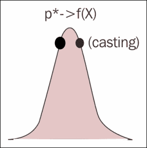

因此，解决这两个问题，超过 95%（或更多）的问题都得到了解决。第一个目标实现了：专注于问题，并将其缩减到最大。

在这一点上，他必须找到一个可能解决这两个问题的解决方案。这就是这位丹麦人的天才所在。他回顾了这两个问题的起源，并意识到这两个案例都与方法调用有关。给定一个转折和一个回归，重新思考通用信息论的基础，以识别理论模型中的具体问题（任何关于这个主题的书的首页），我们会发现像这个图所示的东西：

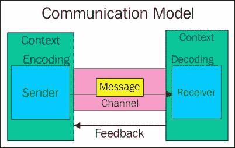

但是，等等！...这同样是事件系统的核心架构！因此，在四个元素隐含的两个方案之间存在着对应关系：

+   **发行者**：这是发起调用的方法

+   **接收者**：另一个类（或相同的）在另一个方法中做出响应

+   **信道**：这是环境，在.NET 中由托管环境替代

+   **消息**：发送给接收者的信息

现在，第二个问题已经解决了：目标模型的模型被识别为信息论一般模式的案例，以及它的部分：信道和期望接收的信息。

缺少了什么？计算机科学中一直用来解决直接调用问题的是什么？那将是调用一个中介。或者如果你愿意，应用 SOLID 设计原则的第五条：依赖倒置。

### 注释

当我们在第十章、*设计模式*中详细讨论依赖倒置时，我们将更详细地讨论依赖倒置，但到目前为止，只需简单地说一下原则的内容（简而言之）：模块不应该依赖于低级模块或细节，而应该依赖于抽象。

这就是导致这个解决方案的因素：委托。调用永远不会直接进行，而是总是通过委托进行，由 CLR 管理，并且不会尝试调用不可用的东西（记住，它是受管理的）。通过通道（以及当然消除函数指针）解决了函数指针问题。

如果你查看解释这个原则的官方（维基百科）文章（[`en.wikipedia.org/wiki/Dependency_inversion_principle`](https://en.wikipedia.org/wiki/Dependency_inversion_principle)），你会发现模式推荐解决方案是从场景 1（图左侧）转换为场景 2（图右侧），其中建议被调用的方法（在对象 B 中）继承（实现）一个接口，以确保调用没有风险：

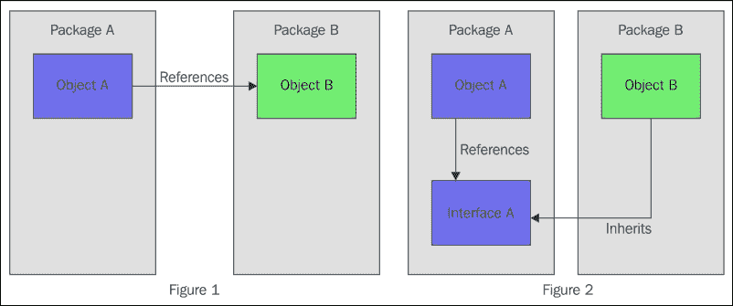

正如 Hejlsberg 所说，第二个原因的解决方案“一旦转换过来，似乎很简单”。他只需要让委托的签名与接收方法相同（记住，参数类型和返回值相同），然后就可以告别类型转换的问题，因为 CLR 是强类型的，编译器（甚至 IDE）会标记任何违反此原则的行为，表明它不会编译。

这种架构避免了由这些原因引起的 BSOD 问题。我们能看看这个结构在代码中的样子吗？当然可以。实际上，我非常确信你经常看到它，只是可能不是从这个角度。

让我们回到之前使用反射窗口的案例。现在我们来确定主要角色。发射器显然是`bntLaunch`按钮成员，接收器是之前的代码：

```cs
void btnLaunch_Click(object sender, RoutedEventArgs e)
```

所以，当我们看到点击事件处理方法的定义时，我们也看到了场景 2 的两个成员：发送者（发射器）和传递的信息（`RoutedEventArgs`类的实例）。

记住，负责调用的委托应该与这个方法中的签名相同。只需右键单击方法名称，**搜索所有引用**，你就可以找到方法与委托之间建立连接的地方（通常是这种语法）：

```cs
this.btnLaunch.Click += new System.Windows.RoutedEventHandler(this.btnLaunch_Click);
```

所以，`btnLaunch`的点击成员通过一个类型为`RoutedEventHandler`的新委托实例连接到`btnLaunch_Click`方法。再次点击**RoutedEventHandler**并选择**转到定义**，以便查看委托的签名：

```cs
public delegate void RoutedEventHandler(object sender, RoutedEventArgs e);
```

哇，签名与接收器完全相同。不再有类型转换问题，如果 CLR 完成其工作，除非接收方法不可访问，否则不会进行调用。这是因为只有内核级组件才能导致 BSOD，永远不会是用户模式组件。

因此，委托是一个非常特殊的类，可以在任何其他类的内部或外部声明，并且具有将任何方法作为目标的能力，只要它们的签名兼容。`+=`语法也告诉我们一些重要的事情：它们是多播的。也就是说，它们可以在单个调用中针对多个方法。

让我们把这个问题放在一个场景中，我们需要评估哪些数字可以被另一个数字序列整除。简单来说，让我们从两个方法开始，分别检查能否被 2 和 3 整除：

```cs
static List<int> numberList;
static List<int> divisibleNumbers = new List<int>();
private void CheckMod2(int x)
{
  if (x % 2 == 0) divisibleNumbers.Add(x);
}
private void CheckMod3(int x)
{
  if (x % 3 == 0) divisibleNumbers.Add(x);
}
```

现在，我们想要评估列表并填充一个包含符合规则数字的 Listbox：

```cs
delegate void DivisibleBy(int number);
private void ClassicDelegateMethod()
{
  DivisibleBy ed = new DivisibleBy(CheckMod2);
  // Invocation of several methods (Multicasting)
  ed += CheckMod3;
  // Every call to ed generates a multicast sequence
  foreach (int x in numberList) { ed(x); }
}
```

我们声明了一个委托，`DivisibleBy`，它接收一个数字并执行一个操作（稍后我们会发现这个名字被改成了`Action`）。因此，同一个委托可以按顺序调用两个方法（请注意，这可能会使序列变得相当长）。

委托是通过另一个按钮调用的，当点击该按钮时，将调用以下代码：

```cs
// Generic delegate way
numberList = Enumerable.Range(1, 100).ToList();
ClassicDelegateMethod();
PrintResults("Numbers divisible by 2 and 3");
```

这里，我们没有包括`PrintResults`的实现，您可以想象它，它也包含在`Chapter02_02`演示中。预期的结果如下：

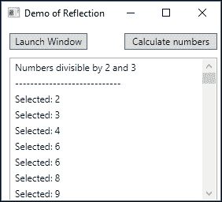

# 2.0 和 3.0 版本的演变

如我们所见，从一开始，Hejlsberg 的团队就从一个完整、灵活和现代的平台开始，能够以许多方式扩展，以适应技术的发展。从 2.0 版本开始，这种意图变得清晰。

语言中发生的第一个实际的基本变化是泛型的引入。Don Syme，后来领导了创建 F#语言的团队，非常活跃，并领导了这个团队，因此它为.NET Framework 2.0 版本做好了准备（不仅是在 C#中，在 C++和 VB.NET 中也是如此）。

## 泛型

泛型的主要目的是为了便于创建更多可重用的代码（顺便说一句，这是面向对象编程的一个原则）。这个名字指的是一组语言特性，允许类、结构、接口、方法和委托使用未指定或泛型类型参数而不是特定类型进行声明和定义（有关详细信息，请参阅[`msdn.microsoft.com/en-us/library/ms379564(v=vs.80).aspx`](https://msdn.microsoft.com/en-us/library/ms379564(v=vs.80).aspx)）。

因此，您可以在一种抽象定义中定义成员，稍后在使用时，将应用一个真实、具体的类型。

基本的.NET 类（BCL）在`System`命名空间中得到了增强，并创建了一个新的`System.Collections.Generic`命名空间来深入支持这个新特性。此外，还添加了新的支持方法来简化新类型的使用，例如`Type.IsGenericType`（显然，用于检查类型）、`Type.GetGenericArguments`（自解释）和非常有用的`Type.MakeGenericType`，它可以从先前的非指定声明中创建任何类型的泛型类型。

以下代码使用字典的泛型类型定义（`Dictionary<,>`）并使用此技术创建实际（构建）类型。相关代码如下（其余代码，包括输出到控制台的内容，包含在 `Demo_02_03` 中）：

```cs
// Define a generic Dictionary (the
// comma is enough for the compiler to infer number of
// parameters, but we didn't decide the types yet.
Type generic = typeof(Dictionary<,>);
ShowTypeData(generic);

// We define an array of types for the Dictionary (Key, Value)
// Key is of type string, and Value is of -this- type (Program)
// Notice that types could be -in this case- of any kind
Type[] typeArgs = { typeof(string), typeof(Program) };

// Now we use MakeGenericType to create a Type representing
// the actualType generic type.
Type actualType = generic.MakeGenericType(typeArgs);
ShowTypeData(actualType);
```

正如你所见，`MakeGenericType` 期望一个（具体）类型的数组。稍后（不在前面的代码中），我们使用 `GetGenericTypeDefinition`、`IsGenericType` 和 `GetGenericArguments` 来内省生成的类型，并在控制台输出以下内容：

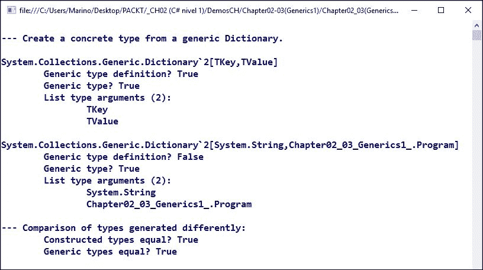

因此，就代码中的操作而言，我们有不同的方式声明泛型，并得到相同的结果。

显然，操作已经构建的泛型类型并不是唯一的选择，因为泛型的主要目标之一是通过简化集合的工作来避免类型转换操作。直到版本 2.0，集合只能存储基本类型：整数、长整型、字符串等，以及模拟不同的数据结构，如栈、队列、链表等。

此外，泛型还有另一个很大的优点：你可以编写支持处理不同类型参数（和返回值）的方法，只要你提供正确处理所有可能情况的方法。

一次又一次，契约的概念在这里将至关重要。

### 创建自定义泛型类型和方法

另一个有用的特性是使用自定义泛型类型。泛型类型和通过 `System.Nullable<T>` 类型支持可选值的特性，对于许多开发者来说，是语言 2.0 版本中包含的两个最重要的特性。

假设你有一个 `Customer` 类，你的应用程序管理它。因此，在不同的用例中，你将读取客户集合并对其执行操作。现在，如果你需要像 `Compare_Customers` 这样的操作怎么办？在这种情况下，你会使用什么标准？更糟糕的是，如果我们想使用相同的标准来处理不同类型的实体，如 `Customer` 和 `Provider` 呢？

在这些情况下，泛型的一些特性非常有用。首先，我们可以构建一个实现了 `IComparer` 接口的类，这样我们就可以确定无疑地知道用于考虑客户 `C1` 是大于还是小于客户 `C2` 的标准。

例如，如果标准仅是 `Balance`，我们可以从一个基本的 `Customer` 类开始，向其中添加一个静态方法来生成随机客户列表：

```cs
public class Customer
{
  public string Name { get; set; }
  public string Country { get; set; }
  public int Balance { get; set; }
  public static string[] Countries = { "US", "UK", "India", "Canada", 	    "China" };
  public static List<Customer> customersList(int number)
  {
    List<Customer> list = new List<Customer>();
    Random rnd = new Random(System.DateTime.Now.Millisecond);
    for (int i = 1; i <= number; i++)
    {
      Customer c = new Customer();
      c.Name = Path.GetRandomFileName().Replace(".", "");
      c.Country = Countries[rnd.Next(0, 4)];
      c.Balance = rnd.Next(0, 100000);
      list.Add(c);
    }
    return list;
  }
}
```

然后，我们构建另一个 `CustomerComparer` 类，它实现了 `IComparer` 接口。区别在于这个比较方法是一个针对 `Customer` 对象的泛型实例化，因此我们可以自由地以对我们逻辑方便的方式实现这个场景。

在这种情况下，我们使用 `Balance` 作为排序标准，所以我们会得到以下内容：

```cs
public class CustomerComparer : IComparer<Customer>
{
  public int Compare(Customer x, Customer y)
  {
    // Implementation of IComparer returns an int
    // indicating if object x is less than, equal to or
    // greater than y.
    if (x.Balance < y.Balance) { return -1; }
    else if (x.Balance > y.Balance) return 1;
    else { return 0; } // they're equal
  }
}
```

我们可以看到，用于比较的标准正是我们为业务逻辑所决定的。最后，另一个类`GenericCustomer`，它实现了应用程序的入口点，以这种方式使用这两个类：

```cs
public class GenericCustomers
{
  public static void Main()
  {
    List<Customer> theList = Customer.customersList(25);
    CustomerComparer cc = new CustomerComparer();
    // Sort now uses our own definition of comparison
    theList.Sort(cc);
    Console.WriteLine(" List of customers ordered by Balance");
    Console.WriteLine(" " + string.Concat(Enumerable.Repeat("-", 36)));
    foreach (var item in theList)
    {
      Console.WriteLine(" Name: {0},  Country: {1}, \t Balance: {2}",
      item.Name, item.Country, item.Balance);
    }
    Console.ReadKey();
  }
}
```

这将产生一个按余额排序的随机客户列表输出：

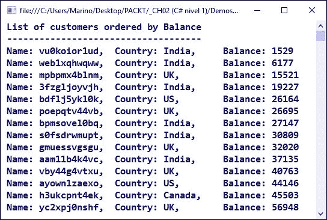

这甚至更好：我们可以修改方法，使其能够无差别地支持客户和供应商。为此，我们需要抽象出这两个实体共有的一个属性，我们可以用它来进行比较。

如果我们的`Provider`实现有不同的或相似的字段（但它们并不相同），只要我们有这个共同因素：一个`Balance`字段，那就没关系。

因此，我们首先对这个共同因素给出一个简单的定义，一个名为`IPersonBalance`的接口：

```cs
public interface IPersonBalance
{
  int Balance { get; set; }
}
```

只要我们的`Provider`类实现了这个接口，我们就可以后来创建一个能够比较两个对象的通用方法，所以，让我们假设我们的`Provider`类看起来像这样：

```cs
public class Provider : IPersonBalance
{
  public string ProviderName { get; set; }
  public string ShipCountry { get; set; }
  public int Balance { get; set; }

  public static string[] Countries = { "US", "Spain", "India", "France", "Italy" };
  public static List<Provider> providersList(int number)
  {
    List<Provider> list = new List<Provider>();
    Random rnd = new Random(System.DateTime.Now.Millisecond);
    for (int i = 1; i <= number; i++)
    {
      Provider p = new Provider();
      p.ProviderName = Path.GetRandomFileName().Replace(".", "");
      p.ShipCountry = Countries[rnd.Next(0, 4)];
      p.Balance = rnd.Next(0, 100000);
      list.Add(p);
    }
    return list;
  }
}
```

现在，我们将`Comparer`方法重写为`GenericComparer`类，使其能够处理这两种类型的实体：

```cs
public class GenericComparer : IComparer<IPersonBalance>
{
  public int Compare(IPersonBalance x, IPersonBalance y)
  {
    if (x.Balance < y.Balance) { return -1; }
    else if (x.Balance > y.Balance) return 1;
    else { return 0; }
  }
}
```

注意，在这个实现中，`IComparer`依赖于一个接口，而不是一个实际的类，并且这个接口仅仅定义了这些实体的共同因素。

现在，我们的新入口点将把所有内容组合起来，以获得一个使用刚刚创建的通用比较方法的有序`Provider`类列表：

```cs
public static void Main()
{
  List<Provider> providerList = Provider.providersList(25);
  GenericComparer gc = new GenericComparer();
  // Sort now uses our own definition of comparison
  providerList.Sort(gc);
  Console.WriteLine(" List of providers ordered by Balance");
  Console.WriteLine(" " + ("").PadRight(36, '-'));
  foreach (var item in providerList)
  {
    Console.WriteLine(" ProviderName: {0}, S.Country: {1}, \t Balance: {2}",
    item.ProviderName, item.ShipCountry, item.Balance);
  }
  Console.ReadKey();
}
```

以这种方式，我们得到一个如图所示的输出（注意，我们没有过多关注格式，以便专注于过程）：

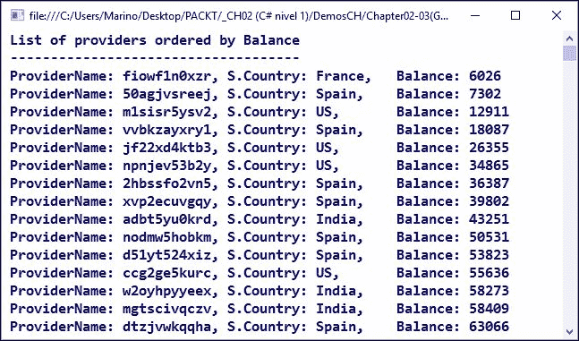

这个例子展示了泛型（以及接口：也是泛型）是如何在这些情况下拯救我们的，而且——当我们有机会在讨论设计模式的实现时证明这一点——这是促进良好实践的关键。

到目前为止，泛型背后的某些最关键的概念已经被讨论过了。在接下来的章节中，我们将看到与泛型相关的其他方面是如何出现的。然而，真正的力量来自于将这些能力与语言的两个新特性相结合：lambda 表达式和 LINQ 语法。

## Lambda 表达式和匿名类型

让我们简要回顾一下当我们通过调用`new`运算符创建一个新的匿名类型时会发生什么，然后描述一下这个对象：

```cs
// Anonymous object
var obj = new { Name = "John", Age = 35 };
```

编译器正确地推断出未声明的类型为匿名类型。实际上，如果我们使用前一章中提到的反汇编工具，我们会发现编译器是如何为这个类分配默认名称的（`f_AnonymousType0`2``）：

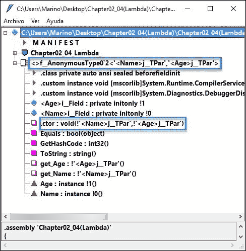

此外，我们还可以看到，已经创建了一个特殊的构造函数以及两个私有字段和两个访问方法（`get_Age`和`get_Name`）。

这类对象特别适合当我们处理来自任何来源的数据时，并且我们垂直地（即，我们不需要所有字段，只需几个，或者甚至一个）过滤信息。

来自此类查询的结果对象在我们的代码中任何地方都没有预先定义，因为每个不同的查询都需要一个定制的定义。

### Lambda 表达式

考虑到这一点，lambda 表达式只是一个匿名函数，它以不同的语法表达，允许你以类似于函数式编程语言（如 JavaScript）的风格将此类函数作为参数传递。

在 C# 3.0 中，lambda 表达式以简化的语法出现，使用 lambda 运算符（`=>`）。此运算符将定义的函数分为两部分：左边的参数和右边的主体；例如，看看这个：

```cs
( [list of arguments] ) => { [list of sentences] }
```

这允许某些变化，例如在参数列表中省略括号以及在主体中省略花括号，只要编译器能够推断出细节、涉及的类型等。

由于前面的声明是委托的定义，我们可以将其分配给任何委托变量，因此我们可以以一种更整洁的方式表达在查找 3 或 7 的倍数时使用的条件：

```cs
DivisibleBy3Or7 ed3 = x => ((x % 3 == 0) || (x % 7 == 0));
```

即，变量`ed3`被分配了一个 lambda 表达式，它接收一个元素（在这种情况下是一个`int`）并评估主体函数，该函数计算与我们之前所做的相同的数字。请注意，主体函数没有用花括号括起来，因为定义对编译器来说足够清晰。

因此，以这种方式操作，我们无需声明单独的方法，甚至可以将这些表达式之一作为参数传递给接受它的方法，就像许多泛型集合所做的那样。

在这一点上，我们开始看到当与泛型集合结合使用时的所有这些功能的强大之处。从.NET 框架的 3.0 版本开始，泛型集合包含了一组接受 lambda 表达式作为参数的方法。

#### 这一切都关乎签名

然而，.NET 框架团队走得更深。如果你抽象出任何委托背后的可能签名，你可以根据返回值将它们分为三个块：

+   没有返回值的委托（称为操作，使用`Action`关键字定义）

+   返回布尔值的委托（现在称为谓词，如在逻辑中，但使用`Func`关键字定义）

+   其余的委托，返回任何类型（也使用`Func`关键字定义）

因此，这三个保留字成为了 C#语法的组成部分，我们在集合中找到的所有泛型方法都会要求我们提供这三种类型的委托之一。简单地在 Visual Studio 中查看这些之一，就会显示这种情况：

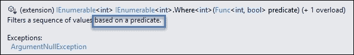

屏幕截图显示了`Where<T>`方法的定义。只需想想：这个想法是允许我们以类似于 SQL 语法中`where`子句的方式过滤集合数据。我们在`where`子句中表达的是一个布尔条件，就像在数学逻辑中，谓词是一个总是评估为`true`或`false`的断言。

例如，我们可以直接使用`numberList`重写之前的场景，如下所示：

```cs
// Method Where in generic lists
numberList = numberList.Where(x => ((x % 3 == 0) || (x % 7 == 0))) .ToList();
```

以更少的管道获得相同的结果，因此我们可以更多地关注要解决的问题，而不是所需的算法。

由于与它们相关的生产力，许多更多的方法被添加，并且立即被程序员社区接受。对于没有返回值的情况，代码体应该作用于方法外部的东西。在我们的例子中，这可能像是在所选值的列表中添加一个数字。

以这种方式，我们可以处理更复杂的情况，例如，我们需要计算以某个数字开头的两个数的乘积的情况，如下面的代码所示：

```cs
// We can create a more complex function including
// any number of conditions
Action<int> MultipleConditions = n =>
{
  if ((n % 3 == 0) && (n % 2 == 0))
  {
    if (n.ToString().StartsWith("5")) {
      selectedNumbers.Add(n);
    }
  }
};
numberList.ForEach(MultipleConditions);
```

在这个变体中，我们使用`ForEach`方法，它接收一个`Action`委托参数，正如我们可以在 IDE 的编辑器提供的工具提示定义中看到的那样：

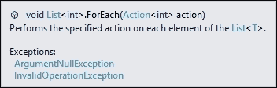

这些句子如何翻译成实际的代码？对于好奇的读者来说，看看由这段代码产生的 MSIL 代码可能会有些惊讶。即使是一个简单的 lambda 表达式也可能比事先想象的要复杂。

让我们看看我们之前使用的`x => x % 3 == 0` lambda 表达式的语法。这里的技巧是（在内部）这被转换为一个树表达式，如果你将这个表达式赋值给一个类型为`Expression<TDelegate>`的变量，编译器会生成代码来构建表示该 lambda 表达式的表达式树。

因此，考虑使用`Expression`对象以替代语法表达 lambda，如下面的代码所示：

```cs
Expression<Func<int, bool>> DivBy3 = x => (x % 3) == 0;
```

一旦编译完成，你可以检查反汇编代码，并在以下屏幕截图（只是内部内容的片段）中找到 MSIL 代码中的等效部分：

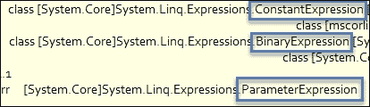

如果我们将这些表达式中之一转换为它的各个部分，这种等价性就会变得更加明显。官方 MSDN 文档通过比较使用表达式构建的简单 lambda 与其生成的部分来给我们提供线索。因此，他们首先说类似这样的话：

```cs
// Lambda defined as an expression tree.
Expression<Func<int, bool>> xTree = num => num > 3 ;
```

这接着是分解这个表达式树：

```cs
// Decompose the expression tree.
ParameterExpression param = (ParameterExpression)exprTree.Parameters[0];
BinaryExpression operation = (BinaryExpression)exprTree.Body;
ParameterExpression left = (ParameterExpression)operation.Left;
ConstantExpression right = (ConstantExpression)operation.Right;
// And print the results, just to check.
Console.WriteLine("Expression: {0} => {1} {2} {3}",
  param.Name, left.Name, operation.NodeType, right.Value);
```

好吧，这种分解的结果如下：

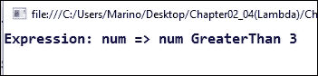

这与 lambda 表达式等价，但现在我们可以看到，在内部，操作树的各个部分与缩短的 lambda 表达式等价。

## LINQ 语法

所有这些的目标，除了使处理集合的方式更简单之外，就是便于数据管理。这意味着从源读取信息并将其转换为所需类型的对象集合，多亏了这些泛型集合。

然而，如果我想用类似 SQL 查询的语法表达一个查询怎么办？或者，简单地说，如果查询的复杂性使得用迄今为止指示的泛型方法表达它变得困难怎么办？

解决方案以新的语法的形式出现，这种语法是 C#（和其他.NET 语言）特有的，称为**LINQ**（**语言集成查询**）。官方定义将这个扩展描述为*在 Visual Studio 2008 中引入的一组功能，它将强大的查询能力扩展到 C#的语言语法中*。具体来说，作者强调这个特性是*一种以 LINQ 提供程序集的形式出现，它使得可以在.NET Framework 集合、SQL Server 数据库、ADO.NET 数据集和 XML 文档中使用 LINQ*。

因此，我们得到了一种新的类似 SQL 的语法，可以生成任何类型的查询，这样相同的句子结构对非常不同的数据源都是有效的。

记得之前，数据查询必须以字符串的形式表达，编译时没有类型检查或任何类型的智能感知支持，并且必须根据数据源的类型学习不同的查询语言：SQL 数据库、XML 文档、Web 服务等等。

### LINQ 语法基于 SQL 语言

在这种情况下，正如 Hejlsberg 多次提到的，如果他们想要提供任何类型的智能感知，他们必须改变子句的顺序，因此这种类型的查询采用以下形式：

```cs
var query = from [element] in [collection]
where [condition1 | condition2 ...]
select [new] [element];
```

以这种方式，一旦用户指定了源（一个集合），Visual Studio 就能为您提供剩余句子的智能感知。例如，为了从一个数字列表中选择几个数字，例如在之前的例子中使用的那些，我们可以编写以下代码：

```cs
// generate a few numbers
var numbers = Enumerable.Range(50, 200);
// use of linq to filter
var selected = from n in numbers
  where n % 3 == 0 && n % 7 == 0
  select n;
Console.WriteLine("Numbers divisible by 3 and 7 \n\r");
// Now we use a lambda (Action) to print out results
selected.ToList().ForEach(n => Console.WriteLine("Selected: {0} ", n));
```

注意，我们使用了`&&`运算符来连接两个条件（我们稍后会进一步讨论这一点），并且在使用 LINQ 语法与 lambda 表达式结合时没有问题。此外，建议您以更合适、更易读、更易于维护的方式表达查询。当然，输出仍然是预期的：

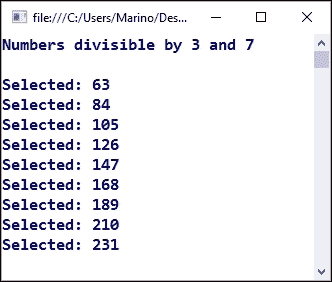

对于集合的唯一条件是它应该支持`IEnumerable`或泛型的`IEnumerable<T>`接口（或任何从它继承的接口）。

如您所预期的那样，通常，集合只是之前从数据库表查询得到的一个业务逻辑对象集合。

### 延迟执行

然而，有一个非常重要的要点需要记住：LINQ 语法本身使用一种称为 *延迟执行* 或 *懒加载* 的模型。这意味着查询不会执行，直到需要第一份数据的其他句子。

无论如何，我们可以通过将结果集合转换为具体集合来强制执行，例如，通过调用 `ToList()` 方法或要求与集合实际使用相关的其他数据，例如计算返回的行数。

这是我们可以通过将 LINQ 查询括起来并应用所需操作（注意返回的值会自动转换为适当的类型）来完成的，如下面的截图所示：

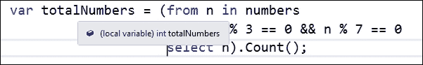

以类似的方式，我们可以使用 `ad-hoc` 子句以升序（默认）或降序对结果集合进行排序：

```cs
var totalNumbers = (from n in numbers
  where n % 3 == 0 && n % 7 == 0
  orderby n descending
  select n).Count();
```

### 加入和分组集合

与我们模仿 SQL 语法进行其他查询的方式相同，我们可以使用 SQL 语言的其它高级功能，例如对多个集合进行分组和连接。

对于第一种情况（分组），语法相当简单。我们只需使用这种方式通过 group / by / into 子句来指示分组因素：

```cs
string[] words = { "Packt", "Publishing", "Editorial", "Books", "CSharp", "Chapter" };
var wordsGrouped = from w in words
group w by w[0] into groupOfWords
select new { FirstLetter = groupOfWords.Key, Words = groupOfWords };
Console.WriteLine(" List of words grouped by starting letter\n\r");
foreach (var indGroup in wordsGrouped)
{
  Console.WriteLine(" Starting with letter '{0}':", indGroup.FirstLetter);
  foreach (var word in indGroup.Words)
  {
    Console.WriteLine(" " + word);
  }
}
```

注意，我们使用嵌套循环来打印结果（一个用于单词组，另一个用于单词本身）。前面的代码生成了以下输出：


对于连接的情况，我们使用 `join` 子句以及 `equals`、`as` 和 `is` 操作符来表达连接的条件。

一个简单的例子可以是连接两个不同的数字集合以寻找任何类型的公共元素。每个集合都会表达一个独特的条件，连接将建立公共因子。

例如，从我们选定的数字（能被 3 和 7 整除）开始，让我们添加另一个以 7 开头的子集：

```cs
var numbersStartingBy7 = from n in numbers
where n.ToString().StartsWith("7")
select n;
```

现在，我们有两组不同的子集，它们有不同的条件。我们可以找出它们中哪一个满足这两个条件，通过在两个子集之间进行连接来表达要求：

```cs
var doubleMultiplesBeg7 = from n in selected
join n7 in numbersStartingBy7
on n equals n7
select n;
```

我们找到了总共五个以 7 开头的数字，它们既是 3 的倍数也是 7 的倍数，如下面的截图所示：

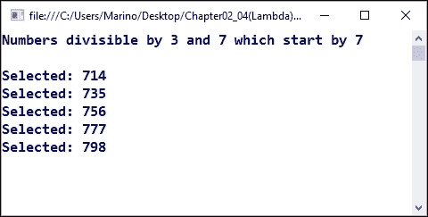

### 类型投影

另一个选项（一个非常有趣的选项）是将所需的输出投影到匿名类型（不存在）的能力，这是选择的结果或包括创建另一个计算字段。

我们通过在 LINQ 查询的 `select` 声明中创建匿名输出类型来执行此操作，具有以我们想要的方式命名所需结果的能力（就像我们创建另一个匿名类型时一样）。例如，如果我们需要另一个列来指示结果数字的偶数或奇数字符，我们可以在之前的查询中添加以下表达式，如下所示：

```cs
var proj = from n in selected
join n7 in numbersStartingBy7 on n equals n7
select new { Num = n, DivBy2 = (n % 2 == 0) ? "Even" : "Odd" };
```

`select` 子句之后是一个匿名类型，由两个字段组成，`Num` 和 `DivBy2`，使用简单的 `?` 操作符表达式，检查整数除以 2，这与我们之前所做的方式相同。结果看起来就像以下输出所示：

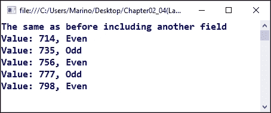

除了这些辅助操作之外，LINQ 语法在处理数据库时特别有用。只需将源集合视为通过查询有效数据源获得的返回值，在所有情况下，这些数据源都将实现 `IEnumerable` 和/或 `IQueryable` 接口，例如，当我们使用 Entity Framework 访问真实数据库引擎时就会发生这种情况。

我们将在接下来的章节中介绍数据库访问，所以请记住当我们查询真实数据时将应用此方法。

## 扩展方法

最后，我们可以扩展现有类的功能。这意味着甚至可以扩展 .NET 框架的基类型，如 `int` 或 `String`。这是一个非常有用的功能，并且按照文档中推荐的方式执行；没有违反 OOP 的基本原理。

这个过程相当简单。我们需要创建一个新的公共静态顶级（非嵌套）类，其中包含一个公共静态方法，具有一个特别适合编译器假设编译后的代码将被附加到类型的实际功能上的初始参数声明。

这个过程可以与任何类一起使用，无论是属于 .NET 框架还是自定义用户或类。

一旦有了声明，其使用方法相当简单，如下所示：

```cs
public static class StringExtension
{
  public static string ExtendedString(this string s)
  {
    return "{{ " + s + " }}";
  }
}
```

注意，第一个参数，使用 `this` 关键字引用，指的是将要使用的字符串；因此，在这个例子中，我们将不带任何额外参数调用该方法（尽管我们可以传递我们需要的任何数量的参数用于其他扩展）。为了使其发挥作用，我们只需添加如下内容：

```cs
Console.WriteLine("The word " + "evaluate".ExtendedString() + " is extended");
```

我们将得到包含在双括号中的扩展输出：


# 摘要

在本章中，我们看到了在版本 2 和 3 中对 C# 语言所做的最相关的增强。

我们首先回顾了 C# 与其他语言之间的主要区别，并理解了强类型化的含义，在这种情况下，与静态和动态的概念一起。

然后，我们解释了创建委托概念背后的主要原因——在 .NET 中绝对至关重要，其起源是由非常严肃和稳固的架构原因所激发的。我们还回顾了在几个常见的编程场景中 .NET 的使用。

我们随后对框架版本 2.0 中出现的泛型功能进行了检查，并分析了几个示例来展示一些典型的用例，包括创建自定义泛型方法。

从泛型到 Lambda 表达式，后者出现在后续版本中，它允许我们通过传递以非常优雅的语法表达的匿名方法来简化对泛型方法的调用。

最后，我们介绍了 LINQ 语法，它允许以类似于您所熟知和使用的 SQL 语法的方式对集合执行复杂查询。

我们以一个简单的扩展方法结束，这个方法展示了如何使用现有功能来扩展其默认方法，以满足我们的编程需求，同时不影响原始定义。

在下一章中，我们将探讨框架最近版本（4、4.5 和 4.6）中出现的新功能和增强，包括动态定义、改进的逻辑表达式、新运算符等。
