# 第三章 C#和.NET 的高级概念

我们已经看到了 C#语言在早期版本（2.0 和 3.0）中的演变，包括泛型、lambda 表达式、LINQ 语法等重要特性。

从 4.0 版本开始，一些常见且有用的实践被引入到语言（和框架库）中，特别是与同步性、执行线程、并行性和动态编程相关的一切。最后，尽管 6.0 和 7.0 版本没有包含颠覆性的改进，但我们仍然可以发现许多旨在简化我们编写代码方式的新的方面。

在本章中，我们将涵盖以下主题：

+   C# 4 的新特性：协变和逆协变、元组、延迟初始化、动态编程、`Task`对象和异步调用。

+   异步/await 结构（属于 C# 5）。

+   C# 6.0 的新特性：字符串插值、异常过滤器、`NameOf`运算符、空条件运算符、自动属性初始化器、静态 using、表达式主体方法和索引初始化器。

+   C# 7.0 的新特性：二进制字面量、数字分隔符、局部函数、类型切换、引用返回、元组、Out var、模式匹配、任意异步返回和记录。

# C# 4 和.NET 框架 4.0

随着 Visual Studio 2010 的发布，框架的新版本出现了，尽管那是它们最后一次对齐（截至目前）。C# 5.0 与 Visual Studio 2012 和.NET 框架 4.5 相关联，C# 6 在 Visual Studio 2015 中出现，并与.NET 框架的新（不是很大）审查相关：4.6。C# 7 的情况也是如此，尽管它与 Visual Studio 2017 对齐。

为了澄清问题，我包括了一个表格，展示了语言及其框架的整个演变过程，包括主要特性和相应的 Visual Studio 版本：

| C#版本 | .NET 版本 | Visual Studio | 主要特性 |
| --- | --- | --- | --- |
| C# 1.0 | .NET 1.0 | V. S. 2002 | 初始版本 |
| C# 1.2 | .NET 1.1 | V. S. 2003 | 小特性和修复。 |
| C# 2.0 | .NET 2.0 | V. S. 2005 | 泛型、匿名方法、可空类型、迭代器块。 |
| C# 3.0 | .NET 3.5 | V. S. 2008 | 匿名类型、var 声明（隐式类型）、lambda 表达式、扩展方法、LINQ、表达式树。 |
| C# 4.0 | .NET 4.0 | V. S. 2010 | 委托和接口泛型方差、动态声明、参数改进、元组、对象的延迟实例化。 |
| C# 5.0 | .NET 4.5 | V. S. 2012 | 异步编程的 Async/await 和一些其他小改动。 |
| C# 6.0 | .NET 4.6 | V. S. 2015 | Roslyn 服务以及一系列语法简化特性。 |
| C# 7.0 | .NET 4.6 | V. S. 2017 | 语法糖，对元组的扩展支持，模式匹配和一些小特性。 |

> *表 1：C#、.NET 和 Visual Studio 版本的对齐*

因此，让我们从委托和接口泛型方差开始，通常称为协变和逆协变。

## 协变和逆协变

随着越来越多的开发者采用了第二章中展示的先前技术，新的需求出现了，需要新的机制来提供灵活性。正是在这里，一些已经众所周知的原则将适用（有关于编译器和作者的理論和实际方法，例如 Bertrand Meyer）。

### 注意

*Luca Cardelli* 从 1984 年就开始解释面向对象编程（OOP）中的变体概念（参见 Luca Cardelli 的*《多重继承的语义》*，[`lucacardelli.name/Papers/Inheritance%20(Semantics%20of%20Data%20Types).pdf`](http://lucacardelli.name/Papers/Inheritance%20(Semantics%20of%20Data%20Types).pdf)）。

Meyer 在 1995 年的文章*《静态类型》*中提到了对泛型类型的需求（也可在[`se.ethz.ch/~meyer/publications/acm/typing.pdf`](http://se.ethz.ch/~meyer/publications/acm/typing.pdf)找到），指出*为了安全、灵活和高效，适当的组合*（他谈论的是语言中的静态和动态特性）*我认为是静态类型和动态绑定*。

在其他具有开创性意义的工作中，如今广泛使用，ACM A.M. Turing Award 获奖者*Barbara Liskov*发表了其著名的*替换原则*，该原则指出：

> “在计算机程序中，如果 S 是 T 的子类型，那么 T 类型的对象可以被 S 类型的对象替换（即，S 类型的对象可以替代 T 类型的对象），而不会改变该程序的所有期望属性（正确性、执行的任务等）。”

### 注意

关于协变和逆协变的某些想法在由 Miguel Katrib 教授和 Mario del Valle 在已经停刊的*dotNetMania*杂志上发表的出色解释中得到了解释。然而，你可以在[`issuu.com/pacomarin3/docs/dnm_062`](https://issuu.com/pacomarin3/docs/dnm_062)（西班牙语）中找到它。

简而言之，这意味着如果我们有一个类型，`Polygon`，以及两个继承自前者的子类型，`Triangle`和`Rectangle`，以下操作是有效的：

```cs
Polygon p = new Triangle();
Polygon.GreaterThan(new Triangle(), new Rectangle());
```

变量的概念与以下情况相关，即你可以使用在类型`T`上定义的类、接口、方法和委托，而不是在`T`的子类型或超类型上定义的相应元素。换句话说，如果`C<T>`是类型`T`的泛型实体，我能用另一个类型的`C<T1>`或`C<ST>`来替换它吗？其中`T1`是`T`的子类型，`ST`是`T`的超类型。

注意，在提案中，基本上，问题出现在哪里我可以应用 Liskov 替换原则并期望得到正确的行为？

这种某些语言的能力被称为（根据继承的方向）子类型的协变和其对立面逆协变。这两个特性与参数多态性绝对相关，即泛型。

在语言的 2.0 和 3.0 版本中，这些功能并不存在。如果我们在这任何版本中编写以下代码，甚至无法编译它，因为编辑器本身会通知我们问题：

```cs
List<Triangle> triangles = new List<Triangle>
{
  new Triangle(),
  new Triangle()
};
List<Polygon> polygons = triangles;
```

甚至在编译之前，我们就会收到通知，无法将三角形转换为多边形，如下面的截图所示：

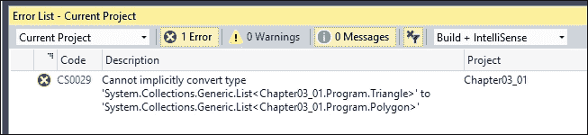

在上一个例子中，当我们使用 C# 4.0 或更高版本时，解决方案很简单：我们可以通过调用 `List` 的泛型类型转换器，只需添加一个简单的调用，将 `triangles` 赋值转换为 `List<Polygon>`：

```cs
List<Polygon> polygons = triangles.ToList<Polygon>();
```

在这种情况下，LINQ 扩展为我们提供了帮助，因为已经向集合中添加了几个转换器，以便提供这种方便的操作，这简化了以连贯方式使用对象层次结构。

### 接口中的协变

考虑以下代码，其中我们更改定义的多边形标识符为类型 `IEnumerable<Polygon>`：

```cs
IEnumerable<Polygon> polygons2 =
  new List<Triangle> {
  new Triangle(), new Triangle()};
```

这不会导致编译错误，因为相同的想法也应用于接口。为了允许这样做，接口的泛型参数，如 `IEnumerable<T>`，仅用作输出值。在这种情况下，查看定义时使用 **Peek Definition** 选项（在编辑器的上下文菜单中可用于任何类型）是很有趣的：

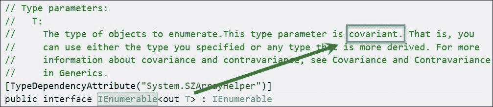

相反，`IEnumerable` 接口仅定义了 `GetEnumerator` 方法，以便返回一个遍历 `T` 类型集合的迭代机制。它仅通过 `Current` 属性返回 `T`，没有其他操作。因此，不存在以错误方式操作元素的风险。

换句话说，根据我们的例子，你无法使用类型为 `T` 的对象，在期望三角形的地方放置一个矩形，因为接口指定 `T` 只能在退出上下文中使用；它用作返回类型。

你可以在 Object Browser 中看到这个定义，要求 `IEnumerator<T>`：

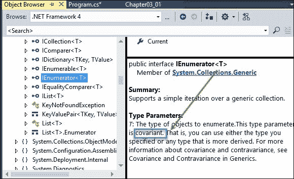

然而，当你使用另一个接口，如 `IList`，它允许用户在集合中分配后更改类型时，情况就不同了。例如，以下代码会生成编译错误：

```cs
IList<Polygon> polygons3 =
  new List<Triangle> {
  new Triangle(), new Triangle()};
```

如你所见，代码与之前相同，只是更改了用于 `polygons3` 赋值的泛型接口类型。为什么？因为 `IList` 的定义包括一个索引器，你可以用它来更改内部值，如 Object Explorer 所示。

就像任何其他索引器一样，实现提供了一种通过直接赋值来更改集合中值的方法。这意味着我们可以编写以下代码来引发类层次结构的破坏：

```cs
polygons3[1] = new Rectangle();
```

注意接口 `IList<T>` 的定义：`this[int]` 是读写，如以下捕获所示：

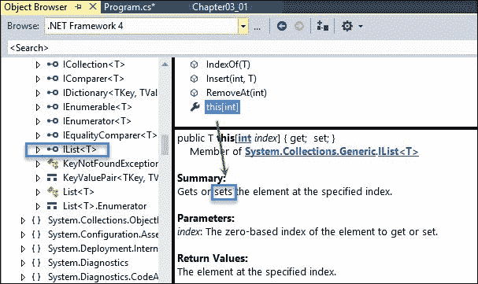

这是因为一旦创建集合中的项，就可以将其设置为另一个值，正如我们可以在前面的截图中所看到的。

值得注意的是，此 `out` 指定仅在使用接口时适用。从 `IEnumerable<T>`（或任何定义了 `out` 泛型参数的其他接口）派生的 `Types` 不必满足此要求。

此外，此协变仅在使用引用的转换语句时适用于引用类型。这就是为什么我们不能将 `IEnumerable<int>` 赋值给 `IEnumerable<object>`；这种转换意味着装箱（堆和栈都受到影响），因此它不是一个纯引用转换。

### 泛型类型中的协变

协变可以扩展到泛型类型，并与预定义的委托一起使用（记住，这些由框架工厂提供的委托可以是 `Action`、`Predicate` 和 `Func` 类型）。

要放置一个展示此功能的简单代码，请观察以下声明：

```cs
IEnumerable<Func<Polygon>> dp =
  new List<Func<Rectangle>>();
```

在这里，我们将类型为 `Rectangle` 的委托列表赋值给类型为 `Polygon` 的可枚举委托。这是可能的，因为三个特性发挥了作用：

+   根据替换原则，`Rectangle` 可以赋值给 `Polygon`。

+   由于 `Func<T>` 的泛型 `out T` 参数中的协变，`Func<Rectangle>` 可以赋值给 `Func<Polygon>`。

+   最后，由于 `IEnumerable<Func<Rectangle>>` 可以赋值给 `IEnumerable<Func<Polygon>>`，这是由于 `IEnumerable` 的泛型类型 `out T` 的协变扩展。

注意，提到的替换原则不应与某些类型（特别是原始或基本类型）的可转换性混淆。

为了说明这个特性，只需考虑以下定义：

```cs
IEnumerable<int> ints = new int[] { 1, 2, 3 };
IEnumerable<double> doubles = ints;
```

第二句话会生成编译错误，因为尽管存在从 `int` 到 `double` 的隐式转换，但这种转换被认为是协变的，因为这只适用于类型之间的继承关系，而 `int` 和 `double` 类型之间没有继承关系，因为它们都不继承自对方。

### LINQ 中的协变

协变在以下情况下也很重要，即使用 LINQ 语法定义的一些运算符。例如，这种情况出现在 `Union` 运算符中。

在之前的版本中，考虑你尝试编写如下代码：

```cs
polygons = polygons.Union(triangles);
```

如果你编写类似于前面的代码，你会得到一个编译错误，但从版本 4.0 开始就不会发生这种情况。这是因为在新定义中，运算符 `Union` 的参数使用了提到的协变，因为它们是 `IEnumerable<T>` 类型。

然而，不可能编译如下代码：

```cs
var y = triangles.Union(rectangles);
```

这是因为编译器指示没有 `Union` 的定义，最佳方法重载 `Queryable.Union<Program.Rectangle> (IQueryable<Program.Rectangle>, IEnumerable<Program.Rectangle>)` 需要一个类型为 `IQueryable<Program.Rectangle>` 的接收者，如即将显示的截图所示。

这次可以通过帮助编译器理解我们的目的来避免这种情况，通过泛型：

```cs
var y = triangles.Union<Polygon>(rectangles);
```

观察一下**错误列表**窗口如何描述错误，它从适当的源代码元素及其定义和能力方面进行解释（见以下截图）：

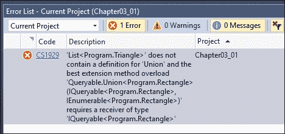

### 逆变

逆变的情况不同，通常理解起来也稍微困难一些。为了通过一个已知的例子来理解事物，让我们回忆一下我们在上一章中使用的`IComparer<T>`接口。

我们使用`IComparer<T>`的实现来无区别地比较`Customer`和`Provider`类型的集合：

```cs
public class GenericComparer : IComparer<IPersonBalance>
{
  public int Compare(IPersonBalance x, IPersonBalance y)
  {
    if (x.Balance < y.Balance) { return -1; }
    else if (x.Balance > y.Balance) return 1;
    else { return 0; }
  }
}
```

这样，只要`Customer`和`Provider`类实现了`IPersonBalance`接口，我们就可以比较这两种类型。

在语言之前的（到 C# 4.0）版本中，考虑一下你尝试使用类似的代码来比较多边形和三角形的情况，如下所示：

```cs
// Contravariance
IComparer<Polygon> polygonComparer = new
  ComparePolygons();
triangles = triangles.Sort(polygonComparer);
```

你将得到一个错误提示，通常是这样的：`Triangle`和`Polygon`之间没有转换，而实际上接收这些类型真的没有风险；它们只会被用来比较实体。

在这种情况下，继承箭头是倒置的——从具体到泛型——并且由于两者都是`Polygon`类型，比较应该是可能的。

从 C# 4.0 版本开始，这发生了变化。`IComparer`接口的新定义为`T`操作符定义了另一个`in`修饰符，当你在声明上右键单击时使用**预览定义**功能：

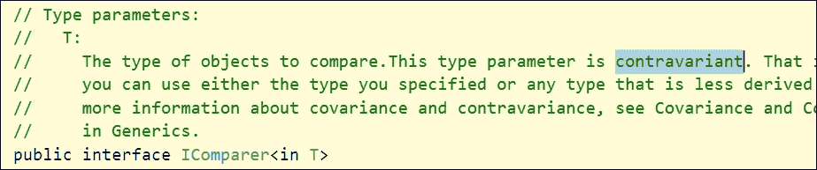

如您所见，定义表明参数`T`是逆变的：您可以使用指定的类型或任何更少派生的类型，即继承链中的任何祖先类型。

在这种情况下，`in`修饰符指定了这个可能性，并指示编译器类型`T`只能用于入口上下文，如这里发生的情况，因为`T`的目的就是指定入口参数`x`和`y`的类型。

## 元组：一个回忆

从很早的时候起，编程语言就试图表达元组的概念，首先体现在 COBOL 语言中。后来，Pascal 通过记录的概念跟进：一种特殊的数据结构，与数组不同，它收集不同性质的数据类型，以便定义特定的结构，例如客户或产品。

让我们记住，C 语言本身在 C++的发展过程中提供了结构（structs），这些结构被增强为对象。通常，这个结构的每个字段都代表整体的一个特征，因此通过一个有意义的描述来访问其值比使用其位置（如数组中那样）更有意义。

这个想法也与数据库的关系模型相关，因此特别适合表示这些实体。使用对象，可以添加功能来重新创建需要在应用程序中表示的真实对象属性片段：对象模型。

然后，为了提高可重用性和适应性，面向对象编程开始推广对象，以隐藏其状态的一部分（或全部状态）作为保持其内部一致性的手段。一位在知名大学开设面向对象编程课程的理论家说：“类的方法应该只具有维护其自身状态内部逻辑的目的”，我不记得这位理论家的名字。我们可以承认，除了例外情况，这个说法是正确的。

如果状态的一部分可以被抽象化（用数学术语来说，可以说它们构成一个模式），那么它们就是更高类（抽象或不抽象）的候选者，因此可重用性从这些共同因素开始。

在这个演变过程中，元组的概念在某种程度上丢失了，所有的土地都让给了对象的概念，编程语言（除了一些值得注意的例外，主要在函数式语言领域）不再有它们自己的符号来处理元组。

然而，实践表明，并非所有与数据相关的工作都需要使用统一的对象。也许最明显的情况出现在从数据库查询数据时——正如我们在 LINQ 查询中看到的那样。一旦过滤后的数据满足某些要求，我们只需要一些组件（这在数据库术语中被称为投影，正如我们在前面的例子中所测试的那样）。

这些投影不过是匿名对象，它们不值得预先定义，因为它们通常在单个过程中处理。

## 元组：C#中的实现

.NET 4 中元组的实现基于八个泛型类`Tuple<>`的定义（`mscorlib.dll`程序集和`System`命名空间），这些类具有不同数量的类型参数，用于表示不同基数（也称为 arity）的元组。

作为这个泛型类家族的补充，`Tuple`类提供了`Create`方法的八个重载，将其转换为一个多种可能变体的工厂。为了提供创建更长的元组所需资源，列表中的第八个元组本身也可以是一个元组，允许它按需增长。

以下代码显示了这些方法之一的具体实现。因此，为了创建元组，我们可以利用更简洁的表示法，并编写如下：

```cs
Tuple.Create(1, 2, 3, 4, 5);
```

我们将发现 Visual Studio 的 Intellisense 系统如何警告我们关于由这种声明生成的结构，以及它是如何被编辑器解释的：

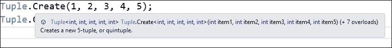

因此，我们可以用这种方式简单地表达，而不是使用以下更明确的代码：

```cs
new Tuple<int,int,int,int,int>(1, 2, 3, 4, 5);
```

由于元组可以持有任何类型的元素，因此声明一个多种类型的元组是完全可以的：

```cs
Tuple.Create("Hello", DateTime.Today, 99, 3.3);
```

这类似于我们定义对象状态元素时所做的，我们可以确信编译器将推断出其不同的类型，如下面的屏幕截图所示：

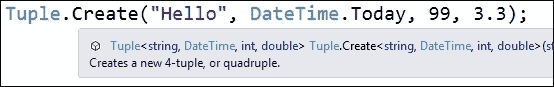

当与数据库表中典型的记录进行比较时，这种用法变得明显，因为它能够垂直选择我们需要的成员（字段，如果你愿意），我们将看到比较元组与匿名类型的一个示例。

## 元组：支持结构相等性

使用 .NET 的元组类（因此，它们的主体通过引用处理），使用 `==` 操作符比较两个元组是引用性的；也就是说，它依赖于比较对象所在的内存地址；因此，即使它们存储了相同的数据，也会返回 `false`。

然而，`Equals` 方法已被重新定义，以便根据比较每一对对应元素的值（所谓的结构相等性）来建立相等性，这在大多数元组应用中是期望的，并且在 F# 语言中比较元组相等性的默认语义也是这样的。

注意，元组的结构相等性实现有其特殊性，首先是从具有元组第八成员的元组必须以递归方式访问的事实开始。

## 元组与匿名类型

对于投影的情况，元组适应得很好，并允许我们摆脱匿名类型。想象一下，我们想要列出给定 `Customers` 表的三个字段（比如说，从可能的数十个字段中选择它们的 `Code`、`Name` 和 `Balance` 字段），并且我们需要通过它们的 `City` 字段进行过滤。

如果我们假设我们有一个名为 `Customers` 的客户集合，以这种方式编写方法更容易：

```cs
static IEnumerable<Tuple<int, string, double>> CustBalance(string city)
{
  var result =
    from c in Customers
    where c.City == city
    orderby c.Code, c.Balance
    select Tuple.Create(c.Code, c.Name, c.Balance);
  return result;
}
```

因此，该方法返回 `IEnumerable<Tuple<int, string, double>>`，我们可以在需要时引用它，并从 Intellisense 引擎获得额外支持，这使得迭代和输出非常容易。

为了测试这个功能，我从网站（[`random-name-generator.info/`](http://random-name-generator.info/)）生成了一份随机名称列表，命名为 `ListOfNames.txt`，以便有一个随机客户名称列表，并且我用随机值填充了其余字段，以便我们有一个基于以下类的客户列表：

```cs
public class Customer
{
  public int Code { get; set; }
  public string Name { get; set; }
  public string City { get; set; }
  public double Balance { get; set; }

  public List<Customer> getCustomers()
  {
    string[] names = File.ReadAllLines("ListOfNames.txt");
    string[] cities = { "New York", "Los Angeles", "Chicago", "New Orleans" };
    int totalCustomers = names.Length;
    List<Customer> list = new List<Customer>();
    Random r = new Random(DateTime.Now.Millisecond);
    for (int i = 1; i < totalCustomers; i++)
    {
      list.Add(new Customer()
      {
        Code = i,
        Balance = r.Next(0, 10000),
        Name = names[r.Next(1, 50)],
        City = cities[r.Next(1, 4)]
      });
    }
    return list;
  }
}
```

### 注意

除了之前提到的那些，你可以在互联网上找到相当多的随机名称生成器。你只需配置它们（它们允许一定程度的调整）并将结果保存到 Visual Studio 中的文本文件中。只是记住，复制粘贴操作很可能会包含制表符代码（`\t`）分隔符。

在包含入口点的 `TuplesDemo` 类中，定义了以下代码：

```cs
static List<Customer> Customers;
static IEnumerable<Tuple<int, string, double>> Balances;
static void Main()
{
  Customers = new Customer().getCustomers();
  Balances = CustBalance("Chicago");
  Printout();
  Console.ReadLine();
}

static void Printout()
{
  string formatString = " Code: {0,-6} Name: {1,-20} Balance: {2,10:C2}";
  Console.WriteLine(" Balance: Customers from Chicago");
  Console.WriteLine((" ").PadRight(32, '-'));
  foreach (var f in Balances)
    Console.WriteLine(formatString, f.Item1, f.Item2, f.Item3);
}
```

使用这种结构，一切正常，我们不需要使用匿名对象，正如我们在控制台输出中看到的那样：

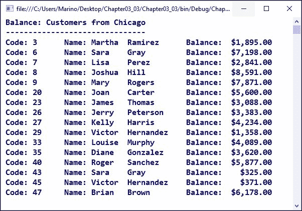

唯一的不完美之处在于我们引用`Balance`成员的方式，因为它们失去了类型名称，所以我们不得不通过标识符`Item1`、`Item2`等来引用它们（在 C# 7 版本中已经得到了改进，元组的成员可以具有标识符）。

即使如此，这相对于之前的方法仍然是一个优点，并且我们对 LINQ 查询生成的成员有了更多的控制。

## 懒加载和实例化

为了完成对 C# 4.0 中出现的重要功能的回顾，我想介绍一种新的对象实例化方式，称为懒加载。官方文档定义了懒对象和对象的懒初始化，指出其创建被延迟到首次使用时。注意，这里两个术语是同义的：初始化和实例化。

这提醒我们，*懒加载主要用于提高性能、避免浪费的计算和减少程序内存需求*。通常，这发生在您有一个需要一些时间来创建的对象（如连接）或由于任何原因可能会产生瓶颈的情况。

与通常创建对象的方式不同，.NET 4.0 引入了`Lazy<T>`，它有效地延迟了创建，从而允许明显的性能提升，我们将在以下演示中看到。

让我们使用之前的代码，但这次，我们通过添加一个懒加载版本的它来加倍创建客户的方法。为了更准确地证明这一点，我们在`Customer`类的构造函数中引入了延迟，所以它最终看起来是这样的：

```cs
public class Customer
{
  public int Code { get; set; }
  public string Name { get; set; }
  public string City { get; set; }
  public double Balance { get; set; }
  public Customer()
  {
    // We force a delay for testing purposes
    Thread.Sleep(100);
  }
  public List<Customer> getCustomers()
  {
    string[] names = File.ReadAllLines("ListOfNames.txt");
    string[] cities = { "New York", "Los Angeles", "Chicago", "New Orleans" };
    int totalCustomers = names.Length;
    List<Customer> list = new List<Customer>();
    Random r = new Random(DateTime.Now.Millisecond);
    for (int i = 1; i < totalCustomers; i++)
    {
      list.Add(new Customer()
      {
        Code = i,
        Balance = r.Next(0, 10000),
        Name = names[r.Next(1, 50)],
        City = cities[r.Next(1, 4)]
      });
    }
    return list;
  }

  public List<Lazy<Customer>> getCustomersLazy()
  {
    string[] names = File.ReadAllLines("ListOfNames.txt");
    string[] cities = { "New York", "Los Angeles", "Chicago", "New Orleans" };
    int totalCustomers = names.Length;
    List<Lazy<Customer>> list = new List<Lazy<Customer>>();
    Random r = new Random(DateTime.Now.Millisecond);
    for (int i = 1; i < totalCustomers; i++)
    {
      list.Add(new Lazy<Customer>(() => new Customer()
      {
        Code = i,
        Balance = r.Next(0, 10000),
        Name = names[r.Next(1, 50)],
        City = cities[r.Next(1, 4)]
      }));
    }
    return list;
  }
}
```

注意两个主要差异：首先，构造函数强制每个调用延迟十分之一秒。其次，创建`Customer`列表的新方法（`getCustomersLazy`）被声明为`List<Lazy<Customer>>`。此外，每个对构造函数的调用都来自与`Lazy<Customer>`构造函数关联的 lambda 表达式。

在`Main`方法中，这次，我们不需要展示结果；我们只需要展示使用两种方法创建`Customers`所花费的时间。因此，我们按照以下方式修改了它：

```cs
static List<Customer> Customers;
static List<Lazy<Customer>> CustomersLazy;
static void Main()
{
  Stopwatch watchLazy = Stopwatch.StartNew();
  CustomersLazy = new Customer().getCustomersLazy();
  watchLazy.Stop();
  Console.WriteLine(" Generation of Customers (Lazy Version)");
  Console.WriteLine((" ").PadRight(42, '-'));
  Console.WriteLine(" Total time (milliseconds): " +
    watchLazy.Elapsed.TotalMilliseconds);
  Console.WriteLine();

  Console.WriteLine(" Generation of Customers (non-lazy)");
  Console.WriteLine((" ").PadRight(42, '-'));
  Stopwatch watch = Stopwatch.StartNew();
  Customers = new Customer().getCustomers();
  watch.Stop();
  Console.WriteLine("Total time (milliseconds): " +
  watch.Elapsed.TotalMilliseconds);
  Console.ReadLine();
}
```

通过这些更改，相同的类被调用，相同的句子也被用于创建，只是在第一次创建过程中改为懒加载。顺便说一句，您可以更改创建的顺序（首先调用非懒加载例程）并检查性能是否没有实质性变化：懒加载结构几乎立即执行（几乎没有超过 100 毫秒，这是在`Customer`的初始创建中由`Thread.Sleep(100)`强制的时间）。

如您在以下屏幕截图中所见，这种差异可能是显著的：

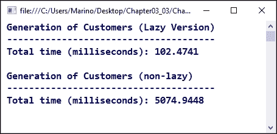

因此，当延迟对象的创建可以在数据初始展示时产生很大的时间差异时，框架 4.0 版本中出现的新颖且有用的解决方案变得特别有趣。

## 动态规划

程序员最请求的功能之一是能够在没有静态类型强加的限制下创建和操作对象，因为有许多日常情况中这种可能性提供了很多有用的选项。

然而，我们不要将 C# 4.0 提供的动态特性与计算机科学中的一般动态规划概念混淆，其中定义指的是将问题分解为更小的问题，并寻求每个这些情况的最佳解决方案，程序能够在稍后时间访问这些较小的解决方案以获得最佳性能。

然而，在.NET Framework 的背景下，C# 4.0 引入了一系列与新的命名空间（`System.Dynamic`）和新的保留字`dynamic`相关的特性，这允许声明摆脱了我们迄今为止所见的类型检查功能的元素。

## 动态类型

使用`dynamic`关键字，我们可以声明在编译时未经检查但在运行时可以解决的变量。例如，我们可以写出以下声明而不会出现任何问题（在撰写本文时）：

```cs
dynamic o = GetUnknownObject();
o.UnknownMethod();
```

在此代码中，`o`被声明为静态的动态类型，这是编译器支持的一种类型。即使不知道`UnknownMethod`的含义或它在执行时是否存在，此代码也能编译。如果方法不存在，将抛出异常。具体来说，由于过程的动态绑定特性，会出现`Microsoft.CSharp.RuntimeBinder.RuntimeBinderException`异常，正如我们在拼写字符串中的`ToUpper()`方法调用时看到的那样（我们稍后会解释代码片段）：

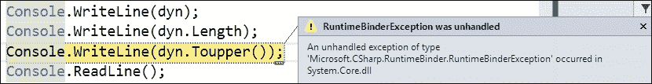

当这种声明出现时，与之前声明的差异引起了一些混淆，如下所示：

```cs
object p = ReturnObjectType();
((T)p).UnknownMethod();
```

这里的不同之处在于我们必须事先知道存在一个类型`T`，并且它有一个名为`UnknownMethod`的方法。在这种情况下，类型转换操作确保生成 IL 代码以保证`p`引用符合`T`类型。

在第一种情况下，编译器无法生成调用`UnknownMethod`的代码，因为它甚至不知道是否存在这样的方法。相反，它生成一个动态调用，这将由另一个新的执行引擎处理，称为**动态语言运行时**（**DLR**）。

DLR（动态语言运行时）的作用之一也是推断相应的类型，并从那时起相应地处理动态对象：

```cs
dynamic dyn = "This is a dynamic declared string";
Console.WriteLine(dyn.GetType());
Console.WriteLine(dyn);
Console.WriteLine(dyn.Length);
Console.WriteLine(dyn.ToUpper());
```

因此，这意味着我们不仅可以使用`dyn`的值，还可以像前面的代码所示，使用其属性和方法，以预期的行为表现，并显示`dyn`是一个类型字符串对象，并在控制台中展示结果，就像我们一开始就声明了`dyn`为`string`一样：

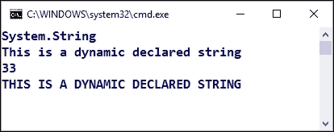

也许你还记得我们在第一章中提到的反射特性，*CLR 内部*，并且想知道为什么我们需要它，因为许多以这种方式可用的特性也可以通过反射编程来管理。

为了进行比较，让我们快速回顾一下这种可能性会是什么样子（比如说我们想要读取`Length`属性）：

```cs
dynamic dyn = "This is a dynamic declared string";
Type t = dyn.GetType();
PropertyInfo prop = t.GetProperty("Length");
int stringLength = prop.GetValue(dyn, new object[] { });
Console.WriteLine(dyn);
Console.WriteLine(stringLength);
```

对于这种场景，我们得到了我们预期的相同输出，并且从技术上讲，性能损失是可以忽略不计的：


看起来这两个结果是一样的，尽管我们得到它们的方式完全不同。然而，除了反射技术中涉及到的样板代码之外，DLR（动态语言运行时）更高效，我们还有可能个性化动态调用。

对于有经验的静态类型程序员来说，这可能会显得有些矛盾：我们失去了与之关联的 Intellisense，动态关键字迫使编辑器背后的理解，伴随此类类型的方法和属性也将以动态的方式呈现。请参考下一张截图所示的提示信息：

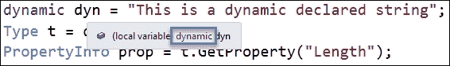

这种特性的部分灵活性来自于任何引用类型都可以转换为动态类型，并且这可以通过（通过装箱）与任何值类型一起完成。

然而，一旦我们确定我们的动态对象为某种类型（例如，在本例中的`String`），动态性就到此为止。我的意思是，你不能使用除`String`类定义中可用的资源之外的其他类型的资源。

## `ExpandoObject`对象

与这种语言的动态特性相关联的添加之一是称为`ExpandoObject`的东西，正如你可能从其名称中推测出的那样——它允许你使用任何类型和任何数量的属性来扩展一个对象，让编译器保持安静，并以类似在真实动态语言（如 JavaScript）中编码的方式表现。

让我们看看如何使用这些`ExpandoObject`对象之一来创建一个以完全动态的方式增长的对象：

```cs
// Expando objects allow dynamic creation of properties
dynamic oex = new ExpandoObject();
oex.integerProp = 7;
oex.stringProp = "And this is the string property";
oex.datetimeProp = new ExpandoObject();
oex.datetimeProp.dayOfWeek = DateTime.Today.DayOfWeek;
oex.datetimeProp.time = DateTime.Now.TimeOfDay;
Console.WriteLine("Int: {0}", oex.integerProp);
Console.WriteLine("String: {0}", oex.stringProp);
Console.WriteLine("Day of Week: {0}", oex.datetimeProp.dayOfWeek);
Console.WriteLine("Time: {0}", oex.datetimeProp.time);
```

如前述代码所示，我们不仅可以扩展对象以包含我们想要的类型的新属性；我们甚至可以在对象内部嵌套其他对象。正如这个截图在控制台输出中所示，在运行时没有问题：

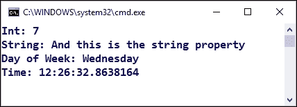

实际上，这些动态特性可以与我们已经看到的其他泛型特性结合使用，因为在此上下文中也允许声明泛型动态对象。

为了证明这一点，我们可以创建一个方法，该方法构建包含有关 Packt Publishing 书籍信息的`ExpandoObjects`：

```cs
public static dynamic CreateBookObject(dynamic title, dynamic pages)
{
  dynamic book = new ExpandoObject();
  book.Title = title;
  book.Pages = pages;
  return book;
}
```

注意，一切都是动态声明的：方法本身以及传递给它的参数。稍后，我们可以使用泛型集合与这些对象一起使用，如下面的代码所示：

```cs
var listOfBooks = new List<dynamic>();
var book1 = CreateBookObject("Mastering C# and .NET Programming", 500);
var book2 = CreateBookObject("Practical Machine Learning", 468);
listOfBooks.Add(book1);
listOfBooks.Add(book2);
var bookWith500Pages = listOfBooks.Find(b => b.Pages == 500);
Console.WriteLine("Packt Pub. Books with 500 pages: {0}",
  bookWith500Pages.Title);
Console.ReadLine();
```

一切都按预期工作。内部，`ExpandoObject`表现得像`Dictionary<string, object>`，其中动态添加的字段名称是键（类型为`String`），值是任何类型的对象。因此，在前面的代码中，`List`集合的`Find`方法工作正常，找到我们正在寻找的对象，并检索标题以在控制台显示：

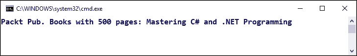

还有一些其他的动态特性，但我们将在这本关于互操作性的章节中处理其中的一些，我们将探讨 C#应用程序与其他操作系统中的应用程序之间的交互可能性，包括 Office 应用程序以及通常所说的任何实现了并公开了类型库的其他应用程序。

## 可选和命名参数

很久以前，程序员就要求声明可选参数，特别是考虑到这是一个从 Visual Basic .NET 开始就存在的特性。

红 mond 团队实现这种方式很简单：只要将参数定位在参数列表的末尾，就可以定义与参数关联的常量值。因此，我们可以以这种方式定义这些方法之一：

```cs
static void RepeatStringOptional(int x, string text = "Message")
{
  for (int i = 0; i < x; i++)
  {
    Console.WriteLine("String no {0}: {1}", i, text);
  }
}
```

因此，可选参数的特点是赋予一个初始值。这样，如果只传递一个参数调用`RepeatStringOptional`方法，`text`参数将使用传递的值初始化，因此它永远不会为 null。IDE 本身在编写方法调用时提醒我们这种情况。

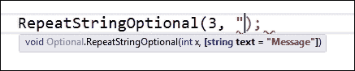

记住，按照惯例，在计算机科学定义中，任何括在方括号内的元素都被认为是可选的。

作为之前特性的变体，我们还可以使用`function_name (name: arg)`语法模式提供一个带有名称的参数。遵循相同的可选参数结构模式；也就是说，如果我们向函数传递一个命名参数，它必须放在任何其他位置参数之后，尽管在命名参数部分它们的相对顺序并不重要。

## Task 对象和异步调用

虽然这不是语言本身的一部分，但本章中值得提及的一个**基类库**（**BCL**）功能是，它是框架本版本中最重要的创新之一。直到这一点，构建和执行线程主要涉及两种形式：使用`System.Thread`命名空间提供的对象（自框架版本 1.0 以来可用）和从版本 3.0 开始，使用`BackgroundWorker`对象，它是`System.Thread`中可用功能的一个包装，以简化这些对象的创建。

后者主要用于长时间运行的过程，在执行过程中需要反馈（进度条等）。这是第一次尝试简化线程编程，但自从新的`Task`对象出现以来，大多数这些场景（以及许多其他涉及并行或线程运行过程的情况）主要是以这种方式编写的。

它的使用很简单（尤其是与之前的选项相比）。您可以使用`Action`委托将`Task`非泛型对象与任何方法关联起来，正如 IDE 在通过调用其构造函数创建新任务时建议的那样：

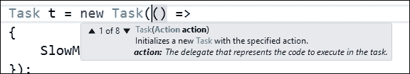

因此，如果我们有一个慢速方法，并且我们没有对返回类型有特殊要求（因此它可以是非泛型的），我们可以通过编写以下代码在单独的线程中调用它：

```cs
public static string theString = "";
static void Main(string[] args)
{
  Task t = new Task(() =>
  {
    SlowMethod(ref theString);
  });
  t.Start();
  Console.WriteLine("Waiting for SlowMethod to finish...");
  t.Wait();
  Console.WriteLine("Finished at: {0}",theString);
}

static void SlowMethod(ref string value)
{
  System.Threading.Thread.Sleep(3000);
  value = DateTime.Now.ToLongTimeString();
}
```

注意以下代码中的几个细节：首先，参数是通过引用传递的。这意味着`theString`的值会被`SlowMethod`改变，但由于该方法应该符合`Action`的签名（没有返回类型），因此没有提供返回类型；因此，为了访问修改后的值，我们需要通过引用传递，并在我们的`SlowMethod`代码中包含如何修改它的方法。

另一个主要点是，我们需要等待`SlowMethod`完成后再尝试访问`theString`（注意，方法通过调用`Thread.Sleep(3000)`被强制执行 3 秒钟以完成。否则，执行将继续，访问的值将是原始的空字符串。在此期间，可以执行其他操作，例如在控制台打印消息。

当我们需要`Task`与给定类型一起操作时，也提供了该对象的泛型变体。只要我们定义一个`Task<T>`类型的变量，IDE 就会更改工具提示以提醒我们，在这种情况下，应该提供`Func<T>`类型的委托而不是`Action`，正如情况所示。您可以比较此截图与之前的截图：

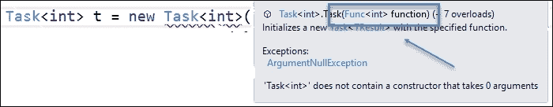

然而，在下面的代码中，我们采用了更常见的通过调用`Task<T>`的`Factory`对象中可用的`StartNew<T>`方法来创建泛型`Task`对象的方法，这样我们就可以以这种方式简化前面的示例：

```cs
static void Main(string[] args)
{
  Task<string> t = Task.Factory.StartNew<string>(
    () => SlowMethod());
  Console.WriteLine("Waiting for SlowMethod to finish...");
  t.Wait();
  Console.WriteLine("Finished at: {0}", t.Result);
  Console.ReadLine();
}
static string SlowMethod()
{
  System.Threading.Thread.Sleep(3000);
  return DateTime.Now.ToLongTimeString();
}
```

如您所见，这次我们不需要一个中间变量来存储返回值，`Task<T>`定义允许您创建几乎任何类型的`Task`对象。

关于任务和相关功能（如并行执行、异步调用等）的内容还有很多，所以我们将更深入地探讨所有这些内容，在第十二章，*性能*中，我们专门讨论性能和优化，所以把这当作对这个主题的非常简短的介绍。

# C# 5.0: async/await 声明

为了增强创建和管理异步过程的可能性，并进一步简化代码，C# 5.0 版本引入了几个新的保留字，以便在不实现额外方法接收结果的情况下插入异步调用：这两个词是`async`/`await`（一个不能没有另一个使用）。

当一个方法被标记为`async`时，编译器会检查是否存在另一个以`await`关键字为前缀的句子。虽然我们整体编写方法，但编译器（内部）将方法分成两部分：`async`关键字首次出现的地方，以及从使用`await`的行开始的其余部分。

在执行时，一旦找到`await`语句，执行流程就会返回到调用方法并执行后续的语句（如果有）。一旦慢速过程返回，执行将继续进行到等待语句旁边的其余语句。

我们可以简要地查看一下它如何在前一个示例的转换中工作（正如我在与任务相关的内容中提到的，这个主题将在专门讨论性能的章节中更详细地介绍）：

```cs
static void Main(string[] args)
{
  Console.WriteLine("SlowMethod started at...{0}",
    DateTime.Now.ToLongTimeString());
  SlowMethod();
  Console.WriteLine("Awaiting for SlowMethod...");
  Console.ReadLine();
}
static async Task SlowMethod()
{
  // Simulation of slow method "Sleeping" the thread for 3 secs.
  await Task.Run(new Action(() => System.Threading.Thread.Sleep(3000)));
  Console.WriteLine("Finished at: {0}", DateTime.Now.ToLongTimeString());
  return;
}
```

注意，我只是在不同的语法下写相同的代码。当执行流程到达`SlowMethod`（标记为`await`）的第一行时，它启动另一个执行线程并返回到调用方法（`Main`）的线程。因此，我们可以在`Finished at`指示符之前看到`Awaiting for SlowMethod`消息。

输出非常清晰，如下面的屏幕截图所示：

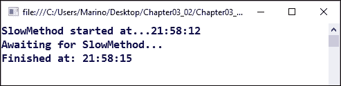

当然，正如我们在与`Task`对象相关的内容中指出的，这里所表达的内容远不止这些，我们将在第十章，*设计模式*中详细讨论这一点。但到目前为止，我们可以了解这种代码结构提供的优势和简化。

# C# 6.0 的新特性

在这个语言版本中出现了许多相当有趣的功能，在许多情况下，这些功能与日常问题和全球开发者的建议相关联。此外，正如本章表 1 中所述，真正巨大、有意义的改进来自于与 Roslyn 服务相关的一系列功能，这些功能为 IDE 的编辑和编译功能提供了一组不同的可能性。我们将在第八章开源编程中介绍这些内容。

然而，Roselyn 并不是 C# 6.0 中出现的唯一有趣选项。这个版本包括了许多小但非常有用且语法上的“甜点”，这些“甜点”有助于程序员编写更简洁的表达式并减少错误的发生。让我们从一个叫做字符串插值的东西开始。

## 字符串插值

字符串插值是一种简化包含 C/C++ 风格插值的字符串表达式的途径。例如，我们不再需要编写经典的 `Console.Write("string {0}", data)` 组合，现在我们可以通过简单地包括标识符在花括号内来表示这一点，因此前面的表达式将变为 `$"string {data}"`，前提是我们用 `$` 符号在字符串前导，以便使其生效。

注意，我们可以将 `@` 符号与 `$` 符号混合使用，因为 `$` 符号在 `@` 符号之前。

此外，您可以使用 `{}` 区域包含一个将在运行时正确评估并由调用 `ToString` 方法转换为字符串的 C# 表达式，这样它就不限于标识符。因此，我们甚至可以包括文件 I/O 操作——就像我们在以下代码中所做的那样——并获得结果。

为了测试这个，我有一个包含一行内容的文本文件（`TextFile.txt`），该内容在输出中由单行代码中的字符串字面量伴随展示：

```cs
Console.WriteLine($"File contents: {File.ReadAllText("TextFile.txt")}");
Console.ReadLine();
```

正如您在下图中可以看到的，花括号内的表达式将被完全评估，并将结果插入到输出字符串中：


这种技术除了简化表达式外，还可以轻松地与其他新的 C# 6.0 功能结合使用，例如异常过滤器。

## 异常过滤器

另一个新增功能是关于异常的。异常过滤器提供了一种根据可以使用任何有效 C# 表达式编写的条件来个性化任何发生的异常的方法，该表达式应位于现在可能跟随任何 `Catch` 子句的新 `when` 子句旁边。

在前面的代码中，假设我们想要为不与异常本身有很大关系的异常创建一个条件测试（或者也许它确实有关系，但这里不是这种情况）。或者，我们甚至可以假设我们想要捕捉与外部状态相关的某种情况，比如系统的日期/时间等。

以下代码捕捉到一种情况，即前一个文件存在，但在周六会产生异常，以表达一些奇怪的事情。我们可以这样修改代码：

```cs
string filename = "TextFile.txt";
try
{
  Console.WriteLine($"File contents: {File.ReadAllText(filename)}");
  Console.ReadLine();
}
catch when (File.Exists(filename) && 
  DateTime.Today.DayOfWeek == DayOfWeek.Saturday)
{
  Console.WriteLine("File content unreadable on Saturdays");
}
catch (Exception ex)
{
  Console.WriteLine($"I/O Exception generated:{ex.Message}");
}
```

这种可能性为我们提供了捕捉与不属于（必然）异常上下文但属于任何其他情况的异常的新方法；只需考虑表达式可能比演示代码中的表达式复杂得多。

## nameof 运算符

nameof 运算符是一个上下文关键字，其语法类似于 typeof，它返回任何程序元素（通常是标识符）的名称。或者，如果你愿意，它可以将上一个示例中的文件名变量转换为 filename。

这种方法提供了几个优点。首先，如果我们需要此类元素的名称，不需要反射技术。此外，编译器将保证我们传递给运算符的任何参数都是有效的元素；它还与编辑器的 Intellisense 集成，并在某些重构场景中表现更好。

它在 try-catch 结构中也很有用，例如，当指示失败的原因时指定导致异常的元素名称，甚至在属性中，正如 MSDN 的“官方”示例所建议的（参考[`msdn.microsoft.com/en-us/library/dn986596.aspx`](https://msdn.microsoft.com/en-us/library/dn986596.aspx)）：

```cs
[DebuggerDisplay("={" + nameof(GetString) + "()}")]
class C
{
  string GetString() { return "Hello"; }
}
```

## 空条件运算符

此运算符是 C#中处理 null 值的功能家族的最新成员。从 1.0 版本开始，我们当然可以在条件语句中检查（`value == null`），以避免不希望发生的失败。

后来，出现了`Nullable`类型（记住，在变量声明后附加一个?符号允许它为 null，并且这些类型包括一个布尔`HasValue`属性来检查这种情况）：

```cs
int? x = 8;
x.HasValue // == true if x != null
```

当需要转换时，许多基本类型的`TryParse`方法允许我们检查有效值（不仅仅是 null）。

随着语言的发展，处理 null 值的新方法不断涌现。在 C# 4.0 中，最有用的功能之一是空合并运算符。它的工作方式有点像?运算符：它位于两个元素之间以检查 null 性，如果左侧不是 null，则返回它；否则，返回右侧操作数。它如此简单，甚至允许你以这种方式与字符串插值混合：

```cs
string str = null;
Console.WriteLine(str ?? "Unspecified");
Console.WriteLine($"str value: { str  ?? "Unspecified"}");
```

我们在控制台得到了预期的结果：

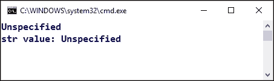

因此，之前的代码在控制台输出`Unspecified`，因为`str`是 null。

现在在 C# 6.0 中，我们有了另一种能力：空条件运算符，或 null 传播运算符（或者，甚至被称为`Elvis`运算符，因为 C#团队的一些成员这样称呼它，假设两个下点是一对眼睛，问号的上方部分是假发！），它可以在表达式中插入，如果带有运算符的装饰元素值不存在，它将停止评估表达式的右侧。让我们通过一个表达式更好地理解这一点：

如果我们想在之前的案例中打印出`str`字符串的长度，我们可以简单地添加另一个控制台语句，例如`Console.WriteLine(str.Length.ToString());`。问题是，当尝试访问`str`的`Length`属性时，它将引发异常。

为了解决这个问题，我们可以非常简单地使用这个操作符：

```cs
Console.WriteLine(str?.Length.ToString());
```

通过包含空条件`?`操作符，甚至不会访问`Length`属性，因此不会抛出异常，我们将得到预期的输出（在这种情况下是一个空字符串）。

让我们把所有内容都放在一个代码块中，以便比较空字符串和非空字符串的不同行为：

```cs
// Case 2
string str = null;
string str2 = "string";
Console.WriteLine(str ?? "Unspecified");
Console.WriteLine(str2 ?? "Unspecified");
Console.WriteLine($"str value: { str ?? "Unspecified"}");
Console.WriteLine($"str2 value: { str2 ?? "Unspecified"}");
Console.WriteLine($"str Length: {str?.Length}");
Console.WriteLine($"str2 Length: {str2?.Length}");
Console.ReadLine();
```

此代码编译没有问题，并生成以下输出：

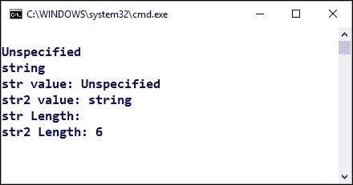

观察第五项：没有显示值，因为没有对`str`的`Length`进行评估。有许多情况下这正是我们需要的操作符：它可能是检查在调用之前为 null 的委托，或者是在任何常见的`ToString`调用之前插入它。

## 自动属性初始化器

自动属性初始化器是另一个改进，有助于管理不可变属性（那些一旦赋予值，在应用程序的生命周期中不会改变的属性）。

在之前的版本中，声明只读属性有点多余。你必须声明只读的备份私有字段，并负责其初始化，然后，提供该属性的显式实现（而不是使用常见的自动属性）。最后，为了访问值，包括一个属性获取成员。这是良好实践推荐你创建此类特定类型数据的方式。

这也是为什么自动属性如此方便的原因。例如，如果我们的应用程序捕获了机器上安装的当前用户名和操作系统版本，它可以通过一对只读属性来表示。以下方式足以表明这一点：

```cs
public static string User { get; } = Environment.UserName;
public static string OpSystem { get; } = Environment.OSVersion.VersionString;
static void Main()
{
  Console.WriteLine($"Current {nameof(User)}: {User}");
  Console.WriteLine($"Version of Windows: : {OpSystem}");
}
```

因此，我们使用更简洁的语法来表达相同的概念，并得到与经典方法相同的结果：

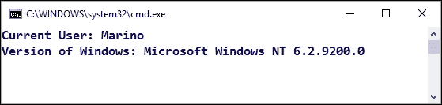

## 静态 using 声明

另一种简化语法的方法是基于在代码中扩展指令的想法，使它们能够引用.NET Framework 的静态成员，并以与我们使用`using`指令中提到的其他声明相同的方式使用它们。

也就是说，我们可以包含如下声明：

```cs
using static System.Math;
```

从这一点开始，对`Math`类成员的任何引用都可以直接进行，无需指明它所属的命名空间（以及静态类）：

```cs
// Static reference of types
Console.WriteLine($"The square root of 9 is {Sqrt(9)}");
```

注意，我们在整个演示中使用了字符串插值，因为它允许的简化非常实用，特别是对于这些控制台类型的片段（在这种情况下，我省略了输出，你可以自己想出来...）。

此外，还有一个典型的场景，其中这种功能很重要：当我们使用`Enum`成员时。大多数时候，我们已经知道可能的值，所以如果我们指示一个典型的`Enum`，比如一周中的某一天，我们可以将相应的`Enum`类型作为静态的：

```cs
using static System.DayOfWeek;
```

然后，就像之前一样使用它（记住，.NET 中`Enum`类型数量相当庞大）：

```cs
Console.WriteLine($"Today is {Friday}");
```

我们甚至使事物更加通用，使用了之前看到的`nameof`运算符：

```cs
DayOfWeek today = DateTime.Today.DayOfWeek;
Console.WriteLine($"{nameof(today)} is {today}");
```

因此，我们仍然会得到预期的输出，尽管以更通用的方式表达：

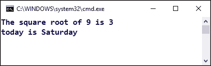

由于演示是一个控制台应用程序，甚至控制台也可以以这种方式引用；所以，假设我们想要改变控制台输出的颜色，而不是编写如下内容：

```cs
ConsoleColor backcolor = ConsoleColor.Blue;
ConsoleColor forecolor = ConsoleColor.White;
Console.BackgroundColor = backcolor;
Console.ForegroundColor = forecolor;
```

我们可以用一种更简单的方式将这些内容整合在一起（当然，一些开发者可能会争论说这是一个语法品味的问题）。在代码的顶部，我们声明以下内容：

```cs
using static System.Console;
using static System.ConsoleColor;
```

然后，其余部分都简化了：

```cs
BackgroundColor = DarkBlue;
ForegroundColor = White;
WriteLine($"{nameof(today)} is {today}");
WriteLine($"Using {nameof(BackgroundColor)} : {BackgroundColor}");
WriteLine($"Using {nameof(ForegroundColor)} : {ForegroundColor}");
Read();
```

这次预期的输出以调整过的控制台形式呈现：

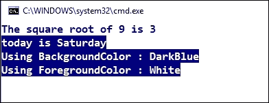

## 表达式主体方法

当编写 lambda 表达式时，我们已经看到我们可以省略表示方法体的花括号，以简化代码。现在，我们可以在方法中做类似的事情，允许我们以更简单的方式表达重写。考虑以下示例代码：

```cs
using static System.Console;
namespace Chapter03_03
{
  public class ExpressionBodied
  {
    public static void Main()
    {
      ExpressionBodied eb = new ExpressionBodied();
      WriteLine(eb.ToString());
    }
    public string Name { get; } = "Chris";
    public string LastName { get; } = "Talline";
    public override string ToString() => $"FullName: {LastName}, {Name}";
  }
}
```

使用字符串插值表达的重写`ToString()`方法更加简单易读，并且与之前的版本工作方式相同。（我也省略了输出，但您可以轻松推断出来）。

同样的想法也适用于在类中声明计算属性，例如。如果我们需要在之前的类中添加一个计算属性，该属性返回一个布尔值，指示`FullName`成员是否超过 12 个字符（我们称之为`FullNameFits`），我们可以这样写：

```cs
public bool FullNameFits => ((Name.Length + LastName.Length) > 12) ? false : true;
```

如您所见，这比之前的版本更加简洁和表达性强。

## 索引初始化器

最后，让我们提一下与初始化器相关的一个新特性。到目前为止，当我们初始化索引设置器时，我们必须在单独的语句中完成。为了更好地理解这一点，现在如果我们需要初始化一个与某些已知数字相对应的值数组，例如 Web 错误字典（即 404-未找到等），我们可以这样定义（全部在一个句子中）：

```cs
Dictionary<int, string> HttpWebErrors = new Dictionary<int, string>
{
  [301] = "The page requested has been permanently moved",
  [307] = "The requested resource is available only through a proxy",
  [403] = "Access forbidden by the server",
  [404] = "Page not found. Try to change the URL",
  [408] = "Request timeout. Try again."
};
```

因此，在初始化过程中，我们定义了所需的键（或者至少最初所需的键），无论它们是否需要在以后进行更改。

总的来说，我们可以说 C# 6.0 版本的新特性并不非常深入和显著，尤其是与 4.0 版本相比，仅举一例。然而，它们非常有用，并且在许多情况下可以减少程序员需要编写的代码量，前提是程序员已经足够了解结构，可以很好地编写代码，从而消除一些与某些编程结构相关的冗余。

# C# 7.0 的新特性是什么

首先，你必须记住，为了使用语言 7.0 版本提出的新特性，你需要拥有 Visual Studio 2017（任何版本，包括社区版）或带有 OmniSharp 扩展（C#插件）的 Visual Studio Code，这也允许你在其他流行的编辑器中使用语言，如 Vim、Emacs、Sublime、Atom、Brackets 等。

一旦你准备好了，C# 7 的特性将在 IDE 中可用，我们可以开始尝试这些新增功能。此外，值得注意的是，微软正在鼓励语言未来版本的贡献者以更快的路径部署新特性，尽管包括的新特性集合较小。

实际上，这个版本并没有包括像 LINQ 或 async/await 这样对语言基础至关重要的特性。C# 7 在某些情况下添加了额外的语法糖，除了其最强大的特性：对元组和解构的新支持。

让我们从“语法糖”开始。

## 二进制字面量和数字分隔符

你可以直接在持有它们的类型的定义中表达二进制数，例如：

```cs
int[] binNumbers = { 0b1, 0b10, 0b100, 0b1000, 0b100000 };
```

但当以这种形式声明时，你可能会得到难以评估和评估的长表达式。这就是为什么我们现在有一个名为数字分隔符的新语言特性。

这意味着你可以在数字字面量中的任何位置包含任意数量的下划线符号，编译器会正确地解释它们。以这种方式，它使得读取值变得更加容易。

这适用于任何类型的数字字面量，就像在下一代码的第六项中发生的那样：

```cs
int[] binNumbers = { 0b1, 0b10, 0b100, 0b1_000, 0b100_000, 123_456_ };
```

如果我们想要检查自动转换为整数的操作，我们可以很容易地测试结果，添加几行代码：

```cs
binNumbers.ToList().ForEach((n) => Console.WriteLine($"Item: {n}"));
Console.Read(); 
```

这将在控制台产生以下输出：

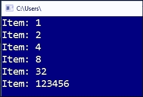

## 模式匹配和 switch 语句

在许多情况下，我们需要检查标记为`out`的变量的值。记住，为了使用`out`，变量必须首先初始化。为了说明这种情况，考虑以下代码，其中函数必须评估传递给它的字符串参数是否可以解释为整数：

```cs
var theValue = "123";
var result = CheckNumber(theValue);
Console.WriteLine($"Result: {result}");
Console.Read();
//…
static object CheckNumber(string s)
{
  // If the string can be converted to int, we double
  // the value. Otherwise, return it with a prefix
  int i = default(int);  // i must be initialized
  if (int.TryParse(s, out i)) {
    return (i * 2);
  }
  else
  {
    return "NotInt_" + s;
  }
}
```

如您所见，我们必须在从转换中检索结果并将其加倍（如果它是`int`类型）之前声明和初始化`i`变量。

那么避免之前的声明，并在`if`语句中声明和初始化`i`怎么样？我们现在可以用内联声明来做这件事：

```cs
static object CheckNumberC7(string s)
{
  // Now i is declared inside the If
  if (int.TryParse(s, out int i))
    return (i * 2);
  else return "NotInt_" + s;
}
```

我们有更简洁、优雅的方式来表达相同的思想。我们正在检查`s`是否匹配`int`模式，如果是，则在单个表达式中声明和分配结果值。

使用模式匹配的另一种方式是在`switch`语句中，这些语句也通过更多的模式来扩展以评估传递给它的值。实际上，你现在可以切换任何东西，而不仅仅是`int`或`string`这样的原始类型。

让我们在一些代码中看看：

```cs
static object CheckObjectSwitch(object o)
{
  var result = default(object);
  switch (o)
  {
    case null:
      result = "null";
      break;
    case int i:
    case string s when int.TryParse(s, out i):
      result = i * 2;
      break;
    case string v:
      result = "NotInt_" + v;
      break;
    default:
      result = "Unknown value";
      break;
  }
  return result;
}
```

前面的函数假设它将接收一个对象，并必须执行以下操作：

+   如果对象为 null 或与`int`或字符串不同，则返回一个表示此情况的字符串值

+   如果对象是`int`或是一个可以转换为`int`的字符串，则复制其值并返回它

+   如果它是一个无法转换为`int`的字符串，则添加前缀并返回它

根据前面的代码，现在你可以指示模式匹配来检查任何值，我们甚至可以在连续的`case`语句中组合类似的情况，例如检查`int`或包含`int`的字符串。

观察字符串模式匹配中使用`when`的情况，它实际上扮演了`if`的角色。

最后，如果它是一个字符串但无法转换，我们使用前缀过程。这两个特性是语法糖（正如他们所说的），但它们相当具有表现力，有助于简化类型检查和复杂的检查情况，如这里编写的代码。

### 元组

在名为*元组：C#中的实现*的部分，我们看到了如何使用`Tuple`类声明和使用元组，以及与早期版本或这些对象相关的一些缺点。

现在，在 C# 7 中，元组达到了一个新的维度。你不再需要使用`Tuple`类来声明元组，多亏了模式匹配，编译器对包含元组语法和`var`定义的声明或使用元组作为方法返回类型的声明感到非常舒适（允许我们返回多个值，而无需使用输出参数）：

```cs
(int n, string s) = ( 4, "data" );
```

前面的声明现在被编译器理解，如下一个捕获所示：

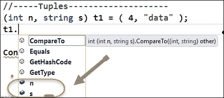

这使得使用`Tuple`类变得不必要，并且使得与这些类型一起工作更加自然。此外，我们不得不使用`Item1`、`Item2`等成员来访问元组的值。现在我们可以给元组的每个成员赋予描述性的名称，以阐明其目的（如本示例中的`n`和`s`）。

另一个优点是可以在函数中返回一个元组。让我们跟随 PM Mads Torgersen 通常用来解释这个特性的官方演示的改编版本。

想象一下，我们想要知道`binNumbers`的初始声明中有多少项，并且在同一函数中对其所有成员进行求和。我们可以编写一个类似这样的方法：

```cs
static (int sum, int count) ProcessArray(List<int> numbers)
{
  var result = (sum:0 , count:0);
  numbers.ForEach(n =>
  {
    result.count++;
    result.sum += n;
  });
  return result;
}
```

现在，调用该方法并以这种方式展示结果：

```cs
var res = ProcessArray(binNumbers.ToList());
Console.WriteLine($"Count: {res.count}");
Console.WriteLine($"Sum: {res.sum}");
Console.Read();
```

我们得到了预期的结果。但让我们查看代码以查看实现的细节。

首先，函数的返回值是一个元组，其成员按相应命名，这使得调用代码更易读。此外，内部`result`变量被定义并使用元组语法初始化：一系列以逗号分隔的值，可选地以名称作为前缀以提高清晰度。

然后将返回值分配给`res`变量，它可以使用命名参数在控制台使用字符串插值输出它们。

### 分解

分解是一种特性，允许我们将对象分解为其部分，或其部分。

例如，在`res`变量的声明中，我们甚至可以通过声明元组的命名成员来避免使用`res`，以获得完全相同的结果：

```cs
var (count, sum) = ProcessArray(binNumbers.ToList());
```

正如你所见，我们可以访问所需的返回值，但不需要将它们保存在命名变量中；因此，我们说结果值已经被“分解”为其构成部分。

当然，在这种情况下，我们利用的是要解构的类型已经是一个元组。那么其他对象呢？只要对象定义了`Deconstruct`方法，或者你创建了一个同名扩展方法，你就可以解构任何对象。

假设我们想要能够分解一个`DateTime`值。当然，`DateTime`对象内部没有定义`Deconstruct`方法，但我们可以非常容易地创建一个：

```cs
static void Deconstruct(this DateTime dt, out int hour,
  out int minute, out int second)
{
  hour = dt.Hour;
  minute = dt.Minute;
  second = dt.Second;
}
```

一旦我们有了可访问的定义，我们就可以用这样的句子“提取”当前时间的值：

```cs
var (hour, minute, second) = DateTime.Now;
Console.WriteLine($"Hour: {hour} - Minute: {minute} - Second: {second}");
```

我们会得到以下捕获中显示的输出，它还显示了数组中元素的数量及其总和的计算：

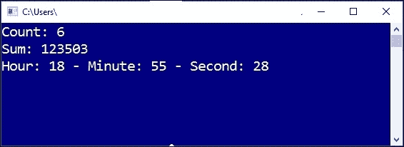

### 局部函数

JavaScript 程序员习惯于将函数作为参数传递，并将函数作为返回值。在 C#中，这不可用，除非是通过我们在上一章中看到的 lambda 表达式提供的功能。

局部函数并不是这样，但它们允许我们声明一个局部于另一个封闭函数的函数，并且能够访问上层函数中定义的变量。因此，它们是在它们声明的函数中局部化的。

回到我们的`ProcessArray`演示，假设你想要将`ForEach`循环内部的代码分离到另一个函数中，但你想直接修改这些值（而不是使用`out`引用）。

你可以用以下语法重写这种类型的内部函数的过程：

```cs
static (int sum, int count) ProcessArrayWithLocal(List<int> numbers)
{
  var result = (s: 0, c: 0);
  foreach (var item in numbers)
  {
    ProcessItem(item, 1);
  }
  return result;
  void ProcessItem(int s, int c) { result.s+= s; result.c += c; };
}
```

这次，我们使用`ForEach`循环遍历集合，并在循环内部调用局部函数`ProcessItem`，该函数可以访问结果成员。

在哪些情况下这些内部函数才有意义？一个情况是当一个辅助方法只会在单个函数内部使用，就像在这个例子中一样。

### 返回值引用

最后，让我们了解一下这些特性，它们目前只部分可用，因为它们计划在 Connect(); 2016 活动宣布的语言快速路径发布周期中扩展它。

理念是，与你可以通过引用传递值一样，现在你可以返回引用值，甚至可以将值存储在引用变量中。

之前提到的 Mads Torgersen 代码包括以下（自解释）代码，以了解我们如何声明这样的函数以及我们如何使用它：

```cs
public ref int Find(int number, int[] numbers)
{
  for (int i = 0; i < numbers.Length; i++)
  {
    if (numbers[i] == number) 
    {
      return ref numbers[i]; // return the storage location, not the value
    }
  }
  throw new IndexOutOfRangeException($"{nameof(number)} not found");
}

int[] array = { 1, 15, -39, 0, 7, 14, -12 };
ref int place = ref Find(7, array); // aliases 7's place in the array
place = 9; // replaces 7 with 9 in the array
WriteLine(array[4]); // prints 9
```

在代码中，函数在声明返回类型（`int`）之前用`ref`标记。后来，在声明一个数字数组之后，函数以 7 作为第一个参数被调用。

值 7 占据了数组的第五个位置，因此它的顺序号是 4。但由于返回值被存储为`ref`，随后的赋值 9 将数组中的该值更改为 9。这就是为什么最终语句打印出 9 的原因。

总的来说，也许这个语言最新版本中包含的变化并不像语言 2、3 或 4 版本中的变化那样有意义，但即便如此，它们在某些情况下也简化了程序员的任务。

# 摘要

我们看到了 C#语言和.NET Framework 最近版本中包含的最著名特性。

我们回顾了 C# 4.0 版本，包括对委托和接口泛型方差（协变和逆协变）、动态声明、参数改进、元组和对象的延迟实例化进行了回顾，这些意味着 C#语言的表述能力和功能发生了重要变化。

然后，我们简要介绍了`async/await`结构，作为一种通过将通常需要的两部分代码合并到单一方法中来简化异步调用的手段。

接下来，我们对包含在 C# 6.0 版本中的最重要的功能进行了回顾，该版本主要基于在语言中减少冗余的新方法。

最后，我们看到了最近发布的 7.0 版本中添加的最重要特性，这些特性主要基于语法糖来使表达式更有意义，以及新的模式匹配特性，这使得在许多常见情况下使用元组变得非常可行。

在下一章中，我们将比较不同的语言，包括 Visual Studio 中的 F#和 TypeScript 支持，并提供一些关于它们未来使用的展望。
