# 第四章：比较编程方法

到目前为止，我们一直关注 C# 语言及其演变。然而，就语言而言，.NET 框架中的这种演变并非唯一。其他语言也在不断进化（而且这与现在有更多编译器增加了支持 .NET 版本的编程语言列表这一事实无关）。特别是，.NET 语言生态系统中有两个成员，F# 和 TypeScript，它们在程序员社区中越来越受欢迎，我们将在本章中简要介绍它们。

因此，我们将回顾两种语言中最相关的方面，在两种情况下都以 C# 作为参考。

以此为目标，我们的目的是大致概述最关键的编程结构，以便您可以比较使用不同语言编码日常编程任务的方式。

我想关于 VB.NET 和为什么我不包括它在这里添加一个说明。即使考虑到 VB.NET 与 .NET 生态系统中的其他语言并行发展，（VB.NET 追随者，请原谅我，但这是你们大多数人肯定已经注意到的趋势），但事实是，围绕 F# 和 JavaScript 语言（以及 TypeScript）的炒作更多（就 TypeScript 而言）。

当我们谈论未来期望时，这种趋势尤为明显。VB.NET 用户可以确信，尽管微软没有说相反的话，VB.NET 将继续按预期运行，并且将成为之前提到的语言生态系统中的一种语言，拥有开发者习惯在 Visual Studio 中找到的所有优点和优势。

回到 F# 和 TypeScript，两者有一个共同点：它们属于函数式语言的类别（尽管 TypeScript 使用类，这些类最终“编译”成函数）。第一个将作为与 C# 的比较，因为它是编译型语言，而 TypeScript 是解释型语言。

### 备注

所有类型的函数式语言列表不断增长。维基百科维护了一个相当全面的列表，列出了其中大部分语言，可以在 [`en.wikipedia.org/wiki/Category:Functional_languages`](https://en.wikipedia.org/wiki/Category:Functional_languages) 找到。

因此，我们将回顾两种编程方法之间的差异，并确定旨在获得相同结果（每个都以其自己的风格表达）的编程结构。此外，请注意，有大量应用程序可以解决（尤其是数学和工程问题），这些应用程序使用 F# DLL 的实现，随着语言版本的不断增长，可能性也在增加。

另一方面，TypeScript 的持续增长通过 Google 的宣布得到了明确，即 TypeScript 已成为他们新版本 Angular 框架（Angular 2.0）的构建语言，自 2016 年 9 月以来可用。这是一个相当意外的合作！

在本章中，我们将涵盖以下主题：

+   功能型语言的基础

+   F# 作为一种完全功能型语言

+   典型编程结构的等价性

+   Visual Studio 中的支持

+   TypeScript 的起源和主要目的

+   基本结构和编程特性

+   Visual Studio 中的 TypeScript 支持

# 功能型语言

功能型语言是一种避免改变状态和可变数据，主要关注代码作为数学函数评估的语言。因此，整个编程体验都是基于函数（或过程）来构建程序流程的。

注意这种方法与面向对象语言的不同，面向对象语言中一切都是对象（一些面向对象语言有原始类型，如 Java，但通常，类型总可以被视为对象）。

下一个图表显示了某些流行的命令式语言与纯功能型语言的对比，以及 F#（和 Scala）在这两种模型之间的位置。

考虑到这一点，程序目标的流程持续声明与其它函数相关或基于其它函数的函数，直到目标达成：

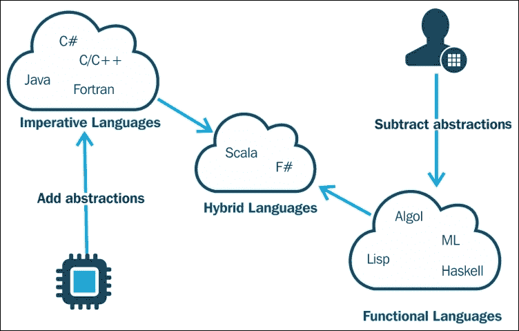

功能型语言没有其他命令式编程语言的副作用，因为状态不会改变，只要函数调用使用相同的参数，相同的调用将返回相同的结果。消除这些类型的副作用可以使行为更加可预测，这正是它们使用的重要动机之一。

然而，这种优势也意味着需要考虑：并非所有程序都可以在没有这些效果的情况下开发，尤其是那些需要改变状态和创建 I/O 过程的程序。

作为一门学科，函数式编程的根源在于 *Lambda 演算*，最初作为一种形式系统，用于以函数抽象的形式表达计算，它最初由 Alonzo Church 在二十年代后期在研究数学基础的过程中开发。

这里应该注意两点：

1.  Lambda 演算是一个通用的计算模型，与 *图灵机* 等价，正如维基百科所述。此外，图灵本人也在他的关于状态机的开创性论文中提到了这项工作。有一些有趣的工作与这两者相关，并解释了它们之间的差异，尽管这不是本章的目标。

1.  即使考虑到它们与我们在 C#语言中看到的 lambda 表达式不完全相同，由于 Lambda Calculus 中使用的 Lambda 项或 Lambda 表达式基本上以我们在前面的例子中看到的方式绑定变量，因此存在直接的联系。有关 Lambda Calculus 的更多信息，请参阅[`en.wikipedia.org/wiki/Lambda_calculus`](https://en.wikipedia.org/wiki/Lambda_calculus)。

## F# 4 和.NET Framework

F#语言的第一个版本出现在 2005 年，尽管当时你需要单独下载和安装。语言的发展过程最初由微软研究院的 Don Syme 管理，尽管现在它使用的是开放的开发和工程流程，基本上由成立于 2013 年的 F#软件基金会监督，该基金会于 2014 年成为了一个 501C3 的非营利组织。

实际上，当前版本是 4.0，它于 2016 年 1 月发布，并伴随着与 Visual Studio 相关的工具的几项改进。然而，F#编程语言的支持也可以在**Xamarin Studio**、**Mono**、**MonoDevelop**、**SharpDevelop**、**MBrace**和**WebSharper**中找到。

根据**Syme**的说法，F#起源于 ML，并受到了其他函数式语言的影响，主要是从**OCaml**、**C#**、**Python**、**Haskell**、**Scala**和**Erlang**。更准确地说，Syme 解释说，从语法角度来看，主要影响来自 OCaml，而对象模型方面则受到了 C#和.NET 的启发。

F#被定义为一种强类型、多范式和以函数式为主的编程语言，它包含了函数式、命令式和面向对象编程技术。

它从一开始就使用类型推断，这与我们在 C# 3.0 版本中看到的使用`var`关键字的方式相同。然而，F#允许显式类型注解，并在某些情况下要求这样做。但是，除了一些例外，F#中的每个表达式都与一个静态类型相关联。如果函数或表达式不返回任何值，则返回类型命名为`unit`。

### 不可避免的 Hello World 演示

因此，让我们从必做的 Hello World 程序开始，但首先，请记住，如果你在安装时没有这样做，你将需要在 Visual Studio 中激活 F#工具。（如果没有，当访问 F#语言部分时，你会被提供这种激活。）一旦激活就绪，你将看到一个与该语言相关联的新类型项目，就像以下截图所示：

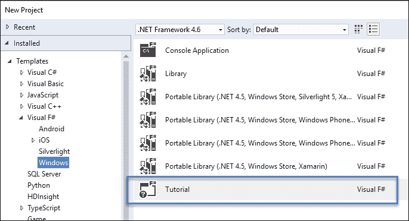

首先，你可以选择教程，这是一系列关于语言不同方面的综合集合——它结构相当合理——或者简单地使用控制台应用程序。

如果你选择教程，你可以标记你想要测试的代码部分，如果你在该区域右键点击，你会看到两个执行选项：**在交互式执行**和**在交互式调试**：

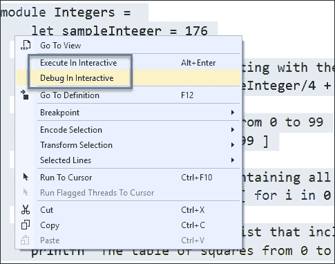

为了可视化结果，我们当然可以创建一个可执行文件并在控制窗口中启动它，但在这个场景中，F#交互式窗口更合适。为了完整性，请记住，你可以使用 Visual Studio 中的**构建**选项调用编译器（命名为`fsc.exe`），就像调用任何其他项目一样。

因此，我们将从编写非常简单的代码开始：

```cs
let a = 1 + 2
let b = a * 3
printfn "Expression a equals to %i" a
printfn "Expression b equals to %i" b
printfn "So, expression b (%i) depends on a (%i)" b a
```

这将在**F#交互式**窗口生成以下输出：

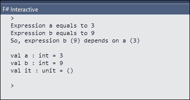

这里，我们做了以下操作：

1.  首先，我们使用`let`关键字将算术表达式赋值给变量`a`。

1.  然后，我们使用相同的关键字为另一个变量，变量`b`，使用之前的定义。

1.  最后，F#库中的`printfn`函数向标准 I/O 输出，格式化结果的方式类似于我们在 C#中做的那样，只是将`{0}..{1}`等表达式改为`%i`或打印要打印的值的类型的字母（例如，`f`用于浮点数，`s`用于字符串，`d`用于双精度，`A`用于包括数组和元组的通用打印，等等）。

注意交互式窗口如何呈现过程中隐含的成员的回声，同时显示其类型。

请记住，由于 F#被认为是 Visual Studio 家族的另一个成员，它在**工具/属性**对话框中有一个自己的配置区域，如下一张截图所示。此外，该对话框中的另一个条目允许你配置**F#交互式**窗口的行为：

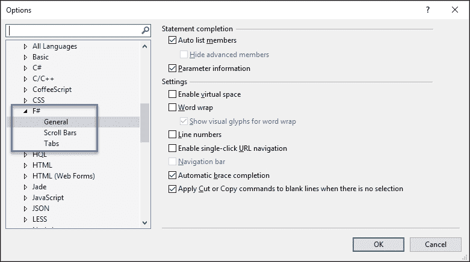

### 标识符和作用域

标识符的作用域表示该标识符可用的代码区域。所有标识符，无论是函数还是值，都是从它们的定义结束开始，直到它们作用的部分结束的作用域（有效）。此外，在 F#中，你不需要显式返回任何值，因为计算的结果会自动分配给相应的标识符。

因此，为了创建计算的中继值，你通过缩进来表示它（按照惯例，缩进的大小是 4，但用户可以选择任何其他值）。每个缩进定义一个新的作用域，每个作用域的结束由缩进的结束标记。例如，让我们考虑一个计算直角三角形斜边的函数：

```cs
let hypo (x:float) (y:float) =
  let legsSquare = x*x + y*y
// System.Math.Sqrt(legsSquare)
sqrt(legsSquare) // an alias of the former
printfn "The hypotenuse for legs 3 and 4 is: %f" (hypo 3.0 4.0)
```

首先，我们定义了 `hypo` 函数，它接收两个类型为 `float` 的参数（注意我们可以使用语法 `arg:type` 明确地指示类型）。然后，我们声明 `legsSquare` 为两个三角形边的平方和，这是通过一个新的缩进级别来完成的。最后，我们只计算这个中间变量的平方根，没有任何其他指示，这意味着 `System.Math.Sqrt(legsSquare)` 是返回值。

此外，注意我们如何直接引用 `System.Math`，因为它包含在项目的引用中。或者，你可以使用 `open` 关键字来指示对 `System` 的引用（例如 `open System`），然后，你可以无限制地使用 `Math` 静态类。

最后，我们调用 `printfn` 来格式化输出，并确保格式化输出字符串中只包含一个值，通过将 `hypo` 的调用放在括号中来做到这一点。

当然，**F# Interactive** 窗口将显示格式化后的结果，正如预期的那样：

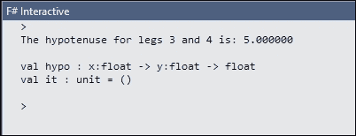

### 列表

在 F# 中，列表是有序的不可变元素的集合，元素类型相同。它的生成允许许多与语言兼容的选项，但初始风格非常简单。如果你稍微浏览一下教程，你会发现以下声明：

```cs
/// A list of the numbers from 0 to 99
let sampleNumbers = [ 0 .. 99 ]
```

这里，你被介绍到了范围运算符：(`..`)，它表示一个对编译器可导出的元素序列。由于 Interactive 窗口的回声功能，我们只需标记那一行并选择 **Interactive Window** 来查看结果：

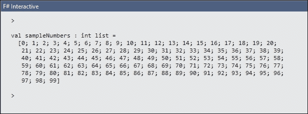

范围运算符也接受增量描述符（..），允许你定义一个不同的、集体的类型，称为序列（`seq`），它支持与列表相同的许多函数：

```cs
seq {5..3..15}
```

这里，我们定义了一个以 `5` 开始，经过 `15`，以三的步长递增的元素序列（输出如下）：

```cs
val it : seq<int> = seq [5; 8; 11; 14]
```

与之前一样，让我们标记以下句子并继续：

```cs
let sampleTableOfSquares = [ for i in 0 .. 99 -> (i, i*i) ]
```

创建了一个元组数组，每个元组包含从 `0` 到 `99` 的一个数字及其对应的平方。在这个句子中有几点需要注意。

在方括号中赋值意味着其中的表达式应该被评估为一个数组（类似于 JavaScript）。我们也在上一句中看到了这一点，但这次，在括号内，我们看到一个 `for..in` 循环和一个 `->` 符号，这表明循环每一步生成的值。

这个生成的值实际上是一个元组，因为它被括号包围——这是一个非常强大且富有表现力的语法。

列表对象包含几个有用的方法来操作它们的内部集合。其中之一是 `List.map`，它允许你将一个函数应用于列表中的每个元素，并返回一个包含计算结果的新列表。

重要的是要注意，这种方法的理念与我们在 C#中使用泛型集合和传递 lambda 表达式给它们的方法时看到的非常相似。

例如，我们可以编写以下代码：

```cs
let initialList = [9.0; 4.0; 1.0]
let sqrootList = List.map (fun x -> sqrt(x)) initialList

printfn "Square root list: %A" sqrootList
```

这里，`initialList`包含三个浮点数，我们想要计算它们的平方根。因此，我们通过调用`List.map`并传递一个匿名函数来生成另一个列表（`sqrootList`），该函数接收一个值并返回其平方根。最后一个参数是`initialList`。请注意，`map`的参数就像一个 lambda 表达式。

再次强调，**F#交互式窗口**中的输出正如预期的那样：

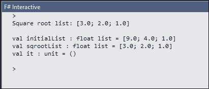

#### 函数声明

我们已经看到了如何使用匿名函数以及它们如何作为参数传递给某些方法。要声明一个命名函数，你可以使用与变量类似的语法，但需要指定它可以接收的参数，并跟随函数的名称：

```cs
let func1 x = x*x + 3
```

这次，`func1`是函数的名称，`x`是要传递的参数，它可以选择性地用括号括起来。稍后，我们可以将之前的声明与赋值给变量的操作结合起来，这可以在继续分析此代码时看到：

```cs
let result1 = func1 4573
printfn "The result of squaring the integer 4573 and adding 3 is %d" result1
```

还要记住，参数可以被注释（明确表示其类型）：

```cs
let func2 (x:int) = 2*x*x - x/5 + 3
```

当我们需要在函数内部指示代码结构时，我们将使用与之前示例中相同的方式缩进，以及需要评估的表达式（这正是`func3`在这里所做的）：

```cs
let func3 x =
  if x < 100.0 then
    2.0*x*x - x/5.0 + 3.0
  else
    2.0*x*x + x/5.0 - 37.0
```

注意列表与元组之间的区别，元组是通过括号定义的。此外，可以使用包含循环的表达式生成列表，如下面的代码所示，它使用了这种结构：

```cs
let daysList =
  [ for month in 1 .. 12 do
  for day in 1 .. System.DateTime.DaysInMonth(2012, month) do
    yield System.DateTime(2012, month, day) ]
```

在这里，我们使用了嵌套的`for`循环，通过`for..in..do`语法实现。同时，请注意`yield`关键字的存在，这与 C#中的用法类似。之前的代码生成了以下输出：

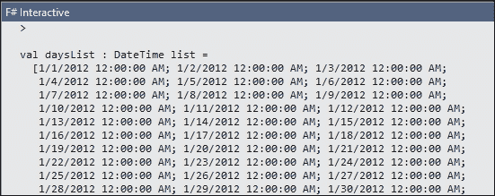

以此类推……

#### 管道操作符

F#的另一个重要特性是管道操作符（`|>`）。它用于将值传递给一个函数，但通过*管道*结果。定义很简单：

```cs
let (|>) x f = f x
```

这意味着：取参数`x`并应用于函数`f`。这样，参数在函数之前传递，我们可以非常合适地表达一系列计算。例如，我们可以定义一个求和函数并这样使用它：

```cs
let sum a b = a + b
let chainOfSums = sum 1 2 |> sum 3 |> sum 4
```

执行后，我们将获得`chainOfSums`的值为 10。例如，考虑以下代码：

```cs
let numberList = [ 1 .. 1000 ]  /// list of integers from 1 to 1000
let squares = numberList
  |> List.map (fun x -> x*x)
```

这意味着，取`numberList`，将其应用于括号内的`List.map`函数（该函数计算列表中每个数的平方），并将结果赋值给`squares`标识符。

如果我们需要在同一个集合上按顺序链接多个操作，我们可以连接操作符，正如教程中的下一个示例所示：

```cs
/// Computes the sum of the squares of the numbers divisible by 3.
let sumOfSquares = numberList
|> List.filter (fun x -> x % 3 = 0)
|> List.sumBy (fun x -> x * x)
```

#### 模式匹配

在管理集合时，另一个有用的结构是 `match..with` 构造。它与 `|` 操作符一起使用，以表示不同的选项，这与我们在 C# 中的 `switch` 和 `case` 语句所做的一样。

为了以简单的方式测试这一点，让我们尝试典型的递归函数来计算一个数字的阶乘：

```cs
let rec factorial n = match n with
  | 0 -> 1
  | _ -> n * factorial (n - 1)
let factorial5 = factorial 5
```

注意 `rec` 关键字作为函数声明的修饰符的存在，以指示该函数是递归的。要测试的变量（`n`）位于 `match..with` 结构和 `|` 操作符之间，而下划线操作符（`_`）用于表示对任何其他值要做什么。

**F# Interactive** 窗口再次显示了正确的结果：

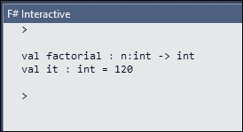

#### 类和类型

F# 可以很好地与类和类型一起工作，并且本身被认为是类型化语言。实际上，你可以使用类型缩写和类型定义来声明任何受支持类型的元素。

在第一种情况下，我们只是为现有类型建立别名。你可以使用 `type` 关键字后跟一个标识符（别名）来声明这些别名，并将其分配给它所表示的类型：

```cs
type numberOfEntries = int
type response = string * int
```

注意第二个定义声明了一个由两部分（`string` 和 `int`）组成的新类型结构，可以在以后使用。

类型最常见的用法是声明类型定义，将成员作为括号内的值对（`key : type`）表示，正如教程中的 `RecordTypes` 模块提醒我们的那样（我们在此处重新呈现它）：

```cs
// define a record type
type ContactCard =
  { Name     : string;
    Phone    : string;
    Verified : bool }
  let contact1 = { Name = "Alf" ; Phone = "(206) 555-0157" ; Verified = false }
```

如果我们在 **F# Interactive** 窗口中运行前面的代码，我们将得到以下结果：

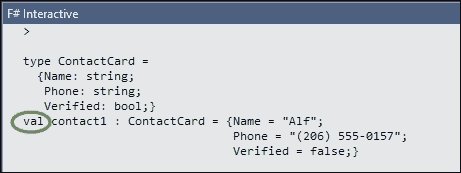

如你所见，`contact1` 标识符被指定为 `val (值)`。此值也可以用于根据前面的类型声明进一步的类型。这正是教程中以下声明的目的：

```cs
let contact2 = { contact1 with Phone = "(206) 555-0112"; Verified = true }
```

在这种情况下，`contact2` 是基于 `contact1` 的，但有两组不同的值。

下一个定义同样使事情变得非常清晰：

```cs
/// Converts a 'ContactCard' object to a string
let showCard c =
  c.Name + " Phone: " + c.Phone + (if not c.Verified then " (unverified)" else "")
```

这用于将 `ContactCard` 类型转换为字符串，因为我们检查在添加另一句话以测试输出后 **F# Interactive** 窗口中的输出：

```cs
let stringifyedCard = showCard contact1
```

以下截图显示了生成的输出：

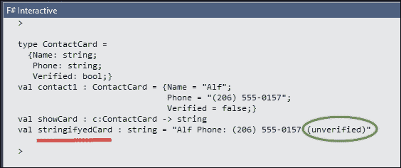

#### 类型转换

在 F# 中，类型转换有自己的特定操作符。两种可能的操作取决于所需的类型转换类型（如果你从通用到特定在层次结构中转换，则是向下转换，如果你以相反的方式继续，则是向上转换）。实际上，与 C# 一样，层次结构从 `System.Object` 开始，尽管有一个别名 `obj`，我们可以用它来代替。

至于与编译器的行为相关，让我们记住向上转型是一个安全的操作，因为编译器总是知道要转换的类型的前辈。它由一个冒号，后跟一个大于号（`:>`）表示。例如，以下操作是合法的：

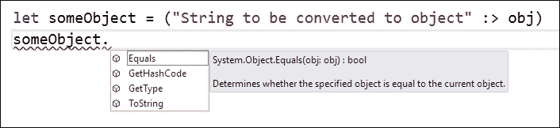

正如我们所见，`someObject`标识符作为从字面字符串到`obj`的转换结果，在括号中声明。因此，在下一句中，V. Studio 中的 Intellisense 提醒我们`System.Object`声明了那些出现在上下文菜单中的成员。

# TypeScript 语言

在过去 5 到 6 年中，围绕用于构建网站和 Web 应用程序的语言的炒作日益增长。正如你肯定知道的，原因主要与各种类型移动设备的普及有关：平板电脑、手机、物联网设备等等。

与此同时，回到 2008 年，W3C ([`www.w3.org`](http://www.w3.org)，负责大多数互联网语言规范的实体)出现了一项新的标准化努力，旨在更新这些网络语言并使它们更适合这个十年的需求。像在 MacOS 或 iOS 等平台上消除 Flash 组件（或者说是 Silverlight）这样的公告，只是促进了这些尝试。

多年来首次，许多公司投资于创建这种新的开放网络，它能够以灵活、适应性、易于使用和响应的方式承载任何类型的内容。

所有这些努力在 2015 年画上了句号，最终推荐了 HTML5 ([`www.w3.org/TR/html5/`](https://www.w3.org/TR/html5/)) 以及一系列与 CSS3 表现语法相关的规范（记住，它不是一个语言）。他们在编写和测试过程中采用了*最急需的*方法，从那些实现是必要要求的开始，例如媒体查询（正如你所知，在移动设备中非常重要）。

最后，预期的 JavaScript 语言新版本由 ECMA ([`www.ecma-international.org/`](http://www.ecma-international.org/)) 发布，并命名为 ECMAScript 2015（在规范和测试过程中之前被称为 ES6）。

在创建 HTML、CSS 和 JavaScript 标准的过程中，做出了重要的决策：保持向后兼容性，应用良好的实践和原则（例如 S.O.L.I.D.原则），最重要的是，使这些规范成为一个持续的开发和集成过程，其中公司的共识是关键。因此，在发布这些规范的第一版之后，所有这些领域的工作都继续进行，但现在，主要用户代理制造商的工程师直接与 W3C 和 ECMA 合作，以使 HTML、CSS 和 JavaScript 引擎更快、更可靠、更及时。由此产生的最明显的应用通常被称为现代浏览器。

## 新的 JavaScript

因此，一个新的 JavaScript 诞生了，它包括了开发者长期以来一直期待的功能，例如类、接口、作用域变量、包（终于，命名空间的概念出现在语言中，消除了对闭包的需求），以及更多。

随着新要求的出现，出现了一套库（实际上是一个很大的库）来帮助开发者完成日常任务（它们现在以数百、数千计）。

因此，根据去年进行的大量开发者调查，JavaScript 语言似乎成为了首选。其中一项调查是由目前开发者中最受欢迎的代码参考网站 StackOverflow 进行的，它进行了研究并发表了具有深刻见解的结果；您可以在[`stackoverflow.com/research/developer-survey-2015`](http://stackoverflow.com/research/developer-survey-2015)上阅读。

投票范围非常广泛，涵盖了众多不同方面，有成千上万的开发者参与了调查。以下显示语言排名的图表非常重要：

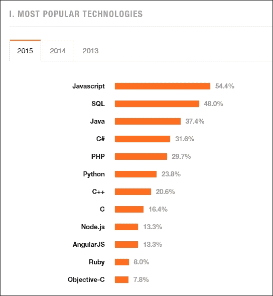

所有这些都很棒，但这些功能在浏览器中的支持立即成为一个重要问题。实际上，支持不足，只有少数浏览器（我们之前提到的现代浏览器），如 Chrome 的最新版本、Microsoft Edge 和 Firefox 的最新更新，提供了对新标准提出的新闻和功能的大范围覆盖。

要使情况变得更糟，同一类型的浏览器版本并非巧合，因为它们可能依赖于我们用来打开网站的设备。为了最终确定与这种情况相关的问题列表，开发者开始构建大型应用程序，在这些应用程序中，需要的不仅仅是几十或几百行，而是数千行 JavaScript。

因此，需要一个新的工具来构建这些网站和应用，而我们的尊敬的 Anders Hejlsberg 再次决定对此采取严肃的态度。他提出的解决方案被称为 TypeScript。

## TypeScript：JavaScript 的超集

那么，TypeScript 是什么，为什么它是这些问题的解决方案？第一个问题在其自己的网站上得到了解答：[`www.typescriptlang.org/`](http://www.typescriptlang.org/)。正如难以言喻的维基百科所说：

> TypeScript 是由微软开发和维护的免费开源编程语言。它是 JavaScript 的一个严格超集，并为语言添加了可选的静态类型和基于类的面向对象编程。TypeScript 可用于开发客户端或服务器端（Node.js）执行的 JavaScript 应用程序。

那么，TypeScript 是如何实现这些目标的？再次，维基百科提醒我们：

> TypeScript 是为开发大型应用程序而设计的，并转译为 JavaScript。由于 TypeScript 是 JavaScript 的超集，任何现有的 JavaScript 程序也是有效的 TypeScript 程序。

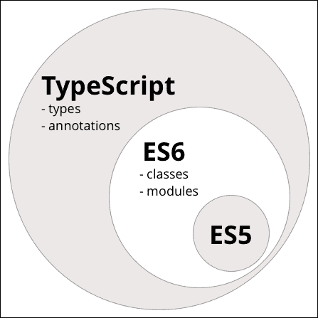

因此，我们可以开始编写或使用已经存在的 JavaScript，知道它将 100%与旧浏览器兼容。然而，术语转编译需要一些解释。由于 JavaScript（任何版本）是一种解释性、函数式语言，负责其执行的一直是嵌入在浏览器或用户代理中的 JavaScript 运行时。

因此，转编译（或简称为转译，就像大多数人称呼的那样）是将 TypeScript 代码转换为浏览器可以正确解释的纯 JavaScript 的过程。优势是双重的：一方面，我们可以决定我们想要哪个版本的 JavaScript（JavaScript 3、5 或 2015），另一方面，当与 Visual Studio（甚至 Visual Studio Code、Emacs、Vim、Sublime Text 和 Eclipse（通过 Palantir Technologies 提供的插件）等工具一起使用时，我们将获得 Intellisense、代码补全、动态分析等所有好处。

事实上，一旦这些工具配置完成，它们可以使用 Roselyn 服务来提供 Intellisense、类型推断以及我们从其他语言中都知道和喜爱的所有优点。按照惯例（尽管不是强制性的），TypeScript 文件具有`.ts`扩展名。

## 那么，TypeScript 究竟是什么？

对于这个问题的官方答案是，它是一个超集，可以将 JavaScript（无论你想要支持哪个版本：ECMAScript 2015 的 3.0、5.0）编译（编译后生成）为有效的 JavaScript。

此外，它还允许你使用在规范的下一次发布中才可用的功能，或者即使它们已经可用，但在大多数浏览器中尚未得到支持的功能。

此外，语言从 JavaScript 开始，因此任何 JavaScript 片段也是有效的 TypeScript。最大的区别在于，你使用的是一种提供通常与我们在本书中看到的 Roslyn 相关的相同类型的编辑和编译服务的语言：代码补全、查看定义、类型检查、重构、代码分析等。

### 主要特性和联盟

另一个主要特点是该项目旨在兼容任何浏览器、任何主机和任何操作系统。实际上，TypeScript 编译器是用 TypeScript 编写的。

总结一下，这个架构提供的两个最重要的特性如下：

+   由静态类型启用的一整套工具

+   未来使用功能的可能性，有信心生成的代码将在每个浏览器（或服务器）上运行。

在所有这些可能性中，微软和谷歌之间出现了一个合资企业（确切地说，是 TypeScript 团队和谷歌的 Angular 团队之间）来共同开发 Angular 的新版本（2.0+）。

### 安装工具

和往常一样，我们建议您下载并安装库的最新版本，它附带了一些项目模板。这些模板涵盖了使用 TypeScript 与 Apache/Cordova、Node.js 或纯 HTML 的用法。

您可以在 **工具/扩展和更新** 菜单中搜索其名称来找到 TypeScript 的最新版本。还有另一种安装方式，即访问位于 [`www.typescriptlang.org/`](https://www.typescriptlang.org/) 的语言官方网站，该网站还包含额外的文档、演示和一个在线测试代码片段的 REPL。

我在这本书中使用的是当前版本 1.8.4，但很可能会在本书出版时，您将能够访问高于 2.0 的版本。在同意下载可安装文件后，您将看到一个确认对话框，如下所示：

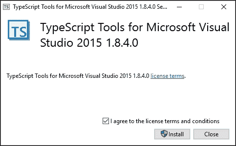

如果您想尝试一个更完整且更具说明性的 TypeScript 测试，您可以在 `Templates/TypeScript` 中创建一个名为 `HTML Application` 的新项目，这是在之前的安装之后可以找到的。

执行会生成一个网页，显示一个每秒更改一次时间的时钟。对代码结构的审查非常有信息量：

```cs
class Greeter {
  element: HTMLElement;
  span: HTMLElement;
  timerToken: number;

  constructor(element: HTMLElement) {
    this.element = element;
    this.element.innerHTML += "The time is: ";
    this.span = document.createElement('span');
    this.element.appendChild(this.span);
    this.span.innerText = new Date().toUTCString();
  }

  start() {
    this.timerToken = setInterval(
      () => this.span.innerHTML = new Date().toUTCString(), 500);
  }

  stop() {
    clearTimeout(this.timerToken);
  }
}

window.onload = () => {
  var el = document.getElementById('content');
  var greeter = new Greeter(el);
  greeter.start();
};
```

如您所见，`app.ts` 文件正在定义一个类（`Greeter`）。该类有一个状态，使用三个字段定义，其中两个与用户界面相关，因此它们被创建为 `HTMLElement`。

`constructor` 方法负责初始化。它接收一个 `HTMLElement` 参数，并在读取系统时间后在其旁边创建一个新的 `<span>` 元素以显示时间。该值被分配给 `<span>` 的 `innerText` 参数，因此它从开始就显示当前时间。

然后，我们有两个方法：`start()` 和 `stop()`。第一个使用 lambda 并将 `timerToken` 字段的值分配给 `setInterval` 方法，该方法接收一个定期调用的函数。如果想要在任何时候取消该过程，这个返回值是有用的，正如我们在稍作修改的演示中所做的那样。

结果显示在与之链接的 `HTMLElement` 接口中；请注意，用户界面中只涉及一个元素：一个具有其 ID `content` 的 `div` 元素。

控制时钟启动的机制在定义`Greeter`类之后表达。在`onload`事件中，内容元素被链接到`Greeter`类的新实例。

### 注意

总结来说，类的目的是定义一种行为，并将这种行为与用户界面的一部分关联起来。

我们可以通过包含一个按钮（或任何其他`HTMLElement`接口）并在 TypeScript 代码中稍作修改来简单地停止时钟：

```cs
<button id="btnStop">Stop Clock</button>
window.onload = () => {
  // This links the UI to the JS code
  var el = document.getElementById('content');
  var btnStop = document.getElementById('btnStop');
  var greeter = new Greeter(el);
  // Now that Greeter is defined, we can use it
  // from the button to stop the clock
  btnStop.addEventListener("click", () => {
    greeter.stop();
    alert("Clock Stopped!");
  });
greeter.start();
};
```

由于`stop()`方法已经定义，因此无需更改`Greeter`类。我们将对`stop()`方法的调用分配给按钮的`click`事件，这就是所需的所有操作：

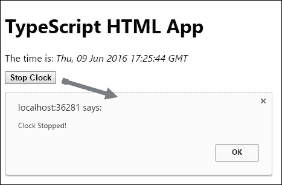

### 转译到不同版本

Visual Studio 为我们提供了选择在转译过程之后生成哪个 JavaScript 版本的选项。你只需转到**项目** | **属性**并选择**TypeScript 构建**选项卡。你将了解你被提供了如何让转译器行为的多种选项。其中之一显示了一个 ComboBox，其中包含了可用的最终 JavaScript 选项。

此外，请注意，JSX 上还有其他选项，如管理注释、结合 JavaScript 等，具体方式如以下截图所示：

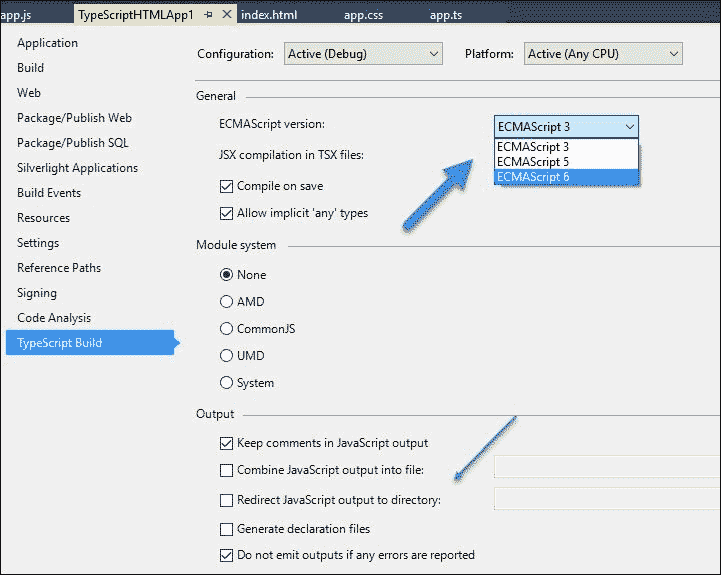

比较这两个文件（`.ts`和`.js`）将清楚地说明 TypeScript 代码相对于纯 JavaScript 的整洁和简洁（以及面向对象）。

然而，好处并不止于此。这只是开始，因为大多数优势都与编辑器中的创建过程、Intellisense、类型推断等有关...

### IDE 中的优势

当我们将光标移至前述代码的定义上时，观察每个元素是如何通过其类型被识别的：类本身及其成员：


这不仅仅是识别初始化值。如果我们更改代码中成员的值并将其分配给不同的（不兼容的）类型，IDE 将再次对此情况提出抱怨：

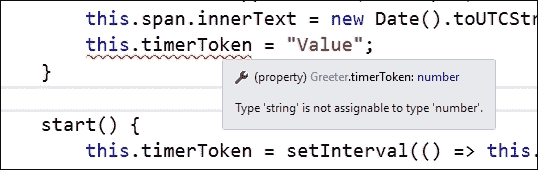

即使在`HTMLElements`内部，你也能找到这种 Intellisense，因为遍历`span`元素的`innerText`属性会告诉你该属性是一个字符串值。

为了结束这个例子并改变功能，以便我们可以停止时钟，我们只需要在 UI 中添加任何合适的元素，并将其分配给`Greeter.stop()`的调用，例如，在以下代码中添加到 HTML 文件中：

```cs
<!-- Button to stop the clock -->
<button id="btnStop">Press to stop the clock</button>
```

在 TypeScript 代码中，以下是对`window.onload`的赋值：

```cs
var theButton = document.getElementById('btnStop');
theButton.onclick = () => {
  greeter.stop();
  theButton.innerText = "Clock stopped!";
}
```

为了完整性，我在以下修改后包括 TypeScript 文件的整个代码：

```cs
class Greeter {
  element: HTMLElement;
  span: HTMLElement;
  timerToken: number;

  constructor(element: HTMLElement) {
    this.element = element;
    this.element.innerHTML += "The time is: ";
    this.span = document.createElement('span');
    this.element.appendChild(this.span);
    this.span.innerText = new Date().toUTCString();
  }

  start() {
    this.timerToken = setInterval(() => this.span.innerHTML =
    new Date().toUTCString(), 500);
  }

  stop() {
   clearTimeout(this.timerToken);
  }
}
window.onload = () => {
  var el = document.getElementById('content');
  var greeter = new Greeter(el);
  greeter.start();

  var theButton = document.getElementById('btnStop');
  theButton.onclick = () => {
    greeter.stop();
    theButton.innerText = "Clock stopped!";
  }
};
```

这将像魔法一样起作用。因此，我们可以遵循 OOP 范式，创建类，定义接口等，同时仍然使用纯 JavaScript。

## 关于 TypeScript 面向对象语法的说明

在这个基本演示中，`Greeter` 类是使用 ECMAScript 2015 中可用的新的 `class` 关键字定义的。你可以通过定义其成员并随后指定相应的类型来为类声明一个状态——要么是另一种类型（例如 `HTMLElement`），要么是原始类型，如 `number`。

构造函数获取传递给它的元素，为其分配文本，并创建一个新的 `span` 元素，该元素将成为 `start()` 方法生成的每个新字符串的接收者，以便更新当前时间。一旦这个 span 初始化完成，类的初步状态就准备好开始工作了。

之后，定义了两个方法：一个用于启动时钟，另一个用于停止时钟。请注意，时钟是通过 JavaScript 的 `setInterval` 函数实现的。停止间隔过程继续运行的方法是使用该函数的返回值的引用。这就是为什么 `timerToken` 是类的一部分。

此外，请注意传递给 `setInterval` 的回调函数的声明，因为它也是一个 lambda 表达式，每半秒创建一个包含当前时间的新字符串。

另有一件重要的事情需要注意。如果没有 `app.js` 文件，演示如何工作？好吧，如果你在 **Solution Explorer** 菜单中按下 **Show all files** 按钮，你会看到确实已经创建了一个 `app.js` 文件，并且使用了原型继承来定义功能，只是它使用的是 JavaScript 3 语法，因此允许旧浏览器在不兼容的情况下与之协同工作。

## 更多细节和功能

到目前为止，我们看到了另一种编程方法，这次是与浏览器的通用语言相关联。通过 TypeScript，微软在覆盖其语言生态系统方面迈出了重要的一步，许多公司正在采用它作为一项高级解决方案，允许使用明天的语言进行今天的编程，正如其口号所宣称的那样。

在这个介绍中，我们的目的只是介绍该语言及其主要功能和与 Visual Studio 的集成。在 第八章 *开源编程* 中，我们将介绍该语言的更多方面，以便你更好地了解其可能性。

# 概述

我们简要地概述了 F# 和 TypeScript 语言的一些最典型的特性，这些语言现在是 .NET 语言生态系统的一部分。

这两种语言都是函数式语言，但正如你所见，它们之间的区别是明显的。在第一种情况下，我们看到了如何进行声明，并理解了运算符在语言中的重要作用。

我们还介绍了一些最典型的用法，并在 C# 语言中寻找等效的表达式。

对于 TypeScript，我们看到了它如何成为 JavaScript 的超集，允许程序员使用面向对象编程风格进行工作，同时仍然以提供向后浏览器兼容性的方式转换生成的代码，甚至达到语言的第 3 版。

我们还探讨了 Visual Studio 在编辑此代码中的基本作用，因此我们包含了一些来自 TypeScript 编辑器的截图来证明这一点。我们将在第八章开源编程中了解更多关于它的情况，*开源编程*。

在下一章中，我们将更深入地探讨使用反射和互操作应用程序的可编程性，这些应用程序允许我们直接在我们的应用程序中使用其他知名工具，例如 Microsoft Office 套件。
