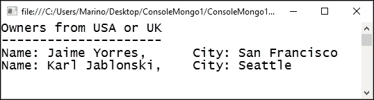

# 第七章：NoSQL 数据库编程

在本章中，我们将回顾一个新兴的数据库范式，它完全改变了数据结构，**NoSQL 数据库**。

简而言之，我将涵盖以下主题：

+   关于 NoSQL 数据库及其在当前开发中的作用的历史背景

+   该领域的可用方案及其主要优缺点

+   不同的 NoSQL 数据库所遵循的架构模型

+   MongoDB 作为首选的 NoSQL 数据库及其基础和主要特性

+   MongoDB 中的 CRUD 操作

+   我们将以如何在 Visual Studio 中集成和使用 MongoDB 以及在 IDE 内管理 CRUD 操作的回顾结束

在过去几年中，谷歌、易贝、Facebook、博世、福布斯、领英、万豪、贝宝、瑞安航空、赛门铁克或 Yammer 等公司都有使用这些数据库的解决方案，仅举几个例子。

如果我们查看专业网站 DB-Engines 发布的统计数据，显示使用率的成果非常清晰，其中一些非关系型数据库出现在目前使用的前十名中（尤其是 MongoDB）：


因此，围绕这些数据库系统出现了一种日益增长的趋势，MongoDb 出现在第四位尤其有意义。前面提到的前五家公司使用 MongoDb 用于不同的目的和场景。

# 简要的历史背景

直到 90 年代中叶，没有人会怀疑 SQL 和关系型数据库是 *事实上的* 标准，当时大多数商业实现都是基于这个假设。

历史上的例子包括 IBM、Oracle、SQL Server、Watcom、Gupta SQLBase 等。然而，随着时间的推移，一些声音开始质疑当时已被称为 *阻抗不匹配* 的问题，即当在面向对象的语言中编程到这些数据库时，数据和源代码的不同表示形式。

这在对象或类定义必须以某种方式映射到数据库（无论是表还是关系模式）时明显表现出来。

由于两个世界支持的不同数据类型，特别是标量类型及其操作语义（例如，不同字符串解释的排序规则），出现了其他问题，尽管面向对象的语言只考虑这个方面在排序例程中，字符串也不像在 RDBMS 系统中那样被视为固定。

此外，两者之间在结构和完整性上存在差异，更不用说在操作和事务中的其他操作差异了。

因此，提出了关于面向对象数据库的新建议，其中信息将以一种方式存储，使得在两个世界之间建立对应关系变得简单直接。然而，这些提议并没有进入商业领域，实际上，只有一些利基领域，如工程和空间数据库、高能物理、一些电信项目和分子生物学解决方案，实际上使用了这种方法。

按照 Martin Fowler 的话说，问题之一是人们在经典数据库中做了大量的集成，这使得改变这种范式变得非常困难。

# NoSQL 世界

随着社交媒体的巨大发展，数据需求也增加了。立即存储和检索大量数据的需要，导致一些参与该问题的公司开始考虑可能的替代方案。

因此，像 BigTable（谷歌）和 Dynamo（亚马逊）这样的项目是解决这个问题的首批尝试之一。这些项目激发了一场新的运动，我们现在称之为 NoSQL 运动，这个术语是由 Johan Oskarsson 在加利福尼亚州关于这些主题的会议上提出的，为此他创建了 Twitter 话题标签#NoSQL。

我们可以将 NoSQL 运动定义为一种广泛的管理数据库类别，它在重要方面与关系数据库的经典模型（RDBMS）不同，最显著的一点是它们不使用 SQL 作为主要的查询语言。

存储的数据不需要固定的结构，如表。结果？它们不支持 JOIN 操作，并且不全面保证**ACID**（**原子性**、**一致性**、**隔离性**和**持久性**）特性，这些是关系模型的核心。此外，它们通常以非常有效的方式水平扩展。

提醒一下：四个 ACID 特性定义如下：

+   **原子性**：这是关系模型的关键；由多个动作组成的操作不应在中间失败。否则，数据将处于不一致的状态。整个操作集被视为一个单元。

+   **一致性**：这扩展到任何动作之后数据库的前后状态。

+   **隔离性**：除了之前的考虑，数据库中事务完成后不应注意到任何副作用。

+   **持久性**：如果一个操作正确结束，系统将不会将其撤销。

NoSQL 系统有时被称为*不仅 SQL*，以强调它们也可以支持 SQL 等查询语言，尽管这一特性取决于实现和数据库类型。

学术研究人员将这些数据库称为结构化存储数据库，这个术语也涵盖了经典的关系数据库。通常，NoSQL 数据库根据它们存储数据的方式分类，包括如键值（Redis）、BigTable/列族（Cassandra、HBase）、文档数据库（MongoDb、Couch DB、Raven DB）和面向图数据库（Neo4j）等类别。

随着实时网站的兴起，很明显，需要提高处理大量数据的能力。将数据组织在类似水平结构中的解决方案得到了企业共识，因为它可以支持每秒数百万个请求。

许多人尝试根据不同的方面（如可扩展性、灵活性、功能性等）对现在在 NoSQL 世界中发现的多种不同提供方案进行分类。Scofield 和 Popescu（[`NoSQL.mypopescu.com/post/396337069/presentation-NoSQL-codemash-an-interesting`](http://NoSQL.mypopescu.com/post/396337069/presentation-NoSQL-codemash-an-interesting)）提出的这些分类之一，根据以下标准对 NoSQL 数据库进行分类：

|   | 性能 | 可扩展性 | 灵活性 | 复杂性 | 功能性 |
| --- | --- | --- | --- | --- | --- |
| **键值存储** | 高 | 高 | 高 | 无 | 可变（无） |
| **列存储** | 高 | 高 | 中等 | 低 | 最小 |
| **文档存储** | 高 | 可变（高） | 高 | 低 | 可变（低） |
| **图数据库** | 可变 | 可变 | 高 | 高 | 图论 |
| **关系数据库** | 可变 | 可变 | 低 | 中等 | 关系代数 |

## 与 RDBMS 相关的架构变化

因此，在使用这些模型之一时，首先要明确的是清楚地识别哪个模型更适合我们的需求。让我们快速回顾这些不平等的架构方法：

+   键/值提议类似于今天在网络上使用的其他轻量级存储系统，特别是`localStorage`和`sessionStorage`API。它们允许在本地系统的专用区域对网页进行读写操作。存储以成对的形式组织，左侧是我们稍后用于检索相关值的键。

    这些数据库不关心存储的信息类型（无论是数字、文档、多媒体等），尽管可能存在一些限制。

+   文档提供方案由简单的文档组成，其中文档可以是复杂的数据结构：

    +   通常，此类数据使用 JSON 格式表示，这是目前使用最广泛的格式，尤其是在网络环境中。

    +   架构允许你读取文档的片段或更改或插入其他片段，而不会受到任何模式的约束。

    +   模式的缺失，对于许多人来说，被认为是 NoSQL 数据库的最好特性之一，但也存在一些缺点。

    +   其中一个缺点是，当我们从某人（例如，一个名字或一个账户）恢复一些数据时，你是在假设一个*隐式模式*，正如 Fowler 所命名的那样。人们默认认为一个人有一个名字字段或账户字段。

    +   实际上，大多数实现都依赖于 ID 的存在，这在实践中就像键/值存储中的键一样工作。

    +   因此，我们可以将这些两种方法视为相似，并且属于一种面向聚合的结构类型。

+   在列族模型中，结构定义了一个单一键（称为行键），与之相关联，你可以存储列族，其中每个列都是一个相关信息的集合。

    +   因此，在这个模型中，访问信息的方式是使用行键和列族名称，因此你需要两个值来访问数据，但模型仍然保留了聚合模型的想法。

+   最后，图导向模型将信息分解成更小的单元，并以非常丰富、紧密的方式将这些单元联系起来。

    +   他们定义了一种特殊语言，允许以在其他类型数据库（包括 RDBMS）中难以表达的方式复杂交织。

如我们之前提到的，大多数 NoSQL 数据库没有在查询中执行连接的能力。因此，数据库模式需要以另一种方式设计。

这导致了在关系数据需要在 NoSQL 数据库中管理时出现几种技术。

### 查询多个查询

这个想法依赖于这些数据库典型的快速响应特性。为了在简单请求中获取所有数据，通常会链式执行多个查询以获取所需的信息。

如果性能损失不可接受，其他方法也是可能的。

### 非规范化数据的问题

在这种情况下，问题通过一种独特的方法得到解决：不是存储外键，而是将相应的外值与模型数据一起存储。

让我们想象一下博客条目。每个条目也可以关联并保存用户名和用户 ID，因此我们可以读取用户名而不需要额外的查询。

缺点是，当用户名更改时，修改将不得不在数据库中的多个地方存储。因此，当读操作（相对于写操作）的平均值相当大时，这种方法很方便。

### 数据嵌套

正如我们将在 MongoDB 的实践中看到的那样，一种常见的做法是基于将更多数据放在更少的集合中。在实践中，这意味着在之前想象的博客应用程序中，我们可以在博客帖子文档中存储评论。

这样，一个查询就可以获取所有相关的评论。在这种方法中，只有一个文档包含执行特定任务所需的所有数据。

实际上，由于这些数据库中没有固定的模式，这种做法已经变成了一个事实上的实践。

### 小贴士

换句话说，这里遵循的哲学是尽可能地将数据保存得使查询所需的存储单元数量最小（理想情况下，只有一个）。

使用的术语也会发生变化。以下表格简要说明了 SQL 和 NoSQL 数据库之间在关系方面的等价性：

| SQL | MongoDB |
| --- | --- |
| 数据库 | 数据库 |
| 表 | 集合 |
| 行 | 文档或 BSON 文档 |
| 列 | 字段 |
| 索引 | 索引 |
| 表连接 | 嵌入式文档（带链接） |
| 主键（唯一列或列组合） | 主键（在 MongoDB 中自动设置为`_id`字段） |
| 聚合（例如，按组） | 聚合管道 |

## 关于 CRUD 操作

在本章中我们将使用的 MongoDB 的情况下，一个读取操作是对特定文档集合的查询。查询指定了（条件）标准，以确定 MongoDB 必须返回给客户端的文档。

任何查询都需要表达输出中所需的字段。这通过投影来解决：一个语法表达式，列出了指示匹配文档的字段。MongoDB 的行为遵循以下规则：

+   任何查询都是针对单个集合的

+   查询语法允许您建立过滤器、排序和其他相关限制

+   除非`sort()`方法成为查询的一部分，否则不使用预定义的顺序

+   所有 CRUD 操作使用相同的语法，在读取和修改操作之间没有区别

+   具有统计特性的查询（聚合查询）使用$match 管道来允许访问查询的结构

传统上，即使在关系型模型中，那些改变信息（创建、更新或删除）的操作也有它们自己的语法（在 SQL 世界中是 DDL 或 DML）。在 MongoDB 中，它们被称为数据修改操作，因为它们在一个单独的集合中修改数据。然而，对于更新操作，通常会有一个概念上的划分，以区分点更新（修改）和完全更改的更新（替换）。在这种情况下，只有`_id`字段被保留。

总结来说，操作提供可以概括如下：

+   添加信息是通过插入操作完成的（要么是将新数据添加到现有集合中，要么是添加新文档）

+   变更采用两种形式：更新修改现有数据，删除操作则完全从给定的集合中删除数据

+   这三个操作在单个过程中不会影响超过一个文档

+   如前所述，更新和删除可以使用不同的标准来确定哪些文档被更新或删除：

    +   这些操作使用的语法与纯读取查询使用的语法有明显的相似性

    +   实际上，其中一些操作是管道化的，也就是说，通过链式调用与前面的查询相链接

因此，在 MongoDB 的情况下，我们会有一个如下所示的架构：


# MongoDB on Windows

当然，如果我们想遵循本章中的示例，需要在我们的本地机器上安装 MongoDB。你可以从官方网站([`www.mongodb.com`](https://www.mongodb.com))进行安装，那里提供了适用于最流行操作系统的安装软件（Windows、Mac、Linux 和 Solaris）。

你还会找到产品的不同版本，包括针对 Mongo 不同版本的 Enterprise 版本。为了本主题的目的，我们可以使用流行的 Community Edition Server 版本，并使用过程生成的`.msi`文件下载和安装它。

根据文档说明，安装程序包括所有其他软件依赖项，并将自动升级之前安装的任何旧版 MongoDB。当前版本（在撰写本文时）是 3.2.6，并且会定期更新。这个过程只需几秒钟：


## 文件结构和默认配置

安装的结果，一组文件将出现在`Program Files/MongoDB`目录中，包含许多实用程序和工具，以及服务器本身。需要关注的主要文件是`mongod.exe`，它是服务器可执行文件，以及命令行实用程序（`mongo.exe`），它提供了一套交互式选项，并允许数据操作。

如果你启动服务器，将弹出一个命令窗口，显示一些默认配置参数：

+   它在`c:\data\db`创建一个默认的数据目录，这是其内部数据以及用户的默认物理位置。在此目录中，默认创建一个日志数据文件。可以使用`mondod –dbpath U:\datapath`命令进行更改。

+   另一个存储位置在`c:\data\db\diagnostic.data`初始化，专门用于活动监控。

+   端口`27017`被分配用于通过 TCP 监听连接。你可以在配置中更改它，或者通过带有`--port` [number] 参数调用`Mongod.exe`。

在这一点上，你可以开始与数据库交互。为此，在命令行方式下，你应该使用`mongo.exe`。一旦启动，你可以请求帮助，并将显示初始命令列表。

一个简单的`show dbs`命令将输出，在我的情况下，有两个现有的数据库（之前安装的数据库不会删除，因为它们位于另一个目录）：


为了连接到特定的数据库，我们可以像截图所示那样输入`use <db_name>`。此命令还允许创建一个新的数据库。因此，如果数据库存在，MongoDB 将切换到它；否则，它将创建一个新的数据库。

一个更有用的功能允许你请求对具体数据库的帮助。例如，如果我们的`Personal`数据库包含一个`People`集合，我们可以使用以下命令请求具体帮助：

```cs
use Personal
db.Personal.help()

```

另一个有用的实用工具是 `mongoimport.exe`，它允许您从可能拥有的物理文件中导入数据。我们将使用此工具导入从国际自行车联盟（[`www.uci.ch/road/ranking/`](http://www.uci.ch/road/ranking/））获得的 2016 年统计数据扁平 JSON 文件。一旦我们将文件移动到 `c:\data\db` 目录（无论如何都可以从另一个位置完成），我们就可以使用以下命令将此数据导入到新的数据库中：

```cs
mongoimport --jsonArray --db Cyclists --collection Ranking16 < c:\data\db\Ranking15.json
2016-05-06T13:57:49.755+0200    connected to: localhost
2016-05-06T13:57:49.759+0200    imported 40 documents

```

在切换到数据库后，我们可以开始查询数据库并找到我们集合中的第一个文档：


如您所见，第一个命令告诉我们插入的文档数量，下一个命令检索第一个文档。这里有一点需要指出，那就是文档中的 `_id` 元素。它是导入过程自动插入的，以便在集合中唯一标识每个文档。

### 一些有用的命令

通常，我们可以使用 Mongo 提供的庞大命令集以不同的方式查询数据库。例如，如果我想列出所有来自大不列颠的自行车手，我可以编写以下代码：

```cs
> db.Ranking16.find( {"Nation": "Great Britain"} )
{ "_id" : ObjectId("572c8b77e8200fb42f000019"), "Rank" : "25 (24)", "Name" : "Geraint THOMAS", "Nation" : "Great Britain", "Team" : "SKY", "Age*" : 30, "Points" : 743 }
{ "_id" : ObjectId("572c8b77e8200fb42f000022"), "Rank" : "34 (32)", "Name" : "Ian STANNARD", "Nation" : "Great Britain", "Team" : "SKY", "Age*" : 29, "Points" : 601 }
{ "_id" : ObjectId("572c8b77e8200fb42f000025"), "Rank" : "37 (35)", "Name" : "Ben SWIFT", "Nation" : "Great Britain", "Team" : "SKY", "Age*" : 29, "Points" : 556 }

```

因此，为了过滤信息，`find()` 方法期望使用对象表示法语法编写的标准，这是 JavaScript 的典型语法。然而，我们也可以使用数组语法从总数中选择一个：

```cs
> db.Ranking16.find( {"Nation": "Great Britain"} )[0]
{
 "_id" : ObjectId("572c8b77e8200fb42f000019"),
 "Rank" : "25 (24)",
 "Name" : "Geraint THOMAS",
 "Nation" : "Great Britain",
 "Team" : "SKY",
 "Age*" : 30,
 "Points" : 743
}

```

如您所想象，其他选项允许在文档中投影所需元素，而不是检索整个文档。例如，我们可以使用以下代码请求列表中所有来自西班牙的自行车手的姓名和年龄：

```cs
> db.Ranking16.find( {"Nation": "Spain"}, {"Name":1, "Age*":1} )
{ "_id" : ObjectId("572c8b77e8200fb42f000006"), "Name" : "Alberto CONTADOR VELASCO", "Age*" : 34 }
{ "_id" : ObjectId("572c8b77e8200fb42f00000a"), "Name" : "Alejandro VALVERDE BELMONTE", "Age*" : 36 }
{ "_id" : ObjectId("572c8b77e8200fb42f00000e"), "Name" : "Jon IZAGUIRRE INSAUSTI", "Age*" : 27 }
{ "_id" : ObjectId("572c8b77e8200fb42f00001c"), "Name" : "Samuel SANCHEZ GONZALEZ", "Age*" : 38 }

```

与要检索的字段相关的数字仅表示需要存在（我们希望在输出列表中）如果它们大于 0，或者如果它们是 0 则表示不存在。

假设我们需要意大利自行车手的列表，包括他们的姓名和车队，而不需要其他字段。我们可以输入以下内容：

```cs
> db.Ranking16.find( {"Nation": "Italy"}, {"Name":1, "Team":1, "_id": 0 } )
{ "Name" : "Sonny COLBRELLI", "Team" : "BAR" }
{ "Name" : "Enrico GASPAROTTO", "Team" : "WGG" }
{ "Name" : "Diego ULISSI", "Team" : "LAM" }
{ "Name" : "Giovanni VISCONTI", "Team" : "MOV" }

```

其他组合允许您使用 JavaScript 声明来检索可以用于获取另一个结果集的部分信息。在这里，我们将查询加载到变量中并直接调用它：

```cs
> var fellows = db.Ranking16.find({"Nation":"Australia"} , { "Name":1 , "Nation":1, "_id":0 });
> fellows
{ "Name" : "Richie PORTE", "Nation" : "Australia" }
{ "Name" : "Simon GERRANS", "Nation" : "Australia" }
{ "Name" : "Michael MATTHEWS", "Nation" : "Australia" }

```

#### 操作符

MongoDB 中可用的操作符列表相当庞大，根据官方文档的说明，它们可以根据用途分为三个主要类别：

+   查询和投影

+   更新

+   聚合管道

每个这些类别都包含大量的选项，因此您可以参考官方文档以获取更多详细信息（[`docs.mongodb.com/manual/reference/operator/`](https://docs.mongodb.com/manual/reference/operator/)）。为了本章的目的，我们将使用在 MongoDB 日常工作中出现的一些最常见的操作符。以下表格列出了最常用的操作符：

| 操作符 | 描述 |
| --- | --- |
| `$eq` | 匹配等于指定值的值 |
| `$gt` | 匹配大于指定值的值 |
| `$gte` | 匹配大于或等于指定值的值 |
| `$lt` | 匹配小于指定值的值 |
| `$lte` | 匹配小于或等于指定值的值 |
| `$ne` | 匹配所有不等于指定值的值 |
| `$in` | 匹配数组中指定的任何值 |
| `$nin` | 匹配数组中指定的所有值 |

注意，您可以在不同的上下文或域查询中找到一些这些运算符：例如，前面表格中的大多数运算符也存在于与聚合管道相关的运算符集中。

另一个重要的线索是，这些区域提供了根据上下文以多种方式处理信息的机制。实际上，我们在 SQL Server 或 Oracle RDBMS 中找到的许多运算符在这里都有等效项，总是以 `$` 符号开头。例如，您可以使用聚合管道中的算术运算符来创建计算字段，或者您可以使用作为 MongoDB 命令定义的一些数学运算符，这些运算符甚至在语法上都与我们在 C# 或 JavaScript 中的 Math 静态类中可以找到的运算符相似：`$abs`、`$ceil`、`$log`、`$sqrt` 等等。

这在其他典型的 RDBMS 运算符中也会发生，例如在统计查询中常用到的聚合运算符：`$sum`、`$avg`、`$first` 等等。其他常见的运算符家族，有助于管理操作，包括日期运算符、字符串运算符、数组运算符和集合运算符。

使用它们的方式始终取决于要执行的操作的上下文。在查询中，我们可以将它们嵌入为作为过滤标准的表达式的一部分。然而，请记住，操作数和运算符形成一个对象表达式标准。此外，请记住，这些表达式中的几个可以用逗号分隔表示。

让我们假设我们想要一个拥有超过 1,000 分且少于 1,300 分的自行车手的列表。我们可以这样表达：

```cs
> db.Ranking16.find( {"Points": {$gt:1000, $lte: 1300}}, {"Name":1, "_id": 0 } )
{ "Name" : "Alexander KRISTOFF" }
{ "Name" : "Sep VANMARCKE" }
{ "Name" : "Ilnur ZAKARIN" }
{ "Name" : "Alejandro VALVERDE BELMONTE" }
{ "Name" : "Sergio Luis HENAO MONTOYA" }
{ "Name" : "Richie PORTE" }
{ "Name" : "Wouter POELS" }

```

注意，我们在用逗号分隔的值（最小值和最大值）表达分数限制时隐含了一个 AND 运算符。

OR 运算符也可以用这种方式表达（`$or`），但某些情况下的语法需要仔细分离关注点。让我们想象一个需要找到属于英联邦的自行车手的案例，例如。我们需要一个 `$or` 运算符来根据这种语法表达这个条件（为了简洁，我们省略了列表上没有的其他国家）：

```cs
{ $or: [ {"Nation" : "Great Britain"}, { "Nation": "Ireland" }, {"Nation" : "Australia"} ] }

```

实际上，此类查询的结果如下：

```cs
> db.Ranking16.find( { $or : [ {"Nation": "Great Britain"}, { "Nation" : "Ireland"}, { "Nation": "Australia" } ] } , {"Name":1, "_id": 0 } )
{ "Name" : "Richie PORTE" }
{ "Name" : "Simon GERRANS" }
{ "Name" : "Geraint THOMAS" }
{ "Name" : "Michael MATTHEWS" }
{ "Name" : "Daniel MARTIN" }
{ "Name" : "Ian STANNARD" }
{ "Name" : "Ben SWIFT" }

```

## 修改数据——CRUD 操作的其余部分

修改我们数据库内容的行为由三个方法表示：

+   **添加**：`insert()`

+   **删除**：`remove()`

+   **修改**：`update()`

例如，在第一种情况下，我们可以将插入操作表示为一个 JavaScript 变量，并使用该变量将其传递给`insert()`方法：

```cs
> var newCyclist = {
... "Rank" : 139,
... "Name": "Lawson CRADDOCK",
... "Nation": "United States",
... "Team" : "CPT",
... "Age*": 24,
... "Points": 208
... }
> db.Ranking16.insert(newCyclist)
WriteResult({ "nInserted" : 1 })

```

我们可以看到 Mongo 多了一行，这表明已经插入了一个新的文档（此外，也可以传递一个数组进行多个插入）。

此外，还有一个我们之前提到的重要因素，这与灵活性有关。假设我们想包括来自美国的另一位重要跑步者，比如 Tejay Van Garderen，但在这个情况下，我们有一些与他国家细节相关的额外信息，比如他出生的`State`（华盛顿）和`City`（塔科马）。我们希望将这些信息包含在集合中。

我们将按照相同的方式进行，只是将一个由三个字段组成的复杂值分配给`Nation`值：`Name`、`State`和`City`。我们可以像之前一样进行，但包括这些更改。

在此过程之后，查看内容将显示插入的信息结构及其新的值：

```cs
> newCyclist
{
 "Rank" : 139,
 "Name" : "Lawson CRADDOCK",
 "Nation" : {
 "Name" : "United States",
 "State" : "Washington",
 "City" : "Tacoma"
 },
 "Team" : "CPT",
 "Age*" : 24,
 "Points" : 208
}

```

插入过程很顺利，但我犯了一个（复制/粘贴）错误，没有正确更改跑步者的名字（其余数据都正常，但名字必须修改）。因此，我们可以使用`update()`命令来实现这个目标。

这很简单；我们只需要将目标文档作为第一个参数本地化，并将新数据作为第二个参数指示：

```cs
> db.Ranking16.update({ "Name": "Lawson CRADDOCK" }, { "Name" : "Tejay VAN GARDEREN"})
WriteResult({ "nMatched" : 1, "nUpserted" : 0, "nModified" : 1 })

```

结果：找到一份文档并修改了一份。

### 文本索引

现在，我们想要列出我们集合中所有来自美国的自行车手。MongoDB 提供了一个有趣的选项：创建一个文本索引，稍后用于文本搜索。在创建时，我们可以指定需要包含在索引中的文本字段（及其数据类型）；例如，看看以下内容：

```cs
> db.Ranking16.createIndex( { Name: "text", Nation: "text"} )
{
 "createdCollectionAutomatically" : false,
 "numIndexesBefore" : 1,
 "numIndexesAfter" : 2,
 "ok" : 1
}

```

使用之前的代码，我们已经索引了两个字段，现在索引总数为两个（记住`_id`索引是自动创建的）。这对于实际使用来说很完美，因为我们现在可以编写以下内容：

```cs
> db.Ranking16.find( { $text: { $search: "Tejay Lawson" } }).pretty()
{
 "_id" : ObjectId("572cdb8c03caae1d2e97b8f1"),
 "Rank" : 52,
 "Name" : "Tejay VAN GARDEREN",
 "Nation" : {
 "Name" : "United States",
 "State" : "Washington",
 "City" : "Tacoma"
 },
 "Team" : "BMC",
 "Age*" : 28,
 "Points" : 437
}
{
 "_id" : ObjectId("572cdcc103caae1d2e97b8f2"),
 "Rank" : 139,
 "Name" : "Lawson CRADDOCK",
 "Nation" : "United States",
 "Team" : "CPT",
 "Age*" : 24,
 "Points" : 308
}

```

注意，搜索时没有指定字符串在字段中的位置。输出显示了具有不同`Nation`字段数据结构的两个文档。

如果我们没有索引，也可以使用其他运算符进行搜索，例如`$in`，它使用以下语法原型：

```cs
{ field: { $in: [<value1>, <value2>, ... <valueN> ] } }

```

因此，我们可以将包含所有来自法国和西班牙的自行车手的类似查询重写如下：

```cs
> db.Ranking16.find( {"Nation": { $in: ["France", "Spain"] }}, {"_id":0, "Rank":0, "Points":0, "Age*":0, "Team":0})
{ "Name" : "Thibaut PINOT", "Nation" : "France" }
{ "Name" : "Alberto CONTADOR VELASCO", "Nation" : "Spain" }
{ "Name" : "Alejandro VALVERDE BELMONTE", "Nation" : "Spain" }
{ "Name" : "Jon IZAGUIRRE INSAUSTI", "Nation" : "Spain" }
{ "Name" : "Arnaud DEMARE", "Nation" : "France" }
{ "Name" : "Bryan COQUARD", "Nation" : "France" }
{ "Name" : "Nacer BOUHANNI", "Nation" : "France" }
{ "Name" : "Samuel SANCHEZ GONZALEZ", "Nation" : "Spain" }
{ "Name" : "Romain BARDET", "Nation" : "France" }
{ "Name" : "Julian ALAPHILIPPE", "Nation" : "France" }

```

对于删除，程序相当直接。只需记住，删除根据操作定义的标准会影响一个或多个文档。在这种情况下，请记住，在关系型模型中可能配置的级联行为在 MongoDB 中是没有等效的。

# MongoDB from Visual Studio

您可以直接在 MongoDB 官方网站上找到许多 MongoDB 驱动程序，包括几个 C#语言的版本，目前代表版本 2.2.3。此驱动程序支持我在本书中使用的 MongoDB 版本（v. 3.2）。

实际上，这个版本是在 Visual Studio 2015 中创建和测试的，这也是在这里使用它的另一个原因。您可以在[`docs.mongodb.com/ecosystem/drivers/csharp/`](https://docs.mongodb.com/ecosystem/drivers/csharp/)地址找到一个包含解释、其他资源链接、视频、文章、社区支持工具、演示文稿等内容的一整页。此驱动程序是 MongoDB 的官方支持驱动程序。

## 首次演示：从 Visual Studio 执行简单查询

对于驱动程序的安装，有几种方法，但您可以使用 Visual Studio 中的 NuGet 来安装它，因此我们将首先构建一个新的控制台项目（ConsoleMongo1），然后选择 NuGet 窗口交互。一旦进入，键入`MongoDB`将显示一系列库，包括位于首位的官方驱动程序。

如您在下面的屏幕截图中所见，安装了三个库：两个版本的 MongoDB 驱动程序（核心和标准）以及包含序列化基础设施的 Mongo.BSon，您可以使用它来构建高性能序列化器：


要使用 C#与 MongoDB 交互，驱动程序提供了一组方便的对象，其中大部分代表我们在 Mongo Command Window 中执行先前操作时所使用的内容。

在任何操作之前，重要的是要记住，NoSQL 结构是灵活的，但为了从 C#端正确工作，拥有一个数据结构（数据模型或合约）更有用。为此，我们可以从我们的数据库中复制并粘贴单个文档，并使用**粘贴为 JSON**选项，这将结构转换为包含文档中定义的键作为类字段的类集。

对于本部分的演示，我选择了另一个数据库源，它更类似于我们会在实际应用中使用的内容。为此目的，一个可能的数据源是 NorthWind JSON 网站，它提供了多年来在 Microsoft Access 和 SQL Server 中用作演示数据库的流行 NorthWind 数据库的 JSON 版本。您可以在[`northwind.servicestack.net/customers?format=json`](http://northwind.servicestack.net/customers?format=json)找到这个数据库。我从这里下载了两个表：`Customers`和`Orders`。请记住，在导入过程中，将生成一个名为`_id`的新字段。

当您使用**粘贴为 JSON**选项时，其`_id`字段将被分配为一个字符串，但内部实际上是一个`ObjectId`类型。为了避免以后出现问题，您可以手动将其更改为如下定义：

```cs
public class Customer
{
  public ObjectId _id { get; set; }
  public string CustomerID { get; set; }
  public string CompanyName { get; set; }
  public string ContactName { get; set; }
  public string ContactTitle { get; set; }
  public string Address { get; set; }
  public string City { get; set; }
  public object Region { get; set; }
  public string PostalCode { get; set; }
  public string Country { get; set; }
  public string Phone { get; set; }
  public string Fax { get; set; }
}
```

现在我们做一个简单的查询，我们可以在控制台窗口中列出。为了实现这一点，我们需要引用前面提到的库并遵循基本步骤：连接到 NorthWind 数据库，获取集合的引用，定义查询（我们可以为此使用 Linq 和/或泛型功能），并展示结果。

一个初始的简单方法如下：

```cs
class Program
{
  static IMongoClient client;
  static IMongoDatabase db;
  static void Main(string[] args)
  {
    BasicQuery();
  }
  private static void BasicQuery()
  {
    client = new MongoClient();
    db = client.GetDatabase("NorthWind");
    var coll = db.GetCollection<Customer>("Customers");

    var americanCustomers = coll.Find(c => c.Country == "USA")
    .ToListAsync().Result;
    string title = "Customers from United States";
    Console.WriteLine(title);
    Console.WriteLine(string.Concat(Enumerable.Repeat("-", title.Length)));
    foreach (var c in americanCustomers)
    {
      Console.WriteLine($"Name: {c.ContactName}, \t City: {c.City} ");
    }
    Console.Read();
  }
}
```

如果您启动应用程序，控制台窗口将显示请求的客户集：


因此，让我们快速回顾一下这个过程。`MongoClient` 代表与 MongoDB 服务器的连接。它遵循对所需数据库的引用。一旦到达那里，我们获取 `Customers` 集合，但由于我们已经知道客户类型及其成员，我们可以使用泛型来表示这一点，表明调用 `GetCollection<Customer>("Customers")` 的结果就是那种类型（注意，集合是复数名称）。

当集合变量准备好后，它可以像任何其他泛型集合一样使用，因此我们可以使用 lambda 表达式、LINQ 以及所有其他资源，就像我们在前面的章节中所做的那样。

然而，请注意，我们已经以同步模式运行了一个查询。当可用的数据量（要搜索的）很大时，建议使用异步操作。因此，让我们使查询更加复杂，并以这种方式运行它。

例如，假设我们需要知道来自美国或英国的哪些客户同时也是所有者（`CustomerTitle` 字段的值是 `Owner`）。因此，我们需要一个更复杂的过滤器。我们还希望这个过程是异步的，以避免阻塞错误或无响应的用户界面。因此，我们将使用 `async`/`await` 操作符以这种方式构建一个方法：

```cs
async private static void CustomerQueryAsync()
{
  client = new MongoClient();
  db = client.GetDatabase("NorthWind");
  var coll = db.GetCollection<Customer>("Customers");
  var owners = await coll.FindAsync(c =>
    (c.Country == "USA" || c.Country == "UK") && c.ContactTitle == "Owner")
  .Result.ToListAsync();
  string title = "Owners from USA or UK";
  Console.WriteLine(title);
  Console.WriteLine(string.Concat(Enumerable.Repeat("-", title.Length)));
  foreach (var c in owners)
  {
    Console.WriteLine($"Name: {c.ContactName}, \t City: {c.City} ");
  }
}
```

因此，我们现在以异步方式（非阻塞方式）执行查询，只需进行一些更改，就可以获取几个条目：



注意，除了使用 `async`/`await` 操作符之外，查询的结尾略有变化。我们现在从 `Result` 对象中调用 `toListAsync()` 方法以获取最终的集合。其余的就像在先前的（同步）方法中所做的那样。

## CRUD 操作

如您所想象，CRUD 操作完全受支持，尤其是在使用此新版本的驱动程序时，它包括各种新的可能性。

这些操作中的大多数都根据您是否只想处理集合中的一个或多个文档分为两大类。因此，我们发现方法如 `DeleteOne`/`DeleteMany`、`InsertOne`/`InsertMany`、`ReplaceOne`/`ReplaceMany` 等。反过来，它们为每个方法提供同步和异步版本。

### 删除

例如，为了删除单个客户，我们可以使用以下方法：

```cs
async private static void DeleteCustomerAsync()
{
  var CustDel = await coll.FindOneAndDeleteAsync(c => c.CustomerID == "CHOPS");
  // List customers from Switzerland to check deletion
  BasicQuery("Switzerland");
}
```

您可以看到我们使用了一种非常方便的方法，它允许我们在单一（原子）操作中找到并删除单个文档（`FindOneAndDeleteAsync`）。

此外，我们将 `BasicQuery` 方法更改为接收一个包含要列出国家的字符串，并在删除后立即再次调用该方法以检查一切是否正常。现在该国只有一个客户：


作为备注，请记住，如果没有找到文档，应用程序抛出的任何可能的异常都应该按照常规方式处理。

### 插入

插入遵循类似的模式。我们根据合同定义创建一个新客户，并使用简单直接的方式异步插入：

```cs
async private static void InsertCustomerAsync()
{
  Customer newCustomer = new Customer()
  {
    CustomerID = "ZZZZZ",
    CompanyName = "The Z Company",
    ContactName = "Zachary Zabek",
    City = "Zeeland",
    Region = "Michigan",
    Country = "USA"
  };
  await coll.InsertOneAsync(newCustomer);
  BasicQuery("USA");
  Console.Read();
}
```

如果一切正常，我们将看到以下截图所示的输出：


### 修改和替换

在处理文档集合时，通常区分更新和替换。在第一种情况下，我们管理的是类似于标准 SQL 语言中 `UPDATE` 子句的内容。

第二种情况涉及文档的完全替换，但 `_id` 字段除外，它是不可变的。在这种情况下，由于没有固定的模型可以遵循，替换的信息可能与之前的信息完全不同。

要替换内容，使用 `Builders` 类的静态方法很方便，该类提供了 C# 驱动。我们可以为我们的客户定义一个通用的 `Builder` 类，并使用 `Filter` 和 `Update` 方法定位和替换指定的文档。

以下代码正是如此：它定位之前插入的公司并将 `CompanyName` 字段更改为另一个字符串：

```cs
async private static void ModifyCustomerAsync()
{
  var filter = Builders<Customer>.Filter.Eq("CompanyName", "The Z Company");
  var update = Builders<Customer>.Update
  .Set("CompanyName", "ZZZZZ Enterprises");
  var result = await coll.UpdateOneAsync(filter, update);
  BasicQueryByCompany("USA");
}
```

注意，我包含了一个名为 `BasicQueryByCompany` 的 `BasicQuery` 方法版本，以便允许在输出中返回修改后的字段：


在替换的情况下，您可以使用 `ReplaceOneAsync` 和 `ReplaceManyAsync` 方法，就像我们为更新所做的那样。

此外，SQL 数据库中您可能习惯的大多数典型操作也在这里：分组、统计结果、安全配置等等。

NoSQL 数据库的采用是另一回事：可扩展性、可用性、对 NoSQL 的先前知识以及学习曲线只是你在选择新项目中这些数据库之一时可能考虑的几个因素。无论如何，大多数可用的 NoSQL 数据库从 .NET 平台的支持对于大多数实现都是保证的，因此这不应该是一个问题。

# 摘要

在本章的整个过程中，我们了解了 NoSQL 数据库的基础和基本知识，从它们的历史演变开始，到与这种存储方法相关的多种架构和特性，以及我们今天可以找到的最典型实现列表。

我们还从通用角度探讨了在这些环境中如何正确管理 CRUD 操作。

然后，我们转向 MongoDB，分析其在 Windows 系统中的安装和管理细节，在开始使用 MongoDB 实例的默认（命令行）工具操作和导入、操作、列出和修改其内容之前，无需任何外部工具以研究其使用背后的底层机制。

最后，我们使用了在官方 MongoDB 网站上可用的 C#驱动程序，从控制台应用程序中完成相同的 CRUD 操作，包括在 LOB 应用程序中所需的最典型操作。

在下一章中，我们将探讨如何使用一些——众多——作为开源资源可用的项目和工具，这些资源和项目如今由微软监控并积极支持，包括 Roselyn 服务、新的 TypeScript 语言以及其他。
