# 第十章。设计模式

在本章中，我们不是关注管理解决方案生命周期（有时称为开发生态系统）所需的架构和工具，而是关注代码及其结构在效率、精确性和可维护性方面的质量。

我们将从 Robert Martin 提出的 SOLID 原则开始，这些原则越来越受到认可，并且我们可以看到它们在不同的框架和技术中得到实施。

将使用一个基本应用程序来展示不同的原则，随着需求的演变，我们将应用不同的原则和模式来解决问题。

最后，我们将根据统计数据回顾 Gang of Four（四人帮）最常用的八种模式，修订其定义和目的，以完成 GoF 小组发布书籍后创建和发布的当前可用模式列表。

因此，本章涵盖的主题如下：

+   SOLID 原则

+   开放/封闭原则

+   Liskov 替换原则

+   接口隔离原则

+   依赖倒置原则

+   设计模式

+   其他软件模式

+   其他模式

# 起源

随着时间的推移，编程技术随着语言和硬件的发展而发展；因此，从 20 世纪 60 年代初的初始混乱，当时没有建立基础，考虑的模型很少，70 年代标志着其他范式的采用开始，如过程式编程，后来又出现了**面向对象编程**（**OOP**）。

Ole-Johan Dahl 和 Kristen Nygaard 最初在挪威计算中心工作时，提出了使用 Simula 语言的面向对象编程（OOP）。他们因这些成就获得了图灵奖以及其他认可。

几年后（大约 1979 年），Bjarne Stroustrup 创建了带有类的 C 语言，这是今天 C++的原型，因为他认为 Simula 中有价值的一面，但他认为它对于实际应用来说太慢了。C++最初具有命令式特征、面向对象和泛型特征，同时提供用于低级内存操作编程的能力。

它是第一个被普遍采用（尽管数量有限）的面向对象编程语言，由于其许多优点，但许多人认为它不足以用于商业应用。

随后，Java 和.NET 平台的出现为许多程序员提供了一个更容易、更经济的解决方案，同时仍然在面向对象编程语言所倡导的有序空间内发展。

因此，面向对象编程（OOP）被采纳，并且直到今天，没有其他重要的编程范式能够替代这些思想。当然，还有其他方法，比如函数式编程，但即使是这一趋势的最显著代表 JavaScript，在最新版本（ECMAScript 2015）中也变得更加面向对象。

随着软件解决方案的加速扩展，我们学到了许多关于如何正确处理常见软件问题的经验教训，这将是我们的起点。

# SOLID 原则

一些编程指南具有广泛、通用的目的，而另一些则是为了解决某些特定问题而设计的。因此，在讨论具体问题之前，我们应该回顾那些可以在许多不同场景和解决方案中应用的特征。我的意思是那些应该超越解决方案类型或特定平台编程的考虑原则。

此外，这就是 SOLID 原则（以及其他相关问题）发挥作用的地方。在 2001 年，罗伯特·马丁（Robert Martin）发表了一篇关于该主题的基础性文章([`butunclebob.com/ArticleS.UncleBob.PrinciplesOfOod`](http://butunclebob.com/ArticleS.UncleBob.PrinciplesOfOod))，在其中他挑选了一套原则和指南，用他自己的话说，*非常紧密地关注依赖管理*，其不便之处以及如何解决这些问题。

用他的话进一步解释，*糟糕的依赖管理会导致代码难以更改、脆弱且不可重用*。可重用性是面向对象编程的主要原则之一，与可维护性（随着项目增长而改变的能力：继承的一个目的）并列。

总体来说，有 11 个原则需要考虑，但它们可以分为三个领域：

+   SOLID 原则，涉及类设计

+   其余的原则，关于包的：其中三个关于包的内聚性，另外三个研究包之间的耦合以及如何评估包结构

我们将从 SOLID 原则开始，这些原则不仅影响类设计，还影响其他架构。

例如，应用这些想法中的某些内容为 HTML5 构建中的某些最重要的修改铺平了道路。

应用**SRP**（**单一职责原则**），从中衍生出更一般的设计原则——关注点分离，仅强调了完全分离表示（CSS）和内容（HTML）的需要，以及随后一些标签（`<cite>`、`<small>`、`<font>`等）的弃用。

### 注意

其中一些上述标签已被弃用，不推荐作为表示功能，但它们保留在标准中，是因为它们的语义价值，例如`<b>`、`<i>`、`<small>`等。

这适用于一些流行的框架，例如 AngularJS，它不仅考虑了单一职责原则，还基于依赖倒置原则（SOLID 中的**D**）。

下一个图表总结了五个原则的首字母及其对应关系：

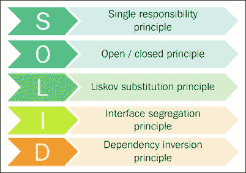

维基百科中关于该缩写每个字母的解释如下：

+   **S - 单一职责原则**：一个类应该只有一个职责（也就是说，只有软件规范的一个潜在变化能够影响类的规范）。马丁表示，这个原则基于之前由汤姆·德·马尔科在《结构化分析和系统规范》一书中以及梅利尔·佩奇-琼斯在他的著作《结构化系统设计实用指南》中定义的凝聚性原则。

+   **O - 开放/封闭原则**：软件实体应该对扩展开放，但对修改封闭。伯特兰·迈耶是第一个提出这一原则的人。

+   **L - Liskov 替换原则**：*程序中的对象应该可以用其子类型实例替换，而不会改变该程序的正确性*。芭芭拉·利斯科夫首先提出了这个原则。

+   **I - 接口隔离原则**：*许多针对特定客户端的接口比一个通用接口更好*。罗伯特·C·马丁是第一个使用并制定这一原则的人。

+   **D - 依赖倒置原则**：*我们应该“依赖于抽象”。不要依赖于具体实现*。这个想法也是由罗伯特·C·马丁提出的。

## 单一职责原则

对于**单一职责原则**（SRP），基本陈述在这种情况下是*一个类不应该有超过一个改变的理由*。在这种情况下，职责被定义为*改变的理由*。如果在任何情况下，出现多个理由来改变类，那么类的职责是多个的，应该重新定义。

这确实是最难正确应用的原则之一，因为正如马丁所说，*合并职责是我们自然而然做的事情*。

在他的书《敏捷原则、模式和 C#实践》中，马丁提出一个典型的例子来展示差异，如下所示：

```cs
interface Modem
{
  public void dial(String phoneNumber);
  public void hangup();
  public void send(char c);
  public char recv();
}
```

给定前面的接口，任何实现这个接口的类都有两个职责：连接管理和通信本身。这样的职责可以从应用程序的不同部分使用，而这些部分也可能随之改变。

与此代码结构不同，马丁提出了不同的图示：

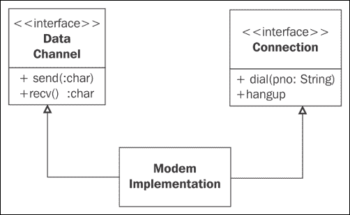

然而，人们可能会想，这两个职责是否应该分开？这完全取决于应用的变化。更准确地说，关键在于知道应用的变化是否会影响连接函数的签名。如果会，我们就应该将两者分开；否则，没有必要分开，因为那样会创造不必要的复杂性。

因此，总的来说，变化的原因是关键，但请记住，变化的原因只有在发生变化时才适用。

在其他情况下，只要它们与业务定义紧密相关或与操作系统的硬件要求有关，就有理由将不同的职责保持在一起。

### 一个例子

让我们假设我们需要创建一个简单的 Windows Forms 应用程序（我们选择这个模型是为了简单，以避免不必要的 XAML），该应用程序能够向用户提供几款汽车（实际上，只有三个不同的品牌），并且应用程序应该显示所选汽车的最高速度和照片。

稍后，我们可以从类层次结构中派生出不同的版本，这些版本能够覆盖不同的特征，具体包括业务模型或法律条件等。

因此，第一步是根据指示表示将覆盖之前提到的要求的用户界面。我设计了一个非常简单的 Windows 窗体，如下面的截图所示：

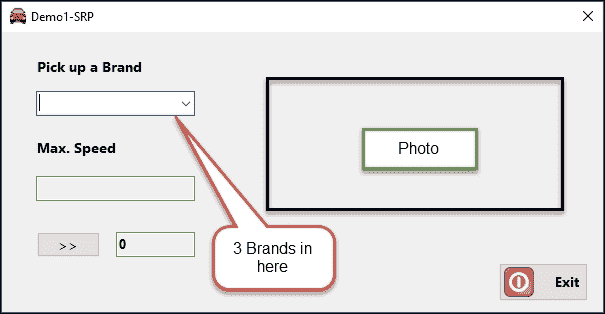

我们处理的是三个（或更多）品牌，并且可选地有一个地方来显示最大速度值。我们还包括了一个加速按钮，以便我们可以验证汽车永远不会超过其最大速度限制。最后，照片将提醒我们我们正在处理的是哪款汽车。

因此，我们计划定义一个名为`SportCar`的类，在这个类中，我们将抽象出从 UI 管理所需元素，并且为了使事情更清晰，我们首先创建一个接口，`ISportCar`，它声明了必需的条件。

我们可以使用类图工具创建一个定义了四个属性和一个方法（`Accelerate`，它将改变用户界面中的`Speed`属性）的接口：`Brand`、`MaxSpeed`、`Photo`、`Speed`和`Accelerate`。因此，最终的代码如下：

```cs
interfaceISportCar
{
  bool Accelerate();
  System.Drawing.Bitmap Photo { get; }
  string Brand { get; }
  int Speed { get; }
  int MaxSpeed { get; }
}
```

使用类图工具，我们可以创建一个`SportCar`类并将其链接到接口，以便声明依赖关系。稍后，使用 IDE 创建的基本类声明，我们可以继续进行源代码，并选择`实现接口`选项，以便为我们实现具有接口的类。

为了简单起见，一些触摸可能会让我们得到以下初始代码：

```cs
public class SportsCar : ISportCar
{
  public string Brand { get; }
  public int MaxSpeed { get; }
  public Bitmap Photo { get; }
  public int Speed { get;privateset; }
  public virtual bool Accelerate()
  {
    throw new NotImplementedException();
  }
}
```

注意，所有属性都是只读的，因为除了一个之外，所有属性都应该在创建时设置，而唯一会改变的方法（`Speed`）必须只能通过使用`Accelerate`方法（声明为虚拟以便允许进一步继承）来改变。此方法返回一个布尔值以指示极限条件：`MaxSpeed`超过。这就是为什么它被声明为私有设置。

在图形方面，我们（现在已修改）的图表应该揭示代码片段的依赖关系和成员：

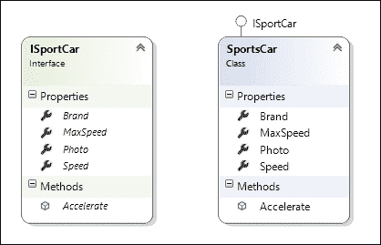

因此，最初，这个类只负责管理`SportCar`类实例的状态。这意味着业务逻辑：法拉利看起来像法拉利，不像宝马，每个都有自己的属性（在这个例子中是`MaxSpeed`和`Speed`）。除了用户界面或存储状态之外，其他任何与这里无关的内容都不应该被考虑。

接下来，我们需要一个构造函数来强制执行之前提到的一些原则。它应该解析所有不可变属性；因此，当创建类时，它们被分配了适当的值。

在这里，我们面临另一个问题：我们的类如何知道可能的品牌？这里有几种方法，但一个简单的方法是声明一个内部数组，定义允许的品牌，并让构造函数检查在构造中建议的品牌是否是我们类可以管理的品牌之一。

注意，我已经在应用程序的资源文件中包含了三个与三个品牌对应的简单图片。这是一个依赖项。如果需要考虑第四个品牌，我们应该将构造函数更改为提供这项附加功能，但为了简单起见，让我们假设目前不会发生关于汽车数量业务逻辑的变化。

考虑到所有这些，我们将以下代码添加到我们的类中：

```cs
string[] availableBrands = new string[] { "Ferrari", "Mercedes", "BMW" };
public SportsCar(string brand)
{
  if (!availableBrands.Contains(brand)) return;
  else Brand = brand;
  switch (brand)
  {
    case "Ferrari":
      MaxSpeed = 350;
      Photo = Properties.Resources.Ferrari;
    break;
    case "Mercedes":
      MaxSpeed = 300;
      Photo = Properties.Resources.Mercedes;
    break;
    case "BMW":
      MaxSpeed = 270;
      Photo = Properties.Resources.BMW;
    break;
  }
}
```

通过这种方式，我们得到了我们类的操作（尽管是不完整的）版本。现在，在用户界面中，我们应该声明一个`SportCar`类的变量，并在用户使用`cboPickUpCar`组合框更改品牌时实例化它。

实际上，一旦创建了汽车，我们还需要更新 UI，以便它反映汽车（其状态）的属性。并且它应该与每个可用的品牌的属性保持一致。

这段简单的代码就完成了这项任务：

```cs
SportsCar theCar;
private void cboPickUpCar_SelectedIndexChanged(object sender, EventArgs e)
{
  theCar = new SportsCar(cboPickUpCar.Text);
  // refresh car's properties
  txtMaxSpeed.Text = theCar.MaxSpeed.ToString();
  pbPhoto.Image = theCar.Photo;
}
```

现在，我们有一个工作正常的第一版本，但我们的类需要具有更改`Speed`属性的能力。因此，我们在`Accelerate`方法中添加了一些代码：

```cs
public virtual bool Accelerate()
{
  bool speedExceeded = Speed + SpeedIncr > MaxSpeed;
  Speed = (speedExceeded) ? Speed: Speed + SpeedIncr;
  return speedExceeded;
}
```

就这样。我们现在应该在 UI 中反映这些更改，这相当直接：

```cs
private void btnAccelerate_Click(object sender, EventArgs e)
{
  theCar.Accelerate();
  updateUI();
}
private void updateUI()
{
  txtSpeed.Text = theCar.Speed.ToString();
}
```

最终结果应该按预期工作（参考截图）。你可以从不同的品牌中选择，每次新的选择都会引发`SportCar`类的新实例化。

我们可以在运行时看到所有属性，唯一的可变属性（`Speed`）仅从`Accelerate`方法中更改，现在它有一个独特的责任。

然而，由于这项责任涉及到业务逻辑，它还检查是否发生了超出允许速度的尝试，并避免检查速度增加的可能值的案例（我们在类的初始声明中为该速度假设了一个常数值）。你应该看到以下类似的输出：

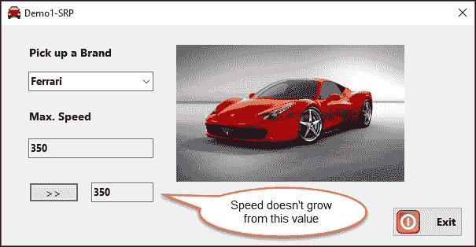

现在，让我们考虑一些在提出更改时可能出现的可能情况。这是下一个原则开始发挥作用的时候，它处理的是在出现新条件时如何管理需求。

# 开放/封闭原则

当模块的结果变化导致影响依赖模块的连锁反应时，我们可以检测到需要使用这个原则。这种设计被认为过于不灵活。

**开放/封闭原则**（**OCP**）建议我们应该以未来更改不会引发进一步修改的方式重构应用程序。

正确应用这个原则的形式是通过添加新代码（例如，使用多态）来扩展功能，而永远不改变已经工作的旧代码。我们可以找到几种实现这个目标的方法。

注意，当你有明确、独立的模块（DLLs、EXEs 等）依赖于要更改的模块时，*封闭于修改*特别有意义。

另一方面，使用扩展方法或多态技术允许我们在不影响其余部分的情况下对代码进行更改。例如，考虑 C# 语言自 3.0 版本以来可用的扩展方法。你可以将扩展方法视为一种特殊的静态方法，区别在于它们被调用时就像它们是扩展类型的实例方法一样。你可以在 LINQ 标准查询运算符中找到一个典型例子，因为它们向现有类型添加了查询功能，例如 `System.Collections.IEnumerable` 或 `System.Collections.Generic.IEnumerable<T>`。

这种模式的经典和最简单的例子是客户端/服务器耦合，这在多年的开发中很常见。客户端最好依赖于服务器的抽象，而不是具体实现。

这可以通过接口来实现。服务器可以实现一个客户端接口，客户端将使用它来连接到服务器。这样，服务器可以改变，而不会影响客户端使用它们的方式（参考下一张图）：

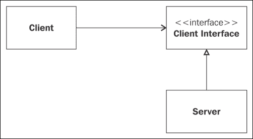

任何客户端接口的子类型都可以自由地以它认为更合适的方式实现接口，只要它不破坏其他客户端的访问。

## 回到我们的示例

现在，让我们想象一下，奔驰公司宣布对其车型进行更改，这使得你可以在用户因为汽车接近速度限制而处于危险时收到通知。

初看之下，有些人可能会考虑修改 `Accelerate` 方法，以包含一个可以将其情况传达给使用它的任何用户界面的事件。

然而，这会违反 OCP，因为当前版本已经运行良好。这是多态有用的一例。

我们可以创建 `Accelerate` 方法的另一个重载来允许这样做。它可以接收一个参数（品牌），以标识调用是否来自奔驰，并启动一个事件调用，这样任何客户端都可以相应地行动。

我将在一个新的项目中复制这个项目，并给它另一个名称，这样你就可以根据情况始终拥有不同的版本（例如 `Demo2-OCP`）：

```cs
public virtual bool Accelerate(bool advise)
{
  bool speedExceeded = Speed + SpeedIncr > MaxSpeed;
  Speed = (speedExceeded) ? Speed : Speed + SpeedIncr;
  if (speedExceeded && advise && (SpeedLimit!= null))
  {
    SpeedLimit(this, newEventArgs());
  }
  return speedExceeded;
}
public event EventHandler SpeedLimit;
```

正如你所见，我们声明了一个新的事件成员（`SpeedLimit`），如果布尔值为 `true`，则调用该事件。

由于事件是通知而不是直接调用用户界面的函数，UI 可以自由订阅所需的事件。

在用户界面中，我们应该订阅 `SpeedLimit` 事件，并按以下方式修改我们的 `btnAccelerate_Click` 事件处理器来处理这种情况：

```cs
private void btnAccelerate_Click(object sender, EventArgs e)
{
  if (theCar.Brand == "Mercedes")
  {
    theCar.Accelerate(true);
  }
  else { theCar.Accelerate(); }
  updateUI();
}
```

在实例化过程中，订阅相当简单，我们也可以让 IDE 为我们创建 `SpeedLimit` 事件处理器：

```cs
theCar.SpeedLimit += TheCar_SpeedLimit;
private void TheCar_SpeedLimit(object sender, EventArgs e)
{
  MessageBox.Show("Speed limit attempted");
}
```

注意，我在尽可能简化代码，因为这里的重点是展示与 SOLID 原则一致的编码实践。

当我们执行此代码时，我们可以观察到——仅针对奔驰——如果我们尝试传递速度限制，会出现一个弹出消息框，表明情况（参考截图）。其他品牌不受影响：

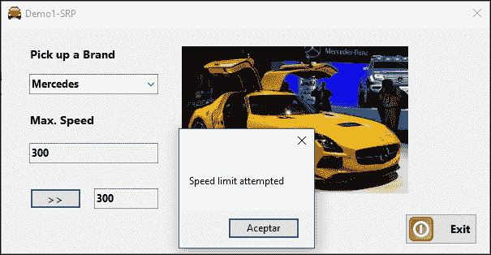

然而，正如我们提到的，.NET 框架也在不同的命名空间中使用了这些模式和其它模式，这还包括我们接下来将要看到的 LSP 原则。

# Liskov 替换原则

让我们记住这个定义：子类型必须可替换为其基类型。这意味着这应该在不破坏执行或丢失任何其他类型的功能的情况下发生。

你会注意到这个想法是面向对象编程范式继承基本原理背后的。

如果你有一个需要 `Person` 类型参数的方法（让我们这样表述），你可以传递一个继承自 `Person` 的另一个类的实例（例如 `Employee`、`Provider` 等）。

这是设计良好的面向对象语言的主要优势之一，最受欢迎和接受的语言支持这一特性。

## 再次回到代码

让我们看看我们示例中的支持情况，其中出现了一个新的需求。实际上，我们的演示只是调用了奔驰车的订阅者，并通知他们发生了 `SpeedLimit` 事件。

然而，如果我们需要知道那个情况发生的时间点和我们试图获得的速度呢？也就是说，如果我们需要更多关于事件的详细信息呢？

在当前状态下，`SpeedLimit` 事件除了发送者（指代调用源）之外，不会向调用者传递任何信息。但我们可以利用 C# 语言内固有的 Liskov 替换原则的实现，传递一个包含所需信息的 `EventArgs` 派生类，上下文应该能够很好地管理它。

因此，第一步是从 `EventArgs` 继承并创建一个新的类，以便能够包含所需的信息：

```cs
public class SpeedLimitData : EventArgs
{
  public DateTime moment { get; set; }
  public int resultingSpeed { get; set; }
}
```

我们还需要更改事件调用，以便在调用事件之前恢复必要的信息。这样，新的 `Accelerate` 版本——仍然完全兼容之前的版本——将如下所示：

```cs
public virtual bool Accelerate(bool advise)
{
  bool speedExceeded = Speed + SpeedIncr > MaxSpeed;
  Speed = (speedExceeded) ? Speed : Speed + SpeedIncr;
  if (speedExceeded && advise && (SpeedLimit!= null))
  {
    SpeedLimitData data = newSpeedLimitData()
    {
      moment = DateTime.Now,
      resultingSpeed = Speed + SpeedIncr
    };
    SpeedLimit(this, data);
  }
  return speedExceeded;
}
```

因此，当我们调用`SpeedLimit`时，我们正在向任何订阅者发送业务逻辑信息，无论是从 UI 还是其他地方。因此，我们可以将`EventArgs`类的派生实例传递给事件，而不会在 UI 的编辑器（或编译器）中引起任何抱怨。

最后一步是将用户界面更改以恢复传递给它的数据，并以修改后的先前`MessageBox`调用的形式呈现：

```cs
private void TheCar_SpeedLimit(object sender, EventArgs e)
{
  var eventData = e as SpeedLimitData;
  MessageBox.Show("Attempt to obtain " + eventData.resultingSpeed +
  " Miles//hr at: " + eventData.moment.ToLongTimeString(), "Warning",
  MessageBoxButtons.OK, MessageBoxIcon.Warning);
}
```

这次，当我们选择一辆梅赛德斯汽车并尝试超过限制时，我们在`MessageBox`中得到了一个更详细的信息报告：

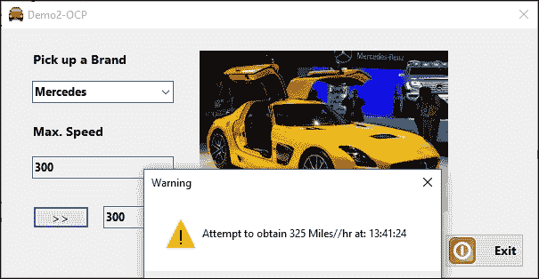

多亏了 Liskov 替换原则的支持，我们能够以最小的努力添加行为和信息，知道接收信息的 UI 会执行简单的转换，将基本的`EventArgs`声明转换为实际传递给事件处理器的扩展`SpeedLimitData`事件。

## .NET 中 LSP 的其他实现（泛型）

这不是我们在.NET 中找到的唯一 LSP 原则的实现，因为框架的不同领域都是使用这种概念增长的。例如，泛型是 LSP 的好处之一。

在我们的样本中，我们可以创建一个通用版本的事件，以便非常容易地管理额外信息。想象一下，除了在梅赛德斯案例中采取的私人措施之外，现在所有品牌都希望在达到法定速度限制时支持消息传递。

这会影响`SpeedCar`的任何实例。这不是强制性的（它不会强迫你停止增加速度，但它会显示关于这种条件的另一个警告）。

由于它对所有品牌都有影响，我们可以在`SpeedCar`类中添加一个新事件，但这次我们将其定义为泛型，以支持额外信息：

```cs
public eventEventHandler<int> LegalLimitCondition;
```

假设速度法定限制值是美国某些州允许的最大值（80 英里/小时）。我们将定义一个新的常量`MaxLegal`，具有这个值：

```cs
const int MaxLegal = 80;
```

现在，为了反映这个新条件，我们应该修改我们的`Accelerate`方法，以包括在汽车超过法定值时的前一个调用，指示超出的量：

```cs
public virtual bool Accelerate()
{
  bool speedExceeded = Speed + SpeedIncr > MaxSpeed;
  bool legalExceeded = Speed + SpeedIncr >MaxLegal;
  if (legalExceeded && LegalLimitCondition != null)
  {
    LegalLimitCondition(this, (Speed + SpeedIncr) - MaxLegal);
  }
  Speed = (speedExceeded) ? Speed: Speed + SpeedIncr;
  return speedExceeded;
}
public virtual bool Accelerate(bool advise)
{
  bool speedExceeded = Speed + SpeedIncr > MaxSpeed;
  bool legalExceeded = Speed + SpeedIncr > MaxLegal;
  if (legalExceeded && LegalLimitCondition != null)
  {
    LegalLimitCondition(this, (Speed + SpeedIncr) - MaxLegal);
  }
  if (speedExceeded && advise && (SpeedLimit!= null))
  {
    SpeedLimitData data = newSpeedLimitData()
    {
      moment = DateTime.Now,
      resultingSpeed = Speed + SpeedIncr
    };
    SpeedLimit(this, data);
  }
  Speed = (speedExceeded) ? Speed : Speed + SpeedIncr;
  return speedExceeded;
}
```

这就是你需要与`SpeedCar`类一起做的所有工作。其余的将是用户界面的更新；因此，对于任何汽车，当条件启动时，另一个`MessageBox`调用会警告用户关于该条件。

以这种方式，我们现在为每个汽车注册`LegalLimitCondition`事件，并让 IDE 为我们生成相关的事件处理器：

```cs
theCar.LegalLimitCondition += TheCar_LegalLimitCondition;
private void TheCar_LegalLimitCondition(object sender, int e)
{
  updateUI(e);
}
```

这次，我们将参数传递给`UpdateUI`方法的修订版，它现在接受一个可选参数，表示速度超限：

```cs
private void updateUI(int speedExcess = 0)
{
  txtSpeed.Text = theCar.Speed.ToString();
  if (speedExcess > 0)
  {
    MessageBox.Show( "Legal limit exceeded by " + speedExcess + " mi/h");
  }
}
```

就这样。现在，不同的事件机制通过自定义事件系统的通知，将业务逻辑条件告知用户界面。

注意调用事件的顺序很重要，并且`Speed`值的最终赋值是在`Accelerate`方法末尾进行的，此时所有先前条件都已处理。

事件足够灵活，可以定义为允许我们通过经典定义传递自己的信息，或者——在泛型的参与下——我们可以简单地定义一个通用的事件处理器，它可以持有任何类型的信息。所有这些技术都促进了良好实践的实施，而不仅仅是 SOLID 原则。

UI 中的更改不应影响`SportClass`的定义；尽管其业务逻辑的使用不同，但我们尽量将类中的更改保持在最小。

在运行时，我们现在将警告任何超过之前设定的`MaxLegal`常数的速度超额（参考截图）：

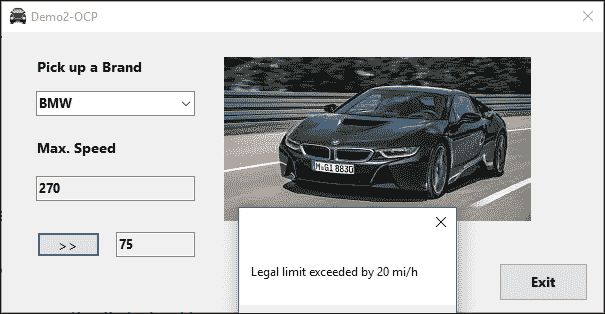

让我们回顾 SOLID 包中剩余的两个原则：**接口分离原则**（**ISP**）和**依赖倒置原则**（**DIP**）。

# 接口分离原则

如马丁所说，这个原则*处理了“胖”接口的不便问题*。问题出现在当类的接口可以逻辑上分解成不同的组或方法时。

在这种情况下，如果我们的应用程序有多个客户端，那么很可能有些客户端连接到了他们从未使用过的功能。

回到我们的演示：仅仅审查定义就揭示出，从这一原则的角度来看，我们的系统存在一些缺陷。

首先，我们实现了一个仅由`SportCar`客户端类型使用的方法：奔驰。其他品牌不使用它。如果不同品牌出现新的条件，应该创建新的选项。

因此，这标志着我们分类汽车的方式上的一个差异：那些通知用户界面关于`SpeedLimit`的汽车和那些不通知的汽车。我们应该首先重新定义我们的`ISportCar`接口，使其仅涵盖任何客户端都常用的方面。这包括`LegalLimitCondition`事件，但不包括`SpeedLimit`事件。

因此，我们将有这个实现：

```cs
interface ISportCar
{
  bool Accelerate();
  System.Drawing.Bitmap Photo { get; }
  string Brand { get; }
  int Speed { get; }
  int MaxSpeed { get; }
  eventEventHandler<int> LegalLimitCondition;
}
```

`SportCar`的新版本将仅实现方法的`Accelerate`重载，触发`LegalLimitCondition`事件但不触发`SpeedLimit`事件，这对于奔驰是合适的：

```cs
public virtualbool Accelerate()
{
  bool speedExceeded = Speed + SpeedIncr > MaxSpeed;
  bool legalExceeded = Speed + SpeedIncr > MaxLegal;
  if (legalExceeded && LegalLimitCondition != null)
  {
    LegalLimitCondition(this, (Speed + SpeedIncr) - MaxLegal);
  }
  Speed = (speedExceeded) ? Speed: Speed + SpeedIncr;
  return speedExceeded;
}
```

注意，我们仍然控制`MaxSpeed`，只是我们不采取任何行动，避免超过最大值。

这个原则建议的这种分离也适用于第一原则，因为现在，这个类的责任集中在使用这个实现的一组客户端上。

另一方面，我们将创建一个新的类`SportsCarWithN`（带通知的跑车），它继承自`SportsCar`，但增加了奔驰（或任何其他决定在未来这样做品牌）所需的功能：

```cs
public class SportsCarWithN : SportsCar, ISportCar
{
  public SportsCarWithN(string brand): base(brand) {}
  public new bool Accelerate()
  {
    base.Accelerate();
    bool speedExceeded = Speed + SpeedIncr > MaxSpeed;
    if (speedExceeded && (SpeedLimit!= null))
    {
      SpeedLimitData data = new SpeedLimitData()
      {
        moment = DateTime.Now,
        resultingSpeed = Speed + SpeedIncr
      };
      SpeedLimit(this, data);
    }
    Speed = (speedExceeded) ? Speed : Speed + SpeedIncr;
    return speedExceeded;
  }
  public event EventHandler SpeedLimit;
}
```

以这种方式，层次结构中的每个部分都负责自己的职责。任何从`SportCarWithN`继承的汽车都将具有额外的功能，而其他汽车将以标准方式运行。

在用户界面中，事情也变得简单。现在，我们声明`theCar`的类型为`ISportCar`，并在执行时决定调用哪个构造函数：

```cs
ISportCar theCar;
private void cboPickUpCar_SelectedIndexChanged(object sender, EventArgs e)
{
  if (cboPickUpCar.Text == "Mercedes")
  {
    theCar = new SportsCarWithN("Mercedes");
    // subscription to SpeedLimit depends on type
    ((SportsCarWithN)theCar).SpeedLimit += TheCar_SpeedLimit;
  }
  else
  {
    theCar = new SportsCar(cboPickUpCar.Text);
  }
  theCar.LegalLimitCondition += TheCar_LegalLimitCondition;
  // refresh car's properties
  txtMaxSpeed.Text = theCar.MaxSpeed.ToString();
  pbPhoto.Image = theCar.Photo;
  updateUI();
}
```

`btnAccelerate_Click`事件处理程序也被简化了，因为每个`ISportCar`实例都知道如何调用底层模型中的适当方法：

```cs
private void btnAccelerate_Click(object sender, EventArgs e)
{
  theCar.Accelerate();
  updateUI();
}
```

现在，在运行时，只有 Mercedes 品牌接收两个通知，而其他品牌只收到`LegalLimitCondition`事件。

你可以在 Demo-ISP 中检查结果，并查看两种类型的条件。

# 依赖倒置原则

SOLID 原则的最后一项基于两个陈述，维基百科以这种形式陈述：

+   *高级模块不应依赖于低级模块。两者都应依赖于抽象*。

+   *抽象不应依赖于细节。细节应依赖于抽象*。

至于第一个陈述，我们应该澄清我们对高级和低级模块的理解。这个术语与模块执行的动作的重要性有关。

让我们简单地说：如果一个模块包含`Customers`类的业务逻辑，而另一个包含`Customers`类在报告中使用的列表格式，那么第一个模块将是高级的，而第二个将是低级的。

第二个陈述不言自明。如果一个抽象依赖于细节，那么作为定义合同的用法就会受到损害。

在我们的样本中，我们仍然有一些代码不会适当地增长：`SportsCar`创建方法在很大程度上依赖于用户在 ComboBox 中输入的内容。有几种情况可能会显示出这种不便：在品牌选择过程中输入错误的名字、添加未来的新品牌等。UI 中有些样板代码我们可以改进。

## 样本的最终版本

不假装这个样本（在任何方面）是完美的，创建过程可以从 UI 中提取并委托给另一个类（`CarFactory`），该类将负责根据品牌调用适当的构造函数。（我们将看到这种技术实际上是通过我们稍后将要学习的设计模式之一来实现的。）

这样，调用适当构造函数的责任就在`CarFactory`，并且可以更容易地添加额外的品牌。

此外，我们的`SportsCar`类现在将专门负责其状态和与状态相关的业务逻辑，而不是`Photo`关联或`MaxSpeed`值的细节，这些似乎适合工厂。

因此，我们现在将有一个新的类（位于与`SportsCar`文件相同的文件中），包含这些细节：

```cs
public class CarFactory
{
  SportsCar carInstance;
  public SportsCar CreateCar(string car)
  {
    switch (car)
    {
      case "Ferrari":
        carInstance = new SportsCar(car);
        carInstance.MaxSpeed = 230;
        carInstance.Photo = Properties.Resources.BMW;
        break;
      case "BMW":
        carInstance = new SportsCar(car);
        carInstance.MaxSpeed = 180;
        carInstance.Photo = Properties.Resources.BMW;
        break;
      case "Mercedes":
        carInstance = new SportsCarWithN(car);
        carInstance.MaxSpeed = 200;
        carInstance.Photo = Properties.Resources.Mercedes;
        break;
      default:
        break;
    }
    return carInstance;
  }
}
```

在这个新版本中，`SportsCar`类被简化到最小：它声明了常量、事件、状态（属性）以及唯一需要的操作（`Accelerate`）。其余的由`CarFactory`类负责。

在创建方法中，用户界面也得到了简化，因为它不需要知道用户选择了哪个品牌才能调用任一构造函数；它只是调用`CarFactory`内部的构造函数，并检查过程的结果，以便分配显示汽车通知所需的事件处理程序：

```cs
private void cboPickUpCar_SelectedIndexChanged(object sender, EventArgs e)
{
  var factory = new CarFactory();
  theCar = factory.CreateCar(cboPickUpCar.Text);
  // Event common to all cars
  theCar.LegalLimitCondition += TheCar_LegalLimitCondition;
  // Event specific to cars of type SportsCarWithN
  if (theCar is SportsCarWithN) {
    ((SportsCarWithN)theCar).SpeedLimit += TheCar_SpeedLimit;
  }
  // refresh car's properties
  txtMaxSpeed.Text = theCar.MaxSpeed.ToString();
  pbPhoto.Image = theCar.Photo;
  updateUI();
}
```

运行时行为与之前相同。不同的是，通过这种组件解耦，维护和扩展变得更加容易。

让我们假设发生了一个变化，应用程序现在必须处理一种新的品牌：福特，它也包含`SpeedLimit`通知。

唯一需要做的工作是添加一张福特（福特 GT，不要影响其他案例…）的图片，并调整`CarFactory`以添加新的案例结构和其值：

```cs
case"Ford":
  carInstance = new SportsCarWithN(car);
  carInstance.MaxSpeed = 210;
  carInstance.Photo = Properties.Resources.Ford;
  break;
```

在 UI 中，只需要做一件事：将新的`Ford`字符串添加到选择 ComboBox 中，它就准备好了。现在，我们将提供新的品牌，当我们选择它时，行为将如预期：

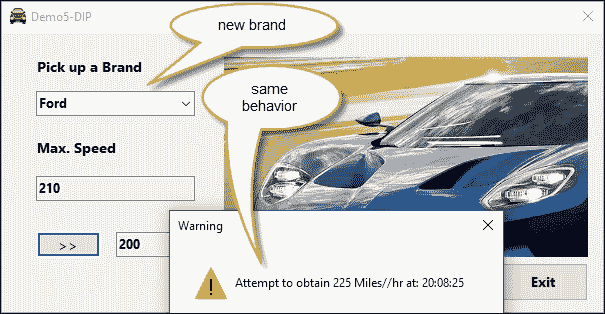

一般而言，DIP 原则可以通过许多方式导致解决方案。其中之一是通过依赖注入容器，这是一个组件，它提供给你一些代码，在需要时注入它。

一些流行的 C#依赖注入容器包括 Unity 和 Ninject，仅举两个例子。在代码中，你指导这个组件注册你的应用程序的某些类；因此，当后来你需要其中一个类的实例时，它会被自动提供给你的代码。

其他框架也实现了这个原则，即使它们不是纯粹面向对象的。AngularJS 就是这种情况，当你创建一个需要访问服务的控制器时，你会在控制器函数声明中请求该服务，Angular 的内部依赖注入系统会提供一个服务的单例实例，而不需要客户端代码的干预。

# 设计模式

正如我们所说的，SOLID 原则超越了任何特定于如何解决某个编码问题的考虑，甚至超越了语言或范式。然而，在罗伯特·马丁定义这些原则之前，已经存在一些与编码和应用程序结构化的非常不同方面的模式。

在现实生活中，一个类可以使用一个或多个模式，使其边界变得模糊。此外，你可以开始使用一个简单的模式，并根据应用程序的需求逐步发展到更复杂的模式。

1995 年，埃里克·伽玛、理查德·赫尔姆、拉尔夫·约翰逊和约翰·弗利斯（从那时起，简称为**四人帮**或**GoF**）出版了一本书，这本书一直是一个参考点：*设计模式：可重用面向对象软件元素*。

作者分析了总共 23 种适用于不同编码场景的设计模式，以解决不同的编码问题。

他们将 23 种模式分为三类：

+   **创建型模式**：它包括以下模式：

    +   抽象工厂

    +   构建器模式

    +   工厂模式

    +   原型模式

    +   单例模式

+   **结构型模式**：它由以下模式组成：

    +   适配器模式

    +   桥接模式

    +   组合模式

    +   装饰者模式

    +   门面模式

    +   享元模式

    +   代理模式

+   **行为模式**：它由以下模式组成：

    +   责任链模式

    +   命令模式

    +   解释器模式

    +   迭代器模式

    +   中介者模式

    +   原型模式

    +   观察者模式

    +   状态模式

    +   策略模式

    +   模板方法

    +   访问者模式

显然，所有这些模式都在本章中有很多内容要介绍，即使是以浅显的方式，但我们将重点关注最常用的模式，并解释它们的优点和 C#编程：

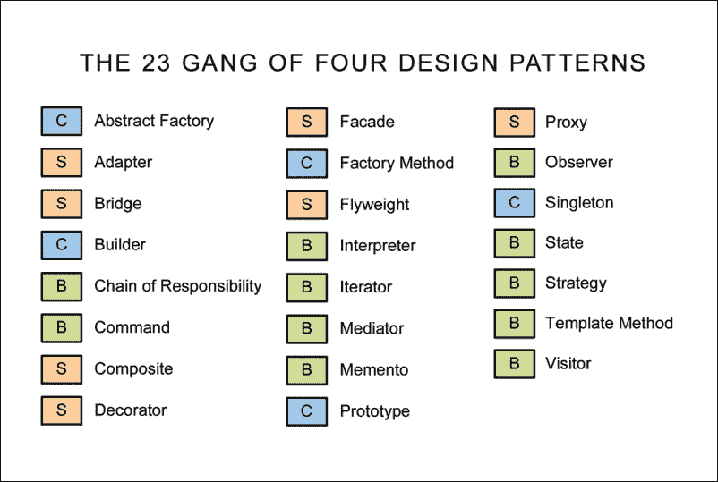

.NET 框架本身包含，包括其他模式：单例、策略、工厂、构建器、装饰者以及在不同命名空间中的其他几个模式。

互联网上有许多关于 GoF 模式使用的统计报告。显然，这并不是因为普遍接受而使用这个或那个模式的问题。相反，使用它们的理由是基于这些模式提供的利益，以改善应用程序的质量。

话虽如此，我将简要回顾其中的一些，以便给你一个关于它们解决特定问题可能性的概念。然而，似乎存在一种共识，即以下八种模式是最常用的：

+   **构建模式**：单例和工厂模式

+   **结构型模式**：适配器、装饰者和门面模式

+   **行为模式**：命令、观察者和策略

注意，一些模式，如迭代器，没有包括在这里，只是因为它们已经在大多数集合库中存在（例如在.NET 中的`System.Collections`和`System.Collections.Generic`命名空间中）。另一个典型的情况是抽象工厂，它在 ADO.NET 中广泛使用。

让我们从最常见（也是最被诟病的）模式开始：单例。

## 单例

单例模式防止创建一个类的多个实例。它是最受欢迎的模式，因为它的实现需要在各种情况下，以及许多不同的语言中（包括非编译语言，如 JavaScript）。

同时，它也是因为模式在许多情况下被滥用而受到普遍诟病，在这些情况下，其他模式可能更受欢迎，甚至根本不需要模式（更不用说在单元测试中包含它时有时出现的困难）。

应该如何编码需要以下要求：

+   类应该负责创建唯一实例

+   唯一实例必须通过类中的方法访问

+   构造函数应该是私有的，以避免直接实例化

要在我们的示例中应用此模式，我们可以想象一个新的需求：例如，想象用户界面要求从当前主窗口或其他未来的窗口中，提供一些用户信息，显示用户姓名和选择汽车时的日期/时间。

新类的外形应该反映模式和所需值：

```cs
public class UserInfoSingleton
{
  // A static variable for the instance, requires a lambda function,
  // since the constructor is private.
  private static readonly Lazy<UserInfoSingleton> instance =
  new Lazy<UserInfoSingleton>(() =>newUserInfoSingleton());

  // Private Constructor to avoid direct instantiation
  private UserInfoSingleton() {
    UserName = System.Environment.UserName;
    CarBuyingTime = DateTime.Now;
  }

  // Property to access the instance
  public static UserInfoSingleton Instance
  {
    get { return instance.Value; }
  }
  private string UserName { get; }
  private DateTime CarBuyingTime { get; }
}
```

注意，这个类仅用于阅读目的，没有有意义的功能。然而，以这种方式实例化，不可能出现任何重复。将始终存在一组唯一的用户信息。

类的实例存储在私有的静态`instance`变量中，构造函数是私有的，以避免外部实例化。实际上，除了`Instance`属性之外的所有成员都是私有的。

你可能还会对课程中的另一个方面感到好奇，那就是`instance`成员的`Lazy<UserInfoSingleton>`类型，这保证了实例是线程安全的，因为它实际上只有在被类的客户端使用时才会被实例化。

## 工厂模式

维基百科对工厂模式的定义是，*工厂实际上是一个创建具有公共接口的对象的创建者，而不暴露实例化逻辑*。

实际上，这就是我们在上次修改示例中所做的，当时我们将实例化分离到了`CarFactory`类中。

通过这些更改，我们将结果对象的结构分为两部分：

+   `CarFactory`类根据品牌字段决定结果对象的状态结构（记住，一个类在执行过程中的状态是由其属性在给定时刻所持有的值的集合定义的）。

+   `SportsCar`和`SportsCarWithN`是行为的实现。每个都针对`Speed`值的实例实现了不同的行为，并且它们共享相同的状态结构（相同的字段名称和类型）。

在我们的示例中，字段之间存在依赖关系，因为`MaxSpeed`和`Photo`直接依赖于`Brand`，因此它们应该在构造时解决。一般来说，当没有这种类型的依赖时，结构可以更加灵活。

## 适配器模式

适配器模式是最灵活的之一，它的目的是允许将两个最初未设计为一起工作的组件以最干净的方式集成。

因此，它特别适合我们在必须处理遗留代码时，在这种情况下，修改代码片段相当困难，如果不是不可能的，但我们有包含新功能的要求。

下面的图示显示了实现此目标时，适配器模式所实现的间接路径的常见视觉原型化方式：

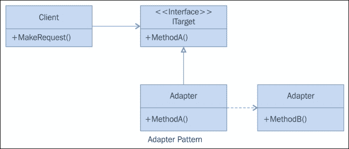

如您在图示中看到的，有一个客户端使用某个接口。当原始类需要以最小或没有更改的方式更改或扩展某些行为时，适配器是最受欢迎的解决方案之一。

想象一下，我们有一个列出所有汽车品牌的类，我们无法修改，以下是其代码：

```cs
class ShoppingCarsPortal
{
  static void Main(string[] args)
  {
    Console.Title = "Demo of the Adapter Pattern";
    ITarget adapter = new VendorAdapter();
    foreach (string brand in adapter.GetCars())
    {
      Console.WriteLine("Brand: " + brand);
    }
    Console.ReadLine();
  }
}
```

另一方面，为了获取仍然调用相同 `adapter.GetCars()` 函数的汽车列表，必须使用一个新的类。这个类名为 `ListOfCarsProvider`，它包含一个名为 `GetListOfCars` 的方法：

```cs
public class ListOfCarsProvider
{
  public List<string> GetListOfCars()
  {
    List<string> carsList = newList<string>();
    carsList.Add("Ferrari");
    carsList.Add("Mercedes");
    carsList.Add("BMW");
    carsList.Add("Ford");
    return carsList;
  }
}
```

我们可以定义一个简单的接口 (`ITarget`)，它定义了最终类所需的方法签名：

```cs
interface ITarget
{
  List<string> GetCars();
}
```

下一步是让 `VendorAdapter` 实现 `ITarget`。技巧在于我们让 `GetCars()` 的实现调用 `ListOfCarsProvider` 中的新汽车列表：

```cs
class VendorAdapter : ITarget
{
  public List<string> GetCars()
  {
    ListOfCarsProvider adaptee = new ListOfCarsProvider();
    return adaptee.GetListOfCars();
  }
}
```

如你所见，我们保留了基类的功能，但允许以新的方式获取可用汽车的列表。我们通过最小的更改提供了一种间接级别。

当然，列表是在运行时获得的，正如预期的那样：

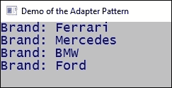

## 外观模式

在许多情况下，外观模式也是一个有用（并且相当常用）的模式。它相当简单，其主要目的是统一分散在库中不同函数中的过程，通过更简单、更具体的方法集来访问它们。

维基百科收集了一些这个模式的典型用法，例如，当你想要做以下事情时：

+   使外部库更容易使用

+   以更易读或更有组织的方式访问库

+   减少在外部库管理中发现的依赖关系

表示这种结构的图形方案通常以这种方式表示：

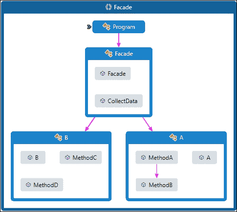

这意味着外观模式只是位于一组类之间的一层，这些类可以保存在一个更大的库中，或者沿着不同的文件分解。在任何情况下，该模式都允许统一包含在程序集中的功能。

由于只需调用所需的方法，因此不需要接口实现，从而提供业务逻辑。你将在名为 `PatternFacade` 的演示中找到对应于前面方案的源代码。运行时对此不感兴趣，因为你很容易推断出它是如何工作的。

## 装饰者模式

装饰者模式在需要向过程添加功能（通常是获取伴随标准实现的额外数据）时经常被使用，但你必须保持当前的行为不变，并且只为某些场景添加新功能。

如果你这么想，这个模式强制执行了开放/封闭原则。主要代码保持不变，但该模式允许功能以受控的方式增长。

这种情况与我们在示例中对 `SportsClassWithN` 类型的汽车的第一种实现相似。当前主类 (`SportsCar`) 的功能不应改变。但如果品牌是奔驰（稍后，对于福特品牌也是如此），则需要一些额外的要求。在这种情况下，从基类继承的新类添加了一些行为：

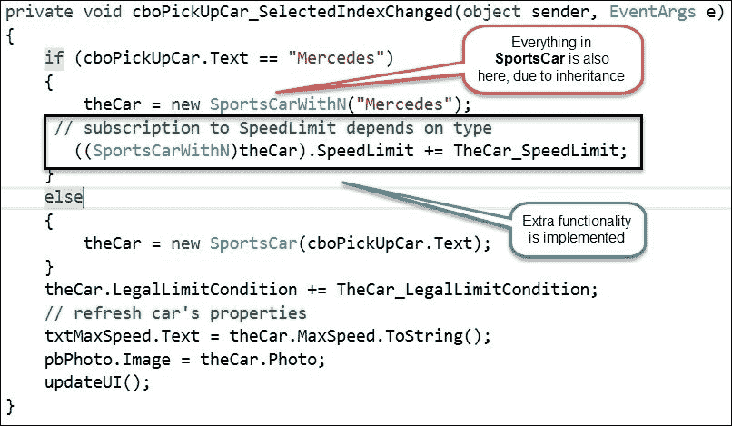

最后，用户界面决定在运行时实现哪个类，并在异常的情况下，指导事件处理器来处理该异常。

该模式允许（像大多数模式一样）在实现方式上略有变化。

## 命令模式

命令模式是行为类别中最常用的模式之一。GoF 作者这样定义该模式：*将请求封装为一个对象，从而允许你用不同的请求参数化客户端，排队或记录请求，并支持可撤销操作*。

如同往常，提供了一定程度的间接性。我们不是立即执行调用，而是允许将其排队，这在许多场景中都有很多优点，尤其是在现在，越来越多的实现需要异步处理。

该模式的关键部分是它将调用操作的对象与知道如何执行它的对象解耦。

GoF 作者提出的典型示例是关于经典用户界面中菜单实现的规范：在这种情况下，你可以通过让它们执行相同的行为（例如 `MenuItem` 和工具栏的按钮）来实现多个用户界面元素以执行相同操作，也就是说，让它们都实现相同的具体 `Command` 子类。

### .NET 中已实现的示例

再次强调，我们可以在 .NET Framework 的多个地方找到命令模式的实现。也许最明显的模式之一就是关闭窗口的简单过程：你可以用四种不同的方式来完成它：

+   通过点击图标窗口来关闭它

+   使用窗口菜单（而非用户菜单）并选择**关闭**

+   通过按 *Ctrl* + *F4*

+   通过在窗口的一些代码中调用 `this.close()`

所有的前述方法都会引发命令调用，向窗口发送一个 `WM_CLOSE` 消息。

### 注意

你可以在专门的网站 Platform Invoke ([`www.pinvoke.net/`](http://www.pinvoke.net/)) 上查看窗口可以处理的整个消息列表。

在窗口中调用 `this.close()` 本身就是一个命令调用。.NET Framework 还会发送这些消息之一，由消息的分派窗口函数来管理。

你可以通过实现 `Window.FormClosing` 事件来干预这个调用，该事件携带有关要执行命令的信息，并允许通过将 `e.Cancel` 属性（`EventArgs`）的值设置为 `true` 来取消它。

此外，你可以通过检查 `e` 参数持有的 `e.CloseReason` 属性来找出引发此事件的原因。

这两种可能性得益于在 .NET Framework 中用于向窗口内部发送 `WM_CLOSE` 消息的内部机制中实现的命令模式。

### 注意

我们将在本书的最后一章中讨论.NET 框架的高级特性，以及与平台调用相关的其他技术。

下面的截图总结了我们在初始演示的用户界面中关闭窗口的场景：


## 观察者模式

再次，我们发现另一个在.NET 框架中广泛实现的流行模式，用于不同的场景。

MSDN 文档指出，这个模式*允许订阅者注册并从提供者接收通知。它适用于任何需要基于推送的通知的场景*。

为了将模型中的数据与用户界面链接起来，并使用不同的控件（如 DataGridViews、TextBoxes 等）显示它，实现了这个模式的典型用例。当用户执行一个意味着在 UI 中修改显示数据的操作时——比如更新、删除或修改——期望的行为是这些控件自动被告知变化，并可以在 UI 中更新它们。

这个来源建议在.NET 中实现这个模式的步骤：

+   提供者需要负责向观察者发送通知。它应该是一个实现`IObservable<T>`接口的类或结构，尽管它的唯一要求是实现`IObservable<T>.Subscribe`方法。这是客户端观察者调用以接收通知的方法。

+   观察者是接收提供者通知的对象。在这种情况下，该类应该实现`IObserver<T>`接口，但它需要实现三个将由提供者调用的方法：

    +   `IObserver<T>.OnNext`，它提供新的或当前的信息

    +   `IObserver<T>.OnError`，它负责通知观察者任何已发生的错误

    +   `IObserver<T>.OnCompleted`，它总是标记通知的结束

+   如果您考虑这个场景，我们就有了一个发送者和接收者之间的典型通信方案。因此，我们还需要一个通道来传输信息。在这种情况下，我们需要一个机制，允许提供者跟踪观察者。

+   在.NET 中，这种机制通常分配给`System.Collections.Generics.List<T>`的一个实例，它负责持有`IObserver<T>`实现的引用。这是处理无限多个观察者引用的便捷方式。

+   通常，还有一个对象存储提供者发送给其已订阅观察者的数据。

在实际场景中，这可能会取决于您构建的解决方案：Windows Presentation Foundation 接口正是为了这个目的而实现了可观察集合。甚至其他实现 MVC 范式的机制也能够展示这种行为。

在面向对象编程世界之外的一个著名案例是 AngularJS 框架，它使模型中的每个数据都变得可观察并可链接到用户界面，实现了一个双向绑定架构，使得模型中的任何变化都会自动反映在用户界面上，使用特殊的标记（*moustache*语法）。

## 策略模式

策略模式正式定义为*定义一组算法的实践，封装每个算法，并使它们可互换。策略允许算法独立于使用它的客户端变化*。

主要有三个参与者：

+   负责为所有要管理的算法定义一个公共接口的`Strategy`（或组合器）组件

+   `ConcreteStrategy`，它使用策略接口实现算法

+   `AContext`具有三个角色：它通过`ConcreteStrategy`对象进行配置，维护对`Strategy`对象的引用，并且可选地可以定义一个接口，允许策略访问其数据。

在代码中，一个典型的例子可能是在任何集合中必须使用不同的排序策略时，但根据其他情况，你可能希望选择你想要使用的排序算法，例如快速排序、希尔排序或冒泡排序。

你可以定义一个具有负责排序的方法的对象（`SortingClass`），但根据一个值，实例是从另一个实际的排序方法实例创建的。

以下代码展示了如何使用这个模式。关键在于使用所需算法的不同实例调用`SortingClass`：

```cs
SortingStrategy shell = newSortingClass(newShell());
SortingStrategy quick = newSortingClass(newQuickSort());
SortingStrategy bubble = newSortingClass(newBubble());
```

采用这种方法，用户界面将始终调用同一个排序方法，无论其名称如何，但实际的排序机制将在运行时决定。

# 其他软件模式

正如我们提到的，总共有 23 个模式与 GoF 小组的原始出版物相关联，但后来，属于三个主要类别的其他模式出现了。甚至定义了一个新的类别：并发模式。

在三个基本类别中，增加的内容如下：

+   **创建型**：以下是这个类别的子类型：

    +   **多例模式**：通过一个单一的全局点集中创建类，并确保实例仅是命名实例。

    +   **对象池**：提供一个缓存系统以避免昂贵的资源获取（或释放）。它是通过回收任何未使用的对象来做到这一点的。许多专家认为它是连接池和线程池模式的泛化。

    +   **资源获取即初始化**：维基百科指出，这*确保了资源通过绑定到合适的对象的生命周期而被正确释放*。

+   **结构型**：以下是这个类别的子类型：

    +   **扩展对象**：允许在不更改给定层次结构的情况下向其添加功能。

    +   **前端控制器**：这与 Web 应用程序设计有关。这是一种将入口点统一到单个节点以处理请求的方法。

    +   **标记**：这是一个空接口，用于提供将元数据链接到类的方式。

    +   **模块**：维基百科表示，它**旨在将多个相关元素，如类、单例、方法、全局使用等，组合成一个单一的概念实体**。

    +   **双胞胎**：一个危险的例子；据一些专家称，这为不支持此特性的语言提供了多重继承的建模。

+   **行为**：以下是该类别的子类型：

    +   **黑板**：这是一个用于人工智能系统的模式，允许合并不同的数据源（参考[`en.wikipedia.org/wiki/Blackboard_system`](https://en.wikipedia.org/wiki/Blackboard_system)）。

    +   **空对象**：这是通过提供一个默认对象来避免空引用的。在 C#中，我们已经看到了它是如何使用不同的运算符（如空合并运算符和空条件运算符，我们在第一章中看到）实现的。

    +   **服务**：这定义了一组类的常见操作。

    +   **规范**：以布尔方式重新组合业务逻辑。有大量关于在 C#中实现此模式及其随着语言新版本的改进的文档（[`en.wikipedia.org/wiki/Specification_pattern`](https://en.wikipedia.org/wiki/Specification_pattern)）。

+   **并发模式**：这些模式是专门设计来处理多线程场景的。以下表格灵感来源于维基百科上关于此主题的实际文档：

    | 名称 | 描述 |
    | --- | --- |
    | 活动对象 | 将方法执行与位于其自己的控制线程中的方法调用解耦。目标是使用异步方法调用和调度器来处理请求以引入并发。 |
    | 拒绝 | 只有在对象处于特定状态时才在对象上执行操作。 |
    | 绑定属性 | 结合多个观察者，以强制不同对象中的属性以某种方式同步或协调。 |
    | 区块链 | 一种去中心化的存储数据并同意在默克尔树中处理数据的方式，可选地使用数字签名对任何个人贡献进行签名。 |
    | 双重检查锁定 | 通过首先以不安全的方式测试锁定标准（锁定提示）来减少获取锁的开销；只有在该测试成功后，实际的锁定逻辑才会进行。在某些语言/硬件组合中实现时可能不安全。因此，有时可以将其视为一种反模式。 |
    | 基于事件的异步 | 解决多线程程序中出现的异步模式问题。 |
    | 保护挂起 | 管理在操作可以执行之前需要获取锁并满足预条件的操作。 |
    | Join | 通过传递消息提供编写并发、并行和分布式程序的方法。与使用线程和锁相比，这是一个高级编程模型。 |
    | 锁 | 一个线程对资源施加“锁”，防止其他线程访问或修改它。 |
    | 消息设计模式（MDP） | 允许组件和应用程序之间交换信息（即消息）。 |
    | 监视对象 | 指一个其方法受到互斥性约束的对象，从而防止多个对象同时错误地尝试使用它。 |
    | 反应器 | 为必须同步处理资源提供异步接口。 |
    | 读写锁 | 允许对对象进行并发读取访问，但写入操作需要独占访问。 |
    | 调度器 | 明确控制线程何时可以执行单线程代码。 |
    | 线程池 | 创建多个线程以执行多个任务，这些任务通常组织在一个队列中。通常，任务的数量要多于线程的数量。可以将其视为对象池模式的特殊情况。 |
    | 线程特定存储 | 静态或“全局”内存，它是线程本地的。 |

此外，请记住，通常，当您使用的框架已经支持该模式时（例如在.NET 框架中发生的情况），通常不需要显式实现一个模式，并且实施实际解决方案时，可能需要不止一个而是多个这些模式才能正确编码。

# 其他模式

在本章的开头，我们提到有许多不同的模式、指南和最佳实践集是由不同的专家发布的，无论是来自学术环境还是来自企业。

它们也可以应用于不同的编程上下文，以及不同的编程范式：应用程序集成、数据管理、用户界面、应用程序测试（单元或行为测试），等等。它们通常被称为领域特定模式。

在任何情况下，随着技术的演变，模式也在演变。新的模式出现，而一些其他模式的使用频率降低，这仅仅是因为它们所应用的技术或架构也变得不再使用。

一些其他模式，随着技术的发展而得到复兴，例如在“Web 客户端的设计和实现指南”案例中，您可以在[`msdn.microsoft.com/en-us/library/ff650462.aspx`](https://msdn.microsoft.com/en-us/library/ff650462.aspx)找到。然而，如果我们认为其他模式在目前非常有用，例如数据模式([`msdn.microsoft.com/en-us/library/ff648420.aspx`](https://msdn.microsoft.com/en-us/library/ff648420.aspx))，那么您可能会发现它们有些过时，因为它们是在 2003 年发布的，而且从那时起变化了很多，更不用说大数据革命的出现和其他模型和技术了。

因此，首先记住大的原则，当你必须为了你的应用程序应用其中任何一个时，查看可用的模式（经典或新的），因为它们可能为你提供一个可信的、经过验证的解决方案。

# 摘要

在本章中，我们探讨了软件指南和模式。我们从几年前罗伯特·马丁提出的 SOLID 原则开始，这些原则现在在程序员社区中越来越受欢迎，并且我们可以看到它们在当今使用的绝大多数框架中得到了实现。

我们使用了一个简单的应用程序，随着需求的演变，我们应用了不同的原则或模式来解决这些问题。

最后，我们研究了最常用的八个 GoF 模式（根据统计数据），修订了它们的定义和目的，以便以当前可用的模式列表结束，这些模式是在 GoF 小组发布他们的书籍之后创建和发布的。

在下一章中，我们将处理安全问题，包括在业界广泛采用的新的提议，例如**OAuth**（**开放授权**）协议。
