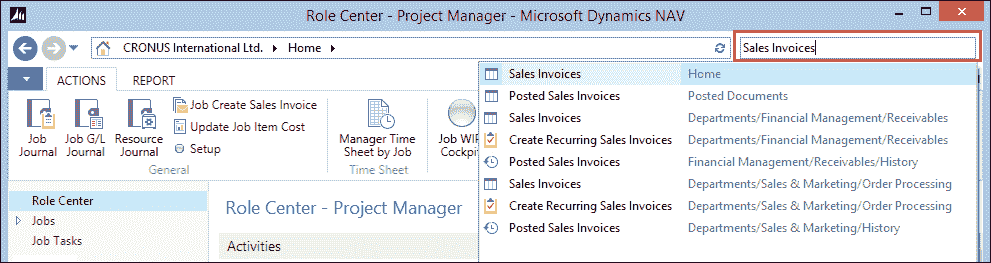
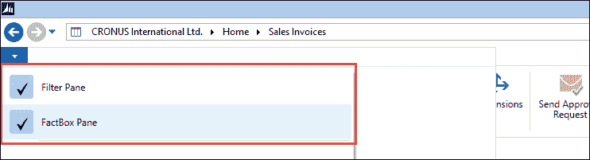

# 前言

1997 年，我所在的公司正在寻找替换其基于 MS-DOS 的软件包。我们非常幸运地找到了 Navision Financials 1.1 作为一款支持即将到来的 Windows 平台且足够灵活以实施、满足我们需求的软件包。

尽管标准功能远非我们今天所拥有的那样，但应用设计的结构简单、稳固，自那时起并未改变。

在那之后的几年里，更多公司采用了 Navision 作为应对市场变化需求的解决方案，许多至今仍存在的垂直解决方案也开始了它们的生命周期。随着微软收购 Navision，新合作伙伴的兴趣增长到了我们今天所知道的渠道。

微软 Dynamics NAV 提供了一种独特的开发体验，只有当你理解了标准应用部分的设计方式后，才能充分利用。

当适当授权时，每个人都可以改变应用的工作方式。这种巨大的可能性伴随着巨大的责任，因为这意味着我们也可以轻易地破坏重要的业务逻辑。

这导致了对应用设计师的独特需求，他们需要在微软 Dynamics NAV 内部运行的应用程序中了解更多关于应用的信息，而无需深入了解功能细节。

本书将在学习如何设计微软 Dynamics NAV 的标准应用功能和如何在我们自己的解决方案中使用这些知识之间取得平衡。理解应用功能和技术设计之间的区域非常狭窄。

在本书中，我们将对标准应用进行修改，并创建新的解决方案。我们还将讨论微软 Dynamics NAV 如何与其他应用协同工作。

# 本书涵盖的内容

第一章，*微软 Dynamics NAV 简介*，将向您介绍微软 Dynamics NAV。我们将简要介绍应用的历史，并讨论相关概念。我们将涵盖一些基本设计模式，如数字序列和导航。然后，我们将讨论微软 Dynamics NAV 使用的主数据、日记账和由文档覆盖的账簿分录所采用的数据模型原则。

第二章，*示例应用*，将在示例应用中实现你在第一章中学到的理论。本章的目标是更好地理解整个系统中日记账和账簿分录的工作方式，以及如何创建自己的日记账应用。你将学习如何逆向工程标准应用以从中学习，并将其应用于你自己的定制中。我们将把应用与微软 Dynamics NAV 中的关系管理和销售集成，并扩展我们的解决方案中的导航和维度。

第三章，*财务管理*，将探讨如何使用应用程序的财务管理部分以及其设计。这是 Microsoft Dynamics NAV 的核心。您将学习重要概念，如增值税和税，过账组，结账日期，条目应用和财务数据分析。我们将对核心应用程序进行一些更改，向总账添加新信息，并学习如何将财务管理集成到我们的附加解决方案中。

第四章，*关系管理*，将帮助您分析我们系统中的销售数据，并更有效地服务客户。我们将探讨此应用程序部分的独特设计，并将其与我们创建的第二章，*一个示例应用程序*中的示例应用程序集成。

第五章，*生产*，将向我们展示如何为生产型企业设置 Microsoft Dynamics NAV。这些企业处于供应链的起点。我们将讨论组装管理和制造。当使用此应用程序部分时，项目成本核算和项目跟踪是关键要素。我们将查看规划工作表，以及如何使用按订单制造和按库存制造策略创建生产订单。我们将逆向工程库存概要偏移代码单元，并了解这是如何导致计划和采购订单的。在本章结束时，我们将探讨针对垂直行业定制生产的十种方法。

第六章，*贸易*，将讨论销售、库存管理和采购之间的关系，以及如何在不同复杂程度下涉及仓储。没有销售，大多数公司都无法生存。我们将从技术角度学习如何使用系统中的预留条目。

第七章，*储存和物流*，将设计和构建一个用于规划运输路线的解决方案，这是 Microsoft Dynamics NAV 中不可用的功能。我们将设计一个解决方案，不仅可用于贸易公司的自身运输，也可用于仓储公司。该解决方案与 Dynamics NAV 产品无缝集成。我们将扩展我们在第二章，*一个示例应用程序*和第三章，*财务管理*中学习的日记知识，并使用我们在第五章，*生产*和第六章，*贸易*中学习的新文档结构。

第八章，*咨询*，将讨论如何使用四个示例工作来实施工作功能，并使用资源组和计算扩展工作功能，包括问题注册和工时表应用。Microsoft Dynamics NAV 中的工作功能可以与附加解决方案相比较。它是设计在财务管理之外和贸易之外，但仍然集成到产品中。

第九章，*接口*，将讨论如何设计一个稳固的 B2B 接口。在过去十年中，接口已成为设计和实施 ERP 系统的一个关键部分。我们将向您展示可用于接口的技术，以及这些技术在标准产品中的实现方式。我们将讨论所有内置的与其他 Microsoft 应用程序（如 Office、SharePoint、BizTalk 和 Exchange）的接口。

第十章，*应用设计*，将专注于应用设计概念及其在 Microsoft Dynamics NAV 中的应用。我们将重点关注设计以使用、维护、支持、升级、执行和分析。这包括用户界面、版本管理和开发方法的概念。

附录，*安装指南*，将涵盖与 Dynamics NAV 对象相关的安装程序。

# 您需要这本书什么

要成功跟随本书中的示例，您需要以下内容：

+   安装应用程序所需的 Microsoft Dynamics NAV 2013 产品 CD。

+   一个完整的开发者许可证，可以通过注册或注册为 Microsoft Dynamics NAV 合作伙伴来获得。或者，大多数示例代码可以使用演示许可证进行探索，该许可证可以从 MSDN 下载。

+   用于第九章，*接口*中接口示例的 Microsoft Office 和 SQL Server Management Studio。

附录，*安装指南*，描述了如何安装这些先决条件。

# 本书面向谁

基本上，本书是为：

+   NAV 顾问和开发者

+   商业应用程序的设计者

+   最终用户的系统管理员

+   商业所有者和影响者

本书假设您对业务管理系统、应用开发有基本了解，并且对 Microsoft Dynamics NAV 或另一个 ERP 系统有实际操作知识。

# 术语约定

在本书中，您将找到许多不同信息的文本样式，以区分不同类型的信息。以下是一些这些样式的示例及其含义的解释。

文本中的代码词、数据库表名、文件夹名、文件名、文件扩展名、路径名、虚拟 URL、用户输入和 Twitter 用户名如下所示：“我们需要复制`CreateVendor`函数。”

以下是一个代码块：

```cs
Currency Code - OnValidate()
IF "Currency Code" <> xRec."Currency Code" THEN
IF NOT JobLedgEntryExist THEN
CurrencyUpdatePlanningLines
ELSE
ERROR(Text000,FIELDCAPTION("Currency Code"),TABLECAPTION);
```

当我们希望引起你对代码块中特定部分的注意时，相关的行或项目将以粗体显示：

```cs
UpdateSquashPlayer()
WITH SquashPlayer DO BEGIN
GET(ContBusRel."No.");
xRecRef.GETTABLE(SquashPlayer);
NoSerie := "No. Series";
TRANSFERFIELDS(Cont);
"No." := ContBusRel."No.";
"No. Series" := NoSerie;
MODIFY;
RecRef.GETTABLE(SquashPlayer);
ChangeLogMgt.LogModification(RecRef,xRecRef);
END;
```

**新术语**和**重要词汇**以粗体显示。你在屏幕上看到的，例如在菜单或对话框中的词汇，在文本中会这样显示：“我们可以在**全局**菜单中添加功能。”

### 注意

警告或重要注意事项以这样的框显示。

### 小贴士

小技巧和窍门会这样显示。

## 本书中的屏幕在哪里

本书中的大多数屏幕都是使用带有 Microsoft Dynamics NAV 2013 Release 2 的 Windows 客户端创建的。在可能和必要时，会提到所使用的角色中心。一些章节有新的或修改过的角色中心。

要查找屏幕，请在**角色中心**右上角搜索窗口中输入名称，如下面的截图所示。这将引导你到那里，并告诉你如何在菜单中找到它。



搜索窗口

## 截图

本书中的所有截图都是从 Windows 客户端中拍摄的，该客户端是在 Microsoft Dynamics NAV 2013 Release 2 中引入的。

对于大多数图像，为了节省空间，已经关闭了**操作窗格**和**事实窗格**。这可以通过每个页面的**自定义**选项来完成。



自定义选项

## 如何阅读应用程序架构

本书的大部分章节都有架构来阐明数据在系统中的流动。它们是专门为这本书设计的。


要阅读架构，请按照箭头指示。尽可能将功能区域分组使用框。一些架构可能有更多的起始点和结束点，因为这是应用程序的设计方式。使用规范业务逻辑处理多个主数据表。

## 数字和日期标点符号

这本书是由荷兰作者撰写的，这意味着所有的数字和日期格式都是按照荷兰格式进行的，例如 1.000,00 而不是 1,000.00，以及 18-10-10 代表 2010 年 10 月 18 日。

# 读者反馈

我们欢迎读者的反馈。告诉我们你对这本书的看法——你喜欢什么或可能不喜欢什么。读者反馈对我们开发你真正能从中获得最大价值的标题非常重要。

要发送给我们一般性的反馈，只需发送电子邮件到`<feedback@packtpub.com>`，并在邮件的主题中提及书名。

如果你在一个领域有专业知识，并且你对撰写或为书籍做出贡献感兴趣，请参阅我们的作者指南[www.packtpub.com/authors](http://www.packtpub.com/authors)。

# 客户支持

现在你已经是 Packt 书籍的骄傲拥有者，我们有一些事情可以帮助你从你的购买中获得最大价值。

## 错误清单

尽管我们已经尽最大努力确保内容的准确性，错误仍然可能发生。如果您在我们的某本书中发现错误——可能是文本或代码中的错误——如果您能向我们报告这一点，我们将不胜感激。通过这样做，您可以避免其他读者感到沮丧，并帮助我们改进本书的后续版本。如果您发现任何勘误，请通过访问[`www.packtpub.com/support`](http://www.packtpub.com/support)，选择您的书籍，点击**勘误提交表单**链接，并输入您的勘误详情来报告它们。一旦您的勘误得到验证，您的提交将被接受，勘误将被上传到我们的网站，或添加到该标题的勘误部分现有的勘误列表中。

## 盗版

在互联网上，版权材料的盗版是一个跨所有媒体的持续问题。在 Packt，我们非常重视我们版权和许可证的保护。如果您在互联网上发现我们作品的任何非法副本，无论形式如何，请立即提供位置地址或网站名称，以便我们可以寻求补救措施。

请通过发送链接到疑似盗版材料的方式，与我们联系 `<copyright@packtpub.com>`。

我们感谢您在保护我们作者和我们为您提供有价值内容的能力方面的帮助。

## 问题

如果您在本书的任何方面遇到问题，可以通过 `<questions@packtpub.com>` 联系我们，我们将尽力解决。
