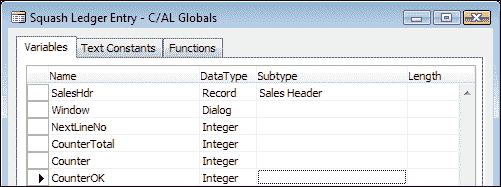

# 第二章. 示例应用程序

让我们在微软 Dynamics NAV 中创建一个自己的结构。为此，我们必须想到一些在标准包中尚未提供但可以在此基础上构建的东西。

对于我们的示例应用程序，我们将运行一个网球场。运行网球场很容易理解，但我们不能不改变和扩展产品来做这件事。为了定义我们的更改，我们首先需要进行适配-缺口分析。

在本章之后，你将更好地理解如何重用微软 Dynamics NAV 应用程序的框架。我们将展示如何通过进入应用程序代码来逆向工程应用程序并研究其功能。

对于这个例子，需要一些新的和更改的对象。《附录》，*安装指南*，描述了如何找到这些对象以及如何安装和激活它们。

在第一部分，我们将研究如何逆向工程标准应用程序，以查看和学习它是如何工作的，以及如何在我们自己的解决方案中重用这些结构。

在本章的第二部分，我们将学习如何在自定义应用程序中使用日记和条目。

最后，我们将研究如何将我们的解决方案与标准应用程序集成；在我们的案例中，是销售开票。

# 适配-缺口分析

当我们进行适配-缺口分析时，我们查看公司的流程，并定义我们可以和不能使用标准包做什么。当一个业务流程可以用标准软件处理时，我们称之为**适配**。当这不能做到时，我们称之为**缺口**。所有缺口都必须开发，或者我们需要购买一个附加组件。

然而，即使可以使用标准软件功能来做某事，这并不意味着这样做是明智的。标准应用程序应该用于其设计的目的。将标准功能用于其他目的可能在当前版本中可行，但如果在新版本中发生变化，可能就不再适用。因此，最好设计一些新的东西，而不是错误地使用标准功能。

## 设计网球场应用程序

网球场公司的基本流程是出租网球场给网球场球员；会员和非会员。有一个处理会员和非会员不同价格的预订和开票流程。

尽管可以使用网球场作为项目，顾客作为玩家来实现这一点，但这将是一个典型的错误使用标准功能的例子。而不是这样做，我们将研究项目和顾客是如何设计和使用的，并利用这一点来创建一个新的网球场应用程序。

使用标准 NAV 功能设计一个特定应用程序是**总拥有成本**（**TCO**）的问题。如果只有一个客户使用这个解决方案，最好以创新的方式使用标准应用程序。然而，如果我们从本章开始部署设计到多租户架构，并让成千上万的公司运行它，那么从经济上讲，制作最佳应用程序是可行的。每次你做出设计决策时，都要记住这一点。

## 看，学，爱

为了确定这个应用程序的设计，我们首先将查看标准应用程序的各个部分，我们可以使用这些部分来学习它们是如何工作的。我们将利用这些知识来设计我们自己的应用程序。

在 Microsoft Dynamics NAV 中，客户和供应商主数据是通过**关系管理**（**RM**）来维护的。对于我们的解决方案，我们将创建一个新的主数据，用于表示壁球运动员，作为应用程序的业务部分。这也会与 RM 集成。

为了设计壁球场地，我们将查看标准包中项目的布局。壁球场地将是我们的应用程序的产品部分，有一个日记来创建预订条目，我们可以对其开票。

对于这个开票流程，我们将使用并集成 Microsoft Dynamics NAV 的销售部分。

### 绘制表格和过账方案

在我们决定应用程序的设计后，我们可以像上一章所做的那样绘制表格和过账程序。这将向其他人阐明设计，并指导我们通过开发过程。


在前面的图中，**关系管理**和**销售**中的对象是标准对象，我们可能需要对其进行修改。**壁球应用程序**的对象是新的对象，但基于标准应用程序中的类似对象。

### 项目方法

为了跟踪我们的项目，我们将把更改分成更小的任务。第一个任务是进行关系管理中的更改，以便能够从联系人创建壁球运动员。第二部分是创建壁球场地。预订和开票流程是第三和第四部分。

### 与标准应用程序接口

在我们的架构中，我们可以看到我们有两个流程需要在标准 Microsoft Dynamics NAV 流程上工作，这些流程是**关系管理**和**销售**。

## 设计模式

为了创建壁球场地应用程序，我们可以使用经过验证的设计模式。这将限制我们开发成功的风险，并使与其他熟悉这些模式的人沟通变得容易。

我们将使用的模式示例包括主数据、编号序列和日记。

并非你需要的一切都会在模式中记录。有时创新是必要的。如果你这样做，仍然重要的是要想象你的设计作为一个模式，并为未来的使用进行记录。

# 开始

在设计过程的第一个部分，我们将查看如何逆向工程标准应用程序，以便在我们的解决方案中学习和重用知识。

## 创建壁球运动员

对于我们壁球运动员的管理，我们使用联系表中的数据。在标准产品中，可以使用联系数据创建客户或供应商。我们需要创建壁球运动员的相同功能，让我们看看微软是如何实现的。

打开**联系人卡**并尝试找到此功能，如下截图所示：


我们希望为我们的壁球运动员有一个这样的功能。所以让我们进去看看它做了什么。为此，我们需要设计页面并查看操作。在这种情况下，页面编号是**5050**，我们可以通过点击页面右上角的**关于此页面**来找到它，如下截图所示：


此选项可以非常有助于查找页面上的字段信息、过滤器或源表。


要打开页面，我们需要在**开发环境**中打开**对象设计器**（*Shift* + *F12*），如下截图所示：


在这里，我们可以在**页面**中找到**5050 联系人卡**：


我们正在寻找此页面上的**操作**。如果你不熟悉**页面设计器**，它们可能很难找到。要打开**操作**，光标应位于最后一行填充内容下方的空白行。然后点击鼠标右键选择**操作**，或者从**视图**下拉菜单中选择**操作**。


### 小贴士

或者，你也可以使用**视图**下拉菜单中的**预览**选项来查找操作。

现在，我们处于**操作设计器**中，我们可以搜索**创建为**选项。要查看它做了什么，我们需要通过按 *F9* 或从**视图**下拉菜单中选择**C/AL 代码**进入 C/AL 代码：


### CreateVendor 与 CreateCustomer

在 Microsoft Dynamics NAV 中，从联系人创建客户和供应商之间有一个小的区别。当创建客户时，系统会要求我们选择一个客户模板。**供应商**选项没有这个要求。为了保持简单，我们将在本章中查看并学习“供应商”功能。

客户和供应商表在结构上几乎相同，字段在两个表中都按类似方式编号。这被称为销售和采购之间的交易镜像，我们将在第六章*贸易*中进一步讨论。我们将以类似的方式镜像我们的新表到其他 Microsoft Dynamics NAV 表中。

**Action** 中的 C/AL 代码告诉我们，当点击 **菜单** 选项时，联系人表中的 `CreateVendor` 函数将被启动。为了复制此功能，我们需要创建一个新的函数，`CreateSquashPlayer`。让我们在深入研究此代码时记住这一点。


打开联系人表（5050）并搜索函数 `CreateVendor`。您可以通过在表设计器中的任何位置进入 C/AL 代码（*F9*）以及使用 **查找 [Ctrl+F]** 功能在表中查找函数，如下面的截图所示：


### 逆向工程

我们需要逆向工程此代码，以便查看我们需要为我们的 `CreateSquashPlayer` 函数创建什么。我们将查看 C/AL 代码的每个部分，以决定我们是否需要它。


以下代码片段做了什么？

```cs
TESTFIELD("Company No.");
```

这测试当前记录的有效 `公司编号`。如果失败，则无法继续，最终用户将收到运行时错误。

```cs
RMSetup.GET;
RMSetup.TESTFIELD("Bus. Rel. Code for Vendors");
```

此代码从系统中读取 `Marketing Setup` 表并测试 `供应商业务关系代码` 是否有效。在这里，我们需要为壁球运动员添加一个新的代码，该代码将作为新字段添加到设置表中：

```cs
CLEAR(Vend);
Vend.SetInsertFromContact(TRUE);
Vend.INSERT(TRUE);
Vend.SetInsertFromContact(FALSE);
```

在这里，清除了 `Vendor` 表，并在该表中调用了一个函数，然后激活必要的业务逻辑的同时在数据库中插入了一条新记录。然后再次使用另一个参数调用相同的函数。由于 `Vendor` 表是我们需要复制的，我们将写下我们可能需要一个类似于 `SetInsertFromContact` 的类似函数：

```cs
IF Type = Type::Company THEN
  ContComp := Rec 
ELSE
  ContComp.GET("Company No.");
```

此代码检查当前联系人是否为公司。如果是，则使用此记录填充 `ContComp` 变量。如果不是，则使用当前联系人相关的公司填充 `ContComp`：

```cs
ContBusRel."Contact No." := ContComp."No.";
ContBusRel."Business Relation Code" := RMSetup."Bus. Rel. Code for Vendors";
ContBusRel."Link to Table" := ContBusRel."Link to Table"::Vendor;
ContBusRel."No." := Vend."No.";
ContBusRel.INSERT(TRUE);
```

`ContBusRel` 函数引用联系人业务关系表（5054），在 Microsoft Dynamics NAV 数据模型中是一个链接表。技术上，一个联系人可以连接到多个客户和供应商，尽管这没有意义。此表在此处填充。让我们写下我们需要检查此表并查看是否需要更改：

```cs
UpdateCustVendBank.UpdateVendor(ContComp,ContBusRel);
```

`UpdateCustVendBank` 是一个外部代码单元，与 `UpdateVendor` 函数一起使用。我们可能需要一个 `Squash players` 的函数副本。

```cs
MESSAGE(Text009,Vend.TABLECAPTION,Vend."No.");
```

上述代码为最终用户显示一个消息框，告知记录已使用新编号创建。现在，我们的待办事项列表上有几件事情：

1.  创建一个类似于 `Vendor` 表的主数据表。

1.  我们需要复制 `CreateVendor` 函数。

1.  查看联系人业务关系表和 `CustVendBank-Update (5055)` 代码单元。

让我们在开始第一个函数之前先看看后者，以了解一些重要信息：

```cs
UpdateVendor()
WITH Vend DO BEGIN
  GET(ContBusRel."No.");
  xRecRef.GETTABLE(Vend);
  NoSerie := "No. Series";
  PurchaserCode :=  Vend."Purchaser Code";
  TRANSFERFIELDS(Cont);
  "No." := ContBusRel."No.";
  "No. Series" := NoSerie;
  Vend."Purchaser Code" := PurchaserCode;
  MODIFY;
  RecRef.GETTABLE(Vend);
  ChangeLogMgt.LogModification(RecRef,xRecRef);
END;
```

此代码通过使用`TRANSFERFIELDS`函数同步联系表和供应商表。该函数将具有相同数字的所有字段从一个表转移到另一个表。这意味着我们无法在字段编号上发挥创意。例如，在联系表中，**Name**字段编号为**2**。如果我们为**Name**字段使用不同的编号，`TRANSFERFIELDS`将不会复制信息。

使用这些信息，我们的表应该看起来像这样：


注意，我们使用字段**19**为我们的**Squash Player**特定字段。这是因为字段**19**在供应商表中用于**Budgeted Amount**。因此，我们可以安全地假设微软将来不会在联系表中使用字段**19**。

如果我们想要更加安全，另一种方法是将特定于我们解决方案的字段作为我们的附加数字序列的字段。在我们的例子中，它将是 123.456.700。

### 小贴士

你可以从一个表复制粘贴字段到另一个表。请注意，表关系和`OnValidate`和`OnLookup`触发器中的 C/AL 代码也会被复制。如果我们想创建的表类似于现有表，我们也可以使用**文件**下拉菜单中的**另存为**选项。

下一步是为表添加一些业务逻辑。我们希望这个表使用数字序列功能，就像供应商表一样。这需要一些标准步骤：

1.  首先，我们创建设置表。数字序列在设置表中定义。由于**Squash Court**模块将相当复杂，我们将创建自己的。逆向工程

    ### 小贴士

    在 MSDN 上，你可以观看有关单例模式的视频，[`msdn.microsoft.com/en-us/dynamics/nav/dn722393.aspx`](http://msdn.microsoft.com/en-us/dynamics/nav/dn722393.aspx)。

    设置表总是有一个单一的**主键**字段，如前图所示，以及必要的设置字段。这个表设计为只有一个记录。

1.  然后，我们创建一个链接到数字序列。现在，我们的**Squash Player**表需要有一个链接到数字序列。我们可以从供应商表中复制这个字段，并可以创建一个与**No. Series**表的表关系，如下截图所示：

1.  现在，我们将 C/AL 业务逻辑添加到我们的表中，但首先我们需要定义所需的变量。这些是我们新的**Squash Setup**表和**Number Series Management**代码单元。逆向工程

    我们可以在特别创建的**C/AL Globals**菜单中定义变量。

    

    ### 小贴士

    强烈推荐使用微软的命名标准，这允许你复制粘贴大量代码，并使其他人更容易阅读你的代码。

数字系列需要三处代码。此代码确保数字系列功能的业务逻辑始终得到遵循：

1.  以下代码放入`OnInsert`触发器中。它使用数字系列的下一个值填充`No.`字段：

    ```cs
    OnInsert()
    IF "No." = '' THEN BEGIN
      SquashSetup.GET;
      SquashSetup.TESTFIELD("Squash Player Nos.");
      NoSeriesMgt.InitSeries(SquashSetup."Squash Player Nos.",
        xRec."No. Series",0D,"No.","No. Series");
    END;
    ```

1.  `No.`字段的`OnValidate`触发器测试当用户手动输入值时是否允许：

    ```cs
    No. - OnValidate()
    IF "No." <> xRec."No." THEN BEGIN
      SquashSetup.GET;
      NoSeriesMgt.TestManual(SquashSetup."Squash Player Nos.");
      "No. Series" := '';
    END;
    ```

1.  最后，我们创建一个新的`AssistEdit`函数。这个函数是为了可读性，以及其他人阅读你之后的代码。代码用于页面或表单，并允许用户在链接的数字系列之间切换：

    ```cs
    AssistEdit() : Boolean
    SquashSetup.GET;
    SquashSetup.TESTFIELD("Squash Player Nos.");
    IF NoSeriesMgt.SelectSeries(SquashSetup."Squash Player Nos.",
      xRec."No. Series","No. Series") 
    THEN BEGIN
      NoSeriesMgt.SetSeries("No.");
      EXIT(TRUE);
    END;
    ```

当数字系列就绪后，我们可以在接触业务关系表中做出必要的更改。

在这个表中，我们需要添加将壁球运动员链接到联系人的功能。这可以通过**表设计器**的**属性**窗口完成，该窗口可以通过按(*Shift* + *F4*)或使用**视图**下拉菜单中的**属性**选项访问，如下面的截图所示：


首先，我们将**壁球运动员**选项添加到**链接到表**字段中，如下面的截图所示：


### 小贴士

选项被转换为 SQL Integer 数据类型。确保添加一些空白选项，这样当微软发布其他功能时，我们不会受到影响。更改现有选项字段的整数值需要大量工作。

然后，我们创建一个与我们的新表的关系，如下面的截图所示：


下一步是扩展**CustVendBank-Update**代码单元，添加一个新的`UpdateSquashPlayer`函数。这是之前讨论过的`UpdateVendor`函数的副本。我们可以在**全局**菜单中添加函数。

复制函数有两种方式。我们可以手动创建一个新函数并复制 C/AL 代码和变量，或者从列表中选择一个函数并使用复制和粘贴，然后重命名该函数。


### 小贴士

当你在函数中添加`---`行时，其他人可以看到它不是一个微软函数。你还可以包括项目名称，如`---Squash`。这也使得代码更容易升级或与其他代码合并。

此代码还需要一个新的全局变量，`SquashPlayer`：

```cs
UpdateSquashPlayer()
WITH SquashPlayer DO BEGIN
  GET(ContBusRel."No.");
  xRecRef.GETTABLE(SquashPlayer);
  NoSerie := "No. Series";
  TRANSFERFIELDS(Cont);
  "No." := ContBusRel."No.";
  "No. Series" := NoSerie;
  MODIFY;
  RecRef.GETTABLE(SquashPlayer);
  ChangeLogMgt.LogModification(RecRef,xRecRef);
END;
```

最后的准备工作是向**营销设置**表添加**壁球运动员业务关系代码**字段，如下面的截图所示：


### 小贴士

我们在我们的字段中使用与我们的对象相同的编号。这样，如果将来添加更多功能，更容易看到什么属于什么。

在完成所有准备工作后，我们终于可以开始创建我们的函数了，这个函数位于接触表（5050）中，我们可以从用户界面调用它：

```cs
CreateSquashPlayer()
TESTFIELD(Type, Type::Person);

RMSetup.GET;
RMSetup.TESTFIELD("Bus. Rel. Code for Squash Pl.");

CLEAR(SquashPlayer);
SquashPlayer.INSERT(TRUE);

ContBusRel."Contact No." := Cont."No.";
ContBusRel."Business Relation Code" := 
  RMSetup."Bus. Rel. Code for Squash Pl.";
ContBusRel."Link to Table" := 
  ContBusRel."Link to Table"::"Squash Player";
ContBusRel."No." := SquashPlayer."No.";
ContBusRel.INSERT(TRUE);

UpdateCustVendBank.UpdateSquashPlayer(Cont,ContBusRel);

MESSAGE(Text009,SquashPlayer.TABLECAPTION,SquashPlayer."No.");
```

请注意，我们不需要`SetInsertFromContact`函数。此函数允许用户首先创建一个新的供应商，然后使用供应商信息创建一个联系。我们不想在我们的应用程序中支持此方法。

现在，我们可以将此功能添加到页面并测试我们的功能：


# 设计日记

现在，是时候开始壁球应用程序的产品部分了。在这一部分，我们将不再详细进行逆向工程。我们将学习如何在标准功能中搜索并重用我们自己的软件中的部分。

对于这部分，我们将查看 Microsoft Dynamics NAV 中的资源。资源类似于使用作为产品的项目，但远没有这么复杂，这使得查找和学习更容易。

## 壁球法庭主数据

我们公司有 12 个法庭，我们想在 Microsoft Dynamics NAV 中注册这些法庭。这些主数据类似于资源，因此我们将继续并复制这个功能。资源不像供应商/壁球运动员表那样附加到联系表上。我们需要再次使用编号系列，所以我们将为我们的壁球设置表添加一个新的编号系列。

创建后，**壁球法庭**表应该看起来像这样：


## 章节对象

本章需要一些对象。有关如何导入这些对象的描述可以在附录，*安装指南*中找到。


在导入过程完成后，请确保您的当前数据库是角色定制客户端的默认数据库，并运行页面 123456701，**壁球设置**。


从此页面，选择操作**初始化壁球应用程序**。这将执行此页面的`InitSquashApp`函数中的 C/AL 代码，这将为我们准备演示数据。对象是在 Microsoft Dynamics NAV 2013 R2 W1 数据库中准备和测试的。

## 预订

在运行壁球法庭时，我们希望能够跟踪预订。查看标准 Dynamics NAV 功能，创建一个壁球运动员日记可能是个好主意。日记可以创建可以开票的预订条目。

日记需要对象结构。日记是用本章提供的对象准备的。从头开始创建一个新的日记是一项大量工作，并且很容易导致出错。从类似我们设计所需的日记的标准应用程序中复制现有的日记结构更容易且更安全。

在我们的示例中，我们已经复制了资源日记：


### 小贴士

您可以将这些对象以文本格式导出，然后重命名和重新编号要重用的对象。壁球日记对象是从资源日记中重新编号和重命名的。

如第一章中所述，*Microsoft Dynamics NAV 简介*，所有期刊都具有相同的结构。模板、批次和登记簿表几乎总是相同的，而期刊行和总账条目表包含特定功能的字段。让我们逐一查看它们。

**期刊模板**包含多个字段，如下面的截图所示：


让我们更详细地讨论这些字段：

+   **名称**：这是一个唯一的名称。可以定义所需数量的模板，但通常每个表单 ID 一个模板，一个用于周期性即可。如果您需要具有不同源代码的期刊，则需要更多模板。

+   **描述**：对其目的的一个可读且易于理解的描述。

+   **测试报告 ID**：所有模板都有一个测试报告，允许用户检查过账错误。

+   **表单 ID**：对于某些期刊，需要更多的 UI 对象。例如，一般期刊有银行和现金的特殊表单。

+   **过账报告 ID**：当用户选择**过账**和**打印**时，打印此报告。

+   **强制过账报告**：当必须生成过账报告时使用此选项。

+   **源代码**：在这里，您可以输入通过此期刊完成的全部条目的跟踪代码。

+   **原因代码**：此功能与**源代码**类似。

+   **周期性**：每次从周期性期刊过账行时，都会自动创建新的行，并使用周期性日期公式中定义的过账日期。

+   **编号系列**：当您使用此功能时，期刊行中的**文档编号**将自动填充从这个编号系列中的新编号。

+   **过账编号系列**：用于周期性期刊。

**期刊批次**包含各种字段，如下面的截图所示：


让我们更详细地讨论这些字段：

+   **期刊模板名称**：此批次所引用的期刊模板的名称

+   **名称**：每个批次都应该有一个唯一的代码

+   **描述**：对此次批次的一个可读且解释性的描述

+   **原因代码**：当填写此**原因代码**时，将覆盖**期刊模板**中的**原因代码**。

+   **编号系列**：当填写此**编号系列**时，将覆盖**期刊模板**中的**编号系列**。

+   **过账编号系列**：当填写此**过账编号系列**时，将覆盖**期刊模板**中的**过账编号系列**。

**登记簿**表包含各种字段，如下面的截图所示：


您需要了解的来自**期刊登记簿**标签的术语包括：

+   **编号**：此字段为每个交易自动递增填充，并且数字之间没有空缺。

+   **起始条目编号**：此交易引用的是创建的第一个总账条目。

+   **至过账编号**：使用此交易创建的最后账簿过账的引用

+   **创建日期**：始终填写交易过账的实际日期

+   **用户 ID**：已发布交易的最后用户 ID

## 日记账

日记账行有许多强制性字段，这些字段适用于所有日记账，以及一些适用于其设计功能的字段。

在我们的案例中，日记账应该创建一个预订，然后可以开具发票。这需要在行中填写一些信息。

### 预订

预订流程是一个物流流程，需要我们知道网球场号码、预订日期和时间。我们还需要知道玩家想要玩多长时间。为了检查预订，存储网球场球员的号码也可能很有用。

### 发票

对于发票部分，我们需要知道需要开具发票的价格。存储成本以查看我们的利润也可能很有用。为了系统确定营业额的正确总账科目，我们还需要定义一个通用产品过账组。我们将在第三章 *财务管理*中看到更多关于它是如何工作的内容。


让我们更详细地讨论这些字段：

+   **日记账模板名称**：这是对当前**日记账模板**的引用。

+   **行号**：每个日记账都有几乎无限的行数；这个数字会自动增加 10000，允许在行之间创建。

+   **过账类型**：这是预订或发票。

+   **文档编号**：这个号码可以用作给网球场球员的预订号码。当**过账类型**为**发票**时，它是发票号码。

+   **过账日期**：这通常是预订日期，但当**过账类型**为**发票**时，它可能是发票日期，这可能与总账的过账日期不同。

+   **网球场球员编号**：这是对已预订的网球场球员的引用。

+   **网球场编号**：这是对网球的引用。

+   **描述**：这会自动更新为网球场编号、预订日期和时间，但可以被用户更改。

+   **预订日期**：这是实际预订日期。

+   **从时间**：这是预订的开始时间。我们只允许整点和半小时。

+   **至时间**：这是预订的结束时间。我们只允许整点和半小时。当人们输入数量时，这会自动填写。

+   **数量**：这是玩球时间的小时数。我们只允许输入 0.5 的倍数。当时间填写时，这会自动计算。

+   **单位成本**：这是运行一个网球场一小时的成本。

+   **总成本**：这是此次预订的成本。

+   **单价**：这是每小时预订的发票价格。这取决于壁球运动员是否是会员。

+   **总价**：这是此预订的总发票价格。

+   **快捷维度代码 1 和 2**：这是对用于此交易的维度的引用。

+   **适用于条目编号**：当预订被开票时，这是对预订的**壁球条目编号**的引用。

+   **源代码**：这是从日记账批次或模板继承的，并在过账交易时使用。

+   **可收费**：当使用此选项时，预订将不会有发票。

+   **日记账批次名称**：这是对用于此交易的日记账批次的引用。

+   **原因代码**：这是从日记账批次或模板继承的，并在过账交易时使用。

+   **重复方法**：当日记账是重复日记账时，您可以使用此字段确定在过账行之后是否将**金额**字段清空。

+   **重复频率**：此字段确定在过账重复行之后的新过账日期。

+   **通用业务过账组**：通用业务和产品过账组的组合决定了我们在开票预订时的营业额的 G/L 账户。**通用业务过账组**是从开票客户那里继承的。

+   **通用生产过账组**：这将从壁球运动员那里继承。

+   **外部文档编号**：当壁球运动员希望我们记录一个参考编号时，我们可以在这里存储它。

+   **过账编号系列**：当**日记账模板**有过账编号系列时，它将在这里被填充，以便在过账时使用。

+   **开票客户编号**：这决定了谁为预订付费。我们将从壁球运动员那里继承这个信息。

因此，我们现在有一个地方可以输入预订，但在我们可以开始这样做之前，我们还有一些事情要做。一些字段被确定为继承和计算：

+   时间字段需要进行计算，以避免人们输入错误值

+   **单价**应该被计算

+   **单位成本**、**过账组**和**开票客户编号**需要被继承

+   作为最后的点缀，我们将探讨实施维度

## 时间计算

当涉及到时间时，我们只想允许特定的开始和结束时间。我们的壁球场地可以以半小时为一个时间段使用。**数量**字段应根据输入的时间计算，反之亦然。

为了实现最灵活的解决方案，我们将创建一个新的表格，其中包含允许的开始和结束时间。这个表格将有两个字段：**预订时间**和**持续时间**。

**持续时间**字段将是一个小数字段，我们将将其提升为**索引求和字段**。这将使我们能够使用 SIFT 来计算数量。


当表格被填充时，它将看起来像这样：


网球场日记账表中的时间字段现在将与这个表建立表关系。这防止用户输入表中没有的值，从而只输入有效的开始和结束时间。这一切都无需任何 C/AL 代码，并且当时间改变时具有灵活性。


现在，我们需要一些代码来根据输入计算数量：

```cs
From Time - OnValidate()
CalcQty;

To Time - OnValidate()
CalcQty;

CalcQty()
IF ("From Time" <> 0T) AND ("To Time" <> 0T) THEN BEGIN
  IF "To Time" <= "From Time" THEN
    FIELDERROR("To Time");
  ResTime.SETRANGE("Reservation Time", "From Time", 
    "To Time");
  ResTime.FIND('+');
  ResTime.NEXT(-1);
  ResTime.SETRANGE("Reservation Time", "From Time", 
    ResTime."Reservation Time");
  ResTime.CALCSUMS(Duration);
  VALIDATE(Quantity, ResTime.Duration);
END;
```

当用户在**从时间**或**到时间**字段中输入值时，会执行`CalcQty`函数。这会检查这两个字段是否有值，然后检查**到时间**是否大于**从时间**。

然后我们在**预订时间**表上放置一个过滤器。现在，当用户从`8:00`预订到`9:00`时，过滤器中有三个记录，使得`Calcsums`（所有记录的总和）的持续时间变为`1,5`。因此，我们找到之前的预订时间并使用它。

这个例子展示了如何轻松地使用内置的 Microsoft Dynamics NAV 功能，如表关系和`Calcsums`，而不是复杂的时计算，我们也可以使用。

## 价格计算

如第一章中所述，*Microsoft Dynamics NAV 简介*，有一个特殊的技巧来确定价格。价格存储在一个表中，其中所有可能的参数作为字段，通过过滤这些字段，确定最佳价格。如果需要，还需要额外的逻辑来找到最低（或最高）价格，如果找到多个价格。

为了查看、学习和热爱标准应用的部分，我们使用了销售价格表（7002）和销售价格计算管理代码单元（7000），尽管我们只需要这部分功能的一小部分。这种价格计算机制在整个应用中使用，并提供了计算销售价格的标准化方法。类似的构造用于采购价格，使用采购价格表（7012）和采购价格计算管理代码单元（7010）。

### 压缩价格

在我们的例子中，我们已经确定我们有一个针对会员的特殊价格，但让我们假设我们还有一个针对冬季和夏季白天和晚上的特殊价格。

这可能使我们的表看起来如下：


我们可以为冬季和夏季的日期为会员制定特殊价格，并使价格仅在特定时间有效。我们还可以为球场制定特殊价格。

这个表可以通过各种代码进行创造性地扩展，直到我们最终得到标准产品中的销售价格表（7002），这是我们例子的模板。

### 价格计算管理代码单元

为了计算价格，我们需要一个类似于标准产品的代码单元。这个代码单元使用网球场日记账记录调用，并将所有有效的价格存储在缓冲表中，然后如果存在任何重叠，找到最低价格：

```cs
FindSquashPrice()
WITH FromSquashPrice DO BEGIN
  SETFILTER("Ending Date",'%1|>=%2',0D,StartingDate);
  SETRANGE("Starting Date",0D,StartingDate);

  ToSquashPrice.RESET;
  ToSquashPrice.DELETEALL;

  SETRANGE(Member, IsMember);

  SETRANGE("Ending Time", 0T);
  SETRANGE("Squash Court No.", '');
  CopySquashPriceToSquashPrice(FromSquashPrice,ToSquashPrice);

  SETRANGE("Ending Time", 0T);
  SETRANGE("Squash Court No.", CourtNo);
  CopySquashPriceToSquashPrice(FromSquashPrice,ToSquashPrice);

  SETRANGE("Squash Court No.", '');
  IF StartingTime <> 0T THEN BEGIN
    SETFILTER("Ending Time",'%1|>=%2',000001T,StartingTime);
    CopySquashPriceToSquashPrice(FromSquashPrice,
      ToSquashPrice);
  END;

  SETRANGE("Squash Court No.", CourtNo);
  IF StartingTime <> 0T THEN BEGIN
    SETFILTER("Ending Time",'%1|>=%2',000001T,StartingTime);
    CopySquashPriceToSquashPrice(FromSquashPrice,
      ToSquashPrice);
  END;
END;
```

如果过滤器中没有价格，它将使用网球场单位价格，如下所示：

```cs
CalcBestUnitPrice()
WITH SquashPrice DO BEGIN
  FoundSquashPrice := FINDSET;
  IF FoundSquashPrice THEN BEGIN
    BestSquashPrice := SquashPrice;
    REPEAT
      IF SquashPrice."Unit Price" < 
        BestSquashPrice."Unit Price" 
      THEN
        BestSquashPrice := SquashPrice;
    UNTIL NEXT = 0;
  END;
END;

// No price found in agreement
IF BestSquashPrice."Unit Price" = 0 THEN
  BestSquashPrice."Unit Price" := SquashCourt."Unit Price";

SquashPrice := BestSquashPrice;
```

### 继承数据

要使用日记账的应用程序产品部分，我们希望从主数据表中继承一些字段。为了实现这一点，我们需要将这些字段从其他表复制并粘贴到我们的主数据表中，并填充它。

在我们的示例中，我们可以从资源表（156）复制并粘贴字段。我们还需要在日记账表中的 `OnValidate` 触发器中添加代码。


例如，壁球场地表通过以下字段扩展：**单位代码**、**单价**、**一般生产过账组**和**增值税过账组**，如前一张截图所示。

我们现在可以向日记账表中的 `Squash Court No.` 字段的 `OnValidate` 中添加代码。

```cs
Squash Court No. - OnValidate()
IF SquashCourt.GET("Squash Court No.") THEN BEGIN
  Description := SquashCourt.Description;
  "Unit Cost" := SquashCourt."Unit Cost";
  "Gen. Prod. Posting Group" := SquashCourt."Gen. Prod. Posting Group";
  FindSquashPlayerPrice;
END;
```

请注意，在从 `FindSquashPlayerPrice` 函数执行时，Squash 价格计算管理代码单元使用的是单价。

## 维度

在 Microsoft Dynamics NAV 中，维度在主数据中定义，并过账到总账条目以用于分析视图条目。在第三章 *财务管理*中，我们将讨论如何分析维度生成数据。在这个过程中，它们会在不同的表中移动很多，如下所示：

+   **表 348 | 维度**：这是定义主要维度代码的地方。

+   **表 349 | 维度值**：这是每个维度可以拥有无限多个值的表。

+   **表 350 | 维度组合**：在这个表中，我们可以阻止某些维度代码的组合。

+   **表 351 | 维度值组合**：在这个表中，我们可以阻止某些维度值的组合。如果这个表被填充，这些维度的维度组合表中将填充值 `Limited`。

+   **表 352 | 默认维度**：这个表为所有定义了维度的主数据填充。

+   **表 354 | 默认维度优先级**：当一笔交易中有一个以上的主数据记录具有相同的维度时，可以在这里设置优先级。

+   **表 480 | 维度集条目**：这个表包含所有使用维度组合的矩阵。

+   **代码单元 408 | 维度管理**：这是应用程序中所有维度移动的唯一点。

在我们的应用程序中，维度通过壁球日志行从壁球运动员、壁球场地和客户表移动到壁球总账条目。当我们创建发票时，我们将维度从总账条目移动到销售行表。

### 主数据

要将维度连接到主数据，我们首先需要允许更改代码单元 408 维度管理。

```cs
SetupObjectNoList()
TableIDArray[1] := DATABASE::"Salesperson/Purchaser";
TableIDArray[2] := DATABASE::"G/L Account";
TableIDArray[3] := DATABASE::Customer;
...
TableIDArray[22] := DATABASE::"Service Item Group";
TableIDArray[23] := DATABASE::"Service Item";

//* Squash Application
TableIDArray[49] := DATABASE::"Squash Player";
TableIDArray[50] := DATABASE::"Squash Court";
//* Squash Application

Object.SETRANGE(Type,Object.Type::Table);

FOR Index := 1 TO ARRAYLEN(TableIDArray) DO BEGIN
  ...
```

`TableIDArray` 变量有默认的 23 个维度数。我们将这个数改为 `50`。

### 小贴士

通过留下空位，我们允许微软在未来无需我们更改代码的情况下添加主数据表。

如果不进行此更改，当尝试使用维度时，系统将返回以下错误消息：


下一个更改是将**全局维度**字段添加到主数据表中。它们可以从其他主数据表中复制和粘贴。


当这些字段被验证时，会执行`ValidateShortcutDimCode`函数，如下所示：

```cs
ValidateShortcutDimCode()
DimMgt.ValidateDimValueCode(FieldNumber,ShortcutDimCode);
DimMgt.SaveDefaultDim(DATABASE::"Squash Player","No.",
  FieldNumber,ShortcutDimCode);
MODIFY;
```

### 日记账

当我们在日记账表中使用主数据记录时，维度会从默认维度表复制到维度集条目表。这是通过从每个主数据引用字段的`OnValidate`中调用的以下代码片段来完成的：

```cs
CreateDim()
TableID[1] := Type1;
No[1] := No1;
TableID[2] := Type2;
No[2] := No2;
TableID[3] := Type3;
No[3] := No3;

"Shortcut Dimension 1 Code" := '';
"Shortcut Dimension 2 Code" := '';

"Dimension Set ID" :=
  DimMgt.GetDefaultDimID(TableID,No,"Source Code",
    "Shortcut Dimension 1 Code",
      "Shortcut Dimension 2 Code",0,0);
```

为了决定要继承哪些维度，我们首先应该分析在我们的日记账中使用默认维度的哪些主数据。

```cs
Squash Court No. - OnValidate()
CreateDim(
  DATABASE::"Squash Court","Squash Court No.",
  DATABASE::"Squash Player","Squash Player No.",
  DATABASE::Customer,"Bill-to Customer No.");
```

在我们的案例中，`Table[1]`是`Squash Player`，`Table[2]`是`Squash Court`，`Table[3]`是`Customer`。维度管理代码单元确保一切都被复制。我们可以使用标准的 Microsoft Dynamics NAV 函数。

#### 过账

当我们使用`Codeunit Squash Jnl.-Post Line (123456703)`过账日记账时，维度会使用以下维度集 ID 进行复制：

```cs
Code()

...
SquashLedgEntry."Dimension Set ID" := "Dimension Set ID";
...

SquashLedgEntry.INSERT;

NextEntryNo := NextEntryNo + 1;
```

此字段还用于我们将在本章的**发票**部分创建的合并发票报告中，我们将创建。

```cs
CreateLn()
...
SalesLn.INIT;

SalesLn."Dimension Set ID" := "Dimension Set ID";

SalesLn.INSERT(TRUE);
```

# 过账过程

我们现在已准备好过账日记账。我们已经实现了所有业务逻辑，除了过账代码。


在 Microsoft Dynamics NAV 中，日记账的过账过程有几个代码单元用于结构：

+   `Jnl.-Check Line`: 这个代码单元检查日记账行是否适用于过账。

+   `Jnl.-Post Line`: 这个代码单元执行实际的日记账条目和登记表创建，并在必要时调用其他`Jnl.-Post Line`代码单元，以在第一章 *Microsoft Dynamics NAV 简介*中提供交易结构。

+   `Jnl.-Post Batch`: 这个代码单元会遍历日记账批次中的所有日记账行，并过账所有行。

+   `Jnl.-Post`: 这是从页面调用的代码单元。它调用`Jnl.-Post Batch`代码单元，并处理一些用户消息。

+   `Jnl.-Post+Print`: 当您点击**过账 + 打印**时，会调用此代码单元。它执行与`Jnl.-Post`代码单元相同的功能，但会额外打印在日记账模板中定义的报告。

+   `Jnl.-B.Post`: 这会过账所有没有错误的日记账行，并标记有错误的行。

+   `Jnl.-B.Post+Print`: 这与`Jnl.-B.Post`执行相同的功能，但会额外打印在日记账模板中定义的报告。

## 检查行

让我们看看检查行代码单元。在测试时，Microsoft Dynamics NAV 有一个简单的规则：

*测试近，测试远，做，清理*

首先，我们需要测试日记账行表中的字段，然后读取外部数据表以检查一切是否正常，然后过账行并从日记账表中删除数据。

如果我们自己的表中的文档编号为空，或者因为过账日期不在有效范围内而开始过账过程并出错，那么从数据库中读取总账设置表是没有意义的。这会导致从数据库到客户端的大量不必要的 I/O。

```cs
RunCheck()
WITH SquashJnlLine DO BEGIN
  IF EmptyLine THEN
    EXIT;

  TESTFIELD("Squash Player No.");
  TESTFIELD("Squash Court No.");
  TESTFIELD("Posting Date");
  TESTFIELD("Gen. Prod. Posting Group");
  TESTFIELD("From Time");
  TESTFIELD("To Time");
  TESTFIELD("Reservation Date");
  TESTFIELD("Bill-to Customer No.");

  IF "Entry Type" = "Entry Type"::Invoice THEN
    TESTFIELD("Applies-to Entry No.");

  IF "Applies-to Entry No." <> 0 THEN
    TESTFIELD("Entry Type", "Entry Type"::Invoice);
  IF "Posting Date" <> NORMALDATE("Posting Date") THEN
    FIELDERROR("Posting Date",Text000);

  IF (AllowPostingFrom = 0D) AND (AllowPostingTo = 0D) THEN 
    ...  
  END;

  ...

  IF NOT DimMgt.CheckDimIDComb("Dimension Set ID") THEN
    ...
  TableID[1] := DATABASE::"Squash Player";
  No[1] := "Squash Player No.";
  ...
  IF NOT DimMgt.CheckJnlLineDimValuePosting(JnlLineDim,
    TableID,No) 
  THEN
    IF "Line No." <> 0 THEN
      ..................
```

在前面的代码中，我们可以清楚地看到首先检查我们表中的字段，然后是日期验证，最后是维度检查。

## 过账行

实际的过账代码非常简单。检查值后，创建或更新一个登记簿。

```cs
Code()
WITH SquashJnlLine DO BEGIN
  IF EmptyLine THEN
    EXIT;

  SquashJnlCheckLine.RunCheck(SquashJnlLine,TempJnlLineDim);

  IF NextEntryNo = 0 THEN BEGIN
    SquashLedgEntry.LOCKTABLE;
    IF SquashLedgEntry.FIND('+') THEN
      NextEntryNo := SquashLedgEntry."Entry No.";
    NextEntryNo := NextEntryNo + 1;
  END;

  IF SquashReg."No." = 0 THEN BEGIN
    SquashReg.LOCKTABLE;
    IF (NOT SquashReg.FIND('+') OR ... THEN BEGIN
      SquashReg.INIT;
      SquashReg."No." := SquashReg."No." + 1;
      ...
      SquashReg.INSERT;
    END;
  END;
  SquashReg."To Entry No." := NextEntryNo;
  SquashReg.MODIFY;

  SquashPlayer.GET("Squash Player No.");
  SquashPlayer.TESTFIELD(Blocked,FALSE);

  IF (GenPostingSetup."Gen. Bus. Posting Group" <> 
    "Gen. Bus. Posting Group") OR
    (GenPostingSetup."Gen. Prod. Posting Group" <> 
    "Gen. Prod. Posting Group")
  THEN
    GenPostingSetup.GET("Gen. Bus. Posting Group",
      "Gen. Prod. Posting Group");

  SquashLedgEntry.INIT;
  SquashLedgEntry."Entry Type" := "Entry Type";
  SquashLedgEntry."Document No." := "Document No.";
  ...
  SquashLedgEntry."No. Series" := "Posting No. Series";

  SquashLedgEntry.INSERT;
```

所有字段都简单地移动到账簿分录表中。这就是使 Microsoft Dynamics NAV 简单而强大的原因。

在这里，我们可以清楚地看到向过账过程添加字段是多么容易。只需将字段添加到日记账行、账簿分录，并在过账过程中添加一行代码即可。

# 发票

我们待办事项列表上的最后一个问题是发票过程。为此，我们使用标准应用程序的一部分。

如第一章中所述，*Microsoft Dynamics NAV 简介*，发票是通过具有头和行表的文档结构完成的。这有一个过账程序，将启动日记账交易。

对于我们的应用程序，我们需要创建发票文档，并确保过账时更新我们的子管理。

## 发票文档

Microsoft Dynamics NAV 中的销售发票文档存储在销售头（36）和销售行（37）表中。我们将创建一个报告，将未结预订条目合并成发票，允许用户在压缩账簿分录表中按特定条目或任何其他字段值进行筛选。

Microsoft Dynamics NAV 中的报告不仅用于打印文档；我们还可以使用其数据集功能来启动批处理作业。

为了启用此功能，我们的批处理作业需要具有一个特殊属性，`ProcessingOnly`，所以让我们开始一个空白报告并执行此操作。


报告将遍历按条目类型**预订**筛选的压缩账簿分录，并打开**是**。排序顺序为**打开**、**条目类型**、**客户发票编号**和**预订日期**。为了使用排序，必须在表定义中将字段一起定义为键。


由于**客户发票编号**是排序中第一个非筛选值，我们可以假设如果这个值发生变化，我们需要一个新的销售头。

对于每个压缩账簿分录，我们将生成以下销售行：

```cs
Squash Ledger Entry - OnAfterGetRecord()
IF "Bill-to Customer No." <> SalesHdr."Bill-to Customer No." 
THEN
  CreateSalesHdr;

CreateLn;
```

### 销售头

创建销售头的代码如下：

```cs
CreateSalesHdr()
CLEAR(SalesHdr);
SalesHdr.SetHideValidationDialog(TRUE);
SalesHdr."Document Type" := SalesHdr."Document Type"::Invoice;
SalesHdr."Document Date" := WORKDATE;
SalesHdr."Posting Date" := WORKDATE;
SalesHdr.VALIDATE("Sell-to Customer No.", 
  "Squash Ledger Entry"."Bill-to Customer No.");
SalesHdr.INSERT(TRUE);

NextLineNo := 10000;
CounterOK := CounterOK + 1;
```

`SetHideValidationDialog` 函数确保在验证值时不会出现弹出消息。这是 Microsoft Dynamics NAV 中的一个标准函数，专为这个目的设计。

`INSERT` 语句的 `TRUE` 参数确保触发了编号序列。

### 销售行

要创建销售行，我们需要以下代码的最小版本。请注意，我们在销售行表中添加了字段“适用于压榨条目编号”。

```cs
CreateLn()
WITH "Squash Ledger Entry" DO BEGIN
  GenPstSetup.GET("Gen. Bus. Posting Group", 
    "Gen. Prod. Posting Group");
  GenPstSetup.TESTFIELD("Sales Account");

  SalesLn.INIT;
  SalesLn."Document Type" := SalesHdr."Document Type";
  SalesLn."Document No." := SalesHdr."No.";
  SalesLn."Line No." := NextLineNo;
  SalesLn."Dimension Set ID" := "Dimension Set ID";

  SalesLn."System-Created Entry" := TRUE;

  SalesLn.Type := SalesLn.Type::"G/L Account";
  SalesLn.VALIDATE("No.", GenPstSetup."Sales Account");
  SalesLn.Description := Description;

  SalesLn.VALIDATE(Quantity, Quantity);
  SalesLn.VALIDATE("Unit Price", "Unit Price");
  SalesLn.VALIDATE("Unit Cost (LCY)", "Unit Cost");

  SalesLn."Applies-to Squash Entry No." := "Entry No.";
  SalesLn.INSERT(TRUE);

END;
NextLineNo := NextLineNo + 10000;
```

### 小贴士

当您向销售和采购文档表添加字段时，请确保也将这些字段添加到这些表的已过账等效表中，并使用相同的编号。这样，您可以确保信息被复制到历史数据中。这是使用`TRANSFERFIELDS`命令完成的。我们将在第六章 *贸易*中讨论这些表。

### 对话框

如果合并开票需要一些时间，显示一个进度条可能是个好主意。为此，Microsoft Dynamics NAV 有一个标准结构。

窗口显示当前正在处理的发票客户编号以及从 1%到 100%的进度条。这是通过保持计数器来计算的。

在过程结束时，我们显示一条消息，告诉用户从压榨账目条目中创建了多少发票。

```cs
Squash Ledger Entry - OnPreDataItem()
CounterTotal := COUNT;
Window.OPEN(Text000);

Squash Ledger Entry - OnAfterGetRecord()
Counter := Counter + 1;
Window.UPDATE(1,"Bill-to Customer No.");
Window.UPDATE(2,ROUND(Counter / CounterTotal * 10000,1));

...

Squash Ledger Entry - OnPostDataItem()
Window.CLOSE;
MESSAGE(Text001,CounterOK,CounterTotal);
```

要完成此操作，我们需要一些变量。**窗口**变量是**对话框**类型，而**计数器**、**计数器总数**和**计数器 OK**是整数，如以下截图所示：



常量**Text000**具有特殊值**#1##########**和**@2@@@@@@@@@@@@@**。前者允许我们显示和更新一些文本；后者用于创建进度条。


结果将类似于以下截图所示：


### 备注

关于使用进度条及其对性能影响的最佳实践文档可在[`www.mibuso.com/howtoinfo.asp?FileID=17`](http://www.mibuso.com/howtoinfo.asp?FileID=17)找到。

## 过账过程

现在，我们的销售发票已经准备好，我们可以开始对过账过程进行必要的更改。过账销售文档是通过单个过账代码单元和一些辅助对象完成的。

+   **报告 297**：此报告可用于使用过滤器同时过账多个文档。

+   **代码单元 80**：这是我们即将更改的实际过账例程。

+   **代码单元 81**：此代码单元从用户界面调用，如果用户想要发货、开票或两者兼而有之（如果文档是订单），如果文档是发票或贷项通知，则显示是/否对话框。

+   **代码单元 82**：当用户选择过账并打印时，此代码单元将被执行，它执行与**代码单元 81**相同的功能，并打印报告。

因此，我们将对**代码单元 80**进行修改。在进入并修改之前，我们需要了解这个代码单元的特定结构。

### 分析对象

代码单元还具有**测试近处**、**测试远处**、**执行**和**清理**策略，因此第一步是在实际过账开始之前确保一切就绪。让我们看看这个代码单元是如何结构的。

### 备注

销售后置代码单元太长，无法详细讨论。我们将关注最重要的部分，并学习如何阅读这类代码流程。

这一部分执行了接近步骤的测试和远离步骤的一部分测试。`Ship`、`Invoice`和`Receive`字段在代码单元 81 和 82 中设置，但会进行检查和完成以确保无误。

```cs
Code()
...
WITH SalesHeader DO BEGIN
  TESTFIELD("Document Type");
  TESTFIELD("Sell-to Customer No.");
  TESTFIELD("Bill-to Customer No.");
  TESTFIELD("Posting Date");
  TESTFIELD("Document Date");
  IF GenJnlCheckLine.DateNotAllowed("Posting Date") THEN
    FIELDERROR("Posting Date",Text045);
  CASE "Document Type" OF
    "Document Type"::Order:
      Receive := FALSE;
    "Document Type"::Invoice:
      BEGIN
        Ship := TRUE;
        Invoice := TRUE;
        Receive := FALSE;
      END;
    "Document Type"::"Return Order":
      Ship := FALSE;
    "Document Type"::"Credit Memo":
      BEGIN
        Ship := FALSE;
        Invoice := TRUE;
        Receive := TRUE;
      END;
  END;

  IF NOT (Ship OR Invoice OR Receive) THEN
    ERROR(...);

  WhseReference := "Posting from Whse. Ref.";
  "Posting from Whse. Ref." := 0;

  IF Invoice THEN
    CreatePrepaymentLines(...);
  CheckDim;
```

下一步是将销售表头信息移动到发货、发票、贷项通知或退货收据表头的历史表中。这些部分注释如下：

```cs
  // Insert invoice header or credit memo header
  IF Invoice THEN
    IF "Document Type" IN ["Document Type"::Order,
      "Document Type"::Invoice] 
    THEN BEGIN
      SalesInvHeader.INIT;
      SalesInvHeader.TRANSFERFIELDS(SalesHeader);
```

### 注意

我们将在第六章*贸易*中讨论销售表头与销售发货、销售发票、销售贷项通知和退货收据之间的关系。

完成这些操作后，处理销售行。它们也被移动到各种已过账行表中。这都属于过账流程中的“执行”部分。

```cs
  // Lines
  InvPostingBuffer[1].DELETEALL;
  DropShipPostBuffer.DELETEALL;
  EverythingInvoiced := TRUE;

  SalesLine.RESET;
  SalesLine.SETRANGE("Document Type","Document Type");
  SalesLine.SETRANGE("Document No.","No.");
  LineCount := 0;
  RoundingLineInserted := FALSE;
  MergeSaleslines(...);
```

如果采购订单中有寄售，这里将处理这种情况。我们将在第六章*贸易*中讨论寄售。

```cs
  // Post drop shipment of purchase order
  PurchSetup.GET;
  IF DropShipPostBuffer.FIND('-') THEN
    REPEAT
      PurchOrderHeader.GET(
        PurchOrderHeader."Document Type"::Order,
        DropShipPostBuffer."Order No.");
```

然后有一个部分在总账中创建财务信息。我们将在第三章*财务管理*中深入探讨这一部分。

```cs
  IF Invoice THEN BEGIN
    // Post sales and VAT to G/L entries from posting buffer
    LineCount := 0;
    IF InvPostingBuffer[1].FIND('+') THEN
      REPEAT
        LineCount := LineCount + 1;
        Window.UPDATE(3,LineCount);

        GenJnlLine.INIT;
        GenJnlLine."Posting Date" := "Posting Date";
        GenJnlLine."Document Date" := "Document Date";
```

然后，“清理”部分开始于计算剩余数量、增值税，并在可能的情况下删除销售表头和销售行。

```cs
IF ("Document Type" IN ["Document Type"::Order,
  "Document Type"::"Return Order"]) AND
   (NOT EverythingInvoiced)
THEN BEGIN
  MODIFY;
  // Insert T336 records
  InsertTrackingSpecification;

  IF SalesLine.FINDSET THEN
    REPEAT
      IF SalesLine.Quantity <> 0 THEN BEGIN
        IF Ship THEN BEGIN
          SalesLine."Quantity Shipped" :=
            SalesLine."Quantity Shipped" +
            SalesLine."Qty. to Ship";
          SalesLine."Qty. Shipped (Base)" :=
            SalesLine."Qty. Shipped (Base)" +
            SalesLine."Qty. to Ship (Base)";
        END;
```

“清理”部分以删除销售文档和相关信息以及清除使用的变量结束。

```cs
IF HASLINKS THEN DELETELINKS;
DELETE;
...

SalesLine.DELETEALL;
DeleteItemChargeAssgnt;
...

CLEAR(WhsePostRcpt);
CLEAR(WhsePostShpt);
...
CLEAR(WhseJnlPostLine);
CLEAR(InvtAdjmt);
Window.CLOSE;
```

### 进行更改

我们将要进行的更改是在处理行的部分：

```cs
// Squash Journal Line
IF SalesLine."Applies-to Squash Entry No." <> 0 THEN
  PostSquashJnlLn;

IF (SalesLine.Type >= SalesLine.Type::"G/L Account") AND 
  (SalesLine."Qty. to Invoice" <> 0) 
THEN BEGIN
  // Copy sales to buffer
```

我们将创建一个新的函数`PostSquashJnlLn`。这样我们最小化了标准代码的影响，当我们升级到新版本时，我们可以轻松地复制和粘贴我们的函数，并且如果需要，只需更改调用位置即可。

### 小贴士

任何时候都要尽量设计易于升级。记住，微软可能会在新版本中更改此代码，因此我们越灵活，越能尽量减少对标准代码的影响，就越好。

```cs
PostSquashJnlLn()
WITH SalesHeader DO BEGIN
  OldSquashLedEnt.GET(
    SalesLine."Applies-to Squash Entry No.");
  OldSquashLedEnt.TESTFIELD(Open);
  OldSquashLedEnt.TESTFIELD("Bill-to Customer No.", 
    "Bill-to Customer No.");

  SquashJnlLn.INIT;
  SquashJnlLn."Posting Date" := "Posting Date";
  SquashJnlLn."Reason Code" := "Reason Code";
  ...
  SquashJnlLn."Document No." := GenJnlLineDocNo;
  SquashJnlLn."External Document No." := GenJnlLineExtDocNo;
  SquashJnlLn.Quantity := -SalesLine."Qty. to Invoice";
  SquashJnlLn."Source Code" := SrcCode;
  SquashJnlLn."Dimension Set ID" := 
    SalesLine."Dimension Set ID";
  SquashJnlLn.Chargeable := TRUE;
  SquashJnlLn."Posting No. Series" := "Posting No. Series";
  SquashJnlPostLine.RunWithCheck(SquashJnlLn);
END;
```

我们的新函数首先获取它应用的压平账目条目，并测试它是否仍然开放以及账单客户编号是否没有更改。然后，我们通过销售行和旧的压平账目条目来填充压平日记账行。然后处理维度，并过账压平日记账行。

### 小贴士

日记账行实际上从未真正插入到数据库中。这是出于性能和并发性的原因。这里的所有日记账交易都在服务层缓存中处理。日记账也永远不会使用`Validate`来填充。这使得您能够非常清楚地看到发生了什么。

现在我们过账发票时，我们可以看到创建了发票条目：


# 导航

现在我们已经涵盖了我们的压块球场应用程序运行所需的所有内容，但当我们添加新文档和账目条目时，Microsoft Dynamics NAV 有一个特殊功能需要更改：`Navigate` 功能。

该功能已在 第一章 中讨论过，*Microsoft Dynamics NAV 简介*。该对象是应用程序中的一个单独页面（344），需要更改两个地方。

## FindRecords

我们首先更改的功能是 `FindRecords`。这个功能会遍历数据库，寻找所有可能的文档编号和过账日期的组合。

```cs
FindRecords()
...
// Squash Ledger Entries
IF SquashLedgEntry.READPERMISSION THEN BEGIN
  SquashLedgEntry.RESET;
  SquashLedgEntry.SETCURRENTKEY("Document No.",
    "Posting Date");
  SquashLedgEntry.SETFILTER("Document No.",DocNoFilter);
  SquashLedgEntry.SETFILTER("Posting Date",PostingDateFilter);
  InsertIntoDocEntry(
    DATABASE::"Squash Ledger Entry",0,
    SquashLedgEntry.TABLECAPTION,SquashLedgEntry.COUNT);
END;
// Squash Ledger Entries

DocExists := FINDFIRST;
```

该功能首先检查我们是否有权限读取压块账目条目表。如果我们的系统管理员不允许我们查看此表，则它不应显示。

过滤是在文档编号和过账日期上进行的。准备好后，系统将找到的记录数插入到结果表中。

## ShowRecords

需要更改的第二个功能是 `ShowRecords`。这确保我们在点击 **显示** 动作时能看到压块账目条目。

```cs
ShowRecords()
...
    DATABASE::"Warranty Ledger Entry":
      FORM.RUN(0,WarrantyLedgerEntry);
//* Squash Ledger Entries
    DATABASE::"Squash Ledger Entry":
      FORM.RUN(0,SquashLedgEntry);
   END;
END;
```

### 测试

现在我们从由我们的合并开票报告生成的过账发票中进行导航时，我们得到以下结果：


# 摘要

在本章中，我们为 Microsoft Dynamics NAV 创建了自己的垂直附加应用程序。我们使用了类似的数据模型和过账结构，并在适当的地方重用了标准应用程序的部分，但从未错误地使用标准功能。

我们看到了如何逆向工程 Microsoft Dynamics NAV 代码，以便找出要复制、粘贴和修改到我们应用程序中的类似标准功能。

我们还了解到日记和文档过账代码单元的工作原理以及如何使用 *Test near*、*Test far*、*Do it* 和 *Clean up* 来构建结构。

在下一章中，我们将探讨 Microsoft Dynamics NAV 的财务功能，并对应用程序的这一部分进行一些更改。
