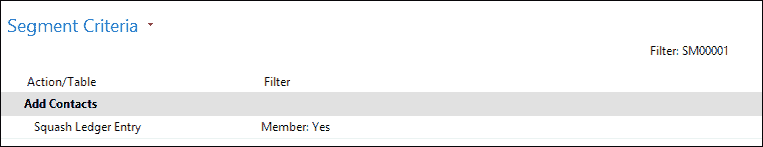

# 第四章  关系管理

关系管理软件通常是 ERP 应用所取得的成果。

在早期，每个人在桌子上都有一个名片夹，里面装有电话号码和地址，销售人员总是能记住谁是好客户，哪些客户总是付款晚或利润低。

RM 软件的引入完全改变了这一点，使我们能够在一个地方维护所有公司的联系人，并非常容易地分析销售数据。

关系管理自 Microsoft Dynamics 2.0 版本以来一直是其一部分，并在 3.0 版本中经历了巨大的变化和改进。当前的 Microsoft Dynamics NAV RM 软件与那个版本基本相同，除了与 Microsoft Outlook 的集成在每一版本中都在变化。

在本章中，我们将深入探讨这个非常完整的模块。阅读本章后，你将很好地理解概念以及如何维护主数据和分析交易数据。

我们还将在关系管理部分进行一些应用程序更改。

# 公司如何运作

在传统的会计软件中，我们将客户和供应商作为业务关系用于发票，但公司有许多我们希望在系统中注册的其他关系。

此外，公司或人员可以与我们公司有多个关系。最好的例子是我与 Microsoft 的关系。像所有人一样，我使用该软件，因此我是客户，无论是在我的商业还是个人生活中。另一方面，Microsoft 雇佣我来教授研讨会和进行演示，这使我成为供应商。作为 MVP，我与他们的关系完全不同。他们给我颁发奖项，邀请我参加特别活动，并允许我访问公司商店。他们还要求我在未来的版本中提供建议，因此对他们来说，我是他们的顾问。

因此，一个人或公司可以在 RM 中扮演不同的角色。Microsoft Dynamics NAV 能够处理所有这些，同时保持单一的数据输入和维护点。

与财务应用不同，RM 具有更大的灵活性。财务应用的功能和规则由政府法规定义，并且公司必须遵守。公司不是被迫使用 RM，但一旦实施，每个人都会理解其好处，并且不愿意放弃它。

## 联系人

RM 应用的起点是**联系人**表。这是我们存储我们所知道每个人的地址、电话号码、电子邮件地址等的地方。

当我们打开**联系人列表**时，我们会看到公司和人员被分组以便于快速浏览。


截止文本在此截图中的参考并不重要

如我们在前面的章节中学到的，Microsoft Dynamics NAV 中的一个页面基于一个单一的表，这意味着公司和人员必须存储在同一个表中。

当我们打开联系人卡时，我们可以清楚地看到这一点。**类型**字段表示联系人是一个商业实体还是个人，以及该个人是否属于一家公司。**公司编号**字段指的是类型为**公司**的联系人。这是一个一对多关系，意味着如果一个物理人与多家公司有联系，他或她需要为每个有关系的公司维护一个。

以下截图来自 Microsoft Dynamics NAV 中的联系人卡：


让我们浏览一下选项卡并查看一些重要字段：

+   **编号**：这是一个由数字序列确定的唯一键值。公司和个人的编号相同。

+   **类型**：这表示此联系人是一个人还是一家公司。

+   **公司名称**：当联系人是个人且与公司相关联时，会自动填充该公司的名称。

+   **姓名**：这是联系人的姓名。如果联系人是一个人，我们可以点击姓名旁边的**AssistEdit**按钮来打开姓名详情。姓名会根据我们输入的单词数量自动分解为名、中名和姓。然而，如果我们的联系人有一个更复杂的名字，如“Walter van den Broek”，这在荷兰人中很典型，系统就无法将其分解。

+   **地址**：输入联系人的居住街道或办公室所在的街道。

    ### 小贴士

    总是最好在这里输入邮政地址，因为这将用于所有文件。对于访问地址，请使用**备用地址**功能。

+   **邮政编码 & 城市**：这些字段通过**邮政编码**表连接，如果维护了该表，则可以填充另一个字段，这是一个可选功能。

    ### 注意

    大多数公司为其国家维护**邮政编码**表，并手动输入外国国家的邮政编码。大多数国家提供邮政编码/城市列表出售或作为网络服务，这将加快数据录入并防止人们输入错误的主数据。

+   **搜索姓名**：此字段会自动填充**姓名**字段，并允许您更快地搜索联系人，因为您可以在引用联系人时输入此字段而不是**编号**字段。

+   **(移动电话**)、**传真**和**电传号**：这是指该公司的电话和传真号码。移动电话字段还允许您与该联系人开始互动。

+   **销售人员**：这是此联系人的主要销售人员。如果此联系人晋升为客户，销售人员姓名将打印在订单表和发票上。

+   **称呼代码**：这个特殊字段指的是如何称呼此联系人。称呼代码表允许您构建诸如“亲爱的布朗夫人”之类的短语。我们将在后续部分了解更多关于称呼代码的内容。

+   **电子邮件**：此字段包含联系人的电子邮件地址。通过按**电子邮件**按钮 ![联系人]，我们可以直接发送电子邮件。

+   **主页**：这里是联系人网站的 URL。我们可以通过点击**URL**按钮 ![联系人] 访问网站。

+   **通信类型**：当我们在一个交互中创建 Microsoft Word 文档时使用此字段。它指示我们发送的是副本、电子邮件还是传真。

+   **货币代码和增值税登记号**：当此联系人晋升为客户或供应商时，货币代码和增值税登记号将从这里继承。

+   **地区代码**：此字段可以在段中用于过滤地理区域。

### 问候代码

当我们进行邮件合并时，我们希望信件以“亲爱的哈利”或“亲爱的布朗夫人”等开头。这可以通过问候代码来完成。

我们可以创建尽可能多的代码，但一个联系人只能使用一个。这是 CRONUS 演示数据库中的列表。


对于公司有一个问候代码，但大多数都是针对个人的。当我们查看**已婚女性**或**未婚**的公式时，我们会看到这个屏幕：


我们可以输入正式和非正式代码。问候可以有最多五个变量指向**职位名称**、**名字**、**中间名**、**姓氏**、**首字母**和**公司名称**。

当我们查看 Karen Friske 的结果时，它将是“亲爱的 Karen 女士”或“嗨，Karen”。

在本章末尾，我们将探讨如何创建额外的问候类型。

### 替代地址

正如我们本章前面所说的，最佳实践是在联系人表中使用地址字段作为邮政地址，因为这将打印在所有文件上。

在**联系人替代地址卡**表中，我们可以为联系人添加尽可能多的其他地址。


### 小贴士

虽然这些代码与任何事物无关，但最好有一个规则。始终为家庭或办公地址使用相同的代码。我们可以在稍后打印标签或段时使用此规则。

替代地址也可以有一个有效的开始日期和结束日期，以控制当前哪个替代地址是活跃的。

### 与客户和供应商的关系

在第二章中，*一个示例应用*，你看到联系人表是客户、供应商和银行账户主数据表的伞状数据。

每个类型的**公司**联系人都可以晋升为这些表之一。好处是所有地址信息字段都有一个单一的维护位置，并且可以继承。这也允许我们分析销售数据到关系管理，正如我们将在本章后面讨论段时看到的。

当我们创建主数据时，会使用不同的数字序列。在本章末尾，我们将探讨如何在代码中更改这一点。

**类型：人员** 的联系人无法创建为 **客户**、**供应商** 或 **银行账户**。

### 重复项

当输入新联系人时，系统可以搜索重复联系人。在 **重复搜索字符串设置** 表中，我们可以启用对八个字段的过滤：**名称**、**名称 2**、**地址**、**地址 2**、**邮政编码**、**城市**、**电话号码** 和 **增值税登记号**。

对于每个字段，我们可以设置在搜索重复项时应使用哪一部分。我们可以使用 **第一个** 和 **最后一个** 以及长度，这对于 **名称**、**地址** 和 **城市** 字段很有用。使用 **第一个** 与字段的全长进行搜索将查找精确匹配，这对于 **邮政编码**、**电话号码** 和 **增值税登记号** 很有用。

在 **营销设置** 表中，我们可以指定应导致警告的匹配标准百分比，如下面的截图所示：


对于每个联系人，系统将在 `Cont. Duplicate Search String table (5086)` 中保存这些值。

当我们输入新的联系人时，系统也会生成相同的字符串，并将这些字符串与数据库中的字符串进行比较。当有匹配时，系统将显示一个带有重复联系人的警告。

## 配置文件

联系人表具有非常有限的数量字段，并且不允许我们添加太多灵活的信息。这就是配置文件被使用的地方。

配置文件允许用户创建无限数量的额外信息源，这些信息源可以手动或自动填充。

让我们看看一个示例配置文件：


这个配置文件是为 **公司** 类型的联系人准备的。它包含 **问题** 和 **答案** 行。一个问题可以有一个或多个答案，我们可以定义尽可能多的问题和答案。最后一列显示了有多少联系人具有此配置文件答案。

配置文件是从 **联系人卡片** 中使用的。


当我们点击这个选项时，会打开一个新页面，我们可以选择所需的配置文件并回答问题。


答案显示在 **联系人卡片** 窗口的 **行** 子页中。

### 自动配置文件

配置文件也可以根据公式自动回答。这是通过使用 **自动联系人分类** 选项和设置 **问题详情** 来实现的。


**配置文件问题详情** 是固定的，并且是硬编码的。它们取决于联系人与客户或供应商之间的关系，如本章前面所述。


我们不会描述所有可能性，因为在线帮助已经很好地涵盖了这一点。

当问题设置好时，答案应该有一个**从值**和**到值**，以便系统选择正确的答案。

为了生成答案，使用了一个名为**更新联系分类**的批处理作业，我们可以根据配置文件进行筛选。


## 交互

我们与联系人的交互时刻有很多种。无论是电话、邮件还是发送发票，我们都可以在 Microsoft Dynamics NAV 中注册它们。

与配置文件一样，有一些交互是自动生成的，也有一些是手动生成的。手动交互是通过向导创建的。

所有交互都与一个**交互模板代码**相关。系统允许我们定义无限量的代码。交互代码还将决定其余向导的行为。


交互可以是**入站**或**出站**，由我们或他们发起。这些是信息字段。

**向导操作**字段决定了向导是否会生成邮件合并文档，允许我们附加之前创建的文档，或者什么都不做。邮件合并允许我们创建一个包含联系表所有字段的 Word 文档。

让我们创建一个交互并看看是如何操作的。要创建一个交互，我们在联系卡片或列表中选择**创建交互**，然后从**过程操作**中点击**创建交互**按钮。这将打开以下向导：


第一页询问我们想要启动哪种类型的交互。让我们创建一个备忘录：


这是下一步，因为我们的交互代码定义了我们将生成邮件合并：


我们现在可以在 Microsoft Word 中创建备忘录，所有必要的字段都已经填写完毕。


关闭 Microsoft Word 后，我们继续下一步，当填写所有字段后，我们可以完成向导。这将把交互保存在数据库中，并打印备忘录，因为我们选择**硬拷贝**作为**通信类型**。

### 注意

也可能推迟交互并在稍后重新启动。

### 自动交互

一些交互也可以自动生成，例如，每次我们打印发票或发货单时。

每笔交易使用的交互代码在**交互模板设置**中定义。对于每次打印，我们希望生成一个交互日志条目，我们需要设置一个代码。


### 小贴士

在打印大量文档时要小心，因为交互日志条目表可能会锁定较长时间，迫使数据库中的其他用户等待直到过程完成。为了避免这种情况，请启用此表上的自动递增，如本博客中所述[`markbrummel.wordpress.com/2014/05/25/tip-14-autoincrement-interaction-log-entries/`](http://markbrummel.wordpress.com/2014/05/25/tip-14-autoincrement-interaction-log-entries/)。

其他自动创建的交互日志条目是由段创建的，我们将在本章后面讨论。

### 完成的交互

完成后，交互操作将连接到联系人，并可用于分析目的。也可以从交互操作中开始一个待办事项。我们将在下一段中讨论这一点。

## 待办事项

待办事项是关系管理模型中的最低级别活动。它们最好与微软 Outlook 中的掩码或会议进行比较。

我们可以直接在系统中或从另一个事件中创建待办事项。我们可以从刚刚创建的交互操作中创建一个待办事项。让我们这样做。


此处的参考是标签，创建待办事项，因此侧面的截断文本是合适的。

当我们点击**交互日志条目**中的**创建待办事项**时，系统会显示一个向导，它将引导我们完成这个过程，就像**交互**向导一样。


待办事项有三种类型，**标准**（空白）、**会议**和**电话**。向导中的步骤取决于我们选择哪种类型。让我们选择一个**会议**。

下一步要求参会者提供会议信息，并允许创建邀请模板，然后这将再次创建一个交互日志条目。


### 注意

要执行此步骤，待办事项组织者应有一个有效的电子邮件地址。这可以在销售人员中设置。

下一步只要求提供一个位置，因此我们将点击**完成**。

当我们现在打开来自**销售与市场部门**的待办事项时，我们可以打开按日查看的**销售人员**矩阵，它显示了刚刚创建的会议。


截断文本不是截图中所引用部分的组成部分。

当我们讨论**机会**和** Outlook 集成**时，我们将看到更多关于待办事项的内容。

## 机会

当我们讨论配置文件时，我们已经可以看到关系管理与应用程序的 ERP 部分紧密集成。机会也是如此。

机会使我们能够管理我们从潜在客户那里收到的所有报价请求，创建一个将引导我们达成或失去交易的流程。这然后允许我们分析赢和输的交易，并根据这些信息改变我们的业务。

我们可以分析销售流程，并对我们的未来订单位置做出适当的判断，从而允许我们及时安排产能。

### 工作流程

我们创建的每个机会都将遵循系统中的销售周期。这将一步一步地引导我们完成这个过程。

让我们看看 CRONUS 数据库中的销售周期。

定义了四个销售周期。最重要的字段是**概率计算**公式。这将确定系统如何计算具有此代码的所有机会的当前价值。我们可以通过打开销售周期的**统计**窗口来查看**计算当前价值**，如下面的截图所示：


有四种选择可供选择：`乘法`、`加法`、`成功率百分比`和`完成百分比`。`Opportunity Entry (5093)`表中的`UpdateEstimates`函数计算这个：

```cs
UpdateEstimates()
IF SalesCycleStage.GET("Sales Cycle Code","Sales Cycle Stage") 
THEN BEGIN
  SalesCycle.GET("Sales Cycle Code");
  CASE SalesCycle."Probability Calculation" OF
    SalesCycle."Probability Calculation"::Multiply:
      BEGIN
        "Probability %" := "Chances of Success %" * 
                      SalesCycleStage."Completed %" / 100;
      END;
    SalesCycle."Probability Calculation"::Add:
      BEGIN
        "Probability %" := ("Chances of Success %" + 
                      SalesCycleStage."Completed %") / 2;
      END;
    SalesCycle."Probability Calculation"::"Chances of Success %":
      BEGIN
        "Probability %" := "Chances of Success %";
      END;
    SalesCycle."Probability Calculation"::"Completed %":
      BEGIN
        "Probability %" := SalesCycleStage."Completed %";
      END;
  END;
  "Completed %" := SalesCycleStage."Completed %";
  "Calcd. Current Value (LCY)" := "Estimated Value (LCY)" * 
                           "Probability %" / 100;
END;
```

`概率计算`首先计算一个`概率百分比`字段，然后这将导致所需的`计算当前价值`。

### 销售阶段

每个销售周期都有不同的阶段，将引导我们完成销售过程。


机会的当前销售阶段定义了`完成百分比`字段。我们可以通过**允许跳过**选项来决定销售阶段是否是强制性的。所需的报价将迫使我们为这个机会分配一个销售报价，正如我们稍后创建机会时将看到的。

#### 活动代码

每个销售阶段都有一个活动代码。这将定义在销售过程中为我们创建哪些待办事项。


这是一个非常强大的工具，使销售人员能够为每个销售过程创建一个工作流程。

让我们创建一个机会，看看系统里会发生什么。

### 创建机会

机会始于选择一个现有联系人或创建一个新的联系人。从**联系卡**，我们可以导航到**相关信息** | **联系** | **机会** | **列表**。

这将带我们到一个与该联系相关的机会过滤列表。

1.  在这里，我们可以选择**创建机会**。

1.  这将打开一个向导，将引导我们完成这个过程。在第一个窗口中，我们输入描述`Sell Chairs`并点击**下一步**进入第二步。

1.  在此步骤中，我们选择**销售周期**代码**FIRSTSMALL**并选择**完成**。

1.  选择**下一步**将允许我们输入更多信息，例如分配销售活动，并激活第一阶段。我们现在将跳过这一步，并在本章后面讨论活动。

    当我们现在打开创建的机会时，信息应该看起来像以下截图。因为我们还没有激活第一阶段，所以没有活动行。

    

    截止文本不是此截图中的参考部分

1.  让我们激活第一阶段并看看会发生什么。我们通过导航到**操作** | **功能** | **更新**来完成。我们进入一个向导，在那里我们选择**第一**。

1.  我们将连续点击**下一步**两次并进入向导的第三步。

1.  在这一步，我们应该输入估计的销售价值和**成功几率（%）**以获得这笔交易。这对于计算我们之前讨论的**计算估计值**非常重要。

1.  当我们点击**完成**时，我们回到**机会**页面，看到当前值为**260,00**。

    截止文本不是此截图中的参考部分

    由于这个销售周期的概率计算是**添加**，公式是：

    ```cs
    "Probability %" := ("Chances of Success %" +  
      SalesCycleStage."Completed %") / 2;

    "Calcd. Current Value (LCY)" := "Estimated Value (LCY)" * 
      "Probability %" / 100;
    ```

    这将导致 `(50 + 2) / 2 = 26 和 1000 * 26 / 100 = 260`。

1.  现在我们导航到**相关信息** | **机会** | **待办事项**，我们看到系统为我们创建了两个我们必须完成的待办事项。

    截止文本不是此截图中的参考部分

1.  这将帮助我们记住我们的日常任务，并允许管理层看到没有遗忘任何事情。这个销售周期中的下一阶段是**资格**和**展示**。

1.  我们可以通过再次进入向导并选择**下一步**来进入这些阶段。

1.  在连续点击**下一步**两次后，我们进入第三步。由于我们的待办事项之一是验证机会的质量，我们现在可以说例如成功的几率是 80%。

1.  我们将选择**取消现有打开的待办事项**复选框以确保我们的工作流程已更新。您将看到**计算当前值**已增加到**425,00**：

1.  当我们进入下一阶段时，我们会得到以下错误消息，告诉我们分配报价是进入下一步的强制要求：

#### 销售报价

要将销售报价分配给机会，我们从**机会卡**导航到**操作** | **功能** | **分配销售报价**。这将打开一个新的销售报价，其中所有字段都从机会中填充。


### 备注

要将报价分配给没有**销售客户编号**的联系人，我们需要使用**销售客户模板代码**。这可以在**常规**快速选项卡上激活**显示更多字段**选项时使用。

我们将选择两个家具项目并填写**数量**和**行折扣百分比**字段。

当我们现在更新机会时，我们可以使用 796,80 的报价金额，这将导致第三步中的**计算当前值**为 478,08，第四步为 557,76。

### 备注

要将机会更新到第 4 步，销售人员应该有一个有效的电子邮件地址，这可以在销售人员中设置。

#### 成交

第 5 步是我们示例中使用的销售周期阶段的最后一步。现在我们需要告诉系统这笔交易是赢还是输。为此，我们从**机会卡**导航到**操作** | **功能** | **关闭**。我们将选择**赢**并点击**下一步**。


在选择了一个有效的原因和销售金额后，我们可以关闭交易。


系统现在为这个联系人创建一个客户，并使用这个编号更新报价。我们需要手动将报价提升为订单。

## 创建段落

段落允许我们切割和分解系统中的数据，以创建一个筛选后的联系人列表。然后，可以使用这些信息创建一个交互，例如邮寄或启动销售活动。

由于 Microsoft Dynamics NAV 关系管理集成到 ERP 系统中，我们可以对 RM 和 ERP 数据进行筛选。

让我们创建一个新的段落并查看其可能性：


段落有一个**编号**和**描述字段**。编号可以使用数字序列定义。

在**交互**选项卡上，我们选择**交互模板代码**。我们将选择一个生成 Word 文档的交互，这样我们就可以使用段落的邮件合并功能。

**单位成本（LCY）**对于确定该段落的总成本非常重要，尤其是在我们与活动一起使用时，正如我们在本章后面将要看到的。

### 添加联系人

在定义了我们的段落之后，我们现在可以通过导航到**操作** | **功能** | **联系人** | **添加联系人**来开始通过筛选系统中的联系人信息。


这将打开一个选择窗口，允许我们在应用程序的不同部分进行筛选：

+   **选项**：这进一步分为四个类别：

    +   **允许现有联系人**：如果您运行多个选择并勾选此选项，则每次联系人位于选择中时，系统都会创建新的段落行。

    +   **展开公司**：当你选择此选项时，系统将为选择中的公司添加相关的人员。

    +   **允许相关公司**：当选择**展开公司**时，此选项将删除具有一个或多个人员的公司记录。

    +   **忽略排除**：联系人可以在段落下被忽略。勾选此标志将忽略此字段。

+   **联系人**：在这里，我们可以直接在联系人表的全部字段上进行筛选。例如，所有在荷兰的联系人。

+   **配置文件**：这允许我们根据任何配置文件答案进行筛选。当我们使用自动配置文件答案时，例如，我们可以根据特定的营业额或利润值筛选客户。

+   **邮寄组**：我们可以将任何段落到邮寄组中保存，以便轻松重复使用之前生成的筛选器。

+   **交互日志条目**：我们可以根据特定的交互代码筛选联系人。例如，过去一年内有销售发票的每个人。

+   **工作职责**：如果我们想向所有经理发送邮件，我们选择匹配的工作职责代码。

+   **行业组**：这允许我们筛选特定行业的公司。

+   **业务关系**：默认情况下，用于与客户、供应商和银行账户集成，但也可以通过额外信息进行扩展。

+   **值输入**：这可能是最强大的过滤器，我们可以根据相关联系人的特定项目编号和过账日期进行筛选。

### 精细/减少联系人

在添加了所有荷兰的联系人之后，我们可能想要精细或减少这个列表，这可以通过与添加联系人相同的筛选方式完成。精细会检查分段中的联系人是否匹配特定的筛选标准，而减少则会移除所有匹配标准的分段中的联系人。

我们将减少带有 Waalwijk 城市的分段。

### 分段标准

我们现在可以通过导航到**相关信息** | **分段** | **标准**来询问系统我们使用了哪些标准。


这允许我们查看我们做了什么，也可以撤销最后一步操作或保存标准。


### 邮寄组

另一个重用分段的方法是将邮寄组应用于分段中的所有联系人。要开始这个操作，我们点击**分段卡**中的**操作**选项卡上的**应用邮寄组**。


这将为分段中的每个联系人创建一个联系人邮寄组表记录。

### 日志分段

当分段完成时，应该进行记录。记录分段将在我们的分段中启动邮件合并过程并创建。


### 备注

使用此选项也将打印此示例中的信件。为了练习，可能需要启用 PDF 打印机或关闭打印机并删除打印作业。

如果需要，系统可以直接生成一个后续分段，如果我们想使用这个分段进行营销活动。

## 营销活动

大多数有营销部门的大公司都有销售营销活动来提高销售额。这些通常是某些商品对客户更有吸引力的时期。

在 Microsoft Dynamics NAV 中，我们可以管理销售价格，并从成本和利润的角度查看特定营销活动的结果。

让我们打开一个营销活动并查看它包含的信息：


每个营销活动都有一个唯一的**编号**字段，可以使用数字序列和**描述**来创建。**编号**字段应仔细选择，因为它将在整个应用程序中使用，该营销活动被使用的地方。

**状态代码**选项可以自定义定义，但不会影响业务逻辑。**开始日期**和**结束日期**字段对于定价信息很重要。特殊价格和折扣只在这些期间内有效。

通过**发票**选项卡，我们可以看到活动与维度集成。这为我们提供了强大的选项，可以为每个活动定义一个维度代码，并创建一个分析视图来分析 Microsoft Dynamics NAV 财务部分的结果，就像我们在上一章中讨论的那样。

### 定价

Microsoft Dynamics NAV 允许为活动设置特殊项目定价。如果从活动生成销售订单，系统将自动使用特殊价格。

通过导航到**相关信息** | **活动** | **销售价格**，我们可以输入此活动的定价信息。


这个价格表与我们在第二章中讨论的示例应用中的方式完全相同，*一个示例应用*。

### 细分市场

为了为活动选择客户或潜在客户，我们需要创建一个或多个细分市场。这些细分市场应通过**活动编号**字段与活动连接。与这些细分市场相关的人员将获得特定的价格和折扣。

这些细分市场也用于创建此活动的交互日志条目和待办事项。我们需要通过发送信件、传真、电子邮件甚至电话，让我们的目标群体意识到这个活动的存在。

### 激活

通过激活活动，系统将所有联系人添加到活动组中，并创建交互日志条目。

交互日志条目将用于计算活动的成本。每次交互都有一个特定的成本，所有成本加起来就是活动上的总金额。

当机会来临时，我们可以将其指向特定的活动。这个机会的价值也用于估计活动的成功程度。

活动也将通过附加到活动的维度复制到销售文档中。这使我们能够进一步分析结果。

## Outlook 集成

销售人员经常在路上，无法访问 ERP 系统，而 Microsoft Dynamics NAV 没有离线模式。为了解决这个问题，Microsoft Dynamics NAV 与 Microsoft Outlook 集成。这使得销售人员可以离线查看联系人和任务，并在可能的情况下与后台系统同步。

如果销售人员使用带有 Microsoft Outlook 的 Windows Mobile 手机，他们甚至可以在设备上拥有所有 Microsoft Dynamics NAV 信息。

使用用户定义的视图还可以使我们能够将其他 Microsoft Dynamics NAV 数据同步到 Microsoft Outlook，例如，带有**余额**字段当前值的客户表或带有当前库存的项目表。

我们将在第九章，*接口*中讨论与 Microsoft Outlook 接口的可能性。

### 邮件记录

Microsoft Dynamics NAV 还具有读取交换共享文件夹的能力，例如 `info@ 邮箱`。对于每封电子邮件，系统都可以生成交互日志条目和待办事项。

## 设置

在实施关系管理之前，我们应该正确设置选项。这可以在**营销设置**中完成。


让我们来看看所有字段：

+   **附件存储类型**：交互日志条目中的附件可以存储在数据库中（嵌入式）或文件系统中（磁盘文件）。强烈建议将它们存储在文件系统中。

+   **附件存储位置**：如果我们选择在文件系统中存储附件，这就是我们指定路径的地方。

+   **索引模式**：在执行联系人搜索时，应将其设置为**自动**。这可能在性能上略有不足，并可能导致数据库变得更大。

+   **继承**：在输入个人资料时，可以继承所属公司的销售员代码、地区代码、国家/地区代码、语言代码、地址详情和通信详情。

+   **默认值**：新联系人可以获取默认销售员代码、地区代码、国家/地区代码、语言代码或通信类型。公司和个人的默认问候代码不同。

+   **默认销售周期代码**：每个新的机会都将自动获得此代码。

+   **合并字段语言 ID**：这定义了 Word 合并字段是使用本地语言还是英语。

+   **同步**：在这里，我们输入客户、供应商和银行账户的默认业务关系代码。

+   **维护重复搜索字符串**：如果使用重复联系人功能，请检查此字段。

+   **自动搜索重复项**：如果系统在输入新联系人时应自动搜索，请使用此选项。

+   **搜索命中百分比**：这决定了从重复搜索字符串设置中匹配的行数百分比，应达到以作为重复联系人的标准。

# 定制关系管理

RM 是一个完整的模块，通常不会高度定制或垂直化。然而，我们将描述一些可能的更改以及如何集成附加组件，在我们的案例中是 squash 应用程序与关系管理。

本章中的所有示例都是第二章下载的对象的一部分，*一个示例应用*。

## 问候公式类型

默认情况下，系统有两种问候公式类型，正式和非正式，允许我们打印“亲爱的布朗夫人”，或“亲爱的安吉拉”，但如果我们想打印“致布朗夫人”，怎么办呢？

为了做到这一点，我们首先需要向**问候公式**表中的**问候类型**字段添加一个选项。


### 支持公式

接下来，我们希望在打印联系封面时使用公式。这使用了来自代码单元 365 的**格式地址**功能。

此代码单元是 Dynamics NAV 中完成所有地址格式化的唯一点。

联系人的格式化是在`ContactAddrAlt`函数中完成的。我们应该进行以下更改：

```cs
ContactAddrAlt()
...
  ContIdenticalAddress:
    WITH ContAltAddr DO BEGIN
      GET(Cont."Company No.",CompanyAltAddressCode);
      FormatAddr(
        AddrArray,"Company Name","Company Name 2",
        Cont.Name,Address,"Address 2",
        City,"Post Code",County,"Country/Region Code");
    END;
  (Cont.Type=Cont.Type::Person) AND
  (Cont."Company No." <> ''):
    WITH Cont DO
      FormatAddr(
//        AddrArray,ContCompany.Name,ContCompany."Name 2",
//        Name,Address,"Address 2",
        AddrArray,ContCompany.Name,ContCompany."Name 2",
        GetSalutation(5, Cont."Language Code"),Address,
        "Address 2",City,"Post Code",County,
        "Country/Region Code") 
```

### 小贴士

在进行更改之前，始终注释掉原始代码行。这将使您始终可以回到标准代码，并在升级此解决方案到新版本时提供帮助。

大多数 NAV 合作伙伴和开发人员都有自己的文档和注释方式。这里的例子是最低注释要求。我们将在第十章*应用设计*中讨论对象版本控制。

### 获取问候函数

在我们的修改中，我们使用`Contact table (5050)`中的`GetSalutation`函数代替**名称**字段。让我们看看这个函数并分析它做了什么：

```cs
GetSalutation()
IF NOT SalutationFormula.GET("Salutation Code",LanguageCode,
  SalutationType) 
THEN
  ERROR(Text021,LanguageCode,"No.");

SalutationFormula.TESTFIELD(Salutation);

CASE SalutationFormula."Name 1" OF
  SalutationFormula."Name 1"::"Job Title":
    NamePart[1] := "Job Title";
  SalutationFormula."Name 1"::"First Name":
    NamePart[1] := "First Name";
  SalutationFormula."Name 1"::"Middle Name":
    NamePart[1] := "Middle Name";
  SalutationFormula."Name 1"::Surname:
    NamePart[1] := Surname;
  SalutationFormula."Name 1"::Initials:
    NamePart[1] := Initials;
  SalutationFormula."Name 1"::"Company Name":
    NamePart[1] := "Company Name";
END;

CASE SalutationFormula."Name 2" OF
  ...
END;
...
FOR i := 1 TO 5 DO
  IF NamePart[i] = '' THEN BEGIN
    SubStr := '%' + FORMAT(i) + ' ';
    IF STRPOS(SalutationFormula.Salutation,SubStr) > 0 THEN
      SalutationFormula.Salutation :=
        DELSTR(SalutationFormula.Salutation,STRPOS(SalutationFormula.Salutation,SubStr),3);
  END;

EXIT(STRSUBSTNO(SalutationFormula.Salutation,NamePart[1],
  NamePart[2],NamePart[3],NamePart[4],NamePart[5]))
```

该函数使用两个参数：`SalutationType`和`LanguageCode`。使用这些值和联系人的问候代码，它检查是否存在有效的公式。由于我们只添加了一个新选项，代码仍然有效，因为在数据库级别，**选项**字段被转换为**整数**。

### 注意

为了文档目的，我们也可以在这个函数中实现新的选项值。这样做的不利之处在于，我们进行了一个技术上不必要的修改，但需要维护和升级。

根据公式的顺序，必要的名称字段被组合并用作函数的返回值。

### 设置问候公式

如果我们要使用我们新的问候公式，我们首先需要设置它。我们将为 F-MAR 进行此操作，以使用 CT100191 Megan Sherman 从 American Wood Exports 进行测试。


### 测试解决方案

在添加新公式后，我们将使用**报告**操作中的**联系封面**选项从联系卡打印封面。结果将如下所示：


## 客户和供应商编号

最终用户的一个常见要求是在从联系信息创建客户或供应商时保持相同的编号。

这可以通过在联系表中的`CreateCustomer`函数中添加一行代码来完成：

```cs
CreateCustomer()
...

CLEAR(Cust);
Cust.SetInsertFromContact(TRUE);
//* Maintain Contact No. >>>
Cust."No." := "No.";
//* Maintain Contact No. <<<
Cust.INSERT(TRUE);
Cust.SetInsertFromContact(FALSE);
```

这之所以有效，是因为通过填充“编号”字段，`OnInsert`触发器中的数字序列功能不会启动：

```cs
OnInsert()
IF "No." = '' THEN BEGIN
  SalesSetup.GET;
  SalesSetup.TESTFIELD("Customer Nos.");
  NoSeriesMgt.InitSeries(SalesSetup."Customer Nos.",
    xRec."No. Series",0D,"No.","No. Series");
END;
...
```

### 禁用直接创建客户和供应商

当使用此选项时，应禁用直接创建客户或供应商。这可以通过从**销售与应收账款设置**和**采购与应付账款设置**中移除`编号序列`来实现。这将在创建客户或供应商时导致运行时错误消息。

## 在公司间共享联系信息

当更多公司在 Microsoft Dynamics NAV 中进行管理时，它们通常拥有相同的所有者或所有者群体，他们希望他们的联系数据跨越他们的公司。

这可以通过在所有公司之间共享一些表并更改一些业务逻辑来实现。

### 共享表

默认情况下，Microsoft Dynamics NAV 将为每个公司创建每个表的单独实例。这可以通过表设计器中的`DataPerCompany`属性来更改。


以下列表应跨数据库共享，因为它们包含主要联系人信息和客户与供应商数据的链接：

+   5050 - 联系人

+   5051 - 联系人备用地址

+   5052 - 联系人备用地址日期范围

+   5053 - 业务关系

+   5054 - 联系人业务关系

这将允许我们在所有公司中重用联系人数据。其他表可以共享，但可能有用。

通过共享**联系人配置文件答案**表，其他公司可以了解客户在集团中的表现。

分段表可以共享，以便在公司内切片和切块信息。这也需要共享标准表。

### 小贴士

当你共享配置文件或分段表时，计算它们的报告应在数据库中为每个公司单独启动。

营销活动和机会不应共享，因为它们与 ERP 系统接口。永远不要共享财务表，如价值录入或文档表。

交互日志条目可以共享，但我们应该意识到，当我们处于错误的公司时，大多数与销售和采购文档相关的表关系将不起作用。

### 业务关系

当在各个公司之间共享联系人时，我们感兴趣的是看到哪些公司在哪些公司中是客户和供应商。我们还想在联系人信息更改时维护这些表。

这意味着除了共享联系人业务关系表外，我们还应该添加一个表示公司的字段，并将此字段添加到主键中。


### C/AL 代码修改

要使此自定义功能正常工作，我们需要 C/AL 代码理解我们想要做什么。它需要理解我们添加了公司。让我们查看所有需要更改以使此功能正常工作的函数。

我们在第二章*一个示例应用*中看到的创建客户和供应商记录的功能也应该进行检查，例如，联系人表中的`CreateCustomer`函数。

```cs
CreateCustomer()
...

ContBusRel.RESET;
ContBusRel.SETRANGE("Contact No.","No.");
ContBusRel.SETRANGE("Link to Table",ContBusRel."Link to Table"::Customer);
//* Company Sharing >>>
ContBusRel.SETRANGE(Company, COMPANYNAME);
//* Company Sharing <<<
IF ContBusRel.FIND('-') THEN
  ERROR(
    Text019,

...
```

在 C/AL 代码的稍上方：

```cs
ContBusRel."Contact No." := ContComp."No.";
ContBusRel."Business Relation Code" := RMSetup."Bus. Rel. Code for Customers";
ContBusRel."Link to Table" := ContBusRel."Link to Table"::Customer;
//* Company Sharing >>>
ContBusRel.Company := COMPANYNAME;
//* Company Sharing <<<
ContBusRel."No." := Cust."No.";
ContBusRel.INSERT(TRUE); 
```

我们还应该检查维护数据完整性的代码，即我们在第二章*一个示例应用*中讨论的`CustVendBank-Update Codeunit (5055)`：

```cs
UpdateCustomer()
WITH Cust DO BEGIN
//* Company Sharing >>>
 CHANGECOMPANY(COMPANYNAME);
//* Company Sharing <<<
  GET(ContBusRel."No.");
  ...
END; 
```

在这里，我们使用`CHANGECOMPANY` C/AL 命令来更改特定变量的公司。

### 注意

还有更多受影响的函数，例如联系表中的`UpdateQuotes`函数。在实施此功能之前，请分析您的数据库。

### 编号系列

对于一个正常工作的系统，我们最后应该做的更改是创建编号系列功能的新实例。

由于编号系列是一个独立的对象集合，因此这可以相对容易地实现。

在对象设计器中，我们应该过滤这一组对象，并将它们导出到一个`.txt`文件。

+   表格（308）：编号系列

+   表格（309）：编号系列行

+   表格（310）：编号系列关系

+   报告（21）：编号系列

+   报告（22）：编号系列检查

+   代码单元（396）：NoSeriesManagement

+   页面（456）：编号系列

+   页面（457）：编号系列行

+   页面（458）：编号系列关系

在这个文件中，我们可以重新编号并重命名它们，以便我们得到如下内容：

+   表格（123456721）：编号系列（共享）

+   表格（123456722）：编号系列行（共享）

+   表格（123456723）：编号系列（共享）

+   报告（123456721）：编号系列（共享）

+   报告（123456722）：编号系列检查（共享）

+   代码单元（123456721）：NoSeriesManagement（共享）

+   页面（123456721）：编号系列（共享）

+   页面（123456722）：编号系列行（共享）

+   页面（123456723）：编号系列关系（共享）

其中，表格应该是`DataPerCompany`编号。

### 最终步骤

当我们有了共享编号系列功能时，我们可以在现有的对象中实现这一点。

1.  在营销设置表中，**联系号码**字段应将表格关系更改为共享编号系列表以及联系表中的**编号系列**字段。

1.  联系表中的`NoSeriesMgt`变量应从`NoSeriesManagement`移动到`SharedNoSeriesMgt`。

### 替代方法

在公司之间共享联系信息是许多公司已经实施过的更改，并且可以被认为是安全的。由于财务或运营信息，Microsoft Dynamics NAV 中的其他表格更难以共享。

在标准应用程序中，一个典型的例子是`项目表（27）`。这个表包含一个字段`Cost is Adjusted (29)`，当运行成本调整时使用。如果这个表格将在所有公司之间共享，将会在运行此功能时产生一个主要问题。我们将在第五章 *生产* 中讨论成本调整。 

对于这个问题，有两个常见的解决方案：

+   **共享主项目**：我们可以创建一个新的表格，称为主项目。这个表格在所有公司之间共享，包含我们共享的信息，如描述和定价。当这个表格中的数据发生变化时，应该启用一个类似于`CustVendBank-Update Codeunit (5055)`的机制，该机制使用`CHANGECOMPANY` C/AL 函数更新其他公司的项目。

+   **外部同步**：我们可以实现一些将一个公司中做的更改导出到 XML 文件的功能。一个应用程序服务器可以在后台运行并读取此 xml 文件，并将这些更改应用到数据库中的其他公司或甚至其他数据库。

第一个使用主项目的解决方案很像标准应用程序中联系人的工作方式，是观察、学习和在定制解决方案中使用经过验证的数据结构的完美示例。

## 添加联系人到段

我们在关系管理中实施的最后一个更改是在段中添加到**添加联系人**功能的一个表。

我们已经看到它已经完整，但一个垂直解决方案可能希望在这里集成其账簿条目表。

对于这个例子，我们将使它能够从第二章的示例应用程序中筛选压榨账簿条目，*一个示例应用程序*。

### 扩展报告

第一步是将压榨账簿条目作为`DataItem`添加到添加联系人报告（5198）。我们将从值条目复制功能，因为这具有相似的功能。

### 小贴士

总是寻找可比较的标准应用程序功能来学习。永远不要只是复制粘贴，而是学习它是如何完成的，并应用你自己的知识。


我们不能从其他联系人业务关系`DataItem`复制粘贴表关系，因为压榨球员是联系人，而不是公司。我们的表关系应该是`Contact No.=FIELD(No.)`。

我们在联系人业务关系表中的代码告诉我们，我们需要两个新的布尔类型变量，`SquashFilters`和`SkipSquashLedgerEntry`：

```cs
ContactBusinessRelation2 - OnPreDataItem()
IF ContactOK AND ((GETFILTERS<>'') OR SquashFilters) THEN
  ContactOK := FALSE
ELSE
  CurrReport.BREAK;

ContactBusinessRelation2 - OnAfterGetRecord()
SkipSquashLedgerEntry := FALSE;
IF NOT SquashFilters THEN BEGIN
  ContactOK := TRUE;
  SkipSquashLedgerEntry := TRUE;
  CurrReport.BREAK;
END;
```

`SquashFilters`在`OnPreReport`触发器中确定：

```cs
Report - OnPreReport()
ItemFilters := "Value Entry".HASFILTER;

//* Squash >>>
SquashFilters := "Squash Ledger Entry".HASFILTER;
//* Squash <<<
...
```

压榨账簿条目`DataItem`中的代码应如下所示：

```cs
Squash Ledger Entry - OnPreDataItem()
IF SkipSquashLedgerEntry THEN
  CurrReport.BREAK;

CASE ContactBusinessRelation2."Link to Table" OF
  ContactBusinessRelation2."Link to Table"::"Squash Player": 
  BEGIN
    SETRANGE("Squash Player No.",
      ContactBusinessRelation2."No.");
  END;
  ELSE
    CurrReport.BREAK;
END;
Squash Ledger Entry - OnAfterGetRecord()
ContactOK := TRUE;

IF ContactOK THEN
  CurrReport.BREAK;
```

确保我们根据我们的联系人业务关系实例进行筛选，并且根据我们与压榨球员表的链接进行筛选。

`ContactOK`表示所有与该压榨账簿条目相连的联系人将被插入。

### 实施标准筛选器

为了支持标准筛选器功能，我们需要对**添加联系人**报告和`SegCriteriaManagement`代码单元进行两个更改。

在**添加联系人**报告中，我们在`OnPreReport`触发器中添加此 C/AL 代码。这将调用`SegCriteriaManagement 代码单元（5062）`：

```cs
OnPreReport()
...
SegCriteriaManagement.InsertCriteriaFilter(
  "Segment Header".GETFILTER("No."),DATABASE::"Value Entry",
  "Value Entry".GETFILTERS,"Value Entry".GETVIEW(FALSE));
//* Squash >>>
SegCriteriaManagement.InsertCriteriaFilter(
  "Segment Header".GETFILTER("No."),
    DATABASE::"Squash Ledger Entry",
    "Squash Ledger Entry".GETFILTERS,
    "Squash Ledger Entry".GETVIEW(FALSE));
//* Squash <<<
```

在`SegCriteriaManagement`代码单元中，我们在`SegCriteriaFilter`函数中添加此代码，这将需要一个新局部变量`Squash Ledger Entry`：

```cs
SegCriteriaFilter()
...

CASE TableNo OF
   ...
//* Squash Ledger Entry >>>
  DATABASE::"Squash Ledger Entry":
    BEGIN
      SquashLedgEntry.SETVIEW(View);
      EXIT(SquashLedgEntry.GETFILTERS);
    END;
//* Squash Ledger Entry <<<
END;
```

### 测试解决方案

现在，我们可以通过尝试将所有类型的**成员**压榨球员添加到**段**来测试解决方案：


结果是一个包含所需压榨球员的段。



### 注意

此更改也需要实施到减少/细化功能，该功能与添加联系人报告类似。

# 摘要

在本章中，我们深入探讨了微软 Dynamics NAV 的关系管理功能。我们学习了它是如何与系统的 ERP 部分集成的。关系管理对于分析销售数据非常有用。通过配置文件，我们可以根据营业额和利润数字进行筛选，并在各个部分中使用它们。

交互日志条目使我们能够跟踪与我们的商业伙伴的所有接触时刻。Outlook 集成可用于销售人员远程工作并与系统同步。

营销活动和机会帮助我们跟踪报价过程，并使我们的销售工作更加高效。

最后，我们查看了一些将关系管理系统更改以满足我们公司特定需求的常见要求。

在接下来的章节中，我们将从第五章“生产”和第六章“贸易”开始，探讨微软 Dynamics NAV 的 ERP 部分。
