# 第五章。生产

之前的章节介绍了 Microsoft Dynamics NAV 的关键概念以及财务应用程序和 CRM 的详细信息。这些横向模块可以在大多数行业中实施，而无需进行大的结构性改变。

在本章中，我们将讨论三种在 Microsoft Dynamics NAV 中使用标准功能和定制功能实现生产的方法。

我们将讨论项目跟踪和项目成本，以及使用哪些程序和对象来确保应用程序中正确运行。对于制造，我们将讨论一般概念和数据模型，而不是深入到每个功能的细节。

我们还将讨论配套，这在有限的几个国家如北美、法国和澳大利亚可用，但很可能会在未来版本中转移到全球版本。

在本章结束时，我们将探讨五个不同的垂直行业，并突出这些行业中两个特定功能，这些功能在标准产品中尚未实现，并讨论如何解决这些问题。

阅读本章后，您将更好地理解 Microsoft Dynamics NAV 中生产的概念，以及这些概念如何与应用程序的其他部分相匹配，以及如果它不符合您的流程时，如何跳出思维定势。

# 什么是生产？

生产是使用原材料或预制件和资源创建新产品的过程。

我们今天所了解的生产方式在工业革命前几个世纪就已经开始，工匠和助手使用自然界和农民生产的原材料来创造产品。今天，这种方法的生产仍然存在于许多奢侈品中，如定制家具或服装。

工业革命将生产转变为制造业，随着机器和大规模生产的引入，这使得生产不再那么依赖于工匠和体力劳动。

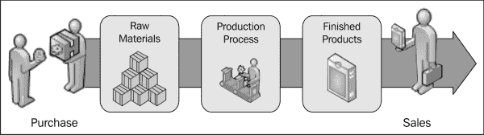

计算机在制造公司的引入使得生产更复杂的物品成为可能，并使制造更加灵活。

要为生产公司实施 Microsoft Dynamics NAV，了解贵公司正在使用哪种生产级别至关重要。

## 生产方法

在本章中，我们将区分以下三种生产方法：

+   **组装生产**：当生产将项目组合成一个新的项目，而不改变项目或产生废料时，我们将称之为组装。

+   **制造生产**：这是在 Microsoft Dynamics NAV 中要实现的最复杂的生产方法。原材料被组合成一种或多种产品，并产生废料。

+   **专业生产**：这些通常是单件或小批量生产的物品。系统应支持生产过程的基本原则，但还应足够灵活以适应公司。

## 原材料

我们消费的每一件产品最初都是原材料，如棉花、铁矿石、木材和石油，然后经过加工用于生产过程。其他原材料是水和空气或水果和蔬菜。所有原材料都是由大自然生产的。某些原材料（如木材、棉花、水果和蔬菜）的生产可以受到人类的影响。其他原材料更为有限，如铁矿石、石油和水。

# 基本生产原则

在进入 Microsoft Dynamics NAV 之前，我们将讨论一些重要的术语，这些术语对于理解 ERP 中的生产概念至关重要。

## 物料清单

物料清单定义了组装或制造一个项目所需的组件。物料清单中的组件也是项目，因此在创建新的物料清单之前，系统中必须创建所有组件项目。

### 注意

在 Microsoft Dynamics NAV 中，有两个独立的物料清单定义，一个用于组装，另一个用于制造。

## 物料需求计划

**物料需求计划**（**MRP**）于 20 世纪 60 年代作为一种生产排程的计算方法被引入，并很快被**制造资源计划**（**MRP II**）所取代。

虽然 ERP 取代了 MRP，但 MRP 仍然是 ERP 应用的关键部分。

Microsoft Dynamics NAV 内置了 MRP 算法，但也允许开发者使用内置数据模型创建自己的算法。MRP 分析相关需求，即来自组件生产订单的需求。

### 输入垃圾，输出垃圾

运行 MRP 算法的最大风险是**输入垃圾，输出垃圾**（**GIGO**）原则。为了做好计划，系统中的数据必须绝对正确，否则计划将包含错误。

例如，如果销售订单中的交货日期没有正确输入，规划算法就没有机会给出正确的结果。输入的垃圾（错误的日期）将导致输出的垃圾（错误的计划）。

## 主生产计划

**主生产计划**（**MPS**）是用于生产计划和排程的术语。MPS 用于决策，连接供需。它分析独立需求，即来自销售订单、服务订单和生产预测的需求。

## 项目成本核算

对于制造公司来说，能够计算真实的项目成本和盈利能力至关重要。项目的成本包括其构成的所有组件的成本，以及任何使用的机器的生产时间和成本。

在生产公司中，在项目甚至可以制造和销售之前，就会产生高昂的成本。需要购买和安装机器，并且可能需要建造新的制造工厂。

## 项目跟踪

项目跟踪是一个相对较新的概念，它是由于需要能够追溯供应链中项目的原始生产批次而产生的。当某个特定项目出现问题时，了解同一批次生产的其他项目是否也存在同样的问题，甚至可能需要召回所有项目，是非常有趣的。

## 质量控制

在生产过程中，尤其是在结束时，质量控制是一个关键阶段。项目可能被完全拒绝，或者可能需要额外的处理。

在质量控制中，会对项目进行检查以发现错误。这种检查的方式取决于生产过程。在汽车行业中，所有汽车都是单独检查的，而在化工行业中，会取出批次的一部分进行检查，假设其余批次的质量相同。

质量控制始终在生产过程的最后，但也可能在每个主要生产过程之间。有时，制造的项目取决于质量控制的成果。在这种情况下，每个质量级别都由一个特殊的物品编号来表示。

## 能源和废物

在制造项目时，明显的组件是材料清单中的项目。随着我们的环境变得越来越脆弱，在这个过程中使用更少的能源和产生更少的废料变得越来越至关重要。随着回收利用变得越来越重要，这些组件对生产成本和计划的压力也越来越大。

## 运营管理协会

要了解更多关于生产的信息，研究**运营管理协会**（**APICS**）提供的资料是很有趣的。APICS 是一个在全球范围内被公认为制造标准领先权威的组织，类似于 W3C 被认为是 XML 标准的权威。

### 注意

更多关于 APICS 的信息可以在 [`www.apics.org/`](http://www.apics.org/) 找到。

# 入门

让我们通过两个脚本来生成一个新的项目，并带有材料清单：一个用于组装过程，另一个用于制造。

我们将为这些产品设置项目成本和项目跟踪。

### 注意

这些示例是使用未经更改的 CRONUS W1 Microsoft Dynamics NAV 2013 Release 2 数据库创建的。

## 组装

在我们公司，我们希望开始生产办公椅。这些椅子由五个轮子、一个底座、一个座椅和两个扶手组成。我们将创建这四个组件作为新的项目，并为最终产品创建一个新项目。

所有项目都将采用不同的成本计算方法，以展示成本变化的影响。最终产品将支持带有一年保修期的序列号项目跟踪。

### 设计模式

在进入应用之前，我们将看看如何在 Microsoft Dynamics NAV 中解决这个问题。以下图表说明了这个过程：

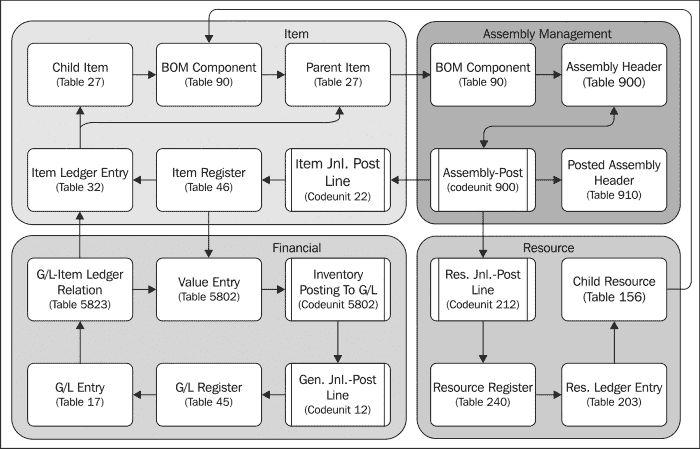

它从在数据库中创建组件和最终产品作为项目，并使用**BOM 组件**表连接它们开始。**BOM 组件**还可以包含**资源**。

如果组件有库存，我们可以使用组装文档来创建产品。在过帐组装文档时，组件被消耗，产品被创建。在这个过程中，系统将创建**资源账本条目**、**项目账本条目**和**价值条目**。

**价值条目**可以通过**库存过帐到总账**程序过帐到总账，无论是手动还是实时。这完成了整个过程。

### 项目

对于这个例子，我们需要创建五个项目，四个组件和一个最终产品。我们将为组件分配一个估计的单位成本，为最终产品分配一个单位价格，如下表所示：

| 编号 | 描述 | 基本单位 | 单位成本 | 单位价格 | 成本方法 |
| --- | --- | --- | --- | --- | --- |
| 第五章-C1 | 第五章 | 轮子 | PCS | 5 |   | 先进先出（FIFO） |
| 第五章-C2 | 第五章 | 底座 | PCS | 60 |   | 后进先出（LIFO） |
| 第五章-C3 | 第五章 | 座位 | PCS | 120 |   | 平均 |
| 第五章-C4 | 第五章 | 车载扶手 | PCS | 35 |   | 标准 |
| 第五章-P1 | 第五章 | 办公椅 | PCS |  | 500 | 特定 |

### 注意

在实际实施中，我们永远不会为每个项目设置具有如此多不同成本方法的材料清单。这完全是出于解释每个成本方法做什么以及 Microsoft Dynamics NAV 在技术上能够处理这种情况的目的。

### 项目成本

项目成本确定项目成本的计算方法。我们将为每个项目分配不同的成本方法。让我们简要讨论在 Microsoft Dynamics NAV 中可用的成本方法：

+   **先进先出（FIFO）**：先入先出。使用最旧项目账本条目的成本。

+   **后进先出（LIFO）**：后入先出。使用最新项目账本条目的成本。

    ### 小贴士

    当使用先进先出（FIFO）或后进先出（LIFO）时，如果使用批号进行项目跟踪，成本将在**批号**内应用。也就是说，与特定**批号**相关的成本将被使用。

+   **平均**：每次我们购买项目时，总成本除以总数量。结果用作单位成本。

+   **标准**：用户将手动定义单位成本。在开票时，所有采购价格的偏差都作为利润或损失过帐。

+   **特定**：这始终与项目跟踪和序列号结合使用。每个序列号使用其独特的单位成本。

    ### 注意

    成本方法与仓库拣选方法无关，但仅适用于财务成本计算。

### 项目跟踪

我们的所有椅子都将获得一个带有一年保修期的序列号。这使得我们能够在椅子出现问题时追踪所有单个椅子返回工厂的情况。

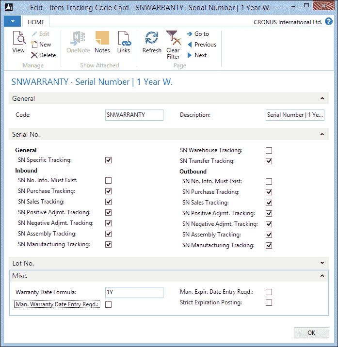

在 Microsoft Dynamics NAV 中，可以对一组物品的个别序列号和批号进行项目跟踪。

**序列号**和**批号**是项目日记账条目表（32）中的字段。这将导致每个序列号或批号在表中创建一个单独的记录。当使用序列号时，这可能导致表大小的巨大增加。

批号和项目号在文档录入过程中保存在预订条目表（337）中。预订条目可以分配给 Microsoft Dynamics NAV 中的任何表，例如销售行、项目日记账行或生产订单。

当过账文档并创建项目日记账条目时，预订条目被移除，并替换为具有与对应项目日记账条目相同的**条目号**字段的跟踪规范记录。

### 注意

用于项目跟踪的预订条目不应与销售和采购过程中的正常预订条目混淆。

Microsoft Dynamics NAV 中项目跟踪的过程如图所示：

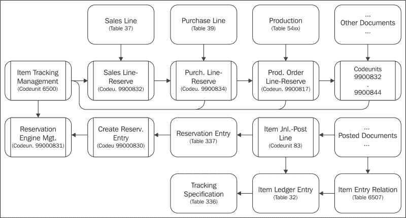

从技术上讲，Microsoft Dynamics NAV 中的项目跟踪非常复杂，并且只有在仔细分析后，经验丰富的开发者才应更改。

我们将在第六章*贸易*中更详细地讨论预订过程。

### 物料清单

当创建项目时，定义了成本计算方法并设置了项目跟踪。下一步是为办公椅创建物料清单。这可以通过在**项目清单**中的**物料清单**选项或**卡片**页面中的**装配清单**来完成。

物料清单定义了将用于创建一个新最终产品的组件项目和资源。

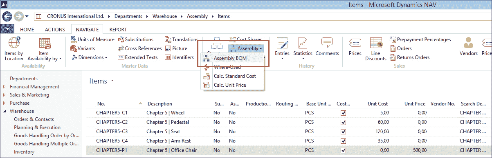

我们使用之前讨论过的组件，包括五个轮子、一个底座、座椅和两个扶手。

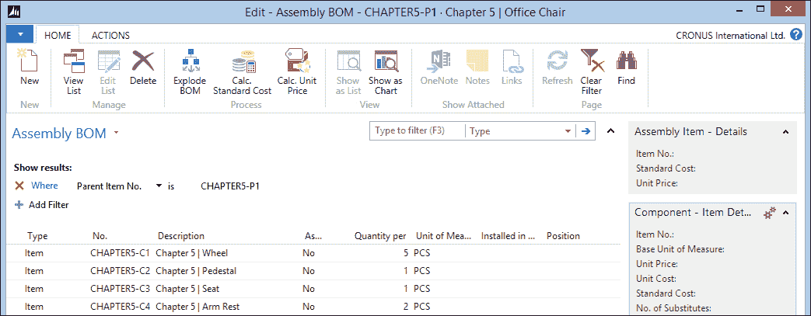

### 计算标准成本

我们为物料清单选择的组件具有单位成本。这些项目共同决定了我们最终产品的单位成本。

我们可以通过在用于物料清单的相同**计算标准成本**菜单中选择**Calc. Standard Cost**来计算办公椅的标准成本。

### 注意

计算选项中的**Calc. Standard Cost**名称不应与成本计算方法混淆。此功能应适用于所有成本计算方法。

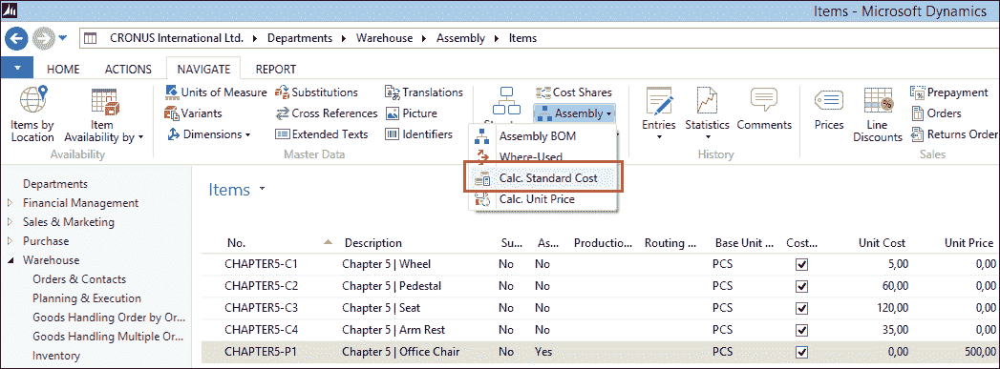

标准成本现在是通过组件的单位成本、间接费用率和间接成本百分比来计算的。我们将在示例中不使用后者。

```cs
((5*5) + (1*60) + (1*120) + (2*35)) = 275
```

### 创建库存

在我们能够组装椅子之前，我们需要购买组件。为此，我们将创建一个包含八个采购条目的采购订单。我们将以系统中的单位成本不同的价格购买组件，这样我们可以展示成本方法的影响。

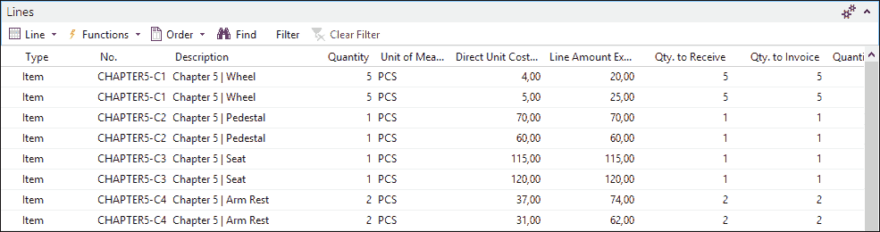

采购订单将被接收并开票。

### 注意

如果只收到采购订单而没有开票，示例可能不起作用，因为在 CRONUS 数据库中未激活预期成本过账到总账。

### 调整成本项目条目

我们刚刚创建、接收和开票的采购订单的单位成本与我们最初在项目中设置的单位成本不同。

根据项目的成本方法，这将对单位成本产生影响。当我们查看我们创建的项目的新单位成本时，我们可以看到这受到了采购订单的影响。然而，这些值是不正确的。系统只采用单位成本的第一次更改。

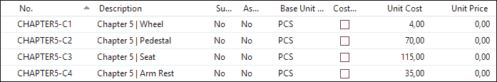

为了纠正这一点，我们需要运行调整成本项目条目（报告 795）批量作业。这将根据成本方法确定新的单位成本。

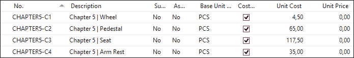

在标准成本未受交易影响的情况下，FIFO、LIFO 和平均的单位成本已经重新计算。

### 注意

**调整成本项目条目**报告应定期在您的数据库中运行。即使数据库设置为使用预期成本过账和自动成本过账。

### 将库存成本过账到总账

Microsoft Dynamics NAV 支持将库存成本过账到总账。这使得会计师能够有一个单一的数据分析点，而不是打印库存报告并手动使用数字编制管理报告。

这可以通过使用**将库存成本过账到总账**功能（报告 1002）来完成，如下面的截图所示：

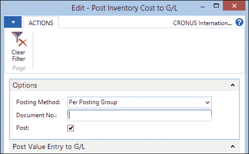

### 检查，检查，再检查

要检查价值条目和总账是否同步，我们可以运行库存评估（报告 1001）。这将显示库存价值与过账到总账的金额。

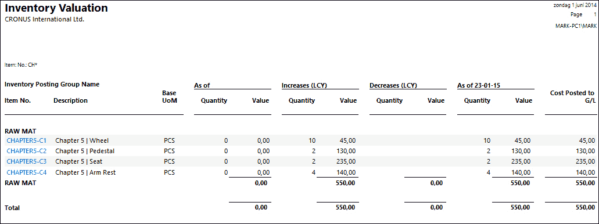

### 重新计算标准单位成本

我们为办公椅计算的标准单位成本是 275。这是基于我们的购买价格假设。现在我们已经真正购买了并收到了组件，我们可以根据实际价格计算新的单位成本。

在这个例子中，价格仍然是`275`，因为所有购买项目的总价是`550`。库存使我们能够用这些材料制作两把椅子：

```cs
(550 / 2) = 275
```

### 注意

使用这种计算方法，可以检查计算单位成本算法的结果。

### 汇总订单

现在我们有了库存的组件和正确的单位成本，我们可以创建一把椅子。我们将使用装配订单来完成这项工作。

在装配订单中，我们需要为每个我们想要组装的项目创建一行。组件在过帐订单时自动使用。我们将使用采购代理角色中心（9007）来完成这项工作。

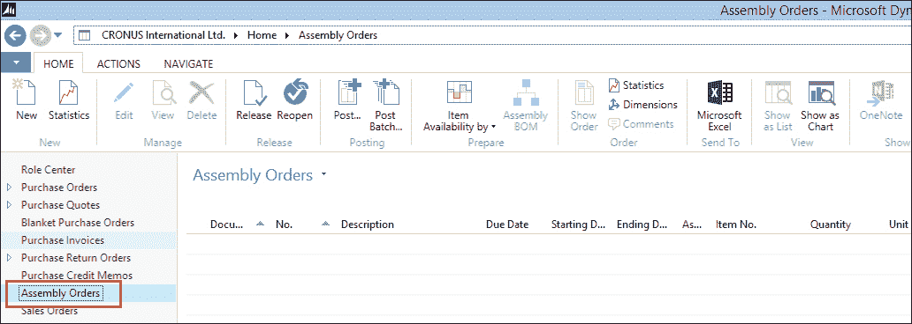

装配订单

在为办公椅创建文档并尝试过帐文档时，我们将收到一个错误消息，因为我们首先需要指定序列号。

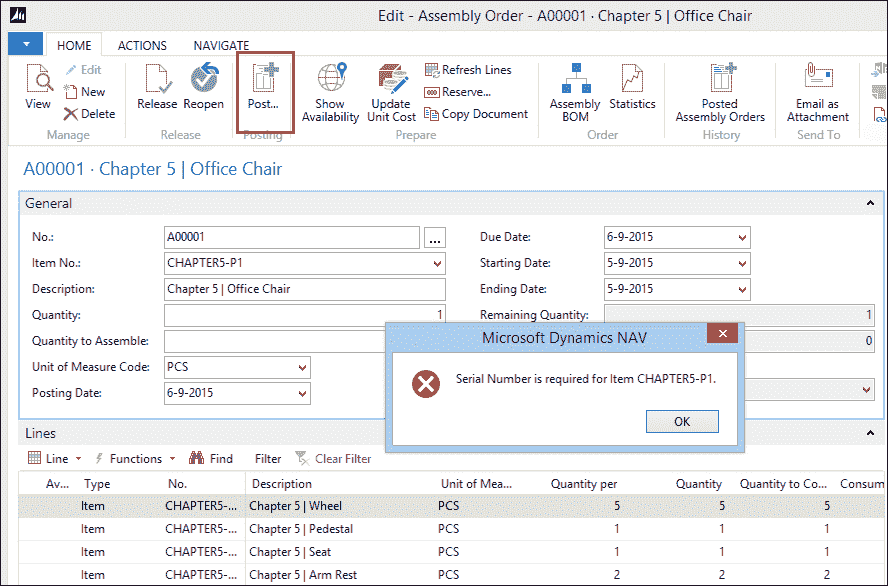

指定序列号

序列号和批号可以使用**项目跟踪行**选项设置。这会打开**项目跟踪行**页面（6510）。此页面能够在注册过程中的预留条目以及如果项目日记账条目已经创建，还可以显示跟踪规范。

我们将手动创建一个新的序列号。Microsoft Dynamics NAV 还支持系统生成的序列号。

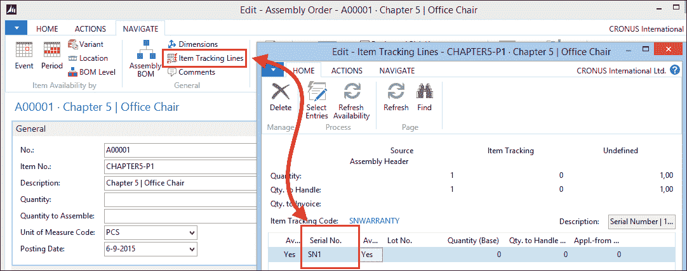

我们现在可以过帐这个装配订单，并将有一把带有序列号的办公椅在库存中。

### 再次检查成本

创建办公椅改变了组件项目的库存，因此可能会影响我们项目的成本计算。然而，当我们现在检查我们的项目时，单位成本并没有改变。

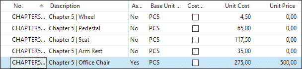

即使如此，根据当前的库存，单位成本可能不同。记住我们使用了 5 个轮子，使用 FIFO 成本为 4，以及一个座椅使用 LIFO 成本为 70。

使用**调整成本条目**和**过帐到总分类帐**选项来运行：

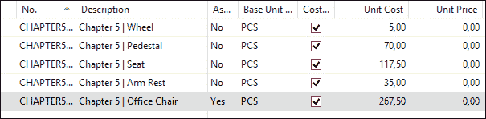

单位成本已更改，现在显示我们使用了前五个轮子使用 FIFO，留下库存中的其他五个轮子，价值为**5**。我们使用了最后一个座椅使用 LIFO，留下库存中的第一个座椅，价值为**70**。

当我们运行**库存评估**时，我们可以看到生产第一把椅子的实际成本是**267,50**，但我们过帐的是**275**。

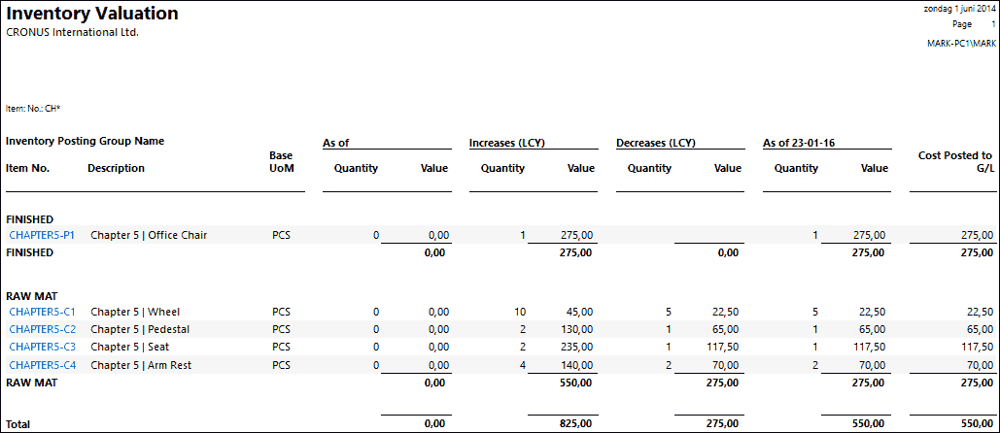

### 再次重新计算单位成本

当我们为我们的办公椅运行**计算单位成本**时，我们可以看到新的成本将是`282,50`。

```cs
(5*5) + (1*70) + (1* 117,50) + (2*35) = 282,50
```

与价值为`267,50`的第一把椅子一起，我们匹配了价值为 550 的采购发票。

### 标准成本工作表

我们需要纠正第一把椅子的成本，它目前在库存中，以获得正确的库存价值。我们可以使用**标准成本工作表**来完成这项工作，如下面的截图所示：

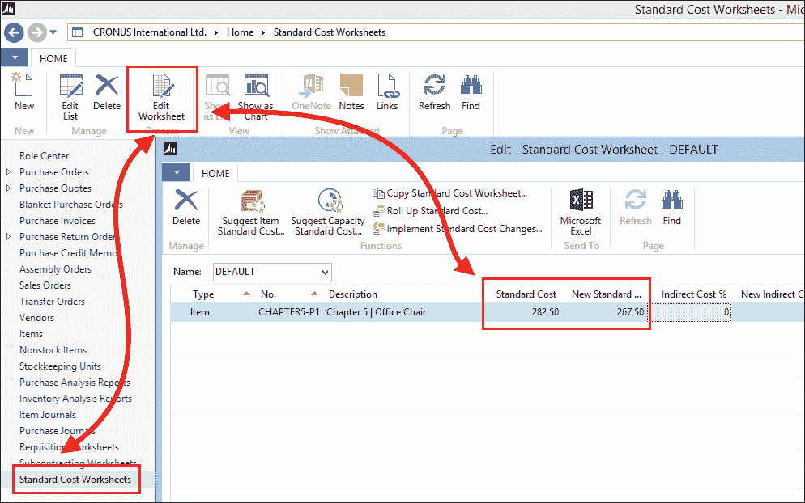

此工作表允许我们通过在选择**实施标准成本更改**选项时在项目重估日记账中创建条目来纠正旧价值条目。这将创建一个新的价值条目，并带有变化值以跟踪变化。

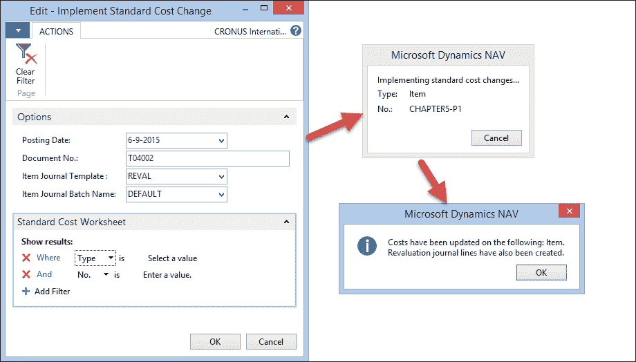

### 项目重估日记账

最后一步是过账**项目重估日记账**并运行**过账库存成本到总账**程序。

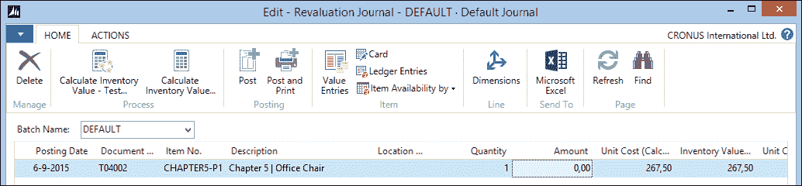

### 注意

我们还需要运行**计算标准成本**，因为办公室椅子批次将重置单位成本为**267,50**。

### 结果

当我们现在运行**库存评估报告**时，我们可以看到库存中的**办公室椅子**价值为**267,50**，剩余库存为**282,50**：

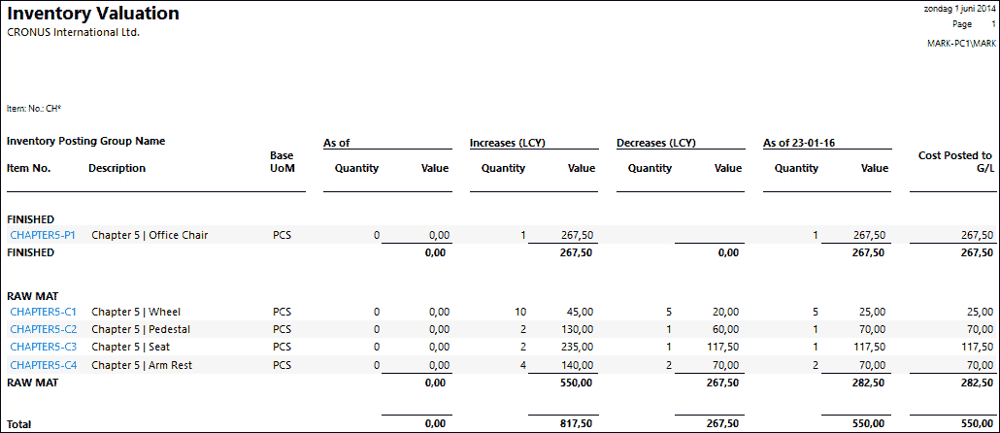

## 概述 10 个步骤的项目成本计算

我们在示例中执行的所有步骤都可以总结在这个 10 步骤流程图中：

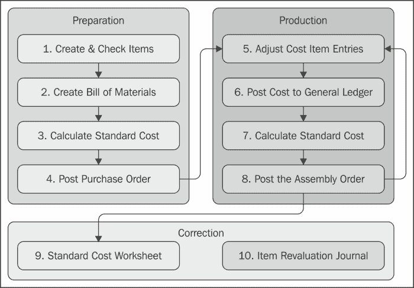

让我们简要看看步骤：

1.  我们首先创建新项目并设置成本计算方法。

1.  然后我们为生产项目创建物料清单。

1.  运行**计算标准成本**程序以获取生产项目的单位成本。

1.  购买生产所需的项目。

1.  运行**调整成本项目条目**程序。

1.  使用**过账库存成本到总账**程序将价值条目与总账条目同步。

1.  如有需要，重新计算标准成本。

1.  创建一个组装订单并过账文档。

1.  运行**标准成本工作表**以更改标准成本。

1.  运行**项目重估日记账**以实施旧值条目的标准成本。

## 制造

组装管理模块在 2013 年版本的 Microsoft Dynamics NAV 产品中添加，并取代了自 1995 年 Windows 版本引入以来存在的 BOM 日记账。两者都使我们能够从其他项目创建新项目。

在 2.01 版本中，Navision 引入了 Navision 制造的第一版。这是一个与 Navision 财务分开的产品，由于其复杂性，仅对认证合作伙伴可用。

在 3.00 版本中，制造成为标准 Navision attain 包的一部分，对所有合作伙伴可用。制造为 Microsoft Dynamics NAV 用户提供了比仅从物料清单创建项目更多的功能。生产订单可以使用工作中心、机床、工具和产能日历来安排。

在计划运行中，可以使用制造至库存或制造至订单策略来安排项目的生产。

系统计算所需的 BOM 组件，并在库存不足的情况下使用复杂的需求和供应过程创建采购订单。如果我们将其放入设计模式中，它看起来像这样：

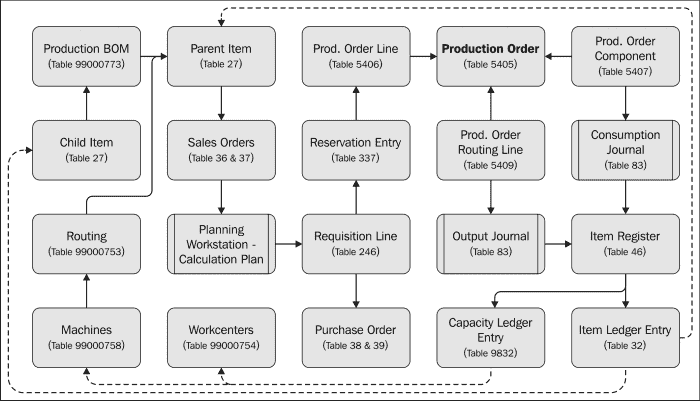

**生产订单**是流程的中心，由具有**生产 BOM**的项目创建，这些项目要么在销售订单中，要么库存不足。

**计划运行**填充**计划工作表**，该工作表基于**请购单行**表（246）。计划工作表可用于创建生产订单和采购订单。

在生产过程中，**消耗日记**用于记录从**生产 BOM**中使用的子项，而**输出日记**在完成时创建新项目。或者，这些步骤可以在**生产日记**中合并。

让我们通过使用**生产计划员**角色中心（9010）的下一个示例来演示这一点。

我们将使用原材料、机器和资源来制作桃花心木英式桌子。

### 项目、机器和工作中心

对于桌子，我们需要桃花心木、绿色皮革、胶水、清漆和把手。制作一张桌子，木匠需要四天时间和一个带工具的木工单位。油漆工需要在喷漆室里用一天时间给桌子上漆，而组装部门将组件装箱，并需要四小时完成。

我们需要以下项目来完成此示例：

| No. | 描述 | 基础单位 | 补货系统 | 单位成本 | 单位价格 | 制造政策 |
| --- | --- | --- | --- | --- | --- | --- |
| CHAPTER5-P1 | 桃花心木英式桌子 | PCS | 生产订单 | 286,25 | 999 | 定制生产 |
| CHAPTER5-C1 | 桃花心木原木 | PCS | 采购 | 100 |   | - |
| CHAPTER5-C2 | 绿色皮革 | PCS | 采购 | 60 |   | - |
| CHAPTER5-C3 | 胶水 | CAN | 采购 | 15 |   | - |
| CHAPTER5-C4 | 桃花心木清漆 | CAN | 采购 | 25 |   | - |
| CHAPTER5-C5 | 英式桌子把手 | PCS | 采购 | 10 |   | - |

以下列表是针对机器中心的：

| No. | 名称 | 工作中心编号 | 容量 | 效率 |
| --- | --- | --- | --- | --- |
| 01-CARP | 带工具的标准木工单位 | 400 | 1 | 100 |
| 02-喷漆 | 喷漆室 | 300 | 1 | 100 |
| 03-PACK | 包装部门 | 200 | 1 | 100 |

### 容量

计划运行和需求工作表将使用已定义的容量。每个**工作中心**和**机器中心**都定义了容量。

容量存储在**日历条目**中，这些条目是通过代码单元**CalendarManagement (99000755)**和报告**计算工作中心日历 (99001046)**以及**计算机器中心日历 (99001045)**创建的。容量基于并发容量，来自机器或工作中心，以及分配的工厂日历。

就像交互日志条目一样，日历条目是直接插入的，而不是先通过日记。


日历条目

当正确配置时，**计划工作表**将计算生产订单和每个操作的起始和结束日期，以便满足销售订单行上的交货日期。

### 生产物料清单

设置制造的生产物料清单与组装功能没有太大区别，但它包含额外的功能。

生产 BOM 使用其自己的标题记录，包括编号系列、描述和搜索描述。**状态**字段用于确定产品是否为新品、认证产品、开发中或已关闭。与版本控制结合使用，使我们能够在产品的生命周期内维护多个 BOM。

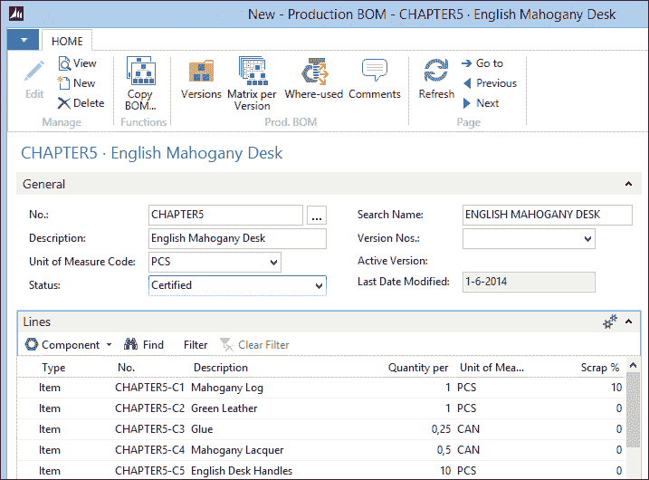

物料清单的组件以行保存，并支持使用废料。在运行 MRP 和计算单位成本时，会计算**废料百分比**。

### 路由

**路由设置**决定了生产一个项目所需的时间以及在该过程中使用哪些工作中心和机床中心。

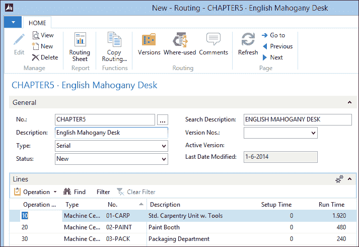

**路由设置**提供了高级功能，如并行和串联规划以及设置时间。在我们的例子中，我们将保持简单，仅使用**运行时间**。

### 测试和低级代码

我们现在几乎准备好开始测试我们的制造项目了。我们已经设置了项目和机床中心，计算了日历条目，并设置了路由。

处理过程的最后一步是计算低级代码。这个字段既存储在项目表中，也存储在生产 BOM 表中，它决定了项目在 BOM 排名中的位置。低级代码为零表示这是一个父项目，一或更高表示是一个子项目或子项目的子项目。

### 注意

低级代码的最大值可以是 50，但在现实中这将会非常难以操作，并且对系统性能不利。

### 小贴士

如果你收到一个错误，表明你已经超过了 50 级，请检查生产 BOM 以确保没有循环引用。可能存在一个父项目消耗一个消耗父项目的子项目。

低级代码可以自动或手动计算。对于自动计算，应激活**动态低级代码**功能。

由于在将其附加到项目之前，NAV（Navision）能够创建一个生产 BOM，因此动态低级代码并不总是准确的。在规划运行之前，运行**计算低级代码（代码单元 99000793）**是一个良好的实践。

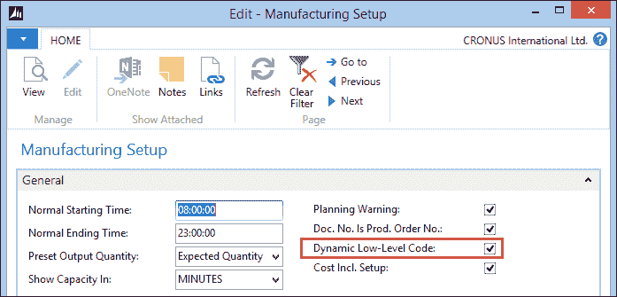

然而，激活**动态低级代码**可能会影响您系统的性能，因此对于大多数安装，最好定期使用**代码单元计算低级代码（99000853）**来计算它。

### 模拟、销售订单或库存

在 Microsoft Dynamics NAV 中，有三种创建生产订单的方法。最简单的方法是逐个手动输入。这甚至可以是一个模拟生产订单，以测试是否已按要求设置好一切。

手动订单录入非常耗时，且制造公司很少使用。他们大多数使用 MRP 程序来规划订单。当使用外部应用程序完成时，界面将创建生产订单。

Microsoft Dynamics NAV 中的 MRP 算法支持两种策略，即**按库存生产**和**按订单生产**。

#### **按库存生产**

**按库存生产**，也称为**按库存构建**，通常用于销售给贸易公司的高容量物品。当使用这种制造策略时，应使用重新订购策略。重新订购策略将在第六章中讨论，*贸易*。

#### **按订单生产**

**按订单生产**通常用于汽车等需求驱动的物品。将这些物品存入库存非常昂贵。制造过程是在物品售出后开始的。

然而，大多数使用**按订单生产**的公司已经预留了时间槽，以便可以安排这些物品，因此生产能力已经被预留，但物品尚未确定。

当使用**按订单生产**时，MRP 运行将为所有销售订单创建生产订单。在我们的例子中，我们将使用这种制造策略。

#### 销售订单

对于我们的例子，我们需要一个或多个英文办公桌的销售订单。

### 注意

在选择位置时要小心，因为这将是制造办公桌的位置。

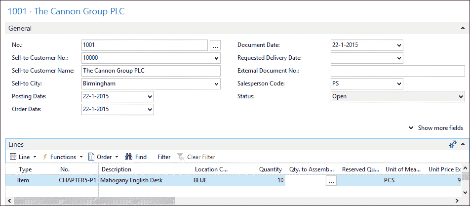

### 计算 MPS 和 MRP

Microsoft Dynamics NAV 中的计划运行会在需求或计划工作表中创建行。这种工作表结构在销售/采购/生产过程中非常重要。这个工作表可以为销售订单创建采购订单和生产订单。

#### 需求与计划与分包工作表

**需求工作表**可以显示不同的用户界面（页面），允许用户执行不同的任务。

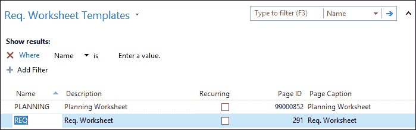

**需求工作表**没有像其他分录一样的一般后行程序。每种工作表类型都使用不同的过程。以下架构显示了需求过程是如何结合在一起的：

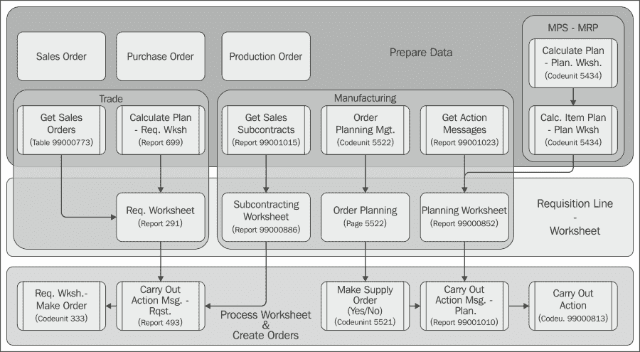

**贸易**部分将在第六章中讨论，*贸易*。在这一章中，我们将重点关注规划（MPS 和 MRP）过程和制造部分。

### 提示

需求工作表流程允许我们创建自己的流程来准备数据，使用自定义设置生成工作表行，甚至可以在新的 C/AL 对象中构建自己的规划算法来创建需求行。

### 库存配置文件偏移

Microsoft Dynamics NAV 中 MRP 计算的实际核心是代码单元库存配置文件偏移（99000854），它从我们的架构中的代码单元 Calc. Item Plan - Plan Wksh.（5431）中调用。

这个代码单元不容易理解，并且只有在仔细分析后才能由专业开发者更改。该过程在计算期间使用库存配置文件缓冲表来构建信息，并从函数 `CalculatePlanFromWorksheet` 开始：

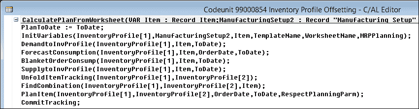

### 原子编码

在标准 Microsoft Dynamics NAV 应用程序中，此图像中的代码单元是原子编码（也称为工作流程编码）的完美示例。使用这种编程风格，您将代码分解为具有功能命名的函数，并在调用函数时省略任何编程。这使得您的代码更容易被他人阅读，并且维护成本更低。

让我们看看这个代码单元中的函数：

+   `InitVariables`: 此函数用于清除和初始化在此代码单元中使用的变量。

+   `DemandtoInvProfile`: 在这里，系统为可能需要物品的销售订单、服务订单和生产订单在库存配置表（Inventory Profile）中创建记录。

+   `ForecastConsumption`: 如果在制造设置中使用**使用位置预测**，则根据生产预测在库存配置表缓冲区中创建额外的需求行。

+   `BlanketOrderConsump`: 在计算期间内，对于具有**发货日期**和**未完成数量**的空白销售订单，将插入额外的需求。

+   `SupplytoInvProfile`: 当前库存、采购订单和生产订单被添加到**库存配置表**中作为可能的供应。

+   `UnfoldItemTracking`: 如果物品使用**物品跟踪**，此函数确保批号和序列号匹配。

    ### 注意

    在此函数中，Microsoft 开发者使用了一个技巧，即当临时表具有更多维度时，两个表中的值是相同的。这篇博客文章[`markbrummel.wordpress.com/2014/06/01/tip-27-using-temp-tables-in-arrays/`](https://markbrummel.wordpress.com/2014/06/01/tip-27-using-temp-tables-in-arrays/)解释了这是如何工作的。

+   `FindCombination`: 此函数为每个需要补充的 SKU 创建临时的**库存单位**记录。如果物品没有任何 SKU，系统将创建一个临时的 SKU 记录。

+   `PlanItem`: 这是根据**库存配置表**中的信息和设置创建实际需求行的位置。

+   `CommitTracking`: 此函数将存储在临时记录变量中的信息保存到数据库中的实际数据，用于预订条目和操作消息。

### 计划计算

让我们为我们的英文桌面运行**计划工作表**，看看我们会得到哪些计划行。

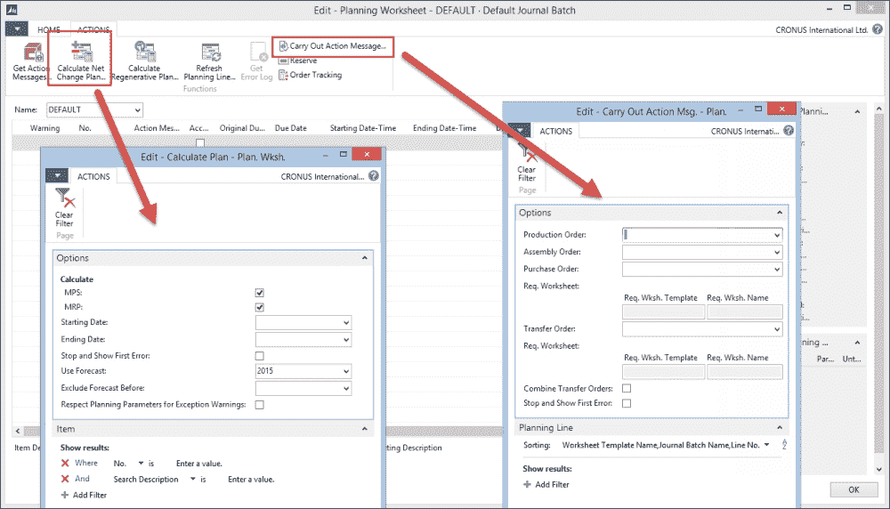

MPS 和 MRP 运行是从**计划工作表**开始的。我们需要输入开始日期和结束日期。在我们的示例中，使用 CRONUS 数据库，我们可以使用当前的工作日期。

当主生产计划（MPS）和物料需求计划（MRP）运行完成后，我们可以开始执行**执行操作消息**的过程以创建**生产订单**。

### 生产订单工作流程

生产订单现在已创建并准备好启动。第一个状态是**计划中**或**确定计划**。在计划状态期间，Microsoft Dynamics NAV 可以自动更改生产订单。

一旦生产订单发布，它就不能再自动更改。

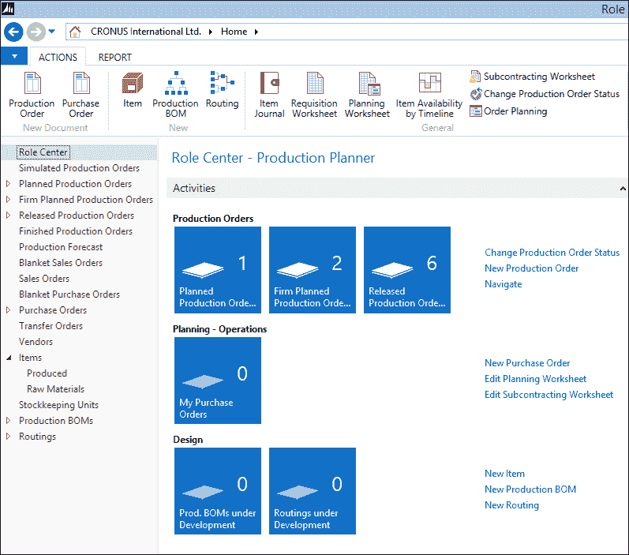

要发布生产订单，组件必须可用。在我们的测试场景中，这还不成立，因为我们创建了新的项目，这些项目尚未购买。

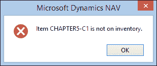

让我们看看我们如何做到这一点。

### 采购订单

要创建采购订单，我们将使用**订单计划**工作表来展示另一种规划方法。这将为我们刚刚发布的生产订单创建需求行。

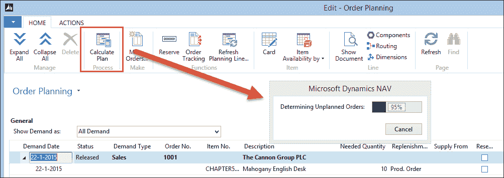

一旦创建了需求行，我们需要在**供应来源**字段中指定一个供应商编号，然后开始**创建订单**过程以生成**采购订单**。

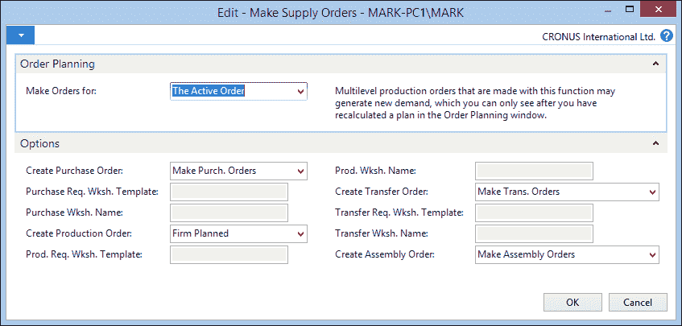

**采购订单**可以被接收。这允许我们发布**生产订单**。

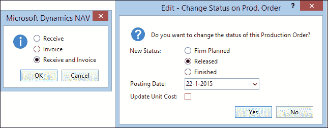

### 完成生产

当生产订单完成时，最终产品应该存放在库存中，组件应该被消耗。这个过程被称为冲销。

这是通过使用**消耗日记**和**产出日记**来完成的，可以自动和手动进行。

### 注意

消耗和产出日记的替代方案是生产日记，它将功能合并到一个日记中。

当项目卡片中的冲销方法设置为“向前”，“向后”或“拣选+向前”，“拣选+向后”时，消耗日记会自动过账。

当使用“向前”时，消耗日记在生产订单发布时过账，“向后”将在生产订单设置为完成时过账。“拣选+向前”和“拣选+向后”可以与**仓库管理位置**结合使用。

## 专业生产

我们在第章开头讨论的最后一种生产方法是专业生产。

这些是在小批量生产或每次投入生产时规格差异很大的项目。对于这些公司来说，每次项目更改时创建物料清单的工作量太大，与它们获得的额外信息相比。

### 作业

尽管如此，这些公司仍然希望注册他们的生产订单并清楚地了解他们的库存。大多数进行此类生产的公司都在使用 Microsoft Dynamics NAV 的作业功能。

我们将在第八章中讨论这个问题，*咨询*，我们将以不同组件组成的定制计算机系统为例。

# 垂直行业实施

Microsoft Dynamics NAV 被用于许多不同的垂直行业。垂直行业通常需要特定的功能。而不是试图在标准产品中实现所有这些功能，Microsoft Dynamics NAV 支持框架并允许开发人员设计和创建垂直功能。

对于这些功能，80/20 规则适用；微软提供 80%的框架，这需要我们 20%的时间来实现。缺失的 20%的功能开发需要 80%的预算时间。

在本章中，我们将讨论微软 Dynamics NAV 在五个不同垂直行业中的生产应用。对于每个行业，我们将讨论两个特定的垂直功能以及它们如何被解决。

### 备注

大多数行业都有由认证的微软 Dynamics NAV 合作伙伴设计的、在多个地点实施的有力附加解决方案。强烈建议查看这些附加解决方案，而不是重新发明轮子，重写已经存在的附加组件。

## 时尚

时尚行业的一般挑战是尺码和颜色。每个商品可以从 XXS 到 XXXL 生产并销售，从粉色到橙色再到绿色，同时保持商品不变。

这需要创造性地使用变体，这些变体在市场上的可用垂直解决方案中被大量使用。

### 材料清单

要使用具有变体的制造，材料清单结构应该改变，因为这是默认在项目级别存在的。然而，每个尺码使用不同数量的布料，而不同颜色的布料通常在原材料中以另一个项目编号表示。

解决这个问题的方法可能是在**项目级别**将材料清单移动到**库存单位级别**。一个 SKU 支持成本和库存的变体。

### 发货工作表

时尚公司为一系列产品生产商品。客户有预留一系列产品的可能性，以便生产经理确定生产数量。基于这些数字和额外的安全库存，生产订单被创建。一旦生产订单完成，公司需要决定谁将获得第一批商品。这可以最好地描述为一种反向的按订单生产机制。

为了在微软 Dynamics NAV 中实现这一点，我们可以创建一个工作表，为每个生产订单和销售订单的组合创建行。对于将要发货的每个销售订单，我们可以从**发货工作表**中创建一个**仓库拣选**和**发货**。

我们将在第六章*贸易*中讨论库存单位、仓库拣选和发货。

## 汽车

在汽车行业，微软 Dynamics NAV 主要被汽车制造供应商使用，这些公司使用原材料制造预制件。

### 工具和折旧

在这些公司中，**生产件批准流程**（PPAP）以及工具折旧同样非常重要，因为生产过程开始之前在工具上的初始投资很高。

为了支持这一点，需要为工具和 BOM 流程开发额外的功能。例如，路由工具表（表 99000802）可以连接到固定资产（表 5600）。

### 项目跟踪

当汽车的一个部件出现问题，能够看到其他汽车上由同一工厂和工具使用相同基础材料制造的相同部件是很重要的。

在 Microsoft Dynamics NAV 中，可以使用单个批号用于组件或最终产品，并追溯其来源。无法简单地移动组件的批号到最终产品，或从组件的批号复制信息，如容器号或质量代码到最终产品。

为了支持这一点，我们需要改变项目跟踪流程。一个很好的开始地方是项目日记，其中预订条目被移动到项目账簿条目。

## 药品

当由制造药品的公司使用时，正确使用批号的到期日期非常重要。

### 批号和到期日期

在 Microsoft Dynamics NAV 中，到期日期在**项目账簿条目**和**仓库条目**中定义。

无法为批次定义一个单一的到期日期。这可以通过将此字段添加到批号信息表（6505）中来实现。此表允许公司预先定义在生产过程中使用的批号。

默认情况下，到期日期是根据文档日期乘以项目表中的**到期计算**字段（27）来计算的。

可以使用批号信息表来保存关于特定生产批次的额外信息。

### 质量控制

质量控制在大多数生产过程中都很重要，但在处理药品时可能更为重要。通常，批次的一小部分被用于质量控制。

在 Microsoft Dynamics NAV 中，我们可以在生产订单评级质量度量表（5413）中定义质量度量。然而，这些值仅作为生产订单的信息保存。

为了增强质量控制，我们可以在生产订单中创建一个质量检查文档，从而添加一个文档结构。这些信息应保存在批号信息表中。

当批次没有达到所需的质量时，应启动一个工作流程。此工作流程将引导用户通过一个可以做出决策的过程。有时，质量可以改善，项目仍然可以使用。有时，项目编号甚至取决于产品的质量。

质量控制位于消耗日记和输出日记之间。在最终质量检查期间，使用 BOM 项目，但最终项目尚未可用。

## 食品

在食品行业，一切关乎到期日期和新鲜产品。库存永远不会很高，流通率非常高。

### 零库存

因此，新鲜食品公司应该在到期日期即将关闭或已过期后，能够将某些批号的库存清零。

这通常可以通过实物库存日记来完成。使用批号手动进行这项工作对于每天都要做这项工作的人来说可能是一项相当繁重的工作，因此对于这个垂直解决方案，我们可以创建一个功能来完成这项工作。此功能将创建一个带有激活的物理库存字段（83）的项目日记行，并创建预订条目以跟踪并自动过账。

### 订单调度

新鲜食品公司使用每天的生产流程，这些流程从预定时间开始。每天，工厂开始生产过程，但生产数量可以根据订单而有所不同。

这可以通过按订单制造政策来完成，但我们需要确保在计算过程开始时不会有新的销售订单。

这可以通过创建一个订单调度策略来实现。可以为每个项目创建新的销售行，直到某个时间。当时间过去后，销售人员将收到错误信息。这允许生产计划员每天在固定时间开始计算过程，并知道销售订单数量是可以信赖的。

## 家具

家具行业是一个庞大且历史悠久的行业，它存在于工业革命和计算机引入之前。

我们可以将家具行业大致分为两部分。第一部分已经将生产标准化，使用尺寸和颜色矩阵，这可以与时尚行业相比较。当购买一张桌子或厨房时，客户可以从不同的尺寸和颜色中进行选择。根据选择数量的多少，产品要么是备货生产（IKEA），要么是按订单生产。

第二部分是仍然生产定制项目的家具制造商。在这些制造商处，一张桌子或厨房可以有任何尺寸或颜色。对于这些公司来说，为每个定制项目创建物料清单几乎是不可能的，因此他们使用预定义的计算和项目类别。

在本书的示例中，我们将讨论第二类。

### 计算

为定制家具的公司提供计算材料和资源使用量的可能性，无论是在项目类别层面还是在实际项目层面。为此，我们可以创建一个包含这些数据和发布模型的计算模块。

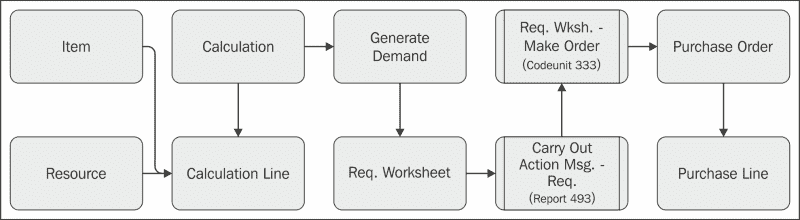

该计算模块的基本结构在第八章《咨询》中进行了解释，我们将此功能整合到了微软 Dynamics NAV 的工作功能中。

### 库存

我们的家具公司使用了一种结合了独特的产品特定项目和大多数产品中使用的库存项目的组合。

这些项目将组合成最终产品，并在产品完成时应被消耗。例如，当计算模块与工作集成时，当工作完成时就可以刷新组件。这种功能可以与生产订单完成后发布消耗日记账的功能相比较。

可以使用实物库存日记账和库存盘点来每周更新库存项目。这使得我们能够使用将在第六章“贸易”中讨论的请购单工作表和重新订购策略。

# 摘要

在本章中，我们讨论了如何在 Microsoft Dynamics NAV 产品中实施三种生产方法。我们介绍了项目跟踪和项目成本的概念。我们通过不同的请购单工作表对制造过程进行了巡览，并讨论了 MRP 的解决方案。

最后，我们探讨了如何为不同的垂直行业实施生产。在下一章中，我们将更深入地了解 Microsoft Dynamics NAV 中的贸易流程。
