# 第六章 贸易

在上一章中，我们讨论了如何使用 Microsoft Dynamics NAV 通过标准应用程序以及定制解决方案来帮助我们简化生产流程。我们讨论了五个垂直行业以及如何为它们适配应用程序。

在本章中，我们将讨论如何使用销售和采购文档以及如何与内置的仓库管理和预留流程集成来为这些公司使用 Microsoft Dynamics NAV。

本章的重点是介绍应用程序的设计方式，以及如何更改或增强设计。了解如何在 Microsoft Dynamics NAV 中创建和处理销售和采购文档的基本知识是先决条件。

我们将使用与上一章中讨论的相同垂直行业（汽车、时尚、药品、食品和家具）的例子。阅读完本章后，您将很好地理解如何在贸易公司中实施 Microsoft Dynamics NAV。

# 流程

一家贸易公司购买和销售商品而不对其进行更改。主要活动包括采购、储存、包装、销售和运输，如下面的截图所示：

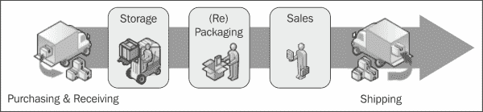

在这些公司中，管理库存非常重要。拥有库存对于按时交付和不必对客户说“不”至关重要。

## 批发与零售

传统上，贸易公司分为批发公司和零售公司。批发公司向企业销售，而零售公司向消费者销售。Microsoft Dynamics NAV 支持两者，在设计（表和记账结构）方面，没有太大的区别。

对于应用程序来说，批发和零售之间最大的区别是交易量。虽然批发公司的总营业额可能比零售商高得多，但零售商通常有更多、更小的交易。从应用程序设计角度来看，保持解决方案的性能可能是一个挑战。

高量交易系统中的另一个问题是数据的可追溯性。每当出现问题，了解问题开始的地方以及有多少数据受到影响非常重要。在低交易系统中，手动查找这一点更容易。

# 销售和采购

传统上，销售人员使用纸质订单表。他们会写下客户名称和地址以及所需的项目或服务。

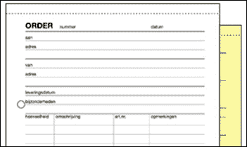

纸质订单表

在 Microsoft Dynamics NAV 中，纸质文件被销售和采购文件所取代，使用标题来记录一般订单信息，使用行来登记项目和服务的详细信息。

记账过程将文档中的信息分解为日记账并予以记账，因此最终用户无需担心这一点。应用程序重复使用我们在前面章节中讨论过的相同记账程序。

让我们通过绘制这个表格和事务方案来了解文档和日记是如何联系在一起的：

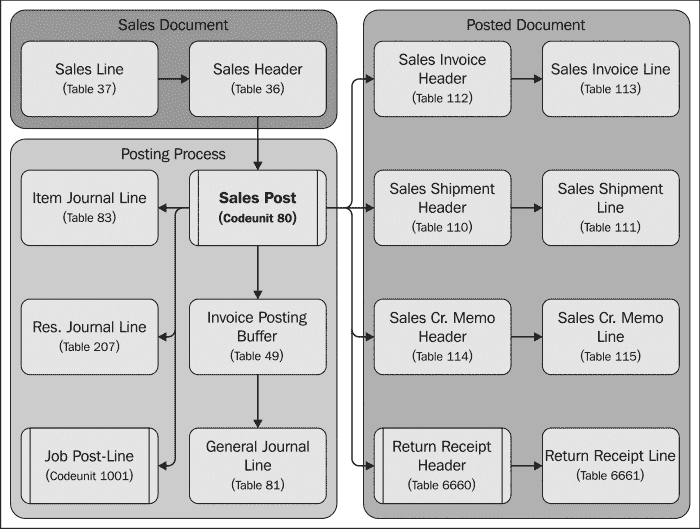

第一步是创建文档。当我们创建这个**销售文档**（**销售抬头**和**销售行**）时，没有任何事物被过账。我们只是在系统中输入可以随时更改的信息。

当我们启动**代码单元 Sales-Post（80）**时，系统将为我们创建所有日记并过账。当我们销售一个项目时，系统将创建一个**项目日记行**，当我们销售一个资源时，系统创建一个**资源日记行**，依此类推。

**发票过账缓冲区**用于在**总账分录行**中创建条目。我们已经在第三章 *财务管理* 中讨论了这一功能。

Microsoft Dynamics NAV 允许我们创建四种不同类型的已过账销售文档：发票、发货、贷项通知和退货收据。我们将在本章后面讨论所有这些类型。

## 事务镜像

Microsoft Dynamics NAV 中销售和采购的独特概念是事务结构的镜像。一旦我们了解了销售交易是如何相互关联的，理解采购的结构就会变得容易。

让我们通过比较**表 37 销售行**和**表 39 采购行**中的第一个字段来演示这一点，如下面的截图所示：

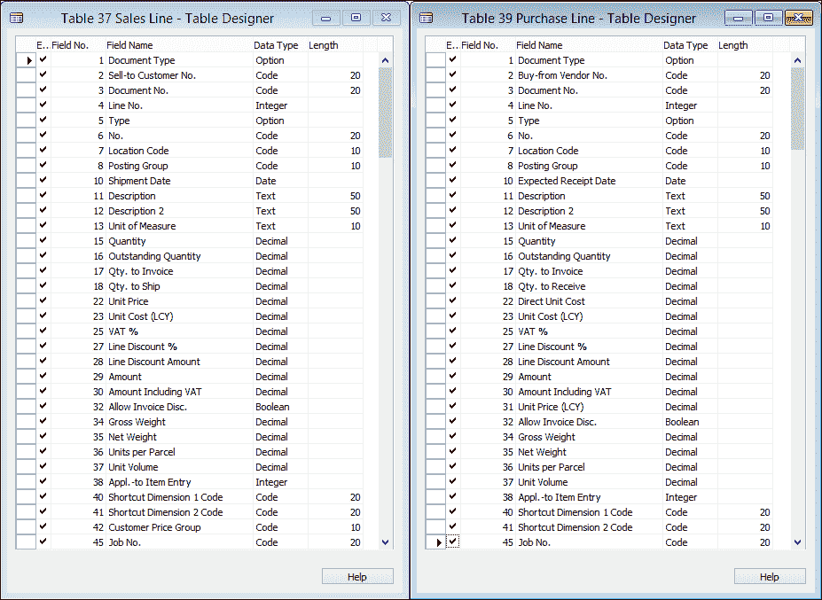

尽管这两个表使用不同的术语，但它们的字段编号相同，服务于相同的过程，例如，字段 18，**要发货数量**（销售）和**要接收数量**（采购）。

一些字段是不同的，因为它们在两个流程中都没有意义，例如，采购中的**单价（本位币）**（字段 31）和销售中的**客户价格组**（字段 42）。

采购流程也使用相同的过账方法。采购抬头（38）和采购行（39）表在采购收货、发票、贷项通知和退货单据中使用代码单元 Purch.-Post（90）进行过账。

让我们更详细地看看销售流程。

## 销售

销售流程支持六种文档类型，这些类型被归入两个表中，即销售抬头（36）和销售行（37）。

每个流程都可以有自己的编号序列，并且拥有一个特殊的卡片和列表页面，但它们都共享相同的企业逻辑。让我们讨论一下文档类型：

+   **报价**：当客户想要了解购买条款和条件时，我们可以制作报价单。这将显示所有计算，例如定价和增值税。

+   **框架订单**：这是一种预订单状态。当使用时，我们与客户达成协议，但不知道确切的发货日期。

+   **订单**：这是实际订单文档的用途。

+   **发票**：这可以有两种用法；直接使用，如果没有销售订单，如果公司只在总账科目上直接开票，或者我们可以使用发票来开票一个或多个装运。

+   **贷项通知单**：当我们对总账科目进行贷记时，可以使用贷项通知单。

+   **退货订单**：如果客户退货，我们可以使用退货订单来逆转库存流程。

### 订单

主要流程是订单。其他文档类型是为了支持这一流程而设计的。销售订单可以直接创建，也可以通过报价或总订单创建。报价和总订单之间有两个区别：

+   报价只能完全转移到销售订单中，不能分批。例如，100 件的总订单可以分成 10 次发货，每次 10 件，不同的发货日期。

+   拥有报价的客户有说“是”或“否”的可能性。当答案是“否”时，将不会有交易。因此，正如我们在上一章中讨论的那样，报价不用于供需计算。总订单是一个真实订单。客户最终应该购买之前同意的完整数量。因此，总订单用于供需计算。

### 报价到订单和总订单到订单

虽然报价和总订单存储在同一个表中，但记录实际上是物理删除并使用另一种文档类型插入的。这是在代码单元销售报价到订单（86）和总销售订单到订单（87）中完成的。

当在比较工具（如 Beyond Compare 或 Araxis）中比较这些代码单元时，我们可以看到它们有很多相似之处。它们都创建一个新的销售订单。

#### 报价到订单

当将报价移动到订单时，完整的报价会被复制然后删除。报价可以从 CRM 中的机会创建，正如我们在第四章“关系管理”中讨论的那样。因此，当这种情况发生时，机会会被更新。

#### 总订单到订单

总订单可以分批移动。因此，业务逻辑被实现来计算剩余数量。总订单与 CRM 之间没有链接，也无法从报价中创建总订单。

## 创建新的销售订单

为了理解本章的示例，我们将讨论销售订单最重要的字段。销售文档包含一个表头和多个行。

虽然销售表头表包含更多静态信息登记，但销售行有更多真实业务逻辑，例如价格计算、库存可用性和增值税。我们将讨论这种业务逻辑是如何规范化的。

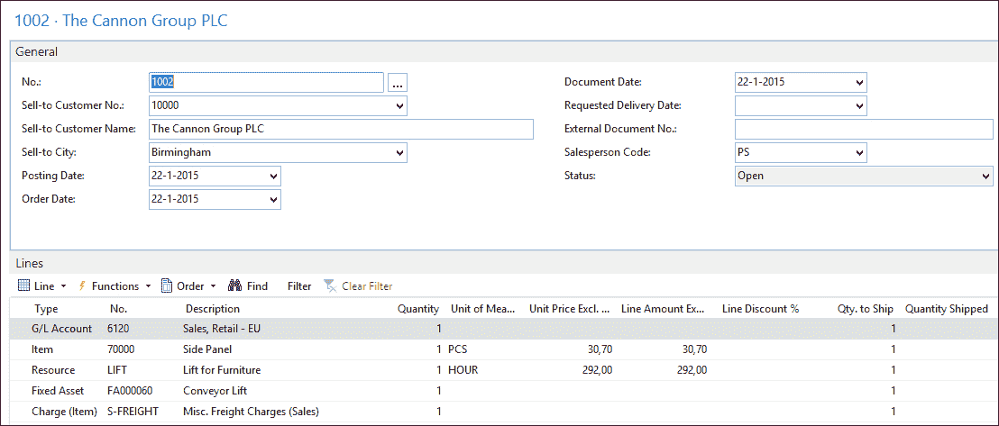

### 销售表头

所有文档类型都有唯一的编号。销售表头表的主键字段是**文档类型**和**编号**。

### 小贴士

使用对最终用户有意义的数字序列代码非常有用，例如，2013 年的销售订单 12 为 SO13-0012，2014 年的销售报价 312 为 SQ14-0312。

销售单据包含以下两个不同的客户编号字段：

+   **销售客户编号**：这是主要客户编号字段，它定义了请求创建订单的客户。此客户编号用于计算折扣。

+   **账单客户编号**：默认情况下，**销售客户编号**也将收到发票。通过将此字段更改为另一个客户，这将使包含其他客户详细信息的发票打印出来。

销售单据包含一些用于不同目的的日期：

+   **过账日期**：此日期用于过账到各种分类账

+   **文档日期**：此日期用于应收账款

+   **发货日期**：此日期用于计算或库存可用性

+   **到期日期**：这是账单客户预期支付发票的最后日期

### 销售行

每个销售单据可以包含几乎无限数量的销售行。默认情况下，销售行编号为 10000、20000、30000，依此类推。

编号使用销售行页面上的`AutoSplitKey`属性进行，增量不能更改。当用户在两个现有行之间插入新记录时，程序将计算新的编号，使其正好位于旧值之间，例如，10000、15000、17500、18750、19375、19687、19843、19921、19960、19980、19990、19995、19997、19998、19999 和 20000。如果没有更多空间，系统将生成一个运行时错误消息，如下面的截图所示：

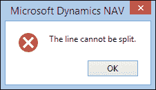

#### 主数据选项

销售行可以包含对由**类型**字段定义的六种主数据类型的引用。这些类型是：**文本**（空白选项）、**总账科目**、**项目**、**资源**、**固定资产**和**费用**（项目）。

我们在这里指定的类型决定了在过账此销售单据时将使用哪个日记账。然而，每行都可以包含财务信息，这些信息将通过过账缓冲表处理到总账。

在下一章中，我们将讨论如何向此过程添加新类型。

### 销售行字段

要创建新的销售行并启动 Microsoft Dynamics NAV 中的重要业务逻辑，我们需要了解以下字段：

+   **类型**：这定义了销售行使用的和最终在过账期间使用的日记账

    ### 注意

    在创建销售行后，如果**类型**字段发生变化，则记录将被清除，字段将获取其默认值。

+   **编号**：这是对所使用的主数据类型唯一编号的实际引用

    ### 注意

    当**编号**字段更改时，将使用之前的数量使用新主数据重新创建销售行。

+   **数量**：用于计算发票的销售额以及物品的情况，以及库存变化的实际数量

+   **未清数量**、**待发票数量**和**待发货数量**：这些字段设计用于部分发货和发票订单

+   **单价**和**单位成本（本位币）**：这些字段用于计算销售额和利润

+   **行折扣百分比**和**行折扣金额**：这些字段用于确定折扣

### 验证流程

在更改表之前，理解销售行表中的特定验证流程函数非常重要。此流程基于最终用户创建销售行的正常方式。

要创建销售行，只需填充四个字段，行就准备好使用。在设置类型并选择编号后，最终用户在**数量**字段中输入，如果需要，还可以在**单价**字段中输入。

让我们分析`OnValidate`触发器中的 C/AL 代码，这些字段可以计算销售行。

### 注意

当更改这些 C/AL 程序时，请确保使用我们在第一章中讨论的*测试附近*、*测试远程*、*执行*和*清理*方法，*Microsoft Dynamics NAV 简介*。

#### 编号 | 字段 6

`OnValidate`触发器中的 C/AL 代码首先进行初始测试，以确定更改是否允许。之后，记录被清除，并应用**编号**字段和**数量**字段的旧值，如下所示：

```cs
TempSalesLine := Rec;
INIT;
Type := TempSalesLine.Type;
"No." := TempSalesLine."No.";
IF "No." = '' THEN
  EXIT;
IF Type <> Type::" " THEN
  Quantity := TempSalesLine.Quantity;
```

然后，如果需要，销售行从销售头继承值，并计算日期字段，如下所示：

```cs
"Sell-to Customer No." := SalesHeader."Sell-to Customer No.";
"Currency Code" := SalesHeader."Currency Code";
...

"Promised Delivery Date" := SalesHeader."Promised Delivery Date";
...

UpdateDates;
```

### 小贴士

当最终用户为**编号**字段选择值时，销售行中不存在销售头信息。我们不能使用客户信息进行表关系。

当完成这项操作后，我们会看到一个`CASE`语句，其中获取了主数据。这将是我们将新添加的字段从主数据移动到销售行表的地方。

```cs
CASE Type OF
  Type::" ":
      ...
  Type::"G/L Account":
      ...
  Type::Item:
      ...
 Type::Resource:
      ...
  Type::"Fixed Asset":
      ...
  Type::"Charge (Item)":
      ...
END;
```

当完成这项操作后，将计算数量和单价。

```cs
IF Type <> Type::" " THEN BEGIN
  IF Type <> Type::"Fixed Asset" THEN
    VALIDATE("VAT Prod. Posting Group");
  VALIDATE("Unit of Measure Code");
  IF Quantity <> 0 THEN BEGIN
    InitOutstanding;
    IF "Document Type" IN ["Document Type"::"Return Order","Document Type"::"Credit Memo"] THEN
      InitQtyToReceive
    ELSE
      InitQtyToShip;
    UpdateWithWarehouseShip;
  END;
 UpdateUnitPrice(FIELDNO("No."));
END;
```

后者是分析中非常重要的。在此函数之后，将执行其他代码，但这对于本例来说并不重要。

#### 数量 | 字段 15

就像**编号**字段一样，**数量**字段首先检查更改是否允许。当完成这项操作后，以下 C/AL 代码部分很重要：

```cs
IF Type = Type::Item THEN BEGIN
 UpdateUnitPrice(FIELDNO(Quantity));
  ...
  CheckApplFromItemLedgEntry(ItemLedgEntry);
END ELSE
  VALIDATE("Line Discount %");
```

在前面的 C/AL 代码中，我们应再次注意`UpdateUnitPrice`函数以及`行折扣百分比`字段的验证。

#### 单价 | 字段 22

此字段有很少的 C/AL 代码。当手动更改单价时，C/AL 代码将触发`行折扣百分比`字段：

```cs
TestStatusOpen;
VALIDATE("Line Discount %");

```

在进入此字段之前，让我们首先看看我们在**数量**和**编号**字段中注意到的`UpdateUnitPrice`函数。

#### UpdateUnitPrice

`UpdateUnitPrice`函数执行以下 C/AL 代码：

```cs
IF (CalledByFieldNo <> CurrFieldNo) AND (CurrFieldNo <> 0) THEN
  EXIT;

GetSalesHeader;
TESTFIELD("Qty. per Unit of Measure");

CASE Type OF
  Type::Item,Type::Resource:
    BEGIN
      PriceCalcMgt.FindSalesLineLineDisc(SalesHeader,Rec);
      PriceCalcMgt.FindSalesLinePrice(SalesHeader,Rec,
        CalledByFieldNo);
    END;
END;
VALIDATE("Unit Price");

```

在进行检查后，我们在第二章“一个示例应用”中讨论的销售价格计算例程被执行。这是销售价格计算管理代码单元 7000。

当这样做之后，它验证了我们已经分析过的单价字段。这引导我们到一个单独的点；行折扣百分比的`OnValidate`触发器。

#### 行折扣百分比 | 字段 27

在此`OnValidate`触发器中的 C/AL 代码首先根据单价计算行折扣金额，然后开始执行`UpdateAmounts`函数，如下所示：

```cs
TestJobPlanningLine;
TestStatusOpen;
"Line Discount Amount" :=
  ROUND(
    ROUND(Quantity * "Unit Price",Currency."Amount Rounding Precision") *
    "Line Discount %" / 100,Currency."Amount Rounding Precision");
"Inv. Discount Amount" := 0;
"Inv. Disc. Amount to Invoice" := 0;
UpdateAmounts;

```

#### UpdateAmounts

`UpdateAmounts`函数完成了销售行的创建，这也是我们的探索结束的地方。

在此函数中执行的两个最重要的其他功能是用于增值税计算的`UpdateVATAmounts`和用于客户信用额度的`CustCheckCreditLimit.SalesLineCheck(Rec)`的信用额度检查。

### 增值税计算

Microsoft Dynamics NAV 中的增值税计算没有在一个应用程序区域中规范化，而是在每个地方重新开发。这使得增值税计算成为更改最复杂的应用程序区域之一。

#### 代码克隆

增值税计算不仅发生在销售行、采购行和总账行表中，还发生在更具体的函数表中，如服务行。这是通过复制整个 C/AL 代码来完成的。

这种现象在计算机科学中被称为代码克隆。尽管代码克隆简化了应用程序设计，但它被认为是不良实践，应始终避免。在这种情况下，如果增值税在通用引擎中进行计算会更好。

因此，强烈建议不要更改 Microsoft Dynamics NAV 中的增值税计算。

### 小贴士

如果在定制解决方案中需要增值税计算，可以使用总账行作为临时表来完成。通过填写必要的字段并开始计算，我们可以使用结果，而无需将增值税计算复制到我们自己的解决方案中。

## 开票

在 Microsoft Dynamics NAV 中，销售订单可以直接从文档中发货和开票。

然而，并非所有公司都有合并的发货和开票流程。一些公司先发货，然后发送发票，大多数情况下使用合并开票。

### 预付款

除了将开票时刻与发货时刻分开外，Microsoft Dynamics NAV 还允许预付款流程。这个预付款流程旨在在正常开票流程之上工作。这意味着它不会替换发票，而是创建一个额外的发票。

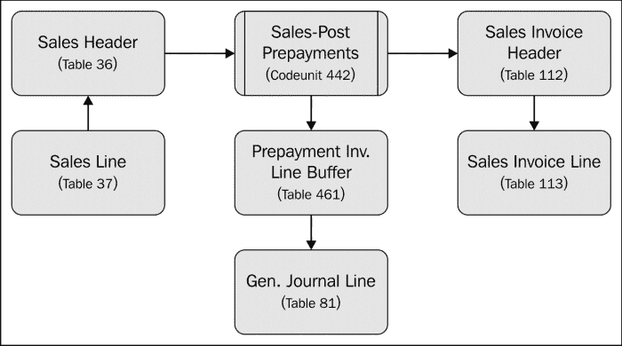

这张发票不是在代码单元销售过账（80）中创建的，而是在销售过账预付款（461）中创建的。

### 注意

在 Microsoft Dynamics NAV 中使用预付款将始终为每个销售订单生成至少两张发票。

当订单最终开票时，预付款发票会从发票金额中扣除。

### 小贴士

微软设计的此解决方案教会我们并展示了，为了生成已过账的销售发票，并不特别需要从代码单元销售-过账 80 开始。

### 合并开票

货物合并开票可以手动完成或使用批量报告。

#### 手动

要在销售发票上手动合并运输，我们可以使用**销售-获取运输代码单元（64）**。

此代码单元可以从销售发票子页（47）上的操作启动，并显示尚未完全开票的销售运输行。

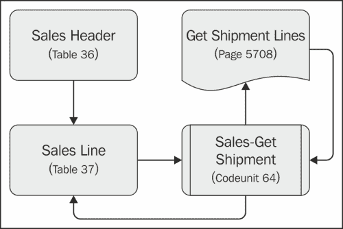

然而，C/AL 代码并不完全在代码单元内；过程从代码单元开始，并运行页面。然后页面再次在代码单元中启动一个功能。

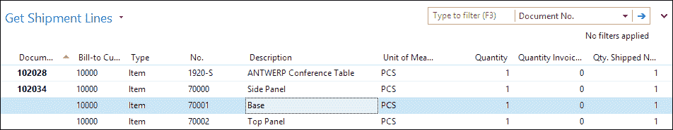

#### 批量

合并运输报告（295）可以用于批量创建多个运输的单一发票。它的工作方式与我们创建的合并发票报告类似，见第二章，*一个示例应用*。

创建发票销售行的 C/AL 代码已标准化，并在代码单元销售-获取运输（64）和合并运输报告（295）中均使用。该功能位于销售运输行表（111）中，并命名为`InsertInvLineFromShptLine`。

### 注意

要启用合并运输，客户表中的布尔字段合并运输（87）应设置为**是**。此值将继承到销售订单文档的销售表头中。

### 信用 memo 和退货订单

信用 memo 和退货订单文档类型用于撤销订单流程。

## 采购

在我们能够发货我们销售的商品之前，我们首先需要购买或生产它们。我们在上一章中讨论了生产过程，所以让我们专注于采购过程。

技术上，销售和采购流程是镜像交易，应用程序设计类似。采购表头具有相同的文档类型：报价、订单、发票、信用 memo、总订单和退货订单，以及相同的过账过程。

因此，我们不会讨论相似之处，而是讨论不同之处。

### 资源

在 Microsoft Dynamics NAV 中，无法购买资源。当我们仔细查看**类型**字段（5）时，我们可以看到选项留空：

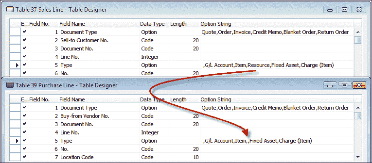

### 降价运输

当销售不在库存中的商品时，可以从供应商处购买商品并将它们直接运送给客户。这个过程称为降价运输。

此过程可以手动处理，并使用需求工作表。

#### 手动

要手动创建降价运输，应首先使用从相应销售订单的**销售至客户编号**作为运输地址创建采购订单：

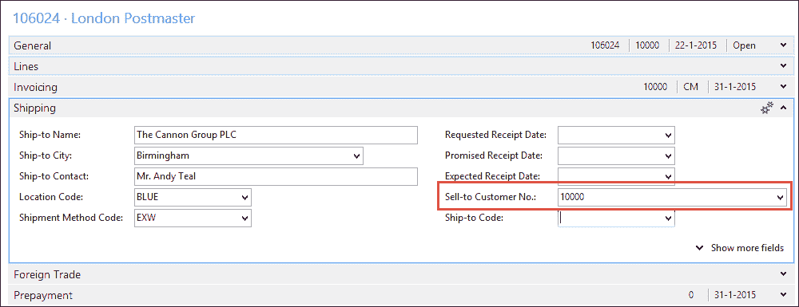

当这样做后，我们可以从采购订单上的**操作**中的代码单元 Purch.-Get Drop Shpt. (76) 开始。此功能将显示所有针对此**销售客户编号**的销售订单列表，无论是否可以进行直送。

如果我们选择一个没有标记为直送的销售行的销售订单，我们会得到以下错误消息：

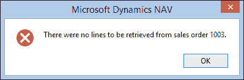

在检索销售信息后，销售行和采购行表通过填充**采购订单编号**、**采购订单行编号**、**销售订单编号**和**销售订单行编号**字段相互连接。

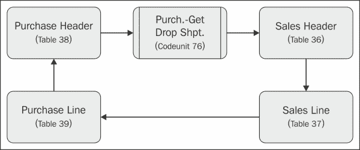

这些字段在销售行和采购行表中编号为 71 和 72。

#### 需求工作表

在我们讨论计划过程时，我们在上一章介绍了需求工作表。需求工作表也可以用于**直送**功能：

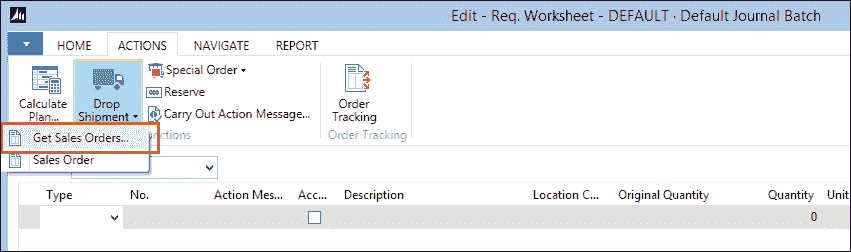

这将启动获取销售订单报告（698），它将过滤所有标记为直送的销售行，并在需求工作表表中创建一行。

这行可以通过执行操作消息来处理。此功能还将通过字段 71 和 72 将销售订单连接到采购订单。

### 注意

手动直送和使用需求工作表的自定义 AL 代码没有规范化（代码克隆）。这意味着在一个方法中做的更改也应该在另一个方法中执行，并且需要维护两次。

## 文档发布和批准流程

在销售和采购文档流程中，有一个用于发布和批准文档的工作流程。这由一个状态字段和两个流程来处理。

### 状态

销售表头和采购表头中的**状态**字段（120）表示流程的状态。有四个选项：**开放**、**发布**、**待批准**和**待预付款**。

这两个状态字段，**开放**和**发布**，是必须使用的。**待批准**和**待预付款**是可选的。

我们在本章前面已经讨论了预付款。

### 发布文档

在可以过账之前，必须发布文档。这是通过代码单元发布销售文档（414）和发布采购文档（415）来完成的。如您所猜，这些代码单元几乎完全相同。

在将状态设置为**发布**之前，代码单元执行了多项测试。让我们讨论一些这些检查：

+   测试近似的典型例子，客户编号不应为空：

    ```cs
    TESTFIELD("Sell-to Customer No.");
    ```

+   至少应该有一条销售行带有“数量”：

    ```cs
    SalesLine.SETRANGE("Document Type","Document Type");
    SalesLine.SETRANGE("Document No.","No.");
    SalesLine.SETFILTER(Type,'>0');
    SalesLine.SETFILTER(Quantity,'<>0');
    IF NOT SalesLine.FIND('-') THEN
      ERROR(Text001,"Document Type","No.");
    ```

+   测试完成后，实施一些最终计算。这些计算是跨越各个销售行的文档计算：

    ```cs
    SalesSetup.GET;
    IF SalesSetup."Calc. Inv. Discount" THEN BEGIN
      CODEUNIT.RUN(CODEUNIT::"Sales-Calc. Discount",SalesLine);
      GET("Document Type","No.");
    END;
    ```

+   以下代码单元计算发票折扣：

    ```cs
    SalesLine.SetSalesHeader(Rec);
    SalesLine.CalcVATAmountLines(0,Rec,SalesLine,TempVATAmountLine0);
    SalesLine.CalcVATAmountLines(1,Rec,SalesLine,TempVATAmountLine1);
    SalesLine.UpdateVATOnLines(0,Rec,SalesLine,TempVATAmountLine0);
    SalesLine.UpdateVATOnLines(1,Rec,SalesLine,TempVATAmountLine1);
    ```

+   在发布流程结束时，完成增值税计算。

+   发布文档也会计算销售行上的**金额**和**含税金额**字段。

### 手动与自动发布

默认情况下，Microsoft Dynamics NAV 会自动发布文档。发布代码单元销售-post（80）和采购-post（90）包含以下 C/AL 代码：

```cs
IF (Status = Status::Open) OR (Status = Status::"Pending Prepayment") THEN BEGIN
  TempInvoice := Invoice;
  TempShpt := Ship;
  TempReturn := Receive;
  GetOpenLinkedATOs(TempAsmHeader);
  CODEUNIT.RUN(CODEUNIT::"Release Sales Document",SalesHeader);
  TESTFIELD(Status,Status::Released);
  Status := Status::Open;
  Invoice := TempInvoice;
  Ship := TempShpt;
  Receive := TempReturn;
  ReopenAsmOrders(TempAsmHeader);  
  MODIFY;
  COMMIT;
  Status := Status::Released;
END;
```

此代码通过启动发布代码单元临时发布文档，然后将状态设置回**Open**，修改记录并提交事务。然后，状态被设置为**已发布**。

无论之后出现任何错误，状态仍然将是**Open**，因为那是`COMMIT`之前的状态。

### 文档审批

在发布过程之上是一个文档审批工作流。这个功能是为在我们已经讨论的功能之上运行的，是可选的。

## 删除销售和采购文档

在我们应用程序的生命周期中，将创建许多文档。可能会有这样一天，当这些文档超过需要维护的点时。

### 数据删除

在**部门角色中心**的**IT 管理**部分，我们可以找到一个**数据删除**部分，它是为 IT 管理员清理数据而设计的，如下面的截图所示：

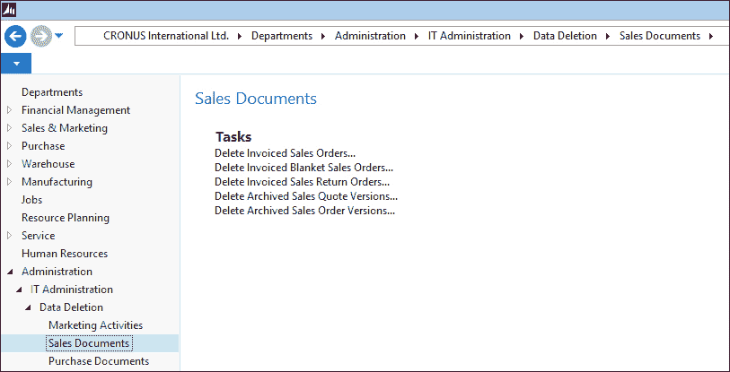

当使用**获取发货行**或**合并开票**对销售订单进行开票时，销售订单不会被自动删除，也不会完全处理批量订单。

在数据库中保留旧订单可能会导致大表。由于这些文档表在整天的许多人的操作中频繁插入和修改，这可能会导致数据库中不必要的开销。

### 删除发货和发票

Microsoft Dynamics NAV 允许用户在打印时删除已发布的发货和发票。

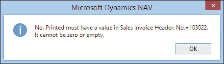

虽然应该仔细考虑，但对于某些公司来说，定期清理这些数据可能是必要的。大多数公司在将项目交付给客户后，永远不会查看发货。

如果这些表的大小达到大约 50-100 GB，清理这些表将对系统的性能和可维护性产生积极影响。

### 小贴士

在设计业务分析报告时，永远不要使用销售发货表头或行表中的数据，因为它们可能会被删除。始终使用总账分录表。

# 库存管理

在 Microsoft Dynamics NAV 中，库存是通过**项目分录**和**价值分录**在位置上保持的。在此基础上，我们可以使用**库存单位**为每个项目、位置和变体设置不同的库存设置。

让我们从查看 Microsoft Dynamics NAV 中库存的设计模式开始：

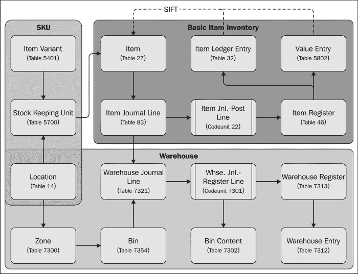

通过使用仓库管理可以扩展库存的保持。这是在**基本项目库存**功能之上运行的。

## 项目

项目表存储库存管理的母数据，就像总账账户对财务管理所做的那样。

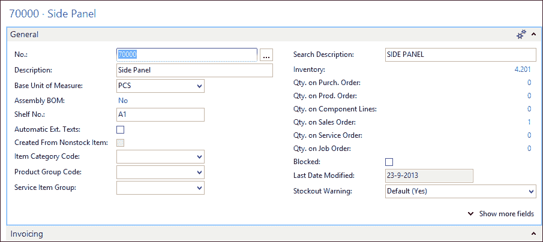

在这个表中，我们可以为每个单独的项目进行设置，例如定价、库存和生产策略，以及跟踪选项。

## 位置

位置表定义了执行哪种级别的库存管理。一个位置可以是某个地方的物理仓库，或者是一个仓库的一部分，如果使用不同的仓库策略。

如果我们查看**位置卡**，我们会看到我们可以设置的内容：

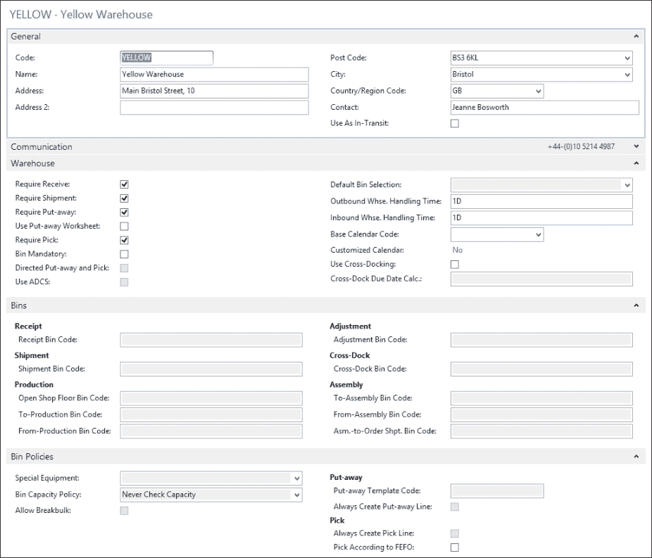

让我们详细看看这些设置：

+   **通用**：在这里，我们可以指定仓库的物理位置。我们还可以指定**使用在途**。当指定了这一点时，我们只能使用调拨订单将库存移动到这个位置。

+   **仓库**：在这个选项卡中，我们指定想要使用哪种级别的仓库管理功能。如果一切留空，当使用此位置时，不会创建任何仓库条目。

+   **托盘**：这个选项卡包含大多数库存活动的默认托盘，例如**收货**和**发货**。在创建仓库文件时，这些值可以更改。

+   **托盘策略**：这个选项卡包含一些更高级的仓库管理选项。

## 变体

项目变体是 Microsoft Dynamics NAV 的一个强大功能。它使我们能够将项目拆分为不同的类别，而无需创建新的项目。

变体代码在项目账簿条目中维护，并在应用时使用。让我们看看一个例子，看看如何使用它。

我们公司销售 T 恤。我们有三种尺寸；小号、中号和大号，以及四种颜色；白色、黑色、红色和蓝色。这使得我们能够创建以下十二种独特的变体代码：

| Size and color |
| --- |
| S-WHITE | S-BLACK | S-RED | S-BLUE |
| M-WHITE | M-BLACK | M-RED | M-BLUE |
| L-WHITE | L-BLACK | L-RED | L-BLUE |

当我们购买或生产这些 T 恤时，我们需要指定变体代码，该代码将继承到项目账簿条目中。

如果我们销售或转移这些项目之一，我们可以指定相同的变体代码。Microsoft Dynamics NAV 将使用此变体代码在搜索库存时。

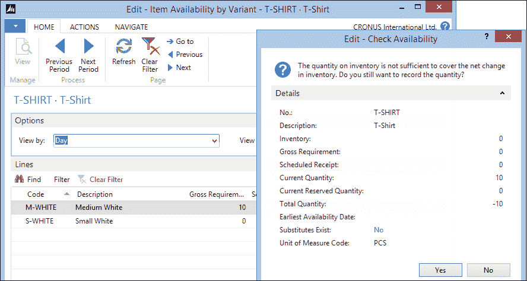

## 库存单位

有时，同一项目可以有多个单位成本、补货系统或生产方法。为了支持这一点，我们可以使用库存单位。

库存单位指的是现有的项目、位置和变体。这三个字段是唯一的键。让我们看看一个例子，看看如何使用它。我们的 T 恤需要有不同的单位成本。为了做到这一点，我们需要为每个我们刚刚创建的变体创建一个 SKU：

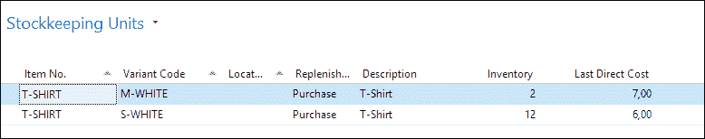

当我们现在为同一项目创建两个具有不同变体代码的采购订单行时，我们可以看到每个变体的**最后直接成本**都不同。

### 注意

**库存单位**是 Microsoft Dynamics 的一个非常强大的功能。它允许你在创建项目后更改其设置，每个设置使用变体代码。确保变体代码是自解释的。

### SKU 函数的创建

当一个项目有多种变体和位置时，为每个组合创建 SKU 可能是一个相当大的挑战。为了帮助这个过程，我们可以使用**创建库存单位**报告（5706）。

新创建的 SKU 将继承来自项目的所有必要字段。之后，我们可以进入并修改必要的单个 SKU 记录：

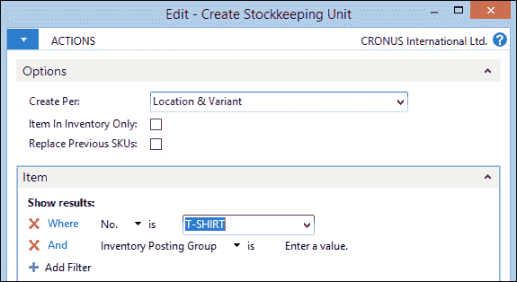

## 销售定价

项目的基准单价可以在**项目**表中设置。这是一个静态字段，用于创建新的销售文档时。为了使用更灵活的单价，我们可以使用**销售价格**和**销售折扣**功能：

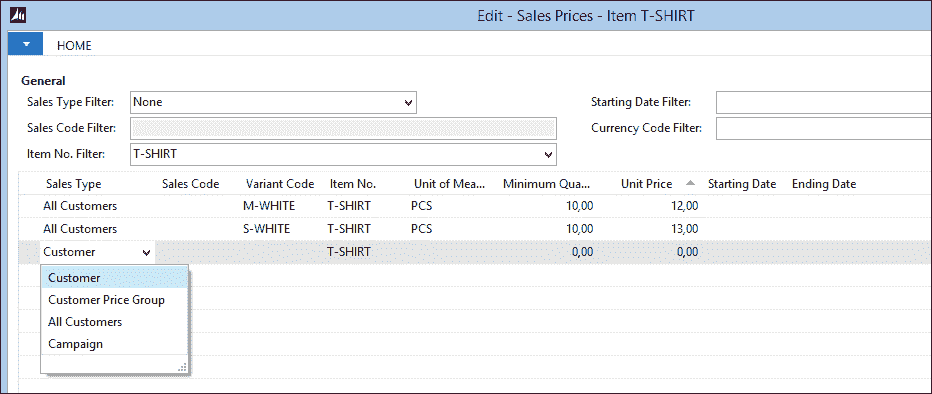

更多有关定价的信息可以在第一章、*Microsoft Dynamics NAV 简介*和第二章、*一个示例应用*中找到。

## 项目账目条目应用

当库存被创建和使用时，系统将应用并关闭正负项目账目条目，使它们相互对应。这使得我们能够追踪库存。

应用被保存在**项目应用条目**表（339）中。让我们看看处理项目应用的 C/AL 代码。

### 项目应用 C/AL 例程

项目应用是在代码单元 Item Jnl.-Post Line (22)中的`ApplyItemLedgEntry`函数中完成的。该函数从检查是否使用了预留开始。使用预留会改变库存应用的方式。我们将在本章后面讨论预留。

```cs
ApplyItemLedgEntry
...

CLEAR(OldItemLedgEntry);
...
REPEAT
  ItemJnlLine.CALCFIELDS("Reserved Qty. (Base)");
  IF ItemJnlLine."Assemble to Order" THEN BEGIN
    ItemJnlLine.TESTFIELD("Reserved Qty. (Base)");
    ItemJnlLine.TESTFIELD("Applies-to Entry");
  END ELSE
    IF ItemJnlLine."Reserved Qty. (Base)" <> 0 THEN BEGIN
      IF ItemLedgEntry."Applies-to Entry" <> 0 THEN
        ItemLedgEntry.FIELDERROR(
          "Applies-to Entry",Text99000000);
    END;
    ...
  END ELSE
    StartApplication := TRUE;
```

如果没有进行预留，系统将启动应用代码。这允许两种可能性：手动应用和自动应用。

当用户在项目日记账行中填写**应用到条目**字段时，进行手动应用。这也用于用户更改应用时。

```cs
IF StartApplication THEN BEGIN
  ItemLedgEntry.CALCFIELDS("Reserved Quantity");
  IF ItemLedgEntry."Applies-to Entry" <> 0 THEN BEGIN
    IF FirstApplication THEN BEGIN
      FirstApplication := FALSE;
      OldItemLedgEntry.GET(ItemLedgEntry."Applies-to Entry");
      OldItemLedgEntry.TESTFIELD("Item No.",ItemLedgEntry."Item No.");
      OldItemLedgEntry.TESTFIELD("Variant Code",ItemLedgEntry."Variant Code");

      OldItemLedgEntry.TESTFIELD(Positive,NOT ItemLedgEntry.Positive);
      OldItemLedgEntry.TESTFIELD("Location Code",ItemLedgEntry."Location Code");
```

在这种情况下，系统会检查我们所指定的**项目账目条目**是否符合要求。当应用自动完成时，系统将根据相同的要求搜索最佳的项目账目条目。

```cs
END ELSE BEGIN
  IF FirstApplication THEN BEGIN
    FirstApplication := FALSE;
    ItemLedgEntry2.SETCURRENTKEY("Item No.",Open,"Variant Code",
      Positive,"Location Code","Posting Date");
    ItemLedgEntry2.SETRANGE("Item No.",ItemLedgEntry."Item No.");
    ItemLedgEntry2.SETRANGE(Open,TRUE);
    ItemLedgEntry2.SETRANGE("Variant Code",ItemLedgEntry.
      "Variant Code");
    ItemLedgEntry2.SETRANGE(Positive,NOT ItemLedgEntry.Positive);
    ItemLedgEntry2.SETRANGE("Location Code",
      ItemLedgEntry."Location Code");

    IF ItemLedgEntry."Job Purchase" = TRUE THEN BEGIN
      ItemLedgEntry2.SETRANGE("Job No.",ItemLedgEntry."Job No.");
      ItemLedgEntry2.SETRANGE("Job Task No.",
        ItemLedgEntry."Job Task No.");
      ...
    END;
    IF ItemTrackingCode."SN Specific Tracking" THEN
      ItemLedgEntry2.SETRANGE("Serial No.",
        ItemLedgEntry."Serial No.");
    IF ItemTrackingCode."Lot Specific Tracking" THEN
      ItemLedgEntry2.SETRANGE("Lot No.",ItemLedgEntry."Lot No.");

    IF Location.GET(ItemLedgEntry."Location Code") THEN
      IF Location."Use As In-Transit" THEN
        ItemLedgEntry2.SETRANGE("Transfer Order No.",
          ItemLedgEntry."Transfer Order No.");

    IF Item."Costing Method" = Item."Costing Method"::LIFO THEN
      EntryFindMethod := '+'
    ELSE
      EntryFindMethod := '-';
    IF NOT ItemLedgEntry2.FIND(EntryFindMethod) THEN
      EXIT;
```

实际的应用条目是在`InsertApplEntry`函数中创建的。

### 应用项目账目的要求

为了将项目账目条目应用到另一个项目账目条目，需要考虑某些要求。我们可以从 C/AL 代码中读取这些要求：

+   **项目编号**在两个条目中应该是相同的。

+   旧的项目账目条目应该是**开放**的。当一个项目账目条目完全应用后，布尔字段**开放**被设置为**False**。

+   变体代码和位置代码应该是相同的。

+   布尔字段**正数**应该有一个相反的符号。这导致无法将一个负数条目应用于另一个负数条目。

其他要求基于系统设置的条件。例如，如果项目使用**批号**或**序列号**，这也应该匹配。

当系统定义了过滤器时，它会尝试找到第一条记录。搜索方法取决于成本方法。如果成本方法是后进先出法（LIFO），系统将尝试在过滤器中找到最后一条记录。对于所有其他成本方法，它将找到第一条。

我们还可以看到，当使用批号时，应用程序和成本计算是在批号内完成的。

## 价值条目

在 Microsoft Dynamics NAV 中，库存的物理信息与财务信息分开存储。这些信息存储在一对多关系中，这意味着一个项目账簿条目可以有多个价值条目。

这使我们能够在时间维度和成本类型维度中详细指定价值信息。

### 直接成本

每个项目账簿条目至少以一个直接成本类型的价值条目开始。这定义了库存的初始价值。在库存生命周期内，项目账簿条目可以获取以下四种其他类型的价值条目：

+   **重估**：当启动项目重估批次且项目的价值与直接成本不同时，使用此条目类型。

+   **舍入**：有时，库存调整会导致舍入问题。舍入被存储为特殊条目类型以实现可追溯性。

+   **间接成本**：当在项目卡片上使用**间接成本百分比**时，系统将为间接成本金额创建额外的价值条目。

+   **差异**：当项目使用标准成本时，发票金额与标准成本之间的差异被保存为一种条目类型差异。

### 价值条目和总账条目

价值条目和总账条目通过 G/L - 项目账簿关系表（5823）相互链接。每个总账条目都链接到一个或多个价值条目。这实现了可追溯性，并有助于审计员分析系统。

## 调拨单

要将库存从一个位置移动到另一个位置，可以在**项目日记账行**中进行负数和正数的调整，但我们也可以使用**调拨单**，如下面的截图所示：

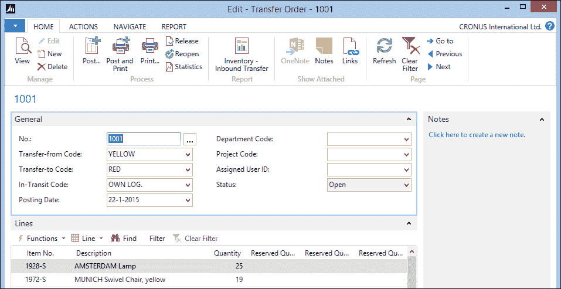

**调拨单**为每个位置创建项目账簿条目，并维护价值条目的链接。

这意味着如果我们从蓝色位置移动 100 个物品到绿色位置，但尚未收到采购发票，当过账发票时，系统将为移动的库存创建价值条目。让我们尝试一个新的项目。

### 示例

我们将使用的项目是**牛仔裤**。第一步是按照以下方式创建项目：

1.  我们只定义**编号**、**描述**、**基本计量单位**和**过账组**。

1.  现在，我们在**蓝色**位置创建一个数量为 10 的新采购订单。

1.  我们收到采购订单。

1.  使用新的调拨订单，我们将库存从**蓝色**移动到**红色**。

    这将导致五个**项目账务分录**和五个**价值项**，但由于我们尚未收到采购发票，总成本为零。

    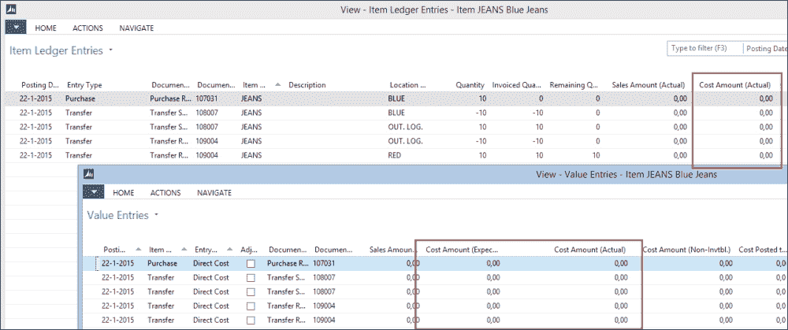

1.  现在，我们创建一个新的采购发票并获取收货行。我们使用**单位成本**为**10**。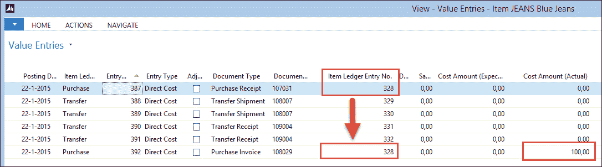

    这将导致原始项目账务分录的值项输入。

1.  为了创建调拨的价值项，我们需要运行调整成本 - 项目分录报告（795）。这将导致所有项目账务分录都有相同的价值项：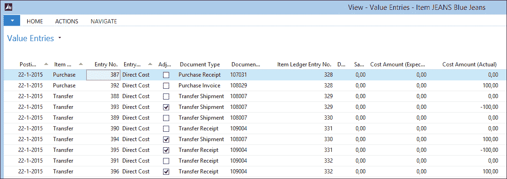

## 需求工作表

对于贸易公司来说，拥有刚好足够的库存非常重要；既不多也不少。为了做到这一点，我们可以使用需求日记账以及项目上的重新订购策略。

### 重新订购策略

重新订购策略告诉系统如何计算项目订购的时机和数量。微软 Dynamics NAV 使用以下四种不同的重新订购策略：

+   **固定重新订购数量**：每次我们运行需求日记账时，系统都将购买相同、固定的数量。此数量在**重新订购数量**字段中指定。

+   **最大数量**：系统将购买尽可能多的项目以满足**最大库存**字段的值。

+   **订单**：对于每个销售订单，将创建一个采购订单。这自动启用了此项目的预留过程。

+   **批次**：此选项将计算交付未完成销售订单所需的必要库存。

数量是在代码单元库存配置偏移（99000854）中的`CalcReorderQty`函数中计算的。

### 扩展重新订购策略

微软 Dynamics NAV 中的订购策略算法非常静态，一些贸易公司需要更多的灵活性。

一个例子是季节性的，取决于天气。玩具店在圣诞节期间需要额外的库存，而园艺工具店在春季达到顶峰。在这些高峰期间，与一年中的其他时间相比，交货时间和可用性也不同。

### 虚拟库存

贸易公司的一个新兴趋势是虚拟库存。这是我们无法控制的库存，但可以出售给我们的客户。计算机行业经常使用这种方法。每个人都可以为计算机设备创建一个网站，并使用大型批发公司的库存。

### 注意

为了使这可行，信息应该是实时且可靠的。在微软 Dynamics NAV 中，我们可以通过使用 Web 服务来解决这个问题。

# 仓库管理

使用库存管理，我们可以使用位置来查看库存在哪里。对于一些贸易公司来说，这已经足够好了，但有些人希望更具体地了解物品在仓库中的位置。

对于此，我们可以使用 Microsoft Dynamics NAV 中的**仓库管理系统**（**WMS**）功能。WMS 使我们能够指定每个位置内的区域和货位。

仓库管理中的另一个功能是将销售发货单和采购收货单合并到仓库文件中的可能性。使用这些文件，仓库员工可以同时为多个订单拣选或入库，从而实现更高效的物流方式。

## 仓库策略级别

仓库管理可以从非常简单到高度复杂地使用和实施。为了展示 Microsoft Dynamics NAV 中 WMS 的应用设计，我们将讨论以下五个可能的实施级别。对于每个级别，我们将展示表格和过账模型。

+   **货位码**：在销售和采购单据中使用此字段可以使系统开始创建仓库条目。

+   **仓库收货和发货**：这允许我们将销售发货单和采购收货单合并到一个仓库文件中。我们无法使用**拣选和入库**活动。

+   **仓库入库和拣选**：对于每一张采购收货单或销售发货单，我们都可以创建一个**入库或拣选**日记账。

+   **仓库收货和发货 + 使用入库工作表**：这允许我们实施真正的两步仓库流程，并在临时位置接收物品，并创建入库单据将物品移动到仓库的存储位置。

+   **定向入库和拣选**：这是 Microsoft Dynamics NAV 中 WMS（仓库管理系统）功能的完整选项。我们使用**收货单**、**发货单**、**入库单**和**拣选单**。Microsoft Dynamics NAV 将建议**货位码**。我们还可以使用**区域**、**中转码头**等。

## 位置设置

位置表（14）中的设置选项启用或禁用 Microsoft Dynamics NAV 中的 WMS 选项。这是在**仓库**选项卡上完成的，如下面的截图所示。每个级别都需要一个特殊的设置组合。

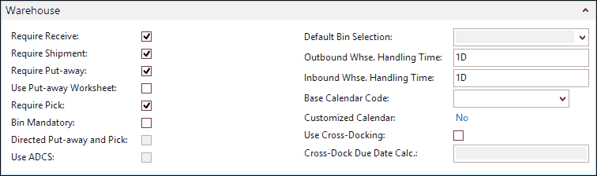

让我们看看不同的级别：

+   **第 1 级**：启用货位强制

+   **第 2 级**：启用接收、发货和货位强制

+   **第 3 级**：启用入库、拣选和货位强制

+   **第 4 级**：启用接收、发货、入库、拣选、货位强制和入库工作表使用

+   **第 5 级**：启用接收、发货、入库、拣选、货位强制和定向入库和拣选

### 仓库员工

在我们开始之前，当前用户应被设置为仓库员工。

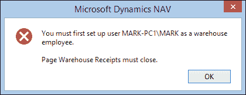

这可以通过在仓库员工表中创建一个新记录（7301）来完成。

### 注意

每个用户都可以在每个位置成为仓库员工，并且只能在他们被分配的位置执行仓库操作。

## 货位代码 | 第 1 级

实施 WMS 的起始级别是使用货位表。这是通过在位置上启用**货位强制**字段来完成的。**货位代码**字段在所有必要的表中都可用，例如采购行、销售行和项目日记账行。

当使用**货位代码**时，代码单元 Item Jnl.-Post Line (22)将创建一个仓库日记账行并启动 Whse. Jnl.-Register Line 代码单元（7301）。这将导致创建仓库条目（7312）和货位内容（7302）。

### 示例

我们将创建一个新的位置，**ORANGE**，并使用**BIN1**作为货位。该位置使用**货位强制**选项，如下面的截图所示：

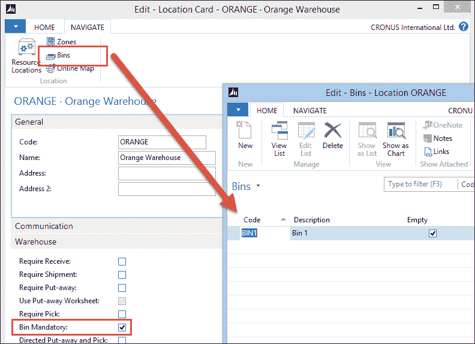

货位强制

在一个新的采购订单中，我们现在可以选择这个新的货位代码并过账收货。系统现在在**货位内容**表中创建一个新的记录，使我们能够查看创建的**仓库条目**。

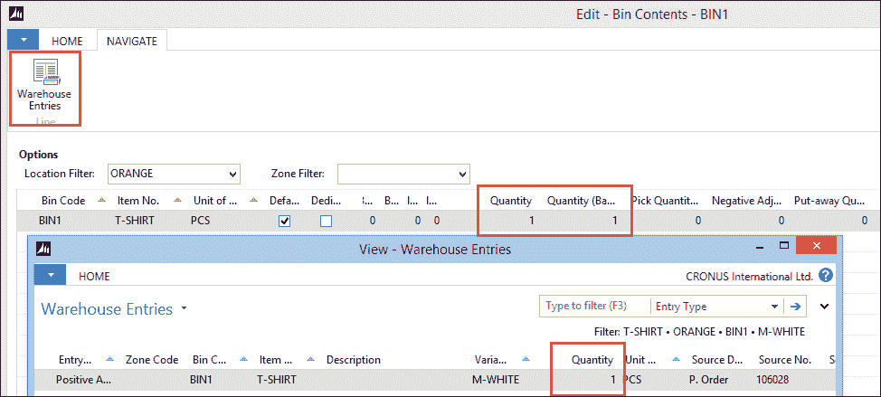

### 货位内容

每次首次使用货位时，Microsoft Dynamics NAV 将创建一个**货位内容**记录。**货位内容**记录既不是主数据也不是账簿条目或文档。它是 Microsoft Dynamics NAV 哲学中的一种特殊类型的表。

处理**货位内容**的 C/AL 代码可以在代码单元 Whse. Jnl.-Register Line (7301)中找到。要查看在任何时刻用于项目的哪些货位，我们可以从**项目卡**打开**货位内容**，如下面的截图所示：

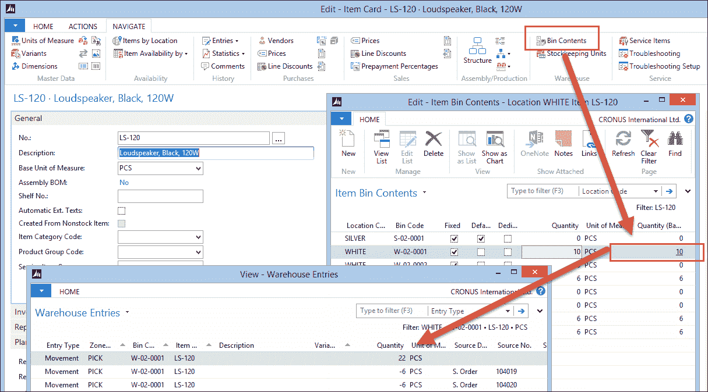

可以通过单击**数量（基础）**字段来显示仓库条目。

## 收货和发货 | 第 2 级

当我们在位置上启用**要求接收**和**要求发货**时，我们可以开始使用仓库收货和发货文档。这些文档允许我们在一份文档中接收或发货多个采购或销售订单。

让我们看看在应用程序中是如何操作的：

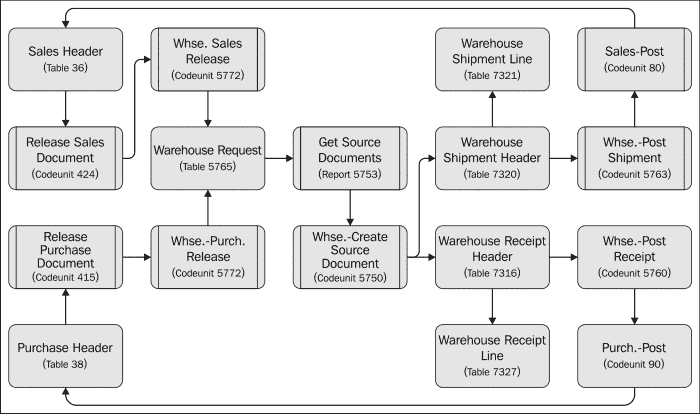

### 仓库请求

所有仓库文档都以仓库请求表（5765）的记录开始。这些记录在销售或采购文档发布时创建。

仓库收货或发货可以通过以下三种方式创建：

+   使用从采购和销售订单的**创建仓库收货**或**创建仓库发货**选项

+   使用**获取源文档**报告（5723）

+   使用**仓库收货**或**发货卡**上的**获取源文档**选项

前两种选项将为每个销售或采购文档创建一个新的仓库文档。后者允许我们在一个仓库文档中合并订单。

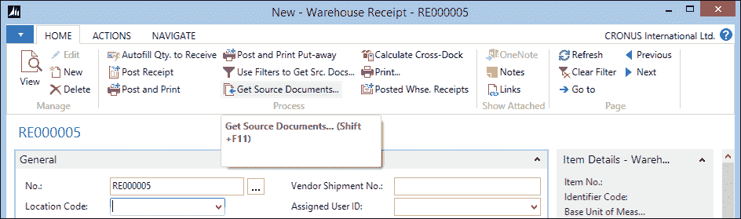

### 局限性

仅使用仓库收据和发货单据基本上只是在销售和采购单据上增加了一层。过账程序**Whse. Post Shipment (5763)**和**Whse. Post Receipt (5760)**实际上并没有将东西过账到仓库；它们只是将货位代码写回到销售行和采购行表中。技术上，这使用了与第 1 级相同的 C/AL 代码。

我们可以通过查看例如 Codeunit Whse. Post Receipt (5760)的`InitSourceDocumentLines`函数来了解这是如何完成的：

```cs
InitSourceDocumentLines
WhseRcptLine2.COPY(WhseRcptLine);
WITH WhseRcptLine2 DO BEGIN
  CASE "Source Type" OF
    DATABASE::"Purchase Line":
      BEGIN
        PurchLine.SETRANGE("Document Type","Source Subtype");
        PurchLine.SETRANGE("Document No.","Source No.");
        IF PurchLine.FIND('-') THEN
          REPEAT
              ...
              IF PurchLine."Bin Code" <> "Bin Code" THEN BEGIN
                PurchLine."Bin Code" := "Bin Code";
                ModifyLine := TRUE;
              END;
              ...
            IF ModifyLine THEN
              PurchLine.MODIFY;
```

当源表更新时，系统会使用代码单元销售-post (80)和 Purch. Post (90)创建一个正常的采购收据或销售发货。

## 搬运和拣选 | 第 3 级

除了创建仓库收据或发货单据外，我们还可以直接从销售或采购订单创建搬运或拣选。

要启用此功能，我们需要在**位置卡片**上激活**要求搬运**和**要求拣选**选项。

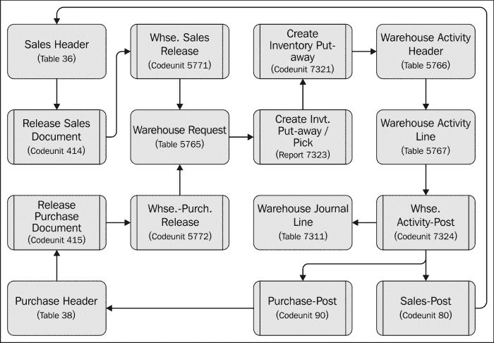

### 仓库请求

仓库请求记录与第 2 级完全相同，但系统不是创建仓库收据或发货单，而是直接创建仓库活动头和行。

### 仓库活动

仓库活动头和行表是内部 Microsoft Dynamics NAV 仓库文档。有五种类型的仓库活动文档，如下所示：

+   **搬运**：此文档用于将物品从收货货位移动到搬运货位。该文档由仓库收据生成。

+   **拣选**：此文档用于将物品从存储货位移动到发货货位。该文档由仓库发货生成。

+   **移动**：这是一个内部文档，用于在仓库内部移动物品。

+   **Invt. Put-away**：此文档用于接收物品并将它们直接放入仓库的永久货位。该文档由仓库请求创建。

+   **Invt. Pick**：此文档用于直接从仓库一步发货物品。该文档由仓库请求创建。

当只在位置上使用**要求搬运**和**要求拣选**选项时，使用文档类型**Invt. Put-Away**和**Invt. Pick**。这将确保采购订单和销售订单将通过启动代码单元销售-post (80)和 Purch. Post (90)来处理。

### 第 2 级和第 3 级比较

第 2 级和第 3 级设置选项都是一步仓库实施。在接收物品时，我们必须提供物品将被存储的存储货位，直到它被售出。没有额外的步骤。

使用仓库收据和发货单据允许我们在一个仓库单据上合并销售和采购单据。这不能通过直接搬运和拣选来完成。使用直接搬运和拣选，我们可以将一个销售行或采购行拆分成多个货位。这不能通过仓库收据和发货单据来完成。

原因在于仓库入口的创建方式。第 2 级使用**货位**字段在**项目日记账行**中创建仓库入口。

使用第 3 级，仓库入口是通过代码单元 Whse.-Activity-Post（7324）创建的。货位代码不会写回销售行或采购行。这意味着我们也不能在采购收货单和销售发货单的**货位**代码字段中使用。

## 第 4 级 – 收货与上架工作表

大多数仓库使用两步收货和发货流程。第一步是在收货位置接收物品，这通常靠近卸货码头。然后，物品被存放在其仓库位置，直到需要用于生产或销售过程。这是第二步。

要启用此两步流程，我们可以通过在**位置卡**中使用**要求接收**、**发货**、**上架和拣选** + **货位强制** + **使用上架工作表**选项来组合第 2 级和第 3 级。

这允许我们首先执行第 2 级中讨论的仓库收货和发货。当我们处理此文档时，它不仅过账销售订单和采购订单，还会在仓库上架请求表（7324）中生成记录。

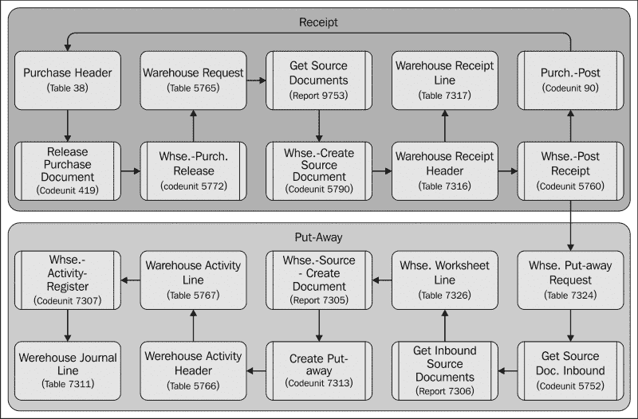

### 仓库活动登记簿与仓库活动过账

当使用仓库工作表处理仓库上架请求时，它将导致仓库活动表头和行。在这种情况下，系统将使用我们在上一节关于第 3 级讨论的上架和拣选文档类型。

从技术上讲，第 3 级和第 4 级的文档是相同的，但存在以下两个差异：

+   在两步仓库设置中，物品已经位于仓库入口。这意味着我们必须移动它们。这会导致出现两个新的仓库入口，同时在仓库文档中也有两条记录。

+   两步仓库文档未过账，而是进行了登记。这意味着系统将只创建仓库入口，而不再更新销售和采购文档。

## 第 5 级 – 指导上架和拣选

将仓库收货和发货与上架和拣选结合起来，完成了 Microsoft Dynamics NAV 中 WMS 的表格和过账图。但还有其他选项可以丰富功能。

这些选项之一是指导上架和拣选。当此选项被激活时，系统可以并会帮助我们找到每个仓库活动的正确货位。

### 区域和默认货位

让我们从定义区域和默认货位开始。区域是一组货位。通常，它们在物理上彼此靠近，但更重要的是，它们共享一些属性。

对于每个区域，我们需要指定是否允许接收、发货、上架和拣选。这可以在**货位类型**列表中完成。

在定义货位时，建议使用逻辑名称，例如 R-01-001 用于**收货**行第一层第一个：

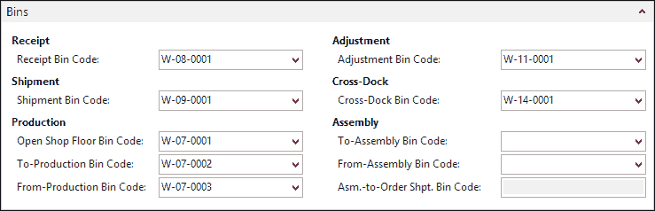

默认货位是在**位置卡**的**货位**选项卡上设置的。这些货位可以在每个文档中随时更改。

### 货位计算

货位计算是在使用模板的拣货单文档中进行的。此模板定义了查找正确货位以存储项目的规则：

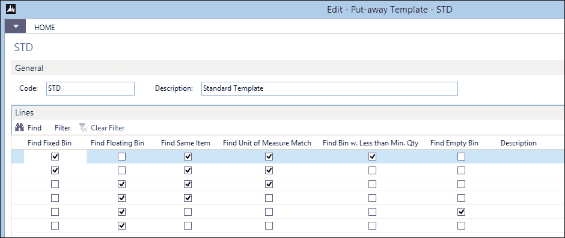

查找选项存储在拣货模板行表（7308）中；它们如下所示：

+   **查找固定货位**：系统将尝试找到固定的货位。固定货位通常为特定项目预留。

+   **查找浮动货位**：这将尝试找到第一个可用的货位。

+   **查找相同项目**：这将过滤出已经包含此项目的可用货位。

+   **查找单位匹配**：如果仓库的部分区域设计为处理特定类型的载体，例如欧元或美国托盘，则可以使用此选项。

+   **查找低于最小库存量的货位**：使用此选项查找未完全使用的货位。如果不与**查找相同项目**一起使用此选项，可能会导致同一货位中有两个项目。

+   **查找空货位**：此选项将确保我们找到空货位。

处理货位计算的 C/AL 代码位于创建拣货单代码单元（7313）中。让我们看看：

```cs
Code()
IF Location."Directed Put-away and Pick" THEN BEGIN
  BinType.CreateBinTypeFilter(BinTypeFilter,2);
  REPEAT
    QtyToPutAwayBase := RemQtyToPutAwayBase;
    IF NOT (PutAwayTemplLine."Find Empty Bin" OR 
      PutAwayTemplLine."Find Floating Bin") OR
      PutAwayTemplLine."Find Fixed Bin" OR
      PutAwayTemplLine."Find Same Item" OR
      PutAwayTemplLine."Find Unit of Measure Match" OR
      PutAwayTemplLine."Find Bin w. Less than Min. Qty"
    THEN BEGIN
        //Calc Availability per Bin Content
        IF FindBinContent("Location Code","Item No.",
          "Variant Code",WarehouseClassCode) 
        THEN
          REPEAT
            ...
          UNTIL (BinContent.NEXT(-1) = 0) OR EverythingHandled
      END ELSE BEGIN

        //Calc Availability per Bin
        IF FindBin("Location Code",WarehouseClassCode) THEN
          REPEAT
            IF Bin.Code <> "Bin Code" THEN BEGIN
              ...
            END;
          UNTIL (Bin.NEXT(-1) = 0) OR EverythingHandled
      END
    UNTIL (PutAwayTemplLine.NEXT = 0) OR EverythingHandled;
```

对于拣货模板行表中的每条记录，系统将尝试找到货位。这意味着如果第一个模板行的规则失败，它将使用第二个模板行，依此类推。

两个选项“查找空货位”和“查找浮动货位”消除了使用其他选项的需要。如果这些选项为`true`，系统将调用`FindBin`函数。对于其他选项，它将使用`FindBinContent`函数。

## 实施和定制仓库管理

由于在 Microsoft Dynamics NAV 中设置 WMS 有多种方式，因此在实施开始时做出正确的决策非常重要。将系统从一个策略转移到另一个策略是一项相当大的挑战。

因此，讨论所有可能性并将它们与您公司的运作方式进行比较非常重要。

### 备注

在实施 WMS 软件时，一个常见的错误是试图用计算机系统解决程序问题。简单规则是：“如果没有计算机系统也能工作，那么使用计算机系统肯定也能工作”。

由于数据流非常复杂，特别是对于 Microsoft Dynamics NAV 标准，定制和更改 WMS 应非常谨慎。

# 预留

在 Microsoft Dynamics NAV 中，可以对库存进行预留。这可以帮助我们更有效地管理库存。让我们通过一个客户场景讨论预留过程。

我们的一位客户在 2015 年 1 月 22 日订购了 100 件黑色 M 码 T 恤。目前，我们库存中有 120 件，因此我们可以无任何问题地发货。客户希望他们在 11 月 18 日收到。我们输入了发货日期的销售订单并发布了订单。

第二天，另一位客户打电话要 40 件黑色 M 号 T 恤。我们的库存仍然是 120 件。这位客户希望在 5 月 31 日收到。我们输入销售订单时没有警告。最后，我们将为 90 件相同的 T 恤创建一个新的销售订单，交货日期为 7 月 25 日。现在，我们得到以下错误消息：

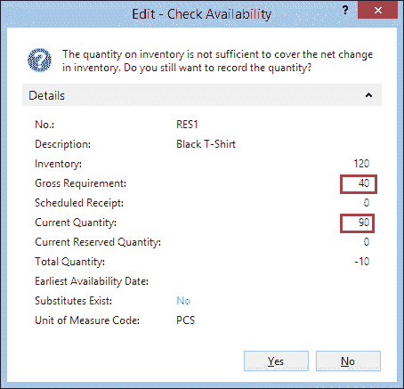

如果我们现在回到第二个销售订单并重新输入数量，我们会得到一个类似的消息。

## 检查可用期计算

这种情况发生的原因在于 Microsoft Dynamics NAV 计算总需求的方式：

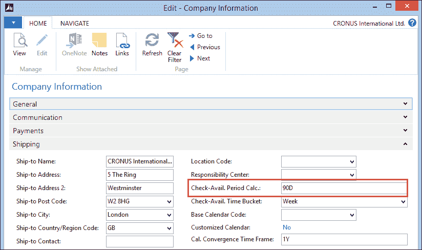

这是一个两步法，首先，需求计算到销售行的发货日期，其次，使用在公司信息表中定义的日期公式调用`Lookahead`函数。

用于计算`Lookahead`的 C/AL 代码可以在代码单元“可承诺”中的`QtyAvailabletoPromise`函数中找到（5790）。

```cs
QtyAvailabletoPromise
Item.CALCFIELDS(Inventory,"Reserved Qty. on Inventory");
ScheduledReceipt := CalcScheduledReceipt(Item);
GrossRequirement := CalcGrossRequirement(Item);

IF FORMAT(LookaheadDateFormula) <> '' THEN BEGIN
  GrossRequirement :=
    GrossRequirement +
    CalculateLookahead(
      Item,PeriodType,
      AvailabilityDate + 1,
```

如果这个`Lookahead`功能不够详细，我们可以开始使用预订流程。

## 始终与可选预订

**预订**选项可以在项目级别和客户级别激活，并可以设置为**永不**、**可选**和**始终**，如下面的截图所示：

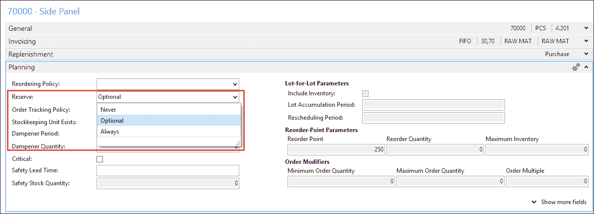

让我们看看这些选项的含义：

+   **永远不**：对此项或客户的预订是不可能的。如果该项被**始终**预订，而客户被**永不**预订，则该项获胜。

+   **可选**：可以为该客户预订项目；然而，销售人员和国库员工可以决定取消预订。

+   **始终**：没有适当的预订，无法发货。如果需求大于供应，销售人员和国库员工必须手动决定谁得到什么。

## 预订录入

Microsoft Dynamics NAV 使用预订录入（337）表来存储预订录入。预订录入可以连接到所有未结单据和日记账以及过账条目。这是通过以下源字段完成的：

+   **源类型**：这是一个整数字段，表示记录链接到的表，例如，37 表示销售行，5406 表示生产订单行。

+   **源子类型**：这是一个选项字段，当记录与销售行、采购行记录或生产订单的状态相关联时，它与**文档类型**字段相关联。

+   **源 ID**：这是与记录所链接的文档编号的链接。

+   **源批次名称**：如果记录与日记账相关联，则此字段表示日记账批次名称。如果使用此字段，则源 ID 为空，反之亦然。

+   **源生产订单行**：当记录用于生产订单行或组件时，此字段表示生产订单行号。

+   **源参考编号**：这是一个整数字段，用于将记录链接到文档、日记或生产组件中的行号。如果行与账目条目链接，则此字段表示条目编号字段。

在 Microsoft Dynamics NAV 中，有四种类型的预留条目，由**预留状态**字段表示：

+   **预留**：这些是真实的预留条目，这意味着当前或未来的部分库存被预留用于生产订单或销售订单。如果商品使用**始终**预留选项，则无法绕过这一点。如果预留是可选的，则可能有人仍在其他过程中使用这些商品。

+   **跟踪**：此选项由 Microsoft Dynamics NAV 中的**订单跟踪策略**选项使用。这是一个“水下”过程，可以自动链接供需。**跟踪**状态表示存在供应和需求。

+   **过剩**：此选项用于讨论的第五章、“生产”和订单跟踪策略。可以通过使用项目跟踪字段的值来识别记录。对于订单跟踪策略记录，此设置为**无**，对于项目跟踪，设置为**序列号**、**批号**和**批**以及**序列号**。

+   **潜在客户**：当使用项目跟踪时，潜在客户预留记录表示内部日记操作，例如，将序列号分配给项目日记行。

## 创建预留

让我们进入应用程序并创建一个预留，以查看数据库中的条目。

我们将使用一个新的商品来完成这项操作。该商品应具有描述、基本计量单位和通用生产、增值税产品和库存过账组。**预留**的默认值为**可选**，我们将在此示例中使用它。默认的成本计算方法是 FIFO，我们也将使用它。

1.  为了展示预留的实际价值，我们应该创建两个不同日期和单位成本的销售订单。使用 FIFO，系统通常会将销售订单应用于第一个项目账目条目。我们将对第二个项目账目条目进行预留，以展示对项目成本和应用的 影响。

1.  当完成这项操作后，我们可以创建一个新的销售订单，包含一个销售行，其中包含商品和一半的库存，并从**功能**选项卡中选择**预留**。

1.  在此屏幕上，我们可以通过单击**可预留**来查看可用的库存：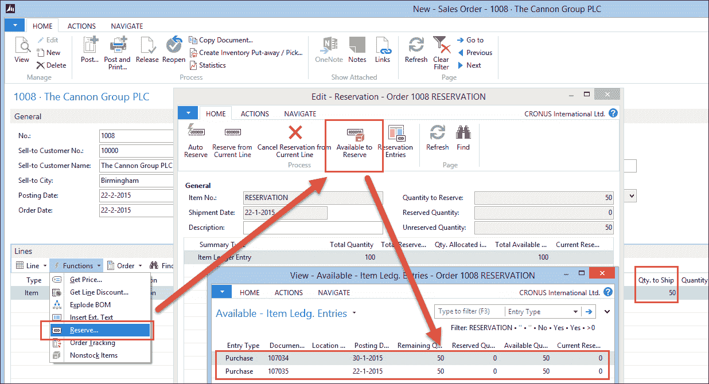

1.  在这里，我们选择第二个收货，导航到**操作** | **功能** | **预留**。然后，我们关闭屏幕。

1.  在**销售订单行**中，我们现在可以看到**预留数量**为**50**：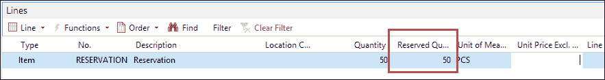

让我们通过从**对象设计器**运行表来查看数据库中创建的**预留条目**：

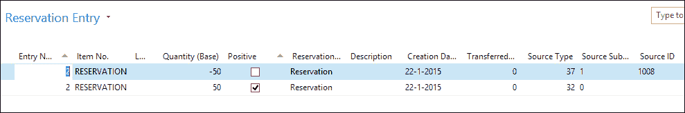

**预订**类型的预订条目总是使用相同条目编号的两行。第一个条目的**源类型**链接到销售行表（37），第二个使用项目日记账条目表（32）。

我们发货并开具销售订单的发票，查看我们项目的**项目日记账条目**：

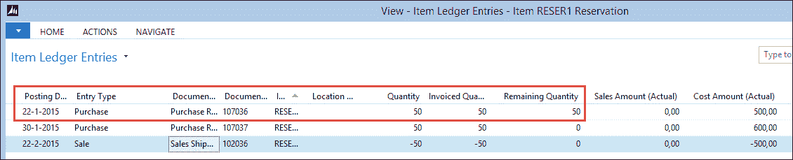

我们可以看到微软 Dynamics NAV 使用了第二个项目日记账条目，但成本是**500**，而不是第二个条目中的**600**。

为了纠正这个问题，我们运行了“调整成本 - 项目条目”（795）报告，并再次查看**项目日记账条目**和**价值条目**，以确认已经进行了修正。

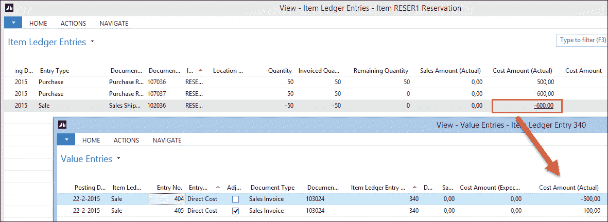

## 订单跟踪策略

我们已经看到预订条目不仅用于库存和项目跟踪的预订过程，还用于平衡供需。这是微软 Dynamics NAV 内部的一个选项，允许我们内部链接库存。

这些条目用于供需计算以创建需求工作表。

### 示例

让我们复制我们的预订测试项目，以查看预订和项目跟踪之间的差异。这个新项目应该有订单跟踪策略跟踪和操作消息。

我们将创建两个数量均为**50**的采购订单，但不接收它们，并为相同的项目创建一个数量为**80**的销售订单。

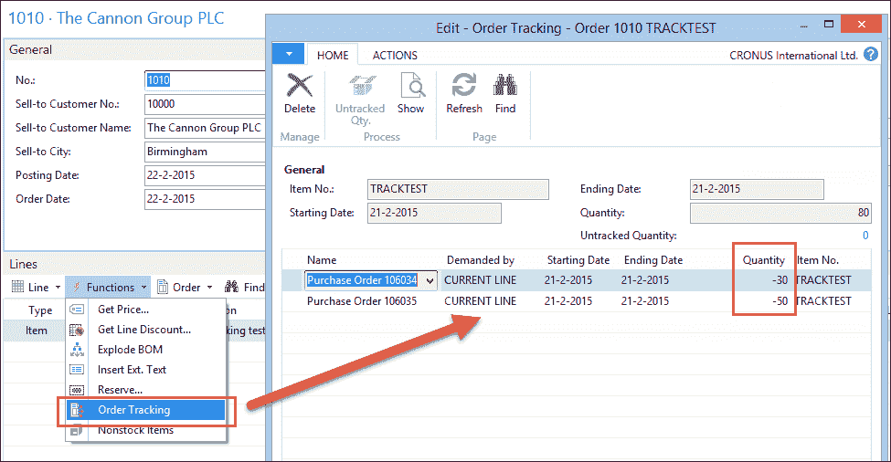

如果我们现在从**销售行功能**中选择**订单跟踪**，我们会看到系统匹配供需。

让我们看看**预订条目**：

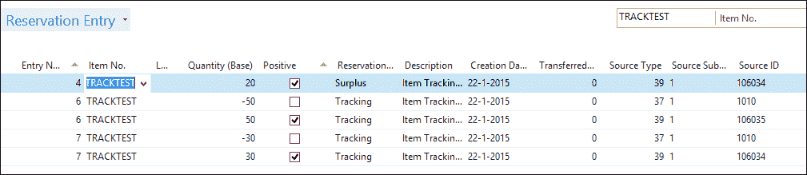

我们可以看到微软 Dynamics NAV 现在使用**过剩**和**跟踪**类型。我们剩余的 20 个项目没有与需求链接。

让我们开始为这个项目的**需求工作表**，看看微软 Dynamics NAV 能利用这些信息做什么。

### 补货

让我们将项目的重新订购策略改为**批量**，并为该项目运行**需求工作表**：

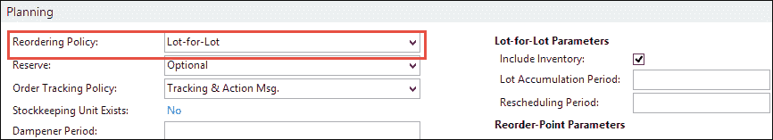

这将导致建议将两个采购订单合并为一个不同数量的文档。

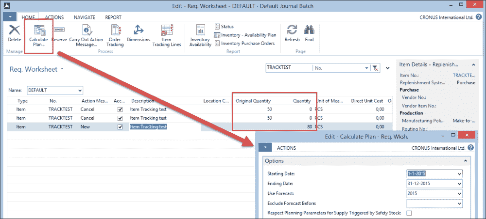

## 自动递增

在微软 Dynamics NAV 2013 中，预订条目表被重新设计，以使用自动递增功能来确定唯一编号。这提高了应用程序的性能并减少了锁定。

# 垂直行业交易

微软 Dynamics NAV 被用于许多不同的垂直行业，这些行业通常需要特定的功能。而不是试图在标准产品中实现所有这些功能，微软 Dynamics NAV 支持框架，并允许开发者设计和创建垂直功能。

对于这些功能，80/20 规则适用。Microsoft 提供了 80%的框架，这需要我们 20%的时间来实现。缺失的 20%的功能开发需要 80%的预算时间。

在本节中，我们将讨论 Microsoft Dynamics NAV 在五个不同垂直行业中的使用情况。对于每个行业，我们将讨论两个特定的垂直功能以及它们如何被解决。

### 注意

大多数行业都有由认证的 Microsoft Dynamics NAV 合作伙伴设计的可靠的附加解决方案，这些解决方案已在多个地点实施。强烈建议查看这些附加解决方案，而不是重新发明轮子并重写已经存在的附加组件。

## 时尚

时尚行业在季节中有贸易期。在春季，商店需要订购下一个冬季的系列，而在秋季，他们购买夏季服装。

### 销售订单

每个系列的销售订单都作为正常销售订单创建，但发货日期在将来，有时是六个月或更长时间。当使用变体时，应该为每个变体、尺寸和颜色创建单独的销售行。

对于销售人员来说，输入这些信息可能相当麻烦，因此我们可以使用模板销售行来加快主要物品的输入，并隐藏单个尺寸。

使用一个矩阵，其中*x*轴代表尺寸，*y*轴代表颜色，销售人员可以快速输入数量。当矩阵关闭时，我们可以更新隐藏的销售行。这些隐藏的销售行用于计算生产订单，如第五章中所述，*生产*。

### 预订

当生产订单从工厂返回时，仓库和销售人员需要决定哪个客户先获得这些物品。这可以通过发货日期来完成，但如果一个客户提前下单，即提前六个月，而另一个客户下单太晚，但有更早或相同的发货日期，这可能并不完全公平。

这是我们开始使用预订的地方。预订已经支持变体，但 Microsoft Dynamics NAV 的自动预订功能可能并不完全符合我们的期望。

更改此功能是一个复杂任务。AutoReserve 的 C/AL 代码位于预订管理代码单元（99000845）中，但应由经验丰富的开发者进行更改。

幸运的是，预订是建立在正常库存、生产、采购和销售流程之上的。如果我们更改算法，我们可以移除当前的预订并重新测试代码，以查看新创建的预订条目是否良好。这个过程应该非常小心地进行，使用足够小的数据集以便使用 Microsoft Excel 进行分析。

## 汽车

许多汽车经销商公司和车库使用 Microsoft Dynamics NAV，因为该垂直行业有一些强大的附加产品可用。

在 Microsoft Dynamics NAV 支持的正常贸易流程之上，这些公司有额外的业务需求。让我们讨论其中两个。

### 车辆信息

每辆售出的车辆都需要进行配置和订购。配置应存储在数据库中，以供未来的维护和保修使用。

我们可以将此与标准产品中的序列号或批号信息表进行比较。我们可以创建一个新的主数据表称为**车辆**，并为每辆我们配置或销售的汽车在此表中创建一个记录。我们为**车辆**创建的编号可以用作**项目账簿条目**中的序列号。

对于维护，我们可以有一个车辆日志，每次汽车回来进行维修时，都会创建车辆账簿条目。这有助于我们跟踪历史记录，并应包括诸如里程数等信息。这个解决方案的技术设计可以与我们在第二章中创建的“Squash 应用”进行比较，*一个示例应用*。

### 零件管理

在汽车行业，使用正确的部件至关重要。不同的部件可以用于不同类型的汽车，甚至往往是品牌无关的。

许多供应商以数字格式提供他们的产品组合，使我们能够与他们创建接口。应将零件定义为项目，使用标准功能，如替代品。由于许多零件可能价格昂贵且周转速度慢，因此保持库存可能非常昂贵，因此应保持最低库存。

零件可以连接到车辆类型。例如，汽车内部后视镜可以用于五种类型的汽车。当服务工程师想要更换这样的后视镜时，他/她可以使用所有可用零件的过滤项目列表。

## 药品/药品

在药店或其他药品供应商处，通常不仅允许每位客户购买任何商品。他们不能向健康人出售治疗心脏心律失常的药品。

即使某人被允许使用某种药品，通常也限于特定的剂量。人们通常为这些药品的保险费用投保，但大多数保险公司要求有自付费用。

### 药品卡

Microsoft Dynamics NAV 不支持项目监管。为了支持这一点，我们应该创建新的功能，将项目链接到客户，同时允许我们输入剂量和频率。

从这个模板中，我们可以定期创建销售订单和发货单。每次我们发货药品时，都需要更新这个模板。

### 自付费用发票

当客户需要支付部分药品作为自付费用时，我们需要系统为一份销售订单创建两个销售发票。

使用 Microsoft Dynamics NAV 中的标准预付款功能，这是可能的。我们可以向客户发送预付款发票，并使用合并开票处理向保险公司开具其他发票。预付款将从发票金额中自动扣除，但项目上的价值条目将保持完整。

然而，标准系统不允许我们向另一个“账单至客户编号”创建预付款发票。这需要设计和开发。

## 食品

当时尚公司每年有两个或三个大型订购时刻，客户会仔细考虑订购什么时，大多数食品公司都有大量日常订单流程。

此订购过程通常通过电话或传真完成，零售商打电话给呼叫中心员工，告诉他们第二天要发货的内容。

### 系列产品

大多数食品公司使用一系列产品。这个系列可能会随着季节变化而变化，或包含特殊行动项目，但通常很稳定，因为这是大多数消费者想要的；比如周一吃肉丸，周二吃猪排，等等。

为了节省宝贵的时间，每天创建具有相同项目的新的销售订单，我们可以在夜间让系统完成这项工作。

这可以通过使用标准客户销售代码来完成。Microsoft Dynamics NAV 中的此标准功能允许我们创建包含多个项目或其他由销售流程支持的主数据的模板销售订单。它还支持在创建销售订单时可以调整的固定数量。

可以使用 **Get. Std. Cust Sales Codes** 功能从客户销售代码创建销售订单，如下面的截图所示：

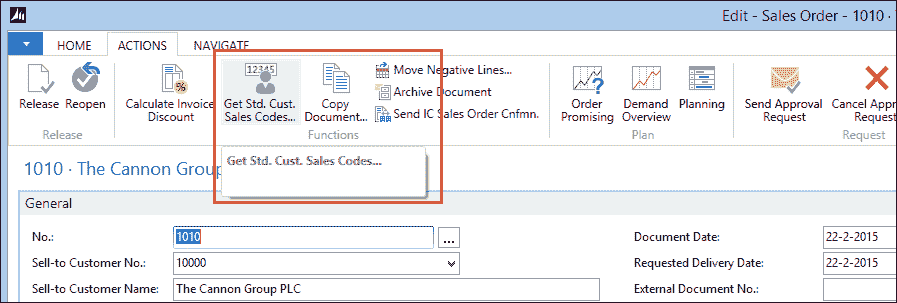

销售订单创建

这个功能可以在 **作业调度器** 中安排，以便为第二天创建新的销售订单。我们将在第九章 Chapter 9. 接口中讨论作业调度器。

### 快速订单录入

当零售商联系呼叫中心完成销售订单时，订单录入人员应该能够快速找到正确的销售行。如果系列包含 150 个项目，这可能相当具有挑战性。

这可以通过实施快速订单录入功能来解决，该功能允许用户在销售抬头中输入项目编号和数量。这些值将在正确的销售行中更新，并为下一次输入留空。

使用此功能，最终用户始终可以从同一位置工作，无需搜索正确的销售行。

## 家具

家具贸易公司面临的问题与时尚公司类似，但有一些关键区别。

与服装相比，办公椅和桌子的选项要多得多，而且当销售时，大多数消费者购买的是具有相同规格的少量产品，而不是不同尺寸的集合。

### 变体配置

家具的价格取决于配置，比如我们想要哪种布料作为座椅，哪种扶手类型，或者甚至是轮子的类型。这种配置还决定了商品编号。

一把办公椅或一张桌子可以有高达 1200 种可能的组合。我们不希望将这些组合注册为商品或甚至作为变体。

大多数家具供应商提供在线系统或小型外部软件包来确定组合。一旦确定了组合，我们就可以创建一个新的变体代码，或者查看变体是否已经存在，然后创建销售订单。

### 一次性商品

家具零售商通常拥有许多可以销售的系列，包含数千种商品。这些系列中的大多数商品将永远不会被售出，或者仅作为一次性商品售出，仅向一位客户销售一次。

在这种情况下，创建一个带有商品成本和库存价值的商品没有意义，但我们仍然希望对商品有一些可追溯性。这需要两个解决方案：

+   我们可以创建一个系列商品，每次我们销售一个与另一个商品相似但不完全相同的商品时，例如，一个脚部颜色不同的台灯，我们都可以重复使用这个商品。在销售行中，我们为销售人员创建了一个输入供应商/系列和商品类别的可能性。然后系统应该搜索模板商品。

+   另一个解决方案是从销售订单中创建一个新的商品运行时。销售人员也将选择供应商/系列和商品类别，系统应该显示一个包含数据库中已有商品的列表。如果商品尚未创建，系统应使用帖子组模板创建商品。销售人员可以立即使用它，然后我们就有了对我们销售的商品的可追溯性。

# 摘要

通过本章，我们结束了探索微软 Dynamics NAV 中围绕商品的生产和贸易功能的旅程。我们讨论了微软 Dynamics NAV 中销售和采购文档的应用设计以及它们是如何相互映射的。我们讨论了不同的文档类型以及它们如何从报价或一揽子订单到订单、发票或退货订单，再到贷项通知单协同工作。

销售和采购行验证方法帮助我们通过一个与最终用户创建这些行的方式相链接的特殊函数结构来计算定价、库存和增值税。

销售和采购订单有一个强制性的发布流程，可以通过文档审批和预付款进行扩展。商品有两个层次的库存流程，使用位置上的商品账目条目和仓库中的托盘和区域条目。我们可以使用调拨订单将商品从一个位置移动到另一个位置，以及使用仓库文件将商品从一个托盘移动到另一个托盘，从一个区域移动到另一个区域。仓库设置在位置上，可以有不同的层级。设置层级应与仓库中的实际流程相匹配。

在 Microsoft Dynamics NAV 中，项目应用和成本核算与预订流程紧密相连。预订录入表为库存流程添加了一个新的层级，将文档、日记账和录入项联系起来，以平衡供需。当使用预订流程时，它可以覆盖成本核算方法。

在本章末尾，我们讨论了在垂直解决方案中实施的不同方法，以及需要解决哪些差距以及如何解决。这展示了 Microsoft Dynamics NAV 标准交易结构的灵活性和强大功能。

在下一章中，我们将将其提升到一个新的水平，我们将为 Microsoft Dynamics NAV 设计并构建一个真实的垂直解决方案，这将使我们能够为卡车路线创建组合销售发货。我们还将基于 Microsoft Dynamics NAV 创建一个新的解决方案，将应用程序作为开发环境，以构建与应用程序方法相关的新事物。
