# 第八章. 咨询

在本章中，我们将学习微软 Dynamics NAV 如何适应咨询公司。大多数咨询公司都有与项目相关的流程。他们承担需要一定时间才能完成的大型项目。一些咨询公司还购买和销售物品。

对于项目，咨询公司需要跟踪使用的资源和物品。有时他们可以开票他们一对一花费的资源小时，但大多数时候他们也会承担固定价格项目的风险。在这种情况下，了解项目是否预算得当，并确保资金不会在途中损失，就更加重要。

有许多类型的公司以这种方式运作。例如，会计公司和律师事务所，但也有很多建筑公司也是这样运作的。

对于本章，我们将使用一个例子，一个我们所有人都非常熟悉的公司，无论是作为员工、客户，甚至可能是所有者。我们将研究微软 Dynamics NAV 合作伙伴的商业流程。

在我们的案例中，合作伙伴销售微软 Dynamics NAV 的新项目许可证。他们还帮助现有客户进行升级和支持。最后，他们还销售基础设施解决方案，内部组装服务器和桌面系统。

我们将讨论四种不同的项目场景，并看看微软 Dynamics NAV 如何被用来支持这些场景。为此，我们将沿途进行一些修改。本章所需的对象可以从`http://ftp.packtpub.com/chapter8.fob`下载。阅读本章后，您将很好地理解微软 Dynamics NAV 中作业模块的可能性和局限性，它如何与产品其他部分相匹配，以及如何安全地扩展。

# 流程

微软 Dynamics NAV 合作伙伴的两个主要流程是实施新项目和为现有客户提供支持、升级等服务。第三个流程是销售基础设施和组装计算机系统，但这是一种额外服务，而不是核心业务。

为了支持项目（工作），公司需要人员、软件许可证和硬件。人员（资源）需要在项目上仔细规划，因为它们是公司最不灵活的部分。硬件（项目）和软件许可证（总账账户）将从像微软这样的供应商处购买。

项目可以分为大型项目和小型项目。大型项目通常是新的实施和升级。小型项目通常是实施小型功能并帮助用户解决常规支持问题。

开票可以以各种方式完成。新的实施和小型项目可以按计费小时计费，而升级则以固定价格出售。对于硬件，我们将使用项目。许可证直接开票到总账。

大型项目也有需要维护的预算和规划。如果预算已完全使用，且规划里程碑尚未达到，则应创建一个新的预算以完成项目。

为了支持这一过程，我们将使用带有一些定制的作业功能。在 Microsoft Dynamics NAV 中，项目被称为作业，因此我们将从现在开始使用这个术语。

### 注意

微软为第五版完全重新设计了作业模块。在本章中，我们将使用许多新功能，在旧版本的 Microsoft Dynamics NAV 中，我们会进行定制。

## 适配

作业模块的注册可以使用 Microsoft Dynamics NAV 的标准功能以及预算和规划来完成。

标准软件还允许我们按固定价格和时间材料开票作业。我们还可以为我们的作业购买物品。在 Microsoft Dynamics NAV 2013 中，应用程序中增加了一个时间表模块，我们将在此章节中使用并解释它。

## 空缺

Microsoft Dynamics NAV 中的作业模块通常被引用为一个几乎总是需要一些更改的框架。幸运的是，它被设计得很容易更改，我们将这样做以支持我们的流程。

### 资源组

虽然许多公司是这样工作的，但为资源组进行预算是不可能的。我们将为此创建一个解决方案。我们还将使其能够查看计划、使用和开票的总小时数。

### 项目计算

我们将创建一个计算系统组装的解决方案。由于硬件规格变化非常快，我们不希望为可能只销售一次或两次的系统创建新项目。

### 问题登记

我们的支持团队需要一个单一的地方来登记所有客户的所有支持问题，并跟踪其工作流程。为此，我们还将创建登记和跟踪问题的功能。

# 入门

在我们开始创建任何新的作业之前，我们应该查看以下 Microsoft Dynamics NAV 作业模块的数据和发布模型：

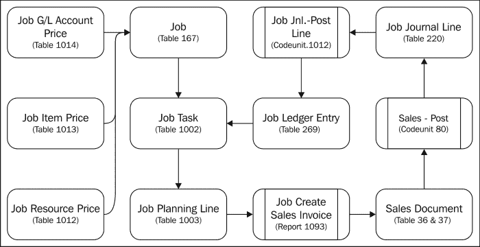

起始点是包含**工作任务**和**工作计划行**的工作表，我们可以用它们进行预算和规划。每个工作都可以有自己的价格。

**工作计划行**通过标准的 Microsoft Dynamics NAV 销售功能进行开票，然后创建**工作分录**。

## 有多少作业

第一步是设置一个新的作业。设置作业可能有不同的角度。这取决于我们如何使用系统。最低要求是每个客户账单至少有一个作业。这使我们能够进行开票。一些公司就是这样使用作业的，将其用作预开票引擎。

另一个角度可以是为客户做的每个项目设置新的工作。在我们的案例中，这始于基本的 Dynamics NAV 实施。当这项工作完成时，我们关闭工作。如果客户有任何新的要求，我们需要启动一个新的工作。这样我们可以更好地跟踪每个客户未解决的问题。这种方法的不利之处在于，每次都需要做一些工作来设置新的工作。

大多数公司最终会采取中间方案。为较大的工作设置新工作，并为支持问题设置工作是很常见的。这也允许我们为每个工作设置不同的计费策略。我们将使用这种策略。

### 工作卡

让我们来看看**工作卡**和其中重要的字段：

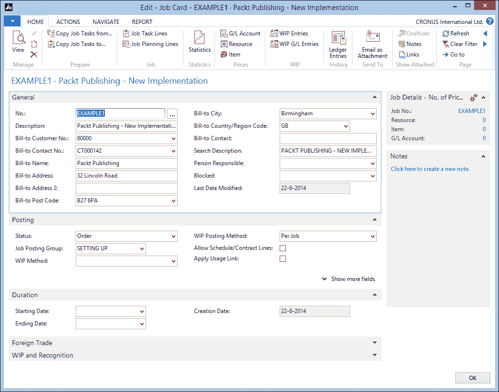

让我们更详细地看看这些字段：

+   **编号**：这是工作的唯一编号。我们可以为此使用不同的编号系列策略，从简单的顺序编号到为不同工作类型或手动编号的链接编号系列。

+   **描述**：此字段应包含对工作内部使用的逻辑描述。大多数人会在这个字段中搜索，所以请确保有某些命名规则。这将使未来搜索旧工作更容易。

+   **开票客户编号**：每个工作有一个开票客户。如果我们想为一个工作向多个客户开票，我们需要定制应用程序。

+   **搜索描述**：默认情况下，此字段将填充描述字段的值，但在需要的情况下可以更改为其他值。

+   **负责人**：这是一个信息字段，指示谁负责这项工作。

+   **已锁定**：如果此字段被勾选，则无法为此工作创建新条目。我们使用此字段用于关闭的工作。

+   **工作发布组**：这指的是用于**在制品**（**WIP**）过账的 G/L 账户。不同类型的工作或 WIP 方法可能有不同的 G/L 账户。

+   **在制品方法**：每个工作可以有一个在制品方法。我们将在本章稍后简要讨论这一点。

+   **状态**：工作有一组有限的状态字段。唯一可用的状态值是**计划**、**报价**、**订单**和**完成**。

    ### 小贴士

    大多数公司希望订单阶段有更多的子状态。为此，最佳方法是添加一个新的状态字段，使其与标准状态字段相映射。这需要最小化对应用程序的更改，同时创建新的工作流程可能性。

+   **允许计划/合同行**：如果此字段未被勾选，则无法创建具有**计划**和**合同**选项的计划行。当创建计划行时，它们将被拆分为计划和合同行。

+   **开始日期**和**结束日期**：这些是信息字段，仅用于计算该工作的货币汇率。

+   **外贸**：在“工作”模块中，可以以不同于本地货币的其他货币发送计算和创建发票。这将增加实施的复杂性，应谨慎使用。

## 工作任务和计划行

当创建工作后，下一步是创建工作任务和计划行。它们可以用不同的方式使用。

使用工作任务行，我们可以将工作分解成更小的部分，然后进行调度和计费。工作任务越详细，我们就能更好地衡量工作的进度。但维护这些任务所需的工作量也会更多。平衡是成功的关键词。

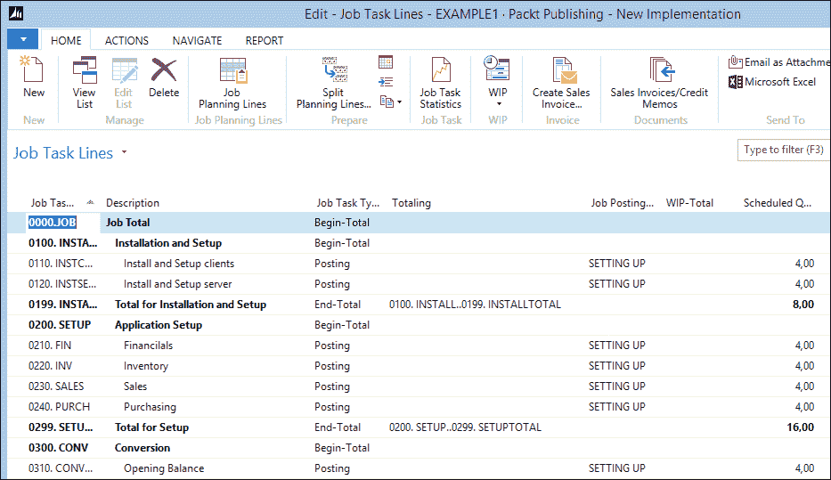

创建工作任务和计划行

工作任务可以与账户表具有相同的结构，这意味着实际的任务行可以使用开始和结束总计行进行分组。每个级别都可以缩进以提高可读性。

工作计划行是每个工作任务的具体行。这定义了我们将要做什么以及如何计费。工作计划行可以链接到主数据类型资源、项目、总账科目或文本。

### 小贴士

工作任务和工作计划行可以非常容易地从其他工作中复制。这使我们能够重用它们，甚至为常用组合创建模板工作。

工作计划线中的线型定义了其计费方式。共有三种类型：

+   **计划**：此行上的金额仅用于预算目的。在计费时，我们需要过账一个或多个将要计费的作业日志行，或者我们可以创建另一个带有发票金额的工作计划行。计划行应在按时间和材料计费时使用。

+   **合同**：此行将以确切金额进行计费。然而，这些金额不会显示在预算中。当在计划中计费固定价格的工作时，例如，在签订合同时支付 50%，在完成工作后支付 50%。

+   **计划和合同**：此行将以与合同行完全相同的方式进行计费，但金额也会显示在预算中。

## 工作日志

当工作任务和工作计划行设置完成后，我们可以开始工作。在工作过程中，我们将消耗公司资源和物品。这应使用工作日志进行登记。**工作日志**是我们第一章中制定的日记账分录图的最底层，*Microsoft Dynamics NAV 简介*，并使用其他日记账创建资源、项目和总账分录。

在创建工作日志行时，以下几个字段对于流程特别重要：

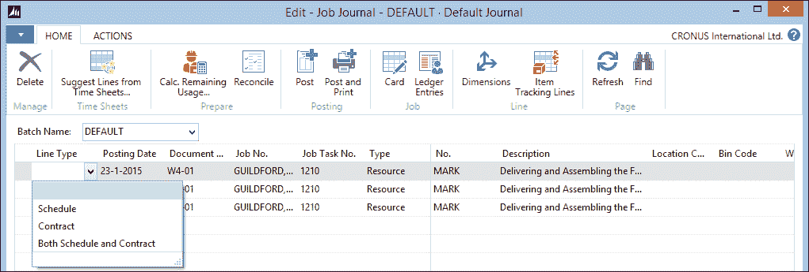

让我们更详细地看看这些字段：

+   **行类型**：它具有与**作业计划行**、**计划、合同**和**计划和合同都有的**相同的选项。当作业日记账行应该开具发票时，类型应该是**合同**。当作业日记账行是固定价格的一部分时，行类型应留空。然后行类型是**计划**，系统将创建此类型的额外作业计划行，这可能会破坏我们为客户的预算，因为它们已经被创建。

+   **单位成本和单位价格**：这些字段将确定作业的成本以及如果行类型是**合同**，将向客户开具发票的价格。这些信息也用于在制品的计算。

## 作业示例

让我们通过一些不同的作业场景来了解我们如何使用这项功能。

### 章节对象

章节对象包含我们将在本章中讨论的更改以及我们将使用的示例作业。按照附录中所述，导入`chapter8.fob`后，运行页面 123.456.700 **作业附加设置**并运行**初始化应用程序**。

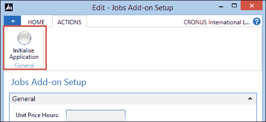

当此操作完成后，请重新启动角色定制客户端。现在你应该能看到项目管理角色中心。

### 新的实施

实施 Microsoft Dynamics NAV 2013 不是一个容易的任务，在我们可以使用该产品之前，有许多事情需要处理。我们将为 Packt Publishing 实施 Microsoft Dynamics NAV。本例中的任务是`EXAMPLE1`。

对于实施，我们将创建各种工作任务组。实施过程中的每一部分都会分配一个代码。由于排序是基于这个字段进行的，我们将使用数字和逻辑名称创建代码，例如，`0200\. SETUP`和`0210\. FIN`。

### 小贴士

在数字中留出足够的空间，以便在需要时添加额外的行。这将避免重命名，这对于数据库引擎来说是一个昂贵的任务，用户将不得不等待它完成。

我们的顾问将帮助客户安装系统，协助设置，并将旧系统的数据转换过来。当这一切完成后，我们将帮助他们进行测试，并使用 Microsoft Dynamics NAV 进行培训。顾问将在系统中作为资源设置，这些资源随后将被输入到作业计划行中。

当一切按预期工作，我们可以安排一个上线周末，并帮助他们使用系统。

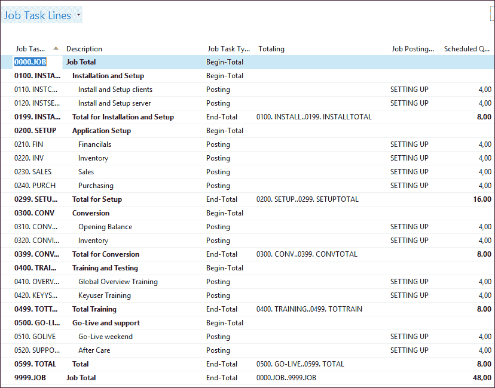

对此类工作进行发票是通过预算完成的。我们将预先计算我们认为必要的工时数量，并从那里开始。在作业过程中，我们需要测量使用的预算，并将其与进度进行比较。

#### 预算

预算是通过作业计划行创建的。在这个工作的这个阶段，我们还不知道哪个资源将被用于作业任务，甚至可能由多个资源完成。这就是为什么我们想在预算中使用资源组。

### 注意

这在标准应用程序中是不可能的，因此我们创建了一个修改，我们将在本章末尾讨论。

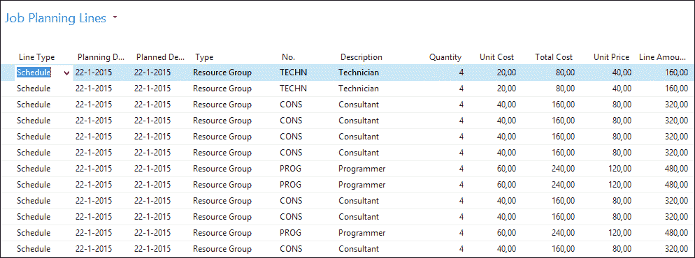

这些作业计划行的 **行类型** 是 **计划**。这意味着这些行仅用于预算和计划目的。系统将根据作业日记账中过账的实际消耗开具发票。

### 基础设施

要使用 Microsoft Dynamics NAV 2013，Packt 出版公司需要一个新的基础设施。他们的现有系统不符合 Microsoft Dynamics NAV 2013 的要求。

对于这个工作，我们可以在实施作业中创建新的作业任务行，但为了更清晰的概述，我们将创建一个新的作业，`EXAMPLE2`。

我们的公司开发和销售自己的计算机系统。我们可以构建服务器和台式机系统。由于没有系统是完全相同且可用组件经常更换，我们不希望为每个系统创建一个项目和物料清单。相反，我们使用一个计算系统，我们将它作为定制添加到 Dynamics NAV 中，这样我们就可以确定一个系统的价格。对于像开关、路由器、打印机和笔记本电脑等其他产品，我们使用从供应商处购买的物品。

这个工作的作业任务和作业计划行看起来是这样的：

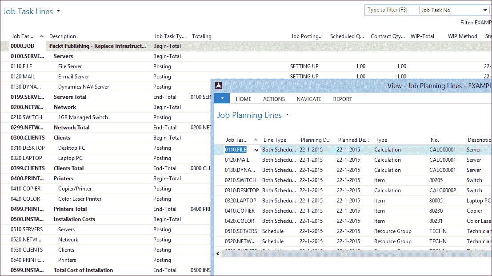

作业任务和作业计划行

在这个工作中，安装成本是 **资源组**，行类型为计划，就像上一个工作一样，所以我们根据作业的实际小时数开具发票。

其他行是 **计划和合同** 类型。这意味着我们将根据预算开具发票。这些任务的作业日记账行应以空白行类型进行过账。

### 升级

我们的客户要求从 Navision 版本 3.70 升级到 Microsoft Dynamics NAV 2013。我们可以以固定价格完成这项工作，但我们需要收取分析系统的费用。

对于 `EXAMPLE3` 任务，我们可以从有限的作业任务行开始，仅用于报价。当客户同意进行升级时，我们可以添加新的作业任务行。

报价和升级都是固定价格，并直接过账到总账。这并不意味着我们不能让我们的资源使用作业日记账登记实际小时数，但 **行类型** 应该为空白。

升级的一部分不是以固定价格完成的。系统需要重新设计，转换为 SQL Server 2014，并且客户希望获得额外的培训和支援。

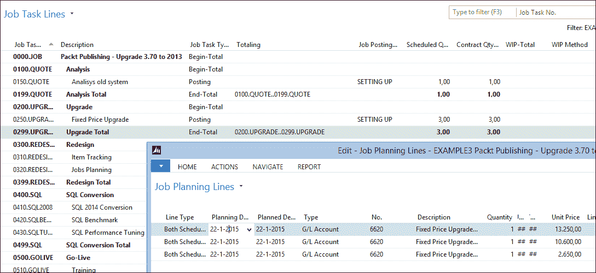

升级和重新设计

升级中的固定价格部分分三个阶段开具发票。当工作开始时，我们开具 50%的发票，当我们交付测试系统时，我们开具 40%的发票，最后在上线三个月后开具 10%的发票。

这是通过**计划和合同**行类型的使用完成的。

### 支持团队

对于支持团队，我们的政策是每位客户每年创建一个工作。我们将使用此工作，`EXAMPLE4`，来开具许可证维护和支持问题的发票。

支持问题可以是客户向我们打电话的小问题，如更改报告或页面，或者实施只需要几天工作的新功能。

每个问题和新功能都将作为一个工作任务行创建。新功能将由销售该功能的账户经理创建。然后我们可以决定是否以固定价格、使用合同行或按时间和材料使用计划行进行开具发票。

我们的支持团队也需要使用工作系统，但我们不希望他们为每个支持电话手动创建一个新的工作任务行，我们还想让他们轻松查看所有客户的未决问题。为此，我们创建了一个新的问题登记系统，我们将在本章末尾讨论。

系统中的每个问题都与一个工作任务相关联。当支持工程师创建一个新问题时，将自动为他们生成工作任务行，他们可以在我们的时间和计费系统中使用它。

## 时间表

对于我们示例中的所有工作，拥有坚实的资源小时登记至关重要。在标准的 Microsoft Dynamics NAV 工作应用中，资源需要为每个工作、工作任务和过账日期的组合过账工作日记，或者我们可以使用在 2013 版中引入的新时间表应用。

### 小贴士

在[`msdn.microsoft.com/en-us/library/hh175112(v=nav.71).aspx`](http://msdn.microsoft.com/en-us/library/hh175112(v=nav.71).aspx)的 MSDN 页面上，您可以找到有关如何在 Microsoft Dynamics NAV 中设置和使用时间表的更多信息。

### 设计模式

**时间表**应用位于资源日记行之上，并使用资源和工作任务创建。


对于负责工作的人员有一个审批流程，允许他们进行更正。

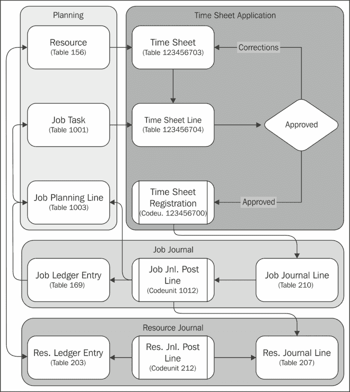

时间表是为每周创建的。时间表是通过一个过程生成的，而不是由用户生成。之后，资源可以为每个工作任务行创建**时间表行**并填写每周每天的小时数。

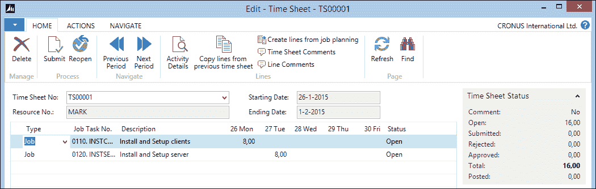

如果我们查看前面的时间表，我们可以看到在它更新后，**周三**缺少 2 小时。

## 采购

对于某些工作，可能有必要为该工作专门采购项目。在 Microsoft Dynamics NAV 2013 中，工作模块与我们在第五章中查看的请购单工作表、*生产*和第六章中查看的*贸易*模块集成。然而，在这个例子中，我们将像这样手动创建采购订单：

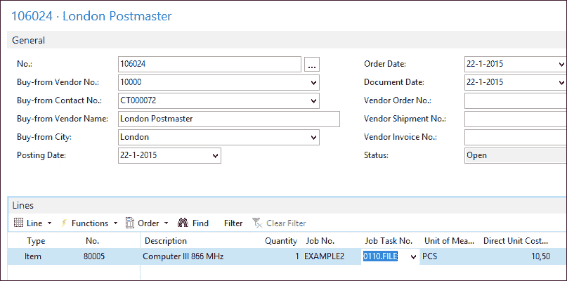

当为工作采购时，应使用**工作编号**和**工作任务编号**字段。如果我们将工作行类型设置为合同，此项目将被开具给客户发票。通常，这不需要，因为它应该已经在工作计划行中。

### 项目成本与在制品比较

在过账此采购单据并从采购发票导航后，我们可以看到系统已为此项目创建了两个价值条目：

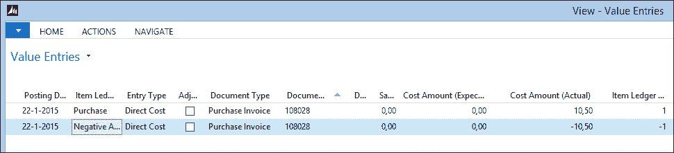

这对于我们在前几章讨论的成本计算非常重要。

### 注意

为工作采购的项目不计入库存，而是用于在制品的计算。

## 开票

当我们工作中的所有内容都按照要求设置好，并使用工作日记来过账使用情况时，创建发票是一项简单的任务。

在工作管理角色中心，我们可以查看是否有工作需要开具发票。这是通过在**工作计划行**的**计划日期**字段上使用流程过滤器来完成的。

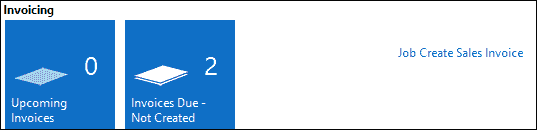

每个工作计划行都有一个计划日期。这可以用来安排我们的资源，但对于发票安排来说更有用。每个准备开具发票的工作计划行应该在**计划日期**字段中获得发票日期。

然后，可以使用批量报告**工作创建销售发票（1093）**来创建发票，但也可以使用报告**工作建议开票（1011）**来预览发票。此报告可以从每个工作开始。

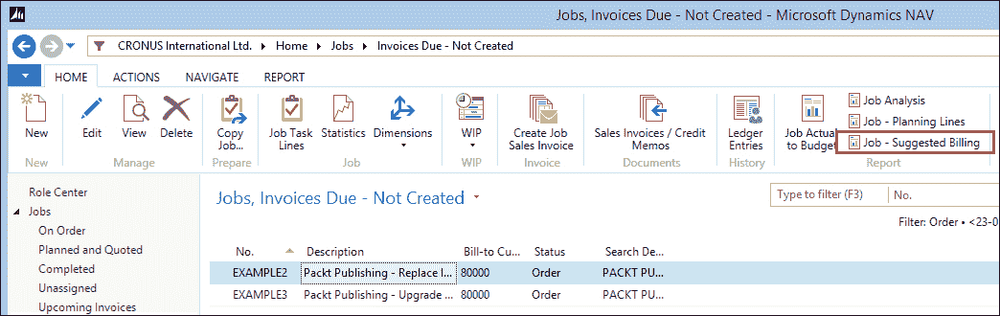

工作建议开票

销售发票行使用与工作计划行相同的描述创建。为了在发票上向客户澄清信息，我们可以使用额外的文本行。

当创建并发送发票时，工作任务将更新为实际的发票信息。

## 在制品计算

由于大多数工作不是在一天或一周内完成的，因此及时了解每个工作的状态很重要。这可以通过数量和财务来衡量。在数量上，我们可以通过查看**工作任务**页面来了解预算的使用情况。对于财务进度，我们可以计算在制品。

在制品计算我们在工作中产生的成本和开具的发票，并为这些创建工作在制品条目。如果需要，这些可以过账到总账。在制品金额取决于在制品方法。

在 Microsoft Dynamics NAV 中，在制品的计算基于在“工作在制品方法”表中设置的组合成本和销售。

让我们创建一个示例并计算五种示例方法的在制品（WIP）。

| 代码 | 识别成本 | 识别销售 |
| --- | --- | --- |
| `COMPLETED CONTRACT` | 完成时 | 完成时 |
| 销售成本 | 销售成本 | 合同（发票价格） |
| `COST VALUE` | 成本价值 | 合同（发票价格） |
| `PERC. OF COMPLETION` | 使用（总成本） | 完成百分比 |
| `SALES VALUE` | 使用（总成本） | 销售价值 |

我们创建了一个总价格为 1000、总成本为 500 的工作。我们使用了价值 500 的 4 个资源小时，成本为 250。我们没有开具任何发票。

|   | 识别成本 | 识别销售 | 在制品成本 | 在制品销售 |
| --- | --- | --- | --- | --- |
| 成本价值 | 125 | 0 | 125 | 0 |
| 销售价值 | 250 | 250 | 0 | 250 |
| 销售成本 |   |   | 250 |   |
| 完成百分比 | 250 | 250 | 0 | 250 |
| 完成的合同 |   |   | 250 |   |

现在，我们向客户开具了花费的小时数的发票。我们开具了 500 的发票。

|   | 识别成本 | 识别销售 | 在制品成本 | 在制品销售 |
| --- | --- | --- | --- | --- |
| 成本价值 | 375 | 500 | -125 | 0 |
| 销售价值 | 250 | 250 | 0 | -250 |
| 销售成本 | 500 | 500 | -250 |   |
| 完成百分比 | 250 | 250 | 0 | -250 |
| 完成的合同 |   |   | 250 | -500 |

在最后一个示例中，我们将使用一个成本为 250 但我们无法开具发票的项目。现在我们有 500 的成本和 500 的销售。

|   | 识别成本 | 识别销售 | 在制品成本 | 在制品销售 |
| --- | --- | --- | --- | --- |
| 成本价值 | 500 | 500 | 0 | 0 |
| 销售价值 | 250 | 250 | 0 | -250 |
| 销售成本 | 500 | 500 | 0 |   |
| 完成百分比 | 500 | 500 | 0 | 0 |
| 完成的合同 |   |   | 500 | -500 |

当在制品（WIP）为正值时，意味着我们完成的工作量超过了已开具发票的工作量。当在制品（WIP）为负值时，意味着我们开具的发票金额超过了已完成的工作量。

每个使用 Microsoft Dynamics NAV 的公司都应自行决定使用哪种在制品（WIP）方法。在制品（WIP）方法可以针对每个工作项目变化，甚至在工作过程中变化。

### 在制品过账到总账

一些会计人员希望将在制品金额过账到总账。这样做的好处是将所有财务信息集中在一个地方，以便更容易进行报告。

在制品过账到总账的 G/L 账户已在工作过账组中设置。当将在制品过账到总账时，总会有一个冲销过账。当公司进行月度报告时，在制品在月底最后一天过账，并在下个月的第一天进行冲销。

# 更改工作

在本章中，我们使用了一些对工作功能性的更改，以便使其适用于 CRONUS 国际有限公司销售 Microsoft Dynamics NAV。

## 数量预算

对于一些公司来说，了解一项工作所需的总小时数和使用的小时数比确切的金额更为重要。

为了这个目的，我们在**工作任务**表中创建了新的流程字段：

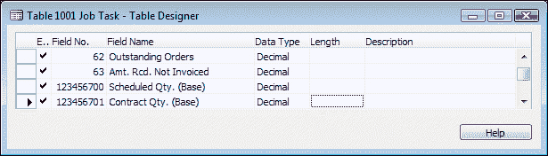

流场定义非常特殊。

```cs
Sum("Job Planning Line"."Quantity (Base)" 
  WHERE (Job No. = FIELD(Job No.),
         Job Task No. = FIELD(Job Task No.),
 Job Task No. = FIELD(FILTER(Totaling)),
         Contract Line = CONST(Yes),
         Planning Date = FIELD(Planning Date Filter)))
```

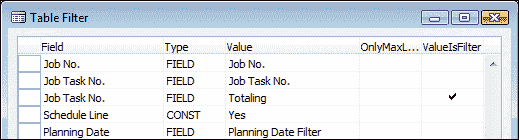

**总计**字段用于 **End-Total** 类型的行。`ValueIsFilter` 属性确保该字段将被解释为过滤器而不是值。

结果在作业任务页面（1002）中可见。

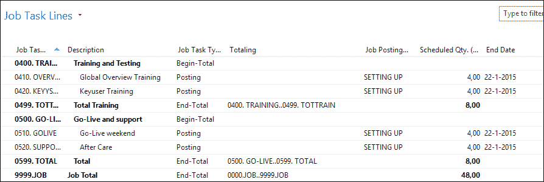

ValueIsFilter 属性的结果

## 资源组

对于调度，我们在 **Job Planning Lines** 以及 **Calculations** 中实现了使用资源组的可能性。这是通过添加两个新字段，**Add-on Type** 和 **Add-on No.** 来实现的：

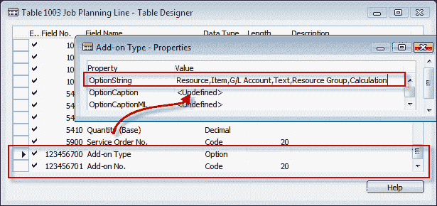

这些字段替换了页面上的标准 **Type** 和 **No**. 字段，使用户可以选择这些新选项。新字段的标题与替换字段相匹配。

```cs
Add-on No. - OnValidate()
CASE "Add-on Type" OF
  "Add-on Type"::Resource, "Add-on Type"::Item, "Add-on Type"::"G/L Account", "Add-on Type"::Text:
    BEGIN
      VALIDATE(Type, "Add-on Type");
      VALIDATE("No.", "Add-on No.");
    END;
  "Add-on Type"::"Resource Group":
    BEGIN
      TESTFIELD("Line Type", "Line Type"::Schedule);
      VALIDATE(Type, Type::Text);
      VALIDATE("No.", '');
      ResGroup.GET("Add-on No.");
      Description := ResGroup.Name;
      "Resource Group No." := ResGroup."No.";
      GetJob;
      ResCost.SETRANGE(Type, 
        ResPrice.Type::"Group(Resource)");
      ResCost.SETRANGE(Code, ResGroup."No.");
      IF ResCost.FINDFIRST THEN BEGIN
        "Unit Cost" := ROUND(
            CurrExchRate.ExchangeAmtLCYToFCY(
              "Currency Date","Currency Code",
              ResCost."Unit Cost","Currency Factor"),
            UnitAmountRoundingPrecision);
```

在 C/AL 代码中，我们可以确保当用户选择标准产品中可用的值时，执行正常代码。如果用户选择资源组，我们执行自己的业务逻辑。

为了确保一切按预期工作，我们在后台使用 `Text` 类型。`Line Type` 设置为 `Schedule`，因为我们不希望对资源组进行开票，我们只想进行预算。

`Unit Cost` 和 `Unit Price` 是使用支持资源组使用的资源成本和资源价格表计算的，这是从版本 5.0 之前的作业功能继承而来的。

作业计划列表页面（1007）已更改，以显示我们的附加字段而不是正常字段。

要完全完成这个功能，我们还需要更改显示作业计划行和创建作业日记行时创建作业计划行的 C/AL 代码。这在本章的示例代码中没有完成。

## 计算

一些使用作业功能的公司需要灵活的计算。在我们的示例中，我们用它来计算计算机系统的价格，但其他示例还有书籍出版商或建筑公司。

他们想知道在不确切知道使用了哪些螺丝、铰链或刨花板颜色的情况下，创建一个产品的成本是多少。对于这些公司，我们设计了一个简单但有效的计算模块。

在我们的数据库中，有两个示例计算：服务器和台式系统。

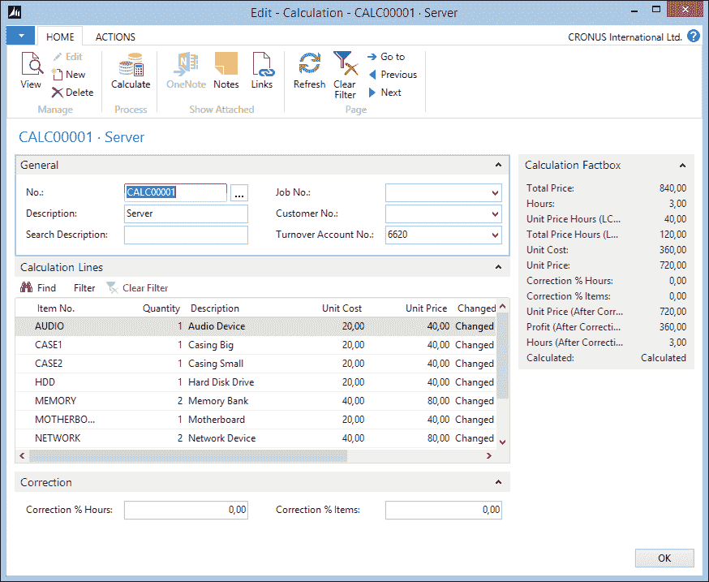

计算是通过使用编号系列和行号进行标题/行构建设计的。计算行是项目。

当创建一个新的计算时，一些行会自动插入。这是在 `OnInsert` 触发器中调用的 C/AL 函数中完成的。

`OnInsert` 触发器还将从我们的设置表中复制 `Hours` 的默认 `Unit Price`。

```cs
OnInsert()
CalcSetup.GET;

IF "No." = '' THEN BEGIN
  CalcSetup.TESTFIELD("Calculation Nos.");
  NoSeriesMgt.InitSeries(CalcSetup."Calculation Nos.",xRec."No. Series",0D,"No.","No. Series");
END;

"Unit Price Hours (LCY)" := CalcSetup."Unit Price Hours";
InitLines;
```

`InitLines` 函数为每个标记为 **Calculation Item** 的项目创建一个计算行。这是一个我们添加到项目表中的新字段：

```cs
InitLines()
CalcLn.RESET;

i := 0;
Item.SETRANGE("Calculation Item", TRUE);
IF Item.FINDSET THEN REPEAT
  i += 10000;
  CalcLn."Calculation No." := "No.";
  CalcLn."Line No." := i;
  CalcLn.VALIDATE("Item No.", Item."No.");
  CalcLn.INSERT;
UNTIL Item.NEXT = 0;
```

在计算中，我们可以选择从每个项目使用多少，系统将计算成本和价格，同时也会计算所需的`工时`数量。`单位成本`和`单位价格`来自项目表。`工时`是从一个新字段计算得出的，我们在项目表中也添加了`分钟`。

```cs
Calculate()
CalcLn.RESET;
CalcLn.SETRANGE("Calculation No.","No.");
CalcLn.CALCSUMS("Unit Cost", "Unit Price", Profit, Hours);
CalcLn.FIND('-');
CalcLn.MODIFYALL(Changed,Calculated::Calculated);

CalcLn.CALCSUMS("Unit Cost", "Unit Price", Hours);

"Unit Cost" := CalcLn."Unit Cost";
"Unit Price" := CalcLn."Unit Price";
Profit := "Unit Price" - "Unit Cost";
Hours := CalcLn.Hours;

Correct;
"Total Price Hours (LCY)" := "Hours (After Correction)" * "Unit Price Hours (LCY)";
"Total Price" := "Total Price Hours (LCY)" + 
  "Unit Price (After Correction)";
Calculated := Calculated::Calculated;
MODIFY;

Correct()
"Unit Price (After Correction)" := "Unit Price" + ("Unit Price" * ("Correction % Items" / 100));
"Profit (After Correction)" := 
  "Unit Price (After Correction)" - "Unit Cost";
"Hours (After Correction)" := 
  Hours + (Hours * ("Correction % Hours" / 100));
```

当我们现在使用`Calculate`函数时，系统将为要创建的此产品生成总`单位成本`、`单位价格`和`工时`。通过允许用户以百分比纠正工时和用量，系统增加了灵活性。

计算可以在与之前资源组相同的方式下用于职位计划行；唯一的区别是我们使用后台的 G/L 账户类型来开具固定价格的发票。让我们看看职位计划行中`Add-On No.`字段的`OnValidate`触发器中的 C/AL 代码：

```cs
Add-on No. - OnValidate()
CASE "Add-on Type" OF
  "Add-on Type"::Resource ... "Add-on Type"::Text:
      ...
  "Add-on Type"::"Resource Group":  
      ...
  "Add-on Type"::Calculation:
    BEGIN
      Calc.GET("Add-on No.");
      IF Calc."Turnover Account No." = '' THEN BEGIN
        TESTFIELD("Line Type", "Line Type"::Schedule);
        VALIDATE(Type, Type::Text);
        VALIDATE("No.", '');
      END ELSE BEGIN
        TESTFIELD("Line Type", 
          "Line Type"::"Both Schedule and Contract");
        VALIDATE(Type, Type::"G/L Account");
        VALIDATE("No.", Calc."Turnover Account No.");

      END;
      Description := Calc.Description;
      GetJob;
```

为了完成这个功能，我们将创建一个方法来使用计算中的工时进行资源规划。这可以通过使用没有单位成本和单位价格的计划类型的职位计划行来完成。

## 问题登记

对于我们的支持团队，我们已经实施了一个问题登记解决方案。这允许他们拥有一个简单的应用程序，他们可以在其中为所有客户登记问题，并跟踪状态，而无需进入和退出每个工作。

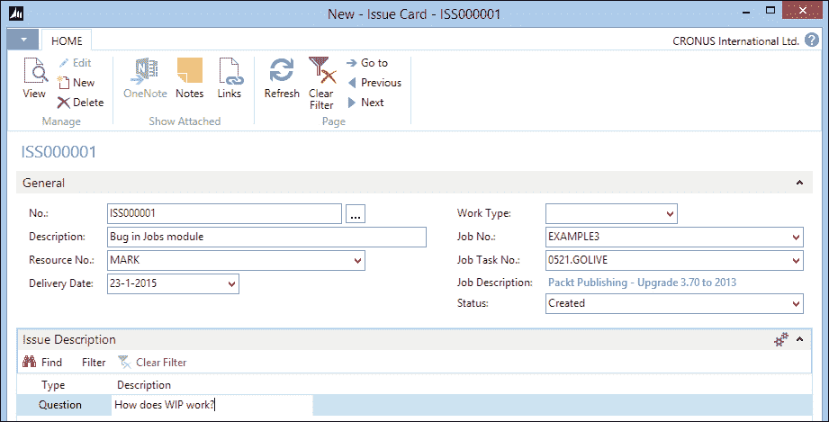

问题登记是一个带有数字序列和行号的标题/行构造。这些行可以用来表述问题和答案。

当支持工程师创建一个新的问题时，系统将自动创建职位任务。让我们看看执行此操作的 C/AL 代码：

```cs
CreateJobTask()
TESTFIELD("Job No.");
TESTFIELD("Job Task No.", '');

OldJobTask.SETRANGE("Job No.", "Job No.");
OldJobTask.SETRANGE("Job Task Type", 
  OldJobTask."Job Task Type"::Posting);
IF OldJobTask.ISEMPTY THEN
  OldJobTask.SETRANGE("Job Task Type",
    OldJobTask."Job Task Type"::"Begin-Total");
OldJobTask.FINDLAST;

JobTask."Job No." := "Job No.";
JobTask."Job Task No." := INCSTR(OldJobTask."Job Task No.");
JobTask.Description := Description;
JobTask."Job Task Type" := JobTask."Job Task Type"::Posting;
JobTask.INSERT(TRUE);
CODEUNIT.RUN(CODEUNIT::"Job Task-Indent Direct", JobTask);

"Job Task No." := JobTask."Job Task No.";
```

系统在职位中搜索最后一条类型的`Job Task`为`Posting`的任务。如果找不到，它将搜索最后的`Begin-Total`行。

假设这一行存在，我们使用`INCSTR`函数来增加数字，创建一个新的`Job Task`行。描述被复制到`Job Task`中。支持工程师现在可以在这个`Job Task`上登记他们的工时。

这段 C/AL 代码非常简单，但展示了即使不触及任何标准 Microsoft Dynamics NAV 对象，一个小型解决方案也能多么有效。这是一种非常安全的发展方式。

# 摘要

在本章中，我们学习了如何实现 Microsoft Dynamics NAV 的职位功能。我们还讨论了设置职位和职位任务的不同的策略。

我们以创造性的方式使用职位计划行创建了几个不同的发票方法示例。在为工作购买物品时，这些物品不用于成本计算，但在我们详细讨论的进行中工作计算中。

当一切按预期完成时，发票会自动生成。最后，我们在不改变标准应用程序的前提下，为工作模块设计了一些小改进。这是关于微软 Dynamics NAV 功能性的最后一章。我们已经讨论了应用程序的所有可能性以及如何在不冒风险或破坏任何东西的情况下进行更改。

在下一章中，我们将探讨微软 Dynamics NAV 如何与其他应用程序进行接口。
