# 第九章。接口

当 1995 年发布第一个 Windows 版本的 Microsoft Dynamics NAV 时，系统非常封闭。可以使用平面文本文件导入和导出数据，这基本上就是全部。这些平面文本文件被放在软盘上，通过邮政邮件发送。互联网和电子邮件刚刚兴起，大容量 U 盘还是一个梦想，而在这本书的前一个版本 2009 年发布时，OneDrive 和 Azure 正在被发明。

从那时起，世界发生了巨大的变化。互联网、电子邮件、SQL Server、.NET 和 Azure 改变了我们思考与应用程序接口的方式，我们仍在不断变化。今天，Microsoft Dynamics NAV 2013 拥有一个完全开放的数据库，支持广泛的接口可能性，我们将在本章中学习这些。

Navision 的 1.0 版本在 Windows 95 上运行，后来成为行业标准，超过十年，Windows 是唯一严肃的平台。今天，商业人士使用 iPad 和 Android 平板电脑。Microsoft Dynamics NAV 2013 是少数几个可以在所有设备上跨平台运行的 ERP 平台之一，甚至支持使用 Google 或 Facebook 凭证登录。

在本章中，我们首先将讨论可用的接口技术和标准产品中的接口。然后我们将讨论接口方法以及如何创建可靠的接口。

在本章结束时，我们将创建一些示例界面，并看看未来将如何进一步改进界面。

在阅读本章后，您将很好地理解产品默认支持哪些接口，应使用哪些接口技术，以及如何设计一个稳固的 B2B 接口。

# 界面类型

讨论接口时，我们通常从技术开始，但在那之前，需要回答一些其他基本问题，例如以下问题：

+   是否需要导入、导出或两者都要？

+   是手动启动还是自动启动？

+   接口是定时器驱动还是事件驱动？

让我们来讨论这些问题。

## 导入和导出

第一个问题是要不要只从 Microsoft Dynamics NAV 导出数据，还是它也会导入需要处理的数据到系统中。

在导入和导出过程中，数据处理可以通过终端用户手动启动，使用数据拉取或数据推送。界面也可以是事件驱动（实时）或定时器驱动（异步）。


### 手动

当接口是手动时，第一个应用程序有一个导出过程，另一个应用程序有一个导入过程。终端用户首先手动启动导出过程，然后在另一个应用程序中手动启动导入过程，通常将数据保存到平面文件中。这是一种经典的接口方法。

手动接口的一个例子是从 Microsoft Dynamics NAV 导出网上银行信息或将 XBRL 文件发送给您的会计师。

### 数据拉取

当使用数据拉取导出数据时，接口从外部应用程序启动。该应用程序将从数据库中读取数据并进行处理。

当使用数据拉取导入数据时，接口从应用程序启动，该应用程序从另一个应用程序读取并处理数据。

### 数据推送

如果接口使用数据推送，导出应用程序将数据写入其他数据源。当其他应用程序中的数据不需要进一步处理时，使用此方法。一个典型的例子是将 Microsoft Dynamics NAV 中的数据导出到 Microsoft Office 应用程序，如 Word 或 Excel。

## 事件驱动与定时器驱动

当数据推送或数据拉取与事件或定时器的使用结合时，不再需要最终用户干预。此时，接口将自动运行。

我们将在本章后面讨论接口方法时详细讨论这些方法。

# 接口技术

在 Microsoft Dynamics NAV 中，有广泛的方法用于接口。每种方法对某些类型的接口很有用，而对其他类型的接口则不太有用。我们将在 C/SIDE 开发平台中讨论所有可用的方法。

## 文件

平面文件和 XML 文件都受 Microsoft Dynamics NAV 支持。自 1995 年产品推出以来，平面文件一直可用，使用数据端口为经典客户端提供服务。

在版本 3.60 中引入了 XML 支持，作为数据端口的额外选项。版本 4.0 引入了 `XMLPort` 对象，用于替换导入和导出 XML 文件的端口。

目前在 Microsoft Dynamics NAV 2013 中，`XMLPort` 对象用于 XML 和平面文件。此外，C/AL 有一个 `FILE` 对象，可以用来直接访问文件，而无需使用 `XMLPort` 对象。

## 自动化控制

在 Microsoft Dynamics NAV 中，Microsoft COM 和 ActiveX 的实现被称为自动化控制。

自动化控制或 ActiveX 允许软件应用程序作为另一个应用程序的嵌入部分被重用。大多数 Microsoft 应用程序都支持以这种方式使用。例如，Microsoft Office、Windows 脚本宿主和 **ActiveX 数据对象** (**ADO**)。

Microsoft Dynamics NAV 支持自动化控制。消费自动化控制是通过暴露方法和属性的接口来完成的。

最常用且通用的接口是 iUnknown。这也是 Microsoft Dynamics NAV 支持的唯一自动化控制接口。如果自动化控制使用其他接口，应在 Visual Studio 中创建一个包装器，将接口转换为 iUnknown。当自动化控制需要通过表单控件嵌入时，也应创建包装器。

### 注意

关于 iUnknown 接口和 COM 技术的更多信息可以在 [`en.wikipedia.org/wiki/IUnknown`](http://en.wikipedia.org/wiki/IUnknown) 找到。

### 事件

大多数自动化控制允许数据推送。使用自动化控制的触发事件，当其他应用程序发生某些事件时，也可以在 Microsoft Dynamics NAV 中启动业务逻辑。

### 局限性

在 Microsoft Dynamics NAV 2013 中，自动化控制只能从客户端使用。在服务器端运行的任何代码都不能使用自动化控制对象。

## DotNet 互操作性

.NET 的支持被引入作为自动化控制的替代品。在 C/AL 编程语言中，可以直接使用大量 .NET 对象。它们可以在服务器端和客户端中使用。

在标准应用程序中，大多数自动化接口都被 .NET 接口所取代，例如 Excel 接口，我们将在本章后面讨论。

在 Microsoft Dynamics NAV 中使用 .NET 存在局限性，通常通过在 C# 中创建包装 DLL 对象来解决。Excel 接口也是这样的例子。

### 注意

在 C/AL 中学习 .NET 的一个好地方是[www.vjeko.com](http://www.vjeko.com)。局限性在[`vjeko.com/blog/top-10-things-i-miss-in-net-interoperability-in-nav-2013`](http://vjeko.com/blog/top-10-things-i-miss-in-net-interoperability-in-nav-2013)中讨论。

## 客户端可扩展性

使用页面对象，由于页面对象不提供所见即所得（WYSIWYG）功能或允许开发者确定控件位置，用户界面的允许创造性非常有限。每个客户端都决定如何渲染 UI，开发者无法控制。这可以通过客户端可扩展性来解决。这项技术允许使用 Visual Studio 和 .NET 提供的所有 UI 功能，然而，在开发跨平台应用时，应使用 JavaScript。

### 注意

请参考[`www.youtube.com/watch?v=WErBd1mlZFM`](https://www.youtube.com/watch?v=WErBd1mlZFM)了解如何开始使用 Microsoft Dynamics NAV 的 JavaScript 插件。

## Open Database Connectivity (ODBC)/ADO

**开放数据库连接**（**ODBC**）于 1992 年开发，旨在允许所有类型的数据库以统一的方式交换数据。ADO 是 ODBC 的继任者，于 1996 年开发。

Microsoft Dynamics NAV 的 ADO 和 ODBC 允许在应用程序数据库中读取和写入，以及读取和写入其他数据库。

### 注意

使用 ADO 和 ODBC 更高级的功能需要基本的 T-SQL 语句知识。有关 ADO 和 ODBC 之间的区别，请参阅[`www.differencebetween.com/difference-between-odbc-and-vs-ado/`](http://www.differencebetween.com/difference-between-odbc-and-vs-ado/)。

### 从 Microsoft Dynamics NAV 读取

要从数据库中读取数据，您只需在您使用的 Windows 机器上安装有效的 ODBC 驱动程序，并拥有登录到数据库的凭据。

让我们创建一个示例来展示如何使用 Excel 从 Microsoft Dynamics NAV 导入数据。

1.  打开 Microsoft Excel，选择**数据**，然后从**其他来源**中选择**从 SQL Server**，如图所示：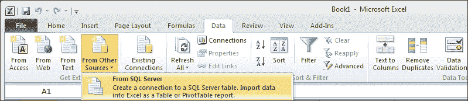

    从 SQL Server

1.  选择一个**服务器名称**和有效的**凭据**：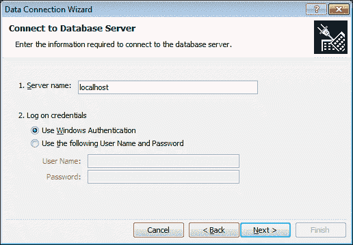

1.  选择一个数据库和您想要查看的表。在我们的示例中，我们将选择**客户**表。然后选择**完成**和**确定**。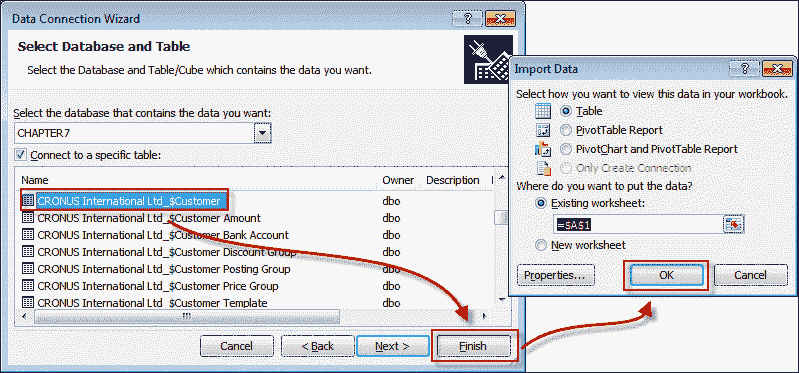

1.  现在我们已经将 Microsoft Dynamics NAV 数据导入 Excel 中。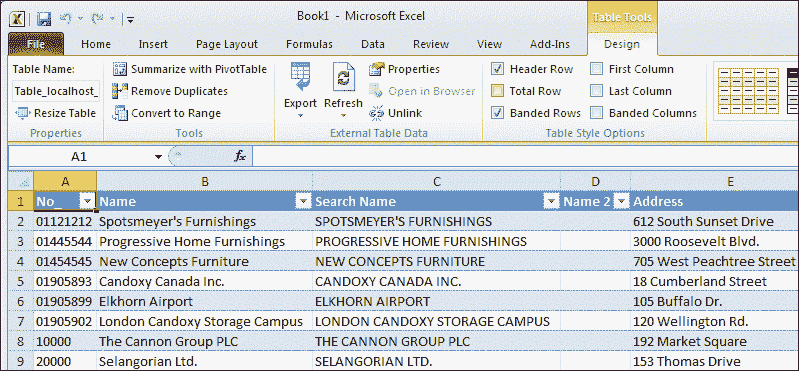

    ### 注意

    由于流字段不是 SQL Server 数据库中的实际字段，我们无法在 ODBC/ADO 中使用它们。

### 向 Microsoft Dynamics NAV 写入

建议不要使用 ODBC 直接将数据写入 Microsoft Dynamics NAV 数据库，因为这不符合最佳实践。原因在于此接口级别缺少业务逻辑。

当通过 ODBC 写入时，我们直接针对 SQL Server，而不允许 C/AL 业务逻辑验证我们创建的数据。C/AL 数据通常确保我们开发业务规则的数据完整性。使用 C/ODBC 驱动程序对本地数据库也是如此。

### 注意

为了解决这个问题，数据可以保存在一个特殊的接口缓冲表，并通过应用程序服务器或从用户界面启动的 C/AL 事务进行处理。

### 与其他数据库通信

要使用 ODBC 从 Microsoft Dynamics NAV 读取和写入其他数据库中的数据，建议使用**ActiveX 数据对象**（**ADO**）。ADO 是 Microsoft 技术，允许使用 ActiveX 接口通过 ODBC 进行连接。使用 ADO 允许我们读取和写入另一端的数据库。

我们甚至可以使用 ADO 连接到 Microsoft Dynamics NAV SQL Server 数据库，并从 C/AL 代码中运行 SQL 语句。

### 注意

我们将在本章的接口方法部分使用 ADO。

## SQL Server 接口

由于 Microsoft Dynamics NAV 运行在 SQL Server 数据库之上，我们可以使用 SQL Server 中所有可用的技术来获取数据。这提供了超出本书范围的大量选项，但让我们简要讨论其中的一些：

+   **链接服务器**：在 SQL Server 中，可以设置链接服务器。这允许我们将查询发送到其他数据库，如其他 SQL Server、MS Access 或 Oracle，并基于这些数据创建视图。

+   **视图**：SQL Server 中的视图是一个具有固定结果集的保存查询，可以将其视为一个表。在 C/Side 中，我们可以使用视图作为表的源数据，通过 Linked Object 属性创建页面或报告。

+   **SQL Server Integration Services**：这是 SQL Server 与其他数据库集成的首选组件，取代了 DTS 包。使用 SSIS 需要具备良好的 SQL Server 和 Microsoft Dynamics NAV 的知识和技能。

+   **报表服务**：这是一个基于服务器的报表平台，可以与 SharePoint 集成，允许用户根据 T-SQL 查询设计 RDL 报表。

+   **分析服务**：这是微软对其客户 OLAP、BI 和数据挖掘需求的回应。

    ### 小贴士

    另一个我们可以使用的 SQL Server 组件是 SQL Server Agent。该组件允许我们安排直接在数据库上运行的接口任务。

## Microsoft 消息队列

**Microsoft 消息队列** (**MSMQ**) 允许应用程序集成那些运行在不可靠连接上的异步应用程序。这种接口技术在需要从 Microsoft Dynamics NAV 获取信息并将信息发送回数据库的网站上非常受欢迎。

.NET 互操作性的引入使得在 Microsoft Dynamics NAV 中使用 MSMQ 变得更加容易。使用 `System.Messaging.MessageQueue` 只需要几行 C/AL 代码就可以在队列上发布消息。

### 应用程序服务器

MSMQ 总是与使用应用程序服务器结合使用，以处理网站发送回的请求。

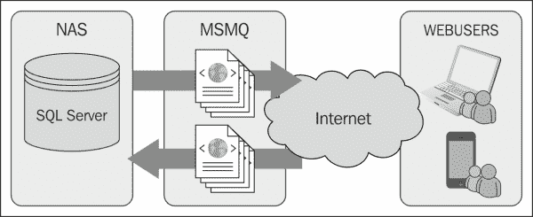

Web 用户可以是使用 Web 解决方案进行工时登记的员工、PDA 或使用 Web 商店的客户。

### 注意

在 [`mibuso.com/blogs/ara3n/2011/01/10/using-ado-on-rtc-in-nav/`](http://mibuso.com/blogs/ara3n/2011/01/10/using-ado-on-rtc-in-nav/) 的这篇博客文章中解释了如何使用 .NET 开始使用 MSMQ。

## Web 服务

当涉及到实时接口时，Web 服务是首选的技术。Web 服务允许您使用来自其他应用程序的应用程序功能库。

Microsoft Dynamics NAV 2013 允许您使用 SOAP 和 OData 协议将所有 C/AL 代码暴露为 Web 服务。

消费 Web 服务比暴露 Web 服务要困难得多。没有标准框架来做这件事。最常用的两种解决方案是使用 XMLDOM .NET 互操作对象进行消费，或者使用 Visual Studio `.dll` 中的服务引用将 Web 服务包装起来。

### 暴露 NAV Web 服务

在 Microsoft Dynamics NAV 2013 中，每个 `页面` 对象和大多数代码单元都可以暴露为 Web 服务。这可以通过使用 **Web 服务表 (2000000076)** 来实现。

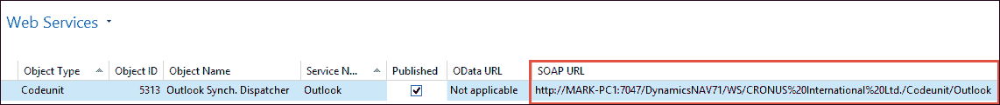

要发布 Web 服务，选择对象类型和对象 ID，找到一个唯一的服务名称。然后选择 **已发布** 复选框。

当发布 Web 服务时，URL 会显示出来，这使得查找它变得更加容易。

### 消费 Microsoft Dynamics NAV Web 服务

要消费 Web 服务，生成一个地址，`http://<Server>:<WebServicePort>/<ServerInstance>/WS/<CompanyName>/`，这个地址从其他应用程序中调用。

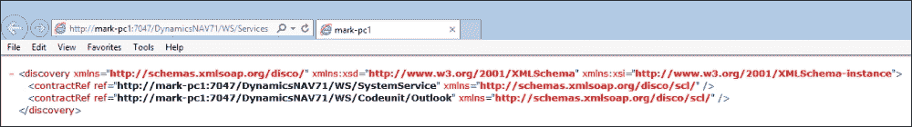

### 注意

`SystemService` Web 服务始终可用，并返回可用公司名称的列表。

# 标准应用程序接口

我们讨论了 Microsoft Dynamics NAV 所有可用的界面技术。让我们看看这些是如何在标准产品中实现的。

在这本书中，我们不会深入探讨每个界面，因为这几乎需要另一本书。我们只会简要讨论在标准应用程序中找到所有讨论的技术的地方，并指出可以找到白皮书或网站的地方。

平文件的一个例子是导出联系人。Microsoft Dynamics NAV 允许我们使用**XMLPort**导出我们的联系人。

此功能的**XMLPort**编号为（5050），使用格式变量文本。其他选项有**Xml**和**Fixed Text**，如以下截图所示：


**XMLPorts**具有类似于页面的节点结构。**XMLPort**以整数表作为第一个数据类型开始，后面跟着**联系人表**字段。

### 注意

更多关于编程**XMLPorts**的信息可以在*Programming Dynamics NAV 2013*，*David A. Studebaker*，*Christopher D. Studebaker*，*Packt Publishing*中找到。

## Office 集成

Microsoft Dynamics NAV 和 Microsoft Office 集成，以便与 Word、Excel 和 Outlook 一起使用。我们首先将讨论标准的 Word 和 Excel 集成，稍后讨论替代方案。最后，我们将简要讨论 Outlook 集成的可能性。

### Word 和 Excel 集成

在 Microsoft Dynamics NAV 中，每个表单或页面都可以导出到 Word 和 Excel。这项内置技术由用户界面自动提供，无需开发者付出任何努力。

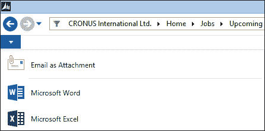

Excel 和 Word 的默认存在

#### 样式表工具

为了在布局上更加灵活，Microsoft 为 Microsoft Dynamics NAV 和 Word 发布了一个样式表工具。此工具允许用户轻松生成样式表。

### 注意

样式表工具版本 3.0 可以从[`www.mibuso.com/dlinfo.asp?FileID=1543`](http://www.mibuso.com/dlinfo.asp?FileID=1543)下载。

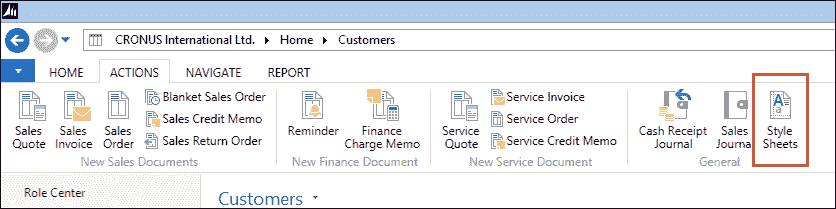

样式表工具提供的说明书对如何创建样式表有很好的描述。

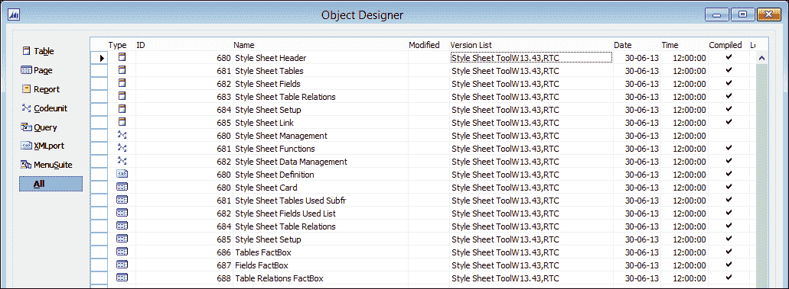

将操作添加到操作设计器（在适当的组下）并设置以下属性：

```cs
Expanded    Type    SubType    Name                Caption
0           Action             <Action680>         Style Sheets
```

`OnAction`触发器应包含以下行：

```cs
StyleSheetDataMgt.LoadStylesheetDataRTC(GETPOSITION,
  CURRENTKEY,PAGE::"<<PageName>>");
```

这里，`StyleSheetDataMgt`是类型为 codeunit，682（样式表数据管理）的变量。

### 注意

当这个操作在一个页面上完成时，可以轻松地复制并粘贴到其他页面上。确保你更改页面名称。

## 高级 Excel 集成

当需要将来自应用程序不同部分的信息导出到 Excel 进行合并时，使用样式表并不是理想的方法。

为了支持这一点，可以使用**Excel Buffer**表（370）。此表可以填充数据，然后使用简单的 C/AL 命令将其发送到 Excel。

这在应用程序的几个部分中使用，例如，导入和导出我们在 第三章 中讨论的预算，*财务管理*。

让我们创建一个示例代码单元，该代码单元使用 Excel 缓冲区表导出数据：

1.  创建一个新的代码单元，并定义一个类型为记录 Excel 缓冲区的全局变量。这需要一个临时变量。同时，定义其他变量，如以下截图所示：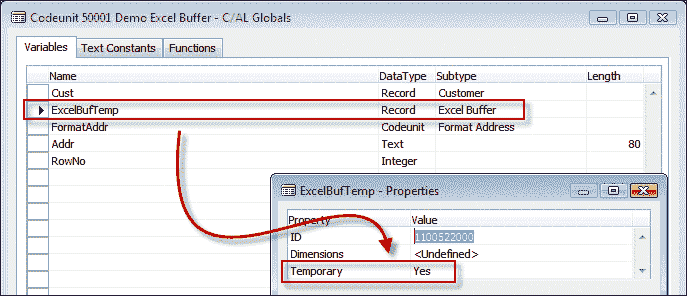

    ### 注意

    临时记录变量不存储在数据库中；它们存储在客户端内存中。这允许多个用户创建相同的记录而不会互相阻塞。由于所有处理都在没有网络和数据库的情况下完成，因此这也更快。

1.  创建一个新的 `EnterCell` 函数，参数如以下截图所示：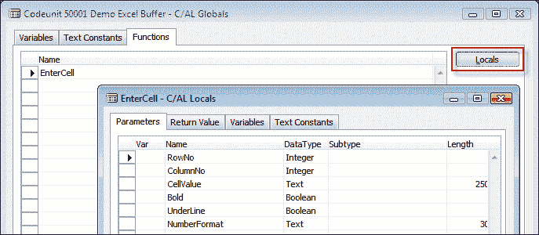

1.  放置将处理接口的 C/AL 代码：

    ```cs
    OnRun()
    ExcelBufTemp.CreateBook(Cust.TABLECAPTION);

    Cust.FIND('-');
    REPEAT
      RowNo := RowNo + 1;
      EnterCell(RowNo, 1, Cust."No.", FALSE, FALSE, '');

      FormAddr.Customer(Addr, Cust);
      EnterCell(RowNo, 2, Addr[1], FALSE, FALSE, '');
      EnterCell(RowNo, 3, Addr[2], FALSE, FALSE, '');
      EnterCell(RowNo, 4, Addr[3], FALSE, FALSE, '');
      EnterCell(RowNo, 5, Addr[4], FALSE, FALSE, '');
      EnterCell(RowNo, 6, Addr[5], FALSE, FALSE, '');
      EnterCell(RowNo, 7, Addr[6], FALSE, FALSE, '');
      EnterCell(RowNo, 8, Addr[7], FALSE, FALSE, '');
      EnterCell(RowNo, 9, Addr[8], FALSE, FALSE, '');

    UNTIL Cust.NEXT = 0;

    ExcelBufTemp.WriteSheet(Cust.TABLECAPTION,COMPANYNAME,USERID);
    ExcelBufTemp.CloseBook;
    ExcelBufTemp.OpenExcel;
    ExcelBufTemp.GiveUserControl;
    EnterCell()
    ExcelBufTemp.INIT;
    ExcelBufTemp.VALIDATE("Row No.",RowNo);
    ExcelBufTemp.VALIDATE("Column No.",ColumnNo);
    ExcelBufTemp."Cell Value as Text" := CellValue;
    ExcelBufTemp.Formula := '';
    ExcelBufTemp.Bold := Bold;
    ExcelBufTemp.Underline := UnderLine;
    ExcelBufTemp.NumberFormat := NumberFormat;
    ExcelBufTemp.INSERT;
    ```

此 C/AL 代码将浏览数据库中的客户，并使用地址格式（365）代码单元格式化地址。

**客户编号** 字段和结果数组 `Addr[]` 被保存在 Excel 缓冲区表中。最后，我们启动 C/AL 函数，根据数据生成 Excel 工作表。

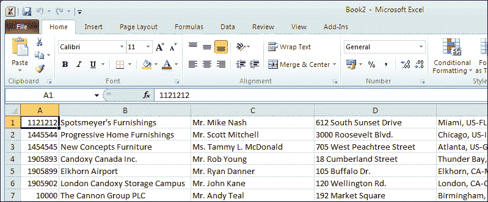

C/AL 函数结果

## Outlook 集成

Microsoft Dynamics NAV 2013 允许与 Microsoft Outlook 进行不同级别的接口：

1.  角色中心上的 Outlook 部分。

1.  使用 `ExtendedDatatype` 属性从页面发送电子邮件。

1.  使用邮件（397）或 SMTP 邮件（400）代码单元发送电子邮件。

1.  使用 Outlook 集成 Web 服务同步联系人和待办事项。

1.  使用 **电子邮件 - 记录** 功能从 Exchange 读取电子邮件。

1.  Microsoft Dynamics NAV 2013 R2 可以连接到 Office 365。

### Outlook 部分

在角色中心中，可以激活 Outlook 系统组件。这允许用户直接在角色中心查看他们的电子邮件、日程安排和任务。

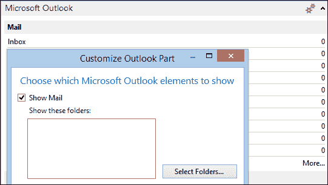

此功能是 Windows 客户端内置的，不能使用 C/AL 代码来更改。

### 扩展数据类型属性

当一个表中的 **文本** 字段使用 `ExtendedDatatype` 属性时，Windows 客户端将自动允许用户直接将电子邮件发送到字段中指定的地址。


这也是 Windows 客户端内置的功能，不能通过 C/AL 代码来影响。

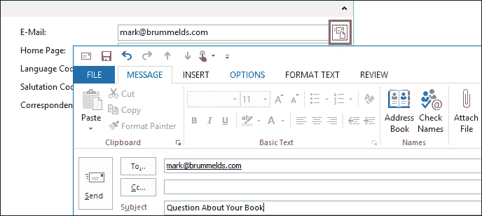

### 邮件和 SMTP 邮件代码单元

在引入 `ExtendedDatatype` 属性之前，Microsoft Dynamics NAV 的电子邮件是通过 Automation Control 包装器 DLL 发送到 Microsoft Outlook 的。这在代码单元 397 中处理，并且仍然可以直接从 C/AL 代码发送电子邮件。

代码单元 SMTP 邮件（400）允许我们直接发送电子邮件到 SMTP 服务器。

### Outlook 同步

Microsoft Outlook 可以用作 Microsoft Dynamics NAV 的离线客户端。当两个系统都可用连接时，每个表都可以同步到 Microsoft Outlook。使用 Outlook 的离线功能，用户可以在路上查看数据，甚至更改信息或创建新数据。

这是通过本章前面讨论的 Outlook 同步 Web 服务完成的。

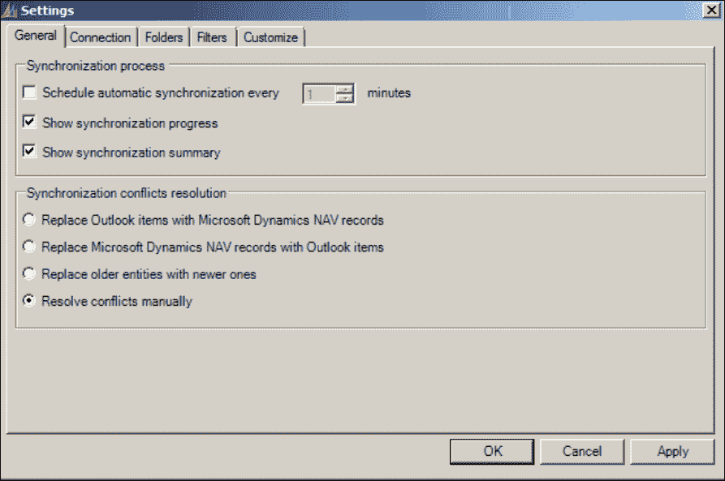

微软对这一功能进行了很好的文档记录。

### Exchange 集成

为了读取传入的电子邮件，Microsoft Dynamics NAV 提供了与 Exchange 公共文件夹的集成。这些邮箱中的信息可以在 Microsoft Dynamics NAV 中读取和使用。

接口处理是通过作业队列和应用服务器（NAS）完成的。

在我们之前在第四章关系管理中讨论的**营销设置**中，我们可以设置交换集成的参数。

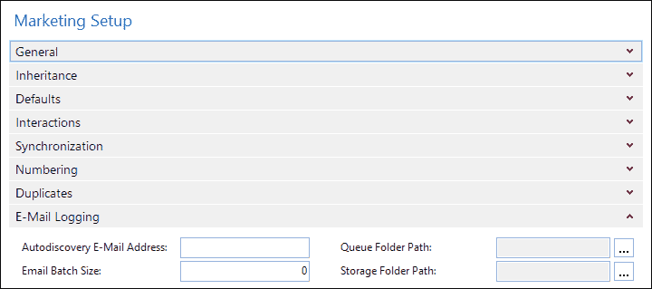

#### 交互日志条目

从 Microsoft Exchange 读取的每封电子邮件都显示在 Microsoft Dynamics NAV 中的交互日志条目中。

### Office 365

从版本 2013 R2 开始，Microsoft Dynamics NAV 可以集成到 Office 365 中。这是一个外观上的集成，这意味着从最终用户的角度来看，应用程序是相同的；然而，应用程序不共享数据。

Microsoft Dynamics NAV 可以配置为接受 Office 365 凭据，这使得用户只需登录一次就可以使用两个平台变得非常容易。

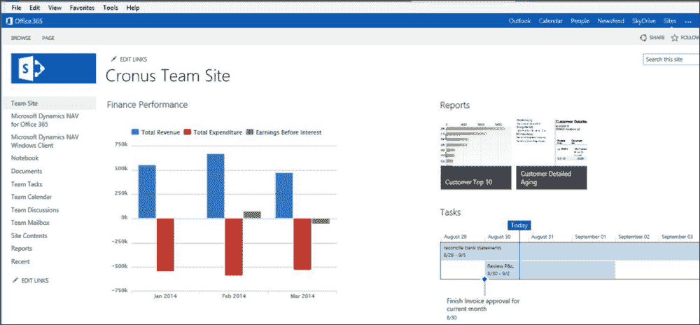

使用 Office 365 凭据登录

## SharePoint

Microsoft Dynamics NAV 2013 RTM 附带了一个特殊的 SharePoint 客户端。然而，由于在 R2 中直接停止了这项服务，我们不会讨论它。

在 Microsoft Dynamics NAV 2013 R2 中，Web 客户端符合 SharePoint 规范。要结合使用 SharePoint 和 Microsoft Dynamics NAV 2013 R2，可以添加连接到 Web 客户端的 Web 部件。

可以连接到 SharePoint 的本地版本和 SharePoint Online。

## 客户端插件

Microsoft Dynamics NAV 2013 附带一个用于 Microsoft Connect 的客户端插件。使用 Connect 控件的一个示例页面对象是 Connect (9175)。

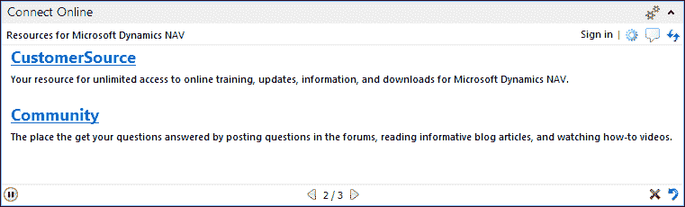

让我们看看这是如何完成的。

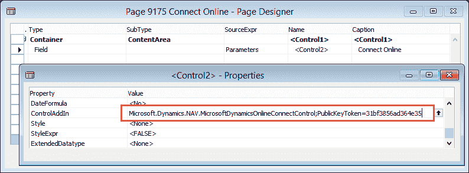

此页面的页面类型是**CardPart**，它没有源表。页面上唯一的控件是**参数**，这是一个返回 Text (350)类型值的函数。

`ControlAddIn`属性指向在启动此页面时将使用的插件。此插件将替换页面上的原始控件。

在`Parameters`函数中，创建了一个字符串，将信息输入到连接插件中，使其能够显示对当前角色有趣的信息。这是通过组合其他 C/AL 函数来完成的：

```cs
Parameters()
InitCurrentRoleValues;

EXIT(Add(Version) + Add(Locale) + Add(Role) + Add(RoleID) + 
  Add(Serial));

Add()
EXIT(Parameter + Separator);

Version()
EXIT('version=' + FORMAT(ApplicationManagement.ApplicationVersion + ':' + 
  ApplicationManagement.ApplicationBuild,0,XMLFormat));

Locale()
// Windows Language ID
EXIT('locale=' + FORMAT(CurrentLanguageID,0,XMLFormat));

Role()
// Profile ID (Any text entered in Profile ID)
EXIT('role=' + FORMAT(DELCHR(CurrentRole,'=',Separator),0,
  XMLFormat));

RoleID()
// Role Center ID (Page ID)
EXIT('roleid=' + FORMAT(CurrentRoleID,0,XMLFormat));

Serial()
// License ID
EXIT('serial=' + FORMAT(SERIALNUMBER,0,XMLFormat));

Separator()
EXIT(';');

XMLFormat()
EXIT(9);

InitCurrentRoleValues()
CurrentLanguageID := GLOBALLANGUAGE;
CurrentRoleID := ApplicationManagement.DefaultRoleCenter;
CurrentRole := FORMAT(CurrentRoleID);
...
```

在 第七章 中的 *存储和物流*，客户端扩展性和 Bing Maps 用于在地图上显示路线的停靠点。

可用的库存储在客户端插件表中（2000000069）。

# 接口方法

因此，我们现在已经讨论了 Microsoft Dynamics NAV 中的接口类型、接口技术和内置接口。

让我们设计和开发一个新的企业对企业接口。我们将使用 第七章 中的对象，*存储和物流*，来创建接口。

## 场景

我们的一位客户现在希望通过电子邮件发送发货，而不是通过传真。电子邮件将包含一个预定义格式的 Excel 文件。

## 设计

让我们回顾一下在 第七章 中的解决方案物流部分所设计的数据库模型，*存储和物流*。

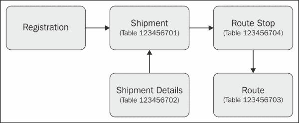

该过程从注册表开始。从一个注册项中，我们生成发货，发货被组合成一个带有停靠点的路线。

因此，我们需要将数据从 Excel 表格移动到注册表中。

### 映射

当客户向我们提供一个包含信息的 Excel 表格时，他们很少会使用与我们的表格完全相同的字段。因此，我们需要创建一个映射。Excel 表格中的每个字段都需要映射到一个字段，并且需要识别和讨论缺失的字段。

我们从客户那里得到的 Excel 表格看起来像这样：

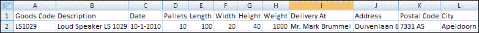

让我们尝试将此信息映射到我们的物流注册工作表表中，如下所示：

| 字段编号 | 字段名称 | 数据类型 | 长度 | 映射字段 |
| --- | --- | --- | --- | --- |
| 1 | 注册批次 | 代码 | 10 | - |
| 2 | 行号 | 整数 |   | - |
| 6 | 发货日期 | 日期 |   | 日期 |
| 8 | 产品编号 | 代码 | 20 | 商品代码 |
| 10 | 描述 | 文本 | 50 | 描述 |
| 12 | 单位 | 文本 | 10 | - |
| 16 | 数量 | 小数 |   | 托盘数 |
| 20 | 长度 | 小数 |   | 长度 |
| 21 | 宽度 | 小数 |   | 宽度 |
| 22 | 高度 | 小数 |   | 高度 |
| 31 | 总重量 | 小数 |   | - |
| 32 | 净重 | 小数 |   | 重量 |
| 36 | 每包裹单位数 | 小数 |   | - |
| 37 | 单位体积 | 小数 |   | - |
| 53 | 目的地名称 | 文本 | 50 | 交货地点 |
| 55 | 目的地地址 | 文本 | 50 | 地址 |
| 57 | 目的地市 | 文本 | 30 | 城市 |
| 58 | 目的地联系人 | 文本 | 50 | - |
| 59 | 目的地邮政编码 | 代码 | 20 | 邮政编码 |
| 60 | 目的地县 | 文本 | 30 | - |
| 61 | 目的地国家/地区代码 | 代码 | 10 | - |

Excel 表格中的大多数字段都可以映射到我们表中的一个字段。

### 空缺

在 NAV 中需要的某些字段没有由 Excel 表格填充。对于某些字段来说，这是可以接受的，例如，**注册批次**和**行号**字段由导入决定。

一些其他字段更难。**计量单位**、**毛重**、**每包裹单位数**和**单位体积**在 Excel 表中留空，但它们都在 NAV 中需要。

对于这些字段，我们需要与客户达成一致。他们需要指定这些字段，或者告诉我们它们是否有默认值。让我们看看我们的差距并填补它们：

+   **计量单位**：对于这个客户来说，始终是“托盘”

+   **体积**：这可以通过`长度 x 宽度 x 高度`来计算

+   **毛重**：我们同意这等于净重

+   **每包裹单位数**：这始终是 1

### 如果它不起作用怎么办

将外部数据读取到数据库中只是创建可靠界面的一个步骤。

但如果客户联系我们并说，“我们发送了包含 10 行的文件，而装运文件显示 9 行”。当我们检查我们的数据库时，装运确实显示了 9 行，但没有办法检查我们是否导入了原始的 10 行。在这个阶段，导入的登记行被删除，并生成了装运。

如果发生这种情况，我们需要可追溯性。在设计良好的界面中，我们应该始终创建一个与导入数据完全匹配的表。这允许我们首先检查是否一切匹配。

从这个表中的数据可以进行处理，但不应该从数据库中删除，并定期清理。这允许我们检查是否有错误发生。

我们将在一个更高级的示例中演示这一点。

## 场景

我们存储和物流附加功能的实现需要一个与射频应用实时接口。射频扫描仪用于拣选过程。射频应用使用自己的数据库系统，其中包含我们应该填充和之后读取的表。

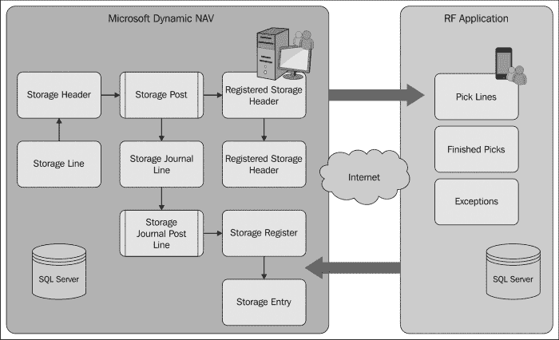

射频应用有三个表。我们的界面需要将数据导出到**拣选行**表，并且需要从剩下的两个表导入数据，**已完成拣选**和**异常**。

### 界面类型

这是一个导入导出界面，将使用拣选行的数据推送和已完成拣选及异常的数据拉取。界面将由定时器驱动。每分钟我们将轮询新数据。

### 界面技术

对于这个界面，我们将使用本章讨论的多种技术的组合。主要技术是 DotNet 互操作性。

#### 活动数据对象

拣选数据库在 SQL Server 上运行，因此我们将使用 ADO 连接到数据库并发送 T-SQL 语句来读取和写入数据。

### 日志记录

在这个界面中，我们将启用两种类型的日志记录。第一种日志将是在 Microsoft Dynamics NAV 中复制 RF 表并用作缓冲区。第二种日志将维护一个记录，我们将保存我们生成的所有 T-SQL 语句的副本。这将使我们能够在出现问题时查看我们生成了什么。

### 设计模式

让我们看看我们将为这个项目开发接口的设计：

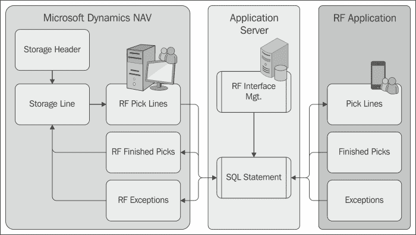

接口将由一个 **应用服务器** 控制。每分钟它将执行一个代码单元，检查是否有新的 **存储行** 需要导出。这些行将首先移动到 **RF 拣选行** 缓冲表，然后使用 ADO 和 T-SQL 移动到 RF 数据库。来自 RF 数据库的 **新完成的拣选** 和 **异常** 将使用相同的技术移动到 Microsoft Dynamics NAV，然后可以进行处理。

### 解决方案

为了运行接口，我们创建了三个代码单元和一个表。SQL 语句表用于记录每个接口会话。

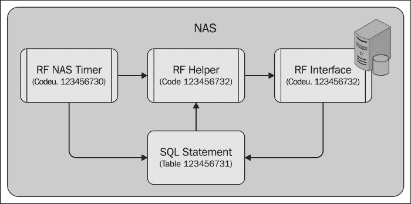

**RF NAS 定时器 (123.456.730)** 代码单元是从代码单元 `ApplicationManagement` 中的 `NASHandler` 函数启动的。它使用一个无限循环。

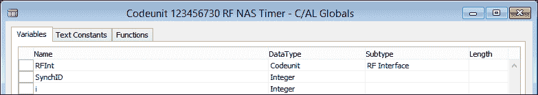

让我们看看实现这一功能的所需 C/AL 代码：

```cs
OnRun()

RFInt.CreateConnectionString;
RFLoop(600000);

RFLoop(MilisecondsBetweenPolls : Integer)
WHILE TRUE DO BEGIN
  IF NOT CODEUNIT.RUN(CODEUNIT::"RF Helper") THEN
    ParseError;
  COMMIT;
  MaxMilisecondsSleep := 10000;
  FOR Count := 1 TO MilisecondsBetweenPolls DIV MaxMilisecondsSleep DO
    SLEEP(MaxMilisecondsSleep);
  SLEEP(MilisecondsBetweenPolls MOD MaxMilisecondsSleep);
END;

ParseError()
SELECTLATESTVERSION;
RFIntSetup.GET;
SynchID := RFIntSetup."Synchronization ID";

SQLStat.INIT;
SQLStat."SQL Statement 1" := 'ERROR : ' + GETLASTERRORTEXT;

SQLStat.Bold := TRUE;
SQLStat.SessionID := SynchID;
SQLStat.Type := SQLStat.Type::Error;
SQLStat.INSERT(TRUE);
COMMIT;
```

`SLEEP` 函数被用来确保接口每分钟只运行一次。通过将 `SLEEP` 函数分解成更小的间隔，可以在 `SLEEP` 命令之间停止执行这个 C/AL 代码的 Windows 服务。

### 提示

`GETLASTERRORTEXT` 是一个 C/AL 函数，它返回系统生成的最后一个错误消息。它可以与 `IF CODEUNIT.RUN` 语法结合使用来捕获运行时错误。

RF 辅助器 (123.456.732) 代码单元是一个包装代码单元，用于错误捕获和保持可读性。

在接口的每次运行中，我们创建一个新的 SQL 语句 ID，我们可以根据它来追踪任何错误：

```cs
OnRun()
SELECTLATESTVERSION;
RFIntSetup.GET;
RFIntSetup."Synchronisation ID" := RFIntSetup."Synchronisation ID" + 1;
RFIntSetup.MODIFY;
SynchID := RFIntSetup."Synchronisation ID";

SQLStat.INIT;
SQLStat."SQL Statement 1" := 
  '-SYNCHRONISATION STARTED- ID = ' + FORMAT(SynchID) + ' -';
SQLStat.Bold := TRUE;
SQLStat.SessionID := SynchID;
SQLStat.Type := SQLStat.Type::StartStop;
SQLStat.INSERT(TRUE);

COMMIT;

CLEAR(RFInterface);
RFInterface.SetSynchID(SynchID);

StorageLn.LOCKTABLE;
IF StorageLn.FINDSET THEN REPEAT
  RFInterface.CreatePickLines(StorageLn);
UNTIL StorageLn.NEXT = 0;

COMMIT;

CLEAR(RFInterface);
RFInterface.SetSynchID(SynchID);
RFInterface.ReadFinishedPicks;

COMMIT;

CLEAR(RFInterface);
RFInterface.SetSynchID(SynchID);
RFInterface.ReadExceptions;

COMMIT;

SQLStat.INIT;
SQLStat."SQL Statement 1" := 
  '-SYNCHRONISATION STOPPED- ID = ' + FORMAT(SynchID) + ' -';
SQLStat.Bold := TRUE;
SQLStat.SessionID := SynchID;
SQLStat.Type := SQLStat.Type::StartStop;
SQLStat.INSERT(TRUE);

COMMIT;
```

然后触发三个接口函数以同步所需的三个表。

#### COMMIT

在执行每个命令后，我们执行 `COMMIT` 语句。这将确保数据库中所有内容都存储到那个点。这是必要的，因为我们所创建的 ADO 语句都在我们的事务之外。如果我们的接口运行回滚，它可能会同步已经同步的数据。

**RF 接口 (123.456.731)**。在这里，实际的 ADO 同步是在这个代码单元中完成的。这个代码单元是 `SingleInstance`。这将保持 ADO 连接在 NAS 会话期间保持活跃：

```cs
CreateConnectionString()
IF ConnActive THEN EXIT;

RFIntSetup.GET;
Database := RFIntSetup."Database Name";
Server := RFIntSetup."Server Name";

ConnString := 'Data Source=' + Server + ';' + 'Initial Catalog=' + Database + ';Trusted_Connection=True;';

SaveReadSQL('Connection ' + ConnString + ' opened on ' + FORMAT(CURRENTDATETIME),TRUE,0,0,0, '');

SQLCon := SQLCon.SqlConnection(ConnString);

SQLCon.Open;
ConnActive := TRUE;

CloseConnectionString()
SQLCon.Close;

SaveReadSQL('Connection closed on ' + FORMAT(CURRENTDATETIME),TRUE,0,0,1, '');

CLEAR(SQLReader);
CLEAR(SQLCommand);
CLEAR(SQLCon);
ConnActive := FALSE;
```

对于接口，我们使用了三个 DotNet 变量。

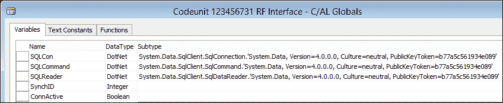

让我们更详细地看看三个 DotNet 变量：

+   `SQLConnection`: 这用于与数据库建立连接并执行 T-SQL 语句

+   `SQLCommand`: 可以使用这个来读取 `SELECT` 语句的结果集

+   `SQLReader`: 读取器用于读取数据，并在 ADO 和 C/Side 之间转换数据类型

#### 写入数据

RF 应用需要从存储行表中获取数据。我们首先创建了一个映射到 RF 应用的映射，就像我们在本章前面使用 Excel 接口所做的那样。

这个映射被保存在一个缓冲表中以供追踪：

```cs
CreatePickLines()
CreateConnectionString;

SaveReadSQL('CreatePickLines',TRUE, 1, 8388608, 3, '');

PickID := COPYSTR(StorageLn."Document No." + FORMAT(StorageLn."Line No."), 1, 20);

SaveReadSQL('Pick Document : '+PickID,TRUE,3,16711680,7,'');

WITH RFPickLines DO BEGIN
  "Pick Code" := PickID;
  Quantity := StorageLn.Quantity;
  "Terminal ID" := 1;
  "Display 1" := StorageLn.Description;
  "Display 2" := 'Warehouse ' + StorageLn."Warehouse Code";
  "Display 3" := 'Region ' + StorageLn."Region Code";
  "Display 4" := 'Shelf ' + StorageLn."Shelf No.";
  INSERT;
  SQLStatement := 'INSERT INTO [RF Pick Lines]' +
                  '([Pick Code],'+
                   '[Quantity],'+
                   '[Terminal ID],'+
                   '[Display 1],'+
                   '[Display 2],'+
                   '[Display 3],'+
                   '[Display 4])'+
                   'VALUES('+
                   Quote + PickID + Quote      +','+
                   FORMAT(Quantity)            +','+
                   '1'                         +','+
                   Quote + "Display 1" + Quote +','+
                   Quote + "Display 2" + Quote +','+
                   Quote + "Display 3" + Quote +','+
                   Quote + "Display 4" + Quote + ')';
END;

ExecuteSQL(SQLStatement);

StorageLn.Exported := CURRENTDATETIME;
StorageLn.MODIFY;
```

实际数据是通过 `INSERT` 命令移动到 RF 数据库的。

### 注意

为了避免两次导出相同的数据，我们需要跟踪我们导出了什么。最简单的方法是创建一个名为 Exported 的新字段。将此字段设置为 DateTime 也使得应用程序的可追溯性成为可能。

#### 读取数据

当从射频数据库读取数据时，我们也会为数据发送一个 T-SQL SELECT 查询。我们使用 `SQLReader.Read` 来浏览结果集中的记录。

对于结果集中的每条记录，我们在缓冲表中创建一条记录，然后我们可以使用它来更新存储行中的信息。

当读取数据时，我们不希望两次导入相同的数据。为了避免这种情况，我们需要在表中存储一个唯一标识符，这样我们就可以记住上次运行时我们停在了哪里：

```cs
ReadFinishedPicks()
CreateConnectionString;

SaveReadSQL('ReadFinishedPicks',TRUE, 1, 8388608, 3, '');

RFIntSetup.GET;
LastSync := RFIntSetup."Last Finished Pick";

SQLCommand := SQLCon.CreateCommand();
SQLCommand.CommandText := SaveReadSQL('SELECT ' +
              '[Reference Entry No],' +
              '[Terminal ID],' +
              '[Duration],' +
              '[Ready Date Time]' +
    ' FROM [RF Finished Pick] WHERE [Reference Entry No] > ' + 
      LastSync,FALSE,2,0,2, ''));

WHILE SQLReader.Read() DO BEGIN
  RFFinishedPick.INIT;
  RFFinishedPick."Reference Entry No." := 
    ReadInteger('Reference Entry No');
  RFFinishedPick."Terminal ID" := ReadInteger('Terminal ID');
  RFFinishedPick.Duration := ReadInteger('Duration');
  RFFinishedPick."Ready Date Time" := 
    ReadDateTime('Ready Date Time');
  RFFinishedPick.INSERT;
END;

RFIntSetup."Last Finished Pick" := Quote + FORMAT(RFFinishedPick."Reference Entry No.") + Quote;
RFIntSetup.MODIFY;

AdoRecordSet.Close;
```

在我们的示例中，这个唯一标识符是 `参考条目号`。

#### 记录，记录，再记录

尽管大部分日志记录是通过缓冲表完成的，但我们还希望存储每次接口运行时的一般过程。这是通过 SQL 语句表来完成的。SQL 语句以及其他事件都存储在那里。

通过使用 `COMMIT` 功能，我们可以通过查看此表中的最后一条记录来确切地看到它停止的位置。我们可以解决导致接口停止的问题，并重新启动接口而不会丢失数据。

### 注意

除非有非常好的理由，否则永远不要使用 `COMMIT` 语句。C/SIDE 通常会为您处理事务，当事情出错时可以完全回滚。在正常的 C/SIDE 事务中创建 `COMMIT` 语句将阻止 C/SIDE 回滚。

### 测试

让我们测试我们刚刚设计和开发的接口。为了做到这一点，我们需要在存储行表中记录，RF 数据库需要存在于某个地方。

#### RF 数据库

要测试我们为该解决方案创建的对象，RF 数据库应该存在于您的系统上。此数据库可以使用 T-SQL 脚本创建，并且应在 Microsoft SQL Server 机器上执行。

### 注意

RF `database.sql` 脚本是为此本书下载的对象文件的一部分。

在 SQL Server Management Studio 中打开脚本，然后单击 **执行**。

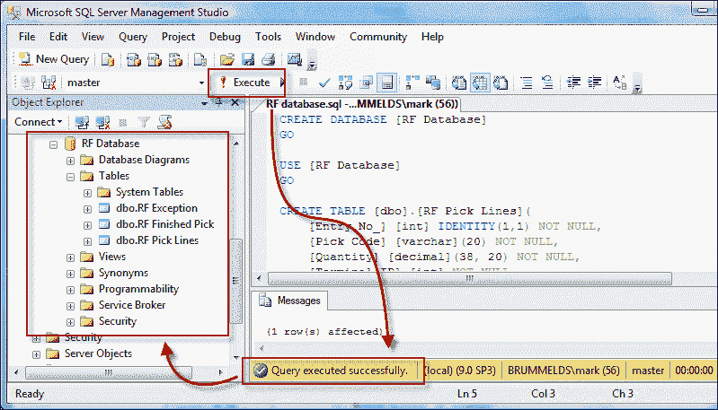

#### 测试

即使 C/AL 代码可以在 Windows 客户端运行，我们也会在经典客户端运行测试。这样做的原因是接口将在 NAS 上运行，它将以与经典客户端相同的方式执行 C/AL 代码。使用经典客户端的另一个原因是，这是 DBA 执行所有任务的接口。

要开始测试运行，从对象设计器打开页面 **RF 接口设置**（123.456.780）。

确保数据库和服务器是正确的。服务器应该是执行 SQL 脚本的 SQL Server 实例。

### 注意

ADO 连接使用 Windows 账户 NT `AUTHORITY\NETWORK SERVICE`和受信任连接。此用户应有权从 RF 数据库中插入和读取数据。

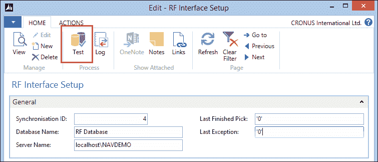

要开始测试运行，请点击**测试**按钮。

### 查看结果

如果一切顺利，结果应该会在日志和缓冲表以及 RF 数据库中显示。让我们检查一下所有这些。

#### SQL 语句

可以通过在**RF 接口设置**表单上点击**日志**按钮或从对象设计器打开**SQL 语句**（123.456.781）表单来打开 SQL 语句日志。

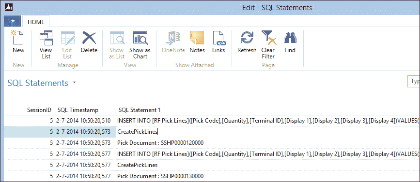

SQL 语句

表单上的信息显示接口在此运行期间所执行的操作。

#### 缓冲表

当我们从对象设计器打开缓冲表时，我们可以看到接口已将数据从存储行表移动到 RF 拣选行表。

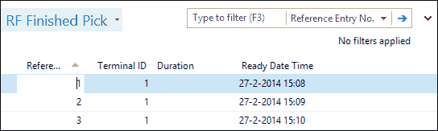

**RF 完成拣选**和**RF 异常**也填充了来自 RF 数据库的记录。

#### RF 数据库

最后要检查的是 RF 数据库中的数据。现在两个数据库中的数据应该完全相同。

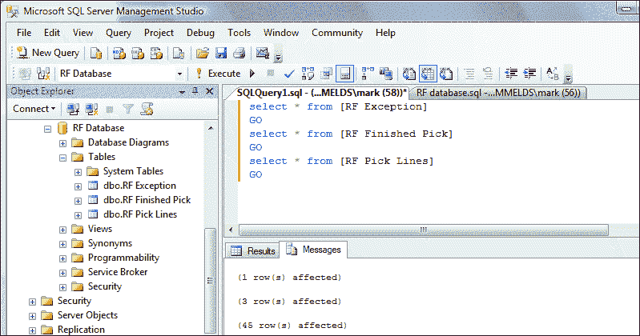

这可以从 SQL Server Management Studio 进行检查。

# 接口面向未来

随着技术的不断发展，接口将变得越来越重要。新技术和更快的互联网连接将使我们能够更好地集成我们的应用程序，但也将使最终用户更容易访问。

## 云支持的 Microsoft Dynamics NAV

随着版本 2013 R2 的发布，Microsoft Dynamics NAV 现在已支持云。这意味着该产品正式支持在 Microsoft Azure 平台上运行。

# 摘要

在本章中，我们探讨了 Microsoft Dynamics NAV 如何与其他应用程序接口。

我们讨论了接口的基础知识、导入与导出、数据拉取与数据推送。接口可以手动执行或由定时器或事件执行。

Microsoft Dynamics NAV 支持广泛的接口技术，如文件、自动化控制、.NET、ODBC、ADO 和 Web 服务。

也可能使用 SQL Server 技术进行集成。应用程序服务器（NAS）通常用于与其他系统接口，例如，使用 Microsoft **消息队列**或**活动数据对象**（**ADO**）。

产品附带的各种接口已被讨论，包括所有与 Microsoft Office、Exchange 和 SharePoint 的接口。

我们设计和开发了两个业务对业务接口；一个是从 Microsoft Excel 手动导入数据，另一个是使用 ADO 和定时器自动导入和导出数据到另一个数据库。

在设计接口时，可靠性和可追溯性是关键要素。在下一章中，我们将讨论应用程序设计方法和原则。
