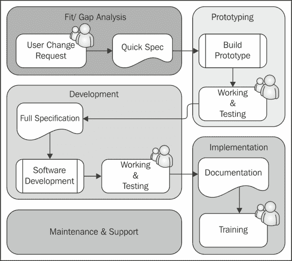

# 第十章 应用程序设计

在 Microsoft Dynamics NAV 中，技术和功能是相辅相成的。如果不了解标准组件如何组合在一起，就不可能设计出好的变更或增强应用程序。有了这些知识，我们现在可以开始设计自己的应用程序。

在这本书中，我们讨论了 Microsoft Dynamics NAV 的应用程序设计。我们讨论了设计模式、它是如何工作的以及为什么它会以这种方式工作。我们在详细示例和概念层面上对系统进行了几个小和大变更的设计。

对于这一章，我们将把我们在本书中学到的所有内容整合起来，转化为良好的应用程序设计概念。

我们还将讨论如何处理 Microsoft Dynamics NAV 实施项目以及如何维护应用程序。这需要根据项目包含的定制程度采取不同的方法。

# 应用程序生命周期

设计应用程序不仅仅是分析流程和开发新对象。这些阶段只是冰山一角。

一旦您的应用程序被设计和开发，很可能会有一家或多家公司开始使用它。当这种情况发生时，您的软件将开始其生命周期中的新阶段。让我们看看 Microsoft Dynamics NAV 应用程序的生命周期：


应用程序的**开发**阶段从**适合/差距**分析开始，然后是我们在前面章节中进行的**设计**和**构建**步骤。当这一切完成时，您的应用程序的**维护**阶段就开始了。

**维护**阶段从实施和将软件投入**生产**开始。第一次发生这种情况，将是贵公司中的 Microsoft Dynamics NAV 实施。一旦完成，您的系统将进入实际的生命周期，其中将对应用程序进行持续的改进。

由于 Microsoft Dynamics NAV 产品的灵活性，这是一个非常特别的程序，在这个过程中很容易遇到许多陷阱。

我们将讨论一些重要的指导原则。共有六个类别：设计以使用、维护、支持、升级、性能和分析。

## 设计以使用

设计软件不是一个目标，而是一种支持公司开展业务的方式。这使得可用性成为设计应用程序时最重要的关注领域之一。

当谈到可用性时，首先想到的是用户界面。Microsoft Dynamics NAV 2013 有两个常用的界面，即 Windows 客户端和新的 Web 客户端。

### 页面

页面对象用于定义用户界面。它们在显示方式上非常严格。然而，它们有很多优点。让我们看看一些设计选项：

+   **选项卡**：页面有可以同时打开的垂直选项卡，这使得将字段移动到第一个选项卡变得不那么理想。

+   **嵌入式列表**：页面的另一个优点是用户总是首先看到嵌入式列表页面，然后继续到卡片，选择记录后在新窗口控件中打开。

+   **重要性**：在页面上，可以将控件提升为在选项卡关闭时显示或作为附加控件，以便最终用户必须特别使它们可见。在设计应用程序时，请谨慎使用此功能。

+   **个性化**：如果没有限制，所有页面都可以由最终用户个性化，甚至卡片页面。这使得在为公司、部门或最终用户实施时定制页面变得更加容易。个性化不会改变对象定义，也不需要开发者。

让我们根据以下截图中的元素进行浏览，该截图来自第七章，“存储和物流”中的示例附加解决方案：


让我们更详细地看看字段：

+   **操作**：可以在页面上执行的所有交易都是操作。一些操作由系统生成，而其他操作由开发者定义。用户可以选择他们想要强调的操作，这使得他们更容易开始使用应用程序。

+   **事实框**：每个页面都可以附上无限数量的事实框。事实框可以用来显示关于记录的详细信息。在第七章，“存储和物流”中，**路线**页面是一个很好的例子，我们可以看到在 Bing 地图中的路线和停靠点的详细信息。

+   **强调**：页面上的控件可以被强调为有限的颜色组合、粗体和斜体。

+   **客户端扩展性**：页面上的控件可以被`.net dll`接管。.NET 控件将使用`.dll`的内容并渲染信息。我们在第九章，“接口”中讨论了客户端扩展性。

+   **Web 服务**：所有页面都可以公开为 Web 服务。这使得在 Visual Studio、Borland Delphi 或其他可以消费 Web 服务的开发工具中创建自己的用户界面成为可能。

### 角色中心

当谈到 Microsoft Dynamics NAV 2013 的可用性时，角色中心是应用程序的核心。角色中心是最终用户开始他们工作日并定期返回的地方。让我们讨论本书中创建的角色中心。

#### Squash 应用程序

Squash Court Role Center 是在第二章，“一个示例应用程序”中创建的，看起来是这样的：


截图的目的是熟悉应用程序中的不同部分

**应用**屏幕分为两个部分，**菜单**部分和**角色中心**部分。

**菜单**部分是通过将角色中心与主菜单中的操作合并而创建的。通过点击左侧角落的**部门**，最终用户可以根据安全设置访问整个应用程序。

### 注意

更多关于主页项的信息可以在博客[`markbrummel.wordpress.com/2014/07/02/tip-26-grouping-in-the-homeitems/`](https://markbrummel.wordpress.com/2014/07/02/tip-26-grouping-in-the-homeitems/)上找到。

角色中心分为左右两部分。左侧通常包含活动和 Microsoft Outlook 的快捷方式。右侧包含指向**我的列表**页面的快捷方式，显示常用记录和笔记。最终用户可以自定义角色中心并移动部分。

#### 存储和物流

此应用程序有四个不同的角色中心。我们将讨论存储角色中心（123.456.726）。其他角色中心包括物流角色中心（123.456.700）、经理日志和存储角色中心（123.456.756）以及收入和支出角色中心（123.456.761）。


在**活动存储**页面上，员工可以直接访问从堆栈中按日期筛选的文档。从**菜单**选项中，用户可以创建新文档或打开工作表和日志。

我们设计了两个简短列表页面，**我的产品**和**我的区域**。**我的产品**可以通过点击小闪电按钮并选择**管理列表**来更改，如图所示：


**我的区域**页面基于区域表构建。用户不能更改此列表。页面使用`SourceTableTemporary`属性和`ShowAsTree`。这允许用户展开和折叠仓库。

### 报告

标准的 Microsoft Dynamics NAV 应用程序中的报告是典型的 ERP 报告，显示所需的信息，仅此而已。

设计报告需要特殊技能，并不像看起来那么简单。当从标准应用程序更改报告布局时，最佳实践是保留原始报告不变，并修改保存的副本。

我们将在**设计以分析**部分进一步讨论报告。

## 设计以维护

软件被设计和开发出来，却从未改变的情况很少发生。创建的对象通常在应用程序的生命周期中会多次更改。

对现有对象的更改可能是在对象原始开发之后相当长一段时间内进行的。这时，即使更改是由原始开发者进行的，也很难记住某些更改是如何和为什么进行的。

因此，以统一的方式开发非常重要。这将使开发者更容易阅读彼此的代码，或者在数月或数年后理解自己的代码。

到目前为止，编写外部文档是显而易见的，但我们应该意识到这并不总是这样做，并关注更明显、更简单的方法。一个设计良好、构建良好的应用程序应该是自我文档化的。这是通过遵循一些简单的指南来实现的。

### 命名

在创建新对象时，遵循产品的命名指南非常重要。字段和变量名应该能够自我解释。

### 小贴士

在[`msdn.microsoft.com/en-us/library/ee414213.aspx`](http://msdn.microsoft.com/en-us/library/ee414213.aspx)上的这篇 MSDN 文章描述了 Microsoft Dynamics NAV 中命名约定的更多细节。

#### 单数和复数

表名应该是单数。这将使 C/AL `TABLECAPTION`命令返回一个可用的值。让我们看看项目表（27）的例子：

```cs
OnDelete()
...
ItemJnlLine.SETRANGE("Item No.","No.");
IF ItemJnlLine.FIND('-') THEN
  ERROR(Text023,TABLECAPTION,"No.",ItemJnlLine.TABLECAPTION);
```

前面的命令将生成以下错误消息，表标题为单数：


列表页面应该是复数，因为它们包含多个记录，而卡片页面是单数。

#### 保留词

不应在对象中作为字段、变量和函数的名称使用保留词。

### 注意

微软在[`msdn.microsoft.com/en-us/library/ee414230.aspx`](http://msdn.microsoft.com/en-us/library/ee414230.aspx)上发布了一份保留词列表。

列表中缺少一个非常重要的保留词，那就是**Action**。这个保留词用于`IF Page.RUNMODAL = ACTION::OK then`。

#### 名称和缩写

使用标准命名和缩写是应用程序的强项之一，这使得新开发者容易学习。

这里有一些例子：

+   **<<表名>>编号**：这是对表关系中字段的标准化引用。如果字段与客户有关，该字段称为**客户编号**；如果与供应商有关，我们使用**供应商编号**。在我们的示例应用程序中，我们使用了**产品编号**、**Squash Player 编号**等。

+   **行号**：这个字段名总是在流行的 Header/Line 和 Journal 构造中使用。这个字段始终使用页面中的自动拆分键属性。

+   **条目编号**：这个字段名总是用于条目和登记表，如 G/L 条目和客户账簿条目。

+   **名称和描述**：这是个人或产品的标准命名。

+   **数量/数量**：这是衡量数量的标准名称和缩写。

+   **(LCY)**：这是本地货币的缩写。

+   **应缴税额百分比**：当字段表示百分比时，这个符号应该在字段名中。

    ### 注意

    一份命名约定列表可以在 MSDN 上找到[`msdn.microsoft.com/en-us/library/ee414213.aspx`](http://msdn.microsoft.com/en-us/library/ee414213.aspx)。

### 数量与质量

有一个可以应用于软件数量和质量的一般规则，即当向产品添加更多功能时，很难保持一定水平的质量。


为了避免在你的解决方案中出现这种情况，确保你不仅仅在一次发布中将潜在客户的全部需求添加到产品中，而应使用发布策略，确保每次开发、测试和实施小块功能。

#### 松散耦合

在开发附加产品时，将其划分为更小的部分非常重要。这将使多个开发者能够同时工作在应用程序上并发布应用程序的部分。附加产品的每个部分都有自己的框架，与其他附加部分或标准产品交互。

这正是我们在存储和物流示例附加应用程序中所做的。该附加应用程序有三个主要功能区域：存储、物流和收入与支出。这三个区域共享相同的主数据。

每个区域都通过迷你接口与其他应用程序部分交互。使用这个概念在升级到新版本时也将带来巨大的好处，我们将在 *设计以升级* 部分讨论。

## 设计以支持

提供支持有不同的级别。一级支持通常由客户现场的 IT 部门人员或对 IT 有感觉的人执行。一般的一级支持问题涉及过滤器、缺失数据等。

二级支持通常是软件中的小错误或设置或主数据中缺少的东西。根据客户的不同，这可能会由内部 IT 部门解决或升级到合作伙伴。

作为开发者，你很可能会在需要调试或逆向工程以找到错误的情况下使用三级支持。

因此，在错误达到开发者之前，其他人已经花费时间分析问题但没有成功。软件的开发应该以这种方式进行，即三级支持使更改或发生最小化。

当使用在 *设计以使用* 和 *设计以维护* 部分讨论的指南时，二级支持分析问题将变得更加容易。

### 二级支持

支持中出现的大部分问题都在二级。一级支持工程师通常非常熟悉系统，而三级支持工程师通常是软件的原始开发者。

二级支持人员需要能够进入数据库并分析问题，而无需改变他们的思维方式。

让我们简要总结一下这个特定主题的一般指南：

+   **快捷键**：尽可能使用标准快捷键。例如，使用 *F9* 进行过账和注册，以及 *Ctrl* + *F7* 进行账簿条目。避免使用保留快捷键，如 *F8*（复制上一个）和 *Alt*+ *F3*（过滤到此值）。

+   **屏幕布局**：避免过于创意的屏幕布局。屏幕上过多的信息通常表明设计不佳，并且难以支持。典型的例子是多个子页面和基于业务逻辑子页面的元素隐藏。

+   **变量命名**：如“设计以维护”部分所述，良好的命名在查看他人的设计时会产生巨大差异。这始于尝试使用微软的标准应用程序命名约定。

+   **C/AL 位置**：在将 C/AL 代码放置在对象中时，Microsoft Dynamics NAV 非常灵活。页面支持使用 C/AL 代码，以至于可以在那里编写整个过账程序。除非不可能，否则 C/AL 编码应在表或代码单元中进行。

+   **使用函数**：当您的 C/AL 代码超出屏幕大小，最佳实践是创建一个函数。这将使原始代码对他人更易读。为您的函数使用一个有意义的名称，这样代码就会自我文档化。一个例子可以在我们讨论的代码单元“登记时间表”（75000）中找到，即第八章，“咨询”。

+   **全局变量与局部变量**：在 C/AL 中，变量可以是全局的也可以是局部的。微软没有严格的指导方针说明何时使用哪种。在查看标准应用程序时的一般规则是使用全局变量，除非变量仅在函数中使用——那么它可以是局部的。

    ### 小贴士

    当使用与全局变量同名的地方变量时，编译器不会给出警告。系统将始终首先使用局部变量。

## 设计以升级

在设计您的应用程序时，这可能不是您首先意识到的事情，但总会有需要将其升级到新版本的时候。

当升级您的应用程序时，我们可以将这项任务分为两部分。第一部分是建立在标准应用程序之上的附加组件部分，即与标准应用程序松散耦合的新表、页面和代码单元。这部分通常很容易升级。另一部分是在基础应用程序中进行的更改。这些更改通常更难迁移到新版本。

### 微软是否更改了我的（引用的）对象

当分析升级任务时，微软是否更改了您的引用对象是关键问题。如果您修改的对象没有被微软更改，升级将很容易。如果微软稍微更改了对象，我们可能需要分析这些更改以确定我们是否需要做出相应的更改。

每次发布，微软都倾向于重新设计应用程序的一部分。如果您的解决方案与微软重新设计的部分集成，那么将附加组件向前推进将是一项更大的任务。

### 小贴士

要查看微软在新版本中做出的设计更改，分析升级工具对象以了解其影响。

这里有一些常见重新设计的例子。

#### CRM（版本 2.0）

在 2.0 版本中，Navision 引入了我们在第四章*关系管理*中讨论的当前 CRM 应用程序。最重要的变化是在实现新功能的同时，将公司联系人和个人合并到一个表中。

#### 维度（版本 3.x）

在 3.0 版本中，Navision 引入了我们现在所知道的维度解决方案。在此之前，当前的全球维度 1 和 2 被称为**部门代码**和**项目代码**。

#### 货位码（版本 3.x）

随着 WMS 的引入，货位码字段的用法发生了变化。货位码曾经是项目总账条目表（32）中的一个字段，现在移动到了仓库条目。

#### 库存估值（版本 3.x）

在 Microsoft Dynamics NAV 中，没有哪段代码像库存估值解决方案那样变化得如此频繁。尽量在你的附加应用程序中避免更改这一点。

#### 项目跟踪（版本 3.6 和 4.0）

与库存估值一样，项目跟踪也经历了多次变更。在旧版本中，有项目跟踪条目和项目总账条目，而在新版本中，它们被合并到一个表中，正如在第六章*贸易*中讨论的那样。

#### MenuSuite（版本 4.0）

虽然这不是一个功能性的变更，但 4.0 版本中 MenuSuite 的引入导致了大量的升级工作。

MenuSuite 不支持 C/AL 代码。这意味着所有日记账都需要为此版本进行更改。

#### 作业（版本 5.0）

如第七章*仓储和物流*中所述，在 5.0 版本中，作业功能已经发生了变化。在先前的版本中，预算是通过预算条目和阶段、任务和步骤表来完成的。

作业日记账行和作业总账条目没有变化，但在作业过账时，新的作业任务表已成为必填字段。

当没有其他方法时，可以取出作业对象并重新编号为自定义表。这允许您以最小的影响升级到新版本。升级后，可以开始一个新的项目，以完全迁移到新的作业功能。 

#### 维度（版本 2013）

2013 版本引入了存储维度的新的设计模式。虽然设计要好得多，但实现这个新模式需要大量的重新设计。

#### 项目成本（几乎所有版本）

在 Microsoft Dynamics NAV 的几乎每个新版本中，项目成本都得到了改进。项目成本的变化升级到新版本很困难，几乎总是需要重新设计。

### 文档

虽然应用程序的许多部分在升级时不会有问题，但在需要重新设计时，拥有外部文档是有用的。

本文档应包含实施该功能的业务原因信息。有了这些信息，就可以进行新的适配/差距分析。

### 小贴士

可以将 Microsoft Word 和 Visio 文件等外部文档链接到 C/Side 对象。这样，当开发者需要时，很容易找到文档。

### 分离运营和财务信息

在存储和物流应用程序中，我们选择了一个可以轻松升级到 Microsoft Dynamics NAV 新版本的数数据和交易模型。

这是通过创建独立的模块，将数据相互移动来实现的。

## 设计以执行

如果性能不足，所有好的应用程序都是无用的。在设计应用程序时，性能是非常重要的。

当谈到性能时，有两个典型的问题。第一个问题是应用程序整体性能慢，后者是性能良好的应用程序，但用户相互阻塞或创建死锁。

这两个问题都有它们自己的分析和解决方法。我们不会详细讨论这个过程，而是解释如何一般性地避免这些情况。

### OLTP 与 OLAP

在任何 ERP 系统中，平衡**在线事务处理**（**OLTP**）与**在线分析处理**（**OLAP**）都很重要。当使用 Microsoft Dynamics NAV 时，这一点尤为重要。原因是它的独特数据过账模型，在处理交易的同时创建分析数据。

在实时创建这种分析信息可能具有优势，但当过账交易花费太多时间时，可能并不值得。

分析信息的例子包括维度信息和分析视图条目，但还包括增值税分录和价值分录。尽管它们提供了关于业务的重要信息，但我们处理交易时并不总是需要它们立即出现。

其他分析信息的例子包括二级键和`SumIndexFields`。所有这些信息将在创建主记录时创建。如果一个总账分录表有 32 个二级键和 15 个`SumIndexFields`，将需要相当长的时间将这些信息写入数据库。

### 快速过账交易

良好的性能始于快速的交易。有几种方法可以实现这一点。主要的方法包括：清理未使用的索引和应用程序设置。

#### 清理未使用的索引

数据库中每个二级`SumIndexFields`字段都需要维护，无论是否使用。Microsoft Dynamics NAV 允许最终用户创建自己的计划来维护这一点。

创建这样的索引计划是一项相当复杂的工作，因此应该由经验丰富的功能开发者来完成。

### 注意

在 Microsoft Dynamics 5 SP 1 之前的版本中，未使用`SumIndexFields`的开销与较新版本相比显著更高。

#### 应用程序设置

所有这一切都始于一个稳固的应用程序设置。在 Microsoft Dynamics NAV 中，一些设置功能会在过账交易时导致系统创建更多的分析信息。

例如，**更新在过账时**用于**分析视图**。此功能将在创建总账过账条目时同时更新分析视图条目。


其他例子是库存设置中的**自动成本**选项。当它们被激活时，每次创建项目账簿条目时，成本都会进行调整。


### 作业队列

微软 Dynamics NAV 附带一个出色的多线程作业队列系统。这个过程被称为应用程序服务器，可以在报表和代码单元对象中执行 C/AL 代码。

作业队列任务的例子包括创建分析视图条目、过账库存评估的调整成本，甚至过账销售和采购文件。

#### 背景过账

背景过账是在微软 Dynamics NAV 2013 中引入的，允许您使用作业队列过账文档。这意味着启动过账例程的用户不需要等待此过程完成后再开始新任务。

### 日期压缩和清理

当一个表中的记录数量超过正常比例时，开始考虑进行数据维护可能是有用的。这是所有 ERP 系统中的正常程序，微软 Dynamics NAV 具有执行此操作的能力。

#### 日期压缩

微软 Dynamics NAV 中的大多数条目表都可以按日期压缩。这意味着所有具有相同值的条目将被替换为一个新条目。之后，详细信息将丢失。


数据压缩

通过更改压缩报告，可以轻松实现保存详细信息的操作。详细信息可以保存在原始表的副本中。

### 小贴士

数据库的总大小对性能的影响最小。更重要的是，我们在事务中写入的表的大小。

#### 数据清理

微软 Dynamics NAV 允许在创建它的财政年度关闭时删除大部分数据。

可以删除的数据示例包括销售发货和采购收据。它们可以被删除或移动到副本表中。

清理数据可以防止当您的公司在使用微软 Dynamics NAV 一段时间后，交易变得缓慢。数据清理通常在产品使用 5 年后，以及数据库大小超过 100 吉字节时开始。

### 锁定、块和死锁

微软 Dynamics NAV 产品对阻塞和死锁非常敏感。这与过账模型、本地数据库的继承以及条目表中使用的编号都有关系。

块和死锁主要由数据库中的锁引起。锁定是数据库用来确保数据一致性的机制。

#### 本地服务器与 SQL Server

最初，微软 Dynamics NAV 有一个专有的（本地）数据库。这个数据库不支持行级锁定，只支持表锁定。

Microsoft Dynamics NAV 2013 不再支持此数据库，并且仅在支持行级锁的 SQL Server 上运行。然而，当前的数据和事务模型是为表锁定设计的。

在 SQL Server 上使用行级锁的好处最好在有许多用户在相同数据库中创建文档的系统上体验。数据库中的大多数过账事务都是隔离的，这意味着一次只有一个用户可以从应用程序的任何位置过账文档。

锁定始终针对单个公司执行；除非如第四章中所述共享表，*关系管理*，来自公司 A 的用户无法锁定公司 B 的用户。

#### 锁定原则

在 Microsoft Dynamics NAV 中，锁定从`LOCKTABLE`命令开始。使用此命令将生成应用程序生成的 T-SQL 语句，以发出`UPDLOCK`提示，如果没有此语句，则发出`READUNCOMMITTED`。

让我们创建一个示例来展示如何进行锁定。

1.  对于这个例子，我们创建一个新的代码单元锁定 A（60000）。该代码单元有一个全局变量 Cust，类型为 Record 18：

    ```cs
    OnRun()
    Cust.LOCKTABLE;
    Cust.GET('10000');
    IF CONFIRM('Maintain Lock in database') THEN;
    ```

1.  我们启动这个代码单元并保持确认窗口开启。

1.  现在，我们转到 Windows 客户端，打开客户**10000**的**客户卡片**并尝试更改名称。10 秒后，我们将收到以下消息：

出现此错误消息的原因是其他用户对记录执行了独占锁定。如果我们移动到客户**20000**，这是数据库中的下一个记录，我们可以安全地更改名称。此记录未锁定。

#### 死锁

让我们进一步分析这个例子并模拟一个死锁。如果用户尝试以不同的顺序锁定彼此的记录，就会发生死锁。


让我们更详细地看看：

+   用户 A 读取并锁定客户 10000

+   用户 B 读取并锁定客户 20000

+   用户 A 尝试读取并锁定客户 20000，一个阻塞事件开始

+   当用户 B 现在尝试锁定客户 10000 时，发生死锁

为了演示死锁，我们创建了两个代码单元死锁 A（60001）和死锁 B（60002）。我们需要在同一个 SQL Server 数据库上有两个会话来完成此操作。在一个客户端启动死锁 A：

```cs
OnRun()
Cust.LOCKTABLE;
Cust.GET('10000');
IF CONFIRM('Start another client and run codeunit 60002') THEN
  LockOtherCust;

LockOtherCust()
Cust2.GET('20000');
IF CONFIRM('Maintain Lock') THEN;
```

在另一个客户端启动死锁 B：

```cs
OnRun()
Cust.LOCKTABLE;
Cust.GET('20000');
IF CONFIRM('Select Yes on the other client') THEN
  LockOtherCust;

LockOtherCust()
Cust2.GET('10000');
IF CONFIRM('Did the deadlock happen?') THEN;
```

然后，在两个确认框中选择**是**。现在，其中一个客户端应该会死锁。

### 小贴士

SQL Server 每 5 秒检查一次死锁，并终止对数据库影响最小的回滚事务。这就是为什么用户有时会体验到死锁速度慢，有时又快的原因。


错误消息令人困惑，因为它让我们相信我们已经锁定了整个表，这并不正确。

`LockOtherCust`函数从客户表中读取一个记录，并使用另一个变量。这个新变量`Cust2`并没有明确发出`LOCKTABLE`命令。这证明了`LOCKTABLE`是一个对所有此类变量都有效的交易命令。

#### Microsoft Dynamics NAV 中的阻塞和死锁

标准应用程序设计了几种内置的阻塞事件。这是为了确保数据库的完整性，并避免死锁。

Microsoft Dynamics NAV 中的两个主要隔离表是 G/L 分录表（17）和项目分录表（32）。

Codeunit 12 在创建 G/L 分录之前显示了这些代码行：

```cs
StartPosting(GenJnlLine : Record "Gen. Journal Line")
WITH GenJnlLine DO BEGIN
  GlobalGLEntry.LOCKTABLE;
  IF GlobalGLEntry.FINDLAST THEN BEGIN
```

我们之前讨论过的 Codeunit Sales-Post 80 和 Purch.-Post 90 都有 G/L 分录表上的可选隔离。

```cs
LOCAL LockTables()
SalesLine.LOCKTABLE;
ItemChargeAssgntSales.LOCKTABLE;
PurchOrderLine.LOCKTABLE;
PurchOrderHeader.LOCKTABLE;
GetGLSetup;
IF NOT GLSetup.OptimGLEntLockForMultiuserEnv THEN BEGIN
  GLEntry.LOCKTABLE;
  IF GLEntry.FINDLAST THEN;
END;.
```

在现实生活中，这意味着公司中没有人可以同时过账到总账。同样的情况也适用于项目账。

### 注意

在[`blogs.msdn.com/b/nav/archive/2012/10/17/g-l-entry-table-locking-redesign-in-microsoft-dynamics-nav-2013.aspx`](https://blogs.msdn.com/b/nav/archive/2012/10/17/g-l-entry-table-locking-redesign-in-microsoft-dynamics-nav-2013.aspx)的博客条目中解释了在过账文档时使用可选的 G/L 锁定功能。

这强调了快速交易和生成分析数据在单独批次中的重要性。

### 对开发的影响

如果我们将所有这些知识对您开发的影响进行总结，它强调了设计您自己的应用程序结构以与标准应用程序接口的重要性。

当更改和实施标准应用程序时，尽量减少过账过程中的开销。

创建压缩程序，并允许最终用户定期清理记录。在下一节中，我们将讨论如何设计以分析，并允许最终用户在过账交易之外批量生成分析数据。

## 设计以分析

在 Microsoft Dynamics NAV 中进行分析应始终在（总账）分录记录上进行。有许多类型的分录记录是在交易期间或批量创建的。

避免在文档表上构建分析。在数据库中删除旧数据时，应该始终能够删除而不丢失数据分析的基本信息。

### 报告设计

在 Microsoft Dynamics NAV 中设计报告是从生成数据集开始的。这是通过表关系构建的，可能会变得相当复杂。


当数据集被定义后，第二步是定义布局。创建报告布局超出了本书的范围。

数据集大的报告难以维护，并且由于数据库引擎需要在将信息组合到视图中之前读取所有信息，因此存在性能缓慢的风险。

这可以通过先准备数据然后运行报告来解决。这种方法在数据仓库中相当常见。数据准备可以在作业队列中运行的计划批次中完成。

# 版本和对象管理

在进行软件开发时，讨论版本管理是不可避免的。Microsoft Dynamics NAV 在这方面很灵活，允许开发者就这个问题做出自己的决定，而不是强迫他们采用一种版本管理方式。

## 什么是版本

在 Microsoft Dynamics NAV 中，有两种确定版本的方法。第一种也是最简单的方法是在对象每次更改时更改其版本。初始发布的版本是 1.00，每次更改都会递增到 1.01、1.02，依此类推。重大更改将导致版本 2.00。

在 Microsoft Dynamics NAV 中，另一种更常见的方法是将一组对象的版本号分组在一起。当这样做时，应用程序在每次发布时都会增加版本号。这意味着如果一个对象的版本号为 1.01，如果它在 1.02 和 1.03 版本中没有更改，它可以跳到 1.04。

## 版本编号

在 Microsoft Dynamics NAV 中存在版本编号的规则，尽管这些规则在多年中已经发生了变化。

当前版本原则允许我们使用字母和数字。字母表示产品和国家代码，数字表示版本、子版本和服务包编号。

让我们通过一个示例对象来澄清这一点。代码单元 Whse.-Printed (5779)：

| NAV | W1 | 3. | 70. | 01 |
| --- | --- | --- | --- | --- |
|    |    |    |    | 该对象最后更改的服务包 |
|    |    |    |    | 该对象最后更改的子版本 |
|    |    | 该对象最后更改的版本 |
|    | 本地化版本 |
| 产品名称 |

如果 Microsoft 在 2013 年的服务包 1 中更改此对象，新的版本号将是 NAVW17.00.01。

### 合并版本

一个对象可以有多个版本，但每个产品或国家只能有一个版本。本地化对象获得版本 NAVW13.70.01，NAVNL6.00.01。这意味着尽管全球产品团队没有更改对象，但它已被荷兰本地化团队更改。

## 创建版本

Microsoft Dynamics NAV 中的版本管理是手动进行的。版本号是对象表（2000000001）中的一个可编辑字段，可以自由更改。开发一个工具来做这件事很容易，许多合作伙伴已经在渠道中做到了这一点。

该解决方案的数据和事务模型应该看起来像这样：


流程从更改请求开始。这可能包括修复一个小错误或创建一个新功能。对于这个更改请求，需要修改对象。

每个修改过的对象都附带了更改请求。我们可以同时发布多个更改请求。发布中的所有对象都将从发布中获得版本号，这可以在对象表中自动更新。

通过在数据库中保存更改请求和发布信息，我们还将生成文档，这将帮助未来的开发者找到关于对象更改原因的信息。

### 跟踪对象更改

可以使用 SQL Server 中的触发器跟踪对象更改。所有 C/Side 对象都存储在对象表（2000000001）中。

要将对象更改与更改请求关联起来，开发者应向系统告知他们目前正在处理的请求。这将使我们能够有一个安全可靠的跟踪机制来执行版本管理。

### 注意

要查看跟踪对象更改的完整解决方案，请访问 [`dynamicsuser.net/blogs/stryk/archive/2009/05/18/object-auditing.aspx`](http://dynamicsuser.net/blogs/stryk/archive/2009/05/18/object-auditing.aspx)。

### 保存旧版本

为了查看更改，保存版本副本非常有用。除了将文件保存到磁盘上的明显可能性之外，我们还可以使用外部工具。这些工具之一是 Microsoft Team Foundation Server。这是 Visual Studio 家族的一部分，从 2013 版本开始，它可在云端使用，这使得与 Microsoft Dynamics NAV 结合使用非常容易。


### 注意

视频博客在 [`www.youtube.com/user/SorenKlemmensen/video`](https://www.youtube.com/user/SorenKlemmensen/video) 中演示了如何开始使用 Visual Studio 在线结合 Microsoft Dynamics NAV。

# 开发方法

开发软件时，有许多方法，如 Prince2、极限编程或微软解决方案框架。

大多数这些方法都适用于 Microsoft Dynamics NAV，但它们应该被正确使用。由于产品的灵活性，很容易省略过程中应该有的步骤。

在 Microsoft Dynamics NAV 中，快速创建和修改商业软件非常容易。这是该解决方案最强大的卖点，但也是最大的陷阱。

## 一个示例方法

当最终用户请求对应用程序进行更改时，大多数经验丰富的开发者会倾向于直接进入应用程序并创建它，最好是生产数据库中，而不需要文档。这不是软件开发所期望的方式。

然而，Microsoft Dynamics NAV 是一个非常适合原型设计和快速应用程序设计的开发环境。本书中的所有示例应用程序最初都是通过原型设计构建的，然后通过测试最终完成。

如果我们为 Microsoft Dynamics NAV 设计一个合适的发展方法，我们会发现应用程序生命周期完美地符合我们的方法。

在实施微软 Dynamics NAV 时，在开发过程的每一步都让最终用户参与是非常重要的。



### 适应性/差距分析

在适应性/差距阶段，通常快速规范就足以描述用户希望系统执行的操作，并在应用程序中生成可能的解决方案。这份文档不应超过两到三页。在原型设计阶段，遇到高级理解是很正常的。如果在初始分析中找到这些，可能会浪费宝贵的时间，而且无论如何都找不到它们。

### 原型设计

使用**快速规范**，开发者可以创建一个草案解决方案，而不必过于详细。这应该足以展示解决方案完成后的样子。这通常会导致新的问题和想法，这些应该被仔细考虑并纳入完整规范，或者首先构建一个新的原型。

### 开发

根据原型后的更改量，开发通常可以从已经完成的工作开始。在这个阶段，所有细节都应该被处理并测试。

在微软 Dynamics NAV 中开发时，没有为开发者准备的完整清单，但我们可以尝试根据以下字段创建一个：

+   **标题/翻译**：确保所有对象都填写了所需的标题和翻译。

+   **表关系**：确保所有表关系都已设置妥当，并且也要检查总账分录和行表，因为它们经常被遗忘。

+   **修改和删除触发器**：如果用户修改或删除记录会发生什么。确保在`OnModify`和`On Delete C/AL`触发器中妥善处理所有内容。`OnRename`应该由 C/Side 自动处理。重命名具有许多表关系的表可能会导致数据库严重锁定。如果用户不应重命名记录，这可以通过在`OnRename`触发器中放置一个`ERROR`命令来阻止。

+   **LookupPageID**和**DrillDownPageID**：即使在运行 Windows 客户端时，分配查找和钻取页面 ID 也很重要。查找页面用于表关系，而钻取页面用于从 SUM 流字段钻取时使用。

+   **CardPageID**：当用户选择菜单项或提示时，Windows 客户端总是启动一个列表页面。双击一行将打开相关的卡片页面。这由列表页面上的**CardPageID**属性控制。

+   **字段组**：在输入值时显示表关系记录，Windows 客户端不会直接使用**LookupPageID**，而是首先显示一个**下拉列表**。列表中的字段定义在相关的表**字段组**中。每个表只能有一个名为**DropDown**的**字段组**，如下截图所示：

+   **操作**：操作应该对最终用户有意义。请确保您使用逻辑名称，并避免创建仅针对超级用户且会混淆最终用户的菜单按钮和操作。操作应放置在正确的容器中。仅推广所有最终用户都将频繁使用的操作。

+   **快捷键**：始终分配带符号的(&)快捷键，并避免双重快捷键。在使用功能键如*F3*和*F9*时，请遵循 Microsoft 标准约定。

+   **压缩**和**过账**：如果您的解决方案将生成大量潜在数据，请确保提供压缩、过账或清理例程，以便最终用户可以定期维护数据。

+   **权限**：您的解决方案是否需要在系统中设置额外的权限？在交付解决方案时，请确保记录这一点。

+   **未使用变量**：确保在 C/AL 对象中不要留下未使用的变量。虽然它们不会破坏功能，但会使软件未来的维护变得更加复杂。

+   **查找命令**和**锁定**：在发布软件之前，请务必检查正确查找命令的使用。使用错误的命令并将锁定留给数据库引擎可能会导致额外的性能开销。

关于这些功能的更详细信息在书籍《Programming Microsoft Dynamics NAV 2013》中有解释，作者是 David A. Studebaker、Christopher D. Studebaker，由 Packt Publishing 出版。

#### 测试

测试可能是应用程序设计中最重要的但被低估的任务之一。

测试涉及以下三个条件：

+   软件是否符合原始要求？如果不满足，继续测试就没有意义了。

+   它是否按预期工作？这包括故意尝试破坏解决方案。如果软件不是“猴子测试”过的，那么在使用时肯定会出错。这里适用墨菲定律：“可能出错的事情，一定会出错。”

+   它是否适合应用程序的其他部分？软件是否易于使用且直观？一个无错误但难以使用的解决方案将非常昂贵来维护。

应使用测试性框架自动进行测试。这允许开发者在每次进行更改时重新运行完整的应用程序测试。

### 注意

博客[`blogs.msdn.com/b/nav/archive/2012/11/07/application-test-toolset-for-microsoft-dynamics-nav-2013.aspx`](http://blogs.msdn.com/b/nav/archive/2012/11/07/application-test-toolset-for-microsoft-dynamics-nav-2013.aspx)解释了如何安装和使用 Microsoft Dynamics NAV 2013 的测试性框架。

测试也应手动进行，由喜欢做这项工作且有时间的人来完成。如果有人被要求测试软件，而他正忙于正常工作，那么错误滑过的可能性相当高。

### 注意

使用测试性框架进行测试是获得 Microsoft Dynamics 认证过程的一个强制性部分。

修复错误的成本随着软件的发展而增加。越早修复错误，越好。


### 实施

在更改开发和测试完成后，文档应该最终确定。这可以是面向最终用户的手册或面向未来开发人员和支持工程师的技术参考。

最终用户应该接受培训以使用该软件。

### 维护和支持

软件实施和用户培训完成后，解决方案进入维护和支持阶段。在这个阶段，应用经理需要负责处理解决方案生成数据，分析它，并定期清理数据。

如果最终用户要求对解决方案进行更改，循环又重新开始。

# 项目

实施像微软 Dynamics NAV 这样的 ERP 产品不仅仅是安装软件包并开始使用它。贵公司的每个部分都必须做出决定，如何将他们的工作与软件集成。这往往会导致贵公司工作方式的一个有趣的新面貌。

## 标准化、定制化或两者兼而有之

有几种实施 Dynamics NAV 的方法。做出决定选择哪种类型的实施非常重要，并相应地调整实施。


与 1995 年首次推出时相比，微软 Dynamics NAV 2013 是一个成熟的 ERP 软件包，包含了我们在本书中讨论的所有内置功能。在这个标准产品之上，经销商构建了水平和垂直解决方案，称为附加产品。这两个结合为不能使用标准产品但足够灵活使用垂直解决方案的公司提供了强大的解决方案。

### 附加产品

垂直解决方案多年前开始作为一家决定实施微软 Dynamics NAV 的公司定制的解决方案。与实施合作伙伴一起，这些公司已经根据他们的需求定制了产品。

许多这些附加产品现在已经成为适合垂直行业的成熟软件解决方案。

在购买附加解决方案时，向经销商提出一些问题是个好主意：

+   释放程序是什么？一个可靠的附加解决方案有一个释放程序。大多数经销商每半年或更早进行定期发布。如果在软件中发现错误，应该有一个热修复。大多数经销商都有他们支持的发布。确保了解哪些版本仍然受到支持。

+   我如何升级到垂直解决方案的新版本？如果发布了新的垂直解决方案版本，应该有一个升级程序。这应该由经销商明确记录并测试。

+   我是否可以修改软件？大多数附加产品经销商不建议客户修改软件。这样做的原因是修复错误和升级的复杂性增加。

+   如果我改变软件怎么办？如果附加解决方案无论如何都进行了定制，它基本上是从受支持的附加解决方案降级为定制数据库。对于大多数经销商来说，支持这些定制解决方案是困难的。

### 定制

虽然不建议总是定制附加解决方案，但定制微软 Dynamics NAV 不应被视为不良实践。

在微软 Dynamics NAV 中的定制影响可能产生的差异，可以与定制或量身定做的西装相提并论。拥有一个完全符合组织的 ERP 软件包的好处可能比解决方案拥有成本的增加更重要。

### 总拥有成本

微软 Dynamics NAV 的总拥有成本高度依赖于定制的程度。由经验丰富的顾问完成的一个或两个优秀的附加产品，非定制实施将对您的公司影响较小，并且易于维护和支持。

定制的程度越高，保持应用程序运行的成本就越高。这本身并不是坏事。如果您的公司有独特的方式做生意，它可能需要一个支持这种独特性的 ERP 软件包。

### 可重复性之路程序

**可重复性之路**（**R2R**）是由微软引入，以帮助合作伙伴提高可重复性。尽管该计划主要侧重于市场营销，但它说明了将相同的微软 Dynamics NAV 软件包重新销售给多个客户的趋势。

## 成功路线图

在微软 Dynamics NAV 中设计一个稳固的应用程序，始于对标准应用程序功能及其设计理念的深入了解。

其次，我们需要仔细分析我们想要支持的业务流程，并逐步实施新功能以确保良好的质量，因为解决方案变得更大、更成熟。

使用与微软 Dynamics NAV 类似的数据和发布模型，并尝试保持类似的用户界面。这将使最终用户更容易采用您的解决方案，并且软件更容易维护和支持。

最后但同样重要的是，在您的数据库中执行良好的维护。定期压缩和清理数据，以确保系统现在和未来的稳定性能。

# 摘要

在这本书中，我们介绍了标准微软 Dynamics 的功能和技术设计，以及如何扩展应用程序以取得成功。

这本书尚未完成。出版后，我们将定期撰写基于本书信息的文章、技巧和窍门，发布在[`www.brummelds.com`](http://www.brummelds.com)。

关于本书中发布的信息有任何问题或评论，也可以在那里发布和讨论。
