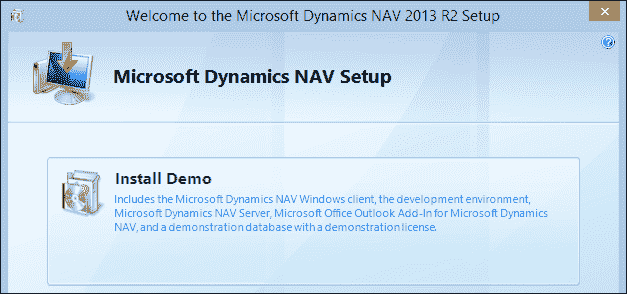
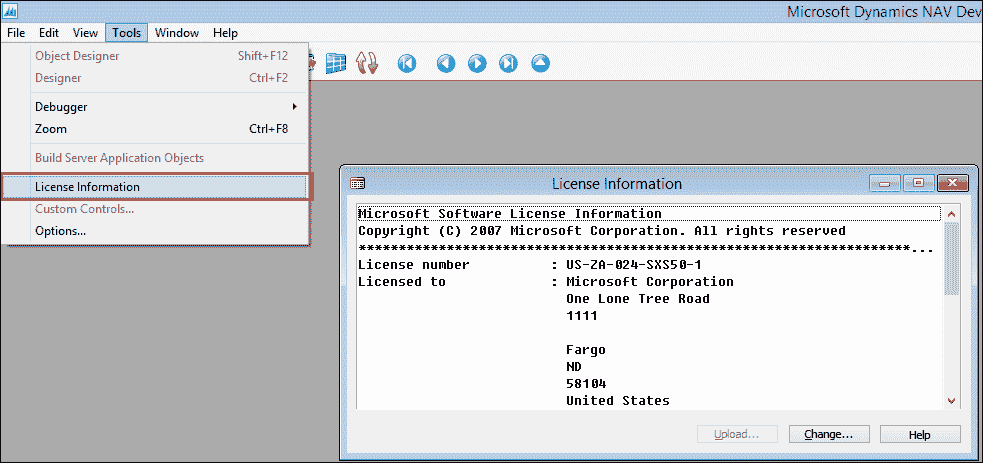
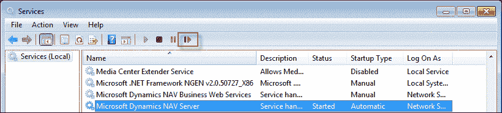
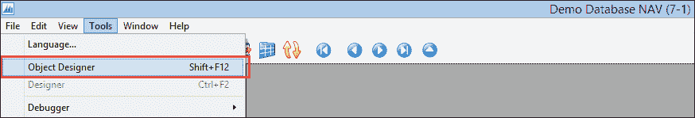
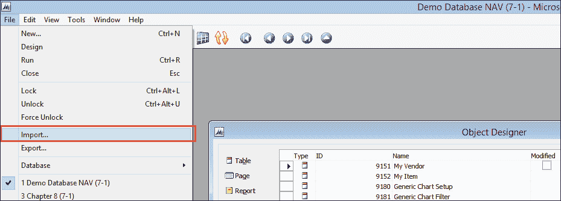
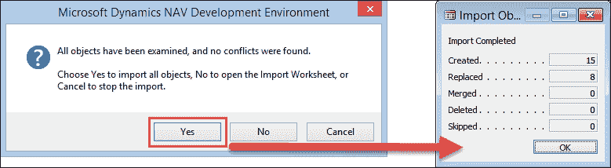
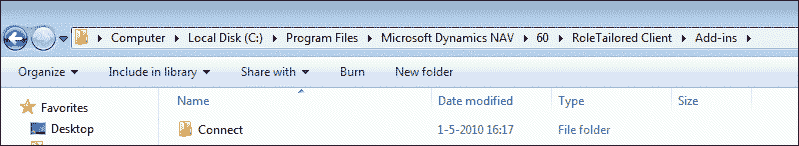
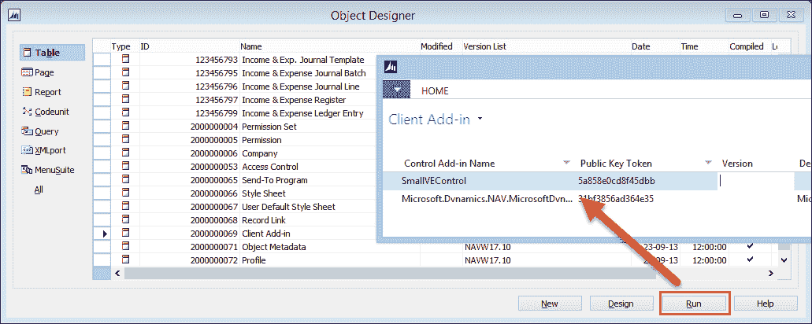

# 附录 A. 安装指南

使用本书，我们提供可以使用 Microsoft Dynamics NAV 2013 发布 2 W1 演示版安装的开发示例。

此演示版本可以从 [msdn.microsoft.com](http://msdn.microsoft.com) 下载。

# 许可证

微软对在 Microsoft Dynamics NAV 中使用和开发有非常严格的许可证规定。

为了教育目的，允许您使用编号为 123.456.700 至 123.456.799 的新对象使用 MSDN 许可证来开发新对象。

## 安装 Microsoft Dynamics NAV

从 MSDN 网站下载产品 CD 后，启动 `setup.exe` 文件。从安装选项中选择**安装演示**，如下面的截图所示：

## 更改许可证

安装完成后，我们可以使用开发环境和 Windows 客户端。我们使用开发环境进行管理和开发。用户界面是使用 Windows 客户端创建的。

每个 Microsoft Dynamics NAV 服务器实例都在许可证文件上运行。此文件确定我们在系统中的访问权限。安装的演示许可证允许我们访问所有功能，但不能访问 C/AL 代码。

要访问所有 C/AL 代码，我们需要官方合作伙伴开发许可证。要获取此许可证，我们必须注册为合作伙伴并开始作为分销商。如果我们不希望这样做，我们可以使用 MSDN 许可证。

MSDN 许可证将允许访问为本书开发的所有新对象。使用此许可证无法访问基础应用程序更改示例。

要更改许可证，导航到**经典客户端**，打开**工具**菜单，并选择**许可证信息**，如下面的截图所示：

许可证信息

这将打开**许可证信息**屏幕，我们可以选择**上传**，这将打开一个文件对话框，我们可以选择 MSDN 许可证。

### 注意

要在经典客户端上启用许可证文件，请重启应用程序。

### 重启服务层

要在角色定制客户端上启用许可证文件，我们需要重启服务层。这可以通过 Windows **控制面板**中的**服务**窗口完成，如下面的截图所示：

# 安装对象

这本书包含三个 Microsoft Dynamics NAV 对象文件、两个 DLL 文件、一个 SQL Server 脚本和一些安装辅助文件。具体如下：

+   `Chapter2-4.fob`：此文件包含用于第二章、“一个示例应用程序”、第三章、“财务管理”和第四章、“关系管理”中的网球场示例。

+   `Chapter7-9.fob`：此文件包含用于第七章，*存储和物流*的存储和物流应用程序以及第九章，*接口*的示例接口。我们需要额外的 SQL Server 脚本以运行 ADO 示例。

+   `Chapter8.fob`：此文件包含第八章的作业扩展，*咨询*。本章还需要安装额外的 DLL 文件。

+   `RF database.sql`：这是在第九章，*接口*中使用的 SQL Server 脚本，用于创建 RD 数据库并创建示例数据。

+   `MSDN.flf`：这是我们可以用来访问编号从 123.456.700 到 123.456.799 的自定义对象的 MSDN 许可证。

+   `NavMaps.dll`和`VEControl.dll`：这是我们需要的动态链接库文件，用于第七章，*存储和物流*。

+   `Pin1.gif – Pin5.gif`：这些是显示在必应地图上的图标。

## 导入 FOB 文件

要安装对象，首先在经典客户端中打开对象设计器，通过从**工具**菜单中选择**对象设计器**（*Shift* + *F12*）选项，如图所示：

当对象设计器处于活动状态时，**文件**菜单显示一些附加选项：

文件菜单选项

我们选择**导入**，这将打开一个文件对话框。现在，选择您想要导入的`.fob`文件。

如果一切正常，以下对话框应该出现：

选择**是**，此对话框确认导入。

## 安装动态链接库文件

为了支持必应地图客户端插件、地理编码和距离计算，我们提供了以下两个 DLL 文件、五个 GIF 文件和一些安装支持文件：

+   `NavMaps.dll`

+   `VEControl.dll`

+   `pin1.gif`

+   `pin2.gif`

+   `pin3.gif`

+   `pin4.gif`

+   `pin5.gif`

+   `RegisterDll.bat`

这些文件现在应放置在这个文件夹中：

### 注册 NavMaps.dll

要注册此 DLL，我们使用`RegAsm`。该命令在`RegisterDll.bat`文件中预定义，我们可以执行它。

### 注册 VEControl.dll

要注册可视化地图控件，我们在**客户端插件**表（2000000069）中添加引用。为此，我们可以从**对象设计器**中运行该表，如图所示：

从对象设计器运行表
