# 第一章. 销售和采购流程

销售和采购是所有公司中的两个基本业务领域。在许多组织中，销售人员或采购部门负责生成报价和订单。来自财务领域的人负责通过发出具有会计反映的文件（如发票和贷项通知）来最终确定销售和采购流程。

在过去，大多数系统都需要有人将所有交易翻译成会计语言，因此他们需要一个金融家来完成这项工作。在 Dynamics NAV 中，任何人都可以开具发票，无需会计知识。但许多公司仍然保留着部门之间的旧分工。这就是我们决定在这本书中解释销售和采购流程的原因。

本章解释了它们在 Dynamics NAV 中的工作流程是如何管理的。

在本章中，您将学习以下内容：

+   动态 NAV 是什么以及它能为您公司提供什么

+   如何定义销售和采购所需的主数据

+   如何设置您的定价策略

+   您可以发出哪些类型的文件

+   销售和采购区域内的工作流程

# 介绍 Microsoft Dynamics NAV

Dynamics NAV 是一个面向小型和中型企业的**企业资源规划（ERP**）系统。

ERP 是一个系统，是一块软件，它整合了整个组织的内部和外部管理信息。ERP 系统的目的是促进组织内部所有业务功能之间的信息流动。ERP 系统旨在处理组织的所有领域。这样，一个领域的输出就可以作为另一个领域的输入。

Dynamics NAV 2016 涵盖了以下功能领域：

+   **财务管理**：这包括会计、总账预算、账户计划、财务报告、现金管理、应收账款和应付账款、固定资产、增值税报告、公司间交易、成本会计、合并、多货币和内部统计

+   **销售与营销**：这个领域包括客户、订单处理、定价、联系人和营销活动

+   **采购**：采购区域包括供应商、订单处理、审批、计划、成本和其他类似领域

+   **仓库**：在仓库区域，您将找到库存、发货和收货、位置、拣选和组装

+   **制造**：这个领域包括产品设计、能力、计划、执行、成本和分包

+   **工作**：在作业区域，您可以创建项目、阶段和任务、计划、时间表、在制品和其他类似领域

+   **资源规划**：这有助于您管理资源、能力和如此等等。

+   **服务**：在这个区域，您可以管理服务项目、合同、订单处理、计划和调度以及服务任务

+   **人力资源**：这有助于您管理员工、缺勤等

本书将详细介绍其中的一些领域。

Dynamics NAV 提供的不仅仅是强大的财务和业务管理功能。它也是一个完美的平台，可以根据你的公司需求定制解决方案。如果你已经研究了不同的 ERP 解决方案，到现在你应该知道，为了满足你的特定需求，定制总是必要的。Dynamics NAV 以易于定制而闻名，这是一个明显的优势。

由于你可能会在系统中进行定制，你可能会发现与本书中解释的内容有所不同。你的定制可能意味着以下内容：

+   你的实施中具有更多功能

+   一些步骤是自动化的，因此可以避免一些手动工作

+   一些功能的表现与这里解释的不同

+   在你的 Dynamics NAV 中有新的功能区域

此外，Dynamics NAV 大约有四十种不同的国家本地化版本，旨在满足特定国家的法律要求或常见做法。

许多人和公司已经在 Dynamics NAV 上开发了解决方案，以覆盖横向或行业特定的需求，并且他们已经将他们的解决方案注册为附加组件，如下所示：

+   零售业或食品饮料业的解决方案

+   **电子数据交换** (**EDI**)

+   质量或维护管理

+   与第三方应用程序的集成，例如电子商店、数据仓库解决方案或 CRM 系统

这些只是几个例子。你可以找到近 2000 个注册的第三方解决方案，涵盖所有类型的功能区域。如果你觉得 Dynamics NAV 无法满足你的需求，并且你需要进行大量的定制，那么最好的解决方案可能就是寻找现有的附加组件，并将其与你的 Dynamics NAV 一起实施。

不管怎样，有无附加组件，我们都说过你可能需要定制。你能期待多少定制？这很难说，因为每个案例都是特定的，但我们会尽量给你一些亮点。

如果你的 ERP 系统在不进行任何定制的情况下覆盖了 100% 的需求，你应该担心。这意味着你的程序非常标准化，你和你的能力之间没有区别。你没有为你的客户提供任何特殊的服务，因此他们只会根据他们得到的价格来衡量你。

另一方面，如果你的 Dynamics NAV 只覆盖了你需求的低比例，这可能只意味着两件事：这不是你需要的产品，或者你的组织过于混乱，你应该重新思考你的流程以使其标准化。

有些人认为理想的场景是，大约 70-80% 的需求可以通过默认设置得到满足，大约 20-30% 作为定制来满足那些使你与竞争对手不同的需求。

## 财务管理的重要性

为了使用 Dynamics NAV，所有组织都必须使用财务管理区域。它是整个应用程序的核心。任何其他区域都是可选的，其使用取决于组织的需要。销售和采购区域在几乎所有的 Dynamics NAV 实施中也被使用。

实际上，会计是核心，总账包含在财务管理区域中。在 Dynamics NAV 中，一切最终都导向会计。这是有道理的，因为会计是记录、分类和汇总公司发生的交易和事件的行为，以货币为标准。

每次仓库人员发货或付款部门下达转账指令时，这些行动都可以用账户、贷方和借方金额来表示货币。

会计可以收集所有公司的交易并逐个将其翻译成会计语言。但这意味着手动重复工作，有很多出错和不一致的机会，并且没有实时数据。

另一方面，Dynamics NAV 能够即时解释此类交易并将它们转换为会计。在 Dynamics NAV 中，一切最终都导向会计，因此所有公司员工都在帮助财务部门完成工作。财务人员现在可以专注于分析数据和做出决策，而无需再担心录入数据。

## 已发布的数据不能被修改（或删除）

当你开始使用 Dynamics NAV 时，你将面临的第一件事是无法修改已发布的内容，无论是销售发票、发货单、总账分录还是任何其他数据。任何已发布的文件或分录都是不可更改的。

这可能会引起挫败感，尤其是如果你习惯于使用允许你修改数据的其他系统。然而，这个特性是一个巨大的优势，因为它确保了数据完整性。你永远不会找到一个不平衡的交易。

如果你需要更正任何数据，Dynamics NAV 的方法是发布新的条目来抵消错误的数据，然后再次发布正确的条目。例如，如果你发布了一张发票，而价格是错误的，你必须发布一张贷项通知来抵消原始发票，然后发布一张带有正确价格的新发票：

| **文件编号** | **金额** |  |
| --- | --- | --- |
| 发票 01 | 1000 |  |
| 贷项通知 01 | -1000 | 这抵消了原始发票 |
| 发票 02 | 800 |  |

正如你所见，这种用于纠正错误的方法总是留下了错误的痕迹以及我们是如何解决的。用户感觉他们必须执行很多步骤来更正数据，而且每个人都可以看到某个时候确实有过错误。我们的经验告诉我们，用户在 Dynamics NAV 中发布任何内容之前都会更加注意，这导致最初犯的错误更少。

因此，使用 Dynamics NAV 作为你的 ERP 系统的另一个巨大优势是，整个组织倾向于改进他们的内部流程，所以没有错误。

## 没有保存按钮

Dynamics NAV 在任何地方都没有任何类型的**保存**按钮。数据在输入时被保存到数据库中。当你在一个字段中输入数据后，你离开该字段，数据就已经保存了。没有撤销功能。

主要优势是，你可以在不知道所有所需信息的情况下创建任何卡片（例如，**客户卡片**）、任何文档（例如，**销售订单**）或任何其他类型的数据。

想象一下，你需要创建一个新的客户。你拥有他们所有的财务数据，除了增值税号。你可以创建卡片，填写所有信息，除了增值税登记号字段，然后不丢失其他信息的情况下离开卡片。当你弄清楚客户的增值税号时，你可以回来填写它。不丢失其他信息这部分很重要。

想象一下，实际上有一个**保存**按钮；你花几分钟填写所有信息，最后点击**保存**。在那一刻，系统执行一些检查，发现有一个字段缺失。它会给你发一个消息说客户卡片无法保存。所以你基本上有两个选择：

+   要丢失输入的信息，找出客户的增值税号，然后从头开始。

+   为了作弊。在字段中填入一些错误值，以便系统实际上允许你保存数据。当然，一旦你找到了正确的值，你可以回到卡片上更改数据。但没有任何东西可以阻止其他用户在此期间为客户发布交易。

# 理解主数据

**主数据**是业务运营的所有关键信息。第三方公司，如客户和供应商，也是主数据的一部分。公司制造或销售的项目也是主数据的一部分。

许多其他事物也可以被认为是主数据，例如仓库或位置、资源或员工。

当你开始使用 Dynamics NAV 时，你必须做的第一件事是将你的主数据加载到系统中。以后，你将通过添加新客户等方式不断扩展你的主数据。为此，你需要知道你需要提供哪些信息。

## 客户

我们将打开客户卡片，看看 Dynamics NAV 中存储了关于客户的哪些信息。要打开客户卡片，请按照以下步骤操作：

1.  导航到`部门/销售与市场/销售/客户`。

1.  你将看到一个客户列表，找到编号`10000 The Cannon Group PLC`。

1.  双击它以打开其卡片，或者选择它并点击功能区**首页**上的**查看**图标。

以下截图显示了**The Cannon Group PLC**的客户卡片：

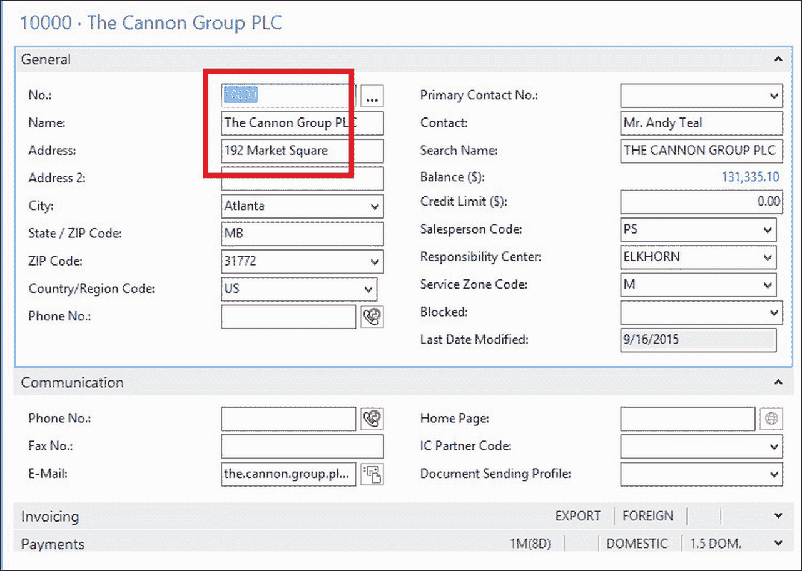

客户总是通过他们的**编号**来引用，这是一个识别他们的代码。我们还可以提供以下信息：

+   名称、地址和联系方式：如果您通过商业名称而不是税务名称来引用客户，还可以提供**搜索名称**。

+   开票信息：它包括过账组、价格和折扣率等。

+   您可能还不知道什么是过账组，因为这是这些词在这本书中第一次被提及。此时，我们只能告诉您过账组很重要。但还不是时候详细讨论它们。我们将在第六章 *财务管理设置* 中讨论过账组。

+   付款信息：它包括何时以及如何从客户那里收取付款。

+   发货信息：它解释了如何将商品运送给客户。

除了卡片上显示的信息外，我们还可以介绍关于客户的大量其他信息。看看位于功能区上的**导航**选项卡：

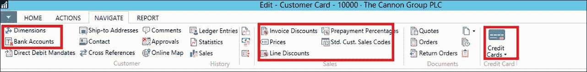

可以输入的其他信息如下：

+   **银行账户信息**：这样我们就可以知道我们可以在哪里请求付款。可以为每个客户设置多个银行账户。

+   **信用卡信息**：这是在客户使用此程序付款的情况下。

+   **预付款信息**：这是在您要求客户全额或部分预付款的情况下。

+   **附加地址**：这是商品可以发货的地方（**收货地址**）。

+   **联系人**：您可能将它们与客户的不同的部门或个人联系起来。

+   **关系**：这是我们商品与客户商品之间的关系（交叉引用）。

+   **价格和折扣**：这将在*定价*部分讨论。

但客户，就像任何其他主数据记录一样，不仅仅包含用户手动输入的信息。他们还有一大堆其他信息，这些信息在执行操作时由系统自动填充：

+   **历史记录**：您可以在卡的右侧看到它，它包含有关当前正在处理多少报价或订单、已开具多少发票和贷项通知单等信息。

+   **条目**：您可以通过**导航**选项卡访问客户的账簿条目。它们包含每次单独货币交易的详细信息（发票、贷项通知单、付款等）。

+   **统计信息**：您可以在右侧看到它们，它们包含货币信息，例如订单中的金额或已发货但尚未开票的商品或服务的数量。

+   **余额**：这是向客户开具的所有发票的总额减去从客户那里收到的所有付款。

并非我们在客户卡片上看到的所有信息都是必需的。实际上，如果您想创建交易，唯一必需的信息是给它一个**编号**（其识别码）并填写过账组的字段（**通用业务过账组**和**客户过账组**）。所有其他信息可以理解为默认信息和设置，这些将在交易中使用，这样您就不必每次都写下来。您不想在每一份订单或发票中都写上客户的地址，对吧？

## 项目

现在，让我们看看项目卡片，看看 Dynamics NAV 中存储了哪些关于项目的信息。要打开项目卡片，请按照以下步骤操作：

1.  导航到`部门/销售与市场/库存与定价/项目`。

1.  您将看到项目列表。找到项目`1000 自行车`。

1.  双击它以打开其卡片。

以下截图显示了项目`1000 自行车`的项目卡片：

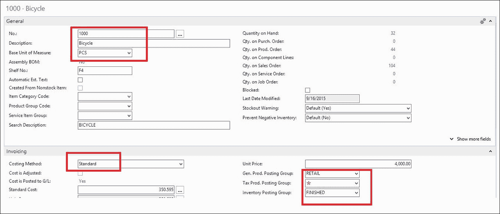

如截图所示，项目首先有一个**编号**，这是一个识别它们的代码。对于一个项目，我们可以输入以下信息：

+   **描述**：这是项目的描述。如果使用不同的名称更好地识别项目，还可以提供**搜索描述**。

+   **基本计量单位**：这是表示大多数数量和其他信息（如项目的**单价**）的计量单位。我们稍后会看到还可以使用其他哪些计量单位，但基本单位是最重要的，应该是项目可以引用的最小计量单位。

+   **分类**：**项目类别代码**和**产品组代码**字段提供了一个层次分类，用于对项目进行分组。分类可以填写我们在下一点将要看到的发票信息。

+   **发票信息**：包括过账组、用于项目的成本计算方法等。过账组在第六章*财务管理设置*中解释，成本计算方法在第三章会计流程*会计流程*中解释。

+   **定价信息**：这是项目的单价以及其他定价配置，我们将在*定价*部分更详细地介绍。

+   **外贸信息**：如果您必须进行 Instrastat 报告，则需要此信息。

+   **补货、计划、项目跟踪和仓库信息**：这些快速选项卡在此书中没有详细解释，因为它们超出了本书的范围。它们用于确定如何存储库存以及如何补充库存。

除了您在项目卡片上看到的信息外，我们还可以通过位于功能区上的**导航**选项卡介绍关于项目的更多信息：

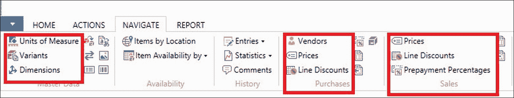

如您所见，可以输入的其他信息如下：

+   **计量单位**：这在您可以在同一时间以单位、箱或其他计量单位销售商品时很有用。

+   **变体**：这在您有多个实际上是同一商品但有一些细微差异的商品时很有用（因此，它们共享大部分信息）。您可以使用变体来区分颜色、尺寸或您能想到的任何其他小差异。

+   **扩展文本**：这在您需要在文档上显示长描述或技术信息时很有用。

+   **翻译**：这用于您可以在其他语言中显示商品描述，具体取决于客户使用的语言。

+   **价格和折扣**：这将在**定价**部分讨论。

与客户一样，商品卡片上的所有信息并非都是强制性的。

## 供应商、资源和地点

我们将从第三方客户和供应商开始。它们的工作方式完全相同。我们将只查看客户，但我们解释的一切都可以应用于供应商。然后，我们将查看商品，最后，我们将简要查看地点和资源。

学到的概念可以在资源和地点中使用，也可以用于其他主数据，如总账、固定资产、员工、服务项目等。

# 定价

定价是商品和资源价格的组合，以及可以应用于单个文档行或整个文档的折扣。

可以为商品和资源定义价格，并将它们分配给客户。可以为商品和文档定义折扣，也可以将它们分配给客户。

价格和折扣都可以在不同级别定义，并可以覆盖多个定价策略。以下图表说明了在 Dynamics NAV 中可以建立的不同定价策略：

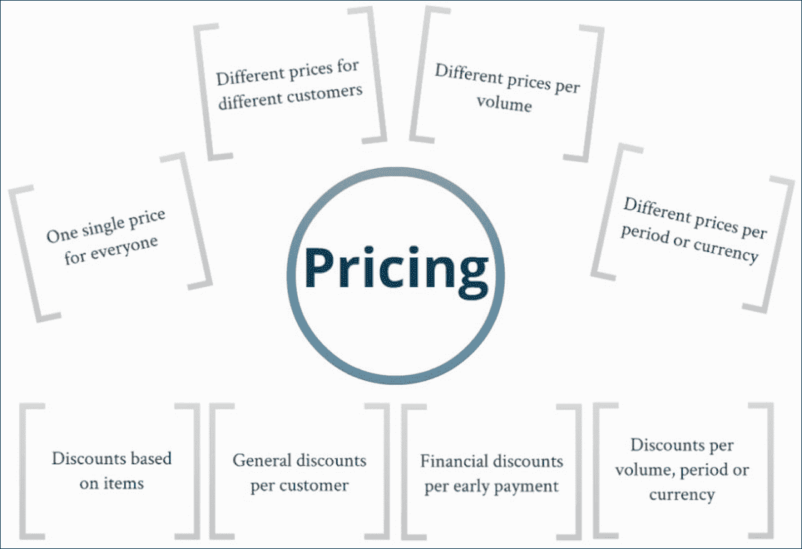

## 定义销售价格

销售价格可以在不同级别定义，以针对不同的定价策略。

最简单的情况是我们对每个商品或资源只有一个价格。也就是说，**统一价格政策**。在这种情况下，销售价格可以在商品卡片或资源卡片上的**单价**字段中指定。

在更复杂的情况下，价格取决于不同的条件，我们必须定义可能的组合和结果价格。

我们将解释如何为商品配置价格。资源的价格也可以以类似的方式定义，尽管它们提供的可能性较少。

要为商品定义销售价格，请按照以下步骤操作：

1.  导航到`部门/销售与营销/库存与定价/商品`。

1.  你将看到一个商品列表。找到商品`1936-S BERLIN Guest Chair`，`黄色`。

1.  双击它以打开其卡片。

1.  在**导航**选项卡上，点击位于**销售**组下的**价格**图标。

1.  将会打开**编辑 - 销售价格**页面：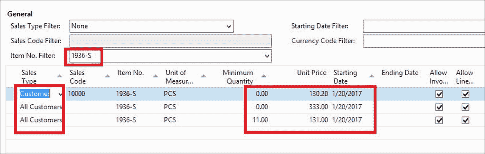

如截图所示，已为同一项目定义了多个价格。只有当所有条件都满足时，才会使用特定的价格。例如，对于在`20/01/2017`之后购买项目`1936-S`的任何客户，将使用`单价`。但只有当客户购买至少`11`个单位时，才会使用该价格。

可以使用不同的字段来针对每种定价策略：

+   **销售类型**和**销售代码**字段的组合可以启用针对不同客户策略的不同价格

+   **计量单位代码**和**最小数量**字段用于不同体积策略的不同价格

+   **开始日期**、**结束日期**和**货币代码**字段用于不同期间或货币策略的不同价格

它们都可以同时使用，以启用混合策略。

### 注意

当满足多个定价条件时，使用的价格是对于客户最有利的价格（最便宜的一个）。

假设`客户 10000`属于`RETAIL`价格组。在`20/01/2017`他购买了 20 个单位的项目`1936-S`。可以使用三种不同的价格：为他定义的价格、为其价格组定义的价格以及当客户购买至少`11`个单位时为所有客户定义的价格。在这三个价格中，`130.20`是最便宜的一个，因此将使用这个价格。

### 小贴士

价格可以包括或排除增值税。

## 定义销售折扣

销售折扣可以在不同级别定义，以针对不同的定价策略。

我们还可以根据条件定义项目折扣。这针对的是**基于项目的折扣**策略，以及根据使用的字段来建立条件的**按体积、期间或货币的折扣**策略。

在以下截图中，我们可以看到一些基于条件的项目折扣示例，这些折扣被称为**行折扣**，因为它们将应用于单个文档行：

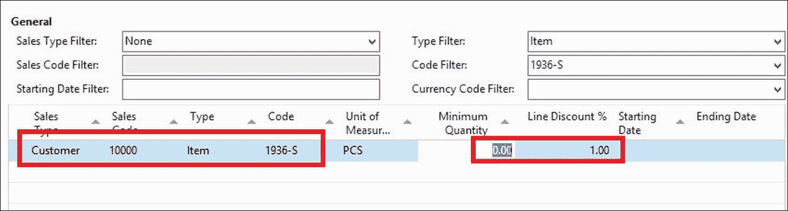

### 注意

在某些情况下，项目或客户可能已经为公司带来了非常低的利润，我们可能希望防止使用行折扣，即使条件得到满足。

在客户卡片和销售价格中可以找到一个名为**允许行折扣**的字段。通过取消选中它，我们将防止行折扣应用于特定客户或当使用特定销售价格时。

除了行折扣外，还可以定义发票折扣以使用**按客户的一般折扣**策略。发票折扣适用于整个文档，并且仅取决于客户。

按照以下步骤查看和定义特定客户的发票折扣：

1.  打开客户卡片，客户`10000`，`The Cannon Group PLC`。

1.  在**导航**选项卡上，点击**发票折扣**。

以下截图显示客户`10000`的发票折扣为**5**%：

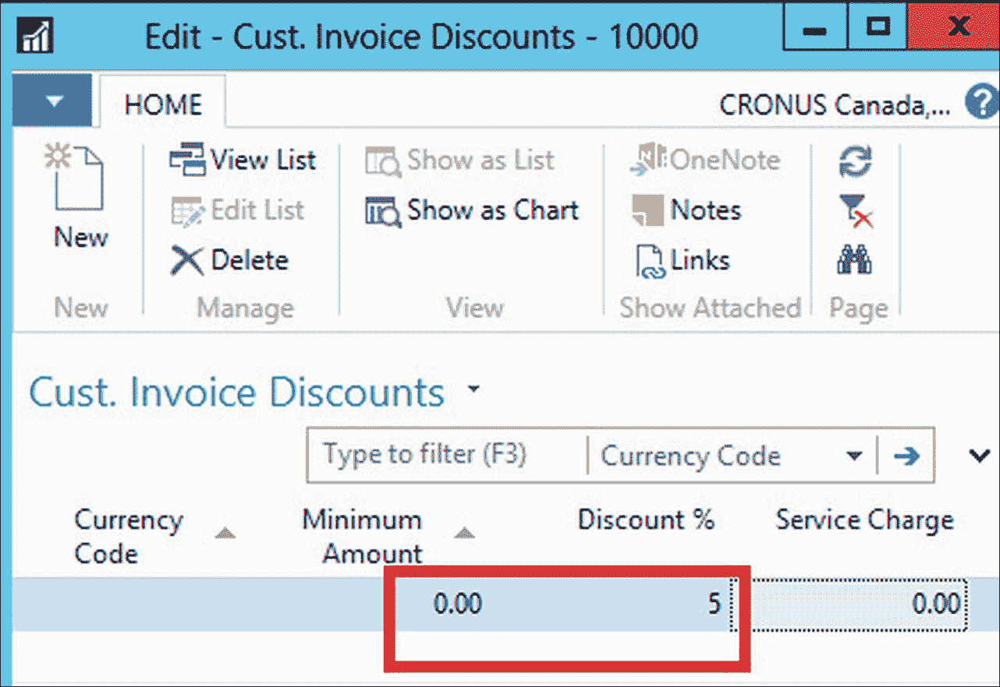

### 注意

就像行折扣一样，发票折扣也可以通过在项目卡片和销售价格上找到的**允许发票折扣**字段来禁用。

有第三种折扣，即付款折扣，可以定义使用**财务折扣政策**。这种折扣适用于整个文件，并取决于付款的时间。付款折扣与**付款条款**相关联，并且如果付款在特定天数内收到，则应应用。

以下屏幕截图显示了通过导航到`部门/销售与营销/管理/付款条款`可以找到的付款条款：

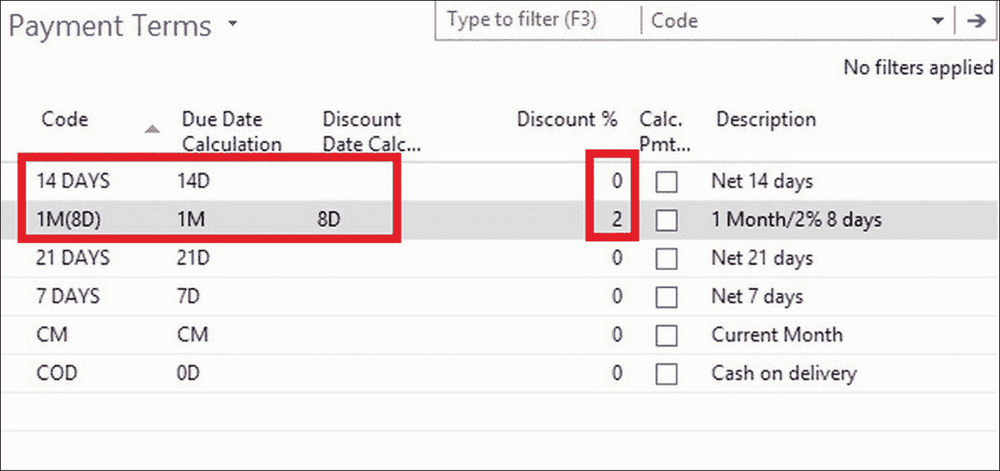

如您所见，当使用**1M(8D)**付款条款并在前八天内收到付款时，已建立了**2%**的付款折扣。

## 采购定价

在 Dynamics NAV 中也可以定义采购价格和折扣。它们的定义方式与你可以定义销售价格和折扣的方式完全相同。有一些细微的差别：

+   在项目卡片上定义单个采购价格时，我们不会使用**单价**字段，而是会使用**最后直接成本**字段。该字段会在发布采购发票时自动更新。

+   采购价格和折扣只能按单个供应商定义，而不能像销售价格和折扣那样按供应商组定义。

+   采购折扣只能按单个项目定义，而不能像销售折扣那样按项目组定义。

+   我们无法阻止应用采购折扣。

+   采购价格只能定义不含增值税的价格。

# 文档

Dynamics NAV 不是一个会计系统，而是一个企业管理系统。发票不是总结它们的总账分录，而是你发送给客户的文件。分录只是发布文件的结果。

文档用于创建与一个客户（或供应商）以及一个或多个项目或资源相关的交易。

让我们通过创建销售发票来了解文档是如何工作的。还有其他类型的文档。它们将在下一节中解释。

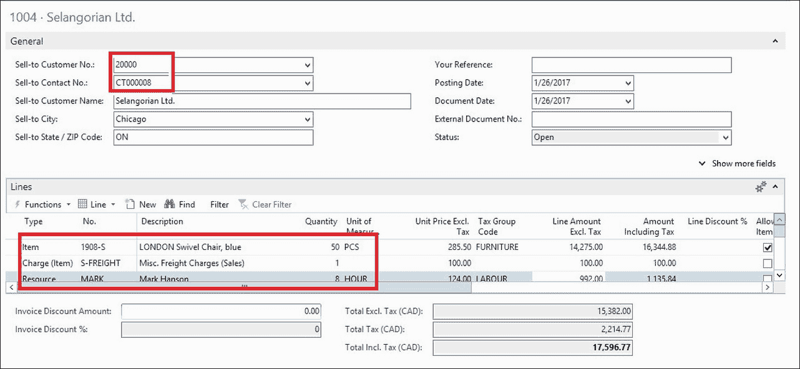

要创建类似于前一个屏幕截图中的发票，请执行以下步骤：

1.  导航到`销售与营销/订单处理/销售发票`。

1.  点击功能区上的**新建**按钮。

1.  一个新的空白发票会打开。

    ### 注意

    您发布发票后，将得到一个确定的发票金额。

1.  在**销售客户编号**字段中，开始键入代码`20`。当您键入时，会显示一个下拉列表，显示所有与键入的**编号**匹配的结果：

    ### 小贴士

    您可以更改用作过滤器的默认字段。为此，请检查您想设置为默认的列标题。小漏斗图标将移动到新列。现在，单击**设置为默认过滤器列**选项。

1.  系统会显示一条消息，告知客户有逾期余额，并会要求我们确认继续操作。点击**是**。

1.  在**行**选项卡中，通过填写以下表格的字段来创建行：

    | **类型** | **编号** | **数量** | **不含增值税单价** |
    | --- | --- | --- | --- |
    | 项目 | 1908-S | 50 |  |
    | 费用（项目） | S-FREIGHT | 1 | 100 |
    | 资源 | 标记 | 8 |  |
    | 总账科目 | 6610 | 1 | 15 |

    让我们解释一下可以使用的不同类型的行：

    +   **项目**：当您需要销售库存项目时使用。当发票发布时，它将创建一个项目条目以减少其库存。

    +   **费用（项目）**：这是用来调整项目成本的。在我们的例子中，运费费用将计入项目的销售额，因此可能会调整这次特定销售的收益。费用可以在销售和采购区域、同一文档或不同文档中使用。您已经向客户收取了运费；您的承运商将向您收费。当您收到供应商的发票时，您需要使用费用来调整销售的成本。

    +   **资源**：可以是员工、机械或其他公司资源。

    +   **总账科目**：是的，您也可以在文档中使用总账科目。在理想情况下，您会尽量避免使用它们，原因有两个：您需要会计知识来选择正确的科目，并且您无法定义价格和其他商业信息。

    +   **固定资产**：这是用来购买或出售固定资产的。

    ### 提示

    空类型用于注释。您可以在**描述**字段中输入文本。

    项目费用需要在发票准备好发布之前执行一个额外的步骤。

1.  选择运费费用行，然后点击**行**图标，然后选择**项目费用分配**选项。在**分配数量**字段中输入`1`，然后关闭页面。

    ### 注意

    **获取装运行**和**获取退货收据行**过程用于从其他文档中选择要收费的行。

1.  在发票发布之前，要获取其概览，请使用功能区上的**统计信息**选项。您也可以按*F7*键来访问此选项：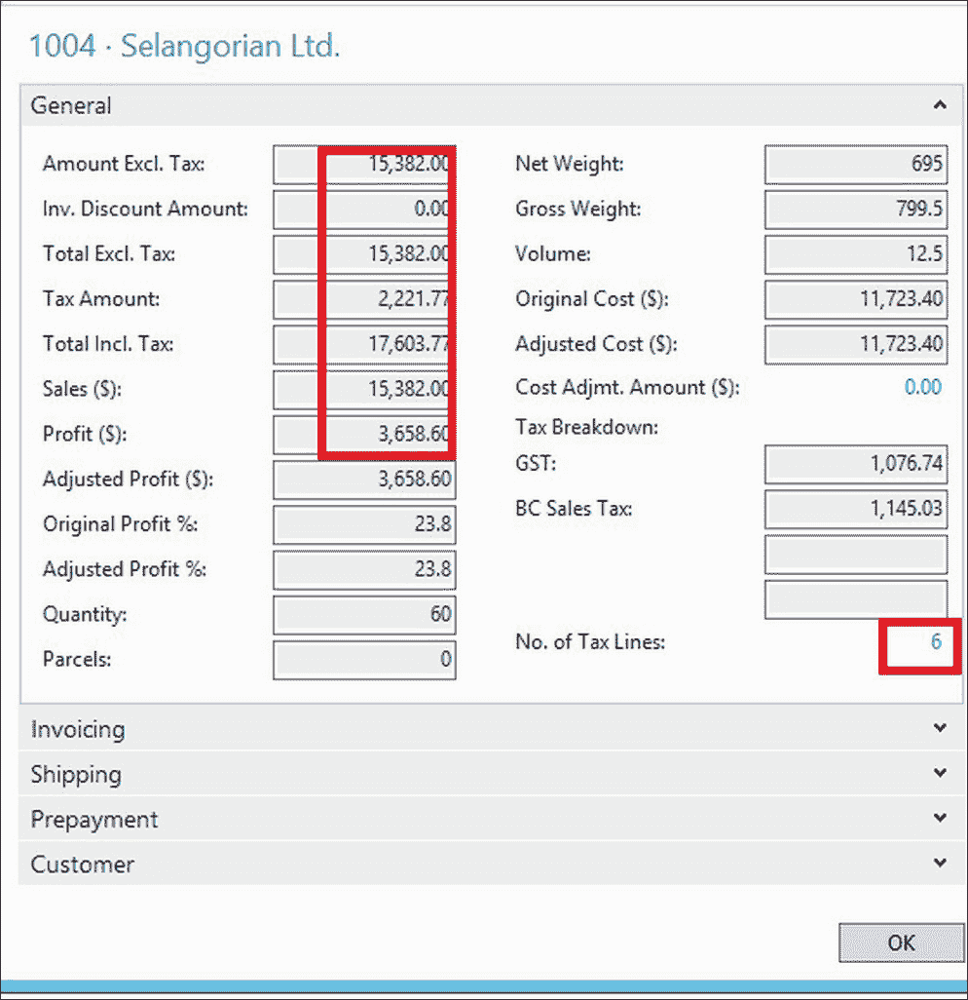

    在这个页面上，您可以更改上一张截图显示的字段。

1.  返回到发票。从功能区选择**发布**，或者按*F9*键。

1.  发票已经发布。它已经从“销售发票”列表移动到“已发布销售发票”列表。您可以通过在导航栏上写下“已发布文档/已发布销售发票”来访问它。

已发布的发票在应用程序的不同区域创建了多个条目。让我们看看它们：

+   **总账分录**：系统已将发票翻译成会计语言。我们选择了客户，因此它知道从第 23 组使用哪个账户。我们销售了物品，因此系统知道使用哪个收入账户，等等。Dynamics NAV 能够选择正确的账户，这得益于一些称为**过账组**的设置表。它们在第六章中详细说明，*其他财务功能*：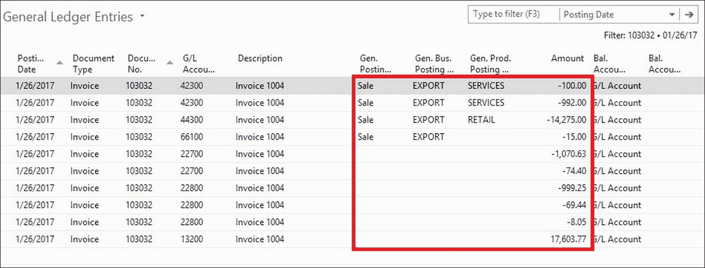

    ### 备注

    对于这本书，我们使用了名为 **CRONUS Canada Inc.** 的演示公司，该公司使用英国会计科目表。您可以使用您国家的通用会计科目表，或者您可以定义一个定制的科目表。

+   **税务分录**：在发布发票时创建。以后将用于发布增值税结算并向当局报告增值税：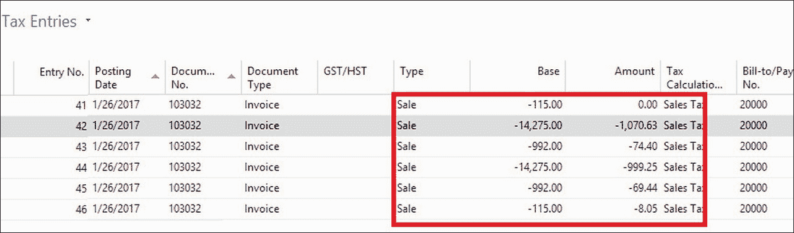

+   **客户分录**：用于跟踪记录到单个客户的全部交易。客户分录还用于管理应收账款。**剩余金额**字段告诉我们客户为这张发票欠我们多少钱。当发票完全支付时，它将是零：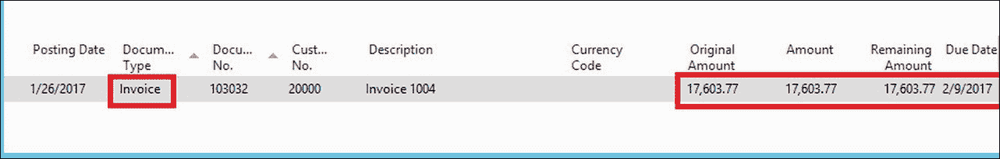

+   **物品分录**：由于我们销售了 50 个单位，我们需要减少物品库存。物品分录帮助我们跟踪公司库存。它还跟踪了该特定分录的**销售金额**和**成本金额**：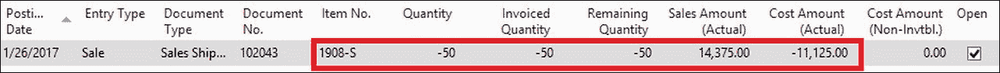

+   **价值分录**：每个**物品分录**中显示的**销售金额**和**成本金额**是它们价值分录的总和。将来，如果发布新的物品费用或物品被重新评估，这个特定物品分录的成本可能会改变。如果发生任何这种情况，将创建新的价值分录：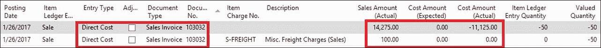

    ### 小贴士

    输入的值将用于以后了解一段时间内库存的变化，并在总账分录中发布。

+   **资源分录**：名为 `MARK` 的资源工作了 8 小时来组装我们销售的物品。我们通过他们的分录来跟踪资源，我们也知道每个分录的成本和总价：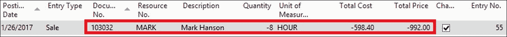

如您所见，一张单独的发票在各个账簿中产生了 18 个不同的分录。财务人员主要关注总账和增值税分录，而仓库人员将关注物品分录，资源经理将关注资源分录。一张单独的发票会影响公司的所有领域。因此，我们证明了引言中所述的内容：*ERP 系统旨在通过单个软件系统处理所有组织领域。这样，一个领域的输出可以用作另一个领域的输入*。

# 文档工作流程

在上一节中，我们看到了什么是文档。在本节中，我们将看到在 Dynamics NAV 中存在多少文档，它们是如何相互关联的，以及创建它们的常用工作流程是什么。我们将看到销售文档，但 Dynamics NAV 中存在完全相同的采购文档。

在 Dynamics NAV 中存在两种文档类型：

+   **开放文档**：它们包含我们将用于启动操作或交易的信息。例如，订单是向我们的客户发货行动的开始。开放文档可以被修改。

+   **已过账文档**：它们包含已过账交易的结果。它们可以被视为历史文档，并且不能被修改。例如，发货就是将项目发送给我们的客户的成果。

下面的图表显示了 Dynamics NAV 中存在的可用文档。还有其他特定于仓库的文档可以在销售和采购过程中使用，但我们已跳过它们，因为它们超出了本书的范围：

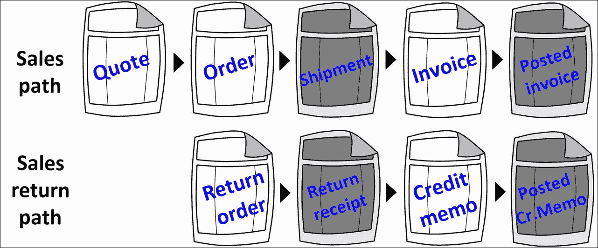

白色文档是开放文档，而灰色文档是已过账文档。

并非所有文档都必须使用。有些可以跳过，有些可能出现多次。例如，您可能不会使用**报价**、**订单**、**发货**、**退货订单**和**退货收据**，因此只使用**发票**、**已过账发票**、**贷项通知单**和**已过账贷项通知单**。您还可以使用**订单**，这可能导致多个**发货**（当订单部分发货时）然后使用单个**发票**来汇总所有发货，最终只有一个**已过账发票**。这种情况在以下图表中显示：

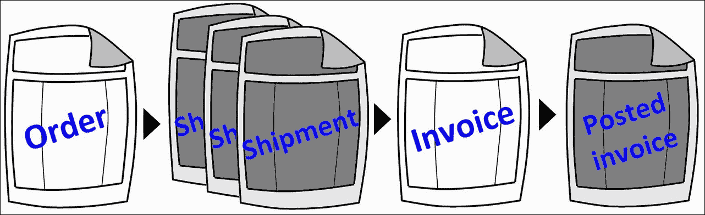

实际上，在发票中，我们可以将多个发货分组，无论它们是否来自同一订单或不同订单。还有一种可能的流程，不使用发票，直接从订单生成已过账发票：

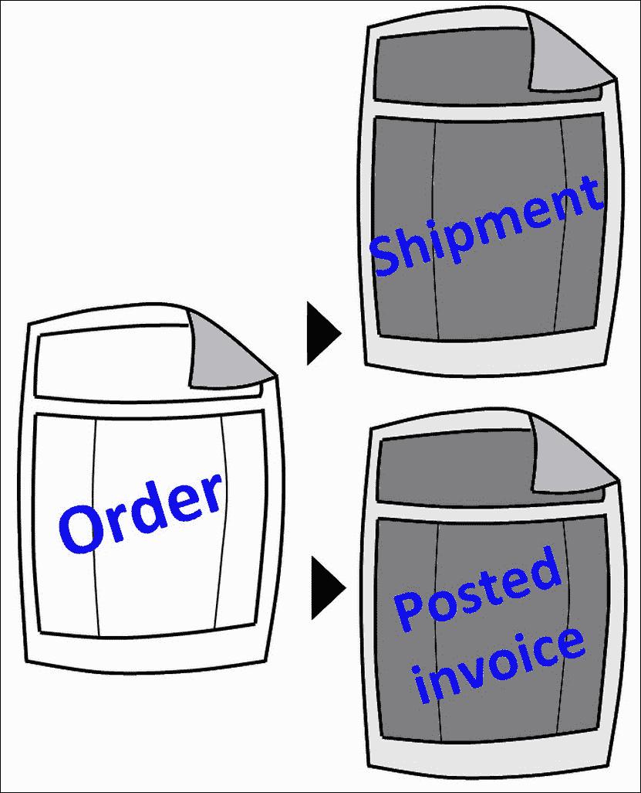

由于我们看到的所有工作流程都可以从一个报价文档开始，因此存在许多其他可能的组合。我们没有看到针对销售退货路径的不同工作流程，但可以使用相同的工作流程。

## 文档审批

Dynamics NAV 具有文档审批功能，可以应用于开放文档，以防止用户在未经批准的情况下过账（从而到达下一个文档，即已过账文档）。

文档的审批可以以不同的方式设置，这样并非所有文档都需要经过审批流程。只有满足某些条件的文档实际上才需要有人进行审批。我们可以决定以下事项：

+   哪些类型的开放文档需要审批。

+   审批者的层级结构。层级结构基于每个审批者可以批准的最大金额。

+   需要审批特定文档应满足的条件。所有可能的条件都基于文档金额。

# 工作流程

工作流程允许您在应用程序系统中设计和执行业务流程。一个简单的工作流程是单个**事件**和**响应**的配对。对于工作流程，我们需要执行以下设置：

+   **设置工作流程用户**：这用于指定在流程序列中接收通知的用户编号：

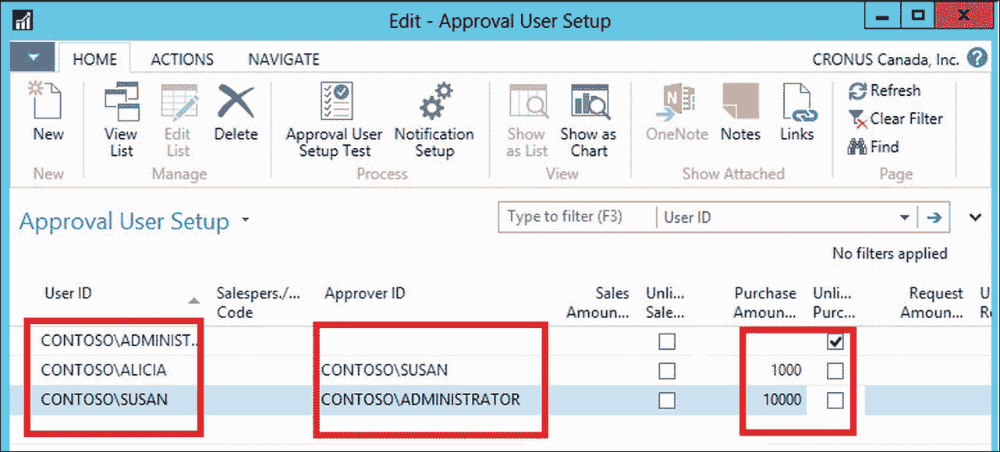

这是**采购审批者**窗口：

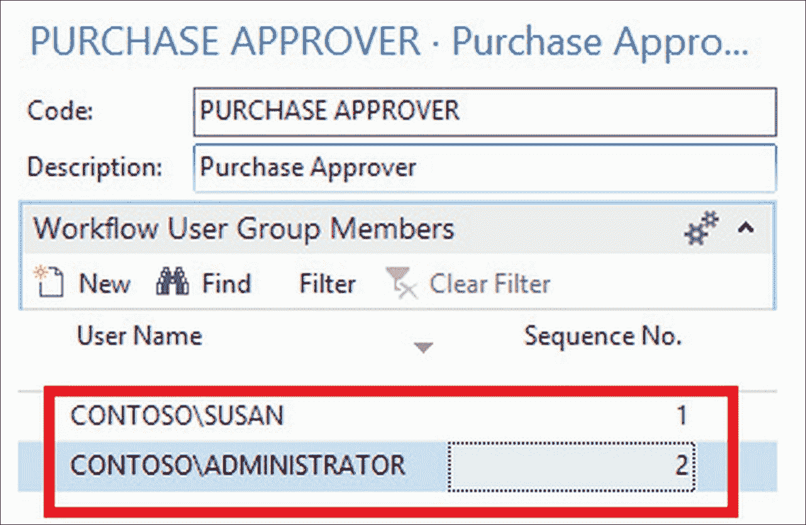

+   **设置工作流程通知**：这用于指定何时以及如何生成通知：

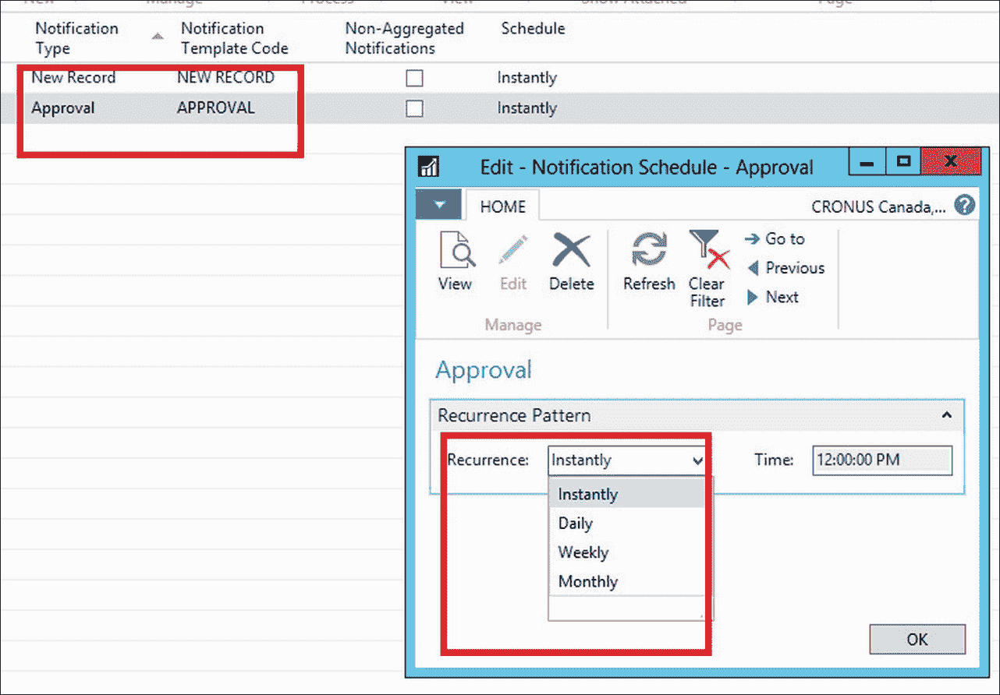

+   **设置 SMTP 电子邮件**：这用于发送电子邮件说明我们需要配置 SMTP 服务器：

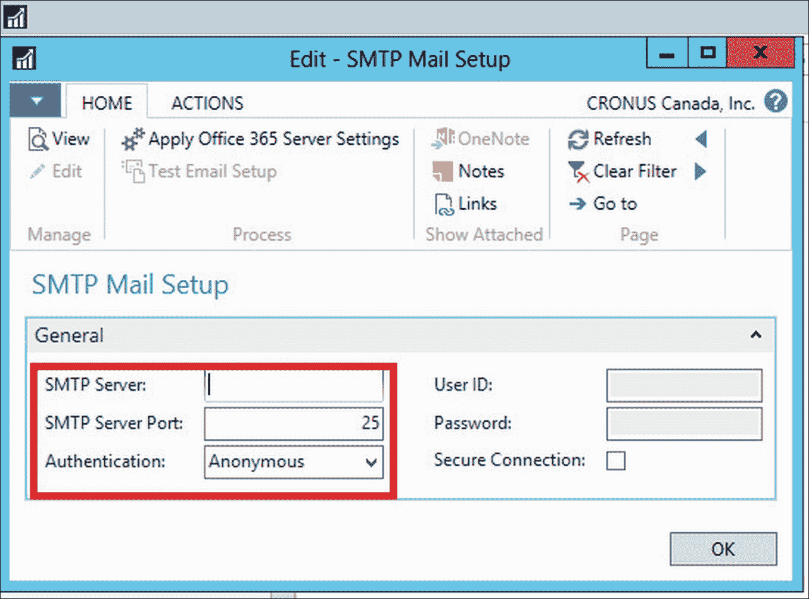

+   **工作流程模板**：工作流程模板是存在于 Dynamics NAV 中的不可编辑的工作流程：

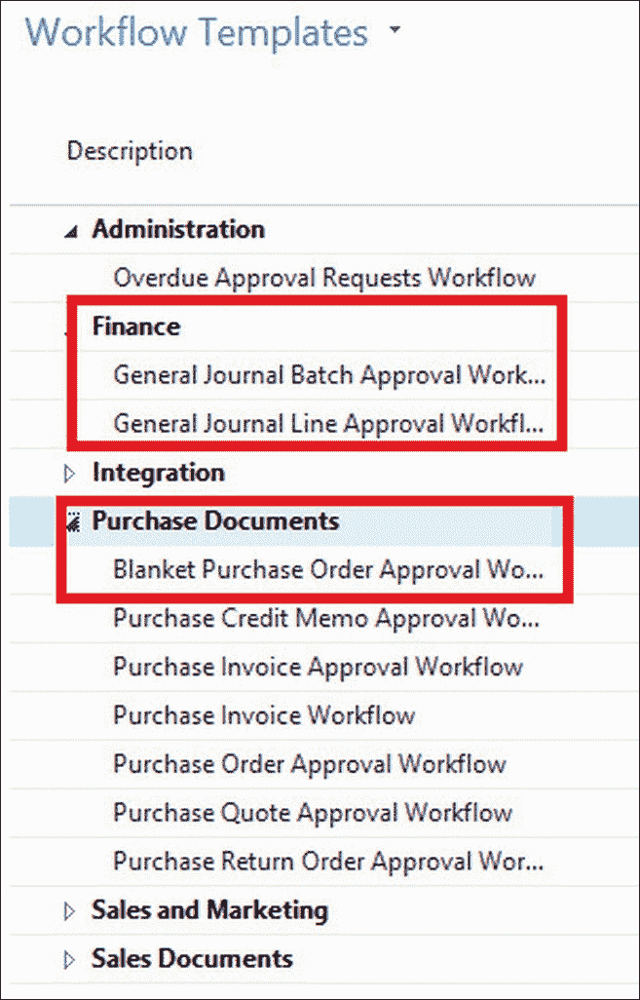

+   **创建工作流程**：您可以创建与您的业务流程连接的工作流程，例如自动过账，这些可以作为工作流程中的步骤，在用户任务之前或之后执行。请求和批准创建新记录是典型的工作流程步骤：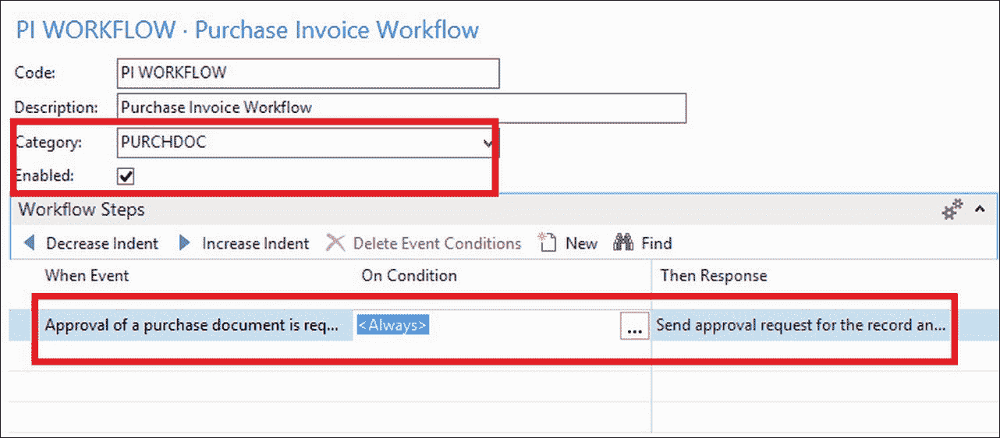

## 工作流程流程

以下是在 NAV 2016 中配置工作流程所需的设置：

+   设置审批用户（包括在 Windows 和在 Microsoft Dynamics NAV 中设置用户）：

    +   在活动目录中创建用户

    +   在 NAV 中创建用户并将其与 Windows 目录链接

    +   设置审批

    +   设置工作流程用户组

+   设置通知以供审批用户：

    +   创建一个通知计划

    +   创建一个通知设置

+   修改并启用审批工作流程：

    +   查看工作流程模板

    +   创建一个新的工作流程

+   启动调度通知的工作队列：

    +   工作队列设置

+   作为用户 A 请求审批采购订单：

    +   在从用户 A 登录后创建采购订单

    +   发送审批请求

+   作为用户 B 接收通知并批准请求：

    +   从用户 B 登录并批准采购订单

# G/L 账户卡片

在 Dynamics NAV 中，G/L 账户用于记录所有财务交易。账户是每种资产、负债、收入和费用的唯一记录。

现在，让我们查看一个 G/L 卡片，看看在 Dynamics NAV 中存储了哪些信息。要打开 G/L 卡片，请按照以下步骤操作：

1.  导航到`部门/财务管理/总账/账户列表`。

1.  您将看到 G/L 账户列表。找到`11600 银行运营现金`。

1.  双击它以打开其卡片。

以下截图显示了`11600 银行运营现金账户`的 G/L 账户卡片：

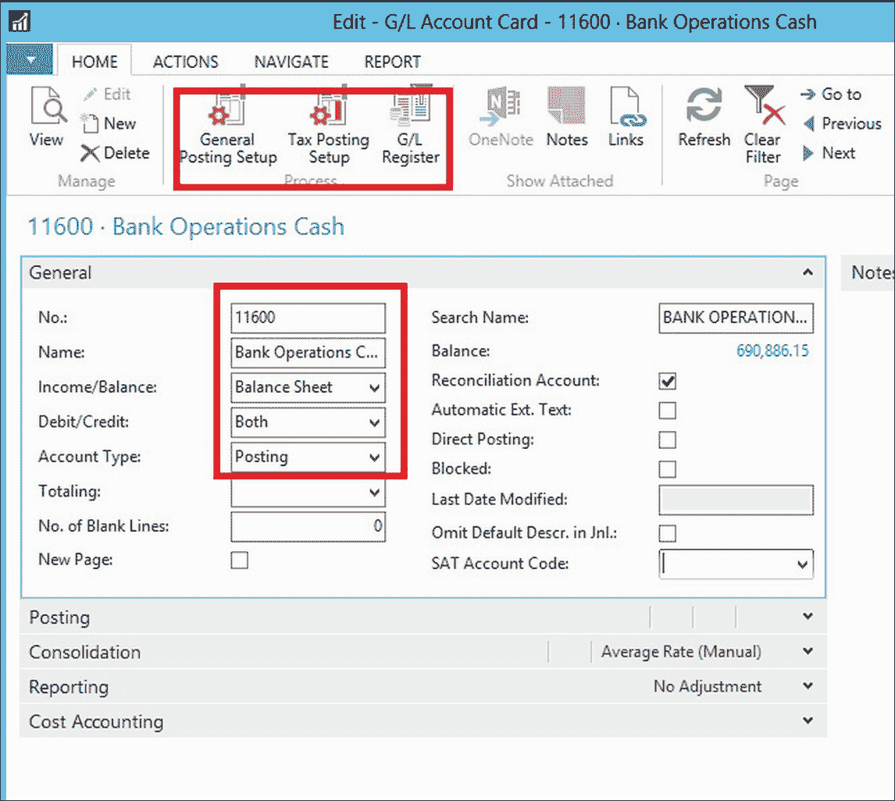

账户列表窗口显示所有账户，G/L 账户卡片窗口为账户列表中的每一行都有一个卡片，因此您可以一次只处理一个账户。

G/L 账户总是通过其**编号**来引用，这是一个标识它们的代码。我们还可以提供以下信息：

+   **常规**标签：用于输入关于 G/L 账户编号、名称和账户类型（收入账户的资产负债表）的信息。

+   **发布**标签：用于输入关于一般发布组和税务发布组的信息。

+   **合并**标签：用于输入合并借方或贷方账户信息以及翻译方法。

+   **成本会计**标签：用于显示 G/L 与哪个成本账户相关联。

G/L 卡片窗口在功能区包括以下操作：

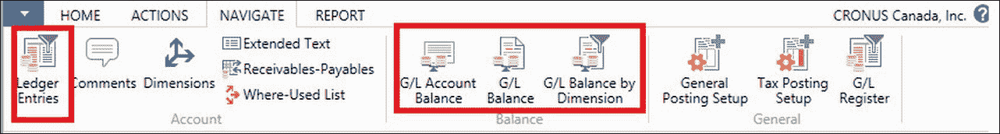

## 通用期刊

通用期刊用于将信息发布到总账和其他账户，如银行、客户、供应商和固定资产账户。使用通用期刊发布总是会在总账账户上创建条目。

以下是一些日记账条目类型：

+   **通用日记账**：用于发布简单的支出和收入交易。

+   **标准日记账**：用于保存可能需要再次使用的交易。标准日记账用于节省时间。

+   **重复日记账**：用于定期或重复的支出和收入交易。

+   **冲销日记账**：用于取消或冲销错误发布的交易。

按照以下步骤在**通用日记账**中输入和发布：

1.  前往**通用日记账**（`部门/财务管理/总账/通用日记账`）。

1.  输入**发布日期**。

1.  将 G/L 账户选为**账户类型**，并选择**61100**（广告）账户。

1.  在**金额**字段中输入`100`。

1.  然后选择现金账户作为抵消账户。

1.  发布**通用期刊**。

## 审计报告

导航到`部门/财务管理/总账/历史/G/L 登记簿`。

# 摘要

在本章中，我们了解到 Dynamics NAV 作为一个 ERP 系统，旨在通过单一软件系统处理所有组织领域。

销售和采购流程可以由任何人执行，无需会计知识，因为系统能够即时将所有交易转换为会计语言。

客户、供应商和项目是这些领域的母数据。其信息用于在文档中发布交易。有多种选项来定义您的定价策略：从单一价格到不同价格和折扣，按客户组、按数量、按周期或按货币。您还可以定义提前付款的财务折扣。

在下一章中，我们将通过展示如何处理应收账款、应付账款和银行账户来学习如何管理现金。
