# 第三章. 会计流程

到目前为止，我们已经看到了需要会计人员大部分时间的会计任务，因为它们是最大的任务：过账销售、采购和付款。但还有许多其他会计任务必须执行。

在本章中，我们将探讨以下会计流程：

+   过账会计交易

+   报税 - 增值税（税项过账设置）

+   管理固定资产

+   库存估值

+   结束会计年度

+   合并财务报表

+   暂估

# 过账会计交易

系统可以自动创建和过账许多会计交易，例如销售和采购发票等。还有许多其他交易最终会自动由系统创建会计分录。我们将在本章中实际看到这一点：税收、固定资产、库存估值等。

您可能需要过账许多其他系统未管理的会计交易，例如工资预提分录、准备金或其他。您可以使用**总账日记账**过账所有这些交易。

**总账日记账**可以通过导航到**财务管理** | **总账**并点击**总账日记账**来访问。

在**总账日记账**中，您手动创建必要的交易行，如以下截图所示，指示**账户号**、**余额账户号**和**金额**。实际上，还有许多其他字段可以填写，但我们将从一个简单的例子开始：

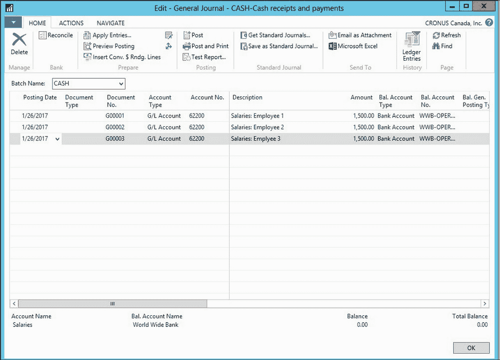

在过账此日记账时，系统将创建六个总账分录：三个在账户`8720`上，借方金额；三个在对应银行`WWB-OPERATING`的账户上，贷方金额。

而不是在每个日记账行指示平衡账户，您可以将**余额账户号**字段留空，并创建一个第四个日记账行，在其中您将指示平衡账户和金额，如以下截图所示：

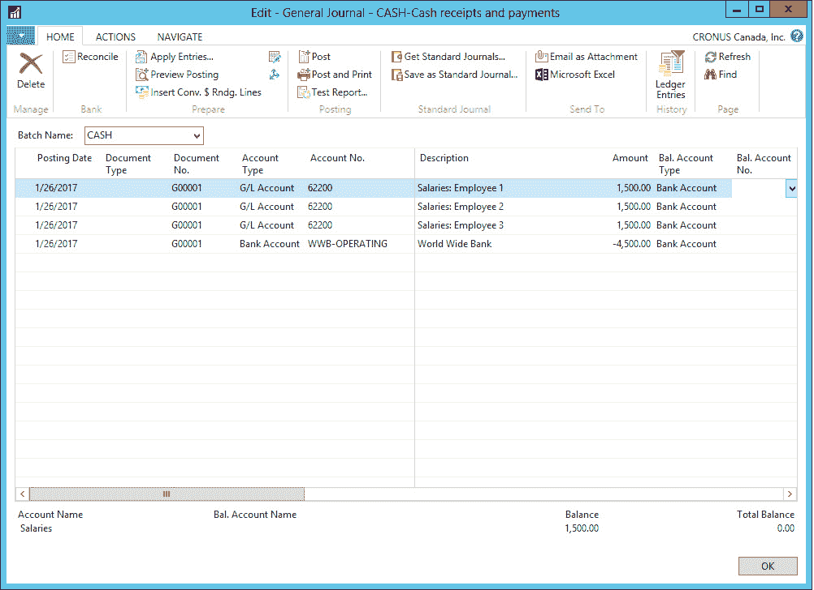

在过账此日记账时，系统将创建四个总账分录：三个在账户`8720`上，借方金额；一个在对应银行`WWB-OPERATING`的账户上，贷方金额。

在**总账日记账**上，您可以创建和过账所需的全部会计交易。没有限制。但请记住，当您要过账的会计交易涉及客户、供应商、银行或固定资产时，您应使用适当的**账户类型**，而不是直接使用必须过账的最终总账账户。这样，交易也将反映在客户、供应商、银行或固定资产卡上。

## 标准日记账

总账中的交易通常由用户在每次需要过账新交易时手动创建。一些会计交易被反复使用，因为它们必须每周或每月过账一次。

对于这些交易，您可以使用标准日记账。**标准日记账**是一个您创建的交易模板，可以根据需要多次使用。

要创建标准日记账，请执行以下步骤：

1.  打开**总账页**。

1.  创建您想要保存为标准日记账的总账行。

1.  点击**另存为标准日记账...**。

1.  选择**代码**并为**标准日记账**输入一个**描述**。

1.  您可以选择是否要在标准日记账中保存金额。请看以下截图：

1.  点击**确定**。

要使用**标准日记账**，请执行以下步骤：

1.  打开**总账页**。

1.  点击**获取标准日记账...**。

1.  选择适当的**标准日记账**。

1.  总账行将在**总账**中创建。

1.  通过输入过账日期和其他您可能需要的实际交易信息来完成总账行。

1.  过账**总账**。

## 重复日记账

重复日记账适用于频繁过账且变化很少或没有变化的交易。过账后，日记账行将被保留，因此当您打开它们时，它们已经包含可以审查、调整和重复过账的日记账行。

当使用带有冲销选项的重复日记账时，系统会过账交易，并在第二天过账冲销条目。重复日记账的另一种用途是基于金额或百分比过账分配。

您可以找到以下日记账的重复日记账：

+   每种总账类型（一般、资产、现金收入、支出、公司间、工作、销售和采购）

+   固定资产日记账

+   项目日记账

+   资源日记账

您可以像创建和过账标准日记账一样创建和过账重复日记账行。此外，重复日记账还具有以下额外字段：

| **字段名称** | **用途** |
| --- | --- |
| **重复方法** | 这确定过账后日记账上的金额如何处理。使用此字段，您还确定是否过账冲销条目。 |
| **重复频率** | 这包含一个公式，用于确定日记账上的条目将过账的频率。例如，如果输入公式`1M`，则在日记账过账后，日期将增加一个月。还有许多其他日期公式可能性。要了解更多信息，请检查 Dynamics NAV **帮助**菜单中的*如何：输入日期和时间*主题。 |
| **到期日期** | 这用于通过指定最后可以重复的日期来限制过账期间。 |

### 分配

**分配**用于将重复性日记账行上的金额分配到几个总账科目和维度。当您使用分配时，不需要引入平衡行，因为分配本身就是对重复性日记账行的平衡账户行。

1.  导航至**部门** | **财务管理** | **固定资产** | **周期性活动** | **重复性总账**。

1.  要打开**分配**页面，双击**已分配金额**字段。

1.  按百分比将原始行金额分配到不同的`CUSTOMERGROUP`维度值，如下截图所示：

    +   **固定**：以下截图展示了**固定**（维度值）：

    +   **变量**：以下截图展示了**变量**（维度值）：

    +   **余额**：以下截图展示了**余额**（维度值）：

1.  关闭页面返回到重复性日记账。请注意，**已分配金额**字段现在已填写。它应该与**金额**字段匹配，但符号相反。

在示例中，我们通过填写**分配百分比**字段按百分比进行分配。分配金额的不同方法如下：

+   **分配数量**：这是按数量分配金额。例如，按每个部门的员工人数进行分配。

+   **分配百分比**：这是按百分比分配金额。

+   **金额**：如果您使用之前的方法之一，程序将计算分配金额。您也可以手动输入分配金额。

# 报告税收 - 增值税

**增值税**（**VAT**）是对最终消费者征收的消费税。增值税基于销售和采购计算，并定期向税务机关报告。

### 注意

增值税的一般概念在所有适用增值税的国家都是相同的。声明和增值税率因国家而异。本书基于 Dynamics NAV 全球（W1）数据库。大多数 Dynamics NAV 国家版本都包括增值税本地化。

在 Dynamics NAV 中，增值税是基于销售和采购发票以及贷项通知单计算的。当文档过账时，将创建新的增值税条目，稍后将用于向税务机关报告增值税。

增值税是基于**增值税业务过账**组（客户和供应商确定）和**增值税产品过账**组（项目和服务的确定）的组合计算的。

在第一章《销售和采购流程》中，我们已发布销售发票号码为`103023`。让我们看看在发布发票时创建的增值税条目：

1.  导航至 `已发布文档/已发布销售发票`。

1.  定位到发票号码`103033`，然后点击**导航**选项。

1.  选择`增值税条目`表，然后从功能区点击`显示`图标。

1.  **税项条目**页面将显示为发票创建的所有增值税条目，如图所示：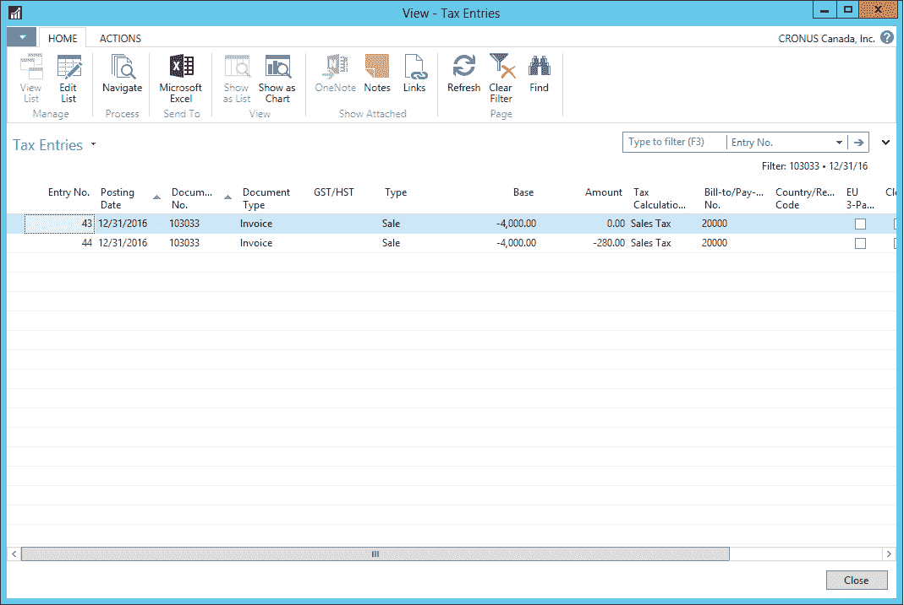

客户将**国家**设置为**增值税业务过账组**。发票包括一个**项目**、一个**费用**、一个**资源**和一个**总账科目**；每个都固定了自己的**增值税产品过账组**。

现在我们来看看如何根据这些增值税条目以及每个发票和贷项通知单创建的其他增值税条目来计算增值税结算。

## 增值税结算

**增值税结算**批处理作业用于计算并将净增值税金额过账到**总账**，该金额必须支付给税务机关。一旦增值税条目被用于过账增值税结算金额，系统将关闭该条目，以便您不会在新的计算中再次包含它。

要运行**计算和过账税结算**后台作业，请按照以下步骤操作：

1.  导航到**部门** | **财务管理** | **定期活动** | **增值税** | **计算和过账税结算**。

1.  使用以下选项运行报告：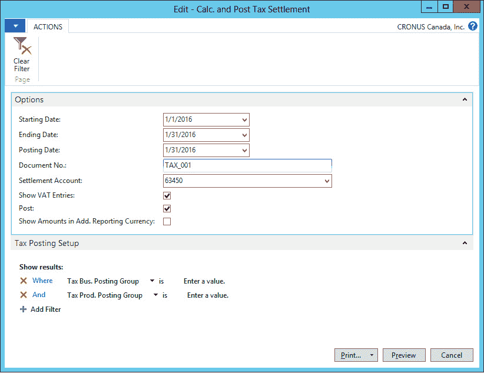

**开始日期**和**结束日期**定义了要结算的增值税条目的日期范围。**过账日期**将用于在总账中过账结算金额。对于**单据编号**，输入一个唯一编号以标识交易。

在**结算账户**字段中，选择将净金额转账到的总账科目。通常它将是一个贷方金额；然而，如果采购增值税金额较大，它将是一个借方金额。

### 小贴士

**显示增值税条目**

如果要保持未勾选，则仅显示每个增值税过账组的总结算金额。否则，将显示用于计算结算的所有增值税条目。

### 小贴士

**过账**

如果要打印测试报告，请保持未勾选。否则，结算金额将过账到总账，增值税条目将被关闭。您将无法重新打开它们，但仍然可以运行增值税报表。

## 增值税报表

增值税报表用于指定支付给税务机关的增值税的计算基础。您通常在首次设置公司时定义它们一次，然后定期预览或打印它们。要运行增值税报表，请按照以下步骤操作：

1.  导航到**部门** | **财务管理** | **定期活动** | **增值税** | **增值税报表**。选择**默认**报表，并双击它。

1.  从功能区点击**打印...**选项，并使用以下截图所示的选项运行报告：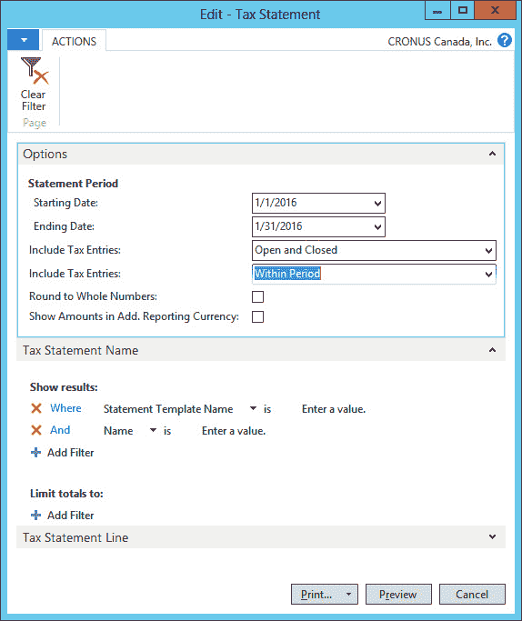

1.  增值税报表将如下所示：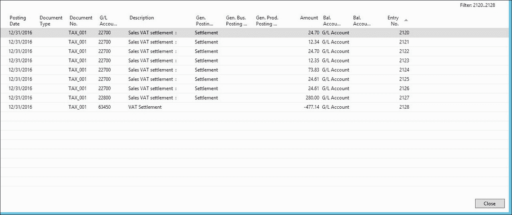

如您所见，增值税申报表的目的在于以对您有用的方式总结所有已过账的增值税条目，以便向当局报告增值税。增值税申报表是完全可定制的，您可以根据需要创建多个申报表，以匹配不同的当局格式或增值税内部报告格式。

# 管理固定资产

Dynamics NAV 提供了一个完全集成的固定资产管理功能，允许您在多个折旧账簿中可靠地跟踪折旧费用。将一个折旧账簿与总账集成，并另设一个用于内部固定资产计算（无需反映在总账中）的折旧账簿是有用的。您还可以跟踪与固定资产相关的其他信息，例如维护成本和计划、购置成本以及相关的保险信息。

## 创建固定资产并过账其购置成本

每个固定资产都有一个卡片，其中包含有关资产的所有信息。要创建一个新的卡片，您可以按照以下步骤操作：

1.  导航到**部门** | **财务管理** | **固定资产** | **固定资产**，然后从功能区点击“新建”图标。

1.  打开一张空白卡片。按*Enter*键获取**编号**并给出描述。如果资产有序列号，请在**序列号**字段中输入。

1.  在**行**快速选项卡上创建一个包含以下信息的行：

| **字段** | **值** |
| --- | --- |
| 折旧账簿代码 | COMPANY |
| 固定资产过账组 | CAR |
| 折旧方法 | 直线法 |
| 折旧开始日期 | 01/15/2016 |
| 折旧年数 | 5 |

### 备注

此行的信息将在计算折旧时使用。您可以为公司中定义的每个**折旧账簿**创建一行。**固定资产过账组**指定程序将过账涉及固定资产的交易所对应的账户。

到目前为止，**固定资产卡片**看起来与以下截图类似：

### 备注

**账面价值**字段为零。这是因为我们尚未记录购置成本。之后，随着我们每月计提折旧，**账面价值**将逐月减少，并在完全折旧后再次变为零。

要通过采购发票过账资产的购置成本，请按照以下步骤操作：

1.  创建一个新的采购发票。选择供应商，并将**2016 年 1 月 15 日**选为**过账日期**。

1.  在采购发票中创建以下值的行：

    | **字段** | **值** |
    | --- | --- |
    | 类型 | 固定资产 |
    | 编号 | FA000100 |
    | 数量 | 1 |
    | 不含增值税的直接单位成本 | 13500 |

1.  过账采购发票。

1.  返回固定资产卡片并注意，**账面价值**现在为`13500`。请参考以下截图：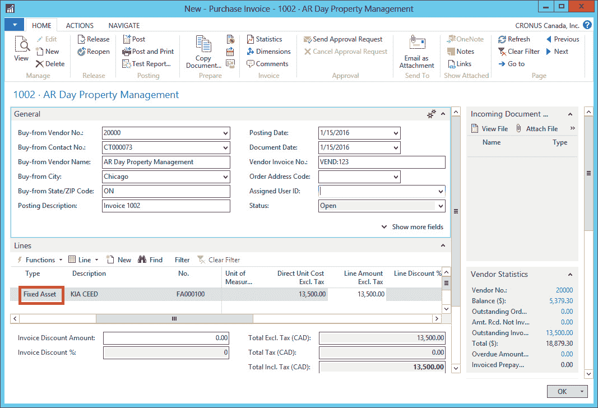

## 重估固定资产

在某些情况下，固定资产已经存在，并且其购置成本已经通过采购发票入账。后来，你可能需要增加资产的成本，因为公司已经对其投入了额外的成本，或者出于任何其他原因。为此，你可以使用**固定资产总账日记账**，按照以下步骤操作：

### 小贴士

即使之前没有过账成本，你也可以使用日记账。

1.  导航到`固定资产/固定资产总账日记账`。通过双击打开**默认**部分。

1.  创建一条新分录，类似于以下截图所示。在这个例子中，我们将向资产成本中添加`1000`。这包括税费，这意味着一旦过账，只有 800 将被添加到资产成本中。请参阅以下截图：

1.  通过从功能区选择**过账**选项来过账日记账分录。

1.  返回到**固定资产卡片**并注意，**账面价值**现在是`14300`。

## 计算折旧

固定资产的价值会随着时间的推移而减少。我们需要通过计算和过账固定资产折旧来对此事实进行核算。按照以下步骤操作：

1.  通过导航到**部门财务** | **管理** | **固定资产** | **定期活动**来运行**计算折旧**批量作业。

1.  选择以下截图所示的选项：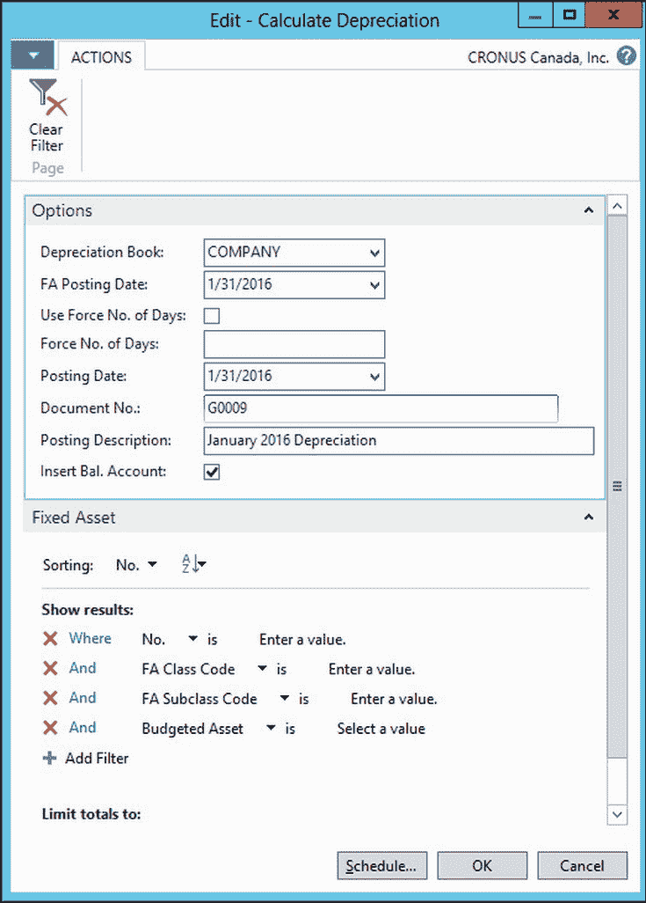

    此作业将计算所有资产的折旧。在示例中，我们已筛选作业，仅计算**固定资产编号：** `FA000100`的金额。系统创建日记账分录。你必须手动检查和过账。

1.  导航到**固定资产** | **固定资产总账日记账**。通过双击打开**默认**部分。程序已经创建了以下行：

1.  过账分录。

1.  返回到**固定资产卡片**并注意，**账面价值**现在是`14173`。

1.  双击**账面价值**以查看资产的**固定资产分录**。

对于本章中创建的资产，我们选择了直线折旧法。Dynamics NAV 允许我们选择以下折旧方法之一：

| **方法** | **定义** |
| --- | --- |
| 直线法 | 每年折旧相同的金额。 |
| 递减余额法 1 | 成本的最大部分分配给了其使用寿命的早期年份。如果你按月折旧，一年中的所有月份都会折旧相同金额。 |
| 递减余额法 2 | 与 DB1 类似，但如果按月折旧，每个期间的折旧金额将递减。 |
| DB1/SL | DB1/SL 代表递减余额法 1 和直线法。对于每个期间，使用两个金额中较大的一个来过账折旧。 |
| DB2/SL | 它与 DB1/SL 使用相同的原则，但金额是根据递减余额法 2 计算的。 |
| 用户定义 | 这允许您定义自己的方法。 |
| 手动 | 您必须手动输入折旧价值。 |
| 半年惯例 | 当应用半年惯例时，固定资产在财政年度中将具有六个月的折旧。它可以与直线法、递减余额 1 或 DB1/SL 方法结合使用。 |

### 小贴士

**手动创建折旧行**

要手动创建折旧行，访问日记账并创建一条与**计算折旧**批处理作业创建的行类似的行。

### 注意

Dynamics NAV 对所有计算使用标准的 360 天年和标准的 30 天月。

## 出售或处置固定资产

处理或出售固定资产是资产典型生命周期中的最后一步。当你这样做时，你必须同时记录处置价值以及任何相关的收益或损失。

要使用销售发票出售资产，只需创建发票，并在发票的一行中选择**固定资产**，就像我们购买资产时做的那样。输入销售价格并过账发票。程序将完成剩余的工作。

您还可以使用**固定资产总账日记账**过账处置。

## 取消固定资产分录

一个名为**取消 FA 分录**的批处理作业用于取消一个或多个固定资产的错误过账的 FA 分录。此任务创建新的 FA 日记账行。当你过账它们时，系统将创建分录以抵消错误，包括总账和 FA 账簿。

资产`FA00090`的折旧已经计算到 2013 年 12 月。你刚刚意识到，在十月你不得不将成本添加到资产中。因此你需要取消到十月的折旧，将成本添加到资产中，并重新计算折旧。让我们看看你如何取消折旧分录：

1.  打开资产`FA00090`的卡片，然后从功能区点击**日记账分录**选项。将打开**FA 日记账分录**页面。

1.  选择您想要取消的条目。在示例中，我们选择了最后三个条目。那就是从十月到十二月的折旧。

1.  点击功能区上找到的**取消分录**选项。在出现的页面上点击**确定**。

1.  导航到**固定资产** | **固定资产总账日记账**。通过双击它打开**默认**部分。这个过程已创建日记账行，一旦过账，将取消原始折旧分录。

1.  选择所有日记账行，然后点击**插入 FA 余额账户**选项。新的行将被插入日记账中以平衡交易。

1.  过账日记账行。

1.  返回到**FA 日记账分录**页面，并注意与十月到十二月对应的折旧分录不再存在。

    ### 注意

    Dynamics NAV 不会删除任何已过账的条目。原始折旧条目没有被删除，而是未分配。从**固定资产卡**中，点击功能区标签页上的**错误过账条目**，以查看原始条目。

# 库存估值

你的库存估值必须在财政年度结束时出现在你的资产负债表账户中。系统可以使用不同的成本计算方法来计算库存估值，并自动将其过账到总账，这样你就不必担心了。然而，由于性能问题，库存估值通常设置为手动过账到总账。

## 选择成本计算方法

Dynamics NAV 可以根据五种不同的成本计算方法计算你的库存估值：它们如下：

+   **先进先出**（**FIFO**）：它假设你库存中首先收到的单位也将是首先离开的单位。库存估值将基于最后收到的单位的成本。

+   **后进先出**（**LIFO**）：它假设你库存中最后收到的单位将是首先离开的单位。库存估值将基于第一个收到的单位的成本。

+   **平均**：库存估值将基于所有收到的单位的平均成本。

+   **特定**：此成本计算方法只能在针对物品库存进行特定序列号跟踪时使用。库存估值将基于库存中的确切单位。

+   **标准**：此成本计算方法执行 FIFO 计算。与 FIFO 不同的是，它采用基于你在项目卡上设置的估计成本的成本。此成本计算方法通常用于制造物品。

成本计算方法是在项目级别选择的，因此不同的项目可能使用不同的成本计算方法。

### 注意

仔细研究你想要使用的成本计算方法。一旦设置并项目有任何类型的变动，就不能更改。

## 计算项目条目成本

实际上，你不必计算任何东西。系统会为你做。然而，了解成本如何分配到项目条目中是很重要的。

系统为每个单独的项目条目分配一个成本。这就是不同条目类型获得成本的方式：

### 进货条目

+   **采购**：它们在过账采购收据时首先获得预期成本。预期成本来自采购订单。当过账发票时，它们从发票中获得实际成本。

+   **正向调整**：它们具有在项目日记账中指定的成本。默认情况下，它们获得项目的实际平均成本，但用户如果需要可以更改。

+   **制造过程的输出**：

    +   **标准成本计算方法**：它们获得在项目卡上定义的估计成本。

    +   **其他成本计算方法**：它们的成本是它们组件的成本总和加上制造项目的成本

### 出库条目

这里使用的成本计算方法决定了成本如何分配给出库条目。尽管如此，它们始终基于相同项目的入库成本。

这不是完整的列表。还有其他可能性（例如，销售退货的结果是入库条目）以及制造时可以做出的不同选择。我们只是查看了一些最常用的条目。

出库条目中的成本始终基于入库条目的成本。如果入库条目的成本在分配给出库条目之后发生变化，会发生什么？没问题，出库条目中的成本将在稍后更新。这实际上是通过一个名为**调整成本 - 项目条目**的批量过程完成的，可以通过导航到`财务管理/库存`找到。你应该定期运行此过程以保持项目成本最新。

## 将库存估值过账到总账

将库存估值过账到总账会将计算出的项目成本过账到相应的资产负债表账户。为此，我们使用以下步骤：

1.  导航到**财务管理**|**库存**并选择**将库存成本过账到总账**。

1.  选择**过账方法**、**文档编号**，并在以下截图所示的位置勾选**过账**：

1.  点击**预览**。

1.  将显示包含过账成本的报告。

## 库存估值报告

如果你想知道某个日期的库存估值，你必须运行**库存估值**报告，该报告可以通过导航到`财务管理/库存`找到。在这个报告中，你可以选择是否包括预期成本。预期成本是指那些尚未开票的项目条目。

打印的报告按库存过账组分组条目。2016 年 1 月的**库存估值**看起来类似于以下截图：

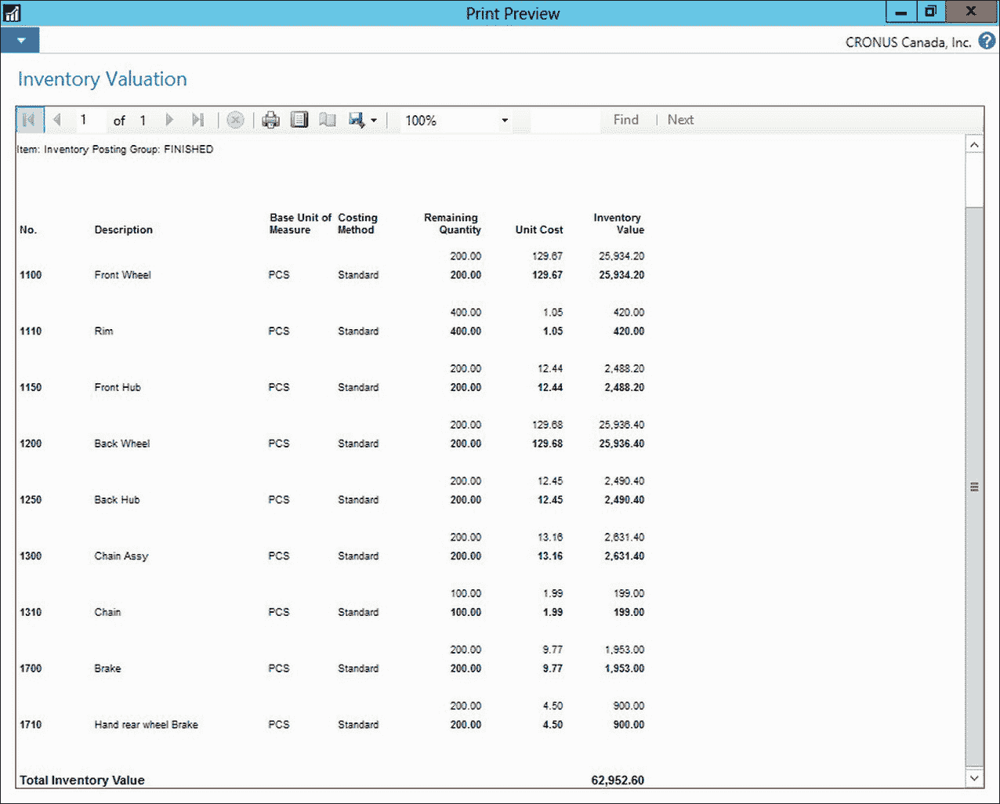

对于每个项目，报告打印五组列，显示以下信息：

|  | **描述** |
| --- | --- |
| `截至`(期初) | 这显示了在运行期间所选起始日期前一天库存的数量和价值。 |
| `增加（本币）` | 这显示了给定期间库存增加的数量和价值。这包括采购、正向调整、销售退货、制造项目等。 |
| `减少（本币）` | 这显示了给定期间库存减少的数量和价值。这包括销售、正向调整、采购退货、消耗品等。 |
| `截至`(期末) | 这显示了期末的库存数量和价值。 |
| `已过账至总账的成本` | 这显示了已过账到总账的成本。 |

# 关闭会计年度

当财政年度结束时，并且会计师已经过账了所有必要的交易，是时候执行关闭年度所需的任务了。

在 Dynamics NAV 中，这可以通过以下几个步骤完成：关闭会计期间并运行**关闭损益表**批量过程。之后，建议限制允许的过账日期，以防止用户在已关闭的年度中过账任何交易。如果需要，尽管如此，还可以过账进一步的交易。

## 关闭会计期间

要关闭会计期间，我们执行以下步骤：

1.  导航到**财务管理** | **周期性活动** | **财政年度** | **会计期间**。

1.  在功能区运行**关闭年度**过程。

1.  您将被提示确认您想要关闭财政年度。您不能选择要关闭哪个财政年度。系统将关闭第一个开放的财政年度。点击**是**。参考以下截图：

1.  财政年度已关闭。请注意，现在所有已关闭的会计期间（通常对应于月份）在**已关闭**和**日期锁定**字段上都有勾选标记。

## 运行**关闭损益表**批量过程

在每个财政年度结束时，会计规则规定，收入账户余额必须转移到资产负债表账户。**关闭损益表**批量过程通过计算和创建将转移这些余额的交易来完成此任务。此过程将交易留在总账上，以便您可以之后进行审查和过账。

要运行**关闭损益表**批量过程，请执行以下步骤：

1.  导航到`财务管理/周期性活动/财政年度`并点击**关闭损益表**。

1.  选择您想要使用的总账和部分（**通用日记账模板**和**通用日记账批量**字段）。这是交易将被创建的地方。

1.  选择将收入账户余额转移到哪个账户。您可以通过在**留存收益账户**字段中选择一个账户来完成此操作，如下截图所示：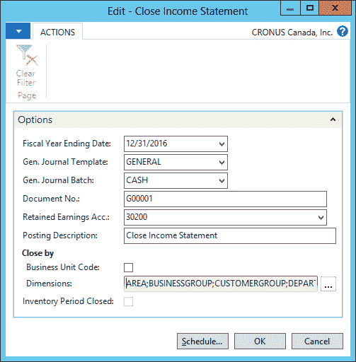

    ### 注意

    即使不是强制性的，如果您使用维度，强烈建议在运行**关闭损益表**批量过程时选择所有维度。如果您选择不这样做，当按维度运行财务报告时，您将携带余额从一年到另一年，因为关闭交易将不会使用维度过账。

1.  点击**确定**。

1.  导航到您在运行过程中选择的日记账。

1.  注意，在**关闭损益表**中使用了一个特殊的日期。它前面有一个 C 字母，它是一个结账日期。它是在旧会计年度的最后一天和新会计年度的第一天之间的一个虚构日期。使用这种类型的日期，维护了会计年度普通日期的余额。请参考以下截图：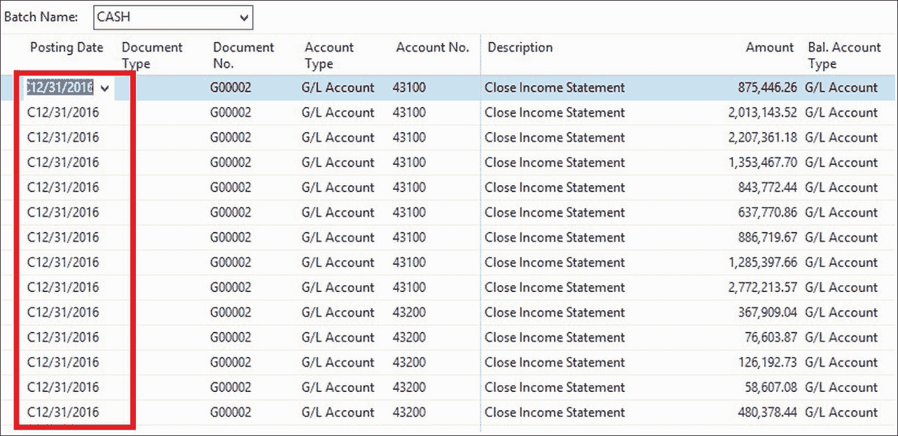

1.  过账日记账。

## 限制允许的过账日期

强烈建议你在关闭一个期间后限制允许的过账日期。这样，你可以防止用户意外地将交易过账到错误的日期。

过账日期可以在公司级别或用户级别进行限制。

### 注意

当存在公司和用户限制时，应用的是在用户级别定义的允许过账日期。

要在公司级别限制允许的过账日期，请导航到**财务管理** | **管理**并点击**总账设置**。使用**允许过账从**和**允许过账到**字段来指定允许过账交易的期间，如下截图所示：

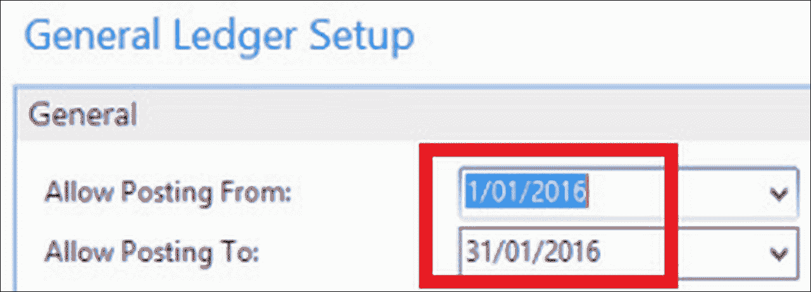

要在用户级别限制允许的过账日期，请导航到**管理** | **应用程序设置** | **用户**并点击**用户设置**。使用**允许过账从**和**允许过账到**字段来指定允许过账交易的期间。请参考以下截图：

## 在已关闭的年度过账交易

如果允许的过账日期允许你这样做，你可以在已关闭的年度过账交易。然而，你将不得不再次运行**关闭损益表**批处理过程。这个过程可以根据需要运行多次。

# 财务报表合并

当你有一组公司时，你可能需要将它们的财务报表合并成一个，以了解控股公司作为一个整体的表现。

这样的任务可以执行以合并位于同一数据库中的不同公司、位于不同数据库中的公司（甚至在较旧的 Dynamics NAV 版本中），或使用来自其他业务管理程序的数据。

关于数据，当不同的子公司或业务单元有不同的会计科目表、会计年度或货币时，可以进行合并。

## 执行合并

执行合并就像执行批处理一样简单。然而，根据数据所在位置，存在不同的场景。最简单的情况是，包括合并公司和子公司在内的所有公司都在同一数据库上。另一种情况包括在不同数据库上的 Dynamics NAV 公司。第三种情况包括来自其他应用程序的财务数据。无论使用哪种场景，合并过程都会执行以下操作：

+   子公司中每个账户的交易都进行了总计

+   净金额被转移到合并公司相应的账户上

+   由于子公司部分合并（仅合并控股公司参与的子公司百分比）时可能出现的舍入差异，残差金额在合并公司中过账

### 备注

合并可以按需执行多次。如果同一子公司和期间在合并数据库中已存在交易，则现有交易将被取消（其金额设置为零）。这样，合并公司只会考虑最后一次执行的合并信息。

### 在单个数据库上合并

要合并位于同一数据库上的多个子公司，我们执行以下步骤：

1.  打开合并公司。

1.  导航到**财务管理** | **定期活动** | **合并** | **业务单元**。

1.  在**操作**选项卡上，点击**导入数据库...**。

1.  指定合并期间和合并交易的文档编号，如以下截图所示：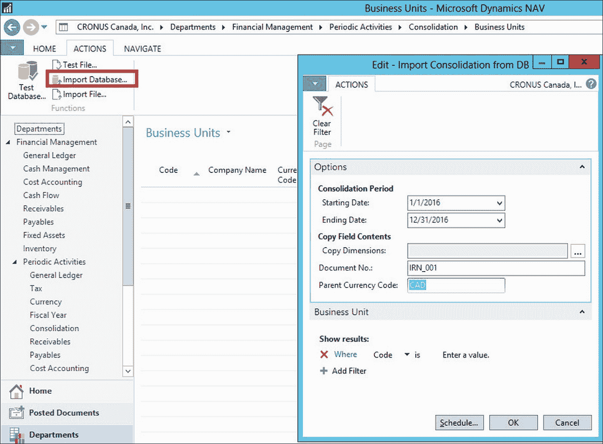

1.  点击**确定**。

### 与不同数据库的合并

当合并位于不同数据库上的子公司时，您必须首先导出每个子公司的财务数据，然后将其导入合并公司。

要从每个子公司导出财务数据，请在每个子公司执行以下操作：

1.  打开子公司。

1.  导航到**财务管理** | **定期活动** | **合并**并点击**导出合并**。

1.  选择**合并期间**和文件格式。文件格式取决于合并公司使用的 Dynamics NAV 版本。请查看以下截图：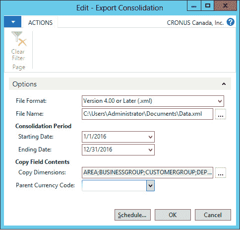

1.  点击**确定**。

1.  保存文件。您稍后需要此文件。

将数据导入合并公司，需要对之前导出的每个文件执行以下操作：

1.  打开合并公司。

1.  导航到**财务管理** | **定期活动** | **合并** | **业务单元**。

1.  在**操作**选项卡上，点击**导入数据库**。

1.  指定从子公司导出数据时使用的文件格式以及合并交易的文档编号。

1.  点击**确定**。

1.  选择您之前导出的文件。

### 与其他应用程序合并

要合并使用其他业务管理应用程序的子公司，您需要首先从业务管理应用程序导出数据，然后将其导入 Dynamics NAV 的合并公司中，就像合并位于不同数据库中的子公司一样。

其他应用程序应该能够以与 Dynamics NAV 相同的格式导出数据，这可以是 `.txt` 或 `.xml` 文件。

## 在合并公司中进行报告

任何现有的财务报告都可以用来对合并公司进行报告。此外，还有一个**合并试算平衡表**，它显示了每个子公司的个别金额和总计，考虑了所有公司。

此报告可以从任何业务单元卡执行。

## 设置它

设置一切是合并的困难部分。但这是一项只需做一次的事情，所以值得努力。

财务合并通常是将数据合并到一个为单一目的创建和配置的公司中。这个公司不会持有正常业务交易。

要设置财务合并，您需要执行以下任务：

1.  创建一个新的空公司。它将成为合并公司。

1.  在该公司上创建会计科目表。合并会计科目表可以与子公司中使用的不同。子公司可以各自拥有不同的会计科目表。

1.  在合并公司中，指定我们将要合并的业务单元（子公司）。

1.  在每个子公司上，定义其会计科目表与合并会计科目表之间的转换。

在合并时可以使用维度。我们尚未解释什么是维度，所以现在我们将跳过这部分内容。

### 定义业务单元

业务单元是将在合并公司中使用的子公司。可以通过导航到**财务管理** | **定期活动** | **合并** | **业务单元**来找到它们。以下截图显示了**业务单元卡**页面：

在定义业务单元时，您还需要指定一个**代码**和一个**名称**：

+   **公司名称**：这是为了指定业务单元是在 Dynamics NAV 还是其他业务管理应用程序中创建的。

+   **货币代码**：用于指定子公司是否使用与合并公司不同的货币。还指定使用哪种汇率（在子公司定义的或在合并公司定义的）。

+   **合并百分比**：这个数字表示控股公司或集团对子公司参与的程度。例如，当**合并百分比**为 50 时，该子公司的余额只有一半将被合并。

+   **总账账户**：这是由于货币差异或由于合并中使用的百分比可能产生的剩余金额，在合并公司上记录交易的地方。

### 翻译会计科目表

在每个子公司上，我们需要指定该公司会计科目表与合并公司定义的会计科目表之间的转换。转换是在每个总账账户卡片上的**合并**快速选项卡上进行的。您可以定义借方和贷方余额的不同目标账户。

请查看以下截图：

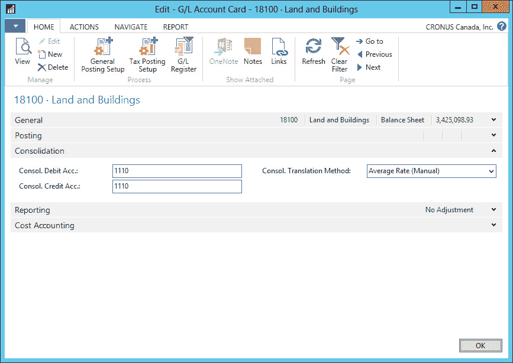

# 延期收入

延期收入和支出用于记录在交易发生期间以外的会计期间。

您需要执行的设置如下：

+   **延期账户**（资产负债表）的主要账户设置，其中延期收入被记录，当您为跨越多个会计期间的已提供的服务开具销售发票时。请参考以下截图：

+   延期模板设置是在这里您可以定义**延期账户**、**期间数**、**计算方法...**、**开始日期**等，如下面的截图所示：

+   将延期模板分配给**资源**，如下所示：

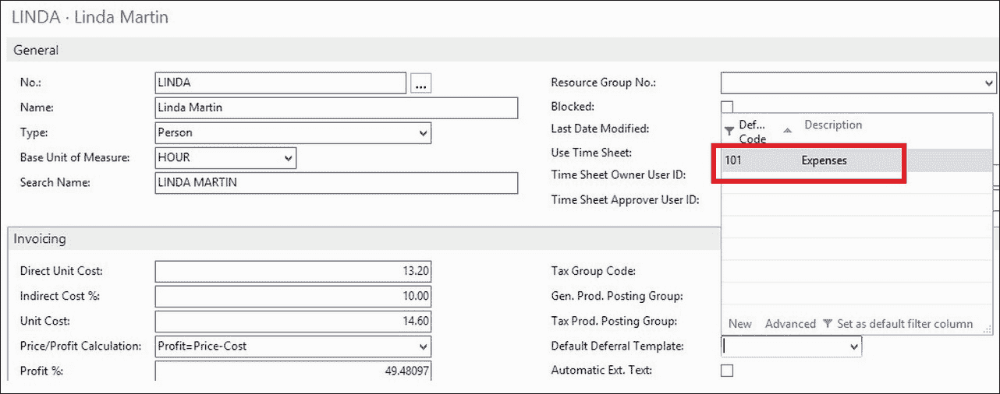

+   按如下方式记录销售发票并查看延期交易：

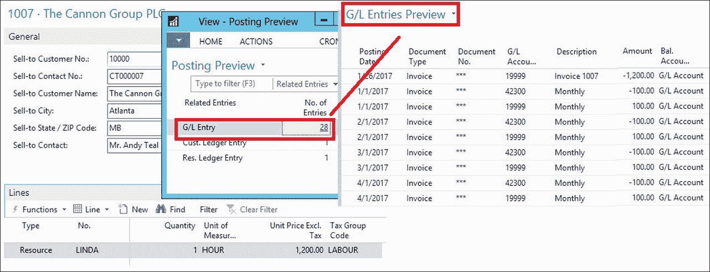

# 摘要

在本章中，我们学习了如何使用日记账记录任何会计交易。我们探讨了涉及税收时如何创建增值税条目以及我们如何使用它们向当局报告税收。我们看到了如何创建固定资产并记录其购置成本，重新评估它，计算其折旧，出售它或取消错误条目。

在年度会计结账部分，我们学习了我们需要执行的步骤以关闭财政年度，在库存评估部分，我们遇到了不同的成本计算方法和如何将项目成本反映到总账中。最后，我们看到了如何执行不同子公司的合并。

在下一章中，我们将探讨 Dynamics NAV 中可用的报告工具。这样我们就能分析系统中收集的所有数据。
