# 第四章 报告和商业智能

到目前为止，我们在前几章中已经看到了 Dynamics NAV 的数据输入和数据处理方面。一旦数据被引入系统，你应该能够分析它。

我们的部门是否为公司创造了价值？哪些商品或服务最有利可图？哪个区域的销售增长更快？分析和报告可以帮助你回答这些问题。

在本章中，我们将看到可用于分析 Dynamics NAV 数据（在应用程序内和应用程序外）的工具。本章涵盖了以下主题：

+   维度

+   过滤器、图表和统计

+   报告

+   账户计划

+   分析视图

+   使用 Excel 和 PowerPivot 进行商业智能

# 理解维度

“维度”一词用来描述分析是如何进行的。例如，二维分析可以是按区域销售。在更复杂的场景中，我们还可以按销售活动、客户群体和区域分析销售。

为了能够分析这些维度，你必须确保每个条目都包含所需的信息。在 Dynamics NAV 中，维度可以看作是与条目相关联的信息，例如标签或特征。维度的目的是将具有相似特征的条目分组，以便你可以以对公司有意义的方式报告数据。

你可以根据需要分析数据来定义自己的维度。每个维度可以有无限多的维度值，它们是维度的子单位。例如，一个名为`部门`的维度可以有子单位名为`销售、行政`等。这些部门是维度值。

在 Dynamics NAV 中，你可以创建无限多的维度。然而，在访问它们的信息方面有一些限制。我们可以根据它们的访问级别（访问它们有多容易）将维度分为三类：

+   **全局维度**：访问和过滤它们非常容易。我们可以使用多达两个全局维度。

+   **快捷维度**：你需要打开一个单独的页面来访问它们。在某些情况下，它们会显示在页面的日记和文档页面上，以便更容易引入。我们可以使用多达八个快捷维度。其中两个对应于全局维度。

+   **其他维度**：你总是需要打开一个单独的页面来介绍或查看它们。

## 在主数据上定义默认维度

假设你想根据客户的大小来分析你的销售。你创建一个名为**CUSTOMERGROUP**的维度，并定义不同的维度值，如**大**、**中**和**小**。

一个客户可能只属于这些群体中的一个，因此你可以将其作为客户的默认维度。你可以通过以下步骤来完成：

1.  导航到**部门** | **销售与市场** | **销售** | **客户**。

1.  选择`01905902`，`伦敦 Candoxy 存储园区`客户，并点击功能区上的维度/维度单图标。打开**默认维度**页面。

1.  为**CUSTOMERGROUP**维度创建一个新的行，如图所示：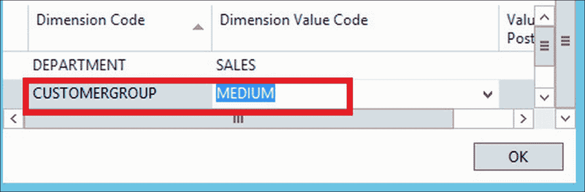

现在，每次您为客户发布新的发票或在文档或期刊中使用客户时，都会使用定义的默认维度。

### 注意

默认维度可以在所有主数据中定义，例如客户、供应商、总账账户、项目、资源、固定资产等。

## 在文档和期刊中使用维度

在某些情况下，默认维度不足以满足需求，您需要通知单份文档或单条期刊线上的维度信息。让我们通过一个例子来了解一下：

1.  为客户`01905902`，`伦敦 Candoxy 存储园区`创建一个新的销售发票。

1.  点击功能区上的维度图标。打开**维度集条目**页面。

1.  为客户和销售人员定义的默认维度已经转移到文档中。创建一个新的**SALESCAMPAIGN**维度行，如图所示：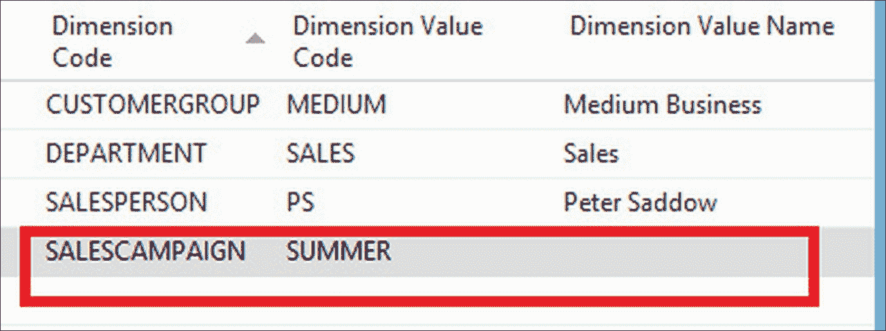

一旦发布发票，所有生成的条目都将与四个维度相关联。

### 注意

在示例中，我们添加了一个新的维度，但您也可以删除已转移的默认维度之一或更改此单张发票的维度值。

在示例中，我们已为整个文档设置了维度值，但也可以在文档行级别设置维度值。

# 使用筛选和流程筛选

一个良好且强大的查看和分析数据的方法是在应用程序内部使用筛选和流程筛选。它们都用于缩小屏幕上显示的信息或报告生成的信息。筛选可以应用于所有页面和大多数报告。在本节中，我们将了解如何在页面上应用筛选和流程筛选。在*使用报告*部分，我们将了解如何在报告中应用它们。

## 在页面上应用筛选

筛选面板位于页面顶部，如图所示：

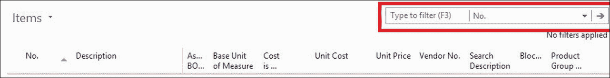

在右上角有一个快速筛选区域，可以应用筛选到屏幕上显示的任何字段。也可以一次性应用筛选到两个或更多字段，或者应用到屏幕上未显示的字段。为此，应通过点击**快速筛选**区域右侧的下箭头来显示**高级筛选**区域。屏幕上应显示一个**显示结果**子区域，类似于以下截图：

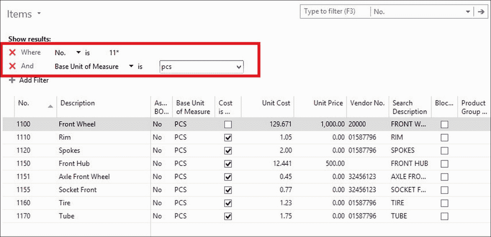

在**高级筛选**区域，您可以选择任何字段进行筛选，也可以添加新的筛选条件。

假设我们想在项目列表中看到所有单位成本**>=100**且供应商编号为供应商**20000**或供应商**30000**的项目。我们可以通过在**单位成本**和**供应商编号**字段上应用过滤器来仅看到这些项目，如下面的屏幕截图所示：

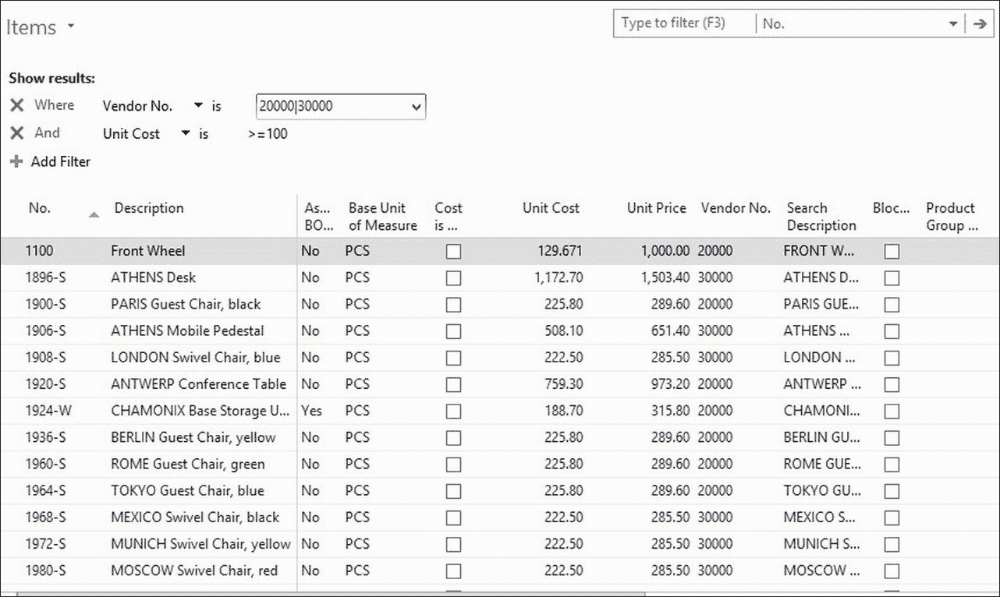

可以使用多种过滤表达式，包括运算符（`>`、`<`和`=`）、语句（`|`和`&`）、区间、复合表达式等。

### 注意

要获取可用过滤表达式的完整列表，请参阅位于[`msdn.microsoft.com/en-us/library/hh879066(v=nav.90).aspx`](https://msdn.microsoft.com/en-us/library/hh879066(v=nav.90).aspx)的在线文档。

## 在页面上应用流程过滤器

流程过滤器是一种特殊类型的过滤器，它不是用来缩小结果，而是用来缩小计算。您在应用程序中看到的一些信息实际上是基于其他信息的计算。例如，客户和供应商的余额实际上是基于他们的账簿分录的计算。同样，项目上的库存或总账账户的余额也是如此。

让我们看看如何在账户图表上应用流程过滤器以及它产生的结果。我们将执行以下步骤：

1.  通过导航到**部门** | **财务管理** | **总账** | **账户图表**来打开账户图表。

1.  在此页面上，**净变化**和**余额**字段显示不同账户的日记账分录金额总和。

1.  点击**账户图表**并选择**限制总计到**。

1.  添加**日期过滤器**的过滤器，并将其设置为`01/01/16..12/31/16`。

1.  **净变化**字段将被更新。在没有应用流程过滤器的情况下，**净变化**和**余额**都显示了相同的金额。请参阅以下屏幕截图：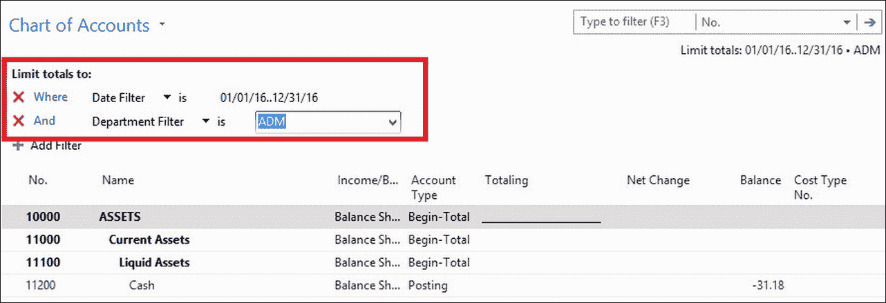

并非所有流程过滤器都适用于所有流程字段。在示例中，我们已看到，在应用日期流程过滤器后，**净变化**字段得到更新并仅显示指定期间的 G/L 分录金额总和，而**余额**字段保持不变。这是因为字段定义的原因。**净变化**字段的定义指出，此字段的计算将考虑日期过滤器，而**余额**字段则不考虑。

## 创建视图

我们已经看到了如何在页面上应用过滤器和流程过滤器。但是，如果我们离开页面并在稍后再次打开它，过滤器就会消失。如果我们想看到相同的结果，我们必须一次又一次地应用相同的过滤器或流程过滤器。如果我们可以保存过滤器，以便我们可以多次应用它们，而无需再次选择要过滤的字段并编写过滤表达式，那岂不是很好？这是通过保存视图来实现的。

要保存视图，请执行以下步骤：

1.  按照上一节中提到的步骤在项目列表页面上应用过滤器。

1.  点击**项目**并选择**另存为视图...**。

1.  为视图指定一个**名称**并选择您想要保存视图的**活动组**，如图下截图所示：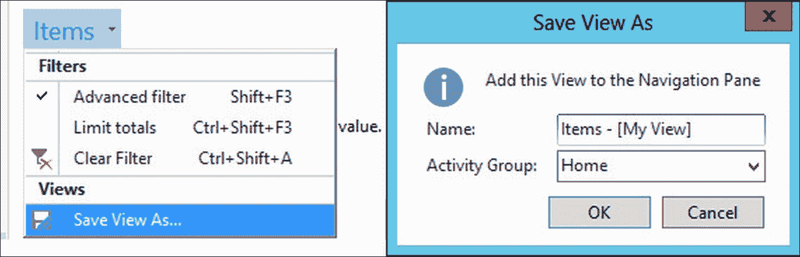

每次您想查看已保存的视图时，请按照以下步骤操作：

1.  点击**主页**（或点击您已保存视图的**活动组**）。

1.  点击您的已保存视图。

# 使用报告

Dynamics NAV 提供了一系列可以直接使用的报告。一些其他报告可能由合作伙伴添加，也可以使用。

大多数报告可以在所有功能区域的“报告和分析”类别下找到。它们也可以在许多应用程序页面上找到，其中只显示适用于页面显示数据的报告。

在运行报告时，通常会显示报告的请求页面。在请求页面上，您通常可以指定不同的选项。您可以应用过滤器来缩小将显示或处理的信息，并且可以选择是否预览报告或将报告打印到不同的设备或应用程序（使用打印机或打印到 PDF、Excel 或 Word）。

在以下截图中，您可以查看**客户前 10 名列表**报告的请求页面：

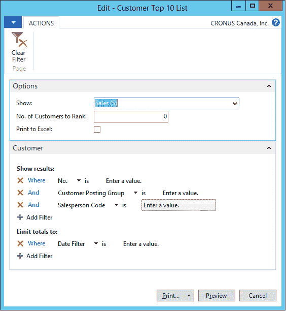

并非所有报告都有选项部分，也并非所有报告允许应用过滤器。每当这些情况发生时，相应的部分将不会显示。

# 显示图表

在分析数据时，图形信息总是很有用。Dynamics NAV 提供了多种以图形方式查看数据的方法。

## 显示为图表选项

当屏幕上显示的信息可以以图表形式查看时，在功能区的主页标签上，您将看到一个名为**视图**的部分，用户可以在此切换信息从列表到图表，反之亦然，如图下截图所示：

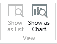

当您切换到图表视图时，您可以选择哪些字段用作度量，哪些用作维度。

## 将图表添加到角色中心页面

Dynamics NAV 提供了一套预定义的图表，可以添加到**角色中心**页面。要将图表添加到主页，请执行以下步骤：

1.  点击**主页**。

1.  点击应用程序图标，点击**自定义**，然后点击**自定义此页面**。

1.  从**可用部分**列中选择**图表部分**并点击**添加**按钮。

1.  **空白图表**将出现在**角色中心布局**列中。

1.  选择**空白图表**并点击**自定义部分**按钮。

1.  选择一个可用的图表。

1.  点击**确定**以关闭**自定义角色中心**窗口

返回到**角色中心**页面，您将看到显示所选图表。

如果预定义的通用图表不足以满足您的需求，您可以定义自己的通用图表，并使其对所有用户可用。为此，导航到**部门** | **管理** | **应用程序设置** | **角色定制客户端** | **通用图表**，并通过指定应显示的信息创建您的图表。

# 使用账户时间表

账户时间表功能是**财务管理**区域**分析与报告**部分的一部分。它旨在根据总账信息、预算信息或分析视图信息创建定制的财务报告。账户时间表可以分组来自不同账户的数据，并执行在账户图表上无法直接进行的计算。

在定义账户时间表时，可以在行和列上显示的信息可以定义。

为了看看它是如何工作的，我们将创建一个简单的账户时间表，该时间表将比较预算金额与实际金额。为此，我们执行以下步骤：

1.  导航到**部门** | **财务管理** | **报告与分析**并选择**账户时间表**。

1.  点击**新建**以创建新的账户时间表。对于新的账户时间表，选择**示例**作为**名称**，**比较预算与实际**作为**描述**，以及**ACT/BUD**作为**默认列布局**。

1.  点击**账户时间表**。

1.  按照以下截图定义账户时间表：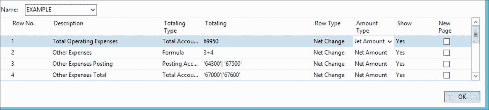

1.  截图中的行表示以下内容：

    +   第一行获取账户`69950`的净额，这是一个汇总账户，总结了所有运营费用。

    +   在第二行，一个公式将行`3`和`4`的结果相加。

    +   第三行从过账账户`64300`和`67500`获取其他费用的净额。由于此行仅用于计算目的并在报告中显示，**显示**字段已设置为`是`。

    +   第四行从汇总账户获取其他费用的净额。使用的汇总账户是`67000`和`67600`。**显示**字段已设置为`是`。

账户时间表现在已完全定义。账户时间表定义了将在报告中显示的行。列在**列布局**页面中定义。在示例中，我们使用了一个名为**ACT/BUD**的现有列布局。让我们看看以下列布局将显示什么：

1.  在我们定义账户时间表的**账户时间表**页面上，点击**操作**选项卡，然后点击**编辑列布局设置**。

1.  在**名称**字段中选择**ACT/BUD**。将显示**ACT/BUD**列布局定义。参考以下截图：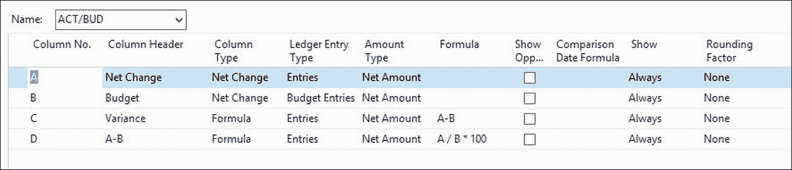

1.  列布局定义了报告将包含四个列，称为**净变动**、**预算**、**差异**和**A-B**：

    +   **净变动**列将显示总账分录的净额

    +   **预算**列将显示预算条目的净金额

    +   **差异**列将显示第一列和第二列之间的差异

    +   **A-B**列计算第一列相对于第二列的百分比

现在我们已经定义了账户表和列布局，是时候查看账户表的结果了。

1.  导航到**部门** | **财务管理** | **报告和分析** | **账户表**。选择我们刚刚创建的账户表。

1.  点击**概览**。报告将在屏幕上显示，类似于以下截图：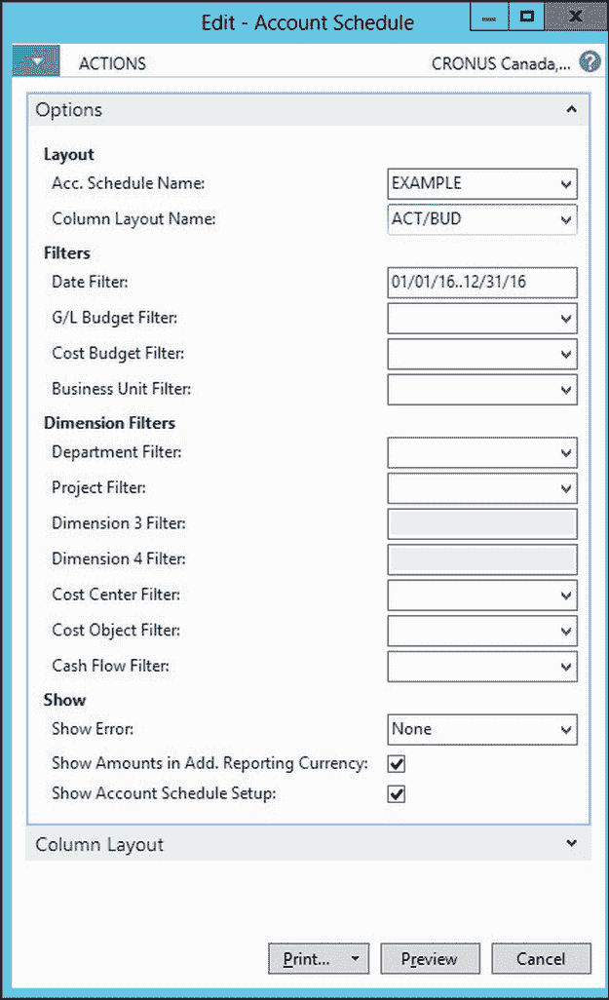

### 注意

结果可以按不同的时间段查看，并且可以在计算上应用过滤器以获得更准确的结果。结果可以导出到 Excel，也可以打印。

# 分析视图

分析视图用于分析来自总账条目、预算和现金流量预测条目的维度信息。正如我们所看到的，并非所有维度都易于访问。分析视图旨在以相同的方式访问所有维度，同时最多可以同时访问四个维度组。这四个维度组可能看起来是一个限制，但实际上并不是，因为我们可以根据需要创建尽可能多的分析视图，结合我们想要的全部维度。

## 创建分析视图

按照以下步骤创建分析视图：

1.  导航到**部门** | **行政管理** | **应用设置** | **财务管理** | **维度** | **分析视图**。将打开**分析视图**页面，显示现有的分析视图。

1.  点击一个现有的分析视图。查看以下截图所示的分析视图卡片中的数据：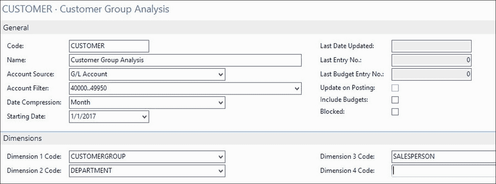

1.  点击功能区上的**更新**选项，根据您在卡片上设置的准则创建分析视图条目。

    ### 注意

    系统将为每个总账账户、期间和维度组合创建一个汇总的分析视图条目。

    在示例中，我们将从**账户过滤器 40000..49950**中的每个总账账户，每个月以及**CUSTOMERGROUP**、**DEPARTMENT**和**SALESPERSON**维度值的每个组合中获取一个条目。

1.  导航到**部门** | **财务管理** | **总账** | **历史** | **分析视图条目**，以查看系统创建的条目。

分析视图是按照特定标准分组显示的已发布总账/损益表条目的固定照片。因此，如果您更改卡片上的任何字段（即更改了标准），系统将提示您删除分析条目并重新更新。

您还必须使用更新操作来包括在您上次更新分析视图之后过账的新总账条目。但是，您也可以通过检查分析视图卡上的**更新在过账时**字段，让系统在新的总账条目过账时自动更新它们。

### 小贴士

不建议使用**更新在过账时**选项，因为它在过账时会惩罚性能。

## 使用分析视图

分析视图可以在按维度分析功能中使用，也可以作为账户计划的来源。在本节中，我们将分别举例说明。

### 按维度分析

按维度分析功能用于显示和分析从现有分析视图中得出的金额。为了设置一个例子，请执行以下步骤：

1.  导航到 **部门** | **财务管理** | **总账** | **分析与报告** | **按维度分析**。

1.  定位到本章中较早创建的`CUST.REVEN`分析视图。然后从功能区点击**编辑分析视图**。

1.  打开一个新页面。在**客户组过滤器**字段中输入`LARGE`。

1.  点击功能区上的显示矩阵图标。现在**按维度分析矩阵**页面显示了在**客户组**维度的**LARGE**值下过账的总账金额。请参考以下截图：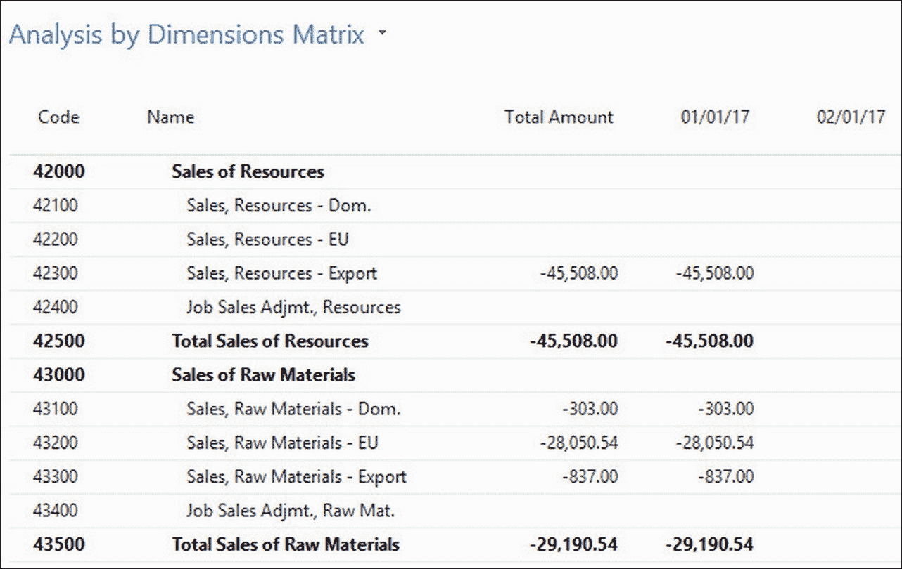

1.  关闭当前页面并返回到**按维度分析**页面。

1.  选择以下字段的不同的值，然后点击**显示矩阵**以查看结果。您可以通过更改以下字段来分析数据：**显示为行**、**显示为列**、**维度过滤器**、**显示**、**显示金额字段**、**按**和**显示为**。

### 分析视图作为账户计划的来源

如果将分析视图选为账户计划的来源，账户计划中的金额将基于分析视图条目进行计算。由于分析视图条目基于总账条目，结果应该相同。

差异在于，当分析账户计划时，您只能根据全局维度过滤金额。但如果您使用分析视图作为来源，则可以在分析视图卡上选择的四个维度中的任何一个上进行过滤。这些维度可以是全局维度、快捷维度或任何其他维度。要将分析视图作为账户计划的来源，请执行以下步骤：

1.  导航到 **部门** | **财务管理** | **总账** | **分析与报告** | **账户计划**。

1.  定位到**收入**账户计划。注意在**分析视图名称**字段中已选择了一个分析视图。这就是为什么可以将分析视图作为账户计划的来源。请参考以下截图：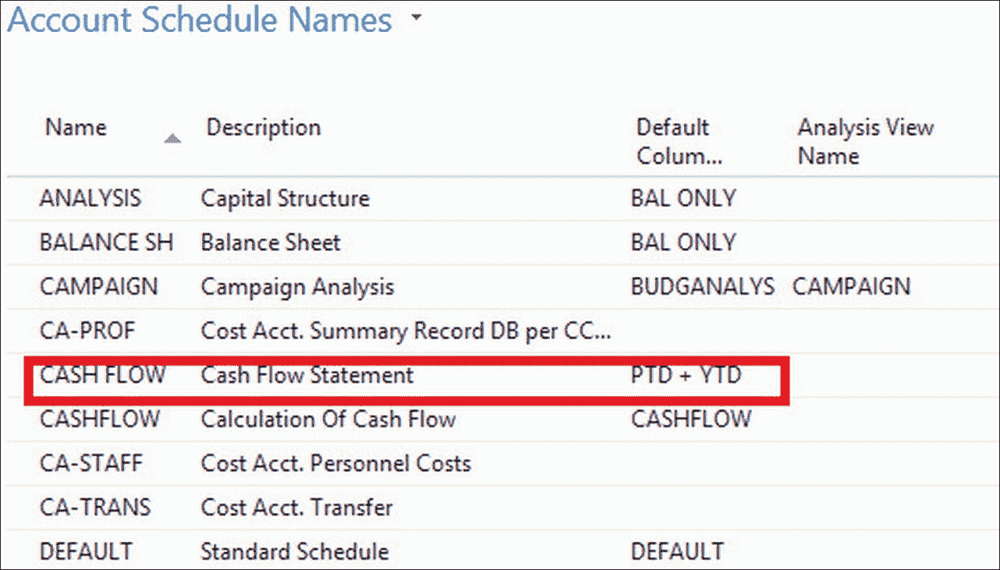

1.  点击功能区上的 **概览**选项。打开 **会计科目概览**页面。注意，你现在可以过滤分析视图中设置的三个维度中的任何一个。选择这些字段的不同值，以查看如下截图所示的结果：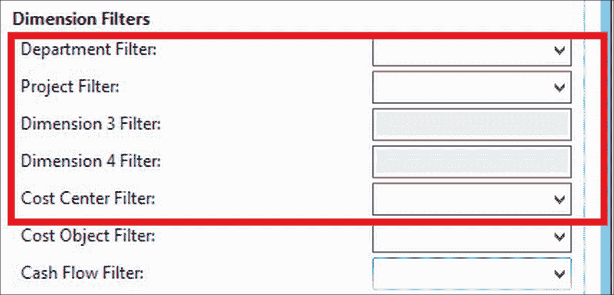

# 使用 Excel 和 PowerPivot 进行商业智能

使用 Dynamics NAV，我们可以轻松地在 Microsoft Excel 中使用 **商业智能**（**BI**）工具创建自己的报告。让我们创建一个报告来分析按客户或按项目分组的总销售额和利润：

1.  打开 Excel。在 **PowerPivot** 选项卡上，点击 **PowerPivot 窗口**选项。

1.  打开一个新页面。导航到 **从数据库** | **SQL 数据库**。输入 Dynamics NAV 的服务器和数据库名称。点击 **下一步**。

1.  在表格和视图列表中选择**选择数据导入选项**。

1.  从表格和视图列表中选择以下表格：

    | **表名** | **注释** |
    | --- | --- |
    | CRONUS 国际 `Ltd_$Value` Entry | 点击 **预览和过滤器**。过滤 **项目账目类型**字段，仅显示值为 1 的行。 |
    | CRONUS 国际 `Ltd_$Item` |  |
    | CRONUS 国际 `Ltd_$Customer` |  |

    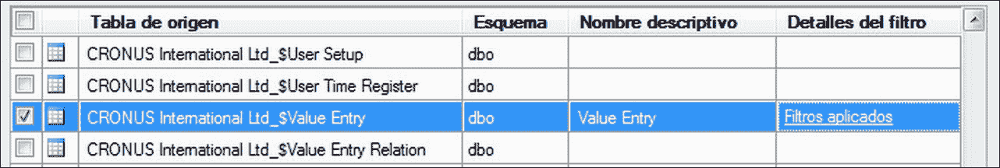

1.  点击 **完成**。然后点击 **关闭**。关闭 **PowerPivot 窗口**以返回到 Excel 工作表。

1.  现在我们已经选择了数据源，让我们创建一个数据透视表。为此，点击 Excel 的 **数据透视表**选项。选择 **新工作表**并点击 **确定**。

1.  在 PowerPivot 字段列表中，选择以下截图所示的字段。如果出现消息 **可能需要创建关系**，点击 **创建**。PowerPivot 表将显示按客户和项目分组的销售，如下面的截图所示：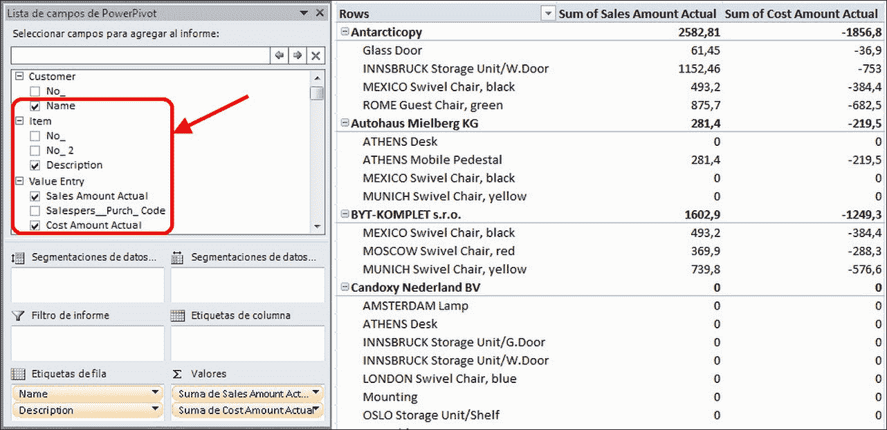

现在，我们可以使用数据透视表选项，并在行、过滤器、细分等处添加更多字段。

一旦我们创建了 Excel 的数据透视表，我们就可以保存它，稍后再打开。我们只需刷新 PowerPivot 源以获取最新数据；我们不需要重新创建整个报告。

### 备注

使用 PowerPivot，数据源始终是 Dynamics NAV。数据不会从数据库复制到 Excel，因此不存在重复。

# 摘要

在本章中，我们学习了维度是什么，并看到它们是标记我们所有账目条目的工具。它们允许您以对公司有用的方式分析系统中保存的数据。我们学会了使用筛选器、流程筛选器和图表在屏幕上分析数据。我们还了解了报告，这是一种现成的数据分析方法。账户计划表是一种帮助我们分析账目条目数据的工具，分析视图也是如此。分析视图也有助于按维度分析财务组。最后，我们看到了如何将 Excel 与我们的 Dynamics NAV 数据库链接起来，以便能够使用 Excel 中包含的业务智能工具。

在下一章中，我们将探讨 Dynamics NAV 中包含的不同预测工具，例如预算或现金流预测。
