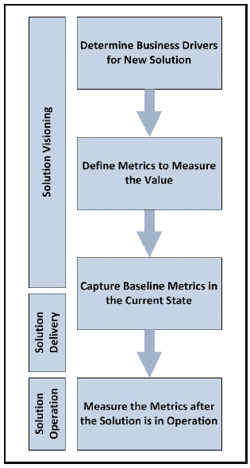
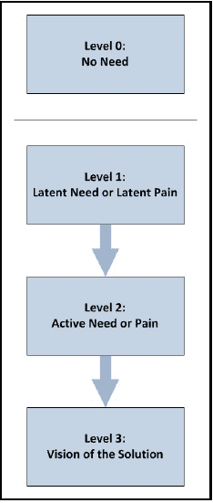
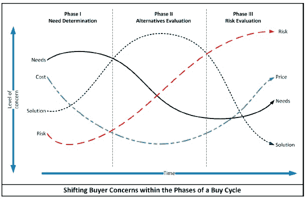
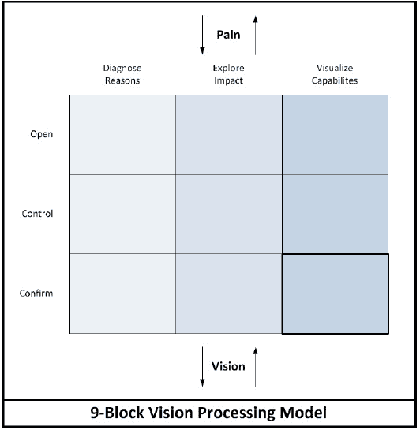
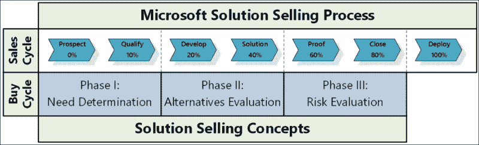

# 第二章. 解决方案销售和推动尽职调查

在上一章中，我们讨论了拥有业务解决方案选择和交付方法的重要性。我们讨论了拥有方法对服务提供商和客户的好处。不仅方法通过工作流程和流程提供了一致和可重复的方法，而且还提供了与各种学科的连接，以及涉及解决方案交付执行的多重角色的协调。

对于商业解决方案，特别是对于 ERP/CRM 解决方案，我们也引入了全生命周期方法的概念。客户生命周期方法包括解决方案发现阶段、解决方案交付阶段，并继续到解决方案的运营和任何未来的升级。从发现阶段开始，全生命周期方法提供了一个结构化的解决方案评估流程，以及从诊断阶段到解决方案交付阶段的适当知识传播，从而确保最终解决方案设计与原始解决方案愿景保持一致。

诊断/发现阶段为成功奠定了基础，在这个阶段，客户和合作伙伴不应走捷径。有许多研究出版物和分析师报告都恳请公司在选择满足其组织需求的正确解决方案时进行彻底的审查过程。在本章中，我们将重点关注发现/诊断阶段的解决方案选择和尽职调查方面。

在本章中，我们将讨论以下内容：

+   诊断过程如何为客户和解决方案提供商创造价值

+   为了成为以解决方案为中心的组织，一个组织需要做些什么

+   解决方案销售对服务提供商的销售周期和客户的尽职调查过程意味着什么

+   微软支持解决方案销售过程的方法

# 为客户和解决方案提供商创造价值

商业解决方案应该关于在客户组织中创造价值。就这么简单！正如我们在第一章中讨论的那样，*背景和概念*，ERP 和 CRM 解决方案由于它们支持的核心功能而至关重要，包括从报价到订单录入、订单履行、收付款、人力资源和薪酬、库存管理、需求预测和销售管道以及客户关系管理。基于与这些解决方案接口的组织功能数量以及它们对这些系统的依赖程度，很容易看出系统对组织的影响。一个好的销售团队将在销售周期中阐述这一价值，并以客户能够相关联的指标来定位解决方案。

当解决方案与价值相关联时，在客户的组织中推动项目执行支持会更容易。对于如此规模的项目，执行支持在解决方案选择阶段以及解决方案交付期间都是绝对关键的。在解决方案的实施过程中，解决方案交付团队不可避免地会经历高峰和低谷。当存在明确的价值预测时，这些将成为团队在困境中继续前进的驱动器和激励因素。

为客户创造价值最重要的方面是确保正确的解决方案被定位以满足组织需求。一个好的销售团队总是将客户的需求放在首位。始终努力为客户及其组织做最好的事情，即使这意味着如果你确定它不适合你的解决方案，你将放弃这个机会。这就是道德发挥作用的地方，但当一个销售团队遵循这种思维方式时，他们将拥有欣赏和忠诚的客户。从长远来看，他们最终会站在胜利的一方，并且能够为自己的成就感到自豪。

*史蒂芬·柯维*在 20 世纪 90 年代出版了一本名为《高效能人士的七个习惯》的杰作。这本书因其易于遵循的方法而受到世界范围内的赞誉，该方法可以帮助我们解决日常生活中的道德和道德问题。*柯维*提倡的一个习惯是*双赢思维*，这与我们的当前讨论相关。高效的销售人员会努力实现双赢的交易，因为双方都会变得更好，最终都会获利。那些有短期眼光的人可能会通过欺骗客户在某些交易中取得成功，但长远来看，这会追上他们。

业务解决方案销售不应该只是为了填补销售期间的配额，而应该是帮助客户组织。当然，不能否认配额和奖金对销售行为的影响。然而，通过为客户匹配正确的解决方案，销售人员可以在帮助组织实现其潜力的同时实现个人目标。这应该给他们带来超越期末奖金的满足感。通过在销售过程中参与和告知客户，可以通过尽职调查过程实现长期价值。建立这种文化和在其组织中培养这些价值观的解决方案提供商最终会取得长期的成功。

## 价值实现和衡量

在客户的尽职调查过程中，服务提供商努力了解客户组织目前所处的位置以及他们对未来的愿景。拟议的解决方案将填补客户从现状到待实现状态的差距——有效的价值实现过程在这个周期早期开始，并与解决方案愿景和交付过程同步执行。

作为服务提供商为拟议的解决方案制定蓝图时，他们应该开始定义该解决方案将提供的价值。虽然这将在一定程度上包括确定客户满意度的条件，但确定价值的临界组件将是理解组织对拟议解决方案进行变革的业务驱动因素。

微软在其培训课程中定义业务驱动因素为：

> “一个简短声明，明确具体地定义了组织期望的业务成果以及实现这些成果所需的必要活动。”

业务驱动因素有助于传达组织的愿景和战略。它们清楚地阐述了将组织从当前（现状）状态转移到期望的未来（待实现）状态的目标和目标。

业务驱动因素还可以帮助将业务优先级与组织战略对齐。反过来，它们可以明确地将每个倡议与组织的战略目标对齐，同时帮助衡量期望的结果。

简而言之，业务驱动因素是应该为组织带来可量化节省的东西。因此，业务驱动因素应具有**SMART**属性：

+   具体明确

+   可衡量

+   既有挑战性又可实现

+   以结果为导向

+   时间限制

微软提供了一种直接的技术来定义或编写业务驱动因素。从动词开始，并添加要测量的元素和重点或强调领域。

```cs
Business Driver = Verb + Element to Measure + Focus or Area of Emphasis
```

使用前面的定义，以下是一些业务驱动因素的示例：

+   提高 ABC 产品的销售额

+   降低 Plant XYZ 的平均库存

+   提高区域办公室的**应收账款周转天数**（DSO）

+   加速新产品推出的上市时间

一旦定义了业务驱动因素，重要的是要捕捉将使价值可衡量的指标。这也就是前面的定义也很有帮助的地方，因为“要测量的元素”转化为指标或**关键绩效指标**（KPI）。

微软定义 KPI 为：

> “一个用于监控、预测和管理以实现特定目标所需绩效的仪器。”

价值测量声明随后包括关键绩效指标（KPI）和“阈值值”。

```cs
Value Measurement = Key Performance Indicator (KPI) + Threshold Value
```

以下是一些包含业务驱动因素的指标或 KPI 的价值测量声明的示例：

+   ABC 产品的销售额增加 500 万美元

+   Plant XYZ 的平均库存减少 15%

+   地区办公室的 DSO 将改善 5 天

+   新产品上市时间缩短了 30 天

在定义了业务驱动因素和 KPIs 之后，下一步是测量和捕获基线指标——当前（现状）下 KPIs 的值。这很重要，因为没有建立基线指标，您将无法量化新解决方案对驱动因素的影响，从而确定解决方案产生的实际节省。 

与 KPIs 的确定相关，定义测量的时间和频率也同样重要。实际执行测量结果通常只在解决方案实际运行一定时期后进行，但团队应提前决定何时进行测量。他们还应决定相应 KPIs 的测量频率。

在确定了业务驱动因素、关键绩效指标（KPIs）、基线指标和测量频率后，可以设置解决方案交付流程，以确保价值实现得到加速和最大化。在解决方案部署并经过一段稳定期后，可以测量实际结果或指标。

以下图表总结了在业务解决方案背景下的价值实现和测量过程：



在接下来的章节中，我们将讨论如何通过以解决方案为中心的方法实现识别可衡量的痛苦和价值实现这一概念。我们还将讨论解决方案销售如何帮助客户识别正确的解决方案，并为解决方案的实施奠定基础，从而实现该解决方案预期的价值。

# 解决方案中心化的含义

让我们首先从“解决方案”的定义开始讨论。简单来说，“解决方案”一词意味着对问题的回答。但英语同义词词典还提供了其他术语，如关键、阐明、阐明、解释、解决和结果。所有这些定义都很好地融入了业务解决方案销售的框架中，这也是问题的关键所在——“解决方案”对不同的人可能有不同的含义。因为解决方案可以应用于多个情境，所以它是在组织中常用且有时被滥用的词汇；因此，有必要明确定义该术语的使用。

在他的著作《新解决方案销售》中，**Sales Performance International**（**SPI**）组织的创始人**Keith Eades**讨论了解决方案的定义。他描述解决方案为“对已识别问题的共同认可的答案，特别强调问题需要双方，即买家（客户）和卖家（解决方案提供者）的认可”。书中强调的解决方案的第二方面是它应该“提供一些可衡量的改进”。基于此，Eades 提出了以下关于解决方案的定义：

> *对已识别问题的共同答案，并且这个答案提供了可衡量的改进。*

对于某些组织来说，声称他们拥有“解决方案”并且是“以解决方案为导向”的已经变得非常流行，因为这显然消除了与“产品”一词相关的负面含义。产品被视为销售公司强加给市场的产品，而解决方案则被视为市场积极寻求的东西，解决方案是卖家可以向买家提供的答案。那么，产品是不是解决方案的对立面呢？远非如此！在许多情况下，尤其是在商业解决方案的背景下，产品是解决方案的主要驱动力。但真正定义解决方案对客户成功或失败的是该产品的使用或交付。解决方案的前期定位是成功交付的关键，这就是以解决方案为中心的方法发挥作用的地方。

Eades 解释说，要真正以解决方案为导向，组织需要“不仅仅是表面的包装操作或捆绑产品和服务”。以解决方案为中心不应该被视为组织可以随意抛出的时髦词汇。在名为《以解决方案为中心的组织》的书中，Eades 表示，“以解决方案为中心的组织通过解决客户的问题来定义自己，而不是通过它们制造、销售或提供的产品或服务”。以解决方案为中心应该是一种渗透整个组织的哲学，这样销售、营销、产品开发和服务的团队都可以围绕一个共同的方法和模型进行协调。

在成熟的市场，如 ERP/CRM 解决方案市场，真正以解决方案为中心的需求更为重要。在这个市场中，许多顶级解决方案提供商提供的产品已经存在一段时间，并被许多组织使用。这些产品中的每一个都包含一套基础功能和特性，可能难以与竞争对手区分。**计划绩效指数**（**SPI**）将这种称为**差异化模糊**，这是由于产品被视为商品化，或者产品变得过于复杂和功能丰富，以至于行业无法将其与其他产品区分开来。为了应对这个问题，公司开始将他们的产品与服务捆绑在一起，并将这些视为解决方案。但他们真正实现的是创造了 SPI 所称为的“伪解决方案”。

这种方法既不能帮助寻找解决方案的客户，也不能帮助解决方案提供商发展出一套一致的销售方法。这一点进一步得到了行业分析师的市场调研的证实，他们发现这些解决方案提供商的价值定位只有 10%的有效率。研究还指出，在所谓的解决方案公司中存在的一些其他问题。在这些公司中，高达 70%至 80%的市场营销材料未被使用，这突显了销售和营销团队之间的脱节。研究还发现，这些公司随后将销售培训作为解决问题的手段，但他们常常发现未经加强的销售培训的有效期大约只有六到八周。

那么，一家公司如何才能真正以解决方案为中心呢？正如 SPI 所说，为了真正以解决方案为中心，组织需要采用持续的业务模式来营销、销售和交付客户转型。他们需要确定他们解决的问题，而不是他们提供的产品，将他们营销的所有方面与解决方案框架对齐，并在整个组织中系统性地采用和加强解决方案销售和以解决方案为中心的纪律。这样做的公司会发现，他们能够持续地向客户定位其解决方案的价值，明确区分与竞争对手的价值，并创造一个可持续增长的业务模式。

# 解决方案销售概念

在上一节中，我们讨论了公司在其整体组织中需要做什么才能成为以解决方案为中心。现在，我们将重点转向解决方案销售。我们将看到解决方案销售不仅如何帮助这些公司的销售团队，而且如何确保解决方案提供商帮助他们的客户实现并最大化其解决方案的价值。

解决方案销售和推动尽职调查是相互依赖的行动方案。虽然前者是服务提供商销售人员的更好流程，但后者是客户在产品选择过程中的更好机制。因此，一个好的解决方案销售流程有助于解决方案提供商，同时内在地帮助客户并确保尽职调查过程的彻底性，这反过来又为良好的解决方案交付流程奠定了基础。诚然，过程可能会偏向于解决方案提供商所代表的产品，然而，如果过程得到正确执行，客户应该能够清楚地确定其需求与解决方案之间的匹配程度，以及他们未来的解决方案将是什么样子。

让我们从解决方案提供商或解决方案销售员的视角开始探讨解决方案销售。在他的著作《新解决方案销售》中，Eades 讨论了解决方案销售如何帮助销售员——作为一个哲学、路线图、方法和管理系统。

解决方案销售是一种哲学，它能够渗透到组织的文化中，因为它将客户及其痛点作为焦点。解决客户的企业问题和取得积极成果是该哲学的关键要素。

解决方案销售提供了一张路线图，列出了实现销售组织最终目标的步骤。这包括识别和评估机会、诊断客户的问题和痛点、分析需求、制定解决方案愿景以及管理流程以实现成功的关闭。

解决方案销售可以被视为一种提供一系列工具、工作辅助、技术和程序的方法。当正确使用时，这种方法将导致更高的客户满意度和增加的销售生产力。

解决方案销售还创建了一个销售管理系统，通过在销售组织中建立高性能的销售文化，为销售和执行管理提供指导技能。因此，它也为整体销售绩效提供了一个有效的衡量工具。

## 解决方案销售 – 买家的视角

在最后一节中，我们从销售员的视角探讨了解决方案销售。现在，让我们从买家的视角来看解决方案销售。之前提到的四个领域中的三个直接影响到客户。

正如我们之前提到的，一个好的解决方案销售哲学将客户置于首位。任何使用这种技术的销售员都会自动考虑到客户的利益。这种方法在买卖双方之间建立了一种信任关系，并朝着实现预期解决方案结果的方向提供了一个更一致的方法。

解决方案销售流程中的步骤包括诊断问题或痛点、分析客户需求，以及制定与业务价值相匹配的解决方案愿景。这些步骤本质上帮助客户在挑选合适的解决方案以满足其需求时进行尽职调查。

解决方案销售提供了一种提高客户满意度的方法论。使用一致且经过时间考验的流程有助于销售团队利用他们在类似情况下的先前经验，客户可以利用这些经验为自己谋利。

在接下来的章节中，我们将讨论解决方案销售的两个关键方面：建立买卖双方的信任以及构建解决方案的愿景。

## 建立信任

通常，当买家认为他们所获得的产品或服务是他们问题的最佳解决方案，并且以最佳价格获得时，购买过程是最优的。随着购买规模的增加，买家在市场上进行研究的倾向也会增加，以寻求满足他们需求的正确解决方案和价格。本质上，买家的尽职调查过程的长度会随着其需求的重要性呈指数级增加。然而，还有一个因素可以影响买家的尽职调查过程，那就是信任——信任解决方案将满足他们的需求，信任卖家提供的最佳价格，信任卖家将交付承诺的解决方案，以及信任卖家在交付后出现任何问题时能够支持解决方案。

信任对于商业解决方案尤其重要。正如我们之前所指出的，商业解决方案是至关重要的任务，因此，本质上，任何错误的步骤或解决方案实现中的失败都伴随着高风险。因此，很容易理解建立信任的买卖双方关系的重要性。

更多的时候，信任是需要赢得的。在商业解决方案领域，拥有系统化流程的组织将更一致地取得成功。通过向买家展示你有一个经过深思熟虑、可重复的过程，你给予他们这样的舒适感：你已经与其他客户一起取得了成功，从而建立起信任。

解决方案销售流程就是这样一种流程，它允许你通过将注意力从“交易式销售”转向“关系式销售”来在客户中培养信任因素。

信任也可能具有经济影响。在《信任的速度》一书中，*史蒂芬·M·R·柯维*讨论了建立信任，并说明了信任如何成为经济驱动力。他的公式基于观察：信任总是影响两个结果——速度和成本。

当信任下降时，决策速度也会下降。这会使成本上升：

```cs
↓Trust = ↓Speed ↑Cost
```

当信任度上升时，决策速度加快，相应地，成本降低：

```cs
↑Trust = ↑Speed ↓Cost
```

*柯维*接着谈论信任的影响，将其比作税收或股息。他将信任融入传统的商业公式，并扩展如下：

```cs
(Strategy x Execution) Trust = Results
```

应该非常明显，信任的影响对于销售人员来说是一个重要的考虑因素。除了道德原因外，信任还对组织的销售成本产生经济影响。*柯维*用以下话语总结了信任的影响：

> *"与所有利益相关者——客户、商业伙伴、投资者和同事——建立、增长、扩展和恢复信任的能力是全球经济的关键领导能力。"*

我们也可以在我们的客户交易中看到信任的影响。当新的卖家带着解决方案接近客户时，买家会寻求证明他们的解决方案已经成功，否则买家会转向更成熟的供应商。为什么是这样呢？这是因为客户对新的供应商的信任程度不如对成熟的供应商。这就是销售组织采用解决方案销售作为哲学的更加重要的原因。解决方案销售是卖家与买家建立信誉和信任的最佳技术之一，正如我们所看到的，它可以积极影响他们的成功率。

## 构建愿景

解决方案销售的关键方面之一，也是其最普遍和渗透性的主题之一，是卖家与买家共同构建解决方案愿景的观念。当解决方案真正从买家的角度阐述时，客户对解决方案感知的风险要低得多，因此他们更容易接受该解决方案。

迈克尔·博斯沃斯是解决方案销售的原始先驱之一。他撰写了名为《解决方案销售》的书籍，也是目前由基思·伊德斯运营的组织的原始创始人。博斯沃斯在他的书中详细讨论了创造愿景的观念，并将很高的重要性赋予了愿景创造过程。在博斯沃斯看来，*人们从那些能为他们创造愿景的人那里购买*，*解决方案等同于买家的愿景*。

对于像商业解决方案这样的大宗商品，人们从人那里购买的观点很常见。这些不是你期望某人通过互联网或通过其他“未见其人”的方法做出的交易。客户将希望确立解决方案是可信的，提供解决方案的团队是值得信赖的，支持解决方案的组织将长期存在。但让我们假设所有事情都是平等的或足够接近，以至于差异不明显——例如，竞争者也有成熟的解决方案以及值得信赖和亲切的销售人员。博斯沃斯观点的关键点在于，当卖家能够使买家感觉到解决方案属于他们并符合他们的愿景时，买家会感觉到他们控制着这个过程，并且他们获得了授权。

博斯沃斯的教学将买家的需求与解决方案愿景过程联系起来。随着客户在购买周期中的移动，他们的关注点会随着时间的推移而改变。因此，卖家与客户保持一致并同步推进愿景变得非常重要。当买家能够清楚地可视化和阐述卖家解决方案的未来结果时，销售过程变得更加简单，从而缩短销售周期并提高成交率。

1943 年，阿尔伯特·马斯洛撰写了一篇关于我们需求层次结构的经典论文，题为《人类动机理论》。马斯洛的需求层次从最低需求水平到最高需求水平，如下所示：

+   **生理需求**：这是第一级，包括基本的人类需求，如空气、水和食物。

+   **安全需求**：第二级的特点是个人和财务安全、健康和福祉。

+   **爱和归属感需求**：第三级涉及社会和情感需求，如友谊、家庭和亲密关系。

+   **尊重需求**：第四级是关于被尊重的需求，包括自尊（他人的尊重）和自尊（内在力量）。

+   **自我实现需求**：这一级涉及个人充分实现其潜能。

这个层次结构的关键点之一是从第一级到第二级以及更高级别的需求发展。根据马斯洛的理论，如果一个人无法满足其基本需求，如食物和住所，他们就不太可能追求更高的需求，如声望和地位。有些人批评了这个层次结构，但它也已成为许多学科的基础，并且这个层次结构已经应用于许多领域。例如，市场营销在马斯洛需求层次的基础上，有许多关于理解消费者购买行为的教导。在商业和销售管理中，这种相关性也很明显，包括通过如超个人商业研究等领域的应用。

博斯沃斯还以马斯洛的需求层次为基础，从解决方案销售的角度发展了买家需求周期。下图描述了这一需求周期从潜在需求到解决方案愿景的进展：



+   在**零级**，买家对产品或解决方案没有需求，卖家也认识到这一点——例如，你不会在撒哈拉地区寻找销售暖灯。这一级别显然超出了解决方案销售的范畴。

+   在**第一级**，卖家看到了市场上的需求，但买家尚未意识到这种需求。因此，解决方案的潜在需求存在于卖家而非买家的脑海中。或者换句话说，这是买家的潜在痛苦。处于这一级别的卖家通过向买家投射他们对解决方案需求的愿景来进行操作。

+   在**第二级**，买家意识到他们的需求或痛苦，但不知道问题的解决方案。在这个阶段，由于需求或痛苦被认识到但未得到满足，买方和合适的卖方之间有潜在的销售解决方案的可能。如果买家相信存在潜在的解决方案，他们将会积极寻求解决方案，需求就变成了主动需求。然而，如果买家认为他们的问题没有解决方案，需求可能会被压制并回到**第一级**作为潜在需求。

+   在**第三级**，买家看到了解决方案的愿景。买家的需求已经从潜在需求发展到主动需求，到了他们可以预见解决他们问题的解决方案的程度。在这个阶段，买家正在考虑购买解决方案，并且有一个非常成熟的愿景，包括四个组成部分——谁将采取什么行动，何时采取行动，以及通过卖方的产品或服务的哪种能力来实现。

在买家需求发展的这个过程中，一个关键点是，在**第二级**，买家理解解决方案的潜力，但这些需求尚未被卖家采取行动，因此它们是“未开发的需求”。如果在这个阶段，卖家将自己的愿景强加给买家，就会产生一个次优情况，买家不得不信任卖家来解决问题。因此，对于卖家来说，在这个阶段让买家承认他们的痛苦非常重要。这是卖家证明买家认为他们是值得信赖的，并且有能力提供正确解决方案的证据。

另一个关键点是，为了使机会被视为合格，买家必须同意积极参与共同开发解决方案愿景。买家必须能够阐述解决方案的要求或同意参与需求评估过程。

如果销售员发现自己处于一个愿景已经形成，他们只是在比较自己的产品与竞争对手的情况，那么他们有成为买家决策过程中另一个勾选的风险。很可能买家已经与一个帮助他们制定需求的竞争对手达成一致，并且只是在完成购买前寻找额外的证据点或价格优势。

当买家能够看到针对他们需求的特定解决方案能力时，他们就能够明确解决方案的愿景并采取行动解决问题。

## 确定演示解决方案的最佳时机

另一个在《高效能人士的七个习惯》一书中，*史蒂芬·柯维*讨论的习惯是“先求理解，再求被理解”。这个习惯是解决方案销售的核心观念之一：通过首先理解客户试图解决的问题，耐心地培养对解决方案的兴趣。为了与客户建立双赢的关系，你必须理解对他们来说胜利意味着什么，换句话说，一个成功的解决方案对他们来说意味着什么。通过从客户的需求和愿望的角度概述目标，遵循“同理心沟通的原则”。这使你能够在客户的目标下制定解决方案愿景，从而促进更容易地接受你的解决方案。

对于解决方案销售，迈克尔·博斯沃斯有一个简单的信息：“诊断后再开处方”。开处方是指销售员以公司、产品或服务的演示作为开场。而不是关注客户的组织需求和利益，销售员的信息应该表述为“你需要……”。销售员不应假设买家已经了解他们的产品或服务将带来的价值。因此，他们应该首先尝试了解买家的需求，然后根据买家的价值指标定位他们的解决方案。

说到先听后说，这比实际生活中更容易说难做。因为我们常常缺乏耐心。当我们知道答案时，我们很难抑制住自己或对那些不知道我们信息的人表示同情。博斯沃斯称这种销售员的急躁为“过早的详细说明”，他认为这是导致销售失败的主要原因之一。此外，急躁对建立买家和卖家之间关系的解决方案销售目标是有害的。

当销售员以功能特性为开场时，他们正中竞争对手的下怀。记住，除非你在一个非常独特的行业运营，并且在该市场上拥有垄断地位，否则你的竞争对手很可能有一套令人信服的功能和特性。博斯沃斯认为，在销售中产品的角色应该是证明——不是在引起兴趣、教育或需求发展。

产品应该被用来证明解决方案确实符合客户的愿景。

这种方法以多种方式使卖家受益。早期产品演示可能会导致买家感觉他们正在被“推销”。如果客户尚未详细说明他们的需求，与客户讨论产品特性可能会被视为卖家试图将自己的解决方案强加给买家，更不用说这还会给随后的竞争者提供可乘之机。

早期展示产品也可能导致卖家不得不讨论客户根本不感兴趣的功能。然而，在演示过程中，可能会出现需要销售团队为其产品辩护的问题——如果卖家已经确定买家感兴趣的确切功能，并只专注于那些解决方案组件，这些问题本可以避免。

另一个推迟进行全面解决方案演示的原因是，在解决方案愿景开发完成后，客户可能会要求进行概念验证。此外，卖家可以避免在演示过程中讨论可能出现的任何具体定价问题。直到客户接受解决方案愿景，卖家最好避免详细定价讨论，而应保持在粗略的数量级。当客户看到解决方案愿景和解决方案的价值时，定价谈判可以更加顺利，你可以避免任何不必要的争执。

那么，如何防止一开始就急于展示和讲述的冲动呢？答案在于解决方案销售，在这里你系统地诊断客户的需求，并与买家一起构建解决方案蓝图，当然，这个蓝图将偏向于你的解决方案。此外，采用这种方法，你将开发出一个解决方案销售的利益声明，这是一个关于解决方案特性、优势和利益的复合声明。这并不是说客户会在甚至不知道卖家提供的解决方案的情况下，跳到需求评估阶段。这是要区分早期“愿景”演示和定制“证明”演示。早期的愿景演示通常是预先编排的演示，用于阐述解决方案的能力，并帮助阐述解决方案特性，为买家构建解决方案愿景。当买家和卖家达到共享共同愿景的阶段时，那就是证明演示的时候了。证明演示可能会触发卖家组织的时资源和约束，因此只有在存在联合买家-卖家愿景的情况下，才应该采取这种做法，这可以通过解决方案销售的利益声明来展示。

解决式销售的利益声明告诉买家，销售人员的解决方案解决了通过买家和销售人员积极参与而形成的愿景。正如博斯沃斯所说，这个声明将表明潜在客户：*谁将做什么，何时通过产品或服务来完成*。因此，实际上，销售人员已经与买家确认了存在第三级需求，这意味着买家已经参与了解决方案愿景的开发。如果买家仍然处于第二级或更早的阶段，并且需求或痛苦尚未发展或处于潜伏状态，销售人员能做的最好的事情就是制定一个优势声明。**优势声明**只能列出销售人员眼中的利益，因为他们仍然不知道买家的详细痛苦点。这是优势声明与解决式销售方法产生的利益声明的根本区别。

## 与买家保持一致

解决式销售提供的一项基本技巧是确保销售人员与买家的战略保持一致。为了保持一致，销售人员必须能够理解买家的思维过程，以便能够预测他们的行为。

基于他多年的销售经验，迈克尔·博斯沃斯能够将买家经历的过程分解为一系列步骤。随着买家的需求从潜在需求转变为主动需求到解决方案愿景，博斯沃斯发现买家有四个主要关注点：

+   是否存在需求？

+   这是否是满足需求的正确解决方案？

+   解决方案的成本是多少？

+   与获取解决方案相关的风险是什么？

需求的存在启动了购买周期。需求必须出现在买家的脑海中，他们才能启动这个周期。然而，在这个阶段，销售人员通过给买家施加过多压力可能会对销售产生不利影响。为了避免这种情况，销售人员应该让买家承认他们的需求。一旦买家承认了他们的痛苦，他们就会进入下一个关注点——成本。

成本是大多数买家的一个关键关注点。然而，对于销售人员来说，认识到买家处于哪个阶段非常重要。如果在购买周期的早期阶段，销售人员最好避免所有成本讨论，因为他们还没有确定是否与他们的解决方案相关联的需求。当买家达到解决方案愿景并能够理解解决方案对他们组织的价值时，成本影响转变为价格关联，销售人员在这个讨论中处于更有利的地位。

在典型的市场中，买家有很多选择，从这些选择中挑选出正确的解决方案对买家来说是一个紧迫的问题。这就是价值证明的作用所在。那些做了功课的卖家已经准备好了解决方案的商业驱动因素，并且可以为客户进行**投资回报率**（**ROI**）分析，以证明解决方案的价值。卖家可以利用客户案例研究作为这一阶段的额外证据点。此外，对于有耐心的卖家来说，这是他们向客户展示全面证明产品演示的阶段，以突出其功能如何满足客户需求。

任何举措越重要，在购买周期的后期阶段，买家关注的潜在风险就越高。这包括没有选择最佳解决方案的感知风险以及获得最佳解决方案价格的风险。风险也可能扩展到解决方案支持——即服务提供商倒闭且无法支持运营中的解决方案的感知风险。卖家应使用包括风险管理学科在内的销售方法和技巧，及时识别、分析和应对感知风险。

在进一步分析这四个关注点时，博斯沃斯还发现，它们在购买周期中明显分为三个阶段：

+   第一阶段：需求确定

+   第二阶段：评估替代方案

+   第三阶段：风险评估

在以下图中，博斯沃斯描绘了四个买家关注点如何在三个购买周期阶段中转移。这个工具在解决方案销售中广泛使用，作为一种预测买家行为的方法，以便卖家能够与期望保持一致。



如前图所示，在购买周期的早期阶段，买家的主要关注点是需求和成本。随着买家向周期的尾声迈进，需求和解决方案已经确定，风险和价格成为更高关注点。

对于卖家来说，**第一阶段**是帮助客户确定他们的需求，但偏向于卖家的解决方案。在**第二阶段**，卖家通过产品展示、客户证据、ROI 分析等方式展示他们的解决方案满足客户需求。最后，在**第三阶段**，卖家寻求减轻买家感知到的任何和所有风险因素，并转向完成销售。通过充当“购买促进者”，卖家让买家感觉到他们拥有这个过程，同时确保他们的销售流程高效执行。

## 视觉处理——创建和再工程

有许多销售工具和技术可供销售员使用，以帮助买家在解决方案愿景的发展过程中进行引导。例如，Bosworth 提倡一种称为**9-块视觉处理模型**的技术，通过一系列逐渐建立的问题，销售员将买家从痛苦引导到愿景。如图所示，销售员从**开放**问题开始——这些开放式问题以使买家在整个过程中有控制感的方式设计。开放问题随后引导到**控制**问题，允许销售员深入特定主题领域。最后一组问题，即**确认**问题，导致对买家的需求和痛苦进行总结，确保销售员对情况有良好的理解。以下是对 Bosworth 的 9-块视觉处理模型的描述。



在**9-块视觉处理模型**中的开放、控制和确认问题以垂直方式标注。从左到右，该模型引导销售员进行**诊断原因**、**探索影响**和**可视化能力**。在左侧垂直块中，销售员使用其开放、控制和确认问题来诊断客户的潜在痛苦，并使他们承认痛苦。在中间垂直块中，销售员确定组织间的相互依赖关系及其对问题的影响。销售员能够确定哪些问题是更关键的，以及谁是需求方面的权力玩家或影响者。最后一个垂直块通过让买家承担解决其需求的责任（最好是偏向销售员的解决方案）来帮助销售员明确解决方案销售的好处和愿景。

虽然到目前为止我们的讨论大多关于在卖家与买家开始新合作时创造愿景，但重要的是要理解这些技术也适用于买家已经有一个初步愿景的情况。这在业务解决方案领域是一个关键点，因为解决方案提供商在**提案请求**（RFP）或**信息请求**（RFI）阶段介入变得越来越普遍。在这个阶段，客户可能已经与一个独立的第三方咨询团队合作，以提出他们的初步需求。他们也可能已经与竞争对手合作。显然，后一种情况并不理想，因为需求已经被设计成偏向竞争对手的解决方案，卖家需要做一些调查以确认在那个点上确实还是公平竞争。记住，如果买家只是通过分析预设数量的解决方案来向管理层展示他们已经完成了尽职调查的必要步骤，那么卖家可能最好不要浪费太多时间。但如果仍然是开放竞争，卖家仍然可以使用这里提供的技术，包括 9-方块模型，来“重新设计愿景”。

# 微软解决方案销售流程

在前面的章节中，我们看到了解决方案销售概念如何有效地使卖家与客户的需求保持一致。解决方案销售帮助解决方案提供商与买家建立信任关系，并促进卖家与买家之间的合作关系，共同制定一个对双方都有益的解决方案愿景。作为一个公司，微软自豪地确保客户的需求始终放在首位，并反过来帮助其庞大的合作伙伴生态系统也按照这个信条运营。为了实现这一使命，微软采用了解决方案销售方法，并在其内部和合作伙伴销售机制中进行了调整。这种方法被称为**微软解决方案销售流程**（MSSP），是本节的主题。

在 ERP 和 CRM 业务解决方案领域，MSSP 已经系统化，旨在帮助 Microsoft Dynamics 合作伙伴和微软内部团队在其销售周期中。这种方法为销售团队在每个销售周期的步骤中创造和交付价值提供了一个结构。销售团队得到了一个有效的过程来理解客户的需求和关键业务问题。该过程还促进了销售资源与客户的主题专家紧密合作，以确定和开发适合其需求的正确 Microsoft 解决方案愿景。

MSSP 将账户团队与客户在购买周期中的决策过程相一致，并强调通过微软解决方案驱动真实业务价值。它帮助销售团队评估他们在销售周期中的进展，并为销售和领导团队提供一种制定业务计划、推动资源分配和利用以及为有效决策制定可行的预测的手段。

下图显示了 MSSP 的各个阶段。图中还显示了 MSSP 与解决方案销售概念部分中描述的购买周期的映射，我们将在下一节中讨论。



MSSP 的第一阶段（**0%**）是**潜在客户**阶段。这一阶段的目标是将通过销售电话、邮件、互联网营销、会议或其他方式识别出的业务解决方案潜在客户转化为机会管理周期中的潜在客户，以激发对解决方案的兴趣。销售团队制定账户计划，并研究行业中的典型客户痛点。他们还收集客户成功案例作为该领域过去成功的证据。

下一个阶段（**10%**）是**资格**阶段，在这个阶段，销售团队验证潜在客户对解决方案有真实需求。在这个阶段，客户将确定他们的痛点，而销售团队也可能发现潜在的潜在需求。销售团队通过确定业务驱动因素，开始致力于发展共同愿景。这也是销售团队确保有业务发起人支持该计划，并寻求与有权力的发起人谈判获取访问权限的阶段。

**潜在客户**和**资格**阶段对应购买周期的第一阶段。销售团队的行为帮助客户挖掘对解决方案的需求。

**开发**是 MSSP 的下一个阶段（**20%**）。销售团队了解高级解决方案需求，并开展详细的需求收集会议来制定解决方案愿景。客户已经承认他们的业务痛点，并意识到不实施解决方案部署的后果。在这个阶段，销售团队还希望亲自与有权力的发起人会面。他们还希望评估涉及的竞争对手，以及了解客户的决策过程。

下一个销售阶段（**40**%）是**解决方案**。这个阶段的目标是制定一个符合客户需求的解决方案蓝图。销售团队已经将解决方案与业务需求联系起来，并确定了解决方案的价值测量所需的业务指标或 KPIs。还确定了解决方案所需的硬件和任何第三方软件需求，以及/或者对于基于云的部署，确定了将访问系统的用户类型。开发了一个高级成本，并与客户共享并得到认可。销售团队也开始计划在下一阶段可能预期的任何证明-解决方案演示。

开发和解决方案阶段对应于购买周期的第二阶段。在这些阶段，销售团队协助客户了解解决方案如何满足他们的需求。它还提到，客户团队可能将与竞争对手并行进行练习，以评估替代方案。

下一个 MSSP 阶段（**60**%）是**证明**。在这个阶段，销售团队通过详细的证明产品演示来减轻客户感知到的任何风险，展示解决方案满足要求。还进行了详细的解决方案价值主张分析，以帮助客户阐述与解决方案相关的预期节省以及他们何时可以收回投资的计划。在这个阶段，销售团队还向客户提供了初步的提案。

**关闭**是解决方案部署开始前的销售周期的最后一个阶段（**80**%）。这个阶段的目标是最终确定并得到所有合同的签字——这包括软件合同和解决方案交付的**工作说明书**（SOW）。值得注意的是，一些客户及其解决方案提供商可能选择从实施的前两个阶段，分析和设计，开始使用 SOW。然后，他们将在设计阶段结束时，完成剩余阶段的 SOW。解决方案实施计划被客户展示并得到认可。解决方案团队也开始为解决方案交付最终确定适当的资源。

证明和关闭阶段对应于购买周期的第三阶段。销售团队采取的措施有助于减轻客户识别出的任何风险，从而导致解决方案的最终批准。

MSSP 的最终阶段（**100**%）是**部署**阶段。这个阶段从销售团队向交付团队的知识转移开始。交付团队随后承担起解决方案的责任。销售团队对销售周期进行内部审查，并记录关键的学习经验以备未来机会使用。

# 摘要

在本章中，我们介绍了并讨论了解决方案销售的概念。解决方案销售通过建立信任关系和满足客户需求的解决方案的共同愿景，帮助销售者与买方保持一致。我们还介绍了我们可以采用的不同的技术，以实现解决方案销售，包括价值衡量、愿景处理和购买周期的各个阶段。最后，我们介绍了 MSSP，这是微软设计的解决方案销售流程，旨在帮助其合作伙伴和内部销售团队。

持续有新的理论宣扬解决方案销售的发展。它们当然值得调查，并形成你自己的观点，了解如何调整你的销售技巧。无论你的方法如何，我们都在销售商业解决方案，这些是运行公司业务的至关重要的系统。因此，销售者的责任是通过发现过程了解客户的需求，并将解决方案与他们的需求相匹配。这个发现过程的时间跨度当然会根据客户在评估和购买周期中的位置而变化。但这并不能免除我们遵循解决方案愿景过程的需求。CEO/CFO/COO/CIO 级别是最终的决策者——所以你不仅仅走进去告诉他们如何经营他们的业务。但他们确实期望你能提供你在其他类似业务中的经验最佳实践，以及适合他们业务的解决方案。

在下一章中，我们将解释解决方案销售是如何通过微软 Dynamics Sure Step 方法论实现的。
