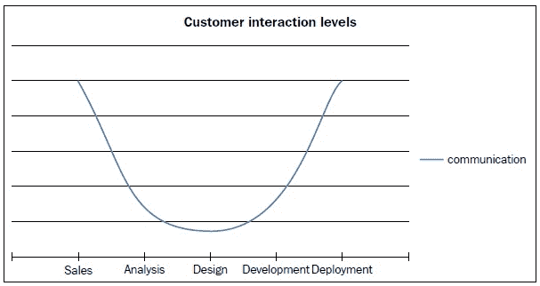
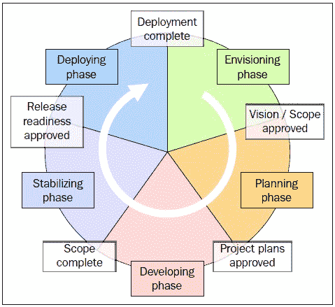
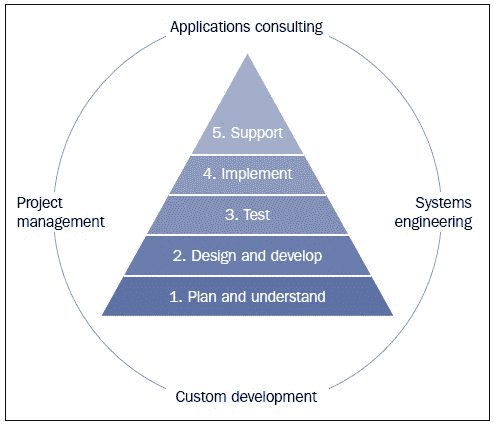
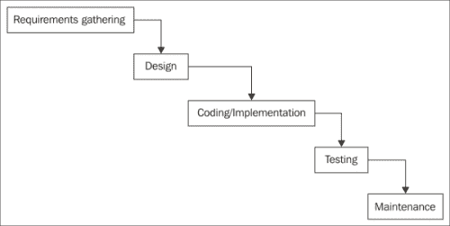
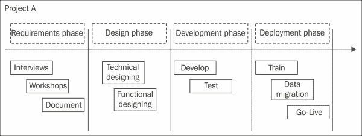
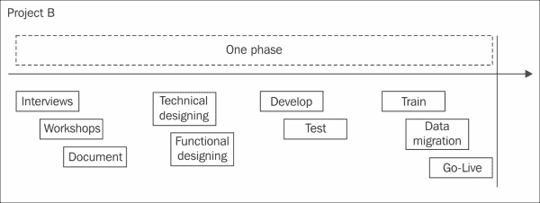
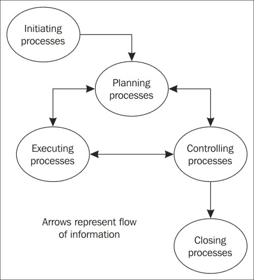
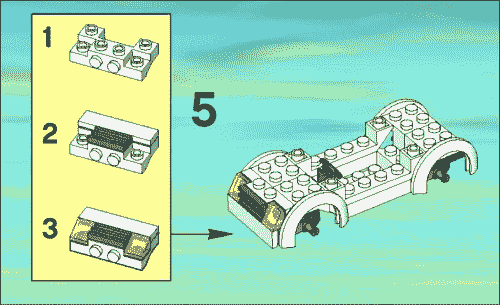
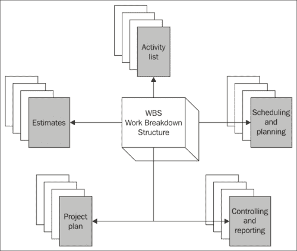

# 第四章：管理项目

在前面的章节中，您已经通过 Sure Step 考察了解决方案销售、尽职调查概念和解决方案展望。本章将带您进入管理项目的迷人领域。项目管理领域正在兴起，因为多年来质量已经成为一种竞争工具。**项目管理协会**（**PMI**）将项目管理定义为*应用知识、技能、工具和技术到项目活动中以满足项目需求*。担任负责软件实施项目的项目经理是一项具有挑战性和要求很高的职责。优秀的项目经理以平衡的方式结合各种技能。他们需要在独特和临时环境中实践领导力、沟通、谈判、问题解决和影响能力。当事情出错时，项目经理通常发现自己处于风暴的中心。然而，管理项目带来了巨大的回报。成功实施业务解决方案意味着您的客户组织将因其团队的辛勤工作和质量而受益于日常运营的更高效率。同时，您创建并管理一个环境，使顾问能够实现他们的职业抱负。

在本章中，您将了解：

+   项目与项目管理

+   项目成功的四大支柱

+   项目管理要素

+   项目管理采纳

+   项目管理不可或缺的组织效益

# 关于项目与项目管理

在本节中，我们将讨论和反驳一些对项目管理的普遍抵制，并就项目管理需求和选项等话题为您提供思考。

## 传说与抵制

我们需要承认怀疑论者对其坚定抵制的贡献。对项目管理的抵制无处不在，有时甚至根深蒂固于难以打破的神话中。举证责任在原告一方，因此我们需要为每个任务辩护项目管理的原因，这与对无结构方法的容忍形成鲜明对比。现在我们面临什么样的抵制？普遍的观点是项目管理有很多开销。同时，它通常被视为灵活性的障碍。许多人认为项目管理是理论家做事的方式，这与管理的首要指令——完成任务——截然相反。

项目管理也被贴上不可销售、如死库存的标签。这类论点让你在向全世界宣扬您的项目管理抱负之前三思而后行。但怀疑论者的论据有多强呢？

### 项目管理是开销吗？

什么是额外开销？从成本会计的角度来看，额外开销是指运营业务产生的成本，但这些成本不会直接产生收入或利润。典型的额外开销包括会计、广告、折旧、保险、利息、法律费用、租金、维修、供应、税收、电话费、差旅和公用事业费用。按照这种逻辑，关于项目管理支出是否是额外开销的问题引出了另一个问题：我们是否向客户开具项目管理服务的发票？然而，这是关键问题吗？根据这种推理，我们应该将我们的销售成本归类为额外开销，并且不应该向我们的销售团队开具服务发票。如果我们部分向项目经理开具发票，这会使额外开销问题变得多余吗？

当怀疑论者将项目管理称为额外开销时，他们通常想到的是与项目管理学科相关的一大堆文件和许多程序和行政任务。当他们的项目管理实践没有根据项目的大小和复杂性或他们的组织结构进行扩展时，这种批评可能是合理的。这些失败的项目管理程序通常基于无知。

为了回答这个问题，我们需要评估我们项目管理实践的好处。它是否有助于我们项目的利润和质量？它是否为我们的客户和团队增加了价值？如果这两个问题的答案是肯定的，那么它显然不是一项额外开销。如果你无法提取这些好处，你的项目管理支出可能被标记为额外开销。项目管理是你和你所在组织如何定义的，它可能变成额外开销，也可能变成增值服务。

因此，当怀疑论者声称项目管理增加了额外开销时，他们可能是对的。但这更多地反映了他们的项目管理实践，而不是一般意义上的项目管理。

### 项目管理是灵活性的障碍吗？

你经常会遇到声称支持项目管理实践的人，但他们立刻补充说他们担心对组织灵活性的影响。他们认为项目管理程序会降低他们应对不可预测变化的能力，并且他们的推理很快就会将项目管理与实用方法对立起来。那么，项目管理不是关注实际问题吗？我们是否失去了改变的能力，项目管理是否阻碍了我们项目的发展？在测试这个命题的准确性时，这些问题是需要回答的。

如果这一切都是真的，项目管理学科将面临巨大的困难。谁会考虑实施项目管理实践，明知这将使组织的有效性瘫痪？数百万的项目管理实践者是否在误解中挣扎？这似乎是一个无法站得住脚的假设。

大多数情况下，这种对项目管理的不适应源于无法区分主要问题和次要问题。那些在这场困境中挣扎的人们过分强调所有描述的项目管理工具、文档和方法步骤的重要性。他们花费太多时间在管理和描述项目上，从而失去了对项目真正管理和实际事务的宝贵时间。官僚主义的项目管理观念与“让我们直接开始工作”的方法形成了鲜明对比。

良好的项目管理实践全在于管理变化、实际事务和灵活性。通过保持以结果为导向、精简和高效，它将赋予你使项目成功实施的能力。一个好的项目经理不是一个官僚主义者，而是一个走钢丝的人，在每一个项目中平衡管理、步骤和工具的需求。这听起来容易做起来难，需要一位经验丰富的项目经理，他对项目管理学科有深入的了解，才能实现结构化的灵活性。尽管缺乏技能和经验的项目经理倾向于掌握僵化的程序，但在谈论灵活性的障碍时，公司高管也不能免责。他们负责公司的文化，而这种文化代表了公司能够实现的目标的极限。

### 项目管理不可行吗？

前一章关于解决方案销售的内容可能会让你自己回答这个问题。能够为顾客释放价值和利益的项目管理实践必须是可销售的。如果你无法将其销售出去，你将难以销售你的方法论的价值，或者无法说服客户其必要性。这可能与你的方法论的内生价值有关，或者与销售流程的失败有关。我们习惯于销售我们的软件、商业咨询服务和开发专业知识，但我们对于销售项目管理服务的熟悉程度如何？我们是否为这种服务制定了良好的定价策略？如果你想销售项目管理，它必须成为你适应价值主张的一个真实元素，这对于良好的桥梁销售是必要的。你的客户或潜在客户可能不熟悉实施项目的景观和项目管理需求，他们可能对此感到紧张，甚至害怕去探索。你的项目管理服务价值主张需要灵活且适应每个机会的变化。一个值得注意的是，那些声称无法销售项目管理的人，对于它没有适应性的价值主张，却将项目经理定价为团队中最昂贵的人。通过这种方式，他们为自己设置了障碍。

## 为什么是项目管理？

这是我们甚至在考虑实施项目之前需要提出的关键问题。良好的项目管理实践需要解决或改进我们希望看到的问题。一般来说，只有一个共同的目标需要实现：使项目盈利并取得成功。你希望并且需要从你的项目中获得利润，同时，按照预期向客户交付价值。这是一个经济生存的问题。

你可能之前已经听说过这个，但你有没有认真思考过？交付亏损的软件项目相对容易。你所需要的就是客户的认可，一些资源，然后就可以开始了。有些人甚至直到财政年度结束时才意识到他们的项目并不盈利，当会计师向高管问责时。项目是风险的代名词，如果你想实现盈利和客户满意度这两个基本目标，你需要管理风险。这就是为什么你需要项目管理，而不仅仅是一个次要问题，而是你项目商业的一个基本工具。

我们现在知道你需要项目管理，因为你的项目需要按时、在预算和范围内交付。但这些目标是否足够**SMART**（具体、可衡量、可实现、相关和有时限）？如果你想有一个务实的项目管理实践，你也需要定义务实的目标。在你的组织和具体项目中，它需要成功的是什么？它如何对你的员工和客户有价值？对此要具体说明。大多数公司都有基于深思熟虑和具体目标的销售、营销、财务和运营系统及服务的特定指标。如果项目是服务业务的基本组成部分，你也需要为你的项目管理实践设定这些目标。没有它们，提高项目的利润和客户满意度将是一条艰难的道路。是的，“按时”和“在预算内”是可衡量的，但你能否在没有设定规范的情况下衡量“在范围内”和“满足质量期望”？你当前的项目管理实践是如何贡献于这些目标的？如果暂停你当前的项目管理程序，会有什么影响？你如何在将来改进你的项目管理实践，或者你将在几年后仍然使用完全相同的程序？如果你真正寻求增值的项目管理实践，那么就有空间设定更明智的目标。所以，在你开始绞尽脑汁如何实施项目管理方法之前，先定义你需要它以及它需要实现什么。现在，你从哪里开始？

当然，定义你的项目管理实践如何贡献于公司的成功并不容易。它需要对你服务交付策略、公司的优势和劣势、客户组合和行业、员工组合和项目历史有一个强烈的愿景。你的项目管理目标需要嵌入这个背景中，同时，它们在不同学科中需要非常具体。你可以从开发一个分解开始，在这个分解中，你将定义要实现和衡量的目标领域。 

一个好的起点可以是描述在**项目管理知识体系**（**PMBOK**）中，并在 Sure Step 中采用的九个知识领域。它们如下：

+   项目整合管理

+   项目范围管理

+   项目时间管理

+   项目成本管理

+   项目质量管理

+   项目人力资源管理

+   项目沟通管理

+   项目风险管理

+   项目采购管理

将前面的知识领域作为你的目标类别，并对其进行优先排序。哪些领域与你的**SWOT**（**优势**、**劣势**、**机会**和**威胁**）分析结果相匹配，并与你的服务策略要点保持一致？在每个这些类别中设想什么将帮助你的组织改善你的服务。已知的问题是什么，需要解决什么？你需要哪些工具和程序来实现这一点，以及这将带来哪些业务改进？谁将从中受益，以及受益程度如何？这只是你目标分解的一个例子。你可以以任何方式来做，只要它对你和你的公司有价值。关键点是，如果你想适应一个有用的项目管理方法，你需要确切地知道你需要项目管理的确切原因。

## 替代方案

假设你希望在没有任何标准项目管理方法的情况下交付你的项目。你最终会怎样？第一个症状就是大多数同事会以自己的方式填写他们的项目角色。每位顾问、开发人员和项目经理都会有他们自己的工具、模板、步骤、质量标准和甚至他们自己的术语。你会发现很难与同事和谐共事，因为很难想象他们将会如何交付。你如何以积极主动的方式管理团队的活动和交付成果？团队成员将如何知道对他们有什么期望？你公司中的不同项目经理可能在他们的项目中设定完全不同的目标、质量标准和交付成果。

想象一下，你被聘为顾问或开发者，在两个项目中工作，这些项目的项目经理对交付什么和如何交付有完全不同的期望。这有多么困难和低效？你如何向客户传达他们可能期望的内容？

以这种方式操作，你项目的成功将是一场赌博。有些项目可能会成功，而其他项目则可能陷入普遍的不满。作为一个公司，你将你公司项目成功的概率完全留给个人，而且将无法以结构化的方式改善你整体的质量和利润。以这种方式工作的公司通常只有一种提高质量的方法：替换资源。他们从这样的想法中找到安慰，即少数人负责项目的失败，并安慰自己，如果有其他资源，这种情况就不会发生。通常不会花很长时间，他们就会在新项目中再次面临同样的问题。在这些公司中，混乱在统治，这对所有相关人员都是一种打击。

一些公司把正式的项目管理应用与薪酬挂钩。如果客户愿意为其参与的服务付费，实施工作将由项目经理指导。在这些情况下，他们把在项目上实施项目管理原则的部署依赖于能否推销项目以及客户是否理解项目管理需求的重要性。未能获得客户的项目管理预算意味着实施工作将不受管理。你当然知道那些销售经理表示几乎没有（如果有的话）项目管理预算的情况。那么接下来会发生什么呢？一个引人注目的事实是，在这些情况下，会指派一个项目经理。没有预算意味着缺乏项目管理，但项目经理还是被指派了。谁愿意站在这个人的位置上呢？通常，一位有良好产品经验记录的资深顾问会荣幸地承担这项管理任务。这个人需要既是执行者又是管理者，这要求在即使有大量时间可用的情况下也难以完成的复杂平衡。现在这位可怜的项目经理需要完成这项练习，同时知道没有官方的项目管理时间可用。别忘了，风险并不依赖于回报。我们的资深产品专家将面临与有显著项目管理预算时相同水平的风险。在这些大多数情况下，关于项目风险没有明确和正式的协议。客户将在可能的情况下将风险转嫁给供应商，你将被迫按照预期交付。

我们可以期待什么样的结果？除了常规的应用顾问任务外，我们这位经验不足的应用顾问在履行项目经理角色的同时，可能会排着队参加众多内部和客户会议、谈判、额外的分析活动、范围变更、规划、调度等等。

到目前为止，我们的顾问已经忙得不可开交，无法足够关注常规顾问的任务。这将会带来质量问题，导致更多的会议、谈判和返工。要摆脱这个恶性循环，你可能需要销售技能和项目管理指导的混合。所以最终，你做了一些没有预算的工作，并且没有将其作为服务提供给客户。不幸的是，这并不真正高效或主动，最终成本远高于一个经过深思熟虑的项目管理职位所应承担的成本。在最佳情况下，组织意识到在特定项目上花费的额外时间，但在许多情况下，人们试图通过创意报告在他们的工时表中掩盖这一点。在这种情况下，你可能会在财政年度结束时发现，你的项目并没有像预期的那样有利可图，这无疑是一个不太愉快的惊喜。

客户也不会从这个场景中受益。他们开始了一个**企业资源规划**（ERP）或**客户关系管理**（CRM）的实施，旨在改进他们的业务流程，并赋予他们高效工具，使他们能够在工作中更加高效。最终结果是众多会议、无果的讨论和抱怨的员工，这与预期的目标相去甚远。他们应该意识到风险因素是实施项目的一个基本要素。客户对项目的积极结果有明确兴趣，并且必须接受项目管理的重要性。

那么，真正的替代方案是什么？别忘了，风险并不依赖于回报。

## 使用我们自己的方法论

给那些投入时间开发自己实施方法的公司打满分。为项目设想一个质量策略并不明显，更不用说在鼓励组织适应的同时，将这一愿景转化为一套可行的程序、指导和工具的工作量了。然而，看到这一艰难的旅程引导整个公司走向项目成功、盈利和满意的客户和员工，是一件令人愉快的事情。对于这些合作伙伴来说，实施的结构化项目管理方法将是持续改进的起点和关键工具，也是他们竞争优势的中心。

在所有公正的前提下，我们需要补充说，并不是所有声称拥有自己项目方法的公司真的拥有。一些是意识到的，而另一些则看不到他们所实施的东西并没有增加任何价值，不能被视为项目管理方法。让我们关注最后一个类别——那些认为自己有稳固方法论的人。他们为什么走错了路？首先要检查的是谁在组织中真正在使用它。如果没有人使用这个方法论，无论其内在价值有多好，它都没有价值。如果你的方法论只存在于纸面上和演示文稿中，那么它实际上并不存在。你怎么知道呢？这是一个简单的问题，答案也很简单：通过检查或（更好的是）通过控制。像“你使用这个方法论吗？”这样的问题不会给你答案。你需要通过定期检查谁在使用方法论以及他们使用的是哪些部分来深入挖掘。这种质量控制将揭示你方法论的真正使用情况。

你需要问的第二个问题是你的方法论提供了什么价值。它真的有所改变吗？它的内在价值是什么？有时看起来有些人对基于阶段的方法感到满意。“只要我们定义了阶段，我们就在安全的一边”是他们的推理。阶段象征着公司在项目管理方面的专业知识，并保证不是所有工作都同时进行。它们表明规划和里程碑是公司实施方法的关键要素。这种方法可以总结为三个词：阶段、规划和里程碑。我们都知道这些都是项目管理方法论的有价值元素，但它们并不构成方法论完整的价值提供。当你只实现了建筑的外壳时，你不能说你有一座房子。在这个阶段，建筑还没有提供我们期望的房子功能。它不能保护，也不能提供任何舒适。只包括这三个元素的方法不能称为项目管理方法。这是因为它不能提供实现我们项目目标所需的基本主动功能和有效的程序和工具。

## 为什么以质量为导向的公司更喜欢项目管理

以质量为导向的公司寻求持续提高其服务和产品的质量水平。在这个过程中，他们已经走了很长的路，利用了现代的质量控制和改进方法。你可能遇到过使用诸如**ISO**（**国际标准化组织**）、**全面质量管理**（**TQM**）、六西格玛、精益生产或戴明循环等方法的客户组织。如今，质量意识已成为常态而非例外，因为多年来质量已成为一种竞争工具。其中一个最好的例子是丰田。他们成为了世界上最大的汽车制造商，其中很大一部分成功归功于他们的质量管理策略及其品牌化。许多其他公司也效仿，要么是受到丰田等成功质量公司的榜样启发，要么是因为他们被迫这样做。如今，许多供应商别无选择，但需要遵守如 ISO 等标准。作为 IT 专业人士，我们无需远观，就能在我们的日常工作中看到质量管理正在兴起。**信息技术基础设施库**（**ITIL**），它是广泛采用和一致的**IT 服务管理**（**ITSM**）最佳实践的文档，以及**能力成熟度模型集成**（**CMMI**），一种帮助组织提高其绩效的过程改进方法，都是描述今天 IT 部门如何运作的模型。

近年来，质量控制和质量保证流程的焦点也发生了转变。质量经理们希望预防缺陷，而不仅仅是检测它们。他们希望通过不断从以往的经验中学习来主动管理。因此，当你计划在这个类型的公司中实施一个软件解决方案时，如果他们正在寻找一种展现主动能力的质量方法，这并不令人惊讶。为此，你不仅需要有一个良好的实施方法，还需要能够捕捉、展示和实现这一方法的真正价值。仅仅几页关于阶段、会议和计划表的幻灯片将不再足够。让我们直言不讳——质量管理正在兴起，这将对客户期望你如何管理项目产生重大影响。你不能再通过个人的努力和英雄行为来销售质量。相反，你需要展示一个可重复、集成和标准化的方法。

# 项目成功的四个支柱

在上一节中，我们讨论了为什么我们需要项目管理以及我们如何克服对它的抵制。在本节中，我们将讨论构成项目方法论内在价值的最重要要素。

当评估支持项目交付策略的不同方法时，人们很容易在细节中迷失方向。面对众多程序、步骤、活动和文档，他们在黑暗中摸索，寻找真正的内在价值。本节将为您提供在寻找支持实施方法过程中的四个宝贵指标。

## 沟通很重要

我们都知道沟通在项目成功方面的重要性。当我们思考一些不太成功甚至失败的项目（当然，只是一小部分）时，我们经常将它们归咎于沟通不良。我们通常不会四处责怪项目失败是由于我们的电子表格中的公式错误，或者我们的规划软件产品中的系统错误，但沟通不良始终是一个有效的理由。那么，我们这是什么意思呢？这是否意味着我们没有说够？我们是否有足够的会议，或者我们应该更多地联系我们的客户？实际上什么是良好的沟通？

沟通无处不在，存在于我们做的每一件事中。据估计，我们一天中有四分之三的时间以某种方式在沟通。通过沟通，我们引导和管理我们所做的事情。其中大部分时间用于说话和倾听，而只有一小部分时间用于阅读和写作。

同意，阅读和撰写项目文档很重要，但这并不意味着我们真正在沟通，因为这还涉及到说话和倾听。做一个好的倾听者是良好沟通的必要要素。希腊斯多葛哲学家**爱比克泰德**曾经说过：“大自然给了我们一张嘴和两只耳朵，这样我们就能听到两倍于我们所说的话。”

我们中的大多数人已经在日常的项目工作中体验过这一点。我们通过沟通来管理项目。电话、电子邮件、会议、现场会议和聊天都是我们项目管理工具集中的关键要素。通常没有人会提到这一点，但关于那些似乎没有人阅读的项目文档的抱怨却很多。有时，这感觉就像是在图书馆里放书，而没有人来访问。

在规划有效的项目沟通时，我们需要考虑哪些因素？当然，我们需要沟通技巧，但即使是最有天赋的演讲者或积极的倾听者，在无法有效沟通的项目中也无法满足沟通需求。

下述四个部分中涵盖的实用规则对于有效的沟通是必不可少的。

### 规则第 1 条 – 沟通需要互动

沟通是两个人或更多人之间的双向活动。它通常由互动或事件触发。为了使良好的沟通成为可能，您需要相应地规划项目互动。没有客户互动，良好的沟通将难以实现。以下图表展示了在实际实施中典型的计划客户互动水平：

在销售过程中，我们通常与客户或潜在客户有很多互动。会议、后续电话、演示、客户访谈和账户管理访问都是计划中的互动管理的一部分，目的是达成交易。正因为这些互动，我们也有可能与客户的利益相关者进行良好的沟通。与他们互动意味着我们必须与他们交谈并倾听他们，这是有效沟通的基本条件。

当实际实施项目进入分析阶段时，我们通常仍然通过启动会议、研讨会和面试会等方式保持足够的计划互动。然而，在这些活动之后，互动水平可能会显著下降。在设计和发展阶段，我们在进行技术和功能设计以及执行开发活动时，往往会将自己孤立起来。有些人将这种现象归咎于项目生命周期这些阶段涉及技术顾问。这是由于人们对技术顾问的典型看法。这些顾问在设计和发展活动中开始变得非常活跃，并且以不是最好的沟通者而闻名。如果你是这样想的，你可能需要重新思考。问题不在于有些人以集中的方式完成任务，他们需要隔离的环境。相反，问题在于没有计划其他触发客户互动的活动。这种缺乏充分计划客户互动水平的规划，会危及你的项目沟通。这会创造一个“沟通黑洞”，如果设计和开发阶段的持续时间很长，这个黑洞可能会相当大。想想看：没有客户互动意味着没有沟通和客户参与。

当我们开始为新系统准备上线时，客户互动水平突然再次上升。这是因为我们通常过度计划了部署阶段。在设计和开发阶段没有计划的所有事情都需要在部署阶段完成，这导致了大量的客户互动。现在，在经历了数月的客户互动和沟通水平较低之后，我们突然需要不断地沟通和互动。这对咨询和客户团队来说不会容易，因为他们现在缺少沟通惯例和文化。在这种场景下，你也需要在短时间内进行大量沟通。你的沟通接收者可能会在继续理解所有内容时遇到问题，并可能因此产生一些（额外的）抵抗。

互动沟通必须在整个项目生命周期中均匀分布，而不是集中在几个时刻。这种沟通的存在取决于你的规划。项目沟通失败的原因不一定在于你人们的沟通技巧不足，但可能是项目生命周期的组织本身。

### 第二条规则——电子邮件不等于项目沟通

你可能会认为人们使用电子邮件沟通是因为这让他们可以待在自己的舒适区。传递坏消息、通知决策和请求问责，从舒适的椅子和桌子前进行要比面对面交谈容易得多。没有必要改变位置。你只需写下你想说的话（你的机器不会批评你的信息），然后你可以按照你的意图发送信息：轻松、快速、高效。

是的，电子邮件沟通在所有可能的方式上都是无与伦比的方便。这使得它变得不可或缺，使用电子邮件进行沟通没有错。然而，由于其便利性，它也有已知的陷阱。电子邮件是会上瘾的，我们倾向于在所有情况下、为所有沟通都使用它。这种上瘾不会使我们的项目沟通变得更好。良好的项目沟通还需要定期的互动，包括积极的倾听和说话，以及非言语沟通。

面部表情、肢体语言和语调可以为你提供关于人们情绪、动机、压力水平等方面的宝贵信息。研究表明，当我们沟通时，我们接收到的 80%的信息都是以非言语沟通的形式出现的。这也体现在一句中国谚语中：“笑不露齿，必有深意”。如果你只使用电子邮件作为沟通手段，你就无法识别这类信息，从而错失了适当回应的机会。*卡尔·波普尔爵士*指出，不可能以任何方式说话而不会被人误解。在使用电子邮件时，被误解的可能性肯定更高。作为项目经理，你需要激励利益相关者和团队成员，推销你的观点和愿景，传达决策，并带来好坏消息，而且你需要持续这样做。在这些情况下，你的沟通效果将决定你作为项目经理的成功。你需要确保你被充分理解。

你还需要意识到，人们可能比你计划的时间晚得多地阅读你的电子邮件。即使标记为重要或紧急，你的信息也可能最终出现在一长串未读电子邮件中。因此，尽管电子邮件的传递是即时的，但你的电子邮件沟通实际上并不真正发生在实时。

是的，电子邮件很方便，有时也很有效，但并非总是如此。你需要定期走出你的舒适区，面对你的团队成员和利益相关者，而且你需要从一开始做到项目结束。

### 第 3 条规则——简洁

文档是项目沟通组合中的重要元素。它们支持会议，向团队成员和利益相关者提供信息，为项目决策提供依据，并促进验证和关闭过程。项目文档是沟通的重要输入，但遗憾的是，并非所有文档都具有实现这些目标的内在质量。正如之前所说，有很多关于那些似乎没有人阅读的项目文档的投诉。这些类型的文档不支持或促进任何事情。它们只是作为所谓质量方法的借口，但通常只是通往文件柜的单程票。大多数人将这些文档视为浪费时间，并导致人们错误地将项目管理视为官僚活动。那么，什么样的内在元素构成了好的项目文档？

最重要的事情之一是确保你文档的可读性。进行项目文档编写并不是一场写最多页数的比赛。一篇长篇大论，说些无意义的话，比一篇简洁的文档要容易得多。大多数这些长篇的项目文档都是无结构的，缺乏好的结论，包含太多的灰色地带。它们也往往在内容上失去平衡，包括过多地关注引言和简单话题，而在更复杂且重要的问题上缺乏好的内容。这使得这些文档不仅难以阅读，而且内容也不完整。我们为什么需要这么多纸张来承载微不足道的内容？现在，假设你站在客户的角度，一分钟。这些类型的文档没有仔细阅读是否令人惊讶？你会愿意阅读一份五十页的文档，缺乏细节和结论吗？

你还应该考虑到，所有软件项目都会产生大量各种类型的项目文档。这意味着你的客户在整个项目生命周期中需要审查大量文档。他们需要在日常工作的基础上完成这些工作。所以，不要期望他们会阅读你所有的华丽辞藻。出于所有这些良好的理由，你需要保持简洁。

直接切入要点需要真正的努力。大多数项目利益相关者都会仔细审查项目文档以寻找行动和结论，但通常会发现未经请求的分析、背景和论点。现在我们能做什么？

首先，你需要让所有参与项目文档的团队成员都意识到这个问题。为每种文档类型指定一个推荐的最大页数将有所帮助。预先定义文档的结构，包括行动、问题和结论等部分，并确保面向客户的文档不包含过多的术语和冗长的技术描述。使用客户使用的语言进行沟通。最后但同样重要的是，一定要包括图表元素，如图表和流程图。这些元素显著提高了可读性，并将使你的内容对读者更具吸引力。

### 第四条规则——设定明确的期望

如果你希望在整个项目过程中让你的客户和团队参与其中，你需要努力设定关于谁将按何种方式在何时交付什么的明确期望。如果你想确保项目中的良好沟通，你需要以同样的方式向利益相关者提供关于你的沟通方法的建议。以下是我们需要解释的内容：

+   与谁进行沟通

+   谁将进行沟通

+   要沟通的内容

+   如何进行沟通

+   何时进行沟通

这有时也被称为“沟通计划”，有些人常用，但对其他人来说可能是一个令人畏惧的想法。无论你对沟通计划有何感受，都不要低估定义和解释这些沟通元素的重要性。没有这些灯塔，项目团队的沟通将不受控制且无指导。同时，你的沟通策略需要与你的整体项目生命周期组织相一致。例如，客户何时可以期待收到包含建议解决方案的需求或设计的文档的交付？你是否组织会议来讨论这份文档？如果是这样，谁应该参加？你是否需要验证这份文档，以及谁有权限签字？所有文档都需要签字吗，还是只有少数需要？客户在签字前有多少时间？如果他们不签字会有什么后果？这与基于阶段的做法有何关系？在客户能够参与你的游戏之前，他们需要相当多的信息。

一旦客户知道可以期待什么以及如何沟通，你需要实践你所宣扬的。

## 积极的态度是关键

项目成功高度依赖于你的主动性能力。有时，项目经理表现得更像是一个电子表格大师而不是管理者。他们使用并维护复杂的电子表格，其中集中了所有项目数据。这些电子表格包含复杂的公式，为项目生成各种趋势和结果。这些电子表格本身并没有问题，但仅凭这些工具并不能管理任何事情。这些工具需要为项目经理提供指示和早期预警信号，表明某些事情需要引导或纠正。它们需要触发主动的和纠正性的项目管理行动。这正是项目管理的核心——主动和纠正性地引导项目。作为一名项目经理，你需要管理你的团队，这需要一种由电子表格等工具提供的洞察力指导的实用方法。什么可以帮助我们部署主动式项目管理？我们将在以下小节中探讨。

### 第 1 条规则——前瞻性思考，预防为主

主动的态度需要前瞻而不是回顾。作为一名主动的项目经理，你需要专注于预防而不是检测。你需要确保你的项目报告和工具不会详细解释你过去的失败，而是帮助你预防和解决即将出现的问题和问题。你需要做的第一件事是改变你的思维方式，从过去转向未来，从问题识别转向问题预防，从被动转向主动。

### 第 2 条规则——在互动中保持主动性

主动与客户和咨询团队保持持续的互动。在项目中，我们面临的问题、风险、变更、质量、范围等等，都可能影响我们的时间和成本绩效。因此，如果我们想在其他方面提供关于时间和预算的保证，我们需要主动管理这些日常风险和问题。首先，这种方法要求我们了解我们的问题和风险。我们只能通过与客户互动来识别它们。测试、验证解决方案和概念、会议以及评估时刻通常揭示我们项目的问题和风险。在互动水平较低的时候发现问题和风险的可能性非常小。其次，我们需要确保我们尽早识别我们的挑战。

采取主动意味着始终领先一步。这意味着当你已经为项目生命周期的末期规划了大部分客户互动时，你的主动管理能力将显著下降。同样，当你和你的团队将所有客户互动推迟到项目生命周期的末期时，你将失去主动管理的能 力。因此，在项目周期的开始和结束时专注于客户互动不会给你提供必要的主动机会。你如何规划和执行你的项目生命周期是成为一个主动的项目经理的关键。

### 第三条规则——早期预警信号的衡量标准

如果你想了解即将发生的事情，你需要识别可能出现的早期预警信号。这些信号并不总是自行引起我们的注意。如果我们没有为此做好准备，它们可能会被忽视。如果你想在你自己的项目中采取主动，你需要深思熟虑你想要衡量的内容。一个主动的管理者会阅读他们在项目中对未来活动的影响。你想要知道你当前的表现是否会导致成本和时间超支，你需要知道原因。所以，如果你正在使用高级电子表格来衡量你的表现，你需要问自己它是否告诉你关于你项目未来的某些信息，或者只是通知你这个项目过去的绩效。只有在你不是在报告空话时，你的衡量才能揭示早期预警信号。你的衡量需要基于范围、进度和成本的整合。因此，如果你没有定义你的范围、进度和相关的成本，你不能期望测量早期预警信号。

在你开始衡量之前，你至少需要以下项目基本要素：

+   将工作范围分解成更小的单元

+   为每个这些工作单元制定的时间框架计划

+   用于完成这些工作单元的资源及批准的成本

只有在那时，你才能开始考虑如何衡量绩效。早期预警的识别必须从你项目的开始就进行，并且应该定期进行。当项目完成超过一半时才开始衡量绩效不能被认为是主动的。

一些项目经理满足于二维的项目报告。他们深入研究项目数据，他们的报告看起来可能像这样：

+   **预算**：100 万（欧元、美元等）

+   **项目持续时间**：12 个月

+   **花费的时间**：六个月

+   **已花费的成本**：40 万（欧元、美元等）

在这六个月之后，项目经理向公司高管和客户报告说，他们在预算方面进展顺利。他们可能还报告说，团队表现良好，质量可以，没有重大问题即将出现。多么出色的进度报告！或者，它是吗？

这个项目经理忘记做的是将成本和时间与要交付的范围结合起来。让我们假设在这六个月里，计划交付六个单位。这里的关键问题是，在 400 万的预算下，六个月内交付和接受了多少单位？如果只交付和接受了三个单位，这个项目将遭受巨大的时间和成本超支。你需要确保你不会用不适当的测量来误导自己和你的利益相关者。如果你想主动，你需要建立一个能够检测早期预警信号的测量系统。

## 创建指导性项目文化

当谈到不太成功的实施时，关于客户参与的投诉如洪水般涌来。一些项目经理也表达说项目往往会获得自己的生命。在这些情况下，项目被缩小到个人执行计划和执行。客户和咨询团队似乎与任何应与此项目相关的态度、价值观、信仰、优先级和行为脱节。在这种脱节的情况下，推动团队的能量和承诺，从最初的想法到部署，将是一个难以解决的问题。作为项目经理，创建指导性项目文化值得你特别注意。

你需要确保所有利益相关者和团队成员都同意以下内容：

+   项目目标

+   此特定项目的利益

+   工作方式

+   交流方式

+   质量的定义以及如何实现它

+   在这个项目中每个人的角色和责任

+   实施此项目伴随的变化

+   与此特定项目相关的风险

+   将交付的范围

+   被视为范围之外的那些部分

这可能已经是陈词滥调，但当你把它视为理所当然时，可能会陷入陷阱。不要假设所有参与这个项目的人都是一致的。使人们一致并让他们致力于目标、利益和方法将消耗你大量的精力，但这对于你的成功至关重要。

文化是一套由一个群体共享的明确和含蓄的信念和假设，这些信念和假设塑造并协调所有成员的行为。

如果客户对目标不热情，对方法一无所知，你不能假设他们承诺你的计划。他们如果对这种方法的原因和好处一无所知，如何支持你的方法？他们需要知道对他们有什么期望，以及他们需要为计划做出多少承诺。

这同样适用于你自己的内部团队成员。他们需要同样一致，才能满足期望。无疑，采用和内在的、强大的实施方法是正确的方向。这将使团队成员能够深入了解公司是如何实施以及为什么以这种方式实施。有了这一点，将节省你宝贵的时间来调整咨询团队成员与你的方法，因为他们已经分享了这些价值观和信念。剩下的是对特定客户案例和即将到来的项目的具体总结。如果你梦想着拥有更多自我驱动的团队，你需要确保他们分享你公司的价值观和方法。

因此，在你跳入项目执行任务之前，你需要确保所有利益相关者和团队成员在信念和愿景方面以及特定项目的所有关键要素上保持一致。你需要评估这种一致性是否足够强大，能够作为你项目车辆的坚固底盘。道路将会变得崎岖，一个坚固的底盘将是一个必需品，而不是奢侈品。

## 关闭的重要性

对于许多人来说，关闭项目证明是一个真正的挑战。乍一看，这似乎很简单且直接。上线后和一些额外的支持，你要求客户签署项目交付的确认，一旦签署，你的项目就结束了。不幸的是，我们大多数人都有过这样的经历，那就是关闭通常不会那么顺利。事实上，许多项目永远都没有关闭。

第一个值得注意的发现是，项目团队成员没有关闭项目的实践。分析师专注于提供良好的业务流程描述和捕捉需求，开发者想要展示他们优越的技术解决方案，而项目经理则努力实现按时和按目标的**关键绩效指标**（**KPIs**）。作为一个团队，他们的主要目标是部署一个新的解决方案，然后是成功的上线。这基本上是他们关注的焦点。但是，谁负责推动项目关闭呢？对于项目经理来说，关闭并不像销售人员那样显而易见。关闭是销售周期中的关键要素，能够关闭交易是销售经理的关键优势。他们意识到这个关键过程，并不断改进自己的关闭技巧。如果我们想在项目关闭方面更加成功，我们需要开始在项目团队中实现一种关闭文化。为什么我们需要关闭，我们如何促进关闭过程，以及谁负责关闭，这是我们必须要找到答案的一些关键问题。

将项目定义为临时努力意味着项目收尾。不收尾项目将使其从项目转变为运营。不幸的是，我们没有为该运营提供预算，也许我们也没有在客户网站上管理运营的明确方式。这可能会成为一种真正的负担。如果项目未收尾，客户将继续要求各种更改、增强和各种服务，这些服务的资金将处于讨论中。你将不得不参加很多会议，试图找到妥协，以确定项目范围内和范围外的内容，并且你需要这样做，直到项目收尾。也许你的项目在 Go-Live 之前是盈利的，但在这个时候，你的利润开始被榨干。与收尾相关的还有重要的心理因素。成功的收尾会加强成功的感觉。人们在职业生涯中需要成功以保持动力，成功会激励他们继续努力，在未来项目中追求最终的成功。客户团队成员将分享为公司实现重要事物的感觉，并将这些好处与整个组织分享。毕竟，经过所有辛勤的工作和努力，他们有权享受这一刻的荣耀。当我们不收尾我们的项目时，其他心理效应将会展开。由于没有明确的隧道尽头，人们可能会对项目产生负面看法，并感到气馁。

客户团队成员不会宣扬他们新解决方案的好处。相反，他们甚至会对最小的不可避免的问题感到烦恼。你的顾问和开发人员保持对即将到来的项目动力的可能性很小，尤其是当他们已经有一系列未收尾的项目记录时。出于这些和许多其他原因，你需要持续努力提高你项目收尾的能力，就像销售人员一样。

现在什么使得项目收尾如此困难？让我们关注两个重要元素，即：

+   存在“收尾文化”

+   收尾练习的要素

客户组织需要熟悉收尾和签字确认。在部署项目后，如果你要求客户签字确认收尾，而这将是他们真正需要签字的时刻，你实现这一点的可能性很小。签字确认可能会让客户有点怀疑和不安全，尤其是当他们不了解这个过程时。通过从项目开始就应用签字确认程序，这些障碍将变得很小，因为你的客户已经熟悉了收尾流程。

结束练习本身将使一切归拢。您需要证明您的团队交付了承诺的内容，质量符合标准，并且组织可以在日常工作中使用它所定义的好处。这种证明负担需要良好的准备、强大的文件和与客户的良好关系。当您的文件已经通过长期验证周期创建时，您将获得最佳成功机会。诸如批准的范围描述文件、验证的变更请求、确认的测试结果和签发的里程碑审查文件等将使您的案例更强。此时，您可以评估您的方案有多强，在整个项目生命周期中您的沟通有多好。您能想到一种在没有这些基本要素的情况下关闭项目的好方法吗？

# 项目管理要素

开发和实施智能项目管理实践需要对该学科有深刻的了解。项目管理学科不能一口吃掉，因为它涵盖了各个领域和学科的知识。它处理复杂的专业领域，如范围管理、成本和时间管理、质量管理、人力资源管理、沟通管理和集成及风险管理，并且可能与其他管理学科重叠。本章并不旨在探讨所有这些领域，而是将带您踏上发现项目管理最基本要素的旅程。

## 项目生命周期及其阶段

当谈到项目管理和实施方法时，人们会自发地谈论他们的基于阶段的方法。如果您查看实施合作伙伴网站的内容页面，通常可以看到将项目生命周期分解为不同阶段的图表，并且当您参加合作伙伴与其潜在客户之间的商业会议时，实施方法的解释通常也是以阶段为依据的，如下所示：

该合作伙伴基于阶段的这种方法灵感来源于**微软解决方案框架**（**MSF**）。项目运行由五个不同的阶段执行和管理。每个阶段都以明确定义的里程碑交付结束，例如范围和项目计划的批准、范围执行的完成、发布准备的批准和部署的完成。

以下图表展示了这些阶段：

以下图表展示了基于阶段的更复杂变体，提供了八个阶段来管理项目：

因此，在大多数合作伙伴实施方法中，阶段很重要；但我们真的理解什么是阶段，并且我们在日常项目中是否真正尊重基于阶段的做法？让我们尝试找到答案。

### 什么是阶段？

阶段代表将项目生命周期分解成更小的时序单位。在瀑布模型中，通常以顺序方式从一个阶段过渡到下一个阶段。瀑布模型的目标是通过单独的阶段，在项目生命周期的早期就定义需求和设计。只有当该阶段计划的所有工作都已完成，并且所有必要的可交付成果都已生产并得到接受时，才能从一个阶段过渡到另一个阶段。以下图表展示了典型的瀑布方法：

阶段的核心在于，它们基于这样一个理念：你不能一口吃掉一条鲸鱼，而必须将其分解成小块来消化。以下图表展示了两种项目方法的示例：

**项目 A**被组织成四个计划阶段。活动被分组并计划在相应的阶段执行。每个阶段的执行进度都将被监控和控制。当所有里程碑可交付成果都生产出来时，阶段将关闭。

**项目 B**被组织成一个阶段。所有活动都计划在这个阶段执行。当所有可交付成果都生产出来或与项目收尾一起时，阶段将关闭。

假设项目 A 和项目 B 具有完全相同的目标、利益相关者、风险、时间框架、预算和范围。项目 A 和项目 B 之间有什么区别？两个项目都需要执行完全相同的活动，在相同的时间框架和预算内产生相同的可交付成果。唯一的区别是，项目 A 被组织成四个阶段，而项目 B 只在一个阶段内执行。在项目 A 中，团队只能在计划中的访谈、研讨会和文档活动完成，并且所有可交付成果都生成后，才能开始进行技术和功能设计。这将由咨询和客户项目经理进行控制和验证。在项目 B 中，团队可能在技术设计准备就绪之前就已经开始开发，并且在活动和可交付成果之间没有真正正式的评估时刻。因此，工作的性质没有改变，但通过使用阶段，你可以在定义的时刻控制和验证进度。这种方法的目的是组织和控制你的时间线，从而提高管理控制。因此，项目经理真正管理进度的能力在项目 A 中显著提高，因此项目 A 的成功几率比项目 B 高得多。

下图展示了一个典型的场景，这种情况很可能是由于**项目 B**中阶段过渡没有受到控制而发生的：

当不按阶段工作的时候，这种典型场景可能会发生。这里的危险在于活动和可交付成果可能会系统地被推迟。这会导致项目生命周期末尾待办事项的高度集中，并给规划和实现良好的部署带来困难。在这种情况下，直到部署阶段才报告重大问题也是很常见的，当大多数关键活动都推迟到项目生命周期末尾时，这并不令人惊讶。

到项目结束时，项目经理将诊断出越来越多的问题。知道一个阶段可能隐藏另一个阶段，项目经理很快就会意识到项目现在正进入一个风险阶段。一个典型的问题是：“我们为什么之前不知道这一点？”你只需查看这样一个项目生命周期的规划就能找到答案——你试图一口吃掉这条鲸鱼，而这口吃得太糟糕了。

### 尊重基于阶段的处理方法

如果你的实施方法包括基于阶段的处理方法，并且你真的支持这种方法，确保你也实施了真正的基于阶段的实践。仅仅在演示文稿上命名阶段并不能真正为你的实际项目做出贡献。不尊重基于阶段的处理方法会通过以下特征表现出来：

+   没有正式关闭阶段

+   在完成前一阶段计划的可交付成果之前启动新阶段

+   计划不足和计划过度阶段

如果你没有正式关闭你的阶段，并在未完成前一阶段的工作的情况下转向即将到来的阶段，你就没有尊重阶段的基本功能。这意味着你将失去这种方法的益处。这不仅会剥夺你按阶段跟踪进度能力，你还会错过与客户一起在沟通和关闭文化上工作的绝佳机会。实施阶段可以逐步引入关闭文化，带来巨大的益处。如果你与客户一起使用标准程序关闭每个阶段，他们将在整个项目生命周期中非常熟悉关闭过程。围绕这些正式时刻建立沟通只会对你有利。

下面的图展示了某个阶段计划不足而其他阶段计划过度的项目生命周期：

上述图清楚地显示了活动在阶段间规划上的不平衡。你可以从这个图中得出结论，项目是在两个阶段而不是四个阶段中管理的，存在一个计划过度的**部署阶段**。

因此，如果你真的想使用基于阶段的方法工作，你需要确保你尊重这种方法的功能，并以平衡的方式规划你的阶段。如果你忽视这些基本规则，你必须得出结论，你的实施实践不是按阶段管理的。

## 项目管理流程

项目管理流程代表了一组逻辑上相关的活动，这些活动旨在产生一组特定的可交付成果。每次你需要产生可交付成果时，你都需要验证目标，规划你将如何执行，在执行的同时控制这一执行，一旦准备就绪，就通过促进这一关闭的过程正式关闭任务。

在下面的图中，你可以找到由 PMBOK 定义的项目管理流程：

**启动流程**帮助你定义并获得对新项目或阶段的授权。**规划流程**帮助你确定项目的范围，细化目标，并定义实现项目或阶段的目标和可交付成果所需的方法。**执行流程**代表了完成计划的可交付成果所执行的活动。这涉及到协调人员和其它资源以执行计划。跟踪和审查进度和状态所需的流程，以及识别与计划偏差的流程，都汇集在**控制流程**下。一旦完成，每个任务、阶段或项目都应通过促进这一关闭的过程正式关闭。这些流程被称为**关闭流程**。

这些过程与你的项目时间线阶段分解不同。实际上，项目管理过程在每个阶段都会发生（或应该发生）。根据阶段的不同，占主导地位的过程将得到实施。在项目准备阶段，例如在诊断和分析阶段，启动和规划过程可能更为突出，但这并不意味着那些将是该阶段唯一的过程。你还需要在分析阶段有执行、控制和收尾过程。

重要的是要注意，你始终需要关注收尾过程。收尾过程需要在每个阶段或迭代中发生。收尾不是你专门需要为项目生命周期的结束保留的事情。

上一张图表传达了你的规划结果将指导执行和控制过程，就像双向交通一样。你如何执行这些过程将影响你的规划，控制可以揭示规划变更的必要性。一旦你开始执行产生该阶段计划交付成果所需的工作，你就需要开始监控和控制这个过程。然而，这需要通过纠正措施对你的执行产生影响。如果你的监控对执行没有影响，你可能会白费力气。

## 打破它！

如果你需要做一件事情来使你的项目变得可管理，那将是将其分解。你应该意识到你的项目生命周期分解成更小的时间单位，如阶段，但分解你的范围同样重要。最好的项目计划基于良好的分解。当你为孩子（或自己）买玩具时，你可以找到优秀的项目计划。一个很好的例子是乐高中的*紧急医生车*。这包括教科书或理想的项目计划。

以下图表显示了世界上最好的项目计划：

上一张来自建筑说明图的图表为你提供了范围的明确定义。你将立即知道要建造什么，不要建造什么。下一张图表说明了乐高精通制作坚如磐石的项目计划。建筑说明图由步骤和子交付成果组成。这个建设项目将在十三步中执行，每一步都会产生明确定义的子交付成果。

例如，在第**5**步中，你需要生产上一张图表中显示的子交付成果。你只能在完成第**4**步，并且子交付成果**1**、**2**和**3**已经组装完毕后才能开始做这件事。

每一步都采用相同的方法。要完成**第 6 步**，你需要完成**第 5 步**并产生第 6 步中的额外子交付成果。乐高建筑说明计划是基于瀑布方法和子交付成果分解与创建的项目管理技术的优秀项目计划。你是否意识到你的孩子已经掌握了这些技术？

大多数项目管理方法论都提倡使用**工作分解结构**（**WBS**）。WBS 是基本的项目管理技术，通过使用分层树结构定义和组织项目的总范围。

在 1976 年，由*Russell D. Archibald*所著，*John Wiley & Sons, Inc.*出版的《*管理高科技项目和计划第三版*》一书中，将 WBS 定义为项目的一种图形表示，通过逐级探索，直至达到有效规划和控制所需的详细程度。它必须包括所有可交付的最终产品和必须执行的主要功能任务。

WBS 的前两级定义了一组代表项目范围 100%的计划结果。一个设计良好的 WBS 描述的是计划的可交付成果，而不是计划的活动。这些重要的可交付成果比活动更容易控制。我们需要关注已经产生的内容，而不仅仅是努力；活动不是成就。未包含在 WBS 中的可交付成果或工作不属于项目范围。

以下图表展示了一个 Dynamics ERP 项目的可能 WBS 结构：

你的 WBS 可能看起来像前面的图表，但可能以完全不同的方式构建。PMI 的 WBS 标准化委员会传达了以下信息：

> “项目经理可能会遇到许多不同的情况，PMI 对他们的选择施加限制是不恰当的。WBS 是一种可以根据项目经理的需求以不同方式使用的项目管理工具。因此，不应随意设定 WBS 创建的限制。”

WBS 代表了项目经理计划如何管理项目的方式。这包括规划、估算和控制，所有这些都基于 WBS。这样，WBS 是你整合范围、成本和时间的终极工具。它也是一个在项目内部实施“通用项目语言”的优秀工具，使项目沟通更加顺畅。

## 从估算到跟进

我们无需解释良好估计对于任何项目成功的重要性。时间和成本估计定义了你在即将到来的项目中的舒适区，而我们大多数人，在某个时候，都曾经历过低估项目的情况。研究表明，大部分成本超支都是由不良的估计技能引起的。此外，当被要求对新项目的时间或成本估计时，人们通常倾向于低估，而我们通常需要在项目详细信息尚未可用时提出估计。尽管如此，利益相关者更喜欢在不确定性是唯一确定性的情况下获得准确的成本和时间估计。更高的准确性需要更多的努力，从而增加了时间和成本。为了使其完整，项目估计过程不能现成购买。没有共同的行业标准来估计软件包实施规模。快要绝望了吗？等等，有很多良好的估计技术被记录下来，你可以找到大量关于这些问题的文献。

### WBS 作为一种估计工具

我们想引起你注意的一个要素是，我们大多数人倾向于低估项目的原因之一。可用性是一种认知启发式方法，决策者依赖于 readily available 的知识，而不是检查其他替代方案或程序。换句话说，人们难以想象事件可能展开的所有方式，而看不见等于忘记。因此，我们倾向于假设一切都会按预期进行，这使得我们在项目生命周期开始时对自己的估计过于自信。

现在我们能做什么呢？我们可以尝试很多事情，比如为项目可能的发展情况编写替代脚本，绘制所有可能出错的事件的层次图，明确假设，并要求他人对我们进行挑战。WBS 是你估计工具集中的一个优秀工具，它将防止你在估计过程中假设和忘记太多事情。创建 WBS 将使你思考项目中的许多可能事件。更好的是使用 WBS 模板。这些是基于以前项目开发的 WBS。如果你结合使用你有关联模板 WBS 的项目类型，你的估计准确性肯定会提高。

我们还想引起你注意的另一个要素是估算的主题。我们通常估算解决方案的大小或包的复杂性，包括如满足业务流程要求的配置工作，以及为解决应用程序中的差距而生成定制对象的努力。在这种情况下，我们还评估实施和业务复杂性，但我们有时会忘记考虑组织复杂性。最近的研究表明，实施努力不仅随着为实施所选模块和子模块数量的增加而增长，而且每个用户还会增加一个组织成本成分。我们需要确保我们在估算范围内包括所有复杂性。当我们在我们客户的组织中的不同部门实施我们的解决方案时，这也可能非常相关。不同的部门将会有不同的用户，他们可能在软件解决方案和程序方面拥有不同的经验和技能。以下图表说明了如何组织你的 WBS，以便它将有助于估算不同部门的复杂性：

### 基于 WBS 的跟进

你只能跟进你所计划并估算的内容。在某些情况下，项目报告与计划估算的内容脱节。用于估算和初始报价的分解可能完全不同于后来计划和控制的活动。看起来估算、规划和监控似乎各自为政。你不能期望在这些情况下取得出色的管理成果，成本和时间超支的可能性很高。WBS 用于定义工作包以及开发和跟踪项目的成本和进度。一旦你定义并计划了可交付成果和工作包，你可以轻松地使用不同的可能监控技术来跟进它们。

你可以考虑使用的一种技术是“挣值”概念。在 Quentin W. Fleming 和 Joel M. Koffleman 合著的《挣值项目管理第二版》一书中，*项目管理协会，Inc.*描述了挣值关注的重点是准确测量实际绩效与详细计划的对比，以便准确预测给定项目的最终成本和进度结果。他们还指出，WBS 是挣值概念的一个组成部分。原因在于，挣值概念需要将技术工作范围与时间承诺和授权资源整合起来。

### WBS 作为一个核心概念

以下图表说明了 WBS 在你项目中的好处：

WBS（工作分解结构）是你在制定估算和计划时的起点和控制点，它来源于活动列表。它是实现活动监控和报告的必要整合工具，并在整个项目中充当全球沟通工具。这些是从易于使用的工具中获得的显著好处，因此值得在你的实施实践中使用。

# 采用项目管理

正如你可能听说的，没有免费的午餐。适应新的方法，包括新的愿景、新的程序、步骤、文件和工具，需要持续的努力和管理。本节将向您介绍项目管理采用方面的变化，并解释为什么变革倡议会失败。

## 不懈追求完美的浓缩咖啡

我们或许可以从咖啡豆中学到一些东西。当我们提到咖啡时，你可能想到的是*Illy*。1933 年由*弗朗西斯科·伊利*创立的*伊利咖啡*生产和销售独特的优质咖啡混合物。*埃尔内斯托·伊利*在巴西和其他地方的咖啡种植上进行了革命。在他的不懈追求完美浓缩咖啡的过程中，他鼓励生产高质量的咖啡和持续的研究投资。*伊利先生*在 2001 年对《纽约时报》说：

> *"我们的目标是完美的豆子，零缺陷，我们认为我们接近了这个目标。"*

他还说：

> *"制作一盎司浓缩咖啡需要 50 颗豆子。一颗坏的豆子，我保证你会尝到它的味道。就像煎蛋卷中的一颗坏鸡蛋。"*

微软合作伙伴不做咖啡；他们从事各种项目，这是他们的业务。如果你有一个糟糕的项目，你肯定会尝到它的味道。利润下降，客户满意度下降，更重要的是，员工的满意度也不会变得更好。那些几个失败的项目是你公司煎蛋卷中的坏鸡蛋。

因此，这应该是你的目标：完美的项目，零缺陷，并尽可能接近这个目标。这可能是显而易见的，但再次强调，这并不容易。你需要确保你所有的项目在所有时候都取得成功。这是一个持续的努力，涉及到你团队中的每个人。每个人（销售、项目管理、顾问和开发者等）都需要保持一致，知识渊博，目标导向，并积极主动。你和你的流程是你那杯浓缩咖啡中的豆子。

## 接受变化

适应项目管理方法并不容易。*马克·吐温*说：

> *"我完全支持进步，我不喜欢变化。"*

这需要一支大团队持续且真诚的努力。除了持续的努力，还有变化的因素，正如我们所知，变化并不容易。它要求人们改变他们目前的工作方式，适应新的程序和工具。你需要从基本要素开始，比如获得高管的认同，来准备面对强烈的阻力。如果没有高管和管理的支持，你的变革计划注定会失败。因此，高管团队必须确认有需求和适应新或改进方法的紧迫理由。他们需要有一个强烈的愿望来解决已知的业务痛点，并且他们必须与整个组织分享和传达适应新程序的重要性。《我们的冰山正在融化》第一版，由*约翰·科特*著，*圣马丁出版社*出版，描述了变革倡议失败的原因有十个。具体如下：

+   低估了对明确变革愿景的需求

+   没有建立实质性的联盟

+   没有清楚地传达愿景

+   没有产生与改进绩效相关的紧迫感

+   没有制定短期胜利的计划

+   没有领导和指导商业行为的变革

+   管理者未能运作在并超越日常执行之上

+   没有践行你所宣扬的

+   允许对愿景的阻碍

+   没有在企业文化中确立变革

这不应该阻止你开始你的变革计划，因为回报是巨大的，你的业务、客户和员工都将从质量改进的举措中受益。但你应该意识到，成功实施变革需要巨大的努力。

# 不可或缺的组织利益

在上一节中，我们发现我们在采用坚如磐石的项目管理方法的过程中会遇到许多陷阱。涉及到的变革过程将需要整个组织的持续和显著的努力。现在让我们专注于收获果实。对我们来说，这有什么好处？为什么我们要为所有这些努力做计划？

## 你公司的一项核心竞争力

通过成功适应内在的、强大的实施方法，它成为你公司的一项核心竞争力。这意味着你的公司在理解客户需求、按时按预算管理项目以及设计和开发超出客户期望的解决方案方面表现出色。这将使你的公司在市场中独树一帜，同时以竞争对手难以模仿的方式为你的客户提供独特的利益。

## 有利可图的计划

项目是独特且暂时的努力，面临持续的风险和许多不确定性。有效的、深思熟虑的项目管理是实现和维护项目利润的必要条件——对于通过提供项目服务赚取收入的公司来说，这是一种经济上的必要条件。根据 Gartner 等独立研究公司的研究，那些将实施方法论发展到一个核心竞争力的水平的企业，将获得以下好处：

+   表现优异的合作伙伴能够以更快的速度与新客户达成交易

+   表现优异的合作伙伴在提供的服务中保持高质量的形象，同时，赚取更多的利润

+   表现优异的合作伙伴致力于提供可重复的服务交付，享受着较低的项目积压和有利的利用率

## 满意的客户和快乐的员工

在服务公司中，员工是至关重要的资产。这就是为什么人力资源部门投入时间来招聘合适的员工，考虑到他们的知识和他们对公司的承诺。快乐的员工通常更有动力，他们将自己的动力与公司目标对齐的程度与客户的满意度相关联。每位员工都需要在日常工作中有成功的体验。排队等待未完成和失败的项目是对员工动力的啃噬。不用说，客户满意度也与你的项目成功直接相关。坚实和有效的项目管理实践将显著提高你的项目成功率，这一点已被许多独立的咨询调查和报告所证明和说明。当你的公司发展到一个实施方法论成为核心竞争力的水平时，你的客户和员工将会更加快乐。

# 摘要

在本章中，我们探讨了项目管理领域的兴起和变化。我们发现，一些基本且必要的项目管理技术可以轻易地在我们对项目管理的处理方式上产生巨大差异。明智规划的项目生命周期和阶段，以及尊重基于阶段的处理方法和如 WBS 等简单技术，将为你的项目服务链带来即时价值。我们还了解到，通过保护项目成功的四个支柱，可以为你的项目车辆提供坚实的底盘，这是应对坎坷道路的完美保障。不要被怀疑者的项目管理批评所误导。我们了解到，他们的论据不足以削弱对项目管理的需求。然而，我们必须考虑并将新方法的实施视为一项组织变革管理倡议。

在下一章中，我们将了解并体验 Microsoft Dynamics Sure Step 如何赋予你销售新实施项目的力量，以及它如何为你即将到来的项目提供高效的准备。
