# 第五章 使用 Sure Step 实施

在上一章中，你发现了项目管理学科，并了解了项目管理的基本要素、项目成功的四个支柱、项目管理的采用和组织利益。你还发现，通过执行诊断阶段的既定活动，其中一个结果是客户和服务提供商对业务需求和所需解决方案的愿景达成共识；从而为预期解决方案的高质量交付奠定了基础。

本章基于我们对客户情况的学习，讨论了 Sure Step 如何帮助服务提供商按时、按范围和按预算交付预期解决方案。在本章中，你将发现：

+   Sure Step 中的实施方法，包括阶段和跨阶段的概念

+   基于瀑布的实施项目类型，包括快速、标准和企业项目类型

+   如何设置解决方案推广计划

+   对 Sure Step 瀑布实施每个阶段的详细描述

+   灵活的实施项目类型

# Sure Step 中的实施方法

Sure Step 方法论为解决方案交付提供了两种不同的实施方法：瀑布和敏捷。解决方案交付的**瀑布方法**是一个顺序过程，描述了从一阶段到另一阶段的线性活动流程，最终将解决方案提升到生产并投入运营。相比之下，**敏捷方法**代表了一种迭代解决方案开发方法，它促进了拥有和指定解决方案需求资源的资源与负责解决方案开发和推广的资源之间的协作过程。

## 阶段和跨阶段的概念

保持瀑布方法的原理，Sure Step 提供了基于瀑布的项目类型，这些类型将活动组合在五个垂直实施阶段中：分析、设计、开发、部署和运营。这些阶段及其活动将在本章后面详细说明。Sure Step 还将其活动分为**横向泳道**，或称为 Sure Step 中的**跨阶段流程**，我们将在本节中详细讨论。

跨阶段流程是 Sure Step 的关键方面，因为它们允许对跨越项目多个阶段的相关活动进行逻辑分组，突出实施努力特定方面的活动流程。跨阶段流程突出了分组中活动之间的依赖关系，以及与其他跨阶段之间的相互依赖关系。这种分组还可以为方法论的用户提供角色视图或旋转点，例如描绘项目经理、培训师或开发者将领导的活动系列。

敏捷项目类型将活动分组到冲刺周期中。冲刺周期的活动包括解决方案的分析和规划、解决方案设计以及解决方案的开发。在开发之后，敏捷项目类型利用基于瀑布的方法的部署和运营阶段，以帮助以一致的方式推出解决方案。我们将在后面的章节中讨论敏捷项目类型中阶段和跨阶段的使用。

下面的截图显示了阶段和跨阶段过程如何在 Sure Step 基于瀑布的项目类型中体现：

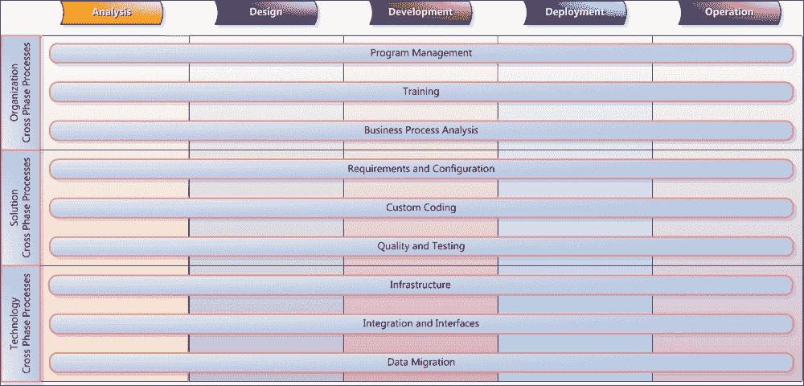

Sure Step 将活动划分为九个跨阶段流程，这些流程被分为三个区域：**组织**、**解决方案**和**技术**。

+   三个组织跨阶段是：

    +   **项目管理**

    +   **培训**

    +   **业务流程分析**

+   解决方案跨阶段是：

    +   **需求和配置**

    +   **定制编码**

    +   **质量和测试**

+   技术跨阶段是：

    +   **基础设施**

    +   **集成和接口**

    +   **数据迁移**

每个跨阶段可以包括多个活动；然而，根据项目类型的不同，跨阶段流程可能被使用也可能不被使用。例如，在快速项目类型中，定制编码或集成和接口的跨阶段没有列出任何活动，因为快速项目类型旨在提供现成的解决方案交付。这将在下一节中更详细地解释。

# 基于瀑布的实施项目类型

为了应对客户实施合作的规模和复杂性，Sure Step 为用户提供三种基于瀑布的实施项目类型和一种基于瀑布的升级项目类型的选择。本节的重点将是三种基于瀑布的实施项目类型：快速、标准和企业。Sure Step 提供的升级项目类型将在第七章 *使用 Sure Step 进行升级* 中介绍。

## 快速项目类型

快速项目类型在 Sure Step 基于瀑布的项目类型中代表了最简单的交付方法。快速项目类型旨在实现 Microsoft Dynamics 解决方案的现成实施，这本质上意味着对标准解决方案的零或最小定制。

快速项目类型为上线解决方案指定了十四个活动，因此它在 Sure Step 中被定位为一个精益或加速交付的方法。当然，活动数量相对较少并不直接转化为更少的实施小时数，但它确实意味着一种简约的方法，需要客户和咨询团队极端的纪律和辛勤工作。这是因为这种精益方法不考虑任何失误的时间——它在项目的预算和资源配置结构中没有余地。

以下是对快速项目类型的截图，包括左侧导航树中显示的活动：

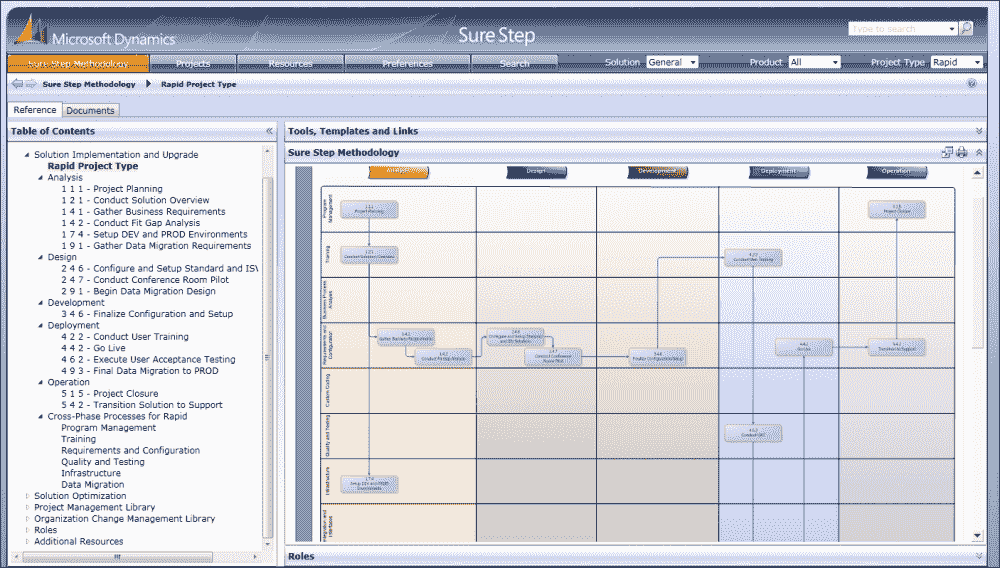

在选择快速方法之前，在诊断阶段，服务提供商和客户确定标准微软 Dynamics 解决方案与客户需求高度匹配，并且不需要进行重大定制或附加**独立软件供应商**（**ISV**）解决方案来补充标准解决方案，这一点也非常重要。如果经过适当的尽职调查确定存在高度匹配，快速项目类型确实可以名副其实，提供快速解决方案的交付。如果咨询团队或客户团队中的任何一方明知需要额外的严谨来开发解决方案，却故意选择这种项目类型，那可能会成为灾难的导火索。

以下是在使用快速项目类型时的理想条件：

+   客户需求与所选微软 Dynamics 产品功能之间存在非常高的匹配度。一般规则是寻找大约 90%或更高的匹配度来证明使用快速项目类型的合理性。

+   为了满足客户需求，可能不需要或只需要极少的定制，解决方案也不包括任何 ISV 解决方案。如果他们的需求被归类为与规定解决方案的**差距**，他们只需要进行简单的定制代码开发工作。

+   业务流程分析不在快速合作范围内。快速合作需要客户承担这项工作，这不是咨询团队的要求。

+   显著的集成或与第三方源接口不在服务范围之内。为集成外部来源编写代码可能充满超出交付团队控制的因素。因此，如果解决方案需要集成和接口开发，采取简约方法是不推荐的。

+   从遗留系统或第三方系统迁移到预期解决方案的过程是直接的，或者它不在服务范围之内。就像与第三方源的集成一样，从外部来源提取数据引入了超出交付团队控制的因素，因此不推荐这样做。

从一般客户概况的角度来看，快速项目类型通常用于部署 Microsoft Dynamics 解决方案的小到中型企业。这些公司中解决方案的典型用户数量较少——最多 25 人。解决方案的使用场景可能包括公司从自建遗留系统或不再支持其增长的小型系统中移除。这些客户必须在诊断阶段完成选择过程，以确定与 Microsoft Dynamics 解决方案的良好匹配，并且会寻找在相对较短的时间内以有限的功能投入生产的解决方案，以便快速实现解决方案的价值。

此外，符合快速项目类型配置的客户可能在业务和 IT 方面都有相对较少的用户，并且有实施或使用 ERP/CRM 解决方案或涵盖组织大部分领域的解决方案的先前经验。在这个领域的相对缺乏经验要求客户选择一个了解他们愿景并能提供满足其需求的解决方案的良好合作伙伴。对于客户来说，向更标准化的解决方案部署倾斜也是明智的。因此，选择快速项目类型更为可取，这样他们可以从一个更直接的解决方案开始，并在跳入复杂解决方案场景之前积累经验。

虽然快速项目类型的典型用途是针对小型企业，但重要的是要注意，这种项目类型不应仅限于客户规模。当你超越组织规模，观察使用模式和需求时，你可能会发现其他适用于此项目类型的用例。例如，快速项目类型也可能适用于多站点部署，其中解决方案已经开发并交付到第一个站点，并且非常相似的解决方案正在被交付到其他站点。

## 标准项目类型

Sure Step 标准项目类型适用于大多数 Microsoft Dynamics 项目，因此是最广泛使用的。此项目类型包括所有九个跨阶段的活动，以支持定制、集成、接口以及业务流程分析。因此，标准项目类型适用于典型的中规模、单站点实施。

下一个截图是 Sure Step 中的标准项目类型。截图包括左侧导航树中显示的活动部分视图，表明每个跨阶段都有额外的严重性：

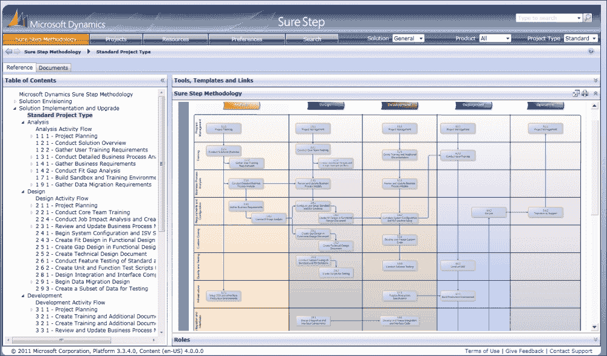

标准项目类型最适合那些发现他们的解决方案需求与相应的 Microsoft Dynamics 解决方案有相当高匹配度的中等至大型企业。匹配度的经验法则大约在 70%到 80%，但更重要的是，所需的定制不应过于复杂，在这种情况下，企业项目类型可能提供一种更严格的方法来管理自定义代码开发过程。

标准项目类型的用法场景包括以下内容：

+   客户的需求可以通过选定的 Microsoft Dynamics 解决方案得到相当高的满足度（大约 70%到 80%的匹配度），这可能包括也可能不包括除核心 Microsoft Dynamics 解决方案之外的 ISV 解决方案。标准项目类型中的活动为服务提供商提供了更多关于如何与 Microsoft Dynamics 解决方案一起设置 ISV 解决方案的指导，因此标准项目类型比快速项目类型更合适。

+   业务流程分析活动包括在内。Sure Step 最广泛使用的功能之一是包含的广泛业务流程图。这些流程图为客户和服务提供商提供了一个极好的起点，从使用标准 Microsoft Dynamics 解决方案功能的角度来映射他们未来的工作流程。流程图不仅允许客户的最终用户以图形方式理解解决方案功能是如何设计的来操作，而且也允许他们可视化他们的当前流程如何适应新系统，以及是否有机会通过简单调整流程来减轻对复杂定制的需求。这一点对于解决方案的长期前景和**总拥有成本**（**TCO**）的重要性不容小觑。

+   **组织变革管理**（**OCM**）被确定为与客户互动的关键学科，尽管其需求不如大规模合作那样严格。

+   对于被归类为差距的需求，需要自定义代码开发，规定的解决方案从简单到复杂，但不是过于复杂，如前所述。对于高度复杂的定制，企业项目类型中额外的严格性可能对客户和服务提供商更有利。

+   自定义代码开发可能包括与第三方源集成的集成或接口，以及从旧系统或第三方系统迁移数据到预期的解决方案。同样，建议不要使这些编码工作过于复杂。

标准项目类型的客户特征是拥有相当数量的系统用户——通常多达 250 人。随着组织各部分用户数量的增加，解决方案不仅需要考虑每个业务单元的多样化需求，还需要处理这些单元之间的相互依赖。因此，可以预期对标准解决方案进行适度到复杂的定制，以适应客户的业务流程。该解决方案还可能需要从数据集成、报告和商业智能系统或数据仓库的角度与几个子系统进行接口。

中等至大型段的客户通常也拥有相当数量的经验丰富的业务和 IT 用户，他们使用并部署了其他非遗产业务解决方案。在这个领域，平均可能有 20 年的全职业务经验，以及 10 年的 IT 经验，包括 ERP/CRM 和通用业务解决方案。对于客户来说，重要的是这些用户是帮助制定整体解决方案要求的团队不可或缺的一部分，在选择最符合他们需求的解决方案以及在交付解决方案（包括配置以及用户验收测试）方面发挥作用。这些用户很容易被日常活动所包围，没有时间参与项目，因此，确保这些用户从日常任务中获得某种形式的缓解，以便能够参与并做出有意义的贡献，是客户组织管理的责任。

标准项目类型的用法也可以扩展到中等规模的组织之外，到大型企业。例如，一个大型多站点组织可能希望在其整个组织中实施一个共同的解决方案，可能希望提供一个已经在试点站点部署的类似解决方案。虽然试点站点的解决方案可能已经使用更健壮的企业项目类型开发，但未来将解决方案推广到后续站点时，可以使用标准项目类型。此类解决方案推广的用法场景将在后续章节中描述。

## 企业项目类型

企业项目类型是所有 Sure Step 项目类型中最严格的。它专为大型、复杂场景设计，**企业项目类型**的特点是需要客户和服务提供商在整个合作期间保持专注和纪律，进行深入的项目管理工作。大规模合作通常涉及复杂的需求和解决方案场景，这要求在所有学科领域进行彻底的治理和监督，包括项目管理、解决方案配置和设置、定制代码开发以及测试。为了满足这些类型的用法场景，提供了企业项目类型。

以下是在 Sure Step 中企业项目类型的屏幕截图。截图左侧导航树视图中包含分析阶段活动的部分视图，突出了仅针对项目治理所规定的深度和勤奋。

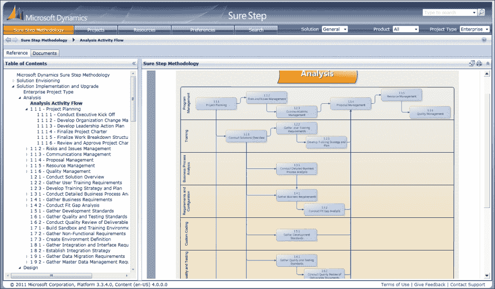

企业项目类型的典型使用场景包括以下内容：

+   解决方案的要求包括复杂的定制和/或多个 ISV（独立软件供应商）解决方案，以及核心 Microsoft Dynamics 解决方案。在大规模合作中，特别是在多站点项目中，看到多个开发团队分布在不同的洲，基于同一解决方案的特定要求进行建设并不罕见。这些团队都必须“同唱一首歌”，换句话说，他们都在朝着同一个目标努力。为了确保团队之间有紧密的协调，并且每个团队都理解相互依赖关系，使用企业项目类型是至关重要的。

+   定制代码开发工作可能包括复杂的集成或与第三方源接口，以及将数据从遗留系统或第三方系统迁移到预期解决方案中。再次强调，企业项目类型提供的勤奋工作在这里是必要的，以确保风险在前期就被识别出来，同时还需要开发缓解方案以减轻风险，如果需要的话。

+   由于解决方案的深远影响，客户需要集中精力进行 OCM（组织变革管理）。企业项目类型规定了 OCM 专家的活动，以便提前规划并制定管理组织内预期变化的策略和技术。

+   与 OCM 活动相伴随的是深入的业务流程分析活动，允许服务提供商和客户组织讨论和记录客户的未来或即将到来的工作流程。Sure Step 中提供的活动和模板有助于企业规模客户进行此操作。

+   大规模合作还需要安装和管理多个环境以开发解决方案。这不仅需要在该项目硬件上的更大投资，还需要进行规划、设置、维护和过渡这些环境的活动，包括为在移交后支持这些环境的团队提供的明确文档，正如企业项目类型所规定的。

+   多地点合作，特别是那些希望在组织内实现一致解决方案的情况，也需要企业项目类型所倡导的严格解决方案配置和开发活动。当每个地点也有一系列独特的需求需要考虑，而这些需求超出了组织内共同需求列表时，这些组织的解决方案开发可能会变得更加复杂。这些独特需求可能源于当地国家的法律、与当地国家相关的会计和报告法规，或源于当地市场的特定要求。

需要使用企业项目类型的组织特征是系统用户数量非常高——250 个用户以上。根据解决方案要部署的地点数量，协调所有用户需要一个精心计划和深思熟虑的方法，这正是该项目类型所提供的。这包括跨地点收集需求、为每个地点的超级用户和最终用户进行培训，以及在部署前在每个地点对解决方案进行彻底的用户验收测试。

该领域的组织还以业务和 IT 团队中经验丰富的用户数量众多为特征。由于解决方案的规模和范围，客户组织通常从这一经验丰富的群体中指定选定的资源作为解决方案交付合作期间的专用资源。实际上，这些资源是实施团队的延伸，这些高级用户通常成为解决方案运营后支持其他用户的内部主要联系人。

# 设置解决方案部署程序

在前面的章节中，我们讨论了使用 Sure Step 实施 Microsoft Dynamics 解决方案的不同选项。Sure Step 有三个瀑布项目类型（快速、标准和企业）以及一个敏捷项目类型。这些类型指导实施者通过解决方案开发和单个发布或组织单个地点的部署。然而，这些项目类型也可以在分阶段解决方案部署或多地点合作中使用，这将是本节讨论的重点。

## 分阶段解决方案部署

在上一章中，我们介绍了解决方案交付的阶段性方法概念。这种方法不应与瀑布型项目类型中的阶段混淆，它指的是将解决方案分多个版本逐步推广到客户组织。阶段性解决方案交付方法在实践中是通过在第一个版本中选择并启用解决方案功能的一个初始子集来执行的，然后通过后续版本中额外的功能来在此基础上构建。阶段性方法的替代方案是在单个版本中交付完整的解决方案，也称为解决方案交付的“大爆炸”方法，我们已经在前面的章节中讨论过。

Sure Step 项目类型可以一起使用，以促进阶段性解决方案的推广。本质上，每个版本都被视为一个子项目，每个版本中启用的需求复杂性将决定相应项目类型的适当使用。阶段性解决方案推广的一般概念在以下屏幕截图中展示：

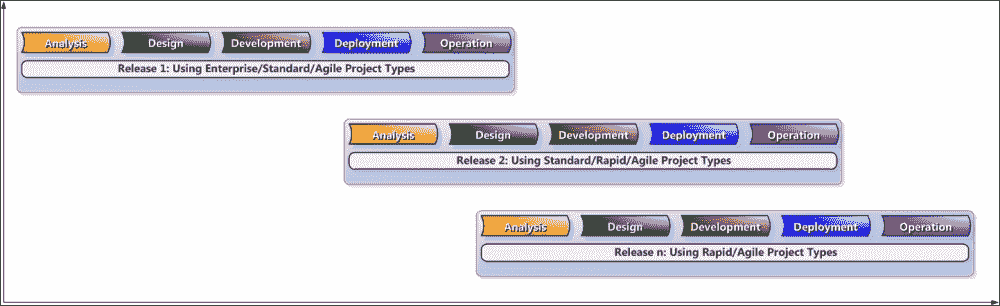

按照这个概念，下一张屏幕截图展示了其用于 ERP 解决方案实施的示例。在这个屏幕截图中，阶段性方法的**版本 1**使用标准项目类型来启用客户的财务运营。这随后是**版本 2**，使用快速项目类型来交付库存控制和订单履行功能。最后一个版本，**版本 3**，使用敏捷项目类型来部署高级规划和调度功能。

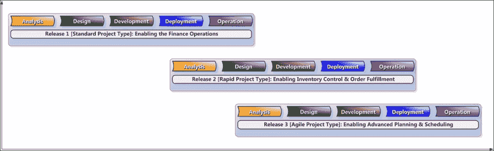

## 多地点合作

当你进入更大的组织领域时，ERP/CRM 解决方案的需求往往超越了客户的多地。多地点合作可能包括一个国家内的多个地点以及全球的多个地点。后者当然引入了更多的复杂性，例如特定国家的税收和会计规则。但在大多数情况下，客户的总体目标是部署一个跨所有地点的通用解决方案。

为了在多个地点开发通用解决方案，Sure Step 提供了与其企业项目类型一起的**核心站点构建选项**。在这种方法中，服务提供商与客户合作，进行需求收集研讨会，涉及来自组织所有相关地点的关键**主题专家**（**SMEs**）和业务负责人。这些研讨会的输出是企业的一个综合**功能需求文档**（**FRD**），它是核心构建的基础。

核心构建可以被视为一个共同分母的解决方案。在经典的 80-20 规则中，核心构建将包括支持企业大约 80%需求的功能。然而，核心构建只是一个已开发的解决方案，这意味着它不能单独部署。核心构建总是与**站点构建**一起部署，这构成了满足相应站点剩余 20%特定需求的功能。在特定站点上的实际部署可以在时间上错开，或者可以重叠部署。时间本身非常关键，并且取决于为该企业启用的特定需求。

下一个截图展示了核心站点构建的概念。该图显示了单个核心构建以及随后的站点构建（**站点 1 构建**、**站点 2 构建**和**站点 n 构建**）以及相应的站点部署（**站点 1 部署**、**站点 2 部署**和**站点 n 部署**）。

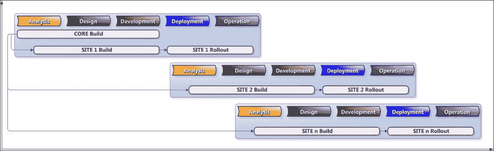

在某些情况下，客户在其投资组合中可能拥有多种多样的公司，每家公司都有非常独特的一套需求，因此最好将每个站点视为一个独立的项目。对于这些多站点实例，可以使用 Sure Step 项目类型组合，这与分阶段方法中采用的方法类似。下一个图例展示了这种情况的示例。该图显示了单个站点构建和相应的站点部署（**站点 1 构建-部署**、**站点 2 构建-部署**和**站点 n 构建-部署**）。

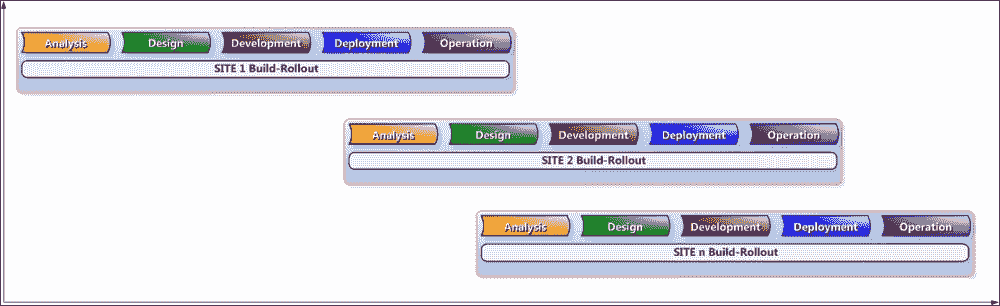

# Sure Step 瀑布实施阶段

前几节提供了对 Sure Step 中提供的不同交付选项的整体概述，包括单次发布的不同项目类型以及结合项目类型进行分阶段或多站点部署的能力。鉴于这个背景，深入了解每个实施阶段，以获取方法论中提供的内容和模板的具体用例和实际场景是个好主意。我们将在本章的后续部分探讨这一点。

# 分析阶段

我们大多数人知道分析阶段是什么，我们通常将其解释为执行活动以更详细地揭示客户的需求和业务流程——换句话说，就是“详细内容”。这就是全部吗？

## 项目的开始

通过启动分析阶段，我们开始了项目的真正实施。一个好的开始将为我们的进一步实施定下基调。关于“分析阶段的目的”的问题，通常用以下答案来回答：*为了进一步分析和记录客户的需求*。听起来合理，还是不是呢？

### 启动你的引擎

这个答案相当不完整，因为它忽略了启动项目的重要功能。这就是我们启动引擎、设定航向并起飞的地方。在航空领域，起飞被认为是复杂且关键的。在软件实施项目中，情况也大致相同——开始阶段总是至关重要的。在分析阶段，我们不仅调查和记录客户需求和流程，还启动风险和问题管理、范围管理、变更管理、成本和时间管理、沟通管理以及质量和资源管理。正是在这里，我们为我们的项目文化和特定任务沟通定下了基调。因此，我们需要明白，除了调查需求和流程之外，还有更多的事情需要做，并且我们需要为此做出更多规划。

### 预计会有一些延误

在诊断阶段，我们努力争取客户的正式合同，即项目的正式批准。事实是，在提交和捍卫我们的提案之后，许多事情都可能发生。对我们来说，理想的情况是客户立即接受并签署我们的提案，并批准我们开始实施项目。如果我们幸运的话，事件可能会以这种方式展开，但替代方案也并非例外。客户的决策过程可能会消耗大量时间。可能需要几周甚至几个月才能获得批准。在经济困难时期，投资决策也可能推迟到下一个财年，导致进一步的延误。一旦我们通过批准的合同从客户那里得到正式的点头，我们仍然不能确定实施项目可以立即开始。实施活动的执行需要战略性和细致的计划，因此，在合同达成协议后，可能需要额外的时间才能真正开始。在制定分析阶段的飞行计划时，我们需要考虑诊断阶段和分析阶段之间的这种时间（不）连接。 

## 建立项目文化的机会

在第四章《管理项目》中，我们讨论了为我们的特定项目建立指导性项目文化的重要性。实际上，我们将它定义为项目成功四大支柱之一。将客户和咨询团队连接到与该项目相关的价值观、信仰、优先事项和行为对于我们的成功至关重要。在我们投入项目的执行任务之前，我们需要确保所有利益相关者和团队成员都与我们的一致，并了解这个项目的所有关键要素。我们需要从实施项目的开始就践行我们所宣扬的原则。现在，实施项目何时开始？答案是，它现在就开始，就在分析阶段。

### 回顾

在我们定义和讨论下一步行动之前，让我们回顾一下我们现在所处的位置。以下图表描述了从决策加速器到最终提案的流程。此图表仅包括三个重要的决策加速器：需求与流程审查、适配差距与解决方案蓝图、范围评估。诊断阶段也可能包括其他决策加速器，但如前所述，您可以按需部署决策加速器。图表将工具和模板分为两类：工作和关键交付成果。工作交付成果是那些作为顾问工具箱的工具和模板，帮助顾问提高效率和品质。他们可以在需要时从盒子里挑选任何工具。有时，他们需要使用许多这些工具，在其他情况下，他们可能只需要少数几个。关键交付成果是面向客户的交付成果的一个子集。这些是我们将作为参与最终输出的文档交付给客户的。确保这些文档支持我们的沟通并正式化客户对所述主题的验证是很重要的。

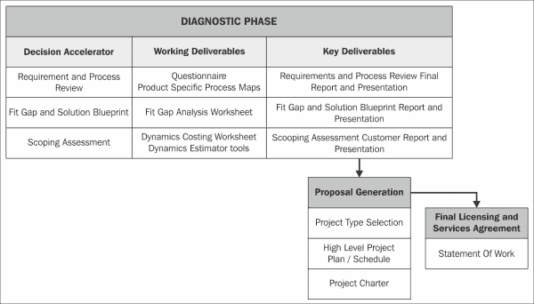

当我们谈论将人们的愿景和我们的方法对齐，并创建一个指导性的项目文化时，我们需要意识到，通过执行决策加速器，我们确实产生了有价值的工具和丰富的信息。事实上，我们启动指导性项目文化所需的一切都已在项目章程中汇编，这是提案生成活动的一个关键交付成果。

### 一个好的项目章程是无价的

在 Sure Step 中，项目章程是在提案生成活动中生成的——这是微软解决方案销售流程（MSSP）证明阶段的关键组成部分。先前诊断活动中得出的结论成为提案生成活动的输入，其中关键任务包括得出结论和打包可用信息和文档。

Sure Step 项目章程回答了关于项目的基本和必要问题：

+   **为什么**：业务目标、关键成功因素和项目目标是什么？项目解决的价值主张是什么？为什么会有赞助？

+   **什么**：主要交付成果是什么？范围是什么，范围外是什么？

+   **谁**：谁将参与，他们在项目中将承担什么责任？他们将如何组织？谁是关键的利益相关者？

+   **何时**：项目进度表是什么，里程碑和交付成果将在何时完成？

+   **如何**：团队将如何参与？我们将如何应对变化、问题和风险？我们将如何执行、管理和控制项目？

以下截图是 Sure Step 项目章程的目录，它清楚地说明了所有诊断结论都汇集在这里：

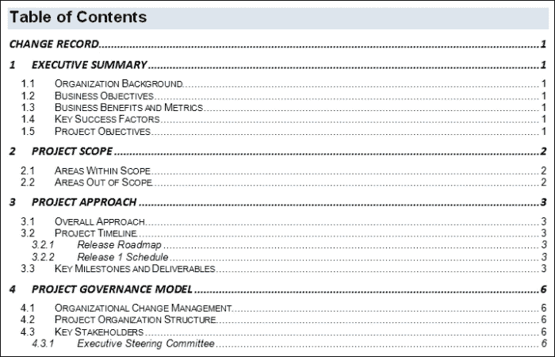

那么，你能想到一个更好的工具来协调所有利益相关者和团队成员在项目方法愿景和所有关键要素方面的看法吗？项目章程的价值是无价的。它将所有相关的项目信息（关于什么、谁、如何和何时）汇总成一份文件，作为所有利益相关者治理整个参与活动的稳固指南。

### 项目规划会议

我们之前讨论过，在诊断阶段结束和分析阶段开始之间可能存在时间差距。因此，我们可能需要在分析阶段开始时修订和更新我们的项目计划和项目章程。以下图表说明了在分析阶段开始时的规划会议中诊断输出的最终确定：

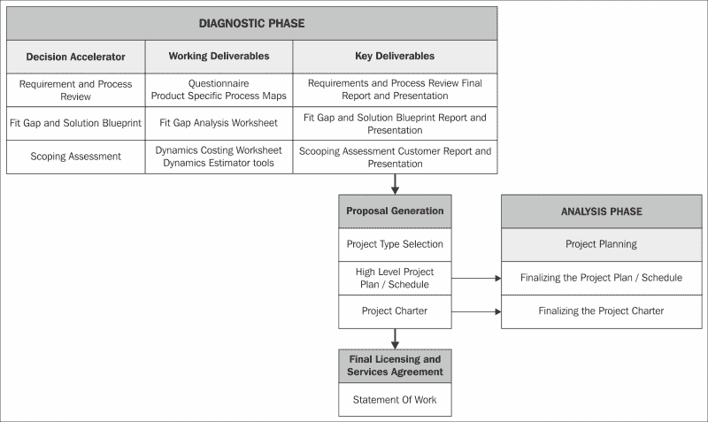

项目规划会议是与客户一起进行的联合练习。会议议程包括项目概述、时间框架、可交付成果、建立项目结构、风险和利益相关者分析，以及沟通、变更控制、资源和质量的规划。

### 启动你的沟通文化

我们都知道启动会议的概念，但我们是否低估了它的重要性？我们有时倾向于将启动会议作为一项操作来执行，即通过重复交付完全相同的内容。我们通常介绍我们的公司、我们自己以及咨询团队，并要求客户也这样做。

然后我们讨论我们的阶段、时间和预算限制，以及我们即将实施的产品。最后，我们试图在积极气氛中结束这次会议。然后，这次启动会议的内容在我们的所有项目中都完全重新交付。但这足够好吗？为了回答这个问题，我们需要考虑以下两个重要因素：

+   项目本质上都是独特的

+   在诊断阶段结束和开始分析阶段之间可能存在时间差距

独特的项目需要独特的启动会议。是什么使每个项目独特？让我们列出一些重要的区分因素：

+   利益相关者、组织背景和复杂性

+   利益相关者的目标和期望

+   商业和项目目标

+   关键成功因素

+   范围内的区域和需求

+   范围外的区域和需求

+   客户和咨询实施团队

+   预算和时间限制

这些元素在我们实施项目中总是不同的。因此，我们需要在启动会议上解决这些问题。通过这样做，我们的启动会议将包括使它们独特的必要元素。我们需要将启动内容与每个实施项目的独特特征相连接。这意味着启动会议不能以操作的方式进行。启动会议需要根据每个具体项目量身定制，并在客户独特组织的背景下进行展示。

这正是为什么 Sure Step 建议在启动会议中推荐以下议程主题：

+   简介

+   项目定义和目标

+   关键可交付成果

+   成功标准

+   项目方法

+   项目团队和组织

+   职责和角色

+   培训和测试

+   控制、报告和批准

+   沟通

+   项目范围

+   问答环节，为顾客、利益相关者和团队成员提供一个表达任何担忧或疑虑的机会

## 总结

是的，准备这类启动会议会消耗一些时间，尤其是当你第一次需要创建此类内容，需要在各种文档和地方搜集信息时。回顾一下议程要点。我们可以在哪里找到这些信息？是的，你说得对；项目章程将所有这些信息汇编成一份文档。通过诊断活动生成的稳健项目章程是独特而有效的启动会议的起点。这就是为什么 Sure Step 列出了以下启动会议的先决条件：

+   初始项目计划已到位

+   确定项目利益相关者

+   项目章程已建立

+   项目准备就绪，可以执行

我们现在可以通过添加启动会议来进一步完成我们的图表。以下图表说明了从诊断活动中生成的信息如何在项目章程中汇编并作为启动会议的输入重新使用：

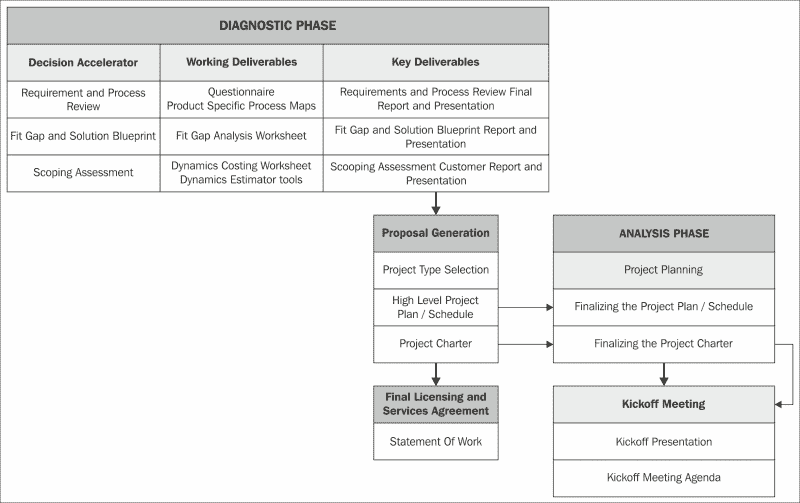

在实施项目开始时，一个以价值为导向的启动会议对于协调所有利益相关者至关重要。在诊断阶段结束、合同签署和开始分析阶段之间，可能会出现许多情况。在咨询现场，参与特定项目诊断活动的团队可能已经解散，并已经开始计划其他任务。在客户现场，关键用户可能已经更换部门或离开公司。可能会有新的经理或部门负责人被雇佣，带来新的愿景和优先事项。由于新出现的商业机会，业务流程和需求可能已经经过审查和修改。在诊断阶段结束和分析阶段开始之间面临较长时间的情况下，可能出现许多新的情况。

那么，我们的使命现在是什么？在启动会议上，我们需要验证和确认我们是否仍然对项目章程中所述内容达成共识和支持。这对启动一个成功的合作至关重要。我们是否仍然拥有相同的利益相关者？他们是否仍然支持项目目标和优先级？我们是否仍然对范围达成共识？新的咨询团队成员是否与诊断结论一致？他们是否有关于范围和业务流程的问题？需要签署哪些文件，谁需要签署，签署究竟意味着什么？我们还需要展示和审查计划，并确定我们的下一步行动，包括期望从谁那里得到什么。

因此，启动会议不仅仅是小规模的聚会来展示自己和公司；它需要更多。我们不仅需要就什么、如何、何时达成一致，还需要寻找自诊断阶段结束以来出现的问题和变化。

## 培训还是不培训？

在启动会议之后可能考虑计划的第一项活动之一是培训。培训不仅是一种优秀的教育工具，也是一种管理感知的伟大工具。在 Sure Step 中，培训是跨阶段过程之一，有助于更好的项目生命周期规划。阶段不应仅限于其核心活动，但需要包含所有跨阶段活动的良好混合。在这个愿景中，培训不应仅限于部署阶段。为什么我们会考虑在分析阶段规划培训？我们如何从中受益？我们在分析阶段培训的目标非常重要。以下是我们应该牢记的一些理想目标：

+   提高对新解决方案的认识

+   介绍范围内功能领域的功能架构和标准概念

+   介绍应用的词汇

+   在客户和咨询团队中建立对流程和功能的共同理解

+   促进感知和组织变革

+   提高即将到来的分析研讨会效率和品质

如果在分析阶段进行培训实现了这些目标中的哪怕一小部分，这也将是值得的。那么，我们是否需要计划对最终用户的整个团队进行关于他们新解决方案的培训呢？答案是简单的，那就是*不需要*。我们不想在这个项目生命周期的这个时刻教育最终用户，因为这会太早，而且不会有效。研究清楚地表明，到 Go-Live 时间，最终用户会忘记大部分内容，我们的培训投资将不会产生任何回报。我们想要计划的是为针对特定群体的小型培训。我们希望我们的关键用户团队能够理解我们的解决方案的功能概述，以及与他们专业领域相关的内容。因此，我们需要向选定的受众展示并阐明适用于相关功能领域的标准化功能和流程。这可能会展开讨论，但这正是我们的目标——良好的客户互动、反馈和积极倾听可以为我们提供大量信息。

在这个阶段，我们可能已经发现了一些机会来展示，在保持相同或更好的结果的同时，可以通过稍微不同的顺序或方式执行现有流程。你做得对；我们应该在我们核心分析活动开始之前就着手管理人们的认知。组织变革管理不是你只在 Go-Live 之前启动的事情；它应该贯穿于你的项目生命周期规划中。你可能会问，这种培训可能存在哪些风险。最大的风险是针对错误的受众。这种培训，在 Sure Step 术语中被称为*Conduct Solutions Overview*，对于真正的最终用户来说是不合适的，因为他们只有一个目标：他们寻求答案，了解这个新解决方案将如何解决他们详细的日常工作。在这个解决方案概述培训中，他们找不到这些答案，可能会导致潜在的挫败感和消极情绪。而且正如你所知，坏消息传播得很快。这就是为什么我们需要妥善管理这些会议，并有效地与我们的客户沟通，这些会议是为他们而设的。

下面的图表说明了启动会议之后活动流程的延续：

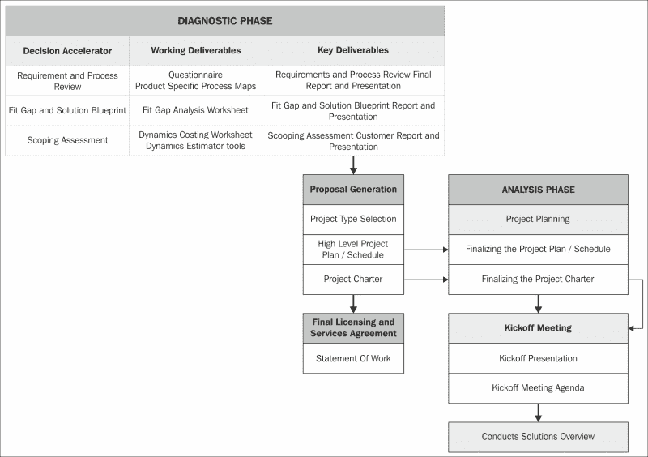

## 未受控制的分析阶段

项目管理状态报告通常在分析阶段不会披露许多问题。当我们询问我们的应用顾问在分析活动中的状态时，他们通常会回答说一切顺利。一些项目经理并不认为这个阶段是一个复杂的情况，他们将这个阶段的成功委托给涉及的业务分析师。他们安慰自己，当他们部署高度熟练和经验丰富的业务分析师和应用顾问进行业务流程分析研讨会时，他们不需要担心太多意外的问题。似乎这样的项目经理也不太关心这个阶段的可交付成果。他们只需要一份书面文档，描述并解释客户对业务流程所需的功能需求。现在看起来，在分析阶段唯一受到挑战的是业务分析师，而项目经理只是面对一个轻松的小任务，即规划研讨会并在研讨会活动中收集一些反馈。如果这是真的，我们在这个阶段就不需要项目经理了。让我们更仔细地看看，在这个阶段项目经理真正面临的挑战是什么。

我们已经在前面的章节中了解到，我们不仅需要计划纯粹的分析活动，分析阶段还代表着实施项目的开始。这将挑战项目经理启动项目文化和方法，而这不仅仅包括计划几场访谈会议。即使我们忽略这一点，真正的分析活动也要求良好的项目管理。

如果我们将责任限制在规划研讨会、询问我们的应用顾问进展情况以及等待最终文档交付上，我们就是在放弃所有控制权。我们首先失去的控制元素是进度报告。如果我们只能以最终文档交付的形式报告进度，我们实际上能做的事情很少，除了等待这份最终文档并从完成百分比的角度来推断进度。现在我们都知道这有多准确。我们将失去的第二个控制元素是质量控制。如果我们等待这份最终文档交付，我们只能在它准备好后评估质量。那时，可能已经太晚采取纠正措施了。大多数项目经理可能甚至不会阅读完整的分析文档交付，因为他们没有足够的时间去审查所有细节。

在项目生命周期的第一阶段放弃进度和质量跟踪能力并不是明智之举，这将为我们的整个项目定下基调。如果我们不关注这些重要方面，我们很可能也不会在以后关注。

不幸的是，还有其他一些东西可能会被忽视：为分析活动、范围管理和问题及风险管理设定优先级。这些元素在分析阶段的被动项目管理部署期间都处于危险之中。这些元素将在下一节中列出并讨论一些真实世界的分析场景。

## 真实场景分析

在一个不受控制的分析阶段，我们可以识别以下典型的场景。

### 回到起点

直接切入正题：应用顾问从头开始，重新分析一切——这有多明显？相当多的应用顾问在核心分析活动开始时完全脱离诊断结果，并且没有关于待分析范围优先级的指导。我们能否预测这种场景的结果？结果可能是涵盖了许多不太重要主题的详细信息的分析文档，同时缺乏关于更重要和复杂领域的良好信息。在许多情况下，客户也会感到沮丧，因为他们不得不再次提供相同的信息。看起来我们又回到了起点，我们之前执行的*预研究分析*活动并没有带来太多改变。客户将不明白为什么我们为此收费，并抱怨浪费了努力。表现得惊讶吧！

### 范围蔓延悄然而至

我们大多数人对于范围变更都了如指掌。它是导致项目失败最常见的原因之一。了解了这一威胁，我们便为此做好准备。手持变更请求，我们从发现范围蔓延的第一刻起就开始与之抗争。至少这是我们告诉自己的一句话。问题是，我们大多数人只是在项目生命周期的后期阶段才识别出范围蔓延，那时我们刚刚结束开发活动，开始参与测试活动，或者更糟糕的是，当我们正在为上线做准备时。不幸的是，在这个阶段我们赢得战斗的机会微乎其微。

我们需要意识到，范围蔓延很可能在分析阶段悄无声息地溜进来，尤其是在我们的分析师与良好的诊断结果脱节时。在这些研讨会中，我们的分析师团队将与几位部门负责人、关键用户和业务分析师等会面。他们都将对应该自动化什么以及如何自动化有自己的看法。他们可能会提供有关现有需求的新信息，甚至在这一阶段提出全新的需求。如果我们的分析师现在没有识别或报告这一点，我们的范围蔓延怪物将在后期阶段开始生长，并变成一个巨人。

### 没有问题，没有风险

在分析阶段进行被动项目管理不会为分析师团队提供很多关于其职责的指导，特别是当谈到问题和风险时。在分析阶段，项目经理经常询问他们的顾问团队事情进展如何，而且很少会报告问题和风险。在大多数情况下，一切都被报告为处于控制之下。这是因为应用顾问可能不会觉得在这个阶段识别问题和风险是他们的责任。在这个阶段，识别问题和风险通常被视为项目经理的责任。问题是项目经理并没有参与所有的研讨会和访谈，缺乏进行这个问题和风险识别所需的信息。因此，在这个阶段很少（如果有的话）报告风险和问题，这是一个错失的机会。有一点是肯定的：在分析阶段，我们将面临问题和风险，但如果它们没有被识别和报告，我们将在项目生命周期的后期面临后果。

我们可以通过指出项目经理应该控制分析阶段的原因有很多来总结。除了核心分析活动之外，还有更多的工作要做，甚至对这些分析活动的管理也需要项目经理有坚实的方法和清晰的愿景。在接下来的章节中，我们将讨论 Sure Step 如何帮助我们。

## 分析什么？

要知道哪些需要我们全神贯注，哪些可能需要我们较少的关注，我们需要回顾我们的诊断结果。以下图表说明了与诊断结果之间的联系：

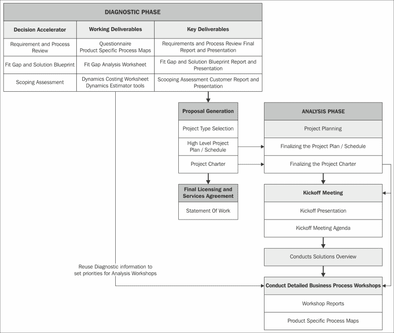

顾问可以通过回顾诊断结论和重新使用诊断工具和成果来为业务流程研讨会做准备。项目章程应该提供一个完整的图景，说明范围之内和范围之外的内容，业务优先级，关键成功因素，以及已知的问题和风险。如果这些在诊断阶段进行了建模，问卷和产品特定的流程图将是分析阶段的一个极好的起点。它们在整体客户业务环境中可视化了已经识别的瓶颈和复杂区域，并将为顾问团队规划分析活动提供明确的指导。分析团队也将从 Fit Gap 分析工作表中受益，它提供了以下非常有价值的信息：

+   与业务流程相关的需求

+   需求优先级

+   按照标准功能、配置、定制、工作流和 ISV 解决方案分类的需求

以下图表说明了 Fit Gap 工作表如何作为业务流程研讨会的一个输入工具：

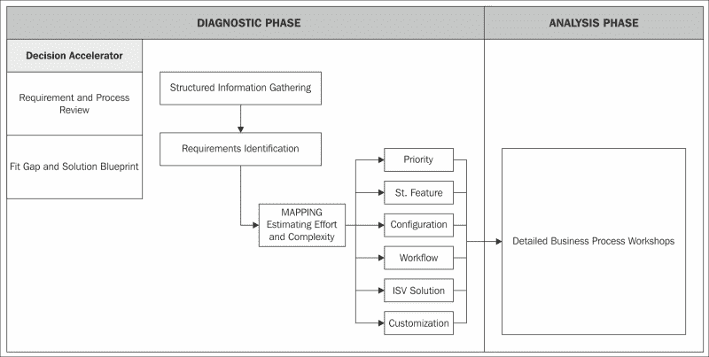

通过给定的优先级要求，包括通过类别估计的努力和复杂度排名，应用咨询师可以更好地规划和优先考虑可用的分析时间，从而在更短的时间内实现更高效和以质量为导向的分析工作。

## 追求中间分析交付成果

如果我们想在分析阶段跟进我们的应用咨询师在进度和质量方面的表现，我们应该计划中间交付成果。制作一个简单的文档，例如研讨会报告，因为它可以产生很大的影响。作为项目经理，你需要指导你的团队，每次研讨会后都需要制作研讨会报告。它包含标准化的部分，这样所有应用咨询师在记录研讨会结果时都使用相同的格式。这使得项目经理跟进起来更加方便，因为每份文档都可以以相同的方式进行阅读。一旦计划中的研讨会结束，咨询师需要提供研讨会报告。不充分的研讨会报告将被项目经理质疑，并可能导致纠正措施。在研讨会本身之后不久生成的研讨会报告，将防止重要信息被遗忘的额外风险。

与分析活动合作标准化中间文档交付成果的一个巨大额外好处是，可以明确结构和质量方面的期望输出。这也会为咨询师的交付设定明确的期望。

以下截图展示了一份研讨会报告的一页：

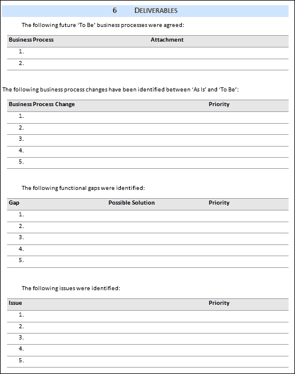

这一页非常清楚地表明，应用咨询师不仅应该记录客户利益相关者在研讨会中告诉他们的内容，而且他们还负责生成结论，将信息与诊断范围联系起来，识别问题，并推动流程变化，以避免不必要的定制。作为项目经理，你现在可以通过提出两个问题来组织你的跟进：

+   研讨会结束时我们是否有研讨会报告？

+   应用咨询师是否以高质量的方式填写了第六部分？

这种方法与“等待最终交付成果”的方法有巨大的区别。

## 通过拟合差距分析在分析阶段管理范围蔓延

如前所述，未管理的分析阶段的一个后果是范围蔓延悄无声息地进入。在分析阶段活动中，关于现有需求的新信息变得可用，使原始请求在新的光线下显现，甚至允许制定新的需求。即使有坚实的实施方法，这些情况也是不可避免的。未能识别这些范围变化会影响所有利益相关者在持续时间、成本、质量和期望方面的利益，这使得识别它们成为我们的真正挑战。以下图表介绍了 Fit Gap 评估作为分析阶段的有价值工具：

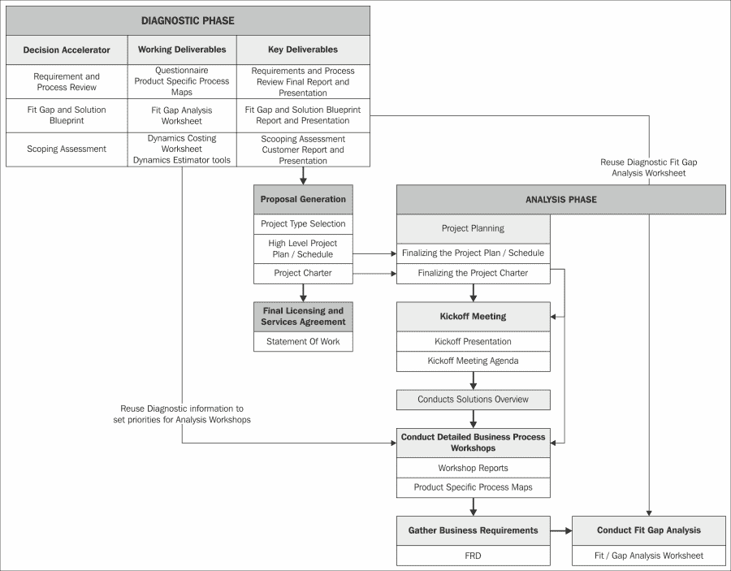

一旦所有业务流程和需求调查都已经完成，就是时候在功能需求文档（FRD）中记录所有发现和结论，为新的解决方案提供完整的需求描述。现在我们已经将所有范围定义到了所需的详细程度，我们可以重新评估 Fit Gap 情况。

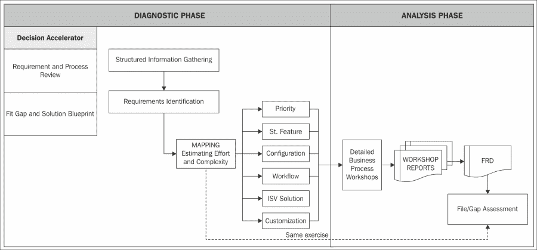

Sure Step 倡导在分析阶段捕捉到需求后，重新评估 Fit Gap 情况的好处。这可以防止范围蔓延悄无声息地进入，它加强了所有利益相关者对预期解决方案的认识，并为项目经理提供警告信号，以解决多个问题。如果我们的评估揭示了新的需求、变更以及其他重要的范围挑战，我们需要接受这些宝贵的信息。这证明了我们的顾问团队对项目和业务范围的影响非常关注，并且我们被激发采取一些良好的项目管理行动，这是我们的真正工作。立即行动！那么我们能做什么呢？我们至少应该就这些确定区域进行沟通。咨询团队的意见是什么？客户团队对此有何感受？影响是什么？我们能找到替代的业务流程和解决方案吗？我们不应该对这些情况感到恐慌，也不应该忽视它们。这些情况在项目中无处不在，在分析阶段识别它们是正确方向的一步。推荐如何解决这些问题？由于项目是独特的，你应对这些挑战的方法和解决方案也将是独特的。你可能需要一个包含各种成分的配方，例如业务流程变更、拒绝一些新的不重要需求，以及接受一些真正的范围变更。你的配方需要在这个背景下味道好。它需要与目标、预算、时间和成本限制保持一致，同时也要得到大量利益相关者的接受。

我们刚刚提到范围变更了吗？Sure Step 明确指出，范围变更及其管理不能仅限于项目生命周期的最后阶段。在 Sure Step 中处理范围变更是提案管理的一个要素。Sure Step 实际上是这样说的：*“提案管理是一项需要在项目实施生命周期的所有跨阶段执行的活动”*。因此，我们可以在分析阶段开始提出变更请求。这意味着客户组织将在项目生命周期早期就熟悉这一过程。**变更请求**是一种有效的工具，可以控制范围蔓延，但需要谨慎处理。当仅在一个阶段操作并且变得过于频繁时，这个工具将失去所有的影响力。有时我们倾向于认为变更请求不仅是为了解决所有范围问题，也是为了解决所有质量问题。当明确的质量问题被不恰当地、厚颜无耻地作为变更请求提交，并且每个范围问题都转化为变更请求时，我们正在制造一堆文书工作。最佳实践告诉我们，在这些情况下，范围变更问题将保持未解决状态，因为客户不会批准这些变更。感到惊讶！专家级的使用变更请求意味着在整个项目生命周期内平衡使用，正如 Sure Step 所建议的那样。

我们现在可以进一步完成分析阶段的图示：

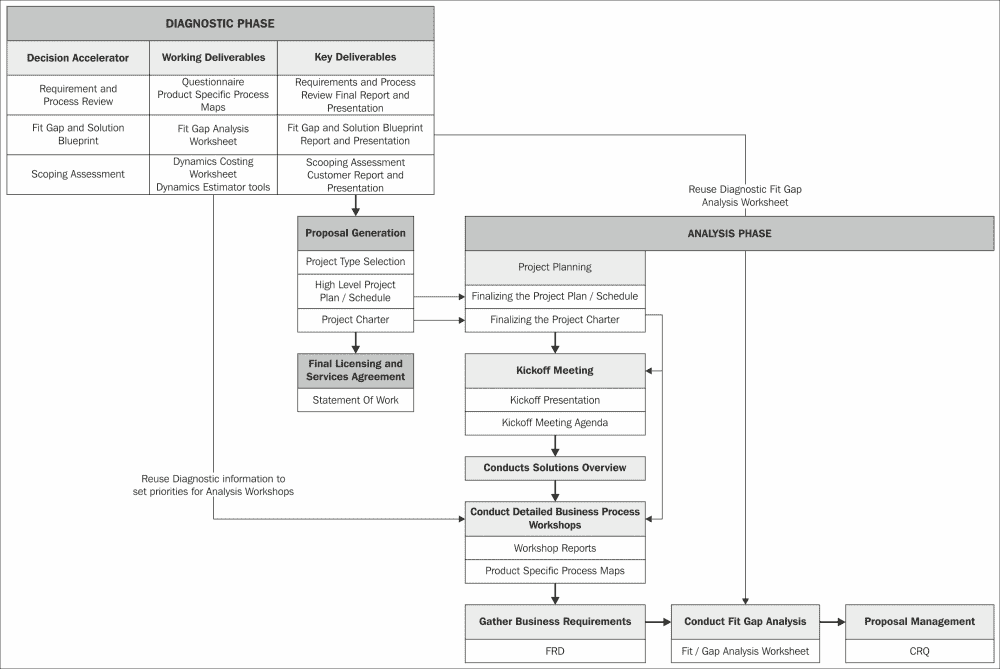

## 不要忘记数据迁移

专注于功能性解决方案，数据迁移通常被视为次要问题。我们热爱设计功能性解决方案，连接业务流程和软件功能，对此如此专注以至于其他一切都不复存在。这实际上并不聪明，因为非功能性需求可能是一项艰巨的任务，消耗大量资源并带来相当大的风险。我们中的大多数人已经体验过数据迁移挑战如何影响项目持续时间甚至上线决策。这就是为什么 Sure Step 关注数据迁移。诸如现有数据状况、数据清理、要迁移的历史数据量、现有数据源的识别以及主数据管理等话题，需要从一开始就解决。他们需要确保这些话题在分析研讨会上得到处理。

## 与基础设施部门互动

良好的项目生命周期规划需要在每个阶段都包含跨阶段流程的良好组合。我们已经看到，分析阶段不仅仅是为核心分析活动保留的，它还需要积极的项目管理、强大的沟通、培训以及对数据迁移问题的关注。还建议开始与基础设施利益相关者互动，以构建沙盒和培训环境。这些环境需要允许客户培训和对核心微软 Dynamics 产品的熟悉，在配置或定制之前，这提供了一个建立与客户基础设施人员关系和沟通的绝佳机会。我们越早开始与他们互动，就有更多的时间为他们准备关键转折点。

# 设计阶段

解决方案设计是任何软件项目中的关键活动。即使涉及到的定制化不多，我们仍然需要设想项目的“如何”。

## 我们真的需要设计阶段吗？

*我们真的需要一个独立的设计阶段来设计解决方案吗？* 这是一个经常被问到的问题。有些人声称在分析阶段就开始设计解决方案，而有些人则将其包含在开发阶段，甚至在方便的时候进行。从瀑布模型的角度来看，你可以在一个或多个阶段中规划你的设计活动，只要你在特定阶段执行了计划中的内容。因此，并没有真正的瀑布模型理由来特别设立一个设计阶段。然而，阶段代表了时间上的分解，以便更好地规划和管理工作流程。这就是为什么 Sure Step 计划在单独的设计阶段中实施主导的解决方案设计流程。在捕捉到范围基线之后，我们现在可以集中精力在管理良好的时间框架内进一步发展我们的解决方案概念。我们大多数人都熟悉“什么”和“如何”的常识规则：在诊断和分析阶段，我们专注于“什么”方面，而在设计阶段，我们则发展项目的“如何”方面。这表明了在这些阶段中主导流程将是什么，但不要被误导：项目管理跨阶段流程已经教会我们，在阶段中我们需要规划的内容要比核心活动更多。

## 被动设计阶段的风险

诊断和分析阶段的核心活动本质上都涉及客户互动。销售前活动，如需求评估、业务流程评估、概念验证演示、研讨会和访谈等，都需要客户互动。在设计和发展活动中，这一点并不那么明显。设计活动通常被设想为并缩小到记录“如何”方面。这意味着设计等同于撰写关于“如何”方面的文档，唯一的计划客户互动是验证文档。将这一点与对开发阶段的相同被动愿景结合起来，将严重危及我们的项目成功，因为我们实际上是在将客户排除在项目之外，直到真正的部署活动，并推迟许多实施活动。我们真的想承担这个风险吗？

## 确步设计阶段的所有活动

开始赞扬确步的好处，因为它将使我们摆脱被动的设计阶段。真正的实施活动就在设计阶段开始！确步告诉我们不要等到开发阶段结束时才开始实施活动。我们需要通过频繁与利益相关者互动来保持与客户组织的联系。我们需要提高我们的利益相关者对项目和解决方案的认识和知识水平，刺激组织变革，并继续识别和管理风险和问题。有许多事情要做，是的，我们也会记录一些“如何”，但不会限制自己只做这一点。

### 我们正在实施一个标准包解决方案

现在让我们思考一下这个问题。它说了什么？这意味着我们不是在交付一个纯开发项目。通过安装标准功能、配置或 ISV 解决方案，可以满足大量需求。那么为什么我们有时只在开发活动完成后才开始实施？一些标准功能将依赖于定制功能，而这些需求不能立即实现，但这并不适用于所有情况。包解决方案的一个关键优势是，与定制解决方案相比，我们可以非常快速地交付。我们需要通过尽早开始实施来利用这一点。实际上，推迟实施真的没有理由。我们将从解决方案早期交付的小部分中受益。

### 从需求到设计

在诊断阶段，我们收集了高质量的信息，将其分解为需求，并通过将它们分类到标准功能、配置、定制、ISV 解决方案和工作流程中与我们的标准解决方案进行映射。我们在分析阶段细化了这种理解，并再次与我们的标准产品进行核对。这意味着我们可以根据结构化信息开始设计阶段，这些信息将指导我们下一步做什么：文档和实施。

### 文档和实施

以下图表显示了要实施和记录的内容：

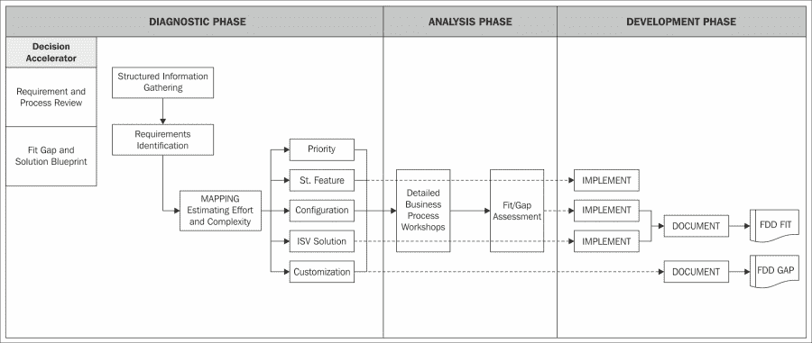

从诊断和分析阶段出来，Sure Step 不仅带来了信息，还带来了优先级、指南、结论以及对即将实施解决方案的深刻理解。标准或 ISV 解决方案中的标准功能可以立即实施，同时满足直接的配置要求。我们的实施团队现在必须启动他们的引擎，将这个项目加速到超光速。一些功能可能需要等待安装或配置，因为它们可能依赖于定制功能。不要为此感到恐慌，因为我们可以在稍后完成实施。好消息是我们已经交付了解决方案的一部分，而且还没有找到第一个对此抱怨的客户！

文档也是游戏的一部分。拥有文档化的解决方案设计很重要，但我们不需要包括一切。我们不记录标准功能，但将专注于配置设置和定制功能。我们使用**功能设计文档**（**FDD**）来记录我们的配置和定制概述。配置设置应在 FDD-FIT 中记录，而定制则在 FDD-GAP 中记录。

Sure Step 还提供了**技术设计文档**（**TDD**）以及**解决方案设计文档**（**SDD**）。TDD 是 FDD-GAP 技术术语的翻译。该文档的目标是定义和记录每个系统修改或增强的技术细节。这可能是我们在与初级开发者合作或在海外开发环境中进行开发活动时即将到来的开发活动的一个关键组成部分。

SDD 的目的是让业务决策者和其他利益相关者能够以业务语言清楚地了解所提出的解决方案设计。这可能是在组织复杂性高的公司中所需的文件。FDD 文档对所有瀑布项目类型都有益，而 SDD 通常用于企业项目类型。

应用顾问将与适当的关键用户携手合作，实施和记录。这就是为什么在这个阶段，我们应该向我们的关键用户提供一些关于产品功能和特性的培训和指导。这不仅将使我们的关键用户在产品知识上达到新的水平，还将避免误解并从关键用户那里获得更多的承诺。与关键用户紧密合作将提高两个团队的协作，这对于成功至关重要。

### 启动测试

一旦我们实现了功能和特性，我们就可以释放每个项目中关键成功因素的力量——测试。测试将使我们能够与关键用户互动，识别问题，工作并引导感知，并更新业务流程模型。在这个阶段启动测试还将使我们的关键用户为即将到来的项目阶段中安排的用户测试做好准备、组织和控制。他们可以在这里开始使用新解决方案的愿景过程。他们将了解测试涉及的内容，并增加他们的产品知识。信息充分且投入的关键用户对于项目成功至关重要，但我们不能期望关键用户一夜之间达到我们的知识水平。我们需要确保他们能够逐步建立起他们的知识和理解，以便在需要时做好准备。这就是为什么我们在这里通过在设计阶段启动测试和测试脚本开始。我们将从测试我们与关键用户一起实施的功能和特性开始，这些特性得到了可用的 Sure Step 测试脚本的加强。之后，关键用户可以继续为即将到来的测试准备测试脚本。

由于测试活动的开始，我们也将遇到问题。再次，欢迎这些问题，因为这是一个极好的机会来沟通和解决这些问题，并计划纠正措施。这正是我们想要的：现在揭示问题，这样我们就可以克服它们，而不是通过不识别它们而将它们留到后期。

### 与基础设施部门互动

安装和配置核心产品以及组织测试也将涉及基础设施的元素，即测试环境。这是一个继续与基础设施利益相关者互动的好机会。所有这些需要什么？我们需要做什么才能将培训转化为真正的测试环境？我们可以与基础设施人员携手合作，使他们更好地理解这个新产品的基础设施后果；这种互动也可能揭示一些新的问题或风险。正如你所知，这正是我们想要的，因为它将允许采取纠正措施。

### 不要放弃数据迁移

我们需要继续我们在分析阶段开始的数据迁移工作，通过设计迁移流程和将现有遗留系统与微软 Dynamics 应用程序之间要迁移的字段进行映射。由于我们在设计阶段启动了测试，我们也可以在这里创建一个用于测试的数据子集。

### 开始规划部署

一个优秀的项目经理能够超越当下，明白一个组织良好的部署阶段对于成功的上线至关重要。这位项目经理也知道，部署的成功取决于用户组织的承诺。同时，我们需要认识到，我们的部署活动将对该组织造成沉重的负担。培训、用户验收测试、性能测试和基础设施准备将消耗他们大量的时间和精力。我们需要通知我们的客户这一点，并请求他们的承诺和规划，而且我们需要提前做好这一点。设计阶段是启动这一过程的理想时机。到目前为止，两个团队都对即将发生的事情有了很好的理解，因此我们应该在这里着手处理。Sure Step 为我们提供了一个部署计划，概述了项目部署阶段需要发生的流程和活动。它将要求客户对这些活动表示理解和承诺。这不仅仅是安排部署。部署计划必须成为你围绕部署范围、部署策略、部署资源、培训和测试组织以及部署时间表等主题进行沟通的输入。我们的目标是获得客户对部署活动的认可。底线不仅仅是文档，而是沟通，沟通，再沟通。

# 开发阶段

这可能是软件公司最擅长的：开发。它主要依赖于我们的信息技术商业生态系统，因此我们处于主场。太阳之下无新事，或者有吗？

## 仅限开发者？

开发阶段通常被组织成一个“仅限开发者”的时间段，并不罕见的是，它遵循相同的理念。这就是应用顾问的负担显著减轻的地方，我们的开发团队接管了工作，他们甚至可能完全隔离在服务提供商的场所。这是最佳策略吗？毫无疑问，开发活动将在这一阶段占据突出位置。是的，开发者可能需要一段时间不受打扰地工作，以便最大限度地集中精力。但正如我们从其他阶段的组织中学到的，还有更多需要考虑。

我们需要保持警惕，关注项目生命周期规划，并确保按照计划包括足够的客户互动和参与。我们需要确保与所有利益相关者的沟通水平，并保持应用顾问和关键用户之间的协作。最后但同样重要的是，我们还需要继续为客户的部署基础设施部门做好准备。总之，在这一阶段，开发力量将发挥关键作用，但他们不应是这场球赛的唯一参与者。

## 开发并冻结定制代码

在 Fit-Gap 练习期间映射为定制需求并在 FDD-Gap 和 TDD 文档中设计的需求，在这一阶段得到开发。这不仅包括解决请求的功能性需求的功能性要求，还包括数据迁移和接口等非功能性要求。开发团队需要首先审查解决方案和技术设计文档，然后开始实际开发。他们应该遵守所有批准的质量和文档标准。在较大的开发团队中，由主开发人员协调开发工作也是至关重要的。产生的交付成果将经过多次单元和功能测试迭代。一旦成功通过，代码将被冻结，表示它不再开放修改。只有在数据验收、流程或集成测试中发现问题时，才能进行进一步的修改。不要忘记，当交付的定制与预期不同时，更新设计文档。

## 完成测试

一旦定制功能交付成果开始生产，我们就可以进一步完成在设计阶段启动的测试。现在我们可以通过测试越来越多的完整流程，将其提升到全面解决方案测试的水平。你说对了——测试是一个跨阶段的过程，它使我们能够在整个项目生命周期中继续与客户互动和沟通。现在是时候进行集成和数据验收测试了。到目前为止，我们的主要用户应该已经非常熟悉测试流程，并且他们正在不断加深对解决方案的了解。他们将微调测试脚本，并可以开始编写用户验收测试脚本，以便在部署阶段引导用户组织通过这些测试。感谢我们持续的测试努力和与用户组织的合作，我们将收集问题和疑问，并在关键用户团队中检测到不确定性和敏感性。我们必须利用这些信息！我们需要在这里解决这个问题，确保部署阶段达到最佳状态。

下面的图表说明了我们从设计阶段进展到开发阶段的情况：

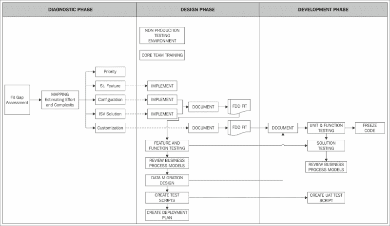

我们也可以继续在测试脚本开发上的合作，这是我们始于设计阶段的任务。与关键用户一起，我们现在可以准备用户验收测试脚本，这些脚本将在部署阶段引导**用户验收测试**（**UAT**）。UAT 是所有先前测试活动的最终成果。尽管可以利用先前的测试脚本，但 UAT 脚本应专注于系统用户执行的主要功能。

## 最后一次变更请求

在任何项目中，变更请求总是出现在地平线上，无论我们如何定义我们的范围，或者我们在组织变革管理方面做得多么好。在讨论的 Sure Step 生命周期规划中，我们试图在所有阶段与客户组织保持互动，以识别问题、风险和变更请求。这使我们能够尽早识别它们，并在整个项目中进行分散。这样，我们可以主动管理，防止问题成为部署阶段的真正负担。在开发阶段，我们仍然会检索和管理变更请求，但现在我们需要意识到，在这个阶段之后，我们需要将变更降低到较低水平，我们的最终用户组织需要对此有所了解。作为项目经理，我们有责任让我们的客户了解这一点。另一个沟通挑战！

### 流程模型还可以更改吗？

这个问题的答案是肯定的。由于我们在开发阶段计划的活动和互动，我们将从客户和咨询利益相关者那里收到反馈。我们的开发者可能会有关键的评论，应用顾问可能会提出重要的见解，我们的客户也可能提出问题。可以产生这种反馈的典型互动是测试，正如我们讨论的那样，测试活动在开发阶段继续进行。基于这种反馈，我们可能需要对我们的解决方案设计进行一些更改，或者说服我们的客户实施业务流程变更。业务流程模型的审查和更新是一个持续的过程，应该在项目生命周期的整个过程中迭代，包括设计和开发阶段的审查和更新。

## 开始最终确定

很明显，Sure Step 倡导良好的项目生命周期规划，这在开发阶段计划的活动和交付成果中再次得到强调。我们已经看到，这个阶段不仅仅是为核心开发活动预留的。细心的读者也会发现，我们需要在开发阶段开始最终确定大部分的实施活动。这意味着到这个阶段结束时，我们已经交付了大部分的成果，这将使我们能够专注于部署阶段的纯部署活动。

### 完成系统配置和 ISV 解决方案的设置

在设计阶段，我们开始安装和配置标准功能和 ISV 功能，以满足客户的需求。现在，随着本阶段定制功能的可用，我们可以完成这一配置工作。这意味着我们还可以实施和配置定制功能，同时，正如前文所述，将测试提升到解决方案测试水平。解决方案测试不可避免地会导致配置更改，在此过程之后，我们可以冻结新解决方案的配置设置。

### 完成设计更新

由于已识别的问题、变更和更新的业务流程模型，我们必须更新适当的设计文档。

### 将非生产环境移交给客户

本任务的目的是将非生产环境移交给客户的基础设施团队，并确保他们准备好接受和支持这些环境。这将使我们能够与基础设施资源互动，并围绕新解决方案的基础设施主题积累他们的知识。

以下图表将完成我们对开发阶段的概述：

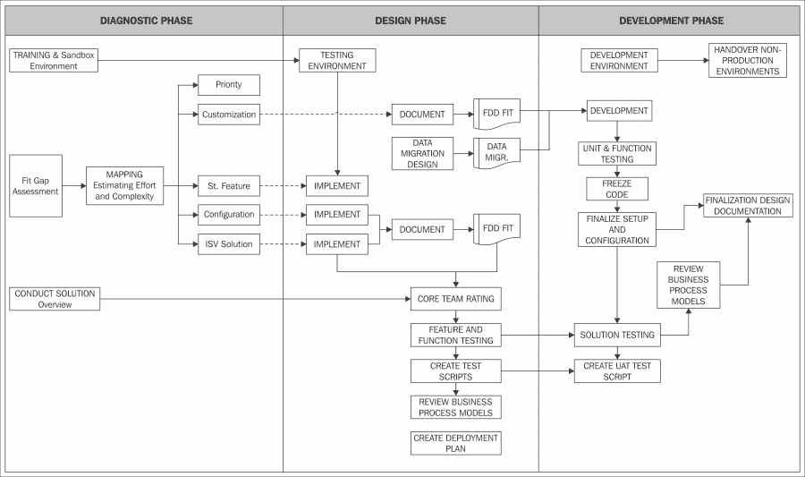

在开发阶段结束时，我们可以勾选以下内容表示完成：

+   定制开发

+   解决方案测试

+   标准和 ISV 解决方案的配置和设置

+   设计文档

+   测试脚本创建

这将使我们能够专注于部署阶段的部署活动。多么五星级的项目生命周期规划！

# 部署阶段

有些人认为部署阶段是项目生命周期的尾声，而另一些人则认为他们仍需要在本阶段开始大多数实施活动，包括产品的配置和测试。那么他们到目前为止都做了些什么呢？部署是成功交付项目的关键过程。它涉及为整个公司准备将全新解决方案投入运营使用。这可是相当重要的事情！

让我们找出这一阶段的关键活动。

## 成功部署的关键是什么？

毫无疑问，基础设施和解决方案的准备工作是良好部署的基础，但它们只代表了“一半的路”。另一半，甚至更大的部分，是客户的组织准备。用户组织内部是否有支持这个新解决方案的联盟？关键用户组织能否看到并欣赏这个新解决方案的好处，并且能否平衡他们所经历的付出和困难？他们能否将现有的批评和抵制放在正确的角度？他们能否预见下一步和挑战？这些都是任何项目经理在过渡到部署阶段时必须反思的重要问题。对这些问题的回答将指导我们如何组织部署阶段以及在哪里放置重点。这必须是我们部署时的关注点。

## 变革的传教士——培训师

足够的培训是成功实施中最重要的步骤之一。使用户在日常工作中的效率大大提高是任何业务解决方案实施项目中都会发现的关键目标。仅为此原因，用户需要对产品有深入的了解和洞察。但有效的培训不仅会赋予用户如何在日常公司流程中使用该系统的必要知识，还会引导他们对新事物产生感知和信任。对于大多数用户来说，这可能就是他们第一次接触这个全新的解决方案，而且你只有一次机会留下良好的第一印象。出于所有这些良好的原因，我们需要计划充分的培训，并抵制将培训减少到最低水平以降低成本的诱惑。

### 进行最终用户培训

Sure Step 设想在部署期间对最终用户的培训是短期的、有针对性的会话，从广泛的概述开始，逐步缩小到最终用户定义的工作任务。培训场景必须是基于角色的，以便每个用户都能完成他们日常工作中所需的具体活动和任务。可能需要在每个会话开始时进行一次业务流程（待执行）培训，以确保所有最终用户都对新的流程有足够的了解。

一个关键的成功因素是，最终的任务导向培训应尽可能接近部署进行，以防止知识侵蚀。

### 组成培训团队

这项培训可以由客户的关键用户、培训师或咨询实施团队中的顾问，或者由外部第三方培训供应商进行。这很可能是混合的，因为找到一个能够完成所有工作的培训师并不容易。让关键用户参与他们部门培训的交付是一个明智的做法。关键用户对最终用户了解得更好，对业务流程有很强的知识，并且与产品紧密相连，得到了管理层的加强。因此，他们可以比任何外部培训师更好地传播新解决方案及其不可避免的变化。然而，我们需要确保他们具备适当的产品知识和一个组织良好的方法。

正因如此，我们需要在事先为他们提供培训师培训课程。我们解决方案的一些领域可能需要培训师的高级专业知识，因此，可能有必要从咨询或学习组织部署专门的培训师。

## 数据怎么办？

到目前为止，所有数据迁移的设计、开发和测试都已经完成。我们将需要数据迁移执行以进行培训、测试和部署。最终用户培训需要模拟真实用例场景的测试数据。用户验收测试也需要来自客户指定的一天实际交易，这将提供他们业务的良好样本。因此，对于这两项活动，我们需要迁移数据，从某种意义上说，这将为我们最终将数据迁移到支持部署的生产环境做好准备。

Sure Step 建议最终迁移分两步进行：

+   **数据初始迁移到生产环境**：数据初始迁移到生产环境是为了避免系统过载，通常在真正的上线前一周进行。这些数据通常包括静态数据。

+   **最终数据迁移到生产环境**：最终的数据迁移最好在上线前的周末进行。由于大部分初始数据是在上线前一周加载的，因此最终的数据加载将考虑在初始数据加载后输入系统的数据。这个概念加速了迁移过程，并消除了可能危及切换的最后时刻的故障。

## 上线作为用户验收测试

你可能不会相信，但在某些情况下，上线流程是在没有先前的用户验收测试的情况下启动的。最常见的借口是“*我们告诉客户去测试，但他们没有做*”。你甚至可能会发现，UAT（用户验收测试）被用来补偿前期阶段的时间和预算超负荷。在没有 UAT 的情况下，上线将充当用户验收测试，而那次上线的成果是可以高度预测的。

不要忘记 UAT（用户验收测试）实现的重要目标：

+   验证新解决方案是否支持公司通过需求过程所设想的公司运营流程

+   通过减轻失败风险来获得对系统的必要信心

+   在之前的测试周期中幸运逃脱的问题的最后一次识别机会

+   激励上线决策

+   获得系统验收

+   生成支持项目收尾过程的结果

### 你持续的关键用户互动现在将得到回报

我们通过前几个阶段的内容了解到，在所有实施阶段安排与关键用户的互动是多么重要。跨阶段流程以及在整个项目生命周期中的规划是 Sure Step 中的关键要素。当涉及到 UAT 时，我们将真正享受到这种策略的好处。我们的关键用户在整个项目生命周期中都与产品保持联系。他们通过参与、培训和指导每个阶段，逐步建立起对我们产品的知识和认识。在前期参与测试使他们理解了流程和测试的重要性。现在，他们真的准备好在组织和执行 UAT 中支持你了。

你能想象到在分析后几个月都处于脱节状态的关键用户吗？他们现在才得到一些培训？仅仅要求用户组织在一个他们几乎不了解的系统上执行 UAT，这并没有太多意义。

### 早期规划和承诺做出差异

UAT 对客户组织的资源规划构成了严重负担。客户的大量员工需要腾出时间进行培训和用户验收测试。尽管如此，这家公司仍在运营模式中，因此他们的缺席需要提前仔细规划！至关重要的是，客户真正承诺投资这项努力，因此他们也需要提前得到激励。没有早期规划和真正的承诺，我们将遇到麻烦，而“没时间，以后再说”的借口将响彻我们的耳畔。好消息是，我们在设计阶段就已经与客户合作制定了部署计划。至少我们按照 Sure Step 的方式做了！

### 用户验收测试的重点

UAT 必须专注于测试完整的端到端系统，以确保新解决方案满足客户业务需求。测试场景的重点是不同部门的用户日常操作，支持上线后的运营使用。我们不是逐个测试需求，而是基于真实数据测试现实生活中的业务流程。这些测试还必须证明用户能够正确使用系统。

### 记录和分析结果

测试结果需要被汇编、分析和随后与测试标准进行比较。Sure Step 提供了高效的 UAT 测试脚本工作表和模板。这些工具是针对产品特定的，甚至包括基于角色的版本。它们还可以包含一些预配置的测试场景。

下面的截图给出了一个产品特定 UAT 测试工作表的示例，包括产品特定的测试内容：

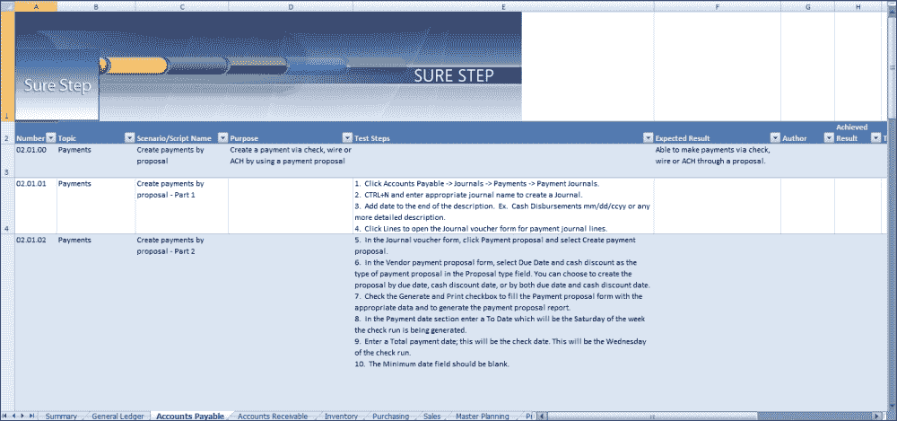

## 执行性能测试

许多变量可以相互作用，影响系统性能。可能会有大量用户、大量交易、配置不当的基础设施或环境变量；还有许多其他元素也可能影响性能。我们需要在上线前后仔细审查性能。因此，在这个阶段安排性能测试并非奢侈。

## 基础设施准备就绪

在这个阶段，我们需要确保我们将在上线期间和之后在一个稳定且性能良好的环境中运行我们的新解决方案。这就是为什么我们需要在部署阶段继续我们的基础设施工作，通过构建和配置生产环境和灾难恢复环境。

下图列出了可以初始化的可能环境：

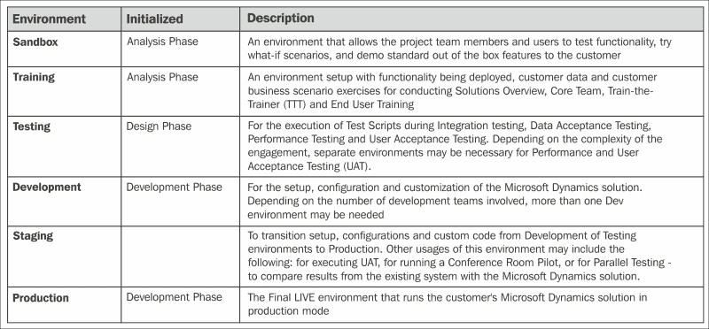

## 检查和交叉检查

*乘务员，请准备交叉检查*。您熟悉这些话吗？交叉检查是在飞机从登机口推出前和飞机着陆时乘务员执行的一个程序。检查门是否已经装备了紧急逃生滑梯的程序只是确保飞机可以安全滑行、起飞和着陆的一系列检查之一。这确保了符合客户期望的安全和质量服务。

当我们准备上线时，我们也应该执行一些检查。延迟和崩溃也不会给我们的业务留下好印象。这就是为什么我们需要评估最终系统准备情况，并确保所有必要的步骤和可交付成果都已到位。Sure Step 上线检查清单可以是一个有价值的工具，帮助我们与客户协作完成该程序。

## 准备起飞

上线启动了在新系统中成功处理日常业务交易和活动。到达这个阶段花费了时间、努力、汗水、泪水、会议、电子邮件、互动，尤其是大量的辛勤和智慧的工作。这是客户组织和咨询团队的起飞；这是一个宝贵的时刻，但如果计划不当，也并非没有危险。就像任何一次出发一样，我们需要保持专注并准备应对一些潜在的动荡。为了使上线切换成功，我们需要规划和记录我们的切换程序。我们甚至可能需要将切换过程作为彩排来运行。Sure Step 提供的上线切换计划可以帮助我们这样做。重新使用部署计划，并添加一个关于切换过程的单独部分可能也很有价值。

一旦进入天空，就鼓掌并打开那些香槟吧，因为这确实是一项成就！与客户一起庆祝这个特殊的时刻不仅有趣，而且加强了双方团队的成功感。这是应得的，享受吧！

# 运营阶段

打包好行李了吗？其实并没有。上线广播了我们的项目，但我们的表演还没有结束。上线不是项目的终点。现在是时候提供一些在船上的服务了。

## 提供上线后支持

在上线切换时刻之后，最终用户组织将面临关键挑战。他们现在真的需要放弃他们旧的和熟悉的流程，适应新的程序和软件的功能和特性——这对他们来说不是一件容易的事情，他们需要我们的支持。想象一下有人走进你的办公室，给你一台全新的电脑，里面装满了不熟悉的程序。那会是什么感觉？仅仅知道有专家在那里解答他们的疑问和担忧，就是一个令人安慰的想法，并且可以避免任何恐慌的情况。优质的现场支持也将使我们能够向关键用户建议如何解决具体问题以及一般支持的角色。一个优秀的关键用户团队还将筛选各种支持请求。在上线后支持的长时段内，咨询组织也可以从现场支持切换到远程支持，通过实时会议、电话或电子邮件通讯使顾问可用。这一步骤需要有一个成熟的关键用户组织，能够控制大部分支持请求——这也是在整个项目生命周期中投入时间和精力的另一个好理由。

假设在这个阶段你将不再收集问题和变更，就像押错了马。新系统运行的前几天甚至几周会产生大量的问题和变更请求。这些应该按照之前阶段相同的方式进行管理。然而，我们需要意识到，大量的投诉、问题和变更请求可能是由对变化的抵抗、恐惧和其他挑战引起的。这就是为什么我们可能需要考虑额外的沟通和培训，以帮助客户度过变化的现实。

## 一些需要做的事情

在方法论中包含运营阶段的好处是，它使我们能够在项目开始之前和期间向客户传达一些重要的事情。它清楚地表明，我们将在上线后继续提供服务，因为我们还有一些事情要处理。

### 清除挂起的项目

其中之一就是解决开放的问题。这些问题可能在上线切换时刻之前就已经被识别，但直到上线后才得到处理。我们将在上线时刻始终存在一些问题，这不能成为推迟上线的理由，除非这些问题确实非常关键，被认为是障碍。在你到达那个点之前让客户意识到这一点是明智的，Sure Step 将帮助你做到这一点。

现在我们已经到达了需要在运营阶段执行某些事情的时刻。这项活动可以在 Sure Step 中找到，称为**清除挂起的项目**，这表明我们需要与客户合作，找到我们开放问题的最终解决方案。在大多数情况下，并非所有问题都会得到解决，因为一些问题对业务运营没有影响。这是沟通和谈判的努力，以确保双方都满意。“不要把你的常识放在外面”是信息。

### 完成知识转移

我们需要确保在我们离开之前，客户将能够访问所有重要的资源，使他们能够接管控制权。他们需要知道所有文档存放的位置，管理员需要能够获取安全权限文档，实际的支持信息和日志需要转交给客户支持团队，并且他们需要知道如何登录到**CustomerSource**（一个微软门户的名称）。

### 进行性能调整和优化

一旦我们的解决方案运行了几天，就是时候衡量性能并提供额外的调整和配置了。真正的性能瓶颈可能只有在上线后才会显现出来。在这个阶段主动进行这项工作比等到性能下降到不可接受的水平，用户开始抱怨解决方案的性能，更为明智。

### 将解决方案过渡到支持阶段

是时候说再见了。实施顾问不可能永远驻场，客户组织需要对其新解决方案负责。他们可以完全自行组织支持，或者使用合作伙伴的运营支持服务。

## 要结束还是不要结束

要结束！项目按定义是临时的，因此它们需要一个结束日期。正式的结束是项目管理的一个基本组成部分。如果没有结束，我们就会陷入一个我们没有组织并且没有足够预算的运营。最终，不结束我们的项目将蒸发掉我们辛勤工作所获得的全部利润。

### 结束——这是一项不错的小工作吗？

我们希望如此，但不幸的是，我们都知道得更清楚。结束是所有事情汇聚的地方，当我们说所有时，我们的意思是所有。我们的项目沟通有多好？我们的项目文化有多强大？我们交付了什么质量？我们实现了什么时间和成本绩效？我们的**工作说明书**（**SOW**）是否良好？此时我们与客户的关系状况如何？我们的项目管理是否有效？客户现在是否熟悉签字程序？

### 逐步构建

项目关闭是通过在整个项目生命周期中工作逐步构建的。通过关卡评审报告、重要可交付成果的签字、项目状态报告、指导委员会会议和正式测试结果来结束阶段，只会使你的论点更加强大。在尝试获得签字时，需要跨越一座大桥梁，这现在代表了自 SOW 批准以来的第一次签字尝试。作为项目经理，我们需要理解项目关闭是我们工作的一个基本任务，而且这不是免费的午餐。我们需要在整个过程中努力实现关闭。

### 核心挑战

结束的核心挑战是对可交付成果与 SOW 的审查。我们需要证明我们交付了我们承诺在 SOW 中交付的内容，而当可交付成果在 SOW 中未指定时，这可能是一项艰巨的工作。这再次强调了可交付成果思维相对于活动思维的重要性。充斥着活动的 SOW 将难以与所交付的内容进行比较，并打开长期而耗时的讨论之门。购买一辆可以驾驶的东西指的是哪种类型的汽车？很难说，对吧？

### 请签字！

是的，你需要有一个正式的验收，代表这个项目的结束。为了实现这一点，我们必须提前很好地沟通，并组织一个有固定议程的正式会议，理想情况下由项目经理、执行利益相关者和赞助商参加。有了正式的签字，我们的旅程就结束了。我们现在可以下飞机，庆祝我们的成功之旅。

# 敏捷实施项目类型

在上一节中，我们详细讨论了 Sure Step 中瀑布方法的选项。现在，我们将转向敏捷方法，正如我们之前提到的，它代表了一种迭代式解决方案开发方法，该方法促进了拥有和指定解决方案需求的资源与负责解决方案开发和部署的资源之间的协作过程。

敏捷项目类型是在 Sure Step 2010 版本中引入的，主要是为了方便那些期望将 Microsoft Dynamics 作为平台并定制解决方案以满足其特定需求的客户。在这样做的时候，这些客户往往在开发过程中逐步调整他们的需求，这需要一种灵活和迭代的开发方法，这正是敏捷项目类型理想适用的地方。

下一个截图显示了 Sure Step 中的敏捷项目类型。左侧的导航树视图和右侧的方法论面板描绘了敏捷项目类型的冲刺周期：

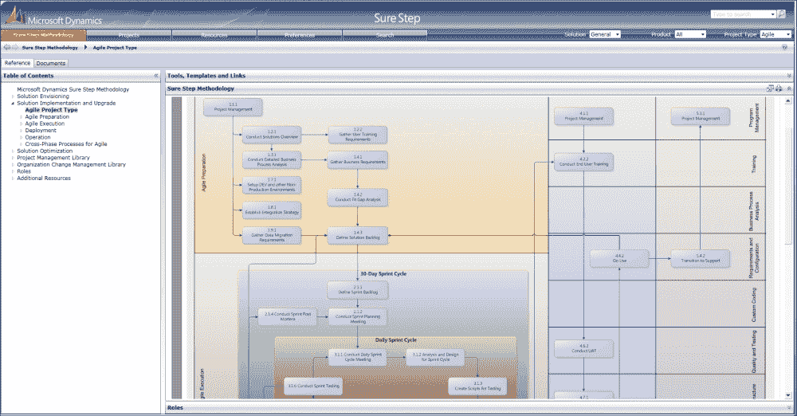

虽然 Sure Step 的瀑布方法有五个阶段的活动流动，但 Sure Step 敏捷项目类型有冲刺周期来涵盖分析、设计和开发阶段。敏捷项目类型确实有两个阶段，即部署和运营，在冲刺周期结束时。因此，在这种情况下，敏捷项目类型偏离了严格的敏捷方法，被设计为 ERP/CRM 部署的混合方法。

敏捷项目类型从一系列构成**敏捷准备**阶段的活动开始。从项目启动活动开始，**敏捷准备**以实现其主要目标——创建**初始解决方案待办事项**而告终。这个待办事项代表了解决方案需求的初始子集，它将被用于下一阶段开始开发过程。

**敏捷执行**阶段紧随敏捷准备之后。这个阶段以两个冲刺周期为特色。冲刺周期，也称为**敏捷**，指的是一个最长持续四周的时间段，在这个时间段内，团队对已识别的待办事项集执行解决方案的开发。Sure Step 敏捷项目类型有两个冲刺周期——一个包含在 30 天冲刺周期内的每日冲刺周期（如前一个截图所示）。开发活动每天进行，包括计划、分析、设计、开发和测试。这些活动针对冲刺待办事项进行，这是一个从解决方案待办事项中编译出来的需求列表，它被分解为更小的产品特性增量。在冲刺规划会议期间，冲刺待办事项中的需求进一步分解为可管理的任务。

在冲刺周期结束时，有一个**冲刺技术预览**活动，在此期间，实施团队和客户团队将审查为需求开发出的解决方案。这是一个关键活动，其中需求被批准或拒绝，并反馈到解决方案待办事项中，以便可能包含在未来的冲刺周期中。还进行冲刺后审查，以评估团队的表现并讨论任何改进的机会。在最终的冲刺周期之后，进行整体解决方案测试，并最终确定客户生产环境的规格。

在敏捷执行阶段结束时，解决方案随后进入部署和运营阶段的相关活动，包括用户培训和 UAT。这些活动在*《Sure Step 瀑布实施阶段》*部分中已有讨论。这两个阶段和活动也标志着从经典敏捷方法向业务应用程序解决方案交付的混合方法的转变。

敏捷项目类型的典型使用场景包括以下内容：

+   选定的 Microsoft Dynamics 解决方案与客户需求有相当程度的匹配——大约 50%到 75%。为了使解决方案符合客户的解决方案愿景，所需的定制预计将是中等至复杂的，以便开发工作可以封装在冲刺周期内。此外，预期的解决方案可能包括也可能不包括 ISV 解决方案，以及核心的 Microsoft Dynamics 解决方案。

+   定制代码开发可能包括与第三方源集成的接口或集成，以及从遗留系统或第三方系统迁移数据到预期的解决方案。再次建议，这些编码工作不应过于复杂。

+   业务流程分析活动和 OCM 活动可能包含在合作范围内。这些活动将与敏捷项目类型中的开发活动并行执行。

+   敏捷项目类型通常适用于单点实施，但它可以扩展到大约三个地点的小型多地点合作。

使用敏捷项目类型需要项目团队采取非常严谨的方法来控制项目的整体范围并管理其实现。强烈建议选择此方法的组织拥有经验丰富的 Scrum Master 或冲刺周期经理——这些人对敏捷学科非常熟悉。

与标准项目类型相似，使用敏捷项目类型的客户组织也应该拥有在部署和使用业务解决方案方面拥有多年经验的业务和 IT 用户。同样重要的是，经验丰富的用户应被选入解决方案交付团队，并在实施过程中积极支持服务提供商。

敏捷项目类型也可以用于开发多站点部署的试点解决方案。此类解决方案推广使用场景在前面一个标题为“设置解决方案推广计划”的章节中描述。

在下一节中，我们将描述敏捷、快速和企业项目类型的一些用例。

## 用例：敏捷项目类型用于跨国化学品客户

在完成尽职调查后，一家化学制造商选择了微软 Dynamics CRM 作为他们的解决方案。客户选择微软 Dynamics CRM 解决方案，因为它可以作为平台使用，并且可以将扩展 CRM 或 xRM 功能作为构建满足他们特定需求的解决方案的起点。

在客户和实施合作伙伴通过解决方案需求的过程中，他们感觉到虽然他们对整体需求有很好的理解，但在开发周期中很可能会发现解决方案的更多用例。客户和合作伙伴都有基于冲刺周期解决方案开发方法的经验，并且有经验的项目经理来以迭代方式管理解决方案交付。因此，他们决定敏捷项目类型为他们提供了最佳的定制解决方案交付方法。

SOW（解决方案工作说明书）的结构设计包括九个月度冲刺周期，用于解决方案的第一版发布。解决方案需求构成了初始解决方案待办事项列表，并成为确定冲刺待办事项的起点。

## 用例：快速项目类型用于 GP 客户

在中小企业领域的一个分销商选择了微软 Dynamics GP 解决方案来支持他们的财务需求。客户正在使用一个过时且不受支持的 ERP 解决方案，无法满足他们增长和系统额外用户需求。公司决定与获得金牌认证的微软 Dynamics GP 合作伙伴合作，快速安装一个有限的解决方案，用于财务报告、客户和应收账款老化、供应商和应付账款跟踪。

合作伙伴使用 Sure Step 中提供的固定范围提案和工作说明书作为起始模板，并据此定制合作内容。

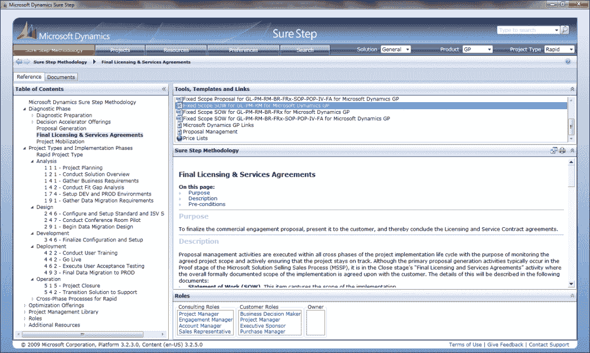

实施采用快速项目类型，包括解决方案设计、安装、配置和数据转换的具体活动。还包括一个**会议室试点**（**CRP**）活动，使用户能够预览即将推出的解决方案，并有机会审查解决方案配置，以确保其符合拟议的设计。

## 用例：全球广告组织使用企业项目类型

一家全球广告组织发现自己由于过时的财务管理应用程序而无法满足不断增长的客户对详细信息的需求。为了提高其财务报告能力，公司决定选择微软 Dynamics AX 作为一流的财务管理软件，因为它具有其全球组织所需的可扩展性和本地化能力（包括语言和法规）。

由于解决方案交付的规模，客户需要一个具有全球影响力、能够理解当地需求、语言和法律的实施合作伙伴。客户选择了微软服务及其**微软全球解决方案印度**（**MGSI**）团队，与他们的企业项目团队合作，以在多个地点开发和部署解决方案。

使用 Sure Step 企业项目类型和指南，团队共同努力收集解决方案的功能性需求并设计解决方案。客户对交付方法印象深刻，以至于他们的副总裁和公司财务总监评论说：

> *与我们合作实施项目的微软服务顾问对产品了如指掌。顾问使用的项目管理方法最小化了范围蔓延，这在大型系统实施中非常常见，使我们能够按时并在预算内完成。*

到本文写作时，已有超过 30 个机构正在使用微软 Dynamics AX，还有更多部署正在进行中。该公司还运行一个内部托管的微软 Dynamics AX 解决方案，以支持其较小的机构。提供的实施方法为这次成功的交付奠定了基础。客户的全球项目经理补充说：

> *Sure Step 是一种经过深思熟虑且灵活的方法，使我们能够提出符合我们全球战略的统一计划和途径。它有助于部署的资源规划，提供每个部署的持续财务状况，并使我们能够设定对所需员工时间承诺的预期。*

# 摘要

在本章中，我们重点介绍了 Sure Step 的项目生命周期规划，并讨论了瀑布和敏捷项目类型、跨阶段流程以及如何设置解决方案推出计划。我们了解到 Sure Step 确实有助于参与智能项目，因为它通过智能生命周期规划使我们能够主动、目标导向、高效且灵活。Sure Step 教导我们，在处理项目需求时需要灵活，而不是在所有项目中采用相同的方法，同时也要关注与客户利益相关者的持续互动。

作为快速参考，以下项目类型为您在解决方案交付方面提供了所需的灵活性：

+   快速项目类型是为微软 Dynamics 解决方案的即用型实施而设计的，标准解决方案的定制为零或最小。

+   确步标准项目类型适用于大多数微软 Dynamics 项目，通常用于中等规模的单站点实施，需要适度的定制和附加解决方案。

+   企业项目类型是为与复杂需求和解决方案场景进行大规模合作而设计的，这些场景需要深入的治理和监督。

+   敏捷项目类型代表了一种迭代式解决方案开发方法，它促进了解决方案的开发和推广过程中的协作过程。

+   确步还包括基于瀑布的升级项目类型，将在后面的章节中介绍。

在下一章中，我们将学习到由确步支持的必要质量保证和控制原则。下一章还将介绍优化方案。
