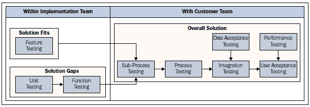
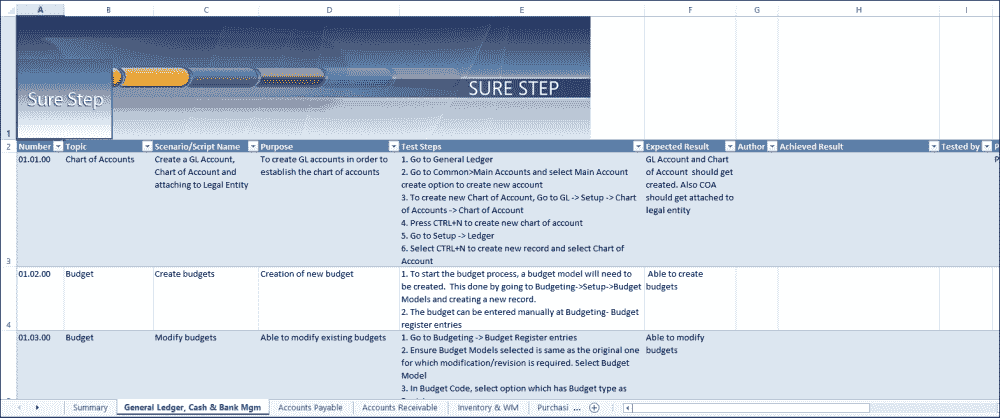
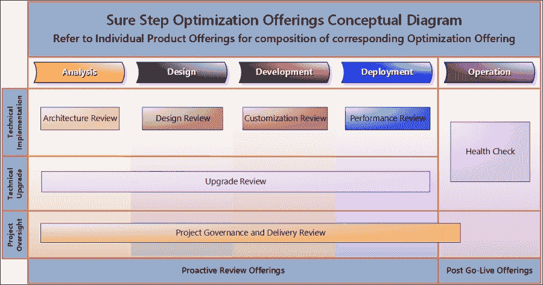
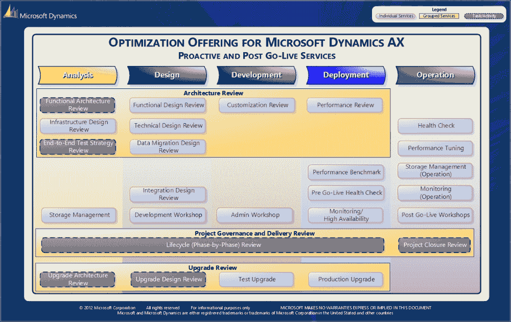
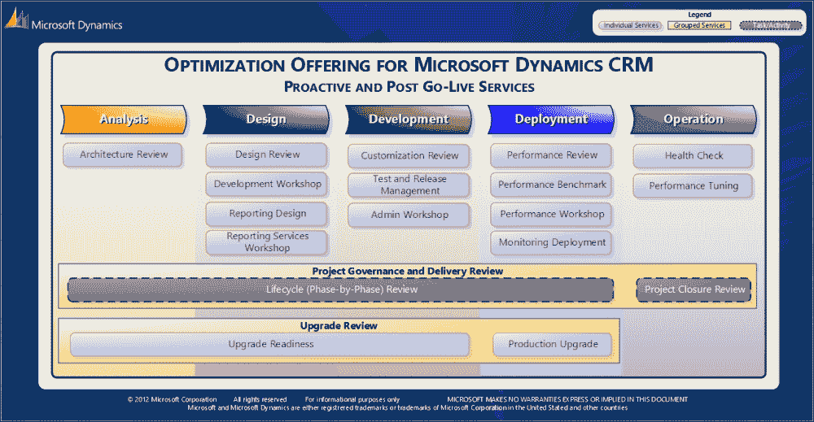
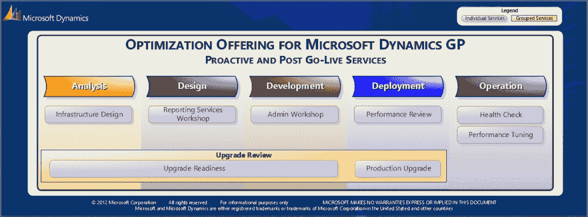
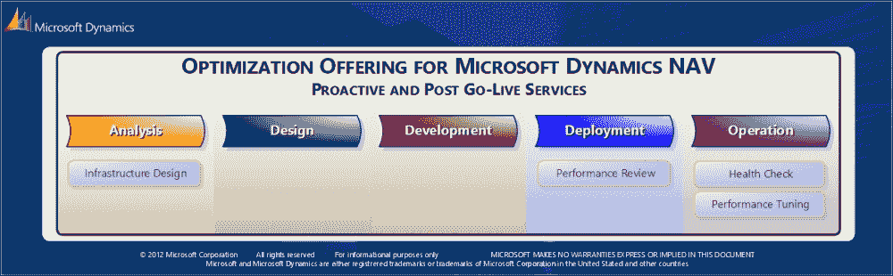
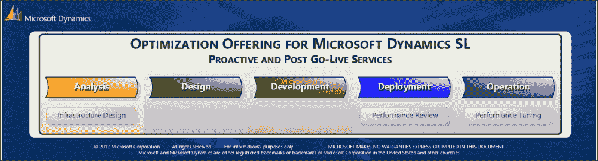
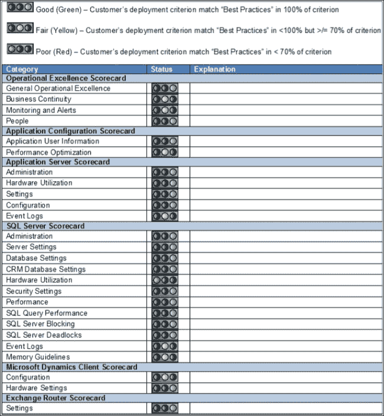
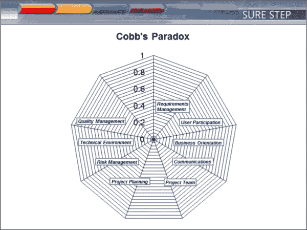

# 第六章. 质量管理和优化

在上一章中，我们学习了 Sure Step 支持的瀑布和敏捷实施方法。我们讨论了基于这些方法的不同的项目类型，以及这些项目类型跨越的实施阶段和跨阶段流程。我们还学习了 Sure Step 提供的活动、模板和指导，以实现解决方案交付。

在本章中，我们关注 Sure Step 的质量方面，这包括在解决方案交付期间可以采取的主动行动，以及确保解决方案持续维护和成功实施的 Post Go-Live 步骤。以下将涵盖以下主题：

+   质量管理在 Sure Step 不同领域的体现

+   如何在瀑布式和敏捷式项目类型中嵌入质量控制

+   Sure Step 优化产品路线图——对服务提供商的意义，特别是那些刚开始在 Microsoft Dynamics 领域工作的，以及客户如何从中受益

# 理解 Sure Step 中的质量管理体现

质量管理实践，包括质量控制和质量保证，是确保正在开发的解决方案符合客户期望的解决方案交付过程中的基本方面。*W. 爱德华兹·戴明博士*是质量革命的先驱之一，首先在日本，然后在美国，最后在全世界。戴明博士的教诲和哲学起源于制造业，但随时间扩展到多个学科，他的作品通过多本书籍和文章被生产和复制。戴明博士强调，通过创建“一个旨在推动组织向产品和服务的改进并持续永久地改进系统的目的一致性”，质量和效率可以同时提高。

在 Sure Step 方法论中，质量控制和质量保证体现在许多领域，包括实施项目类型的每个跨阶段的活动。以下是一些质量控制和管理被强调并特别指出的领域：

+   在 Sure Step 项目类型中，项目管理跨阶段包括针对质量控制的具体活动和模板。

+   在 Sure Step 项目类型中，质量和测试跨阶段专注于尽职调查，以确保解决方案按照约定的标准和要求进行配置和定制。

+   Sure Step 在优化框架下提供几个产品。优化产品包括从技术和治理方面对实施进行主动监督，以及在生产期间可以执行的操作，以确保解决方案继续有效运行。

+   Sure Step 还包括在项目管理库中展示质量管理内容的参考内容。

我们将在本章中更详细地审查前三个主题。我们将把关于项目管理库及其质量管理内容的内容留到下一章讨论。

# 在项目类型中控制质量

在 Sure Step 实施项目类型中，质量管理的执行通常被强调并委托给高级角色，如项目经理、解决方案架构师和测试员。这些角色负责领导解决方案交付过程，因此监督解决方案交付的质量被视为他们角色的自然延伸。因此，**项目管理**和**质量和测试**跨阶段的关键活动被特别指出，以监控实施的质量，项目经理、解决方案架构师等作为可交付成果执行的*负责人*。在项目管理跨阶段，关键的质量关注活动包括**满意度条件**（**CoS**）的记录和**关卡评审**的执行。质量和测试跨阶段包括在交付周期早期确保建立质量标准的活动。此外，监控和测试活动是这个跨阶段的关键要素，每个阶段都有具体的活动。

## 程序管理中嵌入的质量活动

满意度条件是项目成功的衡量标准，以及允许团队明确确定项目成功或失败的合作目标。Sure Step 中的指南要求在合作开始时确定 CoS 的要素，并在**项目章程**或类似的项目文档中注明。项目经理负责与客户合作确保执行此活动，并确保客户签署文件，从而表示他们的接受。

在实施过程中的质量控制的关键组成部分是关卡评审。对于瀑布项目类型，关卡评审的执行在每个阶段结束时进行。对于敏捷项目类型，关卡评审以冲刺回顾的形式出现，在每个冲刺周期结束时执行。

水落石出项目类型的关卡评审通过回顾相应阶段实现的关键里程碑和完成的关键可交付成果来评估项目的当前健康状况。任何项目问题和风险也会被识别、记录，并确定缓解措施。这可能包括要启动的项目范围和变更请求，以及请求客户的批准。在此活动期间还会执行对项目整体时间表的任何调整。关卡评审还用于评估项目在解决客户识别的满意度条件方面的表现。

最后，为了客户和项目团队的利益，记录了**经验教训**，这在项目运营阶段结束时尤其关键，因为它们可能产生对未来相关合作的重要指导方针。

在敏捷项目类型中，项目团队成员使用冲刺周期评审来讨论每个冲刺周期结束时流程的相对成功和失败。团队专注于在冲刺周期中遵循的过程和工作实践，包括团队如何协作以及是否需要在下一个冲刺周期开始之前进行任何改进。

## 关键质量和测试跨阶段活动

在实施早期建立质量和测试标准可以减少在解决方案配置、开发和测试中的任何歧义。这些标准收集并记录在**测试计划**中，传达了进行软件测试和验证时应遵循的一般程序。计划可能包括特定的测试用例或场景及其预期结果。它还可能包括客户组织中的预期业务流程和工作流程变更。

测试计划还提供了在实施过程中将执行的一般监控和测试活动的概述。在 Sure Step 方法中，测试活动特别受到强调——合作的范围越大，推荐的严格性和测试数量就越多。以下图表显示了大规模合作推荐的测试：

在项目合作初期，实施团队确定了解决方案需求，并进行了适应性-差距分析，以确定符合标准解决方案的需求、差距以及所需的定制。测试活动从解决方案开发阶段的**解决方案适应性**和**解决方案差距**开始，然后在部署阶段测试整体解决方案。

在解决方案开发过程中进行的头三个测试是在开发团队内部执行的。这些测试不需要客户团队参与。尽管如此，在下一个测试系列中客户团队将需要参与，但如果在开发过程中，例如，需要澄清某个需求，开发团队可能需要根据需要查询客户的**主题专家**（**SMEs**）。

### 功能测试

此测试由交付团队中的应用顾问执行，专注于系统的配置和设置。此测试的目标是确保系统配置符合在**功能需求文档**（**FRD**）和**功能设计文档**（**FDD**）中描述的要求。

让我们以一个客户需求为例，该需求涉及对超过一定数量或金额的订单进行审批的特定工作流程。该需求的设计在 FDD 中定义，系统配置为遵循此审批工作流程。首先由应用顾问执行功能测试，以验证是否满足要求。在稍后的阶段，客户 SME 也将验证此配置。

### 单元测试

单元测试是对为系统修改编写的自定义代码进行的独立测试。它由开发者执行，并基于在**技术设计文档**（**TDD**）中描述的解决方案设计。

例如，假设客户的营销部门需要在客户的总表中添加一些自定义字段，以便他们能够对客户进行分类和细分。可以使用 TDD 来描述系统中需要修改的特定表。在系统相应地定制后，开发者将执行单元测试，以验证字段是否已按要求创建。

### 功能测试

功能测试是单元测试之后的测试。与单元测试一样，它也专注于自定义代码，但与单元测试不同的是，功能测试由应用顾问执行，并基于 FDD。目标是确保系统修改与客户的功能或业务需求一致。

在我们之前的自定义字段示例中，在客户的总表中，在单元测试之后，应用顾问将执行功能测试，以验证营销部门的业务需求是否通过定制得到满足。这可能包括，例如，验证字段是否放置在相应的表单的正确位置，以及营销人员是否有适当的值可用。

从这里提到的例子中可以看出，这种测试的严格性是显而易见的。然而，如果读者认为测试的数量似乎对较小的项目来说过多，他们可以考虑在可行的情况下合并测试。但是，对于可能包含数百个简单和复杂要求的大型项目，这种严格性是必要的；因此，强烈建议读者不要采取任何可能带来不必要风险的捷径。跳过个别测试可能会导致在流程下游发现问题。正如任何经验丰富的顾问会告诉你的，测试解决方案的较小子集以隔离任何潜在问题更好。另一种方法，即更耗时和费力的方法，是测试所有设置，以尝试确定问题是否在于单个代码子集，或者是否由于与其他代码元素的交叉。从这个意义上说，你可以将其与制造过程进行比较。在多部件制造中，在组件制造过程中检测质量问题是至关重要的。等到组装时发现不匹配的部件可能会关闭组装线并导致昂贵的延误。正如在制造过程中一样，在整体测试解决方案之前，在解决方案开发期间测试单个代码组件同样重要。

上文所述的测试是在实施团队内进行的。剩余的测试是在客户参与解决方案实施的人员直接参与下进行的。这些测试的成功取决于这种参与，以确保解决方案按原设想开发。

### 子流程测试

子流程测试包括对公司整体业务流程子集的测试，以确保新解决方案的用户将获得一个按原设想执行的系统。这项测试由应用顾问执行，客户领域专家参与、验证并签署解决方案子集。

客户订单处理流程的测试是子流程测试的一个例子。新的解决方案在测试环境中设置，客户领域专家与应用顾问合作运行系统，检查订单处理工作流程是否直观且符合约定的设计。

### 流程测试

虽然子流程测试关注公司工作流程的子集，但流程测试是对构成定义业务流程的相关功能和功能的完整测试。这项测试也由应用顾问与客户领域专家一起执行。

从 ERP 解决方案的角度来看，**订单到现金**工作流程或**采购到付款**工作流程的测试是流程测试的例子。在订单到现金流程测试中，客户行业专家验证系统是否按预期执行客户订单输入、订单履行和订单付款，包括在付款逾期时提醒适当的客户服务人员。在采购到付款流程测试中，行业专家验证他们能否按照设计向供应商下采购订单，能否接收和记录供应品的交付，以及他们能否在组织适当的付款惯例内支付供应商的货物。

从 CRM 解决方案的角度来看，流程测试的例子包括**报价到订单**工作流程，其中 CRM 系统中捕获的报价可以追踪到转换为订单，或者像自助服务门户工作流程这样的用户获取文档或对特定查询或请求状态的答案。

### 数据接受测试（DAT）

DAT 是业务解决方案交付的重要测试。DAT 的第一个目标是验证从现有系统迁移到新系统的数据是正确的数据子集，并且数据已经按需清理。DAT 的第二个目标是验证所有用于交易、查询和报告所需的数据都可用。DAT 应由客户的数据所有者和最接近数据元素的关键用户执行，他们可以识别任何不足之处。如果需要在测试过程中验证数据源，DAT 也可能涉及客户的 IT 人员。

DAT 的重要性不容忽视，因为新系统的行为取决于其数据库中填充的数据。如果数据不正确，无论新系统有多好，用户只能更快或更轻松地获得错误信息。

假设客户的一个供应商是 ABC 公司。由于旧系统中缺乏数据输入检查和规则，发现多个记录中输入了相同的供应商名称（如 ABC、ABC Corp 或 ABC Corporation）的情况并不少见。为什么会有这个问题？采购经理没有对 ABC 公司所有订单的真正概览，没有这些，他或她可能没有足够的谈判折扣的筹码。

### 集成测试

集成测试是对特定业务流程的端到端测试，包括系统设置、开发、报告以及对任何外部子系统的集成或接口的测试。集成测试由公司的行业专家、关键用户和应用顾问执行。公司的 IT 人员也可能参与此测试，尤其是在与外部系统接触点相关的情况下。

在流程测试的订单到现金和采购到付款工作流程测试示例中，如果流程需要连接到外部系统或数据库进行报告或其他原因，集成测试将解决并验证这些场景。

集成测试通常执行不足，因为模拟实时集成环境存在困难。这些测试需要大量的前期规划，通常涉及其他系统供应商。

### 性能测试

性能测试是一项技术测试，侧重于系统在高峰时段预期的交易量中的表现。这项测试由公司的 IT 人员、领域专家、应用和技术顾问进行。

性能测试可以利用预制的脚本填充系统并模拟高负载。然而，根据对标准系统进行的定制数量，脚本的开发可能需要数小时的人工。但根据对应业务流程的系统响应速率的重要性，这项测试可能非常重要，以验证在负载下配置的系统是否符合业务需求和商定的性能指标。

性能测试的一个例子是监控系统对多个订单输入的响应，这包括验证客户的信用和未付款项。

### 用户验收测试 (UAT)

UAT（用户验收测试）是客户领域专家、关键用户和应用顾问为系统验收而进行的最终测试。UAT 是客户接受新解决方案进行上线的重要指标。

UAT 使用从客户现有系统迁移的数据，并使用客户指定的特定时期（如一两天）的实际交易作为其业务代表性的样本。测试侧重于完整的端到端测试，以确保系统符合业务需求和实施初期设定的测试标准。UAT 通常在测试或预生产环境中进行。UAT 利用预先填充测试步骤和预期结果的脚本，并将测试的实际结果记录下来供未来参考和客户批准。以下截图显示了 Sure Step 提供的许多 UAT 脚本之一：

如果测试被判定为成功，客户将签署系统以进入生产。然而，客户可能仍要求对某些功能、数据迁移或集成流程进行更改。这些更改将通过在合作初期建立的变更管理流程进行。

在前面的章节中，我们看到了 Sure Step 如何在项目类型的活动内嵌入指导和模板，以确保提供高质量的解决方案。现在，我们将讨论确保客户对整体解决方案和交付过程满意的其它途径。

# The Sure Step Optimization Offerings

Encarta 词典对优化的定义是：提高某物的有效性，使某物以最佳或最有效的方式运行，或充分利用某物。优化可能因观点不同而意味着不同的事情。从系统的角度来看，优化可能意味着提高系统易用性或响应速度的过程。对于程序来说，它可能意味着尝试减少运行时间、带宽或内存需求，而对于计算机代码，优化可能包括提高编译代码的性能或效率。对于业务流程，优化可能意味着提高该流程的效率，包括降低成本或通过时间。对于 Sure Step 中的优化产品，所有这些定义都在一定程度上适用。

Sure Step Optimization Offerings 包括一系列旨在积极帮助降低实施或升级风险的解决方案，同时协助客户确保其系统在生产时表现最佳。根据产品的复杂性和优化需求，优化产品以不同的方式打包和捆绑。以下是一个概念图，但请参考各个产品的具体产品提供图，以确定该产品提供的具体服务：

优化产品包括两种类型的服务：**主动服务**和**上线后服务**。主动服务在解决方案交付期间以及与解决方案交付团队一起提供；因此，它们涵盖了 Sure Step 的**分析**、**设计**、**开发**和**部署**阶段。上线后服务在 Sure Step 的操作阶段执行，通常在解决方案投入生产一段时间后。

主动服务可以进一步分为技术主动服务和项目治理服务。技术主动服务通常由架构师或同等高级资源在解决方案交付期间执行。这些服务的例子，将在接下来的章节中进一步解释，包括架构审查、功能和技术设计审查、定制审查和性能审查。另一方面，项目治理服务是由项目经理或同等高级项目管理资源在整个合作生命周期中执行的管理监督服务。项目治理和交付审查服务是这个类别的典型例子。

上线后服务本质上是技术性的，因为实施已经完成。这些服务通常由高级支持工程师、架构师或同等高级资源执行，并在解决方案投入生产时执行。例如，包括健康检查和性能调整服务。

Sure Step 为每个 Dynamics 产品提供五个优化方案。优化方案因产品而异，包括分组和/或单个的主动服务和上线后服务。这种结构为客户和解决方案提供商提供了灵活性，以便为特定合作选择一个或多个优化方案服务。

## Microsoft Dynamics AX 的优化方案

Microsoft Dynamics AX 项目通常代表最复杂的实施，因此，AX 的优化方案包括许多分组和单个服务，这些服务可以捆绑起来以满足特定的客户需求。

下面的屏幕截图显示了 AX 优化方案的概述：

AX 优化方案包括分组的服务**架构审查**，它包括多个单个服务，如**基础设施设计审查**、**功能设计审查**、**技术设计审查**、**定制审查**和**性能审查**。**项目治理和交付审查**（**PGDR**）——它包括**生命周期（分阶段）审查**和**项目关闭审查**——以及**升级审查**也是分组服务。分组服务用灰色带虚线的框标出，以包括构成这些分组服务的单个服务。

本 AX 优化方案中还包括的其他单个服务有数据库存储、**集成设计审查**、**性能基准**、**健康检查**和**性能调整**。

客户可以选择选择一组或多个分组或单个服务，这些服务可以捆绑在一起或作为独立服务。如果它们是捆绑的，它们通常按照前一个屏幕截图中的顺序执行，以提供更稳健和全面的服务体验给客户。

### 微软 Dynamics CRM 优化方案

CRM 优化方案的服务打包方式与 AX 不同。所有 CRM 优化方案服务都是个别服务，不包括分组的项目治理和交付审查以及升级审查服务。

以下截图是微软 Dynamics CRM 的优化方案图：

CRM 方案提供包括**架构审查**、**设计审查**、**定制审查**、**性能审查**、**健康检查**和**性能调优**在内的技术服务。

### 微软 Dynamics GP 优化方案

GP 优化方案包括适用于 AX 和 CRM 的几个个别服务，包括**基础设施设计**、**报告服务研讨会**、**管理员研讨会**，以及 Proactive Services 的**性能审查**，以及 Post Go-Live 服务的**健康检查**和**性能调优**。

以下截图是微软 Dynamics NAV 的优化方案：

注意，GP 没有独立的架构审查，因为这种合作和复杂性通常不需要这种分组服务。它也没有定制审查，因为这些类型的实施通常不涉及大量的定制代码。

它也不需要 PGDR，因为那只是对更复杂合作的一个强烈建议。然而，GP 确实有一个**升级审查**服务。

### 微软 Dynamics NAV 优化方案

与 GP 方案类似，适用于 AX 和 CRM 的 NAV 优化方案包括个别服务，如**基础设施设计**、Proactive Services 的**性能审查**，以及 Post Go-Live 服务的**性能调优**和**健康检查**。

以下截图显示了微软 Dynamics NAV 的优化方案：

与 GP 类似，NAV 没有独立的架构审查，因为这种合作和复杂性通常不需要这种服务。它也没有定制审查，因为这些类型的实施通常不涉及大量的定制代码。

它也不需要 PGDR，因为那只是对更复杂合作的一个强烈建议。目前，NAV 没有升级审查优化方案。

### 微软 Dynamics SL 优化方案

SL 优化方案包括两个适用于 AX 和 CRM 的个别 Proactive 服务，**基础设施设计**和**性能审查**。它还包括一个 Post Go-Live 服务，以及**性能调优**。

以下截图显示了微软 Dynamics SL 的优化方案：

与 GP 和 NAV 类似，SL 没有独立的架构评审，因为这种参与和复杂性通常不需要这种服务。它也没有定制评审，因为这些类型的实施通常不涉及大量的定制代码。

它也不需要 PGDR，因为那只是对更复杂参与的一种强烈建议。SL 也没有升级评审优化方案。

## 理解 AX 和 CRM 的关键主动和上线后服务

如前所述，Sure Step 提供技术主动评审服务、项目治理服务和技术上线后服务。这些评审服务通过在实施过程中适当的检查点使客户或服务提供商能够访问 Microsoft Dynamics 专家，从而促进质量管理。这些专家可以审查业务和行业解决方案的提议架构和设计，以及性能、可扩展性、与其他系统和第三方软件的集成等技术领域。

技术主动评审服务包括对新 Microsoft Dynamics 解决方案实施进行的架构评审、设计评审、定制评审和性能评审，以及现有解决方案升级的升级评审。技术上线后服务包括健康检查，用于审查已经运行一段时间的服务解决方案。项目治理服务包括 PGDR。我们将在本节中描述这些精选服务。

### 架构评审

CRM 的架构评审为客户的 Microsoft Dynamics CRM 解决方案的整体技术设计提供评估，并涵盖包括性能、可扩展性、安全性和发布管理在内的解决方案设计。此服务的目标是确保客户解决方案所设想的基础设施与最佳实践保持一致，并且该服务在分析阶段的后期执行。

在此示例中执行的关键任务包括：技术分析和评审 FRD、服务器架构评审、Fit Gap 和解决方案蓝图评审、集成和接口要求的高级评审以及交易量的高级评审。作为评审的输出，客户和服务提供商的实施团队将获得对提议架构的客观、第三方观点以及它如何与客户需求保持一致。

与 AX 的架构评审不同，AX 的架构评审是一项组合服务，包括基础设施设计评审、功能设计评审、技术设计评审、定制评审和性能评审等多个单独的服务。

### 设计评审

设计审查服务用于检查 Microsoft Dynamics 解决方案的设计，主要在两个主要领域。对于 CRM，该服务检查 Microsoft Dynamics 系统的定制以及 Microsoft Dynamics 系统与其他第三方系统之间的集成场景，并在实施设计阶段的后期执行。对于 AX，设计审查由两个服务组成，即功能设计审查和技术设计审查。

设计审查项目的目标可能包括以下内容：

+   评估客户 Microsoft Dynamics 解决方案的定制需求

+   评估 Microsoft Dynamics 应用程序与其他系统的集成需求

+   审查**功能设计文档差距**（**FDD-Gap**）和相应的 TDD（测试驱动开发）以验证提出的定制和集成设计

+   提供评估，以确定定制设计是否与之前完成并签署的适配性差距分析和解决方案蓝图一致

+   提供优化 Microsoft Dynamics 解决方案架构和集成设计的建议，以提高性能、可用性和可靠性

项目交付成果是设计审查和评估报告，其中包含基于最佳实践开发自定义组件的最佳实践优化集成和定制设计建议。

### 定制化审查

定制化审查服务专注于分析自定义代码以提高性能、增加稳定性、提高安全性以及降低运营和升级成本。对于 CRM，这是一项独立服务，而对于 AX，这是架构审查组合服务的一部分。定制化审查服务在开发阶段结束时执行，其目标可能包括以下内容：

+   识别自定义编码中的任何最佳实践偏差，包括服务器端和客户端代码

+   审查与标准的符合性，早期发现代码开发错误，并记录偏差

+   确保符合必要的质量指南

+   审查系统组件的接口

项目最终报告提供建议和行动计划，以实施最佳实践并修复发现的问题，以确保 Microsoft Dynamics 系统的最佳长期运行。

### 性能审查

性能审查服务分析解决方案设计和定制对性能的影响。该服务从审查现有的 Microsoft Dynamics 解决方案和当前及拟议的客户使用指标开始，例如用户数量、数据集大小和交易量。输出是针对 Microsoft Dynamics 服务器（服务器）和将支持 Microsoft Dynamics 解决方案的 Microsoft SQL Server 数据库的性能建议。

对于 CRM，性能审查是一项独立的服务，而对于 AX，这属于架构审查组合服务的一部分。性能审查服务在部署阶段执行，在解决方案开发冻结任何新增内容之后。审查应在解决方案转移到生产之前进行，以便捕捉崩溃、泄漏、性能和其他不符合最佳实践的非架构性问题。性能审查还应考虑在先前解决方案测试表明解决方案某些区域存在潜在的性能影响时。性能审查可以解决以下问题：

+   **成本**：基础设施运行正常，但成本过高，导致投资回报率不足

+   **敏捷性**：基础设施运行正常，但缺乏足够的灵活性，无法快速适应业务需求的变化

+   **性能**：基础设施未能满足用户的期望，要么是因为期望设置不正确，要么是因为基础设施的性能表现不佳

+   **安全性**：基础设施未能提供足够的数据和资源保护，或者通过过度实施安全措施导致合法用户无法高效访问数据和资源

合作伙伴关系的最终报告提供了针对系统环境、网络拓扑、延迟数字和带宽的系统环境建议。

### 升级审查

虽然先前的优化服务针对新的解决方案实施，但升级审查服务作为指导，帮助客户将现有的 Microsoft Dynamics 解决方案升级到当前产品版本。升级审查服务在整个升级项目生命周期中提供对客户升级解决方案的监督，包括设计、定制、集成、物理基础设施和架构。

升级审查服务在整个升级项目生命周期内提供以下一系列咨询活动或服务：

+   **升级架构审查**和**升级设计审查**：这些服务与升级项目类型中分析和设计阶段的活动相一致，包括升级准备、需求收集、测试计划和环境设置。审查团队评估现有 Microsoft Dynamics 解决方案中的定制化，分析代码组件的升级，并记录问题以及解决方案和建议。此活动的输出可能包括一份升级估算报告给客户。

+   **测试升级**：这项服务遵循升级架构和设计审查活动，并与升级项目类型的开发阶段相一致。测试升级的目标是为客户提供带有客户现有数据的测试或沙盒环境，这些数据已推广到新的 Microsoft Dynamics 产品版本。然后，可以使用此环境在推广到生产之前验证和基准测试数据。

+   **生产升级**：这项服务在升级项目类型的部署阶段执行，为将升级后的解决方案推广到生产环境提供现场协助。

升级审查服务与 Microsoft Dynamics Sure Step 中升级项目类型的流程相一致。升级项目类型在相应的升级章节中有详细说明。

### 健康检查

当解决方案投入生产，并在初始稳定期之后，重新审视解决方案以确保其高效运行是个好主意。在解决方案运行阶段进行定期检查也是一项推荐的最佳实践。这两个目标都可以通过 Sure Step 中的健康检查上线后服务实现。

健康检查服务分析客户的 Microsoft Dynamics 解决方案，并衡量该解决方案在运行中的有效性。解决方案监控允许主动识别任何潜在问题，并为选定的组件提供建议的解决方案。值得注意的是，这些服务通常被纳入企业产品中，例如 Microsoft Premier 提供的 Dynamics AX 服务。

下面的屏幕截图显示了健康检查报告的示例：

### 项目治理和交付审查

本节中突出显示的前述服务是通常由解决方案架构师和高级应用或技术顾问提供的技术服务。Sure Step 还提供另一项服务，称为项目治理和交付审查（PGDR），通过项目监督和整体项目治理来推动质量。这项服务由经验丰富的项目经理和参与经理提供，通过客户 Microsoft Dynamics 参与的整个生命周期，为客户提供主动的项目治理和交付执行指导。在较高层次上，这些资源执行以下三项任务：

+   分析和评估拟议的参与结构和既定成果

+   监控项目治理与客户和实施团队之间的沟通

+   分析和评估成果的质量，以确保其完整性和相关性

PGDR 包含两个组件——**生命周期阶段审查**和**项目关闭审查**。在分析到部署解决方案实施阶段，PGDR 服务作为对交付团队活动的指导和监督，通过主动识别风险和积极管理整个合作范围，帮助他们保持与解决方案约定的愿景一致。一旦解决方案投入运营且合作进入关闭阶段，PGDR 服务评估项目是如何与初始愿景相匹配的，并确定项目进度和质量的表现。

在项目开始时，PGDR 提供服务启动了两个关键活动。客户、审查人员和实施团队共同工作，建立客户的 CoS（客户服务目标）以进行合作。这些 CoS 是项目章程的关键组成部分，章程中还讨论并明确记录了其他关键领域，包括治理、风险、沟通、状态报告和问题管理。

在合作期间，PGDR 服务产生阶段性的推荐和项目健康状况仪表板，以帮助客户在问题成为问题之前识别风险并解决问题。审查人员配备了诸如科布悖论工具等工具，这是一个有效的风险评估工具，提供问卷以检测和监控整体项目风险因素。以下截图显示了科布悖论工具的图形输出样本：

在项目结束时，PGDR 用于共同讨论成就和挑战，并记录经验教训。以下列出了项目结束时执行的一些关键任务。

+   记录经验教训，包括成就、挑战、团队可以不同方式做的事情等。这有时被视为微不足道，但它可以成为未来项目的重要参考资料。

+   审查 CoS 以确定它们是否已经实现。

+   汇总未解决的问题和开放项目，并确定项目关闭后如何解决它们。

+   为未来的项目和与客户部署的 Microsoft Dynamics 解决方案相关的后续工作提供推荐。

PGDR 和技术审查服务对客户和实施团队都有极大的益处，它们可以增强关键领域的资源，提供有价值的独立观点。

还要注意，为了最有效地提供优化服务，应由独立的第三方提供——这意味着，提供者不是解决方案的主要实施者。

## 优化服务及其益处

提供业务解决方案，尤其是 ERP 解决方案，需要一个行业经验丰富的实施团队，换句话说，就是情境流利。团队必须有能力将系统功能转化为满足客户特定需求的解决方案。当客户选择服务提供商进行解决方案实施时，他们通常会给予行业知识额外的权重。那么，如果服务提供商在特定行业或行业垂直领域非常了解，但对微软 Dynamics 解决方案不太熟悉怎么办？这就是技术审查服务可以大大造福服务提供商和客户的一个领域。经验丰富的行业老将与技术微软 Dynamics 专家的结合可以提供一个强大的团队，为客户解决深层次、具体的需求。

另一个可以利用优化服务中的技术支持，尤其是主动审查服务，从中受益的领域是对于刚开始使用微软 Dynamics 的新 ERP/CRM 服务提供商。经验不足的服务提供商可以通过使用这些服务，在其团队中加入有经验的资源，并且随着团队成员对有经验的资源进行“影子”跟踪，他们可以提升对微软 Dynamics 解决方案的理解。

当服务提供商已经拥有深厚的专业技术知识，但缺乏项目管理专业知识，尤其是在大规模合作中，项目治理和交付审查服务可以带来极大的好处。微软 Dynamics 资源池包括一些在微软收购之前就了解解决方案的个人。虽然这些技术资源对产品本身非常了解，但他们有时缺乏管理复杂、多地点解决方案部署的范围、沟通和风险的经验。利用 PGDR 服务，这些资源可以与经验丰富的项目经理合作，为未来的合作培养这种技能集。他们可以反过来，引导他们的组织扩大其服务范围，以应对更大的客户群。

对于客户来说，包括健康检查和性能调优服务在内的 Post Go-Live 服务非常推荐。鉴于在获取和部署微软 Dynamics 解决方案中投入的大量投资，客户定期获取专家资源来监控应用程序的健康状况是很有必要的。根据使用行为，应用程序可能会随着时间的推移而变得缓慢，系统响应可能对用户来说会显得更慢。此时，Post Go-Live 服务可以用来审查应用程序，随后提出的建议可以帮助清理系统，使其更高效地运行。

从服务提供商的角度来看，可以使用 Post Go-Live 服务来继续维护与客户的合作关系。行业中的一个常见模式是，获得新客户比保持现有客户更难。一旦客户流失给竞争对手，几乎不可能重新获得客户。因此，服务提供商应利用健康检查方案来进一步与客户建立关系。在这样做的同时，他们也可能发现新的相关或不相关的机会，他们可以在这些机会上协助客户。

### 用例 - 全球广告组织使用技术审查服务

在前一章中，我们讨论了一个使用 Sure Step 的全球广告组织，特别是企业项目类型，用于他们的 Microsoft Dynamics AX 解决方案交付。在**Microsoft Consulting Services (MCS)**和**Microsoft Services Global Delivery (MSGD)**资源的帮助下，客户成功地在特定地点部署了初始解决方案。

为了在更多地点推出解决方案，客户决定结合使用内部和合作伙伴资源。客户还决定利用优化方案的技术审查服务，特别是架构、设计、定制和性能审查服务，并让 Microsoft 资源作为独立的第三方审查员执行这些服务。这种方法提供了连续性和一致性，从而降低了相应地点解决方案推出的成本。

### 用例 - 合作伙伴使用项目治理和交付审查服务

一家大型零售商选择了 Microsoft Dynamics AX 作为他们的解决方案，并选择了一位熟悉他们行业垂直领域的合作伙伴来协助他们交付解决方案。合作伙伴在 Microsoft Dynamics AX 方面很熟练，他们也对其咨询资源的解决方案交付技术能力感到满意。然而，他们对其资源管理整个合作范围的能力表示担忧，尤其是在客户要求的紧张时间表下。

与 MCS 资源在其他合作中成功合作后，合作伙伴认为一个 Microsoft 资源可以帮助降低与激进的时间表固有的整体项目风险。因此，他们建立了一个 PGDR 合作，其中一位经验丰富的 MCS 项目经理对整个合作进行了定期的独立评估。结果是解决方案按时并符合规格的推出，客户和合作伙伴双赢。

# 摘要

在本章中，我们从在解决方案交付期间可以采取的主动行动以及上线后的步骤来确保解决方案的持续维护和成功，讨论了 Sure Step 的质量方面。我们还讨论了质量如何嵌入到 Sure Step 实施项目类型中，以及通过 Sure Step 优化方案提供的专业技术和管理审查服务中。

在下一章中，我们将学习使用 Sure Step 进行升级，包括评估现有解决方案和确定升级的正确方法，以及执行升级本身的指导。
