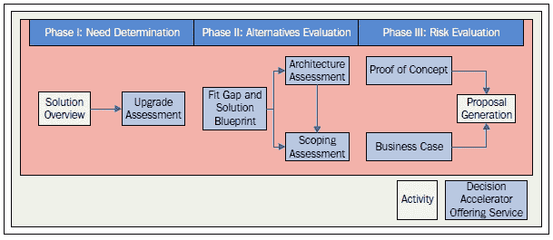
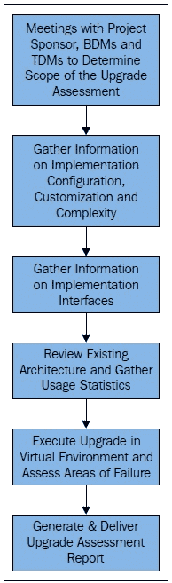
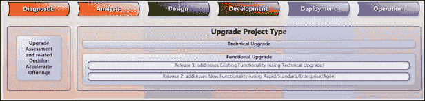
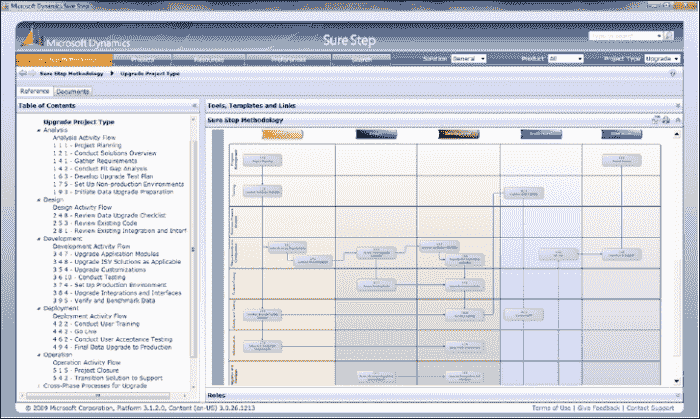
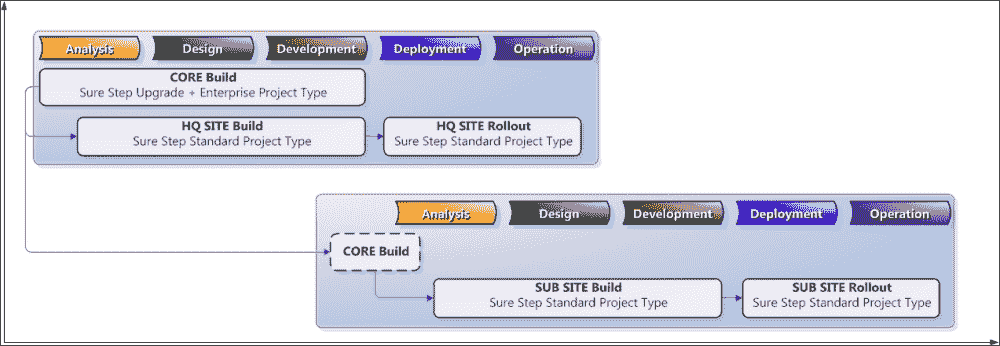

# 第七章. 使用 Sure Step 进行升级

在上一章中，我们讨论了在解决方案交付期间以及解决方案运行时，质量如何嵌入到 Sure Step 中。我们涵盖了项目活动中的质量管理作为优化提供。

在本章中，我们将介绍 Sure Step 升级 Microsoft Dynamics 解决方案的方法。以下主题将涵盖：

+   以升级评估服务开始的现有 Dynamics 客户诊断决策加速提供，以确定升级范围

+   确定升级方法是技术升级，还是作为功能升级的一部分提供额外功能

+   使用 Sure Step 升级项目类型进行升级交付

+   向现有解决方案实施额外功能

# 决策加速提供和诊断阶段

在第三章中，*使用 Sure Step 进行解决方案设想*，我们介绍了针对当前 Microsoft Dynamics 客户的 Sure Step 诊断阶段流程和模型，无论是从客户的尽职调查角度还是从销售方的解决方案销售角度。在本节中，我们将更详细地讨论该流程，特别是**升级评估**服务。

我们首先重新介绍展示现有客户 Sure Step 诊断阶段活动流程和**决策加速**（**DA**）提供的图表。在 Sure Step 中，一个活动是流程中的特定动作或步骤。一个**活动**可能产生步骤的可交付成果，或者它可能是导致后续结果的过程中的规定步骤。相比之下，决策加速提供是一个迷你项目，每个 DA 提供可能包含多个服务，每个服务都需要多个动作来实现提供的目标。你可能还记得，流程与潜在客户的流程非常相似，唯一的区别是升级评估服务取代了需求和流程审查服务：

如前所述，现有客户的流程也始于**诊断准备**，类似于潜在客户的流程。如图所示，典型方法将包括以下三个阶段：

**第 1 阶段：需求确定**

+   **解决方案概述** 活动

+   **升级评估** 决策加速服务

**第 2 阶段：备选方案评估**

+   **适配差距和解决方案蓝图** 决策加速服务

+   **架构评估** 决策加速服务

+   **范围评估** 决策加速服务

**第 3 阶段：风险评估**

+   **概念验证** 决策加速服务

+   **商业案例** 决策加速服务

+   **提案生成** 活动

## 第 1 阶段 – 需求确定

**解决方案概述**活动是初始阶段的主要活动，围绕确定客户升级的兴趣水平，并提供澄清一些基本要求的机会。此类示例包括：

+   客户是否已在他们的生产环境中部署了他们的 Microsoft Dynamics 解决方案？

+   客户是否表示了对升级到更近版本的 Microsoft Dynamics 的兴趣？

+   是否存在进行升级评估的合格机会？

+   客户是否希望升级到受支持的 Microsoft Dynamics 版本？

当客户对将现有解决方案迁移到当前版本的 Microsoft Dynamics 表示兴趣时，下一步是进行**升级评估**服务，这是此过程中的关键步骤。在启动升级评估之前，服务交付团队应与客户会面，确认他们有兴趣进行升级。特别是在交付资源需求很高的情况下，这是销售团队在涉及解决方案架构师和高级应用顾问等交付资源之前需要执行的重要步骤。销售人员可以使用 Sure Step 诊断准备活动中的资源来了解和定位相应 Microsoft Dynamics 解决方案的当前能力。

### 升级评估决策服务

升级评估服务是现有 Microsoft Dynamics 客户在升级过程中的最重要步骤。升级评估服务由服务交付团队执行，以了解客户正在使用的现有解决方案，确定需要升级到产品当前版本的组件，并确定是否需要启用其他功能作为升级合作的一部分。

一旦确定客户对升级的兴趣，服务交付团队就可以进行升级评估服务。升级评估服务的目的是确定现有解决方案升级的复杂性，并突出功能增强、复杂性和风险区域。执行升级评估服务时采取的步骤如下所示：

交付团队通过了解升级的整体目标开始升级评估服务。团队可以利用 Sure Step 为 Microsoft Dynamics AX、CRM、GP、NAV 和 SL 提供的特定产品问卷。这些问卷还包括针对接口、基础设施等的具体部分和问题；因此，它们也可以通过以下步骤利用：

1.  在一开始的重要任务之一是审查 Microsoft Dynamics 的升级路径以及任何相关的 ISV 软件，以确定从客户现有产品版本升级到 Microsoft Dynamics 的目标版本是否得到支持。这将影响升级的执行方式——您是否可以遵循支持的升级路径，或者基本上需要完全重新实现解决方案？

1.  执行升级评估服务的下一步是评估现有解决方案的配置和自定义。在此步骤中，交付团队能够审查为客户启用了哪些 Microsoft Dynamics 功能，包括哪些已配置以满足客户需求，以及哪些已进行自定义。这将使交付团队能够考虑升级的整体目标，并确定哪些配置和自定义需要迁移到新解决方案，哪些应该被淘汰。例如，较旧版本可能需要在解决方案没有相应功能的地方进行自定义。或者，解决方案可能需要特定的 ISV 解决方案来满足需求。如果当前产品版本提供这些功能作为标准功能，那么这些自定义或 ISV 解决方案就不再需要成为新解决方案的一部分。必须将数据迁移（如果需要）从旧版本迁移到新版本作为此步骤的一部分考虑。

1.  升级评估服务的下一步是检查现有解决方案的自定义接口。这包括评估为将解决方案与第三方解决方案（如用于报告目的的外部数据库）接口而编写的任何自定义代码。此步骤之后是审查现有的基础设施和架构配置，以便交付团队能够了解可用于新解决方案的硬件组件。交付团队能够确认现有基础设施是否能够支持升级应用程序，或者是否可能需要额外的基础设施组件。

1.  升级评估服务的最后一步是交付团队对客户的现有解决方案进行详细分析，并生成一份发现报告。这份报告将提交给客户审批，并将包括以下主题：

    +   升级的范围，包括在新解决方案中将得到增强的功能和技术领域的列表。

    +   应用程序功能区域的列表，按类别划分以显示升级它们所涉及预期的复杂性。如果现有实施中有需要进一步检查或需要额外努力才能成功升级的区域，因为其固有的复杂性，它们必须被突出显示。

    +   当前解决方案中可能重新映射到基线 Microsoft Dynamics 产品当前版本中新的功能性的区域。

    +   一个整体推荐的升级方法，包括解决任何所需新功能的替代方案。**Dynamics 许可**的成本影响也必须考虑。

升级评估服务为客户提供早期识别升级过程中可能出现的问题和风险，以便可以相应地启动适当的缓解措施。客户还可以通过了解升级项目治理的适当水平以及交付团队将采取正确的升级方法来获得一定的信心。

在以下各节中，我们将讨论升级评估服务如何成为完成客户尽职调查的基础，并为客户解决方案的质量升级奠定基础。

## 第二阶段 – 额外服务和何时获取它们

在执行升级评估服务之后，现有微软 Dynamics 客户的尽职调查过程中可能还需要 DA 产品提供的其他服务。在本节中，我们将讨论可能需要使用其他 DA 服务的场景以及哪些服务适用于特定场景。

从升级评估服务中，交付团队确定需要升级到新版本的业务功能和需求。使用适配差距和解决方案蓝图服务，他们可以确定并记录这些需求如何迁移。如果满足需求不仅仅是实现标准功能，那么方法可能包括重新配置、自定义代码重写或工作流程设置。此外，如果升级需要新的功能，这些需求也应归类到适配差距工作表中，要么作为适配，要么作为差距。根据情况，它们还应进一步归类为标准、配置或工作流程，对于差距则归类为定制。

范围评估服务可用于确定执行升级所需的工作量、时间表和资源。如果通过升级评估服务确定将引入新功能，交付团队和客户还必须确定发布计划。我们将在下一节中更详细地讨论升级方法和发布规划。

架构评估服务可用于确定升级解决方案的新硬件配置。它还可以通过执行**概念验证基准**子服务来提前解决任何性能问题。

由于许多 Dynamics 产品提供基于云的解决方案，无论是通过托管还是自托管模式，了解将实施迁移到云的潜在影响对于所有或部分实施来说都很重要。Fit Gap 和解决方案蓝图以及架构评估应相应反映。一个例子是新的 Dynamics GP 2013 网络客户端。这可以由 Azure 的合作伙伴托管，也可以自行托管。最近的例子表明，许多企业选择自行托管，本地财务用户选择经典客户端，而供应链或远程用户则使用网络界面。

重要的是要注意，之前讨论的所有三个决策加速服务——Fit Gap 和解决方案蓝图、架构评估和范围评估——如果需要，可以与升级评估服务作为一个客户合作执行。本节的目的不是让每个服务都单独定位给客户。相反，根据范围，交付团队可以轻松地并行执行这项练习。本节对读者的重点强调是，如果你正在评估客户的升级，你应该能够利用每个服务中的模板，并根据你的合作需求进行组合。

## 第三阶段 – 风险评估

最后，概念验证服务提供和业务案例服务提供也可能适用于升级合作，但通常仅针对一小部分客户。例如，可能使用非常旧版本的 Microsoft Dynamics 解决方案的客户，这意味着他们基本上需要使用产品的新版本重新实施解决方案，或者需要将复杂功能作为升级的一部分启用。在这两种情况下，客户可能要求交付团队在全面升级之前对解决方案进行概念验证服务，在这种情况下，可以执行概念验证服务。他们也可能要求交付团队协助评估升级解决方案的投资回报，在这种情况下，可以采用业务案例。

## 确定升级方法和发布计划

如前文所述，在升级诊断过程中，客户和交付团队应共同选择合适的升级方法。Sure Step 推荐以下两种升级方法：

+   **技术升级**：如果升级主要适用于应用程序组件，例如可执行文件、代码组件和 DLL，请使用此方法。只要应用程序功能和业务流程保持相对不变，此方法可以用于将定制解决方案带到最新版本。

+   **功能升级**：如果在升级过程中希望实现新的应用程序功能或对现有业务工作流程进行重大更改，请使用此方法。在复杂的升级过程中，这种升级方法固有的额外规划、测试和现有解决方案的重工作是内在的，因此更符合功能升级。功能升级通常在多个发布中执行。

以下图表描述了两种升级方法和发布时间表：

根据升级的范围，客户参与可能有一个或多个交付发布。例如，如果客户的解决方案位于受支持的升级路径上，**技术升级**可能使用 Sure Step 升级项目类型在一个发布中交付。如果新解决方案需要启用几个新流程，**功能升级**可能需要两个或更多发布来交付。例如，如果客户需要启用高级供应链功能，如生产调度和/或高级仓储作为升级的一部分，则两步升级是推荐的方法。首先，使用 Sure Step 升级项目类型完成**技术升级**，将现有功能迁移到**发布 1**的新产品版本。完成后，在**发布 2**中使用**快速**、**标准**、**敏捷**或**企业**项目类型添加高级供应链功能。

如前所述，DA 服务可以根据客户参与情况单独执行或组合执行。无论它们如何执行，客户和交付团队选择正确的方法并制定必要的计划（如项目计划、资源计划、项目章程和/或沟通计划）至关重要。这些文件应成为升级交付提案的基础。当提案和**工作说明书（SOW）**获得批准时，就是开始执行解决方案升级的时候了。

# 升级交付

在上一节中，我们讨论了如何为升级设置解决方案交付流程。现在，我们关注升级本身的交付，使用 Sure Step 升级项目类型。

在上一节中，我们讨论了使用 Sure Step 进行升级的两种方法：技术升级和功能升级。这两种方法的共同点是 Sure Step 升级项目类型——对于技术升级，这提供了唯一发布的底层工作流程；对于功能升级，这构成了第一个发布的流程。Sure Step 升级项目类型的截图如下：

如截图所示，Sure Step**升级项目类型**遵循瀑布方法，包括以下五个阶段：**分析**、**设计**、**开发**、**部署**和**运营**。就像在标准、快速和企业项目类型中一样，这些阶段的活动被归类为九个跨阶段流程（有关跨阶段流程的回顾，请参阅第五章，*使用 Sure Step 实施*）。在接下来的部分中，我们将讨论升级项目类型每个阶段的一些重要活动。

## 分析和设计阶段

分析阶段建立在诊断阶段进行的发现工作之上，目标是最终确定需求（即“是什么”）和差距分析（即“如何做”），并启动数据升级，而设计阶段则用于在开始开发之前最终确定并获得解决方案设计的批准。

正如你在典型项目中预期的那样，升级合作从**项目启动**开始。这个活动的目的是确保团队成员理解升级合作的总体目标，以及他们在整个旅程中的角色和责任。例如，沟通计划是什么，谁负责让团队和利益相关者了解情况，以及将使用什么方式来实现这一点，这些都是在这个阶段需要明确的一些重要事项。

这之后是解决方案概述活动，为那些未参与评估阶段的团队成员介绍 Microsoft Dynamics 解决方案。这为最终确定需求和范围并进入设计活动奠定了基础。

接下来的两个活动，需求最终确定和差距分析最终确定，非常重要，但有时也会引起质疑。问题通常涉及为什么这些活动在诊断阶段和分析阶段都被提及。简单地说，答案是，根据发现工作的深度，这个阶段的工作可能主要涉及对范围的确认。但与之相关的一些非常重要的条件。

+   如果所有关键用户都参与了诊断活动

+   如果在诊断阶段考虑了所有需求

+   如果在执行决策加速方案时所有问题都得到了回答，问题都得到了解决

如果对任何问题的回答是否定的，那么在分析阶段执行这些活动并最终确定可交付成果是非常重要的。

对于需求最终确定活动，通常通过开展需求研讨会来最终确定**功能需求文档**（**FRD**）。FRD 应清楚地注明现有业务功能和需求，这些将在新版本中升级，以及作为升级的一部分将提供的新增需求（换句话说，新功能）。适配差距最终确定基于需求，使用适配差距工作表来确定这些需求将通过实施标准功能、配置或重新配置、工作流程设置或新/重写的自定义代码来交付。

再次强调，根据升级评估 DA 所进行的努力，功能需求文档（FRD）和最终适配差距分析可能很容易完成。但这两份文件都是分析阶段结束时必须由客户业务赞助商批准的关键文件。

数据升级准备是分析阶段的关键活动之一。该活动标志着数据迁移活动的开始，包括识别现有数据源，如现有的 Microsoft Dynamics 解决方案、任何 ISV 解决方案以及任何接口程序。还包括识别额外的数据源及其访问方式。需要考虑的其他事项包括源数据的状态（所需数据清洗的量、谁、如何、在哪里、何时进行数据清洗等），数据保留的任何法律要求，以及 Microsoft Dynamics 解决方案之外的数据存储策略。根据源数据的状态，团队还可能需要确定是否需要**提取、转换和加载**（**ETL**）工具来进行数据清洗和迁移工作。还应确定数据迁移的哪些部分将自动化，哪些部分（如果有的话）需要手动执行。

虽然分析阶段的目标是理解需求以确定升级项目的整体范围，但设计阶段用于定义技术升级将如何实施。目标包括规划执行升级的步骤，并确定升级自定义代码的冲突。它还包括积极规划潜在的升级后问题，并审查微软 Dynamics 与第三方解决方案之间现有的集成和接口，以确定它们是否需要升级以与微软 Dynamics 解决方案的新版本兼容。因此，关键的设计阶段活动包括**数据升级清单**以规划和执行升级，**现有代码审查**以分析和识别现有解决方案自定义产生的任何冲突，以及**现有集成和接口审查**以确定哪些现有的集成和接口需要升级。如果产品工具可用于支持这些活动，Sure Step 中会引用相应的工具链接。例如，微软 Dynamics AX 提供了一个升级清单实用程序，以顺序方式标记了必需和可选步骤，以在升级过程中提供指导和帮助，以及一个用于微软 Dynamics AX 的比较工具，以帮助确定和解决解决方案自定义的代码冲突。微软 Dynamics AX 具有独特的架构，代码可以保存到不同的层中（例如，USR 层用于客户用户，VAR 层用于合作伙伴）。比较工具还提供了在升级单个层时或同时在所有层中同时比较和检测代码冲突的能力。

设计阶段的完成意味着所有针对解决方案的客户需求都已分析完毕，并且功能性和/或技术设计已完成，以便启动升级开发工作。建议在每个阶段结束时进行阶段审查，这对于任何规模的项目都是推荐的，但对于更大规模的项目来说尤为重要。除了从客户那里获得对阶段完成的同意外，这还允许交付团队记录经验教训、未解决的问题和风险，以及针对这些问题的缓解措施。

## 开发、部署和运营阶段

开发阶段的目标是为升级设置应用程序，这可能包括 ISV 解决方案以补充标准的微软 Dynamics 产品。这个阶段还包括升级任何自定义、集成和接口以及相应的数据元素。部署阶段是升级交付努力的最终成果，导致客户过渡到新解决方案。运营阶段包括解决方案上线后的稳定性和过渡到支持。

升级项目类型的关键开发阶段活动包括应用程序和独立软件供应商（ISV）升级、定制升级、生产环境设置、集成和接口升级，以及数据验证和基准测试。与先前阶段一样，这些活动可能包括链接到产品工具或白皮书，例如微软 Dynamics CRM 的定制代码最佳实践。活动还提供模板，如测试脚本和环境规范文档，这些模板可以作为交付团队记录其工作的起点。

在升级 ISV 解决方案时，在尝试 ISV 升级之前完成微软 Dynamics 核心应用程序的升级非常重要，以确保已满足 ISV 解决方案的所有先决条件。请注意，作为分析和设计的一部分，如果需要从现有 ISV 解决方案中获取新的增强功能，ISV 解决方案可以被分解为多个技术升级和功能升级的阶段。

虽然开发阶段代表了升级合作中大量工作，但部署阶段是努力成果显现的地方。**用户培训**是这个阶段的关键活动，其中最终用户在上线前对新系统进行实际操作培训。根据组织规模的大小，培训可能以小组形式进行——通常，交付团队将培训关键用户或一组核心用户，然后他们将成为剩余最终用户的培训师。同时，还必须在此阶段纳入与更新技术相关的技术培训；例如，SQL 管理或报告服务的更新通常被忽视为“最好有”。这很重要，以确保客户充分利用新的技术改进。

在完成用户培训后，组织可以开始**用户验收测试**（**UAT**）。UAT 是客户组织对新解决方案的关键验证点——解决方案的用户接受表明客户已准备好上线新解决方案。Sure Step 提供了几个针对产品和行业的 UAT 脚本模板，交付团队应加以利用。这些详细的脚本引导用户执行给定流程或功能的步骤。在许多情况下，交付团队还利用这些脚本中的详细信息来开发前一项活动的培训指南。

在企业项目中，还应考虑将性能测试作为部署的一部分。

一旦获得此验收，**上线**前的最后一个活动是**数据迁移到生产环境**，其中将现有系统中的清洗数据迁移到新系统。

为了准备这一过程，生产环境设置必须与升级活动并行进行，从而能够从测试中获取信息以验证在架构设计中的需求收集和适配差距分析阶段所做出的初步假设。关键活动包括确认硬件、负载/压力测试、用户地理分布、集成需求、冗余和安全。

解决方案上线后，项目进入运营阶段。此阶段的关键活动包括**过渡到支持解决方案**，将解决方案从交付团队转移到支持团队，以及**项目关闭**，以最终完成和总结项目。

### 用例 - 非耐用品制造商的微软 Dynamics 升级

在本用例中，我们讨论了一家非耐用品制造商和分销商如何对其微软 Dynamics 解决方案进行多地点升级。

该制造商总部位于美国，并在全球拥有多个制造和分销机构。该组织的总部运行着较旧的微软 Dynamics AX 版本，即 Axapta 3.0，而其他通过收购的制造实体则运行着不同的遗留 ERP 系统。公司决定不仅将其系统整合以从其 IT 运营中获得规模经济，而且还要在整个组织的子公司中实现一致的业务流程。

该公司与一家金牌认证的微软合作伙伴合作，并经历了彻底的升级评估和解决方案愿景规划过程。通过这些流程的发现，公司意识到其总部正在运行一个高度定制的 Axapta 版本，这不仅会使升级过程变得复杂，而且也不是在多个实体中标准化的可持续解决方案。在此阶段，公司决定改变其整体解决方案和 IT 战略。他们首先审查了最新版本的微软 Dynamics AX，即微软 Dynamics AX 2009 中的标准功能，然后考虑在可行的情况下用标准功能替换修改，即使这意味着改变他们的一些业务流程。由合作伙伴顾问和客户的流程和技术专家共同执行的诊断练习导致确定，他们可以用微软 Dynamics AX 2009 中的标准功能替换大约 40%的定制功能。

该组织在以最小化每个运营特有的业务流程定制为核心目标的情况下，继续向前推进解决方案升级交付。由于公司的一些业务流程本质上是独特的，例如处理特定产品的政府法规，该组织意识到，尽管他们可以分享针对通用解决方案的最佳实践；但他们也需要考虑独特的站点需求。因此，联合客户和合作伙伴团队决定利用 Sure Step 方法的升级和实施项目类型，以跨站点开发和推广解决方案。

下图显示了联合团队采用的 Sure Step 方法。

该团队将 Sure Step 升级项目类型和企业管理项目类型的指导和建议结合起来，以开发在总部及其子公司之间推广一致解决方案的方法。团队从一次包括来自商业和 IT 职能的跨职能和跨组织分析师的规划会议开始。他们设计了一个核心解决方案，考虑了组织内的共同需求，这构成了**核心构建**的基础。核心构建最大限度地利用了标准功能，并在必要时进行了轻微的定制代码修改。团队还开发了针对总部和子公司的站点构建，考虑了该站点的特定需求。然后，将相应的构建合并到总部和子站点推广中。

联合团队能够在一年内完成这项合作。公司的运营副总裁将 Sure Step 方法归功于帮助项目保持正轨。他引用说：“通过使用 Sure Step 方法，我们对从一项任务过渡到下一项任务充满信心。一旦每个人都离开了启动会议，他们需要确切知道要处理什么。该方法帮助我们明确地阐述了我们将如何完成每一项任务。”公司的 IT 总监也表示同意，说：“这并不是我们第一次经历 ERP 实施。但，这无疑是我们的最佳实施，从上线运行的顺利程度来看。”

提供的联合解决方案为商业用户提供了流畅且一致的界面，为他们提供了重要的节省时间的能力。客户看到了员工生产力的提升以及缩短了报价到销售订单周期的收益。他们还能够建立适当的再订购点，这使他们有了更好的可见性，从而提高了库存周转率。公司的流程专家也对管理公司定价结构等领域的简化复杂性和减轻负担的过程表示热情。

从 IT 角度来看，该解决方案还在许可、基础设施和持续维护方面带来了显著的成本节约。通过将所有业务部门迁移到 Microsoft Dynamics AX 2009，该组织消除了其他遗留 ERP 系统的软件许可费用，从而实现了显著的年度节约。此外，公司将其服务器基础设施从 110 台物理服务器大幅减少到仅运行在五台物理服务器上的 60 台虚拟服务器。综合解决方案还使组织能够将所需的开发人员数量减少到原来的三分之一。

最后，Sure Step 方法论还使 IT 部门能够最小化升级成本，这在组织决定升级到 Microsoft Dynamics AX 2009 Service Pack 1 时表现得尤为明显。公司的 IT 总监对升级过程发表了以下评论：“以前，一个大型团队需要数月时间才能推出升级。但当我们升级到 Microsoft Dynamics AX 2009 Service Pack 1 时，我们只需要抽出我们的一些员工，他们仅用了三周时间就完成了升级。”

# 摘要

在本章中，我们学习了将现有 Microsoft Dynamics 升级到最新产品版本的方法，包括评估现有解决方案和执行升级。

在下一章中，我们将学习 Sure Step 中的项目和变更管理库。我们还将学习如何使用 Sure Step 中的 SharePoint 功能在线设置项目，例如升级项目，以便在解决方案交付团队中与其他人有效协作。
