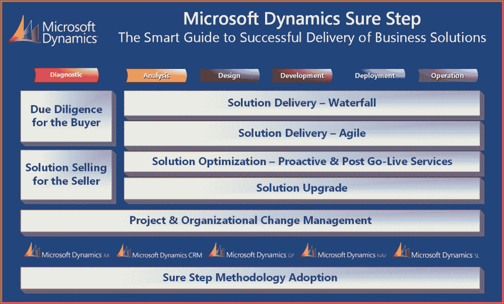
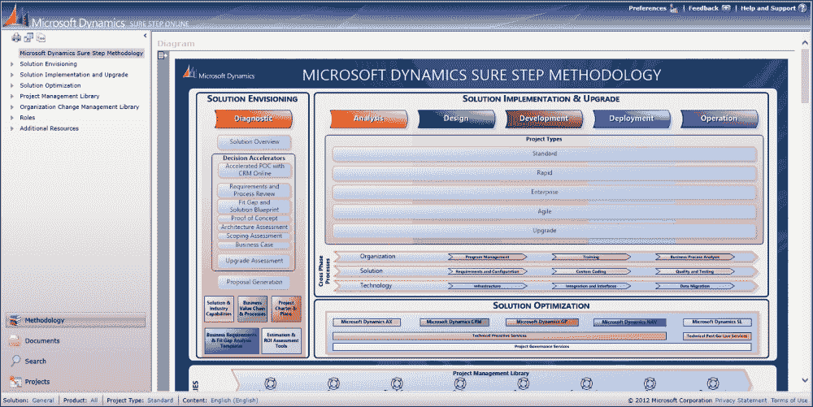
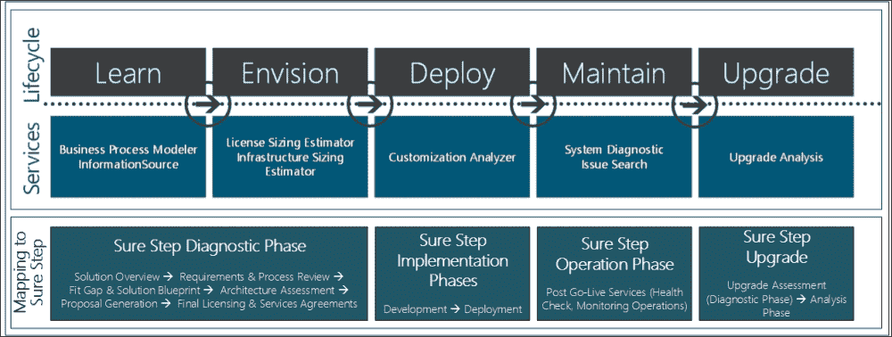

# 第十章。总结和要点

|   | *大多数服务提供商都有经过良好培训和/或经验丰富的项目经理，使用经过验证的项目管理方法论来指导计划，并且有纪律和严谨性来执行项目计划。那些严重延迟的项目往往伴随着严重的问题，以及需求和范围失控的变化——所有这些都是服务提供商必须有所计划并准备好应对的问题。精明的服务提供商将突出其项目管理方法论的经过验证的业绩记录，并展示其有效性。* |   |
| --- | --- | --- |
|   | --Gartner, Inc. |

恭喜！如果你一直在跟随前面的章节，你现在对 Microsoft Dynamics Sure Step 方法论的原则和架构有了很好的理解。你理解了全生命周期方法论对于企业解决方案合作的重要性，以及 Sure Step 如何提供深入覆盖以帮助你在这一领域取得成功。

在本书的最后一章，我们将做以下事情：

+   总结前几章的学习内容

+   讨论 Sure Step 的短期计划和其未来的可能发展方向

+   提供你可以立即执行的要点

# 我们现在所了解的 Sure Step

自 2007 年首次发布以来，Sure Step 已经超越了仅仅关注部署 Microsoft Dynamics 解决方案的范畴。随着 Sure Step 的每一次发布，工具和方法论的设计都得到了扩展，以涵盖包括最近行业/垂直和跨行业/水平解决方案在内的更多用例。Sure Step 的潜在目标始终是帮助客户在选择和成功交付他们的 Microsoft Dynamics 解决方案，但 Sure Step 的使用价值已经超越了这一点。

## Sure Step 的价值主张

Sure Step 的首要价值主张仍然是它提供的持续解决方案交付框架。Sure Step 中的流程是可重复和可扩展的，这使组织能够建立在过去学习的基础上，从而实现高质量的互动，最大化客户资源并加快客户的价值实现时间。Sure Step 在整个合作生命周期中提供了稳健的项目范围控制和管理的途径，早期风险识别和调解，以及质量保证和控制。当然，这些途径对于交付组织来说是有价值的，但对于参与解决方案交付的客户团队来说也非常有价值。

对于咨询组织来说，Sure Step 在各个团队之间提供了一个共同的主线。在 ERP/CRM 解决方案部署方面，顾问们往往有着不同的背景。经验丰富的顾问可能部署过其他竞争性系统，他们可能各自有自己的参与偏好。虽然不同的观点当然是一件好事，但当涉及到减轻业务解决方案参与中固有的组织变革时，一个团队协同工作对于客户来说至关重要。这就是为什么，让咨询团队使用 Sure Step 的相同分类法和术语，有助于他们作为一个组织共同成熟，并紧密合作。

Sure Step 的第二个关键价值主张是，它为顾客和销售者提供了一个详尽可行的流程，用于产品选择和解决方案销售。Sure Step V2 向用户介绍了扩展的诊断阶段，包括决策加速方案。决策加速方案和服务随着每个后续版本的发布而不断建立，Sure Step 提供了强大的指南、流程和内容，以支持客户和解决方案提供商。鉴于业务解决方案的重要性，我们在前几章中多次强调，这一价值主张的重要性不容忽视。与 **Microsoft Solution Selling Process** (**MSSP**) 的结合及其内在的客户尽职调查重点，如果按照提供的指导执行，可以减轻客户和销售组织面临的风险。

从诊断阶段到实施阶段的连接和流程也促进了销售和交付团队之间的信息流动。在销售周期之前，由销售资源获得的知识可以被捕捉并过渡到实施团队，以避免销售周期中设定的期望与实施期间交付的解决方案之间的不一致。这有助于销售和咨询团队，以及在某种程度上，实施后的支持团队，在客户最佳利益的基础上共同工作，而不是孤立无援。

随着时间的推移，Sure Step 还增加了多种实施项目类型，以支持客户和实施者偏好的方法。这些项目类型构成了 Sure Step 实施产品的基础。除了决策加速器和实施产品外，该方法还提供优化产品。这些优化产品包括技术主动审查服务，以在实施的生命周期中提供额外的质量保证，项目治理服务，以确保实施的范围和质量，以及技术上线后服务，如健康检查和性能调整，以确保解决方案在生产中的最佳运行。有了这些产品，Sure Step 也发展成为一个完整的客户生命周期方法。客户和合作伙伴从诊断阶段开始建立关系，继续通过解决方案的实施，通过**上线后**产品维持关系，并通过共同工作在解决方案升级上恢复合作关系。

Sure Step 的另一个非常重要的价值主张是其固有的促进知识管理的能力。您可能还记得之前的讨论中提到，Sure Step 项目类型工作流程中的活动是编号的，这些数字也延续到产生的项目计划和交付成果中。因此，任何文档，例如功能需求文档或用户验收测试脚本，都遵循一个数字序列，这使得跟踪、存储、检索以及在未来的合作中潜在地收获变得容易。这可以成为任何良好**知识管理系统（KM**）的基础。一个良好的 KM 系统有助于服务提供商在执行合作中更加高效，但它也可以帮助他们向客户证明他们在特定领域的经验，从而建立客户对他们的服务的信心。当然，KM 不仅仅是服务提供商的领域；客户也维护 KM 系统。Sure Step 的分类法还可以帮助客户在明确了解已实施的内容及其实施方式方面。它还可以为他们提供未来在整个组织内进行业务解决方案合作的良好参考。

最后但同样重要的是，Sure Step 为服务提供商和客户提供了培训价值主张。我们听到许多合作伙伴组织谈论 Sure Step 如何为他们提供一个为新的咨询资源创建培训/快速入门计划的良好结构。我们都在职业生涯的某个时刻开始过新的工作，我们记得当我们开始新工作时，尽管我们可能对自己是适合这个角色的信心满满，但胃里还是会感到紧张。知道有一个结构化的流程可以遵循，只能减轻最初的紧张感，并有助于在角色中建立信心。

这也扩展到了客户的组织。客户将有多位**主题专家**（SMEs）和关键用户参与其中。其中一些资源可能有过部署 ERP/CRM 解决方案的经验，而其他人可能对这种合作是新手。Sure Step 为这些资源提供了对方法的理解，以及他们自己角色中可以期望对流程做出什么贡献。

从客户培训的角度来看，另一个好处是组织变革方面。引入新的商业解决方案可能会给员工在即将到来的组织工作流程中的角色带来不必要的紧张和担忧。能够提供对新流程的可见性可以帮助缓解客户组织中这些关键资源的恐惧，而培训可以帮助他们对自己在新系统中如何履行角色充满信心。

当然，培训不仅针对新的咨询或客户资源。我们之前讨论了经验丰富的顾问，每个顾问都有自己的技巧袋。对 Sure Step 方法进行培训确保他们每个人都遵循一致的过程，并且整个团队对页面对齐，这对客户和咨询组织都有益。

总的来说，Sure Step 为咨询和客户组织创造了一个更好的整体生态系统。

## 重新审视 Sure Step – 摘要和快速参考

在本书的前几章中，我们提供了使用 Sure Step 成功部署您的 Microsoft Dynamics 商业解决方案的构建模块。以下图表展示了 Sure Step 中的关键方面，这些方面在本书中也有涉及：

我们从第一章“背景和概念”中介绍了方法论的概念及其在 ERP/CRM 解决方案选择和实施中的重要性。我们讨论了彻底的选择过程作为解决方案部署的基础的重要性。我们还讨论了由于范围、风险和变更管理不善而导致实施失败的情况。

第二章, *解决方案销售与尽职调查*，以及第三章，*使用 Sure Step 进行解决方案构想*，专注于针对销售人员的解决方案销售以及它如何也推动买方的尽职调查。在第二章, *解决方案销售与尽职调查*中，我们涵盖了理论和概念，并讨论了解决方案销售不是一次性的交易销售，而是销售人员需要与客户建立关系并建立信任的过程。我们在第三章，*使用 Sure Step 进行解决方案构想*中，基于这些概念，详细介绍了 Sure Step 如何帮助微软 Dynamics 解决方案的销售和尽职调查。我们详细介绍了 Sure Step 诊断阶段的决策加速方案及其服务，重点关注它们如何帮助加速销售周期并使其结束，同时帮助客户进行解决方案选择过程。我们还讨论了诊断阶段如何通过概述涉及的风险来为高质量的实施奠定基础，以及它如何推动选择正确的部署方法，并确定咨询团队和客户团队将涉及的角色。

第四章, *管理项目*和第五章，*使用 Sure Step 实施*，讨论了项目的本质和预期解决方案的成功交付。在第四章, *管理项目*中，我们介绍了项目管理概念，从结果驱动和现实生活的角度讨论了如何管理项目。我们讨论了项目管理中的阻力，涵盖了项目成功的四个支柱，并解释了项目管理的基本要素。在第五章，*使用 Sure Step 实施*中，我们专注于实施生命周期，涵盖了 Sure Step 中的瀑布和敏捷解决方案交付方法。我们介绍了构成 Sure Step 项目类型的实施阶段和跨阶段。我们还讨论了实施 ERP 和 CRM 软件解决方案时实施者和客户面临的真实挑战，并展示了 Sure Step 方法论在支持工具和模板方面的真正价值。

在第六章，*质量管理与优化*中，我们讨论了优化产品中的主动和上线后服务作为服务提供商和客户确保质量实施的选择。我们介绍了 Sure Step 优化路线图，并讨论了技术主动和上线后产品，以及项目治理和升级审查产品。

在第七章，*使用 Sure Step 进行升级*中，我们专注于使用 Sure Step 帮助现有的 Microsoft Dynamics 客户将他们的解决方案升级到最新的产品版本。该方法从升级评估决策加速器产品开始，以确定正确的方法，然后是 Sure Step 升级项目类型进行技术升级。我们还建议在升级过程中添加新功能的方法。

在第八章，*项目和组织变更管理*中，我们介绍了 Sure Step 中的项目和**组织变更管理**（OCM）学科。我们讨论了项目管理下的子学科，如风险管理、范围管理、问题管理和沟通管理。我们还解释了为什么组织变更管理是客户和合作伙伴在 ERP/CRM 合作中需要考虑的关键领域。我们还介绍了 Sure Step 中内置的 SharePoint 功能，以帮助解决方案交付团队有效协作。

在第九章，*采用 Sure Step 的实际指南*中，我们转换了方向，为 Microsoft Dynamics 合作伙伴组织提供 Sure Step 方法论采用的实用指南。我们讨论了组织如何使其实施方法成为其核心竞争力之一。

# Sure Step 更新

从 Sure Step 的初始版本到最新版本，我们投入了大量工作来构建 Sure Step 的基础元素；这包括解决方案愿景、瀑布和敏捷解决方案交付以及解决方案优化方面，这些我们在本章的前几节和章节中进行了详细阐述。当然，每个版本也产生了新的和更新的内容元素，这将继续是近期和未来 Sure Step 更新的重点。随着工作流程和其他基础元素的建立，Sure Step 团队现在主要专注于确保在 Sure Step 中呈现的内容，包括指导和模板，与最新的 Microsoft Dynamics AX、CRM、GP、NAV 和 SL 产品版本相对应。

## Sure Step 在线

Sure Step 平台的主要变化之一是几年前发布了 Sure Step Online。这在方法和发布流程上都是一个重大变化，因为它允许更快的内容更新。随着 Sure Step Online 在用户基础中的日益成熟，Sure Step 客户端正在逐步淘汰，未来的投资将继续集中在 Sure Step Online 内容更新上。以下是 Sure Step Online 的截图：

到本文写作时为止，Sure Step 团队最近为以下领域发布了新的内容更新：

+   **Microsoft Dynamics NAV 2013**：Sure Step 中的旧角色定制实施内容已被新的 NAV 2013 快速启动指南所取代，并包括指向在线资源的额外链接。

+   **Microsoft Dynamics GP 2013**：Sure Step 中的所有 GP 内容都已更新，以与最新的 GP 2013 产品版本保持一致，包括 GP 2013 Web 客户端的实施指南，以及其他专注于新 Web 客户端的内容。

+   **Microsoft Dynamics AX 2012**：Visio 业务流程流程图，这是最广泛使用的文档集之一，已更新到 AX 2012 产品版本。

+   **Microsoft Dynamics Connector**：Sure Step 提供了有关 Connector 工具的指南和链接到支持文档，该工具在 Microsoft Dynamics CRM 和 Microsoft Dynamics ERP 解决方案之间。

+   **Microsoft Dynamics Management Reporter**：Sure Step 现在提供了包含指向 Management Reporter 的多个在线资源的内容，通过各种 ERP 解决方案实施材料引用 Management Reporter，并为 Management Reporter 提供了一个专门的职能需求文档（FRD）。此外，还提供了指向实施工具和视频的链接。

Sure Step 的更新继续由 Microsoft Business Solutions (MBS)研发团队和 Microsoft Dynamics 产品团队提供支持，以确保客户和服务提供商能够获得他们所需解决方案的适当指导。自 2007 年起步以来，Sure Step 已经取得了长足的进步，其发展将与新的研发工具保持一致，包括 Microsoft Dynamics 生命周期服务（LCS）。

## 确步和生命周期服务

正如我们在第三章中讨论的那样，*使用 Sure Step 进行解决方案构想*，Microsoft Dynamics 研发部门正在开发和发布一系列新的生命周期服务工具，以帮助客户和解决方案提供商获得一系列服务，包括业务流程建模、基础设施规模评估、快速配置、定制分析、系统诊断和升级分析。以下是如何在第三章中展示的工具和服务概述，以及它们与 Sure Step 的对应关系：

关于 LCS 工具的更多信息，请参阅第三章，*使用 Sure Step 进行解决方案设想*。随着这些工具的建立，Sure Step 将继续提供关键链接到这些工具，以及在特定活动和/或服务中可以调用的调用。通过这种方式，Sure Step 演变为协调者的角色。用户将能够利用 Sure Step 执行端到端工作流程以执行相应的服务，在每个服务中，Sure Step 将提供关于调用哪些工具的指导；这包括 LCS 工具。

# 关键要点

当我们接近这本书的结尾时，我们利用这个机会总结一些关键要点，您可以使用 Sure Step 在短期内执行，并在您的组织中实现快速胜利。

## 客户尽职调查和解决方案销售的要点

销售和实施业务解决方案应该关于在客户组织中创造价值。通过遵循这五个要点，努力实现双赢的交易，使双方都变得更好、更有利可图：

+   将 Sure Step 的诊断阶段作为一个机会，提出一个可适应的价值主张，而不是从预分析阶段销售一个模糊的价值主张。这代表了一个独特的开始与客户合作的机会，并确保相关各方进行适当的尽职调查工作。

+   在预分析活动中，不要将自己局限于对现状的书面复制。要专注于设想未来流程以及它们如何映射到解决方案。建筑设计公司不会仅仅根据旧房子的描述来规划、设计和预算客户的新房子，你们也不应该基于现有信息来架构客户的解决方案。使用 Sure Step 产品、行业特定的流程以及众多其他工具和资源，尽可能早地确定未来状态流程和解决方案需求。

+   从一开始就管理客户的感知，确保客户在签署合同时了解他们将获得的解决方案。这包括解释和可视化如何使用新解决方案执行关键业务流程。诊断阶段通过决策加速器提供的 Fit Gap 和解决方案蓝图评估服务帮助您管理这种感知，并在实施阶段继续这一努力。

+   通过利用相应的 Sure Step 指导，确保客户和合作伙伴利益相关者就新解决方案的真正目标和满意度条件达成一致。

+   在合同完成前，使用 Sure Step 实施选项，并选择最适合向客户交付解决方案的方法。与您的客户设想、沟通和验证您最有效的方法，因为它会影响预算、时间表和风险。

## 实施要点

以下要点关注 Sure Step 在实施中的影响和价值，无论是从启动和交付项目，还是从以往合作中学到的经验教训：

+   利用 Sure Step 项目生命周期计划的现成优势，结合项目类型选项。项目越长，解决方案交付过程中的不确定性就越大。拥有预定义的 Sure Step 项目生命周期工作流程和计划将帮助您快速启动实现项目目标的愿景、规划和预算。

+   确保按照 Sure Step 中的说明，重视您的项目启动会议。每个项目都是独特的，因此将这项活动视为启动团队沟通和协调的机会。

+   使用 Sure Step 项目章程，通过一个全面性的文件将所有利益相关者对齐。

+   利用 Sure Step 模板来为您的组织开发参考模型。这不仅有助于提高您实施工作的效率，而且还能帮助您的咨询团队以目标为导向，同时帮助新员工快速上手。

+   专注于为客户创造价值，并远离包含多页模糊分析的范围文档。文档很重要，但只有当它包含当前情况分析、结果和解决方案愿景的实际价值时。使用 Sure Step 工作流程、活动、研讨会和报告，确保交付团队避免这些陷阱。首先，捕捉解决方案需求（需要交付的内容），然后通过 Fit Gap 练习在此基础上构建，以达成对解决方案交付的早期共识。如果在早期阶段彻底执行这些练习，输出可以作为在整个参与过程中的指南。

+   利用 Sure Step 跨阶段流程提供的可见性，进一步促进参与项目中的各种角色和团队之间的跨职能协调和整合。

+   在项目生命周期中，使用 Sure Step 模板和指南持续与关键用户互动，让他们了解解决方案的进展，并在每个实施阶段适当的时间点建立他们对解决方案的了解。

+   Sure Step 是一种帮助进行打包解决方案部署的方法。使用提供的指南进行解决方案的配置、设置和定制，以及开发期间解决方案的相应测试。

+   利用在每个实施阶段结束时提供的模板和指南进行关卡审查。在关键客户面向文件上获得签字可以提高您交付绩效的可见性和客户的信心。

## Sure Step 采用要点

采用任何实施方法论是一项重要但具有挑战性的任务。以下要点将帮助您理解这一挑战：

+   不要混淆 Sure Step 的知识与公司范围内方法论的应用。将方法论作为核心竞争力采用涉及正式变革计划的制度化。将其视为在您的组织中持续改进的机会。

+   Sure Step 不必与您自己的内部实施方法论竞争。利用 Sure Step 作为基准，通过适当的指导、模板和工具来增强您的实施流程。

+   不要低估采用方法论所需的努力。利用 Sure Step 采用路线图，执行一个针对您的需求、行业重点、客户和项目的逐步方法。

+   专注于在 Sure Step 中寻找可以推动您组织的价值，并确保您的团队理解这一点。

## 一般要点

在本节中，我们强调了一些关于 Sure Step 的一般观察：

+   记住，您的提供物应该完全关于交付价值。审查您的实施流程，确保它们旨在为您的客户交付价值。

+   与将 PMBOK 或 Prince2 等标准项目方法论视为 Sure Step 的替代品相比，您可以将它们视为补充框架。Sure Step 是一种针对 Microsoft Dynamics 合作的客户参与方法论，而 PMBOK 和 Prince2 为广泛的工程项目分类提供了一个通用的项目管理框架。

+   改进是一种态度，如果一开始没有成功，就尝试，尝试，再尝试。将所学到的经验教训作为基础，汇集任何可以用于未来项目的有用见解。

# 摘要

当 ERP/CRM 领域的新手接触到 Sure Step 时，他们往往会感到不知所措。鉴于内容量很大，即使是经验丰富的顾问也无法完全理解他们可用的所有资源。因此，我们编写这本书的一个目标是为那些刚开始在 Microsoft Dynamics 解决方案领域工作的人提供更多的清晰度，同时，将老练的顾问们武装起来，为他们提供额外的技巧。

因此，这本书远不止是一本关于项目管理的一步一步指南。我们的目标是解决不同利益相关者的日常挑战，而不仅仅是项目经理的挑战。我们将这本书打造成一本易于遵循的指南，供那些将 Sure Step 作为交付 Microsoft Dynamics 解决方案基础的优秀团队成员使用。

我们希望您已经对 Sure Step 的设计和架构有了深入的了解，以及对该方法论在您的工作中的应用有了认识。Sure Step 是一种由行业开发、为行业服务的方法论，其成功将继续由您，即方法论的使用者，来推动。
