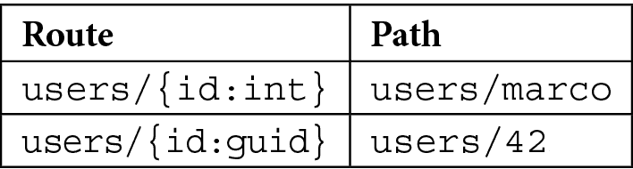
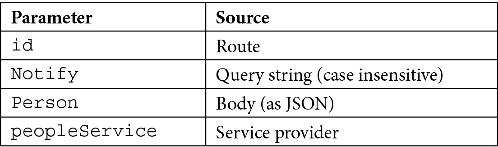
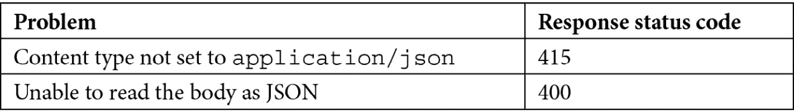

# 探索最小 API 及其优势

在本书的这一章中，我们将介绍一些与.NET 6.0 中的最小 API 相关的基本主题，展示它们与我们之前在.NET 的旧版本中编写的基于控制器的 Web API 有何不同。我们还将尝试强调这种新的 API 编写方法的优势和劣势。

在本章中，我们将涵盖以下主题：

+   路由

+   参数绑定

+   探索响应

+   控制序列化

+   构建最小 API 项目

# 技术要求

要遵循本章的描述，您需要创建一个 ASP.NET Core 6.0 Web API 应用程序。您可以选择以下任一选项：

+   **选项 1**：在 Visual Studio 2022 的**文件**菜单中点击**新建** | **项目**命令，然后，在向导中选择**ASP.NET Core Web API**模板。在向导中选择一个名称和工作目录，并确保在下一步中取消选中**使用控制器（取消选中以使用最小 API）**选项。

+   **选项 2**：打开您的控制台、shell 或 Bash 终端，切换到您的工作目录。使用以下命令创建一个新的 Web API 应用程序：

    ```cs
    dotnet new webapi -minimal -o Chapter02
    ```

现在，通过双击项目文件或在 Visual Studio Code 中在已打开的控制台中输入以下命令来打开项目：

```cs
cd Chapter02
code.
```

最后，您可以安全地删除与`WeatherForecast`示例相关的所有代码，因为我们不需要它本章。

本章中的所有代码示例都可以在本书的 GitHub 存储库[`github.com/PacktPublishing/Minimal-APIs-in-ASP.NET-Core-6/tree/main/Chapter02`](https://github.com/PacktPublishing/Minimal-APIs-in-ASP.NET-Core-6/tree/main/Chapter02)中找到。

# 路由

根据官方 Microsoft 文档[`docs.microsoft.com/aspnet/core/fundamentals/routing`](https://docs.microsoft.com/aspnet/core/fundamentals/routing)中的定义，路由如下所述：

路由负责匹配传入的 HTTP 请求并将这些请求调度到应用程序的可执行端点。端点是应用程序的执行请求处理代码的单元。端点在应用程序中定义，并在应用程序启动时进行配置。端点匹配过程可以从请求的 URL 中提取值，并将这些值提供给请求处理。使用应用程序中的端点信息，路由还可以生成映射到端点的 URL。

在基于控制器的 Web API 中，路由通过`Startup.cs`中的`UseEndpoints()`方法或使用`Route`、`HttpGet`、`HttpPost`、`HttpPut`、`HttpPatch`和`HttpDelete`等数据注释直接在操作方法上定义。

如*第一章*中所述，在最小 API 的**介绍最小 API**中，我们使用`WebApplication`对象的`Map*`方法定义路由模式。以下是一个示例：

```cs
app.MapGet("/hello-get", () => "[GET] Hello World!");
app.MapPost("/hello-post", () => "[POST] Hello World!");
app.MapPut("/hello-put", () => "[PUT] Hello World!");
app.MapDelete("/hello-delete", () => "[DELETE] Hello
                World!");
```

在此代码中，我们定义了四个端点，每个端点都有不同的路由和方法。当然，我们可以使用相同的路由模式与不同的 HTTP 动词。

注意

一旦我们将端点添加到我们的应用程序中（例如，使用`MapGet()`），`UseRouting()`将自动添加到中间件管道的起始处，而`UseEndpoints()`将添加到管道的末尾。

如此所示，ASP.NET Core 6.0 为最常见的 HTTP 动词提供了`Map*`方法。如果我们需要使用其他动词，我们可以使用通用的`MapMethods`：

```cs
app.MapMethods("/hello-patch", new[] { HttpMethods.Patch }, 
    () => "[PATCH] Hello World!");
app.MapMethods("/hello-head", new[] { HttpMethods.Head }, 
    () => "[HEAD] Hello World!");
app.MapMethods("/hello-options", new[] { 
    HttpMethods.Options }, () => "[OPTIONS] Hello World!");
```

在接下来的章节中，我们将详细展示路由如何有效工作以及我们如何控制其行为。

## 路由处理程序

当路由 URL 匹配（根据参数和约束，如以下章节所述）时执行的方法称为**路由处理程序**。路由处理程序可以是 lambda 表达式、局部函数、实例方法或静态方法，无论是同步还是异步：

+   下面是一个 lambda 表达式的例子（内联或使用变量）：

    ```cs
    app.MapGet("/hello-inline", () => "[INLINE LAMBDA] 
                 Hello World!");
    var handler = () => "[LAMBDA VARIABLE] Hello World!";
    app.MapGet("/hello", handler);
    ```

+   下面是一个局部函数的例子：

    ```cs
    string Hello() => "[LOCAL FUNCTION] Hello World!";
    app.MapGet("/hello", Hello);
    ```

+   以下是一个实例方法的例子：

    ```cs
    var handler = new HelloHandler();
    app.MapGet("/hello", handler.Hello);
    class HelloHandler
    {
        public string Hello()
          => "[INSTANCE METHOD] Hello 
               World!";
    }
    ```

+   这里，我们可以看到一个静态方法的例子：

    ```cs
    app.MapGet("/hello", HelloHandler.Hello);
    class HelloHandler
    {
        public static string Hello()
          => "[STATIC METHOD] Hello World!";
    }
    ```

## 路由参数

与.NET 的先前版本一样，我们可以创建带有参数的路由模式，这些参数将由处理程序自动捕获：

```cs
app.MapGet("/users/{username}/products/{productId}", 
          (string username, int productId) 
         => $"The Username is {username} and the product Id 
              is {productId}");
```

一个路由可以包含任意数量的参数。当对这个路由发出请求时，参数将被捕获、解析并作为参数传递给相应的处理程序。这样，处理程序将始终接收到类型化的参数（在先前的示例中，我们确信用户名是`string`，产品 ID 是`int`）。

如果路由值无法转换为指定的类型，则会抛出`BadHttpRequestException`类型的异常，并且 API 将以`400 Bad Request`消息响应。

## 路由约束

路由约束用于限制路由参数的有效类型。典型的约束允许我们指定参数必须是数字、字符串或 GUID。要指定路由约束，我们只需在参数名称后添加一个冒号，然后指定约束名称：

```cs
app.MapGet("/users/{id:int}", (int id) => $"The user Id is 
                                            {id}");
app.MapGet("/users/{id:guid}", (Guid id) => $"The user Guid 
                                              is {id}");
```

最小 API 支持在 ASP.NET Core 的先前版本中已经可用的所有路由约束。您可以在以下链接中找到完整的路由约束列表：[`docs.microsoft.com/aspnet/core/fundamentals/routing#route-constraint-reference`](https://docs.microsoft.com/aspnet/core/fundamentals/routing#route-constraint-reference)。

如果根据约束，没有路由与指定的路径匹配，我们不会得到异常。相反，我们获得一个`404 Not Found`消息，因为实际上，如果约束不匹配，路由本身是无法到达的。因此，例如，在以下情况下我们会得到 404 响应：



表 2.1 – 根据路由约束的无效路径示例

处理器中未声明为路由约束的每个其他参数默认期望在查询字符串中。例如，参见以下：

```cs
// Matches hello?name=Marco
app.MapGet("/hello", (string name) => $"Hello, {name}!"); 
```

在下一节 *参数绑定* 中，我们将更深入地探讨如何使用绑定来进一步自定义路由，例如指定搜索路由参数的位置、更改它们的名称以及如何有可选的路由参数。

# 参数绑定

**参数绑定**是将请求数据（即 URL 路径、查询字符串或正文）转换为强类型参数的过程，这些参数可以被路由处理器消费。ASP.NET Core 最小 API 支持以下绑定来源：

+   路由值

+   查询字符串

+   头部

+   正文（作为 JSON，默认支持的唯一格式）

+   服务提供者（依赖注入）

我们将在 *第四章* *实现依赖注入* 中详细讨论依赖注入。

正如我们在本章后面将要看到的，如果需要，我们可以自定义特定输入的绑定方式。不幸的是，在当前版本中，最小 API 中没有原生支持从 `Form` 进行绑定。这意味着，例如，`IFormFile` 也不受支持。

为了更好地理解参数绑定的工作原理，让我们看一下以下 API：

```cs
var builder = WebApplication.CreateBuilder(args);
builder.Services.AddScoped<PeopleService>();
var app = builder.Build();
app.MapPut("/people/{id:int}", (int id, bool notify, Person 
             person, PeopleService peopleService) => { });
app.Run();
public class PeopleService { }
public record class Person(string FirstName, string 
                           LastName);
```

传递给处理器的参数以以下方式解决：



表 2.2 – 参数绑定来源

如我们所见，ASP.NET Core 能够根据路由模式和参数本身的类型自动理解绑定参数的位置。例如，期望在请求体中有一个复杂类型，如 `Person` 类。

如果需要，就像在 ASP.NET Core 的早期版本中一样，我们可以使用属性来显式指定参数绑定来源，并且可以选择性地使用不同的名称。参见以下端点：

```cs
app.MapGet("/search", string q) => { });
```

API 可以通过 `/search?q=text` 来调用。然而，使用 `q` 作为参数名称不是一个好主意，因为它的含义不是不言自明的。因此，我们可以使用 `FromQueryAttribute` 修改处理器：

```cs
app.MapGet("/search", ([FromQuery(Name = "q")] string 
             searchText) => { });
```

以这种方式，API 仍然期望一个名为 `q` 的查询字符串参数，但在处理器中，其值现在绑定到 `searchText` 参数。

注意

根据标准，`GET`、`DELETE`、`HEAD` 和 `OPTIONS` HTTP 选项不应有正文。如果无论如何你想使用它，你需要显式地将 `[FromBody]` 属性添加到处理器参数中；否则，你会得到一个 `InvalidOperationException` 错误。然而，请记住，这是一个不好的做法。

默认情况下，路由处理程序中的所有参数都是必需的。因此，如果根据路由，ASP.NET Core 找到一个有效的路由，但不是所有必需的参数都提供，我们将得到一个错误。例如，让我们看看以下方法：

```cs
app.MapGet("/people", (int pageIndex, int itemsPerPage) => { });
```

如果我们调用端点时不包含 `pageIndex` 或 `itemsPerPage` 查询字符串值，我们将获得 `BadHttpRequestException` 错误，并且响应将是 `400 Bad Request`。

要使参数可选，我们只需将它们声明为可空或提供默认值。后者是最常见的情况。然而，如果我们采用这种解决方案，我们无法使用 lambda 表达式作为处理程序。我们需要另一种方法，例如，局部函数：

```cs
// This won't compile
//app.MapGet("/people", (int pageIndex = 0, int 
                         itemsPerPage = 50) => { });
string SearchMethod(int pageIndex = 0, 
                    int itemsPerPage = 50) => $"Sample 
                    result for page {pageIndex} getting 
                    {itemsPerPage} elements";
app.MapGet("/people", SearchMethod);
```

在这种情况下，我们处理的是查询字符串，但相同的规则适用于所有绑定源。

请记住，如果我们使用 `null`，我们需要再次将其声明为 `BadHttpRequestException` 错误。以下示例正确地将 `orderBy` 查询字符串参数定义为可选的：

```cs
app.MapGet("/people", (string? orderBy) => $"Results ordered by {orderBy}");
```

## 特殊绑定

在基于控制器的 Web API 中，继承自 `Microsoft.AspNetCore.Mvc.ControllerBase` 的控制器可以访问一些属性，允许它获取请求和响应的上下文：`HttpContext`、`Request`、`Response` 和 `User`。在最小 API 中，我们没有基类，但我们仍然可以访问这些信息，因为它们被视为始终可用的特殊绑定：

```cs
app.MapGet("/products", (HttpContext context, HttpRequest req, HttpResponse res, ClaimsPrincipal user) => { });
```

小贴士

我们也可以使用 `IHttpContextAccessor` 接口访问所有这些对象，就像我们在之前的 ASP.NET Core 版本中所做的那样。

## 自定义绑定

在某些情况下，参数绑定的默认方式可能不足以满足我们的需求。在最小 API 中，我们没有 `IModelBinderProvider` 和 `IModelBinder` 接口的支持，但我们可以通过两种替代方案来实现自定义模型绑定。

重要提示

基于控制器的项目中 `IModelBinderProvider` 和 `IModelBinder` 接口允许我们定义请求数据和应用程序模型之间的映射。ASP.NET Core 提供的默认模型绑定器支持大多数常见的数据类型，但如果需要，我们可以通过创建自己的提供者来扩展系统。更多信息请参阅以下链接：[`docs.microsoft.com/aspnet/core/mvc/advanced/custom-model-binding`](https://docs.microsoft.com/aspnet/core/mvc/advanced/custom-model-binding)。

如果我们想将来自路由、查询字符串或头部的参数绑定到自定义类型，我们可以在该类型中添加一个静态的 `TryParse` 方法：

```cs
// GET /navigate?location=43.8427,7.8527
app.MapGet("/navigate", (Location location) => $"Location: 
            {location.Latitude}, {location.Longitude}");
public class Location
{
    public double Latitude { get; set; }
    public double Longitude { get; set; }
    public static bool TryParse(string? value, 
      IFormatProvider? provider, out Location? location)
    {
          if (!string.IsNullOrWhiteSpace(value))
          {
               var values = value.Split(',', 
               StringSplitOptions.RemoveEmptyEntries);
               if (values.Length == 2 && double.
                   TryParse(values[0],
                   NumberStyles.AllowDecimalPoint, 
                   CultureInfo.InvariantCulture, 
                   out var latitude) && double.
                   TryParse(values[1], NumberStyles.
                   AllowDecimalPoint, CultureInfo.
                   InvariantCulture, out var longitude))
               {
                       location = new Location 
                       { Latitude = latitude, 
                       Longitude = longitude };
                       return true;
               }
          }
          location = null;
          return false;
    }
}
```

在 `TryParse` 方法中，我们可以尝试分割输入参数并检查它是否包含两个十进制值：在这种情况下，我们将数字解析为构建 `Location` 对象，并返回 `true`。否则，我们返回 `false`，因为 `Location` 对象无法初始化。

重要提示

当最小 API 发现一个类型包含一个静态的`TryParse`方法时，即使它是一个复杂类型，它也会假设它是根据路由模板传递进来的，或者是在查询字符串中。我们可以使用`[FromHeader]`属性来更改绑定源。在任何情况下，`TryParse`都不会被用于请求体。

如果我们需要完全控制绑定是如何执行的，我们可以在类型上实现一个静态的`BindAsync`方法。这不是一个非常常见的解决方案，但在某些情况下，它可能很有用：

```cs
// POST /navigate?lat=43.8427&lon=7.8527
app.MapPost("/navigate", (Location location) => 
   $"Location: {location.Latitude}, {location.Longitude}");
public class Location
{
    // ...
    public static ValueTask<Location?> BindAsync(HttpContext 
    context, ParameterInfo parameter)
    {
        if (double.TryParse(context.Request.Query["lat"], 
            NumberStyles.AllowDecimalPoint, CultureInfo.
            InvariantCulture, out var latitude)&& double.
            TryParse(context.Request.Query["lon"], 
            NumberStyles.AllowDecimalPoint, CultureInfo.
            InvariantCulture, out var longitude))
        {
                var location = new Location 
                { Latitude = latitude, Longitude = longitude };
                return ValueTask.
                  FromResult<Location?>(location);
        }
        return ValueTask.FromResult<Location?>(null);
    }
}
```

正如我们所见，`BindAsync`方法接受整个`HttpContext`作为参数，因此我们可以读取所有我们需要创建实际`Location`对象的信息，该对象被传递给路由处理程序。在这个例子中，我们读取了两个查询字符串参数（`lat`和`lon`），但在`POST`、`PUT`或`PATCH`方法的情况下），我们也可以读取整个请求体并手动解析其内容。这可能很有用，例如，如果我们需要处理格式不是 JSON 的请求（正如之前所说，这是默认支持的唯一格式）。

如果`BindAsync`方法返回`null`，而相应的路由处理程序参数不能假设这个值（如前例所示），我们将得到一个`HttpBadRequestException`错误，通常，这个错误会被包裹在一个`400 Bad Request`响应中。

重要提示

我们不应该使用一个类型来定义`TryParse`和`BindAsync`方法；如果两者都存在，`BindAsync`总是有优先级（也就是说，`TryParse`永远不会被调用）。

现在我们已经了解了参数绑定以及如何使用它和自定义其行为，让我们看看如何在最小 API 中处理响应。

# 探索响应

就像基于控制器的项目一样，对于最小 API 的路由处理程序，我们也可以直接返回一个字符串或一个类（无论是同步还是异步）：

+   如果我们返回一个字符串（如前一部分的例子所示），框架会直接将字符串写入响应，将其内容类型设置为`text/plain`，状态码设置为`200 OK`

+   如果我们使用一个类，对象将被序列化为 JSON 格式，并通过`application/json`内容类型和`200 OK`状态码发送到响应中

然而，在实际应用中，我们通常需要控制响应类型和状态码。在这种情况下，我们可以使用静态的`Results`类，它允许我们返回`IResult`接口的一个实例，在最小 API 中，它表现得就像控制器中的`IActionResult`一样。例如，我们可以用它来返回`201 Created`响应，而不是`400 Bad Request`或`404 Not Found`消息。让我们看看一些例子：

```cs
app.MapGet("/ok", () => Results.Ok(new Person("Donald", 
                                              "Duck")));
app.MapGet("/notfound", () => Results.NotFound());
app.MapPost("/badrequest", () =>
{
    // Creates a 400 response with a JSON body.
    return Results.BadRequest(new { ErrorMessage = "Unable to
                                    complete the request" });
});
app.MapGet("/download", (string fileName) => 
             Results.File(fileName));
record class Person(string FirstName, string LastName);
```

`Results`类的每个方法都负责设置与该方法本身含义相对应的响应类型和状态码（例如，`Results.NotFound()`方法返回一个`404 Not Found`响应）。请注意，即使我们通常需要在`200 OK`响应的情况下返回一个对象（使用`Results.Ok()`），这并不是唯一允许这样做的方法。许多其他方法允许我们包含自定义响应；在这些所有情况下，响应类型将设置为`application/json`，对象将自动进行 JSON 序列化。

当前版本的最小 API 不支持内容协商。我们只有少数几个方法允许我们显式设置内容类型，当使用`Results.Bytes()`、`Results.Stream()`和`Results.File()`获取文件，或使用`Results.Text()`和`Results.Content()`时。在其他所有情况下，当我们处理复杂对象时，响应将以 JSON 格式。这是一个精确的设计选择，因为大多数开发者很少需要支持其他媒体类型。通过仅支持 JSON 而不执行内容协商，最小 API 可以非常高效。

然而，这种方法并不适用于所有场景。在某些情况下，我们可能需要创建一个自定义响应类型，例如，如果我们想返回 HTML 或 XML 响应而不是标准的 JSON。我们可以手动使用`Results.Content()`方法（它允许我们指定特定内容类型的简单字符串），但如果我们有这种需求，最好实现一个自定义的`IResult`类型，这样解决方案就可以重用。

例如，假设我们想以 XML 而不是 JSON 序列化对象。然后我们可以定义一个实现`IResult`接口的`XmlResult`类：

```cs
public class XmlResult : IResult
{
   private readonly object value;
   public XmlResult(object value)
   {
       this.value = value;
   }
   public Task ExecuteAsync(HttpContext httpContext)
   {
       using var writer = new StringWriter();

       var serializer = new XmlSerializer(value.GetType());
       serializer.Serialize(writer, value);
       var xml = writer.ToString();
       httpContext.Response.ContentType = MediaTypeNames.
       Application.Xml;
       httpContext.Response.ContentLength = Encoding.UTF8
      .GetByteCount(xml);
       return httpContext.Response.WriteAsync(xml);
   }
}
```

`IResult`接口要求我们实现`ExecuteAsync`方法，该方法接收当前的`HttpContext`作为参数。我们使用`XmlSerializer`类序列化值，然后将其写入响应，指定正确的响应类型。

现在，我们可以在我们的路由处理程序中直接使用新的`XmlResult`类型。然而，最佳实践建议我们为`IResultExtensions`接口创建一个扩展方法，如下所示：

```cs
public static class ResultExtensions
{
    public static IResult Xml(this IResultExtensions 
    resultExtensions, object value) => new XmlResult(value);
}
```

这样，我们就在`Results.Extensions`属性上获得了一个新的`Xml`方法：

```cs
app.MapGet("/xml", () => Results.Extensions.Xml(new City { Name = "Taggia" }));
public record class City
{
    public string? Name { get; init; }
}
```

这种方法的优点是，我们可以在需要处理 XML 的地方重用它，而无需手动处理序列化和响应类型（正如我们应该使用`Result.Content()`方法所做的那样）。

小贴士

如果我们要执行内容验证，我们需要手动检查`HttpRequest`对象的`Accept`头，我们可以将其传递给我们的处理程序，然后根据需要创建正确的响应。

在分析如何正确处理最小 API 的响应之后，我们将在下一节中看到如何控制我们的数据在序列化和反序列化过程中的方式。

# 控制序列化

如前几节所述，最小化 API 只提供对 JSON 格式的内置支持。特别是，框架使用 `System.Text.Json` 进行序列化和反序列化。在基于控制器的 API 中，我们可以更改此默认设置并使用 JSON.NET。在最小化 API 的工作中这是不可能的：我们根本无法替换序列化器。

内置序列化器使用以下选项：

+   序列化期间不区分大小写的属性名称

+   驼峰式属性命名策略

+   支持引号数字（数字属性的 JSON 字符串）

注意

我们可以在以下链接中找到有关 `System.Text.Json` 命名空间及其提供的所有 API 的更多信息：[`docs.microsoft.com/dotnet/api/system.text.json`](https://docs.microsoft.com/dotnet/api/system.text.json)。

在基于控制器的 API 中，我们可以通过在 `AddControllers()` 后流畅地调用 `AddJsonOptions()` 来自定义这些设置。在最小化 API 中，我们不能使用这种方法，因为我们根本没有任何控制器，因此我们需要显式调用 `Configure` 方法来配置 `JsonOptions`。所以，让我们考虑以下处理程序：

```cs
app.MapGet("/product", () =>
{
    var product = new Product("Apple", null, 0.42, 6);
    return Results.Ok(product); 
});
public record class Product(string Name, string? Description, double UnitPrice, int Quantity)
{
    public double TotalPrice => UnitPrice * Quantity;
}
```

使用默认的 JSON 选项，我们得到以下结果：

```cs
{
    "name": "Apple",
    "description": null,
    "unitPrice": 0.42,
    "quantity": 6,
    "totalPrice": 2.52
}
```

现在，让我们配置 `JsonOptions`：

```cs
var builder = WebApplication.CreateBuilder(args);
builder.Services.Configure<Microsoft.AspNetCore.Http.Json.
JsonOptions>(options =>
{
    options.SerializerOptions.DefaultIgnoreCondition = 
    JsonIgnoreCondition.WhenWritingNull;
    options.SerializerOptions.IgnoreReadOnlyProperties 
    = true;
});
```

再次调用 `/product` 端点，我们现在将得到以下结果：

```cs
{
    "name": "Apple",
    "unitPrice": 0.42,
    "quantity": 6
}
```

如预期的那样，`Description` 属性没有被序列化，因为它为 `null`，同样，`TotalPrice` 也没有包含在响应中，因为它只读。

`JsonOptions` 的另一个典型用例是我们想要添加将在每个序列化或反序列化过程中自动应用的转换器，例如，`JsonStringEnumConverter` 将枚举值转换为字符串或从字符串转换。

重要提示

注意，最小化 API 使用的 `JsonOptions` 类是在 `Microsoft.AspNetCore.Http.Json` 命名空间中可用的。不要与在 `Microsoft.AspNetCore.Mvc` 命名空间中定义的类混淆；对象的名称相同，但后者仅对控制器有效，因此在最小化 API 项目中设置时没有效果。

由于仅支持 JSON，如果我们没有明确添加对其他格式的支持，如前几节所述（例如，在自定义类型上使用 `BindAsync` 方法），最小化 API 将自动对正文绑定源执行一些验证并处理以下场景：



表 2.3 – 正文绑定问题的响应状态码

在这些情况下，由于正文验证失败，我们的路由处理程序将永远不会被调用，我们将直接得到前面表格中显示的响应状态码。

现在，我们已经涵盖了我们需要开始开发最小化 API 的所有支柱。然而，还有另一个重要的事情要讨论：正确设计真实项目的方法，以避免在架构中常见的错误。

# 构建最小化 API 项目架构

到目前为止，我们已经在 `Program.cs` 文件中直接编写了路由处理器。这是一个完全支持的场景：使用最小 API，我们可以在单个文件中编写所有代码。事实上，几乎所有示例都展示了这种解决方案。然而，虽然这是允许的，我们很容易想象这种方法如何导致项目无结构化和难以维护。如果我们有较少的端点，这没问题——否则，最好将我们的处理器组织在单独的文件中。

假设我们在 `Program.cs` 文件中直接有以下的代码，因为我们必须处理 CRUD 操作：

```cs
app.MapGet("/api/people", (PeopleService peopleService) => 
            { });
app.MapGet("/api/people/{id:guid}", (Guid id, PeopleService 
             peopleService) => { });
app.MapPost("/api/people", (Person Person, PeopleService 
              people) => { });
app.MapPut("/api/people/{id:guid}", (Guid id, Person 
             Person, PeopleService people) => { });
app.MapDelete("/api/people/{id:guid}", (Guid id, 
                PeopleService people) => { });
```

很容易想象，如果我们在这里有所有实现（即使我们使用 `PeopleService` 来提取业务逻辑），这个文件很容易变得庞大。因此，在实际场景中，内联 lambda 方法并不是最佳实践。我们应该使用我们在 *路由* 部分中介绍的其他方法来定义处理器。因此，创建一个外部类来保存所有路由处理器是一个好主意：

```cs
public class PeopleHandler
{
   public static void MapEndpoints(IEndpointRouteBuilder 
   app)
   {
       app.MapGet("/api/people", GetList);
       app.MapGet("/api/people/{id:guid}", Get);
       app.MapPost("/api/people", Insert);
       app.MapPut("/api/people/{id:guid}", Update);
       app.MapDelete("/api/people/{id:guid}", Delete);
   }

   private static IResult GetList(PeopleService    
   peopleService) { /* ... */ }
   private static IResult Get(Guid id, PeopleService 
   peopleService) { /* ... */ }
   private static IResult Insert(Person person, 
   PeopleService people) { /* ... */ }
   private static IResult Update(Guid id, Person 
   person, PeopleService people) { /* ... */ }
   private static IResult Delete(Guid id) { /* ... */ }
}
```

我们已经将所有端点定义分组在 `PeopleHandler.MapEndpoints` 静态方法中，该方法接受 `IEndpointRouteBuilder` 接口作为参数，该接口由 `WebApplication` 类实现。然后，我们不是使用 lambda 表达式，而是为每个处理器创建了单独的方法，这样代码就更加清晰。这样，为了在我们的最小 API 中注册所有这些处理器，我们只需要在 `Program.cs` 中添加以下代码：

```cs
var builder = WebApplication.CreateBuilder(args);
// ..
var app = builder.Build();
// ..
PeopleHandler.MapEndpoints(app);
app.Run();
```

## 向前发展

这种刚刚展示的方法使我们能够更好地组织最小 API 项目，但仍然需要我们为每个要定义的处理器在 `Program.cs` 中显式添加一行。使用接口和一些 **反射**，我们可以创建一个简单且可重用的解决方案，以简化我们对最小 API 的工作。

那么，让我们先定义以下接口：

```cs
public interface IEndpointRouteHandler
{
   public void MapEndpoints(IEndpointRouteBuilder app);
}
```

如其名所示，我们需要让所有我们的处理器（就像之前的 `PeopleHandler` 一样）实现它：

```cs
public class PeopleHandler : IEndpointRouteHandler
{
       public void MapEndpoints(IEndpointRouteBuilder app)
         {
                // ...
         }
         // ...
}
```

注意

`MapEndpoints` 方法不再静态，因为它现在是实现 `IEndpointRouteHandler` 接口的一个实现。

现在我们需要一个新扩展方法，它使用反射扫描程序集，查找实现此接口的所有类，并自动调用它们的 `MapEndpoints` 方法：

```cs
public static class IEndpointRouteBuilderExtensions
{
    public static void MapEndpoints(this
    IEndpointRouteBuilder app, Assembly assembly)
    {
        var endpointRouteHandlerInterfaceType = 
          typeof(IEndpointRouteHandler);
        var endpointRouteHandlerTypes = 
        assembly.GetTypes().Where(t =>
        t.IsClass && !t.IsAbstract && !t.IsGenericType
        && t.GetConstructor(Type.EmptyTypes) != null
        && endpointRouteHandlerInterfaceType
        .IsAssignableFrom(t));
        foreach (var endpointRouteHandlerType in 
        endpointRouteHandlerTypes)
        {
            var instantiatedType = (IEndpointRouteHandler)
              Activator.CreateInstance
                (endpointRouteHandlerType)!;
            instantiatedType.MapEndpoints(app);
        }
    }
}
```

小贴士

如果你想深入了解反射及其在 .NET 中的工作方式，你可以从浏览以下页面开始：[`docs.microsoft.com/dotnet/csharp/programming-guide/concepts/reflection`](https://docs.microsoft.com/dotnet/csharp/programming-guide/concepts/reflection)。

在所有这些组件就绪之后，最后一步是在 `Program.cs` 文件中的 `Run()` 方法之前调用扩展方法：

```cs
app.MapEndpoints(Assembly.GetExecutingAssembly());
app.Run();
```

这样，当我们添加新的处理器时，我们只需要创建一个新的类来实现 `IEndpointRouteHandler` 接口。在 `Program.cs` 中添加新的端点不需要进行其他更改。

在外部文件中编写路由处理程序，并思考一种自动化端点注册的方法，以便在添加每个功能时`Program.cs`文件不会增长，这是构建最小化 API 项目的正确方法。

# 摘要

ASP.NET Core 最小化 API 代表了在.NET 世界中编写 HTTP API 的新方式。在本章中，我们涵盖了我们需要开始开发最小化 API 的所有支柱，如何有效地处理它们，以及决定遵循此架构时需要考虑的最佳实践。

在下一章中，我们将关注一些高级概念，例如使用 Swagger 记录 API、定义正确的错误处理系统，以及将最小化 API 与单页应用程序集成。
