# 3

# 使用最小 API 进行工作

在本章中，我们将尝试应用在 .NET 早期版本中可用的某些高级开发技术。我们将涉及四个相互独立的话题。

我们将涵盖前端接口和配置管理的前沿主题和最佳实践。

每个开发者，迟早都会遇到本章中描述的问题。程序员将不得不为 API 编写文档，将不得不使 API 与 JavaScript 前端通信，将不得不处理错误并尝试修复它们，以及根据参数配置应用程序。

本章我们将涉及的主题如下：

+   探索 Swagger

+   支持 CORS

+   使用全局 API 设置

+   错误处理

# 技术要求

如前几章所述，需要具备 .NET 6 开发框架；您还需要使用 .NET 工具来运行内存中的 Web 服务器。

为了验证**跨源资源共享**（**CORS**）的功能，我们应该利用一个位于不同 HTTP 地址的前端应用程序，该地址与我们将托管 API 的地址不同。

为了测试本章中我们将提出的 CORS 示例，我们将利用内存中的 Web 服务器，这将使我们能够托管一个简单的静态 HTML 页面。

因此，为了托管网页（HTML 和 JavaScript），我们将使用 **LiveReloadServer**，您可以使用以下命令将其作为 .NET 工具安装：

```cs
dotnet tool install -g LiveReloadServer
```

本章中的所有代码示例都可以在本书的 GitHub 仓库中找到，网址为 [`github.com/PacktPublishing/Minimal-APIs-in-ASP.NET-Core-6/tree/main/Chapter03`](https://github.com/PacktPublishing/Minimal-APIs-in-ASP.NET-Core-6/tree/main/Chapter03)。

# 探索 Swagger

Swagger 以一种重大的方式进入了 .NET 开发者的生活；它已经在 Visual Studio 的多个版本中出现在项目架子上。

Swagger 是一个基于 OpenAPI 规范的工具，允许您使用 Web 应用程序来记录 API。根据官方文档（[`oai.github.io/Documentation/introduction.xhtml`](https://oai.github.io/Documentation/introduction.xhtml)）：

“OpenAPI 规范允许通过 HTTP 或类似 HTTP 协议描述可远程访问的 API。

一个 *API* 定义了两个软件组件之间允许的交互方式，就像用户界面定义了用户与程序交互的方式一样。

一个 API 由可以调用的可能方法列表（要发出的请求）、它们的参数、返回值以及它们所需的数据格式（以及其他事项）组成。这相当于用户与手机应用程序的交互仅限于应用程序用户界面中的按钮、滑块和文本框。”

## Visual Studio 模板中的 Swagger

因此，我们理解，**Swagger**，正如我们在 .NET 世界中所知，只不过是为所有公开基于 Web 的 API 的应用程序定义的一组规范：

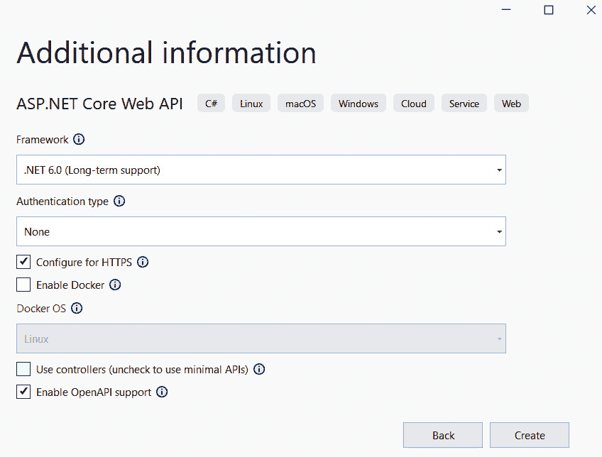

图 3.1 – Visual Studio 模板

通过选择 `Swashbuckle.AspNetCore` 并在 `Program.cs` 文件中自动配置它。

我们展示了在新项目中添加的几行代码。凭借这些少量的信息，Web 应用程序仅启用开发环境，这允许开发者测试 API 而无需生成客户端或使用应用程序外部的工具：

```cs
var builder = WebApplication.CreateBuilder(args);
builder.Services.AddEndpointsApiExplorer();
builder.Services.AddSwaggerGen();
var app = builder.Build();
if (app.Environment.IsDevelopment())
{
    app.UseSwagger();
    app.UseSwaggerUI();
}
```

Swagger 生成的图形部分大大提高了生产力，并允许开发者与那些将与应用程序接口的人共享信息，无论是前端应用程序还是机器应用程序。

注意

我们提醒您，在生产环境中启用 Swagger 是 **强烈不建议** 的，因为敏感信息可能会在网络上或应用程序所在的网络中被公开暴露。

我们已经看到了如何将 Swagger 引入我们的 API 应用程序；此功能使我们能够记录我们的 API，并允许用户生成一个客户端来调用我们的应用程序。让我们看看我们可以快速将应用程序与使用 OpenAPI 描述的 API 接口的方法。

## OpenAPI 生成器

使用 Swagger，尤其是使用 OpenAPI 标准，您可以自动生成连接到 Web 应用程序的客户端。可以为许多语言生成客户端，也可以为开发工具生成。我们知道编写客户端以访问 Web API 是多么繁琐和重复。**Open API Generator** 帮助我们自动化代码生成，检查 Swagger 和 OpenAPI 制作的 API 文档，并自动生成与 API 接口的代码。简单、容易，最重要的是，快速。

`@openapitools/openapi-generator-cli` npm 包是 OpenAPI 生成器的一个非常著名的包包装器，您可以在 [`openapi-generator.tech/`](https://openapi-generator.tech/) 找到它。

使用此工具，您可以生成编程语言的客户端以及负载测试工具，如 **JMeter** 和 **K6**。

您不需要在您的机器上安装此工具，但如果应用程序的 URL 可从机器访问，您可以使用以下命令描述的 Docker 镜像：

```cs
docker run --rm \
    -v ${PWD}:/local openapitools/openapi-generator-cli generate \
    -i /local/petstore.yaml \
    -g go \
    -o /local/out/go
```

该命令允许您生成一个挂载在 Docker 卷上的 `petstore.yaml` 文件。

现在，让我们深入了解如何在 .NET 6 项目和最小 API 中利用 Swagger。

## Swagger 在最小 API 中

在 ASP.NET Web API 中，正如以下代码片段所示，我们看到一个使用 C# 语言注释（`///`）进行文档化的方法。

文档部分被用来为 API 描述添加更多信息。此外，`ProducesResponseType`注解帮助 Swagger 识别客户端必须处理的方法调用结果的可能代码：

```cs
/// <summary>
/// Creates a Contact.
/// </summary>
/// <param name="contact"></param>
/// <returns>A newly created Contact</returns>
/// <response code="201">Returns the newly created contact</response>
/// <response code="400">If the contact is null</response>
[HttpPost]
[ProducesResponseType(StatusCodes.Status201Created)]
[ProducesResponseType(StatusCodes.Status400BadRequest)]
public async Task<IActionResult> Create(Contact contactItem)
{
     _context.Contacts.Add(contactItem);
     await _context.SaveChangesAsync();
     return CreatedAtAction(nameof(Get), new { id = 
     contactItem.Id }, contactItem);
}
```

Swagger 除了对单个方法的注解外，还受到语言文档的指导，为将使用 API 应用程序的人提供更多信息。参数方法的描述总是受到那些必须进行接口的人的欢迎；不幸的是，在最小 API 中无法利用此功能。

让我们按顺序来看，看看如何在一个单独的方法上开始使用 Swagger：

```cs
var builder = WebApplication.CreateBuilder(args);
builder.Services.AddEndpointsApiExplorer();
builder.Services.AddSwaggerGen(c =>
{
    c.SwaggerDoc("v1", new() 
    { 
        Title = builder.Environment.ApplicationName,
        Version = "v1", Contact = new() 
        { Name = "PacktAuthor", Email = "authors@packtpub.com",
          Url = new Uri("https://www.packtpub.com/") },
          Description = "PacktPub Minimal API - Swagger",
          License = new Microsoft.OpenApi.Models.
            OpenApiLicense(),
          TermsOfService = new("https://www.packtpub.com/")
});
});
var app = builder.Build();
if (app.Environment.IsDevelopment())
{
    app.UseSwagger();
    app.UseSwaggerUI();
}
```

通过这个第一个例子，我们已经配置了 Swagger 和一般的 Swagger 信息。我们包括了丰富 Swagger UI 的附加信息。唯一必需的信息是标题，而版本、联系信息、描述、许可和服务条款是可选的。

`UseSwaggerUI()`方法自动配置了 UI 的放置位置以及用 OpenAPI 格式描述 API 的 JSON 文件。

这是图形层面的结果：

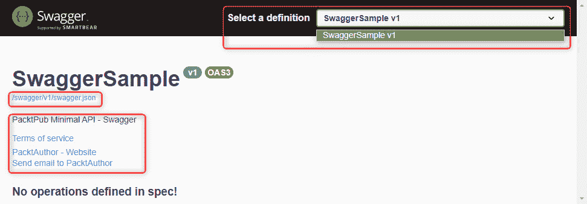

图 3.2 – Swagger UI

我们可以立即看到 OpenAPI 合同信息已经被放置在`/swagger/v1/swagger.json`路径上。

联系信息已填充，但由于我们尚未输入任何操作，因此没有报告任何操作。API 应该有版本控制吗？在右上角，我们可以选择每个版本的可用操作。

我们可以自定义 Swagger 的 URL 并在新的路径上插入文档；重要的是要重新定义`SwaggerEndpoint`，如下所示：

```cs
app.UseSwaggerUI(c => c.SwaggerEndpoint("/swagger/v1/swagger.json", $"{builder.Environment.ApplicationName} v1"));
```

现在我们继续添加描述业务逻辑的端点。

定义`RouteHandlerBuilder`非常重要，因为它允许我们描述我们在代码中编写的端点的所有属性。

Swagger 的 UI 必须尽可能丰富；我们必须尽可能详细地描述最小 API 允许我们指定的内容。不幸的是，并非所有功能都可用，就像在 ASP.NET Web API 中一样。

### 最小 API 中的版本控制

在最小 API 中，**版本控制**不是由框架功能处理的；因此，甚至 Swagger 也无法处理 UI 端的 API 版本控制。所以，我们观察到当我们进入*图 3.2*中显示的**选择定义**部分时，只能看到 API 当前版本的条目。

### Swagger 功能

我们刚刚意识到 Swagger 中并非所有功能都可用；现在让我们探索一下可用的功能。为了描述端点的可能输出值，我们可以调用在处理程序之后可以调用的函数，例如`Produces`或`WithTags`函数，我们现在将要探讨这些函数。

`Produces` 函数用客户端应该能够管理的所有可能响应装饰端点。我们可以添加操作 ID 的名称；此信息不会出现在 Swagger 屏幕上，但它将是客户端创建调用端点的方法的名称。`OperationId` 是处理程序提供的操作的唯一名称。

要将端点从 API 描述中排除，需要调用 `ExcludeFromDescription()`。此函数很少使用，但在您不想向开发前端程序员的程序员暴露特定端点时，它非常有用。

最后，我们可以添加和标记各种端点，并将它们分段以更好地进行客户端管理：

```cs
app.MapGet("/sampleresponse", () =>
    {
        return Results.Ok(new ResponseData("My Response"));
    })
    .Produces<ResponseData>(StatusCodes.Status200OK)
    .WithTags("Sample")
    .WithName("SampleResponseOperation"); // operation ids to 
                                             Open API
app.MapGet("/sampleresponseskipped", () =>
{
    return Results.Ok(new ResponseData("My Response Skipped"));
})
    .ExcludeFromDescription();
app.MapGet("/{id}", (int id) => Results.Ok(id));
app.MapPost("/", (ResponseData data) => Results.Ok(data))
   .Accepts<ResponseData>(MediaTypeNames.Application.Json);
```

这是 Swagger 的图形结果；正如我之前所预料的，标签和操作 ID 不会被 Web 客户端显示：

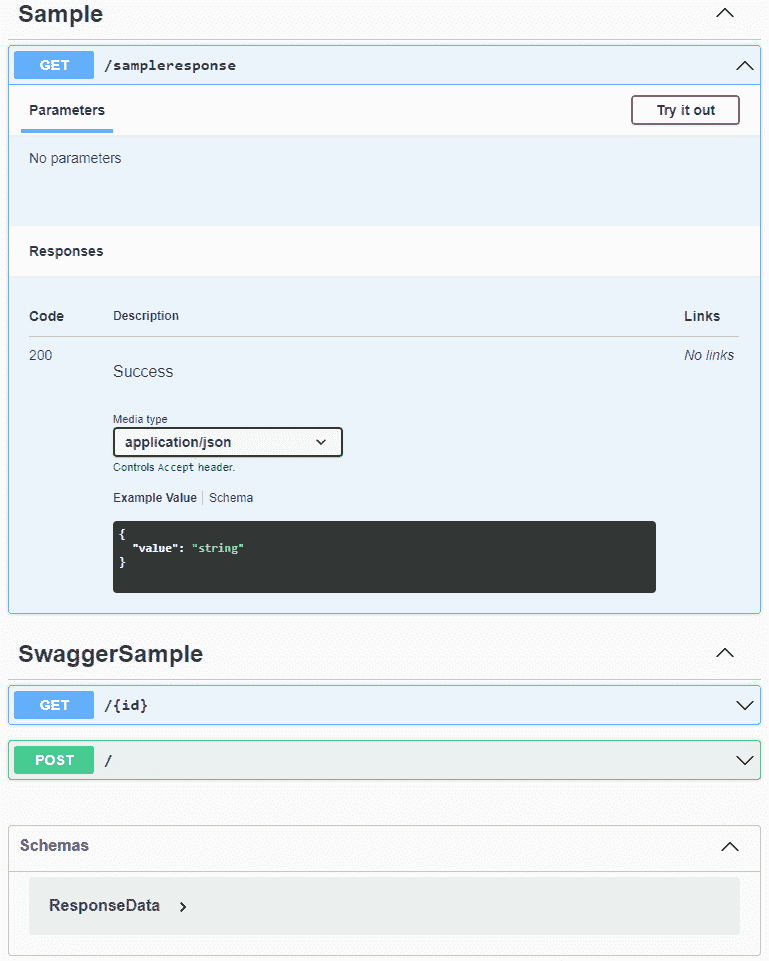

图 3.3 – Swagger UI 方法

另一方面，端点描述非常有用，可以包含在内。它非常容易实现：只需在方法中插入 C# 注释（只需在方法中插入三个斜杠，`///`）。Minimal APIs 没有我们习惯于在基于 Web 的控制器中的方法，因此它们不是原生支持的。

Swagger 不仅仅是我们所习惯看到的 GUI。首先，Swagger 是支持 OpenAPI 规范的 JSON 文件，其中最新版本是 3.1.0。

在下面的代码片段中，我们展示了包含我们插入 API 的第一个端点描述的章节。我们可以推断出标签和操作 ID；这些信息将由与 API 接口的人使用：

```cs
"paths": {
         "/sampleresponse": {
              "get": {
                   "tags": [
                        "Sample"
                   ],
                   "operationId": "SampleResponseOperation",
                   "responses": {
                        "200": {
                             "description": "Success",
                             "content": {
                                  "application/json": {
                                       "schema": {
                                            "$ref": "#/components/schemas/ResponseData"
                                       }
                                  }
                             }
                        }
                   }
              }
         },
```

在本节中，我们看到了如何配置 Swagger 以及目前尚未支持的内容。

在接下来的章节中，我们将看到如何配置 OpenAPI，包括 OpenID Connect 标准和通过 API 密钥进行认证。

在前面的 Swagger UI 代码片段中，Swagger 使涉及的对象的规范图可用，无论是输入到各个端点还是从它们输出。

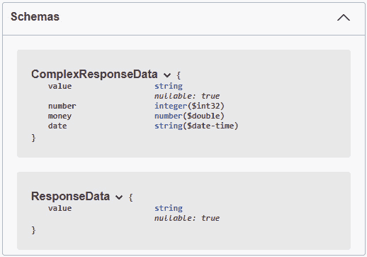

图 3.4 – 输入和输出数据规范

我们将学习如何处理这些对象，以及如何在 *第六章* *探索验证和映射* 中验证和定义它们。

### Swagger OperationFilter

操作过滤器允许您向 Swagger 显示的所有操作添加行为。在下面的示例中，我们将向您展示如何通过 `OperationId` 过滤器向特定调用添加 HTTP 头。

当您定义操作过滤器时，您还可以根据路由、标签和操作 ID 设置过滤器：

```cs
public class CorrelationIdOperationFilter : IOperationFilter
{
    private readonly IWebHostEnvironment environment;
    public CorrelationIdOperationFilter(IWebHostEnvironment 
    environment)
    {
        this.environment = environment;
    }
    /// <summary>
    /// Apply header in parameter Swagger.
    /// We add default value in parameter for developer 
        environment
    /// </summary>
    /// <param name="operation"></param>
    /// <param name="context"></param>
    public void Apply(OpenApiOperation operation, 
    OperationFilterContext context)
    {
        if (operation.Parameters == null)
        {
            operation.Parameters = new 
            List<OpenApiParameter>();
        }
        if (operation.OperationId == 
            "SampleResponseOperation")
        {
             operation.Parameters.Add(new OpenApiParameter
             {
                 Name = "x-correlation-id",
                 In = ParameterLocation.Header,
                 Required = false,
                 Schema = new OpenApiSchema { Type = 
                 "String", Default = new OpenApiString("42") }
             });
        }
         }
}
```

要定义一个操作过滤器，必须实现 `IOperationFilter` 接口。

在构造函数中，您可以定义所有之前已在依赖注入引擎中注册的接口或对象。

然后，过滤器由一个名为`Apply`的单个方法组成，它提供了两个对象：

+   `OpenApiOperation`：一个可以添加参数或检查当前调用操作 ID 的操作

+   `OperationFilterContext`：允许你读取`ApiDescription`的过滤器上下文，在那里你可以找到当前端点的 URL

最后，为了在 Swagger 中启用操作过滤器，我们需要在`SwaggerGen`方法内部注册它。

在这个方法中，我们应该添加过滤器，如下所示：

```cs
builder.Services.AddSwaggerGen(c =>
{
         … removed for brevity
         c.OperationFilter<CorrelationIdOperationFilter>();
});
```

这里是 UI 级别的结果；在端点和特定操作 ID 的情况下，我们会有一个新的强制头，默认参数在开发中不需要插入：

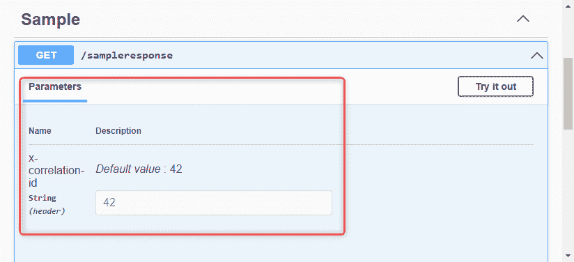

图 3.5 – API 密钥部分

当我们需要设置 API 密钥但又不想在每次调用中都插入它时，这个案例研究对我们帮助很大。

生产环境中的操作过滤器

由于 Swagger 不应该在生产环境中启用，因此过滤器及其默认值不会创建应用程序安全问题。

我们建议你在生产环境中禁用 Swagger。

在本节中，我们了解了如何启用一个描述 API 并允许我们测试它的 UI 工具。在下一节中，我们将看到如何通过 CORS 启用**单页应用程序**（**SPAs**）和后端之间的调用。

# 启用 CORS

CORS 是一种安全机制，如果 HTTP/S 请求来自与应用程序托管域不同的域，则会阻止请求。更多信息可以在 Microsoft 文档或 Mozilla 开发者网站上找到。

浏览器阻止网页向除提供该网页的域以外的域发送请求。一个网页、SPA 或服务器端网页可以向托管在不同源的不同后端 API 发送 HTTP 请求。

这种限制被称为**同源策略**。同源策略阻止恶意网站从另一个网站读取数据。浏览器不会阻止 HTTP 请求，但会阻止响应数据。

因此，我们理解，与安全相关的 CORS 资格必须谨慎评估。

最常见的场景是，在发布于与托管最小 API 的 Web 服务器不同地址的 Web 服务器上发布的 SPAs：

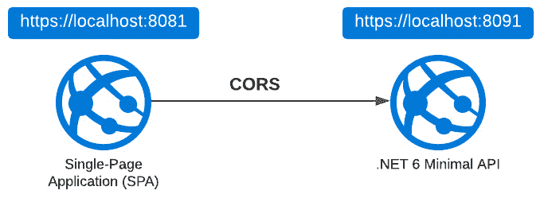

图 3.6 – SPA 和最小 API

类似的场景是微服务，它们需要相互通信。每个微服务将驻留在特定的 Web 地址上，这个地址将与其他的不同。

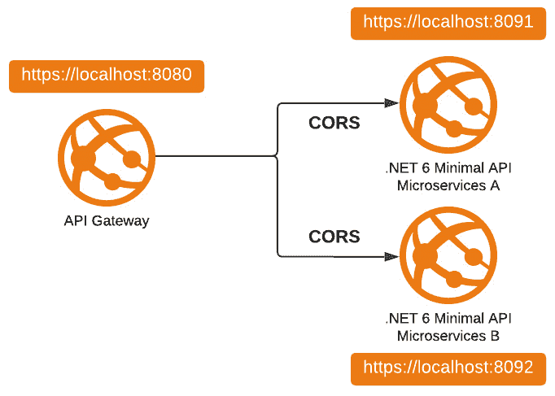

图 3.7 – 微服务和最小 API

因此，在这些所有情况下，都会遇到 CORS 问题。

我们现在理解了 CORS 请求可能发生的情况。现在让我们看看正确的 HTTP 请求流程以及浏览器如何处理请求。

## 从 HTTP 请求到 CORS 流程

当调用离开浏览器，前往除前端托管地址之外的其他地址时会发生什么？

HTTP 调用被执行，并且一直传递到后端代码，后端代码执行正确。

带有正确数据的响应被浏览器阻止。这就是为什么当我们使用 Postman、Fiddler 或任何 HTTP 客户端执行调用时，响应能够正确地到达我们。

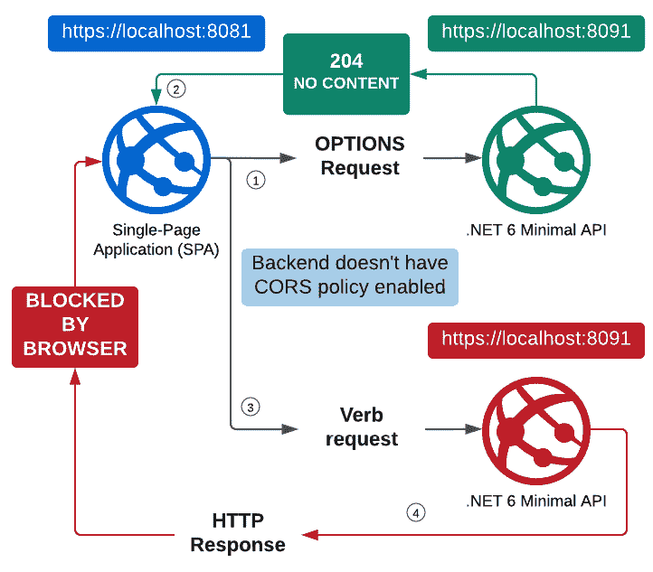

图 3.8 – CORS 流程

在下面的图中，我们可以看到浏览器使用`OPTIONS`方法发出第一次调用，后端正确地以`204`状态码响应：

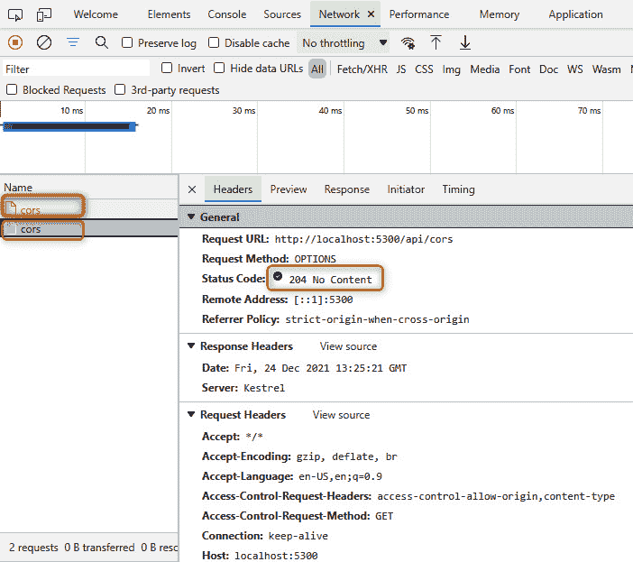

图 3.9 – CORS 调用的第一次请求（204 无内容结果）

在浏览器发出的第二次调用中，发生了一个错误；在**Referrer Policy**中显示了`strict-origin-when-cross-origin`的值，这表明浏览器拒绝接受来自后端的数据：

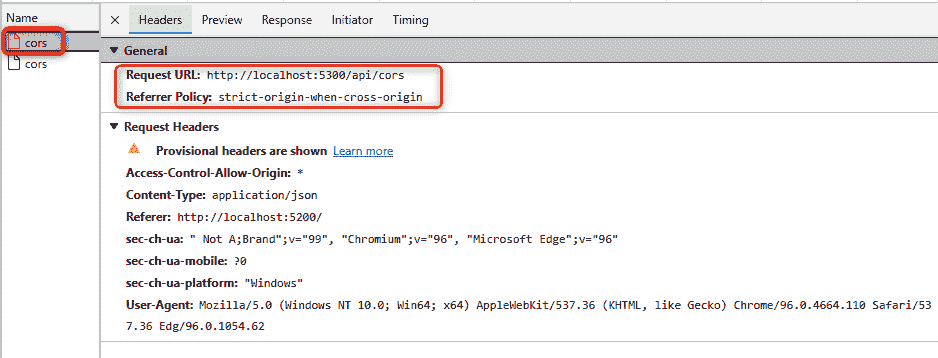

图 3.10 – CORS 调用的第二次请求（被浏览器阻止）

当 CORS 启用时，在`OPTIONS`方法调用的响应中，插入三个具有后端愿意遵守的特征的头：

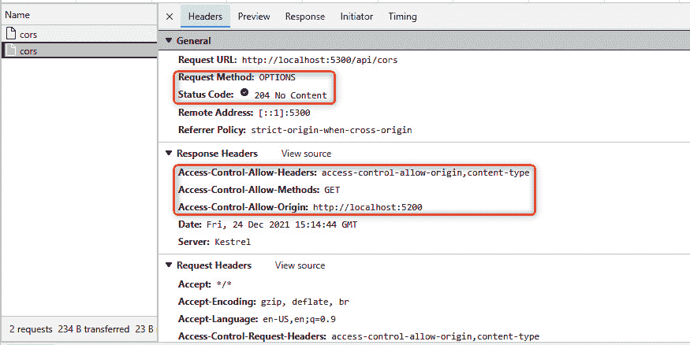

图 3.11 – CORS 调用的请求（已启用 CORS）

在这种情况下，我们可以看到添加了三个头，定义了`Access-Control-Allow-Headers`、`Access-Control-Allow-Methods`和`Access-Control-Allow-Origin`。

拥有这些信息的浏览器可以接受或阻止对这一 API 的响应。

## 使用策略设置 CORS

在.NET 6 应用程序中，有许多配置可以激活 CORS。我们可以定义授权策略，其中可以配置四个可用的设置。CORS 也可以通过添加扩展方法或注解来激活。

但让我们按顺序进行。

`CorsPolicyBuilder`类允许我们定义在 CORS 接受策略中允许或不允许的内容。

因此，我们有设置不同方法的可能性，例如：

+   `AllowAnyHeader`

+   `AllowAnyMethod`

+   `AllowAnyOrigin`

+   `AllowCredentials`

虽然前三种方法都是描述性的，允许我们分别启用与 HTTP 调用头、方法和源相关的任何设置，但`AllowCredentials`允许我们包含带有认证凭据的 cookie。

CORS 策略建议

我们建议您不要使用`AllowAny`方法，而是过滤出必要的信息以提供更高的安全性。作为最佳实践，在启用 CORS 时，我们建议使用这些方法：

+   `WithExposedHeaders`

+   `WithHeaders`

+   `WithOrigins`

为了模拟 CORS 的场景，我们创建了一个简单的前端应用程序，有三个不同的按钮。每个按钮允许你测试最小 API 中 CORS 的可能配置之一。我们将在几行中解释这些配置。

要启用 CORS 场景，我们创建了一个单页应用程序，它可以在内存中的 Web 服务器上启动。我们使用了 `LiveReloadServer` 工具，这是一个可以使用 .NET CLI 安装的工具。我们在本章开头提到了它，现在是我们使用它的时候了。

安装后，你需要使用以下命令启动 SPA：

```cs
livereloadserver "{BasePath}\Chapter03\2-CorsSample\Frontend"
```

在这里，`BasePath` 是你将要下载 GitHub 上可用的示例的文件夹。

然后你必须启动应用程序的后端，无论是通过 Visual Studio 还是 Visual Studio Code，或者通过以下命令使用 .NET CLI：

```cs
dotnet run .\Backend\CorsSample.csproj
```

我们已经找到了如何启动一个突出 CORS 问题的示例；现在我们需要配置服务器以接受请求并通知浏览器它知道请求来自不同的源。

接下来，我们将讨论策略配置。我们将了解默认策略的特点以及如何创建一个自定义策略。

### 配置默认策略

要配置单个启用 CORS 的策略，需要在 `Program.cs` 文件中定义行为并添加所需的配置。让我们实现一个策略并将其定义为 `Default`。

然后，为了使整个应用程序启用该策略，只需在定义处理程序之前添加 `app.UseCors();`：

```cs
var builder = WebApplication.CreateBuilder(args);
var corsPolicy = new CorsPolicyBuilder("http://localhost:5200")
    .AllowAnyHeader()
    .AllowAnyMethod()
    .Build();
builder.Services.AddCors(c => c.AddDefaultPolicy(corsPolicy));
var app = builder.Build();
app.UseCors();
app.MapGet("/api/cors", () =>
{
         return Results.Ok(new { CorsResultJson = true });
});
app.Run();
```

### 配置自定义策略

我们可以在应用程序中创建多个策略；每个策略可能有它自己的配置，每个策略可能关联一个或多个端点。

在微服务的情况下，拥有几个策略有助于精确地分割来自不同源的对访问。

为了配置一个新的策略，必须添加它并给它一个名称；这个名称将赋予策略访问权限，并允许它与端点关联。

如前例所示，自定义策略被分配给整个应用程序：

```cs
var builder = WebApplication.CreateBuilder(args);
var corsPolicy = new CorsPolicyBuilder("http://localhost:5200")
    .AllowAnyHeader()
    .AllowAnyMethod()
    .Build();
builder.Services.AddCors(options => options.AddPolicy("MyCustomPolicy", corsPolicy));
var app = builder.Build();
app.UseCors("MyCustomPolicy");
app.MapGet("/api/cors", () =>
{
    return Results.Ok(new { CorsResultJson = true });
});
app.Run();
```

接下来，我们将探讨如何将单个策略应用于特定的端点；为此，有两种方法。第一种是通过 `IEndpointConventionBuilder` 接口的扩展方法。第二种方法是在方法中添加 `EnableCors` 注解，后跟要启用的策略名称。

## 使用扩展设置 CORS

必须使用 `RequireCors` 方法后跟策略的名称。

使用这种方法，然后可以为一个端点启用一个或多个策略：

```cs
app.MapGet("/api/cors/extension", () =>
{
    return Results.Ok(new { CorsResultJson = true });
})
.RequireCors("MyCustomPolicy");
```

## 使用注解设置 CORS

第二种方法是添加 `EnableCors` 注解，后跟要为该方法启用的策略名称：

```cs
app.MapGet("/api/cors/annotation", [EnableCors("MyCustomPolicy")] () =>
{
   return Results.Ok(new { CorsResultJson = true });
});
```

关于控制器编程，很快就会很明显，无法将策略应用于特定控制器的所有方法。也无法将控制器分组并启用策略。因此，有必要将单个策略应用于方法或整个应用程序。

在本节中，我们了解到如何为托管在不同域上的应用程序配置浏览器保护。

在下一节中，我们将开始配置我们的应用程序。

# 与全局 API 设置一起工作

我们刚刚定义了如何在 ASP.NET 应用程序中使用`options`模式加载数据。在本节中，我们想要描述如何配置应用程序并利用上一节中看到的一切。

随着从`Web.config`文件到`appsettings.json`文件的诞生。配置也可以从其他来源读取，例如其他文件格式，如旧的`.ini`文件或位置文件。

在最小 API 中，`options`模式功能保持不变，但在接下来的几段中，我们将看到如何重用接口或`appsettings.json`文件结构。

## .NET 6 中的配置

.NET 提供的对象是`IConfiguration`，它允许我们读取`appsettings`文件中的某些特定配置。

但是，如前所述，此接口的功能远不止访问文件进行读取。

以下是从官方文档中摘录的内容，有助于我们了解接口是如何成为通用的访问点，使我们能够访问各种服务中插入的数据：

ASP.NET Core 中的配置是通过一个或多个配置提供程序来执行的。配置提供程序使用各种配置来源从键值对中读取配置数据。

以下是一个配置来源列表：

+   设置文件，如`appsettings.json`

+   环境变量

+   Azure Key Vault

+   Azure App Configuration

+   命令行参数

+   自定义提供程序，已安装或创建

+   目录文件

+   内存中的.NET 对象

([`docs.microsoft.com/aspnet/core/fundamentals/configuration/`](https://docs.microsoft.com/aspnet/core/fundamentals/configuration/))

我们将在下一章中看到的`IConfiguration`和`IOptions`接口旨在从各种提供程序中读取数据。这些接口不适合在程序运行时读取和编辑配置文件。

`IConfiguration`接口通过`builder`对象，`builder.Configuration`提供，它提供了读取值、对象或连接字符串所需的所有方法。

在查看我们将用于配置应用程序的最重要接口之一后，我们希望定义良好的开发实践，并使用任何开发者都应具备的基本构建块：即类。将配置复制到类中将使我们能够在代码的任何地方更好地享受内容。

我们定义包含属性的类和对应于`appsettings`文件的类：

配置类

```cs
public class MyCustomObject
{
    public string? CustomProperty { get; init; }
}
public class MyCustomStartupObject
{
    public string? CustomProperty { get; init; }
}
```

在这里，我们重新引入我们刚才看到的 C#类的相应 JSON：

appsettings.json 定义

```cs
{
    "MyCustomObject": {
         "CustomProperty": "PropertyValue"
    },
    "MyCustomStartupObject": {
         "CustomProperty": "PropertyValue"
    },
    "ConnectionStrings": {
         "Default": "MyConnectionstringValueInAppsettings"
    }
}
```

接下来，我们将执行几个操作。

我们执行的第一个操作是创建一个`startupConfig`对象的实例，该实例将是`MyCustomStartupObject`类型。为了填充此对象的实例，通过`IConfiguration`，我们将从名为`MyCustomStartupObject`的部分读取数据：

```cs
var startupConfig = builder.Configuration.GetSection(nameof(MyCustomStartupObject)).Get<MyCustomStartupObject>();
```

新创建的对象可以用于最小 API 的各种处理器中。

相反，在这个第二个操作中，我们使用依赖注入引擎来请求`IConfiguration`对象的实例：

```cs
app.MapGet("/read/configurations", (IConfiguration configuration) =>
{
    var customObject = configuration.
    GetSection(nameof(MyCustomObject)).Get<MyCustomObject>();
```

使用`IConfiguration`对象，我们将以类似上述操作的方式检索数据。我们选择`GetSection(nameof(MyCustomObject))`部分，并使用`Get<T>()`方法输入对象。

最后，在这最后两个例子中，我们读取一个位于`appsettings`文件根级别的单个键：

```cs
MyCustomValue = configuration.GetValue<string>("MyCustomValue"),
ConnectionString = configuration.GetConnectionString("Default"),
```

`configuration.GetValue<T>("JsonRootKey")`方法提取键的值并将其转换为对象；此方法用于从根级属性读取字符串或数字。

在下一行中，我们可以看到如何利用`IConfiguration`方法读取`ConnectionString`。

在`appsettings`文件中，*连接字符串*放置在特定的`ConnectionStrings`部分中，允许你命名字符串并读取它。可以在该部分放置多个连接字符串，以便在不同的对象中利用它。

在 Azure App Service 的配置提供程序中，连接字符串应以一个前缀输入，该前缀也指示你试图使用的 SQL 提供程序，如以下链接中所述：[`docs.microsoft.com/azure/app-service/configure-common#configure-connection-strings`](https://docs.microsoft.com/azure/app-service/configure-common#configure-connection-strings)。

在运行时，连接字符串作为以下连接类型的前缀的环境变量可用：

+   SQLServer: `SQLCONNSTR_`

+   MySQL: `MYSQLCONNSTR_`

+   SQLAzure: `SQLAZURECONNSTR_`

+   Custom: `CUSTOMCONNSTR_`

+   PostgreSQL: `POSTGRESQLCONNSTR_`

为了完整性，我们将重新引入上述描述的整个代码，以便更好地了解如何在代码中利用`IConfiguration`对象：

```cs
var builder = WebApplication.CreateBuilder(args);
var startupConfig = builder.Configuration.GetSection(nameof(MyCustomStartupObject)).Get<MyCustomStartupObject>();
app.MapGet("/read/configurations", (IConfiguration configuration) =>
{
    var customObject = configuration.GetSection
    (nameof(MyCustomObject)).Get<MyCustomObject>();
    return Results.Ok(new
    {
        MyCustomValue = configuration.GetValue
        <string>("MyCustomValue"),
         ConnectionString = configuration.
         GetConnectionString("Default"),
         CustomObject = customObject,
         StartupObject = startupConfig
    });
})
.WithName("ReadConfigurations");
```

我们已经看到了如何利用包含连接字符串的`appsettings`文件，但很多时候，我们为每个环境有许多不同的文件。让我们看看如何为每个环境利用一个文件。

### appsettings 文件中的优先级

`appsettings`文件可以根据应用程序所在的环境进行管理。在这种情况下，实践是将该环境的密钥信息放置在`appsettings.{ENVIRONMENT}.json`文件中。

根文件（即`appsettings.json`）应仅用于生产环境。

例如，如果我们在这两个文件中为`“Priority”`键创建了这些示例，我们会得到什么？

appsettings.json

```cs
"Priority": "Root"
```

appsettings.Development.json

```cs
"Priority":    "Dev"
```

如果是*开发*环境，键的值将导致`Dev`，而在*生产*环境中，值将导致`Root`。

如果环境不是*生产*或*开发*，会发生什么？例如，如果它被称作*阶段*？在这种情况下，由于没有指定任何`appsettings.Stage.json`文件，读取的值将是`appsettings.json`文件中的一个，因此，`Root`。

然而，如果我们指定了`appsettings.Stage.json`文件，值将从该文件中读取。

接下来，让我们看看`选项`模式。框架提供了一些对象，用于在启动时或系统部门进行更改时加载配置信息。让我们来看看如何操作。

## 选项模式

`选项`模式使用类来提供对相关设置组的强类型访问，即当配置设置通过场景隔离到不同的类中时。

`选项`模式将以不同的接口和不同的功能来实现。每个接口（见以下小节）都有其自身的功能，帮助我们实现某些目标。

但让我们按顺序开始。我们为每种类型的接口定义一个对象（我们将这样做以更好地表示示例），但同一个类可以用于在配置文件中注册更多选项。保持文件结构相同是很重要的：

```cs
public class OptionBasic
{
    public string? Value { get; init; }
}
    public class OptionSnapshot
    {
        public string? Value { get; init; }
    }
    public class OptionMonitor
    {
        public string? Value { get; init; }
    }
    public class OptionCustomName
    {
        public string? Value { get; init; }
    }
```

每个选项都通过`Configure`方法在依赖注入引擎中注册，该方法还要求注册方法签名中存在的`T`类型。如您所见，在注册阶段，我们声明了类型和文件中的部分，以及更多：

```cs
builder.Services.Configure<OptionBasic>(builder.Configuration.GetSection("OptionBasic"));
builder.Services.Configure<OptionMonitor>(builder.Configuration.GetSection("OptionMonitor"));
builder.Services.Configure<OptionSnapshot>(builder.Configuration.GetSection("OptionSnapshot"));
builder.Services.Configure<OptionCustomName>("CustomName1", builder.Configuration.GetSection("CustomName1"));
builder.Services.Configure<OptionCustomName>("CustomName2", builder.Configuration.GetSection("CustomName2"));
```

我们尚未定义如何读取对象，多久读取一次，以及使用哪种类型的接口。

唯一改变的是参数，如前代码片段的最后两个示例所示。此参数允许您为选项类型添加一个名称。该名称必须与方法签名中使用的类型匹配。此功能称为**命名选项**。

### 不同的选项接口

不同的接口可以利用您刚刚定义的录制。一些支持命名选项，而另一些则不支持：

+   `IOptions<TOptions>`:

    +   不支持以下：

        +   在应用程序启动后读取配置数据

        +   命名选项

    +   注册为单例，可以注入到任何服务生命周期中

+   `IOptionsSnapshot<TOptions>`:

    +   在需要为每个请求重新计算选项的场景中很有用

    +   注册为**作用域**，因此不能注入到单例服务中

    +   支持命名选项

+   `IOptionsMonitor<TOptions>`:

    +   用于检索`TOptions`实例的选项和管理选项通知

    +   作为单例注册，并且可以被注入到任何服务生命周期中

    +   支持以下内容：

        +   变更通知

        +   命名选项

        +   可重载的配置

        +   选择性选项无效化（`IOptionsMonitorCache<TOptions>`）

我们想要指出`IOptionsFactory<TOptions>`的使用，它负责创建选项的新实例。它有一个单一的`Create`方法。默认实现首先执行所有注册的`IConfigureOptions<TOptions>`和`IPostConfigureOptions<TOptions>`配置，然后是后配置（[`docs.microsoft.com/aspnet/core/fundamentals/configuration/options#options-interfaces`](https://docs.microsoft.com/aspnet/core/fundamentals/configuration/options#options-interfaces)）。

`Configure`方法后面还可以跟配置管道中的另一个方法。这个方法被称为`PostConfigure`，它的目的是在每次配置或重新读取配置时修改配置。以下是如何记录此行为的示例：

```cs
builder.Services.PostConfigure<MyConfigOptions>(myOptions =>
{
   myOptions.Key1 = "my_new_value_post_configuration";
});
```

### 将所有内容整合在一起

在定义了这些众多接口的理论之后，我们还需要通过一个具体的例子来看看`IOptions`是如何工作的。

让我们看看前面描述的三个接口的使用，以及`IOptionsFactory`的使用，它通过`Create`方法和命名选项功能检索对象的正确实例：

```cs
app.MapGet("/read/options", (IOptions<OptionBasic> optionsBasic,
         IOptionsMonitor<OptionMonitor> optionsMonitor,
         IOptionsSnapshot<OptionSnapshot> optionsSnapshot,
         IOptionsFactory<OptionCustomName> optionsFactory) =>
{
         return Results.Ok(new
         {
             Basic = optionsBasic.Value,
             Monitor = optionsMonitor.CurrentValue,
             Snapshot = optionsSnapshot.Value,
             Custom1 = optionsFactory.Create("CustomName1"),
             Custom2 = optionsFactory.Create("CustomName2")
         });
})
.WithName("ReadOptions");
```

在前面的代码片段中，我们想要引起大家对可用不同接口使用的注意。

在前面的代码片段中使用的每个单独的接口都有其特定的生命周期，这决定了其行为。最后，每个接口在方法上都有细微的差异，正如我们在前面的段落中已经描述的那样。

### IOptions 和验证

最后但同样重要的是配置中存在的验证功能。当必须发布应用程序的团队仍然执行需要至少通过代码验证的手动或精细操作时，这非常有用。

在.NET Core 出现之前，应用程序经常因为配置错误而无法启动。现在，有了这个功能，我们可以验证配置中的数据并抛出错误。

这里有一个例子：

注册具有验证的选项

```cs
builder.Services.AddOptions<ConfigWithValidation>().Bind(builder.Configuration.GetSection(nameof(ConfigWithValidation)))
.ValidateDataAnnotations();
app.MapGet("/read/options", (IOptions<ConfigWithValidation> optionsValidation) =>
{
    return Results.Ok(new
    {
        Validation = optionsValidation.Value
    });
})
.WithName("ReadOptions");
```

这是报告错误的配置文件：

配置验证的应用设置部分

```cs
"ConfigWithValidation": {
         "Email": "andrea.tosato@hotmail.it",
         "NumericRange": 1001
    }
```

下面是这个包含验证逻辑的类的示例：

```cs
public class ConfigWithValidation
{
    [RegularExpression(@"^([\w\.\-]+)@([\w\-]+)((\.(\w)
                      {2,})+)$")]
    public string? Email { get; set; }
    [Range(0, 1000, ErrorMessage = "Value for {0} must be 
                                    between {1} and {2}.")]
    public int NumericRange { get; set; }
}
```

应用程序在使用特定配置时遇到错误，而不是在启动时。这也是因为我们之前看到，`IOptions`可以在`appsettings`更改后重新加载信息：

错误验证选项

```cs
Microsoft.Extensions.Options.OptionsValidationException: DataAnnotation validation failed for 'ConfigWithValidation' members: 'NumericRange' with the error: 'Value for NumericRange must be between 0 and 1000.'.
```

在 IOptions 中使用验证的最佳实践

这个设置并不适合所有应用程序场景。只有一些选项可以进行正式验证；如果我们考虑连接字符串，它可能并不一定是形式上不正确的，但连接可能无法工作。

在应用此功能时要谨慎，特别是因为它在运行时而不是在启动时报告错误，并给出内部服务器错误，这在应该处理的场景中不是最佳实践。

到目前为止我们所看到的一切都是关于配置`appsettings.json`文件，但如果我们想使用其他源进行配置管理怎么办？我们将在下一节中探讨这个问题。

## 配置源

如本节开头所述，`IConfiguration`接口和所有`IOptions`变体不仅与`appsettings`文件一起工作，而且与不同的源一起工作。

每个源都有其自身的特性，并且在不同提供者之间访问对象的语法非常相似。主要问题在于我们必须定义一个复杂对象或对象数组时；在这种情况下，我们将看到如何表现并能够复制 JSON 文件的动态结构。

让我们看看两个非常常见的用例。

### 在 Azure App Service 中配置应用程序

让我们从 Azure 开始，特别是 Azure Web Apps 服务。

在**配置**页面，有两个部分：**应用程序设置**和**连接字符串**。

在第一部分，我们需要插入之前示例中看到的键和值或 JSON 对象。

在`appsettings.json`文件中。在本节中，除了文本字符串外，还需要设置连接类型，正如我们在*配置.NET 6*部分中看到的。

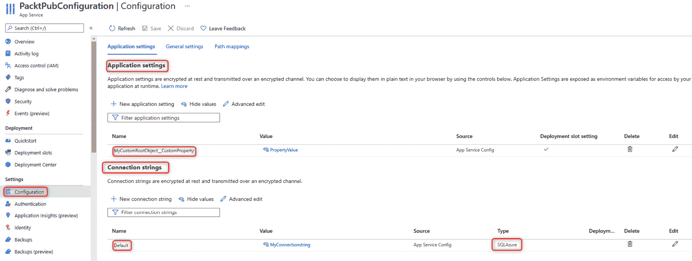

图 3.12 – Azure App Service 应用程序设置

### 插入对象

要插入一个对象，我们必须为每个键指定父对象。

格式如下：

`parent__key`

注意，这里有*两个*下划线。

JSON 文件中的对象定义如下：

```cs
"MyCustomObject": {
         "CustomProperty": "PropertyValue"
    }
```

因此，我们应该编写`MyCustomObject__CustomProperty`。

### 插入数组

插入数组要冗长得多。

格式如下：

`parent__child__ArrayIndexNumber_key`

JSON 文件中的数组定义如下：

```cs
{
    "MyCustomArray": {
       "CustomPropertyArray": [
         { "CustomKey": "ValueOne" },
         { "CustomKey ": "ValueTwo" }
     ]
    }
}
```

因此，要访问`ValueOne`值，我们应该编写以下内容：`MyCustomArray__CustomPropertyArray__0__CustomKey`。

### 在 Docker 中配置应用程序

如果我们正在为容器和 Docker 开发，`appsettings`文件通常在`docker-compose`文件中替换，并且在`override`文件中非常常见，因为它与环境分隔的设置文件行为类似。

我们希望提供一个关于通常用于配置托管在 Docker 中的应用程序的功能的简要概述。让我们详细了解如何定义根键和对象，以及如何设置连接字符串。以下是一个示例：

```cs
app.MapGet("/env-test", (IConfiguration configuration) =>
{
    var rootProperty = configuration.
    GetValue<string>("RootProperty");
    var sampleVariable = configuration.
    GetValue<string>("RootSettings:SampleVariable");
    var connectionString = configuration.
    GetConnectionString("SqlConnection");
    return Results.Ok(new
    {
        RootProperty = rootProperty,
        SampleVariable = sampleVariable,
        Connection String = connectionString
    });
})
.WithName("EnvironmentTest");
```

使用配置的最小 API

`docker-compose.override.yaml`文件如下：

```cs
services:
    dockerenvironment:
         environment:
              - ASPNETCORE_ENVIRONMENT=Development
              - ASPNETCORE_URLS=https://+:443;http://+:80
              - RootProperty=minimalapi-root-value
              - RootSettings__SampleVariable=minimalapi-variable-value
              - ConnectionStrings__SqlConnection=Server=minimal.db;Database=minimal_db;User Id=sa;Password=Taggia42!
```

本例中只有一个应用程序容器，实例化它的服务称为`dockerenvironment`。

在配置部分，我们可以看到三个我们将逐行分析的特定之处。

我们想要展示的代码片段有几个非常有趣的部分：配置根中的一个属性、由单个属性组成的对象以及数据库的连接字符串。

在这个第一个配置中，你需要设置一个作为配置根的属性。在这种情况下，它是一个简单的字符串：

```cs
# First configuration
- RootProperty=minimalapi-root-value
```

在这个第二个配置中，我们将设置一个对象：

```cs
# Second configuration
- RootSettings__SampleVariable=minimalapi-variable-value
```

该对象被命名为 `RootSettings`，而它所包含的唯一属性被命名为 `SampleVariable`。这个对象可以通过不同的方式读取。我们建议使用我们之前广泛使用过的 `Ioptions` 对象。在先前的示例中，我们展示了如何通过代码访问对象中存在的单个属性。

在这种情况下，通过代码，你需要使用以下记法来访问值：`RootSettings:SampleVariable`。这种方法在需要读取单个属性时很有用，但我们建议使用 `Ioptions` 接口来访问对象。

在这个最后的示例中，我们向您展示如何设置名为 `SqlConnection` 的连接字符串。这样，将很容易从 `Iconfiguration` 上可用的基方法中检索信息：

```cs
# Third configuration
- ConnectionStrings__SqlConnection=Server=minimal.db;Database=minimal_db;User Id=sa;Password=Taggia42!
```

要读取信息，必须利用此方法：`GetConnectionString("SqlConnection")`。

配置我们的应用程序有很多场景；在下一节中，我们还将看到如何处理错误。

# 错误处理

错误处理是每个应用程序必须提供的功能之一。错误的表示允许客户端理解错误，并可能相应地处理请求。非常常见的是，我们有自己的自定义错误处理方法。

由于我们描述的是应用程序的关键功能，我们认为查看框架提供的内容以及更正确的使用方式是公平的。

## 传统方法

.NET 为最小 API 提供了与我们在传统开发中可以实现的相同工具：**开发者异常页面**。这只是一个以纯文本格式报告错误的中间件。这个中间件不能从 ASP.NET 管道中移除，并且仅在开发环境中工作 ([`docs.microsoft.com/aspnet/core/fundamentals/error-handling`](https://docs.microsoft.com/aspnet/core/fundamentals/error-handling))。

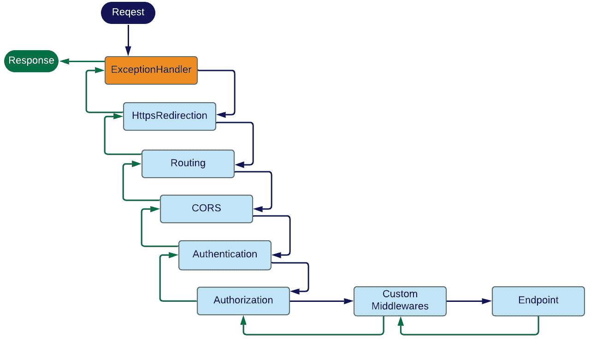

图 3.13 – 最小 API 管道，ExceptionHandler

如果我们的代码中抛出了异常，在应用层中捕获它们的唯一方法是通过在向客户端发送响应之前激活的中间件。

错误处理中间件是标准的，可以按照以下方式实现：

```cs
app.UseExceptionHandler(exceptionHandlerApp =>
{
    exceptionHandlerApp.Run(async context =>
    {
        context.Response.StatusCode = StatusCodes.
        Status500InternalServerError;
        context.Response.ContentType = Application.Json;
        var exceptionHandlerPathFeature = context.Features.
          Get<IExceptionHandlerPathFeature>()!;
        var errorMessage = new
        {
            Message = exceptionHandlerPathFeature.Error.Message
        };
        await context.Response.WriteAsync
        (JsonSerializer.Serialize(errorMessage));
         if (exceptionHandlerPathFeature?.
             Error is FileNotFoundException)
         {
             await context.Response.
             WriteAsync(" The file was not found.");
         }
         if (exceptionHandlerPathFeature?.Path == "/")
         {
             await context.Response.WriteAsync("Page: Home.");
         }
    });
});
```

我们在这里展示了中间件的可能实现。为了实现它，必须利用 `UseExceptionHandler` 方法，允许编写整个应用程序的管理代码。

通过名为 `exceptionHandlerPathFeature = context.Features.Get<IExceptionHandlerPathFeature>()!;` 的 `var` 功能，我们可以访问错误堆栈，并在输出中返回对调用者有用的信息：

```cs
app.MapGet("/ok-result", () =>
{
         throw new ArgumentNullException("taggia-parameter", 
         "Taggia has an error");
})
.WithName("OkResult");
```

当代码中发生异常时，就像前面的例子一样，中间件介入并处理返回给客户端的消息。

如果异常发生在内部应用程序堆栈中，中间件仍然会介入，向客户端提供正确的错误和适当的指示。

## 问题详情与 IETF 标准

*HTTP API 的问题详情* 是一个于 2016 年获得批准的 IETF 标准。此标准允许通过标准字段和 JSON 注释返回一组信息，这些注释有助于识别错误。

HTTP 状态代码有时不足以传达足够的信息来描述错误，使其有用。虽然浏览器背后的人类可以通过 HTML 响应体了解问题的性质，但非人类消费者，如机器、PC 和服务器，通常无法从所谓的 *HTTP API* 中获得这些信息。

本规范定义了简单的 JSON 和 XML 文档格式，以满足此目的。它们被设计成可以被 HTTP API 重用，以识别特定于其需求的独特 *问题类型*。

因此，API 客户端可以了解高级错误类和问题的更详细细节（[`datatracker.ietf.org/doc/html/rfc7807`](https://datatracker.ietf.org/doc/html/rfc7807)）。

在.NET 中，有一个符合 IETF 标准的所有功能的包。

该包名为 `Hellang.Middleware.ProblemDetails`，您可以从以下地址下载它：[`www.nuget.org/packages/Hellang.Middleware.ProblemDetails/`](https://www.nuget.org/packages/Hellang.Middleware.ProblemDetails/)。

现在我们来看看如何将包插入项目并配置它：

```cs
var builder = WebApplication.CreateBuilder(args);
builder.Services.TryAddSingleton<IActionResultExecutor<ObjectResult>, ProblemDetailsResultExecutor>();
builder.Services.AddProblemDetails(options =>
{   options.MapToStatusCode<NotImplementedException>
    (StatusCodes.Status501NotImplemented);
});
var app = builder.Build();
app.UseProblemDetails();
```

如您所见，只需两条指令即可使此包工作：

+   `builder.Services.AddProblemDetails`

+   `app.UseProblemDetails();`

由于在最小 API 中，`IActionResultExecutor` 接口不在 ASP.NET 管道中，因此有必要添加一个自定义类来处理错误情况下的响应。

要做到这一点，您需要添加一个类（如下所示）并在依赖注入引擎中注册它：`builder.Services.TryAddSingleton<IActionResultExecutor<ObjectResult>, ProblemDetailsResultExecutor>();`。

这里是支持该包的类，也位于最小 API 之下：

```cs
public class ProblemDetailsResultExecutor : IActionResultExecutor<ObjectResult>
{
    public virtual Task ExecuteAsync(ActionContext context, 
    ObjectResult result)
{
        ArgumentNullException.ThrowIfNull(context);
        ArgumentNullException.ThrowIfNull(result);
        var executor = Results.Json(result.Value, null, 
        "application/problem+json", result.StatusCode);
        return executor.ExecuteAsync(context.HttpContext);
    }
}
```

如前所述，处理错误消息的标准已经在 IETF 标准中存在了几年，但对于 C#语言来说，有必要添加前面提到的包。

现在，让我们看看这个包是如何处理我们在这里报告的一些端点错误的：

```cs
app.MapGet("/internal-server-error", () =>
{
    throw new ArgumentNullException("taggia-parameter", 
    "Taggia has an error");
})
    .Produces<ProblemDetails>(StatusCodes.
     Status500InternalServerError)
         .WithName("internal-server-error");
```

我们使用此端点抛出一个应用程序级别的异常。在这种情况下，`ProblemDetails`中间件会返回一个与错误一致的 JSON 错误。然后我们免费处理未处理的异常：

```cs
{
    "type": "https://httpstatuses.com/500",
    "title": "Internal Server Error",
    "status": 500,
    "detail": "Taggia has an error (Parameter 'taggia-
     parameter')",
    "exceptionDetails": [
         {
 ------- for brevity
         }
    ],
    "traceId": "00-f6ff69d6f7ba6d2692d87687d5be75c5-
     e734f5f081d7a02a-00"
}
```

通过在`Program`文件中插入额外的配置，你可以将一些特定的异常映射到 HTTP 错误。以下是一个示例：

```cs
builder.Services.AddProblemDetails(options =>
{
    options.MapToStatusCode<NotImplementedException>
      (StatusCodes.Status501NotImplemented);
});
```

包含`NotImplementedException`异常的代码被映射到 HTTP 错误代码`501`：

```cs
app.MapGet("/not-implemented-exception", () =>
{
    throw new NotImplementedException
      ("This is an exception thrown from a Minimal API.");
})
    .Produces<ProblemDetails>(StatusCodes.
     Status501NotImplemented)
         .WithName("NotImplementedExceptions");
```

最后，我们可以通过添加额外的字段或通过添加自定义文本调用`base`方法来扩展框架中`ProblemDetails`类的功能。

这里是`MapGet`端点处理程序的最后两个示例：

```cs
app.MapGet("/problems", () =>
{
    return Results.Problem(detail: "This will end up in 
                                    the 'detail' field.");
})
    .Produces<ProblemDetails>(StatusCodes.Status400BadRequest)
    .WithName("Problems");
app.MapGet("/custom-error", () =>
{
    var problem = new OutOfCreditProblemDetails
    {
        Type = "https://example.com/probs/out-of-credit",
        Title = "You do not have enough credit.",
        Detail = "Your current balance is 30, 
        but that costs 50.",
        Instance = "/account/12345/msgs/abc",
        Balance = 30.0m, Accounts = 
        { "/account/12345", "/account/67890" }
    };
    return Results.Problem(problem);
})
    .Produces<OutOfCreditProblemDetails>(StatusCodes.
     Status400BadRequest)
     .WithName("CreditProblems");
app.Run();
public class OutOfCreditProblemDetails : ProblemDetails
{
    public OutOfCreditProblemDetails()
    {
        Accounts = new List<string>();
    }
    public decimal Balance { get; set; }
    public ICollection<string> Accounts { get; }
}
```

# 摘要

在本章中，我们看到了关于最小 API 实现的一些高级方面。我们探讨了 Swagger，它用于记录 API 并为开发者提供一个方便、实用的调试环境。我们看到了如何处理除当前 API 之外托管在不同地址上的应用程序的问题。最后，我们看到了如何加载配置信息和处理应用程序中的意外错误。

我们探讨了在短时间内提高生产力的关键要素。

在下一章中，我们将添加一个用于 SOLID 面向模式编程的基本构建块，即依赖注入引擎，这将帮助我们更好地管理散布在各种层中的应用代码。

# 第二部分：.NET 6 的新特性是什么？

在本书的第二部分，我们希望向您展示.NET 6 框架的特性以及它们如何在最小 API 中使用。

在本节中，我们将涵盖以下章节：

+   *第四章*，*最小 API 项目中的依赖注入*

+   *第五章*，*使用日志识别错误*

+   *第六章*，*探索验证和映射*

+   *第七章*，*与数据访问层的集成*
