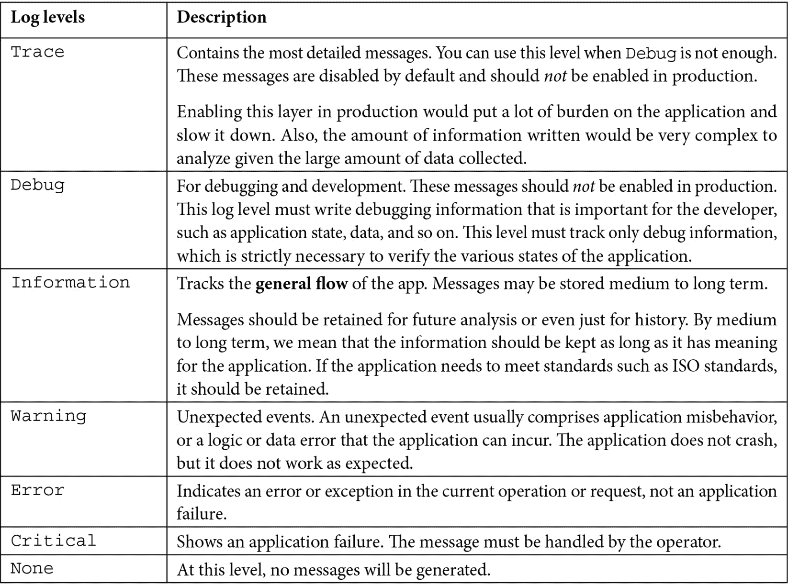
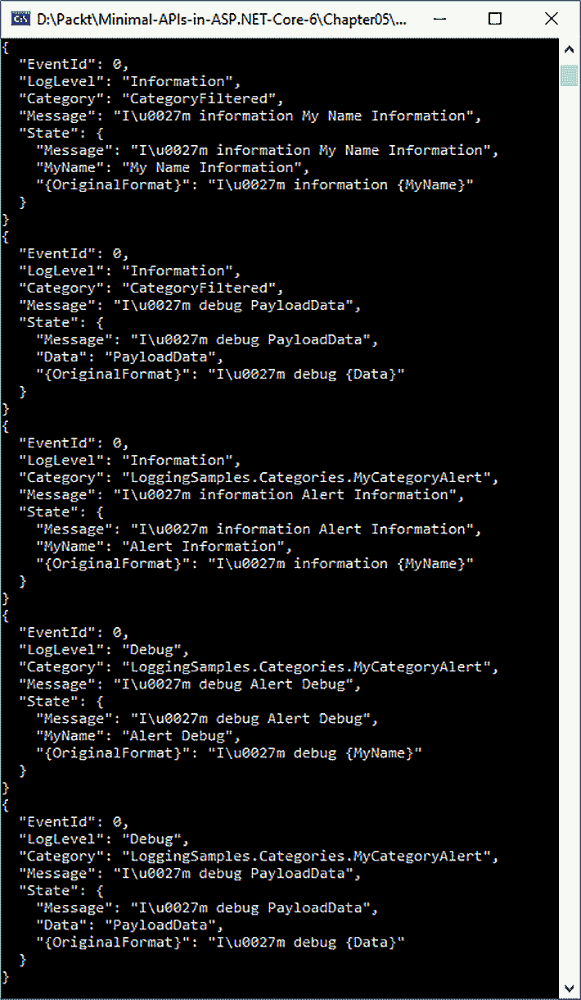
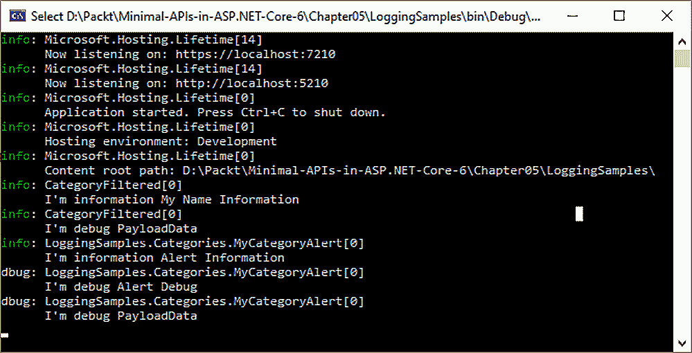
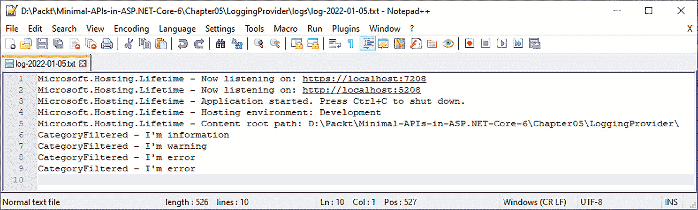
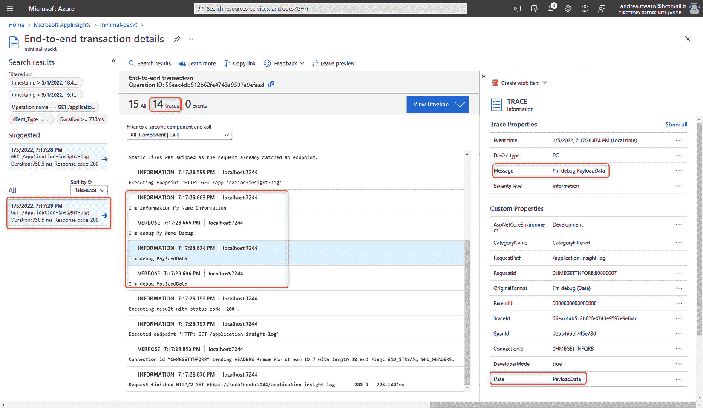
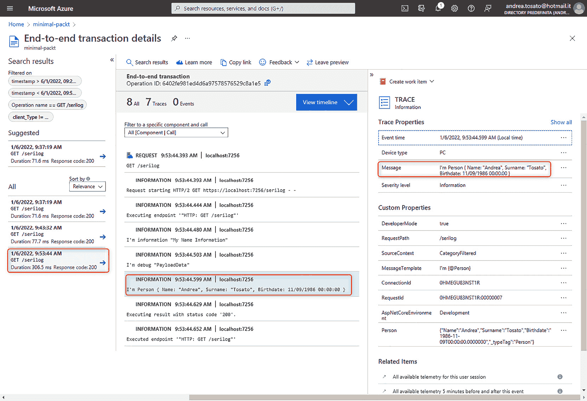

# 使用日志来识别错误

在本章中，我们将开始了解.NET 为我们提供的日志工具。日志器是开发者必须使用来调试应用程序或理解其在生产中的失败的工具之一。日志库已经内置到 ASP.NET 中，并启用了设计中的几个功能。本章的目的是深入探讨我们视为理所当然的事情，并在过程中添加更多信息。

本章我们将涉及的主题如下：

+   探索.NET 中的日志记录

+   利用日志框架

+   使用 Serilog 存储结构化日志

# 技术要求

如前几章所述，将需要 .NET 6 开发框架。

本章开始测试所描述的示例没有特殊要求。

本章中的所有代码示例都可以在本书的 GitHub 仓库中找到，网址为 [`github.com/PacktPublishing/Minimal-APIs-in-ASP.NET-Core-6/tree/main/Chapter05`](https://github.com/PacktPublishing/Minimal-APIs-in-ASP.NET-Core-6/tree/main/Chapter05)。

# 探索.NET 中的日志记录

**ASP.NET Core** 模板创建了一个 **WebApplicationBuilder** 和一个 **WebApplication**，这提供了一种简化配置和运行 Web 应用程序的方法，无需启动类。

如前所述，在 .NET 6 中，为了替代现有的 `Program.cs` 文件，删除了 `Startup.cs` 文件。所有启动配置都放置在这个文件中，在 **最小 API** 的情况下，端点实现也放置在这里。

我们刚才描述的是每个.NET 应用程序及其各种配置的起点。

将日志记录到应用程序中意味着跟踪代码不同点的证据，以检查其是否按预期运行。日志的目的是在时间上跟踪导致应用程序中出现意外结果或事件的全部条件。在开发期间以及应用程序在生产中时，应用程序中的日志记录都可能非常有用。

然而，对于日志记录，为了跟踪应用程序信息，添加了多达四个提供者：

+   **控制台**：Console 提供者将输出记录到控制台。这种日志在生产中不可用，因为 Web 应用程序的控制台通常不可见。这种类型的日志在开发期间很有用，当你在你桌面上运行应用程序时，可以在应用程序控制台窗口中快速记录日志。

+   `System.Diagnostics.Debug` 类。当我们开发时，我们习惯于在 *Visual Studio* 输出窗口中看到这个部分。

在 Linux 操作系统下，信息根据发行版在以下位置进行跟踪：`/var/log/message` 和 `/var/log/syslog`。

+   **EventSource**：在 Windows 上，此信息可以在 **EventTracing** 窗口中查看。

+   **EventLog**（仅在 Windows 上运行时）：此信息显示在原生 Windows 窗口中，因此只有当你在 Windows 操作系统上运行应用程序时才能看到它。

最新.NET 版本中的新功能

在.NET 的最新版本中添加了新的日志提供程序。然而，这些提供程序在框架内部并未启用。

使用这些扩展来启用新的日志场景：`AddSystemdConsole`、`AddJsonConsole`和`AddSimpleConsole`。

您可以在此链接中找到有关如何配置日志和基本 ASP.NET 设置更多详细信息：[`docs.microsoft.com/aspnet/core/fundamentals/host/generic-host`](https://docs.microsoft.com/aspnet/core/fundamentals/host/generic-host)。

我们已经开始看到框架为我们提供的内容；现在我们需要了解如何在我们的应用程序中利用它。在继续之前，我们需要了解什么是日志层。这是一个基本概念，它将帮助我们将信息分解为不同的层次，并在需要时启用它们：



表 5.1 – 日志级别

*表 5.1*显示了从最详细到最不详细的日志级别。

要了解更多信息，您可以阅读题为*在.NET Core 和 ASP.NET Core 中的日志记录*的文章，该文章详细解释了这里的日志记录过程：[`docs.microsoft.com/aspnet/core/fundamentals/logging`](https://docs.microsoft.com/aspnet/core/fundamentals/logging)/。

如果我们将日志级别设置为`Information`，则此级别的所有内容都将追踪到`Critical`级别，跳过`Debug`和`Trace`。

我们已经看到了如何利用日志层；现在，让我们继续编写一个可以记录信息并允许我们将有价值的内容插入跟踪系统的单个语句。

## 配置日志

要开始使用日志组件，您需要了解一些信息以开始跟踪数据。每个日志对象（`ILogger<T>`）都必须有一个关联的类别。日志类别允许您以高分辨率分割跟踪层。例如，如果我们想跟踪某个类或 ASP.NET 控制器中发生的所有事件，而无需重写所有代码，我们需要启用我们感兴趣的类别或类别。

类别是一个`T`类。没有什么比这更简单了。您可以在注入日志方法所在的类中重用该类的类型化对象。例如，如果我们正在实现`MyService`，并且我们想使用相同的类别跟踪服务中发生的所有事件，我们只需从依赖注入引擎请求一个`ILogger<MyService>`对象实例。

一旦定义了日志类别，我们需要调用`ILogger<T>`对象并利用对象的公共方法。在前一节中，我们探讨了日志层。每个日志层都有自己的信息跟踪方法。例如，`LogDebug`是用于跟踪`Debug`层信息的指定方法。

现在让我们看一个例子。我在`Program.cs`文件中创建了一个记录：

```cs
internal record CategoryFiltered();
```

此记录用于定义我想要仅在必要时跟踪的特定日志类别。为此，建议定义一个类或记录作为目的本身，并启用必要的跟踪级别。

在 `Program.cs` 文件中定义的记录没有命名空间；当我们定义包含所有必要信息的 `appsettings` 文件时，我们必须记住这一点。

如果日志类别在命名空间内，我们必须考虑类的全名。在这种情况下，它是 `LoggingSamples.Categories.MyCategoryAlert`：

```cs
namespace LoggingSamples.Categories
{
    public class MyCategoryAlert
    {
    }
}
```

如果我们没有指定类别，如以下示例所示，则选定的日志级别是默认的：

```cs
  "Logging": {
    "LogLevel": {
      "Default": "Information",
      "Microsoft.AspNetCore": "Warning",
      "CategoryFiltered": "Information",
      "LoggingSamples.Categories.MyCategoryAlert": "Debug"
    }
  }
```

包括基础设施日志（如 Microsoft 日志）在内的任何内容都保留在特殊类别中，例如 `Microsoft.AspNetCore` 或 `Microsoft.EntityFrameworkCore`。

Microsoft 日志类别的完整列表可以在以下链接中找到：

[`docs.microsoft.com/aspnet/core/fundamentals/logging/#aspnet-core-and-ef-core-categories`](https://docs.microsoft.com/aspnet/core/fundamentals/logging/#aspnet-core-and-ef-core-categories)

有时，我们需要根据跟踪提供者定义某些日志级别。例如，在开发期间，我们希望在日志控制台中看到所有信息，但只想在日志文件中看到错误。

要做到这一点，我们不需要更改配置代码，只需为每个提供者定义其级别即可。以下是一个示例，展示了在 Microsoft 类别中跟踪的所有内容是如何从 `Information` 层级显示到其下层的：

```cs
{
  "Logging": {      // Default, all providers.
    "LogLevel": {
      "Microsoft": "Warning"
    },
    "Console": { // Console provider.
      "LogLevel": {
        "Microsoft": "Information"
      }
    }
  }
}
```

现在我们已经了解了如何启用日志记录以及如何过滤各种类别，剩下要做的就是将这些信息应用到最小 API 中。

在以下代码中，我们注入了两个不同类别的 `ILogger` 实例。这不是一个常见的做法，但我们这样做是为了使示例更加具体，并展示日志记录器的工作原理：

```cs
app.MapGet("/first-log", (ILogger<CategoryFiltered> loggerCategory, ILogger<MyCategoryAlert> loggerAlertCategory) =>
{
    loggerCategory.LogInformation("I'm information 
      {MyName}", "My Name Information");
    loggerAlertCategory.LogInformation("I'm information
      {MyName}", "Alert Information");
    return Results.Ok();
})
.WithName("GetFirstLog");
```

在前面的代码片段中，我们注入了两个具有不同类别的日志记录器实例；每个类别跟踪一条信息。信息是按照我们将简要描述的模板编写的。这个示例的效果是，基于级别，我们可以显示或禁用单个类别的信息显示，而无需更改代码。

我们开始根据级别和类别过滤日志。现在，我们想向您展示如何定义一个模板，它将允许我们定义消息，并在其某些部分使其动态化。

## 自定义日志消息

日志方法请求的消息字段是一个简单的字符串对象，我们可以通过日志框架以适当的结构丰富和序列化它。因此，消息对于识别故障和错误至关重要，在其中插入对象可以显著帮助我们识别问题：

```cs
string apples = "apples";
string pears = "pears";
string bananas = "bananas";
logger.LogInformation("My fruit box has: {pears}, {bananas}, {apples}", apples, pears, bananas);
```

消息模板包含占位符，可以将内容插入到文本消息中。

除了文本外，还需要传递参数以替换占位符。因此，参数的顺序是有效的，但不是替换占位符的名称。

结果将考虑位置参数，而不是占位符名称：

```cs
My fruit box has: apples, pears, bananas
```

现在您已经知道如何自定义日志消息。接下来，让我们了解基础设施日志记录，这在处理更复杂的场景时至关重要。

## 基础设施日志记录

在本节中，我们想向您介绍 ASP.NET 应用程序中一个鲜为人知且很少使用的主题：**W3C 日志**。

此日志是一个所有网络服务器都使用的标准，不仅包括**互联网信息服务**（**IIS**）。它也适用于 NGINX 和许多其他网络服务器，并且可以在 Linux 上使用。它还用于跟踪各种请求。然而，日志无法理解调用内部发生了什么。

因此，此功能侧重于基础设施，即调用次数以及调用哪些端点。

在本节中，我们将了解如何启用跟踪，默认情况下，跟踪数据存储在文件中。该功能需要一点时间来查找，但可以启用更复杂的场景，这些场景必须使用适当的实践和工具来管理，例如 **OpenTelemetry**。

OpenTelemetry

OpenTelemetry 是一系列工具、API 和 SDK 的集合。我们使用它来对软件性能和行为进行仪表化、生成、收集和导出遥测数据（指标、日志和跟踪），以帮助分析软件性能和行为。您可以在 OpenTelemetry 官方网站上了解更多信息：[`opentelemetry.io/`](https://opentelemetry.io/)。

要配置 W3C 日志记录，您需要注册 `AddW3CLogging` 方法并配置所有可用选项。

要启用日志记录，您只需添加 `UseW3CLogging`。

日志的编写方式没有改变；这两种方法启用了前面描述的场景，并开始将数据写入 W3C 日志标准：

```cs
var builder = WebApplication.CreateBuilder(args);
builder.Services.AddW3CLogging(logging =>
{
    logging.LoggingFields = W3CLoggingFields.All;
});
var app = builder.Build();
app.UseW3CLogging();
app.MapGet("/first-w3c-log", (IWebHostEnvironment webHostEnvironment) =>
{
    return Results.Ok(new { PathToWrite = 
      webHostEnvironment.ContentRootPath });
})
.WithName("GetW3CLog");
```

我们报告创建的文件头（信息头将在稍后跟踪）：

```cs
#Version: 1.0
#Start-Date: 2022-01-03 10:34:15
#Fields: date time c-ip cs-username s-computername s-ip s-port cs-method cs-uri-stem cs-uri-query sc-status time-taken cs-version cs-host cs(User-Agent) cs(Cookie) cs(Referer)
```

我们已经了解了如何跟踪关于托管我们应用程序的基础设施的信息；现在，我们希望使用 .NET 6 中的新功能来提高日志性能，这些功能可以帮助我们设置标准日志消息并避免错误。

## 源生成器

.NET 6 的一个新特性是源生成器；它们是性能优化工具，在编译时生成可执行代码。因此，在编译时生成可执行代码，从而提高了性能。在程序的执行阶段，所有结构都相当于编译前程序员编写的代码。

使用 `$””` 进行字符串插值通常很好，它比 `string.Format()` 编写的代码可读性更高，但您几乎**永远**不应该在编写日志消息时使用它：

```cs
logger.LogInformation($"I'm {person.Name}-{person.Surname}")
```

此方法向控制台输出的结果在使用字符串插值或结构化日志记录时相同，但存在几个问题：

+   你会失去*结构化*日志，并且无法通过格式值进行筛选，也无法在 NoSQL 产品的自定义字段中存档日志消息。

+   同样，你不再有一个常量*消息模板*来查找所有相同的日志。

+   在将字符串传递到`LogInformation`之前，会提前进行人员的序列化。

+   即使日志过滤器未启用，序列化操作仍然会进行。为了避免处理日志，有必要检查层是否处于活动状态，这将使代码的可读性大大降低。

假设你决定更新日志消息以包含`Age`以明确为什么写入日志：

```cs
logger.LogInformation("I'm {Name}-{Surname} with {Age}", person.Name, person.Surname);
```

在前面的代码片段中，我在消息模板中添加了`Age`，但没有在方法签名中添加。在编译时没有编译错误，但执行此行时，由于缺少第三个参数，会抛出异常。

`.NET 6 中的`LoggerMessage`为我们提供了帮助，自动生成记录必要数据的代码。这些方法将需要正确数量的参数，文本将以标准方式格式化。

要使用`LoggerMessage`语法，你可以利用部分类或静态类。在类内部，将可以定义具有所有各种日志情况的方法或方法：

```cs
public partial class LogGenerator
    {
        private readonly ILogger<LogGeneratorCategory> 
          _logger;
        public LogGenerator(ILogger<LogGeneratorCategory>
          logger)
        {
            _logger = logger;
        }
        [LoggerMessage(
            EventId = 100,
            EventName = "Start",
            Level = LogLevel.Debug,
            Message = "Start Endpoint: {endpointName} with
              data {dataIn}")]
        public partial void StartEndpointSignal(string 
          endpointName, object dataIn);
        [LoggerMessage(
           EventId = 101,
           EventName = "StartFiltered",
           Message = "Log level filtered: {endpointName} 
             with data {dataIn}")]
        public partial void LogLevelFilteredAtRuntime(
          LogLevel, string endpointName, object dataIn);
    }
    public class LogGeneratorCategory { }
```

在前面的示例中，我们创建了一个部分类，注入了日志及其类别，并实现了两个方法。这些方法在以下代码中使用：

```cs
app.MapPost("/start-log", (PostData data, LogGenerator logGenerator) =>
{
    logGenerator.StartEndpointSignal("start-log", data);
    logGenerator.LogLevelFilteredAtRuntime(LogLevel.Trace,
      "start-log", data);
})
.WithName("StartLog");
internal record PostData(DateTime Date, string Name);
```

注意在第二个方法中，我们也有可能在运行时定义日志级别。

在幕后，`[LoggerMessage]`源生成器会生成`LoggerMessage.Define()`代码以优化你的方法调用。以下输出显示了生成的代码：

```cs
[global::System.CodeDom.Compiler.GeneratedCodeAttribute("Microsoft.Extensions.Logging.Generators", "6.0.5.2210")]
        public partial void LogLevelFilteredAtRuntime(
          global::Microsoft.Extensions.Logging.LogLevel 
          logLevel, global::System.String endpointName,
          global::System.Object dataIn)
        {
            if (_logger.IsEnabled(logLevel))
            {
                _logger.Log(
                    logLevel,
                    new global::Microsoft.Extensions.
                     Logging.EventId(101, "StartFiltered"),
                    new __LogLevelFilteredAtRuntimeStruct(
                      endpointName, dataIn),
                    null,
                      __LogLevelFilteredAtRuntimeStruct.
                          Format);
            }
        }
```

在本节中，你了解了一些日志提供程序、不同的日志级别、如何配置它们、要修改的消息模板部分、启用日志以及源生成器的优势。在下一节中，我们将更多地关注日志提供程序。

# 利用日志框架

如本章开头所述，日志框架已经设计了一系列不需要添加任何额外包的提供程序。现在，让我们探索如何使用这些提供程序以及如何构建自定义提供程序。我们将仅分析控制台日志提供程序，因为它具有复制到其他日志提供程序上的相同推理所需的所有足够元素。

## 控制台日志

`Console`日志提供程序是最常用的一个，因为在开发过程中，它为我们提供了大量信息，并收集了所有应用程序错误。

自.NET 6 以来，此提供程序已由`AddJsonConsole`提供程序加入，除了像控制台一样跟踪错误之外，它还将它们序列化为人类可读的 JSON 对象。

在以下示例中，我们展示了如何配置`JsonConsole`提供程序，并在写入 JSON 有效负载时添加缩进：

```cs
builder.Logging.AddJsonConsole(options =>
        options.JsonWriterOptions = new JsonWriterOptions()
        {
            Indented = true
        });
```

正如我们在之前的示例中所看到的，我们将使用消息模板来跟踪信息：

```cs
app.MapGet("/first-log", (ILogger<CategoryFiltered> loggerCategory, ILogger<MyCategoryAlert> loggerAlertCategory) =>
{
    loggerCategory.LogInformation("I'm information 
      {MyName}", "My Name Information");
    loggerCategory.LogDebug("I'm debug {MyName}",
      "My Name Debug");
    loggerCategory.LogInformation("I'm debug {Data}", 
      new PayloadData("CategoryRoot", "Debug"));
    loggerAlertCategory.LogInformation("I'm information 
      {MyName}", "Alert Information");
    loggerAlertCategory.LogDebug("I'm debug {MyName}",
      "Alert Debug");
    var p = new PayloadData("AlertCategory", "Debug");
    loggerAlertCategory.LogDebug("I'm debug {Data}", p);
    return Results.Ok();
})
.WithName("GetFirstLog");
```

最后，一个重要的注意事项：`Console`和`JsonConsole`提供程序不会序列化通过消息模板传递的对象，而只写入类名。

```cs
var p = new PayloadData("AlertCategory", "Debug");
loggerAlertCategory.LogDebug("I'm debug {Data}", p);
```

这确实是提供程序的一个限制。因此，我们建议使用结构化日志工具，如**NLog**、**log4net**和**Serilog**，我们将在稍后讨论。

我们展示了之前几行中两个提供程序的输出：



图 5.1 – AddJsonConsole 输出

*图 5.1* 展示了格式化为 JSON 的日志，与传统控制台日志相比，包含了一些额外的细节。



图 5.2 – 默认日志提供程序 Console 输出

*图 5.2* 展示了默认日志提供程序`Console`的输出。

在默认提供程序的情况下，我们想向您展示如何创建一个符合您应用程序需求的自定义提供程序。

## 创建自定义提供程序

微软设计的日志框架可以轻松地进行定制。因此，让我们学习如何创建一个**自定义提供程序**。

为什么要创建自定义提供程序？简单来说，是为了避免与日志库的依赖关系，并更好地管理应用程序的性能。最后，它还封装了特定场景的一些自定义逻辑，使代码更易于管理和阅读。

在以下示例中，我们将使用场景简化，以向您展示创建一个用于盈利的日志提供程序所需的最小组件。

提供程序的一个基本部分是能够配置其行为。让我们创建一个可以在应用程序启动时进行自定义或从`appsettings`中检索信息的类。

在我们的示例中，我们定义了一个固定的`EventId`来验证每日滚动文件逻辑以及文件的写入路径：

```cs
public class FileLoggerConfiguration
{
        public int EventId { get; set; }
        public string PathFolderName { get; set; } = 
          "logs";
        public bool IsRollingFile { get; set; }
}
```

我们正在编写的自定义提供程序将负责将日志信息写入文本文件。我们通过实现名为`FileLogger`的日志类，该类实现了`ILogger`接口，来实现这一点。

在类逻辑中，我们所做的只是实现日志方法并检查将信息放入哪个文件。

我们将目录验证放在下一个文件中，但更正确的方法是将所有控制逻辑放在这个方法中。我们还需要确保日志方法不会在应用程序级别抛出异常。日志记录器永远不应该影响应用程序的稳定性：

```cs
    public class FileLogger : ILogger
    {
        private readonly string name;
        private readonly Func<FileLoggerConfiguration> 
          getCurrentConfig;
        public FileLogger(string name,
          Func<FileLoggerConfiguration> getCurrentConfig)
        {
            this.name = name;
            this.getCurrentConfig = getCurrentConfig;
        }
        public IDisposable BeginScope<TState>(TState state)
          => default!;
        public bool IsEnabled(LogLevel logLevel) => true;
        public void Log<TState>(LogLevel logLevel, EventId
          , TState state, Exception? exception, 
          Func<TState, Exception?, string> formatter)
        {
            if (!IsEnabled(logLevel))
            {
                return;
            }
            var config = getCurrentConfig();
            if (config.EventId == 0 || config.EventId ==
                eventId.Id)
            {
                string line = $"{name} - {formatter(state,
                  exception)}";
                string fileName = config.IsRollingFile ? 
                  RollingFileName : FullFileName;
                string fullPath = Path.Combine(
                  config.PathFolderName, fileName);
                File.AppendAllLines(fullPath, new[] { line });
            }
        }
        private static string RollingFileName => 
          $"log-{DateTime.UtcNow:yyyy-MM-dd}.txt";
        private const string FullFileName = "logs.txt";
    }
```

现在，我们需要实现`ILoggerProvider`接口，该接口旨在创建一个或多个之前讨论过的日志类实例。

在本节课中，我们检查了上一段提到的目录，同时也检查了`appsettings`文件中的设置是否发生变化，这是通过`IOptionsMonitor<T>`实现的：

```cs
public class FileLoggerProvider : ILoggerProvider
{
    private readonly IDisposable onChangeToken;
    private FileLoggerConfiguration currentConfig;
    private readonly ConcurrentDictionary<string,
      FileLogger> _loggers = new();
    public FileLoggerProvider(
      IOptionsMonitor<FileLoggerConfiguration> config)
    {
        currentConfig = config.CurrentValue;
        CheckDirectory();
        onChangeToken = config.OnChange(updateConfig =>
        {
            currentConfig = updateConfig;
            CheckDirectory();
        });
    }
    public ILogger CreateLogger(string categoryName)
    {
        return _loggers.GetOrAdd(categoryName, name => new 
          FileLogger(name, () => currentConfig));
    }
    public void Dispose()
    {
        _loggers.Clear();
        onChangeToken.Dispose();
    }
    private void CheckDirectory()
    {
        if (!Directory.Exists(currentConfig.PathFolderName))
            Directory.CreateDirectory(currentConfig.
            PathFolderName);
    }
}
```

最后，为了简化在应用程序启动阶段的使用和配置，我们还定义了一个扩展方法来注册前面提到的各种类。

`AddFile`方法将注册`ILoggerProvider`并将其与其配置（作为一个例子非常简单，但它封装了配置和使用自定义提供者的几个方面）相关联：

```cs
public static class FileLoggerExtensions
    {
        public static ILoggingBuilder AddFile(
        this ILoggingBuilder builder)
        {
            builder.AddConfiguration();
           builder.Services.TryAddEnumerable(
             ServiceDescriptor.Singleton<ILoggerProvider,
             FileLoggerProvider>());
            LoggerProviderOptions.RegisterProviderOptions<
              FileLoggerConfiguration, FileLoggerProvider>
              (builder.Services);
            return builder;
        }
        public static ILoggingBuilder AddFile(
            this ILoggingBuilder builder,
            Action<FileLoggerConfiguration> configure)
        {
            builder.AddFile();
            builder.Services.Configure(configure);
            return builder;
        }
    }
```

我们使用`AddFile`扩展记录了`Program.cs`文件中看到的所有内容，如下所示：

```cs
builder.Logging.AddFile(configuration =>
{
    configuration.PathFolderName = Path.Combine(
      builder.Environment.ContentRootPath, "logs");
    configuration.IsRollingFile = true;
});
```

输出显示在*图 5.3*中，我们可以看到前五行中的 Microsoft 日志类别（这是经典的应用程序启动信息）：



图 5.3 – 文件日志提供者输出

然后，调用前面章节中报告的最小 API 的处理程序。正如你所看到的，没有异常数据或传递给记录器的数据被序列化。

要添加此功能，还需要重写`ILogger formatter`并支持对象的序列化。这将为你提供一个有用的日志框架，适用于生产场景。

我们已经看到了如何配置日志以及如何自定义提供者对象以创建结构化日志发送到服务或存储。

在下一节中，我们想要描述 Azure Application Insights 服务，这对于日志记录和应用程序监控都非常有用。

## Application Insights

除了已经看到的提供者之外，最常用的之一是**Azure Application Insights**。这个提供者允许你发送 Azure 服务中的每一个日志事件。为了将提供者插入到我们的项目中，我们只需要安装以下 NuGet 包：

```cs
<PackageReference Include="Microsoft.ApplicationInsights.AspNetCore" Version="2.20.0" />
```

注册提供者非常简单。

我们首先注册 Application Insights 框架，`AddApplicationInsightsTelemetry`，然后在其`AddApplicationInsights`日志框架上注册其扩展。

在前面描述的 NuGet 包中，用于将组件记录到日志框架的那个包也作为参考存在：

```cs
var builder = WebApplication.CreateBuilder(args);
builder.Services.AddApplicationInsightsTelemetry();
builder.Logging.AddApplicationInsights();
```

要注册仪表化密钥，这是在 Azure 上注册服务后发放的密钥，你需要将此信息传递给注册方法。我们可以通过将信息放在`appsettings.json`文件中以以下格式来避免硬编码此信息：

```cs
"ApplicationInsights": {
    "InstrumentationKey": "your-key"
  },
```

此过程也在文档中有所描述（[`docs.microsoft.com/it-it/azure/azure-monitor/app/asp-net-core#enable-application-insights-server-side-telemetry-no-visual-studio`](https://docs.microsoft.com/it-it/azure/azure-monitor/app/asp-net-core#enable-application-insights-server-side-telemetry-no-visual-studio)）。

通过启动前面章节中讨论的方法，我们已经将所有信息连接到 Application Insights。

Application Insights 将日志分组在特定的跟踪之下。跟踪是对 API 的调用，因此在该调用中发生的所有事情在逻辑上都被分组在一起。这个功能利用了 `WebServer` 信息，特别是 W3C 标准为每个调用发布的 `TraceParentId`。

这样，Application Insights 就可以绑定各种最小 API 之间的调用，无论是我们处于微服务应用程序中还是多个服务相互协作。



图 5.4 – 使用标准日志提供程序的 Application Insights

我们注意到，日志框架的默认格式化程序并没有序列化 `PayloadData` 对象，而只是写出了对象的文本。

在我们将投入生产的应用程序中，还需要跟踪对象的序列化。及时了解对象的状态对于分析在数据库中运行查询或读取从同一数据源读取的数据时发生的特定调用中的错误至关重要。

# 使用 Serilog 存储结构化日志

正如我们刚才讨论的，在日志中跟踪结构化对象极大地帮助我们理解错误。

因此，我们建议使用众多日志框架之一：**Serilog**。

Serilog 是一个综合性的库，已经编写了许多 **接收器**，允许您存储日志数据并在以后搜索它。

Serilog 是一个日志库，允许您跟踪多个数据源上的信息。在 Serilog 中，这些源被称为接收器，它们允许您在日志中写入结构化数据，并应用传递给日志系统的数据的序列化。

让我们看看如何开始使用 Serilog 为最小 API 应用程序。让我们安装这些 NuGet 包。我们的目标将是跟踪我们迄今为止一直在使用的信息，具体是 `Console` 和 `ApplicationInsights`：

```cs
<PackageReference Include="Microsoft.ApplicationInsights.AspNetCore" Version="2.20.0" />
<PackageReference Include="Serilog.AspNetCore" Version="4.1.0" />
<PackageReference Include="Serilog.Settings.Configuration" Version="3.3.0" />
<PackageReference Include="Serilog.Sinks.ApplicationInsights" Version="3.1.0" />
```

第一个包是应用程序中 `ApplicationInsights` SDK 所需的包。第二个包允许我们在 ASP.NET 管道中注册 Serilog 并能够利用 Serilog。第三个包允许我们在 `appsettings` 文件中配置框架，而无需重写应用程序来更改参数或代码。最后，我们有添加 `ApplicationInsights` 接收器的包。

在 `appsettings` 文件中，我们创建一个新的 `Serilog` 部分，在 `Using` 部分中注册各种接收器。我们注册了日志级别、接收器、丰富每个事件信息的丰富器以及如应用程序名称之类的属性：

```cs
"Serilog": {
    "Using": [ "Serilog.Sinks.Console",
      "Serilog.Sinks.ApplicationInsights" ],
    "MinimumLevel": "Verbose",
    "WriteTo": [
      { "Name": "Console" },
      {
        "Name": "ApplicationInsights",
        "Args": {
          "restrictedToMinimumLevel": "Information",
          "telemetryConverter": "Serilog.Sinks.
           ApplicationInsights.Sinks.ApplicationInsights.
           TelemetryConverters.TraceTelemetryConverter, 
           Serilog.Sinks.ApplicationInsights"
        }
      }
    ],
    "Enrich": [ "FromLogContext"],   
    "Properties": {
      "Application": "MinimalApi.Packt"
    }
  }
```

现在，我们只需在 ASP.NET 管道中注册 `Serilog`：

```cs
using Microsoft.ApplicationInsights.Extensibility;
using Serilog;
var builder = WebApplication.CreateBuilder(args);
builder.Logging.AddSerilog();
builder.Services.AddApplicationInsightsTelemetry();
var app = builder.Build();
Log.Logger = new LoggerConfiguration()
.WriteTo.ApplicationInsights(app.Services.GetRequiredService<TelemetryConfiguration>(), TelemetryConverter.Traces)
.CreateLogger();
```

使用`builder.Logging.AddSerilog()`语句，我们将 Serilog 注册到日志框架中，所有已记录的事件将通过常规的`ILogger`接口传递。由于框架需要注册`TelemetryConfiguration`类以注册`ApplicationInsights`，我们被迫将配置钩子连接到 Serilog 的静态`Logger`对象。这一切都是因为 Serilog 会将来自 Microsoft 日志框架的信息转换为 Serilog 框架，并添加所有必要的信息。

使用方法与之前类似，但这次我们在消息模板中添加了一个`@`（在）符号，这将告诉 Serilog 序列化发送的对象。

通过这个非常简单的`{@Person}`表述，我们将能够实现序列化对象并将其发送到`ApplicationInsights`服务的目标：

```cs
app.MapGet("/serilog", (ILogger<CategoryFiltered> loggerCategory) =>
{
    loggerCategory.LogInformation("I'm {@Person}", new
      Person("Andrea", "Tosato", new DateTime(1986, 11, 
      9)));
    return Results.Ok();
})
.WithName("GetFirstLog");
internal record Person(string Name, string Surname, DateTime Birthdate);
```

最后，我们必须在 Application Insights 服务中找到完整的数据，这些数据以 JSON 格式序列化。



图 5.5 – 带有结构化数据的 Application Insights

# 摘要

在本章中，我们看到了最小 API 实现中的一些日志方面。

我们开始欣赏 ASP.NET 生成的日志框架，并了解了如何配置和自定义它。我们关注了如何定义消息模板以及如何避免使用源生成器时的错误。

我们看到了如何使用新的提供程序以 JSON 格式序列化日志并创建自定义提供程序。这些元素最终证明对于掌握日志工具并按您的喜好进行自定义非常重要。

不仅提到了应用程序日志，还提到了基础设施日志，这两者与 Application Insights 结合，成为监控应用程序的关键元素。最后，我们了解到有一些现成的工具，如 Serilog，通过 NuGet 安装的一些包，只需几步就能提供现成的功能。

在下一章中，我们将介绍验证 API 输入对象的机制。这是返回正确错误给调用并丢弃不准确请求或由垃圾邮件和攻击等非法活动推动的请求的基本功能，这些活动旨在对我们的服务器产生负载。
