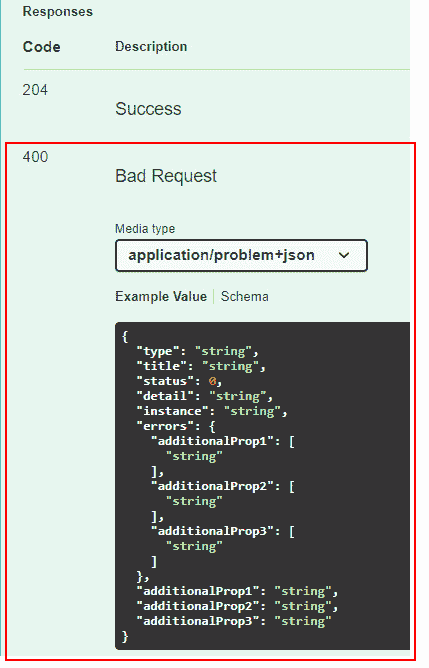
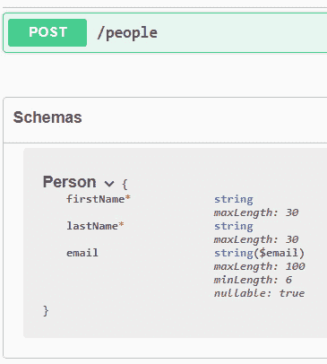

# 探索验证和映射

在本书的本章中，我们将讨论如何使用最少的 API 执行数据验证和映射，展示我们目前拥有的功能，缺少什么，以及最有趣的替代方案是什么。了解这些概念将帮助我们开发更健壮和可维护的应用程序。

在本章中，我们将涵盖以下主题：

+   处理验证

+   将数据映射到和从 API

# 技术要求

要遵循本章的描述，你需要创建一个 ASP.NET Core 6.0 Web API 应用程序。请参考*第二章*中的*技术要求*部分，*探索最小 API 及其优势*，以获取如何创建的说明。

如果你正在使用你的控制台、shell 或 bash 终端创建 API，请记住将你的工作目录更改为当前章节号（`Chapter06`）。

本章中的所有代码示例都可以在本书的 GitHub 仓库中找到，网址为[`github.com/PacktPublishing/Minimal-APIs-in-ASP.NET-Core-6/tree/main/Chapter06`](https://github.com/PacktPublishing/Minimal-APIs-in-ASP.NET-Core-6/tree/main/Chapter06)。

# 处理验证

`Person`对象定义了`FirstName`和`LastName`属性，电子邮件地址有效，或者预约日期不是过去的。

在基于控制器的项目中，我们可以执行这些检查，也称为放置在控制器上的`ApiController`属性，如果验证规则失败，将自动触发`400 Bad Request`响应。因此，在基于控制器的项目中，我们通常根本不需要执行显式的模型验证：如果验证失败，我们的端点将永远不会被调用。

注意

`ApiController`属性通过使用`ModelStateInvalidFilter`操作过滤器启用自动模型验证行为。

不幸的是，最小 API 没有提供内置的验证支持。`IModelValidator`接口及其所有相关对象都不能使用。因此，我们没有`ModelState`；如果存在验证错误，我们无法阻止端点的执行，必须显式返回`400 Bad Request`响应。

例如，让我们看看以下代码：

```cs
app.MapPost("/people", (Person person) =>
{
    return Results.NoContent();
});
public class Person
{
    [Required]
    [MaxLength(30)]
    public string FirstName { get; set; }
    [Required]
    [MaxLength(30)]
    public string LastName { get; set; }
    [EmailAddress]
    [StringLength(100, MinimumLength = 6)]
    public string Email { get; set; }
}
```

如我们所见，即使`Person`参数不遵守验证规则，端点也会被调用。只有一个例外：如果我们使用`400 Bad Request`响应。如*第二章*中所述，*探索最小 API 及其优势*，在.NET 6.0 项目中默认启用了可空引用类型。

如果我们想要接受`null`体（如果真的有需要的话），我们需要将参数声明为`Person?`。但是，只要存在体，端点总是会调用。

因此，在使用最小 API 时，在路由处理程序内部执行验证并在某些规则失败时返回适当的响应是必要的。我们可以实现一个与现有属性兼容的验证库，以便我们可以使用经典的数据注释方法进行验证，如下一节所述，或者使用第三方解决方案，如我们将在 *集成 FluentValidation* 节中看到的。

## 使用数据注释进行验证

如果我们想使用基于数据注释的通用验证模式，我们需要依赖于由 `ValidationAttribute` 基类提供的 `IsValid` 方法。

这种行为是对 ASP.NET Core 实际处理验证的简化的描述。然而，这是基于控制器项目的验证方式。

虽然我们也可以使用最小 API 手动实现此类解决方案，但如果我们决定使用数据注释进行验证，我们可以利用一个虽小但有趣的库，`MiniValidation`，它可在 GitHub ([`github.com/DamianEdwards/MiniValidation`](https://github.com/DamianEdwards/MiniValidation)) 和 NuGet ([`www.nuget.org/packages/MiniValidation`](https://www.nuget.org/packages/MiniValidation)) 上找到。

重要提示

在撰写本文时，`MiniValidation` 作为预发布版本在 NuGet 上提供。

我们可以通过以下方式之一将此库添加到我们的项目中：

+   `MiniValidation`。请确保检查**包含预发布版本**选项，然后点击**安装**。

+   **选项 2**：如果您在 Visual Studio 2022 中，请打开**包管理器控制台**；或者打开您的控制台、shell 或 bash 终端，转到您的项目目录，并执行以下命令：

    ```cs
    dotnet add package MiniValidation --prerelease
    ```

现在，我们可以使用以下代码验证一个 `Person` 对象：

```cs
app.MapPost("/people", (Person person) =>
{
    var isValid = MiniValidator.TryValidate(person, 
      out var errors);
    if (!isValid)
    {
        return Results.ValidationProblem(errors);
    }
    return Results.NoContent();
});
```

如我们所见，`MiniValidation` 提供的 `MiniValidator.TryValidate` 静态方法接受一个对象作为输入，并自动验证其属性上定义的所有验证规则。如果验证失败，它将返回 `false` 并将所有发生的验证错误填充到 `out` 参数中。在这种情况下，因为返回适当的响应代码是我们的责任，所以我们使用 `Results.ValidationProblem`，它生成一个带有 `ProblemDetails` 对象的 `400 Bad Request` 响应（如*第三章*，*使用最小 API*）并包含验证问题。

现在，作为一个例子，我们可以使用以下无效输入调用端点：

```cs
{
  "lastName": "MyLastName",
  "email": "email"
}
```

这是我们将获得的结果：

```cs
{
  "type": 
    "https://tools.ietf.org/html/rfc7231#section-6.5.1",
  "title": "One or more validation errors occurred.",
  "status": 400,
  "errors": {
    "FirstName": [
      "The FirstName field is required."
    ],
    "Email": [
      "The Email field is not a valid e-mail address.",
      "The field Email must be a string with a minimum
       length of 6 and a maximum length of 100."
    ]
  }
}
```

这样，除了我们需要手动执行验证之外，我们还可以以与之前版本的 ASP.NET Core 中相同的方式，在我们的模型上实现使用数据注释的方法。我们还可以通过创建继承自 `ValidationAttribute` 的类来自定义错误消息和定义自定义规则。

注意

ASP.NET Core 6.0 中可用的完整验证属性列表发布在 [`docs.microsoft.com/dotnet/api/system.componentmodel.dataannotations`](https://docs.microsoft.com/dotnet/api/system.componentmodel.dataannotations)。如果您对创建自定义属性感兴趣，可以参考 [`docs.microsoft.com/aspnet/core/mvc/models/validation#custom-attributes`](https://docs.microsoft.com/aspnet/core/mvc/models/validation#custom-attributes)。

虽然数据注解是最常用的解决方案，但我们也可以使用所谓的流畅方法来处理验证，这种方法的好处是完全解耦验证规则与模型，正如我们将在下一节中看到的。

## 集成 FluentValidation

在每个应用程序中，正确组织我们的代码都很重要。对于验证来说也是如此。虽然数据注解是一个可行的解决方案，但我们应该考虑其他可以帮助我们编写更易于维护的项目的方法。这就是 `FluentValidation` 的目的——这是一个库，它是 **.NET 基金会** 的一部分，允许我们使用 lambda 表达式通过流畅接口构建验证规则。该库可在 GitHub ([`github.com/FluentValidation/FluentValidation`](https://github.com/FluentValidation/FluentValidation)) 和 NuGet ([`www.nuget.org/packages/FluentValidation`](https://www.nuget.org/packages/FluentValidation)) 上找到。该库可用于任何类型的项目，但在使用 ASP.NET Core 时，有一个专门的 NuGet 包 ([`www.nuget.org/packages/FluentValidation.AspNetCore`](https://www.nuget.org/packages/FluentValidation.AspNetCore))，其中包含有助于集成的有用方法。

注意

.NET 基金会是一个旨在支持围绕 .NET 平台的开源软件开发和协作的独立组织。您可以在 [`dotnetfoundation.org`](https://dotnetfoundation.org) 上了解更多信息。

如前所述，使用此库，我们可以将验证规则从模型中解耦，以创建更结构化的应用程序。此外，`FluentValidation` 允许我们使用流畅语法定义更复杂的规则，而无需基于 `ValidationAttribute` 创建自定义类。该库还原生支持标准错误消息的本地化。

因此，让我们看看如何将 `FluentValidation` 集成到最小 API 项目中。首先，我们需要以下方式之一将此库添加到我们的项目中：

+   点击 **安装**。

+   **选项 2**：如果您在 Visual Studio 2022 中，请打开 **包管理器控制台**；否则，打开您的控制台、shell 或 bash 终端，进入您的项目目录，并执行以下命令：

    ```cs
    dotnet add package FluentValidation.DependencyInjectionExtensions
    ```

现在，我们可以重写 `Person` 对象的验证规则，并将它们放入 `PersonValidator` 类中：

```cs
public class PersonValidator : AbstractValidator<Person>
{
    public PersonValidator() 
    {
        RuleFor(p =>
          p.FirstName).NotEmpty().MaximumLength(30);
        RuleFor(p => 
          p.LastName).NotEmpty().MaximumLength(30);
        RuleFor(p => p.Email).EmailAddress().Length(6,
          100);
    }
}
```

`PersonValidator` 继承自 `AbstractValidator<T>`，这是 `FluentValidation` 提供的一个基类，其中包含我们定义验证规则所需的所有方法。例如，我们 *流畅地* 声明我们有一个针对 `FirstName` 属性的规则，即它不能为空，并且它的最大长度可以是 `30` 个字符。

下一步是将验证器注册到服务提供程序中，以便我们可以在我们的路由处理器中使用它。我们可以通过一个简单的指令来完成此任务：

```cs
var builder = WebApplication.CreateBuilder(args);
//...
builder.Services.AddValidatorsFromAssemblyContaining<Program>();
```

`AddValidatorsFromAssemblyContaining` 方法会自动注册指定类型所在的程序集内所有从 `AbstractValidator` 派生的验证器。特别是，此方法注册了验证器，并通过 `IValidator<T>` 接口使它们可通过依赖注入访问，而 `AbstractValidator<T>` 类实现了该接口。如果我们有多个验证器，我们可以使用此单一指令将它们全部注册。我们还可以轻松地将我们的验证器放入外部程序集。

现在一切都已经就绪，记住，由于我们使用的是最小化 API，我们没有自动模型验证，因此我们必须以这种方式更新我们的路由处理器：

```cs
app.MapPost("/people", async (Person person, IValidator<Person> validator) =>
{
    var validationResult = 
      await validator.ValidateAsync(person);
    if (!validationResult.IsValid)
    {
        var errors = validationResult.ToDictionary();
        return Results.ValidationProblem(errors);
    }
    return Results.NoContent();
});
```

我们在路由处理器参数列表中添加了一个 `IValidator<Person>` 参数，因此现在我们可以调用它的 `ValidateAsync` 方法来对输入的 `Person` 对象应用验证规则。如果验证失败，我们将提取所有错误消息，并使用通常的 `Results.ValidationProblem` 方法将它们返回给客户端，如前文所述。

总结来说，让我们看看如果我们尝试使用之前相同的输入调用端点会发生什么：

```cs
{
  "lastName": "MyLastName",
  "email": "email"
}
```

我们将得到以下响应：

```cs
{
  "type": 
    "https://tools.ietf.org/html/rfc7231#section-6.5.1",
  "title": "One or more validation errors occurred.",
  "status": 400,
  "errors": {
    "FirstName": [
      "'First Name' non può essere vuoto."
    ],
    "Email": [
      "'Email' non è un indirizzo email valido.",
      "'Email' deve essere lungo tra i 6 e 100 caratteri.
        Hai inserito 5 caratteri."
    ]
  }
}
```

如前所述，`FluentValidation` 为标准错误消息提供翻译，因此这是在意大利系统上运行时得到的响应。当然，我们可以使用典型的流畅方法完全自定义消息，使用 `WithMessage` 方法将消息链式连接到验证器中定义的验证方法。例如，请参见以下内容：

```cs
RuleFor(p => p.FirstName).NotEmpty().WithMessage("You must provide the first name");
```

我们将在 *第九章* *利用全球化和本地化* 中更详细地讨论本地化问题。

这只是一个快速示例，说明如何使用 `FluentValidation` 定义验证规则，并使用最小化 API 来使用它们。这个库允许许多更复杂的场景，这些场景在官方文档中有详细描述，官方文档可在 [`fluentvalidation.net`](https://fluentvalidation.net) 找到。

现在我们已经了解了如何向我们的路由处理器添加验证，了解我们如何使用这些信息更新由 **Swagger** 创建的文档是很重要的。

## 在 Swagger 中添加验证信息

无论选择哪种解决方案来处理验证，重要的是要更新 OpenAPI 定义，以表明处理程序可以生成验证问题响应，在端点声明后调用`ProducesValidationProblem`方法：

```cs
app.MapPost("/people", (Person person) =>
{
    //...
})
.Produces(StatusCodes.Status204NoContent)
.ProducesValidationProblem();
```

这样，将为`400 Bad Request`状态码添加一个新的响应类型到 Swagger，正如我们在*图 6.1*中可以看到的那样：



图 6.1 – 添加到 Swagger 中的验证问题响应

此外，Swagger UI 底部显示的**JSON 模式**可以显示相应模型的规则。使用数据注释定义验证规则的一个好处是它们会自动反映在这些模式中：



图 6.2 – Swagger 中 Person 对象的验证规则

不幸的是，使用`FluentValidation`定义的验证规则在 Swagger 的 JSON 模式中不会自动显示。我们可以通过使用`MicroElements.Swashbuckle.FluentValidation`这个小型库来克服这一限制，这个库通常可以在 GitHub（[`github.com/micro-elements/MicroElements.Swashbuckle.FluentValidation`](https://github.com/micro-elements/MicroElements.Swashbuckle.FluentValidation)）和 NuGet（[`www.nuget.org/packages/MicroElements.Swashbuckle.FluentValidation`](https://www.nuget.org/packages/MicroElements.Swashbuckle.FluentValidation)）上找到。将其添加到我们的项目中后，按照之前为其他 NuGet 包所描述的相同步骤，我们只需要调用`AddFluentValidationRulesToSwagger`扩展方法：

```cs
var builder = WebApplication.CreateBuilder(args);
//...
builder.Services.AddFluentValidationRulesToSwagger();
```

这样，Swagger 中显示的 JSON 模式将反映验证规则，就像数据注释一样。然而，值得注意的是，在撰写本文时，这个库并不支持`FluentValidation`中所有可用的验证器。更多信息，我们可以参考库的 GitHub 页面。

这就结束了我们对最小 API 中验证的概述。在下一节中，我们将分析每个 API 的一个重要主题：如何正确处理数据到和从我们的服务映射。

# 数据到和从 API 映射

当处理任何系统都可以调用的 API 时，有一条黄金法则：*我们绝不应该向调用者暴露我们的内部对象*。如果我们不遵循这种解耦思想，并且出于某种原因需要更改我们的内部数据结构，我们可能会破坏所有与我们交互的客户端。内部数据结构和用于与客户端对话的对象必须能够独立于彼此进化。

这种对话需求是**映射**之所以如此重要的原因。我们需要将一种类型的输入对象转换为另一种类型的输出对象，反之亦然。这样，我们可以实现两个目标：

+   在不引入对调用者暴露的合约的破坏性更改的情况下，改进我们的内部数据结构

+   修改用于与客户端通信的对象的格式，而无需更改这些对象内部处理的方式

换句话说，映射意味着通过复制和转换对象属性从源到目的地来将一个对象转换为另一个对象。然而，映射代码很无聊，测试映射代码更是无聊。尽管如此，我们需要完全理解这个过程的重要性，并努力在所有场景中采用它。

因此，让我们考虑以下对象，它可能代表使用 Entity Framework Core 保存到数据库中的人员：

```cs
public class PersonEntity
{
    public int Id { get; set; }
    public string FirstName { get; set; }
    public string LastName { get; set; }
    public DateTime BirthDate { get; set; }
    public string City { get; set; }
}
```

我们已经设置了获取人员列表或检索特定人员的端点。

第一个想法可能是直接将`PersonEntity`返回给调用者。以下代码高度简化，足以让我们理解这个场景：

```cs
app.MapGet("/people/{id:int}", (int id) =>
{
    // In a real application, this entity could be
    // retrieved from a database, checking if the person
    // with the given ID exists.
    var person = new PersonEntity();
    return Results.Ok(person);
})
.Produces(StatusCodes.Status200OK, typeof(PersonEntity));
```

如果我们需要修改数据库的架构，例如添加实体的创建日期，会发生什么？在这种情况下，我们需要将`PersonEntity`更改为具有映射相关日期的新属性。然而，调用者现在也获得了这些信息，而我们可能不想公开这些信息。相反，如果我们使用所谓的**数据转换对象**（DTO）来公开人员，这个问题将变得多余：

```cs
public class PersonDto
{
    public int Id { get; set; }
    public string FirstName { get; set; }
    public string LastName { get; set; }
    public DateTime BirthDate { get; set; }
    public string City { get; set; }
}
```

这意味着我们的 API 应该返回`PersonDto`类型的对象而不是`PersonEntity`，在两个对象之间执行转换。乍一看，这个练习似乎是无用的代码重复，因为这两个类包含相同的属性。然而，如果我们考虑到`PersonEntity`可能会随着数据库所需的新属性而演变，或者改变结构以适应调用者不应了解的新语义，映射的重要性就变得明显了。例如，将城市存储在单独的表中并通过`Address`属性公开。或者假设出于安全原因，我们不再想公开确切的出生日期，而只公开人的年龄。使用专门的 DTO，我们可以轻松地更改架构并更新映射，而无需触及我们的实体，从而实现更好的关注点分离。

当然，映射可以是双向的。在我们的例子中，我们需要在将数据返回给客户端之前将`PersonEntity`转换为`PersonDto`。然而，我们也可以做相反的操作——即将来自客户端的`PersonDto`类型转换为`PersonEntity`以将其保存到数据库中。我们讨论的所有解决方案都适用于这两种情况。

我们可以选择手动执行映射，或者采用提供此功能的第三方库。在接下来的章节中，我们将分析这两种方法，了解现有解决方案的优缺点。

## 执行手动映射

在上一节中，我们提到映射本质上意味着将源对象的属性复制到目标对象的属性中，并应用某种类型的转换。执行此任务最简单、最有效的方法是手动进行。

采用这种方法，我们需要自己处理所有的映射代码。从这个角度来看，没有太多可说的；我们需要一个方法，它接受一个对象作为输入并将其转换为输出，同时记得如果类包含一个必须依次映射的复杂属性，则应用递归映射。唯一的建议是使用扩展方法，这样我们就可以在需要的地方轻松调用它。

此映射过程的完整示例可在 GitHub 仓库中找到：[`github.com/PacktPublishing/Minimal-APIs-in-ASP.NET-Core-6/tree/main/Chapter06`](https://github.com/PacktPublishing/Minimal-APIs-in-ASP.NET-Core-6/tree/main/Chapter06)。

此解决方案保证了最佳性能，因为我们明确编写了所有映射指令，而不依赖于自动系统（如反射）。然而，手动方法有一个缺点：每次我们在实体中添加一个必须映射到 DTO 的属性时，都需要更改映射代码。另一方面，一些方法可以简化映射，但会以性能开销为代价。在下一节中，我们将探讨一种使用`AutoMapper`的方法。

## 使用 AutoMapper 进行映射

`AutoMapper`可能是.NET 中最著名的映射框架之一。它使用基于约定的匹配算法的流畅配置 API，将源值匹配到目标值。与`FluentValidation`一样，该框架是.NET 基金会的组成部分，可在 GitHub ([`github.com/AutoMapper/AutoMapper`](https://github.com/AutoMapper/AutoMapper)) 或 NuGet ([`www.nuget.org/packages/AutoMapper`](https://www.nuget.org/packages/AutoMapper)) 上获得。同样，在这种情况下，我们有一个特定的 NuGet 包，[`www.nuget.org/packages/AutoMapper.Extensions.Microsoft.DependencyInjection`](https://www.nuget.org/packages/AutoMapper.Extensions.Microsoft.DependencyInjection)，它简化了其集成到 ASP.NET Core 项目中的过程。

让我们快速看一下如何在最小 API 项目中集成`AutoMapper`，展示其主要功能。该库的完整文档可在[`docs.automapper.org`](https://docs.automapper.org)找到。

如同往常，首先要做的是将库添加到我们的项目中，遵循我们在前几节中使用的相同指令。然后，我们需要配置 `AutoMapper`，告诉它如何执行映射。有几种方法可以完成这项任务，但推荐的方法是创建继承自库提供的 `Profile` 基类的新类，并将配置放入构造函数中：

```cs
public class PersonProfile : Profile
{
    public PersonProfile()
    {
        CreateMap<PersonEntity, PersonDto>();
    }
}
```

这就是我们开始所需的所有内容：一条指令，表示我们想要将 `PersonEntity` 映射到 `PersonDto`，而不需要其他任何细节。我们说过 `AutoMapper` 是基于约定的。这意味着默认情况下，它会将源和目标中具有相同名称的属性进行映射，并在必要时执行自动类型转换。例如，源上的 `int` 属性可以自动映射到目标上具有相同名称的 `double` 属性。换句话说，如果源和目标对象具有相同的属性，则不需要任何显式的映射指令。然而，在我们的情况下，我们需要执行一些转换，因此我们可以在 `CreateMap` 之后流畅地添加它们：

```cs
public class PersonProfile : Profile
{
    public PersonProfile()
    {
        CreateMap<PersonEntity, PersonDto>()
            .ForMember(dst => dst.Age, opt =>
           opt.MapFrom(src => CalculateAge(src.BirthDate)))
            .ForMember(dst => dst.City, opt => 
              opt.MapFrom(src => src.Address.City));
    }
    private static int CalculateAge(DateTime dateOfBirth)
    {
        var today = DateTime.Today;
        var age = today.Year - dateOfBirth.Year;
        if (today.DayOfYear < dateOfBirth.DayOfYear)
        {
            age--;
        }
        return age;
    }
}
```

使用 `ForMember` 方法，我们可以指定如何使用转换表达式映射目标属性，例如 `dst.Age` 和 `dst.City`。我们仍然不需要显式映射 `Id`、`FirstName` 或 `LastName` 属性，因为它们在源和目标中都存在这些名称。

现在我们已经定义了映射配置文件，我们需要在启动时注册它，以便 ASP.NET Core 可以使用它。与 `FluentValidation` 类似，我们可以在 `IServiceCollection` 上调用扩展方法：

```cs
builder.Services.AddAutoMapper(typeof(Program).Assembly);
```

使用这一行代码，我们自动注册了指定程序集中包含的所有配置文件。如果我们向项目中添加更多配置文件，例如为每个要映射的实体创建一个单独的 `Profile` 类，我们不需要更改注册指令。

以这种方式，我们现在可以通过依赖注入使用 `IMapper` 接口：

```cs
app.MapGet("/people/{id:int}", (int id, IMapper mapper) =>
{
    var personEntity = new PersonEntity();
    //...
    var personDto = mapper.Map<PersonDto>(personEntity);
    return Results.Ok(personDto);
})
.Produces(StatusCodes.Status200OK, typeof(PersonDto));
```

例如，在从数据库中检索 `PersonEntity` 后，我们可以调用 `IMapper` 接口上的 `Map` 方法，指定结果对象的类型和输入类。使用这一行代码，`AutoMapper` 将使用相应的配置文件将 `PersonEntity` 转换为 `PersonDto` 实例。

采用这种解决方案后，映射现在更容易维护，因为只要我们在源和目标上添加具有相同名称的属性，我们就不需要更改配置文件。此外，`AutoMapper` 还支持列表映射和递归映射。因此，如果我们有一个必须映射的实体，例如 `PersonEntity` 类上的 `AddressEntity` 类型的属性，并且相应的配置文件可用，转换将再次自动执行。

这种方法的缺点是性能开销。`AutoMapper`通过在运行时动态执行映射代码来工作，因此它在底层使用反射。配置文件在第一次使用时创建，然后被缓存以加快后续映射的速度。然而，配置文件始终是动态应用的，因此操作成本取决于映射代码本身的复杂性。我们只看到了`AutoMapper`的一个基本示例。这个库非常强大，可以管理相当复杂的映射。然而，我们需要小心不要滥用它——否则，我们可能会对我们的应用程序的性能产生负面影响。

# 摘要

验证和数据映射是在开发 API 时需要考虑的两个重要特性，以构建更健壮和可维护的应用程序。最小化 API 不提供任何内置的方式来执行这些任务，因此了解我们如何添加对这类特性的支持是很重要的。我们已经看到，我们可以使用数据注释或`FluentValidation`来执行验证，以及如何将验证信息添加到 Swagger 中。我们还讨论了数据映射的重要性，并展示了如何利用手动映射或`AutoMapper`库，描述了每种方法的优缺点。

在下一章中，我们将讨论如何将最小化 API 与**数据访问层**集成，例如展示如何使用 Entity Framework Core 访问数据库。
