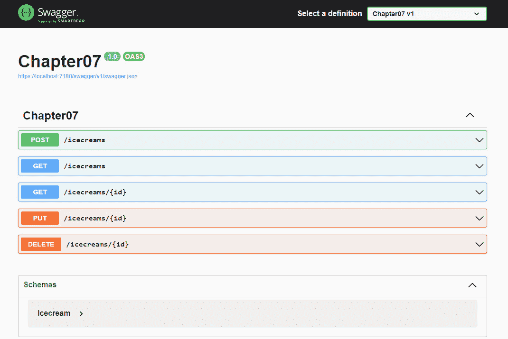
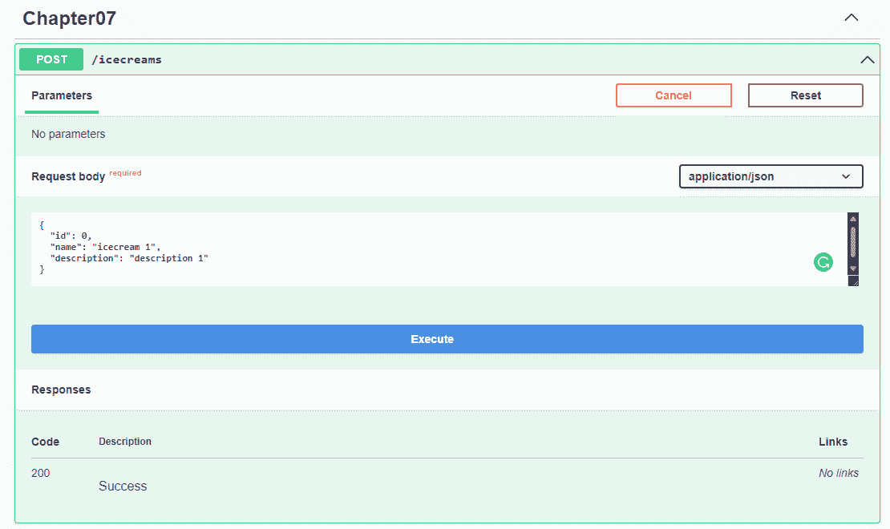
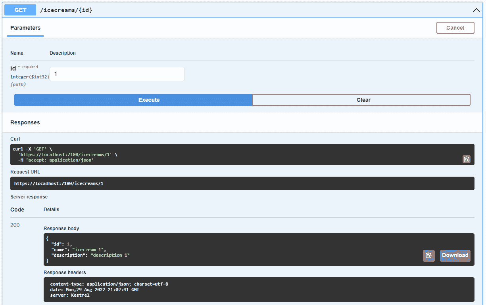

# 第七章：与数据访问层的集成

在本章中，我们将学习一些基本方法，将这些方法添加到.NET 6.0 中最小 API 的数据访问层。我们将看到如何使用本书中之前覆盖的一些主题，使用**Entity Framework**（**EF**）和 Dapper 来访问数据。这是访问数据库的两种方式。

在本章中，我们将涵盖以下主题：

+   使用 Entity Framework

+   使用 Dapper

到本章结束时，你将能够在最小 API 项目中从头开始使用 EF，并使用 Dapper 达到相同的目的。你还将能够判断在项目中哪种方法比另一种方法更好。

# 技术要求

要跟随本章内容，你需要创建一个 ASP.NET Core 6.0 Web API 应用程序。你可以选择以下任一选项：

+   在 Visual Studio 2022 的**文件**菜单中点击**新建项目**选项，然后选择**ASP.NET Core Web API**模板，在向导中选择名称和工作目录，并确保在下一步中取消选中**使用控制器**选项。

+   打开你的控制台、shell 或 Bash 终端，切换到你的工作目录。使用以下命令创建一个新的 Web API 应用程序：

    ```cs
    dotnet new webapi -minimal -o Chapter07
    ```

现在，通过双击项目文件或在 Visual Studio Code 中输入以下命令打开项目：

```cs
cd Chapter07
code.
```

最后，你可以安全地删除与`WeatherForecast`示例相关的所有代码，因为本章我们不需要它。

本章中的所有代码示例都可以在本书的 GitHub 仓库中找到，网址为[`github.com/PacktPublishing/Minimal-APIs-in-ASP.NET-Core-6/tree/main/Chapter07`](https://github.com/PacktPublishing/Minimal-APIs-in-ASP.NET-Core-6/tree/main/Chapter07)。

# 使用 Entity Framework

我们可以绝对地说，如果我们正在构建一个 API，我们很可能需要与数据交互。

此外，这些数据很可能需要在应用程序重启或其他事件（如应用程序的新部署）后持久化。在.NET 应用程序中持久化数据有许多选项，但 EF 对于许多场景来说是最用户友好的和最常用的解决方案。

**Entity Framework Core**（**EF Core**）是一个可扩展的、开源的、跨平台的数据访问库，用于.NET 应用程序。它使开发者能够通过直接使用.NET 对象与数据库交互，并在大多数情况下消除了直接在数据库中编写数据访问代码的需要。

此外，EF Core 支持许多数据库，包括 SQLite、MySQL、Oracle、Microsoft SQL Server 和 PostgreSQL。

此外，它支持内存数据库，这有助于编写我们应用程序的测试或使开发周期更容易，因为你不需要一个真实数据库运行起来。

在下一节中，我们将看到如何设置使用 EF 的项目及其主要功能。

## 设置项目

从项目根目录创建一个 `Icecream.cs` 类，并给它以下内容：

```cs
namespace Chapter07.Models;
public class Icecream
{
    public int Id { get; set; }
    public string? Name { get; set; }
    public string? Description { get; set; }
}
```

`Icecream` 类是我们项目中代表冰淇淋的对象。这个类应该被称为数据模型，我们将在本章的下一部分中使用这个对象将其映射到数据库表。

现在是时候将 EF Core NuGet 引用到项目中了。

为了做到这一点，你可以使用以下方法之一：

+   在一个新的终端窗口中，输入以下代码以添加 EF Core `InMemory` 包：

    ```cs
    dotnet add package Microsoft.EntityFrameworkCore.InMemory
    ```

+   如果你想要使用 Visual Studio 2022 来添加引用，右键单击 `Microsoft.EntityFrameworkCore.InMemory` 并安装包。

在下一节中，我们将向项目中添加 EF Core。

## 向项目中添加 EF Core

为了将冰淇淋对象存储在数据库中，我们需要在我们的项目中设置 EF Core。

为了设置内存数据库，将以下代码添加到 `Program.cs` 文件底部：

```cs
class IcecreamDb : DbContext
{
    public IcecreamDb(DbContextOptions options) :
      base(options) { }
    public DbSet<Icecream> Icecreams { get; set; } = null!;
}
```

`DbContext` 对象代表与数据库的连接，并用于在数据库中保存和查询实体的实例。

`DbSet` 代表实体的实例，它们将被转换为数据库中的实际表。

在这种情况下，我们将只有一个名为 `Icecreams` 的表。

在 `Program.cs` 中，在初始化构建器之后，添加以下代码：

```cs
builder.Services.AddDbContext<IcecreamDb>(options => options.UseInMemoryDatabase("icecreams"));
```

现在我们已经准备好添加一些 API 端点以开始与数据库交互。

## 向项目中添加端点

让我们在 `Program.cs` 中添加创建 `icecreams` 列表中新项目的代码。在 `app.Run()` 代码行之前添加以下代码：

```cs
app.MapPost("/icecreams", async (IcecreamDb db, Icecream icecream) =>
{
    await db.Icecreams.AddAsync(icecream);
    await db.SaveChangesAsync();
    return Results.Created($"/icecreams/{icecream.Id}",
                           icecream);
});
```

`MapPost` 函数的第一个参数是 DbContext。默认情况下，最小 API 架构使用依赖注入来共享 DbContext 的实例。

依赖注入

如果你想要了解更多关于依赖注入的信息，请参阅*第四章**，最小 API 项目中的依赖注入。

为了将项目保存到数据库中，我们直接从表示对象的实体中使用 `AddSync` 方法。

为了将新项目持久化到数据库中，我们需要调用 `SaveChangesAsync()` 方法，该方法负责在最后一次调用 `SaveChangesAsync()` 之前保存数据库中发生的所有更改。

以非常相似的方式，我们可以添加端点以检索 `icecreams` 数据库中的所有项目。

在添加冰淇淋的代码之后，我们可以添加以下代码：

```cs
app.MapGet("/icecreams", async (IcecreamDb db) => await db.Icecreams.ToListAsync());
```

此外，在这种情况下，DbContext 作为参数可用，我们可以直接从 DbContext 中的实体检索数据库中的所有项目。

使用 `ToListAsync()` 方法，应用程序将加载数据库中的所有实体并将它们作为端点结果发送回去。

确保你已经保存了项目中的所有更改并运行了应用程序。

将打开一个新的浏览器窗口，你可以导航到 `/swagger` URL：



图 7.1 – Swagger 浏览器窗口

选择**POST/icecreams**按钮，然后点击**尝试操作**。

将请求体内容替换为以下 JSON：

```cs
{
  "id": 0,
  "name": "icecream 1",
  "description": "description 1"
}
```

点击**执行**：



图 7.2 – Swagger 响应

现在我们数据库中至少有一个条目，我们可以尝试其他端点来检索数据库中的所有条目。

将页面向下滚动一点，然后选择**GET/icecreams**，接着点击**尝试操作**，然后**执行**。

你将在**响应体**下看到包含一个条目的列表。

让我们看看如何通过向我们的端点添加其他 CRUD 操作来最终完成这个第一个演示。

1.  要通过 ID 获取条目，请将以下代码添加到您之前创建的`app.MapGet`路由下：

    ```cs
    app.MapGet("/icecreams/{id}", async (IcecreamDb db, int id) => await db.Icecreams.FindAsync(id));
    ```

要查看这一点，你可以再次启动应用程序，并像以前一样使用 Swagger UI。

1.  接下来，通过执行一个 post 调用（如前节所述）在数据库中添加一个条目。

1.  点击**GET/icecreams/{id}**，然后点击**尝试操作**。

1.  在`id`参数字段中插入值`1`，然后点击**执行**。

1.  你将在**响应体**部分看到条目。

1.  以下是从 API 返回的示例响应：

    ```cs
    {
      "id": 1,
      "name": "icecream 1",
      "description": "description 1"
    }
    ```

这就是响应的样子：



图 7.3 – 响应结果

要通过 ID 更新条目，我们可以创建一个新的`MapPut`端点，包含两个参数：具有实体值的条目和数据库中要更新的旧实体的 ID。

代码应该像以下片段一样：

```cs
app.MapPut("/icecreams/{id}", async (IcecreamDb db, Icecream updateicecream, int id) =>
{
    var icecream = await db.Icecreams.FindAsync(id);
    if (icecream is null) return Results.NotFound();
    icecream.Name = updateicecream.Name;
    icecream.Description = updateicecream.Description;
    await db.SaveChangesAsync();
    return Results.NoContent();
});
```

为了明确起见，首先，我们需要使用参数中的 ID 在数据库中找到条目。如果我们没有在数据库中找到条目，向调用者返回`Not Found` HTTP 状态是一个好的做法。

如果我们在数据库中找到实体，我们将使用新值更新实体，并在发送回 HTTP 状态`No Content`之前将所有更改保存到数据库中。

我们最后需要执行的 CRUD 操作是从数据库中删除条目。

这个操作与更新操作非常相似，因为首先我们需要在数据库中找到该条目，然后我们才能尝试执行删除操作。

以下代码片段展示了如何使用最小 API 的正确 HTTP 动词实现删除操作：

```cs
app.MapDelete("/icecreams/{id}", async (IcecreamDb db, int id) =>
{
    var icecream = await db.Icecreams.FindAsync(id);
    if (icecream is null)
    {
        return Results.NotFound();
    }
    db.Icecreams.Remove(icecream);
    await db.SaveChangesAsync();
    return Results.Ok();
});
```

在本节中，我们学习了如何在最小 API 项目中使用 EF。

我们看到了如何添加 NuGet 包以开始使用 EF，以及如何在最小 API .NET 6 项目中实现整个 CRUD 操作集。

在下一节中，我们将看到如何使用 Dapper 作为主要库来访问数据，以实现具有相同逻辑的相同项目。

# 使用 Dapper

Dapper 是一个`IDbConnection`对象，并提供了许多查询数据库的方法。这意味着我们必须编写与数据库提供程序兼容的查询。

它支持同步和异步方法执行。以下是 Dapper 添加到`IDbConnection`接口的方法列表：

+   `Execute`

+   `Query`

+   `QueryFirst`

+   `QueryFirstOrDefault`

+   `QuerySingle`

+   `QuerySingleOrDefault`

+   `QueryMultiple`

正如我们提到的，它为所有这些方法提供了一个异步版本。你可以在方法名末尾添加`Async`关键字来找到正确的方法。

在下一节中，我们将看到如何设置一个项目以使用 Dapper 和 SQL Server LocalDB。

## 设置项目

我们将要做的第一件事是创建一个新的数据库。你可以使用默认安装的 Visual Studio SQL Server LocalDB 实例或你环境中另一个 SQL Server 实例。

你可以在你的数据库中执行以下脚本以创建一个表并填充数据：

```cs
CREATE TABLE [dbo].Icecreams NOT NULL,
     [Name] nvarchar NOT NULL,
     [Description] nvarchar NOT NULL)
GO
INSERT [dbo].[Icecreams] ([Name], [Description]) VALUES ('Icecream 1','Description 1')
INSERT [dbo].[Icecreams] ([Name], [Description]) VALUES ('Icecream 2','Description 2')
INSERT [dbo].[Icecreams] ([Name], [Description]) VALUES ('Icecream 3','Description 3')
```

一旦我们有了数据库，我们就可以使用以下 Visual Studio 终端中的命令安装这些 NuGet 包：

```cs
Install-Package Dapper
Install-Package Microsoft.Data.SqlClient
```

现在，我们可以继续添加与数据库交互的代码。在这个例子中，我们将使用存储库模式。

## 创建存储库模式

在本节中，我们将创建一个简单的存储库模式，但我们会尽量让它尽可能简单，这样我们就可以理解 Dapper 的主要功能：

1.  在`Program.cs`文件中，添加一个简单的类来表示数据库中的实体：

    ```cs
    public class Icecream
    {
        public int Id { get; set; }
        public string? Name { get; set; }
        public string? Description { get; set; }
    }
    ```

1.  然后，通过在文件末尾添加连接字符串来修改`appsettings.json`文件：

    ```cs
    "ConnectionStrings": {
        "SqlConnection": 
          "Data Source=(localdb)\\MSSQLLocalDB;
           Initial Catalog=Chapter07;
           Integrated Security=True;
           Connect Timeout=30;
           Encrypt=False;
           TrustServerCertificate=False;"
    }
    ```

如果你使用 LocalDB，连接字符串应该适合你的环境。

1.  在项目的根目录中创建一个名为`DapperContext`的新类，并给它以下代码：

    ```cs
    public class DapperContext
    {
        private readonly IConfiguration _configuration;
        private readonly string _connectionString;
        public DapperContext(IConfiguration configuration)
        {
            _configuration = configuration;
            _connectionString = _configuration
              .GetConnectionString("SqlConnection");
        }
        public IDbConnection CreateConnection()
            => new SqlConnection(_connectionString);
    }
    ```

我们通过依赖注入注入了`IConfiguration`接口来从设置文件中检索连接字符串。

1.  现在，我们将创建我们的存储库的接口和实现。为了做到这一点，请将以下代码添加到`Program.cs`文件中。

    ```cs
    public interface IIcecreamsRepository
    {
    }
    public class IcecreamsRepository : IIcecreamsRepository
    {
        private readonly DapperContext _context;
        public IcecreamsRepository(DapperContext context)
        {
            _context = context;
        }
    }
    ```

在下一节中，我们将向接口及其存储库的实现中添加一些代码。

最后，我们可以将上下文、接口及其实现注册为服务。

1.  让我们在`Program.cs`文件中初始化构建器之后放置以下代码：

    ```cs
    builder.Services.AddSingleton<DapperContext>();
    builder.Services.AddScoped<IIcecreamsRepository, IcecreamsRepository>();
    ```

现在，我们准备实现第一个查询。

## 使用 Dapper 查询数据库

首先，让我们通过添加一个新方法来修改`IIcecreamsRepository`接口：

```cs
public Task<IEnumerable<Icecream>> GetIcecreams();
```

然后，让我们在`IcecreamsRepository`类中实现这个方法：

```cs
public async Task<IEnumerable<Icecream>> GetIcecreams()
{
    var query = "SELECT * FROM Icecreams";
    using (var connection = _context.CreateConnection())
    {
        var result = 
          await connection.QueryAsync<Icecream>(query);
        return result.ToList();
    }
}
```

让我们尝试理解这个方法中的所有步骤。我们创建了一个名为`query`的字符串，其中存储了从数据库获取所有实体的 SQL 查询。

然后，在`using`语句内部，我们使用了`DapperContext`来创建连接。

一旦创建了连接，我们就用它来调用`QueryAsync`方法，并将查询作为参数传递。

当结果从数据库返回时，Dapper 会自动将它们转换为`IEnumerable<T>`。

以下是我们接口和第一次实现的最终代码：

```cs
public interface IIcecreamsRepository
{
    public Task<IEnumerable<Icecream>> GetIcecreams();
}
public class IcecreamsRepository : IIcecreamsRepository
{
    private readonly DapperContext _context;
    public IcecreamsRepository(DapperContext context)
    {
        _context = context;
    }
    public async Task<IEnumerable<Icecream>> GetIcecreams()
    {
        var query = "SELECT * FROM Icecreams";
        using (var connection =
              _context.CreateConnection())
        {
            var result = 
              await connection.QueryAsync<Icecream>(query);
            return result.ToList();
        }
    }
}
```

在下一节中，我们将看到如何向数据库添加新实体以及如何使用 `ExecuteAsync` 方法来运行查询。

## 使用 Dapper 在数据库中添加新实体

现在我们将管理添加新实体到数据库，以供 API 带有未来实现请求。

让我们通过添加一个名为 `CreateIcecream` 的新方法来修改接口，该方法接受 `Icecream` 类型的输入参数：

```cs
public Task CreateIcecream(Icecream icecream);
```

现在我们必须在仓储类中实现此方法：

```cs
public async Task CreateIcecream(Icecream icecream)
{
    var query = "INSERT INTO Icecreams (Name, Description)
      VALUES (@Name, @Description)";
    var parameters = new DynamicParameters();
    parameters.Add("Name", icecream.Name, DbType.String);
    parameters.Add("Description", icecream.Description,
                    DbType.String);
    using (var connection = _context.CreateConnection())
    {
        await connection.ExecuteAsync(query, parameters);
    }
}
```

在这里，我们创建查询和一个动态参数对象，将所有值传递到数据库。

我们在方法参数中用 `Icecream` 对象的值填充参数。

我们使用 Dapper 上下文创建连接，然后使用 `ExecuteAsync` 方法执行 `INSERT` 语句。

此方法返回一个整数值作为结果，表示数据库中受影响的行数。在这种情况下，我们不使用此信息，但如果你需要，你可以将此值作为方法的结果返回。

## 在端点中实现仓储

为了给我们的最小 API 添加最后的润色，我们需要实现两个端点来管理仓储模式中的所有方法：

```cs
app.MapPost("/icecreams", async (IIcecreamsRepository repository, Icecream icecream) =>
{
    await repository.CreateIcecream(icecream);
    return Results.Ok();
});
app.MapGet("/icecreams", async (IIcecreamsRepository repository) => await repository.GetIcecreams());
```

在这两个映射方法中，我们传递仓储作为参数，因为在最小 API 中，服务通常作为参数传递给映射方法。

这意味着仓储始终在代码的所有部分中可用。

在 `MapGet` 端点中，我们使用仓储从仓储的实现中加载所有实体，并将结果用作端点的结果。

在 `MapPost` 端点中，除了仓储参数外，我们还接受来自请求体的 `Icecream` 实体，并使用相同的实体作为仓储中 `CreateIcecream` 方法的参数。

# 摘要

在本章中，我们学习了如何在最小 API 项目中使用最常用的工具与数据访问层交互：EF 和 Dapper。

对于 EF，我们介绍了一些基本功能，例如设置项目以使用此 ORM 以及如何执行一些基本操作以实现完整的 CRUD API 端点。

我们也用 Dapper 做了基本上相同的事情，从一个空项目开始，添加 Dapper，设置项目以与 SQL Server LocalDB 一起工作，并实现与数据库实体的一些基本交互。

在下一章中，我们将关注最小 API 项目中的身份验证和授权。首先，保护数据库中的数据非常重要。

# 第三部分：高级开发与微服务概念

在本书的高级部分，我们希望展示更多在后端开发中典型的场景。我们还将讨论这个新框架的性能，并了解它在哪些场景中非常有用。

在本节中，我们将涵盖以下章节：

+   *第八章*, *添加身份验证和授权*

+   *第九章*, *利用全球化和本地化*

+   *第十章*, *评估和基准测试最小 API 的性能*
