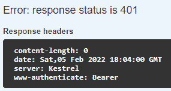
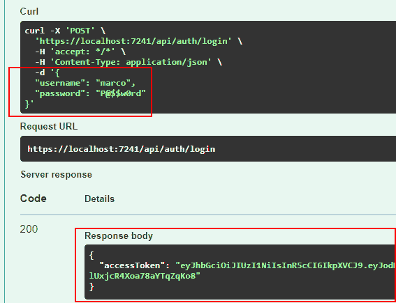
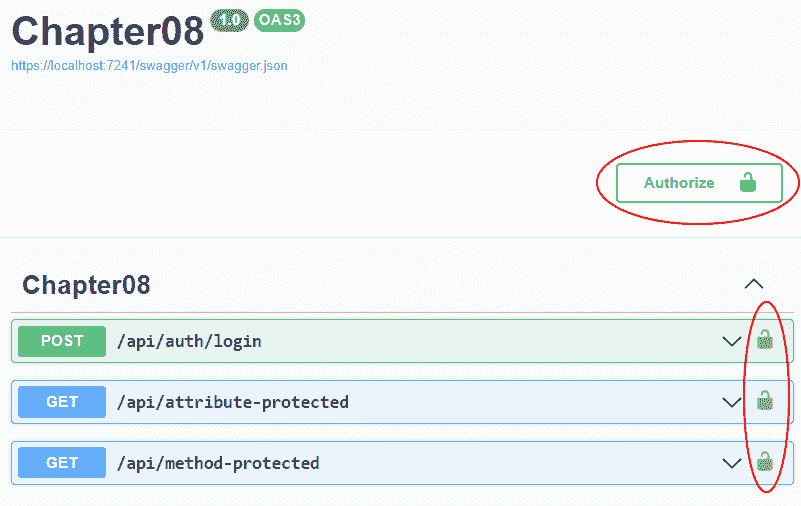
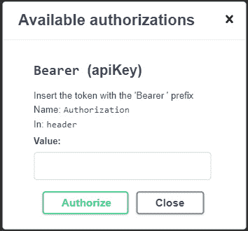

# 8

# 添加身份验证和授权

任何类型的应用程序都必须处理**身份验证**和**授权**。通常，这些术语被交替使用，但实际上它们指的是不同的场景。在本章中，我们将解释身份验证和授权之间的区别，并展示如何将这些功能添加到最小化 API 项目中。

身份验证可以通过多种方式执行：使用本地账户和外部登录提供者，如 Microsoft、Google、Facebook 和 Twitter；使用 Azure Active Directory 和 Azure B2C；以及使用身份验证服务器，如 Identity Server 和 Okta。此外，我们可能还需要处理如双因素身份验证和刷新令牌等要求。然而，在本章中，我们将关注身份验证和授权的一般方面，并了解如何在最小化 API 项目中实现它们，以便提供一个对该主题的总体理解。提供的信息和示例将展示如何有效地处理身份验证和授权，以及如何根据我们的需求自定义它们的行为。

本章将涵盖以下主题：

+   介绍身份验证和授权

+   保护最小化 API

+   处理授权 - 角色和政策

# 技术要求

要遵循本章的示例，您需要创建一个 ASP.NET Core 6.0 Web API 应用程序。请参考*第二章**，探索最小化 API 及其优势*中的*技术要求*部分，了解如何创建应用程序的说明。

如果您正在使用控制台、Shell 或 Bash 终端创建 API，请记住将工作目录更改为当前章节号：`Chapter08`。

本章中的所有代码示例都可以在本书的 GitHub 仓库中找到，网址为[`github.com/PacktPublishing/Minimal-APIs-in-ASP.NET-Core-6/tree/main/Chapter08`](https://github.com/PacktPublishing/Minimal-APIs-in-ASP.NET-Core-6/tree/main/Chapter08)。

# 介绍身份验证和授权

如开头所述，术语身份验证和授权经常被交替使用，但它们代表不同的安全功能。身份验证是验证用户是否是他们所说的那人的过程，而授权是授予经过身份验证的用户执行某事的权限的任务。因此，授权必须始终跟在身份验证之后。

让我们思考一下机场的安全问题：首先，您需要出示身份证以验证您的身份；然后，在登机口，您需要出示登机牌以获得登机授权并进入飞机。

ASP.NET Core 中的身份验证和授权由相应的中间件处理，在最小化 API 和基于控制器的项目中工作方式相同。它们允许根据用户身份、角色、策略等限制对端点的访问，正如我们将在以下部分中详细了解的那样。

你可以在官方文档中找到关于 ASP.NET Core 身份验证和授权的精彩概述，这些文档可在以下网址找到：[`docs.microsoft.com/aspnet/core/security/authentication`](https://docs.microsoft.com/aspnet/core/security/authentication) 和 [`docs.microsoft.com/aspnet/core/security/authorization`](https://docs.microsoft.com/aspnet/core/security/authorization)。

# 保护最小化 API

保护最小化 API 意味着正确设置身份验证和授权。现代应用程序中采用了许多类型的身份验证解决方案。在 Web 应用程序中，我们通常使用 cookies，而在处理 Web API 时，我们使用 API 密钥、基本身份验证以及 **JSON Web Token**（**JWT**）等方法。JWT 是最常用的，在接下来的章节中，我们将重点介绍这个解决方案。

注意

了解 JWT 是什么以及如何使用的良好起点是 [`jwt.io/introduction`](https://jwt.io/introduction)。

要启用基于 JWT 的身份验证和授权，首先需要将 `Microsoft.AspNetCore.Authentication.JwtBearer` NuGet 包添加到我们的项目中，可以使用以下方法之一：

+   `Microsoft.AspNetCore.Authentication.JwtBearer` 并点击 **安装**。

+   **选项 2**：如果你在 Visual Studio 2022 中，请打开 **包管理器控制台**，或者打开你的控制台、shell 或 Bash 终端，转到你的项目目录，并执行以下命令：

    ```cs
    dotnet add package Microsoft.AspNetCore.Authentication.JwtBearer
    ```

现在，我们需要将身份验证和授权服务添加到服务提供程序中，以便它们可以通过依赖注入使用：

```cs
var builder = WebApplication.CreateBuilder(args);
//...
builder.Services.AddAuthentication(JwtBearerDefaults.AuthenticationScheme).AddJwtBearer();
builder.Services.AddAuthorization();
```

这是将 JWT 身份验证和授权支持添加到 ASP.NET Core 项目的最小代码。它还不是真正的解决方案，因为它缺少实际的配置，但它足以验证端点保护的工作方式。

在 `AddAuthentication()` 方法中，我们指定我们想要使用格式为 `Authorization: Bearer <token>` 的 `Authorization` HTTP 标头。然后，我们调用 `AddJwtBearer()` 来告诉 ASP.NET Core 它必须期望一个 JWT 格式的承载令牌。正如我们稍后将会看到的，承载令牌是服务器在响应登录请求时生成的编码字符串。之后，我们使用 `AddAuthorization()` 来添加授权服务。

现在，我们需要在管道中插入身份验证和授权中间件，以便 ASP.NET Core 将被指示检查令牌并应用所有授权规则：

```cs
var app = builder.Build();
//..
app.UseAuthentication();
app.UseAuthorization();
//...
app.Run();
```

重要提示

我们已经说过，授权必须跟随认证。这意味着认证中间件必须首先执行；否则，安全机制将无法按预期工作。

最后，我们可以使用`Authorize`属性或`RequireAuthorization()`方法来保护我们的端点：

```cs
app.MapGet("/api/attribute-protected", [Authorize] () => "This endpoint is protected using the Authorize attribute");
app.MapGet("/api/method-protected", () => "This endpoint is protected using the RequireAuthorization method")
.RequireAuthorization();
```

注意

在上一个示例的第一个端点中，直接在 lambda 表达式中指定一个属性（如 C# 10 的新特性）。

如果我们现在尝试使用 Swagger 调用这些方法中的每一个，我们将得到一个`401 unauthorized`响应，其外观应如下所示：



图 8.1 – Swagger 中的未授权响应

注意，消息中包含一个标题，指示预期的认证方案是`Bearer`，正如我们在代码中所声明的。

因此，现在我们知道了如何限制对端点的访问，只允许经过认证的用户。但我们的工作还没有完成：我们需要生成 JWT 载体，验证它，并找到一种方法将此类令牌传递给 Swagger，以便我们可以测试受保护的端点。

## 生成 JWT 载体

我们已经说过，JWT 载体是由服务器在响应登录请求时生成的。ASP.NET Core 提供了我们创建 JWT 载体的所有 API，所以让我们看看如何执行这个任务。

首先要做的事情是定义登录请求端点，使用用户名和密码来验证用户：

```cs
app.MapPost("/api/auth/login", (LoginRequest request) =>
{
    if (request.Username == "marco" && request.Password == 
        "P@$$w0rd")
    {
        // Generate the JWT bearer...
    }
    return Results.BadRequest();
});
```

为了简化起见，在前面的示例中，我们使用了硬编码的值，但在实际应用中，我们会使用例如**ASP.NET Core Identity**，这是 ASP.NET Core 中负责用户管理的部分。有关此主题的更多信息，请参阅官方文档[`docs.microsoft.com/aspnet/core/security/authentication/identity`](https://docs.microsoft.com/aspnet/core/security/authentication/identity)。

在典型的登录流程中，如果凭证无效，我们向客户端返回一个`400 Bad Request`响应。如果用户名和密码正确，我们可以使用 ASP.NET Core 中可用的类有效地生成 JWT 载体：

```cs
var claims = new List<Claim>()
{
    new(ClaimTypes.Name, request.Username)
};
var securityKey = new SymmetricSecurityKey(Encoding.UTF8.GetBytes("mysecuritystring"));
var credentials = new SigningCredentials(securityKey, SecurityAlgorithms.HmacSha256);
var jwtSecurityToken = new JwtSecurityToken(
    issuer: "https://www.packtpub.com",
    audience: "Minimal APIs Client",
    claims: claims, expires: DateTime.UtcNow.AddHours(1), 
      signingCredentials: credentials);
var accessToken = new JwtSecurityTokenHandler()
  .WriteToken(jwtSecurityToken);
return Results.Ok(new { AccessToken = accessToken });
```

JWT 载体的创建涉及许多不同的概念，但通过前面的代码示例，我们将关注基本概念。这种载体包含允许验证用户身份的信息，以及描述用户属性的其他声明。这些属性被称为**声明**，并以字符串键值对的形式表示。在前面的代码中，我们创建了一个包含用户名的单个声明的列表。我们可以添加我们需要的任何数量的声明，也可以有具有相同名称的声明。在下一节中，我们将看到如何使用声明，例如，来执行授权。

在前面的代码中，接下来我们定义了用于签名 JWT 承载的凭证（`SigningCredentials`）。签名取决于实际的令牌内容，并用于检查令牌是否被篡改。实际上，如果我们更改令牌中的任何内容，例如声明值，签名将相应地更改。由于承载签名的密钥只有服务器知道，第三方无法修改令牌并保持其有效性。在前面的代码中，我们使用了 `SymmetricSecurityKey`，这个密钥永远不会与客户端共享。

我们使用了一个简短的字符串来创建凭证，但唯一的要求是密钥至少为 32 字节或 16 个字符长。在.NET 中，字符串是 Unicode，因此每个字符占用 2 个字节。我们还需要设置凭证将用于签名令牌的算法。为此，我们指定了 `SecurityAlgorithms.HmacSha256` 值。在这个场景中，这是一个相当常见的选项。

注意

你可以在 [`docs.microsoft.com/dotnet/api/system.security.cryptography.hmacsha256#remarks`](https://docs.microsoft.com/dotnet/api/system.security.cryptography.hmacsha256#remarks) 找到有关 HMAC 和 SHA256 哈希函数的更多信息。

到此为止，在前面代码的这一部分，我们终于拥有了创建令牌所需的所有信息，因此我们可以实例化一个 `JwtSecurityToken` 对象。这个类可以使用许多参数来构建令牌，但为了简单起见，我们只为工作示例指定了最小集：

+   **发行者**：一个字符串（通常是 URI），用于标识创建令牌的实体的名称

+   **受众**：JWT 旨在接收的接收者，即谁可以消费令牌

+   声明的列表

+   令牌的过期时间（UTC 时间）

+   签名凭证

小贴士

在前面的代码示例中，用于构建令牌的值是硬编码的，但在实际应用中，我们应该将它们放置在外部源中，例如在 `appsettings.json` 配置文件中。

你可以在 [`docs.microsoft.com/dotnet/api/system.identitymodel.tokens.jwt.jwtsecuritytoken`](https://docs.microsoft.com/dotnet/api/system.identitymodel.tokens.jwt.jwtsecuritytoken) 找到有关创建令牌的更多信息。

在所有前面的步骤之后，我们可以创建 `JwtSecurityTokenHandler`，它负责实际生成承载令牌并将其以 `200 OK` 响应返回给调用者。

因此，现在我们可以尝试 Swagger 中的 `login` 端点。在插入正确的用户名和密码并点击 **执行** 按钮后，我们将得到以下响应：



图 8.2 – Swagger 中登录请求的结果 JWT 承载

我们可以复制令牌值并将其插入到网站的 URL 中 [`jwt.ms`](https://jwt.ms) 以查看其内容。我们会得到类似以下的内容：

```cs
{
  "alg": "HS256",
  "typ": "JWT"
}.{
  "http://schemas.xmlsoap.org/ws/2005/05/identity/claims/name": "marco",
  "exp": 1644431527,
  "iss": "https://www.packtpub.com",
  "aud": "Minimal APIs Client"
}.[Signature]
```

尤其是我们看到已经配置的声明：

+   `name`：登录用户的名称

+   `exp`：令牌过期时间，以 Unix 纪元表示

+   `iss`：令牌的发行者

+   `aud`：令牌的受众（接收者）

这是原始视图，但我们可以切换到 **Claims** 选项卡来查看所有声明的解码列表，以及它们的含义描述（如果有的话）。

有一个重要的问题需要注意：默认情况下，JWT 持证人未加密（它只是一个 Base64 编码的字符串），因此任何人都可以读取其内容。令牌的安全性不取决于无法解码，而在于它是经过签名的。即使令牌的内容是透明的，也无法修改它，因为在这种情况下，签名（使用只有服务器才知道的密钥）将变得无效。

因此，不要在令牌中插入敏感数据是很重要的；例如，用户名、用户 ID 和角色这样的声明通常是安全的，但例如，我们不应插入与隐私相关的信息。为了给出一个故意夸张的例子，我们绝对不能在令牌中插入信用卡号码！在任何情况下，请记住，即使是微软的 Azure Active Directory 也使用 JWT，没有加密，因此我们可以信任这个安全系统。

总之，我们已经描述了如何获取有效的 JWT。下一步是将令牌传递到我们的受保护端点，并指导我们的最小 API 如何验证它。

## 验证 JWT 持证人

在创建 JWT 持证人之后，我们需要在每次 HTTP 请求中将其传递，在 `Authorization` HTTP 标头内部，以便 ASP.NET Core 可以验证其有效性并允许我们调用受保护的端点。因此，我们必须完成之前展示的 `AddJwtBearer()` 方法调用，并描述验证持证人的规则：

```cs
builder.Services.AddAuthentication(JwtBearerDefaults.AuthenticationScheme)
.AddJwtBearer(options =>
{
    options.TokenValidationParameters = new TokenValidationParameters
    {
        ValidateIssuerSigningKey = true,
        IssuerSigningKey = new SymmetricSecurityKey(
          Encoding.UTF8.GetBytes("mysecuritystring")),
        ValidIssuer = "https://www.packtpub.com",
        ValidAudience = "Minimal APIs Client"
    };
});
```

在前面的代码中，我们添加了一个 lambda 表达式，用它定义了包含令牌验证规则的 `TokenValidationParameter` 对象。首先，我们检查了发行者签名密钥，即令牌的签名，如 *生成 JWT 持证人* 部分所示，以验证 JWT 是否被篡改。用于签名的安全字符串是执行此检查所必需的，因此我们指定了与登录请求期间插入的相同的值（`mysecuritystring`）。

然后，我们指定令牌发行者和受众的有效值。如果令牌是由不同的发行者发出的，或者是为另一个受众准备的，验证将失败。这是一个重要的安全检查；我们应该确保持证人是由我们期望发行它的人发行的，并且是为我们想要的受众。

提示

正如已经指出的，我们应该将用于处理令牌的信息放置在外部源中，这样我们就可以在令牌生成和验证期间引用正确的值，避免硬编码它们或重复写入它们的值。

我们不需要指定我们还想验证令牌过期，因为这个检查是自动启用的。在验证时间时应用时钟偏移，以补偿时钟时间的微小差异或处理客户端请求与服务器处理该请求的瞬间之间的延迟。默认值是 5 分钟，这意味着过期令牌在其实际过期后的 5 分钟时间内被视为有效。我们可以通过使用`TokenValidationParameter`类的`ClockSkew`属性来减少时钟偏移，或禁用它。

现在，最小化的 API 已经包含了检查携带令牌有效性的所有信息。为了测试是否一切按预期工作，我们需要一种方法告诉 Swagger 如何在请求中发送令牌，正如我们将在下一节中看到的。

## 将 JWT 支持添加到 Swagger

我们已经说过，携带令牌被发送在请求的`Authorization` HTTP 头部中。如果我们想使用 Swagger 验证认证系统并测试我们的受保护端点，我们需要更新配置，使其能够将此头部包含在请求中。

要执行此任务，需要在`AddSwaggerGen()`方法中添加一些代码：

```cs
var builder = WebApplication.CreateBuilder(args);
//...
builder.Services.AddSwaggerGen(options =>
{
    options.AddSecurityDefinition(JwtBearerDefaults.AuthenticationScheme, new OpenApiSecurityScheme
    {
        Type = SecuritySchemeType.ApiKey,
        In = ParameterLocation.Header,
        Name = HeaderNames.Authorization,
        Description = "Insert the token with the 'Bearer ' 
                       prefix"
    });
    options.AddSecurityRequirement(new
      OpenApiSecurityRequirement
    {
        {
            new OpenApiSecurityScheme
            {
                Reference = new OpenApiReference
                {
                    Type = ReferenceType.SecurityScheme,
                    Id = 
                     JwtBearerDefaults.AuthenticationScheme
                }
            },
            Array.Empty<string>()
        }
    });
});
```

在前面的代码中，我们定义了 Swagger 如何处理认证。使用`AddSecurityDefinition()`方法，我们描述了我们的 API 是如何受到保护的；我们使用了一个 API 密钥，即携带令牌，在名为`Authorization`的头部中。然后，通过`AddSecurityRequirement()`，我们指定了我们端点有一个安全要求，这意味着必须为每个请求发送安全信息。

在添加了前面的代码之后，如果我们现在运行我们的应用程序，Swagger UI 将包含一些新的内容。



图 8.3 – Swagger 显示的认证功能

点击**授权**按钮或端点右侧的任何锁形图标时，将显示以下窗口，允许我们插入携带令牌：



图 8.4 – 允许设置携带令牌的窗口

最后要做的事情是将令牌插入到**值**文本框中，并通过点击**授权**来确认。从现在起，指定的携带者将随 Swagger 发出的每个请求一起发送。

我们终于完成了添加到最小 API 的认证支持所需的所有步骤。现在，是时候验证一切是否按预期工作了。在下一节中，我们将进行一些测试。

## 测试认证

如前几节所述，如果我们调用受保护的端点之一，我们会得到一个`401 未授权`响应。为了验证令牌认证是否工作，让我们调用`login`端点以获取令牌。之后，点击`Bearer<空格>`前缀。现在，我们将得到一个`200 OK`响应，这意味着我们能够正确调用需要认证的端点。我们还可以尝试更改令牌中的一个字符，再次得到`401 未授权`响应，因为在这种情况下，签名将不会是预期的，如之前所述。同样，如果令牌形式上有效但已过期，我们也会得到一个`401`响应。

正如我们在前面定义了只能由认证用户访问的端点，一个常见的需求是在相应的路由处理程序中访问用户信息。在*第二章*，*探索 Minimal APIs 及其优势*中，我们展示了 Minimal APIs 提供了一个特殊的绑定，该绑定直接提供了一个表示已登录用户的`ClaimsPrincipal`对象：

```cs
app.MapGet("/api/me", [Authorize] (ClaimsPrincipal user) => $"Logged username: {user.Identity.Name}");
```

路由处理程序的`user`参数会自动填充用户信息。在这个例子中，我们只获取名称，该名称反过来是从令牌声明中读取的，但该对象公开了许多属性，使我们能够处理认证数据。我们可以参考[`docs.microsoft.com/dotnet/api/system.security.claims.claimsprincipal.identity`](https://docs.microsoft.com/dotnet/api/system.security.claims.claimsprincipal.identity)的官方文档以获取更多详细信息。

这就结束了我们对认证的概述。在下一节中，我们将看到如何处理授权。

# 处理授权 - 角色和政策

在认证之后，紧接着是授权步骤，它授予认证用户执行某些操作的权限。Minimal APIs 提供了与基于控制器的项目相同的授权功能，基于**角色**和**策略**的概念。

当创建一个身份时，它可能属于一个或多个角色。例如，一个用户可以属于`管理员`角色，而另一个用户可以是两个角色：`用户`和`利益相关者`。通常，每个用户只能执行其角色允许的操作。角色只是在认证时插入到 JWT 载体中的声明。正如我们稍后将看到的，ASP.NET Core 提供了内置支持来验证用户是否属于某个角色。

虽然基于角色的授权覆盖了许多场景，但有些情况下这种安全措施是不够的，因为我们需要应用更具体的规则来检查用户是否有权执行某些活动。在这种情况下，我们可以创建自定义策略，使我们能够指定更详细的授权要求，甚至可以根据我们的算法完全定义授权逻辑。

在接下来的章节中，我们将看到如何在我们的 API 中管理基于角色和基于策略的授权，以便我们可以覆盖所有要求，即仅允许具有特定角色或声明的用户或基于我们自定义逻辑的用户访问某些端点。

## 处理基于角色的授权

如已介绍，角色是声明。这意味着它们必须在认证时插入到 JWT 携带者令牌中，就像任何其他声明一样：

```cs
app.MapPost("/api/auth/login", (LoginRequest request) =>
{
    if (request.Username == "marco" && request.Password == 
        "P@$$w0rd")
    {
        var claims = new List<Claim>()
        {
            new(ClaimTypes.Name, request.Username),
            new(ClaimTypes.Role, "Administrator"),
            new(ClaimTypes.Role, "User")
        };

    //...
}
```

在这个例子中，我们静态地添加了两个名为 `ClaimTypes.Role` 的声明：`Administrator` 和 `User`。正如前几节所述，在现实世界的应用中，这些值通常来自一个完整的用户管理系统，例如使用 ASP.NET Core Identity 构建的系统。

正如所有其他声明一样，角色被插入到 JWT 携带者中。如果我们现在尝试调用 `login` 端点，我们会注意到令牌变长了，因为它包含了很多信息，我们可以再次使用 [`jwt.ms`](https://jwt.ms) 网站来验证这些信息，如下所示：

```cs
{
  "alg": "HS256",
  "typ": "JWT"
}.{
  "http://schemas.xmlsoap.org/ws/2005/05/identity/claims/name": "marco",
  "http://schemas.microsoft.com/ws/2008/06/identity/claims/role": [
    "Administrator",
    "User"
  ],
  "exp": 1644755166,
  "iss": "https://www.packtpub.com",
  "aud": "Minimal APIs Client"
}.[Signature]
```

为了仅允许属于特定角色的用户访问特定端点，我们需要在 `Authorize` 属性或 `RequireAuthorization()` 方法中将此角色指定为参数：

```cs
app.MapGet("/api/admin-attribute-protected", [Authorize(Roles = "Administrator")] () => { });
app.MapGet("/api/admin-method-protected", () => { })
.RequireAuthorization(new AuthorizeAttribute { Roles = "Administrator" });
```

这样，只有被分配了 `Administrator` 角色的用户才能访问端点。我们还可以指定更多角色，用逗号分隔它们：如果用户至少有一个指定的角色，则他们将获得授权。

重要提示

角色名称是区分大小写的。

现在假设我们有以下端点：

```cs
app.MapGet("/api/stackeholder-protected", [Authorize(Roles = "Stakeholder")] () => { });
```

此方法只能由分配了 `Stakeholder` 角色的用户消费。然而，在我们的例子中，这个角色没有被分配。因此，如果我们使用之前的携带令牌并尝试调用此端点，当然我们会得到一个错误。但在这个情况下，它不会是 `401 未授权`，而是 `403 禁止访问`。我们观察到这种行为是因为用户实际上是经过认证的（这意味着令牌是有效的，因此没有 `401` 错误），但他们没有执行方法的授权，因此访问被禁止。换句话说，认证错误和授权错误会导致不同的 HTTP 状态码。

另一个重要的场景涉及到角色。有时，我们根本不需要限制端点的访问，但需要根据特定的用户角色调整处理器的行为，例如在检索特定类型的信息时。在这种情况下，我们可以使用 `IsInRole()` 方法，该方法在 `ClaimsPrincipal` 对象上可用：

```cs
app.MapGet("/api/role-check", [Authorize] (ClaimsPrincipal user) =>
{
    if (user.IsInRole("Administrator"))
    {
        return "User is an Administrator";
    }
    return "This is a normal user";
});
```

在此端点中，我们只使用 `Authorize` 属性来检查用户是否经过认证。然后，在路由处理器中，我们检查用户是否有 `Administrator` 角色。如果有，我们只返回一条消息，但我们可以想象管理员可以检索所有可用的信息，而普通用户只能根据信息的值获取子集。

正如我们所见，通过基于角色的授权，我们可以在端点中执行不同类型的授权检查，以覆盖许多场景。然而，这种方法并不能处理所有情况。如果角色不足以满足需求，我们需要使用基于策略的授权，我们将在下一节中讨论。

## 应用基于策略的授权

策略是定义授权规则的一种更通用的方式。基于角色的授权可以被视为涉及角色检查的特定策略授权。我们通常在需要处理更复杂场景时使用策略。

这种授权需要两个步骤：

1.  定义包含规则集的策略

1.  在端点上应用特定策略

策略是在上一节中提到的`AddAuthorization()`方法上下文中添加的，即保护最小 API。每个策略都有一个唯一的名称，用于稍后引用，以及一组规则，这些规则通常以流畅的方式描述。

当角色授权不足以满足需求时，我们可以使用策略。假设携带令牌的用户所属的租户 ID 也包含在内：

```cs
var claims = new List<Claim>()
{
    // ...
    new("tenant-id", "42")
};
```

再次强调，在现实世界的场景中，这个值可能来自存储用户属性的数据库。假设我们只想允许属于特定租户的用户访问端点。由于`tenant-id`是一个自定义声明，ASP.NET Core 不知道如何使用它来执行授权。因此，我们无法使用之前展示的解决方案。我们需要定义一个包含相应规则的定制策略：

```cs
builder.Services.AddAuthorization(options =>
{
    options.AddPolicy("Tenant42", policy =>
    {
        policy.RequireClaim("tenant-id", "42");
    });
});
```

在前面的代码中，我们创建了一个名为`Tenant42`的策略，该策略要求令牌包含值为`42`的`tenant-id`声明。`policy`变量是`AuthorizationPolicyBuilder`的一个实例，它公开了允许我们流畅地指定授权规则的方法；我们可以指定策略需要满足某些用户、角色和声明。我们还可以在同一个策略中链式添加多个要求，例如，可以编写`policy.RequireRole("Administrator").RequireClaim("tenant-id")`这样的代码。完整的方法列表可以在文档页面[`docs.microsoft.com/dotnet/api/microsoft.aspnetcore.authorization.authorizationpolicybuilder`](https://docs.microsoft.com/dotnet/api/microsoft.aspnetcore.authorization.authorizationpolicybuilder)上找到。

然后，在我们要保护的函数中，我们必须指定策略名称，就像通常使用`Authorize`属性或`RequireAuthorization()`方法一样：

```cs
app.MapGet("/api/policy-attribute-protected", [Authorize(Policy = "Tenant42")] () => { });
app.MapGet("/api/policy-method-protected", () => { })
.RequireAuthorization("Tenant42");
```

如果我们尝试使用没有`tenant-id`声明或其值不是`42`的令牌执行这些前面的端点，我们将得到一个`403 Forbidden`的结果，就像角色检查发生时一样。

有一些场景，仅仅声明允许的角色和声明是不够的：例如，我们需要执行更复杂的检查或根据动态参数验证授权。在这些情况下，我们可以使用所谓的**策略要求**，它包含一组授权规则，我们可以为这些规则提供自定义验证逻辑。

为了采用这种解决方案，我们需要两个对象：

+   一个实现`IAuthorizationRequirement`接口并定义我们想要管理的需求的*要求类*

+   一个继承自`AuthorizationHandler`并包含验证要求逻辑的*处理器类*

假设我们不想让不属于`Administrator`角色的用户在维护时间窗口期间访问某些端点。这是一个完全有效的授权规则，但我们不能使用我们迄今为止看到的解决方案来实现它。该规则涉及一个考虑当前时间的条件，因此策略不能静态定义。

因此，我们首先创建一个自定义要求：

```cs
public class MaintenanceTimeRequirement : IAuthorizationRequirement
{
    public TimeOnly StartTime { get; init; }
    public TimeOnly EndTime { get; init; }
}
```

要求包含维护窗口的开始和结束时间。在此期间，我们只希望管理员能够操作。

注意

`TimeOnly`是 C# 10 中引入的新数据类型，它允许我们只存储一天中的时间（而不是日期）。更多信息请参阅[`docs.microsoft.com/dotnet/api/system.timeonly`](https://docs.microsoft.com/dotnet/api/system.timeonly)。

注意，`IAuthorizationRequirement`接口只是一个占位符。它不包含任何需要实现的方法或属性；它仅用于标识该类是一个要求。换句话说，如果我们不需要任何额外的信息来满足要求，我们可以创建一个实现`IAuthorizationRequirement`但没有内容的类。

这个要求必须得到强制执行，因此有必要创建相应的处理器：

```cs
public class MaintenanceTimeAuthorizationHandler
    : AuthorizationHandler<MaintenanceTimeRequirement>
{
    protected override Task HandleRequirementAsync(
        AuthorizationHandlerContext context,
        MaintenanceTimeRequirement requirement)
    {
        var isAuthorized = true;
        if (!context.User.IsInRole("Administrator"))
        {
            var time = TimeOnly.FromDateTime(DateTime.Now);
            if (time >= requirement.StartTime && time <
                requirement.EndTime)
            {
                isAuthorized = false;
            }
        }
        if (isAuthorized)
        {
            context.Succeed(requirement);
        }
        return Task.CompletedTask;
    }
}
```

我们的处理器继承自`AuthorizationHandler<MaintenanceTimeRequirement>`，因此我们需要重写`HandleRequirementAsync()`方法来验证要求，使用`AuthorizationHandlerContext`参数，它包含对当前用户的引用。正如一开始所说的，如果用户没有被分配`Administrator`角色，我们检查当前时间是否在维护窗口内。如果是这样，用户没有访问权限。

最后，如果`isAuthorized`变量为`true`，则表示授权可以被授予，因此我们在`context`对象上调用`Succeed()`方法，并传递我们想要验证的要求。否则，我们不在上下文中调用任何方法，这意味着要求尚未被验证。

我们还没有完成自定义策略的实现。我们仍然需要定义策略并在服务提供程序中注册处理器：

```cs
builder.Services.AddAuthorization(options =>
{
    options.AddPolicy("TimedAccessPolicy", policy =>
    {
        policy.Requirements.Add(new
          MaintenanceTimeRequirement
        {
            StartTime = new TimeOnly(0, 0, 0),
            EndTime = new TimeOnly(4, 0, 0)
        });
    });
});
builder.Services.AddScoped<IAuthorizationHandler, MaintenanceTimeAuthorizationHandler>();
```

在前面的代码中，我们定义了一个从午夜到早上 4:00 的维护时间窗口。然后，我们将处理器注册为`IAuthorizationHandler`接口的实现，该接口反过来由`AuthorizationHandler`类实现。

现在我们已经准备好了所有东西，我们可以将策略应用到我们的端点：

```cs
app.MapGet("/api/custom-policy-protected", [Authorize(Policy = "TimedAccessPolicy")] () => { });
```

当我们尝试访问此端点时，ASP.NET Core 将检查相应的策略，发现其中包含一个要求，并扫描所有`IAuhorizationHandler`接口的注册，以查看是否存在能够处理该要求的处理器。然后，将调用处理器，并使用结果来确定用户是否有权访问路由。如果策略未经验证，我们将得到一个`403 Forbidden`响应。

我们已经展示了策略是多么强大，但还有更多。我们还可以使用它们来定义应用于所有端点的全局规则，使用默认和回退策略的概念，正如我们将在下一节中看到的。

## 使用默认和回退策略

当我们想要定义必须自动应用的全局规则时，默认和回退策略是有用的。实际上，当我们使用`Authorize`属性或`RequireAuthorization()`方法，并且没有其他参数时，我们隐式地引用 ASP.NET Core 定义的默认策略，该策略设置为需要认证用户。

如果我们想使用默认的不同条件，我们只需重新定义`DefaultPolicy`属性，该属性在`AddAuthorization()`方法的上下文中可用：

```cs
builder.Services.AddAuthorization(options =>
{
    var policy = new AuthorizationPolicyBuilder()
      .RequireAuthenticatedUser()
        .RequireClaim("tenant-id").Build();
    options.DefaultPolicy = policy;    
});
```

我们使用`AuthorizationPolicyBuilder`来定义所有安全要求，然后将其设置为默认策略。这样，即使我们没有在`Authorize`属性或`RequireAuthorization()`方法中指定自定义策略，系统也会始终验证用户是否已认证，以及携带者是否包含`tenant-id`声明。当然，我们只需在授权属性或方法中指定角色或策略名称即可覆盖此默认行为。

另一方面，回退策略是在端点没有授权信息时应用的策略。例如，当我们希望所有端点自动受到保护，即使我们忘记指定`Authorize`属性或者不想为每个处理器重复属性时，它是有用的。让我们通过以下代码来尝试理解这一点：

```cs
builder.Services.AddAuthorization(options =>
{
    options.FallbackPolicy = options.DefaultPolicy;
});
```

在前面的代码中，`FallbackPolicy`等于`DefaultPolicy`。我们说过默认策略要求用户必须认证，所以这段代码的结果是现在，所有端点自动需要认证，即使我们没有明确保护它们。

这是在我们的大多数端点都有受限访问时采用的一种典型解决方案。我们不再需要指定`Authorize`属性或使用`RequireAuthorization()`方法。换句话说，现在所有我们的端点都默认受到保护。

如果我们决定使用这种方法，但有一堆端点需要公开访问，例如`login`端点，每个人都应该能够调用，我们可以使用`AllowAnonymous`属性或`AllowAnonymous()`方法：

```cs
app.MapPost("/api/auth/login", [AllowAnonymous] (LoginRequest request) => { });
// OR
app.MapPost("/api/auth/login", (LoginRequest request) => { })
.AllowAnonymous();
```

如其名所示，前面的代码将绕过端点的所有授权检查，包括默认和回退授权策略。

要深化我们对基于策略的身份验证的了解，我们可以参考官方文档，网址为[`docs.microsoft.com/aspnet/core/security/authorization/policies`](https://docs.microsoft.com/aspnet/core/security/authorization/policies)。

# 摘要

了解最小化 API 中的身份验证和授权工作原理对于开发安全的应用程序是基本的。使用 JWT 载体身份验证角色和政策，我们甚至可以定义复杂的授权场景，并能够使用标准和自定义规则。

在本章中，我们介绍了使服务安全的基本概念，但还有更多内容要讨论，特别是关于 ASP.NET Core Identity：一个支持登录功能并允许管理用户、密码、个人资料数据、角色、声明等的 API。我们可以通过查看官方文档来进一步了解这个主题，该文档可在[`docs.microsoft.com/aspnet/core/security/authentication/identity`](https://docs.microsoft.com/aspnet/core/security/authentication/identity)找到。

在下一章中，我们将看到如何为我们的最小化 API 添加多语言支持，以及如何正确处理使用不同日期格式、时区等的应用程序。
