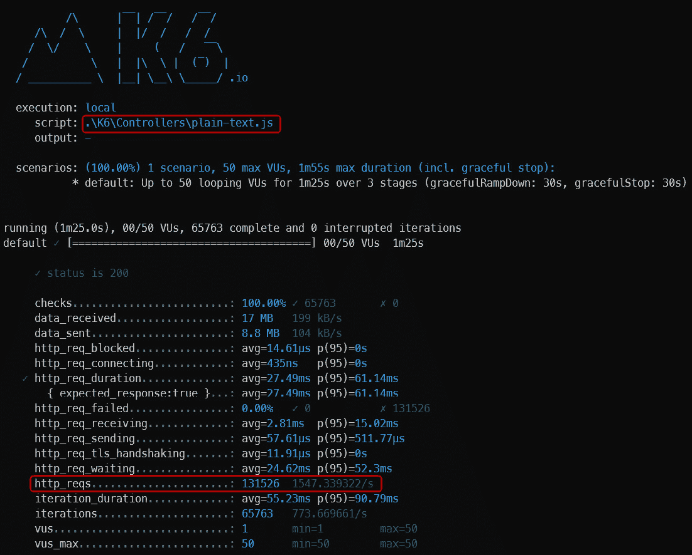
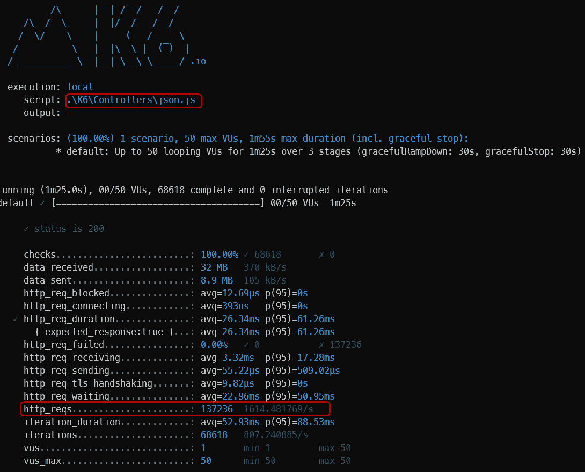
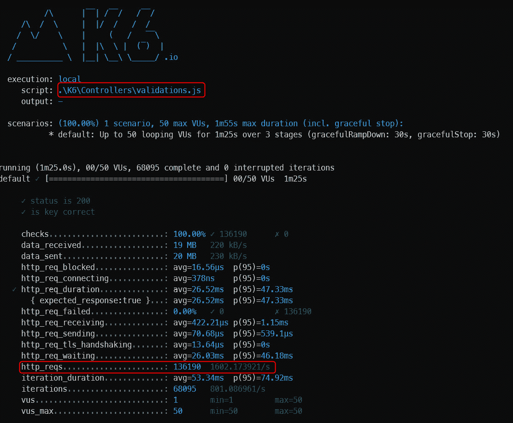
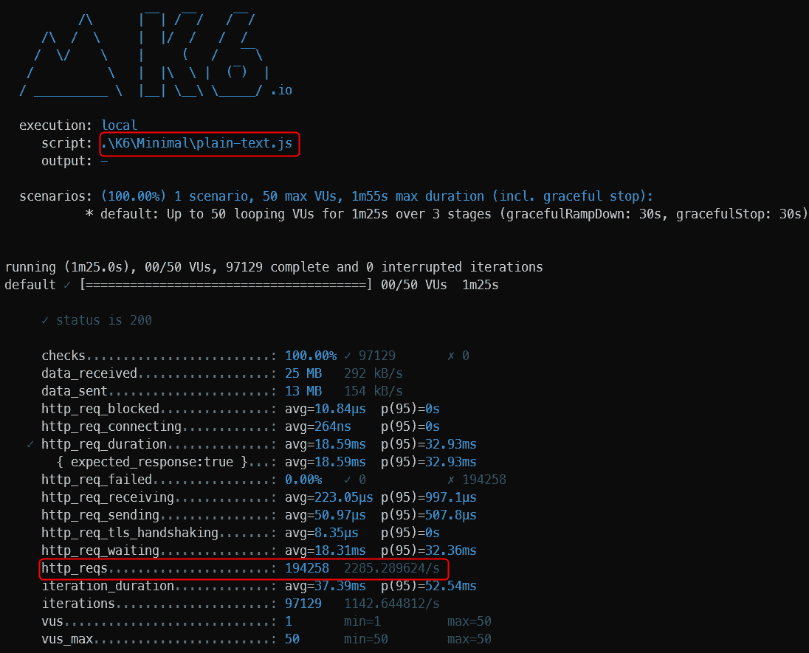
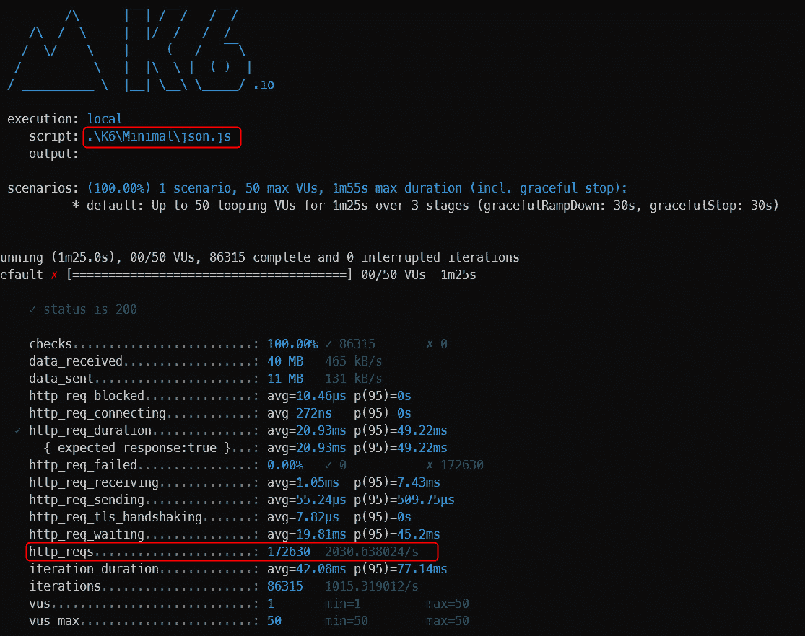
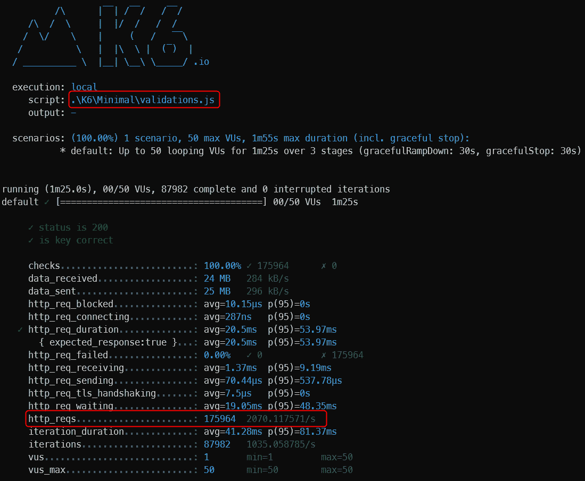
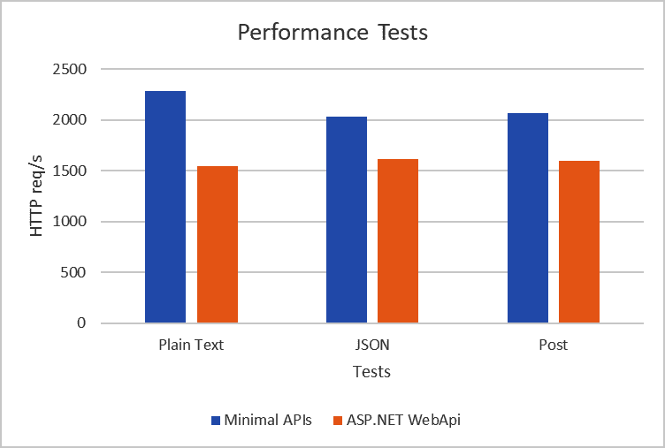
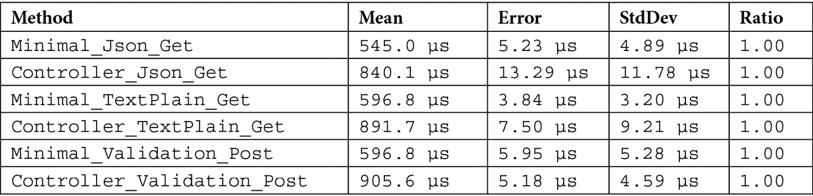

# 评估和基准测试最小 API 的性能

本章的目的是理解创建最小 API 框架的动机之一。

本章将提供一些明显的数据和示例，说明您如何使用传统方法以及如何使用最小 API 方法来测量 ASP.NET 6 应用程序的性能。

性能是任何运行中的应用的关键；然而，它往往被放在次要位置。

一个高性能和可扩展的应用程序不仅取决于我们的代码，还取决于开发栈。今天，我们已经从 .NET 全框架和 .NET Core 过渡到 .NET，并开始欣赏新 .NET 在版本更新后所取得的性能——这不仅是因为新特性的引入和框架的清晰性，而且主要是因为框架已被完全重写并改进了许多特性，使其与其他语言相比既快速又具有竞争力。

在本章中，我们将通过比较其代码与传统开发方式开发的相同代码来评估最小 API 的性能。我们将了解如何利用 **BenchmarkDotNet** 框架评估 Web 应用程序的性能，这在其他应用场景中也可能很有用。

使用最小 API，我们有一个新的简化框架，通过省略一些我们在 ASP.NET 中视为理所当然的组件来提高性能。

本章我们将涉及的主题如下：

+   最小 API 的改进

+   通过负载测试探索性能

+   使用 BenchmarkDotNet 基准测试最小 API

# 技术要求

许多系统可以帮助我们测试框架的性能。

我们可以测量一个应用每秒可以处理多少请求，与另一个应用相比，假设应用负载相等。在这种情况下，我们谈论的是负载测试。

为了将最小 API 放上测试台，我们需要安装 **k6**，这是我们进行测试将使用的框架。

我们将在仅运行 .NET 应用程序的 Windows 机器上启动负载测试。

要安装 k6，您可以选择以下两种方法之一：

+   如果您使用的是 *Chocolatey 包管理器* ([`chocolatey.org/`](https://chocolatey.org/))，您可以使用以下命令安装非官方的 k6 包：

    ```cs
    choco install k6
    ```

+   如果您使用 *Windows 包管理器* ([`github.com/microsoft/winget-cli`](https://github.com/microsoft/winget-cli))，您可以使用以下命令从 k6 清单中安装官方包：

    ```cs
    winget install k6
    ```

+   您还可以使用 Docker 测试您在互联网上发布的应用程序：

    ```cs
    docker pull loadimpact/k6
    ```

+   或者，我们像这样做，我们在 Windows 机器上安装了 k6，并从命令行启动了一切。您可以从以下链接下载 k6：[`dl.k6.io/msi/k6-latest-amd64.msi`](https://dl.k6.io/msi/k6-latest-amd64.msi)。

在本章的最后部分，我们将测量调用 API 的 HTTP 方法的持续时间。

我们将站在系统的末端，就像 API 是一个黑盒一样，并测量反应时间。我们将使用 BenchmarkDotNet 工具——为了将其包含到我们的项目中，我们需要引用其**NuGet**包：

```cs
dotnet add package BenchmarkDotNet
```

本章中的所有代码示例都可以在本书的 GitHub 仓库中找到，链接如下：

[`github.com/PacktPublishing/Minimal-APIs-in-ASP.NET-Core-6/tree/main/Chapter10`](https://github.com/PacktPublishing/Minimal-APIs-in-ASP.NET-Core-6/tree/main/Chapter10)

# 最小 API 的改进

最小 API 不仅旨在提高 API 的性能，还旨在提高代码的便利性和与其他语言的相似性，以便将其他平台上的开发者更接近。从.NET 框架的角度来看，性能有所提升，因为每个版本都有令人难以置信的改进，从简化应用程序管道的角度来看也是如此。让我们详细看看哪些内容没有被移植，以及哪些内容提高了这个框架的性能。

最小 API 执行管道省略了以下功能，这使得框架更轻量：

+   过滤器，例如`IAsyncAuthorizationFilter`、`IAsyncActionFilter`、`IAsyncExceptionFilter`、`IAsyncResultFilter`和`IasyncResourceFilter`

+   模型绑定

+   表单绑定，例如`IFormFile`

+   内置验证

+   格式化器

+   内容协商

+   一些中间件

+   视图渲染

+   JsonPatch

+   OData

+   API 版本控制

.NET 6 的性能改进

版本迭代中，.NET 不断提升其性能。在框架的最新版本中，相较于之前版本的改进已经有所报道。以下是可以找到.NET 6 中所有新功能的完整总结：

[`devblogs.microsoft.com/dotnet/performance-improvements-in-net-6/`](https://devblogs.microsoft.com/dotnet/performance-improvements-in-net-6/)

# 使用负载测试探索性能

如何估算最小 API 的性能？有许多观点需要考虑，在本章中，我们将尝试从它们能够支持的负载角度来探讨。我们决定采用一个工具——k6，该工具对 Web 应用程序进行负载测试，并告诉我们最小 API 每秒可以处理多少请求。

如其创造者所述，k6 是一个开源的负载测试工具，它使性能测试对工程团队来说既简单又高效。该工具免费、以开发者为中心且可扩展。使用 k6，您可以测试您系统的可靠性和性能，并尽早捕捉到性能回归和问题。这个工具将帮助您构建健壮且可扩展的应用程序。

在我们的案例中，我们希望使用这个工具进行性能评估，而不是进行负载测试。在负载测试期间应考虑许多参数，但我们将只关注`http_reqs`指标，该指标表示系统正确处理了多少个请求。

我们同意 k6 创建者的测试目的，即*性能*和*合成监控*。

## 用例

k6 用户通常是开发者、QA 工程师、SDETs 和 SREs。他们使用 k6 来测试 API、微服务和网站的性能和可靠性。常见的 k6 用例包括以下内容：

+   **负载测试**：k6 针对最小资源消耗进行了优化，并设计用于运行高负载测试（峰值、压力和浸泡测试）。

+   **性能和合成监控**：使用 k6，您可以运行小负载测试以持续验证生产环境的性能和可用性。

+   **混沌和可靠性测试**：k6 提供了一个可扩展的架构。您可以使用 k6 作为混沌实验的一部分来模拟流量，或者从您的 k6 测试中触发它们。

然而，如果我们想从上述角度评估应用程序，我们必须做出几个假设。当进行负载测试时，它通常比我们在本节中进行的测试要复杂得多。当应用程序被大量请求轰炸时，并非所有请求都会成功。我们可以这样说，如果响应失败的比例非常小，则测试成功。特别是，我们通常将 95 或 98 个百分位数的成果视为推导测试数字的统计数据。

在这个背景下，我们可以按以下步骤进行逐步负载测试：在爬坡阶段，系统将关注从 0 到 50 的**虚拟用户**（**VU**）负载，大约 15 秒。然后，我们将保持用户数量稳定 60 秒，最后，将负载降至零虚拟用户，再持续 15 秒。

每个新编写的测试阶段都在`stages`部分的 JavaScript 文件中表达。因此，测试是在简单的经验评估下进行的。

首先，我们为 ASP.NET Web API 和最小 API 创建了三种类型的响应：

+   *纯文本*。

+   非常小的*JSON*数据与调用相对比——数据是静态的，始终相同。

+   在第三个响应中，我们使用 HTTP `POST`方法向 API 发送 JSON 数据。对于 Web API，我们检查对象的*验证*，而对于最小 API，由于没有验证，我们返回接收到的对象。

以下代码将用于比较最小 API 和传统方法之间的性能：

最小 API

```cs
app.MapGet("text-plain",() => Results.Content("response"))
.WithName("GetTextPlain");
app.MapPost("validations",(ValidationData validation) => Results.Ok(validation)).WithName("PostValidationData");
app.MapGet("jsons", () =>
     {
           var response = new[]
           {
                new PersonData { Name = "Andrea", Surname = 
                "Tosato", BirthDate = new DateTime
                (2022, 01, 01) },
                new PersonData { Name = "Emanuele", 
                Surname = "Bartolesi", BirthDate = new 
                DateTime(2022, 01, 01) },
                new PersonData { Name = "Marco", Surname = 
                "Minerva", BirthDate = new DateTime
                (2022, 01, 01) }
           };
           return Results.Ok(response);
     })
.WithName("GetJsonData");
```

传统方法

对于传统方法，已经设计了三个不同的控制器，如下所示：

```cs
[Route("text-plain")]
     [ApiController]
     public class TextPlainController : ControllerBase
     {
           [HttpGet]
           public IActionResult Get()
           {
                 return Content("response");
           }
     }
[Route("validations")]
     [ApiController]
     public class ValidationsController : ControllerBase
     {
           [HttpPost]
           public IActionResult Post(ValidationData data)
           {
                 return Ok(data);
           }
     }
     public class ValidationData
     {
           [Required]
           public int Id { get; set; }
           [Required]
           [StringLength(100)]
           public string Description { get; set; }
     }
[Route("jsons")]
[ApiController]
public class JsonsController : ControllerBase
{
     [HttpGet]
     public IActionResult Get()
     {
           var response = new[]
           {
              new PersonData { Name = "Andrea", Surname = 
              "Tosato", BirthDate = new 
              DateTime(2022, 01, 01) },
              new PersonData { Name = "Emanuele", Surname = 
              "Bartolesi", BirthDate = new 
              DateTime(2022, 01, 01) },
              new PersonData { Name = "Marco", Surname = 
              "Minerva", BirthDate = new 
              DateTime(2022, 01, 01) }
            };
            return Ok(response);
     }
}
     public class PersonData
     {
           public string Name { get; set; }
           public string Surname { get; set; }
           public DateTime BirthDate { get; set; }
     }
```

在下一节中，我们将定义一个`options`对象，其中我们将定义这里描述的执行斜坡。我们定义所有条款以考虑测试满足。作为最后一步，我们编写实际的测试，该测试只是使用`GET`或`POST`调用 HTTP 端点，具体取决于测试。

## 编写 k6 测试

让我们为之前章节中描述的每个场景创建一个测试：

```cs
import http from "k6/http";
import { check } from "k6";
export let options = {
     summaryTrendStats: ["avg", "p(95)"],
     stages: [
           // Linearly ramp up from 1 to 50 VUs during 10 
              seconds
              { target: 50, duration: "10s" },
           // Hold at 50 VUs for the next 1 minute
              { target: 50, duration: "1m" },
           // Linearly ramp down from 50 to 0 VUs over the 
              last 15 seconds
              { target: 0, duration: "15s" }
     ],
     thresholds: {
           // We want the 95th percentile of all HTTP 
              request durations to be less than 500ms
              "http_req_duration": ["p(95)<500"],
           // Thresholds based on the custom metric we 
              defined and use to track application failures
              "check_failure_rate": [
          // Global failure rate should be less than 1%
             "rate<0.01",
          // Abort the test early if it climbs over 5%
             { threshold: "rate<=0.05", abortOnFail: true },
           ],
     },
};
export default function () {
    // execute http get call
    let response = http.get("http://localhost:7060/jsons");
    // check() returns false if any of the specified 
       conditions fail
    check(response, {
           "status is 200": (r) => r.status === 200,
    });
}
```

在前面的 JavaScript 文件中，我们使用 k6 语法编写了测试。我们定义了选项，例如测试的评估阈值、要测量的参数以及测试应模拟的阶段。一旦我们定义了测试的选项，我们只需编写调用我们感兴趣的 API 的代码 – 在我们的案例中，我们定义了三个测试来调用我们想要评估的三个端点。

## 运行 k6 性能测试

现在我们已经编写了测试性能的代码，让我们运行测试并生成测试的统计数据。

我们将报告收集到的所有测试的一般统计数据：

1.  首先，我们需要启动 Web 应用程序以运行负载测试。让我们从 ASP.NET Web API 应用程序和最小 API 应用程序开始。我们公开了 URL，包括 HTTPS 和 HTTP 协议。

1.  将 shell 移动到根文件夹，并在两个不同的 shell 中运行以下两个命令：

    ```cs
    dotnet .\MinimalAPI.Sample\bin\Release\net6.0\MinimalAPI.Sample.dll --urls=https://localhost:7059/;http://localhost:7060/
    dotnet .\ControllerAPI.Sample\bin\Release\net6.0\ControllerAPI.Sample.dll --urls="https://localhost:7149/;http://localhost:7150/"
    ```

1.  现在，我们只需为每个项目运行三个测试文件。

    +   这一个是针对基于控制器的 Web API 的：

        ```cs
        k6 run .\K6\Controllers\json.js --summary-export=.\K6\results\controller-json.json
        ```

    +   这一个是针对最小 API 的：

        ```cs
        k6 run .\K6\Minimal\json.js --summary-export=.\K6\results\minimal-json.json
        ```

这里是结果。

在传统开发模式且内容类型为`plain-text`的测试中，每秒处理的请求数为 1,547：



图 10.1 – 基于控制器的 API 和纯文本的负载测试

在传统开发模式且内容类型为`json`的测试中，每秒处理的请求数为 1,614：



图 10.2 – 基于控制器的 API 和 JSON 结果的负载测试

在传统开发模式且内容类型为`json`且包含模型验证的测试中，每秒处理的请求数为 1,602：



图 10.3 – 基于控制器的 API 和验证负载的负载测试

在最小 API 开发模式且内容类型为`plain-text`的测试中，每秒处理的请求数为 2,285：



图 10.4 – 最小 API 和纯文本的负载测试

在最小 API 开发模式且内容类型为`json`的测试中，每秒处理的请求数为 2,030：



图 10.5 – 最小 API 和 JSON 结果的负载测试

对于具有模型验证的 `json` 内容类型的最小 API 开发模式下的测试，每秒处理的请求数为 2,070：



图 10.6 – 最小 API 和无验证负载的负载测试

在以下图像中，我们展示了三个测试功能的比较，报告了具有相同功能的请求数量：



图 10.7 – 性能结果

正如我们所预期的，最小 API 比基于控制器的 Web API 快得多。

差异大约为 30%，这可不是一个小成就。

显然，正如之前提到的，最小 API 为了优化性能而缺少了一些功能，最显著的是数据验证。

在示例中，有效负载非常小，差异并不明显。

随着有效负载和验证规则的增加，两个框架之间的速度差异将只会增加。

我们已经看到如何使用负载测试工具来衡量性能，然后评估在相同数量的机器和用户连接的情况下，它每秒可以处理多少请求。

我们还可以使用其他工具来了解最小 API 对性能产生了强烈的积极影响。

# 使用 BenchmarkDotNet 基准测试最小 API

BenchmarkDotNet 是一个框架，允许您测量编写的代码，并比较不同版本或使用不同 .NET 框架编译的库之间的性能。

此工具用于计算任务执行所需的时间、使用的内存以及许多其他参数。

我们的案例是一个非常简单的场景。我们想要比较两个针对相同版本的 .NET Framework 编写的应用程序的响应时间。

我们如何进行这个比较？我们取一个 `HttpClient` 对象，并开始调用我们也为负载测试案例定义的方法。

因此，我们将获得两种方法的比较，这两种方法都利用了相同的 `HttpClient` 对象和具有相同功能的方法，但一个是用 ASP.NET Web API 和传统控制器编写的，而另一个是使用最小 API 编写的。

BenchmarkDotNet 帮助您将方法转换为基准测试，跟踪其性能，并共享可重复的测量实验。

在底层，它执行了许多魔法般的功能，这得益于 perfolizer 统计引擎，保证了可靠和精确的结果。BenchmarkDotNet 可以保护您免受流行的基准测试错误的影响，并在您的基准设计或获得的测量结果出现问题时发出警告。该库已被超过 6,800 个项目采用，包括 .NET Runtime，并得到 .NET 基金会的支持 ([`benchmarkdotnet.org/`](https://benchmarkdotnet.org/))。

## 运行 BenchmarkDotNet

我们将编写一个类，用于表示调用两个网络应用 API 的所有方法。让我们充分利用启动功能，并准备我们将通过`POST`发送的对象。标记为`[GlobalSetup]`的函数在运行时不会被计算，这有助于我们精确计算调用和从网络应用返回响应所需的时间：

1.  注册`Program.cs`中实现 BenchmarkDotNet 的所有类：

    ```cs
    BenchmarkSwitcher.FromAssembly(typeof(Program).Assembly).Run(args);
    ```

在前面的代码片段中，我们已经注册了当前程序集，该程序集实现了在性能计算中需要评估的所有函数。标记为`[Benchmark]`的方法将被反复执行，以确定平均执行时间。

1.  应用必须在发布时编译，可能还在生产环境中编译：

    ```cs
    namespace DotNetBenchmarkRunners
    {
         [SimpleJob(RuntimeMoniker.Net60, baseline: true)]
         [JsonExporter]
         public class Performances
         {
               private readonly HttpClient clientMinimal = 
               new HttpClient();
               private readonly HttpClient 
               clientControllers = new HttpClient();
               private readonly ValidationData data = new 
               ValidationData()
               {
                     Id = 1,
                     Description = "Performance"
               };
               [GlobalSetup]
               public void Setup()
               {
                     clientMinimal.BaseAddress = new 
                     Uri("https://localhost:7059");
                     clientControllers.BaseAddress = new 
                     Uri("https://localhost:7149");
               }
               [Benchmark]
               public async Task Minimal_Json_Get() => 
               await clientMinimal.GetAsync("/jsons");
               [Benchmark]
               public async Task Controller_Json_Get() => 
               await clientControllers.GetAsync("/jsons");
               [Benchmark]
               public async Task Minimal_TextPlain_Get() 
               => await clientMinimal.
               GetAsync("/text-plain");
               [Benchmark]
               public async Task 
               Controller_TextPlain_Get() => await 
               clientControllers.GetAsync("/text-plain");

               [Benchmark]
               public async Task Minimal_Validation_Post() 
               => await clientMinimal.
               PostAsJsonAsync("/validations", data);

               [Benchmark]
               public async Task 
               Controller_Validation_Post() => await 
               clientControllers.
               PostAsJsonAsync("/validations", data);
         }
         public class ValidationData
         {
               public int Id { get; set; }
               public string Description { get; set; }
         }
    }
    ```

1.  在启动基准应用之前，启动网络应用：

最小 API 应用

```cs
dotnet .\MinimalAPI.Sample\bin\Release\net6.0\MinimalAPI.Sample.dll --urls="https://localhost:7059/;http://localhost:7060/"
```

基于控制器的应用

```cs
dotnet .\ControllerAPI.Sample\bin\Release\net6.0\ControllerAPI.Sample.dll --urls=https://localhost:7149/;http://localhost:7150/
```

通过启动这些应用，将执行各种步骤，并提取出我们在此处报告的时间线总结报告：

```cs
dotnet .\DotNetBenchmarkRunners\bin\Release\net6.0\DotNetBenchmarkRunners.dll --filter *
```

对于每个执行的方法，报告平均值或平均执行时间。



表 10.1 – 最小 API 和控制器基准 HTTP 请求

在以下表格中，**Error**表示平均值的可能变化量，这是由于测量误差造成的。最后，标准差（**StdDev**）表示与平均值之间的偏差。时间以**μs**为单位给出，因此如果没有使用具有该特性的仪器，很难从经验上测量这些时间。

# 摘要

在本章中，我们通过使用两种非常不同的方法，比较了最小 API 与传统方法的性能。

最小 API 并非仅为了性能而设计，仅基于这一点来评估它们是一个糟糕的起点。

*表 10.1*表明，最小 API 的响应与传统 ASP.NET Web API 应用的响应之间存在许多差异。

测试在同一台机器上使用相同的资源进行。我们发现最小 API 的性能比传统框架提高了大约 30%：

我们了解了如何测量我们应用的速度——这有助于了解应用是否能够承受负载以及它可以提供多少响应时间。我们还可以利用这一点来优化关键代码的小部分。

作为最后的注意事项，测试的应用实际上非常简单。在 ASP.NET Web API 应用中应该评估的验证部分几乎无关紧要，因为只有两个字段需要考虑。随着我们在最小 API 中已经描述的已消除组件数量的增加，两个框架之间的差距也在增加。
