# 设计移动用户界面

设计移动界面最具挑战性的方面之一是移动设备可能具有的纵横比数量。移动设备包括手机和平板电脑。手机通常比平板电脑长得多，一个在手机上完美适配的 UI，当放在平板电脑上时可能会重叠或看起来挤压。除了尴尬的分辨率之外，还有一些怪癖会影响您的 UI，例如 iPhone 的刘海和三星 Galaxy 设备的各种折叠屏幕。

移动设备还有一套不同的输入和交互。例如，在移动设备上，您可以在多个位置同时触摸屏幕，但在 PC 上，您一次只能用鼠标在一个地方点击。移动设备需要屏幕键盘和其他外围设备来执行您可能在控制台或 PC 游戏中执行的动作。

在本章中，我将讨论围绕移动设备各种怪癖的设计考虑因素，并涵盖以下主题：

+   如何在多种移动分辨率下模拟您的游戏并在特定方向上构建

+   移动游戏的推荐按钮大小

+   利用不可见按钮创建触摸区域

+   根据拇指区域布局交互

+   多点触控输入在移动 UI 中的作用

+   何时使用加速度计和陀螺仪

# 技术要求

对于本章，您需要 Unity 2020.3.26f1 或更高版本。

注意

在描述移动界面时，我将主要关注 iOS 和 Android 操作系统的手机和平板电脑。然而，偶尔我也会提到微软，因为他们确实创建了一系列平板电脑，尽管它们运行 Windows 操作系统，但它们确实具有触摸功能。

# 设置分辨率、纵横比和方向

当您设计移动 UI 时，您希望确保它在各种分辨率大小和纵横比下都有意义且可见。您还可能希望允许不同的屏幕方向。在*第六章*中，我将讨论您如何开发能够适应多个分辨率和布局的用户界面。但就目前而言，让我们先回顾一下分辨率、纵横比和方向如何影响您的设计，以及如何使用各种屏幕设置查看您的游戏。

## 在游戏视图中设置分辨率

在*第一章*中，我们回顾了如何更改**游戏**视图的分辨率和纵横比。当您将游戏构建设置更改为 iOS 或 Android 时，将为您提供一组新的预设。例如，在以下图像中，您可以看到当**构建**设置为 iOS 时的可能性列表：

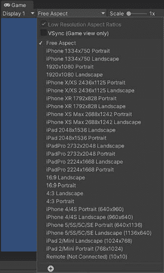

图 2.1：游戏视图中的 iOS 分辨率

它不会显示所有可能的 iOS 分辨率，但许多常见的较新分辨率都会显示。你可以在[`www.ios-resolution.com/`](https://www.ios-resolution.com/)找到更完整的列表。类似地，当切换到 Android 构建时，不会列出所有 Android 分辨率，特别是考虑到 Android 分辨率数量显著更多。然而，你可以在[`developer.android.com/guide/practices/screens_support.xhtml#testing`](https://developer.android.com/guide/practices/screens_support.xhtml#testing)找到有关 Android 屏幕分辨率的更多信息。

## 设备模拟器

有时候，仅设置**游戏**视图的纵横比并不足以完全看到你的 UI 在设备上的显示效果。例如，iPhone X 中引入的具有争议性的刘海在**游戏**视图中不会显示，可能会对你的精心设计的 UI 造成很大的影响。然而，你可以使用**设备模拟器**来查看这个刘海以及它如何与你的 UI 重叠。

要启用设备模拟器，请完成以下步骤：

1.  从**包管理器**下载设备模拟器包。

    要这样做，请转到**窗口** | **包管理器**，然后在列表中搜索**设备模拟器**。最初你很可能看不到它。如果你看不到它，请确保显示的包来自**Unity 注册表**，如下面的截图所示：

图 2.2：Unity 注册表包

1.  如果你仍然在列表中看不到它，你必须启用预览包。点击右上角的设置齿轮，选择**高级项目设置**，然后选择**启用预览包**，如图*图 2**.3*所示：

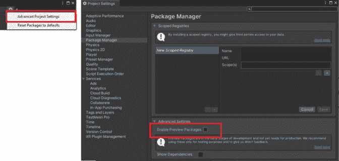

图 2.3：启用预览包

1.  一旦你在列表中找到**设备模拟器**，请安装它：

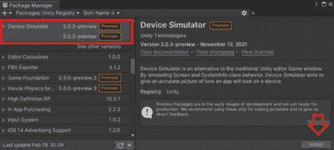

图 2.4：安装设备模拟器

1.  现在设备模拟器已下载，你可以通过选择**游戏**下拉菜单，然后选择**模拟器**来更改你的**游戏**视图以反映模拟器，如下面的截图所示：

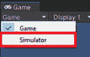

图 2.5：选择模拟器视图

1.  现在你可以从下拉菜单中选择多个设备进行模拟。例如，我可以选择第五代 iPad 或 iPhone X，其中 iPhone X 显示了令人讨厌的刘海：

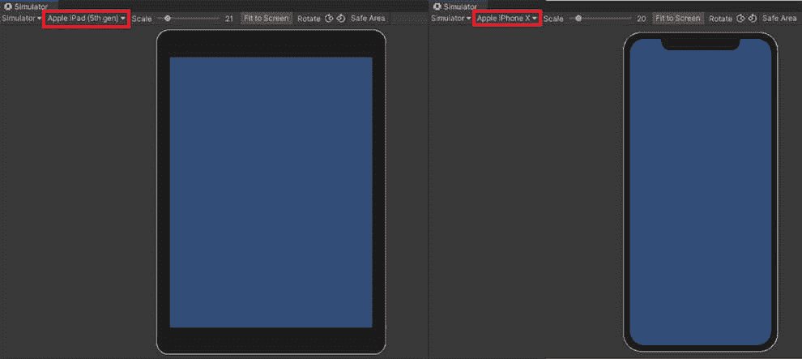

图 2.6：模拟器上的不同设备

1.  此外，你可以选择**安全区域**来查看放置 UI 的最佳位置：

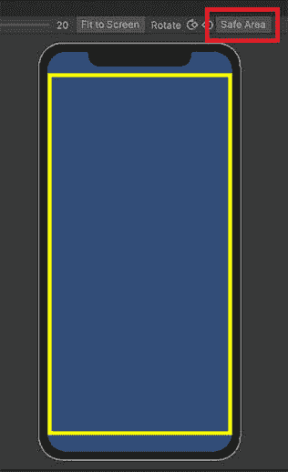

图 2.7：安全区域

## 构建特定方向

你可能已经注意到在 *图 2**.1* 中，每个分辨率都有横屏和竖屏选项。这允许你在开发过程中根据你想要支持的方向来查看你的游戏。

当为移动设备构建时，你不能指定分辨率和纵横比，而必须支持所有分辨率和纵横比。然而，你可以在移动设备上选择屏幕方向。有两种不同的方向：**横屏**和**竖屏**。

建造得比高更宽的游戏被称为横屏分辨率。建造得比宽更高的游戏被称为竖屏分辨率。例如，**16:9**的纵横比将是横屏分辨率，而**9:16**的纵横比将是竖屏分辨率，如下所示：

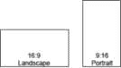

图 2.8：横屏与竖屏方向

因此，虽然你不能选择移动游戏构建的确切纵横比，但你可以选择方向，这将迫使纵横比要么更宽，要么更高。你可以通过导航到 **编辑** | **项目设置** | **玩家设置** 并选择移动设备来设置方向。如果你同时为 iOS 和 Android 构建游戏，你不需要为两者设置这些属性。如以下截图所示，**默认方向**属性旁边的星号表示这些设置在多个平台之间是共享的：

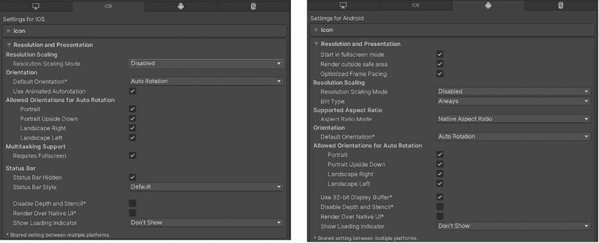

图 2.9：移动设备的分辨率和方向设置

你可以将**默认方向**设置为**自动旋转**或其他旋转之一，如下所示：

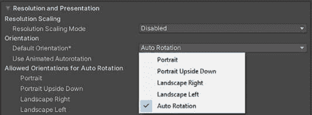

图 2.10：移动设备的方向选项

Unity 将以下方向定义为以下旋转：

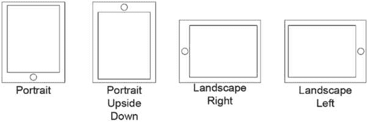

图 2.11：移动设备方向旋转

当你选择除**自动旋转**之外的**默认方向**时，游戏将只在设备上以该方向播放。如果你选择**自动旋转**，你将可以选择多个方向：

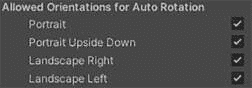

图 2.12：自动旋转选项

在大多数情况下，最好只选择**横屏**方向或只选择**竖屏**方向，而不是所有四个方向。通常，允许所有四个方向会导致游戏 UI 的缩放出现问题。

玩家往往更喜欢能够旋转他们的游戏（尤其是像我这样喜欢在手机充电时躺在床上玩游戏的人），所以除非你有充分的理由停止旋转，否则启用**纵向**和**纵向颠倒**或**横向右**和**横向左**是一个好主意。

# 推荐按钮大小

在创建移动游戏时，几乎所有的交互都是由按钮和屏幕点击控制的。在 PC 或游戏机上的合理大小的按钮可能对于移动游戏来说太小了。因此，你需要确保设计你的按钮，以便它们在小屏幕上仍然可见，并且足够大，可以用手指触摸。

苹果、谷歌和微软在设计设备时，都对按钮的**可触摸区域**大小有特定的推荐。苹果建议按钮大小为 44 点 x 44 点。谷歌推荐 48 dp x 48 dp，两个按钮之间间隔 8 dp。微软推荐 9 mm x 9 mm，两个按钮之间填充 2 mm。

你可以在以下位置找到有关为每个移动平台设计触摸/击打区域的信息：

+   苹果：[`developer.apple.com/design/human-interface-guidelines/layout`](https://developer.apple.com/design/human-interface-guidelines/layout)

+   谷歌：[`material.io/design/usability/accessibility.xhtml#layout-and-typography`](https://material.io/design/usability/accessibility.xhtml#layout-and-typography)

+   微软：[`docs.microsoft.com/en-us/windows/uwp/design/input/guidelines-for-targeting`](https://docs.microsoft.com/en-us/windows/uwp/design/input/guidelines-for-targeting)

令人烦恼的是，所有这些推荐都使用不同的度量单位。那么，这些数字在设计方面究竟意味着什么？你如何确保你的按钮是 9 mm x 9 mm 或 44 点 x 44 点？他们为什么用不同的单位来谈论这些测量值？这几乎就像他们都是竞争对手，不想好好合作！为了回答这些问题，让我们首先看看各种度量单位代表什么：

+   **点（pt**）用于测量屏幕上的物理尺寸。1 点等于国际英寸的 1/72 或 0.3528 毫米。它主要用于排版和印刷媒体。当使用像**Illustrator**这样的程序时，在点中创建对象，然后以 72 ppi 导出你的图像，像素和点的大小就相同。点和像素并不相同，除非以 72 ppi 导出。

+   **密度无关像素**（**dp**），发音为“dips”，是一个用于在具有不同 **dpi**（每英寸点数）值的屏幕上保持项目大小一致的测量单位。密度无关像素测量的是在 160 dpi 屏幕上 1 像素的大小。使用这种转换就像说它会在 160 dpi 屏幕上以这个大小显示，并且应该在任何其他屏幕上以相同的物理大小显示。你可以在[`developer.android.com/training/multiscreen/screendensities`](https://developer.android.com/training/multiscreen/screendensities)上了解更多关于密度无关像素的信息。

+   当使用 **毫米**（**mm**）来描述按钮大小时，这个大小是屏幕上按钮的物理表示。因此，如果你用尺子对着屏幕，它将与这个测量单位一致。

好的，所以它们都代表了屏幕上的一些物理测量单位。这使得事情变得简单一些。让我们将这些值都转换为毫米，这样我们就可以在一个更容易概念化的测量单位中比较它们。我还会将它们转换为点，因为你可以使用点在程序（如 Illustrator）中创建你的按钮艺术。

如果你需要转换这些测量单位之一，并且不太喜欢数学，搜索 *convert points to mm* 将会为你提供一个不错的转换计算器。

你还可以使用以下转换工具——它对于在所有不同的测量单位之间转换来说非常方便：[`angrytools.com/android/pixelcalc/`](http://angrytools.com/android/pixelcalc/)

在下面的图表中，我将像素的测量值四舍五入到最接近的整数，将毫米的测量值四舍五入到最接近的十分之一，以便于比较。我们可以使用这张图片来比较不同的尺寸（图片已被缩放，尺寸可能不会转换为实际的测量值）：

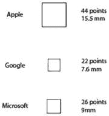

图 2.13：推荐的最低可触摸按钮大小

那么，你应该使用多大呢？这取决于你。你不必使用他们的推荐，但我个人倾向于使用苹果的推荐，因为它最大，因此也符合其他两个的推荐。此外，按钮越大，越多人能够轻松触摸它。在*第四章*中，我们将讨论如何设计我们的用户界面，以便尽可能多的人能够与之交互。

另一个考虑因素是，你的游戏是用拇指还是用手指来玩。如果游戏是用拇指来玩，你将需要更大的按钮，因为拇指更大！之前描述的数字是最低推荐值，因此它们适用于手指触摸，而不是拇指触摸。

那么，你如何确保你的按钮在游戏中始终保持你想要的尺寸？答案是**画布缩放器**组件！在*第六章*中，我们将讨论如何通过将**画布缩放器**组件的**UI 缩放模式**设置为**常量物理尺寸**来确保按钮的指定尺寸，无论分辨率如何。你可以选择将画布的测量单位设置为毫米或点（以及一些其他单位）。

当为移动设备设计时，我的建议是准备多台设备以在各种分辨率下进行测试。玩玩游戏，看看感觉如何。请比你手小和手大的人来玩。即使遵循了各种移动平台指定的最低指南，你仍然可能会发现你的按钮对你所需的操作来说太小了。

谷歌和微软也指定了他们推荐的可见尺寸，因此你可以有一个更小的按钮图像，只要按钮的点击区域是推荐的尺寸。如果你想有一个视觉上更小但点击区域更大的按钮，而不是将按钮组件附加到小块艺术上，而是将其附加到一个更大的父级点击区域，并更改按钮的目标图像为小块艺术。

# 全屏/屏幕部分点击

许多移动游戏只有一个输入，你可以点击屏幕上的任何位置来执行动作。例如，无尽跑酷游戏通常允许玩家点击或按住屏幕上的任何位置来跳跃。为了实现这一点，你只需要添加一个覆盖整个屏幕的不可见按钮。如果你有其他接收输入的 UI，它需要位于全屏按钮之前，以确保按钮不会阻挡其他 UI 元素的输入。

一些游戏要求你点击屏幕上的特定区域来执行特定动作。例如，我为我的博士论文创建了一个名为 Sequence Seekers 的游戏。这个游戏包括一个下山模式，玩家必须点击屏幕的左侧或右侧来在游戏中左右移动。我是通过添加覆盖屏幕两半的不可见按钮来实现这一点的，如下所示：

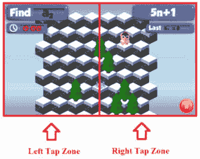

图 2.14：使用不可见按钮创建标签区域

在*第九章*和*第十一章*中，我们将讨论如何实现这样的按钮，以及如何实现浮动 D-Pad 和摇杆。

# 拇指区域

在设计移动游戏时，考虑玩家如何握持设备非常重要。您不希望将 UI 放在玩家难以触及的区域。玩家倾向于喜欢单手握持和玩游戏。并非所有游戏都允许这样做，但如果可能的话，您希望允许玩家这样做。您如何知道您的 UI 是否在拇指可触及的区域？将 UI 放在拇指区域！本质上，拇指区域是玩家单手握持手机时感到舒适可触及的区域。您可以通过握持手机并轻松移动拇指来找到您手机的拇指区域，而无需移动您的手。

以下博客文章提供了一个非常好的拇指区域解释，以及一个实用的（无意中打趣）模板，用于在各种设备上找到拇指区域：[`www.scotthurff.com/posts/how-to-design-for-thumbs-in-the-era-of-huge-screens/`](https://www.scotthurff.com/posts/how-to-design-for-thumbs-in-the-era-of-huge-screens/)

链接中提到的手机可能有些过时，但它在互联网上仍然是关于拇指区域的最佳资源之一。

作为左撇子，我恳请您在设计时考虑使游戏在拇指区域设计下左手的操作与右手一样容易。

# 其他移动输入

在为移动设备设计时，重要的是要记住输入的工作方式与电脑或游戏机游戏略有不同。在移动设备上，大部分输入由触摸屏、加速度计或陀螺仪控制。这为您在创建移动游戏时提供了不同的设计选择。

触摸屏设备通常可以访问多个触摸点。您可以使用多点触控进行不同类型的交互，但最常见的多点触控用法是允许玩家进行捏合缩放。在*第八章*中，我们将讨论如何使用多点触控输入在游戏中创建平移和捏合缩放功能。

大多数移动设备都内置了加速度计，许多设备还内置了陀螺仪。在这里我们不会过于技术性地描述它们是如何实际工作的，加速度计和陀螺仪的区别在于它们所测量的内容。加速度计测量 3D 坐标系内的加速度，而陀螺仪测量旋转。我们将在*第八章*中回顾如何使用加速度计和陀螺仪的示例。

# 设备特定资源

如果您正在为移动设备制作用户界面，您可能希望使用设备特定的 UI 元素以保持一致的风格。您可以在以下位置找到为每个移动平台设计 UI 的各种艺术资源和模板：

+   Apple: [`developer.apple.com/design/resources/`](https://developer.apple.com/design/resources/)

+   Android: [`developer.android.com/design/index.xhtml`](https://developer.android.com/design/index.xhtml)

+   Windows: [`developer.microsoft.com/en-us/windows/apps/design`](https://developer.microsoft.com/en-us/windows/apps/design%20)

# 摘要

为移动设备创建 UI 与为控制台或计算机创建 UI 并没有太大区别，但不同之处在于你可以接受多个屏幕输入，并且还可以访问设备加速度计和陀螺仪的信息。此外，分辨率在游戏开发中起着重要作用，因为移动设备具有广泛的分辨率和纵横比。

在下一章中，我们将讨论为 XR 应用程序开发 UI 的设计考虑因素，包括 VR、MR 和 AR。
