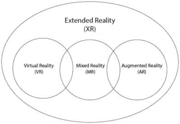
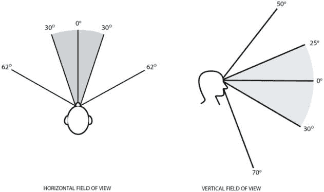

# 3

# 设计 VR、MR 和 AR 用户界面

对虚拟现实（VR）、混合现实（MR）和增强现实（AR）的用户界面（UI）设计的研究是广泛的，并且不断增长。它是一种新兴技术，最佳实践尚未完全定义；然而，有许多研究人员和开发者正在勤奋地确定这些最佳实践。在本章中，我将总结一些普遍认同的最佳实践，用于设计扩展现实（XR）体验的用户界面。

在本章中，我将讨论以下内容：

+   区分 XR、VR、MR 和 AR 应用

+   开发 VR 用户界面的考虑因素和最佳实践

+   开发 MR 用户界面的考虑因素和最佳实践

+   设计 AR 用户界面的考虑因素和最佳实践

# XR、VR、MR 和 AR 是什么？

在我们开始讨论 VR、MR 和 AR 的最佳实践之前，我们应该明确 XR、VR、MR 和 AR 的定义。

如果你提前浏览本章，可能会注意到没有名为 *设计 XR 用户界面* 的章节。这是因为 XR 包括了 VR、MR 和 AR！它是一个总称。事实上，本章的一个更简洁的标题可以是 *设计 XR 用户界面*！XR 包括 VR、MR 和 AR 技术：

图 3.1：XR 技术的表示

**VR**体验可能最容易描述。它们完全存在于虚拟世界中。整个物理世界被遮挡，你所能看到的就是虚拟空间。这种空间往往可以如此沉浸，以至于大脑难以区分它与现实。便于 VR 的设备会覆盖用户的眼睛，以完全遮挡现实世界的视觉。今天支持 VR 的流行设备包括 Meta（前身为 Oculus）Quest 系列、索尼 PlayStation VR 系列和 HTC Vive 系列。一些流行的 VR 游戏包括 *半条命：艾莉克斯* 和 *节奏大师*。

**MR**在现实世界中叠加虚拟物品，并允许你与之交互。用户可以看到现实世界，并与现实世界物品和虚拟物品进行交互。MR 设备也以眼镜和头戴式设备的形式佩戴在用户的脸上。它们要么不完全遮挡现实世界，要么允许视频透过来允许用户通过镜头看到现实世界。今天便于 MR 练习的流行设备包括 Meta Quest 2（及以上）、微软 HoloLens 系列和 Magic Leap。一个流行的 MR 体验示例是 *我期待你死：家* *甜蜜的家*。

**AR**与**MR**类似，因为它结合了现实世界和虚拟世界；然而，它不同之处在于虚拟物品不会与真实世界互动。在 AR 中，虚拟物品只是简单地叠加在真实世界之上，并不出现在真实世界的同一空间内。此外，它也不允许用户以感觉像是在他们的世界中发生的方式与虚拟物品互动。AR 交互通常发生在屏幕上，而 MR 交互发生在物理空间内。这种区别很微妙，但你可以将 AR 视为与屏幕上出现的虚拟物品互动，而 MR 则是与看起来像在你空间中出现的物品互动。市场上可用的 AR 设备数量显著更多。智能手机和平板电脑是最受欢迎的 AR 促进者；然而，一些智能眼镜也能实现这一点。此外，世界各地都有 AR 屏幕、自助服务亭和安装。AR 游戏的流行例子包括*宝可梦 GO*和*入侵者*。

注意

关于 XR 及其区别的想法，我在本节中并未完全深入探讨。如果您想了解更多，我建议研究虚拟性连续体：[`www.interaction-design.org/literature/topics/virtuality-continuum`](https://www.interaction-design.org/literature/topics/virtuality-continuum)。

现在我们已经了解了 VR、MR 和 AR 之间的区别，让我们来看看为这些体验设计 UI 的一些最佳实践。

# 设计 VR 的 UI

通常，当你想到 UI 时，你会想到一个**抬头显示**（**HUD**）——UI 位于所有游戏玩法前面的屏幕上。但在 VR 中，并没有像在游戏机上玩游戏那样的屏幕。玩家感觉就像完全沉浸在世界中，如果在他们体验 VR 游戏时所看到的屏幕上放置一些东西（即镜头），由于它正位于他们的眼睛上方，这会导致模糊、无法观看的模糊。因此，VR UI 往往放置在玩家将要沉浸其中的世界中。

注意

在*第十六章*中，我们将讨论在世界上创建具有物理表示的 UI 的步骤。

虽然可能有例外，但在 VR 游戏中，UI 通常放置在三个位置：

+   静态地嵌入在世界中。玩家必须通过将他们的化身移动到其虚拟位置来接近它。

+   嵌入在世界中，距离玩家脸部一定距离。UI 随着玩家移动，并且无论玩家转向哪里，总是处于相同的相对位置。或者玩家的化身在空间中不移动，UI 也不移动。

+   附在玩家的手上——UI 以某种外围设备的形式出现在玩家的化身虚拟手/臂上。

你选择哪种放置方式取决于你的游戏设计，但也可能受到你是否以及如何想要玩家与 UI 交互的影响。本质上，你想要确保玩家可以看到 UI 并且可以与之交互（如果需要）。

让我们从设计视觉用户界面的考虑因素开始我们的 VR 用户界面设计探索。

## 视觉用户界面放置和考虑因素

正如我之前所说，由于这项技术仍被视为新兴技术，研究人员和开发者仍在学习最佳实践，因此没有一套明确的设计 VR 游戏体验的规则。

当创建一个始终与玩家保持特定距离的用户界面时，重要的是将其放置在玩家可以看到的位置。仅仅因为玩家可以看到一个物品，并不意味着看到它是舒适的。例如，虽然玩家可以看到他们视野边缘的物品，但这并不是放置用户界面的舒适位置。以下图表显示了人的**视野**（**FOV**）的一般角度，其中灰色区域是最大观看角度：

图 3.2：人类视野的概括

注意

前一图中描述的角度是一般性指南，并非固定不变。它们将根据用户的视力、是否需要他们旋转眼睛（而不是头部），以及你使用的设备而变化。

请记住，当玩家移动他们的头部时，摄像头会随之移动。因此，如果你的用户界面放置在一个鼓励他们旋转头部并且固定在头部位置的地方，用户界面将会随着他们的头部移动。所以，尽量将任何固定的用户界面放置在*图 3.2*中描述的区域。2*。

在相对于玩家眼睛的角度之上，你还必须考虑从玩家眼睛的距离。如果太近或太远，都会造成眼睛疲劳。尽量将任何视觉 UI，特别是必须阅读的文字，保持在玩家眼睛 1.3 到 3 个游戏米内。

如果玩家处于静止状态，创建一个距离他们一定距离的静态弯曲用户界面总是有助于玩家舒适地移动头部以查看用户界面。

我想要讨论的最后一个视觉用户界面考虑因素是文字大小。虽然建议可能因来源而异，但我看到的一致引用（无意中打趣）是，UI 应该以每米 2.32 厘米的高度出现。所以，如果它显示在 1 米远的地方，它应该有 2.32 厘米高。如果它显示在 2 米远的地方，它应该看起来是 4.64 厘米高。我个人视力非常差，我倾向于使我的 UI 文字比这大一点，这样我就可以轻松地看到它。我的建议是让不同视力的人玩你的游戏，并告诉你用户界面是否舒适。

现在我们已经回顾了在 VR 空间中设计视觉 UI 的注意事项，让我们来回顾一下交互式 UI 的注意事项。

## 交互式 UI 的位置和考虑因素

在 VR 中，交互式 UI 的实现方式有几种，这取决于体验是否使用控制器或手势追踪。

当使用控制器时，以下是 UI 交互的常见方式：

+   玩家只需按下按钮即可执行交互——例如，按下菜单按钮以使菜单按钮出现和消失。

+   玩家使用射线选择 UI 项目。玩家指向 UI 项目，从他们的手中出现一条射线，然后他们按下按钮与项目进行交互。

+   玩家的化身在虚拟空间中接近 UI 项目，并与它进行交互。这包括用虚拟手在虚拟空间中按下按钮或抓取虚拟物品。

当使用手势追踪时，以下是 UI 交互的常见方式：

+   玩家执行一些手势，完成 UI 交互。例如，做一个点赞手势可能会使菜单出现或消失。

+   玩家用手指指向一个项目，从他们的手指中出现一条射线。然后他们完成其他手势以确认选择。

+   玩家的化身在虚拟空间中接近 UI 项目，并与它进行交互。这包括用虚拟手在虚拟空间中按下按钮或抓取虚拟物品。

当通过射线与 UI 交互时，玩家不需要物理上能够触及它。但如果你想要创建玩家化身必须虚拟交互的 UI，你需要确保它在玩家水平方向和垂直方向上都能触及。可达性的因素包括以下：

+   游戏是否以静止模式进行或玩家是否需要四处移动

+   玩家的化身是否可以移动

+   玩家的高度

+   如果玩家是坐着还是站着

+   玩家的总体移动性和残疾

一个好的经验法则是确保玩家可以通过将项目放置在距离他们静止位置 0.5 到 0.75 米之间来触及它们。就像你想要用不同视力水平的人测试你的视觉 UI 一样，你也会想用不同身高和能力的人测试你的 UI。

在使用控制器和手势追踪的情况下，你想要确保你选择的任何交互都不会让玩家感到疲劳。要求他们执行多个手势或长时间举起手可能会引起疲劳和压力，这是你不想施加在玩家身上的。

这就结束了我想讨论的关于为 VR 设计 UI 的主要注意事项。然而，还有许多研究和信息等待你去探索！有关为 VR 设计 UI 的更多信息，我建议查看本章末尾提供的资源。

现在我们已经了解了为 VR 设计 UI，接下来让我们看看如何为 MR 设计 UI。

# 为 MR 设计 UI

为 MR 设计 UI 与为 VR 设计 UI 极为相似，所以前一部分讨论的大部分内容都适用。然而，为 MR 设计 UI 确实有几个额外的注意事项。

设计 VR UI 和 MR UI 之间的主要区别在于 MR 结合了玩家的物理空间和周围物品。当玩 VR 时，人们通常被认为周围有宽敞的空间——这样当他们鲁莽地挥舞时，不会碰到任何东西伤害到自己。相反，MR 体验往往鼓励玩家在他们现实世界的家具、墙壁和其他物品周围活动。

虚拟放置的 UI 不仅必须通过玩家访问，而且不能与玩家世界中存在的事物相交。你不能让玩家按下他们桌子里的按钮或观看他们墙壁后面的屏幕。因此，在设计 MR 体验的 UI 时，你必须考虑玩家的空间，而不仅仅是玩家的身体来放置你的 UI。

解决此问题的方法包括允许玩家选择他们的 UI 显示位置，将其显示在技术检测到的表面之上（检测方式高度依赖于玩家所使用的设备），或者将其附加到玩家身上。

与 VR 相比，MR 是一个更加新兴的空间，尤其是在视频游戏领域。到目前为止，MR 主要用于工业和医疗目的，并且通常在高度受控的空间内进行。对于在家中的玩家来说，MR 具有无限可能的家具和物体放置方式，仍处于起步阶段，直到最近才可以通过 Microsoft HoloLens 在 Unity 中实现。然而，Meta Quest 2 增加了在 Unity 中创建 MR 游戏的能力，而 Meta Quest 3 计划提供更多精选和完善的 MR 支持。此外，Magic Leap 与 Unity 合作，允许进行 MR 开发。因此，你可能会在未来几年看到更多关于 MR UI 的最佳实践和技术。

注意

有关使用 Unity 和 HoloLens 进行开发的更多信息，请参阅[`learn.microsoft.com/en-us/windows/mixed-reality/develop/unity/unity-development-overview?tabs=arr%2CD365%2Chl2`](https://learn.microsoft.com/en-us/windows/mixed-reality/develop/unity/unity-development-overview?tabs=arr%2CD365%2Chl2)。

有关 Quest 3 计划中的 MR 功能的信息，请参阅[`developer.oculus.com/blog/build-the-next-generation-of-vr-mr-with-meta-quest-3/`](https://developer.oculus.com/blog/build-the-next-generation-of-vr-mr-with-meta-quest-3/)。

有关使用 MagicLeap 进行开发的更多信息，请参阅[`ml1-developer.magicleap.com/en-us/learn/guides/unity-overview`](https://ml1-developer.magicleap.com/en-us/learn/guides/unity-overview)。

很遗憾，由于 MR 在 Unity 引擎中是一个如此新且新兴的空间，我无法就设计 MR 的用户界面说更多。然而，AR 已经存在了一段时间，所以现在让我们来探讨它！

# 设计 AR 的用户界面

记住，区分 AR 和 MR 的是 AR 倾向于在覆盖真实世界的屏幕上，而 MR 则显得更加沉浸和融入世界。因此，AR 体验的交互项目将显示在屏幕上，而不是在世界上。

设计增强现实（AR）的用户界面高度依赖于用于增强现实所使用的设备。为了清晰起见，我将专注于讨论为手机开发的 AR 游戏，而不是试图普遍性地讨论包括分期付款和自助服务亭等内容。

当在移动设备或触摸屏上设计 AR 应用程序的用户界面时，您将希望遵循第二章中概述的规则。最佳实践是将大多数非增强数字项目（即，抬头显示 UI）放置在屏幕的外边缘。然后，增强数字项目将出现在屏幕的中间。这将导致增强世界的项目成为焦点。

# 摘要

在本章中，我们讨论了开发 XR 体验的一些基本设计考虑因素。由于我们体验 VR、MR 和 AR 的方式都不同，我们回顾了在设计每种类型体验时应考虑的因素。

XR 仍然是一个新兴空间，因此还没有许多广泛接受的标准。这一点在 MR 中尤其如此，因为最近才开始有面向消费者的 MR 设备。然而，本章提供的信息应该有助于您开始 XR 用户界面设计，并开始思考 XR 空间与屏幕空间的不同之处。

在下一章中，我们将讨论通用设计和可访问性的概念，以及您如何使您的用户界面更具包容性和用户友好性。

# 进一步阅读

关于学习设计 XR 用户界面的更多资源，请在此处找到：

+   `medium.com/@oneStaci/https-medium-com-ux-vr-18-guidelines-51ef667c2c49`

+   [`www.youtube.com/watch?v=u6FPoOJ4AuM`](https://www.youtube.com/watch?v=u6FPoOJ4AuM)

+   [`developer.qualcomm.com/blog/xr-user-interfaces-and-perception-technologies`](https://developer.qualcomm.com/blog/xr-user-interfaces-and-perception-technologies)

+   [`aixr.org/insights/4-challenges-facing-ux-design/`](https://aixr.org/insights/4-challenges-facing-ux-design/)

+   [`uxplanet.org/ux-101-for-virtual-and-mixed-reality-part-1-physicality-3fed072f371`](https://uxplanet.org/ux-101-for-virtual-and-mixed-reality-part-1-physicality-3fed072f371)
