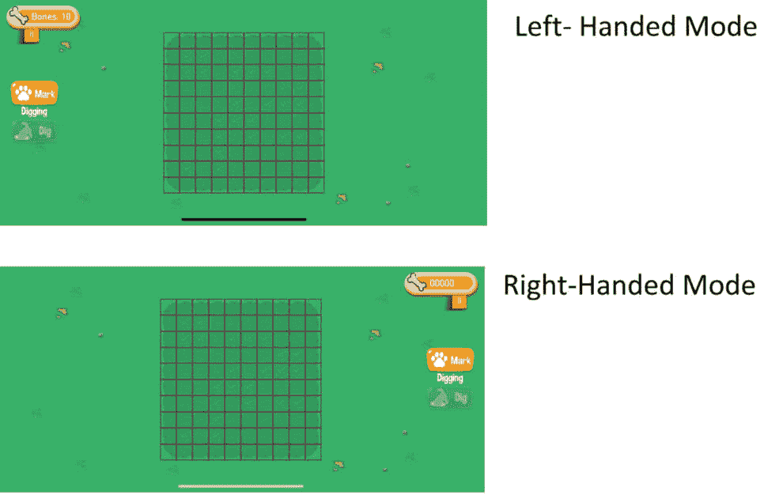

# 通用设计及 UI 的可访问性

当您设计界面时，您需要考虑所有可能与您的游戏互动的不同类型的玩家。您需要考虑他们的体型、年龄、当前情况、环境位置、输出设备、输入设备、认知能力、偏好、移动能力水平等。您希望您的界面尽可能适用于各种类型的人。

在设计过程的开始就考虑这些因素很重要，因为最初在设计 UI 时就考虑到这些因素，要比在 UI 已经设计、构建和实施之后再添加它们容易得多。

在本章中，我们将讨论以下主题：

+   什么是通用设计和可访问设计？

+   通用设计原则

+   可访问性设计

# 什么是通用设计和可访问设计？

罗纳德·马西提出了“通用设计”这个术语，并定义为如下：

“将产品和环境设计得尽可能适用于所有人，无需适应或专门设计。”

通用设计是一种设计理念，旨在设计出所有人都可以使用的、不受年龄、体型、偏好、能力、残疾、状况或情况限制的产品。它不专注于为特定群体设计，而是专注于设计出最广泛人群都能使用的产品。虽然最初关注的是建筑，但通用设计的概念已经扩展到包括所有类型产品的设计，包括视频游戏。“可访问设计”是一种专注于为有障碍和残疾的人设计的产品，它是通用设计的一个子集。

为了使设计有效，必须做出有目的的决定，以确保设计对所有人来说既实用又有用。在设计用户界面时，您应该从设计过程的开始就考虑如何使其对所有人可用和可访问。如果从这些考虑开始设计，那么设计一个普遍可用和可访问的 UI 要比在现有的界面之上添加功能容易得多。

在以下各节中，我将讨论使用通用设计原则设计用户界面时应考虑的因素，以及您应采取的特殊考虑因素，以确保您的界面可访问。

由于本书主要关注 Unity 中的 UI 开发，而 Unity 主要是一个视频游戏引擎，因此我将描述的大多数示例和用例将与视频游戏相关。

# 通用设计原则

1997 年，北卡罗来纳州立大学的一个工作组开发了 7 个通用设计原则。这些原则旨在帮助指导产品的设计，以便它们可以普遍使用。这些原则在正式定义时，以不同类型的设计为依据，并侧重于建筑。我将用其应用于数字用户界面的方式来概述每个原则，并提供每个原则如何在视频游戏界面设计中应用的示例。如果您想查看原则及其具体指南的列表，可以访问[`universaldesign.ie/what-is-universal-design/the-7-principles/`](https://universaldesign.ie/what-is-universal-design/the-7-principles/)。

许多这些原则相互重叠，我将提供的某些示例可能适用于多个原则。

## 公平使用

公平使用原则指出，设计应该对所有人同等可用和吸引人。如果所有用户都无法获得相同的使用体验，他们应该获得等效的体验。界面应该设计成对所有用户都有吸引力，并且不应该使任何用户感到污名化或隔离。这是第一个原则，因为它最终驱动了所有其他原则。

例如，在界面中应使用高对比度的颜色。高对比度的界面不仅对所有用户都有吸引力，而且有助于在直接阳光下使用的移动用户看到您的界面，并且它们避免了给视力受损的用户（如视力低下和色盲）带来污名化。

记住，通用设计的目的是不是明确地关于设计可访问性（即，为有残疾的群体设计）。利用类似高对比度颜色方案这样的东西对所有人都有益，而不仅仅是视力受损的人。这也不是一个需要明确开启的设置，例如开启色盲模式，这将是一种为可访问性设计。我将在本章后面讨论为可访问性设计。

如果您正在制作 PC 游戏，您不希望隐藏信息，使其只能通过鼠标访问。允许通过控制器的方向键或通过键盘的标签导航到信息，将使用不同输入设备（由于个人偏好或视力障碍）的用户能够访问与鼠标用户相同的信息。

## 使用灵活性

使用灵活性原则指出，设计应适应具有广泛偏好和能力的人群，并且人们在使用设计时应被提供选择。这一原则的关键在于，当用户与您的游戏互动时，为他们提供选择。

如果你正在制作移动游戏，你可以提供左右手模式，以交换按钮在屏幕上的位置，就像我在我的游戏 Barkeology 中所做的那样。这允许玩家轻松地与界面交互，而不会用他们的优势手阻挡游戏。

图 4.1：iOS 版 Barkeology 中的左手模式与右手模式

《幻想生活在线》允许你在三个位置中选择放置“愤怒按钮”的位置——这是一个当玩家可以使用特殊攻击时出现的按钮。这允许玩家根据他们的游戏风格和握手机的方式选择最舒适的位置。

对于 PC 游戏，你可以允许玩家选择不同的输入设备。例如，你可以提供使用键盘和鼠标或控制器进行游戏的选择。你可以允许玩家按他们希望的任何方式映射键盘或控制器，或者给他们提供预定义的方案进行选择。允许玩家选择控制器按钮方案也适用于游戏机。

如果你的游戏中有文本，允许用户更改文本的大小或展示给他们的速度。

你可以在界面上允许灵活性的方式还有很多。在设计你的界面时，只需确保考虑到玩家可能的不同偏好，这样你就可以相应地布局你的界面并映射你的输入。

## 简单直观的使用

简单直观的使用原则指出，设计应该易于人们理解，无论他们的过去知识、经验、技能或语言水平如何。

不要让你的界面过于复杂。如果你需要解释它，可能需要重新设计。从未玩过视频游戏的玩家应该能够像老手一样轻松理解你的界面。

将最重要的信息放置在最显眼的位置，并使它们最容易找到。不要将常见功能隐藏在多次按钮点击和菜单之后。如果你的菜单系统是嵌套的，并且某些菜单比其他菜单访问得更频繁，考虑将它们映射到快捷键或按钮。

向用户提供反馈，让他们知道何时在与你的界面交互。如果你有屏幕上的按钮，旨在通过触摸或鼠标点击进行交互，确保它们向用户提供反馈，让他们知道何时突出显示或点击它们。

向用户提供提示，让玩家知道你的界面的哪些部分是可交互的。你可以通过设计看起来可以物理按压的按钮或通过动画或配色方案来吸引注意力来实现这一点。

重要的是要记住，你的用户会有不同的阅读水平，可能说不同的语言。在可能的情况下，通过使用更多的**图标隐喻**来减少对文本的依赖。隐喻是意义被广泛认可的符号。例如，大多数人都会认识到以下图中显示的按钮的意义是播放、暂停、菜单、设置、关闭/取消、确认、静音和保存：

图 4.2：界面隐喻示例

伴随图标隐喻的文本，以便用户有多种方式感知特定图标的意义。

并非总是有可能完全从你的游戏 UI 中移除所有文本，并用图标和图像替换。因此，将你的游戏翻译成多种语言可以增加 UI 的通用可感知性。在*第十一章*中，我将讨论在构建 UI 时可以做的事情，以使翻译过程更加顺利，以及创建 UI 翻译系统的示例。

## 可感知信息

可感知信息原则指出，无论用户身处何种环境或感官能力如何，信息都应以可感知的方式进行传达。在考虑这一原则时，你想要思考信息可以传达的替代方式，以及如何在多种场景中清晰地传达信息。记住，界面是玩家通过它感知和与你的游戏互动的透镜。因此，他们必须能够理解它。

UI 的颜色应与背景形成鲜明对比，但也不应过于突出，以免造成视觉疲劳。你的游戏没有特定的颜色方案必须使用，但一般来说，互补色方案是减少视觉疲劳同时产生足够对比度以区分项目最佳的选择。

高对比度的文本在不同光照条件下更容易看清。确保文本大小适中，以便可见，并允许用户根据自己的偏好调整文本大小。此外，选择清晰易读的字体。

旁白不仅仅是用于对话！你也可以为你的菜单提供旁白。例如，在《孤岛惊魂 6》中，自动语音会在启动屏幕上读出各种菜单选项，以便那些有视觉障碍的人仍然能够感知屏幕上的项目。此选项默认开启，用户无需与菜单交互即可访问。

如果您正在制作控制台游戏，请考虑您的玩家将拥有不同类型、不同分辨率和亮度设置的电视。在启动 PlayStation 或 Xbox 游戏时，您可能看到调整亮度的提示，直到图像可见，或者可能看到移动框角直到它们达到屏幕边缘的提示。这些提示是安全措施，以确保游戏无论玩家的电视如何都能正确显示。

## 错误容忍

错误容忍原则指出，与设计交互的不利后果应尽量减少。我们都在某个时候无意中覆盖保存或删除保存文件，因为我们按错了按钮或看错了说明。错误容忍原则旨在最大限度地减少这类事件的发生。

一个设计良好的界面不一定是方便或易于使用的。人们喜欢快速点击或轻触事物。有时，我们希望让他们更难做到这一点。**设计不便**的概念涉及使界面不那么方便或更难交互。这听起来可能像是一种反直觉的设计，但如果一个界面让用户删除不小心删除的最后一个保存文件变得不那么方便，那么也许您的保存文件仍然在我们这里。

要求用户双倍确认删除的警告弹出窗口、切换确认按钮的位置以便用户不会快速点击、在点击之间添加计时器以及要求按下并保持都是我们可以使我们的界面在交互可能产生有害后果时对用户稍微不那么方便的方法。

## 低体力劳动

低体力劳动原则指出，设计应该舒适易用，并应尽量减少疲劳和不适。该原则的一个指导方针是尽量减少重复操作。在视频游戏中，这看起来可能是不可能做到的，因为坦白说，它们往往需要大量的重复操作，但以减少点击和鼠标拖动的方式组织您的界面可以提高您 UI 的质量。

在您的界面上减少体力劳动的一种方法是将类似操作分组在屏幕上。不要让用户在屏幕上来回跳动。当用户在一个视图菜单中完成所有操作会更方便时，不要要求用户跳转到多个菜单。您可以通过分配操作到快捷键或创建快捷方式来减少鼠标使用/拖动。此外，允许用户使用箭头键或控制器按钮而不是仅使用鼠标在菜单中导航，可能对某些用户来说更舒适。

当在 VR 中设计用户界面时，与在传统 2D 屏幕上的游戏相比，与界面交互所需的物理努力会呈指数级增长。将相似的项目分组，并允许用户使用控制器而不是指向来导航菜单，会使与界面交互更加舒适。

震动功能可以是一种为您的界面和游戏玩法提供反馈的极好方式，但它也可能被认为对某些玩家来说不舒服，并且据说与手臂振动综合征有关。如果您包括它，请确保允许用户将其关闭。

在控制台游戏中，一个令人沮丧的交互是输入表单中的信息。如果您让玩家使用屏幕键盘输入长文本字符串，需要导航到每个字母，这会非常繁琐，非常快。考虑允许玩家在手机或电脑上输入这些长字符串，并将数据发送到游戏，而不是在控制台上。

## 接近和使用的大小和空间

接近和使用的大小和空间原则指出，界面应允许用户无论其移动性、尺寸、姿势或位置如何都能与之交互。这一原则与先前的低物理努力原则紧密相关，即您希望他们不仅能够物理上与您的界面交互，而且还要舒适地这样做。

在确定游戏的键盘布局时，确保玩家不需要以对他们来说不可能或不适的方式伸展他们的手。如果您在控制器上有两个经常一起使用的按钮，您想确保按钮组合是可行的。例如，您不希望他们同时按下 Xbox 控制器上的 X 按钮和 B 按钮。

允许使用多种类型的输入设备是这一原则的关键，因为它将使人们能够使用为特定尺寸和移动性设计的输入设备。例如，在 PC 游戏中，有些人可能会发现使用控制器与键盘交互更容易。

此外，允许调整输入的灵敏度可以帮助那些有不同移动性问题的用户。例如，我手痛和颤抖问题。当我可以调整控制器和鼠标的灵敏度时，这使我以不影响游戏玩法的方式与游戏交互变得更容易，并且可以减少我体验到的疼痛。

在设计 VR 界面时，不要将 UI 项目放置得太高或太远，以至于玩家无法触及。这可能会使体型较小的玩家、坐着玩的玩家或移动性有问题的玩家无法与您的 UI 交互。

在*第二章*中，我们讨论了拇指区域。这是屏幕上玩家在握住手机时可以轻松触及的位置，并且大多数可交互的用户界面应该放置在这里。我们还希望确保在移动屏幕上按钮尽可能大。你不希望按钮太小且间距太近，以至于大手用户无法与之交互。

现在我们已经回顾了各种通用设计原则，让我们看看我们如何可以为有障碍和残疾的人专门设计。

# 无障碍设计

记住，通用设计涉及设计适用于所有人的通用用户界面。另一方面，无障碍设计涉及在设计时考虑到特定的障碍和残疾。在本节中，我将讨论几种非常具体的障碍和残疾类型，以及你如何设计你的用户界面，使其对具有这些障碍和残疾的个人可访问。其中一些例子将与我在通用设计部分讨论的例子重叠。

## 视觉

在设计你的界面时，你应该考虑不同类型的视觉障碍和残疾，包括（但不限于）色盲、低视力和失明。

重要的信息绝不能仅通过颜色传达，你应该始终包括另一种传达信息的方式。例如，假设一个游戏有一个数字，当为负数时是红色，当为正数时是绿色。这个数字也可以有负号和正号来表示符号。如果这个数字代表某种变化，也许当为正数时可以飞上去，当为负数时可以飞下来。这将确保色盲用户仍然能够看到这些重要的信息。

在可能的情况下，你应该避免对色盲用户不可区分的颜色组合；如果不可能，使用其他指示器使项目易于区分。例如，如果你有一个使用颜色来表示可匹配部件的三合一游戏，也可以在部件上包含符号，以便更容易区分。

以下网站提供了关于为色盲用户设计无障碍用户界面的非常有益的信息：

+   [如何为色盲用户设计](https://medium.com/theuxblog/how-to-design-for-color-blindness-a6f083b08e12)

+   [`www.smashingmagazine.com/2016/06/improving-color-accessibility-for-color-blind-users/`](https://www.smashingmagazine.com/2016/06/improving-color-accessibility-for-color-blind-users/)

如本章前面所述，你应该确保你的文本和其他 UI 元素具有非常高的对比度。这使色盲和视力低下的人能够更清楚地感知你的 UI。以下网站是一个检查两种颜色之间对比度的优秀资源：[`webaim.org/resources/contrastchecker/`](https://webaim.org/resources/contrastchecker/)。

虽然前面的网站展示了颜色是否符合网络规定的对比度要求，但这些信息同样适用于视频游戏。

如果你有一些重要信息，这些信息以弹出窗口的形式临时出现在屏幕上，请确保它出现在玩家的视线范围内。对于视野较低的人来说，将其放置在视线之外可能很难看到。更好的做法是允许玩家选择重要信息在屏幕上的弹出位置。

记住，根据无障碍设计的原则，选择非常重要。允许玩家尽可能多地更改视觉元素设置。如果你的游戏使用准星或光标，允许玩家更改准星或光标的样式。允许玩家更改界面或文本的大小。允许玩家更改界面的字体，使其具有更高的字距或间距，或者不那么花哨。

同样重要的是，以非纯视觉的方式指示信息。例如，假设你的 UI 变红以指示玩家健康值低，并且屏幕上有一个红色的健康计。你还可以包括蜂鸣声和控制器振动来指示低健康状态。这将帮助那些视力低下和色盲的人能够感知低健康状态。

如果你设有输入框，你可以使用语音作为输入文本的方式，而不仅仅是视觉键盘。

记住，你还可以使用描述轨道来描述游戏中的所有用户界面元素，从而让视力低下和盲人仍然能够感知屏幕上的内容。

## 听力和言语

有多种方式可以使你的界面对有听力和言语障碍的残疾人友好。本质上，你不想任何重要信息仅通过声音传达，也不希望你的输入需要语音。此外，如果你的 UI 产生任何类型的噪音，请尽量减少重叠噪音。

在我之前描述的低健康状态示例中，除了蜂鸣声之外，还有多种方式让玩家意识到健康值低。如果你的 UI 包括语音输入，请确保它不是唯一的输入方式，并允许用户通过其他方式输入信息。

虽然这可能看起来不是界面设计，但为所有对话添加字幕需要设计为一个 UI 元素。你的字幕 UI 需要清晰易读。通常，你应该将它们放在某种框中，以便它们与背景容易形成对比。你还想确保它们与游戏中的对话同步。

## 移动性

在设计你的界面时，你想要确保它们对所有移动能力水平的人都是可访问的。使你的游戏对移动能力水平可访问的最好方法是提供尽可能多的输入设备、输入映射和配置选项。允许玩家自己选择如何与你的界面交互，这可能会确保它符合他们的特定移动需求。

你希望你的控制尽可能简单，并且尽可能少使用按钮。如果你的控制特别复杂，提供简化控制方案的替代方案。

此外，不要要求玩家使用与游戏其他部分不同的输入设备来操作一小部分游戏。例如，如果大部分游戏是通过键盘控制的，那么不要要求玩家使用鼠标与起始屏幕交互。允许玩家使用相同的输入设备来操作游戏的各个方面。

## 认知和情感

在设计用户界面时，考虑玩家的认知和情感状态以及他们的语言技能是非常重要的。

不要假设玩家能够阅读你创建 UI 所使用的语言，或者他们能够快速阅读。如果你的游戏包含文本，请使用其他上下文元素和图像来传达文本的含义。如果你在 UI 中显示文本然后让其消失，允许玩家选择何时消失，而不是让其以自己的速度消失。

使用你的 UI 提醒玩家重要的游戏元素以及如何与你的界面交互的重要信息。通过在你的 UI 中突出显示控制，提醒玩家控制是什么。使用你的 UI 清楚地指示交互元素和目标。

不要在用户界面（UI）中放置闪烁的图像或重复的图案，因为这可能会触发易患癫痫的人。

虽然这可能更多地与你的游戏玩法而不是用户界面有关，但我想要指出，在游戏中包含特别可能引起不适的内容的警告（例如，如果游戏包含令人不安的内容，如《Doki Doki Literature Club》），可以帮助为玩家准备可能引起痛苦的事情。例如，现在许多游戏在包含令人不安的内容时都会附带内容警告。

# 其他资源

我本可以就用户界面的通用设计和可访问性设计方面说很多，但遗憾的是，这不是一本关于设计 UI 的书，而是关于 UI 开发的书。我希望这一章至少让你认识到考虑这些元素的重要性，以及它们在用户界面开发初期考虑的重要性。

如果你想要了解更多关于可访问性设计的知识，我强烈建议你查看以下网站提供的信息：[`gameaccessibilityguidelines.com/full-list/`](https://gameaccessibilityguidelines.com/full-list/)。它提供了一系列关于视频游戏可访问性的最佳实践。此外，它还提供了多个最佳实践示例，你可以作为参考使用。

你还可以访问[`caniplaythat.com/`](https://caniplaythat.com/)，这是一个提供游戏行业可访问性信息的网站。

# 摘要

在本章中，我们讨论了一些设计 UI 的关键考虑因素，以便使其尽可能普遍可感知。我们讨论了通用设计的原则，并回顾了一些你可以实施在设计中的考虑因素，以改善其可访问性。

在下一章中，我们将结束设计讨论，开始探讨如何实现 UI。我们将回顾 Unity 中可用的不同界面系统，这样你就可以开始应用一些设计知识了！
