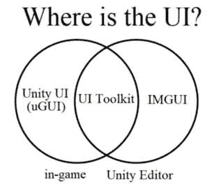

# Unity 中的用户界面和输入系统

既然我们已经讨论了开发用户界面的各种设计考虑因素，我们可以开始讨论如何在 Unity 中实现它们。Unity 提供了各种用于创建 UI 的系统。它有现成的系统，允许你创建将在你的游戏中显示的 UI，或者只会在编辑器中显示的 UI。此外，它还提供了多个系统用于接收玩家的输入。

在撰写本文时，这两个系统仍在积极开发中，并且默认情况下不包含在 Unity 中。本书将主要关注使用完整系统进行开发，但由于 Unity 有意向在某个时候将这些系统作为标准功能，因此我必须讨论它们，即使它们目前仍处于 **预览** 状态。

在本章中，我将讨论以下主题：

+   识别 UI Toolkit、Unity UI 和 IMGUI

+   在三个 UI 系统之间进行选择

+   识别输入管理器和输入系统

+   在输入管理器和输入系统之间进行选择

让我们先看看 Unity 中的三个 UI 系统。

# 三个 UI 系统

Unity 有三个系统可以用来构建 UI。你选择哪个将取决于你的 UI 将在哪里显示，你试图实现什么，你是否在处理一个现有项目，以及你对编码的熟悉程度。

你构建的 UI 可以是游戏内或编辑器内。游戏内 UI 是玩家可以访问的 UI。编辑器内 UI 是在 Unity 编辑器中显示并辅助开发的 UI。

如果你想要为你的游戏或应用程序构建 UI，你可以选择 Unity UI（uGUI）系统或 UI Toolkit。如果你想要构建只会在 Unity 编辑器中显示的 UI，你可以使用 UI Toolkit 或 IMGUI。以下维恩图总结了不同 UI 系统的用途：

图 5.1：游戏内和编辑器 UI 的比较

看看 *图 5**.1*，你可能会有这样的想法：“嗯，UI Toolkit 适用于所有东西！我只需要学习它，就能结束我的 UI 学习之旅！这是一个简单的选择！”不幸的是，事情并不那么简单。让我们更深入地了解不同的系统，以便你可以决定哪个适合你。

## Unity UI（或 uGUI）

**Unity UI** 系统也称为 **uGUI**，是 Unity 内置的系统，无需任何额外下载。它基于 GameObject 和 Component，并包含多种 UI 元素以供选择。当涉及到为游戏或应用程序开发 UI 时，这是最稳健和最稳定的选项。由于这是唯一一个不在预览模式中且包含在 Unity 中的游戏内 UI 构建系统，因此本文的大部分内容将专注于如何使用此系统开发 UI。

## IMGUI

**IMGUI**，或**即时模式 GUI**系统，是一个基于代码的 GUI 系统，用于在编辑器中创建界面。其主要功能是帮助程序员进行开发，由于性能问题，不建议用于游戏中的 UI 开发。由于这个系统不是为了在游戏中使用而设计的，并且本书将主要关注游戏中的 UI 开发，因此我不会花费大量时间介绍它，但我会讨论一些其基本功能和用法，在*第十九章*中。

## UI Toolkit

**UI Toolkit**是一个正在积极开发中的新 UI 系统。它默认不包含在引擎中，必须通过包管理器下载。此外，它是一个预览包，这意味着您必须选择才能在 Unity 提供的可用包列表中看到它。Unity 计划最终用 UI Toolkit 替换 uGUI 和 IMGUI。UI Toolkit 的设计采用了传统的 Web 开发概念，并且与基于 GameObject 的 uGUI 结构完全不同。在*第十八章*中，我将介绍如何下载 UI Toolkit 包以及如何使用它。

## 选择 UI 系统

您选择使用哪个系统将取决于几个因素。如前所述，您是为编辑器还是为游戏制作 UI 将决定您选择哪个系统。如果您正在为游戏制作 UI，您可以使用 Unity UI 或 UI Toolkit。如果您正在为编辑器制作 UI，您可以使用 IMGUI 或 UI Toolkit。

UI Toolkit 是一个尚未完全实现的系统，因此如果您正在为已经包含 UI 的现有游戏工作，您可能不会使用 UI Toolkit。它可能也不具备您想要使用的所有功能。由于 UI Toolkit 处于开发中，它可能无法保证稳定性，并且在开发过程中更新它可能会对您的项目产生不利影响。

您对编码的舒适度也可能影响您的决定。一般来说，使用 Unity UI 所需的编码强度低于 IMGUI，并且可能比 UI Toolkit 更熟悉，因为它是基于 GameObject 的。然而，如果您熟悉基于 Web 的 UI 创建，UI Toolkit 可能对您来说非常熟悉。

如果您正在考虑使用 UI Toolkit，我建议在决定使用哪个系统之前，先查看本书中的示例以及以下 Unity 文档页面：[`docs.unity3d.com/Manual/UI-system-compare.xhtml`](https://docs.unity3d.com/Manual/UI-system-compare.xhtml)。

现在我们已经回顾了 Unity 提供的三个 UI 系统，我们可以回顾两个输入系统。

# 两个输入系统

如*第一章*中定义，**UI**代表**用户界面**，包括用户和游戏之间传达信息的所有机制。在讨论三个 UI 系统时，我们提到了游戏与用户沟通的三个方式——具体来说是通过输出设备（即屏幕）上的 GUI。然而，如果用户想要与游戏沟通，用户将需要某种方式来提供输入。然后游戏需要处理这些输入。

Unity 可以以两种核心方式处理输入。**输入管理器**或**输入系统**。正如有各种因素会影响您可能使用的 UI 系统一样，也有各种因素可以帮助您确定使用哪个输入系统。这两个系统都允许您轻松处理多种类型的输入，就像它们是同一种输入一样。例如，每个系统都会让您处理键盘空格键和 Xbox 控制器 A 按钮，就像它们是同一种类型的输入一样。它们是如何做到这一点的将在后面的章节中更详细地讨论，但就目前而言，让我们先看看这两个系统之间的一般区别。

## 输入管理器

输入管理器是 Unity 默认提供的输入系统，无需下载任何额外的包。无需配置任何设置，您就可以轻松地接受来自键盘、鼠标、游戏手柄或触摸屏等设备的输入。它是通过提供预定义的*输入轴*来实现的，这些轴本质上指定了关键词和与之绑定的按钮。我们将在*第八章*中更详细地回顾这一功能。

## 新输入系统

输入系统（俗称*新输入系统*）是一个目前正在开发中的包，正如 Unity 在其文档中所述，它旨在比输入管理器更强大、更灵活、更可配置：`docs.unity3d.com/Packages/com.unity.inputsystem@1.3/manual/index.xhtml`。

如果您一直在使用输入管理器进行项目开发，您可以将项目转换为使用新输入系统的项目。我们将在*第二十章*中讨论如何实现输入系统。

## 在输入系统和新输入系统之间进行选择

让我先说，关于选择哪个系统并没有必然的正确答案。理论上，您可以使用任何一个系统来处理任何类型的输入。您选择哪个系统将主要基于个人偏好、您项目输入集的复杂程度以及您是否在为多个平台开发。

如果你没有计划允许玩家重新映射控制（如*第四章*中所述）或者没有计划进行跨平台开发，那么使用输入管理器可能就足够了，你不需要经历下载输入系统的过程。然而，如果你想要拥有超可配置的控制方案，接受来自各种设备的输入，以及接受复杂的输入动作，你可能会发现使用输入系统来编写处理这些输入的代码比使用输入管理器要容易得多。

由于输入管理器被用于许多正在开发的项目中，如果仅仅因为它不是“新热点”就完全忽略它，那将是对你的一种不公平。此外，新的输入系统仍然处于开发阶段，并且随着每次更新都会发生重大变化。然而，它确实使某些事情的建设变得更加容易，并且在开发者中越来越受欢迎。因此，我不会在这本书中只关注这些系统中的任何一个。

# 摘要

Unity 提供了多种方式，你可以通过使用三个 UI 系统向用户显示信息。你选择哪种方式取决于你的需求和是否在为游戏或编辑器开发 UI。这本书将主要关注 uGUI，因为它是用于游戏开发中最稳定的 UI 版本，并且由 Unity 提供，无需额外下载。然而，如何使用 IMGUI 开发编辑器 UI 以及如何使用 UI Toolkit 同时使用编辑器 UI 和游戏 UI 将在本书的后续章节中讨论。

Unity 还提供了多种方式来处理用户输入。虽然新的输入系统仍在开发中，并且默认情况下不包含在 Unity 中，但我将确保给你足够的信息，以便你在项目中使用它。

在下一章中，我们将开始使用 uGUI 系统开发 UI，通过探索 UI 画布、面板和布局。
