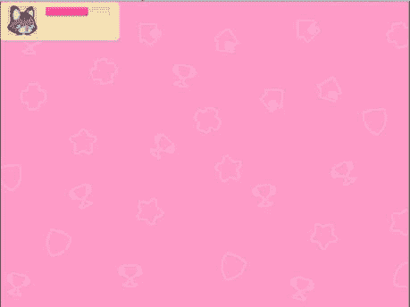

# 画布、面板和基本布局

如前一章所述，本文的大部分内容将侧重于 Unity UI 系统，即 uGUI。画布是所有使用 Unity UI 制作的 UI 的核心。每个 uGUI 元素都必须包含在一个画布中，才能在场景中进行渲染。它的工作方式类似于艺术家在上面作画的画布，但不同的是，我们在上面布局 UI 元素，而不是在上面作画。因此，我们将从 uGUI 系统提供的各种 UI 元素开始，以画布为起点进行探索。

画布不仅用于包含它们内部的所有 UI 元素，还决定了元素如何渲染以及如何缩放。在早期就关注设置能够在多个分辨率和宽高比下缩放的 UI 非常重要，因为稍后尝试这样做将会带来很多麻烦和额外的工作。因此，我们还将讨论如何确保我们的 UI 能够适当地缩放。

在本章中，我们将讨论以下主题：

+   创建 UI 画布并设置其属性

+   创建 UI 面板并设置其属性

+   使用矩形工具和矩形变换组件

+   正确设置锚点和中心点

+   如何创建和布局基本 HUD

+   如何创建背景图片

+   如何设置基本弹出菜单

# 技术要求

你可以在此处找到本章的相关代码和资产文件：

[`github.com/PacktPublishing/Mastering-UI-Development-with-Unity-2nd-Edition/tree/main/Chapter%2006`](https://github.com/PacktPublishing/Mastering-UI-Development-with-Unity-2nd-Edition/tree/main/Chapter%2006)

# UI Canvas

你创建的每个 UI 元素都必须是**UI Canvas**的子元素。要查看在 Unity 中可以创建的所有 UI 元素列表，请从**Hierarchy**窗口中选择**+** | **UI**，如下截图所示：

图 6.1：Unity UI（uGUI）系统中的可渲染 UI 元素

在前面的截图中所突出的每个 UI 项目都是一个可渲染的 UI 项目，并且必须包含在一个画布中才能进行渲染。如果你尝试将任何这些 UI 元素添加到一个不包含画布的场景中，系统会自动添加一个画布到场景中，并且你尝试创建的项目将成为新添加的画布的子元素。为了演示这一点，尝试向一个空场景添加一个新的**UI Text**元素。你可以通过选择**+** | **UI** | **Text**来实现。

这将在 Hierarchy 列表中产生三个新项目：`Canvas`、`Text`和`EventSystem`，其中 Text 是 Canvas 的子元素。

图 6.2：将 UI 文本元素添加到场景后的结果

现在你场景中已经有了画布，任何添加到场景中的新 UI 元素都将自动添加到这个画布中。

注意

如果你尝试将可渲染的 UI 元素从 Canvas 中移除，它将不会绘制到场景中。

你也可以通过选择`EventSystem` GameObject（场景中尚未存在）来创建一个空的 Canvas，一个将自动为你创建（正如你在前面的截图中所看到的）。我们将在*第八章*中进一步讨论`EventSystem` GameObject，但就目前而言，你真正需要知道的是`EventSystem`允许你与 UI 项目进行交互。

注意

你可以在场景中拥有多个 Canvas，每个都有自己的子组件。

当你创建一个 Canvas 时，它将作为场景中的一个大型矩形出现。它将比代表摄像机视图的矩形大得多：

图 6.3：Unity UI（uGUI）系统中的可渲染 UI 元素

Canvas 比摄像机大，因为 Canvas 组件上有一个缩放模式。默认情况下，缩放模式将 UI 中的每个像素等同于一个 Unity 单位，所以它要大得多。这个大尺寸的一个好结果是，它真的很容易将 UI 项目作为一个相对独立的实体看到，这有助于避免它弄乱你的摄像机视图。

每个新创建的 Canvas 都自动包含四个组件：**Rect Transform**、**Canvas**、**Canvas Scaler**和**Graphic Raycaster**，如下面的截图所示：

图 6.4：Canvas GameObject 的组件

让我们探索这些组件中的每一个。

## Rect Transform 组件

每个 Unity UI GameObject 都包含一个作为其第一个组件的**Rect Transform**组件。这个组件与非 UI GameObject 上的**Transform**组件非常相似，因为它允许你在场景中放置对象。

你会注意到，当你第一次将 Canvas 放置在场景中时，你无法调整**Rect Transform**中的值，并且会看到一个消息，**“某些值由 Canvas 驱动”**，如前面的截图所示。这个消息意味着你不能控制 Canvas 的位置，因为**Canvas**组件中选择的属性决定了它们。

当 Canvas 组件的**Render Mode**设置为**Screen Space-Overlay**或**Screen Space-Camera**时，**Rect Transform**组件值的调整被禁用。在这两种模式下，值由游戏显示的分辨率确定，因为 Canvas 填充了全屏区域。当 Canvas 的**Render Mode**设置为**World Space**时，你可以根据需要调整值，因为该组件将确定其在场景中的位置。我们将在本章后面更详细地讨论如何使用**Rect Transform**组件，但就目前而言，让我们更深入地回顾 Canvas 组件和不同的渲染模式。

## Canvas 组件

**画布**组件允许你从下拉菜单中选择画布**渲染模式**。有三种渲染模式：**屏幕空间叠加**、**屏幕空间-相机**和**世界空间**。不同的渲染模式决定了场景中的 UI 元素将在哪里绘制以及如何使用**矩形变换**组件。

在开发你的 UI 时，你应该首先始终适当地根据你的需求设置画布的渲染模式。如果你的场景中有多个画布，它们可以各自有不同的渲染模式。更改渲染模式将更改画布组件上的属性。让我们回顾每种渲染模式的目的以及与之相关的属性。

### 屏幕空间叠加

**屏幕空间叠加**是默认的渲染模式。如果你被要求思考一个视频游戏 UI，你很可能想象的是一个在**屏幕空间叠加**中渲染的 UI。这种渲染模式将画布内的所有 UI 元素叠加在场景中的所有元素之前，就像它是在屏幕上绘制的一样。因此，像**抬头显示**（**HUDs**）和出现在屏幕同一平面的弹出窗口这样的 UI 项目将被包含在**屏幕空间叠加**画布中。

记住，当画布使用**屏幕空间叠加**渲染模式时，你无法调整画布的**矩形变换**组件。这是因为画布将根据屏幕的大小（而不是相机）自动调整大小。

图 6.5：屏幕空间 – 堆叠渲染模式属性

当你选择了**屏幕空间叠加**时，以下属性将变得可用：

+   **像素完美**：选择此复选框将使画布中渲染的元素与像素对齐。它可以使 UI 元素看起来更清晰，模糊度更低。这可能会引起性能问题，因此只有在绝对必要时才使用它。

+   **排序顺序**：此选项将确定场景中所有**屏幕空间叠加**画布渲染的顺序。你可以将其视为堆叠顺序。数字越高，画布内项目对观看场景的人看起来就越**靠近**。换句话说，排序顺序编号较高的画布将出现在排序顺序编号较低的画布之上。

+   **目标显示**：如果你正在创建 PC、Mac、Linux 独立游戏，你可以让不同的相机显示在多达八个不同的显示器上。你也可以为每个显示器设置不同的 UI。这就是你将告诉画布它将在哪个显示上渲染的地方。

+   **附加着色器通道**: 着色器本质上是一种算法，它根据光线和材质描述 GameObject 的颜色。每个画布自动包含以下着色器通道：位置、颜色和 Uv0。然而，这个属性允许你添加额外的通道。着色器是一个相当复杂的话题，所以我们不会在本文本中花费太多时间讨论它们。在**屏幕空间-叠加**模式下，下拉菜单中并非所有可用的通道都有效，你会在组件中看到一个消息，说明哪些通道不起作用。

接下来，让我们看看**屏幕空间相机**。

### 屏幕空间-相机

**屏幕空间-相机**的表现与**屏幕空间-叠加**类似，但它将所有 UI 元素渲染成好像它们与相机有一定距离。正如你从下面的截图中所见，如果没有选择**渲染相机**，这种渲染模式的工作方式与**屏幕空间-叠加**模式完全相同（如警告信息所示）：

图 6.6：屏幕空间 – 相机渲染模式的警告信息

你可以将场景中的任何相机分配到**屏幕空间-相机**渲染模式中的**渲染相机**。这是画布将要绘制的相机。一旦你将一个相机添加到**渲染相机**槽中，警告信息就会消失，并且会提供新的选项，如下面的截图所示：

图 6.7：屏幕空间 – 相机渲染模式属性

当你选择了**屏幕空间-相机**时，以下属性将变得可用：

+   **像素完美**: 这与**屏幕空间-叠加**中的选项相同。

+   **渲染相机**: 如前所述，这是画布将要绘制的相机。

+   **平面距离**: 这个属性告诉画布它应该显示在相机多远的位置。

+   **排序层**: 这个属性允许你选择要使用哪个**精灵排序层**来显示画布。

+   **层内顺序**: 这个属性决定了画布在之前选择的**精灵排序层**中的显示顺序。这个顺序与**排序顺序**的工作方式类似，数值较高的元素会显示在数值较低的元素之上。

+   **附加着色器通道**: 这个属性在**屏幕空间-叠加**中的工作方式相同。

这种渲染模式在你想要画布从与主相机不同的视角渲染时很有用。它还有助于创建一个会与相机一起一致缩放的静态背景，这在 2D 游戏中很有用。由于你可以使用**精灵排序层**与这种渲染模式一起使用，你可以确保包含背景的画布始终在场景中的所有其他对象之后渲染。

记住，当画布使用**屏幕空间-相机**渲染模式时，你不能调整画布的**矩形变换**组件。这是因为画布将根据相机的尺寸（而不是屏幕）自动调整大小。

### 世界空间

最后的渲染模式是**世界空间**。此模式允许你将 UI 元素渲染成仿佛它们在物理世界中定位。

在**屏幕空间-叠加**和**屏幕空间-相机**中，你不能调整**矩形变换**组件的属性。具有这两种渲染模式的画布中 UI 元素的定位不转换为世界空间坐标，而是相对于屏幕和相机。然而，当画布处于**世界空间**渲染模式时，可以调整**矩形变换**的值，因为 UI 元素的坐标基于场景中的实际位置。这些画布不需要像其他两种画布类型那样面对指定的相机。

图 6.8：渲染模式 – 世界空间属性

此模式请求一个**事件相机**，而不是像**屏幕空间-相机**模式请求的**渲染相机**。**事件相机**与**渲染相机**不同。由于此画布位于**世界空间**，它将与**主相机**一起渲染，就像场景中存在的所有其他对象一样。**事件相机**是接收来自 EventSystem 事件的相机。因此，如果画布上的项目需要交互，你必须包含一个**事件相机**。如果玩家不会与画布上的项目交互，你可以将其留空。

你需要指定一个**事件相机**的原因是光线投射。当用户点击或触摸屏幕时，从点击（或触摸）点向场景无限延伸一条射线（单向线）。射线的方向由相机的朝向决定。大多数情况下，你会将其设置为**主相机**，因为玩家会期望事件发生在这个方向上。

当你选择**世界空间**时，以下属性变为可用：

+   **事件相机**：如前所述，分配给此槽位的相机决定了哪个相机将接收画布的事件

+   **排序层**：此属性与**屏幕空间-相机**相同

+   **层顺序**：此属性与**屏幕空间-相机**相同

+   **附加着色器通道**：此属性与**屏幕空间-叠加**中的工作方式相同

接下来，让我们看看**画布** **标量**组件。

## 画布标量组件

**画布标量**组件决定了画布内项目如何缩放。它还决定了 UI 画布内项目的像素密度。

在*第一章*中，我们讨论了如何在单个分辨率或单个纵横比下构建您的游戏。然而，大多数时候，您不会有选择游戏分辨率或纵横比的自由。请注意，我只提到了为 PC、Mac 和 Linux 独立构建以及 WebGL 构建指定纵横比和分辨率。当您构建将在手持屏幕或电视屏幕上播放的内容时，您无法保证屏幕的大小。

由于您无法保证游戏的分辨率或纵横比，因此您的 UI 需要调整以适应各种分辨率和缩放，这一点非常重要；这就是为什么存在这个**画布标量**组件的原因。

**画布标量**组件有四个**UI**缩放模式：

+   **固定** **像素大小**

+   **根据屏幕大小缩放**

+   **固定** **物理大小**

+   **世界**

当画布**渲染模式**设置为**屏幕空间-叠加**或**屏幕空间-相机**时，前三个**UI 缩放模式**可用。当画布**渲染模式**设置为**世界空间**时，自动分配第四个**UI 缩放模式**（设置后不能更改）。

### 固定像素大小

当画布的**UI 缩放模式**设置为**固定像素大小**时，UI 中的每个项目都将保持其原始像素大小，无论屏幕大小如何。您会注意到这是默认设置，因此默认情况下 UI 不会缩放；您必须通过更改屏幕分辨率来启用设置才能使其缩放。

图 6.9：固定像素大小 UI 缩放模式属性

当您将**UI 缩放模式**更改为**固定像素大小**时，您将在检查器中看到以下属性：

+   `2`，UI 中的所有内容将加倍。如果您将此数字设置为`0.5`，所有项目的大小将减半。

+   `100`，这意味着两个相隔一个游戏单位的对象将相距 100 像素。换句话说，如果两个对象在相同的*y-*坐标上，但一个对象的*x-*坐标为`1`，另一个对象的*x-*坐标为`2`，它们正好相距 100 像素。这个属性在所有其他模式中都以相同的方式工作，因此我将在下一节中不讨论它。

### 根据屏幕大小缩放

当您将**画布标量**组件设置为**根据屏幕大小缩放**时，画布上的 UI 元素将根据**参考分辨率**进行缩放。如果屏幕比**参考分辨率**值大或小，画布上的项目将相应地放大或缩小。在*第一章*中，我告诉您应该决定一个代表您 UI 设计理想分辨率的默认分辨率。这个默认分辨率将是**参考分辨率**。

图 6.10：根据屏幕尺寸缩放的 UI 缩放模式属性

如果你的屏幕纵横比与**参考分辨率**值匹配，那么事物将无问题地缩放和缩小。如果不匹配，那么你需要使用**画布缩放器**组件来定义如果纵横比发生变化，项目将如何缩放。

这可以通过使用**屏幕匹配模式**设置来实现。以下列出了三种不同的**屏幕匹配模式**，它们决定了如果游戏的纵横比与**参考分辨率**的纵横比不匹配时，画布将如何缩放：

+   **匹配宽度和高度**: 这将根据参考高度或参考宽度缩放 UI。它也可以根据两者的组合进行缩放。

+   **扩展**: 如果屏幕尺寸小于**参考分辨率**，画布将被扩展以匹配**参考分辨率**。

+   **缩小**: 如果屏幕尺寸大于**参考分辨率**，画布将被缩小以匹配**参考分辨率**。

`0` (`1` (**高度**).

图 6.11：根据屏幕尺寸缩放的 UI 缩放模式属性

当`0`的值为时，**画布缩放器**将强制画布始终具有由**参考分辨率**指定的相同宽度。这将保持画布宽度方向上对象的相对缩放和位置。因此，对象在水平方向上不会彼此远离或靠近。然而，它将完全忽略高度。因此，对象可以在垂直方向上彼此远离或靠近。

设置`1`将完成相同的事情，但将保持对象沿高度而不是宽度的位置和缩放。

设置`0.5`将比较游戏宽度和高度与**参考分辨率**，并且它将尝试保持水平和垂直方向上对象之间的距离。

`0`和`1`。如果数字接近`1`，缩放将优先考虑高度，如果接近`0`，则优先考虑宽度。

这些`1`)。如果你想保持相对水平位置不变，请使用`0`)。这实际上完全取决于你最关心的哪种间距。

我建议根据你游戏的朝向使用以下设置：

| **方向** | **匹配值** |
| --- | --- |
| **肖像** | `0` (宽度) |
| **横幅** | `1` (高度) |
| **变化** | `0.5` (宽度和高度) |

表 6.1：方向和匹配值

我选择这些设置是基于**参考分辨率**中两个数字中较小的一个。在**肖像**模式下，宽度将是最小的，因此我认为保持项目在宽度上的相对位置很重要。这是一个个人偏好，仅作为一个建议，并且不一定适用于所有游戏。然而，我发现这对于大多数游戏来说是一个很好的经验法则。

最好避免制作在肖像模式和横幅模式之间变化的游戏，除非你有最小的 UI 或者非常熟悉创建可缩放 UI。

### 常数物理大小

当画布的**UI 缩放模式**设置为**常数物理大小**时，UI 中的每个项目都将保持其原始的物理大小，无论屏幕的大小如何。物理大小是指用户如果拿出尺子并在屏幕上测量它时将看到的尺寸。与**常数像素大小**类似，具有此**UI 缩放模式**设置的画布上的项目将不会缩放。

如果你有一个希望始终具有特定宽度和高度的 UI 项目，你可以在具有此**UI 缩放模式**的画布上放置它。例如，如果你希望一个按钮始终宽 2 英寸、高 1 英寸，你会使用此模式。这在移动游戏中尤其有用，可以确保按钮的大小足够大，以便人类手指根据我们在*第四章*中讨论的建议进行操作。

图 6.12：使用常数物理大小 UI 缩放模式属性进行缩放

当你将**UI 缩放模式**更改为**常数物理大小**时，你将在检查器中看到以下属性：

+   **物理单位**：计量单位。您可以选择**厘米**、**毫米**、**英寸**、**点**和**皮卡**。

+   **回退屏幕 DPI**：如果 DPI 未知，则假定此 DPI。

+   **默认精灵 DPI**：所有具有与**参考每单位像素**值相等的每单位像素的精灵的 DPI。

### 世界

**世界**是唯一适用于设置为**世界空间**的画布的**UI 缩放模式**。从以下截图可以看出，模式不能更改：

图 6.13：使用世界 UI 缩放模式属性进行缩放

当你将**UI 缩放模式**更改为**世界**时，你将在检查器中看到以下属性：

+   **动态每单位像素**：这是所有动态 UI 项目（如文本）的每单位像素设置。

## 图形射线组件

**图形射线投射器**组件允许您使用事件系统检查画布上的对象是否被用户输入击中。正如在查看**世界空间**画布**渲染模式**时讨论的那样，当用户触摸屏幕时，从玩家触摸的屏幕上的点向前发射一条射线。**图形射线投射器**检查这些射线，看它们是否击中了画布上的某个对象。

图 6.14：图形射线投射器组件

您可以在**图形** **射线投射器**组件上调整以下属性：

+   **忽略反转图形**：如果 UI 元素背对玩家，选中此选项将阻止击中事件注册。如果没有选中，则击中事件将注册在背面的 UI 对象上。

+   **遮挡对象**：此设置指定了哪些类型的物品在其前方会阻止它被击中。因此，如果您选择**二维**，则此画布前方任何**二维**对象都会阻止这些对象被交互。然而，3D 对象不会阻止交互。可能的选项如下所示：

图 6.15：图形射线投射器遮挡对象选项

+   **遮挡掩码**：在此属性上选择项目的工作方式类似于**遮挡对象**属性。这允许您根据它们的渲染层选择项目，因此您可以更具体一些。可能的选项如下所示：

图 6.16：图形射线投射器遮挡掩码选项

我们将在*第八章*中更详细地讨论射线投射和事件系统。

## 画布渲染器组件

**画布渲染器**组件不在画布 GameObject 上，而是在所有可渲染 UI 对象上。

图 6.17：画布渲染器组件

为了使 UI 元素能够渲染，它必须在其上有一个**画布渲染器**组件。您通过**+** | **UI**菜单创建的所有可渲染 UI 元素都将自动附加此组件。如果您尝试移除此组件，您将看到类似于以下警告的信息：

图 6.18：尝试移除画布渲染器组件时的警告信息

在前面的屏幕截图中，我尝试从一个文本 UI 对象中移除画布渲染器组件。如您所见，它不允许我移除画布渲染器组件，因为文本组件依赖于它。如果我返回并移除文本组件，然后我就能移除画布渲染器组件。

**画布渲染器**组件上唯一的属性是**裁剪透明网格**切换。 “裁剪”意味着不绘制。因此，此属性表示渲染器将不会绘制任何顶点颜色 alpha 值为 0 或接近 0 的几何形状。

# UI 面板

**UI 面板**的主要功能是包含其他 UI 元素。您可以通过选择**+** | **UI** | **面板**来创建面板。需要注意的是，没有面板组件。面板实际上只是具有**矩形变换**、**画布渲染器**和**图像**组件的 GameObject。因此，实际上，UI 面板只是一个具有一些预定义属性的 UI 图像。

图 6.19：面板 GameObject 上的组件

默认情况下，面板以**背景**图像（只是一个灰色圆角矩形）作为**源图像**，具有中等不透明度。您可以替换**源图像**为另一个图像或完全删除图像。

当您试图确保项目按比例缩放并相对于彼此适当地定位时，面板非常有用。包含在同一个面板中的项目将相对于面板缩放，并在过程中保持彼此的相对位置。

我们很快将更详细地查看**图像**组件，但现在我们正在查看一个允许我们编辑其**矩形变换**组件的对象，让我们来探索这个组件。

# 矩形变换

每个 UI 元素都有一个**矩形变换**组件。**矩形变换**组件与**变换**组件非常相似，用于确定其附加对象的位置。

## 矩形工具

可以使用任何变换工具来操纵 UI 对象。然而，矩形工具允许您通过操纵包含对象的矩形来缩放、移动和旋转任何对象。虽然这个工具可以用于 3D 对象，但它对 2D 和 UI 对象最有用。

图 6.20：矩形工具

+   要使用矩形工具移动对象，选择对象然后点击并拖动在矩形内。

+   要调整对象的大小，将光标悬停在对象的边缘或角落。当光标变为箭头时，点击并拖动以调整对象的大小。在拖动时按住*shift*键可以均匀缩放。

+   要旋转对象，将光标悬停在对象的角落——稍微在矩形外面，直到光标在角落显示一个旋转的圆圈。然后可以通过点击和拖动来旋转。

### 定位模式

当使用矩形工具时，选择正确的定位模式非常重要。您可以选择**居中**或**锚点**以及**全局**或**本地**。模式可以通过点击按钮切换：

图 6.21：各种定位模式

+   当处于**中心**模式时，对象将根据其中心点移动并围绕其中心点旋转。

+   当处于**旋转**模式时，对象将围绕其旋转中心点旋转，而不是中心点。您还可以在此模式下通过悬停在旋转中心点上并点击拖动来改变旋转中心点的位置。

+   当处于**全局**模式时，矩形变换的边界框将是一个非旋转的框，包围整个对象。

+   当处于**本地**模式时，矩形变换的边界框将是一个旋转的框，紧密地适合对象。

以下插图显示了**全局**和**本地**模式下面板的矩形变换的边界框。空心的蓝色圆圈代表对象的旋转中心点：

图 6.22：全局模式与本地模式

接下来，让我们看看**矩形** **变换**组件。

## 矩形变换组件

如前所述，UI 元素没有标准的**变换**组件；它们有**矩形变换**组件。如果您将其与标准**变换**组件进行比较，您会发现它有相当多的属性：

图 6.23：变换与矩形变换

您可以使用它来改变位置、旋转和缩放，就像使用`1`一样。

您可能已经注意到，前一个插图中的位置和尺寸值的标签与*UI 面板属性*部分提供的标签不同。这是因为表示位置和尺寸的标签会根据选择的锚点预设而改变。我们将稍后讨论如何使用这些锚点预设，但让我们看看位置和尺寸值可以持有的不同标签示例。

图 6.24：矩形变换属性的变化

如果**矩形变换**的锚点预设设置为不包含拉伸，就像前一个屏幕截图中的左上角示例一样，位置值将由**Pos X**、**Pos Y**、**Pos Z**确定，尺寸由**宽度**和**高度**确定。

如果**矩形变换**的锚点预设设置为包含拉伸，就像其他三个示例一样，垂直于拉伸的位置和与拉伸平行的尺寸将用**左**、**右**、**上**和**下**标记。这些值代表从父级**矩形变换**边界的偏移量。

对象的**锚点**决定了所有相对位置测量的起点。**旋转中心点**决定了缩放和旋转修改发生的起点。它将围绕这个点旋转并朝向这个点缩放。我们将在“锚点和旋转中心点”部分更详细地探讨锚点和旋转中心点。

### 矩形变换编辑模式

在 **矩形变换** 组件中，你可以使用两种不同的编辑模式——蓝图模式和原始编辑模式，分别由以下图标表示：

图 6.25：矩形变换编辑模式

蓝图模式将忽略对其应用的任何本地旋转或缩放，并将矩形变换边界框显示为非旋转、非缩放的框。以下截图显示了在关闭和开启蓝图模式时旋转和缩放的 Panel 的边界框：

图 6.26：开启与关闭蓝图模式

原始编辑模式将允许你更改 UI 对象的锚点和枢轴点，而不会根据你所做的更改移动或缩放对象。

# 锚点和枢轴点

每个 UI 对象都有锚点手柄和枢轴点。当它们一起使用时，将有助于确保你的 UI 位置适当，并在游戏分辨率或纵横比发生变化时适当缩放。

锚点手柄以 X 形状的四个三角形表示，如下所示：

图 6.27：锚点手柄和枢轴点

锚点可以组合在一起形成一个单独的锚点，如图中所示，或者它们可以被分割成多个锚点，如下所示：

图 6.28：分割锚点手柄

锚点将始终形成一个矩形。因此，边总是对齐的。

在 *x* 值中的 `0` 将手柄移动到最左边，而 `1` 将手柄移动到最右边。你可以从以下屏幕截图看到调整 *x* 值如何相对于父元素移动锚点：

图 6.29：调整锚点最小和最大值

**矩形变换**具有锚点预设和**最小**和**最大**锚点属性。锚点代表 UI 元素连接到其父矩形变换的点：

图 6.30：访问锚点预设

由于画布没有父元素，你会看到锚点预设区域是空的。这无论选择哪种画布渲染模式都是正确的：

图 6.31：画布游戏对象上缺少锚点预设

点击锚点预设框将显示所有可能的 **锚点预设** 列表，如下所示截图：

图 6.32：所有可用的锚点预设

如果你点击其中一个预设，它将移动锚点到截图显示的位置。你也可以使用锚点预设调整位置和轴心点。

如果按住 *Shift* 和/或 *Alt.*，表示预设的图像将改变。按住 *Shift* 将显示由蓝色点表示的轴心点的位置，按住 *Alt* 将显示位置如何变化，同时按住两者将显示轴心点和位置变化。

图 6.33：设置轴心和位置

注意

如果使用 Mac，由于没有 *Alt* 键，你将使用 *Option* 键代替。然而，编辑器中的说明仍然会提到 *Alt*，并且这对于 Mac 版本没有变化。之前的截图是在 Mac 上拍摄的，尽管它没有 *Alt* 键。

现在，让我们看看 **Canvas** **组** 组件。

# Canvas 组组件

你可以将 **Canvas 组** 组件添加到任何 UI 对象中。将其附加到 UI 对象将允许你使用单个组件调整对象的特定属性以及其所有子对象的属性，而不是必须为每个 UI 元素调整这些属性。

你可以通过选择 UI 对象的检查器中的 **添加组件** | **布局** | **Canvas 组**（你也可以直接搜索 Canvas 组）来将 Canvas 组组件添加到任何 UI 对象中。

图 6.34：Canvas 组组件

你可以使用 **Canvas** **组** 组件调整以下属性：

+   `0` 和 `1` 代表不透明度的百分比；`0` 是完全透明的，而 `1` 是完全不透明的。

+   **交互性**：此设置确定组内的对象是否可以接受输入。

+   **阻挡射线投射**：此设置确定组内的对象是否会阻挡射线投射到其后面的物体。

+   **忽略父组**：如果此 **Canvas 组** 组件位于具有 Canvas 组组件的另一个 UI 元素的子 UI 元素上，此属性确定此 Canvas 组是否会覆盖上面的一个。如果选中，它将覆盖父级的 Canvas 组属性。

# 介绍 UI 文本和图像

在不使用文本或图像的情况下创建任何 UI 示例都有点困难。因此，在我们介绍布局示例之前，让我们首先看看 UI 文本和 UI 图像 GameObject 的基本属性。UI 文本和 UI 图像在 *第十一章* 和 *第十二章* 中有更详细的讨论。

当你使用 **+** | **UI** | **文本** 创建一个新的文本对象时，你会看到它有一个 **文本** 组件。

图 6.35：文本组件

你可以通过更改**文本**框中的文字来更改显示的文本。在*第十一章*中，我们将更详细地查看**文本**组件的各个属性，但到目前为止，大多数属性的功能应该是相当明显的。

当你使用**+** | **UI** | **图像**创建一个新的 Image 对象时，你会看到它有一个**图像**组件。

图 6.36：图像组件

记住，面板本质上是一个图像，但有一些预填充的属性。然而，当你创建一个图像时，没有预填充的属性。

在本章中，我们将使用**源图像**属性，该属性允许你更改显示的精灵。我们将在*第十一章*中查看其他属性。

# 示例

现在让我们来看一些示例！我们将创建一个基本**抬头显示**（**HUD**）的布局以及一个随屏幕拉伸并在多个分辨率下缩放的背景图像。

在我们开始构建 UI 之前，让我们设置我们的项目并引入我们将需要的艺术资产。

我们将首先设置我们的项目：

1.  创建一个新的 Unity 项目，并将其命名为`Mastering Unity UI Project`。以 2D 模式创建它。

注意

我们选择 2D 模式，因为它将使导入我们的 UI 精灵变得容易得多。在 2D 模式下，所有图像都导入为精灵（2D 和 UI）图像，而不是纹理图像，就像在 3D 模式中那样。你可以通过导航到**编辑** | **项目设置** | **编辑器**并将**模式**更改为**3D**来随时切换到 3D 模式。

1.  在`Assets`文件夹内创建两个新的文件夹，分别命名为`Scripts`和`Sprites`。

1.  创建一个新的场景，并将其命名为`Chapter6.unity`；确保将其保存在`Scenes`文件夹中。你也可以将`SampleScene.unity`重命名为`Chapter6.unity`。

    我们将使用我在以下网站找到的免费艺术资产修改的艺术资产：

    +   [`opengameart.org/content/free-game-gui`](https://opengameart.org/content/free-game-gui)

    +   [`opengameart.org/content/cat-dog-free-sprites`](https://opengameart.org/content/cat-dog-free-sprites)

    在文本源文件的`Chapter2/Sprites`文件夹中，找到`catSprites.png`、`pinkBackground.png`和`uiElements.png`图像，并将它们拖动到`Sprites`文件夹中导入到你的项目中。

图 6.37：导入精灵

1.  现在，我们需要将精灵图分成单个精灵。如果你已经知道如何分割精灵图，请现在对`catSprites`图像和`uiElements`图像进行分割，然后继续到*布局基本 HUD*部分。如果你不熟悉这个过程，请按照以下步骤操作，然后继续到第 5 步。

1.  选择`catSprites`图像，按住*Ctrl*，然后点击`uiElements`图像，以便两者都被选中。

图 6.38：选择两个精灵表

1.  现在，在`catSprites`和`uiElements`精灵中，将它们视为精灵表。

    图 6.39：将精灵转换为多精灵模式

    注意，**检查器**显示**2 Texture 2Ds 导入设置**，因为我们选择了两个图像。

1.  现在选择`catSprites`图像，并使用**导入** **设置**面板中的按钮打开**精灵编辑器**。

1.  在**精灵编辑器**打开的情况下，选择**切片**。

1.  现在更改切片属性，使**切片类型**为**自动**，并将精灵**支点**应用到**底部**。完成后，点击**切片**。

1.  你现在应该看到精灵被分割成三个独立的区域。点击**应用**以保存更改。

1.  现在，如果你在项目文件夹视图中点击`catSprites`图像上的箭头，你应该能看到单个图像：

图 6.40：分割精灵表

1.  完成 8 到 12 步的`uiElements`图像，但将支点设置为**中心**。

现在我们已经设置了项目和精灵，我们可以开始 UI 示例。

## 布局基本 HUD

我们将制作一个看起来像以下的 HUD：

图 6.41：我们将开发的 HUD

这将在接下来的章节中进一步说明，但到目前为止，它将有一个相当简单的布局，重点关注父子关系和锚点/支点位置。

要创建前面图像中显示的 HUD，请完成以下步骤：

1.  使用**+** | **UI** | **Canvas**创建一个新的 Canvas。

1.  在`Canvas HUD Canvas`中。

1.  最好设置所有`1024` x `768`。如果你看`pinkBackground`图像（我们将在下一个示例中应用），它的分辨率为`2048` x `1536`；`1024` x `768`与背景图像具有相同的宽高比。因此，将你的**Canvas 缩放器**组件设置为以下设置：

    图 6.42：Canvas 缩放器属性

    我们将`1`设置为保持垂直方向上的比例。如果你还记得*根据屏幕大小缩放*部分，我发现这对于大多数使用横向分辨率制作的游戏来说效果最好。

1.  将你的游戏视图设置为`1024` x `768`，这样你将看到所有内容都适当缩放（有关添加自己的游戏视图分辨率的说明，请参阅*第一章*中的*更改游戏视图的宽高比和分辨率*部分）。

图 6.43：1024 x 768 游戏视图分辨率

1.  由于我们只有一个画布，当我们向场景添加任何新的 UI 元素时，它们将自动成为我们的 `HUD Canvas` 的子元素。使用 `HUD` `Panel` 创建一个新的面板。你会看到它是一个 `HUD Canvas` 的子元素。这个面板将代表包含所有 HUD 元素的矩形。

1.  点击锚点预设图标以打开 **锚点预设**。在按住 *Shift* + *Alt* 的同时选择左上角的锚点预设。

图 6.44：设置 HUD 面板的锚点预设

1.  通过选择其右侧的箭头来展开 `uiElements` 图像。定位 `uiElements_1` 子图像：

图 6.45：设置 HUD 面板的锚点预设

1.  将 `uiElements_1` 拖动到 `HUD 面板`：

图 6.46：已分配 uiElements_1 的 Image 组件

1.  目前，面板非常淡，横跨整个屏幕。让我们通过增加不透明度使其更容易看到。点击 `Alpha` 滑块中的白色矩形，将其完全滑到最右边，或者在 alpha 值槽中输入值 `255`：

图 6.47：在颜色选择器上调整 alpha 值至全透明

1.  点击 **Image** 组件旁边 **Preserve Aspect** 设置旁边的复选框。此属性将使图像始终保持原始图像的纵横比，即使你将图像的宽度和高度设置为不具有相同纵横比的大小。

    面板现在将仅占用场景的顶部部分：

图 6.48：保持纵横比后的面板

1.  从 `HUD 面板`，你会注意到 `1024` 和 `768`，分别。你也可以从 **场景** 视图中更容易地看到矩形变换超出了精灵的可视区域。因此，对象的实际大小远大于其看起来的大小。

图 6.49：矩形变换超出可见图像区域

1.  让我们调整面板的矩形变换大小，使其与我们要找的大小相匹配，并更好地贴合可视图像。更改 `300` 和 `102`。在垂直方向上，矩形变换可能不会完全贴合，但会非常接近。

图 6.50：调整 HUD 面板的矩形变换大小

1.  我们现在已经设置了主要面板。由于所有其他图像都将包含在`HUD 面板`中，我们希望将它们设置为`HUD` `面板`的子项。这样，当屏幕缩放时，其他图像将保持在“内部”`HUD` `面板`中，并保持相对于`HUD` `面板`的大小。

    让我们从包含猫角色头部的图像开始。在`HUD 面板`上右键单击并选择`HUD 面板`。将其重命名为`角色容器`。

1.  将`uiElement_6`精灵放入**源图像**槽中，并选择**保持纵横比**。

1.  由于`角色` `容器`图像是`HUD` `面板`的子项，我们设置的任何锚定都将相对于`HUD` `面板`。在按住 *Shift* + *Alt* 的同时选择**左拉伸**锚定预设。此外，设置位置和尺寸变量，如下所示：

图 6.51：调整角色容器的矩形变换

1.  让我们添加猫头部的图像。我们希望它完全填充由`角色容器`图像表示的槽。因此，我们将使其成为`角色` `容器`图像的子项。在`角色容器`上右键单击并选择`角色图像`。

1.  现在将`catSprites_0`子图像添加到**图像组件的源图像**中，并选择**保持纵横比**。

1.  在按住 *Shift* + *Alt* 的同时将**锚定预设**设置为**拉伸-拉伸**：

    图 6.52：调整角色图像的矩形变换

    由于我们确保`角色容器`图像紧密围绕容器图像，因此它应该使猫头完美地适应容器图像，而无需调整任何设置！

    

    图 6.53：角色图像在角色容器内适配

1.  现在，我们已经准备好开始制作生命值条。我们将以创建`角色容器`和`角色`相同的方式创建它。在`HUD 面板`上右键单击并选择`生命值容器`。

1.  将`uiElement_20`精灵放入**源图像**槽中，并选择**保持纵横比**。

1.  设置**矩形变换**属性，如下面的图像所示，并确保在选择**锚定预设**时按住 *Shift + Alt*：

图 6.54：生命值容器的属性

1.  现在，我们只剩下生命值条了！就像我们将猫头图像设置为`角色容器`的子项一样，我们还需要将生命值条的图像设置为`生命值容器`的子项。在`生命值容器`上右键单击并选择`生命值条`。

1.  将`uiElement_23`图像放入**源图像**槽中。这次，我们不会选择**保持纵横比**，因为我们希望图像水平缩放此图像。

1.  将**矩形变换**属性设置为以下截图所示，并在选择**锚点预设**时确保按住*Shift + Alt*：

    图 6.55：健康持有者的属性

    注意，增加了一些填充，以便你可以看到`Health Holder`的边缘。

1.  在继续之前，确保你的矩形变换定位模式设置为**中心点**。否则，你将无法在下一步中移动中心点。

图 6.56：矩形变换定位模式

1.  我们几乎完成了！目前，图像的中心点正好位于中心。这意味着如果我们尝试缩放它，它将向中心缩放。然而，我们希望它能够向左缩放。因此，打开**锚点预设**，并且只按住*Shift*，选择**中左**。这将只移动中心点。

图 6.57：移动中心点

1.  现在，当我们调整**矩形变换**中的**X 轴缩放**值时，生命值条将向左缩放：

图 6.58：调整生命值条的比例

我们的 HUD 示例就到这里！尝试更改你的游戏视图的纵横比到不同的设置，这样你可以看到面板适当地缩放，并看到所有对象相对位置保持不变。

如果你更改游戏的纵横比时，你的 HUD 出现了一些奇怪的问题，确保你的对象具有正确的父子关系。你的父子关系应该是这样的：

图 6.59：层级结构的父子关系

此外，检查以确保锚点和中心点设置正确。

## 放置 2D 游戏背景图像

只要使用适当的画布属性，放置一个随屏幕缩放的背景图像并不太难。我们将扩展我们的 HUD 示例，并在场景中放置一个背景图像。

图 6.60：背景图像的结果

我们需要确保这个背景图像不仅显示在其他 UI 元素之后，还显示在我们场景中可能放置的任何游戏对象之后。

要创建一个显示在所有 UI 元素和所有游戏元素之后的背景图像，请完成以下步骤：

1.  使用**+** | **UI** | **画布**创建一个新的画布。我喜欢使用不同的画布来整理我的不同 UI 元素，但在这个案例中，需要一个新的画布不仅仅是因为个人偏好。我们需要一个新的画布，因为我们需要一个具有不同渲染模式的画布。这个画布将使用**屏幕空间-相机**渲染模式。

1.  在画布`背景画布`中。

1.  将`主摄像机`切换到**渲染** **摄像机**槽：

图 6.61：背景画布的 Canvas 组件

1.  为了确保这个 Canvas 出现在所有其他 UI 元素和游戏中的所有 2D 精灵之后，我们需要使用排序层。在 Unity 编辑器的右上角，你会看到一个标签为**层**的下拉菜单。选择它并选择**编辑层**：

图 6.62：编辑层

1.  展开`背景`。图 6.63：添加背景排序层

    图 6.63：添加背景排序层

    排序层的工作原理是，列表顶部的任何内容都将渲染在场景中最后。所以，如果你想添加一个前景层，你需要在`背景`层之下添加它，这样新创建的精灵就会在背景层之后。如果你创建了新层，确保`背景`层保持在列表的顶部。

1.  重新选择`背景画布`，现在将**排序层**更改为**背景**：

图 6.64：设置背景排序层

1.  现在，我们只需要添加背景图像。在`背景画布`上右键单击并选择`背景图像`。

1.  将`pinkBackground`精灵放入**源图像**槽中。这次，我们不会选择**保留宽高比**，因为我们希望图像能够在游戏屏幕调整大小时能够挤压和拉伸，并且始终充满场景。

1.  将**矩形变换**属性设置为所示，并确保在选择**锚点预设**时按住*Shift* + *Alt*：

图 6.65：背景图像设置

因为`背景画布`设置为**屏幕空间 - 摄像机**，你可能需要更改视图以便可以看到它。它将在主摄像机视图的位置。

就这样！尝试调整游戏视图的宽高比，并在**自由宽高比**模式下调整屏幕大小，以便你可以看到背景图像总是充满屏幕。此外，尝试向场景中添加一些非 UI 2D 精灵，看看它们是如何在背景之上渲染的。

这个例子中不理想的一点是，背景图像被允许改变其宽高比。你会看到由于这个原因，在某些宽高比下图像看起来相当糟糕。这个背景图像不适合在多个宽高比上发布的游戏。我选择这个图像有两个原因：

+   你可以看到选择一个不高度依赖宽高比的图片是多么重要。

+   这是免费的！

我强烈建议如果你使用这种方法创建背景图像，使用一个图案不那么明显显示扭曲的图像。

## 设置基本弹出菜单

本章我们将要讨论的最后一个例子将使用**画布组**组件。我们直到开始编程在第*第八章*中才能真正看到这个组件的作用，但现在我们可以打下基础。我们也将通过这个例子获得更多关于布局 UI 的实践。

图 6.66：我们将布局的弹出面板

要创建前面图像中显示的弹出菜单，请完成以下步骤：

1.  使用**+** | **UI** | **画布**创建一个新的画布。

1.  在`弹出画布`中。

1.  我想为`HUD 画布`使用相同的属性。而不是再次设置所有这些，我将使用快捷键并复制`HUD 画布`。要做到这一点，请选择`HUD 画布`右上角的三个点（“串烧”菜单）并选择**复制组件**。

1.  现在请选择`弹出画布`右上角的“串烧”菜单并选择**粘贴** **组件值**。

1.  我们将添加一个面板来存放所有项目，类似于我们处理 HUD 的方式。这将确保所有项目都保持在一起。在`弹出画布`上右键单击并选择`暂停面板`。

1.  将`uiElement_32`图像放入**源图像**槽中，赋予它全透明度，并选择**保持纵横比**。

1.  设置**矩形变换**属性，如以下截图所示，并确保在选择**锚点预设**时按住*Shift* + *Alt*：

图 6.67：暂停面板的属性

1.  现在，让我们给面板顶部添加一个漂亮的横幅。在`弹出面板`上右键单击并选择`暂停横幅`。

1.  将`uiElement_27`图像放入**源图像**槽中并选择**保持纵横比**。

1.  设置**矩形变换**属性，如以下截图所示，并确保在选择**锚点预设**时按住*Shift* + *Alt*：

    图 6.68：暂停横幅的属性

    我们将在后面的章节中添加文本到这个横幅。

1.  本例的主要目的是演示`暂停面板`的使用。

    选择`暂停面板`，然后选择**添加组件** | **布局** | **画布组**（你也可以直接搜索画布组）。

到此为止！更改`暂停面板`和`暂停横幅`的透明度值。这对于想要隐藏和显示弹出菜单而不必为每个项目单独编程非常有用。一旦我们花更多时间与`暂停面板`打交道，它上面将会有更多项目，我们也会很高兴我们不必为每个部分单独编程。

# 概述

哇！这一章内容丰富！有很多内容需要涵盖，因为这一章为本书剩余部分奠定了基础。我们讨论了画布的概念以及如何在场景中正确放置它。此外，我们还讨论了基本的 UI 面板，以便我们探索在场景中定位 UI 元素的概念。正确设置画布及其标量是开发 UI 的重要第一步。

下一章将介绍如何创建不同的自动布局，这将使我们能够以网格的形式排列我们的用户界面。
